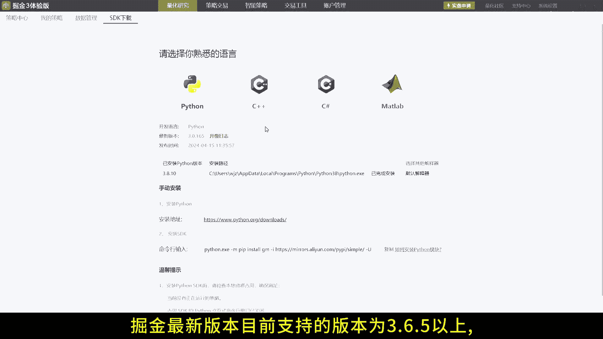
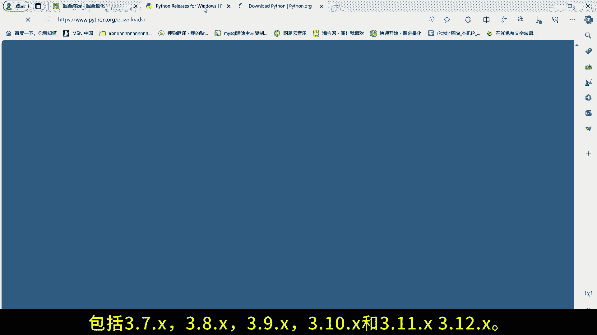
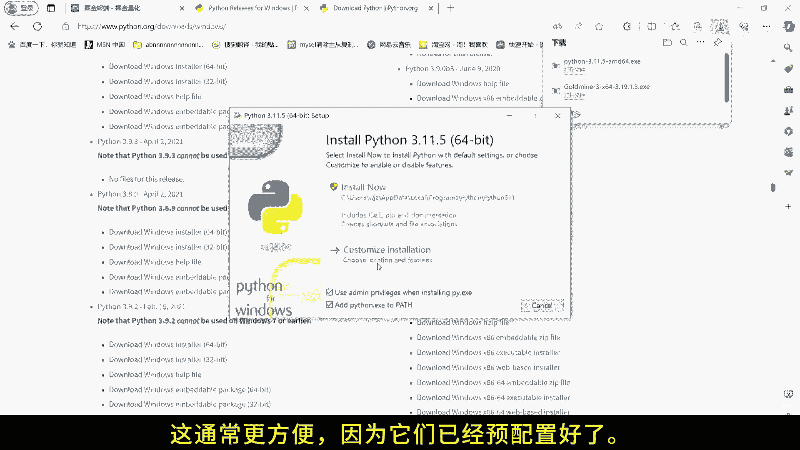
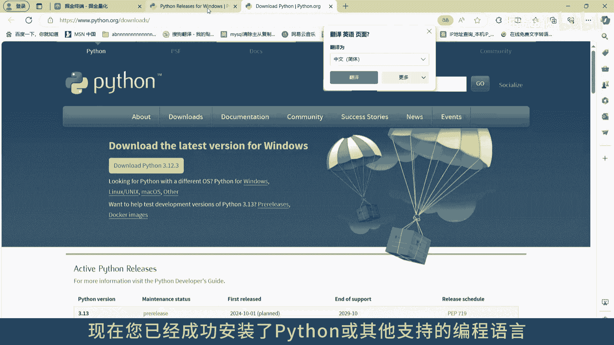
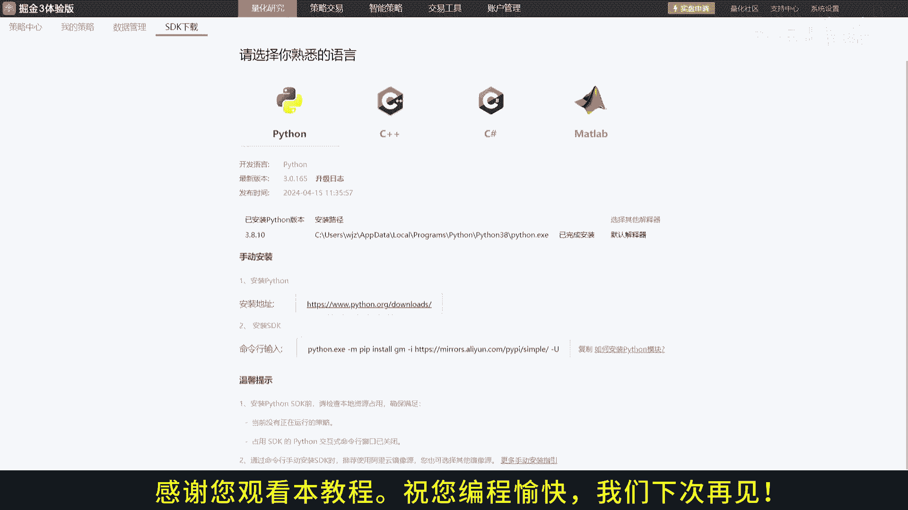

# 1.3 掘金量化终端python安装 - P1 - 掘金量化 - BV1jb421H7iV

欢迎来到我们的Python安装教程，今天我们将指导您如何在掘金平台上安装Python，以便您可以开始您的编程之旅，如果你已经安装了Python c加加C或MATLADE，可以跳过这一步。

对于使用Python的用户，请注意掘金最新版本。

目前支持的版本为3。6。5以上，包括3。7点X，3。8点X，3。9点X，3。10点X和3。11点X。

3。12点X，请在命令行或终端中检查您的Python版本，但是部分券商版本可能不支持最新Python版本，详细咨询券商客户经理或者技术支持，在Python官方网站上，选择与掘金平台兼容的版本进行下载。

下载完成后运行安装程序，并确保勾选ADD Python to path选项，以便在任何目录下使用Python，如果你有我们的资料包，也可以直接下载里面的Python安装包，这通常更方便。

因为他们已经预配置好了。

现在您已经成功安装了Python。

或其他支持的编程语言，可以在掘金平台上开始您的项目了，如果遇到任何问题，不要忘记查看官方文档或搜索帮助，感谢您观看本教程。

祝您编程愉快。