# 10.8 期权希腊字母风险对冲理论与应用 Python程序实现视频讲解 - P1 - FortuneRadio - BV1ox421y76q

好那接下来我们来啊讲解一下这个期限啊，评价公式啊，这个套利这个恒等式的一个实现，那么正如刚刚所说的，就是说我们原来的这个教材用的是64个，7000啊，分别是32，个是看涨，32是这个跌。

然后去对冲掉啊这个风险，实现这个评价公式的这种套利，这个最后呢我们也去计算的，他这32度，对春晚的一个每日的一个平均收益，以及他们的一个总的一个收益的一个情况，但是呢这个呃内容呢。

就是看起来可能会稍微比较复杂一点。

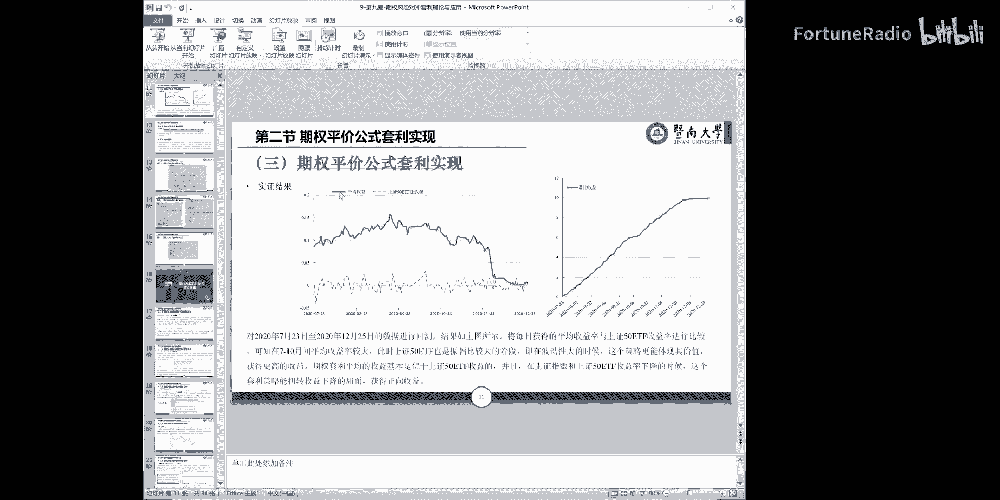

所以我们把它改了，改成是这个扣子就改成是只有一对啊，只有一对啊，就是分别是一个看涨看跌，所以这个时间出来，结果呢跟我们的教材呢就略略。

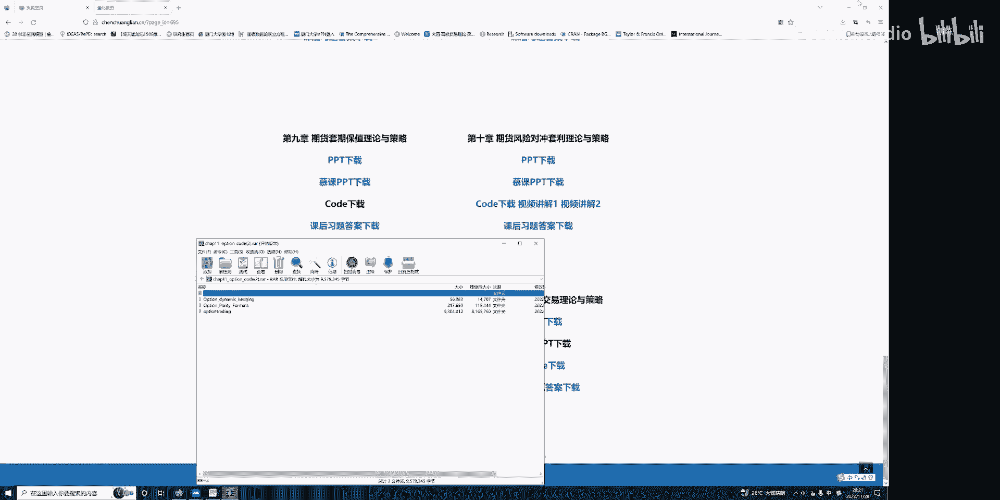

这个图呢略有区别，当然这个不要紧，就是大家能够理解就行了。

所以这些程序呢，依然可以在我们的这个主页上进行一个下载啊。

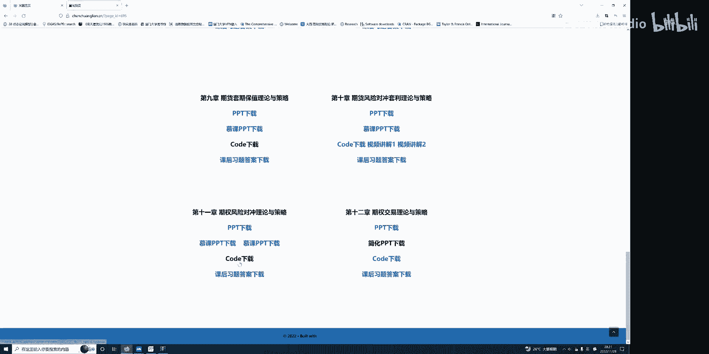

下载完我们就看一下这个有三个啊。

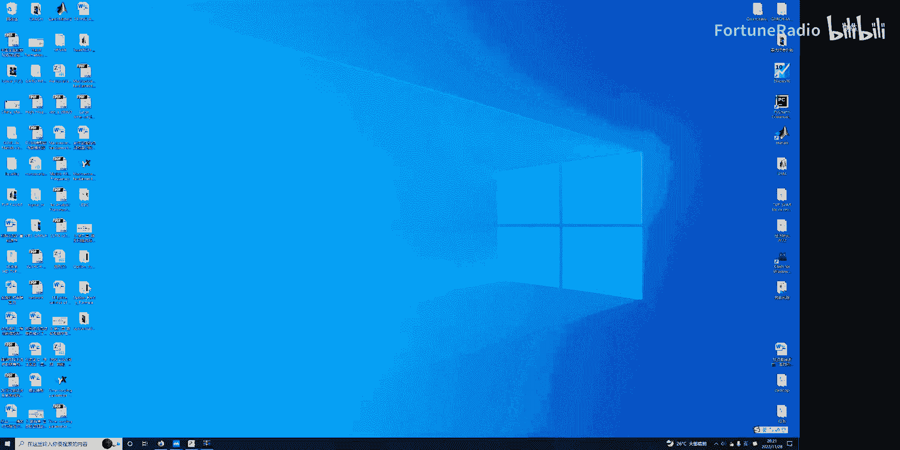

这个是7000的平价公式的一个实现，还是跟我们之前的一个操作一样，先用Python charm打开嗯，打开我们的程序布置这样的一个路径。

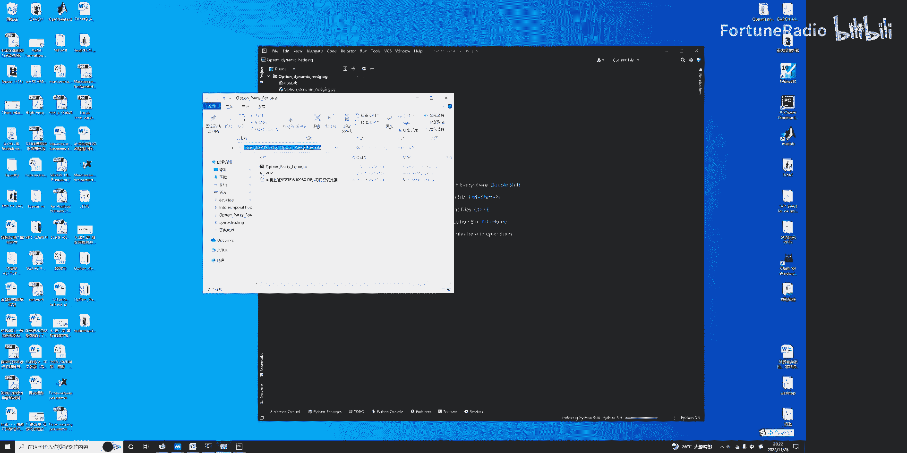

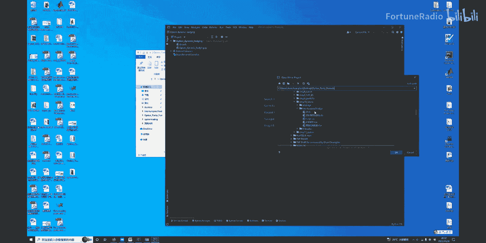

那个是。

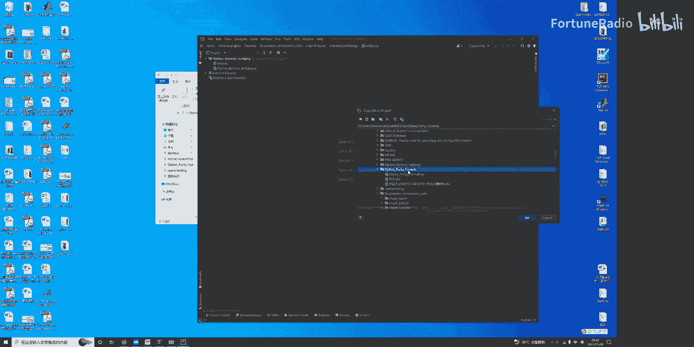

这里打开好，我们大概讲一下，这里之前呢就是说我们对这个Python的一些，我们也用的软件包把它导出，当然是基基于我们这个已经安装了这些，它的一个有关的pk，这个是读出一个数据啊，要注意的是这个啊。

比如说这个读书的路径呢，就是当然了，就是在我们的这个目录下读书，是这个PCP的ship1。

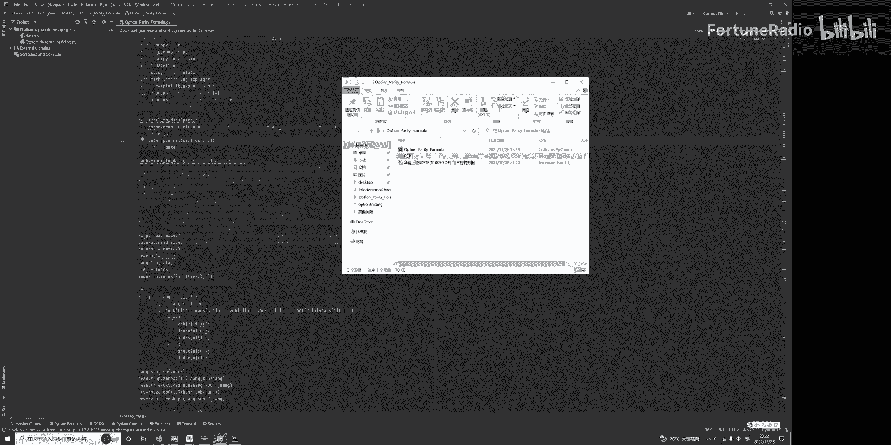

虽然大家也可以打开PCP啊，这个是我们的这个数据。

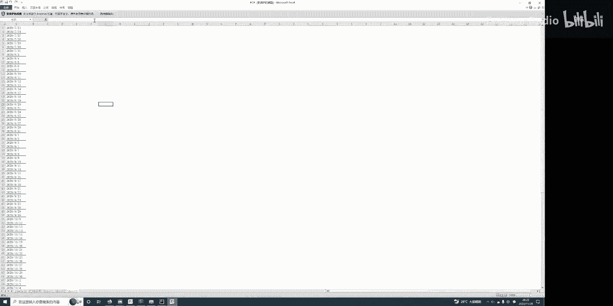

那么我们读了他的性别，记住就是下面的这个这个有些一这个名字的，我们读的是这两个，分别读这两个啊，我们来一一讲解一下，那么刚才说了，原来这里有很长64对都被我删掉了，现在只有一0%的，只有一对了。

那么首先呢这个上面这个呢就是我们的cos的，它的一个交割价格在这里，而且新天价格二这个是cos的交割价格，这个是potion的交割价格啊，第二呢是这个到期的时间，到期时间。

它这个数字实际上你转点击这里的右键，用日期的，它实际上是一个日期啊，然后我们也没有怎么去用到它在后面啊，就是我们是到期的时间，我们假定它到期的时间是一样的，因为到期的时间只有一样的，我们才可以拿来对冲。

所以这个呢啊，不要以为它是这个这么大的一个数，它是一个正期，最后一个呢就刚刚说的一，那就cos06portion，这个呢就是我们读的这个数据，知道啊，这个情况接着呢这个呢就读懂了这个sh。

注意这个shift都是这个SHA，这个呢依然是一个时间啊，就是你点击这个式子可以查看啊，它就是啊一个日期了，一个日期，这个我们先不用管它，那么这个呢啊对应的这些呢，就是我们也用到一些数据。

我们后面等会会再讲到啊，就是读读了这四个数字，接着呢读书是一个C盘，shift上是因为画图的西药了，我读书的这个啊时间啊走。

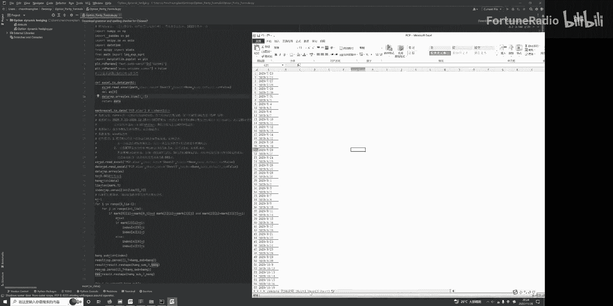

那么这这四个代表什么，我们都会在下面会说，所以这里呢就是啊读读这个数据，就是WS就是刚刚说ship2的数据，就是我们也用了啦，TC是我们的交易成本0。001了啊，这些啊一样data的长度啊。

或者转制的时候一个长度啊，那么就事实上一个是一个是一个啊多少行，一个多少列了这样的一个问题啊，这个呢就是我们要进行一个啊操作的，就是如果这个mark2这个等于一的时候呢，那么意味着这个就是零一。

这代表这是对I的这个呢我们要进行做空，对J的这个要做多，那么这个如果else就要反过来操作了，就是要对这个做空，要对I的做多，这个事实上是嗯我们的一个啊期权平价公司，可能是哪边做空，哪边做多的一个啊。

定义先定义它啊，先做一个设定，这个呢大家看这个，就是我们刚刚ship2的数据的读出来好吗。

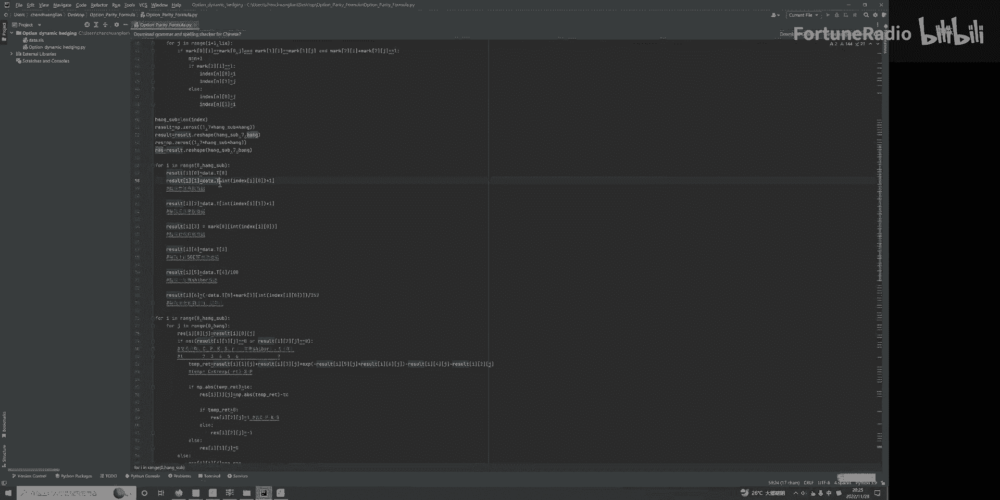

Result 0result01，因为result。

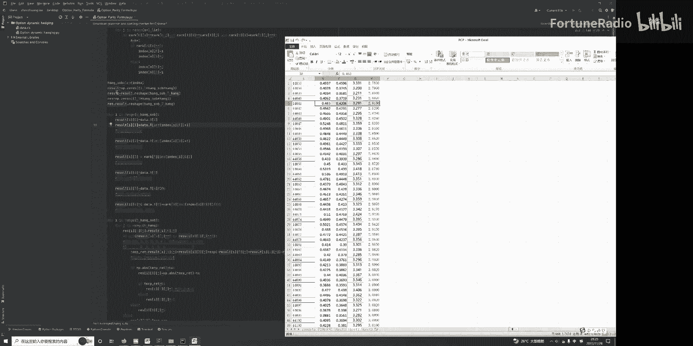

我们已经假定，它就是等于刚刚的那个DT的一个转置，注意这个点T的转置意味着是这个数据啊。

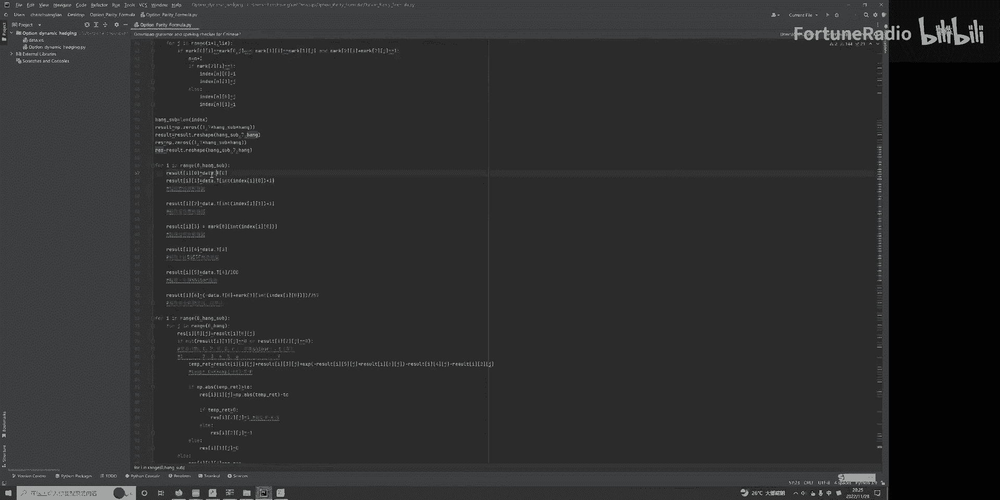

他要转过去的就是这个V，这个到时候这个数据读入进去，它是这种信息嗯，它是包括当然包括第一个，他是复制完这样子粘贴短字，哎，不好意思，要这样子来复制，你应该是这样子复制它。

然后再这样的转折过去就读入进来是意思，所以大家要知道的是，这个转至零，这个result0，他这个意思就是说第一项result i0，代表的读数是这个时间列了一呢，就是说代表是读的这一列。

这一列实际上就这一点啊，在这一行，这啊这啊这一行啊代表的是跟这一列，那么这个事实上就是我们看涨期权的数据，这个是看涨期权的一个一个一个价格，接着这个系列就是在下面这个了嘛，他C的这是看跌期限的。

所以这个是看涨，这个是看跌，你们自己要去做检验，也可以下载数据，把这个看的看跌，把它这个数据替代掉啊，这个result3这个就刚才说了，他是Mark，注意不是data了。

所以他Mark的我们刚才已经读出，Mark事实上是这个了这个了，所以Mark0就是代表的是这个啊它的行情价格，另外一个呢就是对着这个事是data是是data，所以要注意一个是说他自己的事呢。

指的应该就是我们自己的五了，要记住一个，就说我们这个啊Python软件，事实上第一行这个都记为零的，也就01234，注意这一项是零了，所以这个是啊屡教室啊，我们呃就是说我们要等于这个D3D3。

事实上就是第三个第四个了，1234就这个，所以这个呢就是我们的啊上证50ETF现货价格，也就是说我们这个期限对应的标的资产的价格，的一个走势啊，是这个低的，这个另外一个呢这个是嗯。

读是事实上就应该是五了，就是12345，就这一项，这一项呢就是我们的一年期的SHA无风险利率，无风险利率就是这一项。

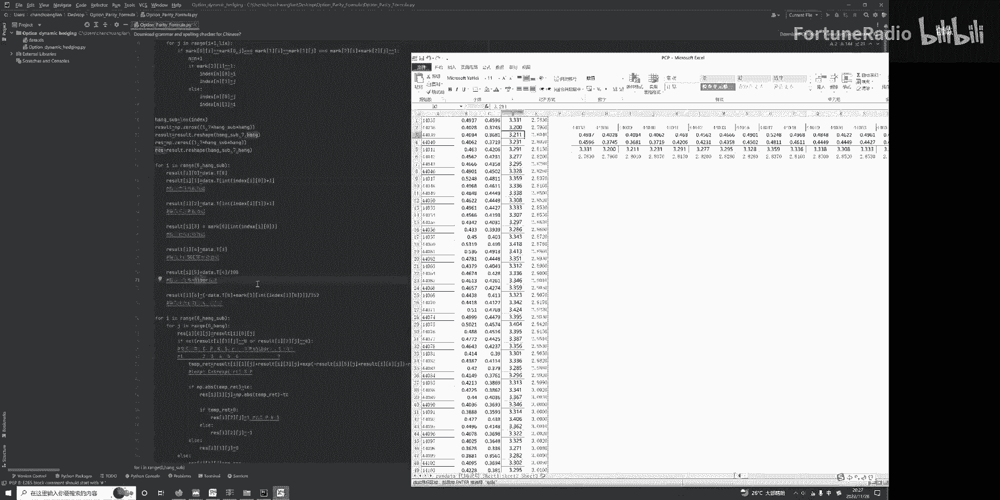

那么这个伪造六呢，就是说我们去把这个时间呢到期的时间啊，把它年化了，出一个252，就是我们说了在计算机前的时候进行定价，这个时间一定要量化，所以这个事实上是把时间进行年化，那么因此呢我们就提起这看涨。

看跌期权的一个价格，那么还有现货市场价格，就可以来利用恒等式进行套利，和恒等式的套利的tap呢事实上等于这个式子，这个式子我们就事实上就是一个PREAD的值了啊，所以我们刚刚这些数据提醒呢。

就是为了计算这些公式，所以呢C呢就是我们这里累绕一了吗，另外就是这个啊看涨期权的嘛，K呢是现货市场的价格，现货市场的价格呢我们已经知道了，事实上就是等于这个result，呃呃首先还要呃这个K交个价格。

这个K神先K再交个价格，所以K呢就是我们的刑天价格就到三了嗯，再把大量的无风险利率把它提前回来，无风险利率呢应该就是五跟六了啊，这个无风险利率我们知道这个呢是到期的时间，我们知道，所以就是等于这一项。

另外一个剪切SS就是我们现货市场的价格，就是我们的50EATF铝道式，那这个PO的价格就是我们这个不好的价格，所以这套公式呢事实上就可以算出我们的TM的，能接着呢我们要判断什么时候进行套利呢。

就是说如果这个time的绝对值大于我们的TC，TC就是我们家的费用，为什么要说abs呢，a abs取值指的是几绝对值，也就是说它大于零也行，小于零也行，我们都可以进行套利，只不过一个正的套利。

一个是反向套利，对不对，所以我们说了，只要绝对值大于一这个交易成本，我们就可以进行套利，而且套利出来的值呢的收益呢，就应该等于这个值的绝对值减去一个成本，就是不管正和负，反正都可以，只不过方向相反。

都可以获得这么多的一个套利的一个数字，然后减去成本，这个就是我们的盈利好，所以等它大于零，我们就做空做多，反着过来就反过来操作，做空做多了，就是指的这个意思，如果啊没有这种情况大于零存在。

那么就是说它是一个呃就是指的是大于零，是做多了，小于零呢，else意思是小于零嘛，就做空了，如果在else那么意味着等于零等于零，我们就不操作了嘛，不操作了，所以是指的是这样的一个意思。

那么后面这些呢就是计计算我们的啊，实际上的一个盈利情况，我们刚才说了，我们上面这里讲的是一个操作，一个操作，而且我们刚刚一开始讲的时候，我们就说了，我们假定的是这个啊合约的单位是1万份。

因为我们假定啊刚刚嗯也有强调，我们是投入了20万，20万的话，那么我们如果一张是以十块钱计算的话，那么我们就意味着啊，我们可以去持有1万份的这种期限，我们在这里已经有假定我们嗯一张的是十块钱。

那么如果我们要做1万张，那么就就可以用10万啊，用10万的这个啊盐的支出，那么对看了看多呢，分别做10万就是等于20万了啊，是这个操作，所以这里要乘以一个啊，这个呃1万份，1万份一份是十块钱。

就是10万的嘛，两这两个都超作的话，那么就看了看看跌都做的话，就是20万的一个支付，所以我们假定一个初始一个啊投资就是20万，那么我们的盈利呢，就是等于刚刚这个RT lt2LT二呢，是上是把刚我们上。

我们因为我们这里只假定了一对的，所以上跟命事实上是一样的啊，就不用管它了，我上次不是把所有的30，我我原来是三三十二队，总共64个7000，所以把它每个7000啊，六十四三十六十四个7000。

32次的这个评，评价的一个恒等式的一个套利啊，啊把它数值的做数加起来，所以我这里呢只有一对的，所以不用管它了，这两个肯定算出来是一样的啊，就是把它啊MD把它全部的一个收益啊，乘以个100÷1个初始资本。

资本的投资就代表着收益率了，这个两个人大家知道啊，这个呢我是用于计算这个累计收益率的，就是说因为我们这里算的都是，每一天套利的时候，你的盈利情况，那么我就要把每一天套利的情况呢，把它全部都加起来。

虽然我这里呢用这个累计啊，就是等于它再加上啊那个昨天的，反正我从零到HHEN就是到期结束了多少天了，所以全部把它加起来，再把它存，每次都把它存到这里，对应的这个就呃这里是一个标量了。

因为每次提起就是标量加标量了嘛，这里相当于把它存成一个变量，所以这是一个累计收收益率的一个走势了，所以累计收益率也可以算出来，所以出的资本就是累积收益率，累计收益率，所以我们可以画出累计收益率。

我起的是中括号，一代表的什么意思呢，就最后一关它值了，如果一的话代表第一关的值，一代表的最后一关的值，因为我们只要知道最后一天啊，这数据就是到一个累计收益率，累计收益率知道了之后呢，再除以一个天数。

再乘以一个252天，就相当于把它年化收益率把它算出来啊，这个呢是去计算那个最大回撤的，那最大回撤呢，就是说我们这里呢是可以把这个收益率，把它全部都取出它的一个最高值，最高值。

知道的时候再减去每一次的一个累计收益率，存称mx max啊，那么这个里面呢再把它选出的最大值，就是每次的最高值减去它的累计收益率，再选最大值，所以就是最大回撤数值，再除以他的这差了嘛，再除以零的最高值。

这个就是一个最大回撤，当然没有乘以100，所以我这里乘还100给他，就是一个最大回撤的值，然后呢我再去算这个累计收益率的标准差，standard啊，标准差知道，我们假定这个啊无风险利率。

如果是二个percent2%的话，那么意味着夏普比例就应该等于年化社会利益，当然要除以100，因为原来已经乘以100了嘛，再减去一个无风险利率，再除以标准差，就是下铺比例就可以算出来。

接下来这个是两个画图，这个是Python的实际的数据，那么我们点这个乱，再点这个就可以运行一下嗯，可以知道这个最终的一个结果啊，可以知道累计收益率是二百五十八十六%，年化收益率达到了680%。

最大回收实体项目比例是8。2，所以这个次点的盈利情况是相当好的，这个是每日的收益率的走势，这个finger to呢就是累计收益率，有时候把每日的收益率全部都加起来，把这里每期都全部叠加起来。

变成这样一走势，所以就最大回事是零了，夏普比例8。2，这是相当高的，换句话说我们这个期权的这个评价公式，可能是用它来进行套利，盈利状况是非常好的啊，这个是我们的这个策略的实现啊。

至于这个策略的一个评价呢。

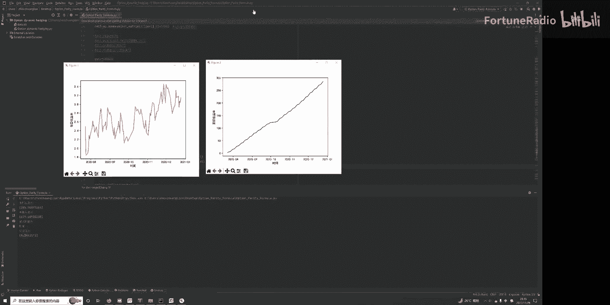

我们等会在PC上讲。