# 11.4 期权风险对冲套利理论与应用 Python程序实现视频讲解 - P1 - FortuneRadio - BV1Ay421q7aS

那么接下来呢我们给各位同学啊来讲解一下啊，我们的这个期间希腊值的这样一种啊对冲风险，对冲啊这样的一种啊功能，那么我们首先要知道的是，就刚刚的啊，这事实上就构成了三条啊联立方程了。

这里就构成了三条联立方程，那么这三条联立方程呢，事实上呢，也可以把它改写成下面的这三条方程啊，就是我们伽马1X2，伽马2XY，这个就是BC两个，这个ocean0holding指的就是我们的啊。

7000的持有量，当然我们在啊乘上一个伽马零，就是我们原来这个7000A啊，我们也可以假定他持有的数量是呃，option option0啊。

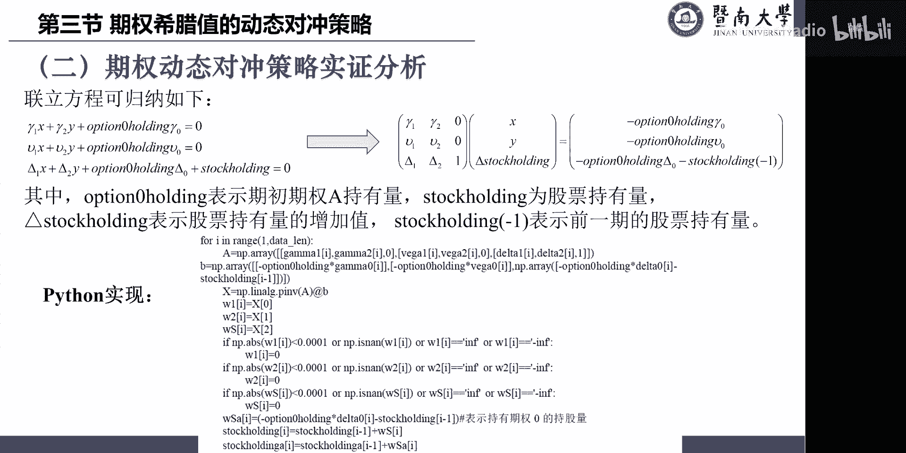

就刚刚的这个期权七加A。

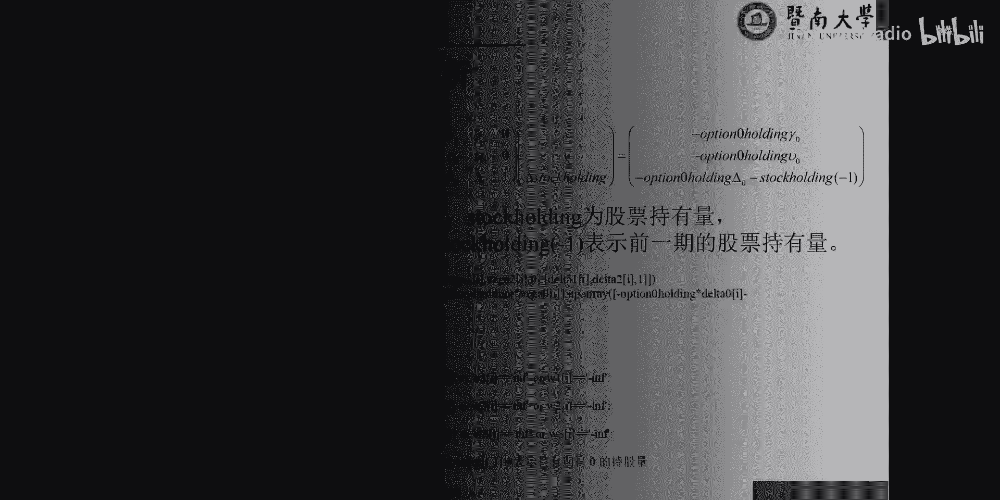

我们也不是说他持有只持有一，我们可以假定他持有是option0holding的，所以这个等于零嗯VEGA也是一样的，道理等于零，这个不用解释，那么最后一个呢是这个吊塔的，吊塔1×7间啊，B的就是X啊。

吊塔二乘以我们的期间，C的加上我们A的呢是ocean0holding，就是A的持有量是ocean0，holding乘以吊打零，那么这个呢算出来的数值呢，这个暴露再加上stop holding。

就是你股票的持有量是多，holding要等于零，刚刚才说了，就是说这两个呢，呃前面这一波呢跟后面这一波呢，肯定是方向要相反的，方向相反，那么这事实上构成的一个联立方程。

这个联立方程呢也可以改写成向量的一个形式，那么我们自己就用XY跟DA速度holding，吊塔石头holding是什么意思呢，吊塔式的holding，事实上就是等于DA动减去delta stop的一。

也就是我们这个股票持有量的变化量，股票持有量的变化量，那么这样变化的目的就在于说，我们如果知道的股票持有量的变化量，期初的股票的持有量是已知的，那么就意味着我们期末持有多少股票，是已知的啊。

这样设定呢是为了求解更好，那么由此呢我们就可以改写这个啊，伽马一伽马二零，米格一米格二零跟吊塔一塔二跟一乘以XYDA，这个啊石头holding，就股票的持有量的变化量了。

咱们的二来看一下这个式子的这一展开，就伽马1X加上伽马2Y加上这个零了，就要等于什么，这项移过去负的auction0O零乘以伽马零了，对不对，就第一条式子是我们已经知道成立了。

看第一条生成MIA1XVA2Y这个就零了，所以这两项乘出来应该等于什么，这项移过去就是要等于负的auction，0holding乘以被搞定了，看第一张那个式子。

吊塔ex1DA2Y再加上da holding应该等于什么，等于这一项移过去，他要变成一个负号，变成一个负号，负号就是负的20holding，Hoot holding。

这边呢因为要是等于STOCKHOLDING啊，减去速度holding的一了，要加上这一项，那么这边就要再减去一个holding的一，因为stop holding刚好放在这边了。

事实上我们只有把这一项移过去，这一项还留在这边，stop holding还在这边，当然这里多减了一个STOCKHOLDING的一，所以后面这边是STOCKHOLDING的一，要再减完它，所以这样的话。

我们就把这三条方程呢用向量的形式来表示，那么我们为什么做这样的一个变化呢，大家观察这个式子也可以清楚的了解到，holding基数你持有多少A7000，你是已知的这些伽马都已知的。

via已知这些值那都是一致的，OS0已知DA0，已知这一项也已知，那么我们在T7的情况，肯定知道你上一期持有多少股票了，这个肯定也是一致的，对不对，我们也可以假定零七的时候扯零嘛，那么以此类推。

下次要对冲就要拿啊，stop holding去对冲，那么在下下期就是下期去对冲，holding是量了，所以这些数字事实上都是已知的，而这些伽马你给他调查跟一肯定也一致，所以这一相当于啊。

我们这个G如果是这个记为A的话啊，这个记为X的话，这边即为B的话，那么就意味着这个已知就相当于A已知，这个已知相当于B已知，就要求X的X要求呢这个式子很容易啊，X就等于什么等于A的一乘以B就完了嘛。

A肯定是一个一个一个行列式，不等于零的数值了，所以这个呢就可以求它的力量可以求出来，所以这样的话就把X求出来，X求出来就相当于是我们的啊B7弦的持有量，知道了，C期间的持有量也知道了。

那么stop holding的变化量也知道，holding的变化量也知道，就是我们现在如果要进行对冲，这个股票应该增加持有多少，或者是减少持有多少，我们是已知的，那么相当于上一期的holding。

如果知道，就会知道我们这一期的股票的持有量是多少，所以这样我们就可以完成所有的一个求解啊，所以我们事实上要做的工作，就是要把这个呢把它什么来着，把它进行联立方程求解，每期的求解去对冲。

所以这些就是可以得到他坦白二零的值，tb20的值就可以算出我们的收益，所以接下来呢我们就来程序里面，把这刚刚这个逻辑啊。

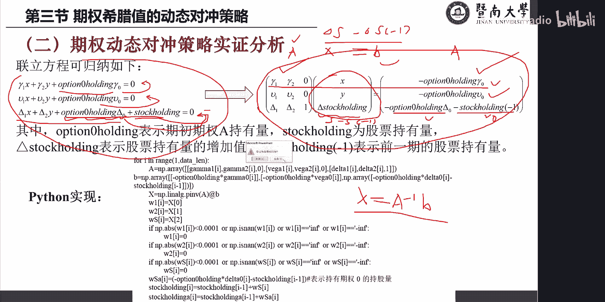

把它程序实现啊，同样的道理，我们这个啊程序呢可以在这个网站上下载。

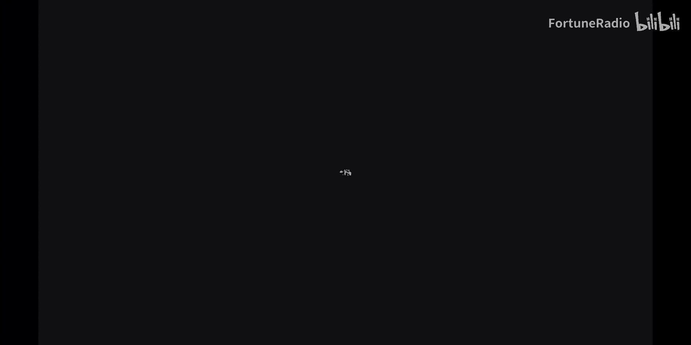

我们现在打开这个程序。

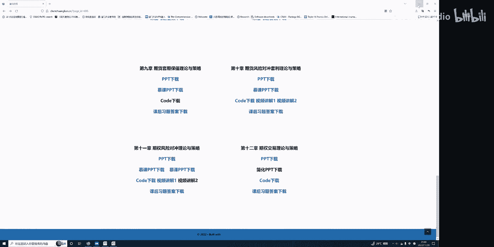

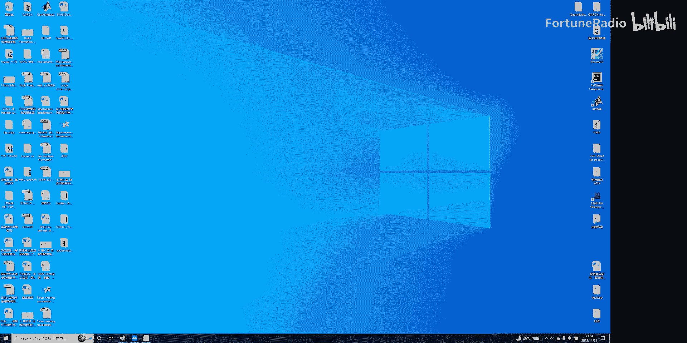

依然是打开这个啊passion trap啊，然后啊这个刚刚已经运行过了，我们现在就要open我们这个option dynamic背景，就这个数据。

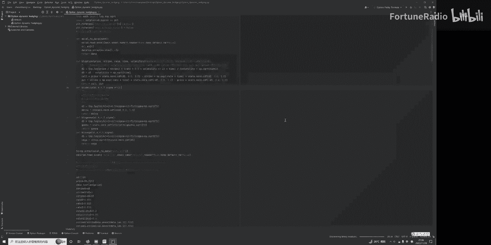

这个数据我们也可以先打开一下，看一下他的这个data，对对对。

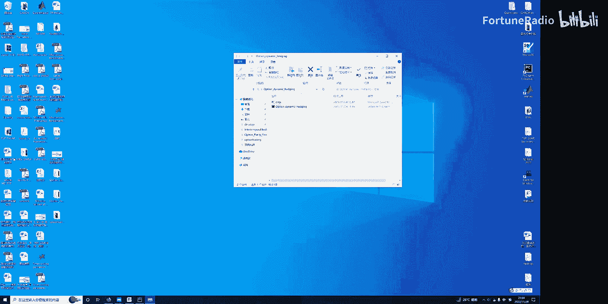

这个产，啊这个对象呢，嗯就是我们这里假定这个就是我们的呃，呃7000的价格的一个一个走势，这个呢是我们这个时间嗯，时间我们假定这个是100天，就是大概是反正三个月左右，那么这个值呢我是把它年化了。

也就是说啊100+1的意思，就使得最后期不为零，因为最后零它没办法计算，所以没其他的目的，我才加了个一，因为如果这个数值你算出来是零，他是没办法计算，那么就加了个一，再减去一。

相当于这个是到期时间的一个年化的数值，的到期时间，这个时间的到期年化数据，这是20这个它的一个呃，现货市场价格的走势吧，我看我得看一下啊，这个是现货市场价格的走势，B是现货资产价格的走势。

这个C呢啊是我们的到期时间啊，因为有同学经常会问这个什么，自己再说明一下。

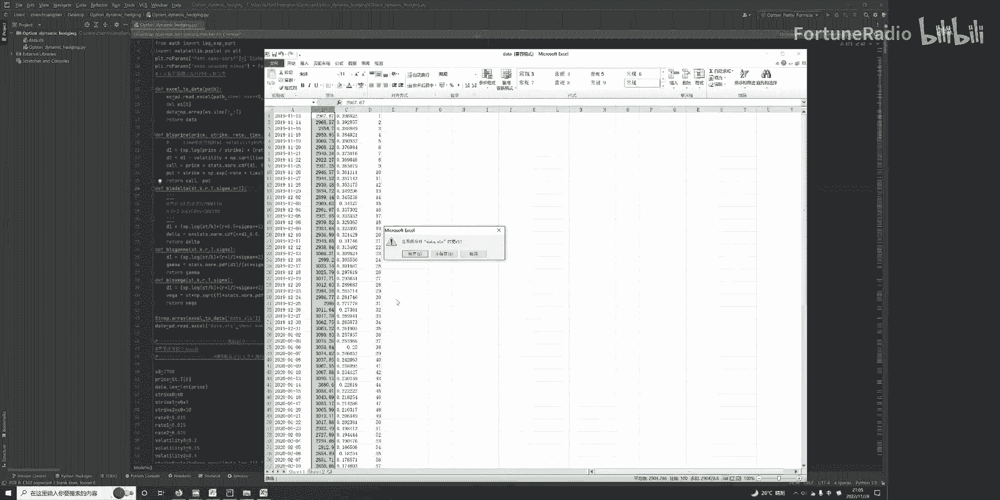

然后这个是这个啊，数据同样是这些都是导入啊，不用管它，这个是啊定义这个是一些第一的计算，第二的计算，这是cos的一个定价公式，production的定价公式啊，这个是在这这里啊。

这个你们自己去对一下它的公式，一步对这些都看得懂的啊，第一知道的时候就是吊塔的计算公式啊，我们这前面的一个呃雕塔的公式，就是我们也证明了这个公式就到这里了，这个是伽马的公式啊，就在这里。

这个是我们V改的公式，这些呢前面我们都有证明这个公式你一一对应，都知道这条式子啊，它是计算什么来着，我就说我们后面是调用了这些，我们刚刚在这里边的这些程序，去计算我们的DA伽马比卡了。

以及PROTOCOS的价格啊，那么我们现在这里是假定了我的交割价格，rip就是2700了啊，这个price等于T0T0，我们刚刚是在这里啊，它的一个第一列的数据，第一列我们刚事实上读书的时候呢。

只读入了后面的啊三列的数据。

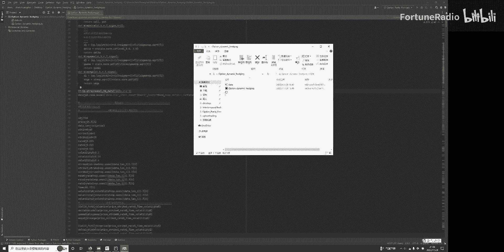

事实上这一列就没有读了，所以ST04上就看这一项，这一项就是我们的现货市场的价格。

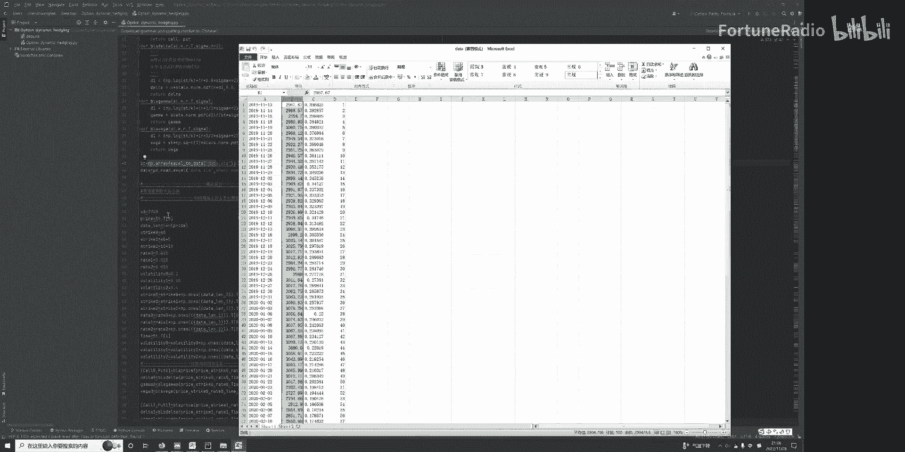

就是用plus来表示，这个是指的是数据的长度，surprise啊，就是对于期间A的twice我们假定是两千七一，然后我这里是随便假定一个啊，就是对于7000B跟C的，他的swap。

分别是在这个SWE2700里面加五根，加是也就是说对于7000B的，它的交割价格是2705，而这个7000C的交割价格是2710，然后我假定这个无风险利率，分别都是1。5个percent啊。

同时呢我也假定了啊，这个啊七件A它的波动率是20%，期间B呢是15%，期间C呢它的波动率是40%，这些呢就是这个rise，一定要承载一个once的样本的长度，为什么做这个操作呢。

因为我后面要求都是一个识别的s plus，我刚才假定它是一个标量，我现在再乘上一个一，就是比如说我们有一百一百行，再乘一个一的100行，是让它变成一个变量变量就利于我们后面的球，这些吊塔伽马。

这个也是一样，无缝的，利率也一样，乘以一个万就是111百行的数值，时间呢我们假定是T1时间。

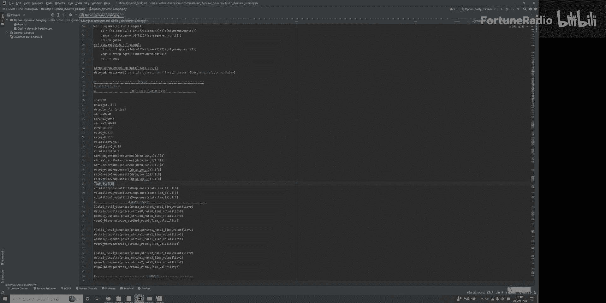

TTT4上就等于这三行TT1，就是等于这个C这个是实践啊。

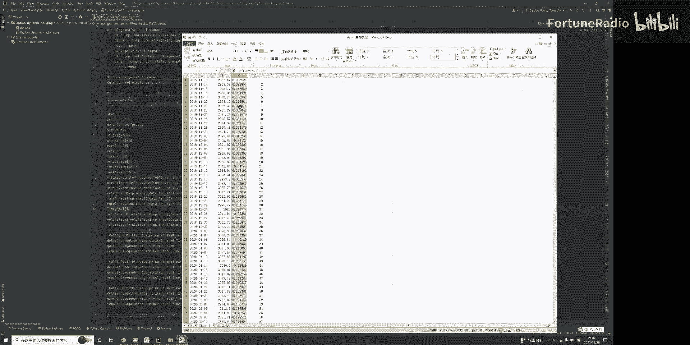

这是我们的烫到期的时间啊，衰减的这个呢是啊，波动率也是假定，就是等于刚刚这些数值都乘以一个万，让他tb因为tb0才可以计算它的数值，这个呢就是计算出cos portion的值了。

这个计算7000A的DA伽马币，7000B的cos和portion都可以啊，反正他的吊塔伽马币杆，这个是7000C的吊塔伽马币杆都把它算出来了，好那么这个呢我们假定是7100的，那一个持有量啊。

这个是7200的持有量，这个是现货的持有量，WS记住WSA表示7000的持有量，那么STOCKHOLDING是开始是零，STOCKHOLDING啊，这个变化的值也是零。

我们假定auction0是用1000来表示啊。

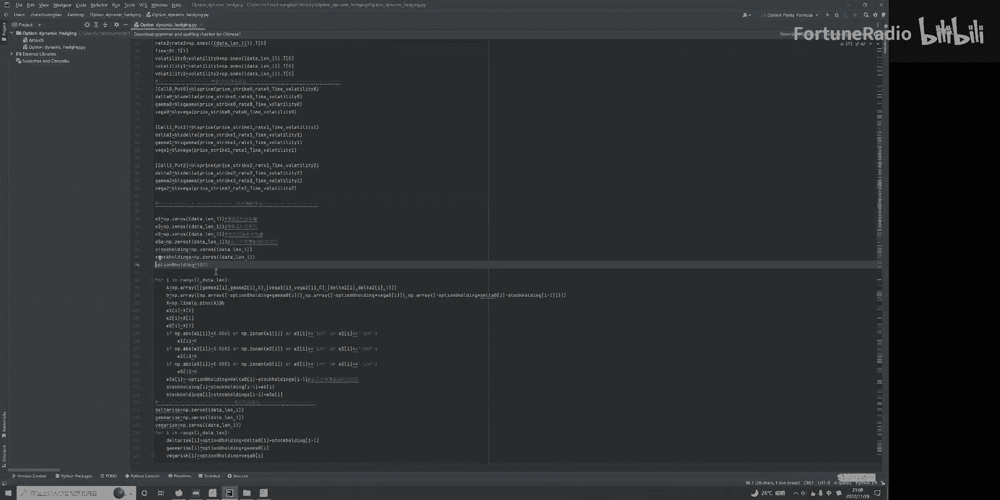

1000来表示的一个主要原因呢，就是说啊我们初始假定1000初始本金是20万，因为呃我们假定它这个相乘啊，对应100股就是1000×100股，就是要用到啊这么一个数值啊。

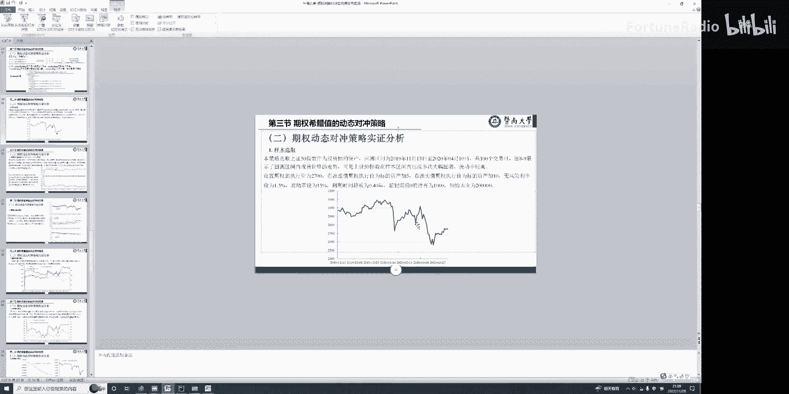

我们只做了这样的一个设定啊。

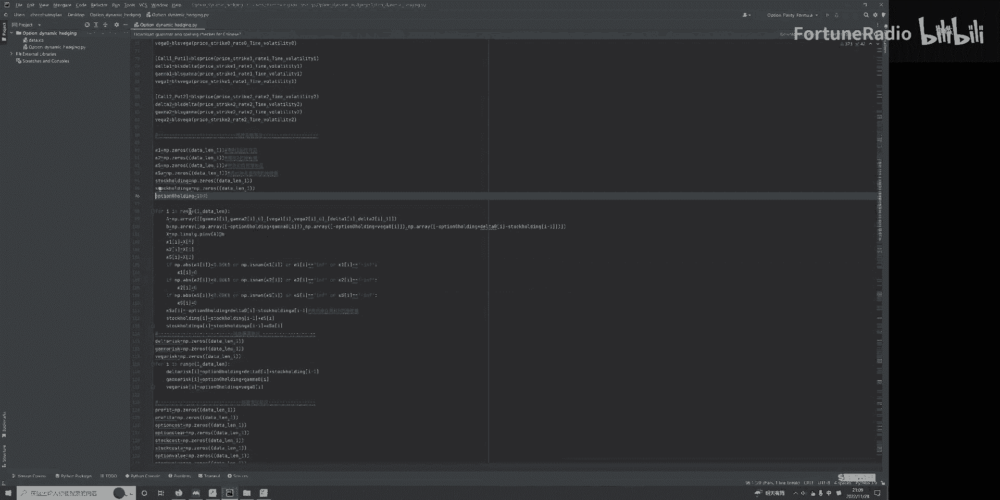

这个呢就是刚刚的求解了，这个就是我们的A了，大家可以把这个对照起来，就刚刚这里的对照起来啊。

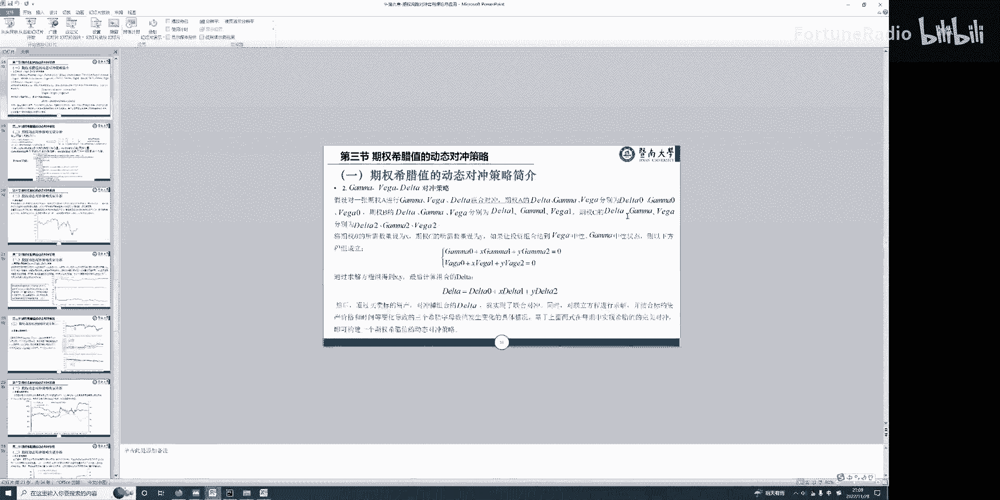

我把这个放小，大家对着这里看啊，就是嗯这几行，这里就是说我们A就是伽马一伽马二零啊，这个就移过来，记住记住这里有一个中括号，在逗号表示这是第一行，这就变成是第二行了。

就是VEGA1VEGA2跟零就第二行了，DA1DA2跟一就代表了第三行了，就这么来的，注意这里的中括号，这摆的是过行，接着就要算这个B了，B是一样的道理啊，就要这后面这一项。

那么就负的O是零乘以伽马零哎，这负的OS01个零，对不对，就是第二个，最后一项就是我们的负的ocean0乘以delta0，再减去stop coding，记住要减一，因为这里是一，是代表着上一期I。

那就代表着1~100的时间是变化变化，所以A跟B知道了，我们求xx就等于inverse a乘以一个B，这样多X求求出来，那么我们的W1呢，就是等于我们X这个X的零一，第零行嘛就是X的。

所以这个相当于是呃这个期间B的持有量，欧米伽二呢就是等于这个歪了，就是啊7200的持有量，这个代表的是我们的delta都coding的，就是这个啊股票的，我们的现货的持有量的增加量。

所以这里假定它是股票新闻生产增加量，就是这个WS就是我们调查速度获利，这些值呢就是使得它收敛的值的，那么这样的话我们就可以算多holding，是的，holding就等于我们的增加量。

再加上上一期的我们的股票的增加量，再加上上一期股票，就等于这一期的股票的这个持有量了，对不对，就是这么一个一个一个得来的，所以我们这样的股票持有量就求出来了，这个后面这些呢就是有关的这些啊计算了吧。

这个呃盈利它的一个计算的一个结果啊，这个是我报告出它的交易成本，以及这个是我计算出它的累计收益率嗯，报告出来累计收益率，再把它年化乘以个250除以样本的长度，这个是计算最大回撤。

跟刚刚的上一个策略是一样的，这个就算出它的标准差，标准差假定无风险利率，我是假定它为1。5，个不算，所以年化收益率除以100-1。5，除以标准差等于夏普比例啊，接下来这些都是画图的，我们乱一下。

看看它的有关的一个结果的一个情况，这个图呢我就画的比较多啊，所以可以看得到交易成本是多少，净收益多少，这段注意我这里是用了一个啊最后一期的纸，所以啊我是用了他的一个一，一就是表示最后一个关卡值了。

这个报告出来啊，累计收益率35。5个percent，年化收益率达到了89%，所以这个策略的盈利状况是非常好的，当然最服一次达到了96%，是比较大的，夏普比例一点一相对来说还是比较可观的。

我们看一下它这些图形的走势，这个是我们的标的资产啊，基金的标的资产的价格的一个走势图啊，这个啊二呢是代表的是我们欧米伽一，就是我们的期间B的持有量的变化，这个负值代表他是做空了啊，这是红色这个代表做空。

那么这个力是这个是期间C的持有量都是负的，代表的是做空，这个呢有正有负，这个代表的是标的资产的，对冲的是我们的一个我们的S已经说了，是DA是多holding，就是股票持有量的变化量，它的这么一个走势图。

所以这里我们可以看到我们啊，这两个器件的做空可以干掉我们的啊，伽马跟VEGA，同时这个呃现货是有做空和做工多啊，随着时间变化，它都是动态调整仓位的，都是去干掉我们的啊，现货市场呃，这吊塔的一个暴露。

接着我们看一下这些啊，吊塔的变化数值啊，这个是我们它的风险暴露的一个尺度，这个是三个，这个我们这里刚刚也假定了只做吊塔对冲啊，VEGA跟伽马不对冲的这三个值，其他值都对冲了它的一个持仓量的变化。

我们也做了比较，后面扣的有我们这里也没去在呃，讲了扣了，因为时间也有限，录制快20分钟了，我们最后来看一下最后一幅图，它的盈利情况的一个比较啊，这里呢这个例子，这个蓝色这个呢事实上就是我们做了啊。

就是把伽马via都干掉，把钓台干掉的时候，它的一个盈利情况，这个盈利情况明显看都是大于零，效果也比较好啊，这个绿色这个呢就是我们只做吊塔对冲，也就是说我们后面还有一段code，我就刚刚比较感觉没讲。

我儿子对冲的最后一条式子，也就是伽马和皮卡多，风险暴露，我不管他，但是我们只把吊塔对冲掉，它的盈利情况呢就比较弱一点，还有一段时间是亏损，后期呢也转为正，但是挣的这个数值比较小啊。

如果我们只有这个7000持有，那就风险暴露了之后，这样就没有盈利了，当然有风险暴露了，所以我们也可以发现，如果我们进行交谈，伽马都把它啊DA伽马via都对冲掉，这盈利情况当然会更好。

当然这是我们模型模拟的结果，我们后面呢还事实上还进一步去模拟的时候，发现，如果我们这个啊伽马不对冲，只对冲了吊塔跟对冲了VEGA，它的盈利状况有可能还比伽马更好，一个就取决于对冲肝满。

可能还要有一定的费用，如果费用太高，那么对冲效果就不会太好，另外还有一个说明，就是说我们这里的波动力量采用的是常系数的，就是假定他这个是不随时间变化变化的，事实上这个波动率啊也可能随时间变化变化。

所以对冲效果呢是还可以通过进一步的去验证，去对比，去比较哪一个系列会更好，这个呢大概是这个次点的一个实现，接下来我们等会再来讲一讲。

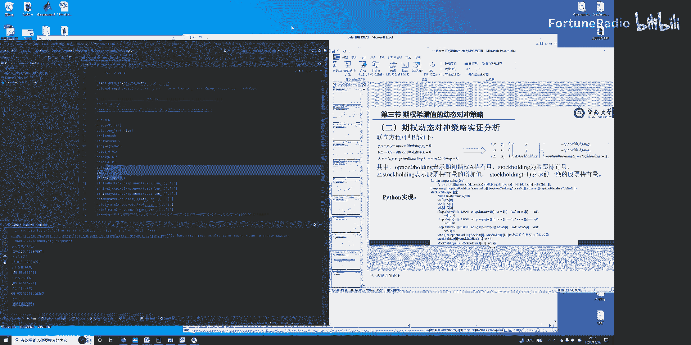