# 14天拿下Python金融量化，股票分析、数据清洗，可视化 - P13：01 爬虫环境配置与简单爬取程序实现 - 川哥puls - BV1zkSgYZE54

各位同学大家好，今天我们一起来学习爬虫的环境配置，与简单爬取程序的实践，那么在这一章里面，我们会分成四个部分为大家讲解，第一部分爬虫的网络基础，第二部分我们会介绍爬虫处理过程中间。

最常用的request模块，第三个我们在爬虫爬取过程中间，我们要涉及到的一个登录信息处理啊，比如说用户名的输入，密码的输入啊，验证的处理，第四部分啊我们介绍啊ul lab这个模块。

那么这个模块同request模块也是一样，在我们的这个爬取过程中间，经常使用到的Python一个模块，好话不多说，我们进入到今天的啊网络基础，那么大家可以看到这个副标题，上面写的比较清楚啊。

我们会介绍网址的构成，那什么是网址，我们如何去通过网址访问网页，第二个什么是这个翻页机制，我们怎么样去模拟啊，去看这个网页的设置，怎么从第一页到第二页到下一页好，第三个啊。

我们需要去带领大家使用我们的浏览器工具，去查看网页的源代码结构，第四个啊，我们要去理解网页的请求过程，我们如何在网页上进行提交一个请求，那么网站处理后，如何把这个请求处理的结果反馈给我们。

那么它实际上是一个request和response的过程，好我们进入到详细的内容，第一个，那什么是网址和网页啊，网址很简单，通常是指我们英特尔网上的网页地址，那例如比如说我们的网站，我们打开可以看一下。

好我们输入在我们的浏览器中间，输入我们的网址啊，大家可以看到这是我们的网站华尔街学堂。

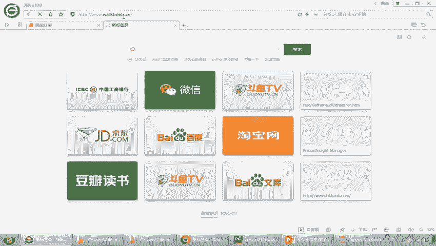

那么输入网址以后，他会把你定位到我们的一个这个网站，那中间我们的网站，那么网址就像是一个它的地址对吧，就像是我们去访问某个嗯，这个朋友我们告诉他你家住在哪里，我们告诉他哦，我们家住在什么地方，什么地方。

那么其实这个就起到这个作用，那么什么是网页呢，网页其实是展现在我们面前的这样的一个页面，那么这个页面实际上是经过我们的开发人员，进行开发展示对吧，进行设计，然后显示在大家面前啊。

是这种通过我们视觉的进行交互，那网页可以是存放在世界任何一个角落的，服务器上面，那这个服务器呢也必须要连入我们的互联网，那实际上大家也知道，互联网实际上是美国这个军方的一个产物对吧。

他从这个本身的一个内部网络，走到最后的一个全球一个互联网络，那么这里提到了一个嗯，这个地址呢我们往往也提到叫叫URL，叫uniform resource locator，什么意思呢。

就是说它实际上来识别来识别，就是相当于是我们家的快递给你寄快递，他告诉我地址对吧，这个地址就是用来唯一识别你家的地址的，那你如果去买个快递或者是买一个嗯，发一个这个快递给对方，如果对方不告诉地址。

我没办法去进行交互，对吧啊，这个输入这个地址以后，我们就可以快速的啊去访问这个网站的内容啊，网站内容，那大家如果注意到了网站内容，会说哎这个网站内容是如何来编写的对吧，如何来编写。

那么实际上采用了我们的HTML格式啊，HTML是我们在这个网站处理过程中间，一种大家约定俗成的一种格式，那在网页进行浏览器解析的时候呢，他把这个我们的X点XTML的格式，展现成我们可以可视化的内容。

所以啊，这就是我们在平常日常中使用到的网站和网，网页啊，那么对于网址的构成，大家可以看它有什么特点呢，啊我们看到这个基础上面对吧，有HTTP然冒号斜杠斜杠wall street点CN是吧。

那这个地方实际上它有一定约定俗成的，比如说我们再去填这个快递地址的时候，某某省某某市某某街某某区对吧，邮政编码，电话号码，人名是吧，那么URL在这里的组成主要包括这样几个部分，第一个模式。

第二个服务器的地址，IP地址，端口路径参数等等，那么什么是模式呢，这个我们刚才看到了HTTP协议，那么同除了这以外，我们还有HTTPS，这个S是SSL的一个缩写，就是一个安全的啊，通讯协议。

一般大家如果有印象的话，我们去访问这些银行，访问一些这个金融机构的网站，多用于这个SSS协议好，第二个呢就是我们的服务器的主机体制，那么这个可以是我们的域名，也可以是我们的主机名或者IP地址。

同理大家可以看到我们的这个域名，那就说哎大家如果还是一样，以快递为这个简单的一个例子来说，大家在这个淘宝上面对吧，你可能有多个快递，你可以和他做一些标记，比如说这个是家庭的地址对吧。

这个是我工作单位的地址，这个这个是我爸妈的地址，对父母的地址也可能给父母买些东西对吧，那么这个域名也是一样，域名实际上是啊，一个更便于我们记忆的一个地址，那么它通过我们的DNS服务器。

把这个地址呢转化成我们的域名啊，转化成把域名转化成我们的IP地址啊，那第三个是端口，那什么端口呢，比如说我们这个服务器啊，就像说你去给你家去快递，你一定要说到你们家是小区的几栋几号几对吧。

你不能说哎我们家就是这个小区A栋啊，那可能找不到你，所以一定要写的很清楚，所以这个地方呢就用这个端口来标示，服务器的端口，来标识这个呃，应用程序在服务器上的服务端口好，第四个路径。

那路径一般说啊是指出了一个相对路径，在我们服务器上存储的一个地址好，第五个就是我们的这个参数，那这个参数大家可以举个例子，我们来看一下，比如说我们点到这个金融学院里面啊，大家可以看到后面就有是吧。

这是他的地址吧，刚才说相对地址在cos下面的啊，explode a下面对吧，那比如说我们现在想要去看一个，比如说点个登录，大家看下这个点login后面有问号，看到没有，什么go to cos对吧。

那么什么意思呢，就是说这个地方传入的是一部分的参数啊，通过问号连接在这个路径后面啊，所以他给到的作用就是，帮我们跟网站进行交互交互，我相信通过这样一个简单的一个介绍。

大家应该啊对身边或者是日常经常用到的，这个网址有了一个更啊深入的认识啊，分数，那么为什么要介绍网址，因为网址是我们爬取的对象对吧，我们一定是在这个爬取过程中间，使用这个网址啊，针对某个网站进行爬取。

所以这是第一步好，第二步，什么叫做分页呢，啊这里还是一样，以我们这里为例，比如说我们点到学习中心好，大家看到这里有我们很多，这个金融学阶学堂的这个课程，那么诶如果我是一个用户。

你看哎第一页是不是看完以后，诶发现嗯还有下一页，我点一下下一页对吧，那么问题来了，就是说如果我说我要把每一页都看到，是不是就像是一个一页点下去啊对吧，这就是在翻页，那么一个爬虫，我刚才说了。

爬虫最主要的作用是什么，代替人的啊，人的行为或代替人去访问这个网站，那实际上这个爬虫要做的是不是，从第一页往后便利呀，所以爬虫一定要能够去模拟这个翻页的过程，这个大家可以理解吧，应该没问题对吧。

应该比较好理解，那比如说我们翻到最后一页，那大家可以看到这里啊，一共有八页对吧好，那回到我们的这个地方啊。

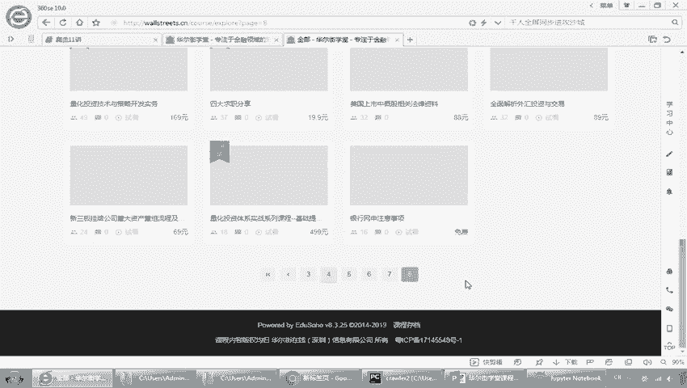

常见的翻页呢，就是帮助我们可以爬取所有网站的一些，关键信息啊，只要能处理好这个分，这个翻页呢，就能够保证我们爬取和收取处理的完整性。

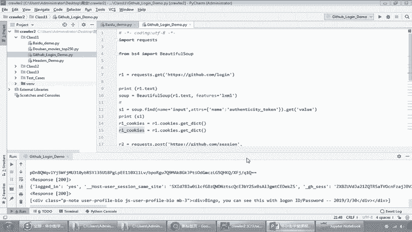

一般呢就是有几种情况，一种是呃已知记录数对吧，比如说我们一共有100页，100页，那么每一页有20条记录，那么他就是乘积，另外一个就是我们已知这个总数，它会在上面显示对吧，第三个就是一种动态分页。

动态分页数我没有显示总数对吧，然后呢你得自己便利啊，还有一种是滚动分页，这个呢我们在后面的这个啊处理中间，我们会涉及到这个，大家呢在嗯这个区分证证是可以去看一下的。

好那这个地方呢就是说到了HTML的源码的结构啊，嗯这个缩写是什么呢，就是我们的超文本标记语言。

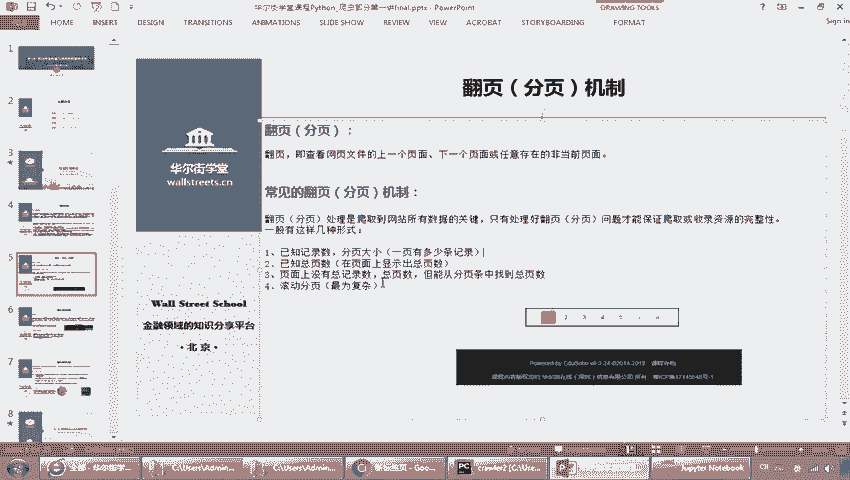

这个应该大家应该有接触过，那我们怎么去看呢，啊很简单啊，我带大家来看一下这个啊，比如说我们点到我们的首页好，我们在上面点的反件，大家可以看到这里有呢就是view page source啊，就是看源码。

大家可以看看看源码对吧啊，这个看出来你看这个标题就是啊x t ml对吧，x t ml啊，所以这个就是我们显示的网页的源码信息啊，源码信息，那在这个地方呢，呃我们可能这个课程上面不会过多的去讲。

这个HTML，我希望大家呢啊有一定的了解，所以我列到这里有一个HTML的教程给大家看一下，这个人大家可以花一点时间下去，快速的来看一下啊，这个在DP3school上面，然后这里面呢就是我们XPL简介。

比如说kl是什么呀对吧，那大家可以去试一下啊，比如什么是XMLXL的标签对吧，它是一种超文本的这个标记语言，那么它的标记是什么，里面有很多的标记啊，这个呢我们在这个课上面就是啊简单提一下啊。

这里面就是说啊你要去理解里面基本的头部呀，主体呀啊文字啊，动画这些怎么样去通过标签来表达的啊，我要求大家呢，就是至少要知道如何去查看这个源代码啊，通过去点击返件啊，等于往下去查看源代码。

这个啊选项去能够看到当前页面的源代码，那么稍后呢，我们还会介绍如何通过更复杂的功能来查看，这个源代码的功能啊，看的功能，那么可能比这个就直接去反件点击，要更迅速一些啊，大家可以看到啊。

啊这是我们的这门课啊，好啊，第三个啊，网页请求过程，那么这个的我们一定要理解啊，爬虫的本质是什么。

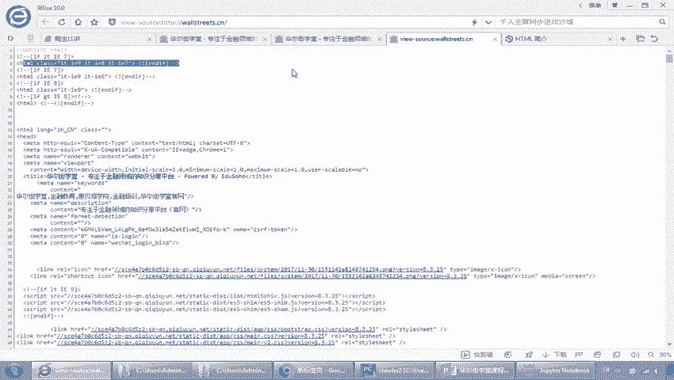

爬虫的本质呢，实际上是模拟我们浏览器访问服务器，这个大家应该可以理解吧，我们刚刚在用的是什么浏览器是吧，有浏览器我们在这里点到的任何一个请求，是不是都提交到我们的服务器啊，提到我们服务器。

所以我们必须了解浏览器和服务器的交互，以及登录实现的过程，只有了解了这个我们才知道哦，我这个派出去的爬虫到底做了什么事情，他要啊在后台对吧啊。

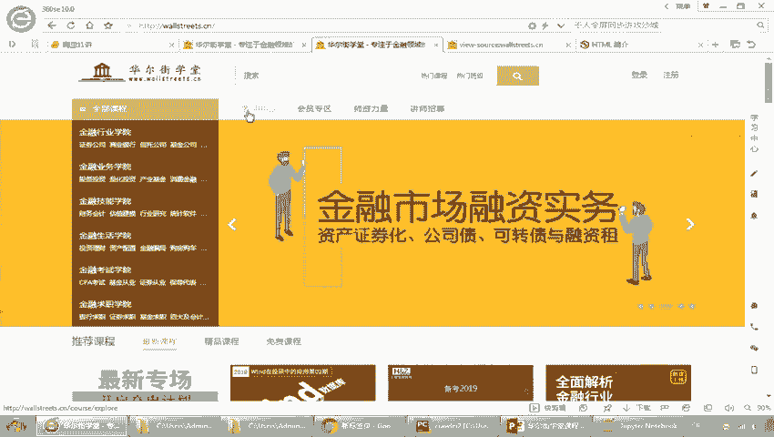

怎么样去处理才能让我的服务器啊，认为我是一个真的爬虫啊，是一个真正的像用户一样过来的一个爬虫，接受我的请求，因为现在大家也知道有很多的反扒机制，就是哎我不让你爬，我对吧，因为你爬我的话。

对我造成你不是有效的行为，也不是有效的人的访问，你是一种机器行为啊，你可能断层对我的一些伤害啊，或者性能影响好，那么回到我们的网页请求过程，大家来一起看一下，比如说我们怎么访问网页。

第一个是不是就是直接在我们这里去输入这个，U i l，刚刚我们说的这个啊3W的或者是这个HTTP的，是不是这个URL啊，或者你可以去输入IP地址啊，因为我们可以把这个我们的域名解析成什么啊。

IP地址是吧，通过DNS然后点击链接啊，他就向这个我们的web服务器发出了一个HTTP请求，注意这个一定要记住啊，叫HTTP request啊，虽然大家看这个图呢，比如说我们现在一个google对吧。

举个例子，我们现在要去访问我们的这个W3school对吧，你看我是不是把地址贴进去后，他就会跳转过去对吧，实际上它我们提交的是对这个网址的访问，返回的是什么，返回的是一个HTTI的response。

这个大家应该没问题吧，所以这两步是最核心的啊，其实本质就是提交request，返回response啊，只是在request中间我们要提要想到这个request，我们到底要提交什么request给它。

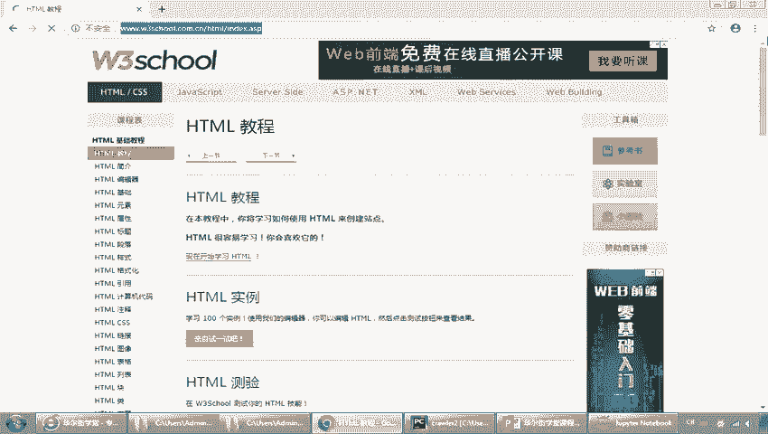

request中包含哪些内容呢，啊包括哪些点，等一下我会提到我们如何来构造一个啊，像人行为一样的request，那么返回response也很简单，response返回的一定是什么呀。

是不是HTML代码呀，那么我们通过这个浏览器把它解析成图像图形，所以response的解析，就是我们对返回结果的处理，所以在这里我稍微多花点时间，我们强调一下这个过程，其实看起来很简单对吧。

一个request过去，一个response回来，但是呢我们在这里处理的时候诶，如何提交有效有效的啊，能够处理的被处理的request，如何去从respond中解析出我要的内容，你返回时一大堆代码。

各种各样的信息，那么什么是我们想要的，这个可能我们得去处理一下好，第三个大家可以看到浏览器解析引擎，把这个什么进行内容进行排版，就response回来多出一些代码对吧，我们进行排版。

最后呢啊外部应用在这个过程中间啊，以响应的形式来发送这个消息结构啊，啊这是一个最简单的，大家如果去下去看，那我们这里的网页请求可能分成很多步啊，有七步的，有十步的等等等等，但是我们想跟大家讲的是。

你一定要掌握request和response这一对啊，一对这个行为好，那么这里也提到了，刚才也提到这个HTTP是吧，超文本传输协议啊，目的是保证什么呀，客户机也是我们的什么呀。

啊请求机器和服务器间通讯啊，它的工作方式是客户具体时间请求应答的协议，就request response，Request response，我们后面几乎所有的这个设计，都是按照这两个维度来的。

所以大家可以看代码，中间会会在后面的demo中间会看到，我们怎么样去处理这个request，怎么样去处理这个response，好，那么第一个部分，我们花了大概啊十来分钟去讲解了，我们爬虫的网络背景。

我希望大家能够理解爬虫在做什么事情啊，简单说它的本质就是模拟用户，模拟人类去做这种啊，向网站提交请求，然后网站返回请这个响应以后，我们进行处理的过程，这个当大家都没问题了。

那么为了让大家迅速的有一个直观的认识，我们马上来构建一个简单的网络爬虫，来爬取百度首页，在这个之前呢，我们先要介绍一下我们的环境好，那么这个是什么，这个是我们的request包啊，我们在前面呢。

我相信同学们使用的是这个anaconda的包，对吧啊，或者安娜斯阿康纳这个环境，那么我们这里也装了这个anaconda的环境，那么UNACCOUNT环境中间我们应该是有啊，我们啊开启一下我们的命令行好。

大家可以看到呢，这个我们will一下啊啊这个Python啊，大家看到我们这里的用到的也是anaconda的，这样的一个环境，那么在anaconda环境中间，我们可以使用命令行。

也可以使用我们的JUPITER啊，我们可以使用这个JUPITER，大家看我们已经开到这里了对吧，可以使用JUPA，那么我们也会去，因为开发这种比较复杂的程序，我们建议大家有一个好的这个IDE。

我们就说叫集成开发环境，那么这里呢，我们就推荐大家使用这个py charm，那就推荐大家使用这个py charm，叫py charm，可以去哪里下载呢，这个呃很简单，大家可以去搜索就可以了。

那比如说百度啊啊，这个P项目呢我们也分为试试这个，啊就是有这种社区版，那免费版本啊，大家看他是一个什么啊，ide for professional developer啊。

所以我们可以去到这里去下载这个工具，那么下载完这个工具以后啊，我切回来啊，下载工具以后，我们可以很容易的去设置环境，比如说我们在这里去啊，新建一个project，大家举个例方。

你看我在这里新建一个project，好比如说我们是11讲的话，我们写个11，大家注意看，点开这个啊，点开这个这个呢呃有一个叫environment的设置，那这个project哎，Interpreter。

Ininterpreter，大家知道是解释器是吧，我们的Python是一种解释语言，不是编译性语言嘛对吧，边执行边解释，那么它的这个需要它的解释器，那么这里呢我们可以选择。

比如说你看直接选中这个安娜康纳就可以了，大家看到没有，你可以去选中这个阿拉康纳，如果是你装这个把他选好就可以了啊，或者是你自己去这个生成一些这个呃，Worship environment。

这个取决于大家的啊，这个随着大家对这个py charm的使用，可能会有理解，如果大家选择的是这个按照CONDA的这个环境，你就选择CONDA就可以了啊，CORA后点着create，那么创建就完成了。

那么在这个项目下面呢，比如说大家看到我建的这个项目下面有啊，class11class十二十三对吧，每个下面有自己的代码啊，这个有什么好处呢，就便于我们进行这个快捷开发啊，可以补全代码呀，提示呀。

debug等等等等啊，所以这个是我们的环境的设置，如果大家啊使用的是其他的环境啊，比如说我们没有没有说装过这个安康达，只有Python，那么对于这个request的包，我们需要自己安装，那么很简单。

大家知道安装这个包，在Python中间就是用pip对吧啊，比如说我们pip install request啊，大家可以看一下啊，我们点一下，那么这里呢它会提示我，大家可以看到我提示什么。

因为我装过anaconda是吧，装好ALAN看到，所以它不再需要，他说你已经装好了啊，我相信同学们如果用到这个环境的话，我们也是啊，也是直接就可以看到装安装成功的，或者是安装已经满足了这个提示。

那么如果说是没有，那么你pip install request以后会自动安装这个包啊，安装这个包好，那么这个request的功能是干嘛，它是自动爬取啊，你在听名字也可以听出来对吧。

它就是一种什么请求包对吧，请求包嗯，那么这里提到它跟我们uri lab的一个对比啊，个类比，它实际上本身比这个ur lab更方便啊，更方便是我们Python实现的最简易用的HTML库，刚才说了。

HTML是一种这个通讯协议是吧，而是建议爬虫使用的request qu，那默认装好这个以后呢，注意我们普通版本的Python Python是没有这个的，那么你需要单独，但是如果你装了阿拉康纳是有的啊。

不管有没有，大家很简单啊，直接的去啊，用pip install request去装，装完了以后呢，我们很简单登录到Python啊，登录Python以后，这里显示的Python的这个版本号。

我们去查看一下，装中安装是不成功，我们用的import requests，大家看，如果说我们敲入这个云reports request以后，没有任何的这个报错，那比如说我现在创个request2。

大家看就会报错，就是NO module named request2，证明我们没有安装好，但是如果我们装了这个啊，import request也没有没任何的问题，那证明我们这个是成功的，安装好了好。

成功安装好了以后，那么这个就是环境啊，我再强调一下，就是我们这里呢在教学过程中间啊，我们会用这个JUPITER，就是大家说的一步步，这个工具呢比较适合大家一步步去分解，那也会使用到命令行。

同时呢也会使用到py charm这几个工具啊，本质上是一样的，它都是解释器啊，都是背后都是我们的Python的解释器。

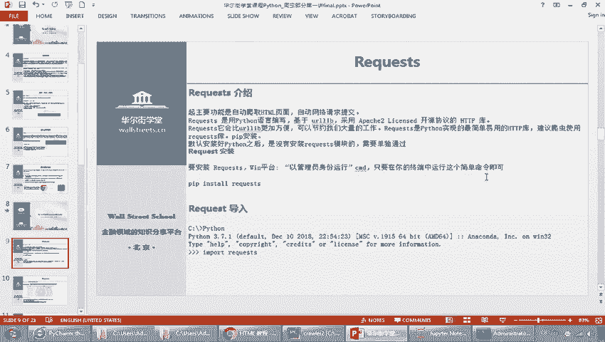

只是说一个是这个web版本，就是我们这的网页版本，那它更适合于一行行的去调试代码。

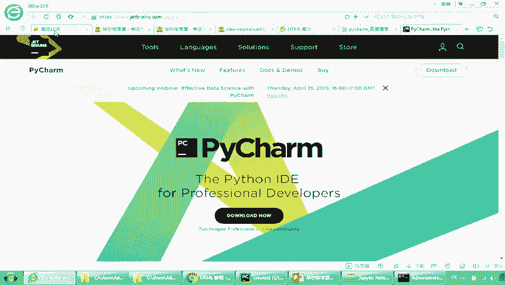

另外一个是图这个命令行，那么更适合我们这个比较常常命令行啊，或者是跑脚本的时候使用，那这个PYHRM说它是一个集成开发环境，那更适合我们去开发啊，去调试啊，去这个可视化的去嗯效率比较高的去开发代码。

好啊，讲到这里呢，我们就啊对request有了个基本了解啊，它是一个Python包啊，是Python最流行的包是Python，中间用来实现这个HTTP的包啊，它能够这个啊做啊最常见的这个爬虫的处理好。

那我们来看一下我们回到我们的主题，我们如何去去爬取一个啊百度页面，那么在爬取之前，我们要对request有一个基本的了解，这个呢是啊request的一个库文件啊，我们来打开给大家看一下。

好大家看到这个是在我们的这个Python的request点ARG，就是说这个是他的什么呀，啊官方文档所在的地方，那么里面有个quick star就告诉你怎么样去安装啊，怎么去安装。

那么我们切回这个PPT看一看呢，里面包括了几种方法啊，大家看这request下面有有request的方法啊，构造一个请求，get就是渠道，那渠道好，这个地方提到了get跟post啊。

大家看到get和post，那么什么是get和post呢，这个其实是我们刚才提到的，我们在往这个服务器刚提到了这个啊，浏览器对吧，提到服务器，那么再从浏览器向服务器进行发起请求的时候，其实有两种。

比如说我们现在要把一个信息交到对方，我们是不是有两种啊，就像我们开门一样的，大家可以看到啊啊一个是什么推对吧，就pull，一个是什么push就是拉对吧，pull就拉就是一个是推，一个是拉。

那么这个其实我们跟这里有很相似啊，这里我们提到的两种方式，一个叫做get，一个叫做post啊，get是什么，get主要是从指定的资源请求，那我们一般表现为我们用一些冒这个引号啊，呃呃不好意思。

用这个问号去啊，把它分隔开，告诉对方，我们需要哪些这个处理，另外一个是什么post，post是提交的意思啊，一个是请求，一个是提交啊，所以这个跳呢是有一定区别的啊，一定区别的这一块我不展开多讲。

这里呢呃大家如果有兴趣，可以去看一下我这里的链接啊，这两个主要是我们跟服务器交互的不同，那有同学问，那既然我知道不同，我什么时候用，绝大多数情况在不涉及到敏感信息的时候，我们一般用的get。

那比如说我们要提交请求，比如说一个表单，我们要提交，我们填完一个表单以后，我们要点一个提交，或者我们在传递时候传递一些比如说敏感信息，用户名啊，密码呀等等对吧，你不能把密码写在这个网网址上面去传输对吧。

所以get和post基本是这两种情况下啊，比较常见，当然还有一些其他的因素，这个大家有兴趣可以去研究一下，我们现在了解，让大家了解就知道哎，这是两种不同的请求数据的方法就可以了。

然后这中间还有一些header啊，去取这个网页头信息的方法，还有去这个删除啊，或者局部请求的一些方法，这个我们在后面会逐渐跟大家介绍好来看，那那么我们现在啊花了这么长时间去讲背景，讲我们使用的包呃。

我相信大家在前面也学过了，Python的一些基本的技能，那么我们能不能在很快的时间内啊，来构建一个网络爬虫爬取网，百度的首页，那么我们先看一下，如果在这个网页上面，比如说我们要去百度的首页怎么办。

那很清楚对吧，我们直接打出百度的首页地址对吧，大家可以看到这是百页的首度地址对吧啊，那么这一块啊，这一块呢就是我们各种各样的信息好，那么接着往下看，那接着往下看啊，那我们有一个思路。

那刚才是我们人的对吧，我们提交了网址来到信息，那么我们如果是爬虫怎么办，爬虫是第一个啊，我们需要工具对吧，安装Python或者是Python的request模块，这一步我相信前面已经讲的比较清楚了啊。

大家在前面也有一定Python的基础，那么第二个确认我们要爬取的目标，这个很清楚就是百度对吧，3W点百度或者是我们的HTTP啊，HTTP点百度好，第三个使用get方法请求啊，网页就是我们向他发个请求。

说哎我要访问你网页啊，你快把那个网页信息发给我好，第三个使用text或者context去看这个文件好，我们这个代码写在这里，我们来看一下啊，啊这个呢我们这是以百度的一个demo啊，我们可以去执行一下。

大家看到我这个代码已经在这些行，那第一行呢很清楚，是告诉他我们的编码是UTF8，然后呢第二个导入我们的request模块对吧，import request好，第三个大家可以看到这里呢有个request。

就是request get，看到没有，是调用了我们requests下面的get方法对吧，get方法，然后把我们的地址放在这里，HTTP好，这个地方呢你看我们请求的是这个啊，趣事百科的。

那么等一下我们可以看一下啊，可以看一下，我们把它换成我们的这个百度的，那换成百度的嗯，好HTTPS好，百度点com好换成，然后呢打印出这个响应，大家可以看这个响应啊，看他是个什么类型。

然后呢打印出我们的响应码，就说你去访问他，别人会先给你一个反应响应码，说你这个访问是否成功还是失败，所以这个是啊响应码好，然后呢我们要因为在这个过程中间，因为我的电脑使用的是这个英文的，这个操作系统。

所以避免这个中英文乱码，我使用了一个encoding，就是它变成一个UTF8，然后呢我们打印出他的这个text来看一下，好，我们执行一下我的这个程序啊，百度demo好，大家来看一下呢。

那这个次方你看他是不是返回一个200啊，啊首先先看第一个打印出来的这个呃类型，它是一个什么啊，request module response告诉你什么，这是一个什么类啊，是一个response的类。

就是说呃我已经提交了这个请求以后，返回的是一个response类啊，返回的代码是多少，是200对吧，大家看200啊，这里面就是写的我们的你看状态是status，OK那这里面写到了这个就是我们的什么呀。

百度你看是吧，百度一下，你就知道是不是把这个网页给扒下来了，把路给扒下来，所以嗯我们同理呢这个呢我们也可以放到我们，比如说我们举个例子，我们放到我们的啊去pattern里面来执行啊。

就PON里面就比较清晰一些啊，这个呢并合并于我们适合调这个调试，举个例子啊，哎大家可以看一下啊，我们还是一样一步步的，你看首先先引入这个request包，然后呢去取得啊我们的这个quest。

那么我们第一个把这个打印出来看一下。

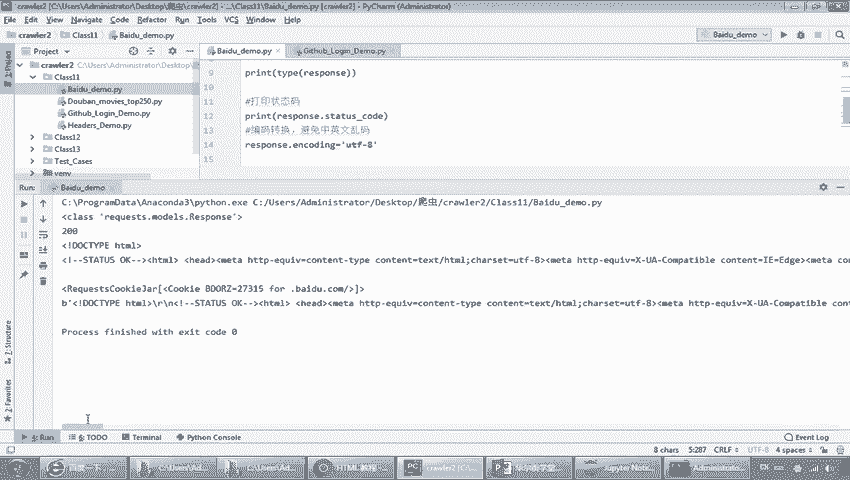

大家看这是不是一个response的类啊，这是打印用type打印它的类型对吧。

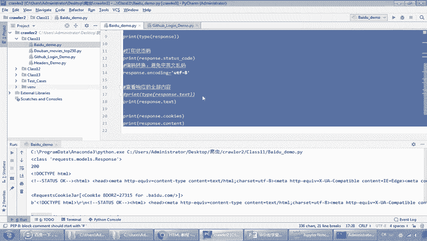

哦知道他返回的是一个这个实例，化了这样的一个month的一个对象，额，这个里面呢我们也可以打印出他的这个，返回状态码对吧，返回状态码我们可以比如说举个例子，大家看应该是200。

证明我们很正常的访问到了这个百度好，接下来呢就是这个编码啊，编码我们可以打印看一下啊，大家看到这里呢其实分为几类啊，你看分为一个打印出来的内容，一个打印出的cookie啊，cookies啊。

cookies我们等下会介绍什么什么，这是它的内容对吧，你看我们这一块打印出来就是很清楚的，你看对吧啊，有视频啊，有百度啊，是不是跟我们的，你看地图啊，百度一下什么，这是不是跟我们看到的这个是一样的。

这个页面上是一样的，这个页上面有很多什么我的关注呀，什么视频啊等等等等是吧啊，所以这个就是一个最简单的，但实际上如果从大的概念上说，我们已经写完了，第一个大家的拍这个Python的爬虫程序。

就是这么简单啊，因为它里面就只有一去一回对吧，发起一个request，那这是发起一个request嗯，在一行代码里面写完啊，提交一个request，然后呢。

再把我们的这个内容返回给我们的response啊，这个应该大家没问题吧，啊这个没问题好，我们再回到我们的PPT上面来看啊，再用平板来看啊，那么接下来我们做个什么事情呢啊，嗯如果说爬虫都是这么简单。

那大家也觉得哇这一下就学完了是吧，但实际上这个爬虫比我们想象中的难复杂很多，我们刚才说了的对吧，那回到这个图，我们从一个google向这个web服务器发上去一个request的，他会response。

那当然这是最理想情况是吧，我随便发个什么给他，他就会响应我对吧，但是实际上我们的web服务器，大家想如果有非常多的这个人不停的给他下request，他是不是累趴下了，那么在这个基础上呢。

我们一定要进行一些过滤啊，进行一些处理，就是我们怎么去啊，对这个request进行识别，那你我不能接受随便的，那就变成什么，如果你大家都拼命的发各种各样的这个呃request，就会导致我这个服务器。

是不是有性能上的问题啊，或者有些风险，那么怎么办，那么我就对你的request做了一些要求，那么这个就是我们在这一章节要讲的，那要等的就是我们的爬虫的登录信息处理啊，发送这些信息啊。

包括了我们的请求头cookies，session taken和我们的这个认证方式，好大家来看一下啊，来看一下那HTTP的请求，这里我们提到了一个啊豹纹啊，就是什么叫做豹纹，就说啊这个包围。

实际上就是我们提前的一个结构体啊，一个结构体，那这里面主要分为三部分，一个叫请求行，一个叫请求头，一个叫请求体，那这里提到的常用的这个爆头呢，大家可以看第一个access啊。

accept要告诉他你所支持的数据类型，第二个呢就告诉他我所采用的编码啊，Character set，这个是我们的压缩格式，还有我们的语言，那这个就是我们通过这个头，告诉你访问的主机名。

还有我们这里的这个软件环境啊，cookies等等等等，意思就是说我们在传送这个request的时候，他并不是那么简单的，比如说举个例子啊，我们要跟另外一个人发一封邮件，你可能就在这里面写。

hi也可以对吧，最简单，Hi，那也有可能是什么呢，写hi你好哎，我是谁谁谁，我因为什么原因我要给你发封邮件啊，我需要你什么帮助对吧，我在哪里什么你可以讲很清楚，所以我们这个发了这个报文啊。

就是我们刚才后面讲的，后者，我们在里面提供了很多详细信息，比如说大家看到有请求的方法，请求的URL啊，HTTP协议的版本，报文头啊，报文体等等等等，那换句话说，当然这块我不要求大家在这里掌握的非常详细。

但是你要有个清晰的认识，就是我们在request的过程中间，request就发给我们服务器的时候，这个承载的信息内容实际上是比较复杂的，不是像我们刚才说的，直接发一个request过就可以了。

好那我们来看一下这个中间最重要的啊，最重要的啊，第一个就是cookie啊，什么叫cookie呢啊当然这个很简单啊，很简单啊，这个就是大家知道中文是饼干的意思对吧，那么它是什么作用呢。

它是为了实现用户标记啊，因为我们的HTTP是一种无状态请求，你不知道谁，比如举个例子，我们这里我去向他发起这个百度的寻求的，你其实不知道我是谁对吧，你也不知道，不需要知道我是谁，发谁信。

反正我把我这个网页反馈给你就行了，那么如果啊如果啊默认是无状态的，那如果我们要在这个请求，中间携带一些用户信息，比如说我我知道诶这个是张三来访问百度，李四去访问百度，或者是王五访问百度怎么办。

我们要在这个访问过程中间，承载我们的用户信息的时候，我们就要用到cookie壁纸啊控制器，我们的登录操作啊，实际上就是把我们的什么用户名跟密码啊，比如说我们在一个地方要登录是吧，我们把用户名。

密码给到我们的服务器端进行验证，如果符合，那么他就会把这个返回cookie的信息给到浏览器，什么意思呢，呃就是我们再去请求的时候，我们把用户名和密码打包好啊，发给他说，你看我是张三。

你看我提供了张三那种名用户名和张三密码嗯，服务器验证嗯，确实你是张三，然后呢他就会把跟张三相关的这个cookie啊，cookie啊缓存呢就提交给我们的浏览器。

这样的浏览器是把我们这个cookie就存在本地了，就像是我们第一次先建立信任对吧，建立一个信任啊，你看验证了密码以后以后呢，每次访问呢我就不用再带用户名和密码了，我就把我的cookie带上啊。

有点像我们之前这个说，大家历史上知道就是调兵，大家知道要用虎符是吧啊，比如皇帝出生之前给了这个大将虎符，一个人一半，那每次去调兵呢就把虎符拿过来一对啊，OK啊就行了。

所以这个cookie中间带了很多时候，就像类似这样的一个验证关系啊，然后就有了用户身份的访问啊，cookie是什么，cookie是放在哪里呢，传输的呢，刚才我们提到了这个。

我们HT协议中间是不是有这个报文呐，它是放在MATTP的header中间传输的啊，那么一旦得到了用户的这个COOKI信息，那么有个问题是吧，别把它截取了的话，你是不是得把你的这个密码用户名都截取到了。

所以为了解决这个问题呢，很自然我们想到了说我们要保护这个cookie，保护cookie呢，我们就提到了一个筛选机制，什么叫做绘画机制，筛选我们也翻译成绘画啊，绘画技术，绘画技术很简单对吧，混卷简单。

我们稍后会讲到，先把空气讲完，那么你会发现什么cookie是什么，是由服务器生成的对吧，我因为我要先把用户名和密码先传给他，他才把这个cookie生成好以后发还给我，然后呢我每次就把它保存下来。

然后呢同时去访问的时候，我就把cookie带上去对吧，那一看哦，这个cookie是我发的，OK没问题对吧，就像我皇帝出生的时候，刚才说的，把那个虎符的一半发给大将，他这样每次拿这个壶来请兵时。

一发现诶皇帝一看对嗯，对得上，那么OK没问题好，那么筛选又是什么啊，筛选筛选呢是刚才提到，就说如果我们的cookie被截取了的话对吧，你那个虎符被别人拿走了，那不是就调兵都被别人给掌控了是吧。

所以那同理呢我们的筛选机制是你不光有虎符，而且呢我还给你生成了一段随机的字符串，并且这个关键点在于，这个时间字符串是有效的啊，就是有时间效期的，这个非常重要啊，就是啊生成的这个字符串是有时间效期的啊。

那么同理它还是由这个服务器生成，那么它注意啊，它不再存在浏览器了，它把它存在我们的服务器端啊，存在服务器端啊，也就是存在我们的这个远程，那我们用户呢就是把三星id啊，因为我们到时候返回的时候。

就用这个服务器端把三星id返回给用户了，用户呢把他的这个三星id存在cookie中间，每次呢我们请求是吧，就不再需要像之前一样的把这个cookie传过去了，只需要把session id传给他就可以了。

三星id是一个id，那谁拿到谁都不知道对吧啊，你中间截取了你也不知道，因为只有服务器才能知道，它根据三项AT进行查询，看是不是对的，所以我们便来到后来的，就是通过session的这种机制去掉。

或者保护了我们cookie的这个安全隐患啊，安全隐患，那么注意呢就是每个服务器呢都每个服务器啊，都给每个用户啊，或者客户啊，或者浏览器，就是你访问的这个浏览器，都给他一个身份标志啊。

这叫我们叫session id啊，三星id啊，呃很多时候呢就是对于我们这个三星id啊，啊我们怎么样来进行处理呢，还是一样采用的这个cookie的方式来进行保存，这个比较好方便是吧。

因为我们再把它放到报文里面，我们直接把它加进去就完了，所以呢cookie是记录用户名和密码，而筛选只记得一个对应的筛选id啊，他的验证过程实际上是在服务器端，那各有各的好处对吧。

我们的cookie是验证完了以后，反正这个嗯如果你风险不低的话，我就用cookie是吧，我我就用那个虎符，我确保了虎符不丢，但是如果说你有很高的这个安全要求的话，我们就可以放到什么三星ID中进行处理。

筛选id的处理过程，大家可以看到，第一个呢根据用户名密码生成一个筛选id，存到用户的数据库呃，存到这个服务器的数据库中间啊，用户登录的时候呢，他会用这个3A进行比较对吧，你拿去我去我们的服务器中间查。

查完以后，把这个CID存到cookie中间，作为一个键值，也就是说最终呢还是把它存在在这个cookie中间，那一起进行这个啊发送或者请求啊，不管是个筛选还是我们的COOKIN。

其实都是我们在承载在报文中间的一些，用户验证啊，用户验证和用户信息好，那另外又出现了一个对吧，token token是什么意思呢，如果说啊我们刚刚提到就是你筛选式的，你你没问题。

你能够保证我们的cookie中间的一些信息呃，被保护起来对吧，用户名密码，那么但是呢如果我我是反复的请求啊，反复的请求嗯，经常的去做这个请求，说你是不是每次都得去查呀，拿了我这个3000里我提交一次。

你就拿3i id去你的呃，服务端的数据库里面查一次，这很麻烦对吧，然后性能也不高，怎么办呢，那么我就想了一种办法，我就出了一种叫token啊，token大家知道，就是嗯经常去银行里办手续的时候。

你有办年银行，他会给个token any，叫我们叫密码器啊，叫密码器，类似这样的一个定义，它实际上是有服务器端生成的一串代码啊，生成的一串代码，然后以客户端来请求一个令牌啊令牌。

那么这个令牌啊就刚才说的，我们说银行这种令牌或者叫做token登录以后呢，生成这个token呢，就把这个token返回客端以后呢，这个用客户端呢，只需要带着个token来请求数据就行了。

所以呢就是说我们把它做了一个什么啊，又一次转对吧，又一次转化，那不光是用不用用户名密码，也不用CD我们不用查，而是说我们把这个过程呢做成了一个密钥啊，或者是一个叫做我们叫令牌啊，叫令牌令以后就不用了。

不用提供密码啊，而且也不需要提供我们cn id，你就是告诉我哎我这有个token就可以了啊，这个token呢一般来说比较长，比如有UID啊，有时间呐，有签名啊等等等等，一定长的这个字符串。

那一般来说做的很难破解，也很难去这个伪伪造，所以这个是我们简单的一个token的组成，那他的目的是为了要避免我们筛选id，反复认证对吧，要不然你每次访问你是不带个三线id过去，我要查一下啊。

减轻我们服务器的压力啊，减少这个频繁数据库查询，使服务器更稳健，那不管是我们的cookies也好，session也好，它是讲的这里的token也好，都是啊，大家注意。

都是我们这个啊浏览器或者我们的客户端，和我们的服务器进行交互的时候，处理用户数据，那换句话说我们在前面提到的这个啊，request过程中间，我们这里要存在什么呀，是不存在用户数据啊。

这个大家可以理解吧啊可以理解啊，好，那么这个地方还有一个就是叫open，autumn anization啊，就是开放认证协议哎，开放认证协议跟前面也是一样，那前面反复讲，我说的这三种都是一些认证。

对吧啊，那么它的不同的情况在于什么，它可以使用第三方的啊，用户的账号，比如说我们常见的去登录某个应用啊，你要用什么QQ登录啊，用微信登录啊，用微博登录啊等等等，这就是使用第三方的啊，第三方的。

而这个有什么好处呢啊就是我不需要啊，我不需要再在这个上面去用，使用自己的用户名和密码啊，用户密码啊，这样呢能够比较快速的啊，快速的实现我们的认证啊，文认证大家可以看到这里有个简单的例子。

是说我们的客户端来去到我们的什么呀，微博上面进行请求，那么首先用户呢你要去请求对吧，请求用户授权，然后用户同意并返回，然后呢去查找我们的第三方，就是在这个微博上面进行啊，去投这个啊认证啊。

认证这个呢大家可以去了解一下啊，应该在我们的工作中见的比较多啊，比较多，不管是这个互联网上面的，还是我们在公司里面，公司里面，比如有这种单点登录的这个账号呀，也有这个这个SSO对吧。

也有这种就是我们说的一个账号，可以登到公司所有系统里面，这种处理机制好，那么到这里呢我们基本上就介绍完了啊，我们这个在header或者或在我们的报文题里面，所承载的哪些内容，这个地方一定要去理解。

否则我们到后面去处理这些筛选啊，cookie的时候，你可能不知道在做什么事情好，那那我们第三章啊，第三章第三部分呢就是我们通过浏览器的header，设置登录名和这个post来进行一个访问啊。

进行一个访问啊，大家可以看到这里啊，额这个地方呢，大家可以看到就是我们的URL啊，url lab啊，这个url live嗯，大家可以看到就是我们通过url lab呢，可以去模拟啊。

模拟这个伪装我们的头啊，伪装我们的头呃，大家可以看到这个伪装头部啊，伪装头部呢实际上是通过什么来做的呢，是去打印啊，去打印我们的这个信息，把它做到这个header里面来啊，做到header里面来好。

那么我们把这个啊代码，我把这个代码呢给大家看一下，好啊，这是header的一个代码啊，我们还是一样的，在这里看一下，我们把它可以放到我们的这个anaconda里面来，好吧，我放到anaconda里面来。

好大家看到这个是大家可以看这很清楚，第一个呢引入了我们ULLL包，那他其实也是从request中间引入的啊，这个地方大家注意，我们如果现在要去访问这个啊，大家看这个注释，我们可以先不看啊。

它定义了一个URL对吧，然后呢我们去用request去访问它，那么这个地方大家看就是模拟的这个header，我告诉大家个header，我是个什么浏览器啊，我是一个火狐的浏览器是吧，是一个火狐的浏览器。

好我们执行一下，看他能不能打印出来我们的这个信息，好大家看到这个是我们是不是可以返回信息呀，好这是可以返回信息，那么如果我去掉，大家看，我把这个header去掉啊，大家可以看到我把这个header去掉。

好大家看啊，我把这个header去掉，我不告诉他我是什么模浏览器，好大家看看这个地方呢，额额当然这个方式，等下我看下这里是报了一个错，好我们把这个先合回来啊，OK那如果说是普通的网页呢。

我们实际上是不需要伪装成这个header的啊，比如说我们去访访这个访问百度，我们去访问这个啊，百度的时候我们直接就去，就直接用这个requests就可以了，但是如果我们去访问这个啊，这趣事百科。

你快来看，我们去掉了这个header以后，报了一个什么错呢，对吧，你看他报数报了一个这样的一个错，叫做remote and closed connection，Without response。

什么意思，就是说你如果他被他抓到，你是一个什么呀，你是一个模拟的爬虫，他一看就知道你不是，你不是通过这个网页来反映的，所以我们在这里做了一个这样的伪装啊，做了这样的一个伪装啊。

所以这整段这一段话的意思是什么呢，就是说我们通过header去伪装啊，通工具伪装，那么这个地方我们也说了，如果你要去装这个request模块，前面已经讲到了是吧，我们这刚刚你讲了。

就直接通过pip install好，那么这个呢就是如何设置登录名啊和密码，以post的方式去爬取GITHUB啊，这个也很简单，我们前面说了对吧，我们实际上这一部分呢就是前面讲的这一章。

就是前面的两个部分，我们在前面分成了四个部分对吧，我们把这两个内容合到了一起啊，放在这里，这样呢我们就更紧凑，那么啊我们看一下啊，我们看一下啊，如何使用登录名和密码，以post的方式来爬去GITHUB。

首先GITHUB大家知道对吧，是我们的很著名的一个网页的啊，一个网页的一个呃就是一个网站，然后它这个网页呢是我们的，刚才把它拿过来看一下，是一个登录的网页啊，我们想要诶，不好意思哦，我把这里拷过来啊。

啊我们想要登录到这个网站上面去提交啊，大家来看一下，我首先手工登录一下它，大家看这是我们的一个登录界面对吧，一个登录界面，那么我们要怎么去实现它呢，我们要怎么去实现它呢，很简单啊。

我们要做的就是第一个采用表单的方式提交，这是个表单对吧，大家可以看到这个表单对吧，那么这个地方怎么来看它是不是一个表单呢，很简单，我们按F12啊，F12对吧，你看这里出现F12，F12出来以后呢。

我们就能看到啊，看到这里啊，如何去查看它的源代码啊，我们可以点那个箭头，你可以点到这里，大家看点了以后对吧，出现这里实际上是一个什么login的一个表单啊，我们在这里输入用户名和密码，好回到这里。

那这是第一步，第二步呢我们要去查看它使，是不是使用了我们的token或者cookie啊，cookie好，找到了这个信息以后，那么以post的方法来传送密码，那这个呢我们可以点一下它，大家可以看。

我就是随便写一个啊，比如说122我们提交一下，你可以看到这里呢，好大家来看一下这个地方，我们可以去看一下他的这个performance啊，这个network啊。

看一下network和performance上面，对吧啊啊都可以看到一些相关的信息。

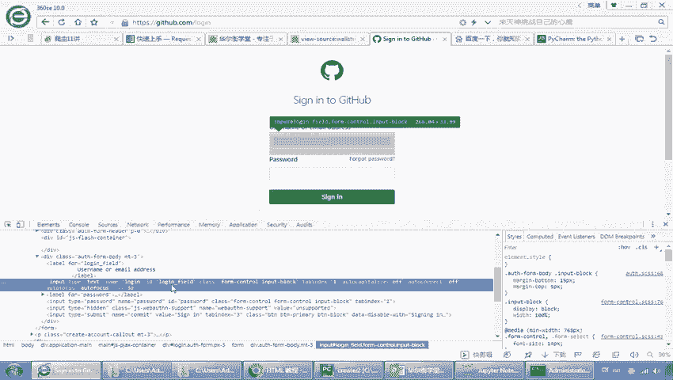

特别在我们的这个performance这里有个session，大家可以看到这个session里面就能够看到，我们这里面是刚刚做了一个提交对吧，做了一个提交包，你看这是一个绘画看吗。

所以我们在这里做了一个绘画，那么我们接下来怎么办呢，我们就以这个post的方法来提交用户名啊，并且构造这个浏览器来设置用户名的密，码和post请求，最后呢查看它是不是啊能够正常登录好。

那么我们来看一下这个代码啊，啊github login的代码，我们把它啊，因为这个代码呢我们先运行一下，给大家看一下啊，这个代码我们可以运行给大家看一下，好嗯，这个github login demo。

好大家可以看到呢，这里呢我已经成功的登录上去了吧，啊成功登录上去，那这里有句话大家可以看到啊，什么叫成功登录上去呢，我这里大家来看一下，这里有一个叫。

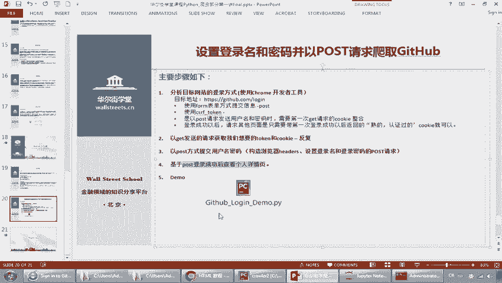

啊bingo，You can see this login id password，什么意思呢，那你看这里是时间啊，时间那么我们一样的，我们先登到这个上去，这里有密码，你看我们的密码写在这里啊。

这个是账号啊，我们登录一下啊，比如说我们登录一下，我们把密码拷过来登录一下啊，这是我做了一个测试账号啊，做了一个测试账户啊，大家可以看到登进去以后啊，大家看正在跳转，跳转完了以后呢，是不是登录界面了。

那到了这个用户的界面里面，那比如说我们点到我自己的这个账号下面，大家看到点到我这个账号下面，你看我这里是不是写的一句话叫bingo。

You can see this log on id password，大家注意这个是不是我把这里编辑一下啊，我们写成比如说写成啊4月啊，比如说写4月8号啊，或者随便写个日子啊，就写个4月8号。

那么这个就变了吧，这个一定是登录才看得到吧，你不登录，你肯定看不到这个地方吧对吧，就是我登录以后才看的是我自己的这个主页，对吧主页，那么我现在就模拟，那我怎么登录的过程很简单，第一个大家来看一下啊。

引入这个request包，这个没问题吧，第二个呢这里提到了一个叫beautiful soup，这个我们在后续还会跟大家讲解什么是beautiful soup，大家先理解一下。

它主要是用来处理我们的这样的一个分析，HTML的工作啊，这是一个包，大家可以先有个印象，我们后续的课程还会继续讲解好，大家看这里呢是不是访问这个login的网站呢，是不是把他请求下来，这个应该没问题吧。

请求下来的网站的信息以后呢，我们把它做一个解析，这是一个beautiful soup，在这个里面找到input，刚才我们看到是不是我们要去找这个input，这个这个刚刚那一个form嘛。

就是提交的时候是吧，他是一个input的，我们把它过滤出来，找到以后呢，我们从里面把它的什么呀，cookie拿出来，cookies拿出来啊，cookies拿出来，cookies拿出来以后，大家注意看。

我们在这里构造一个cookies啊，这个cookies我们已经存好了，那存好了以后呢，我们再下次用在这个，你看关键就是这个东西啊，其实说来说去，就是这个你看他构造了一个request post。

你看这是给他的，要发到这个地址里面去，然后我们的data里面包括了commit ut f8，Authentication login，就是用户名和密码，还有刚刚提到的这个cookies。

这一个主要是做我们的一个cookies的一个整理啊，整理整理完了以后，我们把这个打印出来可以看一下，然后呢把这个cookie，大家看到这个cookie是不是由这个R2。

response2来进行这个配置的，那么我们再把它进行啊，就是R3呢就是这个response3，就是我们说的一个response3，我们看两个里面的text，然后再把它找到。

找到我们刚才那个class的过程，所以这个是比较清楚的啊，这个也是比较简单的啊，我把这个过程再给大家演示一下啊，啊再把那个演示我们先退出啊，退出，好大家看退出以后呢，额我们进到这个网站上面去啊。

大家看到我们是进到这个login啊，进到login好，或者是我们进到这个筛选上面也是可以啊，啊大家看那它的logo in跟筛选其实是一个对吧，你看其实是一个，那么我们打开。

我们把这个放到我们的google上面去啊，放到这上面来看这个工具啊，看得清楚一些啊，好还是一样激活我们的F12啊，激活我们的F12F12出来以后，大家可以看到我们还是点到network这里啊。

点到let network这里，然后呢我们这里去提交啊，我们就提交，大家可以看到，在这里我们首先没有任何的信息吧对吧。

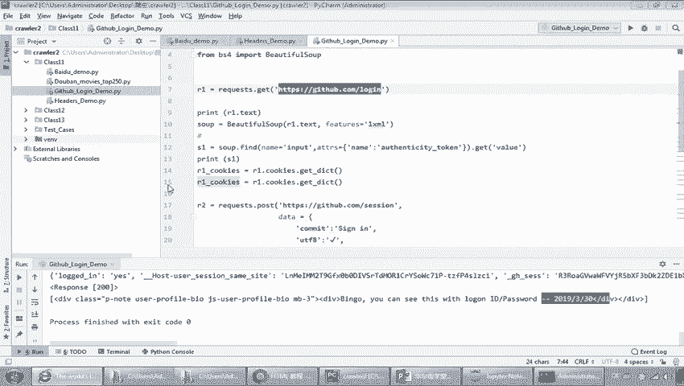

然后我们看一下它出现的这个cookie是什么，比如我前面写个A写个写个S啊，好我们提交大家看到这个筛选。

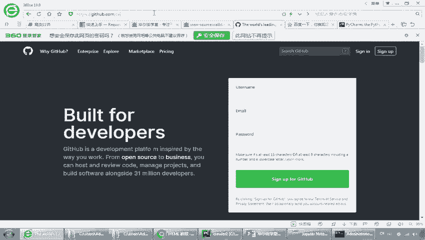

你看出来是不是有个筛选呢，我们点进去看到这个筛选，筛选进来以后，我们把它打开看一眼啊，大家看到这里是不是有个response head，是不是有个response header对吧。

这个response header，你看下面有什么，你看这是不是有form data呀，是不是非常你看这里有commit sin。

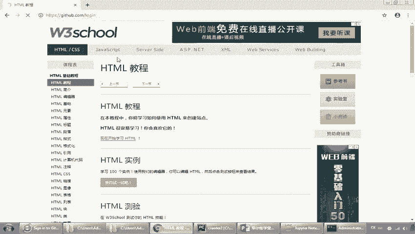

你看UTF8，然后password是不是，你看用户名和发售是写在这里的，我们是不是就是要构造一个这个东西，因为这个东西其实就是它这个里面的对吧，你看我刚才写了个S是不是在这里啊。

所以我们这一段代码的作用啊，就是构造了这个大家看是吧，筛选这是他的网页data，是不是我们这里对吧，是不是from data，然后呢你看commit是不是sin呐对吧，然后一个勾勾对吧。

然后这里是authentication对吧，authentication那S1这个authentication是哪里，是不是在这个时候拿到的啊，拿到了是吧，拿到以后我们就输入用户名和密码。

其实整个的关键就是在这里构造这样的一个啊，这样的一个啊request里面的post的一个结构体，然后呢这个构造好以后，我们把它传到我们的网站，其实就是模拟整个的过程，就是模拟这个网站里面填写信息。

这个大家可以理解吧啊一个比较简单啊，这里我们要强调一下，就是第一个就是我们怎么去使用啊，怎么去使用我们的这个呃request包和这个beautiful soup。

这个呢我们在后续课程会对beautiful做进一步的讲解，第二个要强调的是我们怎么样去拿到这个cookies啊，拿到cookies啊，第三个就是构造这个结构，这个data的结构体。

做这个post丢到我们的这个服务器端啊，后面就比较简单了，一旦通过了认证，大家看我这里再运行一次啊，刚刚我们是这个吧，我们再运行一次，是不是更新成为了我们这里的新的数据，刚才写了个4月8号对吧，好。

大家看一下啊，大家来看一下，好大家可以看到是不是更新的C8啊，那那就说这个试一期，是不是我们真的是登录上去了，是不是登录上去了，好那么我们回顾一下今天的课程啊，回顾一下今天的课程啊。

今天课程我们其实讲了四个部分，那讲了四个部分，但是这四个部分呢我们做了啊，把它按照三个跟大家来讲的，第一个是网络的爬虫技术对吧，然后request这个模块介绍，我们把登录信息和URL模块放在一起讲了啊。

那么这一节课呢，我们对整个爬虫有了一个基础的了解，接下来呢我们会对刚刚说到的beautiful soup啊，对更深入的这个嗯，就动这个我们爬的更多是一个静态网页，那么什么是静态网页。

动态网页我们会做一些这个介绍，再加上就是我后期的这个分页啊，然后还有我们的反扒机制，然后我们爬虫的并发机制做一些介绍，好那谢谢各位同学，我们今天内容就到这里。

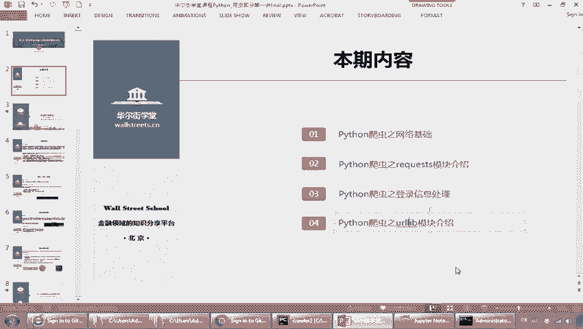