# 14天拿下Python金融量化，股票分析、数据清洗，可视化 - P14：02 典型爬虫程序的实现（一） - 川哥puls - BV1zkSgYZE54

各位同学大家好，今天呢我们来学习一下爬虫程序的实现，那我们这次的内容呢主要分为三个小的部分，第一部分呢我们会为大家介绍一下，爬虫程序实现的具体步骤，那第二部分呢我们会为大家介绍。

如何在已经爬取到的网页中去解析，我们想要的数据，第三部分呢，我们会为大家介绍Python中的一个非常重要的模块，Pandas，并且呢，我们会使用pandas，来进行一个数据存储和数据分析。

那在正式进入到第一小模块儿的学习之前呢，我们先来思考一个问题，什么是爬虫，那爬虫呢它首先是一段程序，那这个程序呢，它的作用就是为了为我们获取数据，那爬虫是如何为我们获取到数据的呢，其实也很简单，爬虫呢。

它其实就是模仿了我们在浏览器获取数据的，这么一个过程，那我们是如何在浏览器上获取数据的呢，咳来我们先打开一个网页看一下，啊比如说呢这个网站，就是我想要获取数据的网站。

那从我点开这个网站到我接收到这些数据，这之间都发生了什么呢，那首先呢是我输入网址，然后对网站发送一个HTTP请求，那网站所在的服务器接受到HTTP请求呢，他会将我所请求的数据发送给我。

而这些数据经过浏览器的渲染以后呢。

就会以我们现在所看到的样子呈现在我们眼前，那这呢其实就是一个完整的请求和响应的过程。

那整个页面都是我想要的数据吗，额也不一定，那比如说呢我现在只想要这张图片，那我我来获取这张图片，最简单的方法是什么呢，呃其实就是我右键这张图片，将图片另存为存到本地，那我就想获取到了我想要的数据。

好那我们现在来看一下爬虫程序，它是怎么来实现这一个过程的呢。

那利用Python爬虫呢来爬取静态网页，简单的来说呢可以分为四个步骤，那我们在说这四个步骤之前呢，我们先来看一个概念静态网页，那什么是静态网页呢，我们打开刚才的页面。

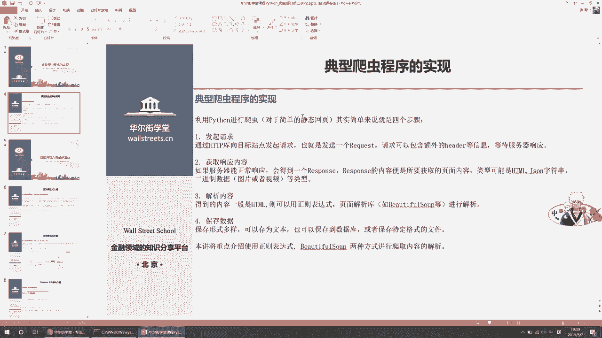

那大家看这里的图片，它是在动的，那它就是动态页面吗，其实并不是我们的静态页面呢，它是相对于动态页面而言。

但是这个动态呢并不是说你的页面会动，它就是动态页面，那动态页面呢，它其实存在了一个和数据库的交互，而静态页面呢，它的数据和代码都已经写在了我们的网页上面，我们每次去请求的时候呢。

得到的结果其实都是一样的，我们刚才所看到网页上的动态滑动的图片呢，它其实是为了使网页更美观，而加入的一些动态效果，它本身对于这个网页是动态网页，或者说是静态网页是没有影响的，那我们后续的这些操作步骤呢。

都是基于静态网页来实现的好，那我们现在来看这些具体的步骤，那第一个呢是发起请发起请求，那通过呢HTTP库，也就是呢我们之前所学的request和url l lab等库，向我们的目标站点发起一个请求。

request请求，那这个操作呢其实就像是我们刚才呢输入网址，按下回车这个操作一样，他就会向服务器呢发送request请求，那这个请求呢它可以包含额外的header等信息。

那什么是header尔信息呢，我们刚才在请求网页的时候，好像并没有添加这些信息，那我们现在来看一下这些信息呢，它到底是什么，我们可以使用F12打开浏览器的控制台。

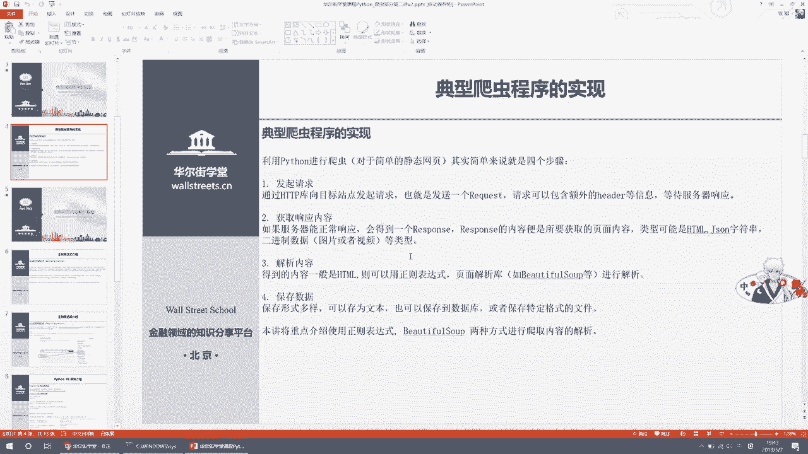

那这里啊这里好像什么也没有。

我们来刷新网页，重新请求一次，那可以看到他这里加载了很多东西，那这些东西呢其实就是我们所请求的数据，那它经过浏览器的渲染呢，就变成了这么一个美观的网页，我们现在来打开一个来看一下。

那大家来看这里request headers，那这里呢其实就是我们说的header信息，那我们来挑几个对于我们爬虫程序呃，所需要的字段来给大家解释一下是什么意思。

那首先呢第一个也就是user agent，用户代理，它的作用呢是告诉服务器用户的操作系统和浏，览器的版本信息，那我们再看另外一个字段，cookie cookie字段的作用呢是告诉服务器用户的身份。

它是用来帮助网站呢来识别用户身份的字段，那user agent呢和cookie，这两个字段呢，是我们在写爬虫程序中最常用的两个字段，那我们刚才在请求这个网站的时候呢，我们并没有输入这些字段。

但是这些字段信息是哪里来的呢，其实在我们使用浏览器，对服务器进行请求的时候呢，浏览器会自动的将这些字段为我们添加上去，而在我们写爬虫程序的时候呢，则需要自己手动添加，那我们现在呢再来看第二个步骤。

获取响应内容，那我们正常访问浏览器以后呢，浏览器会发送给我，会回应给我们一个响应，也就是response，那response中呢，便是存着我们所想要获取的页面内容。

那它的类型呢可能是HTML或者JSON字符串，图片或者视频，音频等一些类型的文件，那我们刚才看这里呢，其实便是我们获取响应的内容，我们看他的数据量还是非常多的，那像这里的图片，我们预览一下图片，哎。

就是这里的这张图片呃，有很多的图片，然后还有包括一些呃HTML页啊，也就是我们的这个网页的HTML代码等等，多了一些信息，那现在呢我们已经完成了第二个步骤，获取这些信息，获取到这个响应内容。

那现在我们来看第三个步骤，解析内容，我们刚才呢我们在访问浏览器获取数据的时候，获取这张图片呢，我们只是右键另存为就可以把它拿到，但是我们的爬虫程序呢，它并不会右键另存为，那他应该是如何来获得这个数据呢。

那我们先来看一下这张图片，它的一个代码，然后我们右键检查，那这段代码呢，它其实就是对应了这里的这张图片，那我们看一下这个代码里，这个链接它是什么东西，那我们来复制一下这个链接来打开一下，那我们可以看到。

其实这个链接呢，它所对应的东西就是我们想要的这张图片，那也就是说我们只要请求了这个链接呢，它其实就是可以获得到这张图片的，那我们使用现在呢。

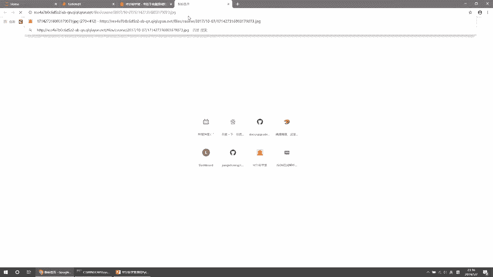

我们使用我们昨天学过request模块呢，来做一个小小的爬虫程序，完成了这张图片的爬取，那这里的程序呢啊我已经写好了。

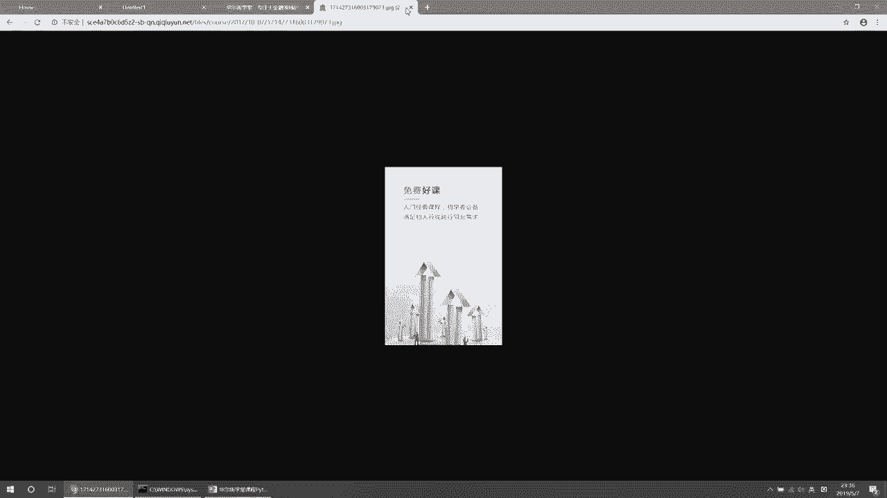

非常简单，只有这几行代码，那我们来看一下这个程序，那首先呢我们就是导入我们的request模块，然后呢这里呢其实就是我们这个图片呢，它所对应的链接，那这里呢headers字段。

那这个hers字段呢我们刚才也有说过，我们在发送request请求的时候呢，浏览器会自动的为我们构建这些字段，但是呢现在我们使用爬虫程序进行访问，所以呢这些字段是需要我们来手动添加的，那一定要添加它吗。

啊其实也不见得，这个字段它的作用呢，其实就是把我们的爬虫程序来进行一个伪装，伪装成一个浏览器，他的这些字段的值呢，其实就是我们刚才有看到的，就在这里对，我们可以直接把我们浏览器中的这些呃。

字段对应的值呢直接进行一个粘贴复制，我们这里呢只用粘贴了两个字段，user agent和cookie这两个字段呢就足够了，那如果我们不加这个字段，它会怎么样呢，其实如果我们不加字段呢。

它这个字段还是存在的，只不过呢这个值它这个user agent呢，它的值呢对应的是我们Python的版本，那如果我们用对应Python版本的这个字段，去访问别人的服务器的时候。

别人一眼就会看出我们是爬虫程序，而不是一个正常的用户，那如果对方带有一些反扒机制的话，他其实就是会把我们的爬虫呢直接封杀掉，所以说我们在写爬虫程序的时候呢，最好是可以加入这个字段的。

那下面呢其实就是我们使用request模块中的get，方法了，对于我们这张图片对应的URL进行一个请求，那我们在请求的同时呢，把我们已经构建好的headers字段呢加进去，那我们在请求以后会获得响应。

然后呢我们使用open方法来打开一个文件，将我们所获得到的这个响应呢，去写入到我们的文件当中，那这里呢我们看到我们用了这个二进制的方法，来对我们的文件进行打开，那为什么我们会用二进制呢。

我们再来看一下我们的课件，那我们这里呢其实也写了，像图片或者视频这种类型的数据呢，它其实都是以二进制的形式，在服务器上进行一个传输，那我们这里获得的响应呢，啊，他其实呃就是我们的这个啊文件。

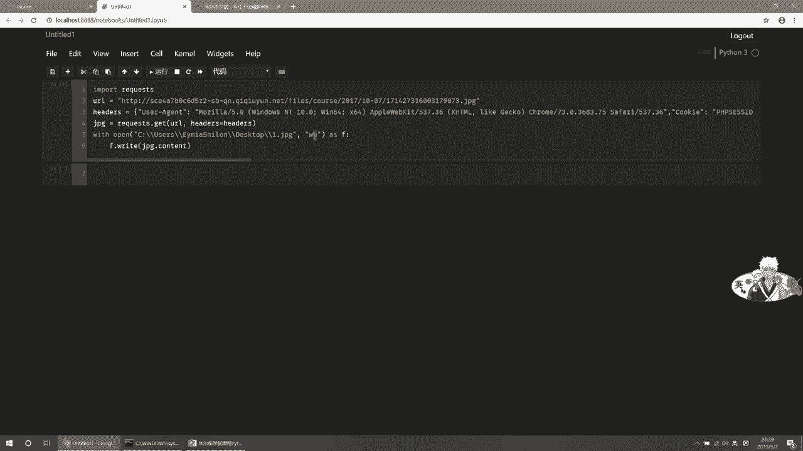

或者说图片的数据，那我们呢呃这这里在进行写入的时候，还用了一个content属性。

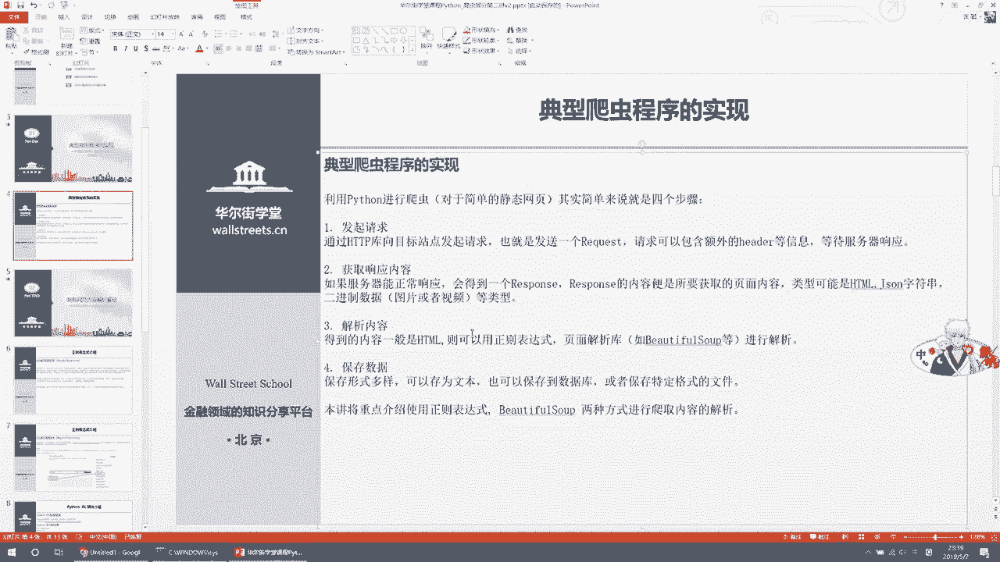

那这个content的属性，它和我们之前有用过的text属性有什么区别呢，那其实呢我们的content的属性，它所输出的东西呢就是我们响应的二进制数据，所以呢这里呢我们也是用的二进制这个呃形式。

来进行一个打开，我们现在呢来运行一下我们的这个程序，看一下结果好，我们已经运行过了，我们，来看一下呃，因为这个图片的保存路径呢我是设在了桌面，我们看这里的图片呢已经产生了，我们打开看一下。

那这个图片呢就是我们这里所想要获取的图片，那么这么一个用request模块呢，来请求图片的爬虫程序，我们就这样就算完成了，在哪，我们再回到刚才我们找到链接的这个地方啊，就在这里。

如果说呢我们在爬取这个网页。

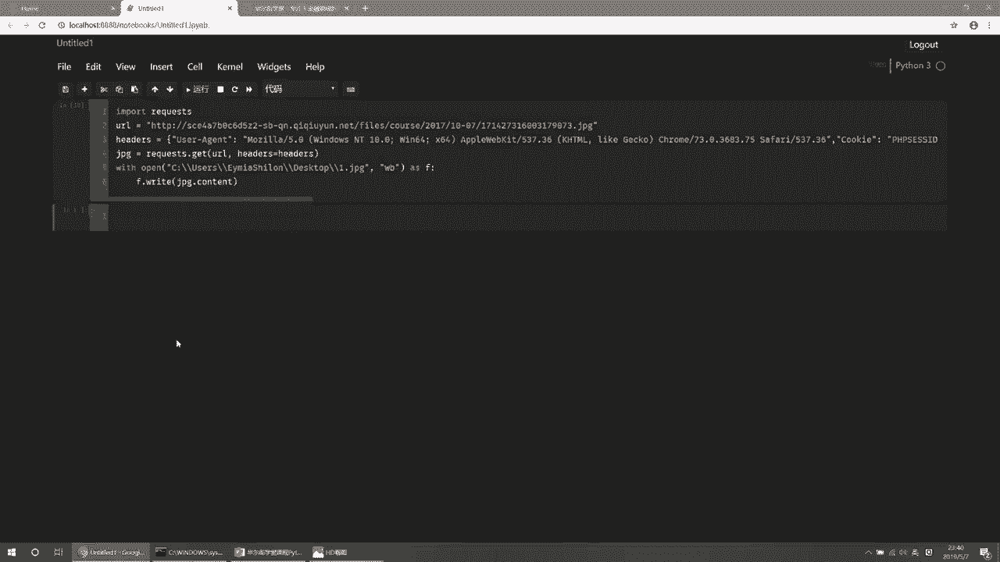

只想要这张图片的时候，我们只有这个原始的链接，那我们呃按照昨天的经验呢，我们获得的其实就是这么多的这个HTML代码，我们刚才呢找到这个链接，是我们自己手动选中的，那我们以后在爬取大量数据的时候。

不可能说啊，我们一个一个去进行点击手动选中，那如何在这么多HTML代码里，选中这个我们想要的代码，那这呢其实就是我们第三个步骤的，最主要的地方，就是在我们的HTML内容里面了，去找到我们想要的那些数据。

那找到这些想要找到这些数据的方法呢，其实有很多，比如说呢可以用我们马上就要讲到的，正则表达式，也可以用Python里面自带的一些页面解析库，那像我们这列在这里的beautiful soup。

这些呢都可以帮助我们在这一大串的HTML代码里，找到我们想要的数据，获取数据之后呢，我们也要进行我们爬虫程序的，最后一步就是保存数据，那保存数据的方式呢有非常的多，如果我们的数据量比较大呢。

我们可以将它存到数据库当中啊，比如说像我们的MYSQL数据库，oracle数据库等，那如果我们的数据量比较小，我们可以将它存至本地文件，就像我们刚才的图片爬虫一样，我们将爬下来的图片呢直接保存在本地。

那如果说呃爬取的内容呢是一些文本性的内容，我们可以将它呢直接存储在本地的TXT文件当中，如果是单纯的数据呢，我们也可以把它保存在呃，比如说像CSV文件当中，或者说呢直接存储成excel文件。

这些都是可以的，那我们保存的呃保存数据的形式呢，根据自己的需求挑选即可，此呢我们爬虫程序的实现流程呢就讲完了，那么现在呢我们来看第二部分的内容，解析爬取网页内容中的数据，那么我们这一块的内容呢。

它的作用点呢，其实是在我们爬虫实现过程中的第三个步骤，解析内容，那我们这一块主要讲的呢就是正则表达式，我们使用正则表达式呢，就可以提取出整个文本中呢，我们所有想要的数据。

就像我们刚才呢去找到图片的地址一样，如果说呢网页中有非常多的图片的地址，而且呢我们都想要，那么使用正则表达式呢，我们可以一次性将所有的地址都取出来，那这样呢会使我们在解析数据的时候呢，便利很多。

那并正则表达式究竟是什么呢，它呢其实就是记录文本规则的一段代码，这段代码呢通过预先设定好的一些特殊，字符和符号进行一个组合，会组它会组合成呢呃也就是我们的规则字符串，然后呢，我们用这个规则字符串。

对一大串文本进行一个过滤，最终呢我们就会获得符合我们规则的字符串呃，比如说呢呃我们需要过滤一段文本中的呃，邮箱数据，或者说图片地址，手机号码等，除了我们刚才所说的文本匹配功能以外呢。

正则表达式还具备了文本的替换和匹配，验证等功能，在我们爬虫领域呢，正则表达式的应用是非常广泛的，它的灵活性呢和功能性都是非常的强的啊，那么正则表达式呢它究竟长什么样子呢，我们一起来看一下。

那这里有一个网址，我们先打开这个网址，那这个网址呢是一个嗯在线的正则表达式工具，那我们可以看到这里呢，它会有一些常用的正则表达式，我们来粘贴一下这段文本来测试一下，那我们来匹配一下URL。

那大家可以看到我们这段文本里面呢，它的URL在最后面，那我们这里呢也是成功的匹配到了，那这里呢便是它自动为我们生成的正则表达式，对正则表达式呢它其实就长这样，有一些字符和一些特殊的符号呢组成。

也就他这个组成呢，也就组成了我们的文本匹配规则，那我们的这个匹配规则呢，会在我们这一段文本里进行匹配，最后呢它会返回符合我们规则的那些文本，那在这里呢也就是成功的匹配出了，我们的这个网址。

那我们现在呢再来看一下正则表达式呢，它在Python里面是怎么来使用的，那正则表达式呢，它在我们的Python里面，其实是使用到了Python自带的RE模块。

那这个re e模块呢它是Python的标准库之一，它不需要安装，我们可以直接import导入，并且使用，下面呢我们来看一下re e模块和正则表达式，在Python中呢它的一个具体的使用。

我们呢依然通过几段嗯，简短的代码来看一下他们的一个具体使用方式，啧那这里呢有几个已经写好的正则表达式，我们来具体的来看一下，首先呢我们来看一下第一个，那第一句呢。

import re e呢便是导入了我们Python中的正则模块，那下面呢这一串大家是否看着有点眼熟呢，那它其实呢就很像我们刚才打开的这个。

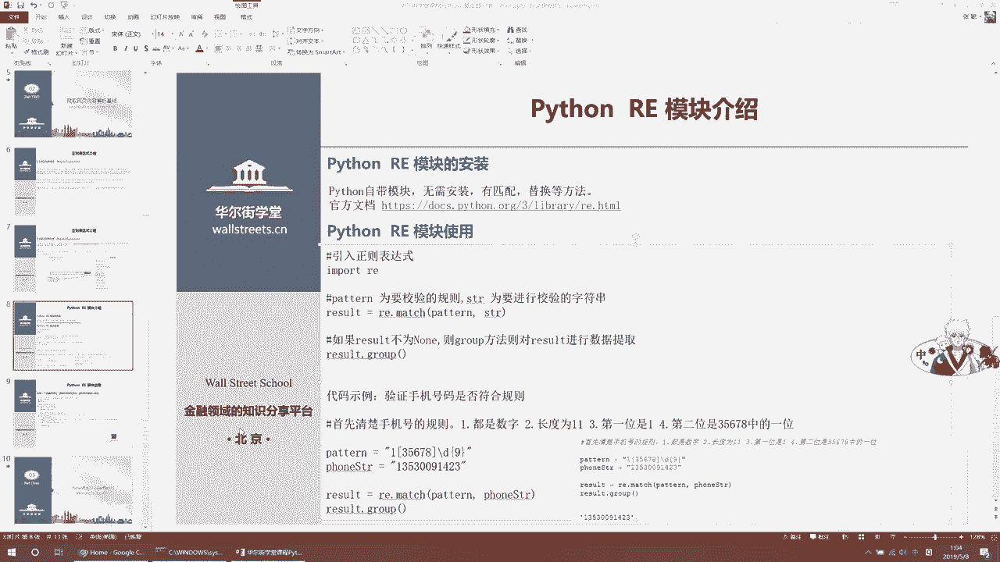

正则表达式，只不过呢这个正则表达式的嗯，匹配规则不太一样，那我们来看一下，它究竟是一个怎么样的匹配规则，首先呢这里的一呢，就是代表它只要匹配一个数字一，然后呢它后面的中括号则表示接下来的呃。

是接下来要匹配的这个文本呢，是这个中括号里面的一个。

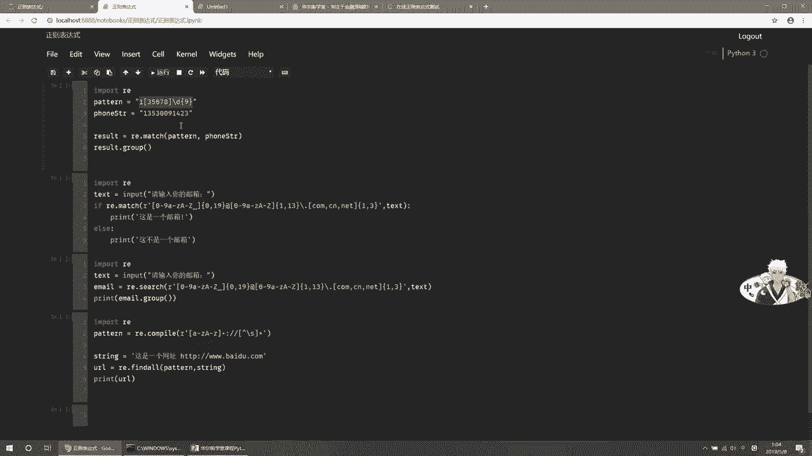

比如说呢他可以匹配三或者六或者八啊，随便匹配一个，那后面的这个斜杠D呢。

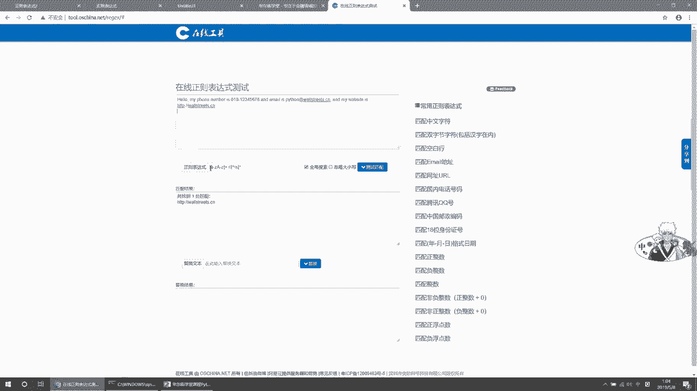

它表示的是要匹配一个数字，而后面的这个中括号呢，他则是表达了前面的这个要匹配多少次，这里呢是九，所以说前面的呢这个会匹配九次，也就是说我们这个正则表达式啊，他会匹配一个一开头。

然后第二位是35678中的一个，后面呢它会随机匹配九个数字，那我们这里呢定义了一个字符串，就是这些数字，然后呢，我们下面便会使用RE模块，来进行一个正则匹配，这里的RE点march。

它呢就是匹配的一种much呢，它表示从开头开始匹配，那也就是说嗯我们的这个正则表达式呢，它会从这个字符串的开头开始匹配，如果呢它开头可以匹配成功，它就会返回给我，他就会返回给我们这个成功的结果。

如果他开头呢不会匹配成功，那么直接此次匹配就结束了，后续呢即便有符合它匹配规则的这个文本，它也不会再去匹配了，那我们这里呢来运行一下，大家可以看到呢，我们是匹配成功的进行了一个匹配。

那这里的一呢大家看是可以成功匹配的，那后面的三也同样是可以匹配的，然后后面呢它依然是九个数字，那么呢这便是成功匹配了，那我们看这里呢我们是用了一个呃group的方法，这个group的方法它呢其实呃就是。

对我们之前所匹配到数据的一个提取啊，这里呢我们成功匹配后呢，通过group方法呢将它提取了出来，那我们再来看下面这个正则表达式，那这里呢我们同样先导入了RE模块，然后呢我们所匹配的文本呢。

这里我们使用input方式来进行一个键盘输入，那下面呢我们同样是这里用了，much方法来进行匹配，我们从开头开始匹配，我们来看一下这个呃正则表达式，那这个正则表达式呢，相比之前这个呃简单的数字匹配的。

正则表达式呢要长很多，但是呢呃我们来分开的理解一下，其实他还是很容易理解的，首先呢我们说这个中括号，我们说了，它其实就是表示，我们只匹配这些中括号中的一个，那这里呢0~9就表示了我们0123。

一直到九注这些数字，它会在这些数字中呢匹配一个A到Z呢，同样表示从嗯小写字母A开始，一直到小写字母Z，这中间呢它会随机进行一个匹配，大写A到Z呢，则表示从大写字母中进行一个匹配。

那下划线呢则表示就是匹配的下划线啊，那么他这第一块呢就是表示从数字0~9字母，小A到小Z，大A到大Z以及下划线中随机匹配一个，那后面这个中括号呢，它其实呃和我们上面中括号一样。

它表示的是前面这一个的匹配次数，也就是说呢我们这些东西呢，它会匹配19个字符出来，对，也就是说它会匹配19个，符合这些规则的字符出来，那后面呢这个at那它同样是只匹配一个at字符。

那我们看后面呢这个他其实又是一个重复的，只是比之前少了一个下划线而已，它呢表示匹配一匹配一次或者匹配两次，或者一直匹配13次，对这里呢是表示他的最少匹配位置，匹配次数，那后面呢则是他的最大匹配次数。

这里的点点呢其实在正则表达式里面呢，它表示匹配一次前面的字符，但是呢我们这里加了下划线，对这个点进行了一个转移，那这个下这个啊抱歉，这是呃反斜杠，那这个反斜杠呢加这个点呢，它就表示了点的意思。

对那这个他其实就是将这个点进行了一次转移，那后面呢这个中括号它也是同样的意思，从com或者CN或者net里面匹配一个出来，然后呢匹配一次或者最多三次，那我们现在呢来运行一下这段代码。

我们随便输入一个邮箱，那么看呢其实呢这并不一定是个邮箱，只不过呢我们这里啊，在定这个邮箱匹配规则的时候呢，我们只是把符合啊前面的是数字或字母，然后加上一个at。

后面呢数字或字母加上一个点com或者点CN，点net之类的，类似于这样一个形式的文本，我们把它认作是一个邮箱，所以说呢我们这里输入的这个字文本呢，它是符合我们这个正则表达式的，那我们来顺一下。

就比如说啊我们这里的一呢，他是匹配这个规则的，然后二呢同样，那我们这里呢一共是输入了六个字符，那他也在0~19之间，所以说呢这部分呢他会他已经成功匹配了，那么后续的at呢也一样，他也是成功匹配了。

然后这里呢它是匹配1~13次，我们这里呢是三次，也符合它的规则，至于后面的点啊，同样符合规则，com也符合规则，所以说呢他成功匹配了，那他在成功匹配之后呢，我们根据if条件进行判断呢。

就会打印出来这句话，这是一个邮箱，那我们再来输一个不是邮箱的，看一下是什么样的情况，看这里呢其实就是不符合它的规则了，那我们前期呢这个123他还是符合规则的，到这里的点呢就无法匹配了。

所以说呢他给我们打印出了下面这句话，那我们现在再来看第三个正则表达式，那这里呢我们依然是使用input，来接收一个输入的文本进行匹配，那我们下面呢这里就和上面不一样了。

我们这里呢用了一个search方法，那算式方法相比于上面的march方法有什么不同呢，其实它们的额区别呢还是很明显的，search方法我们刚才有说match方法是从头开始匹配。

如果说呢你最前面匹配不成功的话，则直接结束了整次匹配，而我们的search方法则不同，我们的search方法呢他也是从头开始匹配，但是如果匹配不当，它会继续向下找，一直到找到。

或者说到文本结束才会停止匹配，我们先来运行一下，看一下效果，那大家看这里呢，我们刚开始是输入了中文，这个表达式呢我们刚才也有介绍过，他是无法匹配中文的，它只能匹配呢数字大小写字母或者下划线。

所以说这里肯定是不能匹配的，那么一直到这个位置，到这个123这里才满足了它的匹配规则，所以呢他才会进行匹配，那一直匹配到结束，他呢会成功的完成这次匹配，这也就是正则表达式中呃。

search和much方法的一个区别，好那我们再来看下面最后一个，我们呢同样是先导入我们的RE模块，然后呢这里我们用了r e compare方法，那这个方法它和上面的search和much方法。

又有什么区别呢，那他这个区别呢还是非常明显的，我们的search和match方法呢，都是将文本呢对于我们的正则表达式，直接进行匹配，而我们的compare方法呢它则不同。

那我们这里看我们呢这个compare方法，它是先将我们这里的正则表达式呢，进行了一次编译，这次的编译呢会返回一个partner对象，对这个Python对象呢我们无法直接定义。

只能通过compile编译以后呢去返回这个对象，那我们在获得这个对象以后呢，就可以用这个对象呢去匹配这些规则呃，就比如说我们这里呢定义了这么一个规则，这个规则呢呃大家看着是不是很眼熟呢。

那他其实呢就是我们刚才呢，这个网址的匹配规则，那大家可以看这里呢，呃我们用了RE点find out，那find到all，他也是正则表达式中的一个匹配方法，它和search呢有点相同。

search呢是匹配完成以后呢就返回了，而我们的final out呢，它则会从头开始匹配，一直匹配到结尾，即便它会匹配出中途所有符合规则的文本，而我们的search呢只会再一次匹配到。

符合规则的文本后就结束了，那我们看我们这里传入呢，就是我们这个编译好的正则表达式，后续呢则是依旧是我们的匹配文本，这样做有什么好处呢，嗯就是我们写的正则表达式呢可以进行复用，下面呢我们来跑一下这个代码。

看他是个什么样的结果，那这里呢我们看他是成功的匹配出了这个网址，但是这看起来呢和上面的search似乎没什么不同，我们来增加一下这个字符串的长度，我们再加一个符合匹配规则的文本，我们现在再来运行一下。

那可以看到我们前面呢这个网址被匹配了出来，后面的这个网址呢依旧被匹配出来，它最后呢是以一个列表的形式，将所有匹配到的文本呢返回给我们，这呢就是final all和search的区别。

这呢就是我们Python re模块和正则表达式的使用了，那么现在呢我们正则表达式也讲完了，我们再返回去看一下，我们最早先呢获取这张图片的时候，我们是直接使用了右键，然后拿到这个图片对应的地址。

再去使用request的模块呢去获取这张图片，那现在呢我们掌握了正则表达式，这个强大的工具以后呢，我们就不需要如此了，我们呢只需要在整个这很长的HTML文本里面呢，去匹配出来我们想要的这个链接呢。

我们就可以直接拿到这张图片了，那么下面呢我们来做一个小的图片爬虫，我们来爬取呢一些百度贴吧的一些图片，我们先来打开我们的jupiter notebook，那这里呢就是本次百度贴吧图片爬虫的代码嗯。

大概就这么多，那我们呢先去我们要爬取的页面，去看一下这个页面它长什么样子，那这就是我们这次要爬取的页面了，那我们的目标呢也就是这些图片数据，那在进行代码编写之前呢，我们还是先来简单的回顾一下。

我们来来看一下爬虫程序实现的四个步骤，那首先呢就是发起请求，然后呢获取响应内容，我们呢就按照这个流程来实现，我们的这次爬虫代码，那首先呢我们依旧是导入我们的两个模块。

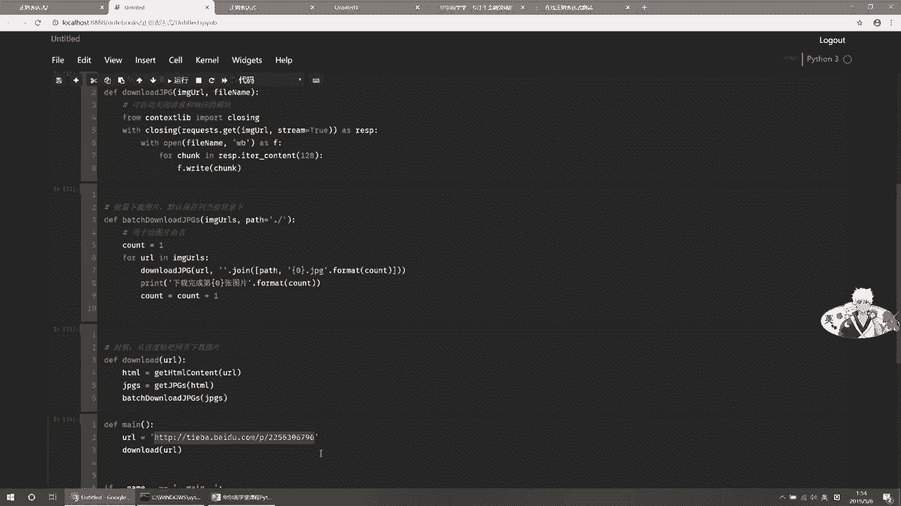

然后呢，我们进行我们爬虫实现的第一步发送请求，那这里呢我们依旧是使用request点get方法，进行请求的发送，那可以看到我们相比于之前的那个爬虫呢，我们在这里并没有加上haters字段。

那这是为什么呢，这是因为啊百度贴吧呢，他对于爬虫的限制并没有那么高，即便是我们不加header字段呢，他依旧不会对我们的爬虫进行封杀，所以说呢这里我们就没有加黑的字段。

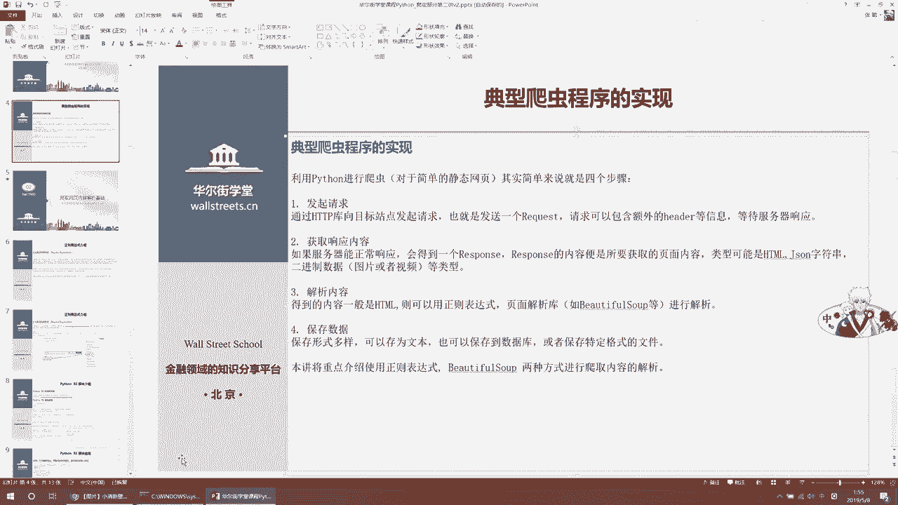

但是呢我们依旧可以获取我们想要的数据，那我们使用get request点get方法发送请求以后呢，我们就会获得服务器返回的响应，也就是我们的第二步获取响应内容，那这里呢我们将响应内容的文本呢。

进行一个返回，那我们来调用一下这个方法，看它会返回一个什么样的结果，那我们先把我们的呃URL呢进行一个复制，然后我们粘贴在这里，我们打印一下我们所获得的内容，好那大家看这里。

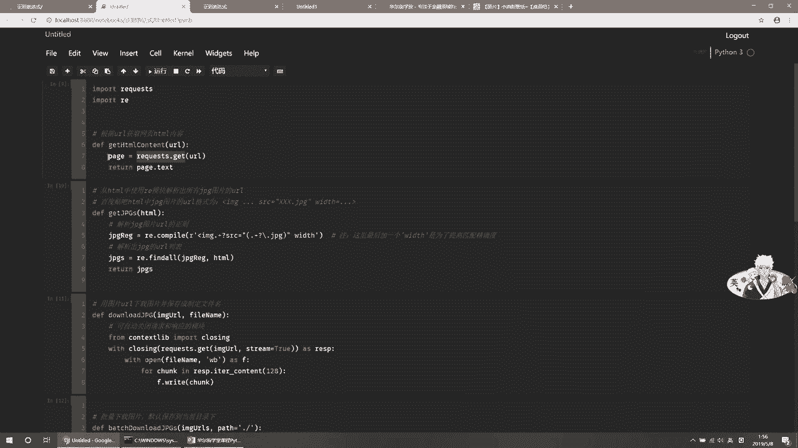

这又是一段熟悉的HTML代码。

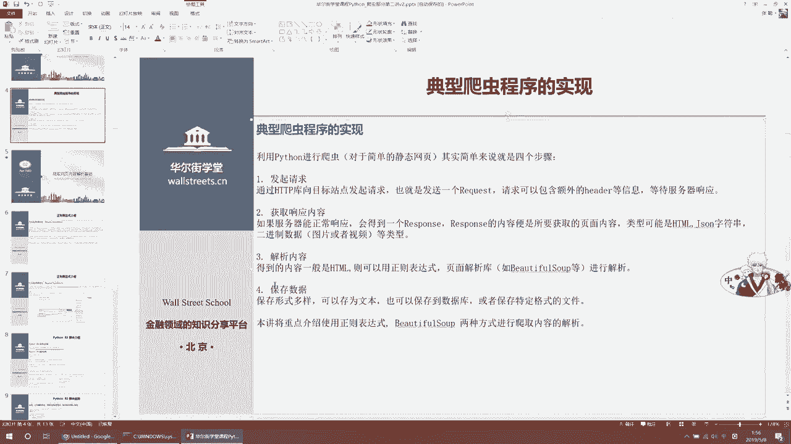

那这里呢我们已经成功的获得了服务器的响应，那获得服务器的响应以后呢，我们就要进行我们的第三个步骤，解析内容，那在这里解析呢，我们使用的是我们强大的正则表达式，那我们看啊，这里的代码呢。

看起来并不像我们浏览器里面看到的那样，比较清晰，所以说呢我们返回我们的浏览器去查看一下，我们这些代码，它索要，所对应的链接啊。

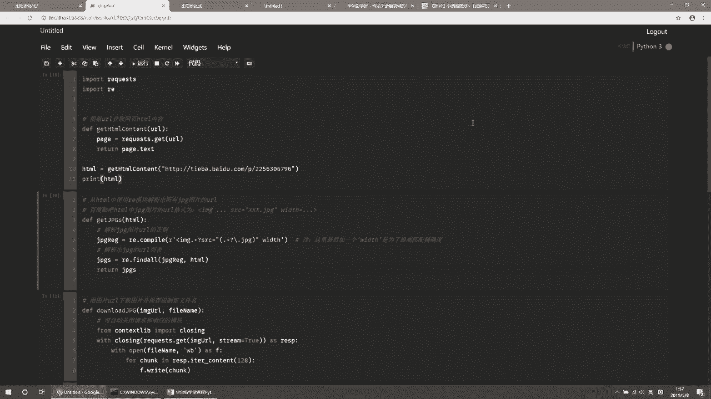

到底适合一个什么样的匹配规则，那我们依旧右键检查，我们来看一下，那大家看这里呢就是它所对应的这样一个文本，那我们来看一下其他的是否和他一样呢。

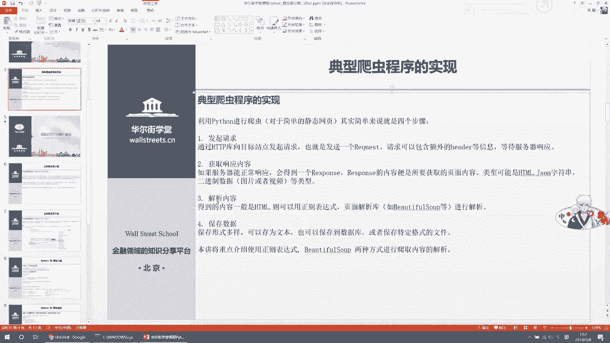

啊我们看跟刚才那基本上是一样的。

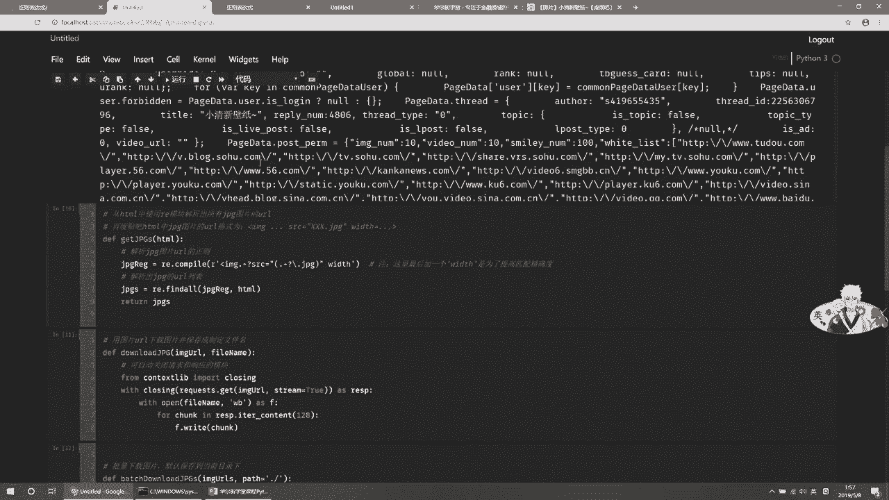

只是中间的这个链接地址有所改变，那现在呢我们来粘贴一份，我们来看一下，我们新建一个CEL，把我们粘贴的HTML代码放在这里，我们来看一下它具备什么样的特征，那首先呢以尖括号和IMG开头。

那我们看我们这里的正则表达式了啊，也是具备了这一点，然后呢我们这里使用了点加号和问号，那这代表什么意思呢，点点呢它其实表示了呃匹配，以表示匹配一次一个字符，那加号呢表示呃匹配前面字符一次或多次。

而问号呢表示匹配前面的字符零次或一次，那在我们正则Python的正则表达式里啊，那加上问号呢，就会使我们的正则表达式变为一个非贪婪模式，那什么叫非贪婪模式呢，就是我们的正则表达式啊。

默认的是尽可能多的去匹配，而加上问号呢，它就会匹配就结束了，而且不不会是啊，能匹配多少，他就去匹配多少，然后呢我们再看后面后面呢，呃我们这里是S2C，那S2C等于的这一个这一串文本呢。

它其实就是我们想要的链接，那我们这里呢同样对他来编写一个正则表达式，那我们这里用了括号，括号呢表示一个组，他就表示了呢啊我们这里的正则表达式呢，它是代表了一个组，那点呢点加号问号呢。

它表示的意思呢和前面是一样的，后面的反斜杠点它就代表了啊一个点，然后JPG也就代表了后面的这个JPG，也就是我们的后缀，那我们看我们匹配到这里呢，实际上就已经结束了。

但是呢我们正则表达式里还是出现了一些嗯，可能和我们想匹配链接不相关的字符，那这个字符的出现啊，它实际上就是保证了，我们正则表达式的一个准确性，那我们后续呢匹配这个一旦匹配到这个呢。

就代表我们前面的正则表达式了，已经确确实实的是匹配完成了，所以他说这个他虽然和我们的链接呢，没有直接关系，但他变相的提高了我们匹配的一个精确度，那有了我们的正则表达式呢。

这里呢我们使用了compile方法，对我们的正则表达式进行一个编译，然后呢我们将编译好的正则表达式呢传给final all，并且将我们上一步呢所获得的HTML文本呢，也传递给find out。

那find all，方法呢就会根据我们编译好的正则表达式，在整个HTML文本中，匹配出所有符合这个标准的文本，并且呢把这个文本呢进行一个返回，那我们现在来调用一下这个方法，看它会返回一个什么啊，我。

们来运行一下，那大家可以看我们这里呢返回了诸多网址，那这个网址呢也就是我们这个图片的链接网址，我们可以来对比一下啊，其实呢也没必要对比了，那大家看我们这个网址的后缀呢点JPG。

那这其实呢它就是我们的这个图片的链接地址，那这里呢我们已经成功的，匹配到了我们这个当前网页中的所有的URL链接，那么有了这个链接呢，我们就可以使用request模块，像我们最早先获取我们一张图片那样。

去获取所有的图片，看这个页面的呃，图片还是非常多的，那我们来看第四步保存数据，那现在呢我们这些数数据的啊地址呢，我们已经获取到了，接下来呢我们就要把它写入本地文件当中。

那这个方法呢就是我们写入本地文件的方法，这里呢我们先是呃导入了一个context，lab中的一个clothing，那这个clothing呢它表达了什么呢，它的作用呢是将我们当前的连接进行一个关闭。

那下面呢啊with open呢，便是将我们请求到的数据呢，进行一个文件的写入，这里呢同样是使用了二进制，那这个方法呢，它其实是我们单个图片文件呢进行一个写入。

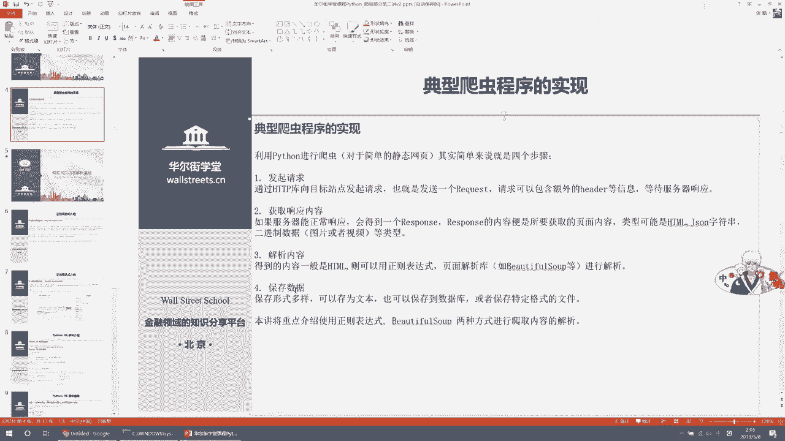

那我们刚才看到我们呢所获得的链接呢，有非常的多非常的多，所以呢我们在这里呢再定义一个方法，它用于呢使用一个for循环，然后将我们所获得到的链接呢，依次进行一个request的访问，并将获得的数据呢啊。

依次的去写入到本地的图片文件，那我们呢现在来运行一下这个方法，我们来运行一下，那我们可以看到这里呢一已经图片已经在下了，一共是下载了50一张，那我们呢我们这里图片存储的路径啊，默认呢是当前文件夹下。

我们现在返回当前文件夹来看一下，这里呢我们的图片呢已经进行了一个存储，我们来点开看一下，那这呢其实就是我们刚才看到的这张图片了，那后续呢这些图片呢，它其实啊全都是我们这个网页上的图片。

那这样的话呢我们的图片爬虫呢就已经写好了，那我们掌握正则表达式以后呢，是不是就非常方便了呢，就不像我们刚才那爬取图片的时候，还需要自己去寻找链接，然后自己去粘贴这个链接，后续的啊这些代码呢它其实是对了。

与我们上面拆分这些代码的一个呃封装，使我们的代码呢看起来更加的紧密，然后使维护起来呢也更加的方便，那我们的这个百度贴吧的图片爬虫呢，到这里就算完全完成了。

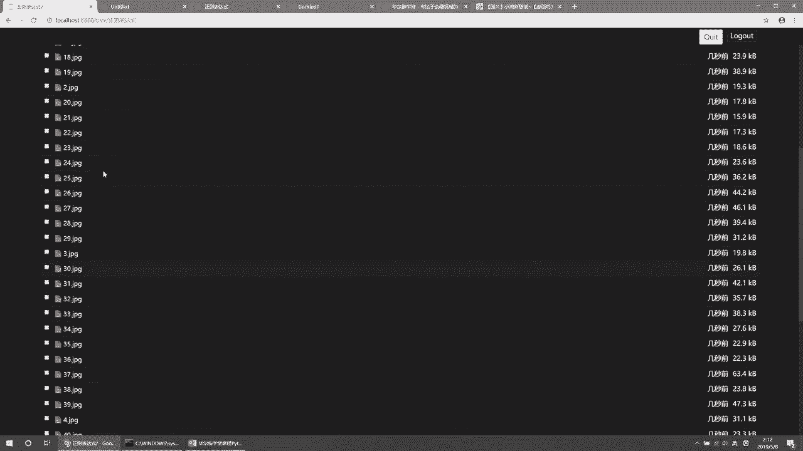

但是呢虽然我们这个图片的爬虫它完成了，如果说我们所获取的数据它并不是图片。

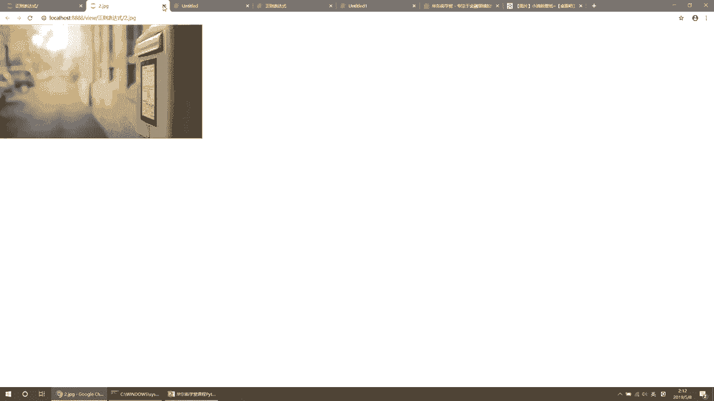

而是呃类似于文本或者说数字这样的信息，那我们这样来做还合适吗，啊其实并不太合适，因为额数字呢和文字它并不像图片这样哦，看起来比较的清晰，数字呢它需要非常多的数字，才能体现出这些数据的价值。

而我们的数字如果说像文本一样挤在一起，排列在一个文件中呢，那可能我们根本看不出来这些数据有什么价值，嗯更谈不上对这些数据进行分析了，那么接下来呢，我们来介绍我们本节内容的第三部分。

也就是我们的pandas模块，那panda翻译成中文是熊猫的意思，那pandas模块呢它对于Python来说的重要性，其实呢跟熊猫对于我们的重要性差不多，那我们现在来看一下pandas模块呢。

它到底是什么，那pandas模块呢，它其实是Python的一个数据处理和分析工具，它可以让Python高效地去操作大型的数据集，同时呢，它还提供了大量可以快速处理数据的方，法和函数，那么除了这些功能呢。

它还可以去操纵我们本地的文件，比如说像CSV文件或者像我们的excel文件，它都可以进行一个读或写的操作。

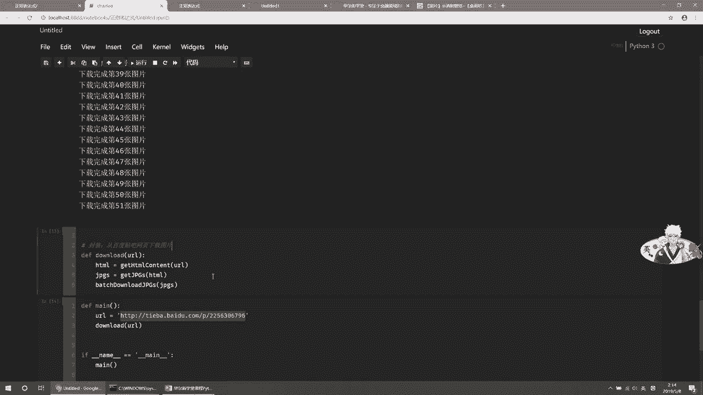

那么我们如何来使用pandas模块呢，那因为pandas模块呢它并不是Python内置的标准库，所以呢我们在使用的时候呢，需要用我们的pip命令进行一个pandas的安装。

但如果说我们的环境呢是一个安德康的环境，那我们就不需要再进行自己安装了，安娜康纳他呢是自带path pandas模块的，接下来呢我们通过一个小小的实验，来学习一下pandas模块的一个具体使用。

那我们的这个实验呢主要是使用pandas，来对于我们本地的excel文件，进行一个读和写的操作，我们呢现在先来新建一个excel文件，然后用于pandas的读操作，那这里的excel文件呢。

我这里已经是嗯建好了，我们来看一下，他的数据呢很少只有这么一点，然后呢我们现在来编写代码，我们打开呢我们的JUPITER新建一个文件，然后呢我们来看我们的这些代码们，来直接粘贴一下就好了。

这里呢呃因为我们的那个路径呢，文件路径是在桌面上，所以说呢我们在这里把文件路径替换一下，那我们现在来改一下嗯，我们直接把刚才的路径粘过来，那现在呢我们的路径已经修改完了。

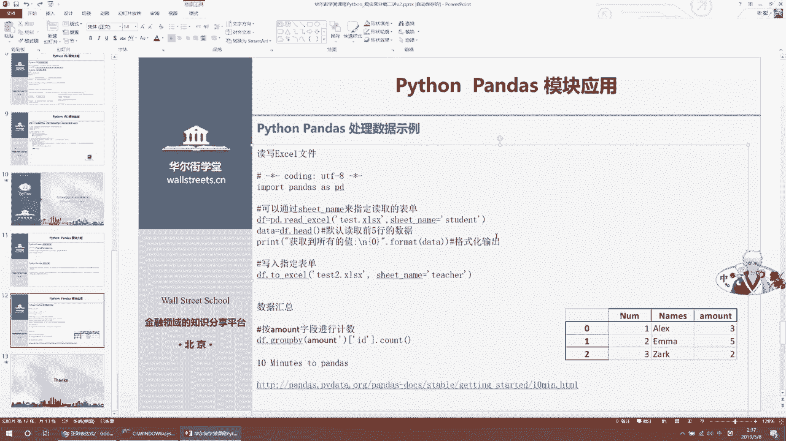

那我们再来把程序中一些有问题的地方呢，稍微来修改一下，先把这个注释掉，嗯然后呢我们来解读一下这些代码，首先呢我们还是import导入我们的pandas，然后为我们的pandas呢起一个别名pd。

这样呢方便我们后续的一个调用，那这里呢我们使用了pandas中的read excel方法。

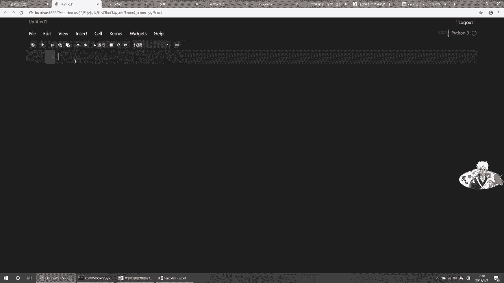

来读取我们的excel文件。

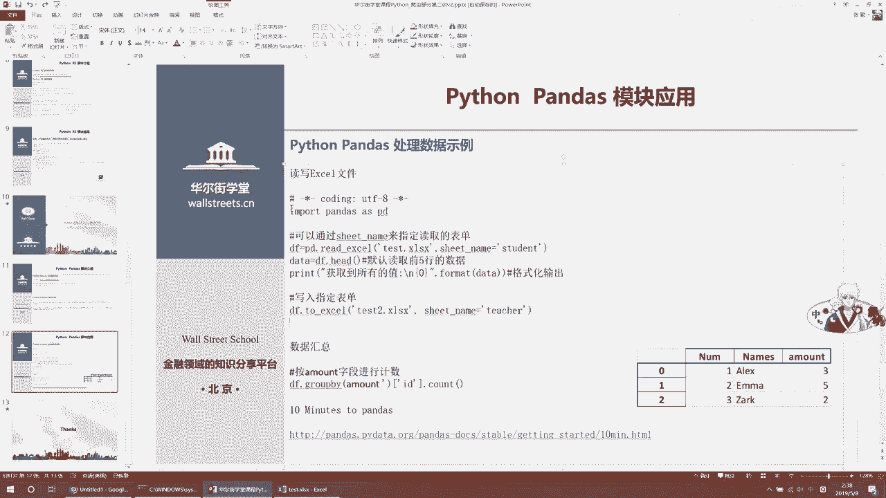

那像这样的方法呢，在pandas中呢它并不唯一，呃比如说呢我们读取CSV文件，那这里呢我们就可以用read杠，CSV来进行一个CSV文件的读取，所以说它的使用上呢是非常简单的。

那我们在读excel文件的时候呢，里面有一个属性，就是这个属性，那它有什么用呢，它其实呢就是指定我们所读取的哪一部分内容，我们看呢就像啊它呢其实就是下面这个东西，那我们这里呢是student。

所以说他呢就会去读student这部分的内容，下面呢呃我们这里有一个嗯DF点head的，那这个head呢，它其实就是表明了，我们呢去显示头部的那几行数据，它的默认值呢是五。

当然呢我们这里可以修改它的参数，然后呢，我们这里呢会把这个读取到的值呢，进行一个打印，下面这这一步呢，嗯则是把我们的数据呢进行一个写入，就是我们刚才呢在这里读取到的数据，进行一个写入。

写到一个新的excel文件里面，那这个excel文件呢，这个文件呢已经在我的桌面上。

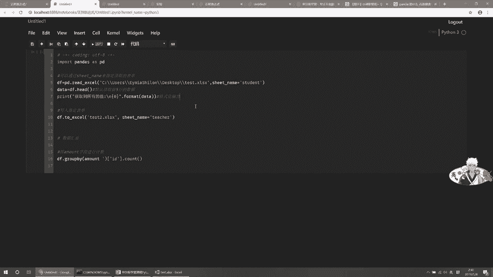

我们来看一下，就在这里，那我们先把它删掉。

删掉以后呢，嗯我们先来看下面这个代码，这个代码的意思呢，它是用于我们的一个呃数据分析的作用哦，这里呢我们先修改一下，这里是因为中英文的问题，然后呢因为我们在新建数据的时候啊，里面并没有id这一栏。

然后呢我们看一下我们刚才新建的数据，我们把它换成number，然后呢我们来运行一下代码，看一下效果啊，不过呢在运行之前呢，我们依然是修改一下路，为了方便我们查看文件，我们先修改一下路径。

把这些东西呢都放在我们的桌面，那我们现在来运行一下，那大家可以看到，首先呢是我们对于这个数据的一个读取，那这里呢其实呢大家可以看这个数据呢，其实就是我们这里显示的数据，只不过他在读取的时候呢。

默认的为我们添加了一些数字，那这些数字呢，它其实呢就是我们pandas里的一个额数据结构，叫data frame，那这个data frame呢，它是需要额行每一行的名字和每一列的名字，因为我们没有了。

所以说它自动为我们添加了这个每一行的名字，就是012，那我们再来看这个啊，我们这里呢是写入了这个test2这个excel文件。

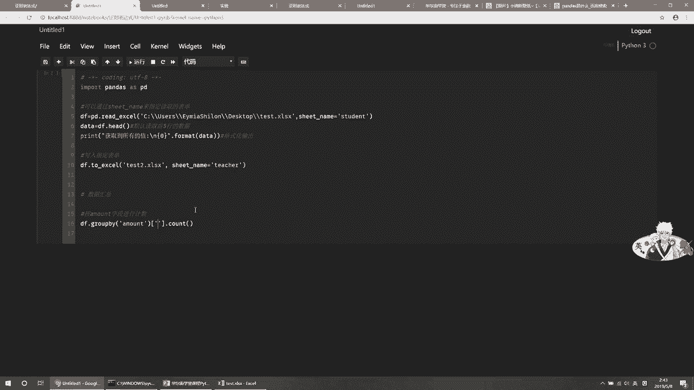

并且呢把我们的这个sheet name指定成了teacher。

我们来看一下它是否生成了这个文件，那大家可以看到这里呢，我们已经生成了这些文件，那我们的写入呢也成功了，那现在呢我们再来看最后一个，按我们的这个amount字段进行一个计数。

那大家可以我们打开我们的原始数据啊。

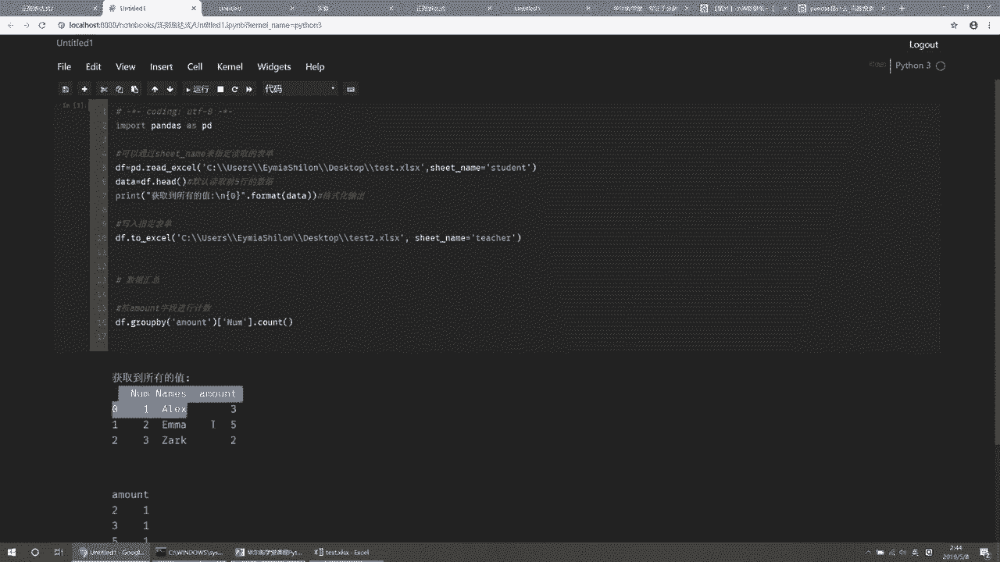

我们不用这里已经打印出来了，那我们根据这个打印出来的数据呢。

来进行一个对比啊，首先呢amount为二的时候呢，它只有一个，然后三和五呢它依然都是只有一个，那我们pandas中呢类似于group by这样的函数呢，还有很多，这里呢我们就不一一为大家进行介绍了。

那如果大家想继续额深入的去学习一下，pandas as呢，大家可以去官去pandas as的官方啊，网站上去看一下官方文档，那这个呢就是它的一个，官方文档的地址。

这里呢有非常详细的pandas as的方法的描述，大家有兴趣的可以去学一下，那么啊我们本节课的内容呢到此就结束了。

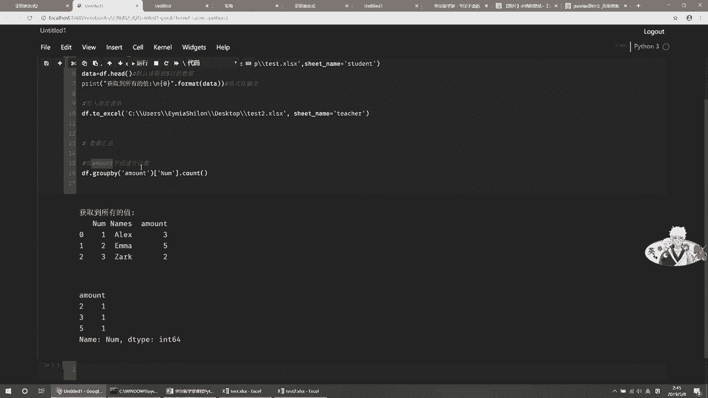

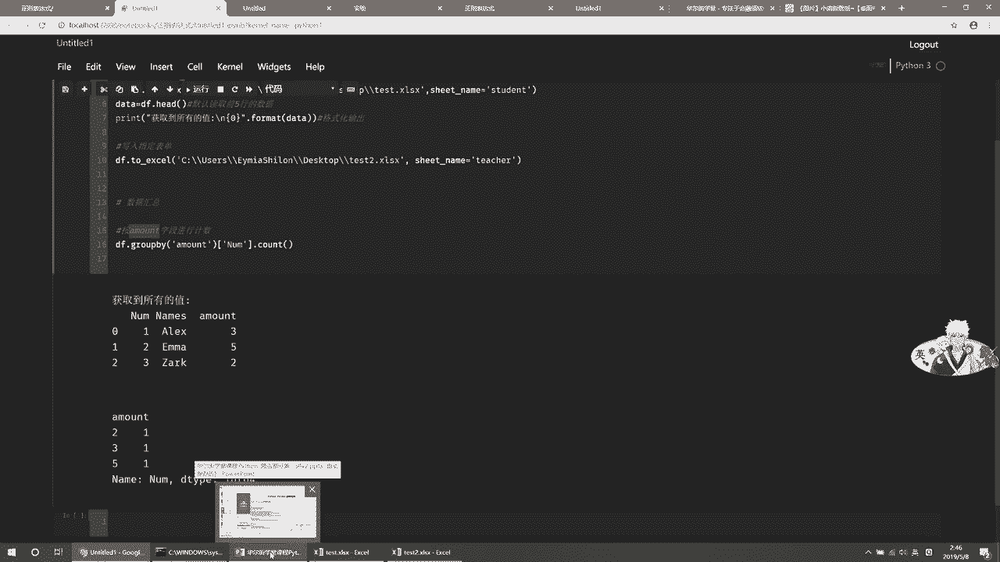

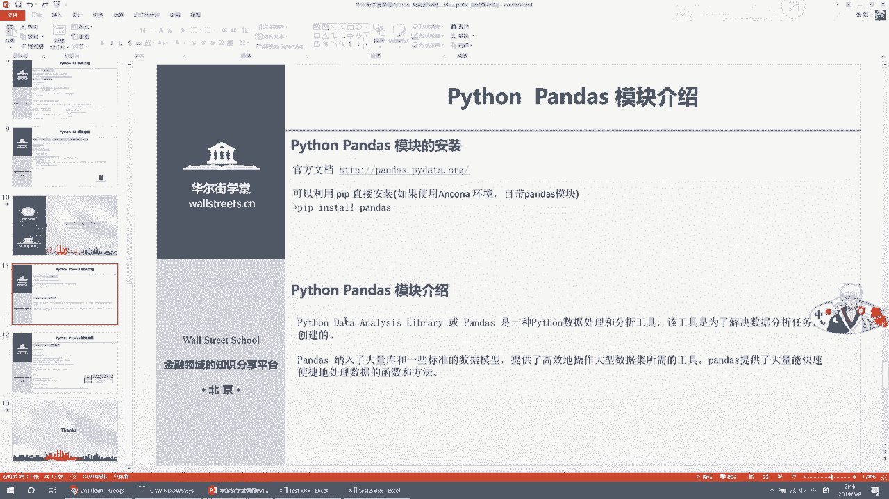

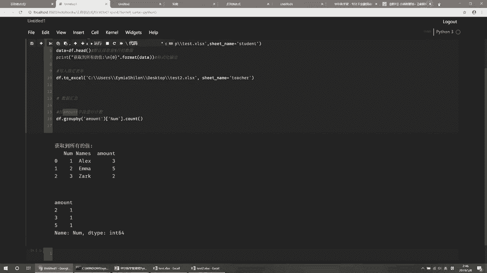

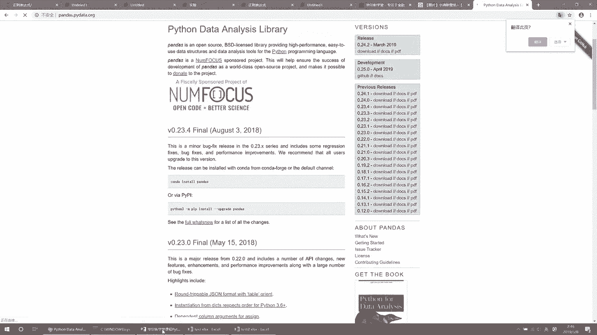