# 14天拿下Python金融量化，股票分析、数据清洗，可视化 - P17：05 爬虫案例详解 - 川哥puls - BV1zkSgYZE54

各位同学大家好，今天呢我们来学习我们的第五讲爬虫案例详解，本节内容呢会为大家来实现一个，具体的爬虫案例，那这个案例它所代表的场景呢，会是大家以后在写爬虫程序的时候，经常遇到的一种场景。

那么我们这个案例呢主要是爬取一下，那这个网站呢啊和他的具体实现方式啊，我们一会呢会给大家有一个详细的介绍，那在正式开始本讲内容之前呢，我们先来回顾一下我们之前所讲到的东西，那因为这个案例呢。

它是对于之前所学知识的一个综合运用，所以呢我们来先来简单的回顾一下，那这里呢哦不知道大家还有没有印象，那首先呢我们来看这四个标题，发送请求，获取响应，数据提取和数据存储，那这个呢是我们之前就有讲过。

爬虫实现的四个基本步骤，那我们来系统的来回顾一下，首先呢是发送请求，这个呀是我们书写爬虫程序的第一步，就是向对方的服务器去发送一个请求，那即便是我们人呢在正常访问网站的时候，第一步也是这样的。

那我们之前啊在发送请求所使用的一些库中，我们基本上只使用了这个request模块，至于下面的url lab和HTTP clinch呢，我们啊只是提了一下，也没有说它具体的一个使用。

那其实request模块呢，它已经能满足我们基本上所有的需求了，那我们在使用这个模块的过程中呢，我们最常用的方法其实就是这个啊，request get get方法咳，那我们在用这个方法的时候呢。

基本上每次都会用到这两个参数，URL和hers，那URL呢就是我们所要访问的这个链接了啊，HELLS呢嗯就是我们之前有给大家提过，就是我们打开我们的浏览器，然后我们选中F12，然后刷新一下。

啊我们找到啊，就是这里的这些信息啊，我们之前有给大家说过说啊，最好每次在写爬虫程序的时候呢，都要把这个user agent给带上，这呢也是最简单，也是啊最重要的一环，那我们在对服务器发送请求以后呢。

我们会获得服务器返回给我们的一个响应，Response，我们在使用这个response的时候啊，我们最常用的几个属性呢，好就是这里的这三个，那首先我们来看最后一个。

这个其实我们在呃学习的过程中很少用到啊，因为我们它的作用呢，其实就是打印我们请求的状态嘛，啊那一般我们请求呢都会请求成功，而这个请求成功返回的状态码来都是200，所以说我们很少啊去管它。

但是说如果以后我们写的爬虫程序，出现了一些异常了，其实大家就可以去打印这个状态嘛，看他是否有没有正常的去请求成功，那除了这个状态码以外呢，啊我们还用到了两个属性，text或TCONTEXT。

那这两个的区别不知道大家还有没有印象了，我们经常啊是使用了这个text属性，那就是说呢把我们啊所请求到的这个HTML页面了，去打印出来，那我们呢偶尔也用也用到了这个context。

那大家不知道还有没有印象呢，啊我们在哪里有用到呢，我们之前啊在请求那个图片保存图片的时候，是有用到这个context，它的作用啊，其实就是针对于那些二进制的数据，那处理获取到响应以后啊。

啊其实就是一个数据提取的过程，我们在数据提取的这个步骤中呢，给大家介绍过啊，下面这四种工具，第一个呢，呃就是我们最早先有学习到的正则表达式，然后下面呢是我们额前两节课程中。

有给大家详细介绍过的beautiful soup啊，至于后面这两个呢啊，我们在前面的课程中有给大家提过一次，但是我们并没有去详细的去解释啊，也没有去介绍这其中的一些方法嗯，但是呢呃我们不介绍它。

并不代表它不重要，只是说呢呃前面的这两个它可以去满足我们嗯，大部分需求呃，碰到一些特殊的情况呢，我们还需要后面的这两个模块来解决啊，在我们爬虫程序中啊，就是我们没有必要说啊，我们只讲了前两个。

所以说大家就只用前两个，或者说我们重点讲了并beautiful soup，然后大家就只去使用beautiful soup呃，其实为了我们以后呃爬虫程序写的更加流畅，然后数据提取更加快捷。

这些呢方法呢大家其实都有必要去掌握一下额，至于后两种，虽然我们没有讲，但是大家可以在以后爬虫的学习中啊，自己去学习一下，那正则表达式啊，我们之前说他很强大，他基本上呢可以适应所有的文本匹配的场景。

但是呢它写起来实在是太困难了啊，一大串乱七八糟的字符进行一个组合啊，有的时候呢还会出现一些莫名其妙的错误，所以呢我们重点学习了beautiful soup，那它的使用呢就非常的快，呃简单方便。

但是呢呃它的使用效率是不如我们的，正则表达式的，那关于这个beautiful soup的一些使用方法，大家还有印象吗，哦我们来找一下来做一个简单的回顾。

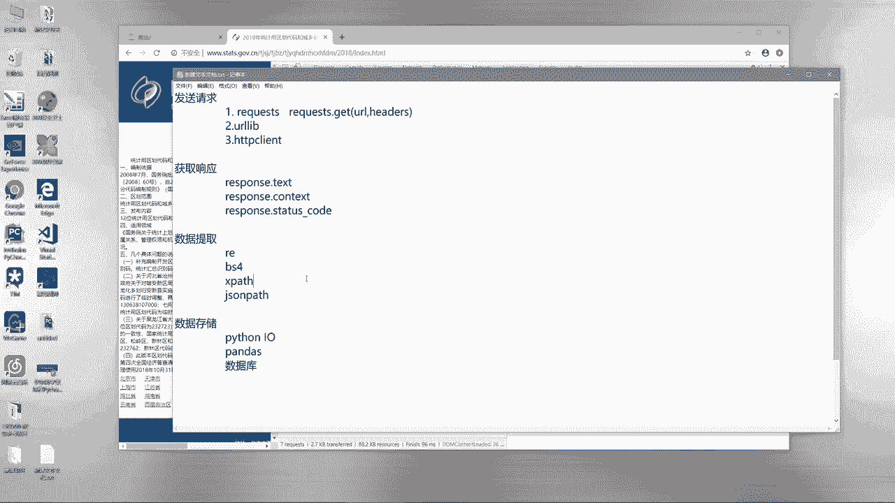

嗯具体的文件呢我也不知道放在了哪里，但是嗯相信它的使用，大家应该还没有忘记嗯，就是如果我们要提取对应标签标签里的数据呢。

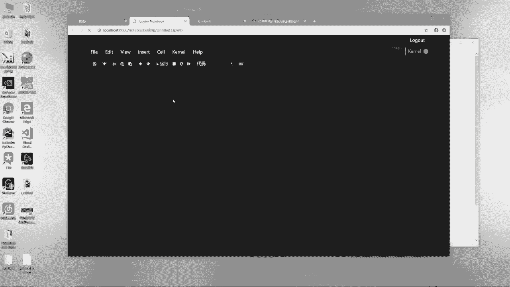

啊我们只需要呃创建一个beautiful soup这个对象。

然后呢我们只需要点出来这个标签呢，我们就能拿到他的数据，那这里呢就是我们之前在讲解，比如for soup的时候呢，一个详细的代码实现，大家再来看一下这几个方法，那主要呢就是这里对我们点出来标签呢。

就可以获得对应标签的数据，像P标签，然后A标签还有这个选中所有A标签，这样呢就是我们beautiful soup的一个呃，具体的使用如果大家有忘记的话，建议先去看一下这节课我们都是会使用到的。

那在学完数据提取以后呢，哦我们还就只需要把我们提取到的数据了，进行一个本地的保存，那最简单的本地保存啊，就是使用我们Python呢进行一个文件的写入操作。

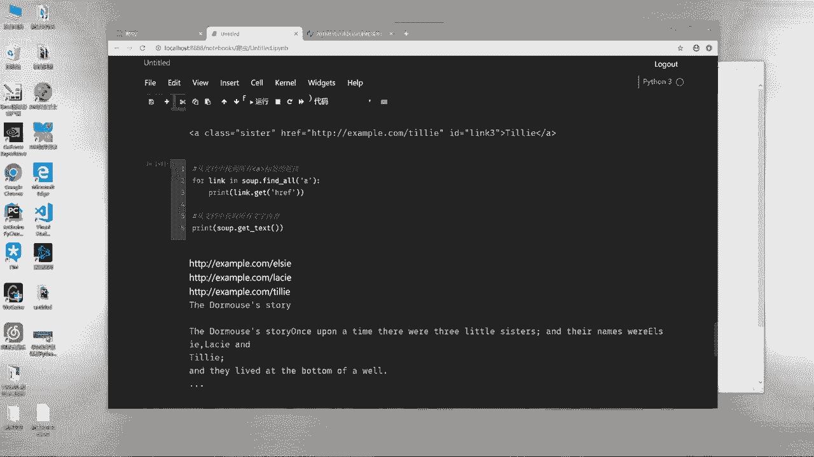

就是我们的IO操作，那就是简单的保存成我们一个本地的TXT文件，就可以了，但是这样呢其实并不好，所以呢我们在后面啊，给大家介绍了一个模块叫pandas，那我们之前呢也有用pandas来实现了。

这么一个excel文件的读取，然后和写入用起来还是很方便的，那除了pandas as呢，这里还有一个数据库，这个数据库啊，它其实就是我们平常存储啊爬起来的数据，一个最好的工具。

但是呢我们本节本质这个爬虫课程呢，并不涉及数据库这一块呃，但是Python呢它是对于一个数据库有很好的支持的，大家可以在课下自己去了解一下这一块，那讲解完前面这些内容呢，我们又给大家讲了爬虫的翻页机制。

那这个翻页呢主要是分为啊，我们像日常的点击下一页，或者说有数字页码的时候呢，我们只需要去寻找那每一个页码呀，它对应的这个URLL的一个规律，便可以实现这么一个简单的翻页，那后来呢我们在爬取豆瓣的时候啊。

我们遇到了一些奇怪的翻页机制，比如说呢它只有点击加载更多，或者说滚轮下下下拉的时候进行一个翻页啊，或者说它本身并没有翻页，只是加载了一个数据，那这样我们呢当时就是在浏览器的F12中，去寻找这个XH2。

然后呢这里会出现一堆文件，我们就去一呃去找了这个文件，那这个数据呢它其实就藏在这个文件里，那这样的加载数据的方式呢，其实我们之前也有给大家提过，我们把这个呢称为动态加载。

对他呢是通过JSON进进行一个加载，而我们找到了那个啊，他其实就是杰森的这个数据文件，那讲完翻页以后啊，我们还给大家讲了一个深度优先和广度优先的，这个算法思想，那这个这个思想呢。

其实我们在这节课里就会用到，那我们来还是来回忆一下所谓深度优先呢，就是如果说我们的这个URL啊，它下面它含有子集的URL，那么我们就会优先去向下寻找最底层的URL，然后把最下面的URL找到以后呢。

我们就一次一次往上翻，就像这样啊，我们找到这个以后呢，如果它下面还有，我们就继续进去一个一个找诶，一直找到不能再找了，我们就往回退再找，这个就依次依次回去，那这个呢我们就把它叫做深度优先。

那什么是广度优先呢，就是我们把这一页的所有的东西呢都找到，我们再进去再把这一页找到，就这样一次一次一级一级的往下走，那这个呢我们就把它叫做广度优先好，那我们呢这是对之前学过的内容，进行了一个简单的回顾。

那除此之外呢，呃之前呢也有同学呃发过一些小的问题，那这些问题呢其实都暴露了一个很明显的问题，可能呢呃是大家会犯到会犯的一个问题呢，这里给大家简单的说一下，就是说我们这些工具啊。

像我们的啊request url lab，或者说我们的BS4和x pass，它都是为了方便于我们更好的呢去实现爬虫，这个程序，它本身呢并不存在说谁优或者说谁劣，那我们再去选择这个工具的时候。

去选择自己呃，用起来比较顺手，或者说自己比较喜欢的这个模块就好了，没有必要去纠结于用哪一个模块来实现更好，这个呢其实完全看场景和自己的需求，我们来正式开始我们这个案例的实现。

那我们呢本节课主要获取的这个数据啊，是嗯我们这个18年所有的城市数据，那他长什么样呢，刚才大家应该也有见到这个网站，我们来看一下，这个网站呢它其实就长这样，那可能有人说这样的网站它能有什么价值呢。

其实每一份数据都是有价值的，如果说这份数据嗯看起来没有价值，只是因为它的数据量没有达到，那这里呢只是列举了一些省份和直辖市，它好像并没有什么用处，那我们随便找一个点进去。

我们看他每一个省份下面都会有更详细的啊，市级数据，那市级点进去以后呢，它还会有一些区区呢点进去有街道，街道一直到奥委员会，那这是一份很详细的数据，它是记录了，就是我们看啊，一共有几集目录好，这是第一集。

第二集，第三集四五，它一共有五集目录，那大家想想我们刚开始只有32，32个啊，小的数据，那五级目录下去呢，它是会有非常多的数据的，那当然这个数据呢，呃他对于可能对于我们以后啊在做数据分析。

或者说其他方面的时候，这个数据量可能还会小一点，但是这么一个场景，大家看这个学它是一个层层嵌套的过程，那这种数据爬取的场景啊，我们以后啊会经常遇到的，那这里大家有没有回想到。

我们刚才在呃给大家回忆以前学习过的知识中，这就应对了啊，我们刚才所说的这个，深度优先和广度优先的问题，那大家觉得这么一个网站，我们用哪一种思想来解决会比较好呢。

那好我们还是先打开我们的juicer notebook，这里呢这个代码啊我已经哦准备好了，一会儿呢我会给大家来详细的解释一下，那在这之前呢啊我们先来看一下，如何就这么一个层级目录，一层一层的嵌套呢。

我们如何去解决这个问题，去爬取这个数据，那可能有人说哎这个很简单，我们我们先来写一种思想。

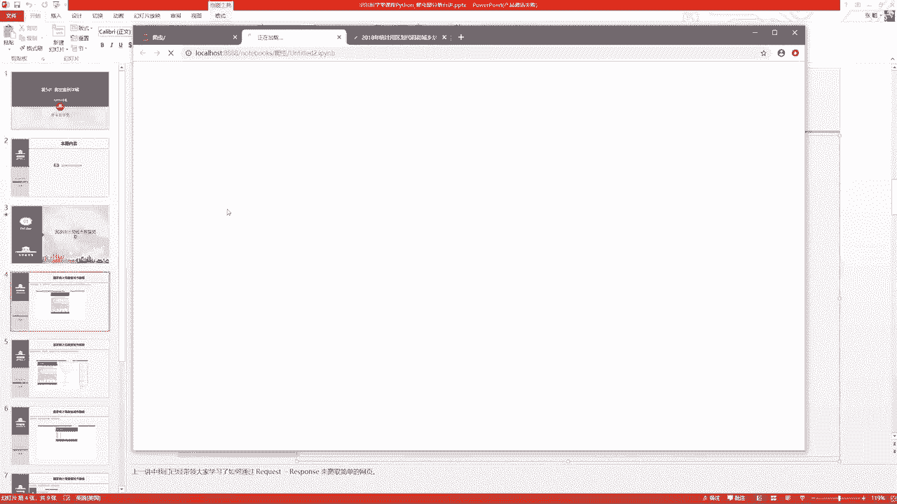

看大家啊，有没有有没有人想到这样啊，我们先做一个for循环，然后呢那我们对第一层进行便利。

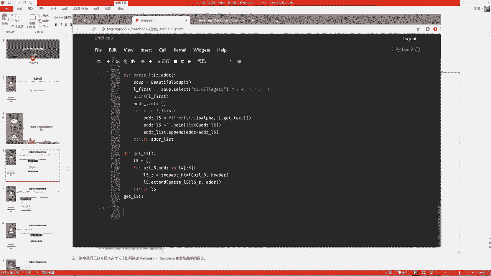

那第一层获得到的数据中呢。

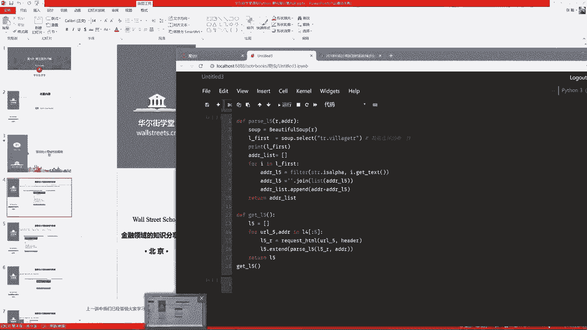

那我们在便利二级目录。

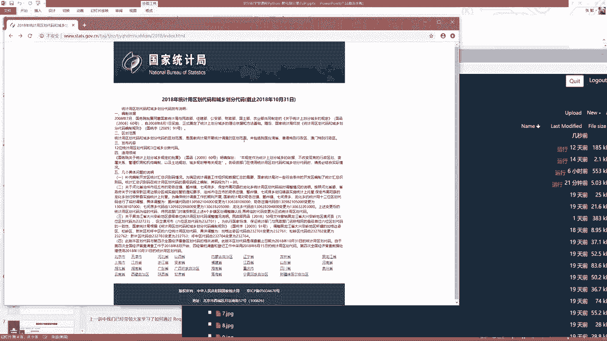

我们再来一个for循环，呃我们看电力二级流，然后呢我们再点三级目录，就这样一直下去，那这样的话我们可以套上四五个for循环，大家觉得这样是不是解决起来很简单，但实际上并不是这样的代码。

大家在生产过程中呢是不要触碰的，for循环这个东西呢，哦我们最多最多进行嵌套三次，甚至说两次就够了，因为这个东西它循环起来是很恐怖的，而且如果说我们在循环一个过程中出了问题。

那么它就有可能陷入一个死循环，或者说他会平白无故的增大很多计算量，然后占用我们的资源，还得不到什么好处，所以说这个是要避免的，它虽然看起来很简单，那除了这个呢，我们再来给大家介绍一个思想，这个思想呢。

不知道大家之前有没有听说过叫递归，那什么是递归呢，好我们来看一下递归呢，它其实就是一个简单的方法，比如说呢啊我定义了一个函数，那额我这个函数中呢写了很多东西，那我在这个函数没有结束之前，我又调用了一些。

我直接调用了一下，就是说啊方法他自己调用了自己，这其实就是一个递归的思想，那大家看我们写一个方法去便利这个东西，在没有这个方法没有结束之前呢，我们又调了一次方法，这次调的方法呢是在二级目录调的时候。

那二级目录执行的时候呢，哎我们在这个过程中又掉了一次三级目录，就这样长此以往，最后呢我们在啊最后一级目录的时候，给他设一个停止条件，那这这样写完这个代码会比刚才好看一些啊，而且代码会非常的简短。

但是这样同样面临一个问题。

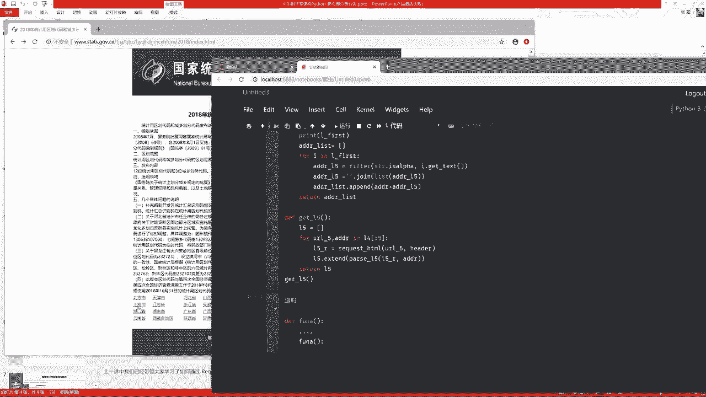

甚至他这个问题呢比刚才的for额，五个for循环套在一起更恐怖，他这个计算量也不会比刚才小。

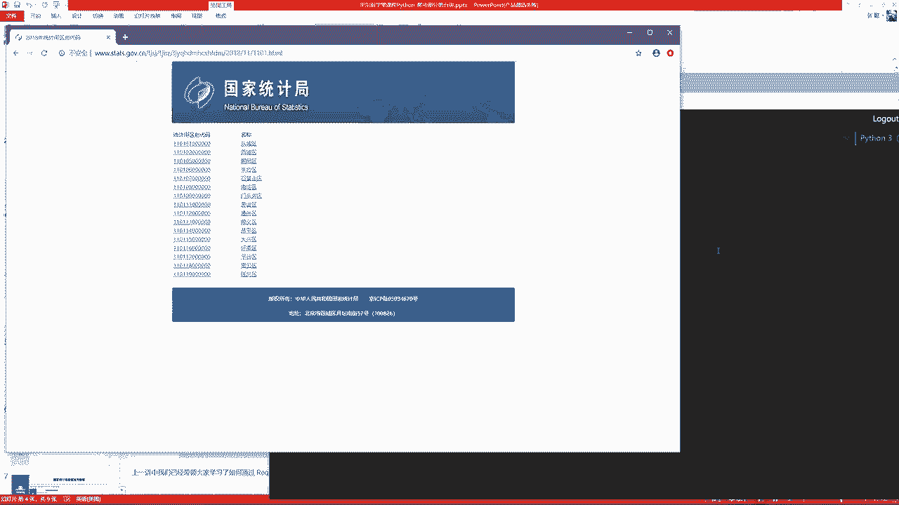

甚至说他在出现死循环的时候啊，啊问题会比刚才更大，所以说这些东西如果说大家有兴趣的，可以自己这样写着实现一下，但是在实际的生产中呢，大家尽量避免去这样写，那我们用什么方法来实现呢。

那诶那我先请大家思考一个问题，我们刚才所介绍的for循环嵌套也好，递归也好，其实我们都在用什么，都是用的深度优先，那深度优先实现这个好吗啊，我们不能说它不好，大家来看另一种思想，如果说我们用广度优先呢。

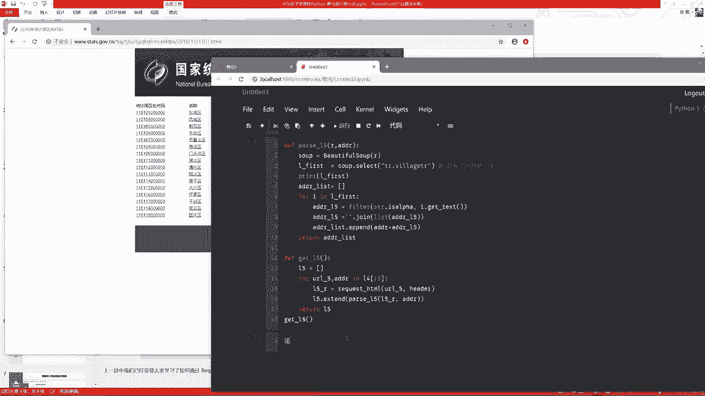

我们先获取到每一个省份和直辖市。

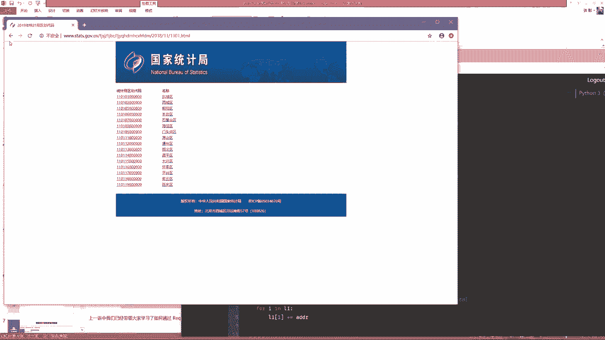

的这么一个链接，然后我们依次点进去这个链接，我们会获得二级目录的链接，我们把所有省市了对应的二级目录存起来。

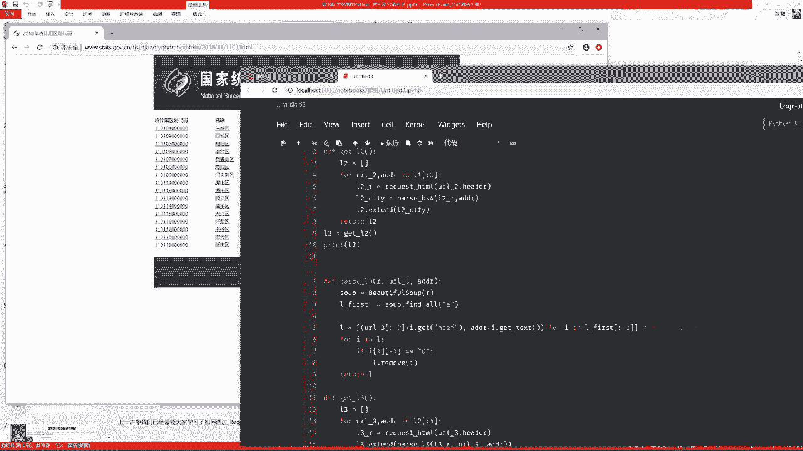

也就像我们广度优先一样，一层一层的来，那就这样我们依次进行下去，大家是否觉得这个条理性，会比刚才的要好一些呢，那我们这次的代码，其实就是用了这个广度优先的来实现的，那我们先来思考一下。

我们之前写爬虫程序的第一步是什么呢，没错就是确定这个就是发送下发送请求，那发送请求呢我们要确定这个URL，大家看这里，我们的URL用了这个。

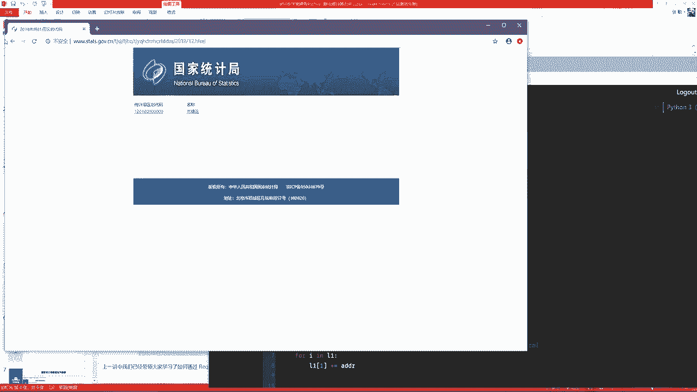

那再看这里，他是不是少了一点什么。

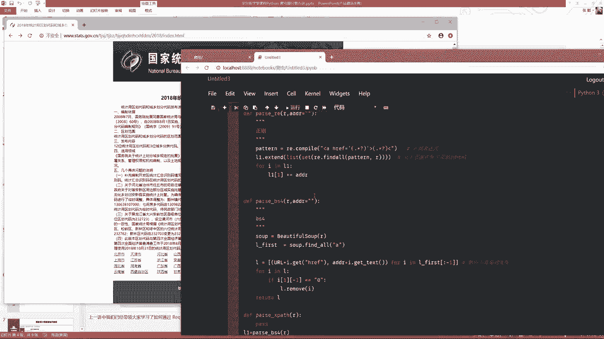

少了个index，那我们来看一下它的效果一样不一样，诶他好像出了点问题问题了，那这个呢它其实是一个啊浏览器缓存的问题啊，这里大家不用管，我们看啊。

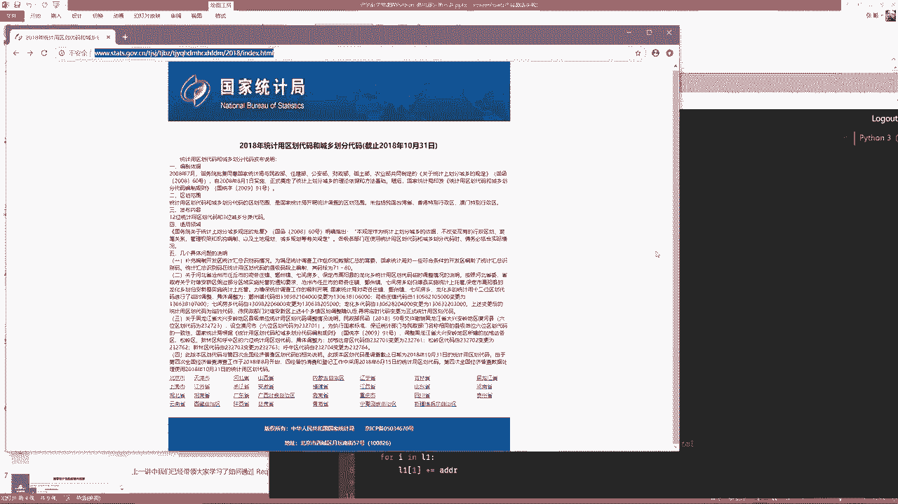

我们把这个index点HTML去掉了，它其实本身并不影响这么一个网站的显示，那这里它其实就是一个重定向的作用。

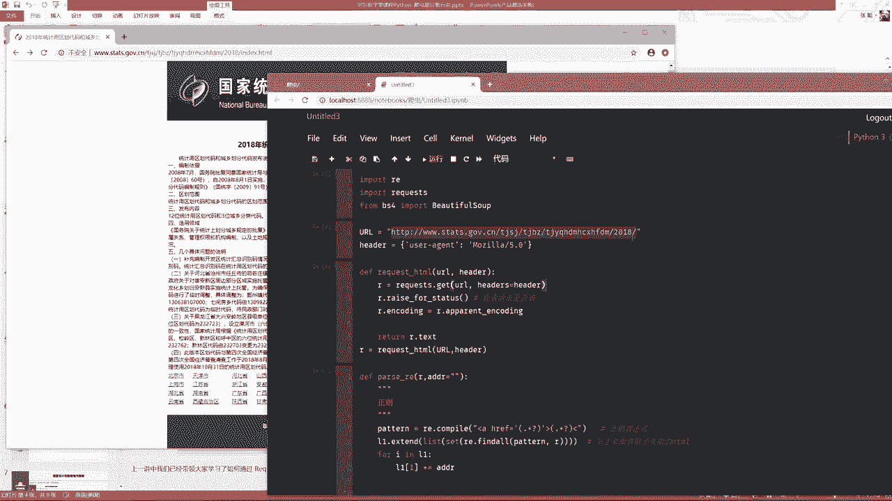

那就是说啊我们加上index点HTML了和不加呢啊，并不影响，那我们为了方便后续的一些操作啊，我们就把index点HTML先T去掉，那大家可能会问为什么要先去掉，对吧啊，这个其实无所谓的啊。

这里大家可以如果想写的话，可以先写上，因为我们的这个爬虫啊，它其实啊我们刚开始并不能预测到所有的东西，那我们呢就会按照一个经验啊，去先定义一些东西。

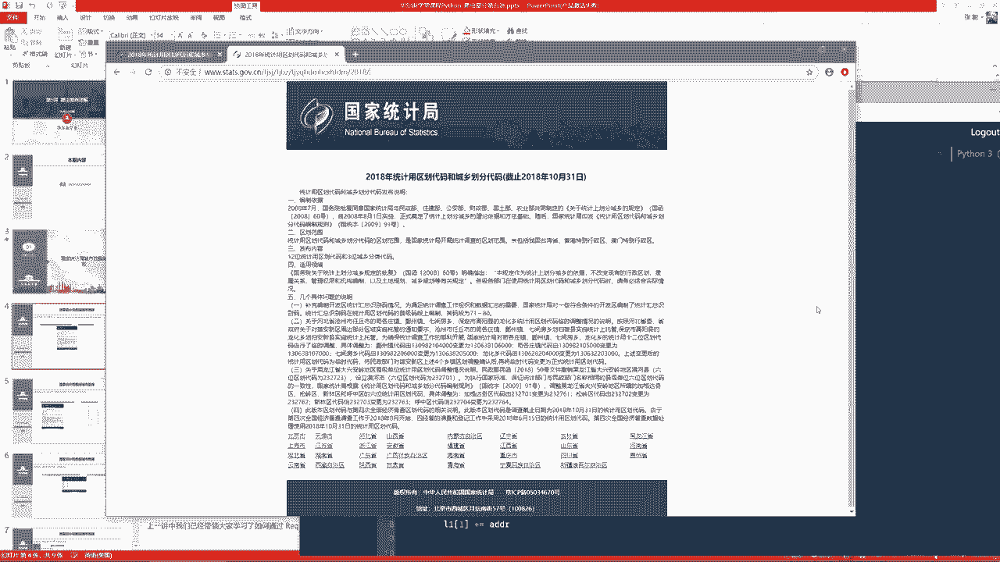

像URL这些常量呢，啊为什么我们把它要去掉呢，因为在爬虫写爬虫的过程中，后续我们要进行下一页，或者说啊其他链接的访问的时候，我们一定会出现这个URL拼接的过程，就像我们之前实现下一页的时候呢，啊。

我们也是用for循环呢去拼接出来一个新的URL，来实现下一页，那在进行拼接的过程中啊，我们这个URL它越容易拼接，那当然对于我们越有好处，如果说我们加上那个index点HTML，我们在拼接的时候啊。

那可能就会出现一些问题，就比如说我们要先把这个再去掉，再进行拼接，那为了避免一些呃可能会出现的问题呢，我们这里就先把它去掉，我们直接用这个链接来访问，那我们呃介绍的这个网站，我们还是从我们的第一步开始。

给大家介绍这个案例的实现，那首先呢还是导入这些模块，那这几个模块刚才已经我们也复习过了啊，两个呃两个数据提取，一个啊访问，那这里呢我们并没有导入pandas as啊，那是因为这个程序啊，它还不完整啊。

这里还给大家留了一小部分没有实现的功能，就是数据存储这一部分，那数据存储呢相信嗯对于大家来说，实现已经很简单了，那我们先来看这个这个爬虫呢，它的实现，这里我们一样定义了URL和header。

这是两个常量，那这两个呢啊基本上就没有什么变化了，我们每次都是这样定义的，那这里呢是一个啊简写啊，大家也可以在浏览器F12找到那个啊，user agent呢把它直接粘过来，这些都是不影响的。

那这里呢大家看啊，这里再给大家说一个问题，就是大家看我们在每次写爬虫程序的，有时候我们都会先定义一个方法啊，那这样呢其实也是在编程过程中啊，经常用到的一种思想，那我们把这个定义成方法。

或者说把它定义成对象了，呃我们在后续去调用，或者说去维护这个代码的时候啊，它会减少我们很多的工作量，那大家想就像刚才这个呃访问一样，如果说我们一层一层去访问，把代码全部写在一起，从上至下写了一大串。

那即便有注释了，我们后期再修改的时候，你可能也无从下手啊，如果说哎要出了点纰漏呢，可能甚至要重来一遍，所以说啊，我们直接在编码期就把这个问题给解决掉，我们直接用函数，或者说用类的方法去实现这个代码。

在这里呢我们还是用函数的方法来实现，那首先呢我们定义一个函数，这个函数它的作用呢就是去访问我们的网站，嗯那我们这个函数呢啊我们给他传两个参数，这个参数呢，它其实就是我们刚才有定义的这两个参数好。

我们把它传进，我们需要这两个参数呢啊，用request get方法去进行这个网站的请求，那请求完以后，大家看这里，我们多写了一步，这一步的作用是什么呢，大家不知道是否还记得，我们刚才啊有介绍过一个这个。

那我们在访问成功的时候啊，这个东西它其实是等于200，那这个方法呢它其实就是封装了这么一步，他去检验这个值是不是代表着我们请求成功了，如果说我们请求成功了，他就会继续向下执行，如果没有呢。

他这里会抛一个异常在下面呢，啊我们就是定义一下。

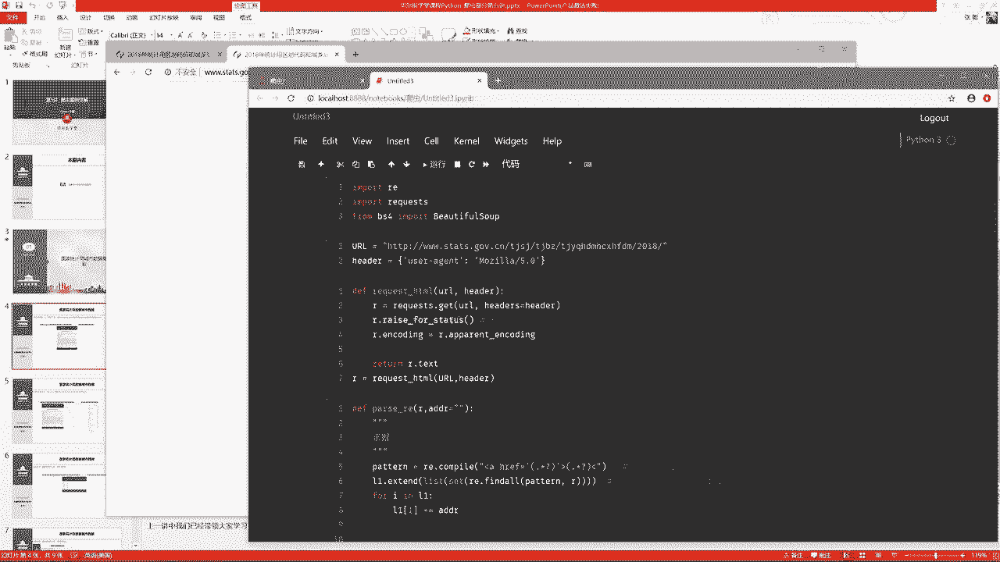

改变一下这个编码网站编码的问题，那进行了这些操作以后呢，其实这时候我们已经得到了这个响应。

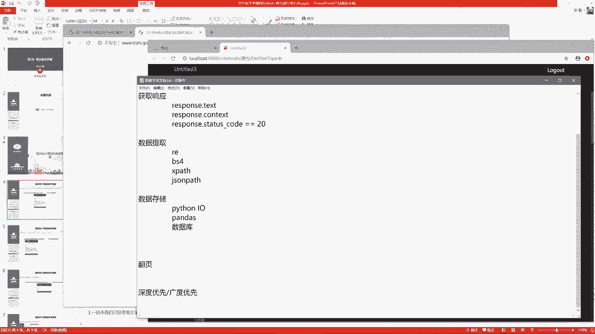

那我们把这个响应的text属性打印出来，那我们刚才也回忆过了，text的属性是什么呀，它其实就是打印了我们这个网站的，它这么一个啊源代码的文本，好那我们实现了，我们就运行一下我们这个代码。

它跑出来是什么样的结果，A啊对啊，JUBITER呢，我们需要先把前面的都运行一下，把它加载进内存里面，大家看，那这里呢就已经跑起来了。

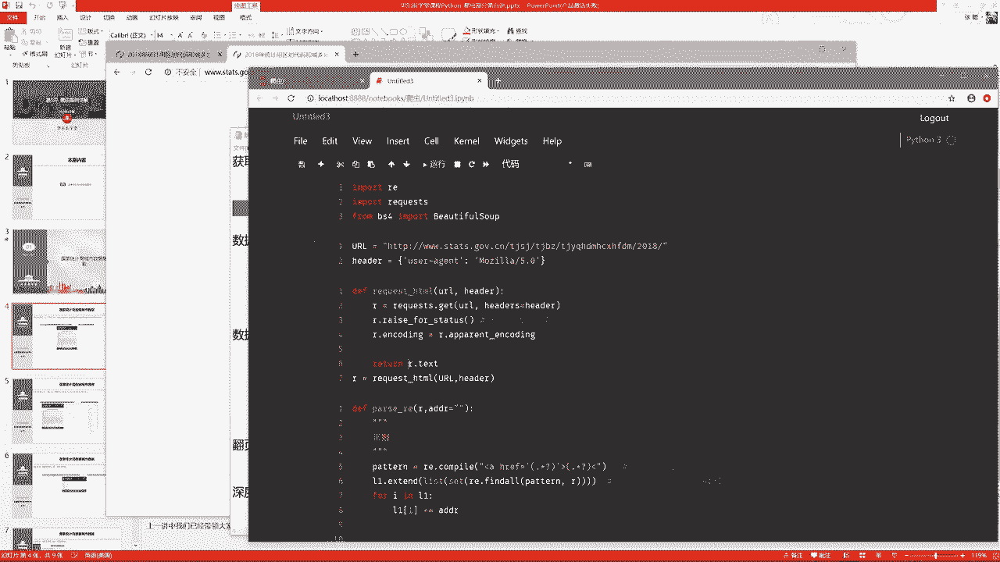

我们来比对一下，嗯我们来比对一下。

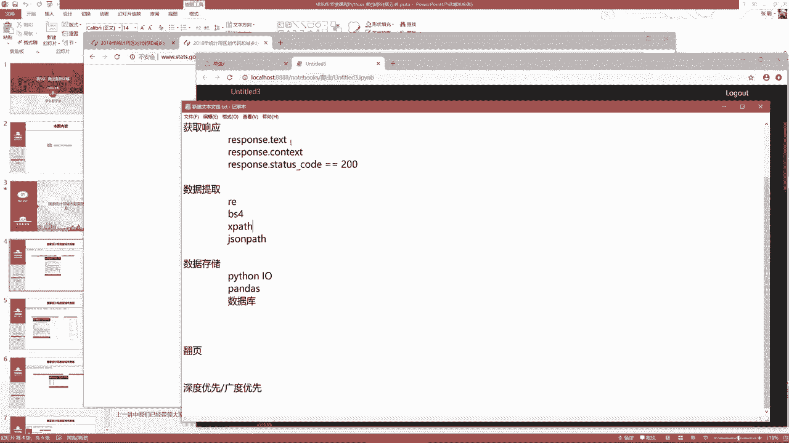

看看是不是我们的这么一个哦，获取到获取到的东西，是不是这个网站的一个额响应，我们直接查看源代码，我们再来对比一下，那他呢呃其实就代表我们已经请求成功了，我们已经拿到了这个页面页面的数据。

那我们在拿到这个页面数据以后，就要进行我们的第二步啊，不第三步哦，就是提取数据，大家看这里我定义了三个方法呃，最后一个方法差pass呢，因为之前我们没有讲，所以说这里呢我们也啊不去实现了。

那大家啊可以自己去学习一下，然后实现一下，我们看这里，我们定义了正则和BS4的这个一个，数据提取的方法，他们用哪一个好呢，其实就是看个人个看个人的喜好了，如果说你更喜欢正则表达式，那么你就用正则表达式。

如果你更喜欢befor sop，那就用befor sop，至于用哪个来实现的，它其实对于我们呃呃爬取案例来说呢，并不会有太大的影响，包括我们以后在写爬虫程序的时候也是。

所以说大家不要局限于去使用这个工具啊，因为我们这个案例中呢它其实是一个混啊，混合使用，我们两个都有用到，这样搭配起来呢，其实能提升我们的呃代码编写效率，嗯那这个正则表达式呢呃我们就简单的提一下。

我们还是以beautiful soup为主，因为我们课上呢去学了这个，所以说我们以这个为主，那正则表达式啊，啊大家看这里他俩的参数其实是一样的，那首先呢这个R它其实就是我们刚才有返回的。

这个也就是我们的响应的text属性，就是这些东西，那这个是什么呢，这个啊我们先不说，等我们用到了，我们再说它，然后这里呢我们编译了一个正则表达式，就是我们常用的之前已经讲到的compel。

下面呢呃我们将它添加到了一个列表里面，那大家看这里主要就是这里的问题，这里我们先用了一个list，将原本的一个列表转化为集合，再转化为列表，那么为什么这么做，这个呀其实也是我们爬虫中一种经验的体现。

有的时候我们再去访问这个网页的时候呢，我们可能会遇到啊几个URL，他们链向的是一个地址，那如果我们使用for循环一个一个去便利呢，我们会重复遍历好多个链接，所以我们先用集合呢。

对于我们爬到的链接进行一个去重，然后呢，再把它转化为列表的形式去进行一个操作，这呢其实啊以后呢大家在写爬虫的时候，这个可能会成为一个非常重要的点之一，那大家看这个网站啊，它其实我们来看一下这个链接啊。

这个链接非常简单，就是一个数字，大家看啊，它每个省份代表面积啊都是不一样的，所以说我们后面呢啊就省去了这一步，对就没有必要进行两次转换，去浪费这个计算资源，所以我们省去了这一步。

那这里的正则表达式呢也写的比较简单，因为我们还是啊，这个实验还是主要使用的BS4来实现的，所以呢我们还是来看这个，首先定义啊一个比如HOTO的对象，然后呢速度点final ov，这个什么意思呢。

大家还有印象吗，就是找到我们所有的A标签，非常hose，我们先来看一下找找的A标签是什么样的，我们来打印一下，我，们来运行一下看一下，那大家看这就是我们找到了一个标签啊。

这这么一个列表里面一大堆带尖括号的东西，那它的作用呢来大家来看一下，大家看我们这里找到的A标签，14点HTML它呢就是我们下一个点进去以后呢，这个市级代码的就是这么一个链接，但是呢大家看这里。

我们好像还拿到了一些其他的东西，比如像这里的一些其HTML标签，这并不是我们想要的，我们想要的是什么呢，所以我们想要的很简单，我们先来看这里，我们想要的无非就是这里的字符串。

北京市加上它所对应的那个URL链接，那也就是这里呢，我们的这个还有这个这两个东西，才是我们想要的，那下面呢我们就来处理一下这个东西，那大家看这里我写了一串很长的东西。

这个东西呢啊它是Python的语言特性之一，叫列表生成式，我们来简单的剖析一下这个东西啊，首先呢呃我们的中括号定义，这是个列表，然后呢我们看里面的元素，所以先把前面这一串当成一个东西。

这就是我们列表中的元素，那这个元素的来源呢就是个I了，那I呢它来自哪里呢，它来自这个也就是我们这里的这一些东西，对我们对它进行一个便利，然后呢经过这些操作以后加到这个列表里，只不过我们在遍历的时候。

为什么要冒号一呢，大家看最后一个最后一个他有一个这个东西，这个经ICP备，也就是我们这里这个呢我们点进去看一下哦，没加载出来，但不管是什么吧，反正他不是我们想要的，我们想要的啦，只是这些有用的数据。

所以啊啊我们把它略掉不要了，那我们把前面这些东西便利了以后呢，我们进行一个处理，首先呢啊大家看我们最先得到的这个东西啊，嗯它我们用了这个get h r e f，大家还记得这个get什么意思吗。

他其实就是获取了这个东西的值，那这里的HREF呢，就等于前面这个HTTML，那大家看这里它只有这么一个东西，但是我们把它移上去了，大家看这里是很长一串的，它只是这一串东西的最后几个字符。

那前面这一串东西是什么呢，来大家看这里再对比我们最上面的这里的链接，大家会发现呢它其实是一样的，我们把它点进去了，就会发现他其实就是做了一个拼接，这也就是我们刚才为什么呢。

我们要把index点HTML去掉，那拼接呢在我们Python里。

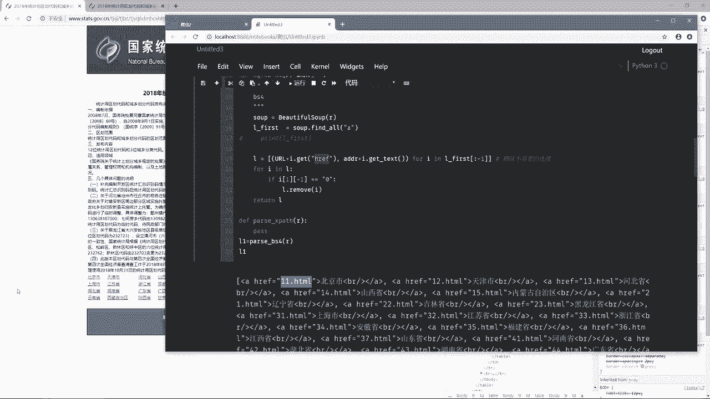

其实啊除了我们之前有介绍的哦，format啊，Joy，那其实最简单的方法就是加号，我们把这个初始的URL进行一个相加，我们就会得到这个对应的链接，那有了这个链接呢，嗯其实我们已经能访问下一页了。

但是大家也看到了，它一共有五层的目录，那我们最后想获取的是一整条数据，就比如说啊北京市某某区某某街道。

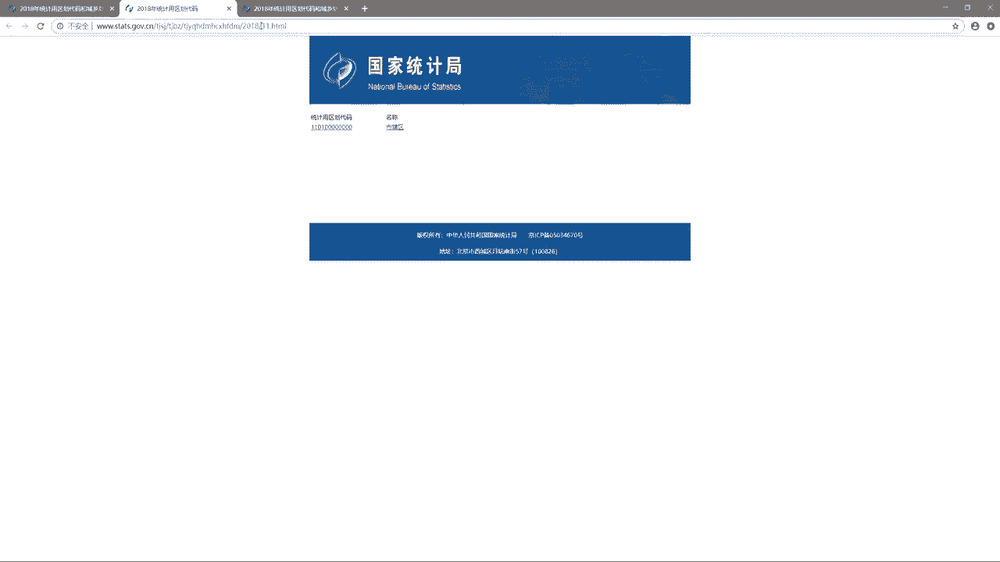

某某某某村委会这种，如果说那我们指责拿最后一页的数据，其实是很混乱的，我们根本不知道获取的是哪里的数据，所以说我们这个列表里我们再加一个数据，也就是我们的这个北京市，那这个其实获取来获取出来呢更简单啊。

但大家还记不记得这个方法，get text就是获取了我们这个标签对应的文本，那这里的文本呢其实就只有北京市，所以呢我们直接这样就能获取出来，但这里大家看我们加了一个参数。

哎这个参数就是我们刚才没有提到的，我们传了一个ADDR参数，它是什么意思呢，那大家想我们是当前链接是一个北京市，那我们点进去看一下好吧，我们点到这个，我们再来看一呃，大家看。

那这里我们要获取是不是就是一个东城区，如果说我们用广度优先的话，我们拿出来一整集的目录里面好多市区，那大家是不是是否会知道它属于哪个市区的，对我们直接哎点get get text呢，点出来这个数据以后。

大家拿到一个市区的数据，大家可能根本不知道他是哪个市，哪个地方的市，所以我们这里用了一个相加的操作，那这个ADDR它是什么意思呢，它其实就代表了我们上一级目录的这个数据。

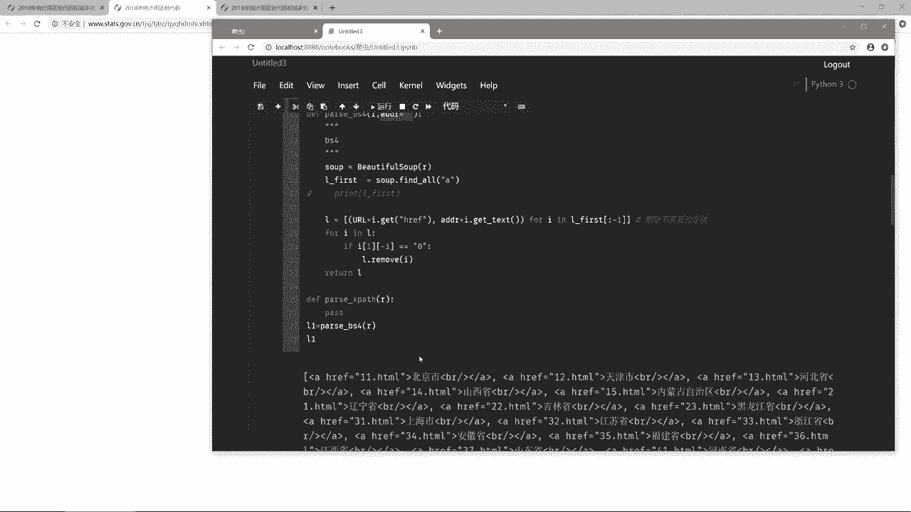

就好比我们这里有个东城区，我们就把他属的上一级直辖市的市辖区，和再上一级的北京市，就是进行了一个依次相加的操作。

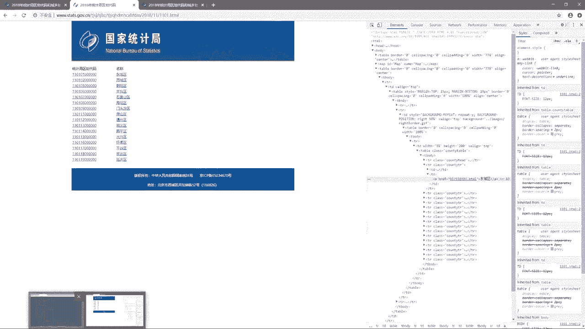

我们每一次在解析数据的时候都给他加一次，那最后我们得到的最后一级目录，其实就是五个目录加一块，就是一整条完整的数据，它的作用其实就是这样，那我们这里唉还写了一个for r e l，这么一个操作。

那这个操作是什么用，大家先不要管，我们现在可以把它注掉，因为它并不影响我们当前的一个操作，就像我们把ADDR一样注掉一样。

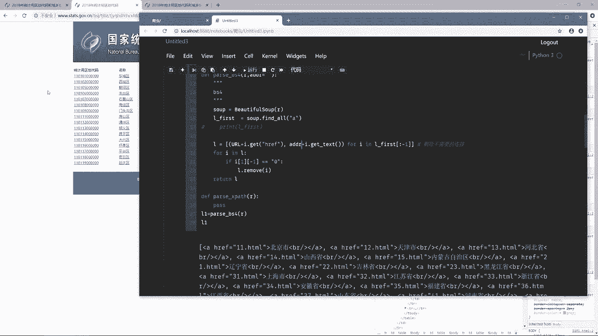

即便我们这个方法里把ADDR删掉，它会影响它不会影响的，因为我们当前根本就不需要用到。

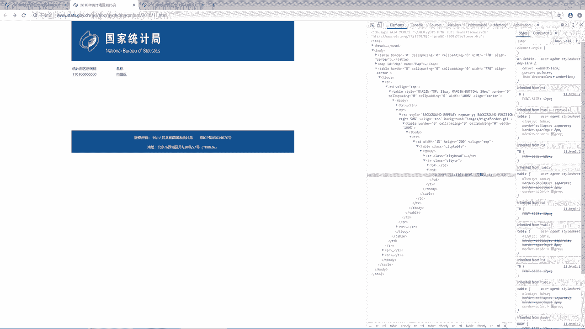

这个相加的操作，这里我们直接采用了这么一个默认，大家看我们直接传了个空的字符串，所以说相加是没有结果的，那等一会我们用到了嘛，大家就会明白它的一个具体的使用方法，好那我们继续向下看啊。

这里的x pass呢就不做介绍，注销掉，我们刚才呢也要运行运行这个，那运行以后的结果，最后我们返回的结果其实就是这样，那这个结果呢大家来看它是一个列表，列表中的每一项数据呢，它其实都是给这个市区的名字。

就是我们这个数据的地址名地址，它所对应的这么一个链接组成的一个元组，就是我们列表中的每一项数据，那这样看起来是不是就很清晰明了，好那大家想我们一级目录的所有数据都在这里。

那按照我们广度优先的便利的想法呢，我们下一步该怎么做呢，其实也很简单，我们访问每一个一级目录，然后呢就会获得二级目录的数据，我们把所有的二级目录存在一个列表里，这样的我们就便利了第二层，至于后面的三层。

四层五层，我们都使用这样的方法，就可以很简很轻松的去获取到所有的数据，那这里呢其实呢也也出现了一个问一个问题，就是大家想大家看这个数据，它是不是放的方法好像都一样啊，大家看这里的链接啊。

我点进去他加了一点，那其他的链接呢我再点进去他又加了一点，这是二级目录，那我再返回之前的一级目录，他好像也是这样，那这里呢其实就是我们为什么使用这个啊，定义一个函数来去进行一个访问啊。

或者说数据提取这么一个工作，那可能有人问，那你是不是之前给你看到了这些，你知道，然后你才使用的呃，就是函数来完成这个功能呢。

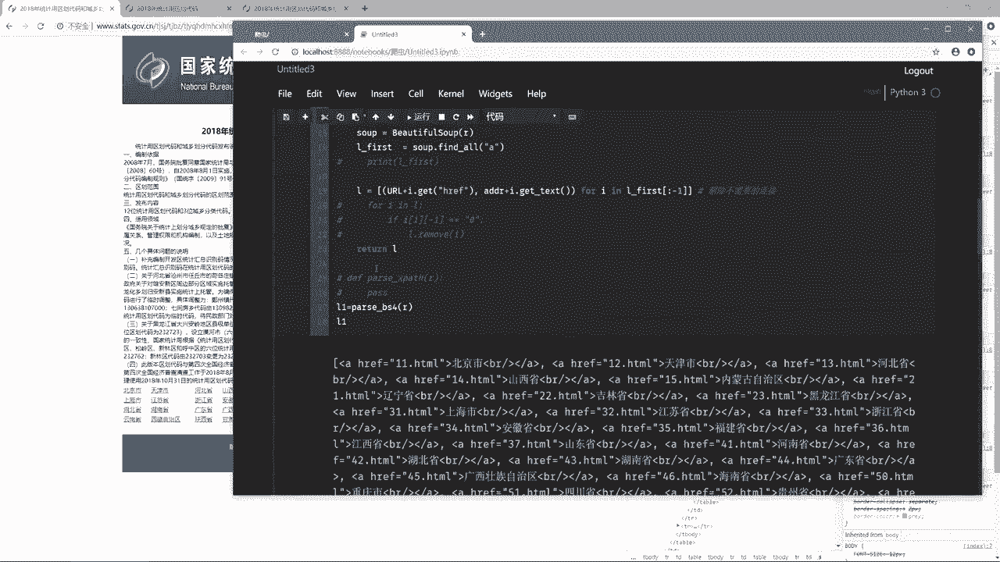

其实并不是这个大家在以后编码的时候呢，尽可能的去用用函数或者说用类去完成编码，这样吧你的代码会有一个很好的复用性，就好比呢啊我们这里先给大家说一下。

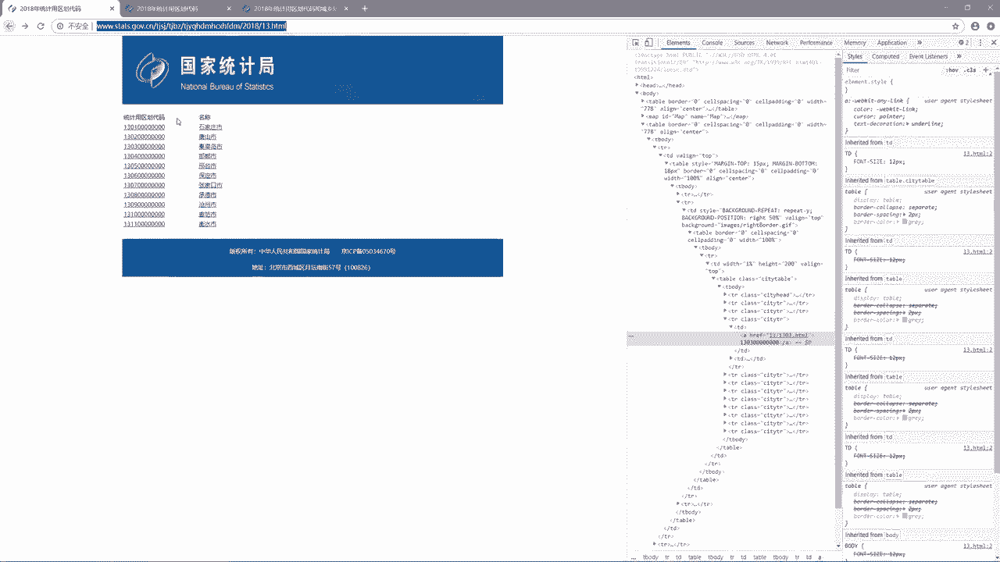

我们用的这个诶访问的方法，我们包在后面访问二级三级四级目录的时候，我们都在用这个方法，我们没有去重复的写代码，我们只需要换个参数就可以了，这样用起来啊是非常方便的，那如果说我们哎一行一行的写。

想到哪写到哪这样了，其实代码写出来就会非常的乱，而且不好，不容易维护，所以说大家一定要养，养成一个良好的编码习惯好，那我们获取到了成功的，拿到了这个一级目录的数据，我们来看二级目录哎。

也就是这里二级目录的呃，二级地址目录的获取呢，来大家来看，我们对比之前啊，我们有刚才写过的一级目录的获取，来这里这里，好我们刚才啊没有没有具体写，那我们来先先不管刚才的，我们来单独来看一下M2。

那首先呢那大家来看这里啊，啊我们对一级目录做了一个便利，那么遍历出来的应该是一个元组，但是现在呢我们直接用两个变量，把元组里的值给取出来，也就是对元组进行一个解包，那这两个变量呢来大家来看。

首先这个ADDR啊，我们刚才有说过这个ADDR，就是说啊，我们想把啊每一个市的地址呢都加起来，就好像这里我们有四川省，那如果我们在爬到成都市的时候呢，我们就想让它出现四川省成都市就哪个哪个区，哪个街道。

就是这样一种数据，所以说呢我们就把这个东西，这个数据呢是都留了下来嗯，那这里我们为什么要用这个冒号三呢，那这呢就是说我们取列表中的前三个数据，为什么这样取呢，因为大家别看这里有32个30一个啊。

也就是30多个吧，一级目录的数据，那如果说它对应二级，在对应三级四级，它这个数据量累加下来，虽然呢并不能达到我们商业及使用的数据，但是呢啊他这个数据量呢嗯还是需要爬个呃，将近一分钟的啊。

我们呢只是给大家演示这个效果，那大家在敲出来的时候呢，可以去掉这个，我们直接去爬整个站，看一下具体这个数据量有多大，这里呢为了给大家展示啊，并且加速这个展示呢，我们只取前三条啊。

反正爬三条和爬三三十三百啊，没有什么太大的区别了，然后呢呃我们还是使用这个方法，Request html，大家看这里呢我们直接调用就好了啊，我们也不需要再写一次了，所以呢这就是代码的一个复用性。

我们传递URL2和ADA，URL2是什么呢，它其实就是我们每一个一级目录中，每一个省市所对应的URL，那我们依次去访问这个URL，访问完以后呢，呃我们对它进行一个解析，这里大家看。

我们还是使用了我们刚才所写好的，这么一个方法，对这里依然可以复用，但是大家注意看这里，我刚才注掉了几行代码，我们把它弄回来，这个代码呢它其实对于我们刚才写的一级数据，并没有什么额，就是限制，为什么呢。

我们来看啊，就是我们刚才这个列表也给大家说过，他是怎么样产生的，那它产生以后的数据呢其实就是这样对吧，那我们看我们取啊，我们遍历遍历以后是个元组，我们元组中的第一个数据啊，不是就是下标为一的数据。

就是这个士或者说这个手，那他呢再取下标为一，也就是最后一个，大家看就是这个字，省市区，那这个字是否为零，这个字符串，那如果是的话，我们就删掉它，那大家看我们一级目录里啊，根本就没有这样的数据。

所以说它对我们来而言呢是不影响的，但是大家来看我们的二级目录啊，北京市呢只写了一个值，我们换一个号，我们点开这几，那大家看这里，我点这个，我点这个改零的点进去，大家看下一个数据，上城区下城区。

我们再贬杭州市，还是上程序下程序，这里相信大家就明白了吧，我们为什么要这样写了，大家来看他是最后一个是否为零是吗，然后我们就移除掉它啊，为什么这样做，我们先来看一下，先来跑一下，我们来运行一下，看一下。

那大家看啊，我们这里获取到的数据是什么。

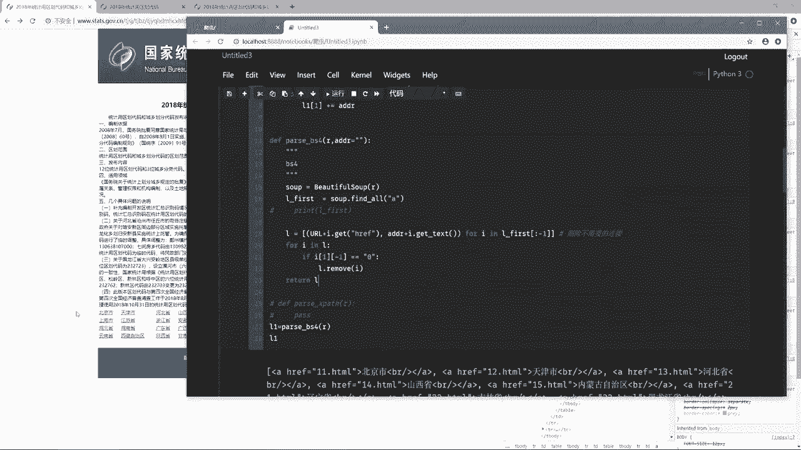

首先这个A标签，然后呢A标签还是还是这些A标签，这些是没有变的，但是这里大家注意一个点，我们这个3301所对应的这么一个呃啊，这里呢不是因为不是这里的数据，不是爬到浙江省嘛。

所以说呃大家看起来有点可能有点迷惑啊，我们还是来找这个让大家来对比着看。

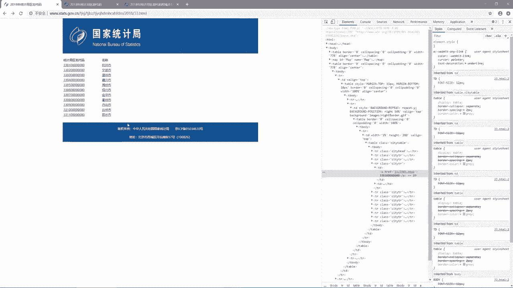

这里是幺幺啊，一串零，然后后面跟了一个市辖区，这是两个数据，大家看它就对应了这两个数据，但是这两个数据大家想想，我们真的需要前面这一串编码吗，如果说我们要爬取这个编码数据的话，那它肯定是有用。

但是现在我们不需要，我们只需要它的点进去的下一级目录的链接，并且和这个名称，然后去进行一个拼接，这里这串代码我们是不需要的。

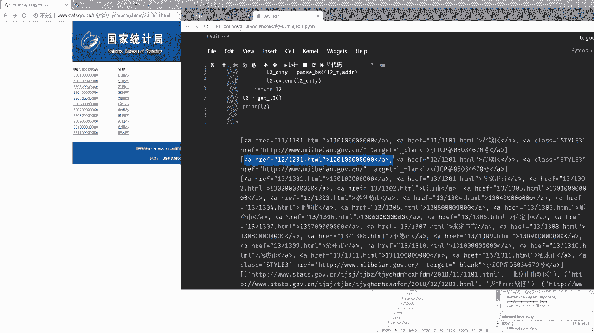

虽然它也能点到下一串的链接里面，我们只要这边这个就可以了，所以说我们这里就是这个等于零的作用，它其实就是把我们这个过滤掉，因为我们这里在进行拼接的时候，我们会同一个链接拼接了两次。

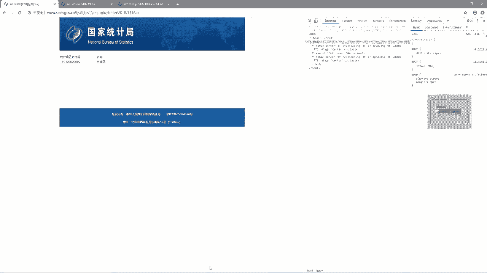

对大家还记不记得，我们刚才有写过一个set，那其实用set方法也可以过滤掉，但是呢这里我们直接就是进行一个手动的过滤，因为大家以后呢可能会遇到各种各样的情况，set呢它永远只能解决一些一部分问题。

他不可能解决所有的问题，所以说大家遇到啊具体的情况呢，要进行一个具体的分析，去制定方案去解决它，这里我们就用这种简单的方式来实现，直接一个判断，然后删掉这些我们不需要的东西就可以了。

然后呢大家看我们最终的结果，我们最终的结果呢，在在哪里呢，好我们来看一下最终的结果，在这里大家看这里，我们看一下这个链接啊，我们先访问一下，看这个链接能不能打开哎，大家看我们进去了。

这个链接呢它就是我们想要的了，那我们再看后面后面北京市市辖区，他也进行了一个拼接，那这样的话其实就对我们很友好了，我们这个数据就很清晰明了了，那假如我们不加，就是我们刚才所说的那个ADDR好。

我们直接把它删掉，来给大家一个市辖区，那下面的天津市呢可能也是去掉，也是一个市辖区。

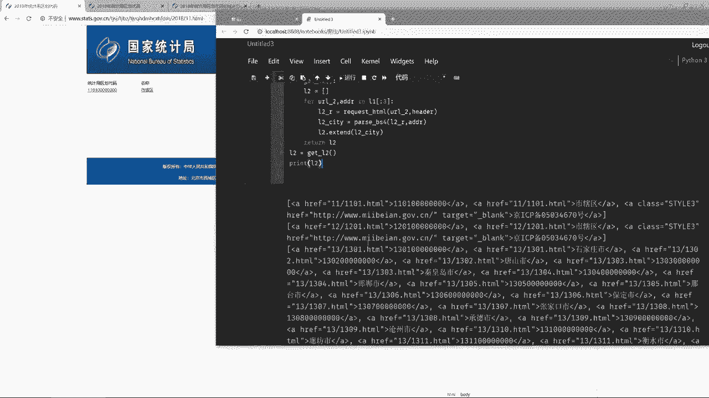

那连续出现两个市辖区，那就可能让我们误以为哎数据是不是重复了，所以说啊这就是我们为什么呢，要在刚才传一个ADDR的参数进入，就是这个参数，然后呢啊我们这里啊，是把它都加到这个列表里面，那也就是说呢。

我们其实现在已经有了L1和L二两个列表，就是一级目录和二级目录呃。

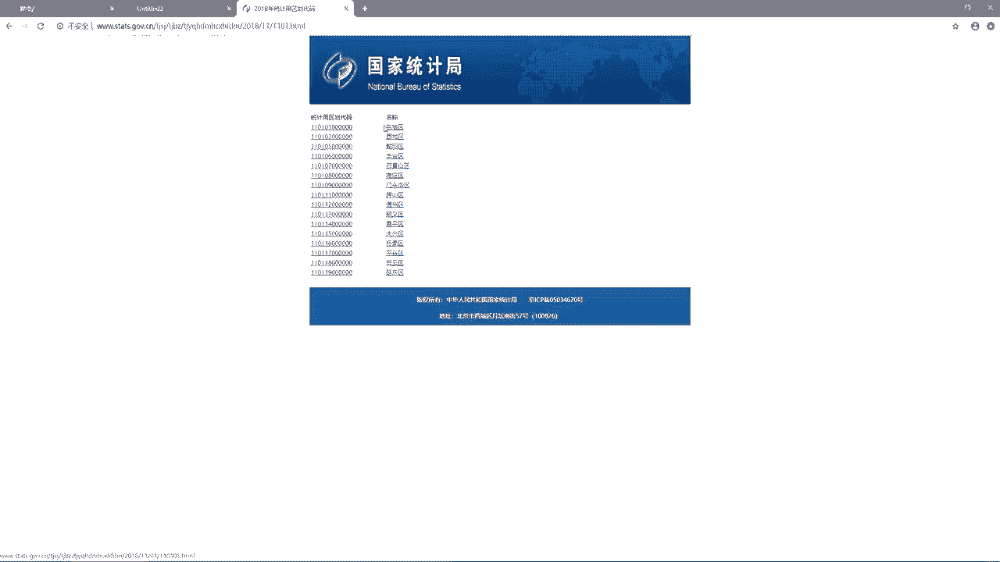

我们因为是要要最后所有的呃，最下面那层目录的数据，所以说我们的L1呢啊，其实到现在就没什么用啊，我们就用我们的L2就可以了，那我们来看，那L2目录点进去以后啊，就是我们第三级目录，也就是哪个区哪个区。

这里大家看这里同样还有一串，那我们点开啊，大家看就是这里，他两个其实是对应了一个啊，同一个啊下一级的目录，但是却会出现两个值，我们还是跟刚才一样，用刚才的方法去过滤掉它，我们只要我们想要的那个。

我们来看第三，那这里嗯大家看诶，我们好像没有复用刚才的方法，我们重新定义了一个，那这是为什么呢，呃我们还是先来分析这个网页啊，大家看这里的链接好像出现了变化啊。

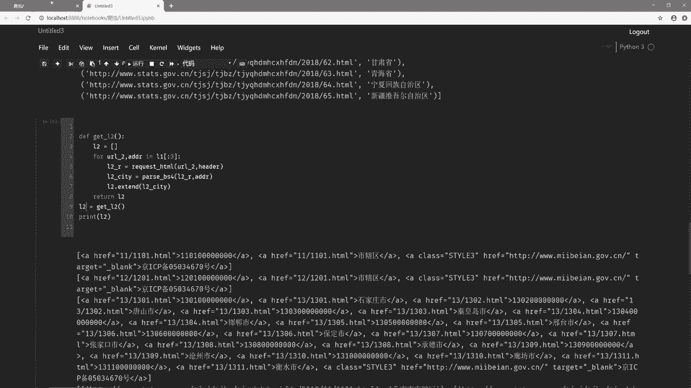

我们先点进去，我们把这个链接粘过来，嗯我们找个地方把它粘在上，呃我们再返回啊，返回一下刚才的那个上一级目录，就在这里，这就是上一级目录，我们粘在这里看一下，我们再再往上走一级这步。

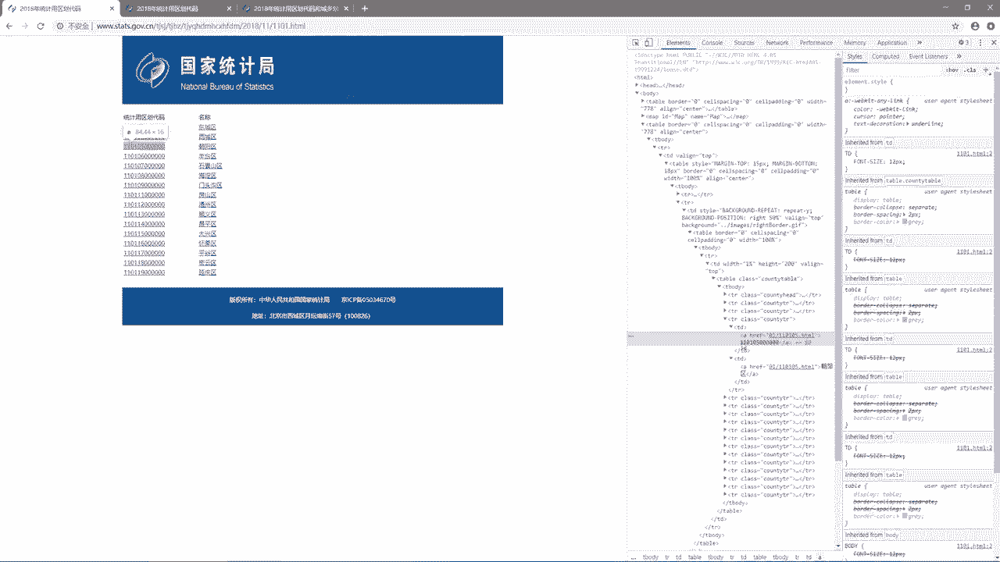

我们对比一下，大家来看这个目录，这是我啊去掉这里了，其实它是我们的最低级的目录，那我们第一集目录去下一集呢是拼接了一个。

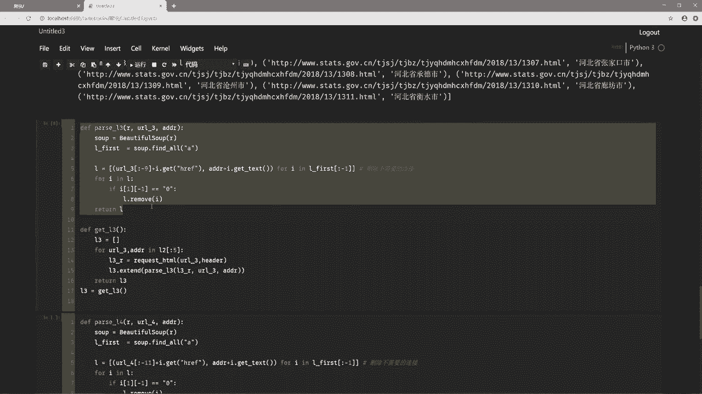

再去下一集又拼接了一个，但是我们到达第三集的时候，大家来看这里好像就变得很奇怪了，它似乎就没有了刚才的规律。

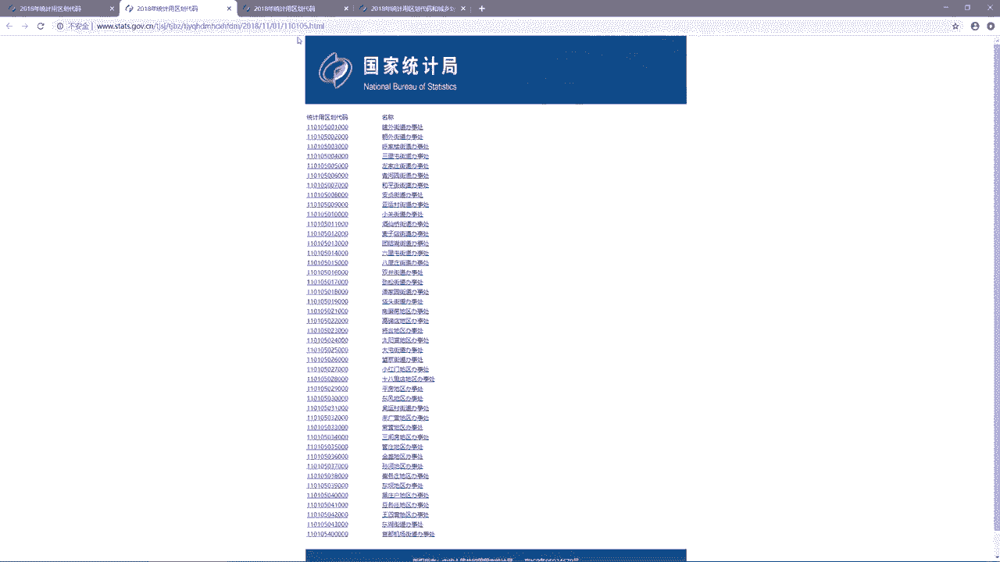

额那这里呢它是一个URL拼接的方式改变了，所以呢就是说如果大家以后再不确定嗯。

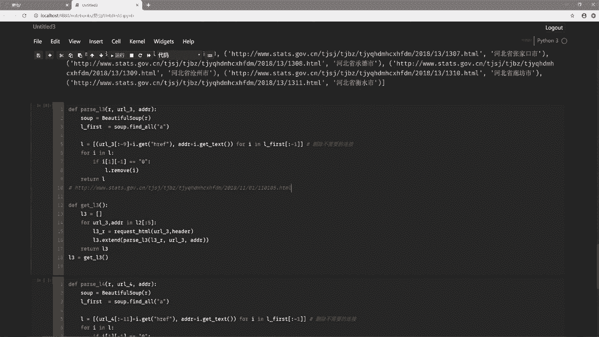

是否掌握了这个URL的规律的时候呢，我们就采用最保险的办案方法，我们去在弄一个方法。

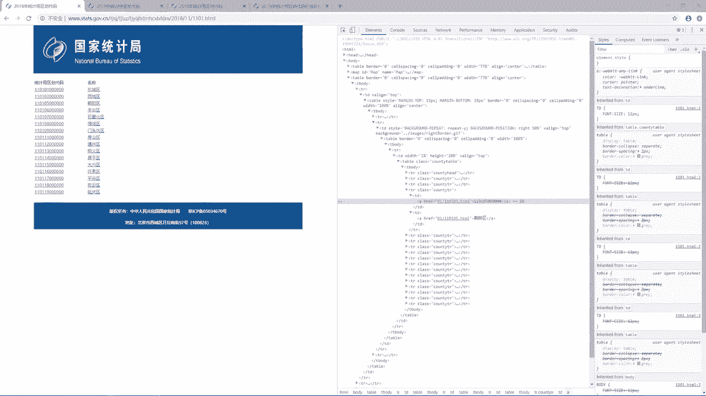

再再声明一个方法去拼接这个URL，确保我们所爬取的链接呢是没有问题的，这里呢我们就是这样做了，那我们先来看啊啊我们还是定义一个空列表，像刚才一样，然后呢对于我们的二级目录进行一个便利。

这里呢为了省时间呢，我们还是采用了只便利前几个值，然后呢啊同样的解包，那下面大家看这里呢，依旧是我们最上面所定义的一个啊，request请求的方法，我们传进去呃，便利的这个二级目录的这些链接。

也就是这里，那把这个链接传进去以后呢，嗯大家来看啊，我们空列表里进行一个excel的数据添加，那添加的数据呢就是这个，这个就是我们在这里新定义的方法，那同样嗯我们新建一个标TIFULSL对象。

然后找到所有的A标签，这里都是一样的，所以说啊我这个代码呢，其实它还是有很大的优化空间嘛，那大家看，因为这里它虽然我是重新定义的方法，但是跟刚才使用的应该还是一样的，就包括下面其实有些地方还是重复的。

改动的还是很小，所以说这个代码还是有待优化的，然后这里来看跟刚才还是一样的，那我们得重新呢生成了这个列表，但是大家注意这里，我们要改变的地方应该也就是这里了，因为这个列表列表呢我们其实就是URL加地址。

那它的具体体现呢也在这里，那我们看地址有没有发生变化，其实并没有我们咳用的这个地址啊，其实说白了就是一级一级目录向下添加的，我们L2里呢已经拼接了一次，那在这里我们再拼接一次就好了。

我们把L2的这个传进去，也就是这个，然后加上当前目录的获取到了这个值，其实就是我们想要的这个地址了，所以说这里呢他也是没有没有必要改变的，唯一需要的就是前面这个URL，那我们的URL我们来看啊。

接下来看嗯，我们还是把这个URL拿过来，大家来分析一下，我们刚才的URL呢，它长这个样子。

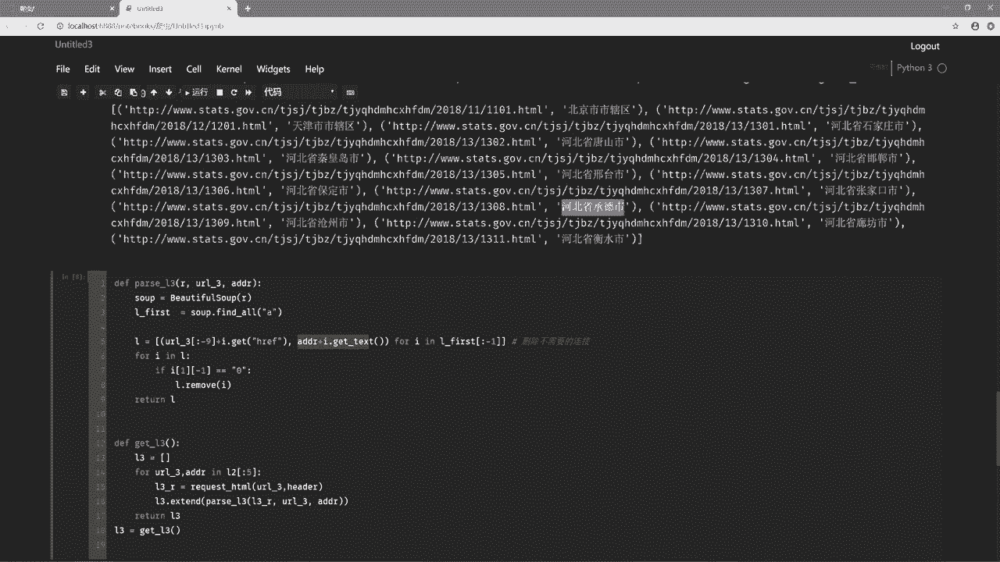

刷新一下我们刚才的URL，它是长这个样子的，大家看它相比于这个呢。

哦他多，哎这好像还不对。

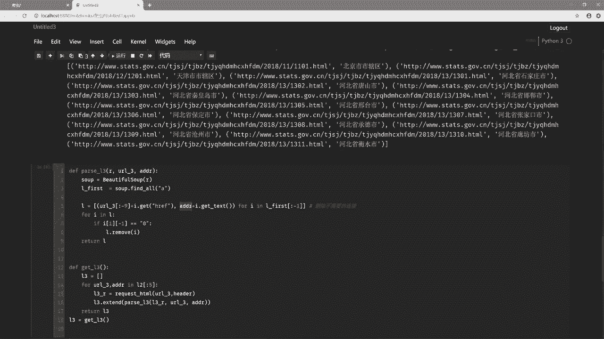

这样才对。

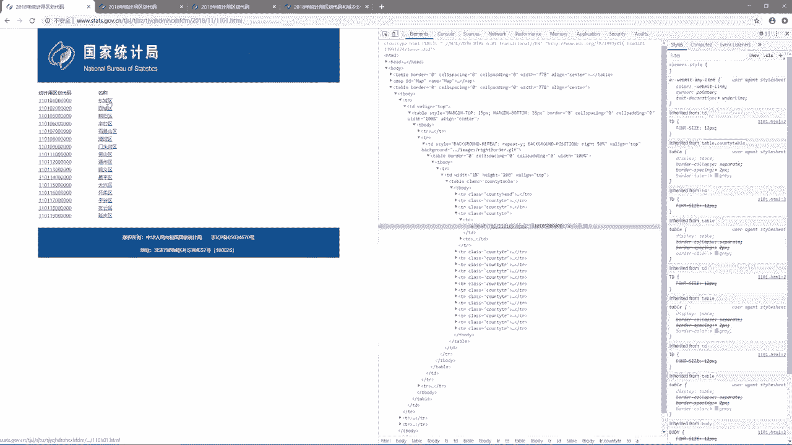

大家来看它多了哪些变化呢，好这里呢我还是贴错了URL，不好意思啊。

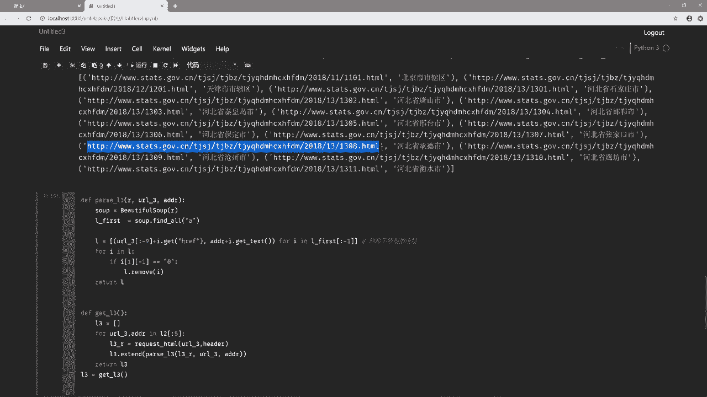

我们不管那个了，我们直接来这里看。

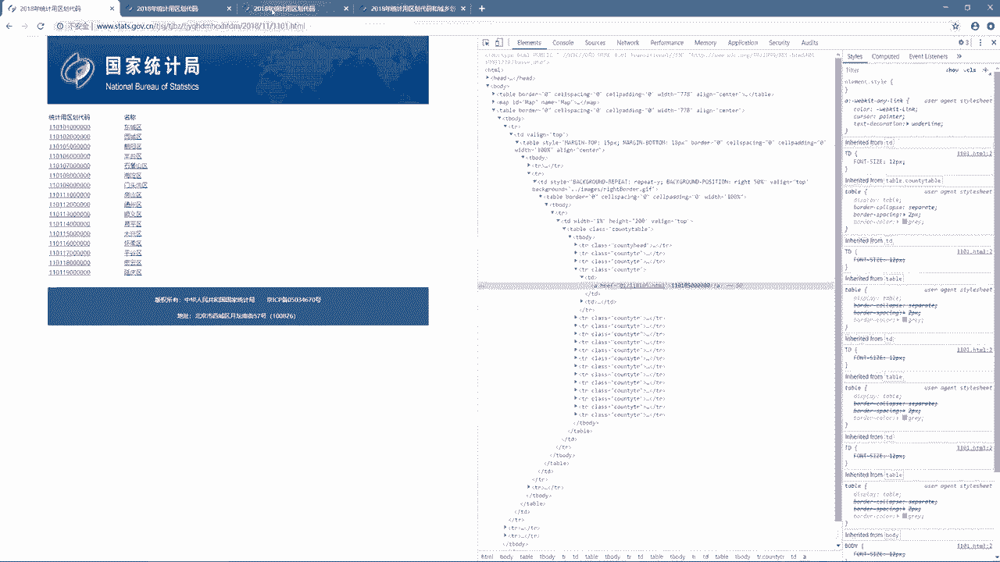

好大家来看这个URL的变化，我点进去以后。

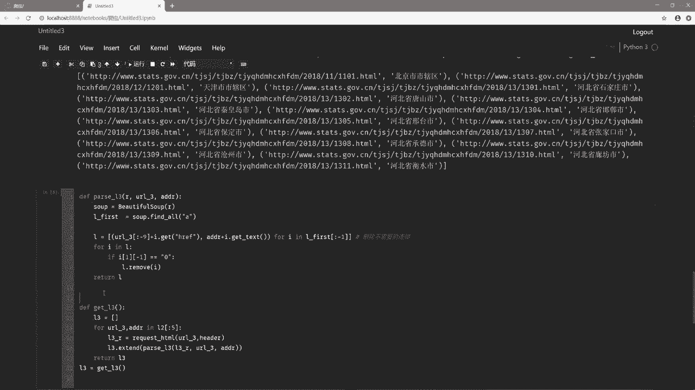

和1101，然后我点进去它就变成了零一和这个。

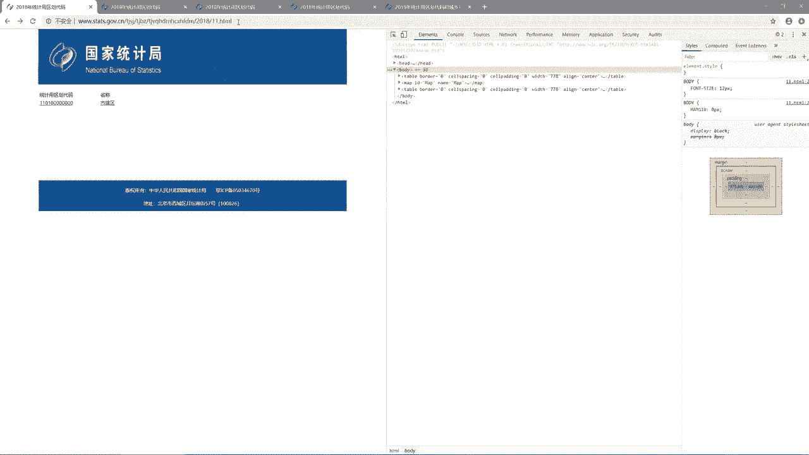

那大家看啊，它相比于刚才变化的地方，其实只有这里，那大家还记得我们刚才呃在最早先写URL的时候。

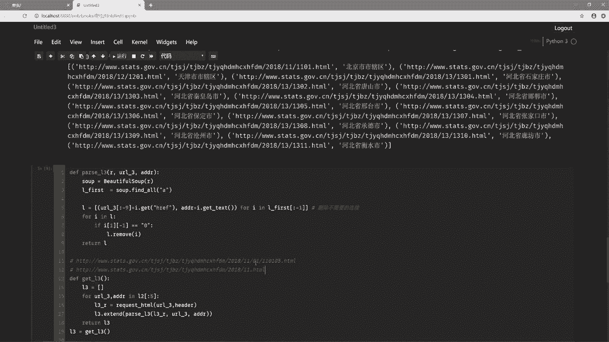

把那个index点HTML删掉，那如果说这里我们把这个东西删掉，我们再进去，大家看是不是只要把这个拼上就可以了。

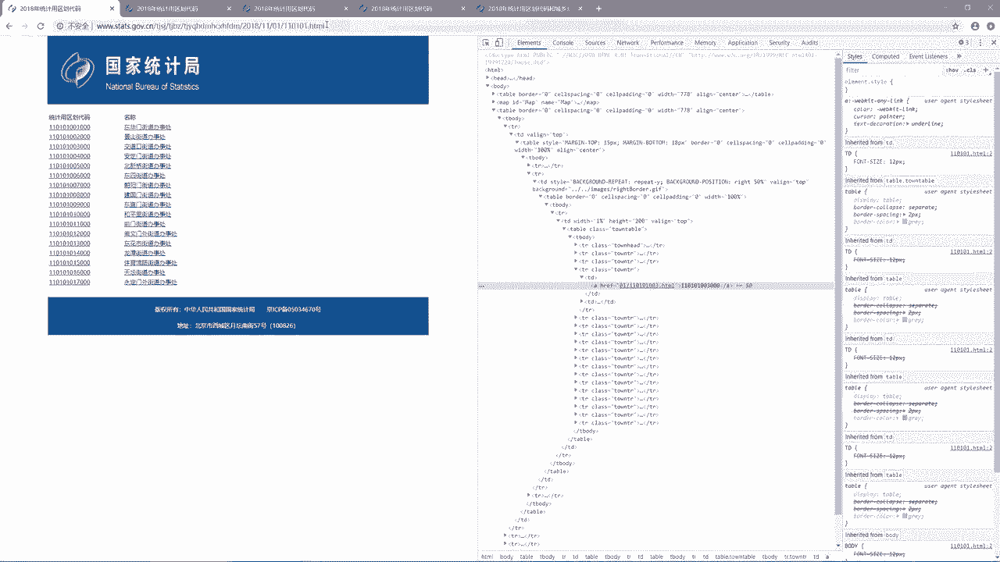

那这个是什么呢，我们退回去看这个它其实就是这里的这个东西，那现在呢也就是说我们只要想办法。

把这个1101给删掉就好，那删掉呢其实是非常简单的，大家看这里，我们手我们用了一个这个就给他去掉了，那这什么意思啊，首先我们这个URL它本身是个字符串，那我们知道字符串是可以根据下标进行取值的，对吧。

那我们呢取什么呢，我们取从第一个开始，一直到倒数第九个结束，对也就是把我们这个要这个东西给去掉，它正好占了九个字符，我们把它去掉，那可能会有人问了，那如果说他不是九个字符呢，那如果不一样呢。

这个是一样的，这个呢呃就是说我们是几经过查看以后呢，才确定它都是一样的，所以说啊大家以后在写爬虫的时候呢，嗯一定要就是去看一看把，额如果说你发现了某个规律，看看他是不是可以运运用到整个全局去使用。

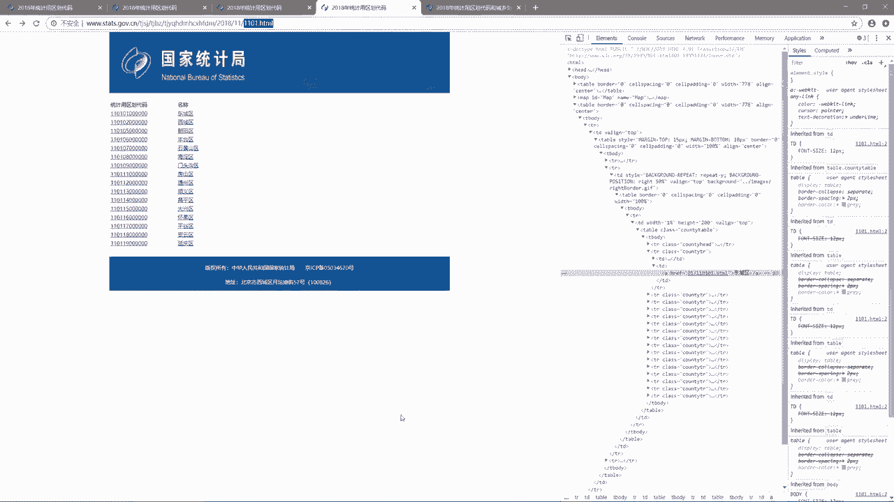

呃，那这里呢它是可以去用到啊，这些具体区的爬取去可以去使用的啊，那即便是不可以，其实也没有关系，我们写爬虫的时候一定要大胆的去尝试一下，如果说啊可以，那你就赚了，如果说不可以。

那我们再想别的办法就可以了，那这里呢这样就可以去获取到到，我们想要的这前一部分，然后呢额就是进行一个拼接。

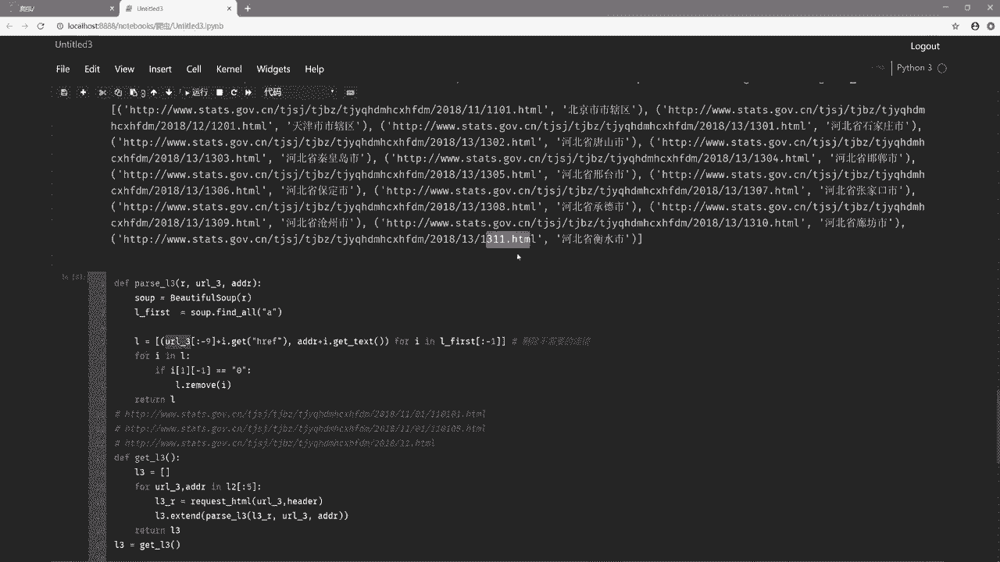

他呢其实就获取了我们第三级目录里，这个对应的URL，那我们来运行一下，看下效果，诶哦不好意思，这里我们没有输出，唉大家来看呃，我们先来看这个URL还对不对，首先呢是零一啊，杠110101来看。

我们点进去啊，01110101没错，这个URL没有没有问题，我们再看下面下面，首先北京市市辖区，这个呢其实就是我们刚才有拼接好的这个地方。

所以说这个没有什么问题，下面呢啊就是新加的这部分东城区，也就是呃我们的这里。

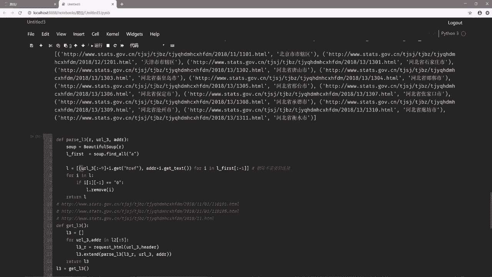

我们在便利的时候取到这个get text，也就是那个标签中的值，东城区加上我们之前数据当做参数传进来。

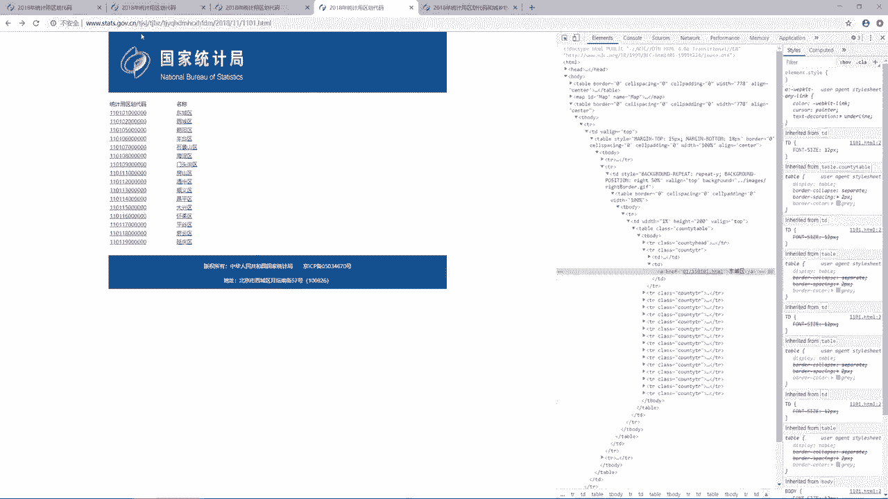

然后相加就这么一个效果，那这样呢，我们就成功的拿到了第三层目录里的数据，下面呢啊我们如法炮制，来看第四层好，首先呢我们先看一下这个URL，大家来看这是第四层，它长这个样子。

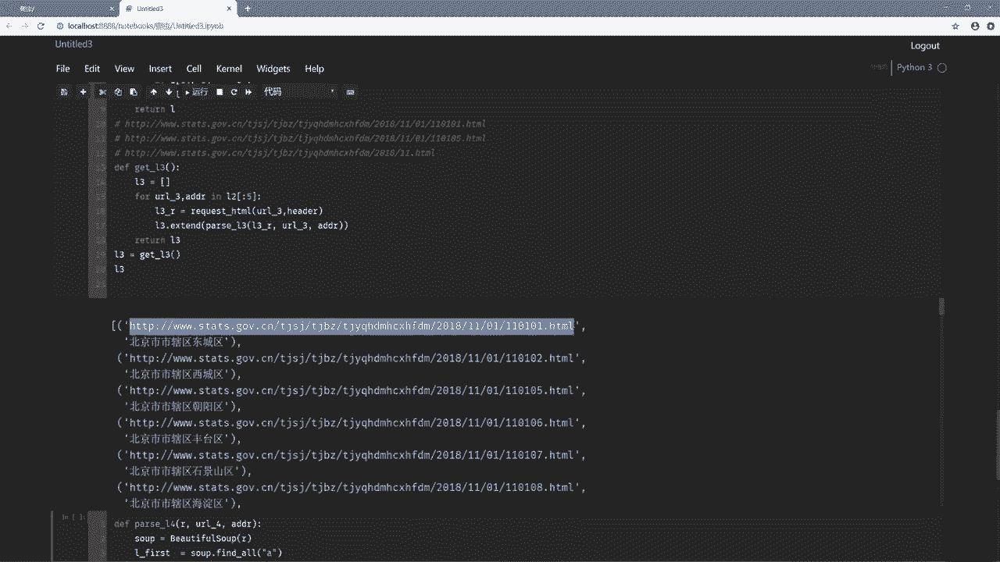

好像跟刚才又不一样，我们来看刚才的长什么样。

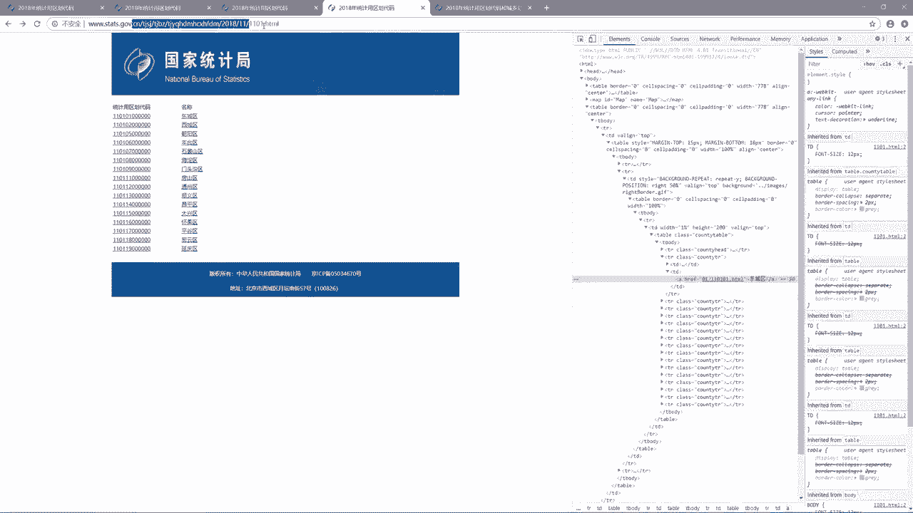

等一下我们的后背记呃，刚才那是不对，我点进去啊，刚才的目录长这样，是1101001，现在呢，现在的是这样，11010101又变了，那怎么办呢，其实还是和刚才一样，我们哎先不管他啊，我们先顺一下。

顺到那里再给大家说，还是建了一个空列表，然后便利同样这里为了节省时间，取前一部分，然后呢调用我们的访问方法，传参这里还是添加数据。

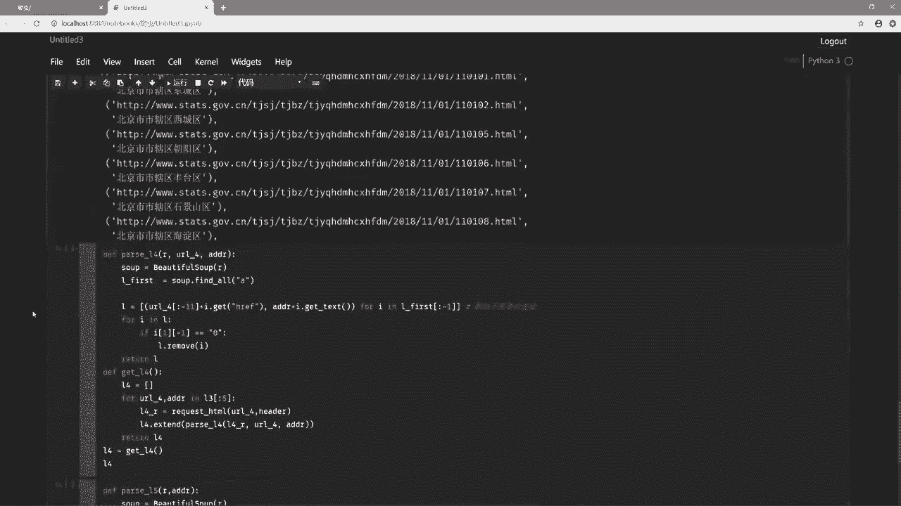

大家看这里是不是一模一样，基本上是没有什么变化，所以说这里呢其实也可以用代码了，不用去解决它，从而少写这几行代码，然后呢还是解析这个数据，然后beautiful soup对象查找A标签。

然后建立这个列表，这里呢跟之前还是一样的，只有这里发生了变化，但是变动的呢还是很少，大家看我们刚才这里是不是个九啊，那是因为我们是不是只有110，幺点HTML这种只有九个字符。

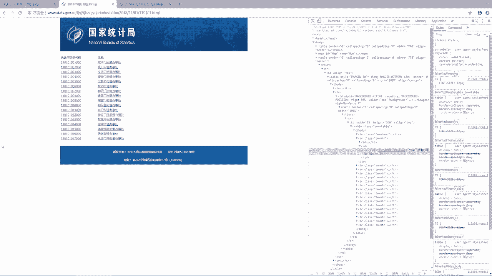

那我们来看这个，我们要拼接，大家看这里的零一啊，他其实是没有变的，他变的只是后面的这些嗯，那我们只要想办法把这个删掉就好了，在这里大家来看前六个数字，后四个字母加一个点，一共是11个字符。

然后我们取到倒数第11个，然后我们只要前面的，然后后面的11个就删掉不要，然后呢，把取取好的和现在获取到的进行一个拼接，就获得到了一个新的链接，这里同样是哎等等零进行判断，然后把前面的这些删掉。

只要后面我们来运行一下，那大家来看，其实这里呢刚才看已经有几秒的卡顿了，那大家看他的数据量，现在就这些并不多，但是大家想我们每次不是取三个。

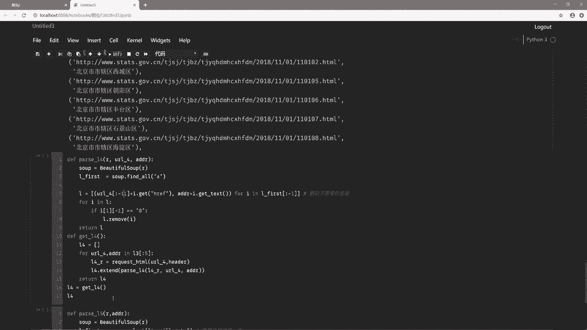

就是取五个，是一个非常少的数据啊，如果取得多了呢，嗯带宽和达不到的话，可能要爬爬上，那么12分钟才能获取到所有的数据，大家看这里，首先我们获取了URL，打开看一下。

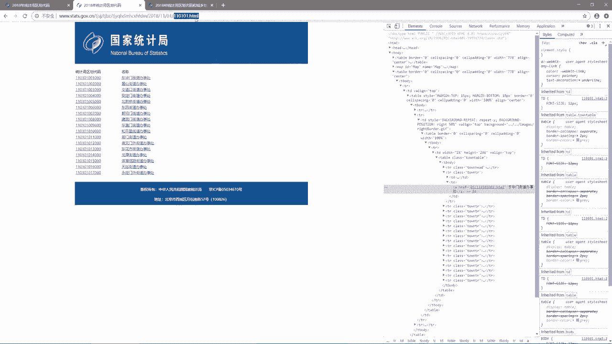

哎没有问题，我们成功的从四级目录进到了最后一集，那证明我们的啊URL呢是没有，我们获取到的URL是没有问题的，我们再来看这里的拼接，北京市东城区，这都是上一集已经拼接好的，所以说我们只需要拼接上。

当前这一集目录的数据就好了。

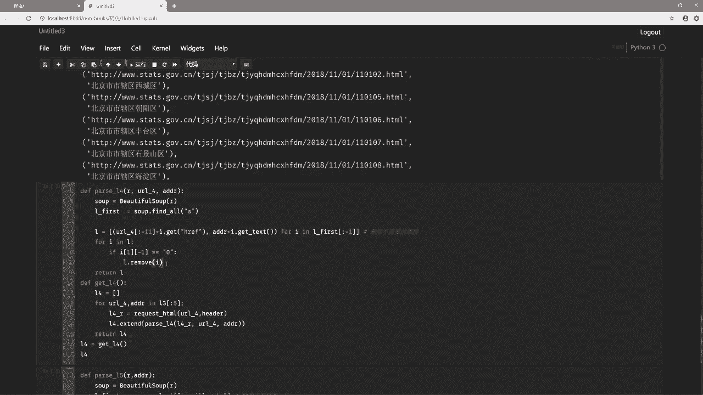

就是我们这里东华门街道办事处，那这里呢就没有问题了。

我们就已经成功的拿到了第四季目录的数据，接下来啊就是最后一环，那如果说我们成功爬到最后一环呢，我们整个爬虫的案例就成功实现了，额那大家看啊，我们还是定义一个方法，然后呢这个方法里定义一个空的列表。

列表里面呢啊还是这么一个循环循环上一遍，历上一级目录，然后呢解包把元组拆开访问。

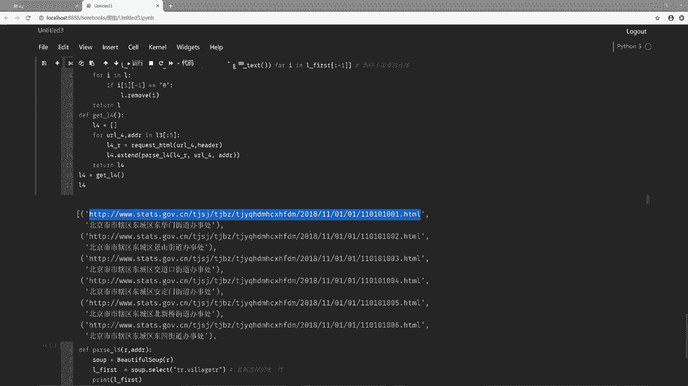

我们解出来的这个URL就是这个东西，把获取到的响应呢进行一个解析。

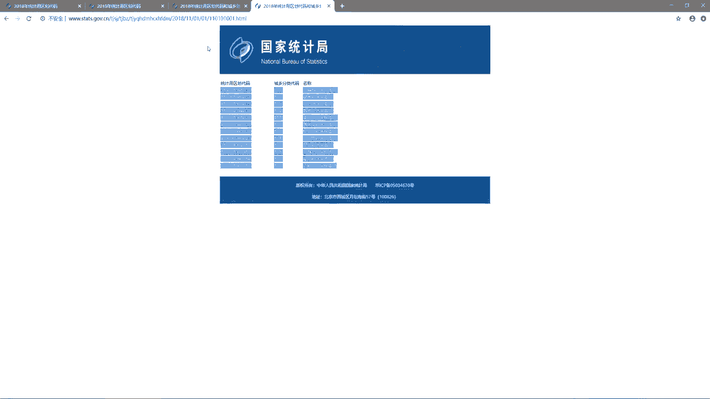

把解析的值呢存储到我们的L5这个列表里面，那就是在关键还是在解析这一方，我们看这里好像和之前有发生一些变化，大家看我们之前是不是传了三个值，这里我们传了两个值，那他为什么少了一个呢，让大家来看一下。

我们点进去以后，大家发现这个值和之前有什么区别呢，男人说哎中间多了一项，多了一个111，这是一个区别，但是这对我们来说并没有什么用处，大家来看这里，我们点不动了，它不是链接了，我们已经到底层了。

这就是我们要获取的最终数据啊，严格来说这个加上前面一级一级目录，一个完整的一个数据呢，就是我们要获取的数据，它没有链接啊，那大家想，那我们刚才的方法还能用吗啊，我们查找到所有的A标签。

大家看这里整个目录里有A标签吗，只有一个这个，但这个我们并不想要，所以呢这里呢我们就换一下，我们不找A标签了，那我们找什么呢，我们来检查检查看，大家看这里啊，在找数据的时候呢。

这里给大家说一个额就是很重要的点。

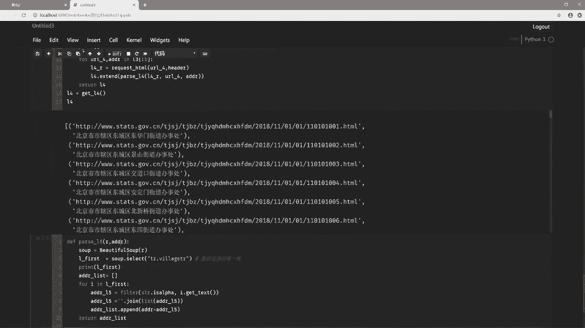

我们在这个网页找数据，我们所写出来的这个数据提取的代码，一定要尽可能的拥有一个唯一限定，这是什么意思，就是说我们不能去匹配数据的时候，一下匹配好多个，但是假如说我们只要这一个数据，就是这个东厂社区。

但是我们的表达式呢把这些全都匹配上了，那这样呢其实这个表达式对于我们而言，作用就会小的很多，我们还需要再去写一些其他的表达式。

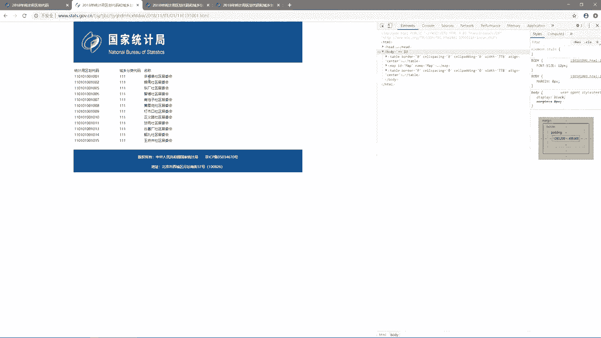

再进行一个细化的匹配，我们尽可能的就是。

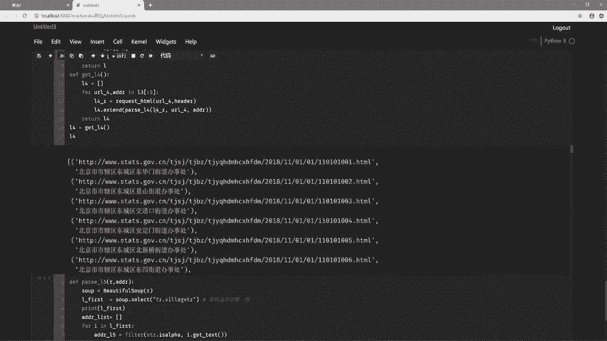

直接让我们匹配到我们想要的这个数据，那比如说大家来看这里，我们先来看，首先呢我们能不能直接匹配这个这个啊t boy。

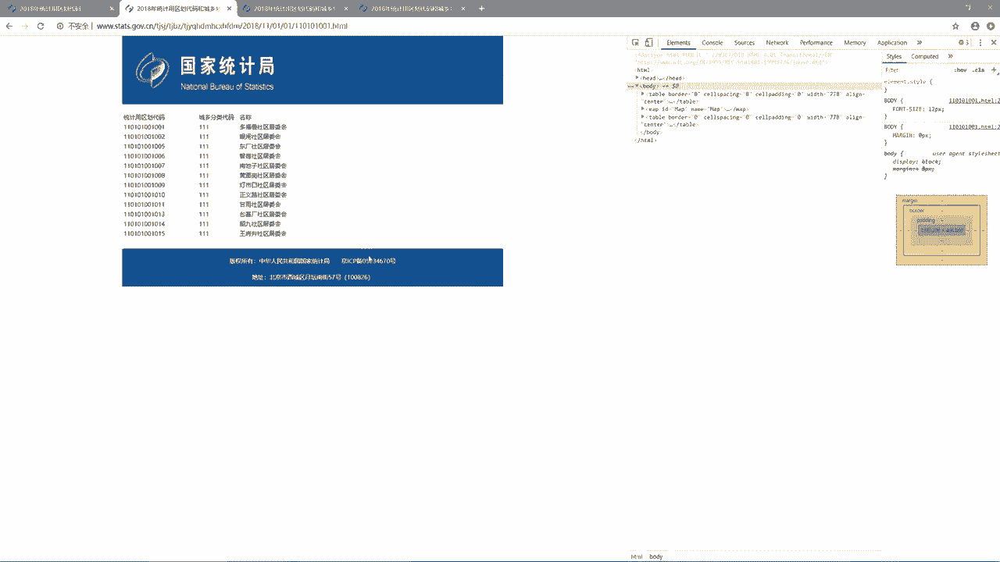

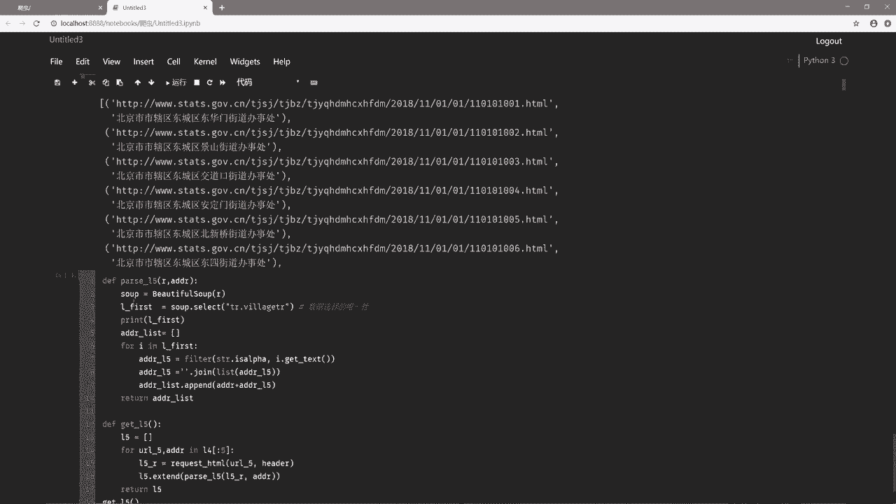

我们能不能直接匹配它呢，那肯定不行了，那匹配它跟没匹配一样，那我们能不能匹配这个table呢，好像也不行，他的海南范围有点广，那我们就继续细化，我们会发现诶到这里额，那大家看啊，这这在呃谷歌浏览器呢。

我们在使用检查的时候，它有个好处，就是我们把鼠标呢放到它所对应的这一行，前端页码代码里面的时候呢，它这里会标识到我们选到哪个，那如果说我们如果之前啊大家有了解x pass的话。

x pass在这个时候呢就会非常的好用，但是因为我们之前没有讲过，所以我们依然用beautiful soup来实现，大家看我定位到了这个TD标签，但是TD标签如果我直接选的话有用吗。

大家看这里好多TD标签我打开下面还是有好多，每一项都有三个TD标签，如果我直接选的话，它比刚才的范围要小很多，但是还是不能直接定位到我们的数据，应该在那怎么办呢，大家来看嗯。

我们这里是不是有一个哦VILAGETR，就这么一个啊，class等于的值，它是直接代表了这一行，那如果说我们直接选中了这一行，他会获得什么呢，来看是不是获得了啊，这三个TD标签，那我们来看我们代码。

那他呢我们在这里啊就直接选中了这个东西，我们用了啊，比如说sup0了，Select，直接选中这个标签，那我们就会获得，这就刚才我们有看到了这TD这三个代码，但是这明显还不是我们想要的。

但是呢我们似乎目前只能选中这三个标签了，那我们下面去处理一下它，我们来先运行一下，这里我们打印一下，大家来看啊，这里我们所获得的是什么东西，就是这么一个TR标签，看这是一整条。

大家看就是哎这一串数字加上111，加上我们想要的数据，它就长这个样子，那怎么办呢，那在Python里面其实也是比较容易的，额我们呢去便利我们获取的这整个列表，那么每次便利呢我们都会拿到这样一整项。

这一整项呢大家来看，首先这里I点get tt。

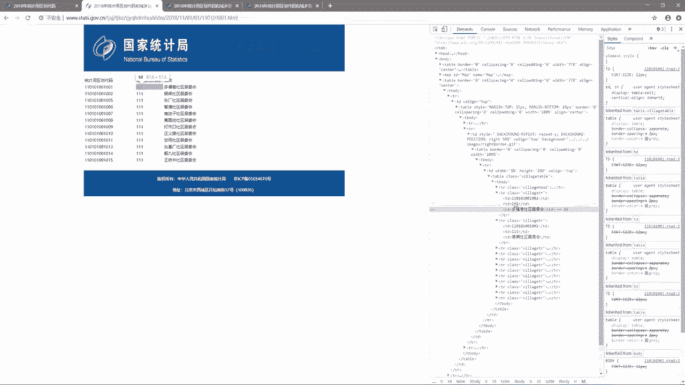

他获取的是什么，他获取的是不是这些数字，加上这个它拼接的一个完整的字符串，就比如说1111啊，我们还是给大家来打印一下。

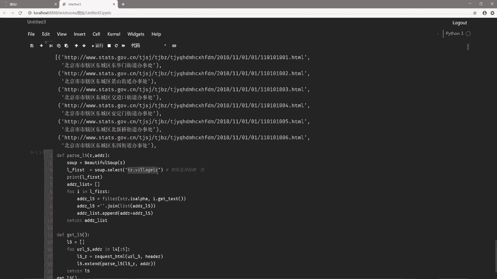

大家来看一下，先看一下效果，大家还是来先看一下效果，再来看，就这样就长这个样子，这明显不是我们想要的。

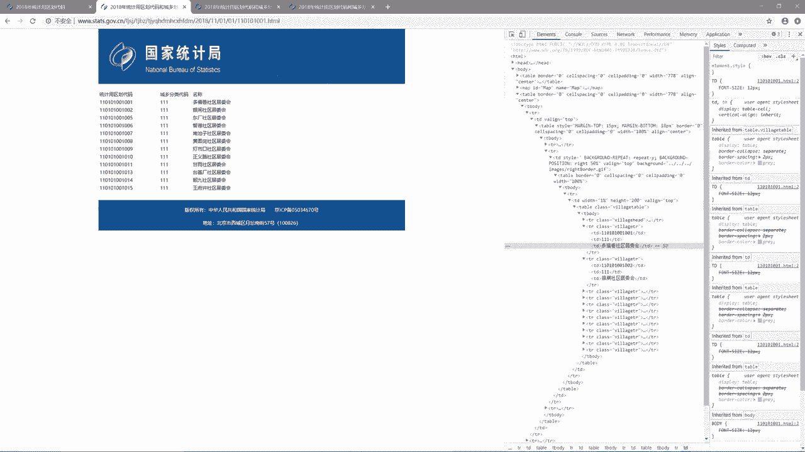

那有人可能就会想了，哎我直接用正则表达式删掉前面这些可不可以，可以没问题，没有问题，我们就可以拿到，但是那不用正则表达式，我们还能用其他的吗，当然Python是很强大的，大家来看这里，我们用了什么。

我们用了一个比正文的表达式呢，更方便了一些的东西，filter叫过滤器，那我们定义一个过滤器，删除一些东西，什么东西呢，我们定义一个过滤规则，STR点is l它是什么意思呢，就是删除呢啊不是全是字母。

全是就这种字符的，那这些呢它其实是数字，他要匹配的额，就是说如果我们想要删掉哦，删掉不是数字的，它是有另外一个方法叫is digital，对他在Python在Python里是有这两个方法的。

那这个这句话它代表的意思啊，就是我定义了一个过滤规则，这个规则呢就是删掉字符串中不是字符，就是是数字的那些东西，然后删哪个字符串呢，就是这个来点get text，也就是我们这一这一串东西。

下面呢啊我们再定义，因为这个东西它会返回一个列表，列表明显不是我们想要的，那我们呢就用这个点join方法，把列表中的每一个值都取出来，进行一个拼接，那这里他其实获得的就是这一个字，一个字一个字。

我们把它拼接一下，用join方法拼接一下，那就会获得这个东西，就是大家往下看哦，那这里便利了好多，大家看，诶这里呢因为我们没有打印这个我们打印一下，让大家看的更清晰一点，我们再来一起。

大家看这里呢就是删除以后它就长这个样子，我们就是把里面所有的数字都给删掉，只要里面的这些字符，也就是哎这个功这个函数的功效，那整体呢也就是这个过滤器的功能，这个过滤器啊他啊大家在字符匹配的时候。

就是如果说可以合理的去使用这个过滤器，那它呢其实从某方面而言，效果要比正则表达式还好，而且呢用起来是非常方便的，因为我们Python里面就是集成了很多，这样方便的小方法，所以说呢啊大家在学爬虫的时候啊。

其实也是Python这门语言的一个深入学习，然后呢我们把已经匹配好的数据啊，全部加在这个列表里面，给大家看，这里我们依然用ADDR，也就是我们上一级的这个，和当前的数据进行了一个拼接。

也就是我们获得了这个，我们最后想要的这么一个完整的数据，然后呢我们把它加到L5这个列表里，最后呢我们打啊打印一下，L这个这边的notebook有返回值，它会自动把返回值打印出来，也就是我们来拉下来。

就是最后这些了，那这就完了吗，其实没有啊，我们只实现了前三步，还有最后一步，那最后一步呢要实现是非常简单的啦，那首先呢我们可以比如说with open呢啊，一个打开一个文件。

把这些数据全部写到一个TXT里面就可以实现，那或者说我们用pandas里面的to excel，然后把这些数据全部写进去也可以，那实现方法呢是有很多种，这个呢这个呢就大家来实现好吧。

那我们今天的课程呢就到此为止。

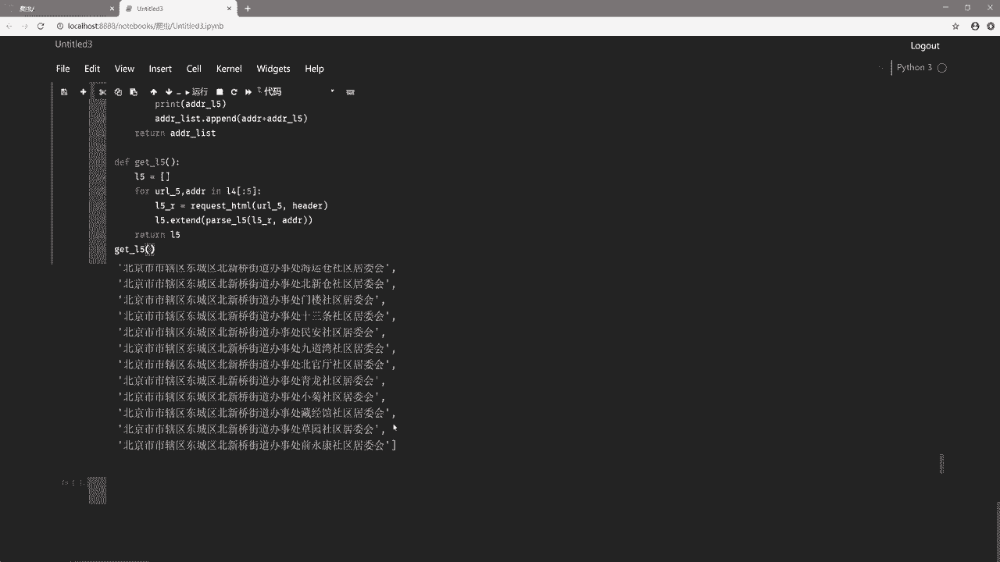