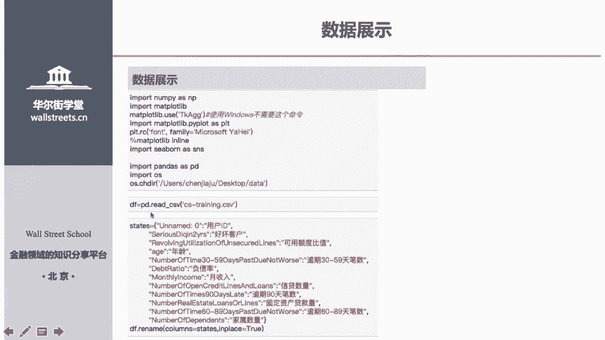
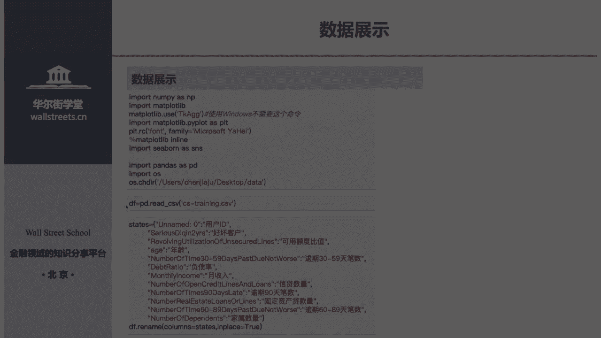
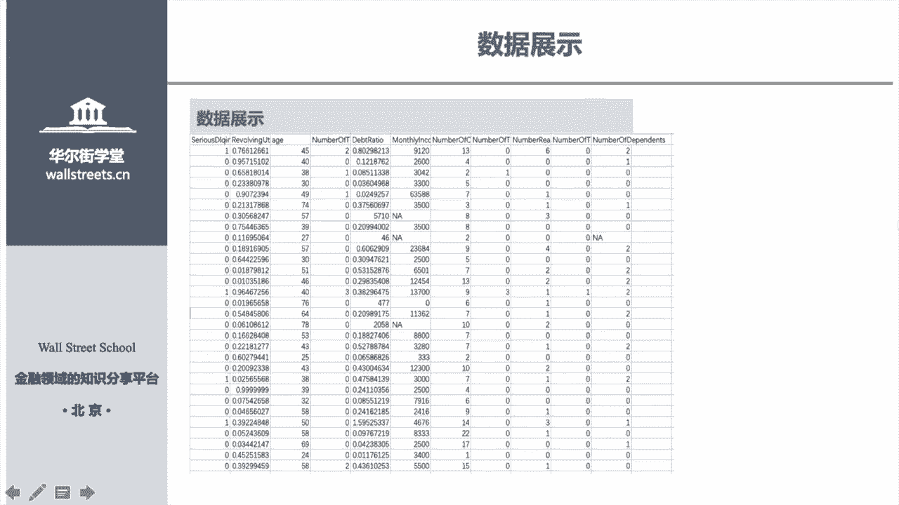
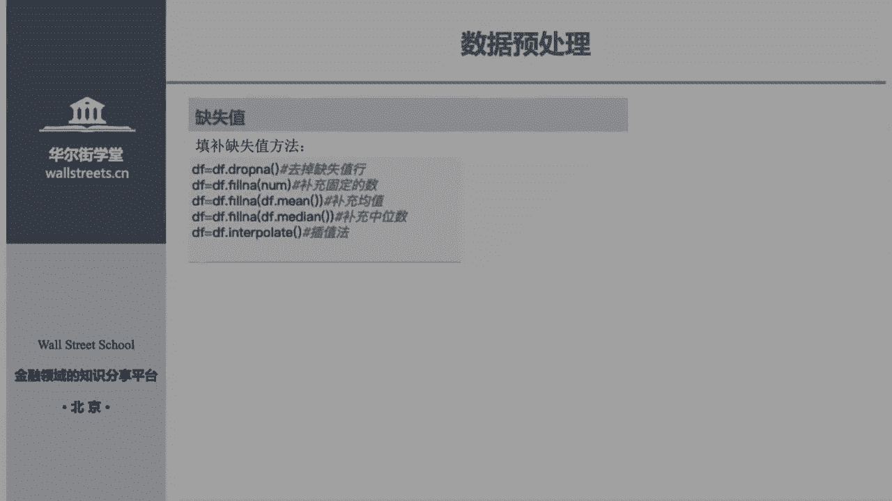
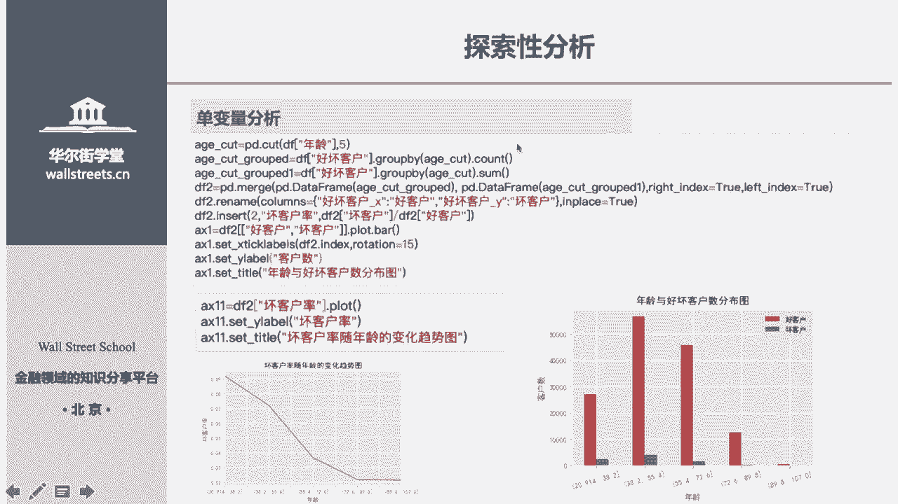
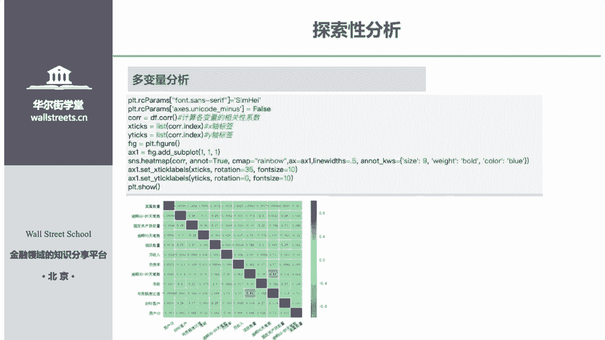
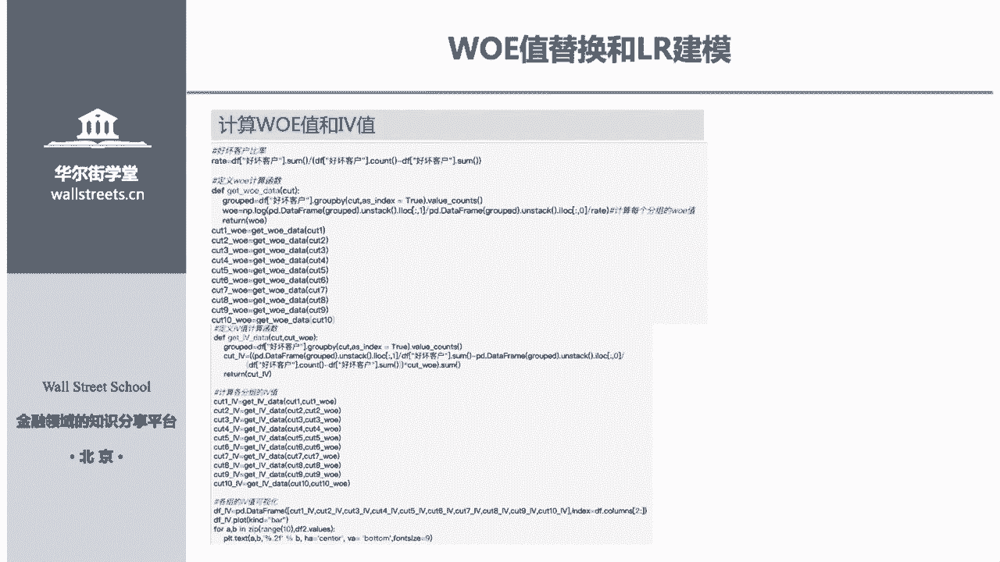
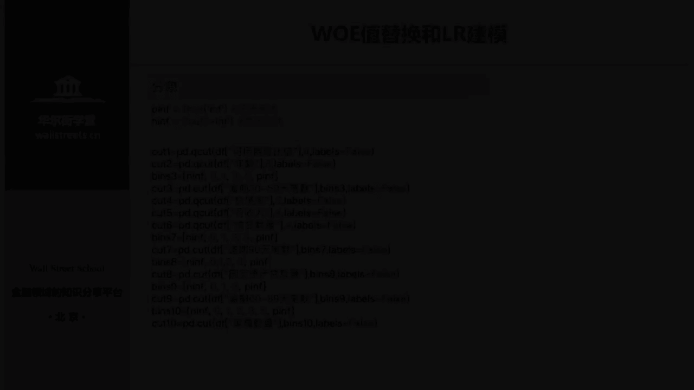
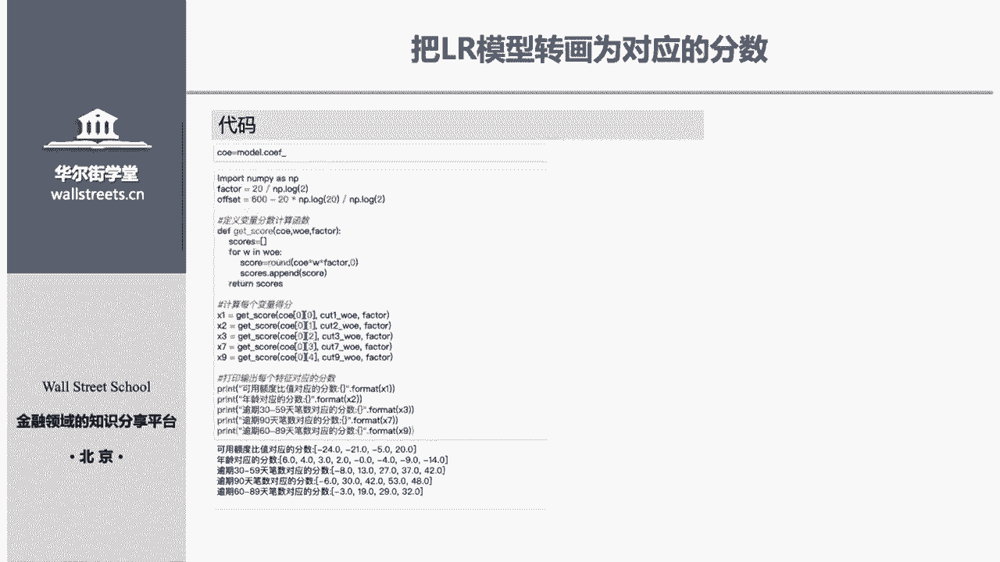
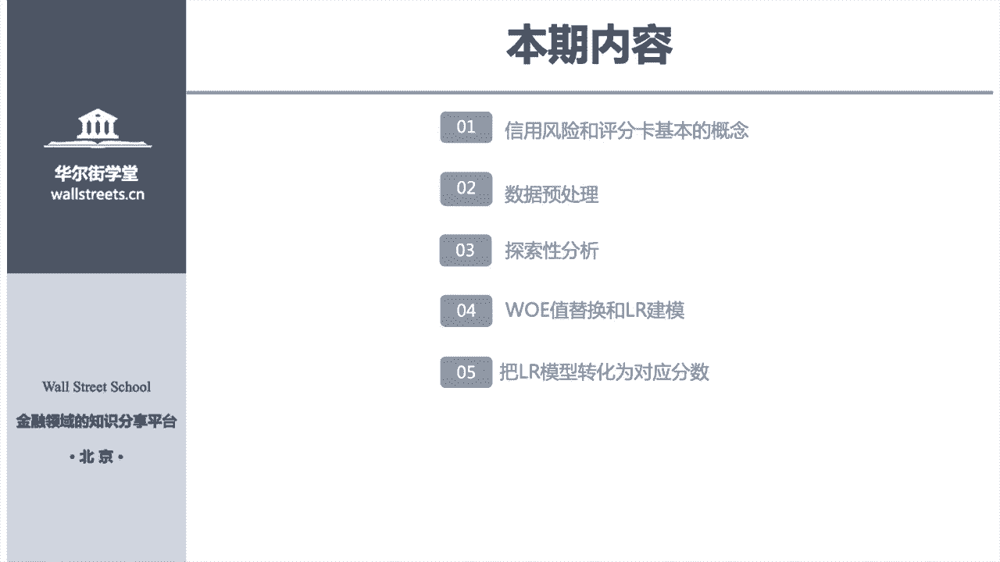

# 14天拿下Python金融量化，股票分析、数据清洗，可视化 - P19：02 信用评分卡 - 川哥puls - BV1zkSgYZE54

好各位学员大家好，接下来我们来讲第16讲，就是用Python来做一个信用评分，好，我来简单的，现在可能有些学员对我们建模不太了解，我来简单介绍一下什么叫做建模，是这样子建模，它分为三个步骤。

第一步你要拿到数据，然后你拿到数据之后，就是你要拿到一些历史数据，就比如说这个客户他违约了，他有什么样的特征，比如说他的年龄，他的年龄多大，他的存款多少，他的房贷，他的房贷怎么样等等一些特征。

然后他违约了，然后另一个客户他没有违约，他的年龄是多少啊，他的存款是多少，他的房贷就到这样的一个数据，然后拿到一堆客户的数据，然后这样的一个历史数据，然后我们再建一个模型，对这个数据进行一个拟合。

就是我们把我们让这个模型他自己去学习，就是说就是说我们把我们这个历史数据带进去，然后让模型对这个数据拟合就进行拟合，就有什么样的特征的，就是有一个就多大年龄的客户，他的房多，房贷有多少的客户。

他是他是容易违约还是不容易违约，对这样子进行一个预测，而我们模型拟合数据之后呢，如果有新的客户，只有新的客户要加进来，我们只要把他的一些特征，比如说年龄啊，房贷啊，扔进那个模型里面去。

那个模型就会自动的对这个客户进行判断，就是他是否会违约，就这样的过程就是拿到数据，然后拟合数据后，对新客户来说，我们把数据把我们这个数据跟进去，它进行一个拟合判断，就这样的一个过程好。

因为我们这段要讲的是信用风险，讲的是信用风险嘛，所以说我们这个案例实务，他讲的就是一个信用风险，还有一个信用评分卡的一个设定，然后第一讲我们就要讲信用风险和信用评分卡，第二讲我们要讲这个数据的预处理。

第三讲讲探索性分析，什么叫探索性分析呢，就是说这样子，就是说，如果你是一个呃，经验很丰富的一个信贷专家的话，你知道哪些特征，比如说客户的年龄可能年龄越小，他越容易违约，年龄越大，他可能越不容易。

你知道哪些特征，对你的这个这个客户违约预测是有帮助的，你可能知道，但是对于一些新手来说，一个没有业务经验的人，他怎么去判断哪个特征，就是哪个这个客户身上哪个特征比较重要呢，他是没有这个判断能力。

所以说就需要用探索性分析来进行判断，我们哪个特征对我们这个预测，这个客户的违约预测比较重，他的他是否违约的这个影响比较重要，好，第四个就是WE值的替换和我们的LR的建模。

第五个就是我们把呃LR模型是什么，R模型，其实它有一个英文名，它有一个中文的名字，就叫做洛基的回归，大家不要被这个模型吓到，其实它是非常的简单模型，我们待会会讲，而第五个就是说把IRL。

R模型转化为对应的一个分数，因为评分表嘛他需要一个对应的分数来计分嘛，所以说我们把按模型的结果，把转化为对应的分数，然后讲到这一讲呢，我希望大家把这把思路，把自己的重点放到我们的一个思路上面去。

大家千万把放到树上去，因为这个这一讲我们建模的代，因为这个一讲我们建模了第一代码很多，第二个就是我现在所有的代码，它就是这个建模，它没有一个固定的技巧，它只有方法论，所以说他是一个活的。

所以大家一定要一定要去注意他的思路，而不是说呃，而不是说我的这个代码怎么写，大家一定要注意，然后这里我会淡化我的代码的描写，我只给大家讲一下，就是我的代码为什么要这么写。

他我我的思路写这个代码的思路是什么，然后我不会给大家去详细的解析，详细的去解释那个代码的细枝末节，因为这节课说句心里话，这节课应该是属于数据挖掘的内容，然后很多人就是很多一些业务的老手。

他们要从数据小白数据，但数据完全小白，然后进到数据挖掘的大佬，他们自己要经过很多的磨练，很多的学习，所以说你想通过这一节课，完全掌握数据挖掘的内容，其实是一个很难的问题，所以说我现在主要就是给大家讲解。

我们我们的一个思路，然后师傅领进门，如果你以后想对这个东西继续进行深造的话，那你可以继续往里面去钻研好，首先我们来讲一下，信用风险和信用评分卡的概念，首先什么是信用风险呢。

一句话一句话总结就是他的违约的风也，违约的风险，就像我们的信用风险，而什么叫做信用评分卡呢，大家申请信用卡的时候，会不会是不是会申请资源，会填张表啊，对不对，然后那张表上会有什么呢。

会你的年龄你多大多大多大，然后你在上面画勾，对不对，还有你的收入是多少，画勾对不对，然后这个这些问题和这些评分的一个，就是年龄的一个阶段的划分，就是年龄是十，比如说19岁到20岁。

这里他会一个阶段你到前面画勾，然20岁到30岁一个阶段，化工好，这些，接这些这些问题的设置，和我们的一个年龄段的划分，请问大家是银行拍脑袋想出来了吗，这些如果你没有接触这一课之前的话。

你会觉得哦这这肯定就是银行他们信用卡中心，他们脑袋一拍嗯，别人怎么写，我就怎么写吧，然后设置上其实不是这个，它都是通过我们接下来的模型跑出来的，所以说评分卡就是我们就是你这个模。

这个我们今天想学学的评分卡，就是你申请信用卡前面填的那张表，那张评分表就是我们的信用卡，而这一课，这一课我们主要讲这张评分卡是怎么去构成好，我现在给大家先来一个先入为主的观念，首先年龄段的划分。

是我们接下来要讲的，数据预处理里面的一个分项，然后我们的呃我们的那个问题的选择是，接下来我要给大家讲的就是我们的就是变量，就是特征的一个选择，在在经济学里面称为变量，在数据科学里面称为特征。

就比如说年龄差就是一个变量或者年龄，它就是一个特征，好这样问题是特征的选择，评分卡的那个段的划分是分箱的一个手段，好大家记住，我给大家这两个先入为主的概念好，我们来先来看下一讲，就是我们数据的预处理。

数据预处理我们主要去展示一下我们的数据，然后再展示一下，就是因为我们模型你和我们模型，要你和我们数据的话，首先要保证我们数据它是完整的，它有缺失值的话，我们模型它是不能工作的。

接下来我们先来讲我们怎对数据进行一个展示，然后接下来我们再讲一下，我们怎么去处理缺失值，而在后来我们就讲一下，我们去处理怎么去处理一个异常值，好，接下来我们来看下，我们的数据是什么样的一个数据。

首先这个数据是在一个K级上面拿到的数据，K级它是一个数据分析大赛的一个官方，那个国外的一个很著名的平台，如果学员你们有兴趣对数据科学有兴趣的话，我希望你们都在上面去注册一个账号。

有机会去上面去打一场比赛，他非常有意思，而且让你得到锻炼好，这是K级上面拿到的一个数据，它一共有十个11个特征，经济学里面来说的话就是11个变量好，首先我们来看我们的目标变量。

和我们或者是我们叫做目标特征，什么叫做目标特征呢，比如说我预测它的违约率，那违约率它就是我的目标变量或者目标特征好，我们的目标变量，目标特征就是预测它是好客户还是坏客户，在这个变量里面呢。

它的好客户是零来表示它坏客户是一来表示，这很典型是一个二分类变量，就是好客户是用零来表示，坏客是用来表示这个二分类变量，这种分类变量和我们上节课讲的回归不一样，回归它是一个连续的变量。

但是分类变量它就用一个分，就是用一个模型，把这两个把这两类人给分开的一个变量，而这个就会用到了我们的一个逻辑的回归，好接下来其他的1X1到X4，这些变量呢全部都是我们的一个特征。

就是我们要拿这些特征来预测，我来你和我们的客户到底是好客户还是坏客户，或是换句话来说，我们会来用模型来看我们的好客户，到底在这些特征里面，他是一个什么样的一个表现好。

接下来我们首先第一个我们要用到这些包，然后这是我们long派包，还是我们的画图包等等，这些包我们先把它给导入，然后这里有一个就是如果说你要画图的话，你的如果你是苹果电脑，请你把这个给写上。

如果你是windows系统的话，那你不用写这个好，接下来我们要导入数据，就用pandas as来导入，然后导入数据之后呢，或许有些学员他就会觉得嗯，这这个这个特征的名字太奇怪了，我都看不懂。

都觉得很很很抑郁，这这个看不懂，我等会怎么操作啊，那没关系，我们把它全部转化为中文，就通过这样一个方法，就是DF，然后一个改名字的这样一个就这样的一个代码，然后把它名字就给改成。

我们现在设置的这样一个代码，通过这样一个方式，把我们代码进行一个，把我们的特征的名字进行改变好，现在就是我们特征的一个形式，这里就是我们的目标变量，我们好客户是零，各位注意哦，我们好客户是零。

我们的不好的客户是一，这是我们的一个目标变量，然后接下来的所有的变量，都是我们拿来去拟合这个数据的，就看我们的好客户和坏客户，这模型中他们这其他的一些呃变量，在其他一些变量里面。

它到底是一个什么样的一个表现，就这样子，就是这个模型，我们把这个数据交给我们的洛基回归去学习，然后以后呢我们把第一行给遮住以后呢，我们如果有新客户，我们只要知道我们后面的这些数据。

把它投到模型模型回归模型里面去，他就能给我们标数是零还是一，就这个这个客户是好客还还是坏客户，就这样一个道理，然后接下来我们发现我们数据中有一个NA，这个字，NA是什么意思呢，NA就是我们的缺失值。

如果说我们的数据不完整或者有缺失值的话，那我们模型是不能就那我的模型是不能运作的，所以我们第一步，就要对我们的圈子进行一个补充，把圈子给补上啊，首先第一步呢缺失值补充上补上。

首先我们要知道我们哪哪些变量它有缺失值，然后我给大家两个方法，第一个就是特别简单的方法，就是DF一点INFO一个括号，这个代码输进去之后呢，哦DF是什么啊，DF各位看一下，DF是我导入的数据啊。

就是pd l read csv，这个这是我导入的数据，我把它叫做DF。

各位要注意，而DF我们要看我们这个数叫DF数据的。

它的缺失值怎么看，首先DF点INFO，一个框会蹦出来这样一个表，前面是我特征的名字，后面是我数据的呃，有数据的个数，各位看一下我的其他数据，其他特征的数据是不都是15万呀，对不对。

但是你们看我的月收入是不是只有12万，我的家属数量是不是只有14万啊，这说明我们的月收入和我们的家属，他是有缺失值的，好这是其中一个简单的一个确认法，如果你对这个不满足的话，那你请看旁边这个代码。

我们可以定义一个函数来形成这样的一个列表，对前面是我们变量，后面是我们缺值，然后面就是我们缺失的一个比例，这个函数它只显示我们的确值比例好，你要问我这个函数是怎么来的，这个代码是怎么来的，我跟大家讲。

这个代码就是我从K级一些冠军的，一些冠军选手的，他们会把自己的代码给公开，从那里可以拿到这些，他们那些比较呃比较优秀的代码，这就是一个经验，就大家有机会的话，一定要去注册一个K级的平台哦。

上面确实有很多优秀的代码，如果你觉得这个代码很你，如果你觉得你对这个代码感兴趣，你可以自己慢慢的去挖掘这个代码，我就不想讲，然后这个代码一般都可以满足，你们对缺失值的一个了解好。

接下来我们知道了我们哪些变量与缺失值，那我们怎么对缺失进行一个补充呢，首先第一个就是直接去掉缺失的行，缺失的行，缺失的行是代表什么呢，比如说呃各位看我这里是不是有个缺失值，而我这一行是代表什么呢。

这一行是不是代表我的一个观测值啊，说人话就是这一行是代表我一个客户，这个客户他很讨厌他，他填月收入的时候，他不他直接不愿意填，他直接就放弃了，然后这个客户他竟然没有填月收入。

那我直接把这个客户的数据我不要了，我不看它的数据，这样子就是这样的一个操作，就是把我们缺失值的行这一行给删掉。

就是DFDROPNA这样去删掉，而第二个就是我们补充一个固定的值。

就是把我们确实补充一个固定的数，比如说他这个客户他没有填收入，那我们就认为你既然不填收入，那你的收入是不是很说不出口啊，那我们就给你填零吧，对不对，这样我们就用零来补充我们确值。

而第三个你就说呃填名好像有点过分，这样是不是太看太瞧不起人了，我能不能填个均值啊，OK没问题，用我们第一章的方法，用我们第一章的方法就是DF命令，就是我们的均值，对不对，就是我们的一个列的均值。

然后DFFILLNA这是填入，这是填补充的一个函数嘛，对不对，然后把我们均值的括号带进去，这是我们补充一个均值，不用中位数，同样的方法，最后一个就是以我们一个差值法，就d f inter pit。

这是我们的一个差值法，这样的填充确认这个方法，然后我给大家讲，补缺失值的方法不仅仅是这几种，但是因为咱们这个课首先第一时间先，第二个就是咱们可能是一个基础的一个课程，所以说不能讲太难。

而我们的补缺这种方法，其实现在来说的话已经有很多，包括机器学习方法，包括用一些信息回归方法，就是各种各样的方法都是有，这个看你自己的情况，比如说举个例子，我们现实生活中用什么样的方法呢。

其实我们用中位数补充中位数比较多，为什么呢，因为这样子，因为我们接下来会讲异常值，就是异常值，他是一个极大值或者极小值，它会对我们的一个它会对我们的均值有影响，因为极大值它会拉高我的均值。

极小值它会它会拉低我的均值，然后这个均值其实对我们来说它是不稳定的，所以用均值补充缺补充缺失值的话，它可能会，但它可能会导致有一个，他可能会受到那个极端值的影响，所以说我们用中文书来补充。

是一个比较稳健的方法，所以说我们采用了一般一般的工作中，会采用中文式比较多，但是用随机森林啊，机器学习，就是机器学习这种方法补充的也比较多，然后这里我只展示这几种方法好，接下来就要讲一下我们的异常值。

什么叫异常值的异常值，一句话概括就是那种很极端的值，比如说有些客户他就特别调皮，他年龄他直接给他，直接他直接写我的年龄是100岁，那就是有点过分好，怎么去来查异常值呢，首先我们要理解就是异常值。

它是极大值和极小值，然后我们想我们如果说学过高中的，我们如果我们学过大学的一个统计学，我们知道是不是数据它是符合一个正态分布啊，对不对，而它的极端值在哪里呢，是不是在我们我们的尾部啊，对不对。

所以说我们可以设定一个法子，就是我的99%的中位数，我我把超过我们99%，就大于我们99%的中中位数的数字，我们就称为异常值，然后我们超过百分之，我们小于1%的那些数占1%。

我们超过99%的分位数的那些值，就称为极大值，就是我们极大值异常值，而我们小于1%的那些1%分位数，有哪些极那些极端值，那些其实就是我们的呃极小值的一些异常值，然后这样子我们就可以把我们的尾部直接给。

这就叫我们的一个盖帽法，就是我们用我们用，我们先把我们定义什么叫做极大值，就是大于我们99%的分位数的值，叫极大值，而大于我们百分之小于90%，0。001%的分位数的值叫做极小值。

然后这些值我们都用99%和，0。1%的，以0。1的一个分位数的这个值把它给代替，这样就概括法，就是把我们两端那个洛洛基的分布，那个两端那个尾部直接给截断了，这样的一个方法叫盖帽法，然后你看我们W看年龄。

他是这样的一个分数，然后我们用下面那个函数，如果我的X而我下面定义一个函数BLK，然后写上一个最小值，写上一个最大值，如果我的我的这个数我小于我的最小值，那我就等于，如果我这个如果我这个数小于X的话。

那我就令它等于X，如果它大于X的话，那我就令它等于X，然后我那大于我的floor，小于我的flow的话，那我就令它等于，那我就令X等于这个flow，而大于我的root的话，我X等于root。

然后然后定定义这样的一个函数，然后我们把flow和flow和root定义什么呢，就定义我们的1%的分位数，和99%的分位数，这样子进行一个替换，既可以消除我们的一个极端值的影响，这是盖帽法。

还有一个消除极端值的方法是什么呢，就是我们的一个分享法，什么叫分享法呢，我们可以直接把我们可以知，比如举个例子分享法，怎么上面我们已经讲过，就是说我们上节课已经讲过分项法是怎么操作。

就是把我们的连续变量改成我们的分类变量，对不对，就是我的19岁，我把19岁和我的二二十岁是分为一类的，那我19岁20岁是不是就就是一类人了，对不对，然后其实他的思想是一样的，如果有一个人他填的是零岁。

那怎么办，那我把零岁和十零岁，我那我就把它取低点，我让零岁和20岁是一类的，这样子是不是就对我的一就就是一类的，就是零岁到20岁，这些人都是同一级别的，那我是不是把我的极小值的一个异常值。

直接把它划分到我零到，就是把划到我20岁这样的一个级标，对不对，所以说分项法它是可以呃平滑我们的一个机制，这样达到一个消除异常这个目的，好比如说有的人他前100岁，那我就直接分享，我就分享分为90。

那我就分享60~100岁都是都是都是一类的，那我那你不管你填多大，那你总是和我60岁一样的嘛，都是一个老年人，对不对，这样子就可以解决我们异常值的问题，然后因为我们刚才说了，就是说我才我们刚才说了。

就是说我们那个连接时间段是分相法来解决的，所以说这个异常值，就我们那个信用评分卡的那个年龄段，是通过分享来解决的，所以说这个方这是我们做信用评分卡的话，我们对异常的处理就是用分享法来解决好。

接下来我们来看探索性分析，第一个就是单变量分析，第二个就是多变量分析，然后其实探索性分析他真的没有一个，没有一个固定的方法，它只是帮你去熟悉一些数据，各位知道吗，就是说嗯就是说我们建模之前的话。

也不是说建模之前的话，你要对这个数据有一定的了解，然后你才知道哪些变量适合，就是哪些变量适合带进去，带进我们这个模型，哪一边它不适合带进去，我们这个模型它是达到这样的一个目的。

或者说呃或者说就是哪些变量，他们需要组合一下等等这些方法，而探索性分析是一个探索性分析，在数据在数据科学里面，它其实还有一个更更加庞大的一个名字，叫特征工程，如果各位有兴趣，大家一定要了解特征工程。

它是在机器学习中一个非常非常重要的方法，这个特征工程的学问简直是太深了，也也是他就是也是特殊功能，它就是一个汪洋大海，所以说我们今天只是前所了前所的，来来做一下一个探索性分析。

当然这肯定不是你学习的重点，希望大家如果感兴趣的话，可以下次继续学习特征工程啊，一些数据的一些预处理，这些方法好，接下来我们来看单变量探索性分析，各位我们刚才说我们的各位。

我们刚才说我们的我们这些所有的变量，都是为我们这些所有的变量，包括年龄啊什么之类的，都是为了什么而服务的，都是为了预测我这个客户是好客户还是坏客户，这样的服务这样来服务的对不对。

所以说我可以把好客户和快客，坏客户之间的一个关系，和我的年龄把它联合起来，我看年龄对我的好客户和坏客户，这样这样的这样的预测有什么样的一个影响，而第一个我第一个我们讲一下，就是我们年龄来和。

就用上面这个代码来画一个直方图，比如说我们先把我们的年龄切成分成五份，就是等段，就是等平切成五份，然后我们看一下我们的年龄和我们的考核物，我们年龄的考核物和快合物的比，一个一个比例好。

你看这就是我们切成五份哦，根据聚类的一个方法画出来一个直方图，得到下面一个图形，各位你看我们的好客户，主要是我们的，我们的好客户主要是分分布在我们的好客户，主要是分布在哪些多了各位我们的坏客户。

主要这样就可以展示，我们的好客户，和我们坏客户在我们各个年龄段的一个比例，然后我们再来看，就是说我们好客户和，再来看，就是我现在主要关注的就是说我们的坏客户率，因为我们坏客户率对我们的信用违约的呃。

我金融违约主要是因为坏客户率高嘛，对不对，换句话说，所以说我们接下来我们看我们的坏客户率，和我们盈利之间的关系，各位来看我的，随着我的年龄的上升，我的坏客户率是不是逐渐下降啊。

所以说这就说明我们年龄对我们的呃好客户，坏货物之间的预约，就是我们目标变量的一个预约，它是一个很重要的一个变量，因为因为随着年龄的上升，各位看见我的坏扣率是明显的下降的，所以我们可以得出来。

我们的年龄可能会和我们的好坏客户率，它是一个成反比的，当然我这里只是分析了年龄这一个变量，而其他的一些变量和我们之间的好客，和我们好客户率换汇率这样的方法，同样的方法，同样的代码。

你带进去可以画图看一下，可以对各个变量有一个比较重要的一个把握好，说完了单变量分析，接下来我们再讲多变量分析，多变量分析说句实话就是一个多变量分析。

我们这里只展示一个相关性的一个检验，但是我们多量分析还有比较比较多的一个方法。

你看这个就是通过这样一个方法，就可以画出我们一个相关性矩阵的一个图，就是我们的X轴和我们的Y轴，它们是两个变量嘛，然后中间的它们对应的一个方块，就是我们的一个相关性系数。

然后越红的方位代表他们相关系数越高，这里就可以展示我们哪些变量和，就是这里就可展示我们哪些变量和，我们的和我们的客户，和，我们的好客户和坏客户率的那个相关性比较高，而同时这个还有一个作用。

就是说大家要知道就是线性线性模型，线性模型它有一个它有一个它有线性模型，它有一个假设，就是说呃我们之间的变量之间是要独立的，对不对，独立同分布的，然后如果说我们的线性模型之间有相关性的话。

那那肯定会是降低我们线性模型之间的，一个精度的，所以说我们通过这个相关性分析，我们还可以去剔除它们，就是两个比较相关的这样一个变量，然后你说你可能会问嗯，老师逻辑的回归又不是线性模型。

这个你这个就不对了，因为逻辑回归它就是线性模型，因为洛基的回归它虽然叫做回归，但是它是呃一个分类的一个模型，然后路由器回归它是怎么来进行的，路基回归它是怎么产生的呢，逻辑回归。

它就是在我们的一个线性模型的一个基础上，增加了一个连接函数，然后就产生了一个逻辑回归，所以逻辑回归它本质上它就是一个线性模型，所以说洛基回归同样对我们的相关性比较重要，好我们来看一下。

就是我们发现我们发现这个数据，它比较有意思啊，就是它们的相关性还是比较好的，就是它们之间相互有关系，等相关系数还是能看的过去，所以说我们没必要在这就是没必要去删除各种，通过这一步我们没必要去删除呃。

通过相关性删除一些变量好，接下来就要讲到，我们重点就是我们WOE值的替换，和我们路线回归的一个建模的一个情况。

好，这个要注意注意到，首先我们we1值它是一个什么呢，W1它就是一个证据权重，然后这个值它这个值它为什么我们要找WA值。

因为WA值对我们下面这个IV值，它是IV信值信息价值，这个值它是有，它是要在WOE值的基础上去算出来的，然后IV值是就是IV值是一个什么情况呢，I位置它主要是衡量的，就是我们这个变量它的信息富含的程度。

如果说我们这个变量它的信息包含比较多的话，那我们就把这个变量算进去，如果这个变量它信息复含比较少的话，那我们就要把这个变量给剔除出去，为什么我们要剔除一些变量呢，因为呃因为是这个样子。

就是说并不是说所有的并不是说一个模型，它的变量越多越好，因为有些无关变量会误导我们的模型，就比如说你就比如说这样子，就比如说呃你是学你，你本来就是学就误会误导我们模型，所以说我们只要保证那个信息价值。

比较高的变量就OK，然后这个好我们来看信息价值，它在我们等我们we这个权重权重，证据权重的基础上来进行计算的，我们来看WE是怎么算W值，它就是等log p y p r i。

PNI的一个PYPNI的一个分数，然后一个logo值，而PYI是什么呢，PYY就是这个组中相应的客户，这个就是我们的违约客户，然后占总体违约客户的比例，就是我们不是要进行分享吗，各位是不是。

我们是不是要把就是说我们要把就举个例子，我们是不是要把我们的青年中，我们要把我根据我们一个年龄，我们要把它分为青年中年老年啊，对不对，然后这个青年组他的他的违约，他的违约客户。

占我们的这个总体客户的一个频率，是这样的一个，就青年组中的一个违约客户赚的，我们最多比这是PY值，而PN值是什么呢，PN值就是说我我没有，就是就是PN值，就是说我这个组里面没有违约客户。

占我们总体没有违约客户的一个比例，就这样的一个计算，所以说WE是他是个非常简单的一个算法，然后W跟E值算出来，这样子就是两个比例相比嘛，对不对，就是我们的这个组里面的I除以整体。

然后这个组里的违约除以整体违约，这个组的没有违约除以整体违约，这样子一个比例嘛，我相处一取个log嘛，对不对，所以W1直正确求用，它是非常简单好算的，好在WE值的基础上，我们来算，我们。

这就接下来我们就要算我们的一个信息价值值，我们IV就等于我们的PY减去PNL，再乘以W1，这就可以算出我们每个分段的一个信息价值值，然后这个每个分段是代表什么呢，比如说我的青年组的IV。

就是青年组的性价是多少，我的老年组的性价值是多少，这样子这样子每一个分段的一个I位值，然后你要问就说我的年龄，我的年龄是包括中年青年老年，经过分项操作之后，我年龄是包括中年青年老年，对不对。

那我年龄这个整体的变量，他的iv值是多少，很简单，把青年中年老年他们的iv值进行加总，就是我们这个变量，年龄这个变量它整体的一个信一个信息价值好，大家能理解了吗，理解的好，现在我们来开始进行分享。

首先我们来进行分箱呃，这个分箱要给大家说一下，大家不要看我这个分箱很简单，其实分江就是其实我给大家说一下，就是说log就是就是log，就是我的逻辑的回逻辑的回归，他就是一个模型。

就是别人已经建立好的一个模型，所以说模型其实对数据分析中，它并不是一个很重要的部分，如果你越熟练，其实你的建模速度是越快的，关键是在于什么，就是我们的一些特征的一个处理，比如说我们的分箱特征的处理。

就是一个很麻烦的一个事情，然后因为分项涉及到我们的一个特征工程，特征工程是我们数据挖掘中，一个很很困难的一个东西，所以说我只在这里给大家讲一下，就是说数据挖掘是我们在做建模里面，是花费时间最大的。

但是因为我们是一个基础班，而且而且我们现在时间有限，我们现在可能是只有一节课的，一节课的时间，如果数据挖掘我们要当初就是特征，除特征工，就数据外界里面特征工程，我们要单独拿出来处理的话。

那我们可能要讲讲，就是讲一个系列的课，那都不为过分，好我们现在就讲一下分项，怎么处理分项，首先呢为了保证我们的一些极端者的影响，所以说我们极端值，为了保证我们刚才说的，就是我们的异常值的一个影响。

所以说我们对分箱的时候，我们要取一个极大值，正无正无穷大和负无穷大放在我们分箱的两侧，比如说我的第三个变量，第七个变量，第八个变量，第九个变量和第四个变量，就放到我们正无穷大和负无穷大的一个两侧。

这样就保证我们异常值是可以保证的好，接下来这个就是我们的一个等等身的一个分项，各位看到没，就是12456都是我做了一个等式三，然后你要问我为什么要这么分享，其实我是基于一些算法。

比如说一些比如说一些最优分箱的算法呀，比如说现在分享算法有卡分，卡方分箱啊等等这些算法，但是这些算法呃数据代码比较麻烦，可能呃可能就是对我们基础课，不就是对我们可能基础课同学不太友好。

所以说我在这里就给大家讲一下，就是我们通过某一种算法，如果各位学员有兴趣，大家可以自己下去去学一下，就是我们的呃卡方分箱啊，还有随机森林分享啊，还有一些比如说又有一些分箱，它是一个它并不是一个线性的。

它是一个U型的一个分箱好，还有这些分项等等算法，各位可以同学可以去哈，如果想了解的话，可以继续了解，然后我们这个分箱它有一个要求是什么要求呢，因为我们接下来我们分完乡之后。

比如说我把我把年龄分为中年青年老年，进行这样一个分享之后，我要保证它的它的WE值，就是我们的一个证据权重，那个值要是要是递要是单调的对吗，要么是单调递减，要么是单调递增，为什么，因为我们的评分卡。

他是因为我们的评分卡他是有这样的要求，所以说通过这样一个方法，我们可以达到一个就是同样这样一个算法，我们可以达到一个分项，并保证我们的WE值，它是一个单调的单调的一个情况。

这样方便我方便我们去进行一个评分，卡积占一个去积分好，接下来我们就要算我们怎么去来计算，我们的WA值和我们的一个IE值，首先呢我们要算出来我们好客户和快货做比例，然后因为我们的WE值是不是要算。

要要用到我们的好客户占总体的比例和快，坏客户占总体的比较，对不对，首先我们要算出好客户和赚快客户之间的比例，然后这里为什么要用sum呢，因为各位想一下我的好客，我的好客，我的好客户是不是代表零啊。

对不对，我坏客户代表一啊，对不对，是不是我对我们这个呃，求我对我的这个求一个总就是它的总数，其实就是我们的，就是因为我们好过，他是零嘛，所以他不会寄到我们就是求和的时候，他不会记到零去嘛。

所以说我们求和的数值，就是我们那个坏客户的个数，对不对，我们坏客户数除以我们坏客户的比例，是不是，这样就得到我们这个坏客户的一个比率啊，对不对，好，我们先算到我们，可我们每个每一个值得好客户的比例。

然后再我们先算出来，我们每一个值先算出来，我们好勾画或比例，然后我们再定义一个函数，定一个聚类函数，就是说我们通过这个代码来算出来，我们每个分项里面，他每一个分享阶段里面。

他的好客户比例占总体占总体的客户的比例值，和我们坏客户比例占总体客户值，得出来这个值之后，我们就可以得出来我们的RWE值，然后得出来W1值的，我们就就把我们W，就把我们每一个变量的W1直就存在。

我们的C，就存在我们的cut w e值这样的一个里面，这是一个数列，我们就存在我们的数列里面，而得到了这个数列呢，接下来，嗯好得到W阈值，接下来我们就要算出我们的一个信息呃，信息度。

那就是我们的一个变量的一个呃，信息价值的这样的一个值，而我们说的就是首先我们怎么求，就是我们要用我们的WE值，我们每个WA值给就根据我们的式子，我们要用每个基每个变量它们分段W1值。

然后乘以我们的一个PY减去PN。

就得到我们每一个分段的一个iv值，然后再对iv值进行一个加总，就得到了一我们这个变量的整体的一个I位置，对不对，所以说我们根据这样的情况，我们定义一个函数，同同时同样的根据聚类函数。

我们可以计算出我们的一个，我们的我们每个分段的IV值，然后再进行加总，就得到我们整体的一个IV值，而我们得到整体的一个整体变量，整体变量IV值之后呢，我们把它画成一个柱状图，然后我们再来判。

就画成这样一个柱状图，好这里就是重点来了，我们前面说过，就是说这就是我们的整体的iv值，然后画出来的就每个变量，它们I位值之间的一个一个一个乘，一个一个值好，我们前面就说了，就说各位填信用卡。

办信用卡之间填的那一张表，填的那一张表，那个问题他是自己拍脑袋想出来的吗，他就不是拍脑想的，他就是通过这样的一个方法把这个问题给刷，选出来的，各位能白吗，比如说呃，比如说首先你看我的负债率。

是不是我的信息价值是不是很低啊，那个负债率这个变量，它可能它这信息价值这么低，它可能会误导我的模型，导致我模型不准确，所以说我们直接把这个负债率给踢掉，而我们的月收入，这个信息价值是不是也是很低啊。

我们把这个也要踢掉，然后所以说你，所以而我们的一个信贷的一个数量，它是不是信息价值很低啊，而我们是不是把信贷这个字也要给P掉，所以说这在这个数据里面，那你填这个信用卡评分的时候，它就不会出现。

比如说你的月收入多少这样的情况，然后你会觉得这样不合逻辑，为什么，因为你填的每一张信用信贷，信贷得信贷，你赔你填的每一张信用申请表的时候，他都会有月收入等等的一个情况，为什么我们就把月收给收到了。

这是给大家讲的一个情况，为什么会出现这样的情况，因为我们现在手上拿到的数据太低，所以我们这个K级比赛，其实拿到数据是比较低的，所以会导致这样的一个结果，但是这不妨我们来做一个案例好。

所以说现在对很多就是银行来说，现在数据它就是新新石油嘛，因为你的数据越多的话，它可能对你的模型精准度提升就越高，好我们根据这样一个表的话，我们就剔除我们比较低的人呃，就是我们的信息价值比较低的节变量。

比如说我们的负债率啊，比如说我们的月收入啊，还有我们的信贷数量啊，还有我们的固定资产贷款量，还有我们的家属数量，这都是我们直接把他给踢掉了，还有个用户id，因为用户id对我们的一个对我们的一个预测。

没有多大的影响，因为他就是一个标记变量嘛，而我们直接用df or DP，然后这样子就可以把我们的一个，就把我们这个变量给踢掉了，好踢到这些变量之后呢，我们接下来就要用第二进行建模。

然后这里二嘎说建模之前，我们要用WOE值去替换我们的分段的一个值，我们要用WAS进行一个替换，我们就设置一个替换函数，然后用play嘛，然后就是我的cut就是我的分段嘛，对不对。

然后我们用我们通过这样子的一个情况，而我们进行用WA值去替换我们的分分段函数，得到我们的新的一个值，然后我们再把我们每一个变量进行一个替换，就是把每一个变量的分段，比如说我们把青年青年他有。

就比如说我们年龄里面，他今年对吧，他是20对，他是20~16岁，对不对，但是20~16这个变量我们不太适合，我们做做逻辑的回归，所以说我们要我们要把这个变量，20~40这样的一个变量。

把它替换成我们的一个W1值，就是我们的一个权重，就我们的一个信息证据权重，而通过这样的一个函数很简单，就是cut replace嘛，就是replace就这样一个替换啊，就达到了一个替换的一个目的。

然后现在我们数据分箱也分好了，然后我们的子也进行替换了，接下来我们就进行一个罗伊斯的回归，好接下来我要给大家讲一个逻辑的回归，逻辑回归他是一个怎么样的一个情况呢，首先首先这样，首先我们想到洛基回归。

我们要讲到一个线性回归，因为我们前面说过逻辑回归，它是线性回归改造得来的，然后我们诺线性回归改造得来的，但是线性回归它有一个问题，他说我们必须要符符合一个正态分布，对不对，但是我的逻辑回归分类。

这个问题就是零和一这样的分类问题，它很显然它不是一个正态分布，它是一个二项分布，对不对，所以说我们就通过一个连接函数，把我们的二项分布，把它转化为适合我们线性回归一个正态分布，通过这样一个转换。

就进行了我们一个逻辑的回归，然后逻辑的回归它并不是回归，它只是一个分类的一个函数啊，分类的分类的一个模型好，我们现在就进行一个逻辑的回归，而我们还是用我们的一个skin name，就是机器学习。

机器学习包里面的一个逻辑的回归一个模型，然后接下来我们用我们选择了模型之后，我们还要对模型进行一个评价，对不对，比如说我这个模型有多好有多坏，你你不你你得评价一下呀，而我们现在用评价的方法。

就同样从这个评价方法里面去导入，就是我们一个ROOC，AUC这样的一个评价方法，然后首先，然后现在我们就开始，对我们模型进行一个使用好，首先我们的Y值是我们的一个目标变量。

就是我们的就是我们的好客户和快货物，绿码这种我们不要变号码或者Y值，我们就取零，就是我们第一列子嘛，我们把目标变量和我们的那个用，用作预测目标变量的额，其他的一些自变量把它给分开。

Y值就说Y值就是我们的一个目标变量，S就是我们的其他变量，然后评价方法是，然后这个x train和x test是什么东西呢，是这样子的，就是说呃我们需要把，因为我们我们对模对我们建模的时候。

怕一个问题是什么呢，就是一个过拟合的问题，什么叫过拟合呢，就比如说你喜欢一个男孩子，然后你就问你的，然后你就问你的嗯，你喜欢你，你一个男孩子，然后你就问你的哥哥说你觉你就问你哥。

你说呃哥你觉你什么样的女孩子男孩子才喜欢，然后你哥就说嗯，我觉得应该是那种穿小穿小裙子不化妆，素颜的那种，素颜倒好，看上去还是比较招男孩子喜欢，然后你说嗯好吧，那我以后就就不要化，就不要化妆了。

我就素面朝天去追我那个男孩子，结果你那个你结果你那个喜欢的那个，她恰恰是喜，她恰恰是喜欢那种彩妆姑娘，所以说这就代表着过滤盒，为什么，因为我们现在拿这个模型，我们现在是用原始数据来做一个模型的训练。

原始数据我们才刚才说了，我们现在建模，其实实质上是对我们的一个数据进行一个礼盒，对不对，而我们对这个数据拟合的非常非常好，就说你知道你哥喜欢什么类型，你投其所好，你就你就可能追到你哥那样的女男孩子。

但是现实情况是我们的心，我们对原对我们的历史数据拟合的好，但是我们一直一拿到我们的新数据，因为我们的模型是要在礼盒这个原历史数据之，我们要拿出拿拿出去用的，就是有新数据要投进来，我要做一个预测的。

但是我的对新数据的预测精准又特别差，那就说明我你这个模型已经过拟合了，就说你只是在你的训练，就是你只是在你的例子中用的好，但是你没有那种泛化能力，就是说你没有那种呃拿出去拿数据，适应新数据能力。

这叫过拟合，然后怎么去辨别过滤盒呢，那就这样，我们把我们的历史数据分为两部分，第一部分就把它分为两部分，第一部分我们就把它叫做训练集，就说我只是拿我这个训练集来拟合，我拿来用我的模型去拟合我的训练集。

来用模型去拟合我的训练集，然后我再切收我数据的一部分，叫做叫做测试集，就是说我的数据，我把我把我的模型在训练集上面，这些数据我把它训就把它训练好之后，我模型在训练集上面拟合好之后，我再拿到这个测试集。

因为测试集我模型是没有碰过的，所以说测试集是相当于我一个新数据啊，对不对，而我把我的模型在跟进测试群里面去试一下，看他的那个泛化能力怎么样啊，对不对，而通过这样的把模型切分的一个方法。

就可以达到我们对模型评价，就评价它放化能力，对他的好用好不好用的一个评价方法，所以说s h s test，就是我们训练集和测试集的一个问题啊，就训练和测试集，我们把就分数据分为训练集，测试集好。

接下来我们就模型，我们就用lost回归一个括号，然后把我们的mod fat，就把我们的训练集给拿进去，虚拟盒嘛好，接下来我们就进行一个预测嘛，就把我们的次级拿出来预测好，再对它进行一个评价。

然后这就是我们评价的一个方法，是0。84，就说明我们这个模型，其实它还是拟合程度还是非常好的，所以说这个模型我们通过这样的一个方法，一个评价方式，证明这个模型它是可以用的好。

接下来我们得到了可以用的模型，那我们就要把我们的模型转化为对应的分数，因为你的模型现在是现在是可以进行，现在是可以进行，就是我们现在这个模型它确实是可以进行对，就是把数据根据它进行可以进行。

可以对你进行一个预测了，对不对，就判断你是违约还不为，但是这还不够，因为你没有评，因为因为你还没有把它做成一个评分表，就是我需要把我的一个每个分段的变量，做成一个评分表，好，我们接下来来讲一下。

怎么把位置回归转化为对应的分数，各位看主要看这里就是怎么去转化分数，就是我们的一个证据权重乘以我们的回归系数，再加上我们的一个结局下回归，然后这样子算，就是我们的P值除以，就是我们的P值除以一个路G2。

就得到了一个因子，一个系数，然后我们再of size，就等于我们的一个B，就是我们的一个基准的一个分值，减去我们的一个呃P值，P值是什么，P值是我们old的值，是我们一个好坏比。

就是我们好的这样坏的一个情况，就是我们的一个基准分数减去一个例子，然后洛格欧除以洛格拉，然后这里有一个什么OO就是我们的好坏比啊，然后这里有三个情况是我们主观设置，比如说我们的基准分值是多少。

我们基准分子我们就设为600，然后我们的好坏比翻一翻一倍，收有多少好货比翻一倍，我们就设为20，就这样一个情况，而我们转化分数，就通过下面一个函数进行一个转化，就是我们的coo e。

我们的一个哦回归系数是什么情况，给大家讲一下，就是说我们刚才已经说了，就是说洛伊德回归呢，它其实是我们线性回归一个转化形式，我们昨天做了一个多因，就是我们上节课做了一个多因子，回归的一个情况吗。

它不是每一个变量，就是每一个每个因子，前面都是有一个贝塔系数吗，所以说这个贝塔系数和我们洛洛伊德回归的，贝塔系数是一样的，因为我们路基回归，它就是在我们线性模型的基础上改进而来的。

所以说C1就可以把我们的一个呃回归系数给，就每个变量回归系数给求出来，然后我们下面就我们的好坏，比我们基础分就设为600，而我们的一个好坏比翻一倍加多少的分数，我们就设为20，然后通过这样的一个。

就是我的回归系数乘以我的呃W1值，再乘以我们的一个因子，这个因子的系数，然后这样就得到我们的一个分数好，接下来我们就把我们刚才的呃，每个变量就是每一个变量对应的对应的阶段，转化成我们的一个分数。

通过这样的一个转化，我们就可以得到打印上面就得到这样一个情况，就比如说你第一个年龄段，如果你是第一个年龄段的话，那你就加六分，如果你是第二个年龄段就加四分，然后三分，最后你越一，然后你越越大的话。

就是你的年龄越大，你的分就加的越少，最后到了减分的地步，然后你现在就想说呃，不对劲啊，因为我们刚才看了一下，就是说就是说我我的年龄越大，我越不容易违约啊，为什么年龄越大反而还扣分了。

这个评分卡不是得分越高越好吗，对这个评分卡综合分算下来是越高越好，但是有一个情况是什么呢，就是说这个数据给我们的数据它是一个反的，就是说我我如果我是好客户的话，我的我的我的好，如果我是好客户的话。

我是零，如果我是坏客户的话，我的我的目标，我的目标变量是一，所以说它是一个反的，所以说如果说你的分值越高的话，就说明你是一个快客户，就是一的那个客户，各位明白吗，因为这是因为他是一个反的。

但是如果说但是他是一个反的，所以会导致这样的一个情况，所以这就反而证明我们这个结果反而是正确的，好，这样子我们就得出了个结论，如果说你想把它改成向上走的话，那你就可以把我们的目标变量。

好客户把它改为一然，坏客户改为零，这里我就没有对数据进行改动，还是他原来数据它的好客户是零，坏客户是一，是这样的情况，然后得到如果你把它进行改动之后，把它好客户变成一换购变成零之后，他的得分是越高越好。

是这样的一个情况，然后我们可以通过我们得分越高，就判断他的违约的概率，当然分越高的情况下，我们肯定他违约概率越越越低，那我们肯定就对它贷，就是给他的额度肯定会越高，就这样就得到了一个信用卡的评分的。

一个情况好，接下来就好，我再给大家总结一遍，我们这节课讲的内容有哪些，首先第一个我们讲了一下，信用风险和信用卡评分的一些概念，第二个我们就讲一下数据的预处理，包括缺失，包括缺失值啊。

还有一个异常是怎么去处理。

缺失值，我们有三种方法，第一个缺失值我们总归来说有三种方法。

第一个来说就是说我们直接删除那个观测值嘛，对不对，就直接删除行，第二个就是我们去填充一个数，第三个就是填充中值啊，中值均值，或者是我们直接用我们只用差分法进行差，差值法进行差值吗，这样的方法。

而第二个我们就讲一下探索性分析，他的分析就是看一下单单，单变量分析和多变量分析，就看一下我们单个变量和我们目标变量，它们之间的关系来判断，来了解一下我们数据大概情况哦，多多变量多因子分。

就看一下我们这些相关系数吧，最后我们来讲一下，WE值和和IV值的一个计算的方法，和他们的包括了含义，然后再讲了，讲了一下，就是用机器学习包进行一个呃，逻辑值回归的一个建模，最后我们讲一下。

就是那就回归的建模型，把它转化为对应的分数，根据我们那个论文，就是结论文的截取进行一个转换，好讲到这里，我要给大家提一下，上节课我们讲了之后，说就是我们回归分析不止线性回归这一种。

那我们的分类就只有洛基的回归吗，未必我们落日回归，我们分类问题其实还有很多比较优秀的模型，包括因为现在人工智能大火嘛，比如说像随机森林啊，或者是一些模型，它们之间分类问题可能会比我们的洛基回归。

要分类的更强，包括现在大家比赛用的用XJBOSTON这样的模型，所以说如果大家感兴趣，希望大家进一步学习，进一步探索，第一，这里这一章，我们只是给大家简简简单的梳理一下流程，但是有两个是要值得你关注的。

第一个就是特征工程的一个处理，就是我们的分享法，特征工程不仅包括分项法，就是我们分享法，它只有方法论，它没有一个特定的方法，我们分项法怎么去进行一个分项，而保证它是一个单调的一个函数，单单调的一个情况。

分享法的处理，希望大家如果学有余力去学习一下，就是特征工程，第二个就是说我们其他的一些，机器学习的一些一些模型，比如就是除了逻辑回归，算，我们其他一些就是现代人工智能大火，一些机器学习分类的一些模型。

比如说像K值聚类啊，智力向量机啊，神经网络呀，随机森林啊，然后插几boss听啊，然后等等等等等等。

