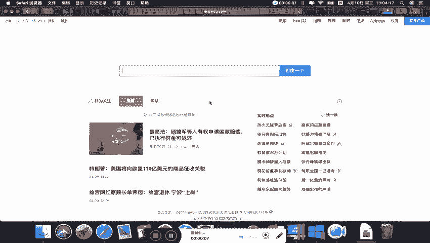
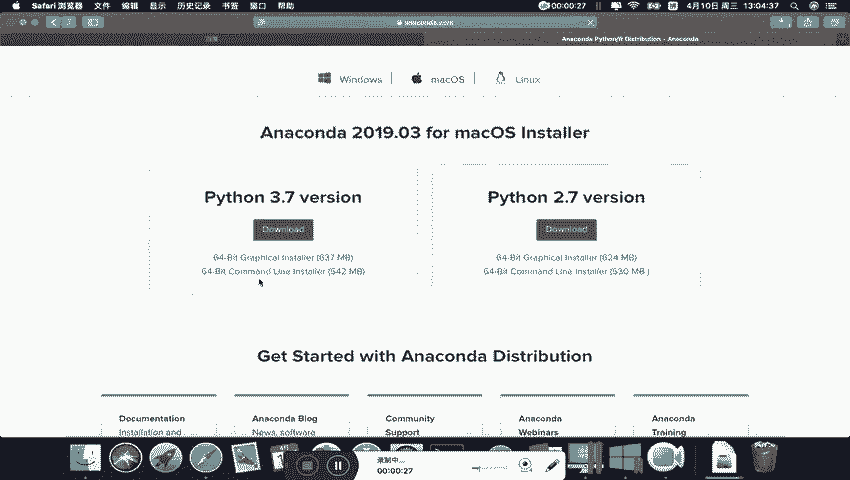
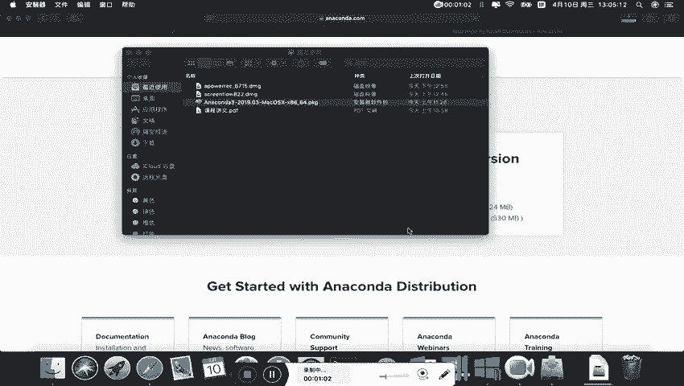
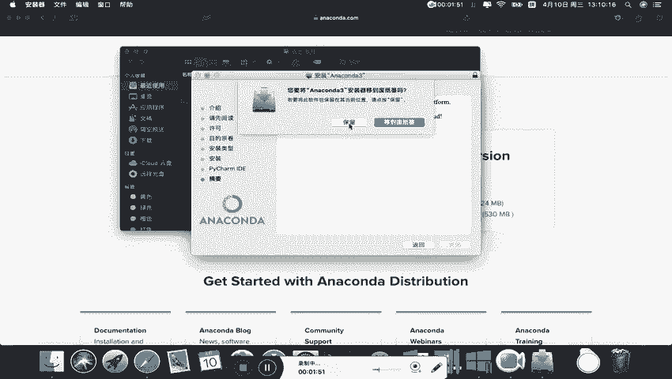
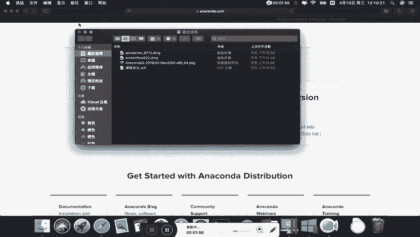
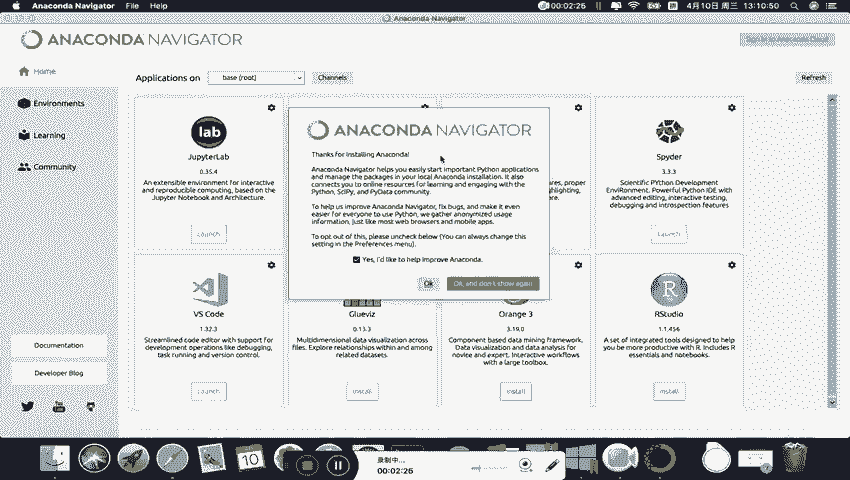
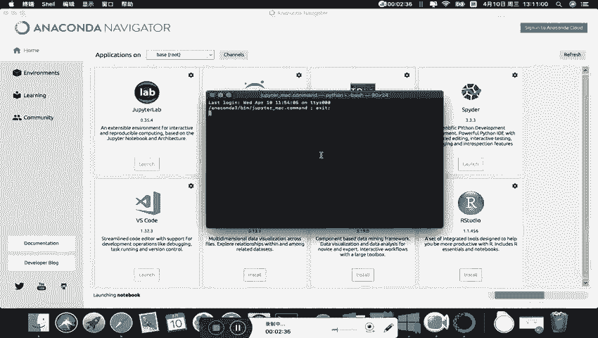
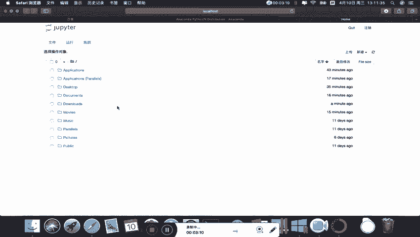
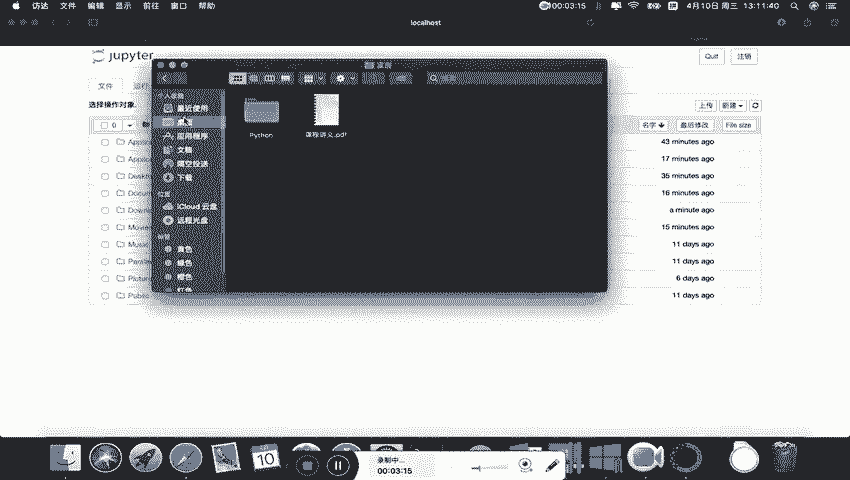
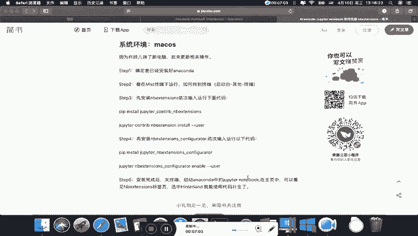

# 14天拿下Python金融量化，股票分析、数据清洗，可视化 - P2：02 补充-Mac系统下安装anaconda步骤 - 川哥puls - BV1zkSgYZE54

我们来讲一下在Mac系统下如何安装anaconda，首先呢我们打开浏览器和windows的操作是一样的。

我们在百度里面，或者说在google里面搜索anaconda，然后呢我们打开这个官方网站，按照康DA官方网站呢，这有个download。

我们点击download，然后呢一下来这边呢有一个Mac os版本，我们直接点download就可以下载了，那么在这里呢，刘老师就不花时间下载这个anaconda Mac版本了。

因为我已经提前在这边下载好了，在这里大家下载下来跟我这个安装包是一样的，只要点击这个download下载就好了，那么我们打开安装包呃，刘老师建议呢大家在安装过程中呢。

尽量不要去调整它的一些默认的一些安装设置，这个安装包打开需要一点时间，我们耐心等待，在安装的过程中呢，整一个完整的安装过程呢，应该要花费大概十十到20分钟，根据电脑的这个Mac的电脑的配置的不同。

而有所差异，在安装过程中呢。

大家也尽量不要打断它，也不要重启等等，各种操作可能会导致呃，如果说打断也中断以后呢，可能会导致后续的一些操作的这个增加，一些不必要的麻烦，我们看一下这边的话呢呃继续安装，当然要点同意啊。

那么这个地方呢不建议大家改这个安装位置，我们直接安装这边的，输入你电脑的一个密码，然后开始进入一个漫长的一个等待期，大概要等五到10分钟，那么我们现在这个anaconda呢。

它就这样子一个过程完整的就安装完了，我们点击继续，那么这样就安装成功了，所以呢我们这个anaconda的一个安装过程呢，相对来说还是比较方便的，我们点击关闭这个安装包呢，可以保留，也可以移到废纸篓。

好，这个时候呢我们就把这个阿诺康达给安装完了。

那么接下来呢给大家简单的介绍一下，我们在Mac系统下呢怎么使用，我们之后用来编程的一个jupiter notebook，大家打开这个呃，我们这个launchpad的话呢。

就会发现我们这个anaconda已经安装好了，这个navigator，我们打开这个anaconda的一个导航，那么带大家一起看一下它这里面的一些相关的，一些，这个窗口里面的一些内容。

那么呢康达这个navigator里面的话呢。

就是有非常多的一些工具，那么这些工具的话呢，我们直接点击launch，就可以取启动这个JUPITER了。

那么这是在anaconda这个窗口下的一个自带的，这个启动方式，那么这个时候呢我们启动JUPITER呢，就到了我们这样一个页面，那么在这里呢就给大家介绍一下，就是如果说在Mac的一个情况下。

我们启用这个JUPITER，那么我们的这个默认的工作路径，其实就是我们系统盘，那么这里的话，我们发现系统盘下面的这些文件呢，就是我们的常用的一些文件夹，比如说desktop桌面。

比如说documents文档，比如说downloads下载，那么这些呢只不过是把我们这些中文的文，文件夹的名字呢换成了英文而已啊，其实也就是和我们这个访达里面的这个文档。

还有应用程序，还有桌面，还有最近使用等等。

这些是对应的对应的，那么我们现在的话呢，呃我们现在的话呢就讲一下，其实有另外一个方法，我们也可以打开这个jupiter notebook，就是不在这个阿诺康达这个里面。

打开这个jupiter notebook，而是采用另外一种方式，这种方式也很方便，因为我们装anaconda的时候，自带的就帮我们装了这jupiter notebook，所以我们打开这个终端。

然后在终端里面呢，我们直接输入jpeter notebook就好了，但在这里呢我刘老师教大家修改工作路径，首先呢我们用ls s查看一下，当前这个路径下面的一些文件啊，ls s查看一下当前路径下的文档。

我们发现有个documents，那么这个document呢，我们之后呢就可以把这个我们的这个JUPITER，Working pass，我们在这里新建一个文件夹。

叫jupiter working pass，就是空文件夹，那么我们在这个把这个先把这个目录啊，我们现在呢是在系统盘底下，是在系统盘底下，那么我们现在呢要移到这个documents。

我们就用CD移动到这个documents里面，把我们的目录，那么这个时候我们再看一下，document里面呢有这么几个文件夹，我们发现这个文档里面的有这么三个文件夹啊，也是一样的。

那么我们现在呢想移动到这个JUPITER里面去，Jupiter working pass，移到我们这个新建的jupworking pass文件夹里，那么这个时候呢，我们再看一下文件夹下的内容呢是空的啊。

这个是空文件夹，那么后面呢，我们现在呢转移到了这个位置以后呢，我们直接在这里启动jupiter notebook的话呢，输入jupiter notebook。

启动的这个jupiter notebook的话，那么我们这个默认的这个jubeat notebook，它现在的一个工作路径呢，就是我们这个JUB的working pass，也就是前面的这一段路径。

那么大家在之后呢在这里面新建一个文件夹，或者说把我们那个给大家提供的data那个文件夹，直接给复制粘贴到这个位置好，那么这个地方呢，假设啊，我假设大家之后把我们这个data这个文件夹，复制粘贴过来。

那么这里就有我们的数据文件夹，大家在引用的时候呢，就可以直接用我们的相对路径，关于相对路径和绝对路径呢，我们在上课的时候呢，引用文件的时候呢会给大家详细介绍，那么windows和Mac系统是一样的。

所以大家这个在后续的学习过程中呢，也要知道这个怎么调整我们的工作路径，然后并启动我们的JPNOTEBOOK，我们输入，然后就可以启动了，这样的话呢就打开了我们这个jupiter notebook。

大家看这就是我刚刚那个文件夹data，如果说大家是把我们数据的文件夹data，复制进来的话，那么这个data点进去的，就是我们上课要用到的数据，那么这个呢，就是我们一个anaconda的一个安装过程。

那么关于在Mac的一个系统的环境下呢，安装anaconda的这个啊，Sorry，安装这个jupiter notebook，它的这个扩展插件的过程呢，和我们windows系统下的呢是一样的。

这个基本一样的步骤，大家可以看一下这些代码，其实跟我们windows下给大家展示的操作是一致的，所以呢大家在这个安装nb extension的时候呢，只需要按照这个代码呢一步一步的进行操作，即可。

把这个nb extension呢给它安装完成，只不过呢这个Mac里面的这个终端的，是怎么弄出来呢，我们看一下是在这个地方打开啊，在这个先打开这个launchpad，然后有个其他其他里面的有个终端。

点击这个终端就可以打开我们要用的这个终端，然后我们这个关掉note jupiter那个notebook，我们关掉这个jupter notebook啊，已经关掉了，那么我们把这个终端呢。

按这个control加C可以退出啊，我们关闭这个JP的notebook这个服务，那么关闭以后呢，我们可以在这个相关的地方呢，我们把这些代码呢运行下来，然后呢。

就可以安装这个jupiter notebook的这个插件了，装完以后呢，它其他的选项跟windows里是一样的。

