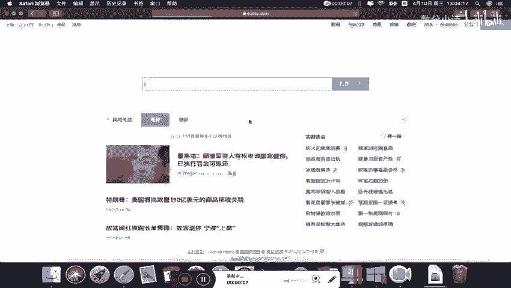
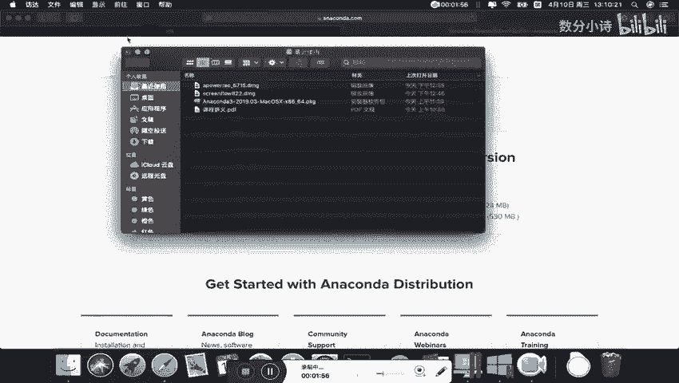
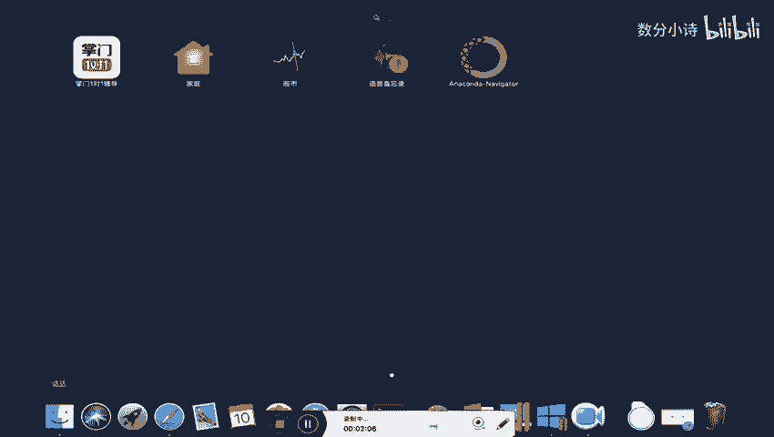
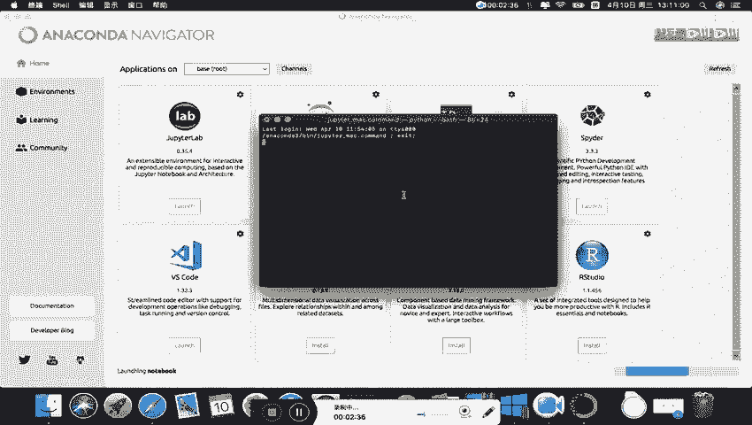
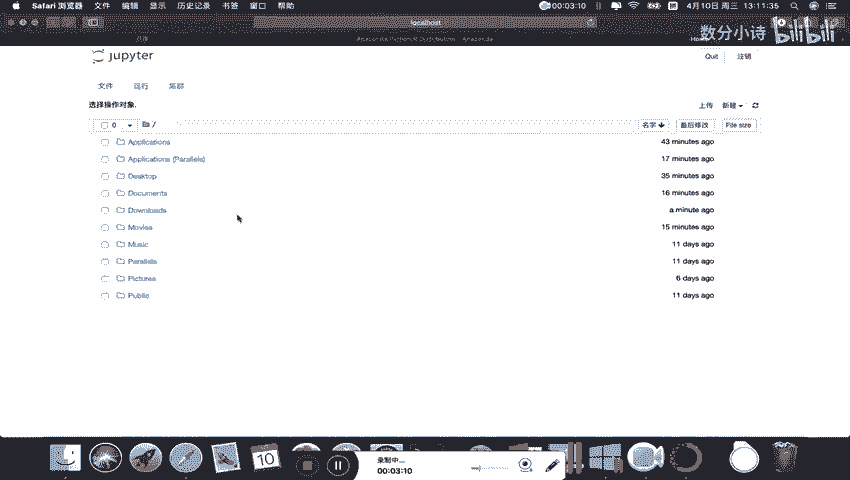
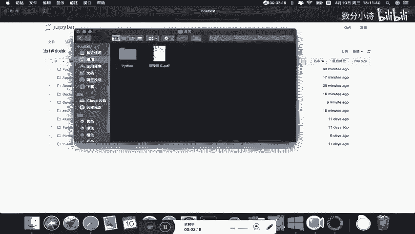
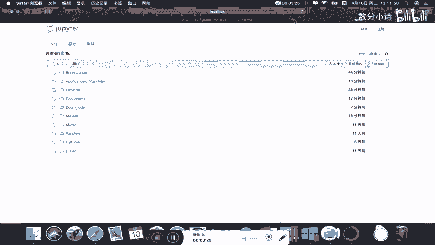
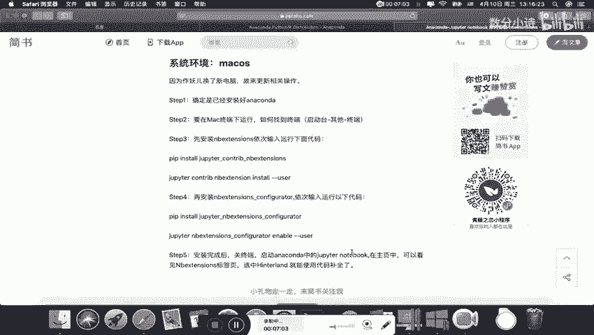

# 14天拿下Python金融量化，股票分析、数据清洗，可视化 - P2：02 补充-Mac系统下安装anaconda步骤 - 数分小诗 - BV1bFDSY9Ep5

。

我们来讲一下在mac系统下如何安装anal conduct。首先呢我们打开浏览器。和windows的操作是一样的。我们在百度里面，或者说在google里面。

搜索L康的。然后呢，我们打开这个官方网站。按照康大官方网站呢，这有个download，我们点击download，然后呢一下来这边呢有一个macOS版本，我们直接点download就可以下载了。

那么在这里呢，刘老师就不花时间下载这个按照康大m版本了。因为我已经提前在这边下载好了，在这里大家下载下来跟我这个安装包是一样的，只要点击这个download下载就好了。

那么我们打开安装包。呃，刘老师建议呢大家在安装过程中呢，尽量不要去调整它的一些默认的一些安装设置啊。这个安装包打开需要一点时间，我们耐心等待。在安装的过程中呢。

整一个完整的安装过程呢应该要花费大概10到20分钟。根据电脑的这个mac的电脑的配置的不同呢有所差异。在安装过程中呢，大家也尽量不要打断它，也不要重启等等各种操作，可能会导致啊如果说打断以中断以后呢。

可能会导致后续的一些操作的。这个增加一些不必要的麻烦。我们看一下这边的话呢呃继续安装，当然要点同意啊。那么这个地方呢，不建议大家改这个安装位置，我们直接安装。这边呢输入你电脑的一个密码。

然后开始进入一个漫长的一个等待期，大概要等5到10分钟。那么我们现在这个按装康da呢，它就这样子一个过程完整的就安装完了，我们点击继续。那么这样就安装成功了。

所以呢我们这个undercon的一个安装过程呢，相对来说还是比较方便的。我们点击关闭。这个安装包呢可以保留，也可以移到废纸篓。

好，这个时候呢我们就把这个undercon给安装完了。那么接下来呢给大家简单的介绍一下，我们在mac系统下呢，怎么使用我们之后用来编程的一个jubitter notebookbook。

大家打开这个。呃，我们这个rununch pad的话呢，就会发现我们这个undercon已经安装好了。这个navigator。我们打开这个undercon的一个导航。

那么。带大家一起看一下它这里面的一些相关的一些。这个窗口里面的一些内容。那么那conda这个navigator里面的话呢，就是有非常多的一些工具。那么这些工具的话呢。

我们直接点击launch就可以启启动这个jupiter了。

那么这是在onconda这个窗口下的一个自带的这个启动方式。那么这个时候呢，我们启动jupiter呢就到了我们这样一个页面。那么在这里呢就给大家介绍一下，就是如果说在mac的一个情况下。

我们启用这个jupiter。那么我们的这个默认的工作路径，其实就是我们系统盘。那么这里的话，我们发现系统盘下面的这些文件呢，就是我们的常用的一些文件夹。比如说dessktop桌面。

比如说documents文档，比如说downloads下载。那么这些呢只不过是把我们这些中文的文文件夹的名字呢换成了英文而已啊。其实也就是和我们这个访答里面的这个文档，还有应用程序，还有桌面。

还有最近使用等等，这些是对应的对应的。那么我们现在的话呢呃。

我们现在的话呢就。讲一下，其实有另外一个方法，我们也可以打开这个jupyternotebook，就是不在这个under conduct这个里面打开这个jupyter notebookbook。

而是采用另外一种方式。

这种方式也很方便。因为我们装con的时候自带的就把我们装了这jupyter notebook。所以我们打开这个终端。然后在终端里面呢，我们直接输入jupyter notebookotebook就好了。

但在这里呢我刘老师教大家修改工作路径。首先呢我们用LS查看一下当前这个路径下面的一些文件啊S查看一下当前路径下的文档。我们发现有个 documents。那么这个 documentsments呢。

我们之后呢就可以把这个我们的这个jupiter working pass，我们在这新建一个文件夹叫jupiter working pass就是空文件夹。那么我们在这个把这个先把这个目录啊。

我们现在呢是在系统盘底下，是在系统盘底下。那么我们现在呢要移到这个 documentsments，我们就用CD移动到这个 documentsments里面把我们的目录。

那么这个时候我们再看一下documents里面呢，有这么几个文件夹。我们发现这个文档里面呢有这么三个文件夹啊，也是一样的。

那么我们现在呢想移动到这个jupiter里面去jupiter working pass移到我们这个新建的jupiter working pass文件夹里。那么这个时候呢。

我们再看一下文件夹下的内容呢是空的啊，这个是空文件夹。那么后面呢我们现在呢转移到了这个位置以后呢，我们直接在这里启动jupiternotebook的话呢。

输入jupiter notebookbook启动的这个jupiter notebook的话呢，那么我们这个默认的这个jupiter notebookote。它现在的一个工作路径呢。

就是我们这个jupiter working pass也是前面的这一段路径。那么大家在之后呢，在这里面新建一个文件夹，或者说把我们那个。给大家提供的data那个文件夹，直接给复制粘贴到这个位置。啊。

那么这个地方呢假设啊我假设大家之后把我们这个data这个文件夹复制粘贴过来。那么。这里就有我们的数据文件夹，大家在引用的时候呢，就可以直接用我们的相对路径。关于相对路径和绝对路径呢，我们在上课的时候呢。

引用文件的时候呢会给大家详细介绍。那么windows和mac系统是一样的。所以大家这个在后续的学习过程中呢，也要知道这个怎么调整我们的工作路径，然后并启动我们的jun book嗯输入，然后就可以启动了。

这样的话呢就打开了我们这个jupiternotebook。大家看这就是我刚刚那个文件夹data。如果说大家是把我们数据的文件夹data复制进来的话，那么这个data点进去的就是我们上课要用到的数据。

那么这个呢就是我们一个按照conda的一个安装过程。那么关于在mac的一个系统的环境下呢，安装ote conduct的这个啊sorry安装这个jupiter notebookbook它的这个扩展插件的过程呢。

和我们windows系统下的呢是一样的，这个基本一样的步骤。大家可以看一下这些代码，其实跟我们windows下给大家展示的操作是一致的。所以呢大家在这个安装NB extension的时候呢。

只需要按照这个代码呢，一步一步的进行操作，即可把这个NB extension呢给它安装完成。只不过呢这个mac里面呢，这个终端呢是怎么弄出来呢？我们看一下是在这个地方打开啊。

在这个先打开这个launch pad，然后有个其他其他里面呢有个终端点击这个终端就可以打开我们要用的这个终端。然后我们这个关掉 Jupiter那个notebook。

我们关掉这个久pi的note book啊，已经关掉了。那么我们把这个终端的摁这个control加C可以退出啊，我们关闭这个久pi的notebook这个服务。那么关闭以后呢，我们可以在这个相关的地方呢。

我们把这些。代码呢运行下来，然后呢就可以安装这个jupiter notebook book的这个插件了。装完以后呢，它其他的选项跟windows里是一样的。那么在此呢就不过多赘述。

