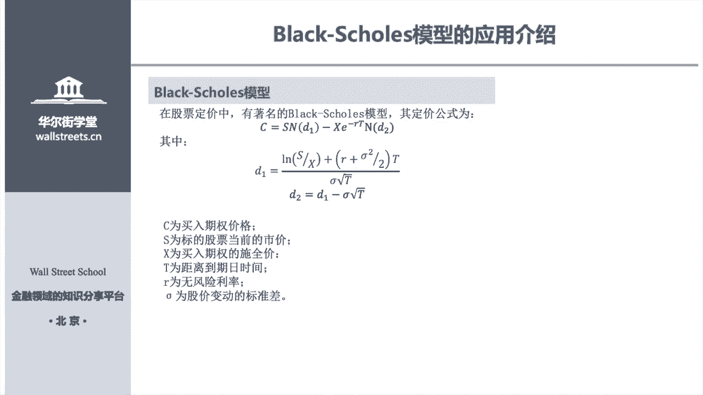
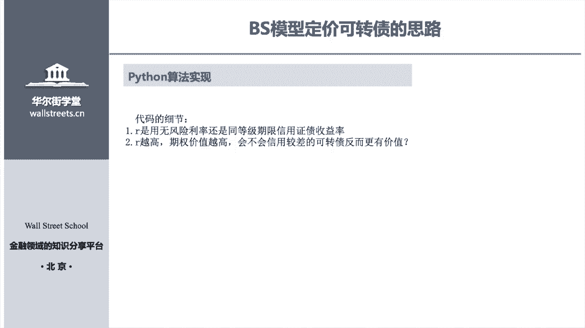
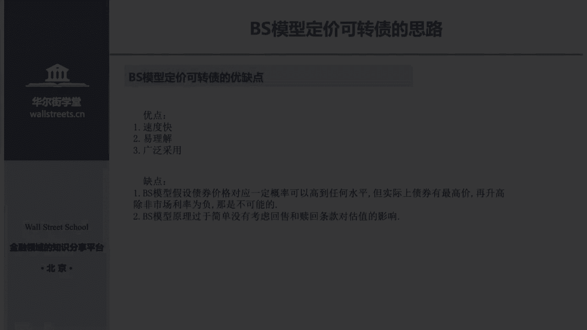
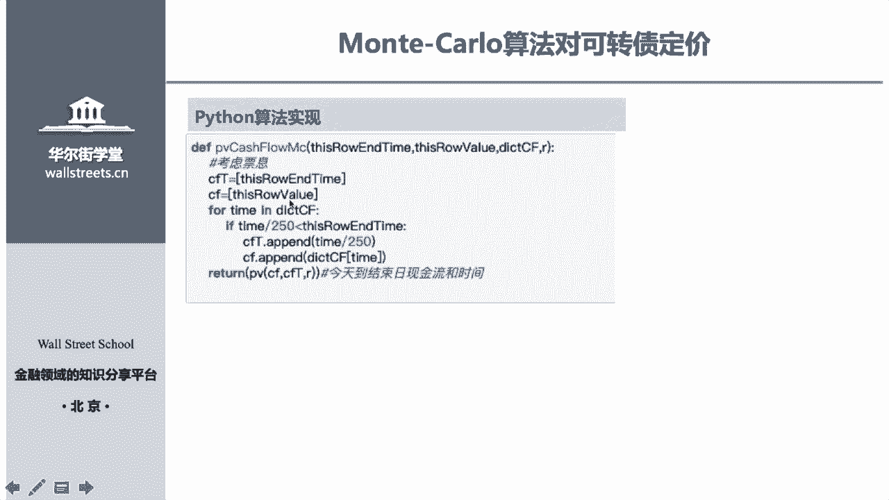
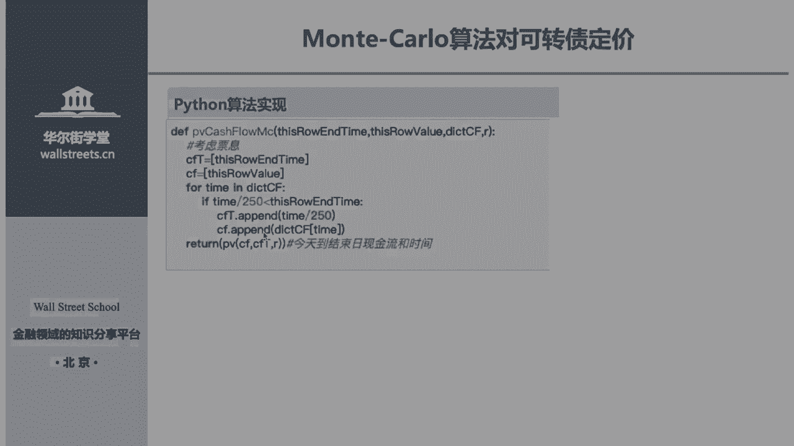
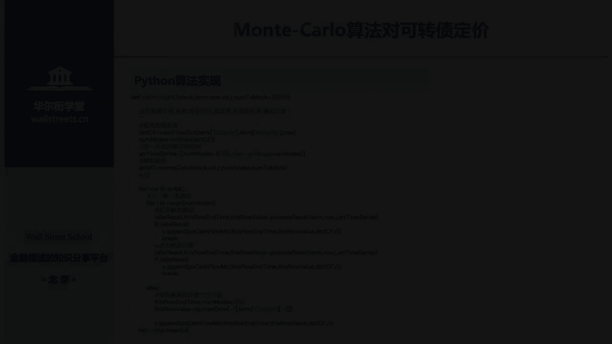
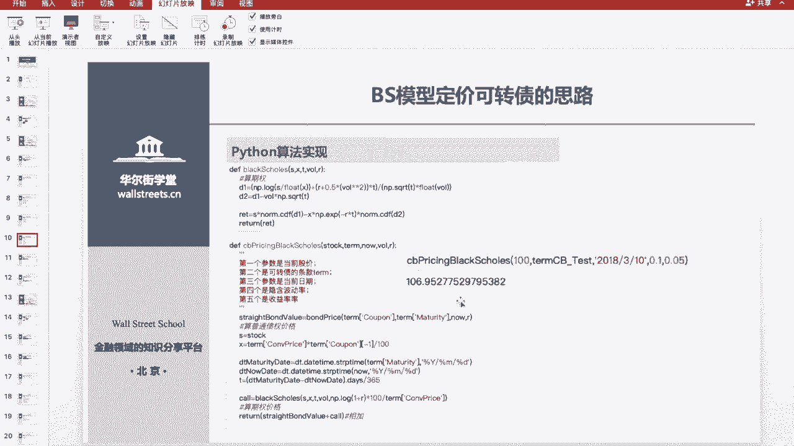
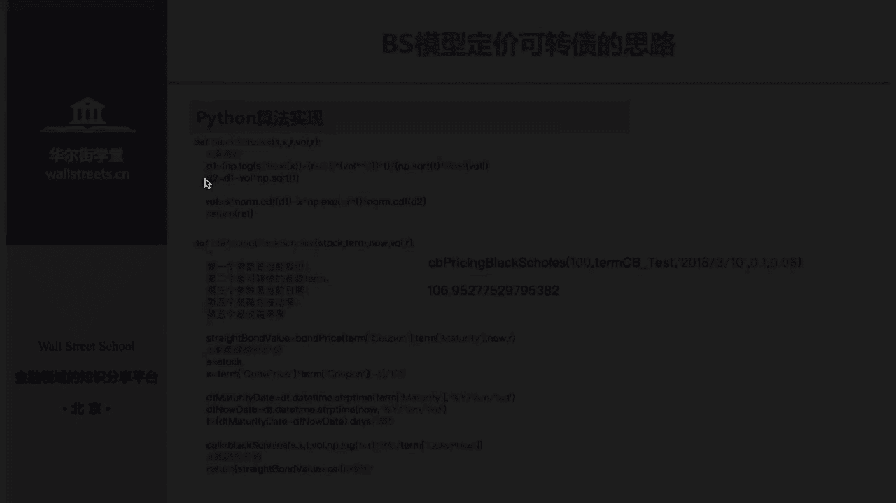
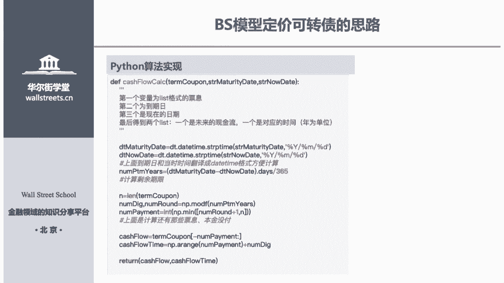

# 14天拿下Python金融量化，股票分析、数据清洗，可视化 - P20：03 可转债定价 - 川哥puls - BV1zkSgYZE54

华学堂学员们大家好，接下来我们来讲就是可转债定价的模型，然后可转债定价模型呢，主要是今天主要是讲两个模型，第一个就是大家就是名气比较大的一个，BSSS模型，第二个就是我们的蒙特卡洛模拟的一个模型。

好我们先来讲BS模型它是怎么样的一个情况，首先如果你是读商科的同学，你肯定学过金融工程或者是投资学，那你可能对期权定价模型里面比较熟悉，就是我们BS模型吧，然后如果你没有学过商科的话，那也没有关系。

因为我们因为这个模型，它这个模型它很简单，我们给你讲一下就行，这个主要是对期权进行一个定价的模型，然后如果你要问的话，我可转债定价有关期权是什么事情啊，其实是这样子的，就说我的可转债他是一个枪。

它是有一个枪募期权，因为我的债券持有人他是可以把我的呃，他是可以把我的债券转转化为股票的，有这样的一个期权，所以说我们可以把可转债看成一个什么样呢，就是一个普通的股票，再加，就不是可以把我们可转债。

看成一个怎么样的构成呢，就是我们一个普通的债券，加上我们一个期权，不就是我们的可转债吗，而根据这样一个思路，所以说我们可转债的定价，就是说我们先把可转债和八科呢，拆成我们的期权和我们的普通的债券。

然后我们再把期权进行定价，再把我们的可转债定定价，然后两个加起来就是我们的课程再定价，它就这么简单的一个逻辑，好我们现在看就是客户端定价，我们期权定价部分，首先我们期权怎么定价。

我们期权就等于我们的S乘以，我们期权C就等于我们的S，S就是我们标的物的，就是我们期权标的物的一个价格，然后乘以一个正态分布密度函数，然后再减去一个xx，就是我们买入期权的一个实权加实权价。

然后进行折现，再乘以我们一个正态分布，而这两个正态分布它们有两个参数，分别是D1和D2，这个第一第二是怎么算的呢，就是用他们的呃，就就他们的那个股票的一些当前的市价呀，然后买入期权的私权价呀。

然后再加上我们的无风险利率啊和波动率啊，还有到期日啊，截止到期日时间这样子来计算的，我们这个第一和第二的一个参数，所以说这个怎么计算，我们期权怎么用BS模型计算我们期权价格，首先我们得把第一第二算出来。

然后再带入我们的正态分布，一个正态分布的一个密度函数里面去，然后再进行一个相乘，就得到我们区间价格，它就这么简单，个模就简单一个这么简单的一个模，这么简单一个模式，当然BS模型它的内涵不仅仅这么简单。

它的内涵是很深刻，不是我讲的这么简单，这我们只是把我们的公式表达一遍，如果说有非上课的同学，你对这个模型感兴趣的话，你可以去看一下金融工程的教材，或者是投资学的教材呃，这个这个发明这个模型的三个人。

或是发明这个模型的三个人，他们都是获得了诺贝尔经济学奖的，也是我们金融金融变更新的，也就是金融就是划划新金融。

就是金融更新技术更新的一个一个代表模型啊，这是一个很重要的模型，好我们接下来讲清楚了，就是我们BS模型是对我们期权定价嘛，而我们可转债可以看成期权，加上我们的普通债券嘛，我们把期权定价定下来之后再定。

再对可再再进行定价，然后两个相加是我们可转债的价格，就这么简单，一个算法我们看我们算法怎么去实现。

第一个核心思路，在线价格加上我期权的价格，OK搞定，第一步怎么算，首先要把第一和第二，这个正态分布函数的参变量给算出来，正态分布含量参变量怎么算，前面式子已经给出来了，把它带进去就OK，第二个。

根据我们第一，第二来算出我们正在分布的密度函数，算是我们这段分钟密度函数了，就把它直接带入我们的可能定价，期权定价这个式子里面去，就可以得出我们的期权价格，然后再把我们的债券的价格进行折现的话。

就是我们债券的价格，而我们债券的价格加上我们信源价格，就是我们可能的定价，所以说so easy好，我们看我们的算法怎么来实现，第一个我们要用这三个包，这这四个包就不用阐述了，第二个。

我们来输入我们的一个可转债的一些条件，首先因为这个很简单嘛，所以说我们用这些条件就够了，然后我们有哪些条件，首先我们的转股价就是100嘛，我们到期额就是我们的2020年3月4号。

而我们的转股期就是到期前的五点5年嘛，接下来就是我们的现金流，就是我们的客观定价的现金流，就是coo码这样的一个情况，达到这个条件呢，我们就进行算法进行实现，首先第一步我就第一步。

我们要对债券进行定价吗，对于债券进行定价，核心思路是什么，就是折现，我们要把我们未来的现金流折现到今天这个点，就对债券进行定价，好我们怎么来实现这个这个算法好，讲到这里，我要给大家说。

就是这里大家请一定要注意我的，我讲的是偏重于我们算法的一些思路，因为这个可转定价BS模型加上蒙特卡洛模拟，它一共有500多条代码，我不可能每一条每一条去讲，如果500多条代码，我一条一条讲的话。

那肯定要50分钟，要50分钟，那那就完蛋了，所以说这个东西我给大家先讲思路，而且我们对这条代码的备注也非常的详细，然后给大家讲解之后，大家下去要多练一下，然后这个代码其实是比较复杂，比较绕的。

现在我主要给大家去阐述我的思路，好我们来讲第一个函数就是我们的一个现金流，这个函数，我通过这个函数我想达到什么样的目的呢，首先我想把我的首先我想对债券进行进行，首先我还要把我要对。

可能定价分为债券和期权嘛，对不对，如果我要对债券进行定价，那我首先要拿到我的现金流，对不对，首先我想得到就是我未来没我未来的现金流好，我们现在手上的条件是什么，只有我那个合同。

就是刚刚在定价的合同上面的现金流，对不对，好，我把我合同上面的现金流，那个已经支配的现金流给减给给剔除了之后，是不是就是我现在剩下来的，是不是就是我现在未来的现金流啊，我对它进行未来性的竞折。

现就不做债权进行定价，所以说我需要三个变量，第一个就是我合同上的现金流，我需要得到它，第二个就是我的到期日的时间，第三个就是我现在的时间，因为我到期的时间和这段时间，来确定我哪些现金流。

就是我未来现金流哪些好，第一步我要设定，我要知道我未来现有哪些，首先我要计算我的剩余的期限，对不对，我要通，我要通过data time这个函数，对我的呃日期进行一个转换，因为我们日期直接相减是不能减的。

我们对日期进行转化之后，我们就可以把我们到期日和我们的呃，现在的时间直接进行一个相减，就得到天数，然后除以365天，就是我剩余的期限，单位是年好，通过什么样进行转化，就是data time。

然后STRPTM这个这个代码进行转换嘛，就转换成格式，然后接下来呢我怎么做，接下来我是要剔除就是已经派发的现金，对不对，然后我就通过下面的代码，来把我已经派发的现金，首先第一个。

我要知道我现金流大概要开发多少期，然后我要看我已经就是我要看我我的到期日，已经我到期日还剩多少，把到期日拆成，因为我稻妻的它是一个小数嘛，对不对，它是一个小数，我所以我要把稻妻的拆成拆成。

就是用MODF，把它拆成一个小数和一个整数部分，然后整数就是我的到期日，对不对，各位能明白吗，比如说我4。26260是不是我的到期日，就是我的现金流多少钱，是不是我四期现金流啊，对不对。

好说我把它给拆成小数，这个是用来拆成小数的一个函数，拆成小数之后，我要把它拿去和我的一个，我要把我的就是剩余的期限的，剩余的期限的数和我的呃，co朋的派发的期数进行一个比较，我要选取最小值。

那最小值就是我未来还有多少期现金没有派发，然后下面我就把那个已经派发，通过下面一个方式，我把已经派发的现金，从我那个从我那个合同里面踢掉，那就是留下来的现金流，就是我未来要派发现金流。

再加上在我们再把我们的未来派发的现金流的，其实再加上我们不是把成把才刚把小，刚才把小数整数拆开了吗，我们再把小数给加回来，那就是我的一个现金流，派发了一个日期，所以说通过这样一个函数。

我输入我们的合同的现金流，加上我们到期又加上我们现在时间，我们就得到现金流和我们现金流派发的日期，通过这样的函数来，为我以后对债券进行定价来打下一个基础，好接下来我们就是求限制了，非常简单。

通过这样的一个迭代的形式，就你们就是呃ena enumerate，这么读吧，应该是这么读，就通过这样的一个迭代形式就可以得到我们的，它是它是这个这个函数会产生两列列，两列列表。

第一个列表就是我现金流的列表，比如说第一现金流，第二现金流，第三期流，然后第二个列表就是我们的01234，就这样的就会产生一个列表，就产生这样一个期限，这这个用这样的进行一个循环迭代，会非常的方便。

然后我通过这个方法，我可以把我我我可以把我的现金，我可以把我的折现，就是把我的每次现流折现到今天，这个点加减，就是我算出每一期的现金流，然后进行加，然后一再等于的话，就是我每期现金流算完之后再进行累加。

累加累加，通过这样的方式，我可以把我们每一期现金流，折向各个点进行加准，进行总和，就得到我现在现金流折现的一个函数啊，就得到这样一个函数，而接下来我们就是就就来写一个，我们债券定价的函数。

首先我们就把我们就把我们上面两个函数组合，第一个是我们现金流的函数给组合，第二个就是我们折线函数进行组合，我们拿我们把现金流的函数拿到之后，再把它带到我们折现的这个函数里面去。

就可以得到我们的债券的价格，就这么简单，我们的债券的定价就出来了，就现金流折现到这个点进行累加降价就算了，然后定完债券价格了，接下来我们就要对就算期权的价格，期权的价格so easy，我们刚才说了。

首先我们要算我们正态分布的一个两个参数，D1和D2，对不对，我们D1和D2直接写上我们的式子，就第一和第二就直接把我们这个，把我们这个式子给写进去，然后就得到我们的第一和第二。

照着那个数学式子写进我们的这个函数里面去，然后写进函数里面去，我们再进行一个一个相减，就是我们算出来D1D2再乘，再乘上我们的期权，就是标的物的价格，乘上我们的正态分布密度函数的第一参数。

第一参数正态分辨率函数，再乘上我们的期权价格，然后我们的一个折现之后，再减去我们的D2的一个，正态分布密度参数函数，这样就得到我们期权的价格，所以说是不是so easy，好我们期权价格也得到了。

我们的债券价格也得到了，现在怎么办，是不是把我的两个价格加起来呀，就是我课堂的价格，对不对，好我们在第最后一步就把这两个加起来，首先第一个算，通过这个我们刚才定义的一个价格函数算出。

我们第一个就算是我们的限流，第二个就是通过我们的这个我们的一个条件，算出我们的行权价格，还有一些股票的价格等等，带进去之后，然后进行相加就得到我们可转债的一个价格，好得出来是106这样的BS好。

我们来讲一下我们的算法的一个，实现的一个细节，第一个我们RNF分离率还是用我们的啊，同等级的一个额债券的一个收益率啊，这里我们要用无风险利率，虽然说我们书上用的是无风险利率，但是我们可算在定价。

我们A股市场可转债它是可能会违约的，第二个就是我们将用同等期限的那个额，收益率的话，那是不是我们的像那种信用很差的那个可转债，他的利率就会很高，那他们的期权价格是不是就越会高啊。

所以说我们可转债是不是就越有价值啊，呃那个未必，因为我们的利率，我们的利率而影响最大的还是我们的一个在底，而就是我们对债券进行定价哦，对我们的那个相比较，对期权定价来说的话，我们对债权地价影响会很大。

会更大一些，所以说不会出现这样的情况，没事代码的细节，最后我们来评价一下可转债的一些优缺点，第一个它速度特别快，第二个他非常容易理解，因为就是很简单一个拆分嘛。

第三个就是科学家定价，它是广泛应用的，他的名气特别高，比如说一些投行啊。

券商他们都在用这个BS模型进行一个定价，它的缺点是什么，第一个就是他的缺点是就利率就是有一定概率，就是我们的债券价格可以到达任何一个水平的，就是可能会出现利率为负，但是那是不可能的，就是我们占价格。

它它可有就是通过这个模型，它可能会出现这样价格非常非常高，然后他利率为负，但他不可能的，第二个就是说我们可转债定价，它是有回售和赎回条款的，这个是对我们客串定价有影响的，但是我们前面没有用核酸的。

没有用这两个条款就对客户端进行了定价，所以说这个是没有考虑到赎回和回收的条款的，影响好，接下来我们就要考虑，我们的赎回和回收的一个条款，就是我们蒙特卡罗模拟定价可转债，上面我们说我们BS模型没有考虑。

我们的一个所谓条款和回收条款，但是我们可转债定价里面是不仅有我们一个额，不仅有我们一个可以自由，可以把我们的债券转为股票，我们还有赎回条款和回收条款，这样的一个情况，它也会影响我们的一个定价的好。

我们现在来看我们蒙特卡罗模拟，它的定价的核心思路是什么，蒙特卡洛模拟它是会模拟每一条，就是从今天开始起，它会有一个随机游走嘛，就每个股票它会在一个合理的波动，进行一个随机游走。

而每一个随机游走它都是一个路径，然后我们就会模拟1万条路径，然后看我们每一条路径是否会触发回收条件，或者赎回条件出发，然后我们把每条路径进行一个定价，把每条路径进进行都对它进行一个定价，而求它的平均值。

就是我们对这个对这个个人在进行了一个定价，好我们来看模特卡罗模拟，他是怎么样的一个情况，如果说你以前，如果说你以前没有学过蒙特卡罗模，那不用着急，因为蒙特卡尔它特别简单，蒙特卡罗模拟他的是他的公。

他的公式是怎么样的一个组成的，就是我今天的价格就是我明我明天我的，我明我预，我明天股票的价格，是等于我今天股票的价格乘以这样的一个数，就是我的1R减去R的波动率的平方，然后德尔塔T就是我的是我的名。

就是时间日常吗，如果算明天我答题肯定就是一嘛，对不对，然后再乘以我的一个波动率，再乘一个随机数，然后再乘以一个疙瘩，根号德塔T这样的一个式子，就这样子是来算我们随机模拟的一个情况。

而我的ST是代表我T10个的股价好，那我明天的那我那我T4，那我T加德塔T就是我下，就是我明天的就德塔T等于一的话，那我T加德塔1T加德尔塔T，就是等于我明天的股价就是ST加德塔T嘛。

我们的R就是风险定律，希腊就是波罗蜜，而我的sim卡就是我的一个随机数码，就这样进行一个蒙特卡罗模拟，然后我们怎么用蒙特卡洛模拟，来进行客观评价呢，首先第一个，我们用蒙特卡罗模拟来模拟1万条路径。

因为每一条路径都是一个波动嘛，先模拟1万条路径，然后每一条路径我们都考虑他们是否会触发它，是否会触发我们的回购条款或者是赎回条款，如果触发回收条款和赎回条款，那我们就进行相应的一些处理，把它折现回。

把它折现，把它折现回去，第四个最后一步，我们就是说我们把每一条路径的值，然后进行一个加权，进行一个算出它的平均数，那这样就是我们客端定价的一个一个值，好，接下来我们来讲一下我们算法的实现。

嗯首先第一个我们要用这四个包，用这五个包，然后接下来我加了一个star等于time，因为我接下来我要说，因为蒙德考了没他用的计算资源特别大，我因为我接下来我要模拟1万条路径嘛。

所以说我想看一下这个代码运行有多长时间，然后各位来看我们课本的定价的一些条件，我加了两个，第一个就是所谓条件就lin call，然后还有回头条件就reset，然后你们看这个五一十五三十一百三十。

这是个什么东西啊，如果说你对可转债定价没有了解，你可能会一脸懵逼，但是没关系，你在上海证券交易所，你随便找一份科专家定价的说明书，都会知道这是什么，比如说我们的赎回条款，各位看这里。

这是我今天刚从上海交易所随便找了一份，可热来定价的一个赎回的一个说明书，比如说他说公，如果公如果公司股票连续30个交易日，至少有15个交易日的收盘价格，不低于当前可转股的价格100 130%。

就是十五三十一百三十，各位明白吗，就这个意思好，第二个回收条款，这个5。5就是我的一个就是我们的一个到期，就是我们的一个可转股的一个，实际是5。50啊，而下面一个就是我们的回收条款。

如果就是本本次发行公司可转，在最后在两个季度计息年度就是二嘛，对不对，然后连续30个收盘低于当前股价70%，就70嘛，对不对，然后进行一个回收嘛，然后130就是我们回收的一个价格，就这样的一个情况。

所以说你随便找一份嗯课程在定价说明书，你就知道我我们这个加了回收条款和赎回条款，是个什么样的情况，然后第一步我们跟和上面一样，因为我们还是要受到一个折线的问题，所以说我们第一步还是和我们上一步。

BS模型一样，定义一个现金流的一个一个函数，而第二步还是要定义一个折现的函数，这里我们加了一个叫做cash flow dict，是我们的现金流的一个质点，因为我们等会可要涉及到就是时间的转换。

比如说把年转化日日转化连这样的互相的转换，所以说我们用cash用这个函数来进行一个方便，我们进行一个转换，因为我模拟的步长是一天嘛，对不对，所以说我们一定要对它，就所以说我们可能要对一个时间进行转换好。

接下来我们就定义我们蒙特卡洛，模拟股价的一个方法，我们输入的参数就是我们股票股票的价格，然后波动率和利率，还有我们的跌点数，还有我们的一个模模拟的次数，我们模拟的是1万次，其实1万次是算少数的。

其实更现实中更多情况他模拟的次数会更多，然后接下来我们就要对它，我们现设置步长是1/250吗，为什么是255，因为我们股票的交易就是250天，而接下来我们就把我们蒙特卡洛，就上面我们写的蒙特卡洛的式子。

把它把它写到Python里面去，然后就得到了这样的，我们一个蒙特卡洛模拟的一个一个函数，而经济模特考了模拟之后呢，接下来我们要看我们要设置一个除非触发情况，因为我们是要模拟每一条路径，路就是我的路径。

我要模拟每一条路径的一个赎回情况吧，如果我每条路径赎回的情况嘛，如果我我如如果我的每条路径，我触发了赎回情况，那我们就按照收回的情况去做，把这条路径给按照所有期望给结算了，然后折现到今天。

这是我们这条路径的价格，对不对，然后我们刚才也说了，就是我们路径的路径的所有情况的一些，一些要求，我们也给大家展示了，然后就这样子就可以模拟一条，我们的一个数会情况，然后然后如果我们赎回的话，触发的话。

就表示是如果我们触发的话，就表示用一来表示没有触发，就表示零来表示，然后这个这个这个都是有标注的，所以我们得出来这个就是触发的时间，然后触发的现金流，这个代码都是有详细的标注好。

接下来我们就要模拟一个回收的情况，同样的就是按照前和前面的思路一样，我们会算每一条路径它是否会触发回售的情况，进行这样情况，同样的触发类就是零不触发，它就是触发，他就是一不触发。

就是你进这样的一个条件的一个触发一个函数，接下来我们就要进行路径，对路径进行一个切片，而切片我们要分析每一条路径的一个触发情况，就是这个函数，这个函数我们的前面这个都已经用到了。

比如说这个就是我们对路径进行一个切分，因为我们都要每条路径进行分析嘛，哦切片了之后，我们要一直recall嘛，就是来看我们是否会触发嘛，然后触发了一个情况，接下来这个逻辑和time是我们要看一下。

因为他是要15日标，要达到这个要求吗，我们要看通过这个函数我们来算，就是我们前面的15天，因为我现在这已经触发了，那我们要看我们前面15天是不是连续出发，连续出发，通过这样的方法，我们可以算出来。

就是上面哪些点就让我们回收期限内嘛，进行这样一个计算，而下面就是我们就logic price，就是我们来算我们哪些价格来得到，我们得到了我们的就达到我们的要求好，接下来我们就要看我们的这个术后的要求。

天数也就达到，就能能达到我们回收要求吗，就这样的话来进行我们的一个呃，触发的一个设定，这个主这两个函数主要是对回，赎回和回收进行触发，触发情况进行一个判断，触发就是零，不是八，就是一进行这样的一个判断。

然后接下来我们就要考虑票息，因为我们已经知道每一条，就是我们每条路径，就是今天到结束之间的现金流和现金时间嘛，对不对，然后我们叫对它进行一个折现，我们用PV进行一个折现。

然后把我们每一条路径的现金流的截止时间，和现金流进行代入，然后对它进行一个折线，就得到我们每条路径的一个折现的一个情况，接下来我们就要重点戏来了，就是我们对它进行一个汇总，对它进行一个汇总。

然后首先我们要设定我们每天的现金流，就是第一段放嘛。

然后设定每天的现金流，然后我们要看我们每天到期。

因为我们要是测定每一天，而我们将来就要测定我们每一天。

到期日的一个时间好，接下来我们就要用蒙特卡洛模拟，进行一个骨架的模拟，而接下来我们就用财商定义的函数，来分析我们每一条路径是否触发回收，是否触发赎回，触发的话我们就计算到期，如果触发的话。

我们就计算就开始计算它的，它的一个就计算它的价格，如果没有触发的话，我们就按普通债券进行一个计算，这里有个n p max，我要给大家讲一下，就是为什么这里还会有个n p max呢。

因为到因为到期日的股价和我的现金流，因为如果我的股价我不要，价格比现金流要多的话，那我还是可以进行转股的，所以说我到这里到这里我还有一个抉择，就是我看我的股票价格和我的现金流，价格谁多谁多。

我就选择谁进行这样的一个情况，然后我们把每一条路径进行汇总，然后求出它的均值，就得到我们蒙特卡洛模拟的一个情况，然后接下来我们来算蒙特卡罗模拟，把我们的一些情况都带进去之后，我们设定无风险利率为1%。

而波动率我们设定波动率为0。1%，不能无风险，利率为0。65%，而他默默认是模拟，默认是模拟100万次，然后我们得到的是106，和我们的BS定价期权定价模型，它的定价是一样的。

然后他的时间用了用了TM解释大码，他的时间就用了14秒，就就是他是比我们BS模型的时间要长很多，这样的话，我们就进行了蒙特卡的一个模拟，算法的一个实现好，今天我们讲了两个，第一个就是我们BS模型嘛。

BS模型的一个情况就是BS模型，它主要的核心算法就是把我们的期权和我们的，把我们的期权和我们的一个可能，再进行一个拆分嘛，然后再把它分开进行定价，然后再降价这种BSDR模型。

而蒙德卡洛模拟它是通过蒙德卡洛来模拟，我模拟1万条路径，而每条路径都会通过我们的触发函数来判断，我们是否会触发，而触发之后就结算，不触发，我们就继续往下走，然后最后到了到期日之后。

我们在每一条路径进行折现之后，我们再算它的平均值，就得到我们我们的一个定价，这两个定价各位看一下，就是其实他们的价格差别都不大，好同学们今天讲到讲到不知道你能理解多少，如果你对，因为讲课可能不能。

某一个每一个知识点都估计都都都能讲到，如果你对这个有疑问的话，你可以在我们屏幕下方就是在留言区留言，然后我会给大家进行一个回复。

然后这个算法比较复杂，要绕好几道弯，所以说重点都给大家给标出来。

所以说希望大家下去还是要多练，一定要下去，一定要多练好，祝大家每天都有新的进步。

