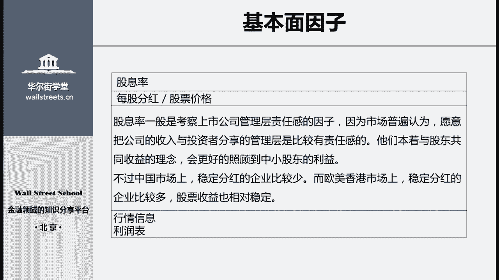

# 14天拿下Python金融量化，股票分析、数据清洗，可视化 - P21：04 股票量化基本面投资 - 川哥puls - BV1zkSgYZE54

那么这节课呢我们主要说三方面的东西，第一个是量化投资的整体分析框架，第二个呢是估值的分析模型，第三个是基本面因子好，那么开始第一部分股票的基本面分析框架，为什么要从这里开始呢，是因为我们要很清楚的明白。

量化投资只是投资的一种手段，那么投资的根本目的呢，还是在于分享公司股票长期上涨的这个收益，量化呢只是帮助你去更精确的，更方便地为股票进行定价，或者去判断股票的价值是否合理的，这么一个方法。

那么说到基本面投资，我们首先想到的呢肯定是价值投资方法，这也是最传统最经典的股票投资方法，尤其是现在的A股市场上呢，仍然存在大部分的股票类基金，他们的投资经理仍然是使用传统的投资方法。

进行基本面分析和投资的，那么我们来看一下一名传统的股票基金经理，他是如何选择股票的呢，首先第一步，它会对市场上所有的股票进行初步筛选，比如按照股票的市值分成大盘小盘股，按照交易的场所分成主板。

中小板和创业板股票，或者呢按照企业所属的行业分成银行证券，汽车等，为什么要进行这样的分类呢，首先是因为现在很多的股票产品本身呢，它就他的选择选股范围就是有所限制的，比如说有些股票基金产品。

它就是专门投资于互联网产业的，那么它就只能在互联网产业里面进行选择，另外一个原因呢是，大部分进行传统股票投资的基金经理，他都有自己擅长的板块和行业，可能这数10年来，他只在这样的一个板块当中进行选股啊。

第二步呢，就是对剩余的股票财务状况进行初步分析了，一般是通过一些估值指标进行筛选，例如有些投资经理会剔除市盈率过高的股票，而有些呢则很不喜欢净利润为负的股票，总之他们会通过一些初步的筛选指标来对呃。

这些股票呢进行一个筛选，以保证剩余的标的是相对优质的股票，那么到了第三步，可能还剩余几百只股票符合这些要求，然后呢，基金经理和他的分析师，才会对剩余的股票进行一个详细的分析研究，比如去阅读他的财务报表。

去详细了解这家公司的啊这个经营状况等等，刚才我们说的是一名传统的投资经理，他进行这个基本面选股时所要经历的步骤，那么一名量化的基金经理，他在进行基本面选股的时候是怎么样做的呢，首先它会构建基本面因子。

这些因子呢可以是用来反映企业的经营状况的，也可以是反映企业的财务状况，或者是呢反映企业的行业竞争地位等，总之这些因子是需要尽可能完整地，反映企业的某一方面真实状况，那么这些因子是怎么来的呢。

一般也是根据基金经理的个人经验，以及对市场的判断进行构建和选取的，但进行构建之后，会对因子进行一系列复杂的测试，以确保因子确实能够达到想要的效果，那么这具体的测试方法。

我们会在后面的课程中给大家详细介绍好，那这是第一步，第二步呢就是根据市值行业的特殊情况，对因子进行调整，并且呢构建量化分析模型，把各个因子容纳到模型当中，这一步之所以需要进行调整，是因为有很多的因子呢。

它依据行业的不同，所产生的效果会有极大的不一样，比如说像净利润率这个指标，那么它在制造业中所起到的作用和在新兴行业，比如互联网TMT行业中，起到的效果呢是完全不同的，所以一般是需要根据市值和行业。

对这些因子进行调整，最后一步呢，就是把企业的相关信息输入到，构建好的量化模型中，并且随着市场的进进展，不断的更新这些信息，然后就是等着模型给出你想要的交易信号，再进行交易就行了，好的。

那么我们知道了这个传统和量化基本面选股上，在步骤上以及这个选股的方法上，都有很大的不同，那么这个区别具体在哪里呢，我们就要说到量化基本面选股的特点，首先第一点，量化基本面分析和传统的基本面分析相比。

那么面对的信息输入呢基本是完全相同的，都是由市场上公开的信息，以及一些包括行业数据，包括这个啊财务数据，包括行情信息等，这些都是完全相同的，区别只在于呢对信息的分析方法是不一样的。

第一个传统基本面分析关注的标的是公司，而量化基本面呢关注的是选股的模型，包括如何选取有效的指标去构建阿尔法因子，以及这些因子如何组装起来，成为一个完整的选股模型，这些呢是量化关注的地方。

例如基本面的这个传统基本面的投资者呢，在研究一家公司的时候，会重点分析目标公司的预期收入增长，并且根据公司的这个未来经营状况，以及最近的大事件，管理层的这个能力等等，去分析和预期一些财务数据的预期状况。

但是量化的分析的时候呢，当然也会考虑这个收收入增长，但是考虑的方向往往是选取什么样的指标，来量化这个公司的成长能力，而并不是呢去预期这个公司，它具体的收入增长有多少，这个是他们在分析方法上的区别。

第二个区别呢，传统基本面的分析更加关注深度，而量化投资呢更关注广度，也就是说基本面投资者呢，传统的基本面投资者往往只关注，少数的几只或者十几只几十只股票，因为他们往往需要对每家公司单独进行。

尽可能深入的调研和预测，并且据此呢形成啊这个交易判断，因此传统的投资者最感兴趣和重点分析的股票，可能只有几只，但是量化呢并非如此，量化是建立起了一个统一的模型，尽可能的对市场上所有的股票进行统一的分析。

和定和这个判断，因此当量化的模型建立起来之后，量化投资者往往去关注整个市场上，某整个市场的变化，或者呢某个行业的变化，或者某个板块的变化，而很少去关注具体到某个公司，它的发展和经营状况。

所以我们说量化的投资模型呢更关注的是广度，第三个区别呢，传统的这个股票分析模型更加的关注是预期，而量化的投资模型呢更加关注的是规律，传统的投资者呢往往会使你更喜欢，这个公司未来的大图景。

就是公司未来的一个故事吧，比如说管理层会在年报中写到，我们公司今年呢收购了一家啊竞争企业，是为了以后在整个行业中形成一个垄断，优势等等，就是虽然近期可能收益率有所下滑，但是当这个垄断优势建立起来之后。

收益率会有一个大幅增长，那么像这种呢对于未来的判断，就是属于预期方面，包括呢传统的基本面分析者，一般会去参加公司的这个啊，比如说股东分享会，或者去公司实地调研和考察，这些呢都是为了去更加精准的预期。

公司未来的成长，而量化投资者很少做这样的事情，因为量化投资者更关注的是历史数据，以及其中隐含的规律，更加偏向的呢是从通过历史数据的挖掘去嗯，寻找一种这个比如说公司真成长的规律。

当然你如果这个规律只是对一家公司起效，那么可能呢是不太好的，最好这个规律呢是比较统一的，对于整个行业，或者是整个全市场都有效的这么一种规律，这个是量化投资中比较喜欢的东西好。

那么最后一个区别呢是传统的基本面投资者，持仓一般更为集中，会有少数的几个重仓股，而量化投资者的持仓呢更加的分散，很少会有重仓股，这个特点呢非常的明显，大家可以关注到市场上的这个呃，公募基金或者私募基金。

如果说他的投资经理是一个，传统的基本面分析者的话，那么他更偏向于呢，在行业当中只持有少数的一两家，他特别喜欢的公司，而量化投资者呢却不是如此，量化投资者甚至有可能持有，行业中的所有的公司，我都会持有。

只不过对于每个公司的这个呃，持仓的市值上面有所区分而已，这个就是这个传统投资基金和量化投资基金，一个很明显的区别，之前的部分呢，我们从大的方面，大而化之地介绍了量化投资的基本面模型。

和传统投资的基本面模型，它们之间有什么区别，那么在这一部分呢，我们再来具体介绍一下，量化投资中的估值分析模型分成哪些种类，股票的量化基本面模型呢主要分成了两大类，第一大类是因子模型。

它的主要应用就是在多因子策略上面，这一类模型，它的关注点已经不再是单独的一家股票了，而是各个因子，比如说嗯一个多因子策略的基金经理，他每天盘后要考虑的是，今天市场因子带给我的超额收益率是多少。

这个规模因子带给我的超额收益率是多少啊，比如说啊某个行业因子带过了，收益率没有达到预期，我要分析是什么原因，这是因子模型中要考虑的问题，主要去进行预测和这个建模的对象呢，也是各个不同种类的因子。

这一部分是我们后面几节课的重点，所以我们就留到后面再说啊，第二大类呢就是定价模型，定价模型实际上是传统股票基本面投资策略，和量化这个投资方法的一种结合，也就是他把传统的这个股票分析方法。

使用量化的手段进行一种规模化和模型化，那么在这种定价模型中，主要包括两种，第一种是相对估值法，相对估值呢也就是通过横向对比和纵向对比，去把一家股票，一家公司的股票和另外一家公司进行对比。

以此来判断其中某一家公司的股票，是高估了还是低估了，那么这种方法呢，因为它一般是用在两家公司的股价之间，进行对比，所以呢并没有办法去告诉你说，我其中某一家公司现在是不是一个好的时机，去买入或者卖出。

因为呢，我不知道你这家公司的绝对价值应该在多少，我只知道你这家公司相比于另外一家公司，是高估还是低估了，所以他大部分事实应用在这个多空交易上面，什么叫多空交易呢，就是我买其中一家去卖空。

另外一家就是买其中低估的那家公司，卖空高估的那家公司，这种的是叫多空交易应用的比较多，另外一个呢就是在指数增强策略中，应用的比较多，指数增强呢就是我标的并不是一个绝对收益。

我的标的呢是比如说沪深300指数，我只要跑赢沪深300就可以了，因此呢我可以在沪深300的这个蓝，做股票里面进行选择，买其中低估的股票，卖一边呃，卖或者空仓里边高估的股票。

这样呢我整体的收益就会超越这个指数，这样叫做指数增强策略，所以相对估值法呢，在这两种交易策略中应用的比较多，还有一种呢是叫绝对估值法，就是使用各种这个定价模型，比如说现金流折现法或者剩余收益模型等。

各种这个股票定价模型，对于一家企业的绝对价值进行定价，比如说我通过复杂的模型计算，算出来几家企业市值就应该是三个亿，那么呢你发行了一个亿的股票数量，那你每一只股票的价格就应该是三元钱。

这样子叫做绝对估值，它主要应用在择时和做空策略上面，择时策略呢，就是说，我要判断我现在这笔资金要不要买入股票，什么时候买入，什么时候卖出，那么当然是，当这个股票的实际价格小于我给它定出来的。

绝对价格的时候，我去买入这只股票，当股票的实际价格高出很多的时候，我去卖出，这种呢是择时策略，另外一个就是应用在做空策略上面，这个在国内使用的比较少，因为国内呢能够融券卖空的，这个标的股票非常的少。

但是在港股和美股市场上应用的非常多，包括非常有名的这个做空机构，浑水集团，你去看他们的分析报告，也是使用这个绝对估值的定价模型，去给一家公司定价的，他们会使用各种高科技的手段，比如说我使用卫星拍。

你这家公司的这个奶牛数量有多少，然后用你奶牛的数量，和你每只奶牛产奶的这个比率，来计算出你每天能够生产出多少牛奶，以此呢来给你的这个公司的产品，和你公司的销量进行一个数量化的测算。

最后给你公司进行一个定价，我认为你这个公司就值每股十元钱，但是你现在的市场价格是每股50元，因此我就做空你，它就是这样的一种定价方法，所以呢在量化基本面策略中，主要分成的就是这两大类因子模型和定价模型。

在后面呢，我们主要这个和大家讲的是这个因子模型，以及它下面的多因子策略定价模型呢，在这一系列课程当中，我们就暂时不说，因为定价模型非常的复杂啊，好的，那么既然是要说因子模型。

我们这一部分自然就要开始说到，究竟基本面因子有哪些呢，那么我们下面来看一下，那么我们开始看到一家公司的基本面，到底有哪些因子，我把它分成了这六个维度，其中第一个维度是估值因子，它包括市盈率，市净率。

市销率，企业估值倍数和股息率这五个主要因子，那么估值因子呢主要是体现这个市场，以及外部对这家企业的综合估值判断，他们呢包括了市场的整体情绪，大盘的这个近期涨跌情绪等，也包括了外界对这家公司的综合性判断。

因此呢估值因子都是一些最综合性的指标，第二个维度盈利因子，它包括资本收益率，资产回报率，主营业务毛利率，主营业务利润率以及净利润率这几个主要指标，毕竟无论投资于哪个行业。

对于盈利能力指标的关注都是必不可少的，这些引力因子呢，直接帮助我们判断公司的业绩和内在价值，究竟如何，第三个维度呢是成长因子，成长因子主要包括主营业务收入的同比增长率，净利润的增长率。

总资产增长率以及固定资产占比，这些因子的分析主要是用来预测公司的扩张，经营能力，未来发展趋势和发展速度，也包括公司规模扩大，以及利润和所有者权益的增加会有多大的幅度。

一家公司的增长成长能力呢往往难以测量，因为它会随着公司的市场环境，竞争对手的变化而不断的变化，但是这些指标呢仍然可以帮助我们，一定程度上进行判断，第四个就是经营因子，它包括存货周转率，应收账款周转率。

总资产周转率和固定资产周转率这四个，它主要是反映了企业将资产转化成销售额，或者现金的效率，经营能力，对于企业的短期偿债能力的影响非常大，一旦企业无法有效地完成营运周期。

那么就会导致许多应付账款等短期债务，难以获得准时偿付，从而出现流动性的问题，第五个维度呢是债务因子，它包括流动比率，速动比率，现金比率这三个短期债务能力因子，以及呢资产负债率，产权比例。

利息保障倍数这三个长期的债务因子，因为一家企业即使它的盈利能力非常强，成长能力非常的看好，但是呢，他如果没有足够的现金去偿还短期的债务，那么也会面临清算破产的风险，因此债务因此就是综合的反映了。

一家企业经营上的风险有多大，是否会导致这家企业出现各种各样的，意料之外的风险，最后一类呢现金流因子，它主要是包括单位主营业务的现金净流入，债务保障率以及自由现金率这三个现金流因子。

它是更直接地展示企业当前的运营状况，同时反映现金流的指标，因为受会计准则的影响较小，而且被操纵的可能性非常小，因此能够更加真实地反映企业的财务状况，以上这六个维度呢。

就是我们在对企业进行基本面分析的时候，会需要考虑到的六个维度，以及他们其中包含的因子，我们的股票基本面分析模型，就是由这些因子组成的，那么接下来我会首先详细介绍一下估值因子，因子中的五个具体因子。

对于剩下的财务维度以及财务因子呢，我就不会再具体的一一介绍了，而是在后面我们的代码编写课程中，会为大家具体讲解，如何使用代码去计算这些财务因子，那么什么是估值因子呢，估值因子呢就是一种计算方便简单易懂。

逻辑直接的基本面因子，因此呢在基本面投资模型中是使用最为广泛的，由于估值因子的内在逻辑非常简单，因此根据使用指标的不同呢，衍生出了非常丰富的指标体系，包括从盈利能力为企业估值的市盈率。

从净资产角度为企业估值的市净率，包括企业价值倍数，股息率等等，都是估值因子，各类估值因子是从不同的角度反映企业的价值，但这些因子的特点都是呢从外部去观察企业，也就是反映出当前市场对企业价值的认识。

所以呢这类固质因子统统呢，都是称作外部固质因子啊，还有一另外一类内部估值因子，就是使用财务指标对一家企业进行估值，好，那么企业的估值模型，一般需要包括以下五个估值因子，第一个市盈率就是从盈利的角度出发。

去估算企业的价值，第二个市净率从资产的角度出发，估算企业的价值，第三个市销率是从企业的主营业务，收入能力出发，第四个企业价值倍数是从企业能够带来的，综合收益的角度出发。

第五个股息率是从管理层的责任角度出发，去估算企业的价值，那么估值分析模型的特点呢，估值因子和其他的财务因子相比，是一种相对比较特殊的因子，一方面估值因此反映的是企业的整体经营状况。

而其他财务因此反映的只是部分经营状况，比如说用来反映盈利能力的盈利因子，用来反映企业现金流状况的现金流因子等，并且呢估值因子是外界对企业的定价，因此还会受到市场整体情绪的影响。

而其他财务因子则仅受到企业经营状况的影响，所以我们在实际构建股票模型时，任何一个估值因子呢都可以单独使用，尤其是PEEPS的指标使用最为广泛，这个呢是与之后要介绍到的财务因子，不同的地方。

财务因子一般很少会单独使用，而是作为一个整体，是要把所有的财务因子综合起来，整体的反映这个企业的内部财务状况，而不会像过质因子这样，单独的一个因子就拿出来使用了，好那一个高市净率组合。

这个呢是最近比较火热的一个策略，就是去购买高市净率的股票，卖出低市净率的股票，形成一个对冲组合，这样一个组合呢，在牛市的时候可以大幅跑赢市场，在熊市的时候会大幅下跌，因此波动性极大，但是因为近期呢。

整体市场处在一个非常低迷的状态，已经是一个很低的水平，几乎不太可能呢会大幅下跌，所以最近发行了很多只股票基金，都是以这个高市净率组合为代表性的，这么一个选股策略啊，当然了，还有一类策略呢是低市净率组合。

这类策略一般收益相对稳定，那么对于比较长期的股票基金，比如说有3年期追踪股，沪深300指数的这个基金产品，低市净率的策略呢也有应用，好那么第一个估值因子呢，市盈率我们来详细介绍一下它的计算公式。

是用每股价格除以每股税后收益，这个指标的含义呢，是假设税后收益稳定在当前的水平，那么公司需要经过多少年的积累，才能够达到当前的股价，经过这么多年的使用呢，市盈率指标也有很多不同的形式，包括EPS。

也就是每股收益指标，它是用每股税后收益除以每股价格，也就是市盈率的倒数，为什么会有这个股票这个指标呢，是因为当每股税后收益这个价非常小的时候，尤其是接近于零的时候，那么这个市盈率这个指标的计算。

它会得到一个接近于无限大的数字，那么这样的一个指标呢是很难以使用的，所以后来呢就逐渐改进成了EPS指标，解决了这个问题，其他的形式还包括静态市盈率，动态市盈率，预测市盈率等等，这些呢都是在它的分母上。

也就是每股税后收益的选择上面有所调整，嗯每一种调整都是有一定的道理，并且可以反映一定方面的问题的，那这个不同的市盈率指标，对公司近期表现的敏感程度不同，所以市盈率指标有时呢会出现巨大的波动。

那么像这个市盈率指标呢，也是现在使用非常非常多的一个指标，也有很多的策略，它是基于市盈率进行选股的，比如说呃有一类很经典的策略，就是要求市盈率低于一定的数值之后，我才会把这支股票放入我的选股篮子中。

第二个指标呢就是市净率，他的计算方法是用每股价格除以每股净资产，这是一个广泛用于公司分析的价值衡量指标，由于这个指标不涉及公司的具体财务状况，因此具有非常良好的稳定性，为什么会有这个指标呢。

这是因为每一项资产由于它本身的特性，都会存在两种不同的价格，一种呢是公允价值，一种呢是市场价值，市场价值的意思，就是说市场对你这个公司的定价是多少，所以他就可以用公司的股价来代表。

而公允价值呢就是你这个公司的净资产价值，比如说我同样是两家公司，他们的净资产都是100亿元，但是一家公司呢做的是传统的制造业，而另外一家公司做的是新兴的互联网产业，那么同样的100亿元净资产。

它可以产生的这个未来价值就是不一样的，因此呢，市场上就会根据你这个公司本身所属的行业，以及你的投资目标，对你这个公司的净资产进行不同的定价，这就是说净资产的使用方法不同，就会导致公司收益率上面有所差别。

进而影响投资者对该项净资产的定价，因此呢供应价值和市场价值之间才会有所区别，而市净率指标就是衡量了这种区别的大小，从另一个方面来说，市净率指标其实就是安全边际呃，著名的价值投资者巴菲特。

就是只会投资于安全边际，小于0。8以下的公司，那么这里安全边际呢它就是用的市净率指标，下面一个指标呢是市销率，它计算公式是用市场价值除以主营业务收入，这个是最近比较常用的一个指标。

使用的呢是一种类似于衡量流量的方法，及公司的市值是主营业务收入的多少倍，公司需要几年才能够赚得等同于市值的收入，尤其在VC和PEE这些领域呢，这个指标的使用更为广泛，尤其是当投资标的是新兴产业的公司。

比如互联网行业的公司，因为这些公司的成立时间比较短，而且一般都还没有形成稳定的盈利来源，但是呢又有很多的忠实用户，因此对企业进行估值的时候，就无法使用市盈率因子呃，因为他们净利润很可能是负的。

也无法使用市净率因子，因为互联网企业的账面资产都很少，而且净资产的大小都难以比较难以衡量，所以经常会使用类似于市销率的方法，比如市市场的估值除以日活跃用户等等，这些呢是在一级市场上的使用。

那二级市场上对于视效率因子的使用，也越来越多了，这是第三个因子，第四个因子呢是企业价值倍数，它的计算公式是市场价值减负债除以息税，折旧，摊销前利润，这个因子呢实际上和市盈率是非常类似的。

也是把公司的市场价值和盈利能力，之间进行对比，只不过在进行计算的时候呢，一方面考虑到了企业的负债状况，另一方面考虑了净利润相关的个性因素，因此是一个更加综合性的估值指标，现在在机构投资者里边。

使用企业价值倍数的越来越多了，会逐渐代替市盈率的使用，第五个呢是股息率因子，它的计算公式是用每股分红除以股票价格，股息率因子一般是考察上市公司管理层，责任感的因子，因为市场普遍的认为。

愿意把公司的收入与投资者分享的，管理层是比较有责任感的，他们本着与股东共同收益的理念，会更好地照顾到中小股东的利益，不过在A股市场上呢，稳定分红的企业相对比较少，因此呢股息率因子的使用广泛性也很低。

而欧美市场上稳定分红的企业比较多，股票收益呢也相对稳定。

