# 14天拿下Python金融量化，股票分析、数据清洗，可视化 - P27：39 matplotlib K线图 - 路飞学城小媛老师 - BV1MRmAYSEEt

好同学们，那我们之前讲了MAD clod lab，就是绘制折线图，绘制包括这个柱状图，饼图啊，都说了，那接下来给大家再讲一个我们金融里相关的啊，K线K线图，K线图的概念在讲金融基础知识的时候。

都给大家讲了，就是一个影线，不是一个实体加两段引线啊，那这个Macbook lab本身它有一个子包叫finance，就是金融的意思啊，在finance死包里有好多关于金融的相关的图啊。

最主要的就是其实啊，咱们可能接触最多的就是这个K线图啊，嗯那这个K线图英文叫做candle stick啥呢，蜡烛和棍儿，蜡烛我也不知道怎么翻译，蜡烛嘛，就是中间那个实体是个蜡烛嘛。

上下两边那个影像叫棍嘛，我就是不知道什么。

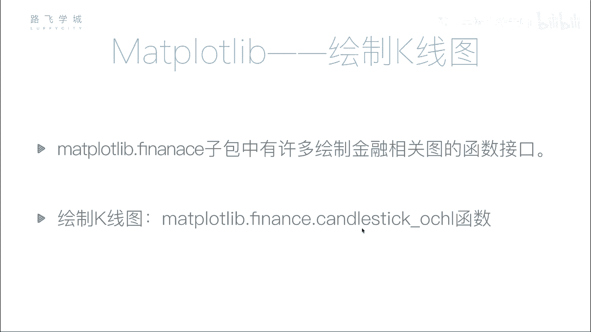

就是反正就这意思啊，好那我们来看一下这个函数应该怎么用。

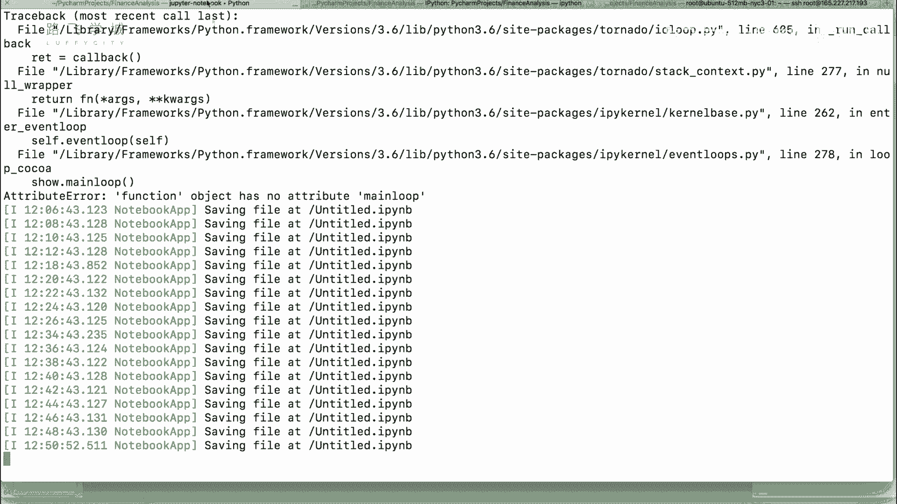

好，Import matt plot lab，点finance，反正比如说他报一个warning，不用管它，大家啊他报一个warning会说就是这个子模块，就是这个finance子模块。

接下来要被移除了，因为他现在跟跟整个的主包这个风格不太一样，然后会他会重新建一个包，他会重新建一个MPL的包，但是现在MPL的包，这个就是哎这个m p l find finance。

这个包现在还没有部署完成啊，所以现在你不用管它，它还是可以用的啊，FN点kindle stick不用二啊，kle stick o有两个哪个都行啊，一会再跟大家说这两个有什么区别，好可以看一下啊。

这里边有几个参数，是一个axis instance to plot to，其实就是什么玩意，就是个什么，这就是个我们之前给大家讲那个什么的时候。

给大家讲这个化归与子图的时候，就是这个对象看到没有，这就是ax嗯，就是你那个图的对象用来画的。

就是因为他这个写法跟咱们之前讲的那个plot，不太一样，所以你要把这个对象传进来啊，第二个cos cos是啥，你看他这说的是一个序列，一个这些东西的序列就是有time有open有close。

有high有low啊，相当于是一个二维的数组哦，相当于是个二维的数组，然后time就是open clothes high low，就是最开盘价，收盘价，最高价最低价，然后time就是一个时间。

然后他注意他这说的是time must be in flows，This format c date two number，就是你要把Python的这个daytime转换成一个float。

就是一个小数的时间戳啊，大家那个之前讲time模块的时候，可能见到过你是time点，time是返回的，一个是小数时间中，不知道还记不记得啊，就是说他这个不是一个对象了，不是一个时间时间对象了。

是一个时间戳啊，要是一个小数类型的，用这个函数啊，到时候给大家演示的时候会说，那后边这几个意义不大啊，这个宽度，wise就是设置你那个K线的宽度，是0。5还是10。8还是多少，然后color up。

Color down，是说的是你这个就是你的阳线和阴线的颜色啊，就是这个看看这个这个矩形的，这个长方形的这个卡color颜色，当收盘价大于等于开盘价的时候，其实就是什么收盘价，这个开盘价就是阳线了。

阳性的颜色啊，你不填的话，它默认应该是红的和我忘了是红的和绿的，应该是啊，这个是收盘线的颜色，可以不设置，阿法是更没有用，阿尔法，设置的是你这个矩形的这个长方形的透明度啊，aff level透明度啊。

不用管它，我们可以就是基本上只写这两个，前面两个参数就可以，那这两个参数怎么写啊。

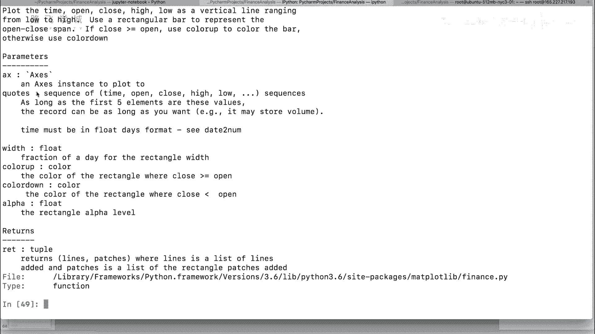

来现场做一下好，Import matt plot lib，点FINAN对，finance as fn嗯，然后我们还需要一个import matplot lab点date啊，为什么呢，因为我要用它的啊。

别别ADD了，我们要用它的，刚才不是说了吗，把我们的日期对象转换成一个小数，所以用它的一个啊from import转换成一个浮点数，要用它的一个data to nb这个函数啊，好，那接下来我们还是。

首先我们看一下DF还在不在啊。

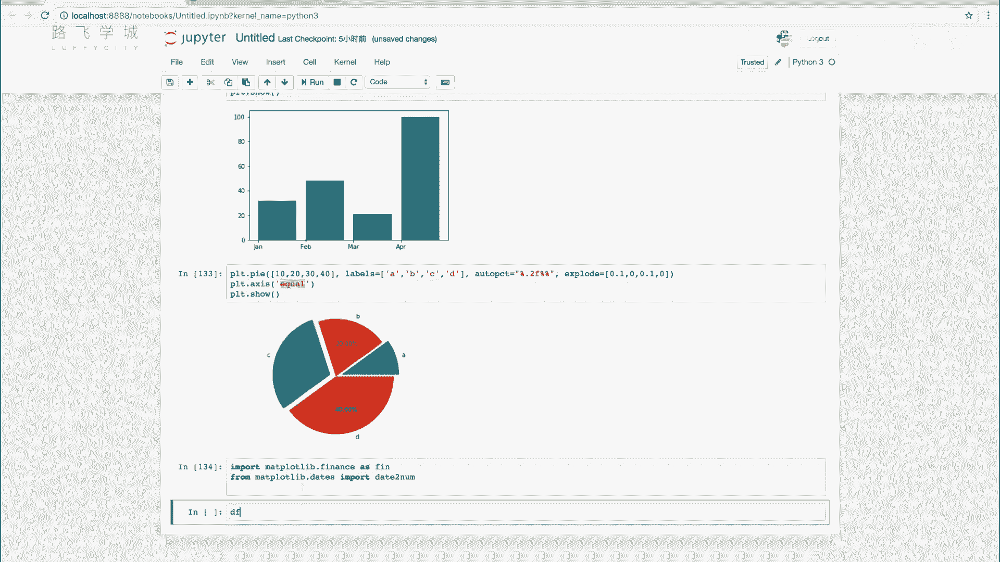

好在DF啊，这个这个这个已经已经不错了，已经是这次了，Open close high low date，我们已经处理出来了，对不对，那么就用它了啊，用它，那我啊，那我还得新建一列。

是不是新建一列time，对不对，因为我刚才我刚才说这个。

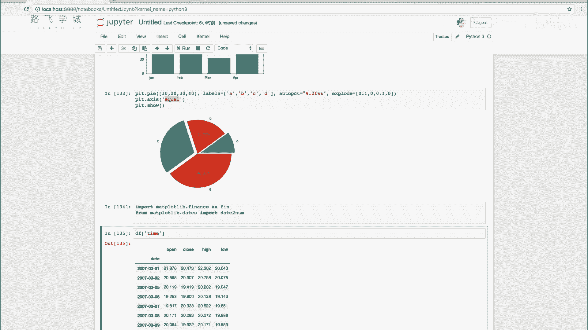

他的那个帮助文档上说你这要有time这一列。

对不对，也不是date了，我现在date不是一列，我现在date是一个索引，对不对，所以我要新建tab1列，新建tab1列，用data to number，就是这个函数啊，这个函数是什么呢。

是把一个Python的呃。

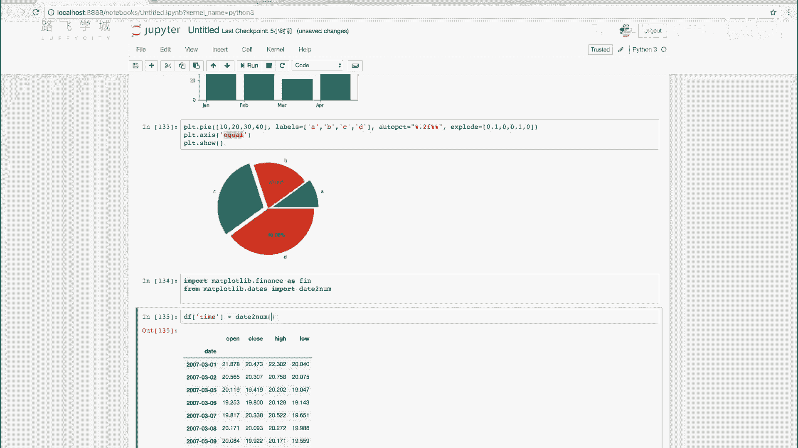

date time对象或者是data time对象数组转换成数，我们可以看一下嗯，MATPLOTLIB点date，点date读number，还有百分号，啊，找不到我试一下啊，On import。

好我们刚才没有引用好，来看一下它的这个参数是D，就是你要传入一个daytime对象，或者是一个daytime对象的嗯，序列啊，就是一个列表或者一个数组什么的都可以，好。

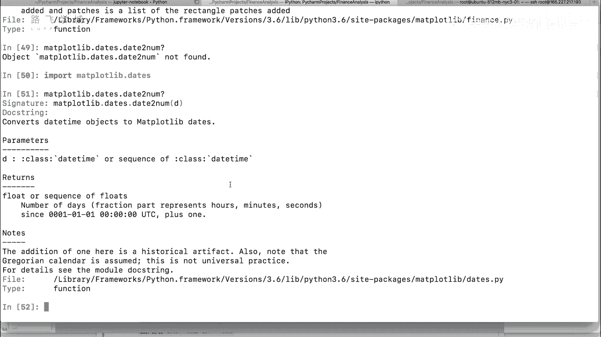

那么回到这啊，我们新建一个它，那就是把它我就是把什么，我是不是把这个东西把这一列传进去，是不就可以了，把这些传进去，注意你要转换成Python的daytime，这个我们在时间对时间序列那部分也讲过。

DF点index是获取它的这一列啊，获取它的这一列这个这个索引啊，那再点to p date time就出来了。

pdate time是把它转换成Python的data by Python data time类型，然后这个函数就是生成了一个Python data time的列表，或者数组嗯。

再把它传给这个day to day two number，然后传到这一列上去就完了，然后这个时候我们可以看一下DF，好，看到是不是多了，time这一列time这一列都是一个小数的啊，这个小数你不用管它。

就是个时间戳啊，这个小数就表示的是这个，你你这个这这这一行的时间好，那我们接下来，把它传给我们的那个kindle stick函数啊，是FN点candle stick啊，有人说我现在可以给大家说一下。

看到这有两个吗，一个OCHL，一个OC都是啊哈，OCHL和OHLC这两个这俩L是啥呢，看比如说OCHL这表示啥，这表示O是open c是close，H是high，L是low啊。

那另一个这个OHLC就是顺序不一样，就是open high low close就是决定出你这个顺序啊，决定你这个顺序，那比如说随便用哪个都行，我们用这个就是open close high和low4个好。

那这四个我们要传三个参数，对不对啊，第一个参数我们没有第一个参数，我还需要第一个参数，然后在这再加一个哪个第一个参数。

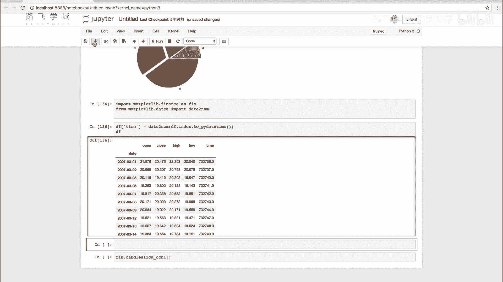

刚才我们的那个就是看一下啊，我们的，Kindle stick，那X对对象你可以怎么创建呢，你可以这个像我之前给大家说的。

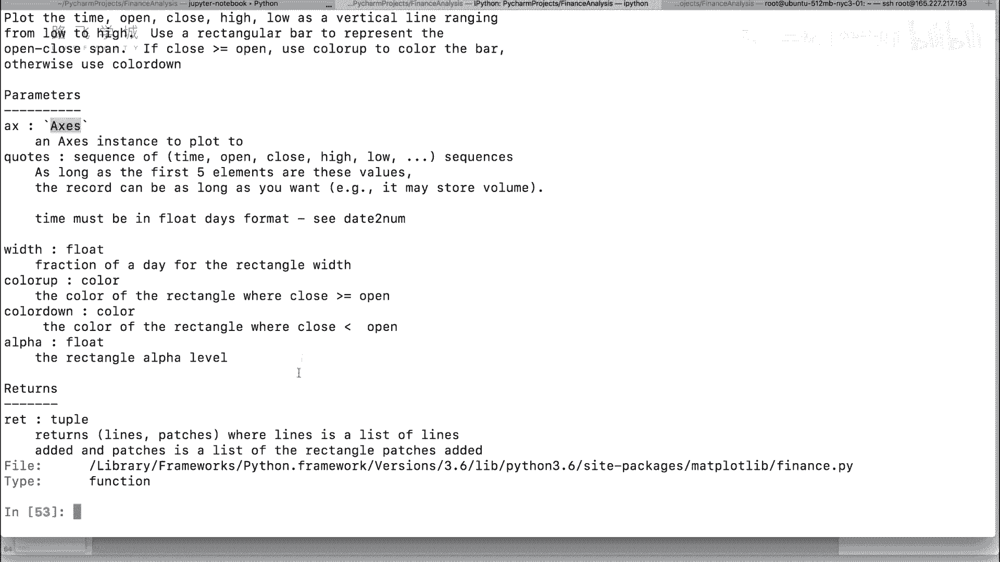

你看这创建一个figure，创建一个ADD support啊，画图对象。

好所以你们可以FIG等于什么，等于这个PLT点figure，ax等于figure点，Add subplot，因为我们只有一个图嘛，那就111就可以了，对不对，1×1，然后只有一个。

那这个ax我把它传进去来执行一下，好在这写吧，ax传进来，第一个参数，第二个参数是一个它的序列，对不对，那它的序列就需要把它转换成一个，数组或者是列表啊，他不接受，好像不接受这个什么，我们可以试一下。

如果我只写DF的话啊，看一眼，嗯好像给报错了，你看到没有，就是这一行报了一个什么错，报了一个不够解包，反正就是这个类型不支持啊，就是不能直接用DF，那怎么办呢，我们把它转换成我们的数组啊。

怎么转换成数组，用我们的values方法啊，DF点，Values，当然你这个values你还要保证它的顺序啊，其实现在我们可以看到这个顺序是什么，Open close high low time。

跟我们的这个对得上吗，Open clothes，Open close high low time。

在最后边，但是看这要求的。

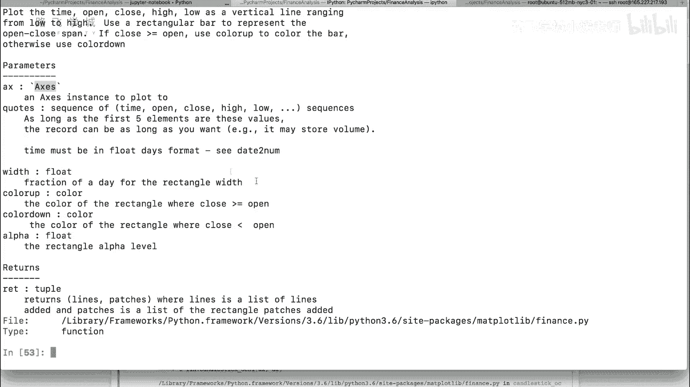

这要求他们在前面，对不对，所以以防万一，你最好怎么样，你最好用一下我们的什么啊，用一下我们的这个花式索引啊，Time，然后是什么open close high high low low。

哎这样的话虽然我们就这五类，但是你这样写的话，得保证它输出出来的这五列的顺序是先是time，然后open close还low，然后在它再点value4就可以了啊，比如说我们把它存成一个AR等于它。

那你把这a arr传进去，把这个剪切掉，然后把它画出来，应该是什么，应该是PLT点create，看一下啊，grade什么情况，哦哎，哦出来了，但是，这个不是，这是PRT，看看啊，刚才那个图已经出来了。

但是看不太清楚，大家应该，RD对这个这个没有错，哎怎么没了，刚才不是都出来了吗，好的啊。

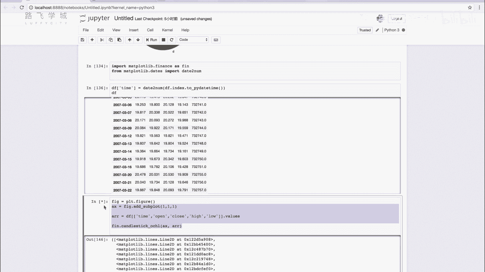

出来有点慢，就是，他是好多线他都打出来了，那一会我们看在这呢，在最后边呢它有点慢，你看我们把它这样把它，我们把它拷一下啊。

我们把这个部分都拷一下，我看看去我们的命令行里啊。

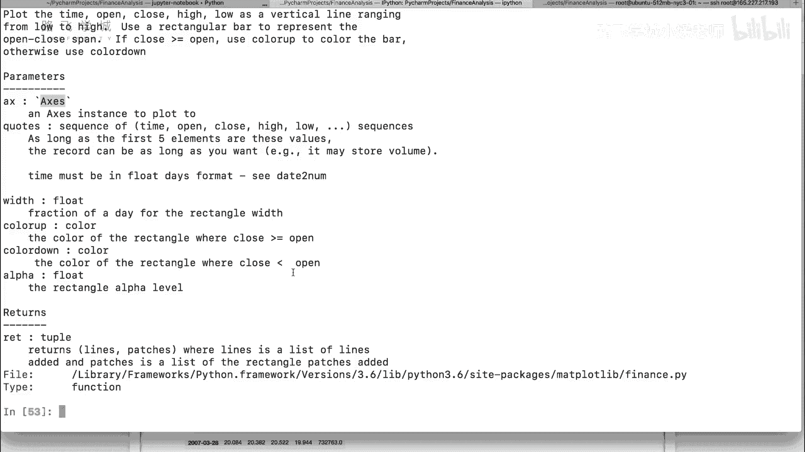

去我们的命令行里，有DF没有。

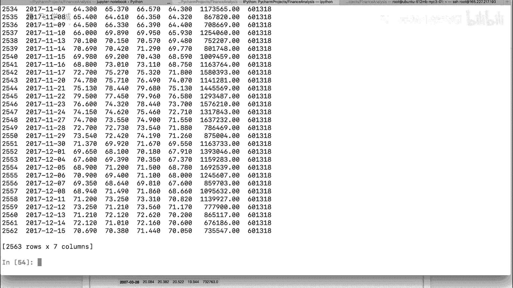

但是这个DF不对啊，那我们啊稍微把它调整一下嗯。

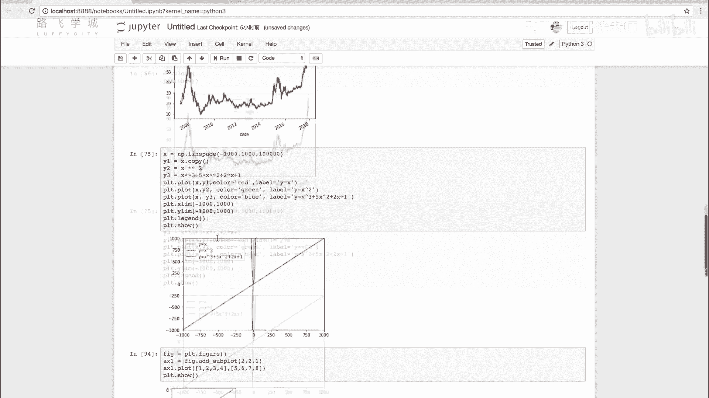

好DF。

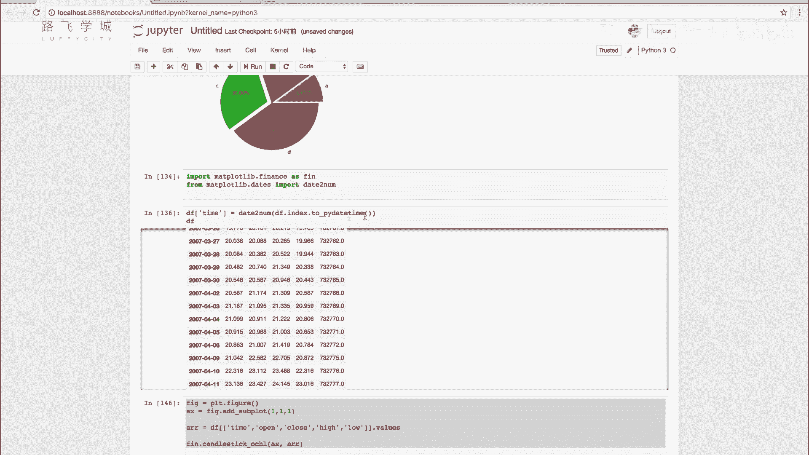

再导入一下导入一下啊。

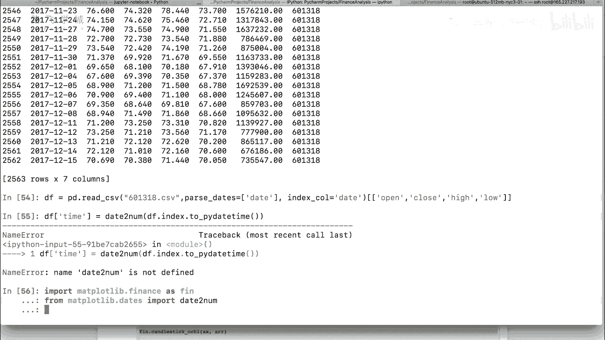

看一下啊，数据应该是可以了，然后是这几行。

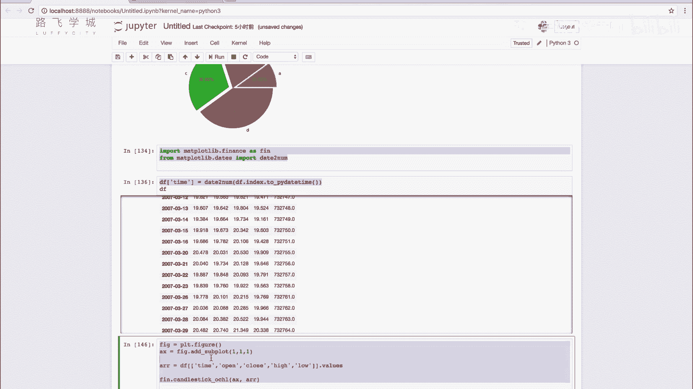

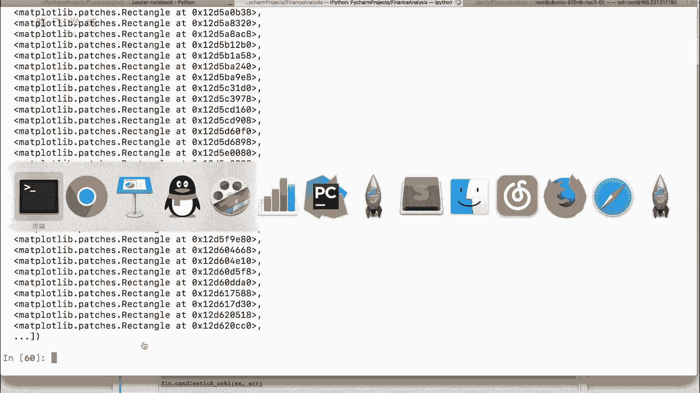

好出来了啊，那个grade没有grade，本来是应该添加网格，应该用PLT点grade啊，这个图比较大，因为我们这个时间太长啊，所以你看起来会有点卡，那比如说我们选取其中一段啊，这还是看不太出来。

再选其中一段啊，你看这个就应该看得清楚了，这是确实是K线图，对不对，确实是K线多，没问题吧，它是红的，是这个涨就是阳线啊，黑的是阴线哦。

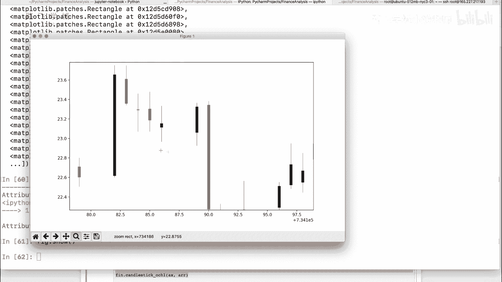

啊你们可以就是大家可以试着看看，这数据挺多的，可以你说这个这个是从零几年，08年应该就开始了啊，你可以DF把它切出来，比如DF等于DF这个嗯零到哎没有一行，点i lock啊切行，到100。

然后你再执行一下这个，然后是啊fire点show就快很多了，因为它小了啊，之前我们数据比较多。

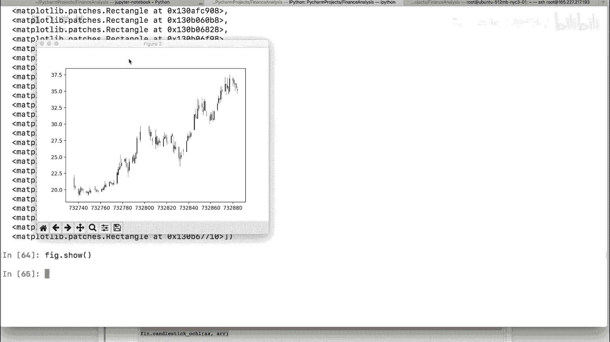

所以你看这个上面它也是因为它打印出来，打印出来之后就慢慢，而且这个数据多，所以他们慢了半天，我以为他没有没有出来好。

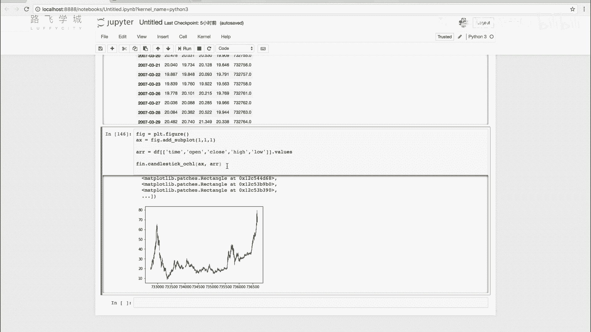

这是我们讲的这个啊，怎么样用matpd lab这个库来画K线图啊，K线图啊，好，那接下来我们就给大家这个matt plot lab，这个库就基本介绍完了，那这一部分剩下的我们接下来讲几个例子。

就是怎么样用这几个库来做一些，基础的金融分析的工作。

