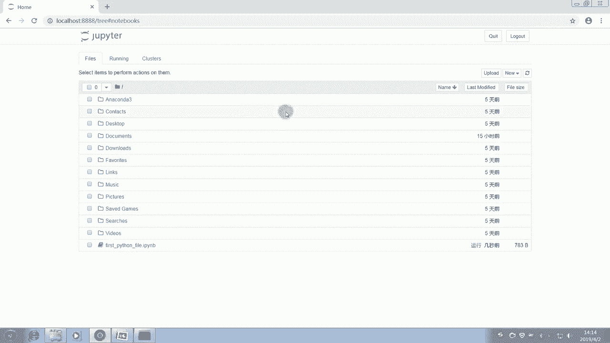

# 14天拿下Python金融量化，股票分析、数据清洗，可视化 - P3：03 Python基础知识（一） - 川哥puls - BV1zkSgYZE54

各位同学大家好，欢迎来到华尔街学堂，我是刘老师，今天呢带大家来学习一下Python基础知识，那么作为Python的基础知识的话呢，我们主要是先学习Python的相关语法。

以及Python的一些变量及其简单类型列表与元组，还有字典，那么讲完这些最基础的一个Python呢，语法的一个构成部分以后呢，我们再讲Python的一个控制流语句。

那么整体的话呢我我们就可以把Python呃，进行一个入门的把握了，那么我们首先看一下本次的一个呃，我们在什么样的一个环境下使用Python，所以呢先教大家安装一下Python，那么在这里的话呢。

我列举了Python官方版的一个安装方式，但是呢这个的话呢我们不推荐，为什么呢，因为官方版的话呢，它的一个安装第三方模块，这边的话，不论是windows系统还是呃那个Mac系统的话呢。

都会有一定的呃可能出现一些bug。

所以呢我们不建议初学者呢，用这个官方版的安装，那么我们建议初学者呢，下载这个阿纳康达这个软件，那么它里面呢丘比特的一个工作环境下呢，是非常适合啊，我们初学者也好，还是说用这个比较久的。

这个Python的一个使用者也比也好，都是比较合适的，那么我们可以点击这个网址啊，我们把它复制到浏览器进行一个打开，我们把Python这个anaconda的这个网址呢，复制到浏览器，那么打开这个网址啊。

我们可以在里面找到这个诺康纳的一个下载，大家的网络的话呢，呃这个地方呢直接打开这个网址。

根据网速的不同呢，打开的速度也会不一样。

耐心等待，那么这里呢我们看见有个download，我们直接点击这个download，它就到了这个下载页面，那么根据大家的电脑的型号，一般来说的话，可能听我们这个金融Python课的同学呢。

大部分呢都是用windows版的电脑，那么我们就只需要选择windows系统下面的Python，3。7的版本，那么我们可以根据各自的电脑类型看一下，这里是64位还是32位，那么选择一个安装。

这边呢直接点击呢就可以下载了。

那么我们已经下好了，所以呢我们直接回到这个桌面，那么我们在这边的话呢已经下好了，大家也可以从我们提供给大家的课程资料里呢。

点击这个anaconda的一个安装包，那么点击以后呢，这个anaconda的安装包呢就会运行，那么我们等它演示给大家看一下，这个anaconda的一个安装过程。

当然呢因为anaconda的一个完整安装呢，需要十到15分钟的时间，所以呢我们最后一步呢我们就不点击执行，但是我们把前面那些选项给大家讲一下，这里呢我们直接点下一步同意，然后这个地方可以点只给我。

或者说所有人都O那么下一步，那么选择一个你的安装位置，我觉得一般默认就好了，默认就好了，那么下一步啊，当然这个地方再点下一步，因为我已经装过了啊，所以这里我没有办法再继续装了，那么你再点下一步的话呢。

就会出现我们这个屏幕上的这个图片里面，显示的这个页面，这有两个选项，我们把它都勾上啊，都勾上，那么Python的那个除了它的一个基础的一个啊，那个终端，那么还有其他的那些包括其他的那个呃。

我们之后要用的一些模块呢，都会被自动的安装进去，这样就避免说大家在自己使用的过程中。

要自己安装很多包，然后出现一些bug的问题，好的，那么我们这个就啊已经安装好，已经安装好呢，CONDA的话呢，大家在安装过程中不要着急啊，到最后一步的话呢。

大家可以跳过安装这个micro soft vs code，它会提示大家啊，可以是不是选择安装这个MICROSOFT的vs code，大家呢可以选择这个不安装这个microsoft vs code。

那么我们呢呃可以运行OCONDA，那么我们可以看一下电脑呢，这边呢就会有这个anaconda anaconda了，那么实际上呢我们也可以不用打开它，我们这里的话呢。

主着重介绍一下这个an aconda prompt，这个呢可以看作是一个anaconda的一个终端，那么大家看这个格式呢，风格非常的像我们windows里面的这个命令行，对不对。

那么我们等待这个终端的打开，好那么在终端里面呢安装一些包的话呢，比如说或者模块的话呢，我们把这个package，那么也就是说用CONDA这个命令加上一个install，install是安装的意思。

那么再加上这个模块的名称就好了，比如说我们要安装一个requests模块，那么只需要conda install requests就好了，当然这个具体是什么意思呢，我们现在呢先不用理解它。

我们只需要知道啊，大概是这个样子来安装的，但是呢CONDA里面呢，大部分的模块已经帮你安装了，所以呢呃这个的话呢大家可以先不用去急着啊，知道要安装什么，我们即用即学即用即装好的。

那么我们的那么康达已经安装好了，那么大家可能会想说呃，我们具体在哪里去学习我们Python的语法呢，我们怎么去呃把这个代码，把这些Python的语法知识掌握呢，那么我们想说啊。

我们需要一个比较好的一个软件，或者说交互式的一个平台，那么在这里呢，我们就逐渐呃，重点推荐的就是那个jupiter notebook，包括本书本，我们这个课程的后续的部分呢。

也会使用这个jupiter notebook进行一个讲解，那么这个平台的话呢也是一个非常好用，非常轻量化的一个平台，那么我们打开这个终端呢有两种方法，一种是呢打开anaconda客户端。

比如说我们看这边啊，阿诺康纳的客户端，就是这个啊这个圈圈，绿色的圈圈，anaconda navigator啊，或者大家发现这里直接有jupiter notebook，直接点击也是可以的。

直接点击也是可以的，那么我们介绍一种方法呢，就是你打开终端在这里输入啊，我们输入jupiter notebook啊，在这里直接输入jupiter notebook，那么这个时候呢稍微等一下。

它就会弹出一个浏览器来弹出浏览器，那么我们可以在那个浏览器里边，操作这个jupiter notebook。

好的，那么这个jupiter notebook呢已经打开了，好我们发现了这里有很多文件啊，有很多文件，这是为什么呢，这是因为啊。

我们可以看一下上面我们这个运行之前的，这个前面这个位置是在哪里，我们发现是C盘的users administrator里面，那么这是一个什么含义呢，这就是说啊，我们是在这个以这个为工作路径运行的。

Jupiter notebook。

我们来看一下C盘，我们的C盘的用户的administrator，我们发现诶这个项目下面有这些文件，那我们来对应看一下，这边是不是有一个阿诺康达，然后有一个有些些联系人啊，文档啊，音乐啊。

这就是表示这个呢其实就是我们的这个啊，我们的这个啊工作目录啊，其实就在C盘的这个administrator里面。

那么待会呢，我会教大家怎么更改这个工作目录啊，当然现在的话呢我们来看一下。

简单看一下这个JUPITER的一个布局，首先呢这里是fires，表示这里都是一些我们的文件列表，那么这个running是正在运行的一些文件啊，目前是没有啊，没有终端和notebooks在运行都没有。

那么cluster的话大家先不用管它了，那么我们发现这里有三个主要的分类啊，这里的话有个upload可以上传一些文件啊，可以上传，那么这有个new，那么就新建我们待会要用到的呢。

因为我们现在学Python嘛，所以就点这个new，这边有一个新建一个python3的，一个Python three的一个notebook，点击以后呢，他就开始新建这个notebook，好的。

那么我们打开了一个这样的，JUPITER的一个notebook，我们发现啊，这个地方呃有一个untitled的是说未命名，既然未命名，那我们就给它命个名吧，给它命名叫做。

First python fire，第一个Python文件好，我们就叫它first Python file。

我们给它重命名一下，那么这第一个Python文件，我Python文件我们就给它命名了，接下来呢我们看一下这上面的一些功能，比如说这个fire的话呢。

就是一些文件的一些选项，比如我们把它保存成什么样重命名啊，保存一个这个还原点啊，或者说还原到上一次的还原点啊，这个的话呢功能呢，我们在使用的时候还会详细介绍完，还可以把它下载下载成不同的格式。

比如说Python文件格式呀，notebook文件格式啊，或者HTML的格式啊等等等等，那么包括我们可以对他这个进行编辑啊，比如说复制啊，我们把这个这个蓝色的框框呢，这种一个一个框框呢。

我们把它叫做cell细胞嘛，CELL啊，我们把它叫cell，那么我们可以把它进行上下移动呢，或者合并啊等等这些功能啊，这些功能大家可以看一下这些单词的话，如果有不认识的话，可以在那个词典里查一下吧。

都是很简单的一些常用单词，那么will的话呢，我们可以先不用管它啊，我们可以看insert，就是插入一些这个格子啊，比如在选择的这个区域，我们现在选择这个区域，我们在它上面插入一格。

哎我们在选择这个区域，在它下面插入一格，这样的话呢插入很多个cell，那么在选择cell的时候呢，我们发现这里有运行等等等等啊，运行所有上面的和所有下面的这些，那么核心的话呢我们先不用管它。

这里有个race reconnect和restart重启，包括中断等等，好help的话，这里重点给大家讲一下，这个help的话还挺好用的，第一是keyboard shortcuts，就是一些热键。

或者说我们说的快捷键，快捷键的话呢，大家可以看一下啊，这个Python呢它这个tribute notebook呢有两种模式，一种叫编辑模式，这种呢是我们在写代码时候用的模式。

还有一种模式叫做命令行模式啊，命令行模式你要按一下这个cs e s c，然后就会生效，那么这里呢列举了一些这个快捷键，可以让大家方便的这个在输入的时候更方便啊，可以不用一直拿着是摁着鼠标。

因为一直按着鼠标的话，其实这个也会影响工作效率，有可能哈哈，那么我们看一下这个地方，比如说我们怎么进入这个命令行模式呢，或者说怎么进入我们这个工作模式呢，我们看一下啊。

一种呢是编辑模式，一种是命令行模式，那么我们只要按ESC这个按按钮，也就是键盘左上角这个按钮摁一下诶，我们发现这边变蓝了对吧。

它就进入了这个命令行的这个模式，我们按一下回车诶。

我们发现这个地方开始闪动，也就是说我们可以输入一些内容啊，比如我们随便输入一些字母，哎我们发现可以输入了，那么这个颜色也变成绿色了，这个时候呢它就是处于我们的一个编辑模式，也就是你可以在这里输入代码了。

好的，那么接下来呢我想给大家讲一下，我们这个juicer notebook，大家发现还是非常简洁，非常原始的，那么在真正的使用过程中呢，比如说我们现在先不用这个book了，我们把它保存一下。

然后就把它关掉好了，那么我们发现这里就多了一个first Python file对吧，那么在这边呢还是比较原始的，所以呢在这个我们先给大家讲一下，我们怎么配置这个jupiter notebook。

我们把这个关掉啊，然后在这个页面呢怎么退出呢，我们在CONDA里面只要control加c control控制键啊，键盘左下角的control加C我们就把它给中断了。

中断以后呢，我们现在来配置一下我们jupiter notebook，给它加装两个特色的工具，一个是我们主要是加装我们这个nb extension，这个插件我们现在复制这一句啊，我们这边有写。

先在康纳终端里复制这一句，我们右键粘贴，然后回车好，这个时候呢他就开始这个安装，我们这个jupiter country nb extension这个控件了，那么这个安装时间呢。

根据电脑的不同和网速的不同呢，时间是不一样的，一般来说平均要花费15到20分钟的时间，所以呢在安装的时候呢，大家千万耐心等待，不要中途关闭它，以免造成错误啊，我们看这里的话呢也是装到90%多了。

他的速度呢也是比较慢的，那么我们耐心的等待它安装完成，OK我们这边应该是快要安装好了，好的大家看到这里有一个successfully built，这个jupiter nb extension啊，OK了。

他已经这个第一部分已经装好了，我们接着把第二部分，这个把这个控件给它插安装进去啊，依然是同样的操作，CTRL加C复制，然后在这边右键粘贴，我们把它给回车敲入，那么等待它这个控件的一个安装。

那么依然是耐心的等待一下，这次会比上一次要装的快很多，好大家发现这个地方有一个，这个也是已经完成安装了，这个地方也完成安装了，好那么我们装成功以后呢，我们现在呢呃一次性把这个YAPF也装掉啊。

这个conda install把这个也装掉，一样的把它给粘贴进来，回车安装，啊大家注意啊，这里呢它有一个proceeded，就是说是否继续运行下去，我们只要输入一个Y让它继续运行，然后就可以了。

那么它已经开始安装了这个YAPF，这个控件呢其实只是刚刚那个nb extension里面的，我们说啊，给它加装一个我们待会儿的那个代码美化部分，因为考虑到大家刚刚开始学习这个Python语言。

对于Python的相关的语言的基础规范呢，可能不是很熟悉，所以呢在编写代码的时候呢，往往可能导致呢代码不够规范，那么我们呢就给大家装这个控件的话呢，也是说呃起到一个帮大家美化代码的一个作用。

那么我们现在已经安装完毕了啊，安装完毕以后呢，我们现在可以登录JUPITER啊，我们安装好了这个两个插件以后呢，我们现在讲一下，怎么去改变这个tuber的，这个notebook的一个工作路径。

我们发现啊我们这个地方呢，因为我的电脑呢是只有一个盘的啊，我这个只有一个C盘，所以呢我们就打开计算机啊，打开C盘，比如啊我想专门在C盘里面呢建立一个文件夹，他就是我们的JUPITER的工作路径。

那么我给它命名就叫jupiter working pass，好，我就叫这个名字，那么我们只需要打开它这个名文件啊，我们复制这个工作路径，那么我们在这边输入这个CD，那么把这个工作路径给他拷贝过来。

我们按下回车诶，我们发现前面的这个工作的这个路径啊。

就发现由这个base users administrator呢，改变成了这个jupiter working pass，那么我们现在呢在运行jupiter notebook，那么它打开来的话呢。

我们的工作路径呢就会改变成，我们现在这个开始的时候，就是打开JUP的book的时候的这个文，这个地址名字地址地址的位置，也就是刚刚我们复制粘贴的位置好，我们发现这个地方现在呢是空的对吧，现在是空的。

这是为什么呢，因为我们刚刚是创建了一个新的文件夹，这个jupiter working pass是一个新的文件夹，所以我们现在呢就可以把它关掉啊，先关掉，那么在之后的登录的时候呢。

大家也是可以像我这样子选择一个工作路径啊，自己喜欢的工作路径去登录啊，每次都可以进行更换，啊我们刚刚说呢我们装了一个nb extension。

这个插件，我们现在发现诶，这个上面在刚刚三个的基础上，多了一个nb extensions，我们点击它打开来以后呢，发现有很多很多很多插件，那么真正的我们需要用到的呢特别好用的呢。

一个是这个code pretty，大家打一下勾，还有一个呢就是这个table of contents，勾一下，这个后面有空的话呢，我会教大家怎么使用，就table of contents。

那么还有一个呢就在这叫hinterland，这个呢是代码提示功能啊，非常好用，这三个我们先勾一下，那么回到JUPITER的话呢，我们现在呢呃新建一个Python three的文件。

好我们新建一个Python three的文件的话呢，在这呢我们发现啊它还是on title的，那么改个名字把它叫还是叫first Python fire，那么重命名以后呢。

我们看一下我们在这个地方呢输入啊。

所有的我们这个程序学习里面的第一条指令啊，Print hello world，我们把这个hello world这个打印出来。

那么我们只需要点击运行啊，先输入print，那么我们发现Python呢它这个print后面呢，它的这个语法呢是跟了一个括号对吧，两个括号括号括起来的内容呢，我们用双引号把它括起来，这样的话，那就表示啊。

我要打印这个括号里面的这个双引号中的内容，那我们点击运行，我们发现这个hello world呢就被打印在了这个啊，打印在了这个屏幕上，那比如呢我们想print1些别的内容可不可以呢，其实也是可以的。

一样的方法啊，Hello，比如说我们换一个，那么对刘老师打一个招呼，Hello，那么对我打一个招呼啊，我的英文名，那么啊它就输出了，所以呢我们发现这个print呢，它是一个非常好用的一个啊函数啊。

作为我们屏幕上打印出来一个这个内容，那么在后期呢我也会给大家介绍很多print，它有非常好用的一些功能，那么在这里的话呢，大家先把这个函数呢可以先记住，因为呢这是我们所有的程序的一个入门的，最基础的啊。

你接触到第一个函数呢就是hello world，好的我们现在呢开始讲Python的基础知识，那么变量和简单的数据类型，其实变量和简单的数据类型呢，它哦我们先讲一下变量吧。

变量呢是什么东西呢，那么就呃大家都能理解，为什么呢，因为在我们这个小学啊，我们就学过了，比如说我们学过用字母表示数，对不对，或者我们学过方程啊等等，我们说设X啊，设什么是X，比如设一个变量啊。

为X这个X代表什么东西，这是我们小学经常学的内容，那么呢其实在编程里也也是一样的，比如说我们就假设啊这个X呢会是六，会X等于六，那么这个式子的含义是什么呢，X等于六的含义呢。

就是说啊我们把六呢这个数字呢赋值给X，那么也就是说你一旦运行以后呢。

X呢它的一个含义呢就是六，它就代表六，那么我们输入这个X等于六以后呢，我们在Python里呢有两种方式把X呢显示出来，一种呢是我们刚刚讲的print，我们把这个变量打印在屏幕上。

另外一种呢是我们直接把这个X呢进行运行，那么因为我们在Python，这个JUPITER的这个环境下面呢，我们运行这个X呢，相当于是在做一个交互式的一个呃，我们交互式的一个运一个操作。

也就是说我们输入X以后运行的时候呢，这个时候呢Python呢它这个解释中断呢会自动的啊，把我们现在这个X对应的结果给我们返回出来，那么以后呢在大家运行的时候，想查看某一个变量啊，或者某一个啊。

这个包括我们以后的更多的数据类型啊，数据结构啊，它后面的一个它具体的一个情况，那我们只需要把它输进来，点运行好，在这种交互式的方式下呢，就可以显示出in了以后呢，就会有一个out输出。

他这个变量背后的一个具体的一个情况，好的，那么这个时候呢，也就是说我们把六啊这个值赋给了X，那么比如说我们在让X等于七，我们让X等于七运行，那么这个时候X到底是六还是七呢，那么我们说啊Python呢。

你如果在后面呢，就是你重复的对同一个变量进行赋值呢，它只会保留你最后一次负的那个值，那么这个时候的X呢没错，就是等于七的，那么如果我们再给X一个八，那么它就会变成八，所以呢它只会保留同一个变量。

不停的赋值，只会保留最后的那一个赋值好，那么是不是只能给这个X赋值这个数字呢，其实不是的，比如我们可以让Y啊，我们设一个新的变量YY呢等于几呢，我们让Y等于一个字符串，或者说等于一个。

或者也就是我们刚刚讲的hello world，可不可以呢，像我们刚刚上面打印的这个hello world，我们运行一下，让我们发现没有问题啊，我们现在选YY的话。

我们点运行发现AY它就代表了这个hello world，所以呢我们我们就知道了啊，这个Python的这个变量呢实际上是什么含义呢，它就是说啊，是一个像我们数学里的这个未知数一样。

那么它主要是由字母啊等等来组成的，那么Python的变量命名呢是有一些规则的，它的变量命名呢必须以字母或者下划线开始，不能瞎命啊，就是说什么意思呢。

就是说这个必须由字母和下划线开始，没有这种变量，比如说我们变量是ex有这种变量吗，我们来试一下，比如我们让ex等于六，那么我们运行一下哎，这个时候呢它出现一个错误。

我们看一下这个fire这个IPAD大大大，然后不拉不拉不拉line，Why，也就是说第一行这个EX等于六。

这个地方它出现了一个syntax error，好，凡是Python出现报错呢，大家千万千万不要紧张，也千万千万不要，因为说自己在刚开始学的时候呢，用Python呢出现了很多语法的报错，就丧失信心。

每一个人在学习的过程中呢，尤其在学计算机语言的过程中呢，肯定会出现这个错误的，那么出现这个错误并不代表着什么，并不代表着你不行，而是代表什么呢，而是代表你在这方面并没有符合，他这个计算机所能理解的内容。

你必须要让他能理解你，OK因为计算机它是固定的，而人的思维呢是活跃的，这里呢他就告诉了我们syntax error，这里一个语法错误，那么invalid syntax就是表示啊，这个语法呢是无效的。

为什么无效，我们刚刚说了，你不能以数字开头，必须以字母或者下划线开头，我们把这个一改成下划线X，我们发现这个时候我们再运行一下，哎OK了，这个时候没有报错，所以呢我们的下划线X呢就会等于六。

包括我们用print下划线X把它给打印出来哦，print我们把它打印出来，那么它也是六好的，那么我们再看一下啊，一般来说呢变量的名字呢它是有严格要求的，不能超过255个字符。

那我也相信大家不可能说给每个变量命名，都有255个字符那么长，那样的话你是使用起来是非常的复杂，非常麻烦的，那么一个变量名呢只能代表一个对象。

也就是说你后期再对这个变量名，重复的去命名的话呢，它只会保留你后一次的命名，那么变量名它不能是Python里的关键词，我也把Python中的一些关键词列在了这个下方，那比如说false错误啊。

none true and等等等等，assert break我就不一一念了，大家在命名的过程中呢，尽量要注意避免命这些Python中的一个关键词，作为这个变量的名字，在这里呢我需要再提醒一点的呢。

就是呃在命名过程中呢，Python命名呢，我建议大家呢还是要有一定的呃含义的去命名，这样呢使用起来呢也会更加的。

什么是有一定含义的去命名呢，就比如说啊你现在呢，比如说我们在处理一个金融数据，那么这个时候呢，你的变量名字呢最好能把它处理成中文呃，处理成英文的，比如说你要给一个公司的代码的名称命一个名。

那么最好呢就使用code这个英文名称，而不是使用X这个英文名称。

因为你一看到code呢，你就知道这是公司的代码，你一看到name呢，你就知道这是公司的名称对吧，那么你一看到这个比如说PEPTM，你就知道是公司的一个动态的PE，你看到PB你就知道公司PB。

而这些呢如果你临时的用X用Y用Z，用ABC去替代的话，你就会发现你的命名呢，在会真正的运行程序的时候非常混乱，以至于最后呢，你都自己不知道自己要调用什么名称了，所以呢建议大家呢用有含义的。

能够代表这个变量真实的经济含义的，这个金融含义的这个名称，好的我们接下来呢看一下Python里面的变量类型啊，刚刚我们讲了变量是什么，变量类型呢，其实我们刚刚也涉及到两类，一类呢是数字，一类呢是字符串。

那么我们把这种没有用引号标起来的数字呢。

我们把它叫做数字，我们把这种用双引号括起来的，这个中间的有内容的这个这这这这一串呢，我们把它叫做字符串啊。

我们把它叫字符串，那么变量呢主要有这两类类型，那么怎么查看变量类型呢，啊我先跟大家删掉一下这个上面这些内容啊，因为太多了，我们把它们全选起来，按住ESC啊，我们看快捷键里有一个ESC，然后再一直按D。

那就可以删除，那么我们在这里呢我们先看一下啊，比如说我们一个变量是X等于六，还有一个变量是Y，你看为什么呢，我们安装了这个nb extension以后呢，大家有发现吧，我们每输入一个字符呢。

它就会有提示下方你可以进行选择啊，Y呢我们让它等于比如说等于这个hello world，好大家发现啊，我这里用的是单引号对吧，其实呢在Python里呢，你单引号双引号呢其实都可以表示字符串啊。

都可以用都可以用，那么一般来说呢，我们习惯是在表达一个句子的时候呢，我们用双引号把它括起来，表达一个单词的时候呢，或者表达一个啊单独一个词语的时候呢，我们用单引号把它给括起来，那么在这里呢。

我们把这两个变量呢啊命啊赋值一下，就把六赋值给X，把hello world赋值给Y，那么我们点下运行号，它已经运行好了，这个时候呢呃X肯定是六，Y肯定是hello world，我们怎么查看变量类型呢。

我们只需要输入type x啊，我们发现这里输错了啊，是type t y p e啊，醒类型你会发现这里有提示的点下啊，所以呢TYPE啊，我们运行一下，我们发现唉他告诉我们int int是什么呢。

就是integer的书写啊，integer的书写，也就是说啊这个X的类型呢是整数啊，那么type我们再看一下type y，我们点一下运行啊，type y的一个我们开发现是STR。

STR呢就是string的一个缩写，s str in g string的一个缩写，所以呢我们就知道哦，原来X的变量类型呢是整型整数型，那么Y的变量类型呢是字符串的类型啊，是字符串啊。

是string文本类型，那么还有没有其他的变量类型呢，其实是有的啊，包括我们这个我们如果让一个Z啊，变量会等于1。6，那么它也是属于数字1。6，对不对，它是一个小数，那我们点运行。

我们发现好type z type is z的话呢，我们看一下啊，运行哎，float float呢它表示的是浮点数啊，float是浮起来的意思吗，它的就是一个浮点数，所以呢我们发现啊。

Python的数字的类型呢主要有整数和浮点数，而Python的这个字符串的类型呢，那么就是我们刚刚说的这种，用双引号把它给括起来啊，Hello world，这种就是字符串的类型好。

我们介绍这两种类型以后呢，我们先介绍字符串的一些常见的操作。

我们先介绍一些这个字符串的常见的操作，我们发现啊字符串的话呢，它有好几个比较常用的操作，我们先来简单练习一下其中一些操作，比如说我们前边一个字符串呢，我们用hello表示，因为是个单词。

所以我用单引号把它括起来，后面的一个字符呢，我们用比如说我们用elderrich average啊。

我名字，那么我们看一下我们中间用加号把它连接，那么我们运行一下会发生什么事情呢，我们发现它们完整的贴合在了一起，组成了一个新的字符串，那么我们还可以怎么做呢，比如我们在order ge之前呢。

我们给一个空格，那么我们再运行它呢，我们发现诶它中间呢也空了一格，这个呢我们把它叫做字符串的连接啊，字符串的连接也是第一条字符串常用操作，第一条字符串的连接，那，么同样的我们接着看啊。

我们的这个字符串的连接呢，除了这样使用呢，我们还可以把它赋给一个变量，比如说我们让X啊等于这个字符串它相加，那么我们继续点下运行。

那么我们在这个时候呢把x print出来。

print出来，我们打印这个X这个变量，发现诶，Hello，Orderrich，就被打印出来了，同样的我们再讲一下字符串的一个复制，字符串怎么复制呢，比如说hello，Elderverage。

我们对它进行复制，那么就乘以一个，比如乘以一个三，我们看一下会是什么结果。

我们发现啊这个结果呢就hello，Orderrich，Hello，Orderrich，Hello，Ouderrich，他这个词就出现了。

我们接下来呢比如说我们单独对hello乘一个三，我们发现诶这个hello呢就被重复了三遍，如果我们在这个地方加个空格，再运行一下，哎我们发现它中间就有了一定的间距啊，它就有了一定的间距。

这样呢就表现的非常的和谐啊，好我们看一下获取字符串的长度的话呢，这个地方呢我们要介绍一个简单的函数，它的名字它叫做L啊，其实就是英文length的一个这个缩写，我们把它lee n就好了。

那么我们在这边输入一个字符串，比如hello这个字符串，我们数一下。

它一共是有五个字母组成的，所以我们预期呢运行以后呢，显示的数字应该也是五。

所以我们点击运行，那么结果是五，好我们接着呢来看一下这个字符串的查找啊，我们刚刚已经看了字符串的长度，我们现在看一下字符串的查找，字符串的查找的话呢也有两种方式进行查找。

一种呢我们是用in这个符号来表示，那么比如说我们看一下，我们这样子输入一句话，我们输入看一下E这个字母在不在这个hello，这个word，hello word这句话里面，那么我们点一下运行。

那么它返回一个true，我们把这种true呢叫做布尔值啊，布尔值布尔值啊，它是一直接音译过来的，英文名呢叫布偶布偶，所以呢翻译过来直接叫布尔值，那么这是一种，我们来查看一个字符串在不在里面。

比如说我们要查看另外一个，我们查看A这个单词，这个这个字符串在不在hello word字符串里面，我们点运行，我们发现是false，也就是说不在啊，true啊，在false不在。

因为呢Python呢它这种二元的一个返回机制呢，这在我们后续的一些超实际操作当中呢，也是非常有帮助的，所以大家可以理解，先记住一下这个布尔值，false and true啊。

包括这个A是不是在里面用a in hello world，它会直接返回是否在里边，那么还有一种方法，那么是什么呢，是用find的这个函数就是寻找啊，find我们说查找啊，find这个函数。

我们把要找的内容呢给它放进去就好了，我们把要找的内容给它放进去啊，A点find hello world，我们运行一下，也就是说啊在这个哦sorry，这个地方呢应该是我们这样子的hello word。

然后呢点find我们在这个hello world呢，这个string这个字符串里面呢，我们查找什么呢，查找这个A看一下有没有A啊，我们点一下find运行一下，发现返回值是一，一是什么意思啊。

一呢就是表示啊我们没有找到这个A，所以呢返回的是一，那么比如我们找一下这个E，我们找一下这个E运行返回的是一一，是什么含义呢，一是因为啊我们Python里面的位置呢，它都是从零开始的。

所以呢对于H这个字母呢，它对应的呢是位置零，对于E这个字母呢对应的是位置一，对于air这个字母呢对应的是位置二，所以呢我们知道它返回的一呢，其实就是我们这里的一个这个E这个字母，对应的位置。

那么我们就知道啊，原来这个E呢我们找到了它是存在的，它在这个字符串的第二个位置啊，因为零是第一个位置，所以一呢是第二个位置，那么我们就知道hello world，我们数一下，确实E呢是在第二个位置。

那我们接着呢我们试一下，比如我们要查找air，那它到底是返回的是第三个位置的，这个对应的二呢，还是返回的是三呢，那么我们说啊，如果呢它有重复的L的出现呢，它只会返回第一个啊。

你最先从左到右最先找到的那个位置，那么它返回的呢我们预期呢它应该是H是零，E是一，air呢就应该是二，所以返回的呢是二啊，如果没有找到呢，返回的位置那就是一啊，好的，那么我们再看一下这个。

我们对字符串呢可以进行一个索引，索引是什么意思呢，就是用我们刚刚说的啊，字符串的位置来对字符串进行一个选择，它的一些部分内容，比如说我们把hello word赋给一个字符串。

我们把hello word付给这个X这个变量，我们对X这个变量呢，我们后面用一个中括号啊，大家注意是中括号，我们在里面任意给一个数字，比如我们给零，我们想一下会出现什么呢。

它表示的含义呢就是X在零这个位置的时候啊，它的是什么内容，我们点一下，那么在零这个位置呢，就是H我们发现诶确实是H，那么我们如果给它改成四呢，也就是说第五个位置，你看第零，第一个，第二个，第三个。

第四个，第五个位置是O，所以我们预期它返回的是O没错啊，就是O那么这个呢我们把它叫做字符串，字符串的索引，字符串的索引，那么同时呢我们如果对它进行4~6，比如我们是4~6，这是什么含义呢。

它表示的呢就是说我们从这个位置四啊，也就是说位置四其实就是第五个位置啊，第五个字符位置四呢，或者说索引四到索引六哦，我们运行一下，发现得到的结果是O诶一个这个空格，那我们把这个延长一些。

比如说是七运行一下，就是O和W，因为中间有个空格，这个空格呢也算是一个字符串，所以呢比如我们在这个地方，衡量一个字符串的长度的时候，我们多加一个空格，我们发现诶它就变成六了，为什么呢。

因为你空的这个空格呢也会把它算成一个字符，明白吗，也会算成一个字符，好的，那么在这里呢，我们这个这个呢我们把它叫做字符串，字符串的一个索引啊，比如说我们这个中间用一个冒号，中间用个冒号。

就表示为这个索引四到索引七之间的这个字符，那么在Python里面呢，它是左闭右开的一个区间，也就是包括这个四这个位置，也就是包括我们这个O，但是呢不包括七这个位置，也就是不包括我们这个W后面这个O啊。

也就在我们七位置之前，四位置及四位置之后的所有的字符，比如说我们用0~1，那么显然呢就是说只有我们的第一个字母H，那么第二个字母呢，也就E呢是对应这个索引一的，是不会包含进去的，运行一下发现只有H啊。

只有H那么这个呢大家要掌握一下，就对字符串的一个这个索引，那么字符串呢，我们还有一种呢叫做字符串的分隔，比如说有一个字符串ABC诶，他用逗号隔开了这个字符串，那么我们可以用一个split函数。

那么给它一个逗号，我们可以用split把它给这个，我们把它给这个split，在英文里面呢是破开的意思，我们把它给劈开，也就是说把ABC呢根据这个逗号呢给它劈开，运行一下，发现哎把ABC给他劈开了。

对不对，给他劈开了，那么比如说我们要是如果这里是别的符号，比如说是一个这样的竖线，是一样的竖线，那么我们就把这个逗号呢也换成竖线，我们只要运行一下呢，哎同样的结果，我们把这个AABC一个完整的字符串呢。

给他给劈开了，那么还有一种啊我们可以移除掉一些空格，比如说有的时候你会发现A后面还有好多空格，对不对，比如我们给一个X并定义X等于A运行一下，我们发现X运行一下，那么我们发现X后面呢有很多空格。

我们怎么把它就这个空格给消除呢，很简单，我们用这个点strip方法啊，我用这个方法X点strip方法啊，大家可以把这里的每一个变量啊，就像呃我们在上课刚开始的时候说啊。

Python呢是一种面向对象的编程语言，所以呢我们可以把这个X呢看作是一种对象，那么对X后面打一个点呢，用一个strip方法呢表示对这个X进行一个操作，这个strip呢。

实际上呢就是把它进行一个字符串的一个压缩，我们一点哎，我们发现这个A呢前后呢都没有空格了对吧，都没有空格了，很好啊，这个我们就完成了这个工作，X点strip啊，我们把它给啊后面的空格给它消掉了。

消除掉了好，但是呢这个时候我们要注意了，我们再输入X我们运行一下，发现X呢依然是A后面有空格，这是为什么呢，这是因为啊，我们这个上面呢进行X点strip的话呢，我们只是单纯的对它使用了这个方法。

但是呢其实并没有修改X真正的哦，它链接到的那个真实的值，也就是这个A这个变量，那我们怎么去对它进行修改呢，我们可以说把它重新的复制一遍，也就是说啊我们呢把X点strip这个东西。

也就是把X进行压缩以后的值，重新的付给X本身，我们再运行一下，那么我们我们现在在输入X呢，就会发现这个时候呢，X才变成了我们想要的那个A，这也是我们在计算的过程中呢，千万要注意的就是你的这个操作。

你的这个方法到底会不会改变它本身这个值，如果说不会改变这个变量的本身的值的话，那么你就要注意了，如果你是希望改变的话，你还需要进行一个重新的赋值操作，如果你本身是不需要它改变，你只想看一下效果的话。

那你可以不需要进行这个复制好的，那么字符串的常用操作我们讲完了，我们接下来呢花一些时间讲一下数字的计算啊，比较我们刚刚说啊，数字呢主要有两种类型，一种呢是像三啊五啊一啊零啊这种整数，我们把它叫int啊。

Int，那么还有一种呢就是像3。32。4这种啊，我们把它叫浮点数，那么可能有同学就会问了。

像1。0这种的到底是整数还是浮点数呢，那么刘老师我我来说的不算啊，我们来看一下系统怎么告诉我们，或者说Python让Python来说话，我们给他一个type1。0。

看一下它的结果啊，系统告诉我们啊，Python呢它这个终端告诉我们，它的一个类型呢是浮点数，Float，它的类型是浮点数，所以呢我们就知道啊，1。0呢也是浮点数，0。0呢也是浮点数啊，也是浮点数。

只要你给它加了小数点，它就会成为浮点数，好这里我要讲一个注释啊，这里呢介绍给大家注释呢，在Python里呢我们用井号表示，也就是说啊，如果呢你在这个字符前面呢加了一个井号，那么他这个字符呢就不会被执行。

比如我们现在点运行是不会输出任何结果的，但是我们去掉这个井号呢，运行呢哎出现了结果对吧，所以呢这个井号呢在运行的过程中呢。

可以屏蔽掉一些你不想要它执行的代码块。

包括一些包括一些我们在调试的过程中啊，你怀疑哪一句代码有问题，你可以先把它用井号给它注释掉，那么等到我们真正啊，先运行一下其他的那个代码，看看有没有问题，如果没有问题的话。

那很有可能就是这个我们注释的这个代码，是存在问题的，接下来呢我们看一下Python的计算和比较吧，Python的话呢我们先看一下Python，它有加减乘除等等运算，它的一个符号呢。

我在这个PPT里呢都列示给大家了，包括除法取整和除法取余，我们一一来演示一下，比如我们想计算2+10啊，这个数我们只要写2+10运行就好了，那么结果是12没问题，那么我们10-9啊，我们10-9。

我在这里呢给大家讲一下，我们Python一个书写规范啊，就说啊我们在写的过程中呢。

我们一般习惯在这个地方啊，数字啊和符号之间空一格运行一下，反正是一反应是一啊，当然呢大家也知道，我们刚刚其实是我教大家装了一个插件对吧。

比如说呢如果我们这不空格，但是呢你可以把它这这行代码选中，我们看一下，这里有一个这个像格式刷一样的插件，上面写了code pretty，我们只要一点这个代码，就自动的按照我们这个Python里面的。

目前的最新的规范啊，给它美化了对吧，像这样就非常的美观啊，非常美观，空一格10×9=90，那比如我们要算10÷20，25吧，我们要算10÷25，我们一样的啊，点运行0。4啊，我们就可以算出来。

比如说我们要做一个平方运算九的平方呢，平方是什么呢，是两个乘号，就是平方九的平方，我们运行方案是81，那么我们要做一个取整的运算，10÷9啊，取整是什么呢，是啊这个取取整的是两个这个斜斜杠啊。

两个这个斜杠或者两个这个除号点下运行，那么就是一，那么我们想做一个取取这个余数的一个运算，那么怎么做呢，我们这个符号刚刚也有介绍，是百分号百分号啊，我们运行一下，那么余10÷4余二啊。

余二我们这个地方取余数啊，取余的一个运算好，那么我们把这个计算呢基本都讲了一下啊，计算都讲了一下，那么我们现在讲一下这个Python里的一个比较，有等于号啊，注意啊。

这个等于号和赋值号是完全两个不同的符号，等于号是两个等号，我们把它用等于叫做等于，而一个等号我们把它叫什么叫赋值，刚刚我们在变量的赋值的时候，是不是用了一个等号，比如X等于六是一个等号。

而这里的X等于六，这里就是两个等号的话，就表示我在判断是否等于或者计算是否等，是否等于再做一个判断，而刚刚那个等于一个等于号呢，是在做一个赋值号，不等于呢我们用感叹号加等于号表示不等于。

那么大于小于大于等于小于等于根，我们excel里面常用的函数是一模一样的啊，包括这个啊不等于啊，其实也是可以跟excel里是一样的，那么运算的逻辑符呢有and or not。

我相信呢如果有经常用excel办公的朋友呢，肯定是对and和or呢是非常熟悉的，这是我们一些条件的表示条件的时候常用的啊，逻辑的一些运算符，那么not呢就是表示相反相反的意思，我们一一来看一下。

比如这里我们输入二等于十，我们预期它的结果会返回什么呢，肯定是返回不相等对吧，肯定返回不相等，那么在Python里面呢，二等于十如果是错的话，返回的结果呢就是false。

就是我们刚刚说的布尔值的结果false，那么我们再看二，如果我们输二大于十呢，那么返回的结果呢显然也是false，那么如果输二小于十呢。

那么显然是正确的，show返回一个TRU，那么我们看一下呃，比如说我们在这里输入一个R不等于十，那么它的返回的结果呢肯定也会是true，因为二肯定是不等于十的啊，那么我们来看一下还有什么没有演示的吗。

还有and和or好的，比如我们把两个条件，比如说二等于十和一个二，和一个我们看一下二等于九，我们把这两个条件放进去，这两个条件都是错的。

所以它的运行结果肯定是错的，而即使其中有一个是对的，只要另外一个是错的。

因为我们and是就要求且他们两个如果都对，才能返回true，这个时候依然返回的是false，大家注意看这里，但是如果说两边呢都是对的呢，比如说三等于三啊，我们运行一下，我们发现哎因为这两个条件都是对的。

所以呢and连接起来呢它也是true，那么我们可以看一下，如果用or的话呢，如果用or的话呢，两个都是对的，它显然结果是对的，但是如果有一个是错的呢，一个是错的，另一个是对的，结果也是对的。

但是如果两个都是错的呢，那你or也没有用了，因为你两个都是错的，你不管选哪一个都是错的，好or呢就是或谁或谁，比如说他们两个中间只要有一个对返回就是true，那么NT呢就很好判断了，比如not。

比如说我们用一个note2等于五运行一下，返回的就是true，为什么呢，因为本身二等于五呢，是一个force的一个错误的条件，那么not false false的反面呢是什么呢，当然就是true了。

当然就是true了，好这里呢我们就把这个Python的这个数字方面的，一些计算呢，我们都讲掉了，那么在这里呢就想跟大家说啊，其实在日常工作中呢，你这个JUPITER这个notebook呢。

因为它本身就是一个，你看可以像一个网页一样打开，它，对内存的一个使用是非常少的，所以呢各位呢在工作的时候啊，在学习的时候啊，都可以把它打开，打开来以后呢，可以把它。

首先呢当做一个最简单的计算器来使用对吧，当做一个计算器来使用，那么比如说我我们现在要计算一个，简单的年金的一个问题，我们金融学的话都知道年金，比如说买了一个保险啊，他以后每年要给我1万块钱。

然后我们觉得啊这个经济的这个折现率啊，大概是5%，那么我们就用第一年呢就1万÷1。05，第2年呢我们用1万除以除以一个，1。05的平方，Python也是一样的啊，计算规范它也是先算乘呃，先算那个乘方。

然后再算乘除，还有加减，有括号，先算括号啊，Python也是这样子，那么第2年是1。05的平方，那么第3年呢1万÷1。05的三次方，好我们现在呢点一下运行，哎我们发现它给它计算出来了，这样的话呢。

我们Python呢其实又是我们这个日常工作中，一个非常好用的，起到一个非常好用的一个计算器的一个功能，那么大家在使用这个Python作为计算器的过程中呢，啊特别要注意的几点。

就是Python这个符号的问题啊，大家一定不要用错符号，它的取整啊，它的乘除加减加减乘除都是跟excel是一样的，它多了两个比较特别的，一个是取整，一个是我们说的取余，这两个符号不要弄混。

还有它的乘方跟excel是不一样的，excel里面的乘方呢用的是这个符号，对不对，用的是这样一个三角向上的，一个尖尖的这个箭头，这种呃符号，但是呢我们Python里面呢使用的是这个两个乘号。

就是作为乘方啊，更加的简洁直白啊，你两个乘号就是乘方，也就是这个幂啊，比如M的N次幂就M啊，两个乘号NMN都得是数字，那都得是数字好，那么最后呢我们讲一下这个Python之禅，Import this。

Python之禅是什么东西呢，我们输入一下啊，liort this运行一下，OK我们发现了这里有一首诗，the Zen of Python翻译过来，Python之禅。

by team peters是tim peters这个人写的，那么beautiful is better than ugly。

也就是说啊啊我们可以阅读一下这一段，他讲的是什么，就是写代码的时候啊，你的美呢肯定是比丑要好的，那么简洁呢，Explicit。

这个显示呢明显是要比这个不明显要好，也就是说你显示呢是优于影视的，这个我们在后面讲函数的时候会讲，所以呢我们也不给大家介绍影视的函数，因为在真正使用中，大家只要把显示的掌握了。

那么也可以自己编写好很多很很好的函数，那么simple is better than complex，也就是你的代码写的简单易读呢，是比这个复杂要好的，复杂呢又比那个啊。

这个complex又比这个复杂要好，就是说你简单的，是比你去把它搞得更麻烦一点要好，那么你复杂呢是比这个超级复杂要更好，那么flat is better than nested。

你如果这个数据呢是平坦的，是平的啊，就会比你把它叠起来要好，明白吗，这平的比叠起来肯定是要好的，那么这个sparse is better than dance，那么后面的我就不一个一个去练了。

它特别强调的注意red rability counts，也就是说啊，你这个数这个代码的可读性呢非常的重要，代码的可读性非常的重要，好的，所以呢今天的话呢我们回顾一下，我们大概讲了些什么内容。

我们目前呢讲到这里呢，讲了这个数字的比较等等，那么我们那个接下来呢，我们介绍一下这个原组合列呃，我们刚刚讲完的这些内容呢，就是我们把Python里的变量啊等等都讲过了，然后包括它的这个数据的类型也好啊。

数据的这个数字的计算，以及我们说的字符串的一个常用的操作，我们都讲了，我们现在呢来讲一下。

Python里面存储数据的一些简单的这个类型，我们这个列表和元组，那么我们先介绍一下什么是列表，列表呢，就是用来存储一组有序数据，大家注意这个数据是有序的，有序数据元素的数据结构。

我们把元素之间呢用逗号把它隔开，那么列表呢我们把它用方括号括起来，那么就是一个列表，那么我们现在讲一下这个怎么创建一个列表，那么创建一个列表呢，我们就用两个方括号括起来。

我们把这个两个方括号赋值给这个list，也就是说啊，我们把一个空的列表赋值给了这个list，我们运行一下，那么list呢就是一个空的列表，这个时候我们用刚刚教过的type函数来看一下list。

它的一个变量类型，好，他的变量类型就是list啊，就是list。

那么我们现在呢可以再看一下，我们说啊这个列表呢是用方括号括起来，里面呢一个一个元素之间呢用逗号隔开，好比如说我们假设现在先来一个数字的列表啊，先来一个数字的列表，那么我们运行一下。

看会是一个什么样的结果好这个列表呢是list，我们现在呢输入一下list，运行一下，发现诶就是这个列表好，list呢现在就代表这个列表，那我们再看一下它的类型是不是列表，那么输入一个type啊。

它也是啊，它的类型就是list好，那么我们现在呢讲一下这个列表的一些简，单操作吧，O像这个列表呢可能有同学会说啊，还能不能是字符串啊，比如说当然可以，比如A然后呢BCD，那么我们运行一下，啊运行一下。

好的，运行完了，我们现在呢输入一个list，看一下它的一个存储的结果啊。

确实是这个ABCDABCD好。

我们现在讲一下列表的复制啊，列表的复制，比如现在我们对这个list进行复制，它和我们刚刚讲的字符串的复制呢是一样的，是一样的，怎么做呢，就对这个list用一个乘号乘以一个三，比如我们乘以一个三。

我们发现这个列表被扩充了三遍，对不对，ABCDABCDABCD它已经被扩充了三，它已经被重复了三遍，这个列表的复制，比如乘一个五。

那么就会有五变啊，有五变，这ABCDABCDABCD啊，比如我们乘以一个十。

那么他就会有十遍啊，我发现这个已经看不见了啊，拖动才能看见，这已经自动重复了十遍，所以呢这个我们把它叫列表的复制，那么我们再看一下，我们再讲一下列表的合并，合并呢有两种方法，一种呢是用直接用加法。

就像我们刚刚讲的两个字符串的相合并，怎么合并啊，我们直接用加法把它们加起来，同样的两个列表，比如我们第一个列表是L1L1，这个列表呢我们会等于L1，这个列表呢我们会等于2345，等于2345L2。

这个列表呢会等于。

这个就用我们这个ABCD吧，不等于这个ABCD。

那么我们给它运行一下好，L1L2分别代表这两个列表，那么我们要把L1L2给它合起来，怎么合呢，我们只要相加就好，我们发现加起来以后这个结果是什么呀，结果就是2345ABCD，那么我们在这边给一个列表。

L12来表示L1L2运行一下，那么现在呢我们就把L1加L2的值呢，复制给赋值给了L12好，这就是L12的一个结果，L12的一个结果，那么我们现在再看一下列表的话呢，它也有这个我们说的一个合并的功能。

比如说它还有一种，比如说L1点extend，就说啊在L1的基础上呢，把谁加进去呢，把L2也给它补充进去，我们运行一下好，我们运行一下，这样的话呢我们再输入L1，我们发现L1已经被扩充了。

L1已经不是之前的L1了，这就说明什么呢，说明这个方法和我们之前学的方法，有什么区别啊，有一个区别就是我们之前学的方法呢，基本上对这个L1是不改变的，对不对，包括我们刚刚学的find啊。

对那个字符串的一个改变，find它是不会改变那个字符串的需要，我们重新去赋值，但这里呢我们L1直接extend一下呢，我们发现它已经被扩充了对吧，它已经被扩充了，这就说明了在使用这个方法的时候呢。

大家不需要再去用L1等于L1点extend了，明白吗，OK好，那么这个方法呢，就是我们字符串的一个这个扩充，字符串的一个扩充，那么大家可以课后呢，好好练习一下这个字符串的扩充。

那么接下来呢我们讲一下这个如何修改和删除，相关的列表中的一些元素，比如说我们用最简单的额，删除列表中的一个元素的方法吧，我们先这边啊讲一下这个列表的一个索引啊，先要讲一下怎么去找每一个元素。

这个呢其实索引的话呢，包括刚刚字符串的索引，包括之后我们会讲的字典啊，还有一些其他的元组啊，包括我们最后讲的那些呃，更更复杂的数据类型里面的一些索引，它其实都是相通的道理，就是从零开始。

第一个位置我们把它叫零零位置，第二个位置叫一位置啊，是从零开始的，明白吗，从零开始，那么在这里的话呢，我们L1的话呢，如果我们输入一个零位置的话呢，它返回的是哪一个，当然是这个二这个数字。

但是我们要注意了，我们先重新的运行一下这个，然后我们在这边L1的话呢，它返回的是二啊，是二，然后我们可以看一下，如果我们输入L2的话，L2我们想看L2的二位置，二索引，二索引是第几，第几个位置啊。

第三个位置嘛，所以我们运行一下这个L2，这个这个L22我们发现哎是C没错吧，第三个位置是C好的，那么我们接下来呢讲一下这个列表呢，它也有切片对吧，像我们刚刚说了，比如说我想看第零个位置到第啊，第二个呃。

到第三个位置，也就是我们这边给个二，也就到第三个位置，但不包括三，那我们看一下L2，这样的话运行一下应该是AB啊，两个因为到这个第三个位置，但是不包括第三个位置啊，所以呢是AB，这是列表的切片。

我们这边也可以改改成一，这边改成三，运行一下，发现结果也是一样啊，也是这个BC啊，从这个第二个位置开始到第四个位置，但是不包括第四个位置，好的，那么我们现在呢再讲一下怎么修改这个列表，怎么修改列表。

比如说我们现在L1呢，我们把它扩展扩展成把L2也给他加进去，这样L1这个列表呢就变得很长了对吧，L1就变得长了一些，变成这个样子，我们现在想删掉其中的一些元素，怎么删掉它呢，那么我在这边呢讲几种方法。

第一种呢我们要删掉它呢，我们直接用delete del啊，你只要输入DEL，然后呢在这个L1这个list里面呢，我们只要输入L1，然后呢我们删掉第几个呢，比如我们删掉第零个，那么我们运行一下。

我们现在再去看L1呢，它的二这个第零个元素哎，就啊二这个第一个元素好，本身呢这个零呢代表的是第一个位置嘛，这个索引零我们要删掉索引零这个元素，所以删掉这个索引零的话，也就把第一个位置都删掉了。

那么我们也可以怎么做呢，也可以试一下，我们看一下啊，现在呢我们又重新把这L1复制一下啊，我们重新的从上面复制一下啊，好L1重新复制一下，我们假设要删掉别的呢，比如我们要删掉三呢，那么我们三的话。

我们先数一下012345这个数字，我们删掉它的话呢，我们预期L1里面的五就不见了，果然它不见了，果然它不见了，好的啊，我们接下来呢在讲另外一种方法，可以删除里面的元素的，我们叫pop方法叫pop。

那么这个方法呢就是表示弹出什么意思呢，我给大家举个例子，大家就明白了，比如X1等于啊L1点，pop pop呢是从你这个列表的末尾啊，给它弹出一个元素来，我们注意末尾是什么呀，末尾是D所以我们就知道哦。

这个L1点pop呢会删掉末尾这个D删掉以后，这个D到哪里去了呢，被弹出来了，弹出来弹给谁呢，我们把它赋值给了这个X就是这个含义，所以我们运行一下，我们先看L1，我们发现末尾的D不见了，同时我们看一下X。

我们发现X呢变成了DX呢，变成了D，为什么呢，因为我们把它弹出来，并且赋值给了D，这个呢在我们这个呃运算中呢，也是比较有用的一个方法，我们接着呢讲一下字符串怎么修改，比如说啊在这里的话呢。

L1是这个这个这个内容，我现在想修改L1的第二个位置的一个元素，L1的第二啊，索引二的话对应的是012，对应的是四，我想把四改成八，那么我们只需要把它重新赋值就好了，运行一下，那么我们现在再看L1。

它就已经变了啊，L1它已经变了啊，这个四就已经变成八了，这个四就已经变成八了，好那么大家还会想啊，我们怎么往里面加元素啊，很简单，append append啊，我们在呃。

有用过其他的统计软件的朋友应该都知道，比如STA的这个软件的话呢，它里面也是用一个pen，我们给他加入一个元素，比如我们加入一个二，那么运行一下，我们现在再看L1，我们发现末尾多了一个二，多了一个二。

那么就是这样子，也就是说在之后的工作中啊，我们要往一个列表里追加元素的时候呢，我们只需要用append这个函数就可以了，用append好的额，我们列表的话呢，这个函数呢我们还有一些额方法呢。

我们基本上都讲完了，就一些怎么操作这个列表的方法，我们都讲完了，那么我们现在呢接下来呢我们讲一下，想给大家讲一下这个列表的一些这个方法，与列表的一些其他的常用的函数，当然了列表的一些其他常用函数的话呢。

就是说我们可以讲一下这个列表的一个排列啊，比如说我们现在有一个这样的列表，我们都是一个整数的列表，那么它本身呢是一个不规则的，没有顺序的一个列表，好的，那么这样一个列表我们怎么对它进行排序呢。

我们怎么排序呢，那么列表呢有一个这样的方法叫做sort方法啊，叫做排序方法，sort呢它就叫做排序，我们看一下啊，我们比如说我们给它呃salt输入salt的话呢，我们把这个函数啊，把这个方法调用出来。

我们发现这个sort这里的话呢，它是给了你一些这个提示的啊，给你一些提示的啊，他是可以告诉你啊，这个sort后面可以输入哪些，当然我们现在先不用管啊，还没有讲到函数，我们先不用管，我们先学一下这个方法。

大家可以记住这个地方点sort，就是对它进行排序，运行一下，我们现在再看一下int first，这个还这个列表，现在呢我们发现诶他就已经排好序了对吧，从低到高排好序了，从低到高排好序，那么我们想说的呢。

就是说在大家看到这个函数的时候呢，或者说看到这个啊，我们对这个int first这个进行一个这个列，这个这个列表呢进行一个操作，进行一个排序的时候呢，实际上呢如果用这个点sort方法的话呢。

它是已经完全的在原有的这个列表的基础上，就对它进行过修改了啊，原有的这些基础上就去进行过修改，那么我们还可以用另外一个，比如说点reverse，就是从高到低排，因为我们刚刚是顺着排嘛，从低到高排嘛。

现在倒着排，我们从高到低排，我们再看一下这个int first这个列表，我们发现诶他变成从高到低的排序了，那么同学们可能还会考虑一个问题啊，就是说呃我有没有办法不要修改，原来那个列表呢，直接在它的这个。

就是我新赋值给一个其他的列表的，可以的，比如说我们int我们这个时候就要用到一个函数，叫sorted这个函数，这个函数呢就不会对它进行呃，对这个int的first进行修改，大家发现它直接输出了一个列表。

但是呢你这个时候再去查看int first呢，它是没有变化顺序的，依然是原来这个顺序，所以呢这个时候你可以复制一个新的，给一个新的列表，比如说你把这个sorted的以后的这个列表呢，赋值给X。

那么你就自然可以知道啊，原来是这个X呢，就是新赋值以后的一个按顺序排列的列表，好的，当然如果你想要那个，如果你想要怎么样呢，如果你想要让它倒着排呢，大家注意了。

这里告诉你有一个reverse equals false，就是说你反向的，这也是关闭这个反向排列的一个，这个意思也就默认是关闭的，但是如果你想让它反向排，你只需要reverse把这个打开。

reverse equals true就好了，所以呢这里你把int输入进去，我们可以把刚刚这个列表给他输进去，然后同时对reverse equals，秀啊我们把它给等于正正确的运行一下。

我们现在再看这个X这个变量，发现它是倒着排序了啊，倒着排序好，那么我们接下来呢我们来看一下这个list的话呢，它也可以看长度的，比如我们用LAN还是用这个函数，用length这个函数。

那么length这个X的话，我们运行一下啊，六位啊，我们数一下里面是不是六个元素，确实是六位元素好的，那么列表的话呢，我们就额这个主要的那个基本的方法，我们就讲完了好，我们接下来呢介绍一下这个元祖啊。

元祖元组的话呢，我们这个地方呢用couple来表示啊，TPPTPP的英文名啊，是元组的英文名，那么元组呢它和list呢是非常像的啊，比如说我们来命名一个TPO，它呢是跟list的非常像。

唯一的区别呢有两点，第一点呢是它是用小括号给它括起来，比如说12359A啊，我们看一下这样一个元组，那么这样一个元组呢，它有一个它跟list是一样的，包括索引，比如我们看下T0也是第一个元组。

第元组的第一个元素，但是呢它的区别呢在哪里呢，它区别在于这个元组呢它是不可改变的，里面的元素内容，比如T0，我们想把它改成A或者改成C，我们运行一下报错啊，Type error，为什么呢。

因为top of object does not support item assignment，就说啊TAO这个它的一个couple对象，Couple object。

我们发现Python里面大量出现object，因为我说过Python我们是一个面向对象的编程，所以呢他这个对象呢是没有这样一个赋值的，这样一个功能的啊，所以呢它是不能够改变的。

这个Python的这个couple呢是不能改变元素的，明白吗，好所以呢我们在这个里面呢就要特别注意了，基本上是一样的，但是呢唯一的区别呢，就是说你这个top1旦给定了，你里面的元素是无法改变的。

你可以往要是无法改变里面的那个元素的，但是呢list是可以的好的，所以呢相对来说呢列表呢相对于top来说呢，会更为的灵活，更为灵活好用，我们一般的列表呢，也是我们用的极为多的一个数据类型。

接下来我们讲一下字典，字典呢我们用dict来表示啊，dict我们先看一下怎么创建一个空的字典，空的字典呢，我们d deals我们这边用两个大括号表示了，所以我们发现小括号中括号，大括号都用全了。

小括号表示top啊，也就是我们说的元组中括号表示列表，大括号表示字典，字典是什么意思呢，其实就是一个键和值的对应，我们把它叫key和value的对应，我们举一个例子吧，举个例子大家好理解一些。

比如我们D这样一个会等于什么呢，等于我们用一个大家都熟悉的贵州茅台，那么它对应的是什么呢，假设它的股价现在840元，那么我们再对应一个，比如说哪一个大家也都很熟悉的啊。

股票中国平安这个股票它现在价格是78元，假设那么我们只需要运行一下，我们就会发现这个字典到底是怎么一回事了，我们现在看下字典是什么样子的啊，原来字典的就是含义呢，就是贵州茅台这个股票价格呢是四八百四啊。

中国平安这个股票价格是78，那么字典的话呢我们可以查看它的一个键值，也就是keys，我们发现我们只要输入，比如我们看啊，我们看这个自动补全怎么用，你输D点KE诶，它自动去key了。

你回车一下就可以把它打印找出来了，那么这个时候呢你记得加括号就是字典的keys，方法可以查看它的键值，我们发现dict keys字典的键，我们把这个叫键键入的键啊，键盘的键。

字典的这个键值呢kiss呢是贵州茅台和中国平安，我们可以看下对应的地点，values这个字典的值，字典的值呢是840和778啊，840和78，那么这个时候呢我们字典的话呢基本就这样。

那么还有一个就是它的items，items呢，就是把key和i key和那个value都把它弄过来，看一下，我们发现dict items，我们发现看到没有，它是把这个变成了一个什么。

变成了一个列表包围下的，他跑，也就是说啊，他把贵州茅台840，中国平安78呢分别作为了那个TPO，就是元祖，然后呢放进了一个列表里面，作为这个列表的两个元素啊，这样输出，所以这个是items的一个形式。

由这里呢我们就可以知道啊，字典呢是可以嵌套的，或者说这三种数据类型呢是可以嵌套的，比如说啊我们这个列表里面呢，可以嵌套这个TAPLE，这就是这个典型的例子，这个字典的items。

它用一个列表把两个元组嵌进去了，同样的我们的字典里面呢也可以嵌套字典，这个呢常用在我们一些啊爬虫的数据类型里面，比如JSON类型啊啊等等，比如这里我们可以A001里面，我们再嵌套一个字典，一然一。

然后对应二，那么比如A002，我们也可以再嵌套一个字典啊，再嵌套一个字典，比如二对应C好，这个呢也是一个啊字典字典嵌套，我们发现这就是这样一个数据类型，包括我们可以字典里面嵌套列表。

比如说上面这个A01，我们嵌套一个列表123，然后A02我们先来一个列列表245，然后我们运行一下啊，他也是做成了这样一个数据类型好，那么讲到这里的话呢，大家就可以思考一下了，列表元组。

还有字典的这三种数据啊，这三种是这个我们说讲的这三种类型的，这个对象，它们呢比较适合分别用来存储什么数据呢，大家可以思考下这个问题好，那么当然在自己的实际工作中呢，大家可以根据需求来选择列表。

或者选择原组，或者选择字典来存储自己需要的这个数据，或者根据需要来选择啊，当然了，但从我刚刚举例呢，大家也可以看出，你可以用股票代码和价格对应，你甚至还可以用一些其他的啊。

相相相互对应的一个方式来使用字典，以及用嵌套的方式，比如字典嵌套列表的方式来进行一个使用好，那我们今天这个呃，Python基础知识的这个第一部分呢，我们就介绍完了，把这个基本的变量类型呢。

以及我们的这个三种常用的，储存数据的一个工具呃，这个变对象比如说字典，还有我们的元组，还有我们的列表，都给大家介绍了一下啊，都给大家介绍了一下，那么今天的话呢，我们这个主要内容呢就是这么多。

那么希望呢大家在课后呢多多实际的操练啊，这是一门非常实，非常是需要大家在课后的一个练习的一个课程，然后呢大家在操作的过程中呢，如果有任何问题呢，可以啊查看我们的这个课程讲义。

这个的话呢也会随课程呢一起发放给大家，在我们的课件里面呢，课件之外呢有一个专门的课程讲义，大家打开这个课程讲义呢，可以看见，这是我编写的一个这门课程的，一个按照章节分类的一个讲义。

所有课程里面演示过的代码呢和相关的数据呢，都在这个讲义里面会有所提及，那么大家可以点击相关的内容，去到这个相关的页面，在课后呢把相关的代码呢自己手动输入一遍，非常不建议大家去啊直接的复制粘贴。

然后去输入啊，非常建议大家手动的输入一遍，加深这个肌肉的记忆效应，muscle effects好。

