# 14天拿下Python金融量化，股票分析、数据清洗，可视化 - P3：03 Python基础知识（一） - 数分小诗 - BV1bFDSY9Ep5

。

各位同学大家好，欢迎来到华尔街学堂。我是刘老师。今天呢带大家来学习一下python基础知识。那么作为python的基础知识的话呢，我们主要是先学习python的相关语法以及python的一些变量。

及其简单类型列表语言组，还有字典。那么讲完这些最基础的一个python的语法的一个构成部分以后呢，我们再讲python的一个控制流语句。那么整体的话呢，我我们就可以把python呃进行一个入门的把握了。

那么我们首先看一下本次的一个呃我们在什么样的一个环境下使用python。所以呢先教大家安装一下python。那么在这里的话呢，我列举了python官方版的一个安装方式。但是呢这个的话呢。

我们不推荐为什么呢？因为官方版的话呢，它的一个安装第三方模块这边的话，不论是windows系统，还是呃那个mac系统的话呢，都会有一定的呃可能出现一些bug。所以呢我们不建议初学者呢用这个官方版的安。

方那么我们建议初学者呢下载这个undercon这个软件。那么它里面呢jube特的一个工作环境下呢，是非常适合呃我们初学者也好，还是说用这个比较久的这个python的一个使用者也比也好，都是比较合适的。

那么我们可以点击这个网址啊，我们把它复制到浏览器进行一个打开。

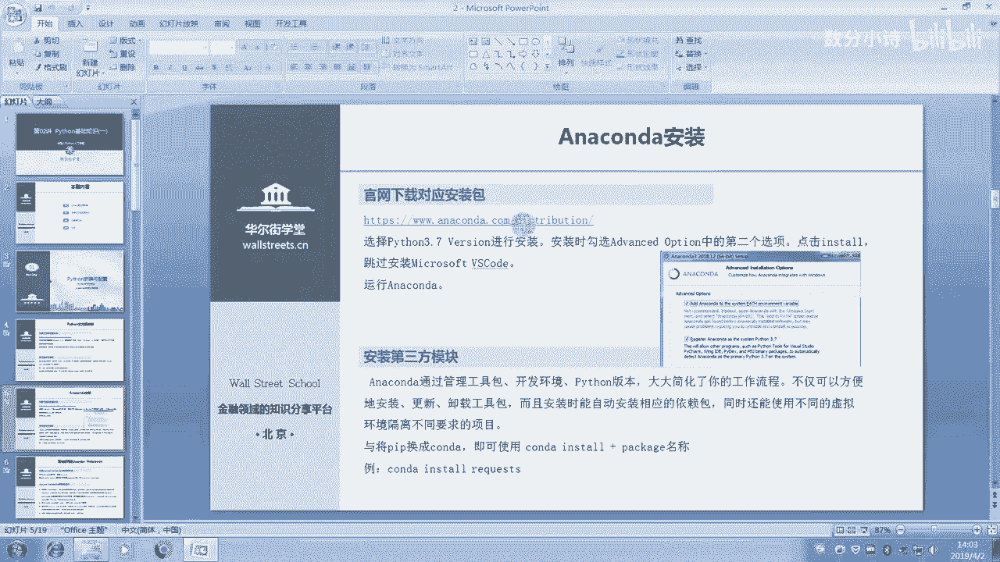

我们把python这个undercon的这个网址呢复制到浏览器。那么打开这个网址啊，我们可以在里面找到这个noconda的一个下载。大家的网络的话呢呃这个。

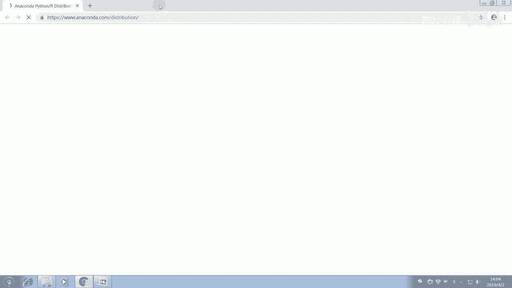

地方呢直接打开这个网址。根据网速的不同呢，打开的速度也会不一样，耐心等待。那么这里呢我们看见有个download，我们直接点击这个download，它就到了这个下载页面。那么根据大家的电脑的型号。

一般来说的话，可能听我们这个金融python课的同学呢，大部分呢都是用windows版的电脑。那么我们就只需要选择windows系统，下面的python3。7的版本。那么我们可以根据各自的电脑类型。

看一下这里是64位还是32位。那么选择一个安装。

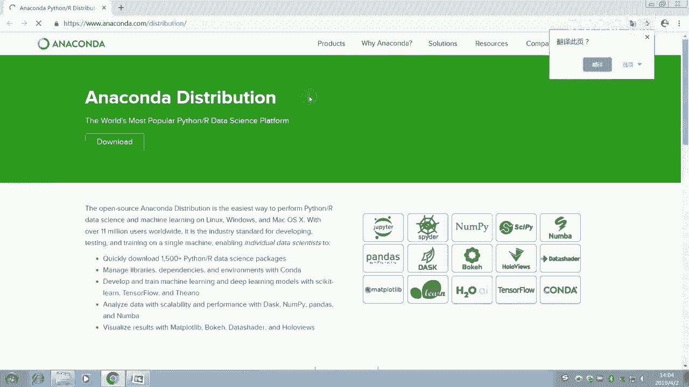

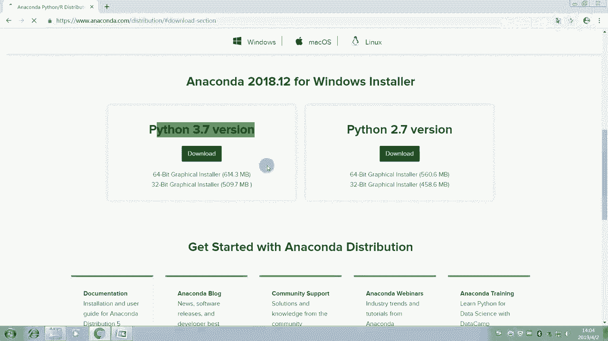

这边呢直接点击呢就可以下载了。那么我们已经下好了，所以呢我们直接回到这个桌面。那么我们在这边的话呢，已经下好了，大家也可以从我们提供给大家的课程资料里呢，点击这个underconda的一个安装包。

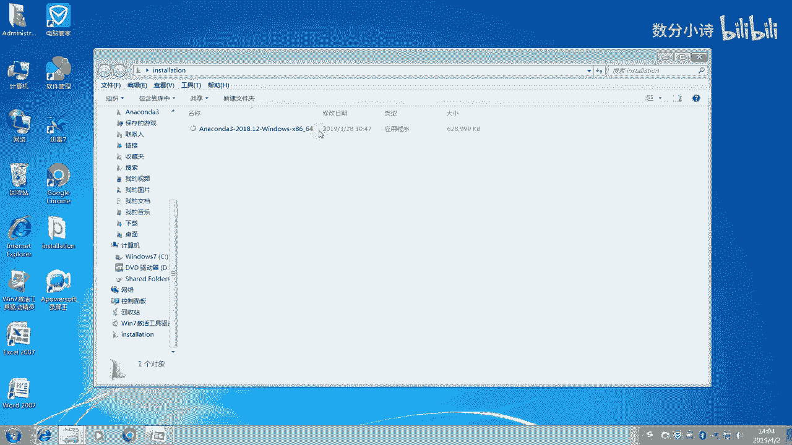

那么点击以后呢，这个al康的安装包呢就会运行。It。那么我们等它演示给大家看一下这个underconda的一个安装过程。当然呢，因为underconda的一个完整安装呢需要10到15分钟的时间。

所以呢我们最后一步呢，我们就不点击执行。但是我们把前面的一些选项给大家讲一下。这里呢我们直接点下一步，同意。然后这个地方可以点只给我或者说所有人都O。那么下一步，那么选择一个你的安装位置。

我觉得一般默认就好了，默认就好了。那么下一步啊，当然这个地方再点下一步，因为我已经装过了啊，所以这里我没有办法再继续装了。那么。你再点下一步的话呢，就会出现我们这个屏幕上的这个图片里面显示的这个页面。

这有两个选项，我们把它都勾上啊，都勾上。那么python的那个除了它的一个基础的一个呃那个终端，那么还有其他的那些包括其他的那个呃我们之后要用的一些模块呢，都会被自动的安装进去。

这样就避免说大家在自己使用的过程中要自己安装很多包，然后出现一些bug的问题。好的，那么我们这个就呃已经安装好，已经安装好能康da的话呢，大家在安装过程中不要着急啊，到最后一步的话呢。

大家可以跳过安装这个microsoft VS code。它会提示大家啊，可以是不是选择安装这个microsoft的 v code，大家呢可以选择这个不安装这个micsoft v code。

那么我们呢呃可以运行undercon。那么我们可以看一下电脑呢，这边呢就会有这个an conductan conduct了。那么实际上呢我们也可以不用打开它。

我们这里的话呢着着重介绍一下这个an conduct prompt。这个呢可以看作是一个an conduct的一个终端。那么大家看这个格式呢风格非常的像我们windows里面的这个命令行，对不对。

那么我们等待这个终端的打开。好，那么在终端里面呢安装一些包的话呢，比如说或者模块的话呢，我们把这个pack。那么也就是说用conda这个命令加上一个installinstall是安装的意思。

那么再加上这个模块的名称就好了。比如说我们要安装一个requests模块，那么只需要conda installst requests就好了。当然这个具体是什么意思呢？我们现在呢先不用理解它。

我们只需要知道啊，大概是这个样子来安装的。但是呢conda里面呢大部分的模块已经帮你安装了，所以呢呃这个的话呢，大家可以先不用去急着呃知道要安装什么，我们急用即学急用即装。

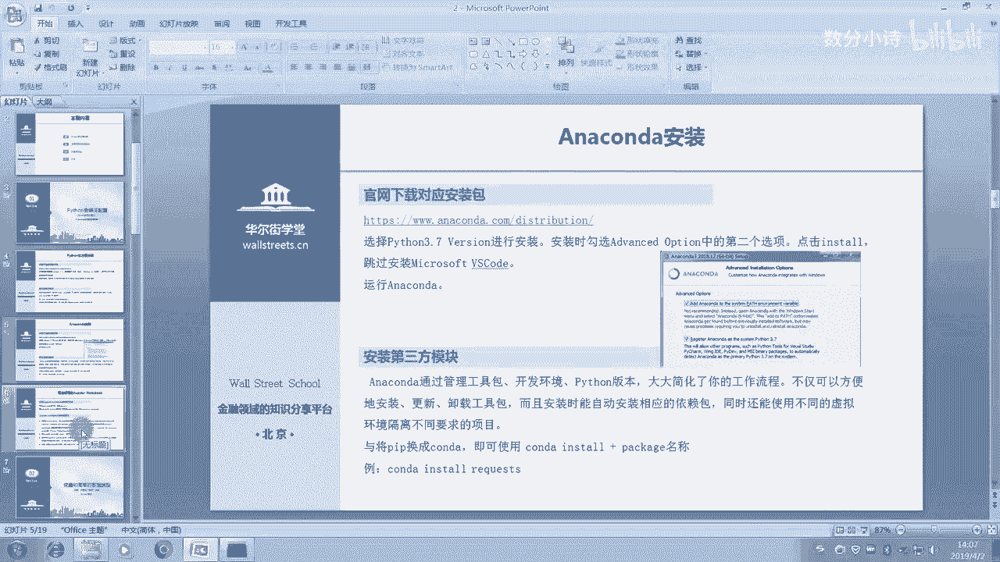

好的，那么我们的。呃conda已经安装好了，那么大家可能会想说呃我们具体在哪里去学习我们python的语法呢？我们怎么去呃把这个代码，把这些pyython的语法知识掌握呢？

那么我们想说啊我们需要一个比较好的一个软件，或者说交互式的一个平台。那么在这里呢我们就逐渐呃重点推荐的就是那个jupiter notebook。包括本书本我们这个课程的后续的部分呢。

也会使用这个jupiter notebookbook进行一个讲解。那么这个平台的话呢，也是一个非常好用，非常轻量化的一个平台。那么我们打开这个终端呢有两种方法，一种是呢打开annoconda客户端。

比如说我们看这边啊annoconda的客户端就是这个啊这个圈圈绿色的圈圈analconda navigator啊，或者大家发现这里直接有jupiter notebook book，直接点击也是可以的。

直接点击也是可以的。那么我们介绍一种方法呢，就是你打开终端在这里输入。啊，我们输入jupiter。notebook啊，在这里直接输入jupiternotebook。那么这个时候呢，稍微等一下。

它就会弹出一个浏览器来啊弹出浏览器。那么我们可以在那个浏览器里边操作这个jupyter notebook。

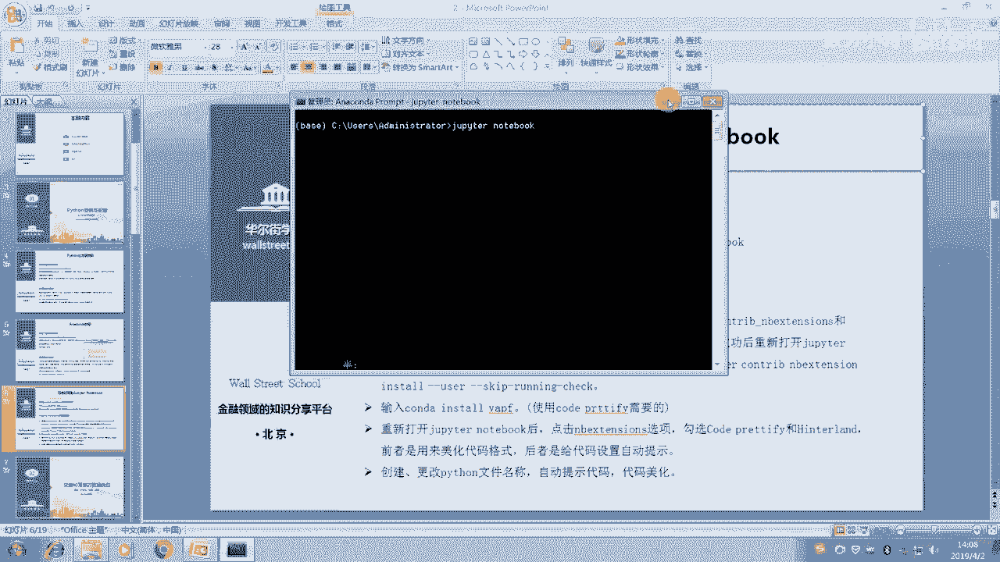

Yeah。好的，那么这个jube的notebook呢已经打开了。He。好，我们发现呢这里有很多文件啊有很多文件，这是为什么呢？这是因为啊我们可以看一下上面我们这个运行之前的这个前面这个位置是在哪里。

我们发现是C盘的usersadminist里面，那么这是一个什么含义呢？这就是说啊我们是在这个以这个为工作路径运行的jupyter notebook book。我们来看一下C盘。

我们的C盘的用户的administr，我们发现哎这个项目下面有这些文件，那我们来对应看一下这边是不是有一个under conduct，然后有一个有些些联系人啊，文档啊，音乐啊。

这就是表示这个呢其实就是我们的这个呃我们的这个。

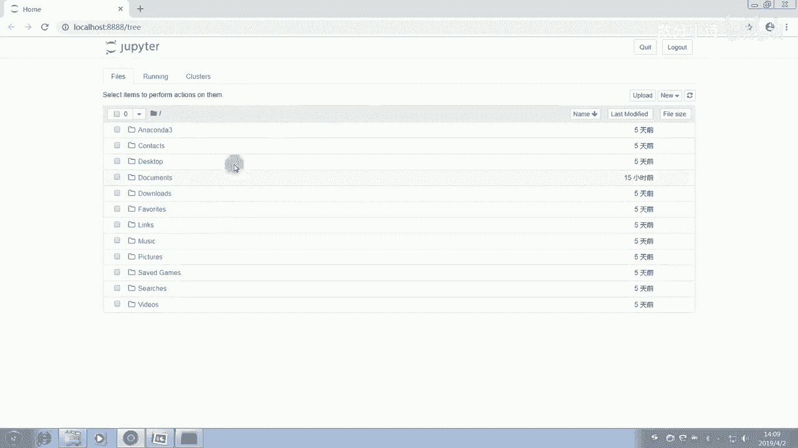

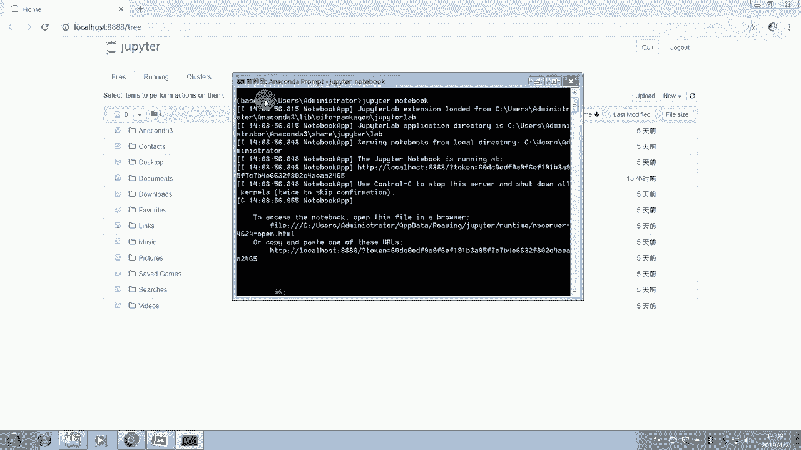

啊，工作目录啊，其实就在C盘的这个 administratorministr里面。那么待会儿呢我会教大家怎么更改这个工作目录啊。当然现在的话呢，我们来看一下，简单看下这个jupyter的一个布局。

首先呢这里是fis，表示这里都是一些我们的文件列表。那么这个running是正在运行的一些文件啊，目前是没有啊，没有终端和notebooks在运行都没有。那么cluster的话，大家先不用管它。

那么我们发现这里有三个主要的分类啊。

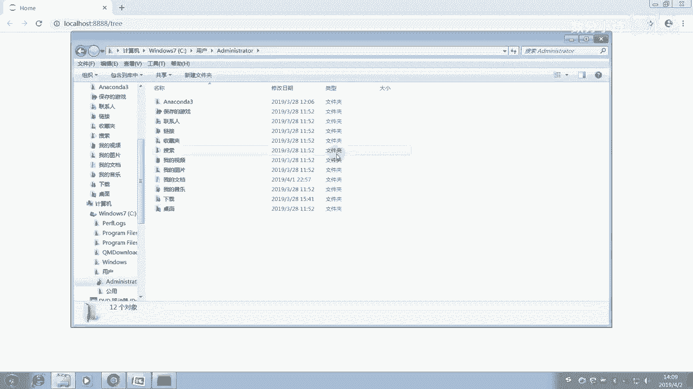

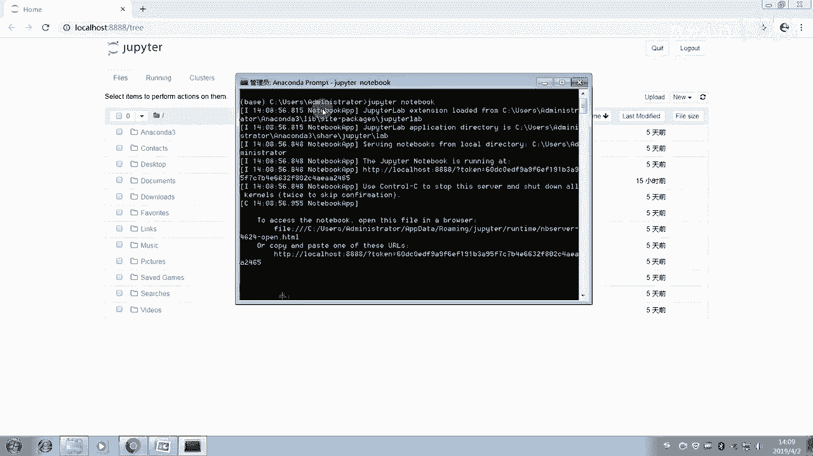

这里的话有个upload，可以上传一些文件啊，可以上传。那么这里个new，那么就新建。我们待会儿要用到的呢，因为我们现在学python嘛。

所以这点这个new这边有一个新建一个python3的一个python three的一个notebook。点击以后呢，它就开始新建这个notebook。Okay。好的。

那么我们打开了一个这样的jupiter的一个notebook。我们发现啊这个地方呃有一个untitled，是说未命名。既然未命名，呢，我们就给它命个名吧，给它命名叫做。

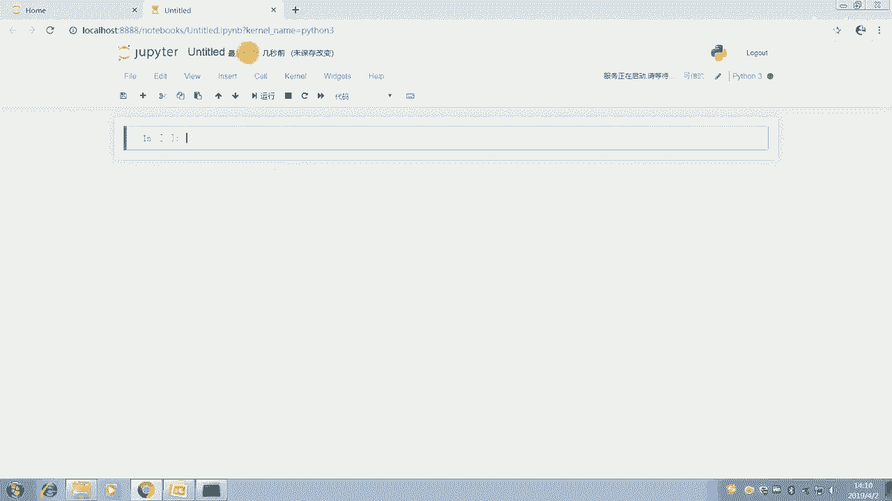

First。python file第一个python文件。好，我们就叫它firstpyython file，我们给它重命名一下。那么这第一个pyython文件，我python文件我们就给它命名了。

接下来呢我们看一下啊这上面的一些功能。比如说这个fire的话呢，就是一些文件的一些选项。比如我们把它保存成什么样重命名啊，保存一个这个还原点啊，或者说还原到上一次的还原点啊。这个的话呢功能呢。

我们在使用的时候还会详细介绍，我还可以把它下载，下载成不同的格式，比如说python文件格式啊，notebook文件格式啊，或者HTML的格式啊等等等等。

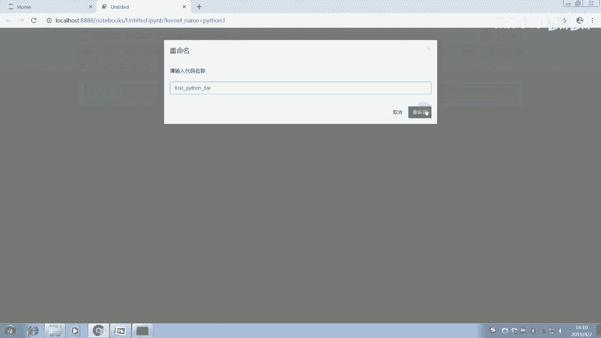

那么包括我们可以对它这个进行编辑啊，比如说复制啊，我们把这个这个蓝色的框框呢，这种一个一个框框呢，我们把它叫做cell细胞嘛。CELL啊，我们把它叫cell。

那么我们可以把它进行上下移动啊或者合并啊等等这些功能啊，这些功能，大家可以看一下这些单词的话，如果有不认识的话，可以在那个词典里查一下啊，都是很简单的一些常用单词，那么will的话呢。

我们可以先不用管它啊，我们可以看insert，就是插入一些这个格子啊，比如在选择的这个区域，我们现在选择这个区域，我们在它上面插入一格。哎，我们在选择这个区域，在它下面插入一格。这样的话呢。

插入很多个sell。那么在选择sell的时候呢，我们发现这里有运行等等等等啊，运行所有上面的和所有下面的这些。那么核心的话呢，我们先不用管它啊。

这里有个rece reconnect和 restart重启，包括中断等等。好，help的话，这里重点给大家讲一下，这个help的话还挺好用的。第一是keyboard shortcuts，就是一些热键。

或者说我们说的快捷键。

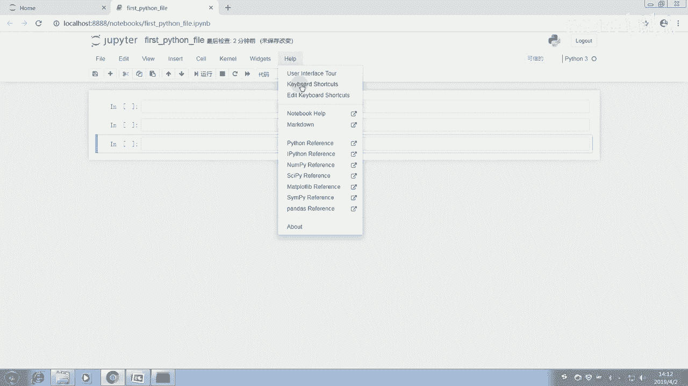

快捷键的话呢，大家可以看一下啊，这个python呢它这个tubit notebookotebook呢有两种模式，一种叫编辑模式。这种呢是我们在写代码时候用的模式，还有一种模式叫做命令行模式啊。

命令行模式，你要按一下这个CSESC，然后就会生效。那么这里呢列举了一些这个快捷键，可以让大家方便的这个在输入的时候更方便啊，可以不用一直拿着摁着鼠标，因为一直按着鼠标的话，其实这个也会影响工作效率。

有可能。

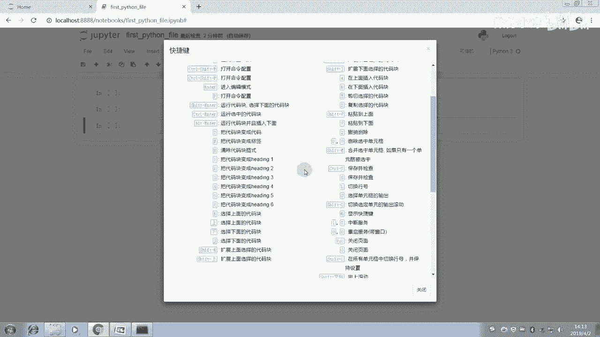

那么我们看一下这个地方，比如说我们怎么进入这个命令行模式呢？或者说怎么进入我们这个工作模式呢？我们看一下啊，一种呢是编辑模式，一种是命令行模式。那么我们只要摁ESC这个按按钮。

也就是键盘左上角这个按钮摁一下，哎，我们发现这边变蓝了，对吧？它就进入了这个命令行的这个模式。我们摁一下回车，哎，我们发现这个地方开始闪动，也就是说我们可以输入一些内容了，比如我们随便输一些字母，哎。

我们发现可以输入了。那么这个颜色也变成绿色了。这个时候呢它就是处于我们的一个编辑模式，也就是你可以在这里输入代码了。

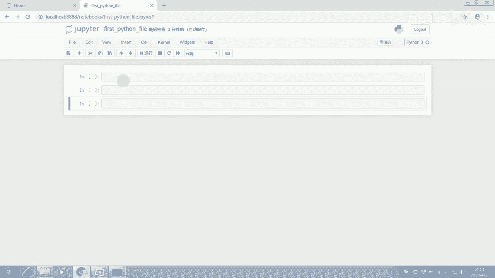

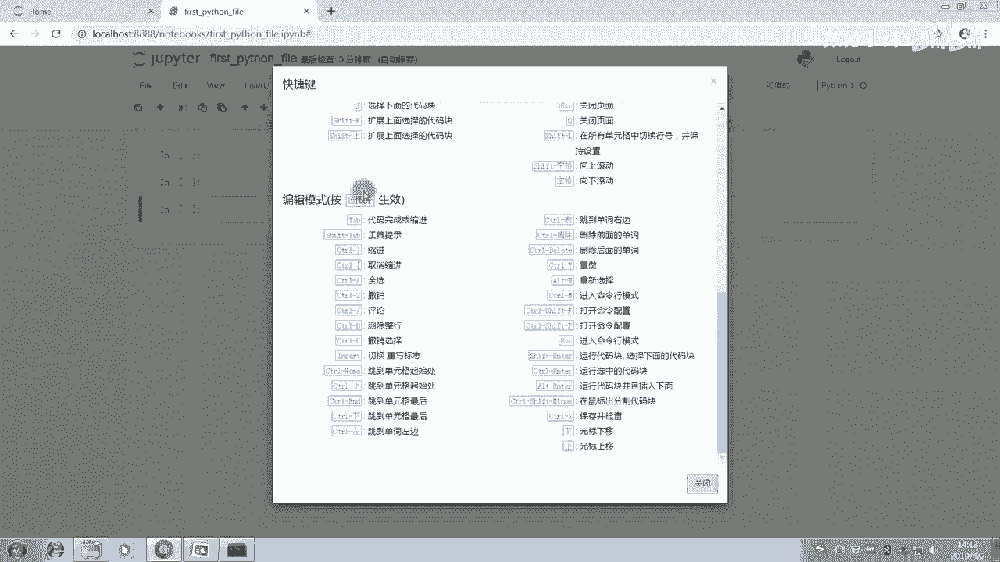

好的，那么接下来呢我想给大家讲一下，我们这个juby的note book，大家发现还是非常简洁，非常原始的。那么在真正的使用过程中呢，比如说我们现在先不用这个book了，我们把它保存一下。

然后就把它关掉。😊，好了，那么我们发现这里就多了一个firstpyython file，对吧？那么在这边呢还是比较原始的。

所以呢在这个我们先给大家讲一下我们怎么配置这个jupyter notebookbook，我们把这个关掉啊，然后在这个页面呢，怎么退出呢？我们在con里面只要control加C controll控制键啊。

键盘左下角的control加C，我们就把它给中断了。中断以后呢，我们现在来配置一下我们jupiter notebookbook，给大家加装两个特色的工具。

一个是我们主要是加装我们这个NB extension这个插件。

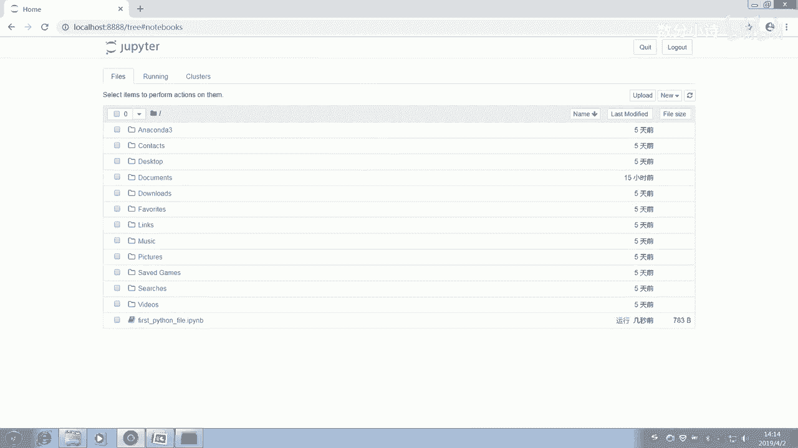

我们现在复制这一句啊，我们这边有写，先在cona终端里复制这一句，我们右键粘贴，然后回车。好，这个时候呢它就开始这个安装我们这个jupiter control andB extension这个控件了。

那么这个安装时间呢，根据电脑的不同和网速的不同呢，时间是不一样的。一般来说平均要花费15到20分钟的时间。所以呢在安装的时候呢，大家千万耐心等待，不要中途关闭它，以免造成错误。呃。

我们看这里的话呢也是装到90%多了，它的速度呢也是比较慢的。那么我们耐心的等待它安装完成。OK我们这边应该是快要安装好了。Yeah。Yeah。Okay。好的。

大家看到这里有一个successfullybu这个jupiter MB extension啊。OK了，它已经这个第一部分已经装好了。我们接着把第二部分这个把这个控件给它插安装进去啊，依然是同样的操作。

ctrol加C复制，然后在这边右键粘贴，我们把它给回车敲入。那么等待它这个控件的一个安装。那么依然是耐心的等待一下，这次会比上一次要装的快很多。好，大家发现这个地方有一个这个也是已经完成安装了啊。

这个地方也完成安装了。好，那么我们装成功以后呢，我们现在呢呃一次性把这个YPF也装掉啊，这个conductint把这个也装掉，一样的把它给粘贴进来。回去安装。啊，大家注意啊。

这里呢它有一个proced的，就是说是否继续运行下去。我们只要输入一个Y，让它继续运行，然后就可以了。那么它已经开始安装了。这个YPF这个控件呢，其实只是刚刚那个NB extensions里面的。

我们说呃给它加装一个，我们待会儿的那个代码美化部分。因为考虑到啊大家刚刚开始学习这个python语言，对于python的相关的语言的基础规范呢可能不是很熟悉。所以呢在编写代码的时候呢。

往往可能导致呢代码不够规范。那么我们呢就给大家装这个控件的话呢，也是说呃起到一个帮大家美化代码的一个作用。那么我们现在呢已经安装完毕了啊。安装完毕以后呢，我们现在可以登录jupiter。啊。

我们安装好了这个两个插件以后呢，我们现在讲一下怎么去改变这个jupiter的这个notebook的一个工作路径。我们发现啊我们这个地方呢，因为我的电脑呢是只有一个盘的啊，我这个只有一个C盘。

所以呢我们就打开计算机啊，打开C盘。比如啊我想专门在C盘里面呢建立一个文件夹，它就是我们的jupiter的工作路径。那么我给它命名就叫jupiter。Working。Pass。好，我就叫这个名字。

那么我们只需要打开它这个名文件。啊，我们复制这个工作路径。那么我们在这边输入这个CD。那么。把这个工作路径给他拷贝过来。

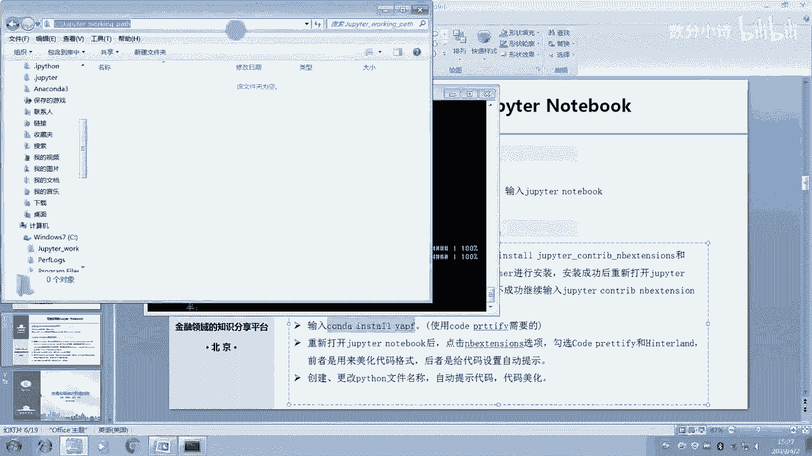

我们按一下回去了，哎，我们发现前面的这个工作的这个路径啊，就发现由这个base。users administrator呢改变成了这个jupiter working pass。

那么我们现在呢在运行jupiter notebookotebook。那么它打开来的话呢，我们的工作路径呢就会改变成我们现在这个开始的时候，就是打开jupyter book的时候的这个。

文这个地址名地址地址的位置，也就是刚刚我们复制粘贴的位置。好，我们发现这个地方现在呢是空的对吧？现在是空的这是为什么呢？因为我们刚刚是创建了一个新的文件夹。

这个jupiter working pass是一个新的文件夹，所以我们现在呢就可以把它关掉啊，先关掉。那么在之后的登录的时候呢，大家也是可以像我这样子选择一个工作路径啊，自己喜欢的工作路径去登录啊。

每次都可以进行更换。啊，我们刚刚说呢，我们装了一个NB extension这个插件。我们现在发现哎这个上面在刚刚三个的基础上多了一1个NB extensions。我们点击它打开来以后呢。

发现有很多很多很多插件。那么真正呢我们需要用到的呢，特别好用的呢？一个是这个code pretty，大家打一下勾。还有一个呢就是这个table of contents勾一下。这个后面有空的话呢。

我会教大家怎么使用，就table contents。那么还有一个呢就在这儿叫hiterland，这个呢是代码提示功能啊，非常好用。这三个我们先勾一下，那么回到jupiter的话呢。

我们现在呢呃新建一个python three的文件。Okay。Yeah。好，我们新建一个pyython three的文件的话呢，在这呢我们发现啊它还是untitled，那么改个名字。把它叫到。

还是叫first。Pthon5。

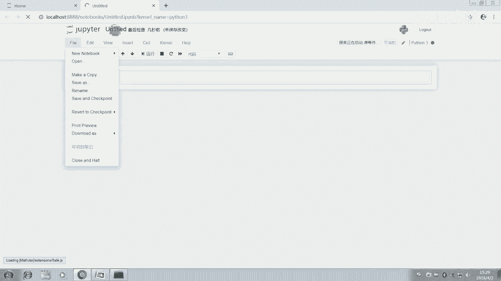

那么重命名以后呢，我们看一下，我们在这个地方呢输入呃所有的我们这个程序学习里面的第一条指令啊，print hello word。

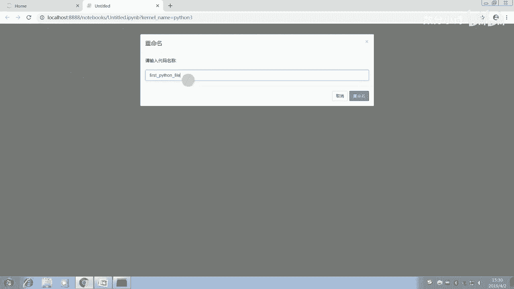

Yeah。我们把这个hello word这个打印出来。那么我们只需要点击运行啊，先输入print。那么我们发现pyython呢，它这个print后面呢，它的这个语法呢是跟了一个括号，对吧？

两个括号括号括起来内容呢，我们用双引号把它括起来。这样的话呢就表示啊我要打印这个括号里面的这个双引号中的内容。那么我们点击运行。我们发现这个hello word呢就被打印在了这个啊打印在了这个屏幕上。

那比如呢我们想print一些别的内容，可不可以呢，其实也是可以的一样的方法啊。hello，比如说我们换一个，那么对刘老师打一个招呼，hello。Outration。啊，Outre low。

那么对我打一个招呼啊，我的英文名。那么啊它就输出了。所以呢我们发现这个print呢，它是一个非常好用的一个呃函数啊。作为我们屏幕上打印出来一个这个内容。那么在后期呢，我也会给大家介绍很多print。

它有非常好用的一些功能。那么在这里的话呢，大家先把这个函数呢可以先记住，因为呢就是我们所有的程序的一个入门的最基础的啊，你接触到第一个函数呢，就是hello word。好的。

我们现在呢开始讲python的基础知识。那么变量和简单的数据类型。其实变量和简单的数据类型呢，它呃我们先讲一下变量吧，变量呢是什么东西呢？那么就呃大家都能理解，为什么呢？因为在我们这个小学啊。

我们就学过了，比如说我们学过用字母表示数，对不对？或者我们学过方程啊等等。我们说设X啊，设什么是X，比如说设一个变量啊，为X这个X代表什么东西，就是我们小学经常学的内容。那么呢其实在编程里也也是一样的。

比如说我们就假设啊这个X呢会是6会X等于6。那么这个式子的含义是什么呢？X等于六的含义呢？就是说啊我们把六呢，这个数字呢赋值给X。那么也就是说你一旦运行以后呢，X呢它的一个含义呢就是6，它就代表6。

那么我们输入这个X等于6以后呢，我们在python里呢有两种方式。

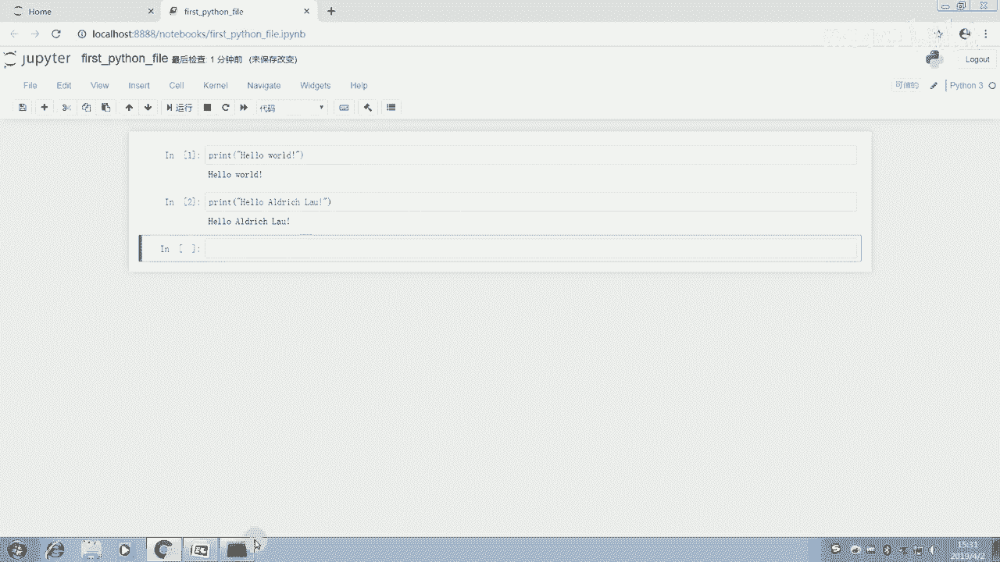

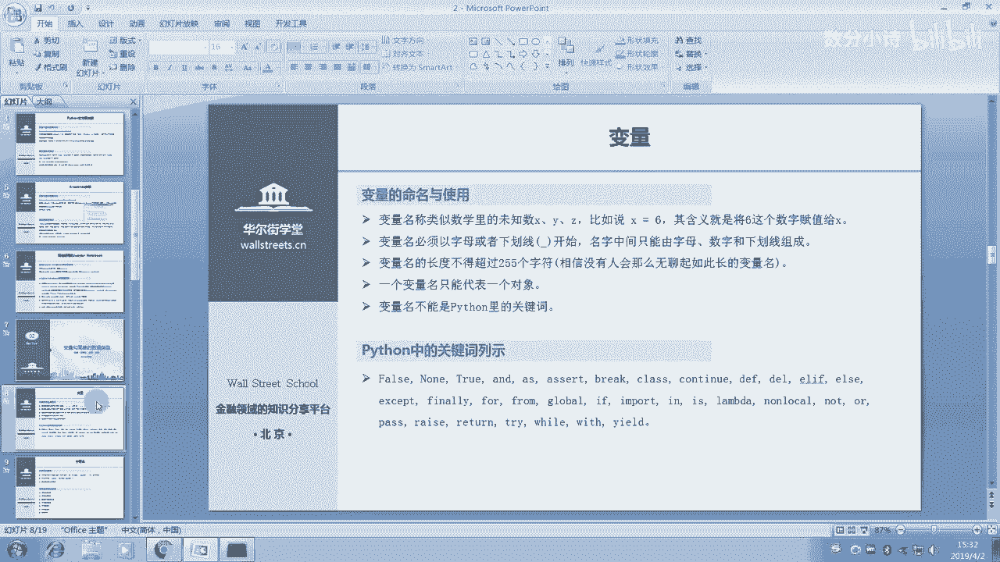

把X呢显示出来，一种呢是我们刚刚讲的print，我们把这个变量打印在屏幕上。另外一种呢是我们直接把这个X呢进行运行。那么因为我们在python这个jupiter的这个环境下面呢。

我们运行这个X呢相当于是在做一个交互式的一个我们交互式的一个一个操作。也就是说我们输入X以后运行的时候呢，这个时候呢pyon呢它这个解释中端呢会自动的啊，把我们现在这个X对应的个结果给我们返回出来。

那么以后呢在大家运行的时候想查看某一个变量啊，或者某一个呃这个包括我们以后的更多的数据类型啊，数据结构啊，它后面的一个它具体的一个情况。那我们只需要把它输进来点运行啊，在这种交互式的方式下呢。

就可以显示出以后呢就会有一个out输出它这个变量背后的一个具体的一个情况。好的，那么这个时候呢，也就是说我们把6啊这个值赋给了X。那么比如说我们再让X等于7，我们让X等于7运行。

那么这个时候X到底是6还是7呢？那么我们说啊python呢，你如果在后面呢，就是你重复的对同一个变量进行负值呢，它只会保留你最后一次负的那个值。那么这个时候的X呢，没错，就是等于7的。

那么如果我们再给X负一个8，那么它就会变成8。所以呢它只会保留同一个变量不停的负值，只会保留最后的那一个负值。好，那么是不是只能给这个X赋值这个数字呢？其实不是的，比如我们可以让Y啊。

我们设一个新的变量。YY呢等于几呢？我们让Y等于一个字符串，或者说等于一个，或者也就是我们刚刚讲的hello word可不可以呢？像我们刚刚上面打印的这个hello world，我们运行一下。

对我们发现没有问题啊，我们现在选YY的话，我们点运行。发现AY它就代表了这个hello world。所以呢我们我们就知道了啊，这个python的这个变量呢实际上是什么含义呢？

它就是说啊是一个像我们数学里的这个未知数一样。那么它主要是由字母啊等等来组成的。那么python的变量命名呢是有一些规则的，它的变量命名呢必须以字母或者下划线开始，不能瞎命啊，就是说什么意思呢？

就是说这个必须由字母和下划线开始，没有这种变量。比如说我们变量是1X，有这种变量吗？我们来试一下，比如我们让EX等于6，那么我们运行一下。

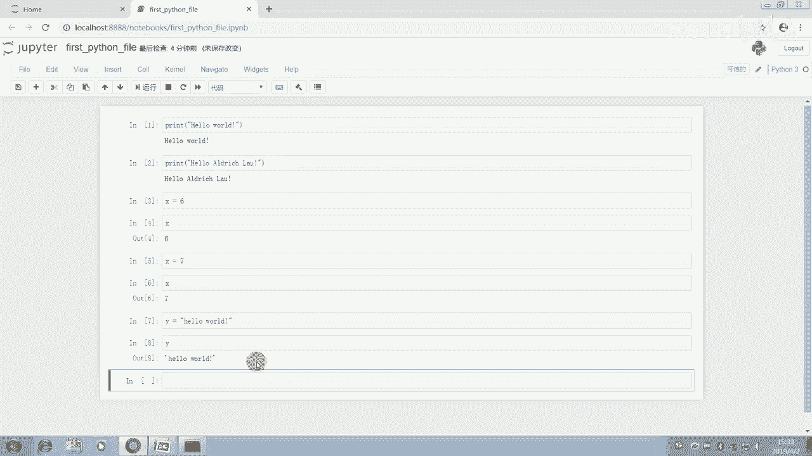

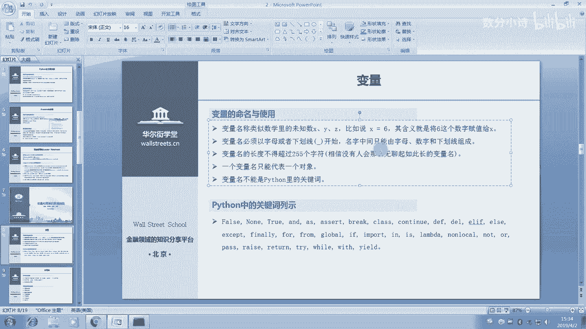

哎，这个时候呢它出现一个错误，我们看一下这个fire这个on哒哒然后 y也就是说第一行这个EX等于6这个地方它出现一个syntax error。好，凡是出现报错呢，大家千万千万不要紧张。

你千万千万不要因为说自己在刚开始学的时候呢，用thon呢出现了很多语法的报错，就丧失信心。每一个人在学习的过程中呢，尤其在学计算机语言的过程中呢，肯定会出现这个错误的。那么出现这个错误并不代表着什么。

并不代表着你不行，而是代表什么呢？而是代表你在这方面并没有符合他这个计算机所能理解的内容，你必须要让他能理解你O因为计算机它是固定的，而人的思维呢是活跃的。

这里呢他就告诉了我们syntax error这里一个语法错误。那么inval syntax就是表示啊这个语法呢是无效的。为什么无效。我们刚刚说了，你不能以数字开头，必须以字母或者下划线开头。

我们把这个一改成下划。线X我们发现这个时候我们再运行一下，唉，OK了，这个时候没有报错。所以呢我们的下划线X呢就会等于6，包括我们用print下划线X把它给打印出来哦，print我们把它打印出来。

那么它也是6。好的。😊，那么我们再看一下啊，一般来说呢，变量的名字呢，它是有严格要求的，不能超过255个字符。那我也相信大家不可能说给每个变量命名都有255个字符那么长。那样的话。

你是使用起来是非常的复杂，非常麻烦的。那么一个变量名呢只能代表一个对象，也就是说你后期再对这个变量名重复的去。

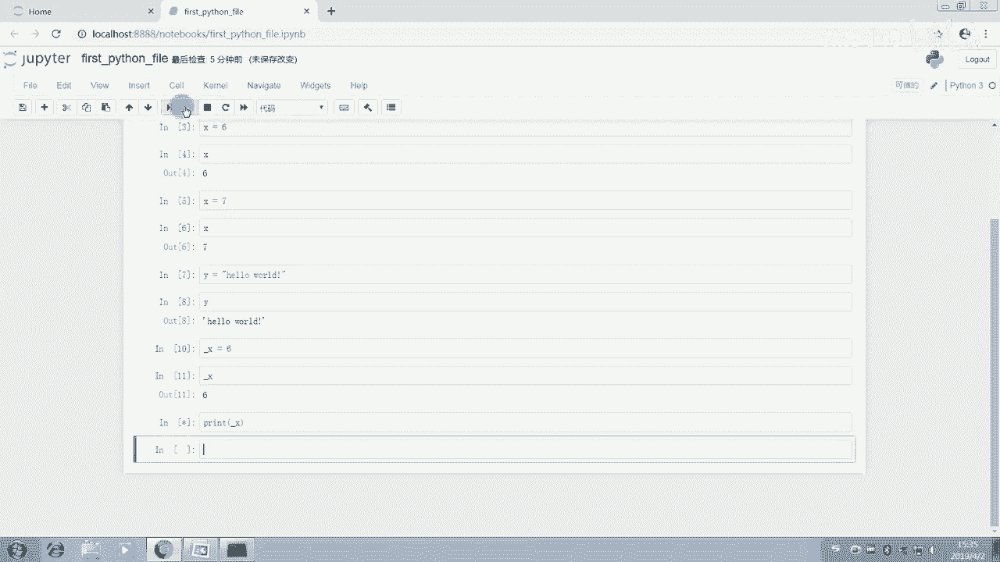

命名的话呢，它只会保留你后一次的命名。那么变量名它不能是python里的关键词，我也把python中的一些关键词列在了这个下方。那比如说foralse错误啊，n to and等等等等。

assert break，我就不一一念了。大家在命名的过程中呢，尽量要注意避免命这些python中的一个关键词作为这个变量的名字。在这里呢我需要再提醒一点的呢，就是。呃，在命名过程中呢。

pyon命名呢我建议大家呢还是要有一定的呃含义的去命名。这样呢使用起来呢也会更加的。

什么是有一定含义的去命名呢？就比如说啊你现在呢比如说我们在处理一个金融数据。那么这个时候呢你的变量名字呢最好呢把它处理成中文啊处理成英文的。比如说你要给一个公司的代码的名称命一个名。

那么最好呢就使用code这个英文名称，而不是使用X这个英文名称。因为你一看到code呢，你就知道这是公司的代码，你一看到name呢，你就知道这是公司的名称，对吧？那么你一看到这个比如说PETTM。

你就知道是公司的一个动态的PE，你看到PB，你就知道是公司PB而这些呢，如果你临时的用X用Y用Z用ABC去替代的话，你就会发现你的命名呢在会真正的运行程序的时候非常混乱。

你至于最后呢你都自己不知道自己要调用什么名称了，所以呢建议大家呢用有含义的，能够代表这个变量真实的经济含义的这个金融含义的这个名称。好的。我们接下来呢看一下python里面的变量类型啊。

刚刚我们讲的变量是什么？变量类型呢，其实我们刚刚也涉及到两类，一类呢是数字，一类呢是字符串。那么我们把这种没有用引号标起来的数字呢，我们把它叫做数字。我们把这种用双引号括起来的这个中间的有内容的这个。

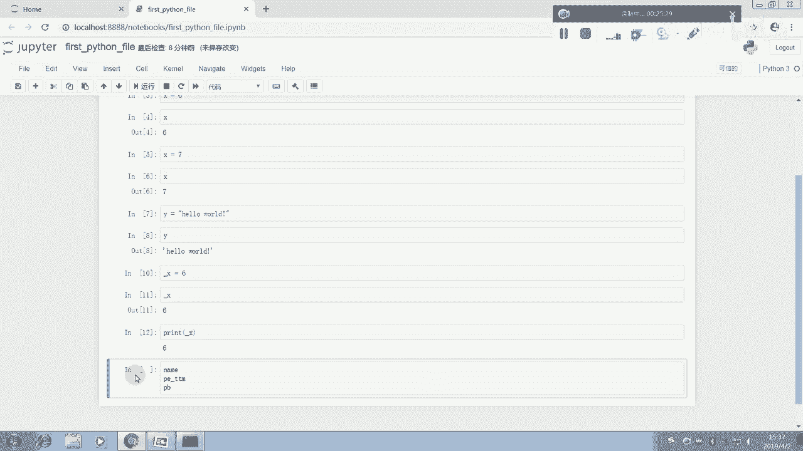

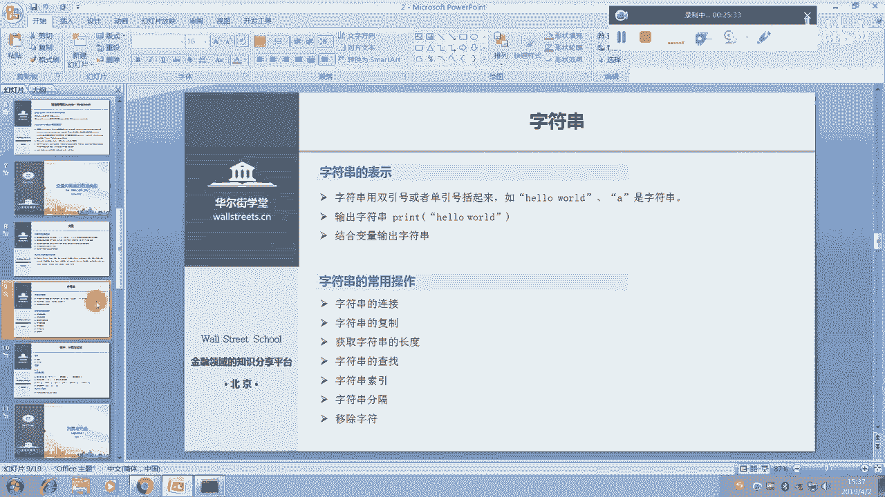

这这这这一串呢我们把它叫做字符串啊，我们把它叫字符串。那么变量呢主要有这两类类型。那么怎么查看变量类型的？呃，我先跟大家删掉一下这个上面这些内容啊，因为太多了，我们把它们全选起来，按住ESC啊。

我们看快捷键里有1个ESC，然后再一直摁D啊就可以删除。那么我们在这里呢，我们先看一下啊，比如说我们一个变量是X等于6。还有一个变量是Y，你看为什么呢？我们安装了这个NB extension以后呢。

大家有发现吧，我们每输一个字符呢，它就会有提示，下方你可以进行选择啊。Y呢我们让它等于比如说等于这个hello world。好，大家发现啊我这里用的是单引号，对吧？其实呢在python里呢。

你单引号双引号呢其实都可以表示字符串来啊，都可以用都可以用。那么一般来说呢，我们习惯是在表达一个句子的时候呢，我们用双引号把它括起来，表达一个单词的时候呢，或者表达一个啊单独一个词语的时候呢。

我们用单引号把它给括起来。那么在这里呢我们把这两个变量呢啊命呃复值一下，就把六赋值给X，把hello word赋值给Y。那我我们点一下运行。号它已经运行好了。

这个时候呢呃X肯定是6Y肯定是hello word。我们怎么查看变量类型呢？我们只需要输入type X。啊，我们发现这里输错了啊，是type TYPE啊型类型。你发现这里有提示的点向啊。

所以呢TYPE啊我们运行一下，我们发现哎他告诉我们int int是什么呢？就是integer的书写啊，integer的书写。也就是说啊这个X的类型呢是整数啊。那么type我们再看一下type Y。

我们点一下运行啊，type Y的一个，我们开发下是STRSTR呢就是str的一个缩写。STRINGstr的一个缩写。所以呢我们就知道啊，原来X的变量类型呢是整型整数型。那么Y的变量类型呢是。

字符串的类型啊，是不字符串啊是str文本的类型。那么还有没有其他的变量类型呢？其实是有的啊，包括我们这个我们如果让一个Z啊变量会等于1。6，那么它也是属于数字1。6，对不对？它是一个小数，那我们点运行。

我们发现好，typepe Z。type is的话呢，我们看一下啊，并行哎，float floatat呢它表示的是浮点数啊，float是浮起来的意思嘛，它的就是一个浮点数。

所以呢我们发现啊python的数字的类型呢主要有整数和浮点数，而python的这个字符串的类型呢，那么就是我们刚刚说的这种用双引号把它给括起来啊。hello word这种就是字符串的类型。

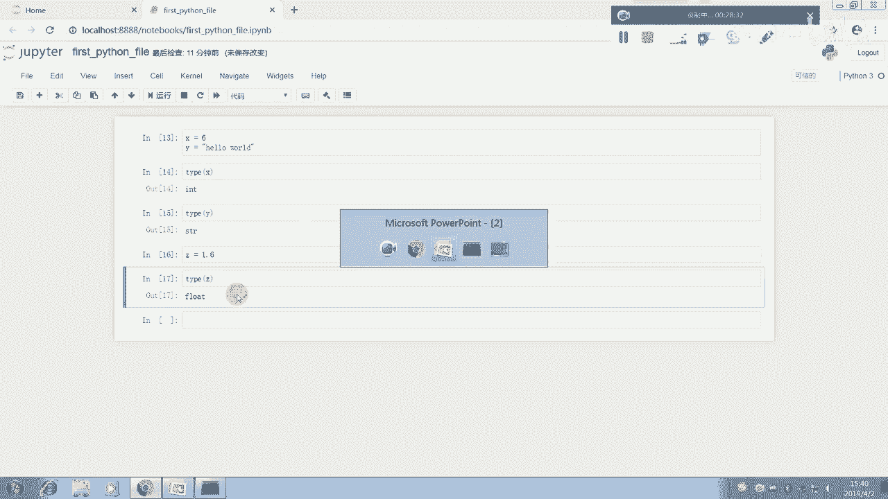

好，我们介绍这两种类型以后呢，我们先介绍字符串的一些常见的操作。我们先介绍一些这个字符串的常见的操作。我们发现啊字符串的话呢，它有好几个比较常用的操作，我们先来。简单练习一下其中一些操作。比如说。

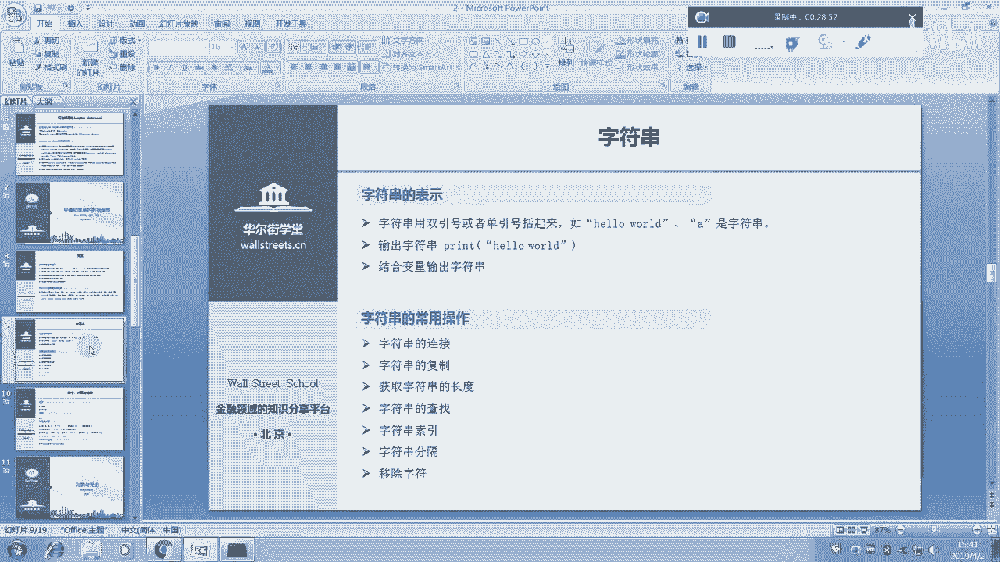

我们前边一个字符串呢，我们用hello表示，因为是个单词，所以我用单引号把它括起来。后面的一个字符呢，我们用比如说我们用eldeld啊，我名字，那么我们看一下，我们中间用加号把它连接。

那么我们运行下会发生什么事情呢？我们发现他们完整的贴合在了一起组成了一个新的字符串。那么我们还可以怎么做呢？比如我们在outage之前呢，我们给一个空格，那么我们再运行它呢。

我们发现哎它中间呢也空了一格。这个呢我们把它叫做字符串的连接啊，字符串的连接有是第一条字符串常用操作第一条字符串的连接。那么同样的我们接着看啊。

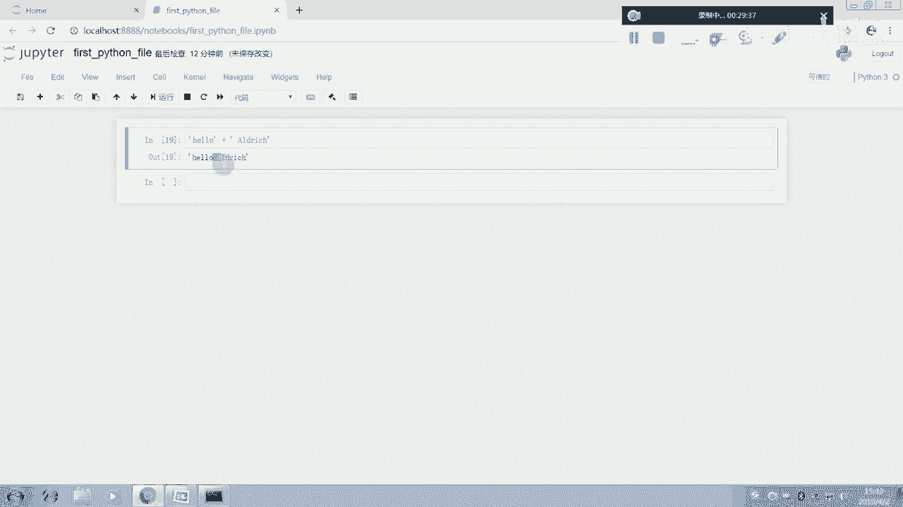

我们的这个字符串的连接呢，除了这样使用呢，我们还可以把它付给一个变量。比如说我们让X啊等于这个字符串，它相加。那么我们继续点一下运行。

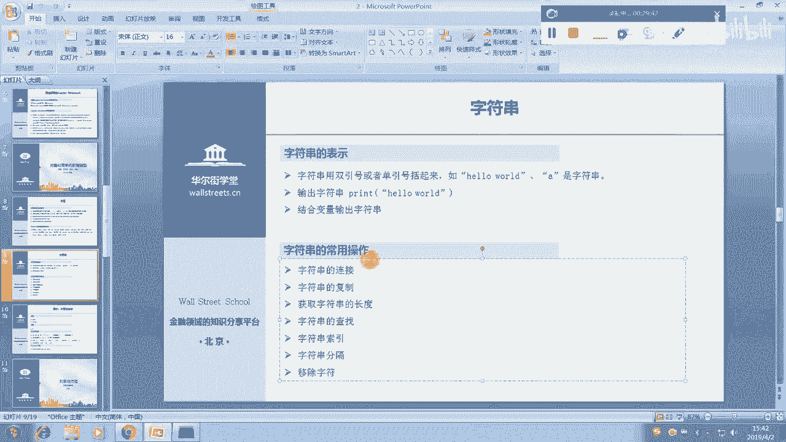

那么我们在这个时候呢，把它Xprint出来。printnt出来，我们打印这个X这个变量，发现哎，hello艾 rich就被打印出来了。Yeah。同样的我们再讲一下字符串的一个复制。字符串怎么复制呢？

比如说。Hello。outrich我们对它进行复制，那么就乘以一个，比如乘以一个3，我们看一下会是什么结果。

我们发现啊这个结果呢就hellooutriachhellooutriachhellooutrich，它这个死就出现了。我们接下来呢，比如说我们单独对hello乘一个3。

我们发现唉这个hello呢就被重复了3遍。如果我们在这个地方加个空格再运行一下，哎，我们发现它中间就有了一定的间距啊，它就有了一定的间距，这样呢就表现的非常的和谐啊。好。

我们看一下获取字符串的长度的话呢，这个地方呢我们要介绍一个简单的函数，它的名它叫做Lmb啊，其实就是英文lenance的一个这个缩写。我们把它LEN就好了。那么我们在这边输入一个字符串。

比如hello这个字符串，我们数一下它一共是有5个字母组成的。所以我们预期呢运行以后呢，显示的数字应该也是5，所以我们点击运行，那么结果是5。好，我们接着呢来看一下这个字符串的查找啊。

我们刚刚已经看了字符串的长度。我们现在看一下字符串的查找。Okay。字符串的查找的话呢，也有两种方式进行查找。一种呢我们是用in这个符号来表示。那么比如说我们看一下，我们这样子输入一句话。

我们输入看一下E这个字母在不在这个hello这个word hello word这句话里面。那么我们点一下运行。

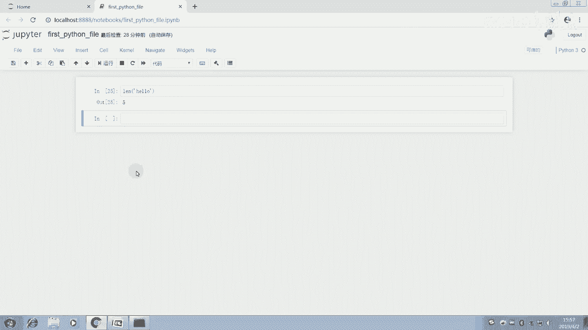

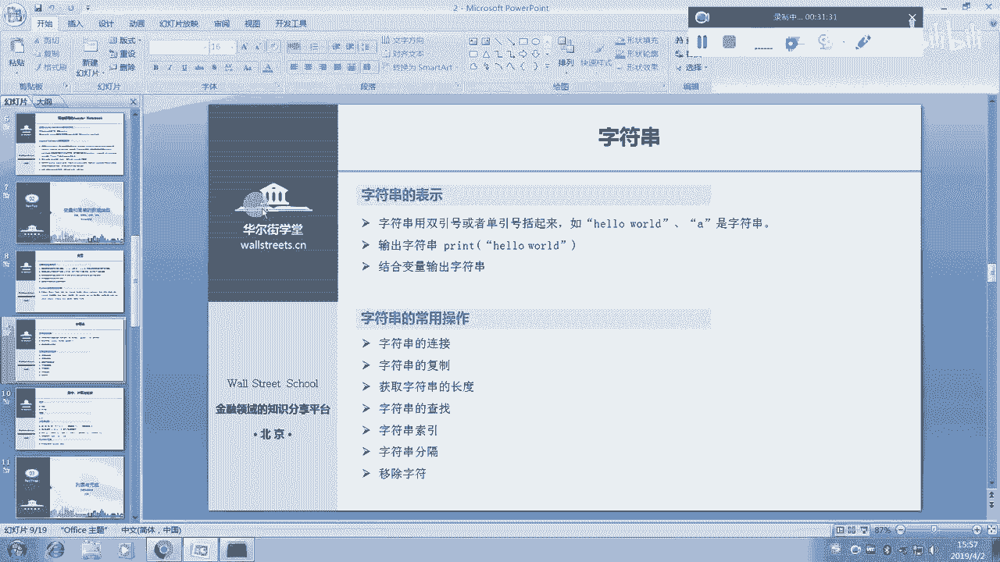

那么它返回一个Q，我们把这种Q呢叫做布尔值啊，布尔值布尔值啊，它是。一直接英译过来的英文名呢叫布偶布偶，所以呢翻译过来直接叫布尔值。那么这是一种我们来查看一个字符串在不在里面。比如说我们要查看另外一个。

我们查看A这个单词，这个这个字符串在不在hello world字符串里面，我们点运行。我们发现是for，也就是说不在啊， true啊在for不在。因为呢呢它认种2元的一个返回机制呢？

就在我们后续的一些超实际操作当中呢，也是非常有帮助的。所以大家可以理解，先记住一下这个word值 force and true啊。

包括这个A是不是在里面用A in hello word它会直接返回是否在里边。那么还有一种方法，那么是什么呢？是用find这个函数，就是寻找啊find我们说查找。find这个函数。

我们把要找的内容呢给它放进去就好了。我们把要找的内容给它放进去啊，A点finhello word我们运行一下，也就是说啊在这个。哦，sorry，这个地方呢应该是我们这样子hello。World。

然后呢点find我们在这个hello word呢这个str这个字符串里面呢，我们查找什么呢？查找这个A，看一下有没有A啊，我们点一下find运行一下，发现返回值是-一-一是什么意思啊。

-一呢就是表示啊我们没有找到这个A，所以呢返回的是-一。那么比如我们找一下这个E，我们找这个E运行，返回的是一一是什么含义呢？一是因为啊我们开on里面的位置呢？它都是从零开始的，所以呢对于H这个字母呢。

它对应的呢是位置零，对于E这个字母呢对应的是位置一，对于air这个字母呢对应的是位置2。所以呢我们知道它返回的一呢，其实就是我们这里的这个这个E这个字母对应的位置。那么我们就知道啊。

原来这个E呢我们找到了它是存在的。它在这个字符串的第二个位置啊，因为零是第一个位置，所以一呢是第二个位置。那么我们就知道hello word我们数一下确实意义呢是在第二个位置。那我们接着呢我们试一下。

比如我们要查找A，那它到底是返回的是第三个位置的这个对应的二呢，还是返回的是三呢？那么我们说啊如果呢它有重复的A的出现呢，它只会返回第一个啊，你最先从左到右最先找到的那个位置，那么它返回的呢。

我们预期呢，它应该是H是0E是1A呢，就应该是2。所以返回的呢是2啊，如果没有找到呢，返回的位置呢，就是-1啊。好的，那么我们再看一下这个我们对字符串呢可以进行一个索引。索引是什么意思呢？

就是用我们刚刚说的呀字符串的位置来对字符串进行一个选择它的一些部分内容。比如说我们。把hello world付给一个字符串。我们把hello word付给这个X这个变量。我们对X个变量呢。

我们后面用一个中括号啊，大家注意是中括号。我们在里面任意给一个数字。比如我们给零，我们想一下会出现什么呢？它表示的含义呢就是X在零这个位置的时候啊，它是是什么内容，我们点一下，那么在零这个位置呢就是H。

我们发现A确实是H。那么我们如果给它改成四呢，也就是叫第五个位置，你看第零第一个第二个第三个第四个第五个位置是O，所以我们预期它返回的是O。没错啊，就是O。那么这个呢我们把它叫做字符字符串的索引。

字符串的索引。那么同时呢我们如果对它进行4到6，比如我们是4到6。这是什么含义呢？它表示的呢？就是说我们从这个位置四啊，也就是说位置四其实就是第五个位置啊，第五个字符位置四呢或者说索引4到索引6啊。

我们运行一下，发现得到结果是O，哎一个这个空格。那我们把这个延长一些，比如说是7。运行一下，就是O和W。因为中间有个空格，这个空格呢也算是一个字符串。

所以呢比如说我们在这个地方衡量一个字符串的长度的时候，我们多加一个空格，我们发现哎它就变成6了。为什么呢？因为你空的这个空格呢也会把它算成一个字符，明白吗？也会算成一个字符。好的，那么在这里呢我们这个。

这个呢我们把它叫做字符串字符串的一个索引啊，比如说我们这个中间用一个冒号，中间用个冒号，就表示为这个索引4到索引7之间的这个字符。那么在python里面呢，它是左闭右开的一个区间。

也就是包括这个4这个位置，也就是包括我们这个O，但是呢不包括7这个位置，也就是不包括我们这个W后面这个O啊，也就是在我们7位置之前，四位置及四位置之后的所有的字符。

比如说我们用零到一那么显然呢就是说只有我们的第一个字母H。那么第二个字母呢，也就是E呢是对应这个索引一的是不会包含进去的，运行一下，发现只有H啊，只有H。那么这个呢大家要掌握一下。

就是对字符串的一个这个索引。那么字符串呢，我们还有一种呢叫做字符串的分格。比如说有一个字符串A。B。C哎，它用逗号隔开了这个字符串，那么我们可以用一个split函数。那么给他一个逗号。

我们可以用split把它给这个。我们把它给这个split在英文里面呢是破开的意思，我们把它给P开。也就是说把ABC呢根据这个逗号呢给它P开运行一下，发现哎，把ABC给它P开了，对不对？给它劈开了。

那么比如说我们要是如果这里是别的符号，比如说是一个这样的竖线，是一个这样的竖线，那么我们就把这个逗号呢也换成竖线，我们只要运行一下呢，哎，同样的结果，我们把这个ABC1个完整的字符串呢给它给劈开了。

那么还有一种啊我们可以移除掉一些空格。比如说有的时候你会发现A后面它有好多空格，对不对？比如说我们给一个X并定义X等于A运行一下，我们发现X运行一下。那么我们发现X后面呢有很多空格。

我们怎么把这就这个空格给消除呢？很简单，我们用。这个点sstrep方法啊，我们用这个方法。X点str方法啊，大家可以把这里的每一个变量啊，就像呃我们在上课刚开始的时候说啊。

python呢是一种面向对象的编程语言。所以呢我们可以把这个X呢看作是一种对象。那么对X后面打一个点呢，用一个strep方法呢表示对这个X进行一个操作。这个sstrtriip呢。

实际上呢就是把它进行一个字符串的一个压缩。我们一点。哎，我们发现这个A呢前后呢都没有空格了，对吧？都没有空格了，很好啊，这个我们就完成了这个工作X点str啊，我们把它给呃后面的空格给它消掉了，消除掉了。

好，但是呢这个时候我们要注意了，我们再输入X，我们运行一下，发现X呢依然是A，后面有空格，这是为什么呢？这是因为啊我们这个上面呢进行X点strip的话呢，我们只是单纯的对它使用了这个方法。

但是呢其实并没有修改X真正的啊它链接到的那个真实的值，也就是这个A这个变量。那我们怎么去对它进行修改呢？我们可以说把它重新的复值一遍。也就是说啊我们呢把X点strep这个东西。

就是把X进行压缩以后的值重新的复给X本身，我们再运行一下。那么我我们现在在输入X呢，就会发现这个时候呢，X才变成了我们想要的那个A，这也是我们在计算的过程中呢，千万要注意的，就是你的这个操作。

你的这个方法到底会不会改变它本身这个值。如果说不会改变这个变量的本身的值的话，那么你就要注意了。如果你是希望改变的话，你还需要进行一个重新的复值操作。如果你本身是不需要它改变。你只想看一下效果的话。

那你可以不需要进行这个赋值。好的，那么字符串的常用操作我们讲完了，我们接下来呢花一些时间讲一下数字的计算啊，比较。我们刚刚说啊数字呢主要有两种类型，一种呢是像三啊、5啊、1啊、0啊这种整数。

我们把它叫int啊int。那么还有一种呢就是像3。32。4这种啊，我们把它叫浮点数。那么可能有同学就会问了，像1。0这种呢到底是整数还是浮点数呢？那么刘老师，我我来说的不算啊。

我们来看一下系统怎么告诉我们，或者说python让pyython来说话，我们给他一个typepe1。0，看一下它的结果。

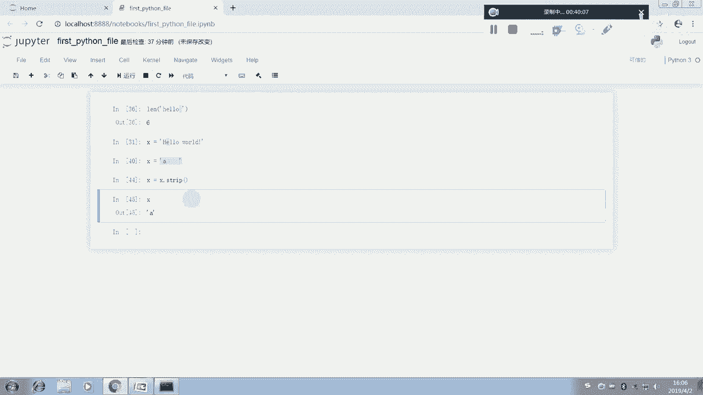

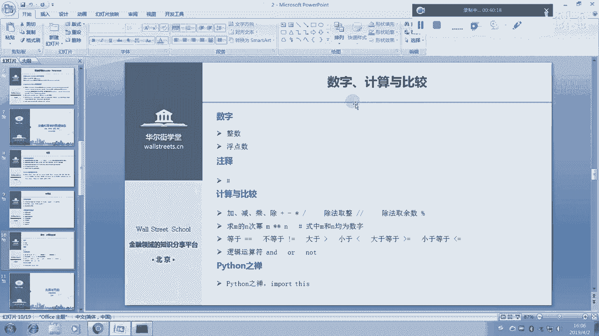

啊，系统告诉我们啊，python呢它这个终端告诉我们它的一个。类型呢是浮点数float。它的类型是浮点数。所以呢我们就知道啊1。0呢也是浮点数，0。0呢也是浮点数啊，也是浮点数。只要你给它加了小数点。

它就会成为浮点数。好，这里我要讲一个注释啊，这里呢介绍给大家。注释呢在python里呢，我们用井号表示。

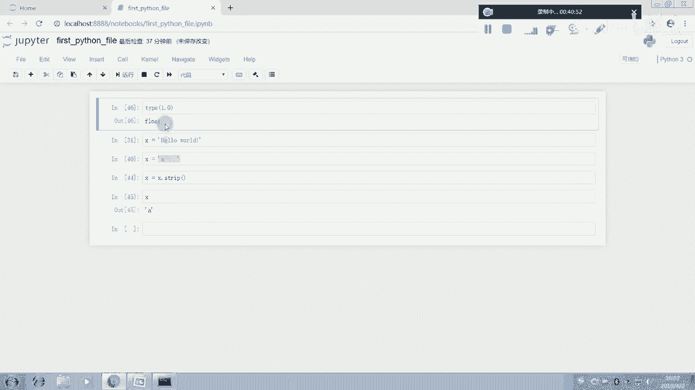

也就是说啊，如果呢你在这个字符前面呢加了一个井号，那么它这个字符呢就不会被执行。比如我们现在点运行是不会输出任何结果的。但是我们去掉这个井号呢，运行呢哎出现了结果，对吧？

所以呢这个井号呢在运行的过程中呢，可以屏蔽掉一些你不想要它执行的代码块，包括一些。

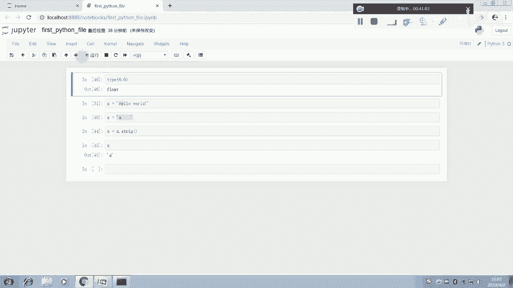

包括一些我们在调试的过程中啊，你怀疑哪一句代码有问题，你可以先把它用井号给它注释掉。那么等到我们真正啊先运行一下其他的那个代码，看看有没有问题。如果没有问题的话。

那很有可能就是这个我们注释的这个代码是存在问题的。接下来呢我们看一下python的计算和比较。python的话呢，我们先看一下pyython它有加减乘除等等运算。它的一个符号呢。

我在这个PPT里呢都列示给大家了。包括除法取整和除法取域。我们一一来演示一下。比如我们想计算二加10啊，这个数，我们只要写2加10运行就好了。那么结果是12没问题。那么我们十减9啊，我们十减9。

我在这里呢给大家讲一下，我们python一个书写规范啊，就说我们在写的过程中呢，我们一般习惯在这个地方啊数字啊和符号之间空一格运行一下，发现是一应现是一啊。

当然呢大家也知道我们刚刚其实是我教大家装了一个插件，对吧？比如说呢如果我们这儿不空格，但是呢你可以把它这这行代码选中，我们看一下这里有一个这个像格式刷一样的插件上面写了col pretty。

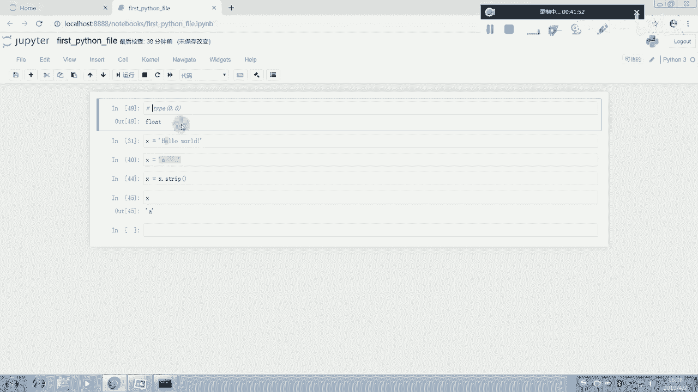

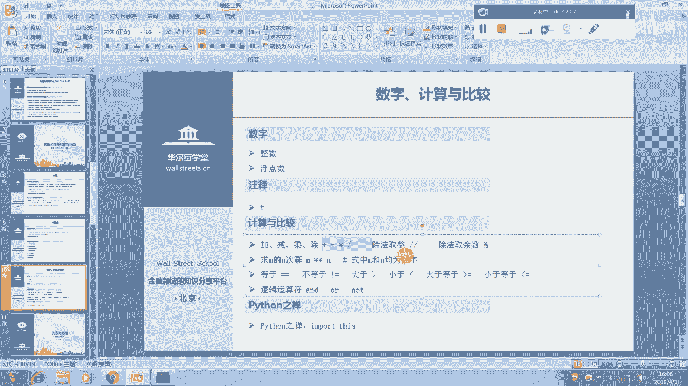

我们只要一点这个代码就自动的按照我们这个python里面的目前的最新的规范啊给它。美化了对吧？像这样就非常的美观啊，非常美观，空1个10乘9等于90。那比如我们要算10除以2025吧。

我们要算10除以25，我们一样的啊，点运行0。4啊，我们就可以算出来。比如说我们要做一个平方运算九的平方呢？平方是什么呢？是两个乘号就是平方，九的平方我们运行发现是81。那么我们要做一个取整的运算。

十0除以9啊，取整是什么呢？是呃这个取取整的是两个这个斜斜杠啊，两个这个斜杠或者两个这个除号点下运行，那么就是一。那么我们想做一个取取这个余数的一个运算。那么怎么做呢？

我们这个符号刚刚也有介绍是百分号百分号啊，我们运行一下，那么余十除以4余2啊，余2，我们这个一个取余数啊，取余的一个运算。好，那么我们把这个计算呢基本都讲了一下啊，计算都讲了一下。

那么我们现在讲一下这个python里的一个比较。有等于号啊，注意啊这个等于号和负值号是完全两个不同的符号。等于号是两个等号，我们把它用等叫做等于，而一个等号，我们把它叫什么叫负值。

刚刚我们在变量的负值的时候，是不是用的一个等号，比如X等于6是一个等号，而这里的X等于6，这里就是两个等号的话，就表示我在判断是否等于或者计算是否等是否等于在做一个判断。而刚刚那个等于一个等于号呢。

是在做一个负值号不等于呢，我们用感叹号加等于号表示不等于，那么大于小于大于等于小于等于跟我们excel里面常用的函数是一模一样的啊，包括这个呃不等于啊，其实也是可以个excel里是一样的。

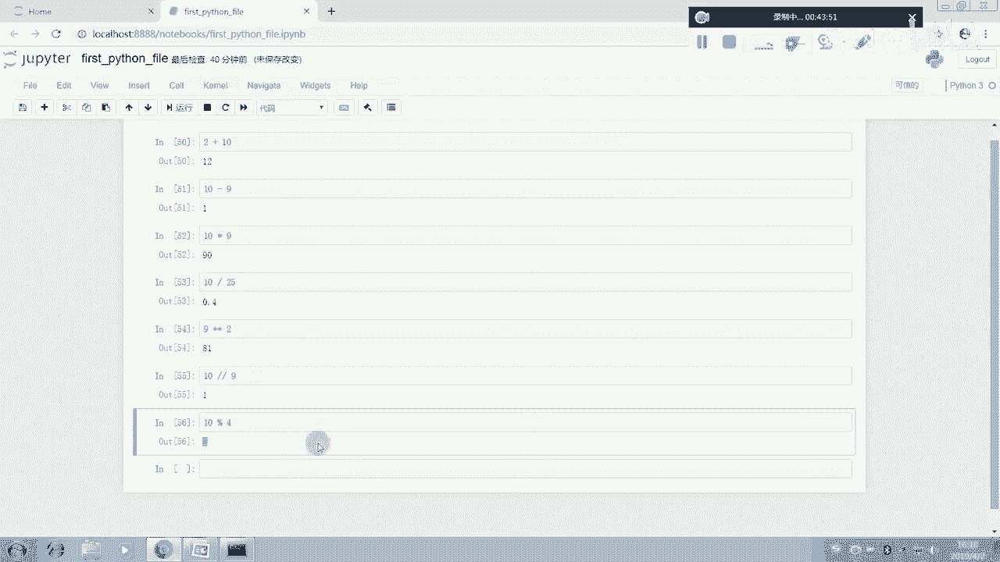

那么运算的逻辑符呢有and or not。我相信呢，如果有经常用excel办公的朋友呢，肯定是对end和or呢是非常熟悉的。这是我们一些条件的表示条件的时候常用的啊逻辑的一些运算符。

那么nt呢就是表示相反相反的意思。我们一一来看一下。比如这里我们输入二等于10，我们预期它的结果会返回什么呢？肯定返回不相等，对吧？肯定返回不相等。那么在python里面呢，二等于10，如果是错的话。

返回的结果呢就是forse。就是我们刚刚说的布尔值的结果forse。

那么我们再看二，如果我们说二大于10呢。那么返回的结果呢，显然也是force。那么如果输二小于十呢。那么显然是正确的Q返回一个Q。那么我们看一下呃，比如说我们在这里输入一个R不等于10。

那么它的返回的结果呢肯定也会是Q，因为二肯定是不等于10的啊。那么我们来看一下还有什么没有演示的吗？还有and和or好的，比如我们把两个条件，比如说二等于10。和一个2。和一个我们看2。等于9。

我们把这两个条件放进去，这两个条件都是错的，所以它的运行结果肯定是错的。而即使其中有一个是对的，只要另外一个是错的，因为我们end是就要求且，他们两个如果都对，才能返回Q，这个时候依然返回的是for。

大家注意看这里，但是如果说两边呢都是对的呢。比如说三等于3。啊，我们运行一下，我们发现唉因为这两个条件都是对的，所以呢and连接起来呢，它也是ch。那么我们可以看一下，如果用or的话呢。

如果用or的话呢，两个都是对的，它显然结果是对的。但是如果有一个是错的呢，一个是错的，另一个是对的，它结果也是对的。但是如果两个都是错的呢，那你or也没有用了。因为你两个都是错的。

你不管选哪一个都是错的啊，or呢就是或谁或谁，比如说他们两个中间只要有一个对返回就是ch。那么nt呢就很好判断了。比如nt。比如说我们用一个note2等于5。并行一下返回的就是te。为什么呢？

因为本身二等于5呢是一个force的一个错误的条件。那么note force force的反面呢是什么呢？当然就是去了，当然就是去了。好，这里呢我们就把这个python的这个数字方面的一些计算呢。

我们都讲掉了。那么在这里呢就想跟大家说啊，其实在日常工作中呢，你这个jupiter这个notebook呢，因为它本身就是一个你看可以像一个网页一样打开，它对内存的一个使用是非常少的。

所以呢各位呢在工作的时候啊，在学习的时候啊，都可以把它打开，打开来以后呢，可以把它首先呢当做一个最简单的计算器来使用。对吧当做一个计算器来使用。那么比如说我我们现在要计算一个简单的年金的一个问题。

我们金融学的话都知道年金。比如说买了一个保险啊，他以后每年要给我1万块钱。然后我们觉得啊这个经济的这个折现率啊，大概是5%，那么我们就用第一年呢就1万除以1。05。第二年呢我们用1万除以。除以1个1。

05的平方。python也是一样的啊，计算规范它也是先算乘呃，先算那个乘方，然后再算乘除，还有加减，有括号先算括号啊，python也是这样子。那么第二年是1。05的平方。那么第三年呢1万除以1。05的。

3次方。好，我们现在呢点一下运行。哎，我们发现它给它计算出来了。这样的话呢，我们pyython呢其实又是我们这个日常工作中一个非常好用的，起到一个非常好用的一个计算器的一个功能。

那么大家在使用这个python作为计算器的过程中呢，呃特别要注意的几点就是python这个符号的问题啊，大家一定不要用错符号，它的取整啊，它的乘除加减加减乘除都是跟excel是一样的。

它多了两个比较特别的，一个是取整，一个是我们说的取余，这两个符号不要弄混。还有它的乘方跟excel是不一样的。excel里面的乘方呢用的是这个符号，对不对？

用的是这样一个三角向上的一个尖尖的这个箭头这种。呃，符号。但是呢我们python里面呢使用的是这个两个乘号，这个作为乘方啊，更加的简洁直白啊。嗯两个乘号就是乘方。比如是这个密啊。比如M的N次幂。

就M啊两个乘号NMN都得是数字啊都得是数字。好，那么最后呢我们讲一下这个python之产import this。python之前是什么东西？我们输入一下啊，linport days。运行一下。

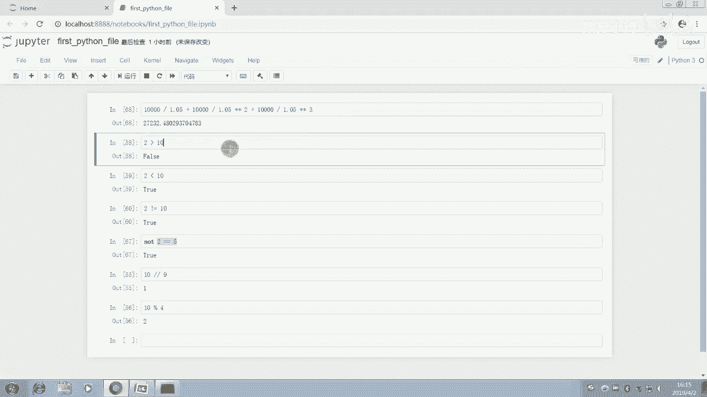

OK我们发现呢这里有一首诗，the z ofpyython翻译过来，pyython之蝉bytimpes是timpes这个人给写业的。那么beautiful is better than ugly。

也就是说啊。

呃，我们可以阅读一下这一段，它讲的是什么？就是写代码的时候啊，你的美呢肯定是比丑要好的。那么简洁呢 explicitpl这个显示呢明显是要比这个不明显要好。也就说你显示呢是优于隐视的。

这个我们在后面讲函数的时候会讲，所以呢我们也不给大家介绍隐视的函数。因为在真正使用中，大家只要把显示的掌握了。那么也可以自己编写好很多很很好的函数。

那么simple is better than complex，也就是你的代码写的简单易读呢是比这个复杂要好的。复杂呢又比那个。啊，这个compleplex又比这个复杂要好啊。

就是说你简单的是比你去把它搞一个麻烦一点要好。那么你复杂呢是比这个超级复杂要更好。那么flatat is better than nest的。你如果这个数据呢是平坦的，是平的啊，就会比你把它叠起来要好。

明白吗？就平的比叠起来肯定是要好的。那么这个se is better thandense。那么后面呢我就不一个一个去念了，它特别强调的注意readreadability counts。

也就是说啊你这个数这个代码的可读性呢非常的重要，代码的可读性非常的重要。好的。所以呢今天的话呢我们回顾一下我们大概讲了一些什么内容。我们目前呢讲到这里呢，讲了这个数字的比较等等。那么我们那个接下来呢。

我们介绍一下这个元组合力。呃，我们刚刚讲完的这些内容呢，就是我们把pyython里的变量啊等等都讲过了。然后包括它的这个数据的类型也好啊，数据的这个数字的计算，以及我们说的字符串的一个常用的操作。

我们都讲了。我们现在呢来讲一下python里面存储数据的一些简单的这个类型。我们这个列表和元组。

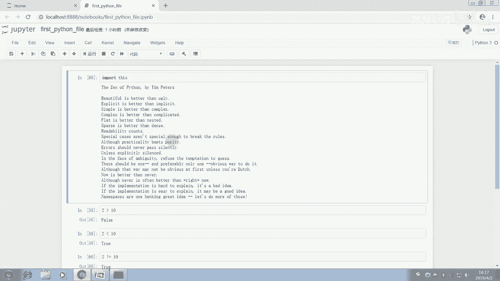

那么我们先介绍一下什么是列表，列表呢就是用来存储遗族有序数据。大家注意这个数据是有序的，有序数据元素的数据结构。我们把元素之间呢用逗号把它隔开。那么列表呢，我们把它用方括号括起来，那么就是一个列表。

那么我们现在讲一下这个怎么创建一个列表。那么创建一个列表呢，我们就用两个方括号括起来。我们把这个两个方括号复值给这个list。也就是说我们把一个空的列表赋值给了这个list，我们运行一下。

那么list呢就是一个空的列表。这个时候我们用刚刚教过的贷款函数来看一下list它的一个变量类型。

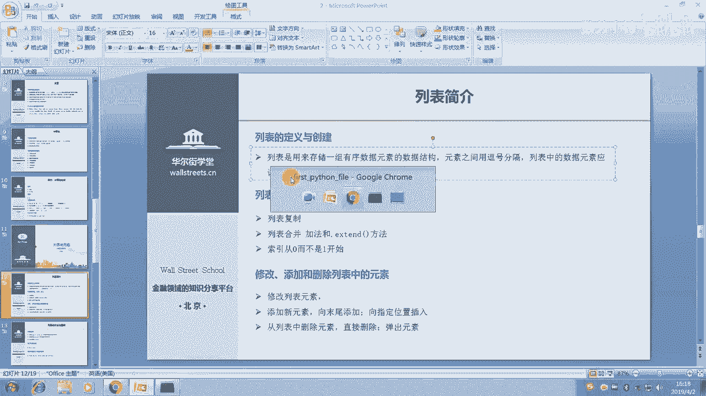

好，它的变量类型就是list啊，就是list。那么我们现在呢可以再看一下，我们说啊这个列表呢是用方框括起来，里面呢一个一个元素之间呢用逗号隔开哦。比如说我们假设现在先来一个数字的列表啊。

先来一个数字的列表。那么我们运行一下，看会是一个什么样的结果。好，这个列表呢是list，我们现在呢输入一下list运行一下，发现哎，就是这个列表啊。list呢现在就代表这个列表。

那我们再看一下它的类型是不是列表，那么输入一个typeap，它也是啊它的类型就是list。好，那么我们现在呢讲一下这个列表的一些简单操作吧。OK像这个列表呢，可能有同学会说啊，还是能不能试字符串啊。

比如说当然可以，比如说A。然后呢，B。CD那么我们运行一下。呃，运行一下。

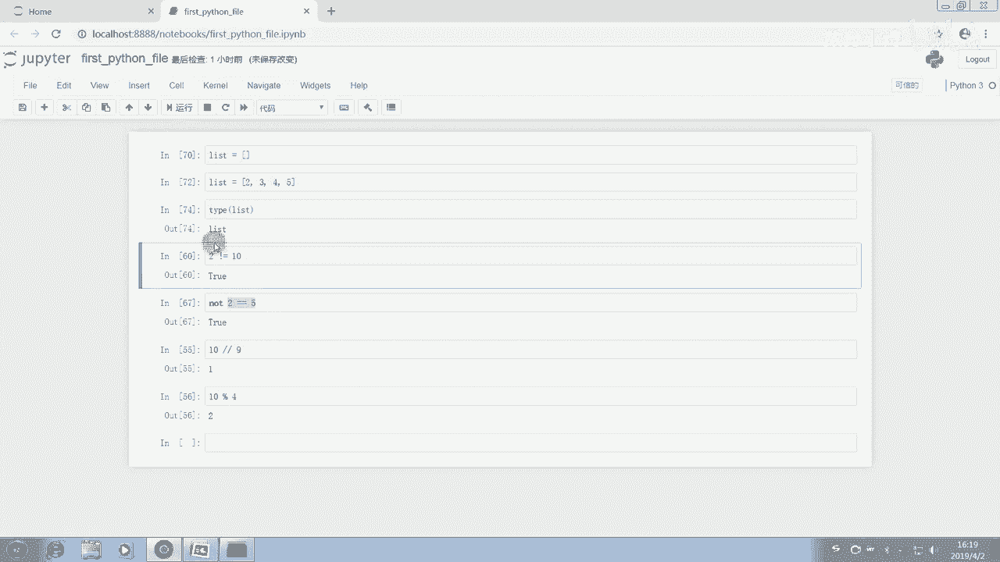

好的，运行完了。我们现在呢输入一个list，看一下它的一个存储的结果啊，确实是这个ABCDABCD。

好，我们现在讲一下列表的复制啊，列表的复制。比如现在我们对这个list进行复制，它和我们刚刚讲的字符串的复制呢是一样的，是一样的。怎么做呢？就对这个list用一个乘号乘以一个3，比如我们乘以一个3。

我们发现这个列表被扩充了3遍，对不对？ABCDABCDABCD它已经被扩充了3，它已经被重复了3遍，就是列表的复制，比如乘以一个5，那么就会有5遍，啊，有5遍。这ABCDABCDABCD啊。

比如我们乘以一个10。那么它就会有十遍啊，我们发现这个已经看不见了然，拖动才能看见，这已经自动重复了10遍。所以呢这个我们把它叫列表的复制。那么我们再看一下，我们再讲一下列表的合并，合并呢有两种方法。

一种呢是用直接用加法，就像我们刚刚讲的两个字符串的相合并，怎么合并啊，我们直接用加法把它们加起来。同样的两个列表。比如我们第一个列表是L一。A一这个列表呢，我们会等于。

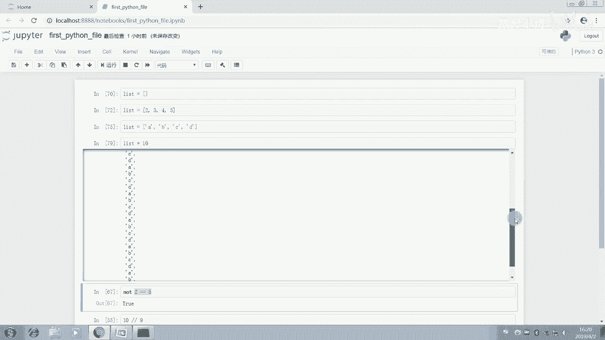

L1这个列表呢，我们会等于2345。

等于2台45。LLR这个列表呢会等于。Okay。这个就用我们这个ABCD吧，不等于这个ABCD。Yeah。Yeah。那么我们给它运行一下。好，L1L2分别代表这两个列表。

那么我们要把L1L2给它合起来怎么合呢？我们只要相加就好。我们发现加起来以后，这个结果是什么呀？结果就是2345ABCD那么我们在这边给一个列表，L12来表示L1L2运行一下。

那么现在呢我们就把L1加L2的值呢复制给复值给了L12。好，这就是LE2的一个结果。LE2的一个结果。那么我们现在再看一下列表的话呢，它也有这个我们说的一个合并的功能。比如说。它还有一种，比如说L一。

一点exend。就说呀在L一的基础上呢，把谁加进去呢？把L2也给它补充进去，我们运行一下。好，我们运行一下。这样的话呢我们再输入L一。我们发现L一已经被扩充了。L一已经不是之前的L一了，这就说明什么呢？

说明这个方法和我们之前学的方法有什么区别啊？有一个区别。就是我们之前学的方法呢，基本上对这个L一是不改变的，对不对？包括我们刚刚学的find啊，对那个字符串的一个改变，find它是不会改变那个字符串的。

需要我们重新去赋值。但这里呢我们L一直接extend一下呢。我们发现它已经被扩充了，对吧？它已经被扩充了。就是说明呢在使用这个方法的时候呢，大家不需要再去用L一等于L1点extend了，明白吗？O。好。

那么这个方法呢就是我们字符串的一个这个扩充。字符串一个扩充。那么大家可以课后呢好好练习一下这个字符串的扩充。那么接下来呢我们讲一下这个如何修改和删除相关的列表中的一些元素。

比如说我们用最简单的呃删除列表中的一个元素的方法吧。我们先这边呃讲一下这个列表的一个索影啊。W。先要讲一下怎么去找每一个元素。这个呢其实索引的话呢，包括刚刚字符串的索引，包括之后我们会讲的字典。

还有一些其他的元组啊，包括我们最后讲的那些呃更更复杂的数据类型里面的一些索引它其实都是相通的道理就是从零开始第一个位置，我们把它叫零零位置，第二个位置叫一位置啊，是从零开始的，明白吗？从零开始。

那么在这里的话呢，我们L一的话呢，如果我们输入一个零位置的话呢，它返回的是哪一个，当然是这个二这个数字。但是我们要注意了，我们先重新的运行一下这个，然后我们在这边L1的话呢，它返回的是二啊，是2。

然后我们可以看一下，如果我们输入L2的话，L2我们想看L2的二位置，二索引二索引是第几第几个位置啊，第三个位置嘛。所以我们运行一下这个L2这个。这个L22我们发现哎是C，没错吧，第三个位置是C。好的。

那么我们接下来呢讲一下这个列表呢，它也有切片，对吧？像我们刚刚说了，比如说我想看第零个位置，到第呃第二个呃到第三个位置，也就是我们这边给个2，也就到第三个位置，但不包括3。那我们看一下L2。

这样的话运行下应该是AB啊，2个。定位到这个第三个位置，但是不包括第三个位置啊，所以呢是AB这是列表的切片，我们这边也可以改改成一，这边改成三运行一下，发现结果也是一样啊，也是这个BC啊。

从这个第二个位置开始到第四个位置，但是不包括第四个位置。好的。那么我们现在呢再讲一下怎么修改这个列表，怎么修改列表。比如说我们现在L一呢，我们把它扩展扩展成把L2也给它加进去。

这样L一这个列表呢就变得很长了，对吧？L一就变得长了一些，变成这个样子。我们现在想删掉其中的一些元素，怎么删掉它呢？那么我在这边呢讲几种方法。第一种呢我们要删掉它呢，我们只接用deelete DEL啊。

添加输入DEL。然后呢，在这个L一这个list里面呢，我们只要输入L一。然后呢我们删掉第几个呢？比如我们删掉第零个，那么我们运行一下。我们现在再去看L一呢。它的二这个第零个元素啊，也就。啊。

2这个第一个元素啊，本身呢这个零呢代表的是第一个位置嘛，这个索引零我们要删掉索引零这个元素，所以删掉这个索引零的话，也就把第一个位置删掉了。那么我们也可以怎么做呢？也可以试一下，我们看一下啊。

现在呢我们又重新把这个L一复值一下啊，我们重新的从上面复制一下啊。好，L一重新复制一下。我们假设要删掉别的呢，比如我们要删掉三呢。那么我们删的话，我们先数一下012345这个数字。我们删掉它的话呢。

我们预期L一里面的5就不见了，果然它不见了，果然它不见了。好了。啊，我们接下来呢在。讲另外一种方法，可以删除里面的元素的，我们叫pop方法。叫pop。那么这个方法呢就是表示弹出什么意思呢？

我给大家举个例子，大家就明白了，比如X一等于啊L1点pop。pop呢是从你这个列表的末尾啊给它弹出一个元素来，我们注意末尾是什么呀？末尾是D。所以我们就知道啊这个L1点Pop呢会删掉末尾。

这个D删掉以后，这个D到哪里去了呢？被弹出来了，弹出来弹给谁呢？我们把它赋值给了这个X，就这个含义。所以我们运行一下，我们先看L一，我们发现末尾的D不见了。

同时我们看一下X我们发现X呢变成了DX呢变成了D。为什么呢？因为我们把它弹出来，变且赋值给了D。这个呢在我们这个呃运算中呢也是比较有用的一个方法。我们接着呢讲一下字符串怎么修改。比如说呀在这里的话呢。

L一是这个这个这个内容，我现在想修改L一的第二个位置的一个元素。L1的第二啊，索引二的话对应的是012，对应的是4。我想把四改成8。那么我们只需要把它重新复值就好了，并行一下。

那么我们现在再看L1它就已经变了啊，L1它已经变了啊，这个四就已经变成8了，这个四就已经变成8了。好，那么大家还会想啊，我们怎么往里面加元素啊，很简单，append。

end我们在呃有用过其他的统计软件的朋友应该都知道。比如tta的这个软件的话呢，它里面也是用一个end，我们给它加入一个元素。比如我们加入一个R，那么运行一下。我们现在再看L1。

我们发现哎末尾多了一个二多了一个2，那么就是这样子。也就是说在之后的工作中啊，我们要往一个列表里追加元素的时候呢，我们只需要用append这个函数就可以了，就append。好的，呃，我们列表的话呢。

这个函数呢我们它的一些呃方法呢，我们基本上都讲完啊，就一些怎么操作这个列表的方法我们都讲完了。那么我们现在呢接下来呢我们讲一下，想给大家讲一下这个列表的一些这个。方法与列表的一些其他的常用的函数。

Yeah。当然了，列表的一些其他常用函数的话呢，就是说我们可以讲一下这个。列表的一个排列啊，比如说我们现在有一个这样的列表。我们都是。一个整数的列表。那么它本身呢是一个不规则的。没有顺序的一个列表。

好的，那么这样一个列表，我们怎么对它进行排序呢？你怎么排序呢？那么列表呢有一个这样的方法叫做st方法啊，叫做排序方法。st呢它就叫做排序。我们看一下啊，我们比如说我们给它呃s，输入st的话呢。

我们把这个函数啊，把这个方法调用出来。我们发现这个st这里的话呢，它是给了你一些这个提示的啊，给了一些提示的啊，它是可以告诉你啊，这个s后面可以输入哪些。当然我们现在先不用管啊，还没有讲到函数。

我们先不用管我们先学一下这个方法，大家可以记住这个地方点st就是对它进行排序运行一下。我们现在再看一下int first这个这个列表。现在呢我们发现哎它就已经排好序了，对吧？从低到高排好序了。

从低到高排好序。那么我们想说的呢，就是说在大家看到这个函数的时候呢，或者说看到这个呃我们对这个int first呢这个进行一个这个列这个这个列表呢进行一个。操作进行一个排序的时候呢。

实际上呢如果用这个点st方法的话呢，它是已经完全的在原有的这个列表的基础上就对它进行过修改了啊，原有的这些基础上就就进行过修改。那么我们还可以用另外一个，比如说点。reverse就是从高到低排。

因为我们刚刚是顺着拍嘛，从低到高排嘛，现在倒着排，我们从高到低排。我们再看一下那个int first这个列表。我们发现哎它变成从高到低的排序了。那么同学们可能还会考虑一个问题啊。

就是说呃我有没有办法不要修改原来那个列表呢？直接在它的这个就是我新复值给一个其他的列表呢，可以的。比如说我们int，我们这个时候呢就要用到一个函数叫sty的这个函数。

这个函数呢就不会对它进行呃对这个int first进行修改。大家发现它直接输出了一个列表。但是呢你这个时候再去查看int first呢。它是没有变化顺序的，依然是原来这个顺序。

所以呢这个时候你可以复制一个新的给一个新的列表。比如说你把这个sortty的以后的这个列表呢赋值给X，那么你就自然可以知道啊，原来是这个X呢，就是新复值以后的一个按顺序排列的列表。好的。

当然如果你想要那个如果你想要。怎么样呢？如果你想要。让它倒着排呢，大家注意了，这里告诉你有一个reverse equals force，就是说你反向的。这也是关闭这个反向排列的一个这个意思。

也就是默认是关闭的。但是如果你想让它反向排列是需要reverse，把这个打开reverse equals to就好了。所以呢这里你把int输入进去，我们可以。把刚刚这个列表给它输进去。

然后同时对reverse。Because。Q啊，我们把它给等于正正确的运形一下。我们现在再看这个X这个变量。发现它是倒着排序了啊，倒着排序。好，那么我们接下来呢我们来看一下这个list的话呢。

它也可以看长度的。比如我们用lan还是用这个函数，用lan这个函数。那么lan这个X的话，我们运行一下啊，6位啊，我们数假里面是不是6个元素，确实是6位元素？好的。那么列表的话呢。

我们就呃这个主要的那个基本的方法我们就讲完了。好，我们接下来呢介绍一下这个元组啊元组。元组的话呢。我们这个地方呢用topupple来表示啊，tuupletule的英文名呢是元组的英文名。

那么元组呢它和list呢是非常像的。啊，比如说我们来命名一个tuuple啊。它呢是跟list的非常像，唯一的区别呢有两点。第一点呢是它是用小括号给它括起来。比如说123。59A啊。

我们看一下这样一个元组。那么这样一个元组呢，它有一个它跟list的是一样的，包括索引。比如说我们看一下T0也是第一个元组对元组的第一个元素。但是呢它的区别呢在哪里呢？它区别在于这个元组呢。

它是不可改变的里面的元素内容。比如说T0，我们想把它改成A或者改成C。我们运行一下。报错啊，typearrow。

为什么连 topple object does not support item assignment你算。tople这个它的一个tople对象，tople objectject。

我们发现python里面大量出现object。因为我说过python我们是一个面向对象的编程，所以呢它这个对象呢是没有这样一个赋值的这样一个功能的啊，所以呢它是不能够改变的。

这个python的这个tople呢是不能改变元素的，明白吗？啊，所以呢我们在这个里面呢就要特别注意了，基本上是一样的。但是呢唯一的区别呢就是说你这个tople一旦给定的，你里面的元素是无法改变的。

你可以啊是无法改变里面的这个元素的，但是呢list是可以的。好的。所以呢相对来说呢，列表呢相对于tople来说呢会更为的灵活，更为灵活好用。我们一般的列表呢也是我们用的极为多的一个数据类型。

接下来我们讲一下字典。字典呢我们用dict来表示啊，dict我们先看一下怎么创建一个空的字典。空的字典呢，我们Dds我们这边用两个大括号表示啊，所以我们发现小括号中括号大括号都用全了。

小括号表示tople啊，也就是我们说的元组中括号表示列表大括号表示字典字典是什么意思呢？其实就是。一个键和值的对应，我们把它叫key和value的对应。我们举一个例子吧，举个例子大家好理解一些。

比如我们D这样一个会等于什么呢？等于我们用一个大家都熟悉的贵州茅台。那么它对应的是什么呢？假设它的股价下在840元。那么我们再对应一个，比如说来一个大家也都很熟悉的啊股票，中国。

平安这股票它现在价格是78元。假设。那么我们只需要运行一下，我们就会发现这个字典到底是怎么一回事了。我们现在看下字典是什么样子的啊，原来字典呢就是含义呢就是贵州茅台这个股票价格呢是4840啊。

中国平安这个股票价格是78。那么字典的话呢，我们可以查看它的一个键值，也就是ki。我们发现我们只要输入。比如我们看啊我们看这个自动补权怎么用，你输地点KE，唉它自动key了，你回车一下。

就可以把它打印找出来了。那么这个时候呢，你记得加括号就是字典的ki方法可以查看它的键值，我们发现dic kiss字典的键，我们把这个叫键键入的键啊，键盘的键字典的这个键值呢。

kis呢是贵州茅台和中国平安。我们可以看下对应的有地点values。这个字典的值，字典的值呢是840和778啊，84和78。那么这个时候呢，我们字典的话呢，基本就这样。那么还有一个就是它的iteems。

items呢就是把key和I key和那个value都把它弄过来看一下。我们发现dict items，我们发现看到没有？它是把这个变成了一个什么，变成了一个列表包围下的topuple。

也就是说啊它把贵州茅台840，中国平安78呢分别作为了那个tople，就是元组，然后呢放进了一个列表里面作为这个列表的两个元素啊，这样输出。所以这个是iteems的一个形式。由这里呢我们就可以知道啊。

字典呢是可以嵌套的，或者说这三种数据类型呢是可以嵌套的。比如说啊我们这个列表里面呢可以嵌套这个topuple，这就是这个典型的例子。这个字典的iteems它用一个列表把两个元组嵌进去了。

同样的我们的字典里面呢也可以嵌套字典，这个呢常用在我们一些呃爬虫的数据类型里面，比如jason类型啊啊等等。比如说这里我们可以A001里面，我们再嵌套一个字典12一，然后对应2。那么比如A002。

我们也可以再嵌套一个字典。再嵌套一个字典，比如二对应。C。好，这个呢也是一个呃字典字典嵌套。我们发现这就是这样一个数据类型，包括我们可以字典里面嵌套列表。比如说上面这个A01，我们嵌套一个列表123。

然后A02，我们嵌套一个列列表。245。然后我们运行一下。呃，他也是做成了这样一个数据类型。好。那么讲到这里的话呢，大家就可以思考一下了。列表元组，还有字典的这三种数据呃。

这三种这个我们说讲的这三种类型的这个。对象他们呢比较适合分别用来存储什么数据呢？大家可以思考一下这个问题。啊，那么当然在自己的实际工作中呢。

大家可以根据需求呢选择列表或者选择元组或者选择字典来存储自己需要的这个数据。或者根据需要来选择啊。当然了，但从我刚刚举例呢，大家也可以看出，你可以用股票代码和价格对应。

你甚至还可以用一些其他的啊相相相互对应的一个方式来使用字典，以及用嵌套的方式。比如字典嵌套列表的方式来进行一个使用。好，那我们今天这个呃拍on基础知识的这个第一部分呢，我们就介绍完了，把这个。

基本的变量类型呢，以及我们的这个三种常用的储存数据的这个工具呃，这个变对象，比如说字典。还有我们的元组，还有我们的列表都给大家介绍了一下啊，都给大家介绍了一下。那么今天的话呢。

我们这个主要内容呢就是这么多。那么希望呢大家在课后呢多多实际的操练啊，这是一门非常实。非常需要大家在课后的一个练习的一个课程。然后呢。大家在操作的过程中呢，如果有任何问题呢，可以呃查看我们的这个。

课程讲义。这个的话呢也会随课程呢一起发放给大家。在我们的课件里面呢，课件之外呢有一个专门的课程讲义。大家打开这个课程讲义呢，可以看见，这是我编写的一个这门课程的一个，按照章节分类的一个讲义。

所有课程里面演示过的代码呢和相关的数据呢，都在这个讲义里面会有所提及。那么大家可以点击相关的内容去到这个相关的页面，在课后呢把相关的代码呢自己手动输入一遍，非常不建议大家去啊直接的复制粘贴。

然后去输入啊，非常建议大家手动的输入一遍，加深这个肌肉的记忆效应cle effects。好，那么今天课先讲到这里。

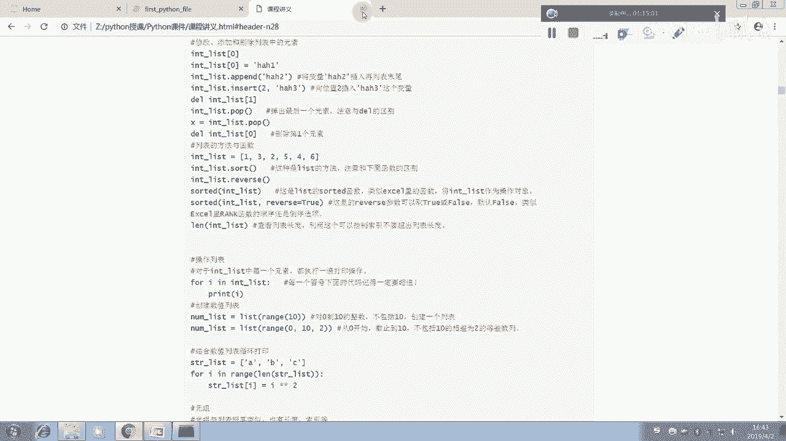