# 14天拿下Python金融量化，股票分析、数据清洗，可视化 - P33：38 matplotlib 柱状图和饼图 - 路飞学城Alex小助理 - BV1HAyPYYEAr

好同学们，那刚才我们给大家介绍，重点介绍的其实都是PLT点plot这个函数对，那其实matt plot lib还支持好多的其他的图啊，这有两页PPT啊，都是不知识的图，坐标图。

刚才是PPLT其实叫折线图啊，都一样，象形图，条形图，横向条形图，极坐标图，饼图啊，然后后边后边可能就不太常见了，大家可能没听过功率谱，密度图谱图XY相关性函数，散点图不截图，直方图图有很多啊。

这个也没有时间给大家一个一个讲义，其实有些你说这些你可能很少用散点图，其实散点图和直方图也许还会有，有些做研究的也还会用啊，有一些就比较少，我给大家讲两个最常见的其他的类似。

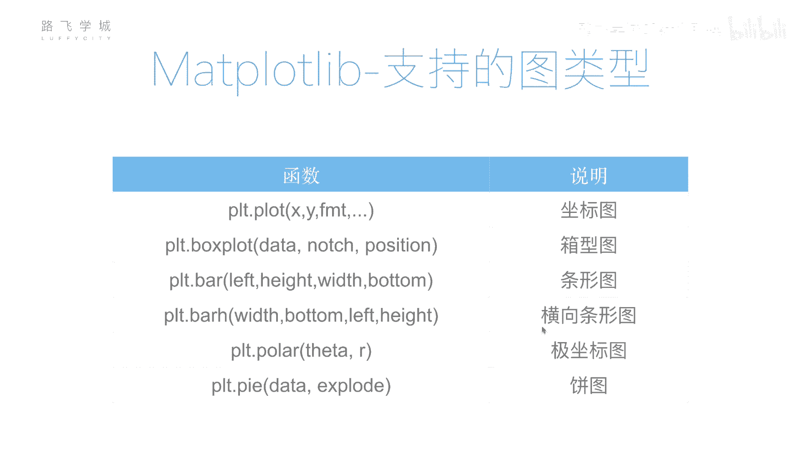

大家可以看一下我们相关的文档，或者是就是我们的那个IPAD的文档，或者是就算发文档都可以，官方还有一些例子，我给大家再讲两个讲哪个啦，讲讲一下条形图和饼图，这两个那个大家应该最熟悉，对不对。

除了这个三点图。

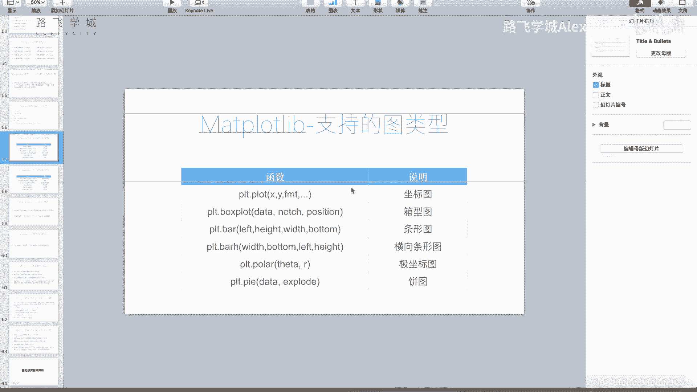

条形图好，条形图怎么来画PLT点，这个棒啊，不就是它的参数很复杂，你也可以设置的这个很复杂，简单来说两个参数啊，第一个参数是相当于是你的这个宽度，不是宽度，是你的这个叫位置，是你的几个条的位置。

几个条明白什么意思吧，比如说啊我先这样写0123，然后看啊五六对5678吧，你看一下这个0123是哪一答案，这是不是0号，这是第一个注是0号，第二个柱是一号，第三个柱是2号，第四个柱是3号。

这是你的位置，如果你这传01号四在运行，你看这个入是不是跑这来了哦，这是你的位置对啊，5678是你的高度，这个没问题，对不对，但是我们更常用的是你的这个，其实这个柱可能是，比如说这是呃四个字符串放在这。

就是四个人或者四个月份或者4年或者怎么样，对不对，那这个时候应该怎么写，你可以是吧，比如说比如说你先知道你这是四个条对吧，嗯比如说你先有数据啊，来你先来个数据，你的数据是什么呢。

你的数据是比如说是32瞎编了啊，四十八二十一一百可以吧，好有了这个你想把它画成一个条形图，然后你还知道什么呢，你还知道这四个分别代表的是labels，叫这个叫什么呢，比如是四个月份好吧。

这些1月F1B2月MAR，3月APR4月好，怎么给他画图啊，首先PLT点BAR，你要知道什么是0123，最好是对不对嗯，对不对，所以你这我们可以直接用NP点a range，是不是长度是。

state不就可以了，这是不是这这个是不是四，所以你这创创创建出来，是不是01231个数组对，然后你这是不是写data data，然后看现在是什么样好，现在是不是这四个柱出来了，是的对不对。

然后你下边的这个什么坐标坐标还没有改，对不对，你坐标我是不是应该让它写成JANF1，BIA2B二，对不对，是，那这个用什么呢，之前给大家介绍了啊，PLT点XTXTX啊。

XTX第一个是不是说我在哪几个上面有坐标，这是不是还是它是0123这几个位置有坐标，对不对对，你看我如果这样写啊，你看是不是0123这三个位置，这四个就有坐标了，然后我是不是把它们换成什么。

换成这四个字符串就可以了，对labels等于labels，Labels，嗯这是不是因为重名了，为啥会报错嘞，看错误，你看是不是就这样，包括比如说你要我要设什么颜色，你也在BAR应该也有color。

color等于我不知道传一个行不行啊，我们来试一下，可以等于red，你要说四个，你搞成四个颜色，应该是你可以传colors，我印象中red灯，blank好像不行，trs bike好像不行。

那就是只能可能能设一个颜色啊，就应该有一个colors的这个属性，但是我忘了怎么用了啊，反正你可以设一个颜色，设成四个颜色也太滑了。

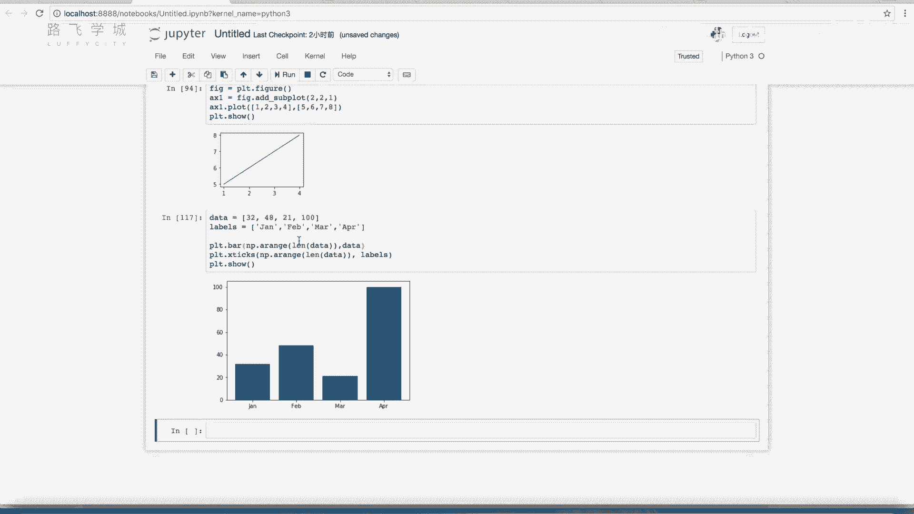

设一个就够了，对吧啊，它这个更多相关的一些细节，你可以看一下文档啊，还有各种说明，其实还有比如说它可以设置你的什么，这个高度高度其实就是这个东西，高度就是这个这是高度嘛，宽度啊，你看你这柱子太宽了。

对不对，给你设一下宽度。

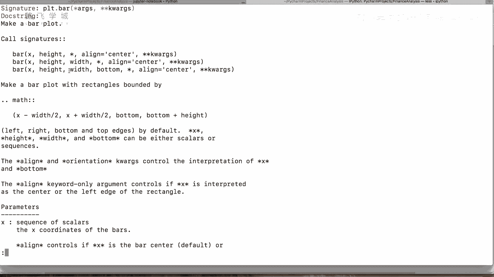

比如说简单演示一下啊，wise等于什么呢啊0。3试一下，你是不是改过了哦，对你它其实本来你这是应该是0123的间距，对不对嗯，所以你设一下这个值小于一的就可以啊，这是你也可以传一个，这也可以传一个列表。

那就是一个什么就是0123啊，就是比如说就是四个的宽度是0。1，0。2，0。3，0。4。

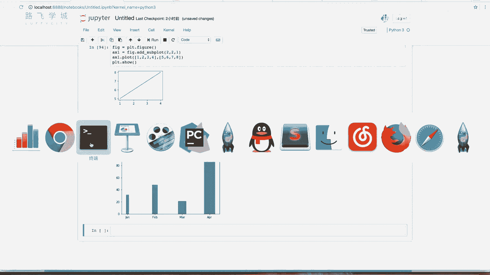

还有这一些其他的参数，包括align，就是中间对齐还是左对齐，那个默认的话是中间对齐。

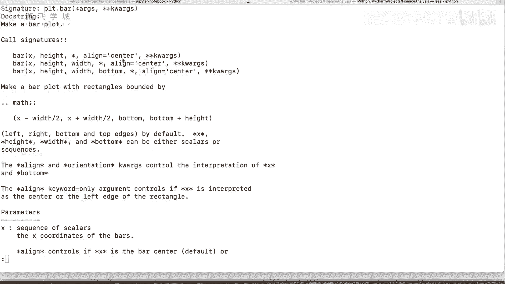

这个line就是你看这个这个在中间看到没有，你可以有一个哈。

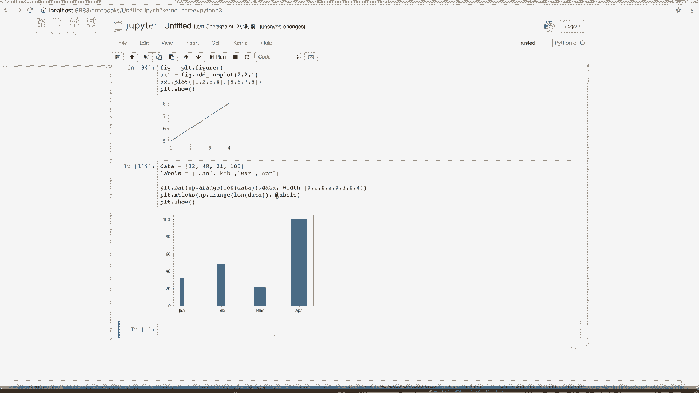

align应该可以选择，是的啊，碍着没有left和right啊。

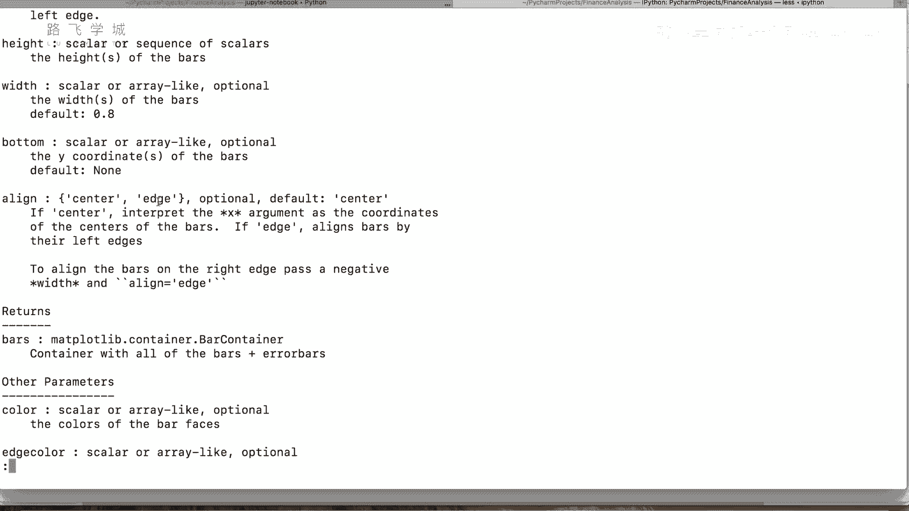

align选择edge的话，它就会去，左边是，啊不是edge等于edge，是ALI，啊你看这个这个杠线是不是套跑左边来了啊，这edge啊。

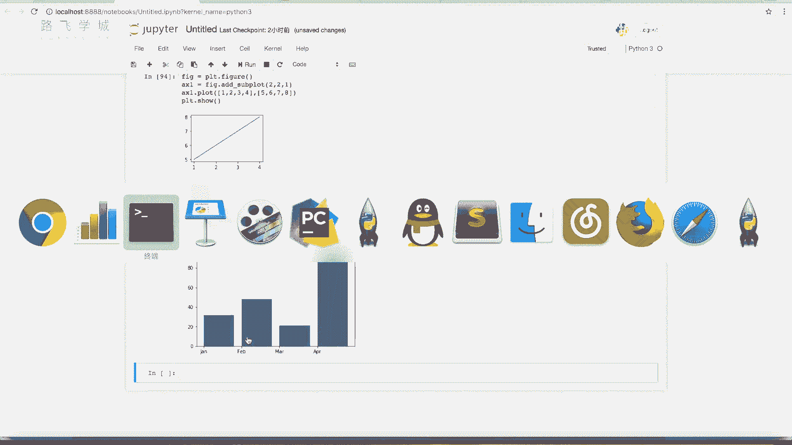

还有一些其他的大家可以自己研究一下，好啊，基本的这个这个柱状图我们可以画出来。

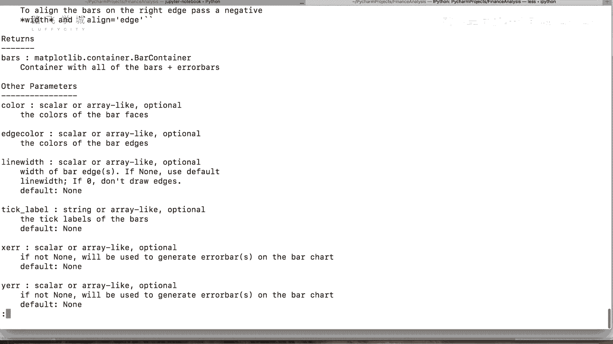

对不对好，那第二一个饼图啊，饼图饼图饼图是PLT点派派啊，派函数派函数，这个比如说十二十三十四十直接画一下看啊。

其实没有这个show它也出来了。

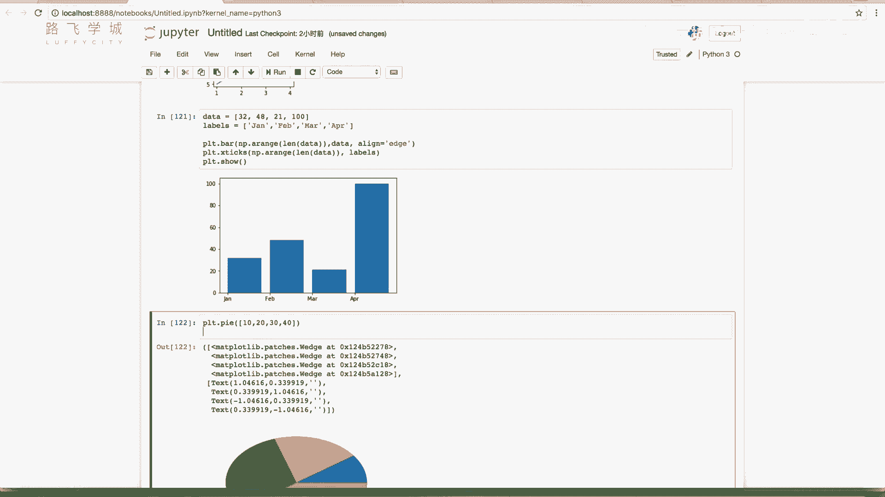

而且他还打印了，我们show一下啊，反正你看这十二十三十四十，对不对，出来了好，第一个要求，第二个是加label标题labels等于比如说AB，当然你其实应该是什么，就是你这占10%是什么，占20%。

这啊对吧，好看ABCD加出来了啊，比如说你还有其他要求，比如说你想把这个数字显示在上边，92%显示在上面啊，叫做啊auto o哎不对。

auto p c t pc pc d就是percentage百分比的意思啊，你这样写，比如说这是个格式化字符串，和你的那个就是嗯是一样的，比如说百分号点F哎，点F是啥意思啊，点0F等零的呗。

百分号你们大家可能只见过百分之S啊，百分号D百分号，点0F说明的是这F是一个小数小数位，点零说明是小数点后边保留零位嗯，看但是你看这二十十四十三十，是不是还少个百分号10%，对不对，好。

这应该打俩百分号，跟跟我们那个格式化字符串是一样的，那就对了，如果你这是点一，它就应该是保留小数后一位啊，点二就是小时候两位，就是这样嗯，那还有比如说我想这个啊，我想怎么样，我想啊。

比如说我把某个部分突出出来，比如说我想把某个部分突出出来啊，叫做explode，比如说我想把C这个位置往外，就可能它是重点看的，我想把这个位置凸出来，叫做explode，等于比如说啊000。1000哦。

这是啥意思呢，0。1就是突出的这个百分比的权重，你0。5的话太难看了，0。1其实就够了，0。5看太靠外了，对0。1，或者是可能你更想0。05给谁也够了，就把这个位置往外放一下，哎你看这不是第三个位置吗。

那是不是就30这个这一块突出来了，对你要是这再设置一个0。1，就A那个位置也出来，A也出来啊，就是这个啊，还有一个比如说他现在这个柄是个斜着的饼，我让它竖过来，这是equal，equal x是轴啊。

轴让它等价，要让等着的话就输来了，就面向你了啊，当然还有一些这个其他的，还是比如说你设置阴影啊，其他的啊没有时间讲了，给大家可以去看一下我们的这个matt plot lib。

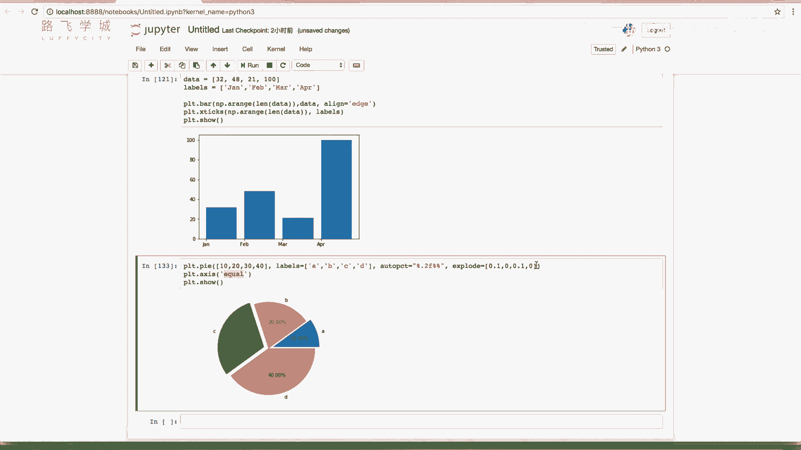

它有这个它的官方嗯，它官方上会有一些例子啊。

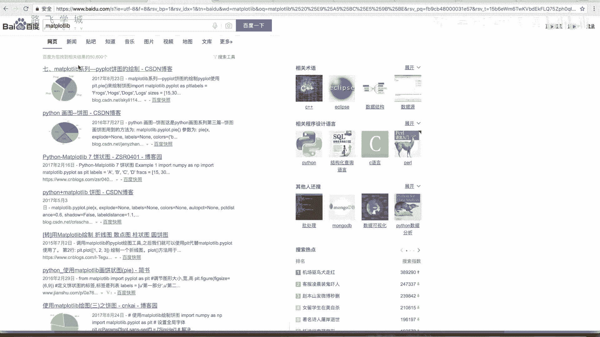

example大家可以看一下它的代码啊，它的官方网站上都会有一些啊。

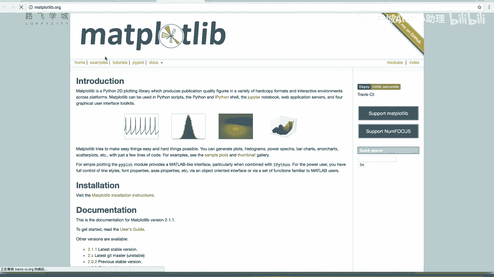

可以看到example会有一些各种图的例子例子啊，大家看一下它就可以了啊。

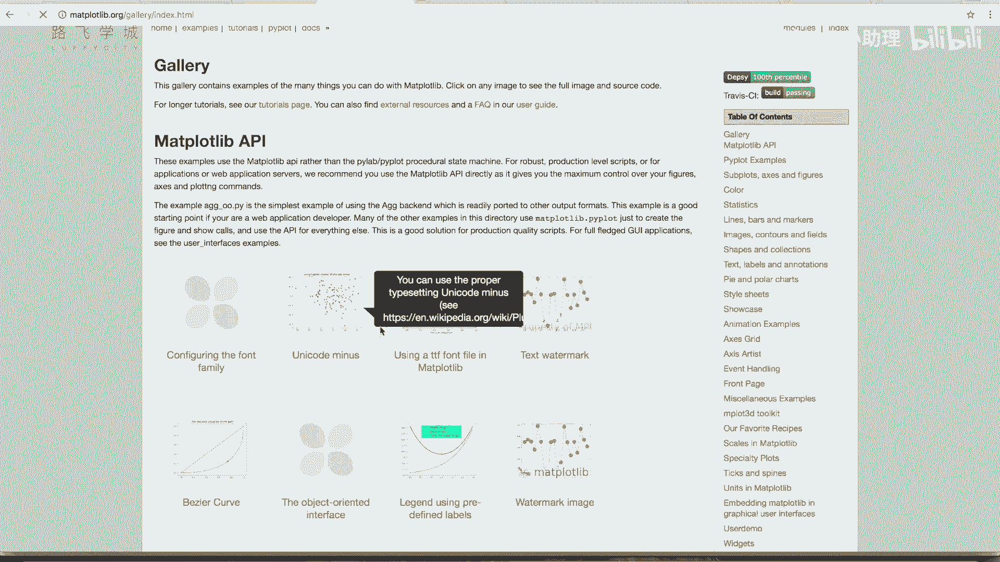

我们这两个图简单的图啊，就给大家介绍到，这已经够用了啊，其实最主要用的还是我们之前讲的那个PLODER，线好。

