# 14天拿下Python金融量化，股票分析、数据清洗，可视化 - P38：44 双均线分析作业1 - 路飞学城Alex小助理 - BV1HAyPYYEAr

好同学们，那刚才给大家说了一下这个作业的要求啊，接下来我们带大家实现嗯，啊首先第一个还是一样的，to share包获取数据啊，还是首先import需要的number py，Number。

Py pandas，Pandas，还有as v1P，啊因为这是我之前已经下载过了，之前上一个作业给大家演示过怎么的，这个to share保存文件了，这里我就不用to ch了，因为我已经存下来了。

我直接DF等于pd点read了，啊就不用古玩了，我们用这个601318啊，之前下载的那个啊，这个应该是平安银行的股票啊，这个啊index col等于data pass，date等于贝塔。

然后选出来还是我们只要那四列啊，Open close low，海关啊，没有问题好，下一步是吧，计算5日均线和10日均线啊，那这个怎么算呢，啊就是大家没有任何想法的时候，是不是首先循环可以做嗯。

循环怎么做，循环某五个五天吧，好for怎么写，我循环的话，我应该从哪个位置开始写，你看一下DF是不是长这样，DF现在是不是长这样，那我首先一号2号，5号和6号这四天有没有5日均线，5日没有吧。

嗯这4日这四天没有5日均线，为啥没有，因为他前面不够五天了，你看我7号的5日均线怎么怎么算，是不是它加它加它加它加它算平均，对不对对，那所以6号到一，一号到6号这四天前四天没有5月天，那同理。

如果我说算前，咱们别前60，咱们来一个5日均线和一个30均线吧，好吧嗯，来个3日均线啊，那是不是5日均线就前四天没有3日均线，前29天没有，对不对好，那首先啊for循环之前。

我们先来一个什么df ma5这一列等于什么，就等于应该等于缺失值，缺失值不是零吗，不是零啊，注意之前给大家讲过了，你这个地方没有值，就是没有值，所以用NP点NN来表示确实值啊，5日均线，30日均线。

相当于创建两个空的列啊，run一下，可以看到这两页创建好了，但是是不是两个的两列的值是不是都没有对，什么都没有好，接下来开始写作用，写5日均算5日均线，range怎么写，从哪开始，是不是从这个位置开始。

401234对，所以是不是四嗯，01234嘛对吧，四哎，好四到什么的，DF的最后一个，对对不对，那什么df ma5，I啊，或者赋值的时候，大家尽量不要连着写，等括号我跟大家说过了点lock啊。

想想是用lock使用，用lock就可以好，那这个，行是什么，第几行是DF点index，因为我们行只有什么嘛，lock是按照名称，按照标签进行索引啊，行我们只有I也就是第I列。

那所以我们要通过DF点index，第I个索引来这样来找它的行索引啊，列索引就好好列，索就是ma5啊，它等于什么，它等于DF，是吧，是不是这五天从I这一天往前数五天，这五天的close的平均值好。

所以我们先把close选出来，然后是不是我们应该把这五天切出来，是不是是不是I然后A减一，A减二，A减三，I减四，对不对，所以应该什么A减四开始切到哪，到I为止，所以后边是不是应该是I加一好。

这个切出来之后点1min是不是求平均值好，这个for循环写完了之后，我们再看DF，你看这是不是算出来了，这个20怎么来的，是不是他们五个求平均，这个19就是他们五个平均好，这是5日均线嗯。

30均线不一样，同理我直接复制粘贴，这从哪开始写，四改成多少，29，29啊，这改成30，这是不是得改改吧，29，好执行完了之后，我们再看一下cf df，有点慢，因为他数据挺多的。

你可以看到这个三支均线是不是从这开始开始，就是前面29个啊不行，你可以数一下29个NNN，这29个都没有好，这是我们这个可以这样来算，我们的这个就是这一位，算他的5日均线和30日均线啊，均线就在这呢。

那有人说这个太麻烦了，你要写这么多for循环有没有简单的方法，有简单的方法，但是这个函数之前没有给大家讲过啊，是啥呢，叫做rolling d f ma5等于DF，首先close这一列选出来，对不对对啊。

我们先给大家看一下df close，这列就是就是一列这个值就是列series，对吧好，他的点rolling，什么叫rolling，roll是啥意思啊，滚嘛滚对不对，滚好参数五是什么呢。

就是按五个窗口滚一下，第一次滚刚开始就是1234这五行，下一次就是这五行，再下一次就是这五行，再下一次就是依次往下类推，就这五行，好rolling5，那同样你这样的话，看ROLING5。

他最后给你返回的是一个rolling对象，跟那个RESEMPLE一样，那我要求平均怎么写点min，你看四个NN20。0674，看看这个值是啊，那个值没有了，跟那个跟跟刚才咱们自己算的那个值是一样的。

嗯啊那个值是一样的，那这个我是不是就是我的5日均线的一列，那我把它复制给ma5，等于它，再看DF，是不是多了ma5啊，这个ma30是之前那个都没有没有删掉，重新运行一下这个就可以了，好听ma5。

那ma30是不是类似对就改什么，把这个rolling的五改成30就可以了，当然这个rolling也是rolling，你可以写mean，可以写什么sub，可以有各种就是统计方法，就是以这个东西。

以以以这个五个大小滚一次，然后再往下滚一格，再往下滚一个，这样意思来算啊，这个时候我们看一下DF，有点慢，应该还没有执行完的吧，这个好车改成30，我们可以看到ma5是前面四个NN，ma30好多NA。

然后这个对，好这是这个算均线两种方式啊，你写循环包括不写循环，对啊，两种都行，嗯啊那这一步完了，接下来用matt plot lib包画收盘价和5日均线，10日均线三条线，这个怎么画。

我们就用pandas那个方法直接画就可以，DF是不是这三个列我就把这三列选出来，对不对，怎么把这三列弄出来，就选花式索引啊，Close，ma5ma30点plot，然后DF而不是PLT点show。

run好出来了，虽然不太明显，就是因为数据确实太多了啊，数据全采的我我给大家搁一段出来吧，DF等于DF这个啊切到100就是100条，前100条哎，你这个时候你看你就比较明显了对啊，这是close。

这个去680，这是close比较平滑的，这个是ma5啊，这是ma10，这是ma30对吧，你看这有两个叉，金叉和死叉，对不对啊，100你看可能1000也行，1000哎，1000可能就看不清楚。

还1000也还可以也还可以，那就是你不切的话，它因为数据太多了，所以就看着特别像在一起的好啊，这个没有关系，那我们把图画出来了，这是我们的哎，这什么情况啊，DF被切了之后，就然后重新执行一下。

嗯反正我们能画出来的啊，如果你是在窗口里显示出来的话，那个东西可以放松，你可以看看看，看得到细节好，这是我们的这个第三问，对不对对，接下来第四问啊，这点难度算所有的金差日期和死差日期。

好金叉日期和死叉日期怎么算，那你呢不会啊，啧哎呀，我之前不是说过了吗。

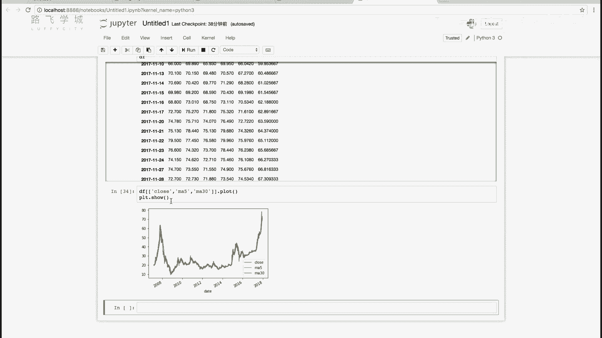

什么是金叉，什么是死叉，就两条线再给大家说一遍啊，两条线，啊如果这个是5日均线，这个是3日均线，如果我便利的话，如果今天5日均线比30日均线小，第二天明天5日均线比3日均线高，那这就是个进差30人。

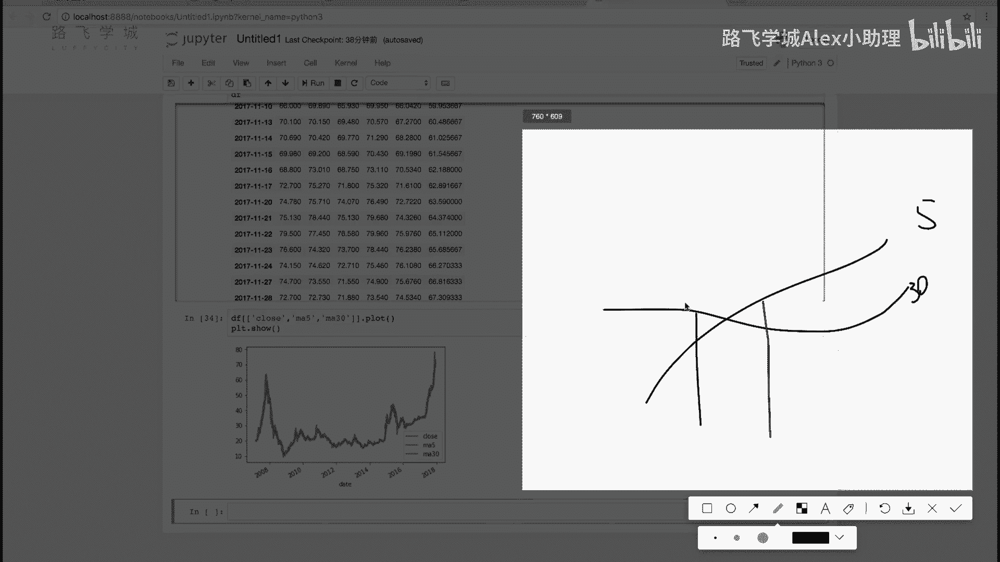

对不对，好可以写啊，但是注意在这之前我们要把什么，要把这些有N有缺失值的行都去掉啊，确实是好，因为他们你看这个有要么两个都没有，要么有一个有一个没有啊，这些影响，我们注意把它DF等于DF点DPNA啊。

把缺失值去掉，好去掉之后啊，for i in range什么嗯，零到长度是不是零到LN，这个DF是不是遍历所有的，但是注意我这别这么写，为啥因为你这样写的话，因为我是要拿I。

你要不是拿I跟I加一那两个比，要么是拿I跟I减一个比，嗯啊你这样写的话，你就说是0~1写A减一可以吧，那你零和上一个A减一，是不是一负一那个位置没有车内应啊，就会主动出现问题，所以我们这写一啊。

你要么写零到长度减一，要么写一到这个对了，这个长度啊，好for循环里，for循环里啊，如果什么判断这个DF的，M啊，引号ma5是吧，大于df ma30，并且，DF的d f ma5算不。

今天DMMA5大于DMMA30，D f ma30，并且是不是昨天的ma5，这是不是昨天的MA5，对不对，A减一吧，小于DF什么MA30，那这是金叉还是死叉。

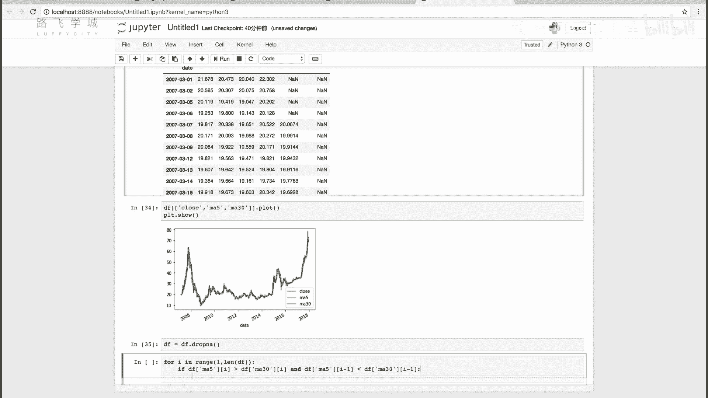

今天今天啊大家不太什么的时候，就画一下今天这个值是什么，DM哎哎ma5大于ma30，这是五，对不对对，下面这是差不值，三十四十啊，今天M5大于M30。

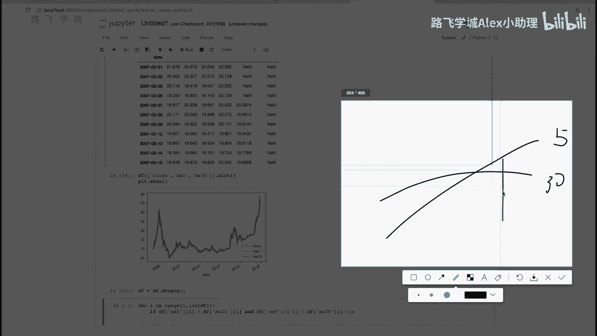

昨天M5小于M30，这是短期均线上盘条均线，这是金叉，对不对，好，那这之后注意我们要拿两个列表来存一下，应该是经常我好往往里有pd呀，对吧好，golden cross点append end是吧。

open的日期日期怎么写，DF点index哎好这是金叉死叉呢，如果DF其实直接复制粘贴就可以了，如果今天是不是把大于小于号一改就完事了，对对，但是注意啊，你这最好这带我们这带了一个等号，为啥。

因为有可能是今天是等的，今天是等的的话啊，我们也算成这个今天式就是相当于焦点。

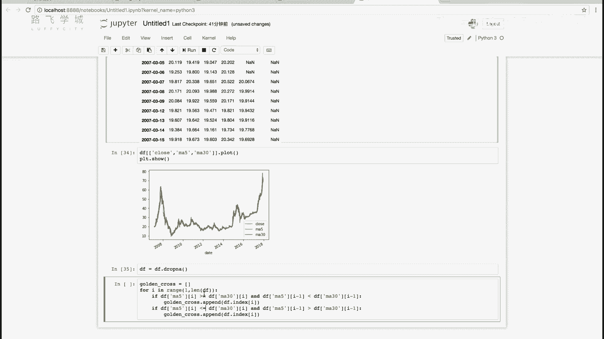

就在今天，就是这意思就是有可能是啊两根线，这是5日，这是30日，那有可能这是今天的值，今天是一样的，有可能昨天是昨天这个5日比3日日小。

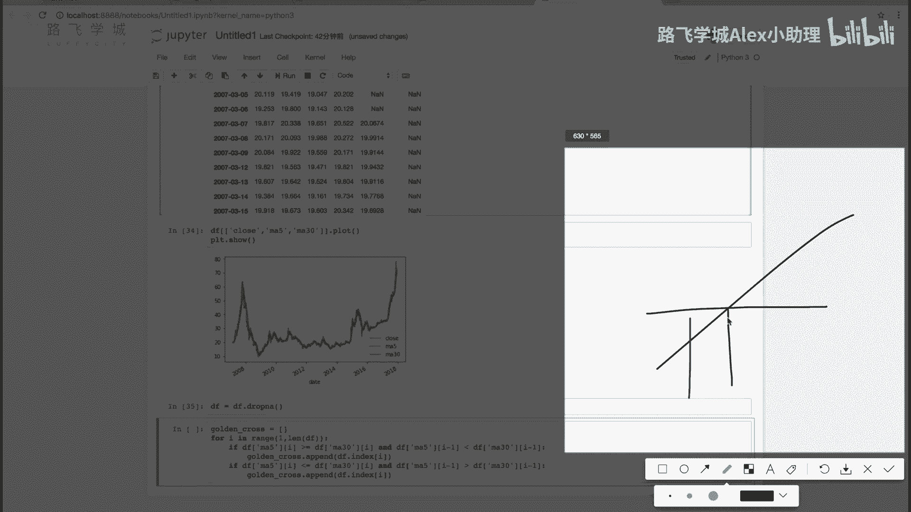

今天5日和30一样，今天同样是今天对你这带着等号，那这个地方就不是golden close，还需要一个death cross啊，golden cross就是金塔，death cross就是死叉。

那你这就是death cross depend，那就可以了，好for循环写完了之后，我们看一下高en cross，啊他就是你这看到的是time step，但是其实啊无所谓。

你如果想要转换成Python的这个啊，这个z time对象的话，你这再来一个to啊，不是在这里边点to daytime就可以拍，pd time就可以，那这就变成data time对象了啊，不加也没事。

那这我们就是把这两个呃，进单核死叉的日期输出都分析出来了，都找出来了啊，这是一种写法啊，这是一种写法，那还有另一种写法，还是不用循环，怎么搞呢。

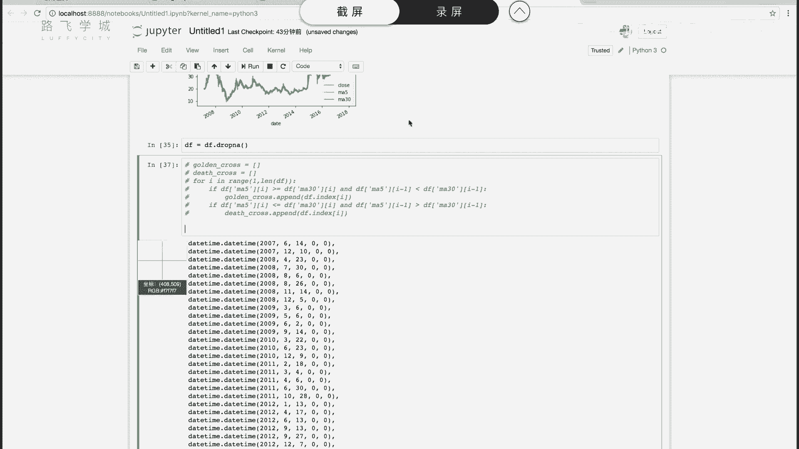

我们说啊还是这个熟悉的图，这是5日均线，这是30日均线啊，这有一天这有一天，那如果我说啊ma5就是DF啊，这不好写，写字吧，DFMA5大于d f ma30，这个东西是不会返回一个布尔型列表。

前边就是这样，这个图的话前边全是false，后边是不是全是true，对，那，我们要找的金叉是不是就是今天是true，前天是false的嗯，今天怎么找，今天日出，前天是false的呢，第一项。

那我把前天的false是不是往前移一位就可以好。

大家可能有点懵了，我给大家这个拿这个我们写一下啊，ma5df ma5小于d f ma30，这个表达式返回一个布尔类型的，我给大家看一下。

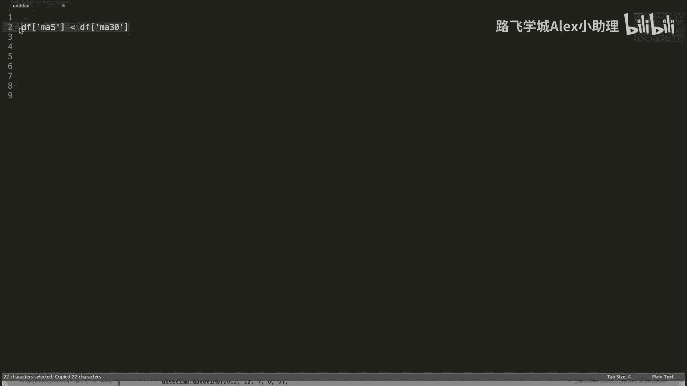

我是不是要重新开始执行一下，这是什么问题啊，有个空格吗，嗯好，你看到前一对false，false之后肯定是一对处置的都是false，ma5和ma32，就没有true的时候吗，肯定是有TRU的啊。

这有一个处里边肯定有处，可能运气点背前面都是false，后边都是false。

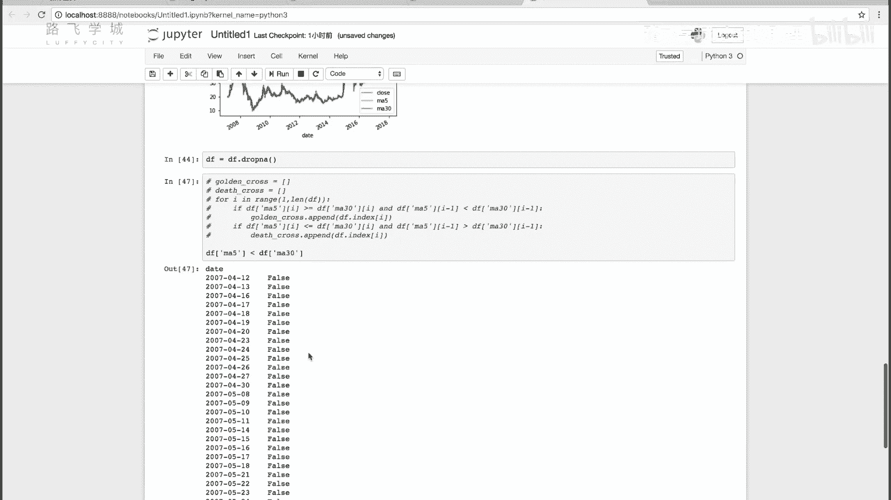

好，mu和ma30就是肯定是什么结果，是一堆true和一堆false啊，我就是用T来代表true，F来代表false，对不对，然后就是T好，我问你，那这一天是不是一个叉。

是从true转换成false的时候是一个叉对，这是什么差呢，前一天5日小于30，后一天5日大于30，这是不是上传，所以这是金叉，从T变成F是金叉，从F变成T是不是死叉，对啊，这是死叉。

那好这是ma5小于MA30，那df ma5大于等于df ma30，是不是应该是跟它相反的一个，你看前面这是T吧，这就应该是false，就是完全跟上边是相反的对吧，前面是true，后边是false。

对不对，那我们把这俩放到一块啊，看一下啊，那我要找的这是不是一个叉，就是这是上面是T，下边是F是这个哎不对，这是T，这是F是一个X，对不对，这是T，这是F是一个X，对不对，那怎么找他呢。

嗯看不出来看不这样错误，你看啊什么时候是差，这是不是一个叉，看啊，刚才这是不是第一个F，这是不是个叉，对不对，第一个F第一个T这是一个叉，所以你看我这错了一位之后哎空格，这是不是两个都是F的时候。

是不是金叉，对不对，两个都是T的时候是不是死叉，不对不对，嗯好，那我们不就可以写了吗，怎么判断两个都是t and呀，and啊，如果前面是T并且后边是，如果前面是true，并且后边是true。

那就是TRU对，如果前面是false，后边是false，那都是false false对好。

那我们怎么写它啊，首先我们可以把它为了什么，为了防止大家出错，我们可以分布，首先我们把它保存成一个series series，一是5日均线大于三三十日均线啊，小于30日均线，series2是什么。

5日均线大于30日均线线，好那么我要选金叉。

先不写先不写，那个金叉是不是就是S1，是不是要把S2往后shift1位对啊。

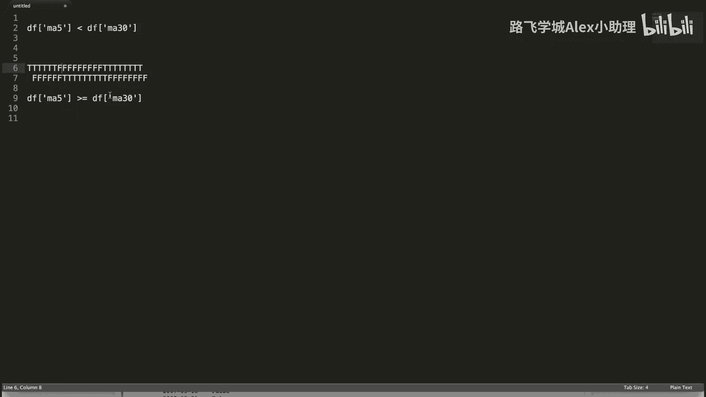

SR2点shift1就SR1要和它比对不对，如果SR1and sr2，如果SR1是，你可以这样写，如果SR1是true，并且SR2，啊不要这样写，啊为啥不要这样写。

因为我们看啊S1SR1是不是一个series，SR2点shift1是不是也是一个series，那他们两个我们要把他们两个用and来做操作，对不对对，那你要用。

如果大家还记得这个pandas as不记得的话，可以去看一下pandas as，那门课的这个那个那一部分的这个布尔型索引，内容，我会讲到了，要用这个and符号啊，这个and符号表示的是做语啊。

我们可以看到全是false，应该会有一个true啊，那这个and就是什么呢。

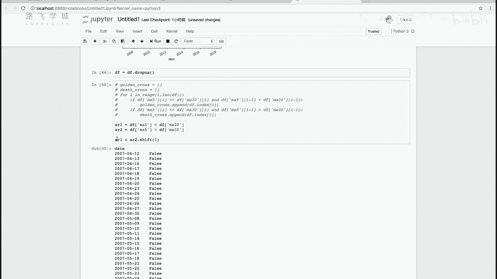

只要SR1是true，并且sr shift1之后也是true。

就是这个位置对它是什么，它是死叉啊，是大于等于，那我就把什么，我就把这一部分的值包括起来取出来，选出来，这不是个布尔的索引吗，我把它选出来看到没有，6月4号11月，这个16号，12月13号等等等等。

这些就是死叉的时，那我把它取index，之后用我的这个啊，这是死叉，怎么回事，this s s r1和S2，Daytime in next objection，not coo哦，没有中括号，没有中括号。

That cross，好看一下，这就是死叉啊，零0707年6月4号，如果你不信的话，你可以看一下，你就看第一个值，你看跟之前那个是不是一样的，07年1月4号，我这还需要我需要点吐一下啊。

不然的话我们看到的是一个时间戳，07年6月4号吧，对不对，是一样的好，这是死叉，那金叉怎么算，你这金叉不就反金叉是什么。

金叉是两个都是false。

对两个都是false才取F，那两怎么让两个都是false，是不是取二，如果两个都是false，取二之后是不是还是false。

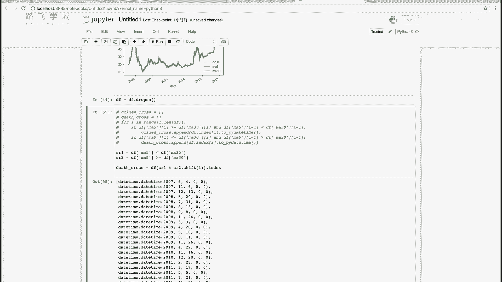

其他的是不是都是true，你看T到F都是true吧。

F到T也是true吧，T和F也是true啊，对不对好，那就是SR1什么or sr2，如果他是我要把什么，我要把它是false那些都选出来，对不对，对不对嗯，那它要加一个什么。

要加一个取反取反对它or的话只有它是false。

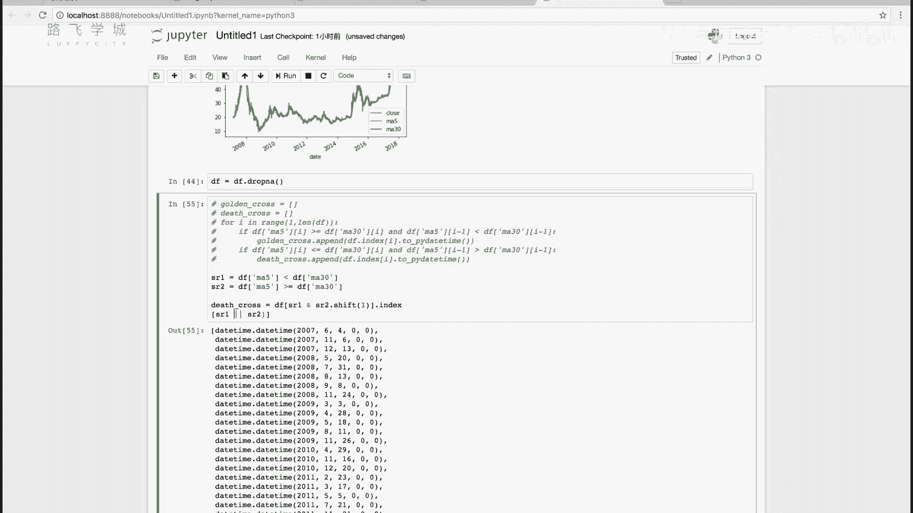

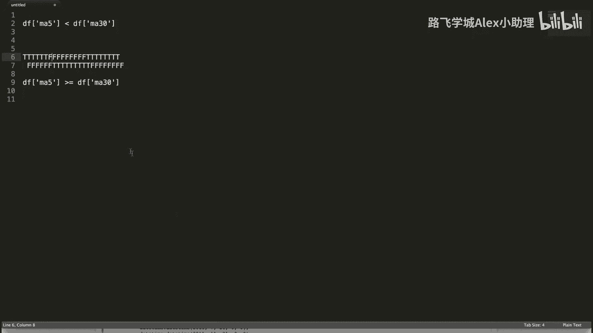

那我要把它取出来，取反之后它变成true了，我把true的这些也选出来，嗯没有连一个竖线啊，一个属性哎没有，怎么会没有呢，这E5不就是吗，看一下啊，run有没有false的，都是true吗。

都是true，没有死叉，不可能，SR1or sr都是true，没有经查，嗯这个怎么看呢，这个怎么看呢，里边这是啥，SR1or sr2哦，哎没有shift哦，忘了对应该是这点shift1啊。

啊这个时候我们再看把它取出来啊，不好意思，刚才脑子又犯糊涂了啊，你看有了吧，嗯你看看自己跟自己肯定，这两个是肯定是不可能，一个true，一个FS自己跟自己肯定不会是一样的，忘了shift1啊。

所以你看这些时间是我们的死叉啊，啊是金叉啊，golden cross cross等于它点index，大家也可以验证一下，上边跟下边结果是不一样啊，这肯定是一样的，就给大家看了。

那到这儿我们的第四问是不是也算完了，对啊，时间有点长，因为这个作业比较复杂好，第四问算计算金叉和死叉日期，也是给大家提供的两种方法啊，当然第二种方法可能不太好想到啊，大家尽量至少理解第一种方法啊。

你用循环也肯定要一定要能做出来，反正他就是个二维列表嘛，就是能算出来嗯没问题好，第二种章方法能掌握的最好掌握啊，省事不用写进环，你看这多少啊，这多少四行代码完事啊，如果你什么的话。

你把SR1和S2写在里边，两行就完事了，很牛逼啊，写的很快，但是要给大家讲清楚这个原理有点麻烦好，那我们在这稍微停一下，我们下一个这个课程，下一个视频讲。

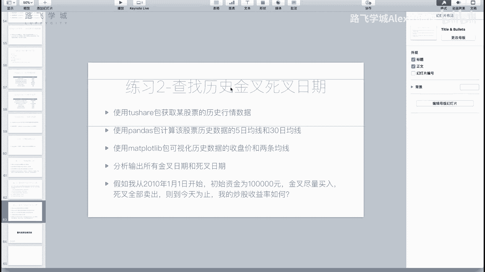