# 14天拿下Python金融量化，股票分析、数据清洗，可视化 - P4：04 Python基础知识（二） - 川哥puls - BV1zkSgYZE54

各位同学大家好，欢迎来到华尔街学堂，今天呢我们来讲Python基础知识的第二部分，控制流，这一部分的内容呢主要是条件语句，循环语句，函数声明和调用，以及内置函数的一个简介，那么在这里这一这一这一课呢。

我会重点的给大家介绍一下，这个条件和循环语句，至于后面的函数声明呢，我也会给大家啊详细的讲解，那么内置函数的简介呢，我们简单介绍一下，咳咳那么条件语句的话呢，呃很简单，这个呢为什么我说很简单呢。

相信各位都使用过excel，或者说只要是金融领域相关的，应该对excel都不陌生，Python的条件语句呢和excel呢如出一辙，那么excel呢我们还记得都是if，然后如果给一个条件啊。

如果条件一为真则返回什么，如果条件二，如果条件一为假则返回什么，那么Python里面呢也是一样的，Python呢是这样的，它首先呢是一个if语句，如果有一个条件，那么如果这个条件为真的话呢。

我们就做某件事，所以呢是if一个condition，那么我们就do something，那么这个的话呢在我的讲义里都有，大家可以自己看一下，那么ELLIF如果有另外的其他条件呢。

也可以给一个条件condition，那么这样的话呢，就做某件事，那么或者呢你还可以继续ALEF某个条件好，我就不继续多写了，然后呢或者说到最后呢，啊这也可以do something啊。

然后呢最后呢我们看一下，如果你最后就剩下ELS，就是除了这些上面的内容，其他的情况下，那我们do not do another thing，Another，Do another fit，好。

我们不管了啊，这个地方我们这样子，但大家特别强调一点的，就是你这个所有的if啊，ALEF啊，这个模块后面大家注意了，都有一个缩进，看见没，这个缩进呢，我们默认的是用tab键。

或者用四个空格来给它进行缩进的，大家这里千万不要错了，不然会报syntax error的，然后还有就是这个后面一定有个冒号，大家注意发现没有，只要你这个条件语句啊，或者控制流的语句啊。

后面都要有一个冒号，所以这里比如说如果我们没有这个冒号，我们是没有这个冒号呢，他绝对会报错的啊，待会我们可以试验一下，或者下面的这个空格没有空好也会报错的，我们先插入一个格子啊。

我们来看一下进行一个判断，比如说我们要做一个额判断，就是说如果啊我们现在X等于十，我们要做一个什么判断呢，如果X呢比五要大，那么我们就返回什么呢，我们做一件什么事呢，我们print print就是。

这个数很大，我们回复这一句，那么注意了，如果说我们那么剩下其他情况呢，我们我们怎么样呢，我们就print，这个数太小了，那我们可以执行一下这个代码，我们发现诶回复这个数很大，为什么呢，因为X是比五大的。

同样的如果我们这里是50的话呢，我们运行一下呢，这个数太小了好的，但是呢我们看这里千万不能丢掉这个冒号，如果我们丢掉，我们发现syntax error，为什么呢，他就告诉我们这里还应该有个冒号。

但实际上是没有的，如果我们这里，如果我们这里呢给他来一个空格的话呢，我们发现这里如果只空两格，我们看这里直直接自动的，就有一个啊红色的信号了，我们运行一下肯定也是要报错的，好肯定也是要报错的。

我们运行一下诶，但是这个地方呢我们发现其实Python呢，它这个JUPITER内部识别了，哎你这个啊好像确实是有问题的，所以呢他就没有报错，但实际上呢在使用过程中呢肯定会报错的。

这我们可以代码尾化功能一摁诶，发现它自动给你控好了，所以呢，这个代代码美化功能，是一个非常好的一个工具啊，我们呢if函数呢除了这样用的话呢，还有没有别的用法呢，其实也有啊。

也有我们可以结合这个用户的输入啊，来判断你这个函数是大是小，我们这里呢介绍一个input函数，input函数是什么意思呢，就是说它呢会提示在屏幕上，提示你用户呢输入一个number。

然后呢我们根据你用户输入这个number呢，它就会存储在这个X这个值里面，比如说我们这里input，这里面呢可以选择一个参数，就是说我们在input里面呢，像啊输入一句话。

比如please enter a number，我们输入这样一句话好，那么运行以后会是什么样的，运行以后呢，就会在屏幕上呢就会出现这句话，Please enter a number。

然后你enter以后，你比如你我们运行一下，我们就在这里enter一个number enter10回车，那么这个时候呢我们再看X的值呢，它就变成了十啊，就变成十，但是注意了，这上面有双翼。

有有有有两个单引号说明什么呢，说明啊这个时候的X呢它实际上是一个字符串，而不是一个数字，明白吗，它是一个字符串，所以我们在使用的过程中呢，我们还要把这个转化成整数，我们直接把用整数的数字啊。

整数的这个代码啊，int这样一个函数把它转化成整数，这样就把这个X服，由这个字符串转化成了我们的一个整数，当然了，这里的话呢，因为不是所有的我们输入的数都是整数，所以我们这里呢输入一个float好。

我们把它转化成浮点数，我们刚刚看了这个浮点数是float，也就是小数好，我们这样的话呢我们再输入一个代码，比如10。2，这样运行以后呢，好sorry，我们这里呢运行以后呢，好我们发现X呢会等于什么。

X呢变成了啊，这个地方呢我们刚刚是出现了一点失误啊，他陷入了无限循环，这样怎么办呢，我们可以中断这个服务，中断这个服务好。

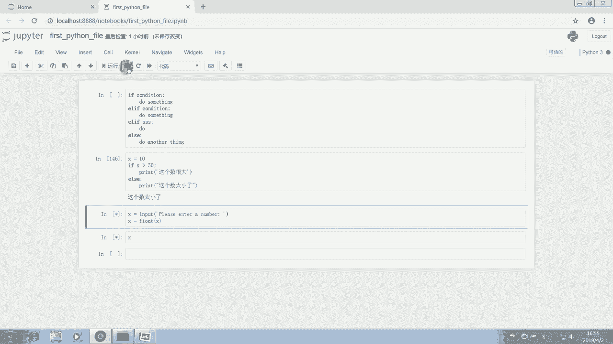

然后重启这个窗口啊，我们重启一下，这个呢也是在大家遇到问题中呢进行一个操作。

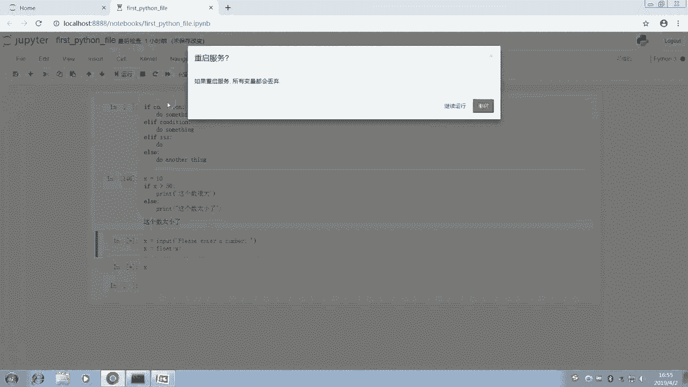

我们发现刚这里呢应该是有个地方没有操作好，我们看一下，首先呢X呢会等于input，我们这个地方你X输入一个，然后X等于float x，我们运行一下，它会让我们输入一个number，比如10。2。

我们回车回车好，这个时候呢我们就知道X呢它会是10。2，这个时候呢我们看他是没有用引号括起来的，所以呢这个时候的这个X呢，它表示的就是这样一个浮点数好的，那么我们怎么样来根据用户输入做一个判断呢。

那么很简单，我们这里就可以输入一个if，比如if x大于20的话呢，我们现在改一下，比如下面我们不要enter number了，我们可以说enter your age就是输入你的年龄年龄。

如果这个年龄呢我们先看，如果这个年龄呢比啊假如比15岁，18岁要小啊，15岁要小，那么我们的回复是什么呢，我们就可以回复啊，你是一个孩子，我们可以回复这个，那么比如说我们现在呢往下，那么ELLIF啊。

Ellif，那么我们注意了啊，这个地方呢它缩进呢表示的是，如果上面这个成立，那么就实行这个代码快，那么下面的你ELLIF当然不能再继续缩进了，为什么呢，因为你ELLIF和这个if呢是并行的。

那么ELLIF的话呢，就是如另外一种情况下会怎么样呢，我们另外一种情况下，我们看一下另外一种情况下，如果X小于20，小于25吧，好吧，小于25，那么我们就说啊这个人是个青年，Print，你是一个青年。

啊这个地方打错了，改一下啊，好的，那么我们再看，那么我们还可以来一个ALEF，那么如果这个X小于40岁，那我们就说那你是一个啊中年人啊，大家注意啊，这个啊中文的冒号和英文的冒号是不一样的。

如果你用中文的冒号会出现syntax error，你是一个中年人啊，那么啊我们这个地方直接用ELS啊，就剩下的所有的啊啊，如果这个地方不是大于40啊，是小于40，如果剩下的呢就是大于40岁的所有的人呢。

我们都认为呢他是一个老年人啊，你是你是一位老年人好，我们现在呢运行这个程序，重新的运行这个程序，还要我们输入一个数字，比如刘老师，刘老师今年27岁，那么我输入这个27好，那么他就告诉我刘老师。

你已经是一个中年人了啊，你已经是个中年人了，那么你还可以重新的运行一下这个程序，如果你今年的45岁，我们看一下啊，回复就是你已经是一位老年人了，好作为一位，如果说我的同学里面呢还有老年人的话呢。

那么你能来学Python呢，我觉得也是非常好的，为什么呢，因为life is short，I so i use python，生命非常短暂，所以我们使用Python好，我们接着看这个循环语句。

循环语句的话呢就是在呃主要是分两类，一类是for语句，一类是where语句，那么刘老师呢用一句非常简单的话呢，给大家总结一下，这个for语句的话呢，是一个一般来说是有限的循环，是有限的循环。

而while语句的话呢一般来说呢是不停的循环，不停的循环，只要条件为针对循环，那么很有可能会形成一个无限的循环，所以如果你要做无限的循环呢，你就去使用while语句，如果你做有限的循环呢。

你可以用for语句，你也可以使用while语句，但是while语句的限定条件一定要给好，我们来看看他们的基本的格式啊，啊我们现在来呃，我们现在来简单的这个讲一下，这个for语句怎么使用好吧。

比如说呃我们现在呢希望做一个问题啊，就是说我们希望呢呃能够把用户，就是我们现在输入的一个十个数字，能够做成一个列表打印在屏幕上，那么并且打印出这些数字的一个平均数，我们怎么来设计呢，那么这样一个问题。

那么首先呢我们要知道for循环是什么，怎么怎么来用，那么我们在这个for循环，比如for for一个这个地方，我们随便用一个字母替代这个变量，就for i in，比如说是一个list。

那么它的含义是什么呢，就是说啊对于这个list里面的每一个元素，II呢就代表一个list的一个元素，你可不可以用别的字母，可以你可以用X，它只是一个代号而已，它并不是说必须非用某一个不可。

那么我们一般呢随便用一个，我们就用i for i呢，In list，那么呢下面呢一样的do something，就是说啊和我们的那个if是一样的，只不过这里呢就是说啊，对于这个list里面的每一个I啊。

我都去做一件事情，那么现在呢我们就呃结合我们上面那个判断，我们来做一个问啊问题，比如说我们先给出一个用来存储数字的列表，列表是空的，然后我们用一个可以计数的一个数字啊，一个计数的一个变量。

我们用total来计数，那么我们对于啊这个地方我们介绍一个新函数，range range ten的话呢表示的是什么，表示的就是说啊0~9这九个整数，0123456789这十个整数。

所以呢我们for i in range ten，它的含义呢就是说对于range ten，也就对于0~9这十个整数啊，这个range这个对于range ten，这个0~9这个范围内的十个整数。

那么我们用什么呢，我们用这个，我们对它们每一个数呢都执行一遍这个操作，那么大家算一下是不是就执行了十次了，执行什么操作呢，我们就可以n equals input，我们这个地方呢还是像刚刚一样。

我们把上面的代码直接给它抄下来就好，啊就你输入的这个number number就会等于这个input的，这个就是希望你输入你自己的年龄，然后呢啊接着呢我们看一下，接着呢我们这里就会说啊。

就是说我们需要把它转化成浮点数嘛对吧，所以呢会有一个number number会等于float好，我们把它转化成浮点数，然后呢呃我们这地方还是统一用X吧，跟上面的变量一样，这样我们可以少写一些内容。

都用X好，我们把后面的都粘贴过来，都粘贴过来，然后我们说啊如果啊你这个小于15的话呢，啊当然我们这里的话呢，因为我们刚刚说的是，我们要做一个呃求他的那个这十个数，要要把用户输入的十个数给他装起来嘛。

给它保存起来，所以呢这里我们要注意的一个事情呢，就是，我们这里要特别注意的一个事情呢，就是我们这个X啊，我们要把它装进哪里呢，装进这个number list里面。

所以我们用我们刚刚讲的append这个函数啊，这个append这个方法就说我们以这个number of list，这个number list为对象，也就是说我们以这个列表空列表为对象。

那么每执行一次循环呢，就会把这一次循环里用户输入的这个X给它，Append，是我们添加到末尾，给它添加到这个列表的末尾啊，添加到列表的末尾，那么就实现了我们这样一个数据的一个存储，接下来。

接下来的话呢呃我们还要做一个什么事情啊，我们还要做一个这个数据的和的计算，total equals total加啊，这个X这有什么含义呢，这个含义就是说啊，我每次执行循环是不是刚开始的total是零啊。

零呢就加上了第一个X，那么第二次的时候呢，total呢，我又把这个total加X呢已经赋值给了一个total，也就是说total就改变了total呢，这个时候变成了第一次的那个和。

那么呢我在第二次循环到的时候呢，X就是第二次的值，第二次用户输入的值，但total呢是第一次的值，那么依次的循环下去，你发现呢，它其实就是一个迭代的一个叠加的一个过程。

那么这个的思想呢也是在我们这个编程里面的，最常用到的一个思想，那么这样子的一个循环以后呢，我们可以运行一下，如果我们输入第一个数是十，第二个输入20 312十三十二十十二十，然后15好，我们输完了。

其实这个时候Python已经计算完了，我们看一下total这个变量是等于几，其实他已经已经帮我们计算完了，我们刚刚所有的输入加起来的，total呢是149。

那么我们刚刚的这个number list这个变量呢，它的一个啊这个list呢它已经完全的保存好了，保存了一个浮点数的一个list，好在这里呢，我们还想看他的这个呃这十个数字的和。

以及这十个数字的一个平均数，那么平均数的话我们可以用min来表示，那么就是用total除以这十个数字就好了对吧，那么我们把它们print出来，为什么这个地方，我要把这个代码块缩进给取消呢。

因为如果你没有取消的话，你会发现在每一轮循环的时候都会打印一次，而我们只是需要最终的一个结果，所以我们把这个取消掉，那么在这里呢我们输入元素之和为为什么呀，我们为sorry，wait一下，为号。

那么我们这里呢教大家一个这个format方法，什么意思呢，我们这里是不是创建了一个两个大括号啊，有点像字典的感觉，但是实际上呢这里呢是一个什么呢，实际上呢这里表达了一个含义呢。

就是说实际上呢这里表达一个含义呢，就是说我这个地方先空出来，但是呢我后面给个变量，给个变量，比如说我们给这个total，那么也就是说啊实际上呢在最后打印的时候呢。

Python呢会把这个total呢放入这个括号里面，然后把这个括号给它消掉，也就放这个括号的位置呢，其实是为这个format后面那个total留的，为什么我们要这样做呢。

这是因为啊如果我们直接把这个total放进去，这个total会被Python直接识别为total，它并不是一个这个变量，而会被识别为是一个字符串，这样的话打印出来就显示的就是一个字符串。

那么还可以打印一个元素平均数为，那么依然是用这个操作format，那么这个地方呢啊会等于这个M，那么我们这个时候呢运行一下呢，我们发现它会自动的打印出来，哎这里报错了，这是为什么，我们看一下啊。

就是因为我们这边多了一个符号好，所以大家遇到有问题的时候呢，就仔细检查，肯定是OK的，运行一下，我们现在输入十个数字，好他立马就输出了啊，元素的和呢是十一百六十七，160。7。

那么平均的元素的平均数是16。07，这样呢我们就结合了一个用户的输入啊，进行了一个输出，这就是我们这个呃for循环，那么大家肯定还会觉得呃，在这里呢我们其实还可以再给大家演示一个。

就是说如果我们有个字典，比如刚刚我们那个贵州茅台的那个问题啊，我们那个呃我们再把那个问题给写一下，A这个元素呢会等于啊贵州茅台，那么比如说贵州茅台是840块钱，然后中国平安，中国平安的话呢是78块钱。

最后举这个例子作为for的一个例子，然后再有一个中国中信证券吧，中信证券的这个股票呢现在是20，假设是二十二十822 16块钱吧，假设好我们把这个给它输进去，这个字典呢就是这样子，那么就对于什么呢。

我们可以对于这个字典中的这个，每一个的这个键值，我们可以把它打印出来，比如说我们还记得，刚刚我们的键值是怎么表示吗，For k in，就对于这个k in哪一个呢，A点items我们刚刚说了哦。

Sorry，这个A点kiss吧，键的是key，A点kiss，这边可以自动补全的，那么呢我们把它打印出来，Print k，那么我们只要点运行，我们发现他的key都被打印出来了对吧，那么这里呢同样的道理。

大家可以items，那么for k v in items，我们也可以把它打印出来，这个地方可以打印KV，啊贵州茅台，中国平安，还有中信证券，他就被打印出来了，好的那么我们那for呢就讲到这里。

接下来我们讲一下while循环，while循环的话呢，它是一个呃，while后面也是加一个条件，我们看一下，while呢也是一个condition test，然后do something。

那么这个时候呢大家就要注意了，如果while后面的话呢，比如说我们如果是while tru，那么我们就do something的话呢，那么这是什么意思呢，就是说啊while后面那个条件呢。

我们跟着一个TRU，也就这个条件永远是对的，那么下面这个循环呢将被永远的执行下去，将被永远的执行下去，也就是陷入了一个无限循环，所以呢在使用的过程中呢，我们要尽量避免这种无限循环。

而如果一旦出现这种无限循环的话呢，我们可以直接点这个重启终端啊，重启服务使他这个停止下来，那么我们可以对上面的这个例子呢做一些改进，可以对上面那个例子做一些改进，就是说我们依然是用上面的例子啊。

准备好一个这个准备好，我们可以依依然用这个例子，也是用让用户来输入一些数字，然后我们进行一个交互计算，它的平均数和它的一个总和，比如说我们现在呢可以用这个无限循环，就while tru。

那么就是说当它是这个对的时候，但是呢因为我们这个condition大家注意，while后面的condition它是一个true的话，它就会永远的执行，这个下面的程序就不会停下来的。

所以呢我们在这边呢就可以where to，那首先呢我们还是要像刚刚一样的，把那些呃给这个储存数据的一些内容，要给他留下来，比如说number list，然后还有我们的total。

那么这两个呢我们得给他留下来，那么while tru就当是对的时候，那么我们这边这个数字呢就会等于用户的输入，Input，Please enter a number，那么在这里的话呢。

我们就让用户输入一个number，那么我们注意了，这个时候呢就如果啊这个number呢会等于什么呢，会等于down的话，也就是说啊我们这个地方先定义，就是如果说用户直接输入down。

比如用户输入完成的话呢，那我们这里就用break这个条件呢，跳出这个循环，也就是他打破了这个循环，而如果这个时候呢，用户呢如果不输入这个的话呢，那么我们这个地方呢就可以进行一个操作，就把这个缩进给它。

取消这个number，我们把它变成数字float啊，我们把它重新的啊转化成一个浮点数，以及我们这个时候把它append到这个number list上面，我。

们把它给啊append就是加到这个list的末尾，那么同时呢我们这个total呢就会等于total，加上一个now，那么这个时候呢呃最后呢我们就像刚刚一样，print出所有元素的和。

我就不写刚刚那个文字了，我们直接写print total以及print这个X啊，not x print这个额，我们看一下元素的均值，元素的均值就是total除以十啊，除以十，好我们来运行一下这一段程序。

它要我们输入一个number，比如我们输入十，我们输入20，我们输入30，40，五十六十，只要你不输入down，它会一直的运行下去，那么我们输入80，好，我们现在来输入一个down。

好你看他这个程序呢就自动的完成了，那么告诉我们这个总和呢是360，那么平均数呢是360÷1个十，当然了，这里不一定是十个数啊，对不对，我们这里除以十其实是有有一定问题的，所以呢我们这里呢要进行一个修改。

我们这里要进行一个修改啊，怎么修改呢，我们要是不是这个十应该改成lens的这个啊，number list的一个长度啊，我们要看看这里面有多少个数，然后我们才能确定我们最终这里需要有多少个。

这个呃除以多少算它的均值，所以我们直接进行一个运算，当然呢，后续呢大家也可以对这个程序呢，进行一定的改变，那我们今天的话呢，这个while循环呢我们就讲到这里，接下来给大家讲一下函数的声明和调用。

函数的声明和调用的话呢，我们先讲函数的声明吧，函数的声明是什么意思呢，就是说大家对这个函数怎么去定义它，那么我一般用DDEF这个来定义，其实就是define定义的一个简写，DEF我们定定义。

然后呢跟着一个函数名字，比如说这个函数名字叫ORDERICH，我们定义一个刘老师的名字啊，这个函数是什么意思呢，然后我们打一个冒号，这样呢进行一个缩进，也就是说这个函数啊，定义呢就是执行下面这个代码。

比如print hello，我们执行下去，那么这个时候呢啊这个定义这个函数呢，它就完成了这个定义，那么我们接下来看啊，注意了，这里的话呢其实这中间是可以有一个参数的，但是我刚刚实际上在操作的时候。

是没有这个参数的，所以我们这个地方呢，我们把他这个参数给它加上啊，把它给它加上，比如这个参数呢我们假设是X，然后呢hello的话呢，这里呢我们就把给他改成hello x好，那么我们运行一下这个程序啊。

它已经运行好了，那么OUDERATE的话呢，我们给它附一个，比如说我们给它负啊，Average，我们附一个啊，假设是我们付一个雷峰麦好，我们出一个雷锋，那么我们这边运行一下就得到结果是hello雷锋。

OK所以呢这样这样的话呢，我们就相当于说，你把你的一些常规的一些操作呢，我们封装在一个函数里面，当然这个函数到底是不是凭空想的呢，它不是它是你在实际的呃，我们学员呢大家可以在实际的工作中啊。

遇到一个什么问题，先自己尝试用Python解决，解决以后呢，把这个代码呢进行保存，保存了以后呢，我们就对这个代码进行一定的修改，把这个代码中要用到的外部的一些变量也好，外部的一些文件的也好。

还是名字也好，我们把它们啊保存为，作为这个函数的一个参数啊，对它进行一个声明就可以了，那么声明以后呢，这个函数呢我们就可以在这个呃你声明以后呢，我们可以在现在呢随随便的调用。

也就是说你可以在对一个文件执行一个类型的，啊操作以后呢，然后同样的用这个函数呢，对其他的文件也执行同样类型的操作额，至于函数的返回值的话呢，其实呢就是说啊，这个地方呢我们可以说它不一定是要print。

它也可以是return，比如return一个啊，199啊，1999，那我们就变形以后呢，它其实就是说你每执行一次啊，不管你给X传递的什么参数，它都会返回给你1999。

比如我们这边定义一个G会等于l rich雷锋，我们看一下结果，这个G呢就是一个1699，那么同样的这个返回值呢，既可以是数字，也可以是字典啊，也可以是列表啊等等各种的一个数据结构。

那么同样的我们在一个循环里面呢，如果定义了一个函数的话，我们可以在个循环，比如说刚刚我们说的for循环也好，我们说的while循环也好，只要你设计一个循环，我们可以不断的执行重复执行我们这个函数。

然后以以达到你的一个啊机械化的工作，需要重复的一个次数，好的，那么我们再讲一下，怎么把这个函数封装成一个模块吧，PYPYTHON里面呢有很多那个第三方模块，也有很多内置的模块。

那么关于个人的个性化的一个函数，怎么封装成模块呢，假设刘老师刚刚做的这个呃这个函数，这是最简单函数，我想把它封装成一个模块，很简单，我只需要把它单独的保存在一个文件里面，然后把它命名为点PY结尾啊。

比如说我打个比方，我把它复制一下，我在这个JUPITER里面新建一个Python three的fire，哦我们给他新建出来了，那么我们把它给复制进来，然后这个untitled的这边是没有命名的。

我们给它命个名，比如命名为重命名为ELDERRGE，那么重命名重命名以后呢，我们给它进行保存好的保存以后呢，我们把这个file save as，记得啊，我们把它保存为ELDERRGE。

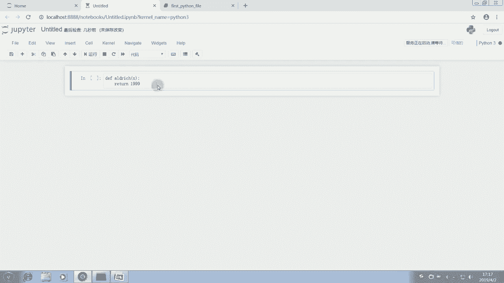

点PY好save，我们把它保存好了。

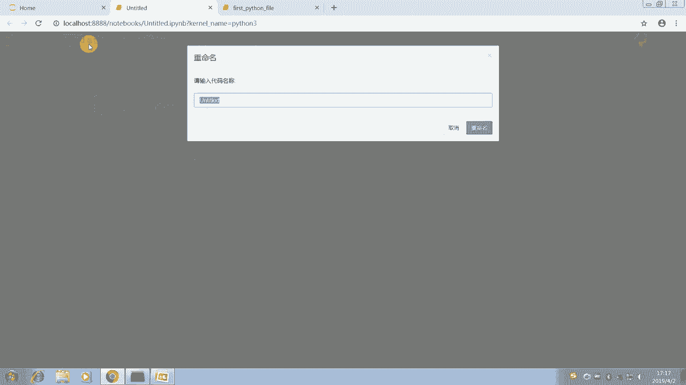

那么这个时候呢它就是一个啊Python的一个fire，一个order是点PY的一个文件了，那么我们在使用的时候呢，就只需要在这边import它就好了。

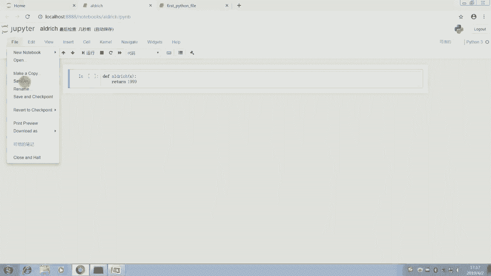

那，我们现在去看一下呢。

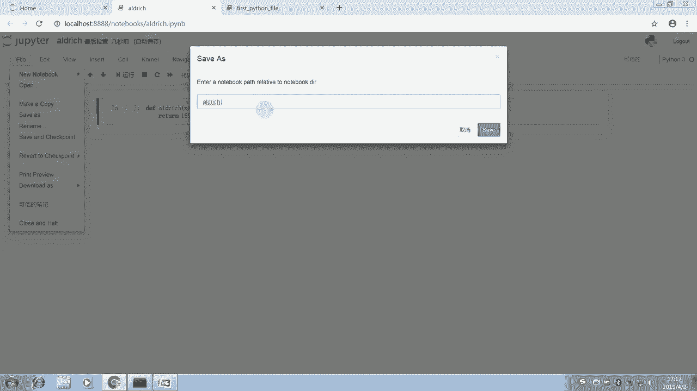

啊在这个里面呢就有一个OUDERAGE点PY了，我们现在试着import它一下，import elderage好，我们试下import这个模块诶，他就已经引入了，也就是说即使我们刚刚没有定义这个。

我们也可以直接使用这个OUORGE，我们可以直接ELDERGE的这个任意的一个数啊，比如SK我们可以运行一下，它其实就会返回，返回一个相关的内容啊，可以看一下这地方呢出了一点小问题，出了点小问题。

啊我们刚刚调用函数的过程中出了点小问题，其实是因为这个，我们import了，我们因为我们保存了这ELDERVERAGE，在我们这个啊文件夹里，所以呢我们现在可以看一下我们这个工作目录，下边啊。

这里有个outrage，那么我们import的这个OUDERACH呢，是我们下一次呢，比如说我们重启了这个服务，理论上呢这个时候呢这个我们这个define，我们这个定义的这个ORGE。

这个函数呢已经是不存在了，但是呢我们可以直接的import这个OUDERATE，这个函数包，那么也就是说模块包，那么我可以在这边调用OUVERAGE，点OUDERICH的。

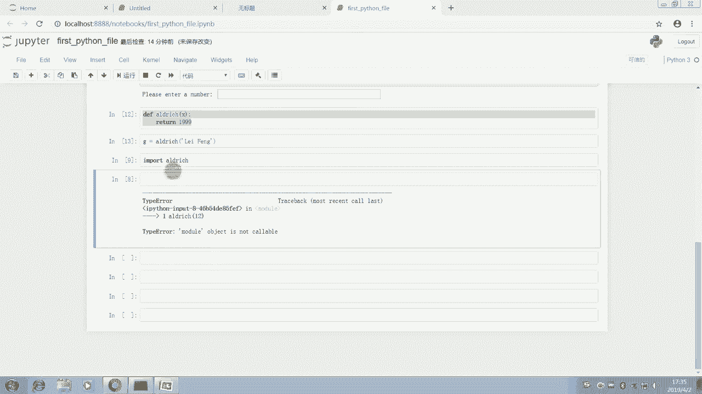

比如我们随便来一个hello，那我们预期它输出结果呢还是1999啊。

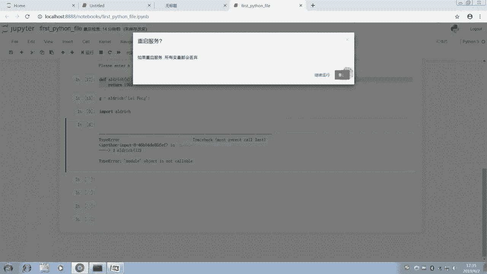

果然还是1999，因为我们之前的这个定义呢，就是不论你输入什么，它都是1999，那么这个函数的话呢，我们在这边呢，就是说大家要更注重的是，自己的编程能力的一个提高，也就是说怎么怎么去把这个函呃。

程序先设计出来，设计出来以后呢，我们在想着怎么去把它给定义成函数之后呢，在想着怎么去把它封装起来，最后呢就是我们封装以后呢，怎么去调用这个函数，让它能够啊批量的执行呀，或者说自动化的工作等等啊。

包括后面呢我们会教大家怎么批量的，就是怎么先从这个wind的数据库里呢提取啊，用我们这个代码来提取数据，接着呢会教大家怎么把这个提取数据的过程呢，封做成一个函数，最后呢是如何把这个函数封装成一个模块。

然后呢引用这个模块直接去重复的提取数据啊，批量提取数据，那么最后呢，我们讲一下这个导入模块的一个固定步骤啊，有一个叫import的一个方式，导入import pandas的话呢。

它就表示啊我们把这个pandas这个模块的导入，Import pandas as pd，这个是我们最常用的，就是说我们引入导入这个pandas这个模块，但是呢我们给它重命名啊。

给它一个起起一个简写的名字，简简单点的名字，Pd，这样呢我们在运用的时候呢，我们只需要额在前缀pd点什么什么什么，那么我们就知道我们引用的是pandas模块，那导入所有函数的话呢。

就from pandas，Import star，这个的话呢我们不提倡，为什么呢，因为它的效率会慢一点，因为它把模块的所有的都导进来了嘛，如果你使用的模块一多的话，你把所有的内容都导进来。

它其实会变慢一些，那么import pandas这个呢也不提倡，不会那么简洁，所以呢我们用的最多的呢就是第二个，Import pandas s p d，那么Python呢也有一些内置函数。

我们可以简单的看一下，那么我这边呢给大家一个Python的官方，Python的一个官方文档，大家复制这个文件呢，打开来呢就可以看到Python的这个，Python的这个内置函数大全，那么有大概这些函数。

比如abs啊，绝对值啊，dict字典，然后我们讲过float format啊，help help呢，就是你不知道一个函数怎么用，你就输入help，把这个函数输进去，可以进行一个查询。

input int land list等等等等，大家可以课后自己实践一下，那么这个如果有任何疑问的话呢，也可以看我给大家编辑的那个呃，这个Python的一个教程，大家可以看我给大家编辑的教程。

这个在上节课也有说过，在我们的课程的课件里面，这儿有一个课程讲义，打开来以后呢，就是我为大家编写的我们这个课的一个讲义，大家可以看一下，比如说啊我看一下我们这节课的话，应该讲到后面了。

我们讲到这个基础知识这循环，然后包括我们这个啊while循环等等。

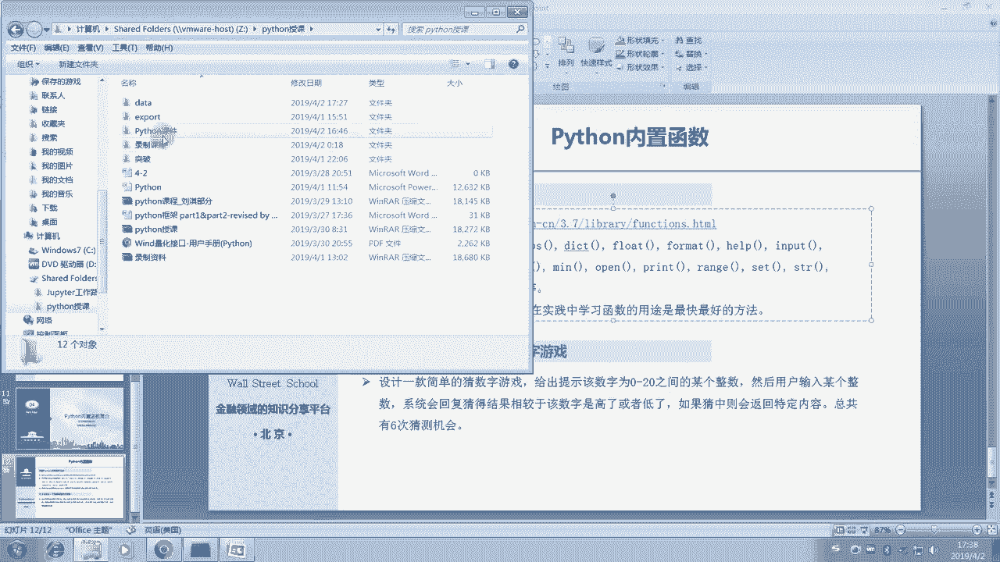

以及函数的声明和调用等等啊，我都给大家额进行了详细的定义。

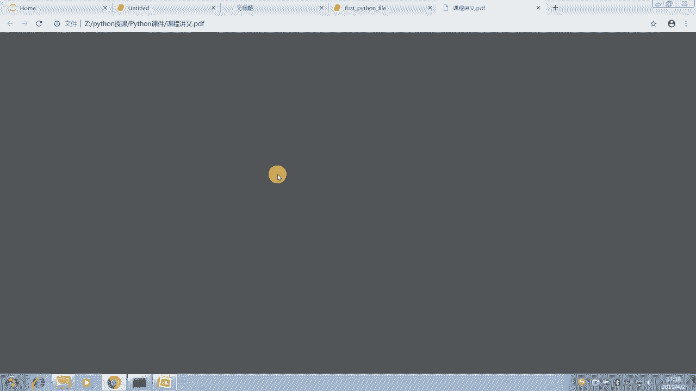

这样的话呢，大家课后可以好好的看一下相关的内容，然后这儿呢有一个猜数字的游戏啊，我们的这个可以给大家课后的，作为一个练习使用，那么我们在课上呢也介绍了一个，利用Python呢做一个描述性统计。

以及或者说我们用Python，和用户之间进行一个互动呢，我们在课上也已经简单的给大家介绍过了，那么在课后呢大家可以结合这个例3。3的啊，以及我下面的示例代码呢做一个相关的练习，希望大家多多练习。

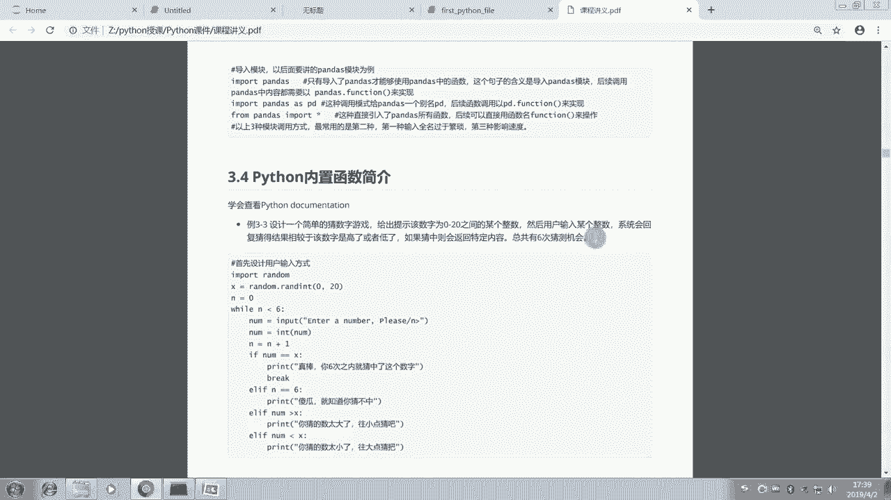