# 14天拿下Python金融量化，股票分析、数据清洗，可视化 - P5：05 Python基础金融分析应用 - 数分小诗 - BV1bFDSY9Ep5

。

各位同学大家好，欢迎来到华尔街学堂，我是刘老师。今天我们在上一讲的基础上呢，我们来讲一下pyython在基础金融分析中的应用。上一讲呢我们讲讲解了python的变量类型。

python的变量的数据类型以及啊比如说字符串呀，然后整数浮点数等，包括他们的计算以及相关的操作。那么我们还讲了python的控制流语句啊，条件语句以及我们说的循环语句啊，for循环和Y循环。

那么今天呢我们就在上节课的基础上呢，把之前的所有的知识融汇贯通一下。那么讲一讲他们在基基础金融分析中的一些简单的例子啊及其应用。那么在。金融分析里面，我们怎么样用python完成一项工作呢？

那么首先呢我们要根据这个操作的一个顺序呢，对这项工作进行一个分解。也就是说啊我们经常可能遇到一个比较大的一项金融分析工作。但是呢我们可以通过把这项金融分析工作呢分解成多个小的部分啊。

中间可能还需要一些辅助的工作。那么逐步逐个逐个的把这些小的部分呢解决，最终呢拼装成一个完整的程序。这就有点可能呃大家都有经历过，比如用excel来做一个相对大型的一个项目。

也都是先把这个项目分解成若干个小的部分。那么对每一个部分的一个执行。然后最终呢把所有的那呃各个部分的结果呢进行一个汇总进行一个拼接。然后呢呃做成我们最终的一个数据分析的一个结果。

那么现在呢我们想做一个这样的问题，我们要分析一个项目的I22。那么首先的话呢，我们要先知道IR2它到底是什么，对吧？那么它就是我们说这个净现值呃等于零的时候。的内部收益率的一个收益率就是IR2。

那么我们现在要知道啊现值。那么现值怎么求呢？我们就会考虑到这个问题，我们就把它这个求IR2呢分解为了，先要知道我们要知道现值怎么求怎么计算，也就是计算现金流的现值怎么计算。

接着呢我们可以把这个现值啊和NPV结合起来，把它打包成一个函数，然后我们可以设计一个循环无限的使得NPV接近于0。然后这个时候呢寻找那个I的值，那么就是我们所要找的这个IR2。

那么这样一个过程它到底是如何我们如何去实现的呢？我们可以先一步一步来进行思考。😊，首先的话呢我们是呃先看一下如何计算一系列的现金流的现值。那么我们呃还是带大家巩固一下打开这个。

jupyternotebook notebookotebook的一个步骤。首先输入这个anal count，我们发现这里有一个no count prompt，我们点一下。

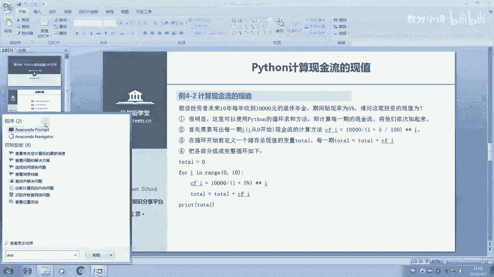

那么同样的跟上节课一样，在这里呢我们先要呃找到我们希望的一个工作环境啊。我们知道这个呃刘老师的工作环境呢是在C盘，是在jupyter working pass我自己创的一个文件夹。那么我们只要CD。

然后这个。

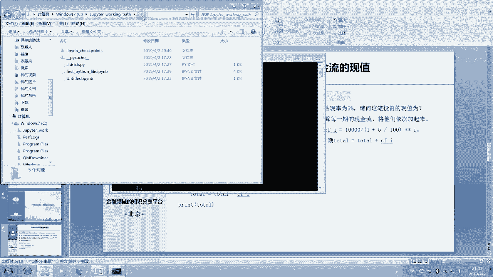

复制粘贴一下啊，右键粘贴过来这个路径。那么我们回车。等待它的一个登录啊啊，他现在已经到了那个文件夹，我们发现它的那个working pass已经改变了。

那么我们只需要输入jupiternotebook进行一个登录。那么这个时候呢我们的。

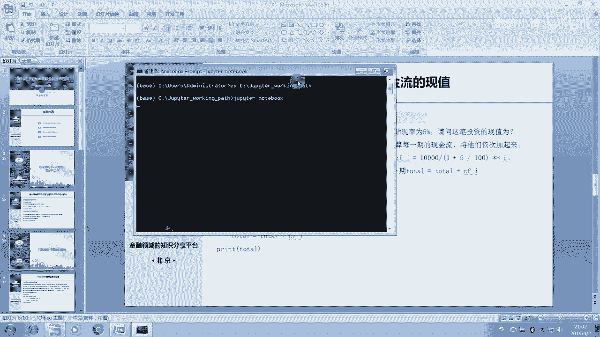

ju笔短中的 book呢已经打开了，它正在打开。好，我们发现已经打开了。

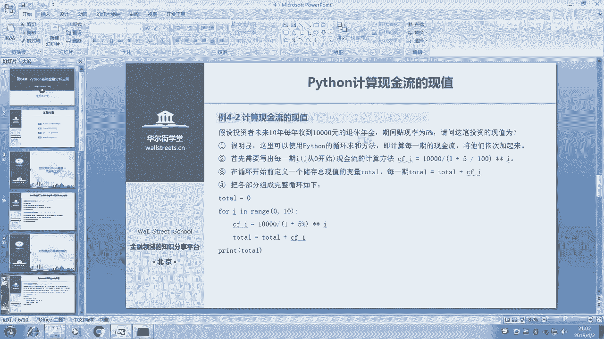

在这里呢我们不再接着上节课写了，我们新建一个文件啊。re这有个untitled，我们把它删掉。

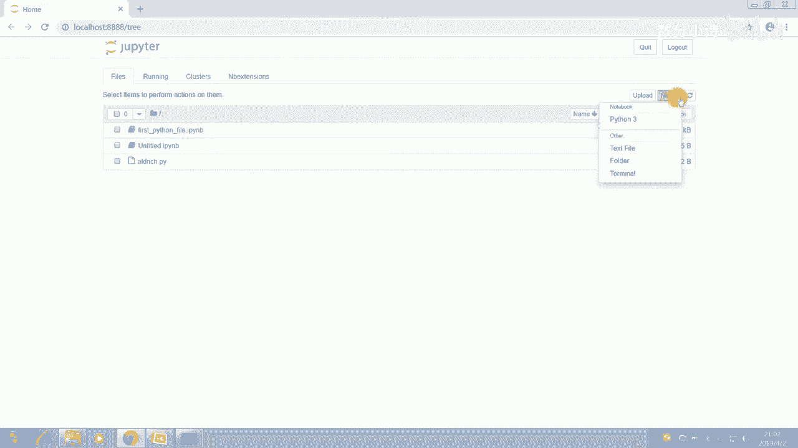

我们不希望这个呃我们的工作目录变得特别的丑啊。我们现在新建一个呃python ray的一个fire。

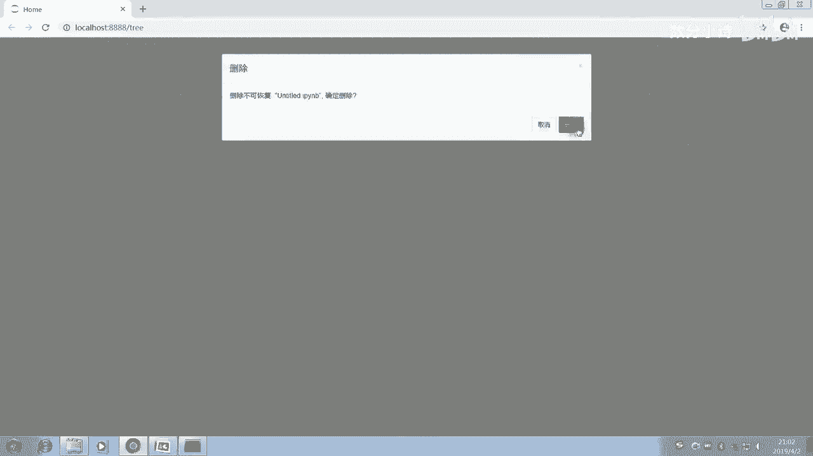

那么新建出来这个文件的话呢，它是一个untitled，没有命名的。我们给它命个名。因为我们现在是讲这个第四章，那么我们就给它命名为chapter four吧。

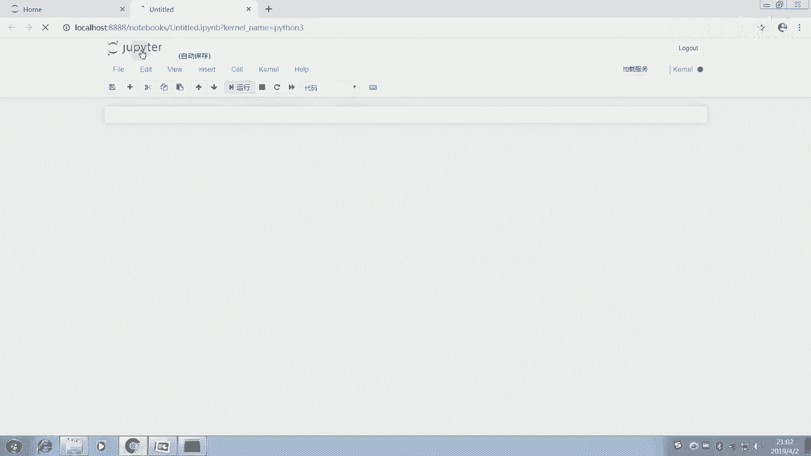

好，那么对于这个chap four的话呢，我们现在要做一个什么问题呢？我们看一下例4。2计算现金流的现值。他说啊，假设这个投资者未来的1年每年能收到1万元的一个退休年金，那么贴现率呢为5%。

那么这笔投资的现值是多少。那么可能有朋友说这个很简单，我用excel也可以甩。没错，那么这是我们作为一个引用的例子，就说啊怎么我们怎么去在python里呢，我们做一个签把这个最简单的搞定。

然后其实我们是通过这个呢来回顾一下啊，上节课我们讲这个循环是怎么样的进行操作。

那么在这里的话呢。我们这个呃我们这个程序怎么去写呢？我们很自然的想到用for循环，那么也就是for。

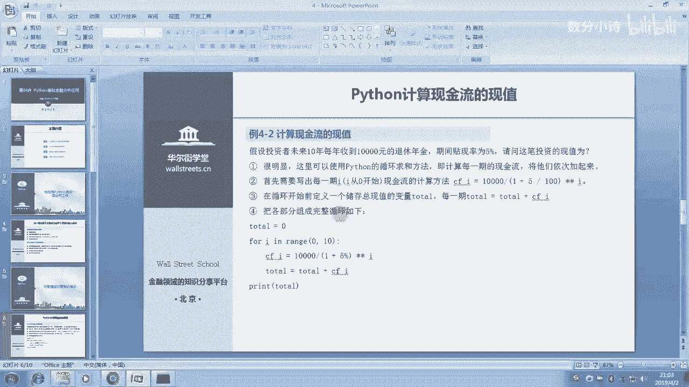

对于forour I in rangech，我们想一下，一是十年嘛，所以我们这边就是rangech ten。那么我们的每年的这个现金流呃，或者说每年的现金流的贴现CFICF杠I会等于多少呢？

那么就是每年有1万美11万元除以。这个假设这1万元啊，我们假设它都是年初年年末给的，那么就除以1个5%，就是0。05%。注意了，这里的话呢，python是你不能直接输入5%的，输入5%呢。

它会出现一个报错。那么我们要改成0。05，把它做成浮点数的输入啊，然后呢乘以一个这个I是乘以I嘛？大家要想下I不对，I是从从谁从几开始，I是从零开始，这里的话呢，如果我们把I放进去，那么D。

我们当I等于零的时候呢，也就意味着说第一期呢，其实它是就是1万元。但实际上第一期我们应该用1万除以1。05的1次方。所以这里呢我们应该是I加上一个一啊，应该是I加上一个一。好的。那么我们做这样一个问题。

第一期应该是I加上一个一。那么接下来呢我们要设计一个totaltotal是什么呢？total我们要用来存储总共的这个现金流的现值。那我们这里知道我们要设计一个初始值，它的初始值是0。

那么这里呢就是我们上节课讲的一个呃非常重要的思想。就是你在每一期都在上一期的基础上加上当期值，那不就做成了一个呃循环，使得每一期都能够求得之前所有期数的和吗？

这个呢其实就是python的循环的一个核心思想。所以呢在这里呢我们把它们做完以后呢，我们只要给一个print，把这个total把它给打印在屏幕上就好。现在点击运行，我们发现也就是每年呢如果给你11万元。

那么都在年末给未来十年贴现率，如果是5%的情况下，这些钱贴现到现在，它的价值呢是77217元，那么很快的我们就给它计算出来了。当然呢你在这边呢可以考虑对它进行封装，把它做成一个函数。啊。

我们简单的讲一下怎么封装吧。首先要define我们定义一个discount函数，假设这个名字随便起啊，discount函数。那么接着呢我们把这个totaltoal的话呢。

是我们在这个函数里面定义的一个变量。那么total的话呢是在循环之外定义的。所以呢它是一个全局的一个变量。或者函数内的一个全局变量。那么我们先不用管什么是全局变量。总之呢这个totto呢。

我们是要在循环开始之前就要定义好，对不对？它跟循环呢其实是没有关系的。就是说它的初始值是跟循环没有关系的，初始值都是0。那么对于I呢在range ten。

这个时候呢我们就知道这个ten呢应该是一个呃外部的一个参数。也就是说啊你这个年金到底给多少年。所以我知这个ten我们可以用N来表示是一个整数。那么每年给多少钱，这个1万呢，应该也是一个这个全局变量。

我们用CP来表示啊，cash flow per year。然后呢，后面的话呢，这个贴现率呢应该是也是一个外部变量。我们用R来表示。这样一来的话呢，所有的外部变量呢，我们都把它给换成了参数，换成了字母。

那么我们把这些字母呢填进这个函数的这个参数的括框这个后面的括号里。那么在真正的调用这个函数的时候呢，我们可以先把它运行一下。在真正调用这个函数的时候，我们只需要输入discount。

我们把这个N假设是20年，然后每年给1000元钱，然后贴现率假设是0。060。08。那么我们把它进行一个运行，我们就知道哎这样一笔钱的话，它的一个现值呢是9818元。

那么这样就实现了我们的一个个性化的一个需求。那么如果你有很多很多个这样的现值，你只需要再设计一个循环。然后对这个函数进行在这个循环中进行使用。比如说forourIin range啊，ten，然后呢。

那么把这个10个这个呃现金流给它啊，不，然后把这10个不同的这个参数啊，就不同的这个现金流把它给进行一个调用，我们就可以把这个呃批量的输出一个现金流的限制了。

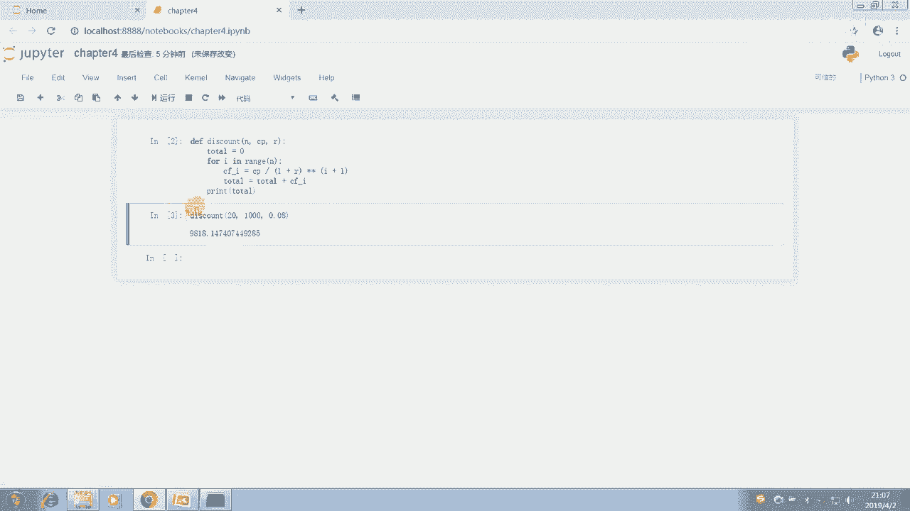

那么通过这个的话呢，我们就需要大家着重巩固了一下这个rangech这个函数啊，着着重巩固了一下range这个函数。

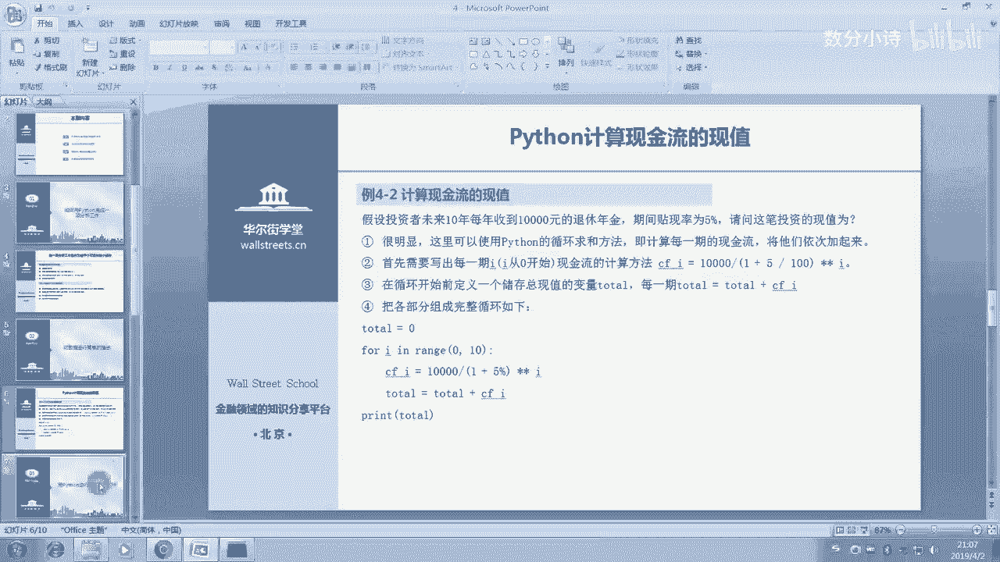

Okay。好，那么接下来呢我们想讲一下，就是说啊我们更进一步的去讨论。当这个不是说每年给1万，而是这个现金流在变化的时候，我们怎么去呃求出这个净现值来呢？

或者说我们怎么去判断一个项目值不值得投资计算它净现值呢。那么这样一个操作呢，我们也肯定是考虑通过循环来实现。

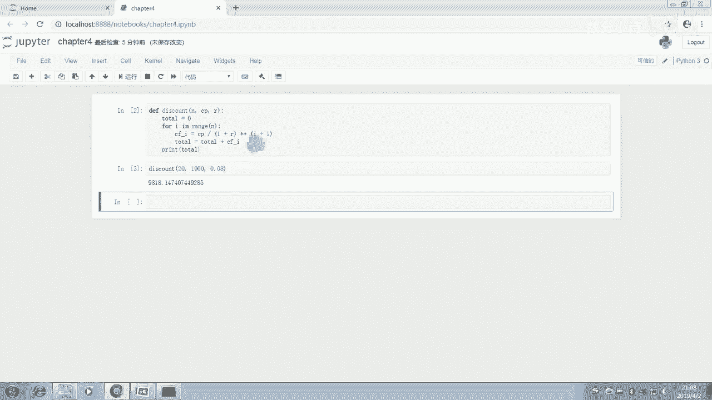

好，首先呢我们会想啊，就是说我们会首先肯定要知道这个呃项目的一个净现金流，它的一个这个现金流的。

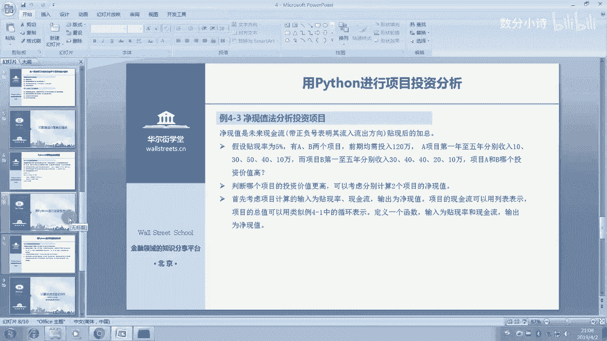

情况我们把它们用一个list呢封装起来，用一个列表封装起来。那么A项目的话呢，它的一个现金流的情况呢，第一年呢是投资了120，所以是-120万。那么第二年是10，第三年呢是30。

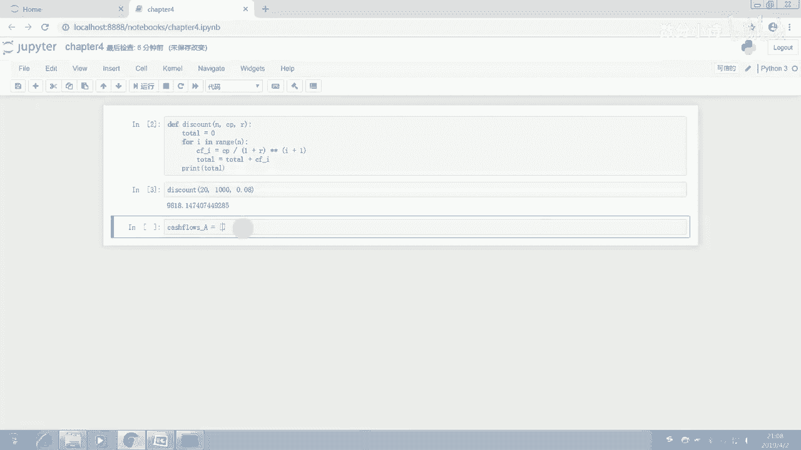

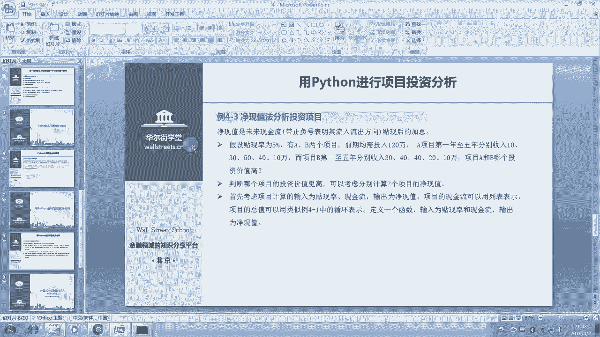

第四年的是50。第五年呢是40，第六年呢是1好，它呢是一个这样的操作，期初是-120，然后往后呢是这样子的一个现金流。那么在这里呢，我们介绍一个新的函数叫enumerate函数。它呢是专门用来做循环的。

比如说这里我们for eye。Cash flow。In enumerate。Cash flows。A。好。大家想一下啊，我们看一下这个enumerate它到底是个什么含义呢？

首先呢我们在后面加了一个list。其实enumerate呢它的含义呢就是说我产生一个tuple类似tuple的东西，什么呢？就是对于cash flow的里面的每一个元素来说呀。

这个cch flow这个 list每一个元素，我都会产生它的一个编号以及这个元素的一个呃值。比如说对于-120的话呢，通过enumerate呢就变成了一个变成什么呢？变成了零位置零的。😊。

这个元素就是一个零，我们看一下啊，它就会变成我用注释写在下写在写在下边。它就会变成0。-120，然后呢。10。230这种。那么我们像之前我给大家讲过。

我们对那个字典的一个for for呃 four kV inic点ites很类似。这里的话呢I cash flow分别对应的就是这个位置零和-120。那么也就是说啊每一次的循环都是对这样一对数啊。

比如说零对这个位置和这个数值进行一个循环。那么我们就很自然的知道这里的话呢，我们应该怎么去计算，就知道呃这里的话呢我们这个。啊，首先我们也要定义一个total，我们不能把这个total忘记。

因为total呢是作为储存我们最终总的结果的一个一个一个数值一个变量total。那么我们接着呢就知道啊，所以呢总的变总的现值呢净现值呢会等于上一期的净现值，上一期的total加上什么呢？加上这个。

本期的一个cash flow现金流。那么我们这里也要注意了，这个时候呢是ctch flow，而不是cch flow A啊cch flow，然后除以什么呢？除以这个一。加上我们这个0。05的。多少次方啊？

那么这里是I次方还是I加1次方，大家要分清楚，这里呢就是I次方啊，为什么呢？因为第一期是-120是支出的，第一期是当期当时最早的这个时候就支出了。然后所以呢这个I等于零是对的。

最最早的时候这个120是直接支出的。然后往后每一期啊把它给贴线过来，就是这样子进行一个计算。我们运行一下。啊，sorry啊，这里要注意啊，这里我们也需要一个函数，把它给print出来。

把这个total给print出来。还是需要明确啊，就是你代码缩进目的是什么呢？就是说对于上面这些条件呢，那么我们要执行这些代码。而最后这个print呢，我们只需要执行一遍就好了。我们运行一下。好。

最终的结果是0。66993，那么说明什么呢？说明就是说。对于我们这样一个项目来说，它的一个净现值呢就是0。66993啊。我们这个项目的净现值是0。66993。那么我们怎么把它封装成函数呢？思路也很简单。

也是一样的。我们定义一个计算NPVF的一个函数。那么它第一个参数呢是我们上面使用到的这个rateate这个外部的一个折现率。第二个呢，当然就是我们给的这个现金流。当然我们这里不能输cch flow A。

而且要输cch flow，因为是对任意一个现金流而言。那么我们给它设计一个组合是total。接着是对于I和这个cch flow里面的每一个小cch flow里面的每一个小cch flow。Yeah。

对cch flows里每一个小c flow而言啊，我们每一轮呢这个total呢都会等于total。加上。啊，等toal加上我们这个t flow。除以一个。一加rate。的平方啊，不是平方的I次方。

每第I年啊就是I次方。那么这里呢我们给它返回一下啊，对于这函数我们给它一个设置一个返回值，叫用return设置一个返回值。就是说我们执行这个函数呢，它会返回我们这个total这个值会返回这个值。

那么我们把这个函数给它运行一下。接下来呢我们把cch flow A和c flow B呢给它输进去。ctch flow A呢是这样。那么tash flow B的话呢，我们看一下是-120第一年。

然后30404211。-12030404020。

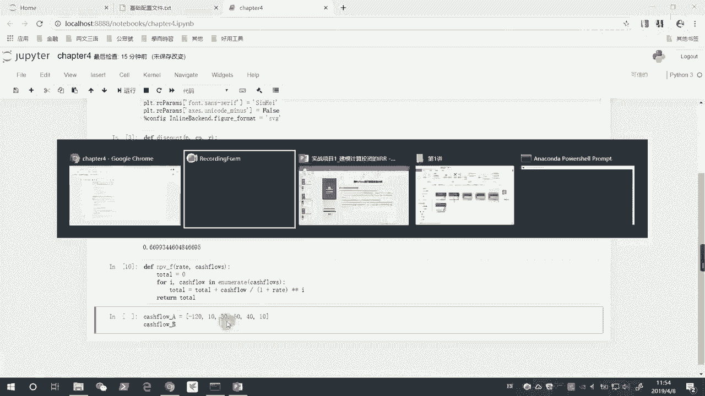

1那就是这个情况。那么这里的话呢，我们就知道了。他们的界限值我们就可以知道了。那么因为我们我我们刚刚设置的上面这里不是print，这里设置的是一个return，所以它会返回一个total。

那么我们可以就拿拿一个变量去接住这个total啊，就接住它返回的这个值，我们就变义NPnet value A会等于NPVF的0。05，然后cash flows a。那么这里就注意了。

我们把这个啊上面定义的这个形式的一个参数呢改成了实际的。我们需要用到的参数啊，这就是这个参数的一个设定。我们设定一个通用的参数，我们把它叫一般化。然后呢，我们在特殊的例子里呢。

我们可以把它变成特殊的我们需要的这个参数。然后这里是cch flow B。那么我们这个可以运行一下，接下来呢我们把它们print出来，print一个net。

valueue A和一个net value B。那我们把它print出来，发现呢这个net value B呢是更大的是3。69，net value A呢只有0。6699。

所以呢我们选择这个通过净现值来进行投资的话呢，我们当然会选择这个投资项目B，而不会选择投资项目A。我们会选择净现值更大的。这个呢就是我们定义一个函数来求证净现值的一个求现金流净现值的整一个个这个过程。

这就是我们的一个净现值的投资分析方法。那么接下来呢我们再看一下最后一步啊，我们如何去计算一个投资项目的I2。

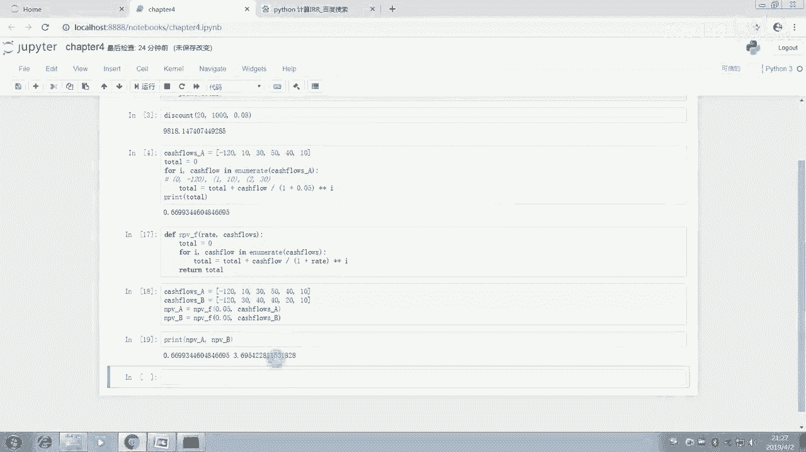

那么我们说L12呢是净现值为零的时候啊，它的折现率呢就是内部回报率。所以呢我们现在呢就考虑啊我们怎么去计算这个投资项目的IR2，也就是怎么找到这个净现值为零的时候的一个投资呃回报率。好。

那么在这里呢我们通常的思路呢就是说啊我们会去思考啊，就是说用二分法来求IR2。那么什么是二分法呢？就是我们假设啊我们假设。

呃，我们假设呢刚开始给一个很低的这个折现率，假设是0，然后我们再给一个非常。我们再给一个非常高的折现率，比如说是。You。那么我们可以预期啊这个折现率当它非常高的时候呢。

我们这个NPV呢肯定是显著为呃肯定是负的。那么我们这个折现率非常低的时候呢，它的NPV呢肯定会是正的啊，否则的话呢我们就没有必要计算NPV了。如果不满足这个条件。那么接着呢我们可以考虑一下。

就是我们这个给一个把这两个rate呢进行一个平均。

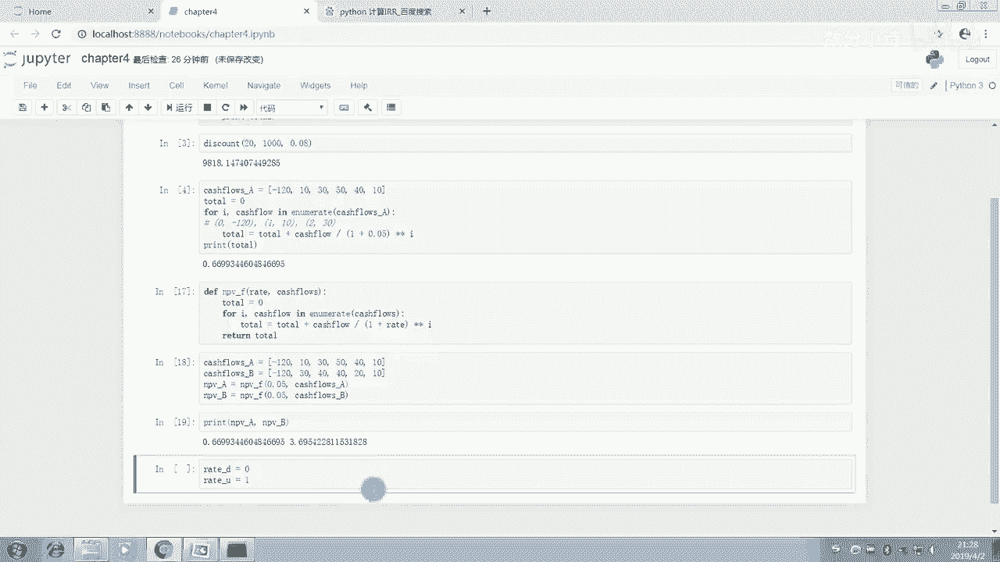

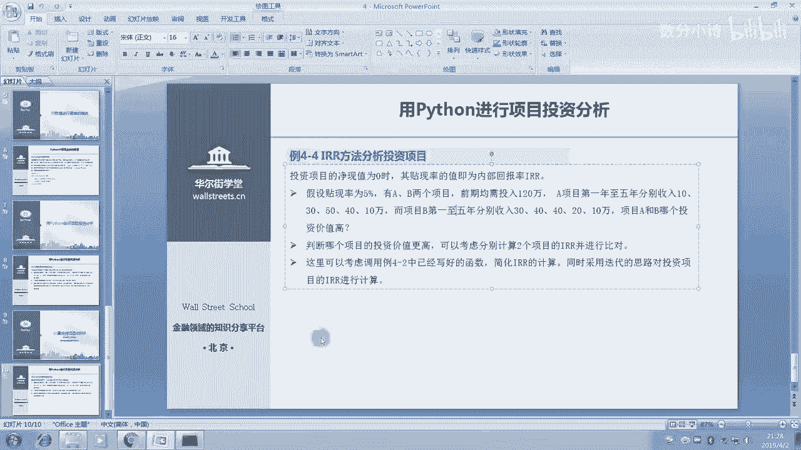

Yeah。为什么进行平均呢？啊？我们就是想看一下平均的情况下呢，它的NPV呢是否会大于0。那我们就计算一下NPV。F。NPV等于NPVF，然后rate我们把这个rate输入进去。Cash flows。

好的，也就是说我们这里的话呢。也就是说我们这里的话呢，这个NPV的话呢会等于NPVF我们这个地方呢相当于调用了我们上面定义的这个NPV函F这个函数。那么求算了这个re的NPV。那么我们可以接下来思考啊。

如果这个NPV啊它大于零的话呢。我们就知道呃。如果这个NPV大于零的话呢，那么我们就知道啊我们肯定要把这个NPV呢和那个小的就是使得就是上面的这个rate d或者rate you。

我们看来就会和使使得这个NPV小于零的那个我们把这两个呢会的这个rate呢会再进行一次平均。然后呢把这个平均呢用来替代这个另外那个rateD。那么就是作为这个我们说的这个新的一个呃。我们新的一个这个。

呃，利率啊或者说这个折现率，然后带进函数里再去进行计算。通过这样的计算呢，不断的夹逼。直到什么情况下，我们把这个操作停止呢？直到它。这个NPV小于我们要求的一个精度的时候，什么意思呢？

就直到这个NPV啊，它能够比如说小于0。01或者小于0。1，也就它的绝对值会小于这个数字的时候，我们才让它停下来。所以呢这里呢我们也是同样的，我们定义一个函数。我们同样的给它定义一个函数，比如说。

D definey我们定义个函数IR2L。然后它的一个参数有cash flows，以及我们给它its，我们给它循环个1万次吧，先假装循环1万次啊。当然现在先不用管我们这个怎么。怎么假装？

我们就先假设有这么几个参数。那么呢我们现在呢有这么一些rate。那么我们要做这些操作。在这里呢我们肯定是Y啊要进行一个循环。Y这个NPV就是当这个NPV啊啊。

当然这里是ABSNPV我们上节课也有介绍这ABS函数啊，就是。跟excel里的ABS是一样的，它返回的是一个绝对值。YABSNPV的话呢，它如果说比这个0。00。01还大。也就是说啊如果它比0。

0001还大呢，就说明呢它没有达到我们的一个要求的精度，它就没有足够的接近0。因为我们说NPV接近零的时候，或者等于零的时候，它那个rate就是我们要逼近的那个rateate。那么现在呢它Y它大于0。

0001的时候，也就是说当它不满足我们这个要求的时候呢，我们就要对它进行一个操作了。这个时候呢，如果NPV啊计算出来，它是大于零的。他如果NPV呢是大于零的，那么我们就要把这个。小的这个值为什么呢？

因为小的这个值呢，我们要把它换成现在这个rate，明白吗？因为这个小的这个值呢是使得NPV大于0。那么我们把它换成一个现在这个稍微更大一些的这个rate的话呢。

我们就可以更加的使得他们呃rate和那个呃就是小的这个raterate d和这个rate you呢夹逼的更紧一点。那么我们就。就有点类似我们数学里的这个夹币定理啊。当然这个的话呢，可能大家已经忘记了。

不过没有关系了，你就想象的是你只需要让他们不断的靠近。那我们看下这个时候呢，我们要重新计算一下这个rate就会等于rate u加上rateD。然后呢，我们再除以2。好，这个时候的NPV呢我们得再算一次。

会等于NPV的。ふタ。Rate。Cash flows。好，那么其他情况下呢，else呢，那么rate you。就会等于rateate，为什么呢？因为这个时候呢就表示NPV小于0。那么NPV小于0的话呢。

说明一个什么情况呢？NPV小于零的时候呢。就说明啊我们这个U呢是取的更呃取可以取的更小一些啊，取的更小一些，它依然是小于零的。那么依然可以把这个夹逼起来，把那个它这个区间缩短。

所以呢这个时候的rate就会等于。我们继续的对它进行一个夹逼啊。reU加上rate D。那么除以一个2。那么我们把这个继续的NPV呢也计算一下，会等于NPV的F，然后rate。Cash flows。好。

这样的话呢，我们只要它无限的执行这个wherere循环的话呢，它会一步又一步的重新重复这个循环。那么直到最后我们这个NPV的这个值呢，它逼近我们需要的这个精度。那么我们就返回我们这个rateate。

这个时候的rateate呢就是我们需要的这个呃内部收益率了。好，那么我们把这个函数呢给它定义下来。定义下来以后呢，我们可以分别的把这两个项目呢带进去。一个项目呢是呃一个项目呢是我们这个。

Cash flow。Cash flows a。那么它的iteration呢是1万，那么我们可以呃不需要，因为我们已经它是一个告诉我们，就是说默认情况下就是1万。

所以呢我们这里就照抄就好了iterations。等于1万。那么我们再看一下IR2的这个cash flow speed。cash flow B的话呢，它的ateration呢我们默认呢也是1万。

那么我们对这两个呢进行一个计算，我们看一下O这个地方只输出一个结果啊，这是因为我们这个python的一个显。那么在这里呢，我们强调呢就是各位可以进行设置一下啊，我们这个jupiternotebook。

那么就可以使得我们这个呃显示的过程呢会更加的顺畅。比如说我我现在。啊，我们在这个地方呢多输入一句。我们在这里insert above一下。这个呢在咱们的讲义里也有啊，我们可以打开讲义。

把这个代码呢粘贴一下。那么我们打开课程讲义啊，这个地方呢有这一大段代码，我们把它复制一下，把它复制一下呢，粘贴到我们这个第一个单元格。第一个这个格子里呢，我们直接给它运行。好。

我分别给大家介绍一下我们这些代码的含义啊。比如说第一个第二个，第三个呢，其实我们是在引入一些模块。然后后面的话呢，我们其实也是在呃引入一些，比如说这里我们是。啊，这个地方呢就是我们刚刚说的。

因为我们一次的话呢，这里只会显示一个结果啊，所以我们希望它一次能显示多个结果，所以我们就把它这个直接给引入。然后包括后面的这个是处理excel的，然后以及呃像些相关其他的设置。

这些设置呢我们都给大家呃直接给大家汇总好了。所以大家直接的一个引入就好了。啊，这个地方可能是第一次引入了，导致它有点慢。呃，我们可以重启一下这个客户客户端。那么我们单独试一下引入这一条吧。

我们今天先其他的我们先暂时不考虑，我们单独试一下这一条。那么它导入完成以后呢，呃它设置完成以后呢，我们再运行。OK这个INF没有定义是为什么呢？是因为我们刚刚重启了这个，所以它这些函数都没有定义了。

所以我们现在再运行一下。啊，cash flow A没有定义。那么我们把cash flow A也要定义一下。好，现在ok了。运行一下。好，还是只有一个结果。

那就说明我们刚刚那个设计设置呢其实是没有设置到位的。我们重新的把这个这个设置给它。啊，粘贴进来一下。这个呢我们也给他认识一下。好，我们现在重新的运行一下。好，我们发现屏幕上呢是展现出了两行。

那么第一行呢就是我们前面的结果，第二行就是后面的结果。刚刚我们这个设置的这个ipon设置的这个目标呢，其实意思就是说啊，把我们整个框框里呢所有执行的代码呢都给它显示在屏幕上的结果。

所以呢我们看一下第一个项目的内部收益率呢是0。0519。第二个项目是0。062。那么对于这个情况来说呢，我们会选择投资第二个项目。而对于进现值的方法呢，我们刚刚也发现啊，我们也是选择投资第二个项目。

那么今天的内容呢讲到这里呢，基本上就告一段落了。我们学习了什么呢？我们学习了如何就是循序渐进的把一个项目进行拆解，先从简单的入手，然后逐步的给它呃汇总到最难的，最后呢把它定义成一个函数。

然后以至于后面呢，我们可以把这个函数呢，直接保保存成模块，在计算项目分析的时候呢，我们可以直接调用啊，只需要说它的输入输出啊，只要是输入能够保持一致的话呢。

那么我们就可以实现我们的批量的对项目进行投资分析的这个IL2的计算。包括其他的呃很多的计算方法呢都是触类旁通的。所以呢希望大家在课后能够更多的去。

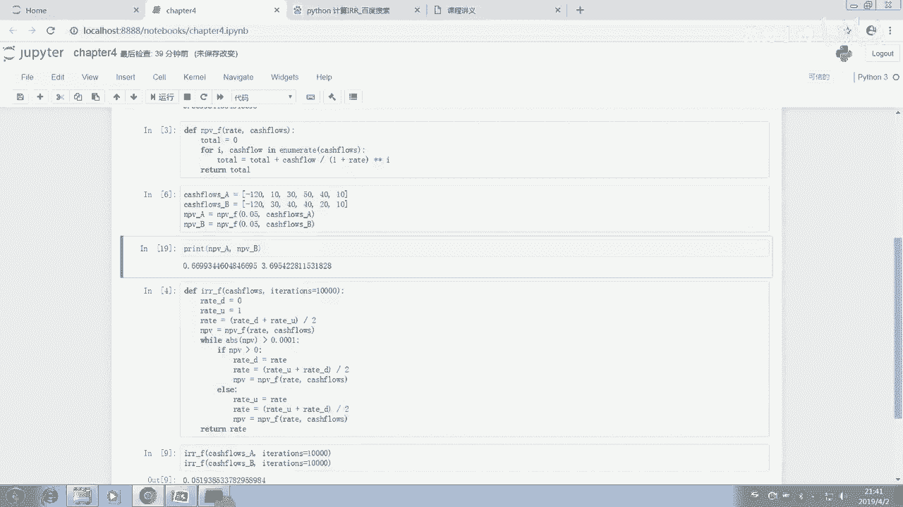

花时间把python的这些最简单的控制流，最基础的变量，以及我们的循环啊搞把它弄清楚一些。那么尤其是说涉及到这个使用for循环和Y循环的时候，那么大家要对这个循环的条件把握的较好。

那么根据我们这个例子呢，大家也可以在课后呢阅读我们的课程讲义。课程讲义里里呢有我完整的一个课程的一个代码。大家可以看一下，这个这个是我们课程讲义。那么在讲义里的话呢，翻到第四章的话。

有我们这个课程的一个我上课过程中的一个完整的代码。那么就希望大家在课后呢对代码呢进行一个相关的复习。

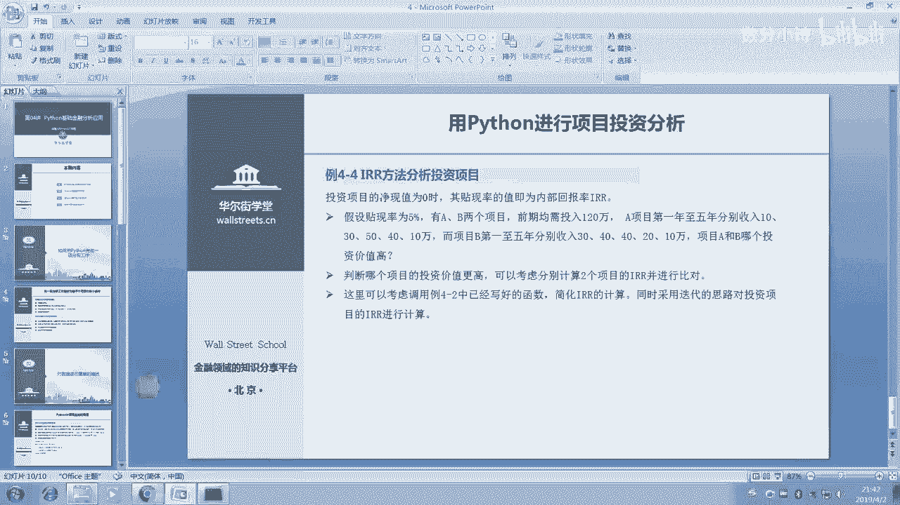

今天的课程呢我们就讲到这里，然后谢谢大家。希望呃我们下一次课呢就讲如何成为编写编程的能手，以及读写TXT文件和excel文件的一个方法和在excel文件中进行相关的操作。好的，谢谢大家。😊。

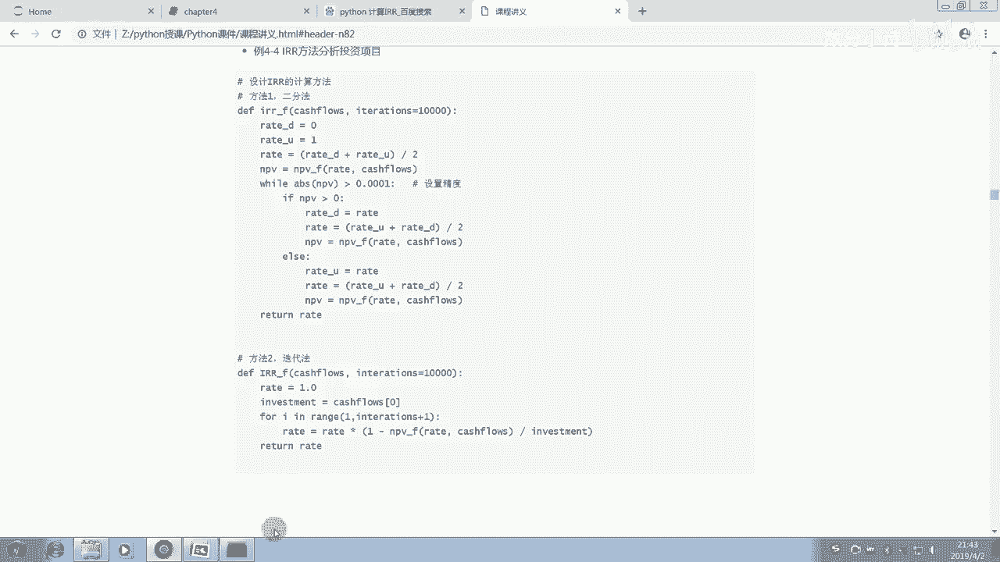