# 14天拿下Python金融量化，股票分析、数据清洗，可视化 - P7：01 使用Numpy数组实现金融数据高效计算 - 数分小诗 - BV1bFDSY9Ep5

。

同学们好，欢迎来到华尔街学堂，我是刘老师。今天呢我们来带大家学习开省高级编程的。

n排包和pandas包的一个速成课程。那么在今天这个课程里呢，我会向大家详细的介绍n排和pandas这两个模块的一个。相关的特性。

以及他们在我们金融分析领域的一个啊比较好的呃比较合适我们金融分析领域的相关的使用方法。以及就是我们常用的excel的一些操作呢，如何用npack和padas呢去替代。今天的内容的话呢。

我们主要是分为四个部分。那么第一部分呢是n海数组的介绍。第二部分呢是讲pandas这个模块的一个介绍。第三和第四部分呢是刘老师给大家带来两个实战的项目。首先我们来看一下囊排数组的介绍。

那么n派的话呢，我们是。呃，我们先看一下安派的一个简介。n派是python语言的一个扩展程序，它支持了大量的维度的数据与矩阵的一个运算。此外的话呢，n派呢也对这个数组的运算呢提供了大量的一些函数库。

n派的话它是一个运算速度非常快的一个数学库。我们在python里面呢主要是拿它进来进行一个数组的一个计算。那么今天的话呢，我们主要是要学习这个numb排的一个相关的数组的一个构建。

以及数组的一些常规的操作。那么希望呢就是说大家在学习这个n排以后呢，能够把这个n排数组掌握，并且呢在之后啊学会阅读n排的一个docu。在金融领域的使用当中呢。

我们的那这个n派呢通常是与sippa和matepllib呢一起使用，也就是和我们这个呃ciip呢是sentificpyython和我们这个matpl lib是绘图库。

我们后面会讲和这个一起来使用这种组合呢是在mate labb里面呢是比较广泛的。呃，我们是广泛用用于替代这个mat labb的。在pyython里面。那么它是一个非常强大的一个科学计算环境。

有助于我们通过python来学习科学数据科学，或者说机器学习。

好，那我们看一下n派的话呢，它是一个针对多维数组的一个科学计算包。这个包里呢有其他其他许多的科学计算的函数呢可以调用。数组是相同数据类型的元组，按照一定的顺序的排列组合。

也就是说这里要特别注意是相同数据类型的一个元组，按照一定顺序排列的组合，它是讲究顺序的啊。我们记得就是我们的字典呢，它是没有顺序的啊，列表元组，还有我们现在讲的数组啊，它都是有顺序的。那么生成n派数组。

我们现在讲一下，就是怎么去生成一个n派数组。

首先呢我们这个新的议角，我们给他创建一个新的那呃丘比ternotebook。那么因为这个是我们的第三次的课，但是这是我们的第六讲，所以我们把它命名为。

Chapt 2。

6。好，那么我们在这一讲里呢，首先的话呢我们还是要看一下之前呃，我们看一下我们之前的这个。看一下我们之前的。内容为什么呢？因为我们要把那个环境的设定啊，就对这整一个的我们的个工作的一个设定。

对这个交互室的一个设定，我们可以把它复制过。好，我们把它输入一下。输入以后呢，我们现在呢就看一下啊，我们这边看大家看我们有一个import sNP就说我们把n派这个模块导入。

并且呢把它名字呢重命名为或者说给它起一个代号叫做NP啊，叫做NP。那么我们现在呢就对这个n派我们来看一下怎么去生成一个数组。那么生成一般的囊派数组呢，我们可以直接的。

用调用这个number array这个方法啊，这个函数我们调用number array，然后在里面呢输入我们想要形成的这样一个数组，我们给它输进来。比如说0123456啊，我们把它给输进来，然后运行。

这样的话呢，我们这个ar一呢就呃。创建好了，这就是一个一般的数组。我们点击一下运行arread one，那么它就是1个0123456的这样一个数组。我们把它叫n排数组。那么ret two的话呢。

我们再创建一个数据。那么re two的话呢，它会等于比如说我们这次呃不完全用数字，我们用一个呃字母来。但是记住我们这个地方都要是相同数据类型，它是。呃，我们看一下这个数组。那么我们点击一下运行。好。

我们看一下re two。好，这就是我们的re two啊。are two。我们看de type可能是它的类型，它的类型。好，我们还有一些特殊的方法来生成数组。比如说最常用的一种。呃。

n派一点arrange方法。单派点arrange方法。那么我们这个arrange呢后面填一个1，我们看一下会生成一个什么样的数字。这个n排range呢就有点像我们那个呃range的那个函数。

但是呢它是可以直接帮我们生成从0到10，但是不包括十的这个呃间隔为一的一些数字。好。同样的，我们还可以再看一下，刚刚其实这里我们没有仔细的去阅读这个arrange函数它的一个呃说明。

我们看一下这个说明arrange这个函数呢有一个起点啊，这个值star，它用这个中括号括起来都表示是什么呢？就是说啊这个呢你是可有可无的一个参数。如果你给一个star的话呢，它就从这里开始。

你不给的话呢，就从零开始默认。那么有个stop stop是一定要给的啊，这个地方就没有用中括号括起来，就说一定要有一个终止的值step呢是指我们的步长，也就是说每间隔多少呢？呃，给它取一个数。

那么比如说这次我们不从零开始，我们从一开始，然后我们要以20为末最后一个为结尾，然后呢间隔二进行取数，我们来运行一下，看一下这个ar four会是一个什么样子。alread four我们来看一下。

那么从一开始间隔为2，所以呢就135791113151719啊，在20之前不包括20好。那么我们这边呢就讲了两种方法，生成数组，一种是普通的生成。

一种是用numb arrangerange生成一个顺序的一个数字啊，包括这个arrange的一些参数，大家也要学会啊，在jupiter里面呢利用这个简单的一个呃函数的这个说明来对函数进行一个调用和学习。

那么如果说呃还是看了说明还不清楚的话呢，那就直接在google或者在百度里面呢搜索这个函数的名称，比如n点arrange，大家一搜，哎，打开那个documentation进行一个阅读就好了。

那么我们还可以生成一些比较特殊的数组。比如说我们生成呃全部是一的数组，那么我们就numb派点one，比如说三，那么这就会生成一个33个一啊这个数组。比如说我们要生成run派点ones。

我们要生成一个呃我们要生成一个有特殊形状的数组。那么我们可以看一下，我们在这边呢只要输入numb派点one，我们输入一个特殊的形状2332，那么它就会形生成一个3乘2的数组。我们看下面。有三行有两列。

那么这个3乘2的一个数组啊，一个单排数组。那么我们也可以生成方正，比如说EYE啊，我们I眼睛，那么我们生成一个方正numb派点I three，那么它就会生成一个对角上对角线上的这个。

值都唯一的一个我们说的一个矩证，或者说方正。那么如果我们把这个三呢换成四呢，那么就是有4个啊这个4乘4的一个方阵，对角线上的元素都是一。我们还可以生成一些相关的随机数组。

那么在这里对大家介绍一些常用的随机数组。这里呢有一个n派里面的一个random函数，就是我们n派里面的一个random函数。random点rand three的话呢。

这个函数呢它就是说生成长度为一的位于0到1之间的随机数啊，长度为3，就我们生成三个三个数的一个n派数组。但是他们都是位于0到1之间的一个随机数组。那么看一下，这些都是在0到1之间随机抽出来的一些数。

然后呢，他们的话呢呃长度呢一共是3个，对吧？我们看这里有三个数啊，这是一个n派数字。那么我们还有别的方法，比如n派点random点ren。这个函数呢。就是生成二行三列的一个位于0到1之间的一个数组。

我们看一下啊，这是生成二行三列位于0到1之间的数字。那么我们后面那个23其实是给它的一个这个形状啊，这个数组的形状。那么还有run让派点random点random。3、比如说我们这样子，那么这个的话呢。

实际上呢它的含义呢就是说生成了长度为三的，但且满足标准正态分布的随机数字。标准正来工布的学习数值啊，我们发现是这样子。还是满足标准正态分布的一个税计数据，然后是生成三个数啊。

n态点random点reending还有这样一个函数。那么这个的含义呢就是说啊我们呢在0到100的范围内呢，随机生成数数组10个，随机生成10个数啊，0到100的范围内随机的生成10个数。

这个呢就特别适合用于我们说的随机数啊，随机数。那么在这里的话呢呃就想跟大家说啊，我举了这么多例子啊，刘老师举了这么多例子，大家应该都能看出来。

我们调用这个numb派的 randomdom这个模块的时候呢，都要先写numb派点random点再去调用最终的自己需要的那个。那么前面的这些呢，我们可以把它理解为我们是从一层一层的去调用。先去。

去到这个numb派这个模块里面，选择numb派这个模块，接着选择random这个呃函数，然后在random里面的这个rand这个具体的这个操作，或者说这个rd这个函数，那么一步一步的往后选下去。

那么我们再看一下，比如说我们还可以用n派点random点ranending，其实这些方法大家都可以课后自己多多尝试啊。比如这里我们要在0到100之间呢，我们假设要做一个4乘5的方阵。

我们是不是可以像前面一样呢，也在后面加一个topupple呢加一个元组表示4乘5，然后就可以输出呢我们试一下，我们发现确实是这样子的。这样呢我们就生成了一个0到100之间的随机数组成的4乘5的方阵。呃。

四场五的举证。那么我们还有一些别的方法，比如说我们想。呃，随机的抽取啊，我们这边假设先定义了一个n派的一个数组，numb派点random。点readit，我们先随机定义一个数据。这样一个数组。

我们已经定义好了，那我们可以看下A的话呢，它就是一个随机数组啊。由0到100之间的数，我们随机去抽20个。那么对于这个A的话呢，我们其实在numb排里面呢，也有对这个数组进行一个抽样的方法。

这里这个函数呢就是n派点re点choice，我们对A谁对谁进行抽样呢？对A进行抽样。然后我们抽几个数呢，我们抽5个数，我们现在抽一下看。那么得到的结果呢，就是84、74、11、66和10啊。

这就是我们的一个抽样。那么还有一种呢就是类似打扑克的时候的一个洗牌。比如说numb派点random点shuffle，那么洗牌嘛，我们就是shuffle这个单词，我们假设是array一来对它进行抽样。

我们先看一下array一长什么样子。呃，瑞一的话呢在这里它是一个呃顺序的一个数组。我们对它进行一个洗牌。我们看一下它是不是就变成随机的一个数组。呃，我们看一下瑞一啊。那么瑞一呢现在就已经被打乱了啊。

6123540被打乱了。这个shuffle呢就是一个洗牌啊，有点类似打麻将里面的洗牌，或者说打扑克的洗牌。好。那么我们这个生成n排数组的方法呢，就简单的介绍了一下。

主要是介绍了这个numb排点arrange函数和numb排点random这个函数。那么在课后呢，大家对这两个函数呢，要多多的去使用一下，多多练习一下，把他们的这个各个的特点都搞清楚一些。

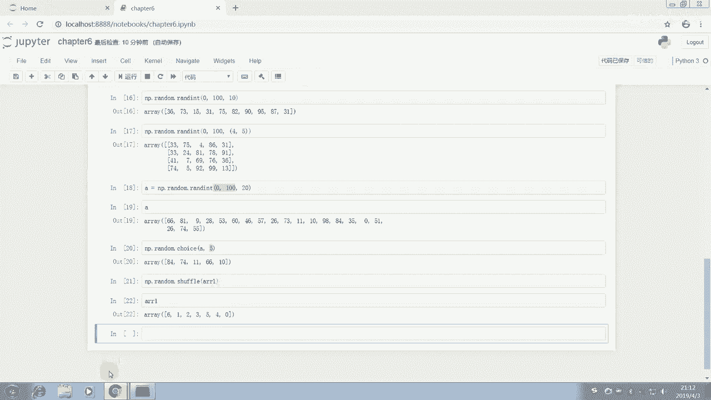

好好的可以复习一下这个相关的内容。那么我们接着来看一下numb排数组的属性和数据选取。n排数组的基本属性。那么我们给出一个数组呢，我们当然要知道这个数组的形状啊，数组的大小，数组的类型和数组的维度。

那么我们一一来看怎么去呃把这个看呃把这个属性给它看出来。首先很重要的一点就是大家在学习的过程中啊，一定要多去总结，尤其是说对于一些有共性的内容啊，要学会触类旁通。

比如说我们讲到属性的时候，大家的第一反应就应该是一个对象的属性，后面就应该打一个点，跟上那个属性的名称。然后那个名称后面还需要括号嘛，一般来说是不需要括号的。

因为我们只是查看它的属性OK那么如果是一个方法，如果是一个函数呢，那往往就需要有一个括号。好，这里我们假设我们给出一个数字。这个数组呢是一个。3乘3的一个数组。好，大家可能会觉得说为什么还是3乘3呢？

我们这个来看一下，大家就知道了。那么我们现在呢第一步，我们现在这个array已经给它创建好了，已经给它创建好了，我们运行一下，把它给生成。那么我们想看它的形状，我们就array一点 shape。

这个呢就是看它的大小。那么三乘三的一个数组。我们看啊三乘三是什么含义呢？第一这个aree这是第一个第一层这是第二层就第三层，对吧？它每一层的话呢，它一共有三个元素，我们就把它看成有三行。

然后每每一行呢是不是有三个元素啊，就三列，所以我们这个地方先ar shape的话，我们先打开array来看一下，然后arrayship，我们来对比一下就可以看得出来。这样子就可以看得出来。

array我们输入 array的时候，是不是这也就是一个呃三行一行两行三行三列的一个数组啊。所以呢它的ship呢，你把它ship它ship属性呢点开来看呢就是3乘3的一个数组33。所以它一共有9个元素。

那我们还可以看一下readd sizeize输出的是什么？好，瑞典size呢就告诉我们，哎，它是一个3乘3的数组，一共有9个9个这个数啊9个数。一共有9位数。比如说它大小呢是9。

那么它的类型是Dtype。我们来看一下这个时候呢我们输array点D type。

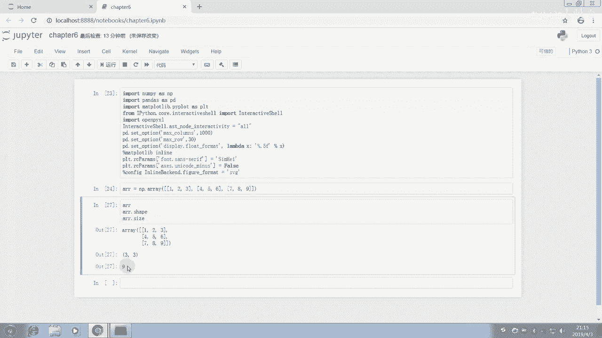

好，瑞点D type的话，它给出来的是int32，它是一个integer啊，integer一个整数整形整形。

好，那么还有一些相关的其他的呢，比如说呃它的其他数据类型有哪些呢？我们说这个n开数组的数据类型呢主要的几个数据类型，一个是整数，一个是浮点数。那么还有一个是object。

这个呢就主要是一些对象的一些数据，就是比如说呃一些特殊的一些数据。那么还有str啊str，还有unicode。unic主要是这些类型。那么在具体的使用中呢。

大家可以查用detype来查看它的数据类型是什么。比如说我们这里的话呢，比如我们创建一个array one。等于啱排。Yeah。我们创建一个呃字符串的一个数组。比如说只有一个字符串。好。

我们创建一个这样的数据，我们看一下。那么我们看一下everyone的一个de type。Okay。好，他type呢是这个UIUE啊unicode。所以呢这里的话呢我们就可以看得出来。

比如说我们在这个地方再加一个一，再加一个一。哎，我们再看一下它的一个type。这 type呢O还是这个还是这个。所以呢呃我们这个数组的类型呢就已经教会大家怎么去查看。那么接下来呢。

我们看一下它的维度维度。array点NDIM其实就是N dimension嘛。我们说维度是di。那么Ndi，我们看一下它的一个维度显示的是二，也就说这是一个二维的，这是一个二维的矩阵啊。

我们这个array呢是一个二维的矩阵，为什么呢？因为它是3乘3嘛，3乘3当然是二维的啊。那么实际上呢我们在操作中使用中呢，最常用的也就是一维和二维的一个数字。

那么大家可能会好奇三维的是什么样的那我们可以再给它扩上一个啊，它可以变成三维的。这里的话呢大家可以课后去尝试一下啊，构建一个三维的数字。三维的话呢，其实就是有X轴，有Y轴，有Z轴嘛。

这里的话相当于我们只有一个横轴，一个纵轴。因为它是三乘三的。那么比如我在里面。比如我们每一个里面，我们再构建一个。啊，比如说我们再构建一下。Okay。好，大家看一下，这里我们是。再构建两层啊。

比如说这里。She。Yeah。好，我们现在运行一下这个ray。那么我们再查看一下read dimension，我们发现它的 dimension变成了三层，为什么呢？因为本身的话呢，我们注意了这里的话呢。

它最里面呢就有一个这个就就就已经是一个数组了，对吧？然后它又外面扩了两层的括号，相当于最里面的元素呢，其实就是一维一个维度，然后呢，这个两个列表呢，又是一个又是相当于是两个元素，它又是一个维度。

然后呢装成一个大的列表以后呢，它又是一个维度，或者说最后呢又是一个括起来。那么它就是里面有几个维度啊，其实有三个维度的。大家可以这样去数吧。好的，在这里呢可能刚开始呢对这个维度呢会有点晕，没有问题啊。

没有关系。刘老师刚开始学的时候也会觉得这个维度是有点晕的。但是呢我们最常用的就是一维和二维。所以大家先努力的把一维和二维掌握好这个高维度的话呢，学到后边呢大家。等大家的理解能力慢慢上去了。

对这编程越来越熟悉呢，对这个三维、四维的都会越来越好理解。那么我们现在来学习一下n派数组的一个数据选取的方法。首先我们要创建一个 number排数据。先创建一个number一点arrange啊。

我们这边是输入错了。所以呢刘老师也经常报错，大家千万不要因为报错，觉得呃对自己。造成影响，这地方还是多了一个。好。我们运行一下张派这个ar。好，它是一个这样的array。

那么我们怎么去选取这个array呢？其实跟我们的列表是一样的。比如说我们这里要选取列这个第。我们要选取这个三，我们数一下第一个元素，第0123，我们直接输入三就好了。呃，这个地方。bug了一下OK。哦。

我们这里直接输入3。并行好，这个地方就是3。这是3。所以呢呃我们这个。可以选择它其中的一些数据的位置啊。比如说我们要找这个。第四个位置到第几个位置呢，比如说第四个位置到第九个位置的数数据。

我们直接把它运行一下，切片，这就是切片。那么比如说我们要找第三个位置到最后一个位置的，啊，就这个第四个位置，三是第四呃，第四个数啊，第四个数到最后一个数直接三啊，跟我们的列表的切片是一样的。

然后包括我们说这个地方呢还可以怎么呢？还可以比如说。2到-2什么意思呢？就是我们这个位置为二的这个元素啊，到位置为-二的这个元素中间的一些元素啊，包括2，但是不包括-2。所以呢我们看一下，就是这样子。

那么我们还有一些方法，比如说这个地方呢有一个按条件选取，这个呢是列表不具备的。我们看一下。在这里呢，array arrayray大于3，也就是说我们把大于三的那个array大于3的这个。呃。

这个相关的内容给它选举出来，当然是这个函数啊，这这个ra下面这个ra。我们把这个锐大于三的一个相关的内容给它选取出来。我们把这个ray大于三的给它选取出来，我们发现唉呃这边的话呢我们看一下。

大于三的选取出来就是456。没错。那比如说我们想选大于7的啊，运行一下。好的，这都是可以的这都是可以的。包括这个条件啊，我们可以选择这个ray里面大于7呃，且这个ray要小于12啊。

我们可以选取多个条件啊，这个不只是两个，可以有N个条件都行。好了，那么这就是我们这个 array的一些。索引切片和数据的选取的一些方法，用条件选取。那么注意了，这里用的是方括号，这里是方括号。

方括号里面加上我们这个索引的去条件，跟我们的list和dict都是一样的。不过dick传递的是key值list呢传递的跟这个numpier array呢就非常的像非常像。那么对于多维数组的话。

我们怎么去选取呢？大家可能会呃有一些新的疑问，我们来演示一下。对于多维数组的话呢，我们一个array等于n派点。Aray。然后我们先构建一个多维数据。123。456我们构建一个二维的吧。789。好。

大家这个代码呢其实只需要把内容输全，不需要输的特别规范。为什么呢？因为我们有神器，我们点下来它就自动规范。那么我们接下来。呃，把这个系量运行。我们来选取啊，比如说。

我们选取这个这个aree里面的第一个元素，这个第一个元素会是什么呢？如果我们输入everyone，大家可以思考一下。啊，其实很简单，为什么呢？因为我们。这个时候呢我们就把它当成是一个平的对吧？

当成是一条横线，一条一条一行。那么选第一个元素呢，就是选最外面这层里面的第一个最外面这层里第一个是什么呀？是123这个列表。那么我们选运行一下呢，自然出现的就是列表啊，或者或者说虽然还是array。

但是呢我的意思是大家可以把这个看作是一个列表。实际上它还是一个小的里面的一个array，取出来还是一个array，还是一个那个n排 array，但是就很像是说一个列表里面再空了，再放了三个列表，对不对？

那你取第一个元素就当然取出来是一个列表，这时候很像我们的列表的嵌套。所以说这个学习的话呢，是建议大家这个类比着来学，并不是说一定要百分之百的精确。但是这个我们进行一个类比就很好的理解。

它其实就是一个元素的一个选取。比如说我们选取第一个元素里的第一个位置的一个这个元素啊，sorry啊，刚刚这个一的话呢，我们是选取了第二个位第二个元素啊，那么比如说我们现在要选取第二个元素里的第二个元素。

就是array11啊。这样的话出现的就是五没有任何问题。啊，正确的。比如说我们想进行一个切片，我们想选取。第二个元素及以后的所有的这个元素的第二个元素。我们先看一下，就会出现的是。呃。

我们看一下出现的是什么呢？好的，我们看下这里出现的是789，出现的是789。好，那么如果我们是这样子的，我们可以看一下，多试，我们可以多试验一下。我们发现还是789还是789。所以我们这个操作的时候呢。

对于选取这个元元素呢，大家选取的时候呢，一定要特别注意啊，自己到底这个操作需求的是什么，需求的是什么？比如我们这里选取所有的这个三个三个行，然后我们只选取他们的0到。一的数据，我们看一下会是什么结果。

那么我们发现，那么我们选出来的是147，为什么呢？因为第一个的这个冒号呢，就代表了我们把三行都要选中三行都要选中。第二个0到1呢只是选择了第一列，对不对？0到2呢，我们是选择01，但是不包括2。

这样的话就会有两列，我们就把12和45，还有78选出来了。这个呢就是我们现在列表的一些操作法，包括我们可以同时进行两个切片。比如0到。2、那么也就是说我们选了哪两行啊，选了零行和一行，不包括第二行。

也就选了零行和一行，也就选了这个，再选了这个。然后我们再进一步的往内层去选，里边那层去选。我们只想选从第二个数开始到第三个数为呃，到第从第二个数开始。到第三个数啊，包括第三个数我们运行一下。

这样的话我们就把第一行和第二行的后面两个数都选出来了。其实这个三呢在这里可以不必要就好了。我们发现也是一样的结果，为什么呢？因为它这个地方呢三刚好就是结尾。好。

我们把这个数据的切片和这个多维数组的一个索引也讲了一下，包括三维数组和四维，还有N维，它其实都是由外向内的一层一层的去对它进行索引啊，大家可以课后试一下三维数组的一个索引，由外向内一层一层的去进行索引。

这个掌握这个规则。这一句口诀啊，由外向内，一层一层的进行索引。这样的话呢就不容易出错。我们现在呢刚刚讲讲了这个。单排数组的一个数据的一个选取啊，有这么多种选取的方法。

我们现在呢讲一下n派数主的一些数据的准备和重塑的工作。主要的话呢有三种方法，一种是as type，一种是is none，一种是。

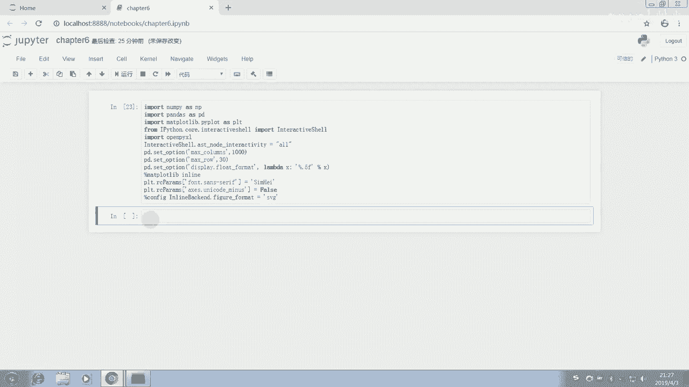

点unicode的方法，我们来看一下。我们先给出一个数据。n排点arrange five，我们给出一个呃简单的数组，我们可以看查看一下这个数组啊。我们刚刚说过arrange呢就生成0到5，不包括5。

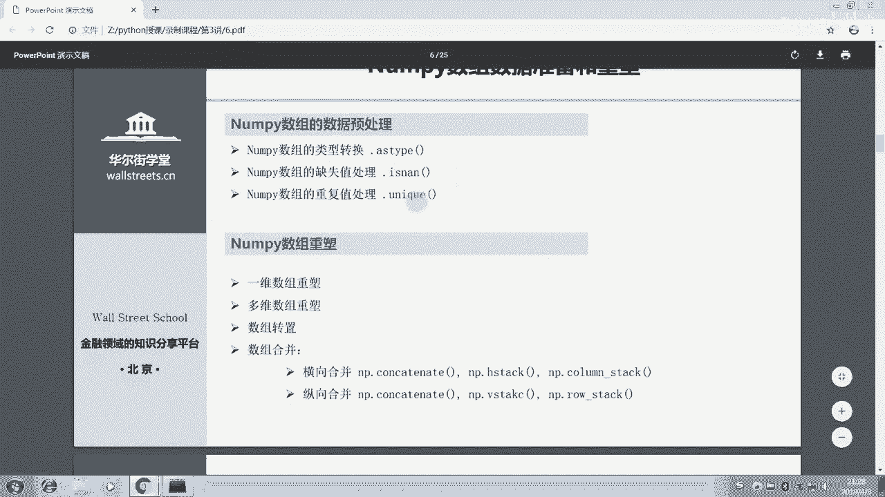

那么这个数组呢，我们查看一下它的类型，D type。我们发现它是整数型整型。那么现在呢我们想要把它转变成浮点数，我们怎么做呢？我们就用array。哎我们把它它这个aree呢用S type这个函数转换成。

Nampai float。我们看一下它有好几种选项，大家注意啊，这个地方有好几种选项，当派点float。呃，我们可以选择这个fat64啊，这最大的。比如我们运行一下。我们现在在查看这个reF。

这个新的我们赋值给它的一个函数。我们发现呢它后面多了个小数点，对吧？每个数后面都多了个点，相较于原来我们再查看一下它的detype它的一个性那个属性。

但是它已经变成了float64和前面那个integer32相比啊，它变成了float64。那么在这里呢，我们就进行了一个数据的一个转换。那么这个呢常用在就是我们的呃什么什么情况下呢？

就是说啊如果你的数据输出以后啊，或者说你导入以后啊，你发现你很多数值的数据呢变成了stream，或者说变成object变成了一些文本型的或者字符型的数据。那么你可能就需要对它进行一些这个修改。

比如说要把它修改成数据型的数字型的整数型啊或者浮点数型的，你才能够继续的去进行计算。否则的话，对于文本数据，或者说我们说的这种呃字符串型的数据，你是没有办法对它进行计算的。好的。

我们接下来呢我们来看一下这个缺失值的一个处理，怎么去查看缺失值，比如array等于。n派点array。嗯。我们当麦两锐，我们看一下这样一个函数。呃，这样一个数组。Yeah。我们把它运行一下。

这个时候呢我们设置了一个数组，我们在里面呢加入了一个缺失值。第三呃第二个位置啊第二。索引二的位置啊，我们看一下012第二个位置，我们加入一个缺失值。缺失值的用NAN表示，它的那个在n派里面呢。

我们用n派点NAN表示缺失值了，就有点像我们那个excel里面的什么函数一样，大家应该有记有印象的别这个呃NA一样，就有点像excel里面的这个NA函数一样啊。那么表示这个缺失值。

那么我们接下来呢要怎么去查看这个缺失值呢？那么很简单，我们用ar array的一个函数叫E字NAN啊is not我们看一下。呃，他回复给我们的那是什么情况呢？我看一下。呃。

他说啊 objectject has no attribute。那么这里呢就是我们搞错了，这里呢NAN不是一个虚表团是一个函数。所以呢我们用这样一个函数把ray放进去啊。

是对array进行一个函数的操作。我们发现它返回的是一个布尔布尔列表，大家发现哎，一个布尔列表。那么这个的含义是什么呢？就是说呃我在现在问pyon，我问pyon说你这个ar里面有没有缺失值啊。

然后第一个元素回复我说force，我不是缺失值，第二个回复我force，我也不是。第三个说去，我是缺失值。第四个说foralce，我不是。那么通过这样一个布尔布尔呃布尔序练的或者布尔数组呢。

我们就知道了谁是缺失值，它是缺失值，对吧？那么我们接下来呢，如果想找到这个缺失值，那就很简单了。就是我们只需要对这个布尔值进行索引。刚刚出现复呃fors的时候呢，因为我们说了，我们可以用这个条件去。

这个确定这个就是给出这个查找这个数据，或者说用条件来查询数据。那么我们这里面给出条件的，就刚刚那个n派点，就是说确定谁是缺失值。那么那些缺回复我不是缺失值的都是返回的是force这个布尔值。

那么for来说的话呢，你用它来查找呢，它是一个错误的条件。所以呢或者说它是一个拒绝的，所以它就不会显示在最终结果里，而只有Q的时候呢，它返回的就是缺失值的值。OK所以呢这里我们就查找到了这个缺失值。

它的这个缺失值呢就是NAN就是NAN就是我们这个NAN。那么我们接下来再看一下。我们接下来再看一下，就是说我们在这里呢怎么把这个缺失值给它替换掉呢？那么也很很简单，因为我们这个时候呢已经可以取出它来了。

我们只要对它进行赋值。比如说我们让所有的缺失值都等于0。🎼那么我们运行一下，比如说把零呢付给这个缺失的这个值。我们现在再看一下ar瑞这个数组。它的这个缺失值已经没有了，变成了0。

这就是我们数据分析里的一个典型的预处理的方法。当我们遇到有缺失值的时候，我们用一个新的值来把缺失值替换掉。那么我们相信的话呢，各位在呃经常用到金融数据的时候呢，也会提取数据，提取数据呢。

有一些数据它是不存在的，不存在它返回的是NA这个呃n number这个那那这个缺失值的这个表示，那么我们呢就可以用这种方法把它给替换成这个零或者大家想要的一些值。好的。

那么我们还可以再看一下其他的一些内容。比如说呃一个ar里面肯定会有重复值。我们来看一下，比如说一个array，如果有重复值的话，我们怎么去处理？我们先定义一个ner尔瑞。

这样一个numb排 array的话呢，我们运行它先运行它，我们看一下它这个输出的这个ray是一个什么样子啊，它有去它有重复值吗？有有二和一都是重复的。那么我们怎么把它的重复值去掉呢？

我们有一个函数叫numb排点unic。这个n派点unic这个函数呢，我们只要把ray放进去。那么我们运行一下。缺失值呢自动就被剔除了。这样呢unic就是一个独一无二的一个呃这个 array的一个。

自己啊独一无二的一个数。数组，那么我们还可以最后呢我们讲一下这些呃数组的一些呃。数组重数啊，我们讲一下。我们接下来讲一下这个数组重数啊，这个相关的预处理呢主要就是数据类型的转换。

缺失值的处理和重复数据的一个呃处理。我们现在来讲一下数据的数组的一个重塑。那么我们刚刚说过啊一个array啊，比如说它就n派点arrange。

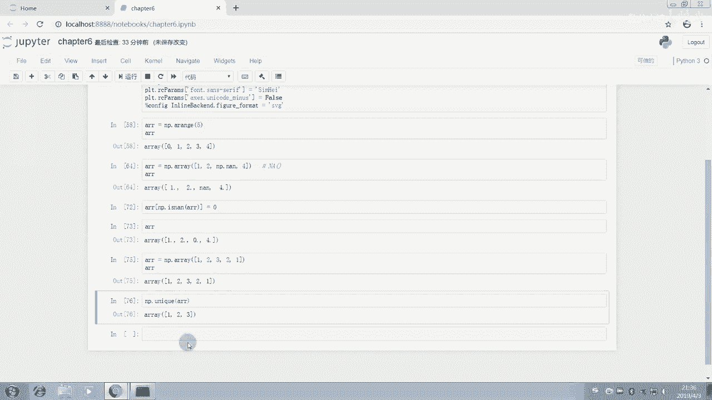

我们n派点range的一个buber。我们先创建了一个长度是8的一个这样的顺序的数图。

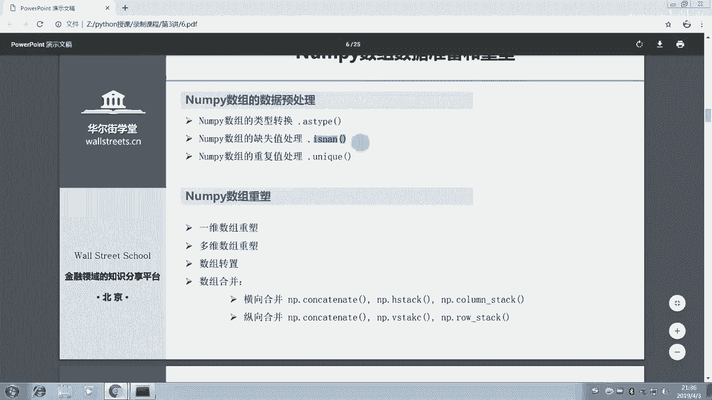

也就是等1234567这样一个数组。我们现在呢对它进行一个重数，我们把它换成别的形状，我们有一个reship函数啊，或者说reship方法。sorry。

这里我们有一个reship方法ray点reship24，我们把它换成一个2行四列的一个这个数组，我们只要对它进行一个reship就好了。但是我们要注意看这里的ray本身改不改变ray本身并没有改变。

大家发现，所以呢这里大家如果要得到一个数组，我们就复制给一个新的数组ray one我们看啊ray本身是不会改变的，但是ray one呢它是可以获得一个新的数组。

我们可以对它进行一个reship的一个功能。所以呢这个地方大家可以学习一下。包括呢我们如果想要它是42的话呢，也可以，因为它是8嘛，8可以等于2乘4，也可以等于4乘2。我们发现哎也是可以的。

包括我们可以一8试一下。也是OK的也是OK的也是OK的。然我们看瑞典ship。那么是1个18的一个数字。然后我们再看上面这个瑞d典sh。确是8的一个数字。所以呢这两个呢看起来呢这个aree呢。

我们可以看下上面这个array和下面这个ar one呢长得特别像，对吧？看起来是长得基本上一样的。但实际上呢他们的这个类型呢呃他们的这个sh呢是完全不同的啊。

下面这个大家发现外面多了个括号没有下面这个呢是1乘8的一个数组，上面那个是8乘1的一个数字，是两个完全不同的数组啊，不是8乘1啊，是8就是一个8啊，是一个一维，而下面这个是一个二维数组。

所以是完全不同的。大家要特别特别注意。在使用的过程中，如果数组的一个这个。数组的这个ship呢，如果形状没有搞清楚，那么很容易呢在操作的过程中，不管合并啊，还是之后我们讲一些高级的操作，都很容易出错啊。

所以呢这个ship呢大家有空呢都要查看一下，包括reship的一个使用，把它们在操作之前呢先转成同样的这个数据类型的呃这个数据形状的一个呃ner。好。我们接着往后看这个多重数组的一个重数啊。

刚刚我们讲的是一维数组的一个重数。那么多维数组呢也可以进行一个重数。比如说我们创建一个多维数组，numb派点。我们创建一个数组，多维的123。是我们可以不用特别在意这个格式。

我们可以用格式刷来刷它的5678。那么后面呢就是。1112。好的，我们这个数组呢给它创建完成了。那么我们用格式刷刷一下，唉它变得很美观。大家要习惯就是把自己的代码，用这个代码美化器美化一下。

所以呢在写作的过程中呢，也省去了大家很多时间。这就是为什么我们第一节课呢花了很大的篇幅和时间在讲怎么去设置9P端多的 book，它的一个功能其实是非常的强大的。那么这个ray点reship1个43。

我们什么意思呢？我们先数一下上面这个呢其实是一个二维的数组，它是一个3乘4的一个数组。我们先可以先看下它的一个ship。我们可以先看一下上面这个ship是3乘4。我们看下上面这个数据的样子。是三乘4啊。

有三行，有四列的一个数组，我们对它进行reship，我们把它换一下吧。因为三乘4是12，所以我们把它换成一个四行三列。四行三列的一个数组，我们对它进行换一下运行。我们发现瑞就被我们并行一个更换了。

比如说我们把它换成12，然后我们看一下能不能换成这个样子，换成一维的，哎，也是OK的。这样的话呢，这个瑞呢就被我们把它拆解成了一维的一个数组。好，希望呢大家在这个呃数据的一个重数方面呢。

已经能够基本掌握这个一维数组的一个重数和二维数组的重数。那么至于三维四维呢，其实也是一样的道理。你只要让他们三个数相乘等于12，你就可以把它塑造成任意维度的数组。

只不过是往里面传入那个topuple而而已了啊。你可以把它restrict成任意维度的。比如说这里啊我们把它进行一个塑造成1211的，我们运行一下，发现它就变成了这个三维的啊。

三维的12乘以1乘以1的一个维度的一个数字。好的，那么我就不详细展开了。因为三维数组呢，可能大家在实际的工作中呢用到的也是比较少的。大家先要着重的把最简单的最基础的内容掌握。

然后我们再去研究那些比较偏猛一点，比较难一点的。那么在分析的时候呢，我们主要使用的呢还是这个最基础的这个数组。还是最基础的这个一维和二维的。我们现在呢我们再继续呢把这个呃数组的话呢，还有其他的一些操作。

我们再讲一下。依然是这样一个数字。啊，这里我们少了个括号，你可能是报错了。他就报错了。运行一下好。呃，我们看一下我们这这个接下来呢我们要讲。数组的一个转制。数组的转制的话呢就是array。

我们先看 arrayray这个数组，我们刚刚已经说了，它是一个三乘四的数组，我们对它进行转制。大家可以预期一下数学里面我们线性代数讲的转制矩阵的一个转制，或者说数组的一个转制，它就变成这个样子。

变成一个四乘3的一个数字啊，我们把它转制过来。那么接下来呢我们再讲一下这个run派数组的一些简单的运算啊。我们在实际上创建数组的过程中呢，可以把这个reship这个函数呢给它一步到位啊。

reship这个方法一步到位。Arrange。我们假设安排一个6个数字啊，那么我们可以直接在后面点reship，接着紧接着就reship。那么他就被我们安排成1个2乘3的一个数字。变行一下，我们看一下。

查看一下瑞。啊，如果你还要对它进行转制再替。那么我们看一下可以直接被转制。所以呢这些方法呢是可以一个接一个的啊，并不是说一定一次只能执行一种方法，而是你可以一次性的把你所有想要执行的方法一次执行掉。

那么接下来呢我们讲一讲。囊派的数组的计算。n派数组的计算的话呢，我们把它分成两类，我们对它进行完全分类。把这个计算。我们看一下数组的计算的话呢，我们把它分成一个是数组和数字之间的计算。

一个是数组和数组的计算。数组和数字之间的计算呢，我们看一下，比如说我们现在一个array。我们对把瑞，我们先看下它是什么样子，我们把它先输出在屏幕上。好，array是这个样子。

我们把array呢加一个一，我们看一下会的结果。我们发现呢下面这个 arrayray呢是在上面这个基础上呢，每一个元素都加了一个一。这个和我们这个线性代数里的学到的知识是一样的。

那么array呢如果我们减掉一个一呢，那么我们发现呢其实也是是一样的啊，就在上面的基础上呢都减了一个一。那么如果我们乘以一个一呢。呃，我们乘以一个一的话呢，那么肯定是没有变化了。我们乘以一个2了。

我们发现就在上面的基础上呢，乘了一个2。那么我们在最后试一下，除以一个2。那么在上面基础上除了一个2，我们看一下能不能整除啊，整除下白看发现也是可以的，发现也是可以的。所以呢大家呢在使用的时候呢。

不要拘泥于整一个的这个形式，而是要多多的去尝试各种不同的操作。比如我们看一下乘方可不可以。啊，乘方也可以。那么我们看下开根号乘0。5啊，乘方0。5的乘方也是没有问题的。所以呢大家就发现啊这个n派数组呢。

它是适合对这个整体的一个数据进行操作啊，在我们那个list的一些方法的基础上呢，它可以更加广阔的直接对这个数组进行一个加减乘除，就非常的方便。以前我们可能要用循环，对不对？

要用循环才能对一个list实现，对，每一个数都进行一个什么样的操作，对吧？但现在呢我们只需要直接对这个n派数组直接乘就好了，直接加就好，直接乘方就好。好，最后的话呢，我们在这个n派数组的这个。

一些方法上面呢，我们再讲一下它的一个数组的合并方法。那么数组的合并呢，就涉及到一些时候，我们可能会有多个数组。那么我们要把它们合并起来进行一些计算，或者别的什么内容。那么我们进行一个合并的一个介绍。

我们先创建一些数组。好，我们先创建一个这样的数组啊。你看刘老师其实敲的很不规整，但是呢我们用这个代码美化神器美化一下。非常的美丽啊，美丽动人。好，我们接下来看这个。我们在这个数组合并的过程中呢。

有呃很多种不同类型的合并。那么我们主要选取就是说呃其实也就是分类为两种，有很多种不同类型的方法。那我们分为两种，一种是横向合并，一种是纵向合并。大家可以这样理解啊。

横向合并呢就是把两个表呢我们横着给它拼起来，纵向呢就是把一个表呢竖竖着接在那个另一个表的下方，或者说就是把一个数组竖着接在另一个数组的下方，就是横向合并和纵向合并。那么我们就要注意了。

这个数组的合并呢呃横向合并的三种方法和纵向合并的三种方法，最终呢给我们看起来的效果呢其实是一样的，就是说横向合并的三种方法的效果是一样的，纵向合并的效果是一样的。所以大家在使用的时候呢。

我建议大家掌握一个就好了。比如大家只掌握这个这个方法，或者说大家习惯这个H或者我觉得大家掌握其中一个然后其他的只需要了解啊，在用到的时候呢就。

不需要说样样都要掌握。因为我们毕竟是以短期入门以及快速的习得这个技能为主的。所以呢我们没有必要像那个学者一样，去把所有的方法全部都记住，全部都学会。而且我们也不参加考试。所以我们只要会用就好了。

毕竟这个会用提高生产力啊，而不是说我们学的越多，生产力就一定越高。那我们要花要在意这个性价比。所以呢我们现在主要介绍这个concatenate。我们把他们两个array呢。

我们concatenate一下。

好，我们concateulate一下，我们先不加这个acs，我们先不加它，我们先直接concateulate看下结果。哎，我们发现123456789101112。

它是在哪一个维度上进哪一个方向上进行拼接的呢？它是直接纵向拼接的，对不对？那么可能有朋友呃有同学要问了，我们现在呢如果想把它横向拼接要怎么办？那么刘老师给大家说过，拍摄里面呢有一个规则。

纵向和横向我们是怎么去定义的呢？就说啊如果说呃我们现在有一个坐标轴。那么我们这个竖着的这一条呢，在python里面呢，一般把它定义为零方向axs这个坐标轴为零的这个方向。横着的那一条呢。

它会把它定义为axs equals one，就是横着的这条，我们定义为坐标轴为一的这个方向用一来代替。所以在这里呢，所以默认的这个值呢AXIS这个X这个轴呢是0。

也就是说我们是按零方向去进行纵向的一个合并的。所以我们即使是零的话呢，它依然是纵向合并。但是横向合并呢就要改成一。这个地方呢就是一个横向的合并，我们就把它们横向的拼接起来了。

所以呢这个就是我们的concateate的一个方法。那么希望大家要掌握一下，大家注意了，这个地方呢参数呢是作为这两个数组是作为一个列表给它传递进去的啊。

或者说作为一个把他们两个数组给它组成一个列表给它传递进去的，而不是直接的every one every two。那我们再讲一下这个简单的介绍一下这个后面的两个方法，其中的那个tack的方法吧。

然后这个con的方法其实也是一样的。我们就不给大家介绍。我们给大家介绍一下Ht的方法。张排点H stack。这个呢是纵向平呃，这个是。这个 horizontalonal嘛。

H是 horizontalal的一个意思。也就是说横向的一个水平的拼接。我们这个地方呢要注意了，这个地方传入的是tule啊，不是我们刚刚的那个列表。

所以我们建议呢大家用上面这种方法传递列表更加看起来明明明了一些用concate方法。这里的H stack方法呢是传递的是一个tople我们运行以后呢，它是H嘛， horizontal。

所以是水平的一个拼接。那么自然还有个 vertical拼接vt。

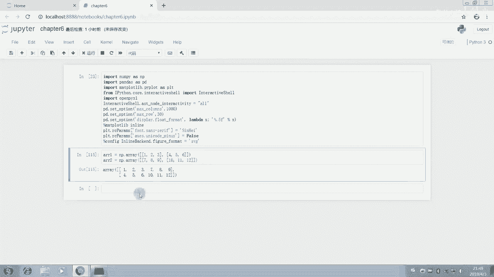

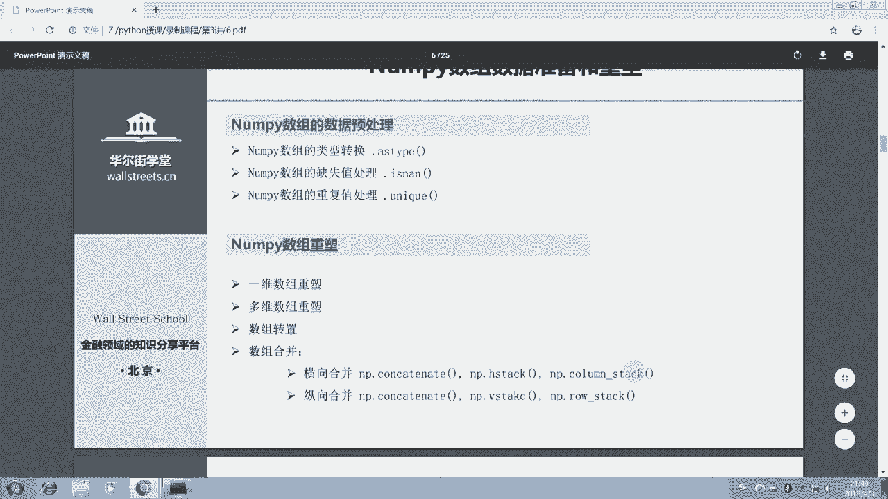

Between will v as a vertical is。所以呢这里进行一个vis的话呢，我们就很简单的啊把它们两个也放进来，就是一个纵向的一个拼接。

那么这种拼接呢就非常适合我们在对一些大型的数据进行拼接的时候，我们把它读成ND array的一个形式啊，n array的一个形式。然后我们接着呢对它进行一个拼接n派的计算呢是非常快的。

这个计算的速度是非常非常快的。它是可以和这个matet labb比肩的啊，所以用来那个替代mat labb。所以它的一个运算呢是非常出色的。n派呢也是以运算能力著成。好，讲完这些以后呢。

我们再介绍一下n派的一个这个数组的常用函数。派数组的一些常用函数的介绍，我们现在介绍一下，我们先看一下有哪些常用函数。其实对比那个我们看一下这边呢有1个ABS这个ABS呢是绝对值啊，绝对值。

还有一个SQRT啊，这个是开开平方根 squarere是平方，那么exponential是返回E为底的一个指数。那么log呢这些啊这个地方刘老师打错了，这个L呢是小写。

所以呢这里呢是返回以E1和二为底的对数，还有is now。

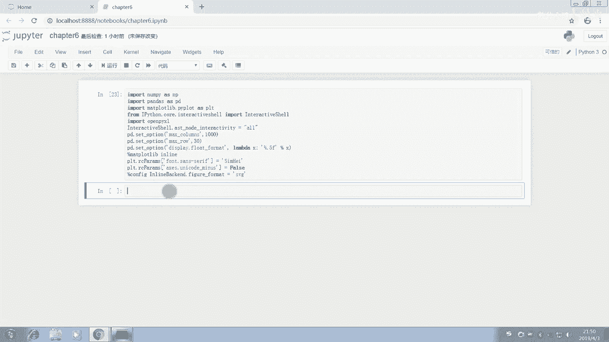

那么包括后面的这个用于描述统计的一家函数STD呢是我们这个标准差VAR呢是我们这个variance，我们这个。方差，那么minimum maximumim和me，还有sum这些呢。

相信用excel用的非常熟练的朋友对这几个。呃，这几个函数完全都不陌生。那么这几个函数呢在我们的numb里面呢也是有。

那么后面的ARGMIN和ARGmax其实呢它就是一个返回我们最小值和最大值对应的索引。也就是说它能返回告诉我们唉哪一个位置的这个元素啊，它是我们这个里面的最大值。

那么呢是我们这个累计和和我们的excel呢也是一样的呢在也是所有元素的一个累计机。相信大家都能够很轻易的理解。那么我们现在呢举几个例子啊，举几个子来分别讲一下这个元素级的函数。

我们在上边呢我就给大家举一下这个BS的例子和我们这个quare和这个quare和我们这个开平方的这个子。先创建一个南海瑞。当派有read，我们从-4到4吧，这样正负数都有，我们运行一下。

这个瑞看下瑞的一个样子是这个样子。那么我们想把它都变成这个。

呃，Aray都变成这个。

因为它是函数嘛，所以呢我们要用n派开头，就n派的一个函数ABS的我们想把他们都。加一个绝对值运行一下。这个时候呢我们要注意啊，它是在array的基础上改动吗？不是的，array是没有变的。

但是我们把这个囊派点ABS的ray呢赋值给了这个everyone，所以a one呢才是我们要的啊。我们在这边输入ray one对比一下。

这个re one的话呢，我们看一下re one的话就是变成了这个4321啊。没错，我们就把它的全都加了个绝对值。那么至于我们接着呢，我们看一下n牌点s squarequare和n牌点的SQRRT。

我们先看一下开平方根吧，当派点SQRT的rayone。开平方啊，我们发现哎它都开了个平方。没错，那我们我们再看朗派点 square的array吧。派点SQUARE的一个ar，我们对它进行一个平方。

我们发现唉1694没错啊，都是一样的。那么接着呢我们把描述性统计的一些数据给大家演示一下，我们创建一个新的ar。南海点 randomdom点ranant。我们创建一个新的一个ray。0100。

20号我们创建一个新的ray。我们来看一下这个ray的话呢，它是在0到100之间的选20个数。好的，0到100之间选20个数，我们对它reship一下。我们把它重置一下，换成一个稍微复杂一点的形状。

这样的话呢也便于大家之后的一个运用过程中的一个掌握。对这个内容我们把它换成一个4乘5的一个矩阵呃，一个方阵呃，n方阵一个矩阵。或者说一个二维数组啊二维数组。呃，我们看一下这是一个4乘5的一个二维数组。

它的数据都是我随机随机出来的array点s我们对它进行一个求和，看一下得出来结果是什么样子。那么就所有的元素的一个求和的结果呢是1238。那么比如说我们不想说把所有元素加起来。

而是希望呢它能够横着加起来，把每一行的加起来。那么大家要看这个水平的方向，刘老师刚刚说了，python里面的水平方向，我们把它定义为axs equals one，也就是方向一。

所以呢我们就array点some，我们只要给你们传递xs等于一，按照一这个方向去加走。我们发现呃唉它报错了。那么这是什么原因呢？我们看一下是什么原因呢？啊。

就是因为我们这个array呢是定义的是上面这个一维数组，而下面呢我们需要的是一个二维数组。所以呢我们这个地方出错了，报错了。我们下面呢应该要用a one，这样的话就没有问题。我们发现最后结果是4个。

为什么呢？分别对应了四行，大家也可以拿计算器去加一下，看是不是这四行分别数据加起来会等于这四个数字啊。如果没有问题，肯定是的，那么我们还可以按照比如说我们想按照纵向来加，就说我们是4乘5嘛。

我们想把5列每一列的数加起来，我们就ex equal0，我们运行一下。啊，我们发现这里报错了，为什么呢？他说没有这样一个呃 argument，也就是没有这样一个参数。

那么这个地方说明我们输错了那个参数的名称。运行一下，发现哎，它确实是5返回了5个数，这就是什么呢？这就是这五列的一个和，五列的一个和。那么包括求均值。比如说瑞典命。我们array点命的话呢。

当然算的是所有的均值了。那么array one点命，如果我们传入一个axs。becausezero，我们在一个zero零方向，也就竖着的方向，那么会算每一列的均值，每一列的均值都给算出来。

所以呢这个呢在大家计算描述性统计分列计算的时候呢，是非常非常有帮助的。那么求最值的话呢，我就不再给大家详细的这样一个一个去计算了哈，我就不再一个一个去计算了。

大家可以课后呢对上面这些数的函数呢进行一个理解和。相关的一个去。那么我们最后呢在这边呢，我们再讲一下这个呃comacom somecom pro吧，这两个还挺有意思的。这两个的话呢。

我简单给大家介绍一下，就是啊比如说我们这个array。如果说。如果说这个array啊，比如说呃在我们的金融分析里面呢，经常会出现一列收益率，对吧？那么如果呢这个array呢，比如说我们用它除以100。

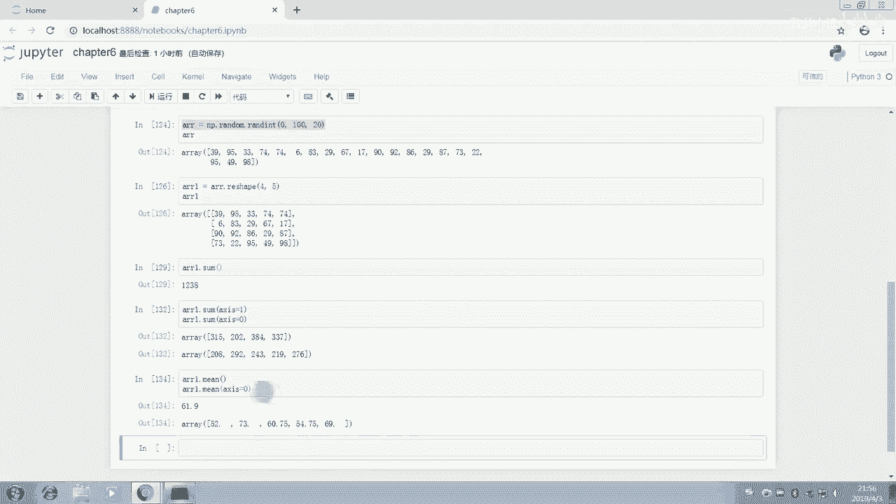

然后。加上一个一。好，我们定义为一个新的ray。

我们来看下这个ay two，它呢就是1点几1点几1点几哇，这个一点几很亮。大家可以看了，就把它认为是什么呢？把它认定为是一组收益率。如果把它认定为是一组或者说把它认定为是一组净值。

如果把它认定为是一组基金产品的净值，我们对这个er two呢运行一个com pro。

这个product product是这个productcom就是累计的乘法陈述啊。这里的话呢我们对它进行一个累计的陈述。呃Aray to点。come proud变行一下，我们运行一下。

发现他就从第一个一路沉到了最后一个，一路沉到最后一个，就是从第一个数一路乘到最后一个数，这个就是最后一个数。那么我们可以调用它最后一个数的这个结果。

那么就可以得到我们这个最终的一个这个 two的一个结果了啊。好的，那么在这个过程中呢，比如说呃我们还可以呃有一些其他的方法，我们在这边再介绍一下这个呃条件函数和集合关系，简单的介绍一下这里的话呢就是说。

我们的n排数组的条件函数。囊派数组的话呢，它有包含关系、交集并级，还有求差这么四种的一个呃集合的关系。那么这个集合关系呢跟我们数学里的一个集合关系其实是一样的。所以呢在这里呢我们就。

给大家介绍一下这个这些集合关系的一个运用。

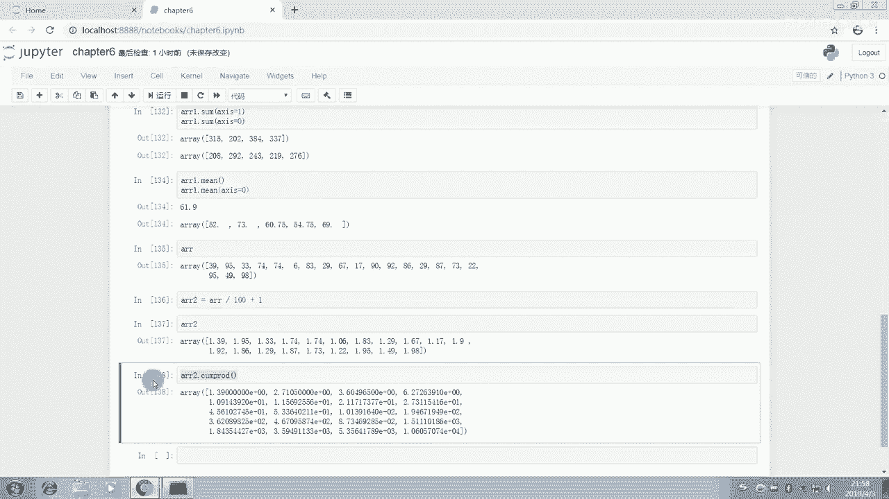

我们简单的介绍一下这个集合关系的一个操作。Aray one等于n派点。Aray。我们先建两个ra。1234。urray to等于南海点Aray。B2。

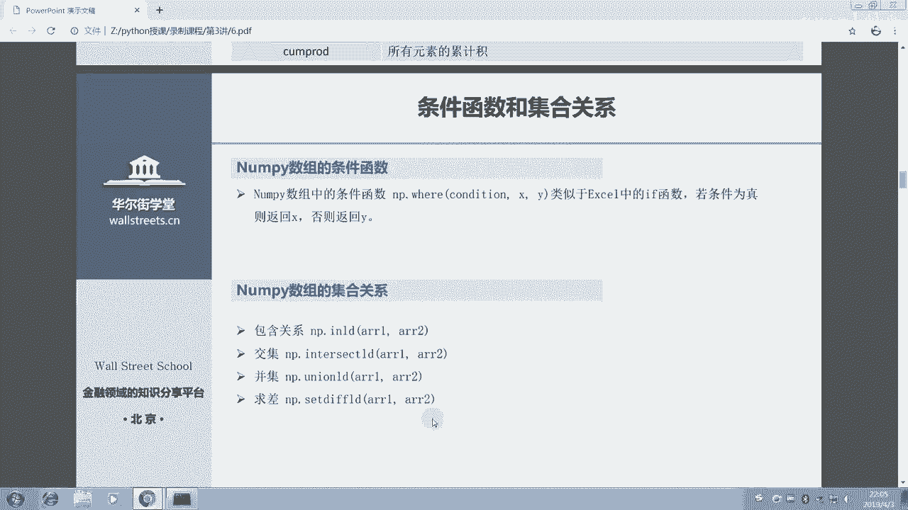

5啊，大家可以用代码美化细美化一下。好的。那么我们把这两个ray建好以后呢，我们比如说我们要看一下他们两个的交集，我们求交集，那么就n排点intersected啊，我们把它复制过来这样。好运行一下。啊。

我们发现这里报错了。呃，报错了的话呢，我们在这边呢重新给它输入一下。那么我们可能是刚刚输入错了，我们把这个everyoneever two输入进运行一下。好，没有问题啊。

现在呢交集呢是1212交集是12。那么我们其他的呢也是一样的一个操作。在我们那个课件里呢都有给大家列好。那么我们现在看一下这个n派点where函数。

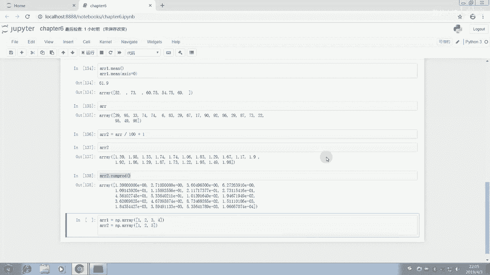

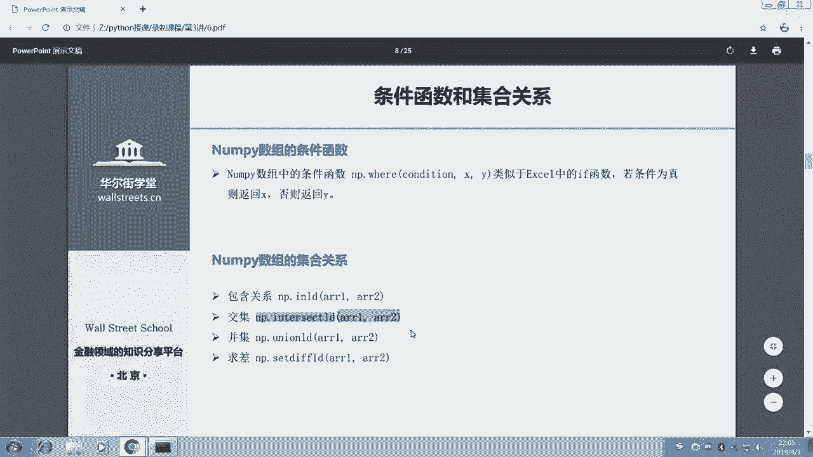

那么n派点威尔还是。这个numb派点where函数呢，我们看一下n派点where。它的含义是什么呢？就跟我们excel里的if有点像。就是说如果啊你这个condition呢条件呢是对的，那么我们返回X。

如果这个条件判断是错的，那么就返回Y什么意思呢？我们在这边呢就n派点where。呃，我们看一下，它应该是比如说我们对array进行一个判断。如果ray大于80，那么我们返回一。如果否则后，我们返回0。

我们来看一下。

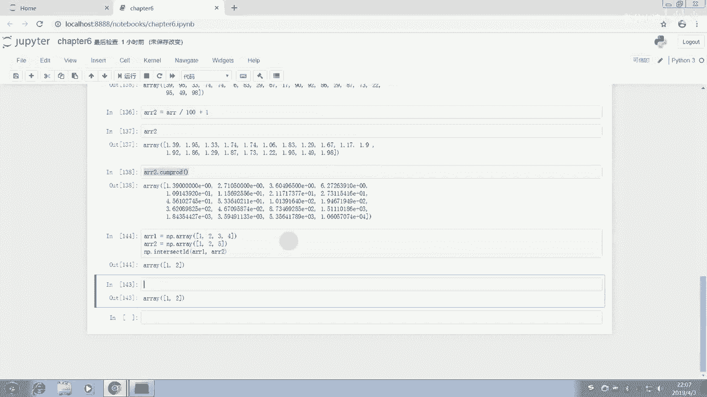

我们注意啊，这个上面呢是这个er瑞的这个呃这个瑞这个纳派 array瑞的一个。

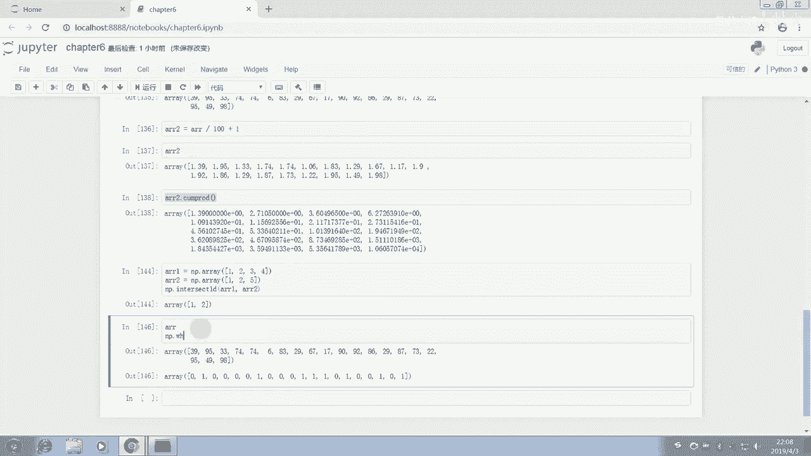

我们把它输出在上面，让大家看一下，对照着来看。然后下面呢是我们这个numb排 where。我们发现呢凡是这个ra呢大于80的，我们都被换成一都被替换成了一，小于80的呢都被替换成了0。

这个呢就很方便的帮助我们呃对这个number rain呢进行一个这个。

用条件来进行一个查找这个条件大家可以随意设定的啊，不一定是要 array大于80的。还有很多其他的条件，根据大家日常工作的需求，可以去查找出那些符合要求的，然后把那些不符合要求的替换成我们需要的值。

这个的话呢是我们这个狼牌点威尔的一个非常好用的一个方法。那么我们的number呢讲到这里呢，就基本结束啊。我们这个呃numb排瑞讲到这里基本结束。那么。接下来呢我们在最后的给大家ner瑞补充一个知识。

就是npe瑞的一个矩阵的一个呃两个特别重要的一个运算，两个重要特别重要的运算。我们先清楚一些内容，给大家补充一下举证的两个很常用的运算。那么如果说A这个矩证啊是用n派，我们来随机一个数组出来。

比如说A会等于这个。那么我们可以用A，我们看一下，我们先把A print出来一下，我们把A这个输出一下，A是这个样子。那么A呢如果会等于n派点matt。这个时候呢我们把mat来把它包装成一个矩阵。

我们这个时候再来看一下A。好，它就变成一个mattris啊，这个是n派点m这个函数，把它变成一个矩阵。这也就是说方便有一些同学如果想用python呢做一些矩阵的一些运算的话呢，就是很方便的。

如果我们现在呢想要把这个。呃，A print出来，我们不用print，我们已经交互了，看到了A。那么现在呢我们就是来看一下这个矩阵的这个逆运算怎么去进行。比如说我们用IA来表示矩证的力。

那么我们在n派里面呢有一个line呃其实是线性代数的一个含义。INER它的一个缩写LINLG这样一个呃函数，它下面呢有一个inverse求矩证的力，我们这样子进行一个操作。

那么就可以把这个矩阵的力给它求出来了。那么这个时候呢IA呢就是我们这个矩证的力我们就可以看一下IA让输出下IA。IA呢就是我们举证的例。我们来检验一下是不是这样用IA乘以我们这个A。

inverseA乘以A，我们发现这个结果呢其实是呃非常符合我们的要求的。这两个呢是因为是浮点数，所以呢计算出来不等于0。其实它应该是零的。然后这两个呢应该都是一的啊，没有问题。

那么我们再讲一下这个简单介绍一下，用矩证用这个numb派来求特征向量。让他点random点re，我们给它进行一个。呃，负值呃。创建一个新的一个囊排数组。那么特征向量呢，我们怎么来计算呢？

其实它也有一个特别的函数来计算。那么这个呢是特征值。也就是说它这个函数呢可以一次性把特征值和特征向量都输出。会等于南派店。linear algebra点EIG啊这样一个函数啊。

就在linear algebra这个现性代数这个。函数下面有1个EIG啊，这个特征值的这样一个函数。那么它可以一次把特征值和特征向量都输出来。那我们把特征值。printnt呃让它输出来，然后特征向量。

也让他这个在屏幕上反馈回来啊，这个地方是输错了字母。所以呢大家在输的时候也是心语。好的，特征纸和特征向量都打印出来了哦不要打印出来了，都返回了。那么我们这个n派呢就介绍到这边。

那么我们接下来呢介绍pandas。感谢大家的。😊，参与啊。

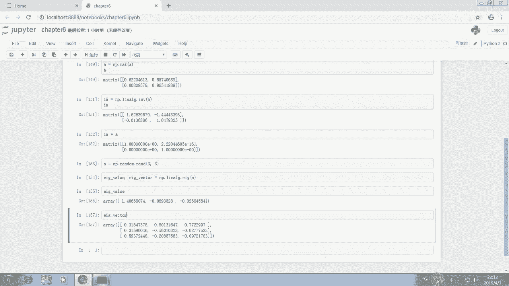