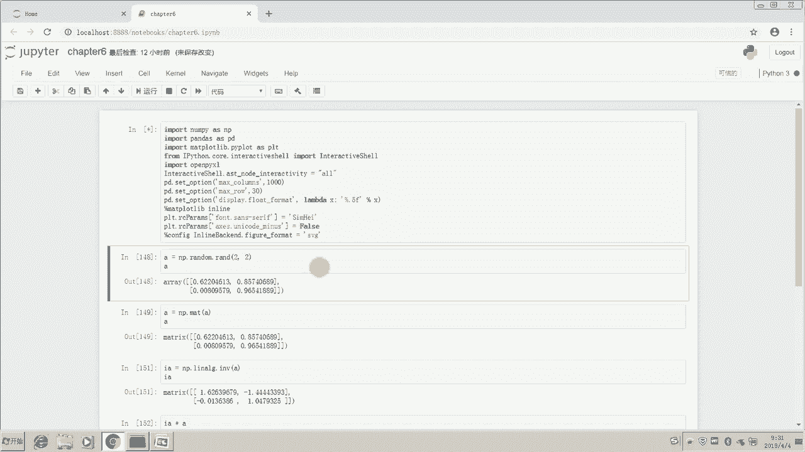
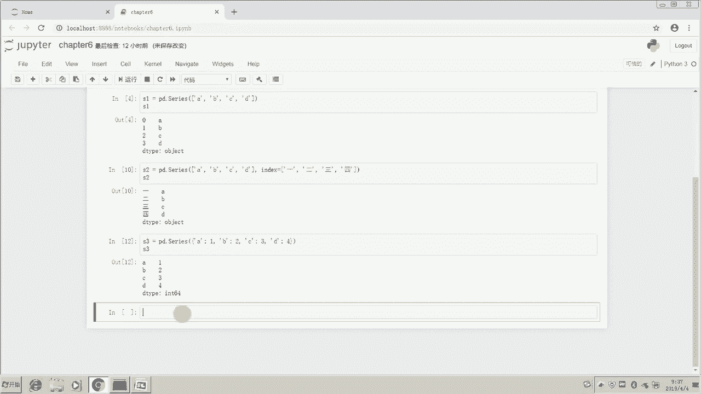
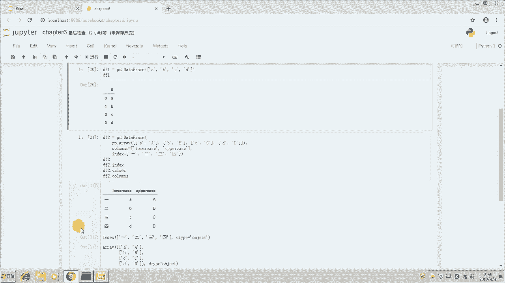
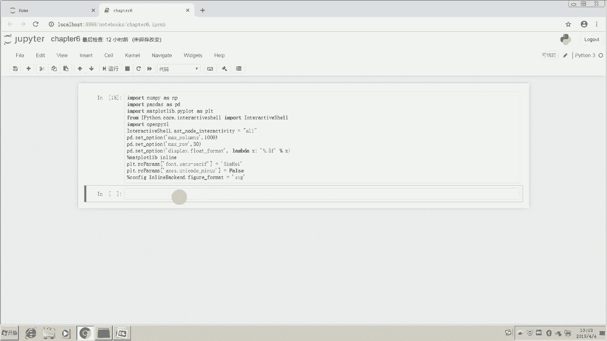
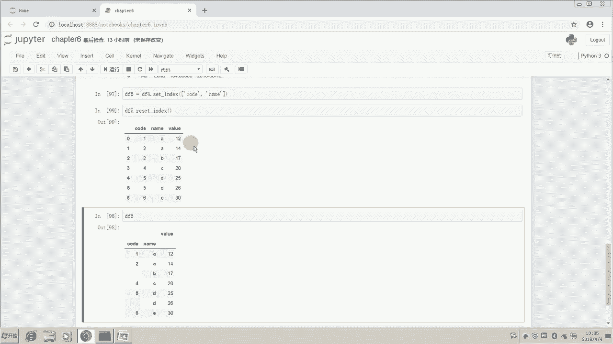

# 14天拿下Python金融量化，股票分析、数据清洗，可视化 - P8：02 使用Pandas数组实现金融数据高效计算（一） - 川哥puls - BV1zkSgYZE54

同学们好，欢迎来到华尔街学堂，我是刘老师，今天我们来给大家介绍一下pandas，那么上一讲呢我们介绍了number派数组，那么number派数组的话呢。

主要是和CPI和matt plot lib的一个联合起来，使用的效果非常的强大，那么pandas呢是我们这个Python里面的一个，数据分析的模块，那么也是我们作为数据分析的利器之一，那么在未来呢。

大家尤其是在处理金融数据，这种相对来说格式啊已经比较规整，就比如说我们从wind里面导出的一些金融数据，那么它的格式是比较规整的，那么我们用pandas来读取这些金融数据。

以及用pandas对他们进行一些相关分析，都是非常的快捷方便的，那么首先呢我们介绍一下pandas，它的一个数据结构，pandas呢有两种数据结构，一种数据结构呢是serious的数据结构。

那么还有一种呢是我们常见的，data frame的数据结构，那么serious的数据结构呢，大家就可以把它理解成是一个时间序列的结构，就是一个时间序列的一个结构，那么它是以时间作为一个我们的标签的。

或者说索引，那么data frame的一个表格型的一个数据结构，就跟我们excel里面的这个表格型的数据，是非常的相似的，那么我们打开jupiter notebook。

我们今天的话呢，依然回到第六章的这个具体选notebook里面，首先呢把这个环境这个设定一下，我们的操作的模式。

那么接着的话呢，我们这里先介绍一下series这个数据结构。

那么我们导入pandas的方法呢是import pandas，As pd，那么之后我们调用pandas这个模块呢，我们只要输入pd点就好，那么我们现在呢先看一下啊，serious呢。

他跟我们金融学里面说的这个时间序列呢，就非常的像，那么我们怎么创建它呢，我们用pd点serious就好了，PD点series，然后我们输入一些内容，比如说ABCD，OK那么我们运行一下这个。

那么我们现在呢可以查看一下这个啊，series y这个S1这个series，看下他的一个情况是什么样的，好我们发现了这里是0123，然后ABCD它的d tab呢是object d，Tape，们还知道。

就是呃我们在数组里面呢也有讲过这个d tape，在普通情况下呢，我们使用type函数，比如说我们有一个list啊，Sorry，比如说我们有一个这个A等于A，那么我们要去查看它的type呢。

我们是这样做的，type a type b它们它的一个类型是string，那么比如说我们有一个list试一下，这是我们之前在基础知识里学的内容，比如说有一个A它会是AB的一个这样的list。

那么我们现在的type a呢，它就是一个list好，而你如果用A点type呢，你去运行一下，如果你用属性去运行的话，他就会报错，为什么呢，因为A它是它A的话呢，在这里是不是一个属性。

它A这个是这个数据的一个类型，不是这个的属性，而在我们这个serious和number派里面呢，我们直接用点d tab是可以查看属性的，而不是用d tab的一个函数，这是一个区别。

所以呢大家要注意属性函数和方法，这三个额内容呢，我们要学会去区分，那么在接下来呢我们来看一下呃，我们如果说给这个S2呢，我们可以比如我们给定一个S2，我们依然是用S1这些数据。

但是呢我们可以给它命一个标签，什么是标签呢，标签呢就是说我们前面的这个index就是索引呀，我们也可以把它叫啊小的标签嘛，叫索引，我们这个索引呢其实并不一定要是01234，我们可以是别的内容。

比如说我们依然是我们依然是上面这些数据，我们把他们复制下，那么我们可以给他一个索引index，那么index的长度只要和前面是一样就好了，比如说我们这个index希望他是中文的，1234。

那么我们运行一下，看一下这个S2里会是一个什么样子，那这个时候呢S2呢它就是1234所对应的，ABCD这么四个数啊，那么我们还有另外一种方式来构建这个呃，这个series我们就是用字典来构建。

我们上面两种呢都是传入列表，传入列表，同时呢如果你不命名index的话呢，它默认的index就是从数字零开始，一路往后我们说过数字零呢是代表第一位，那么如果你给了定了一个index的一个list。

那么它就是从我们给定了这个index开始的，那么我们还可以传入字典，那么传入字典的话呢，大家应该就能够啊联想起来，字典我们是键值的一一对应，所以这里如果你的索引是A的话呢。

那么你待会对应的这个嗯你这个键是A的话呢，那么待会对应的这个索引的，那么就是对应的是A，如果你的键是B的话呢，那么待会对应的这个索引就是B啊，后面那个值的话呢，就是我们对应的serious的一个值。

好的，我们运行一下，然后查看一下这个S3的一个情况啊，这里他说invalid syntax，我们看一下为什么是invalid syntax，他说C这边有一个invalid syntax。

那么可能是因为我们这里逗号的问题啊，这里有个点的问题，我们要把这个符号不要搞错了，运行一下好没错啊，我们发现现在呢，我们由这个字典创建出来的一个serious，它的索引呢就是我们的字典里的键也成key。

然后他的这个事实，这个，serious的这个序列的这个值呢，就是我们索引里啊，这个字典里面的值啊，也就是说键作为了我们的索引，而这个值呢就是对应我们字典里的一个值，就是通过字典来构建series。

那么我们还有可以通过index，我们现在讲一下serious的一些属性啊，serious呢有两个属性。

一个属性呢是index，还有一个是values，这两个比较常用的属性。

index顾名思义就是它的键值，比如说我们对S1调用index这个属性，我们对它查看index这个属性，那么返回的就是一个range index，它是从零开始停止在四，但是不包括四。

step呢是一就是间隔为一，也就是0123，那么我们对S2调用index看一下，我发现S2是index是1234，他的d type呢是object，那么S3的index也是同理，我就不再重复了。

我们发现S3是ABCD，它的d tab也是object，那么我们再看一下S1的value，这个地方values它的values，那么很很自然的就是对S1来说，它就是后面的ABCD这四个值。

那么对于S3的values的话，那么就是这个1234，我看S31234就对应这四个值，这个呢就是我们这个serious的一些基具，基本的一些数据结构的情况好，大家可以课后看一下讲义。

然后同时把这代码呢在自己电脑上也练习一遍，然后多多练习就会记忆比较深刻，我们接下来看一下data frame的表格型的数据，刚刚我们讲完serious的数据，大家肯定发现了。

serious的话呢就有点类似我们的那个时间序列，它是其实就是一列数啊，一列值，然后对应的一列索引，那么那个索引通常来说我们在分析的时候呢，它会变成时间，那么我们把这种呢。

也可以作为一个时间序列的一个感觉，那么在data frame的表格型数据结构里面呢，我们就要想象一张表格，这张表格是2×2的呃，是sorry，是一个二维的表格，是一个二维的表格，它有列有行。

那么我们现在呢就要想象一张表格，比如我们先构建一个最简单的表格，PD点data frame，刚刚我们说pd点series啊，Serious，我们可以构建这个。

我们刚刚说pd点series呢是可以构建序序列的啊，我们这个pandas的这个series是序列，那么现在呢我们用这个pd点data frame，我们是来构建我们这个data frame。

还有这个构建的方式呢，就是用pd调用里面的data frame的函数，和调用这个serious的函数，我们简单的运行一下，这个我们看一下DF1的一个结构，好，我们发现啊，他在这个啊JUPITER里面。

返回过来的一个是01234作为我们的索引，然后呢这个地方是零作为我们的列名字啊，这个列名，然后ABCD作为我们刚刚输入的值，那在这里呢我们想呃我们给会给另外一个结构，比如说我们给一个二维的结构。

什么意思呢，就是我们刚刚上面，这里输入的是一个一维的数组，对不对，如果看number派的形式，它就是个一维的，如果你把它当成列表，它就是一个一维的，那我们给可以给一个嵌套式的列表。

或者你理解成给一个啊number派的一个数组，我们这样子小写的A大写的A，小写的B大写的B，小写的C，大写的C，小写D大小D好，我们做一个这样的嵌套式的一个列表，或者大家看看。

把它当做一个这个二维的一个number派数组，我们再运行一下这个DF2，我们看一下DF2，它给出来的一个结果会是什么样子好，我们运行以后呢，我们就发现了，它其实是对应了一个二维的一个情况。

也就是说它是一个4×2的一个表格，这个42和我们number派里面的42，其实是一样的对吧，大家可以调用这个来看一下就知道了，比如我们用number派点array，我们把这个粘贴进来，然后我们运行一下。

我们发现这个是不是一个4×2的一个数组，所以呢它真正的到了data frame里面了，你直接把这个number派点array给它传递进去，它也是输出一个这样的结果。

比如我们把它这个number派array呢替代掉，这个啊嵌套式的列表，他也是传递出一个这个结果是一样的，我们也可以通过传递number派array，来定义一个data frame。

创建一个data frame，这样的话呢第一列呢就是小写的ABCD，第二列呢就是大写的ABCD，那么它的索引呢我们没有指定，所以索引依然是0~320123好，那么我们接下来呢就希望说我们来指定一下。

这个行的行列名字啊，行列索引，那么对于第一步呢，我们想修改这两个，修改零和一我们怎么做到呢，那么我们只需要在创建的时候加入一个，Columns，column是列名列列的含义。

那么列的话呢我们要定义两个名称，所以我们就用一个列表把它给括起来，我们第一个名称希望叫lower case，第二个名称想叫upper case，好，就是大小写，那么我们现在运行一下。

我们发现它的名称一个就叫做lower case，一个叫做upper case，那么我们把它的列名定义了以后呢，我们现在想重新定义它的index，也就是说我们不希望这里是120123。

我们希望它是别的内容，比如说我们希望它是index啊，他叫index索引，我们希望它会等于一个列表，这个列表呢是大写的1234，好我们发现这里有点丑，我们把它给敲下来，这样的话呢我们代码美化一下。

好你看我们一用代码美化的话呢，这里呢它自动帮我们美化成了，一个非常美观的一个形式，我们再运行一下，所以大家使用的时候呢，其实不用太在意你编写代码，它是不是符合规范，但是你一定要介意的是什么。

介意的是你代码编写的是不是符合语法，只要你符合语法，那么我们用这个代码调整一下，那么最终的话呢你多多的去调整，多多的看，你就会自动的形成一种规范，自觉的去写成，像，他给我们美化成了这个样子。

比如说我在上面用一个美化哦，它是不会变的，为什么，因为这一行已经很好看了，所以呢没有必要再改变，我们运行一下，我们发现诶他的一个index也变了，所以大家一定要记住这一列呢，我们叫index叫索引。

因为这一列它是没有，我们发现这里还是没有，第一没有名字，第二我们把这一列呢，它是独立于后面的数据对吧，这一列呢是对后面的数据做一个指引的，一个索引的一个作用，就像我们的那个呃，就像我们对字典啊，对列呃。

Sorry，对列表啊，对元组啊进行索引进行选择的时候，我们那个标签一样有点像，那么我们这个上面的名字呢是columns，是列名，那么列名的话呢，我们用columns这个参数，给它传递一个列表进去。

可以进行修改，那我们最后呢就讲一下，接下来呢我们讲一下这个嗯，通过传传递一个字典啊，我们来构建这个data frame，我们先构建一个字典，比如说啊这个字典呢，一个叫做lower case的一个字典。

它呢是一个嵌套字典，它里面呢是列表，那么里面呢有两个圆，两个键，一个是lower case，一个是artist，那么uppercase的话呢，它也是一个列表，这两个列表呢宽这个长度是相等，好的。

我们把这个data呢构建好以后呢，那么我们就知道我们构建了一个字典，接下来呢我们把这个字典呢传递过来，创建data free，那么这里呢我们点击一下运行，它就创建好了这个data frame。

然后前面的索引呢大家是可以修改的，比如在这里添加一个index，等于啊我们随便输一些，比如说等于346，那么我们运行一下，它的索引就被修改成了3456，这个呢就是我们的一个基本的一个这个呃。

我们基本的一个内容好，那么我们来看一下，还是看下这边的DF2EF2的话呢，我们只要点index呢，我们可以获取它的索引，刚刚我们已经讲过了，那么它的索引是1234，好类型是d tape。

那么DF2点values我们可以获取它的值，我们刚才也说过了，那么我们再看一下啊，BF2的话呢，如果我们点columns，那我们可以预期是获取它的一个名称，也就是列名称。

我们发现是lower case和arm case，他的d tab呢是object，所以呢我们就把它的名称给获取了，好，那么第一步呢，我们已经把这个怎么构建这个data frame呢，也已经给讲过了。

那么我们现在呢讲一个啊比较重点的内容，就说我们如何呢去读取数据，我们读取一些外部的数据，用pandas怎么去读取，那么最典型的那就是说我们读取一些，比如说XLXSX啊，excel文件。

然后CSV文件和TXT文件。

因为大部分的金融数据终端，或者金融数据库里面导出的数据呢，无非是这三种啊，或者说一定可以用这三种形式导出，那么大部分呢可能是CSV的格式，有一些数据特别大的呢，它就会做成TXT的格式。

然后从万德里面的啊，就大家金融从业者最常用的万德，金融终端里面导出来的数据呢，大部分可以使用这个excel插件，或者说点LXLSX这种格式的一个，结尾文件导出，那么这种的数据读取方式呢。

我们就需要重点的掌握好，现在我们先看一下怎么读取TXT的文件，那么TXT的文件呢我们用的是read table这个方式啊。

rep table读表这种感觉，我们可以看下它的一些参数啊，这里有个fire pass，这个呢就是我们平之前一直在用的fire pass，路径有相对路径和绝对路径啊，刘老师已经给大家介绍过。

那么这里sap什么意思呢，就是separation separation，这里是一个表示分隔符，也就是你这个TXT文件里的这个每一个数据，每一每一列每一列数据之间啊，他用的是什么符号分隔的。

它是用的制表符分隔，它还是用的空格来分隔，还是说用两个空格或者三个空格，或者用逗号，用点号，用竖线等等，那么这个时候呢大家就要去先print出这个呃，治标呃，这这这个文件的前几行。

我们看一下它的一个数据结构，那么知道以后呢就很好的可以读取，或者我们直接读取，读取以后呢，如果不对，我们再进行调整也行，那么这里呢我们就读取一个啊，刘老师从这个万德里导出来的。

一个这个PETTM的一个数据，对就是这个文件，然后我们读取下这个PETTM的这个数据，那么我们先读取一下，运行好，我们现在查看一下这个DF1，那么我们发现啊这个DF1的话呢，它呃它被读取好了。

但是呢大家有发现啊，有第一行数据呢被当做了名字，第一行数据给大家录个名字，这个呢就不是我们想要的，所以我们要进行一些修改，我们就查看一下什么呢，我们查看一下这个PD点read table啊。

它的一些参数里面，有没有说把这个啊进行一个调整，比如我们看看这里呢，哦我们注意了，这里有一个header，Header，有一个info，我们看一下这个呢，就是说由这个函数它自己来推断啊。

这个我们这个的名称是什么，那么我们认为啊这里不应该这样做，这里应该这个header呢要么就没有，要么就是由我们来定，我们试一下，先试一下header，如果是none的话，可不可以，那么我运行一下呃。

看一下DF1的话呢，会等于几好，我们发现呢这个地方呢就是零和一，它是没有header的，那我们试下header能不能由自己来定义呢，比如说code，第一个是coat，那么第二个名称我们希望它是PE。

那我们试下看这样行不行，啊我们这里报错了，所以呢我们不能够这样去对它进行修改，所以我们这边呢可以header给它一个N，那么我们header给他一个none，我们就这样子，这样的话呢。

我们后期呢可以用rename，我们之后会讲，待会讲我们可以修改一下这两个名字，所以呢我们发现这个数据呢，他这边做了一个简单的汇总，3600行两列，3600行两列，它就不包括这个索引这一列的。

那么一共有3600行，那么我们接着呢查看一下excel文件，我们读取一个excel文件试一下，那么读取excel文件呢也是啊，PD点read都用read这个函数，但是后面会有不同的后缀。

它是read excel，我们先看一下他的一些参数，那么这里有一个IIO啊，IO呢，就是说我们给出这个excel，它的一个路径也是相对或绝对路径，我们这里用相对she name。

我们给一个excel的这个的名称，如果你不给的话呢，它就默认是excel的当前活动的那个工作表，任你第一次你也就是你现在打开那个excel，他第一眼展现在你面前那个工作表，那么就会是你现在读取的工作表。

所以呢一般来说呢我们还是可以用啊，我们之前讲过的这个打开excel的那个，open pixl的方法，我们查看一下它有哪些shes name，以及我们print一下我们需要使用的虚词内呃。

那个sheet中的内容，我们看一下我们需要使用哪些，然后再把那个sheet name进行一个修改哦，header的话呢也是刚刚一样的，就是我们这个要不要这个啊，首行这个作为标题还是怎么样的。

我们再看一下啊，还有个name，还有index column，Use column，就是说我们要使用哪一些列，这地方可以进行一个调整，就说我们只需要用哪些列就好了。

那么还有个squeeze压缩d type类型engine等等等等，那么我们先简单的试一下，我们在这里呢输入我们的数据，我们要用到data里，这个就是刘老师给的data文件夹里面的行业指数。

这个哦这个excel，好我们先运行一下，运行一下，然后查看一下他的情况，啊我们发现这个有有一定的问题啊，他把下面的都是数据，但是这个收盘价这些这有一行第一行是空行，应该第一行就是有收盘价和空行。

那么他把这些呢当做了第一行，所以我们需要额进行一个调整，那么根据我们刚刚看到的参数呢，这里是有一个叫skip road的参数，我们只要打skip，这里有个skip rose，就说我们可以跳过第一行。

那我们就输入一个一，这样我们再运行一下，我们发现第一行呢就被我们跳过了，我们直接从第二行开始，那么pandas呢，它默认的把这个第二行的这些文字呢，就作为了我们的标题，那么我们发现这个是非常美观的啊。

日期，然后这个各个行业的一个数据啊，就非常的好，它已经自动的读取完毕了，嗯很好，我们看下一共3462行11列，大家又发现啊，这个末尾呢诶多了两列这个NA值啊，这是因为wind的话呢。

他在最后输出的时候给了一个数据来源万德，这个我们没有及时删掉，那么在这里呢我们还有一个方法进行处理，我们用一个skip footer，这里有个skip footer呢，就是我们忽略角度。

比如忽略最后两行的角度，我们运行一下进来看一下啊，最后两行都没有了都没有了，就是3460行乘以11个columns，11列，3460行，这样看起来呢就非常的美观大气了，包括日期啊也进行了一个啊。

这个调整，我们发现日期后面那些00000都没有了啊，这是一个标准的一个日期，这一个是我们一个行业指数价格，从2005年到现在的一个wind行业指数的价格，的一个这个情况啊，那么从2005年到现在。

这个问的一个行业指数的价格，那么我们接下来呢再读取一下CSV啊，我们学了这个TXT，然后学了这个excel，我们现在read一下CSV，那么我们看一下它的参数呢，其实和excel呢是大同小异的。

也和那个table呢也有点像啊，基本上是一样的，所以呢我们直接把这个我们需要读取的，这个数据啊，也是刘老师给大家的data文件夹里的行业指数，同样是行业指数这个CSV，但是是CSV结尾哦，Sorry。

这里不是读行业指数，这里是行业指数的一个PETTMCSWE，好的，那么我们对这个读取一下，我们选择这个以后读取，我们发现报错啊，报错以后不要紧张，我们翻到下面看下原因啊。

Initializing from fire failed，那么这里的话呢是这样一个原因，我给大家解释一下，这里的话呢是因为我们没有解释，没有定义这个engine，它有个启动项叫engine。

用谁来用哪一个引擎来启动的感觉，那么这里我们定义一个Python运行一下好，我们发现是OK的对吧好，这个地方呢，就是大家如果发现刚刚出现那种，initializing的一个报错的话呢。

大家在这里把这个engine给它定义一下就好了，那么有一个这个地方呢，我们应该也是要跳过一行的，我们可以先预览一下这个数据，用wind的导出来，数据呢大部分呢它第一行呢是一个额。

合并了一个单元格的一个这个市盈率，就是告诉你哎我们提取的是一个什么样的数据，它会有个合并单元格的一个情况，所以我们要跳过这个第一行，Skip rose，跳过第一行，现在运行一下呃，我们看一下啊。

这里我们打错了字，所以他都会提示啊，你哪里做错了，他都会提示啊，其实不是你的错，而是什么呢，而是说Python呢他没有读懂，因为它只能用固定的模式去读，而我们人的理解方式却很多样好。

那么这skip ros和b because one，我们这样子跳跃一行以后，DF4呢也被我们读出来了，这个呢跟我们上面那个数据呢是有区别的，但是长得很像，为什么呢。

因为这个数据呢是我们的一个这个win的行业指，数的一个pet tm的，我们的一个按照时间的一个数据，从2011年到现在的一个数据，就我们的wind的一个PE的一个数据，PETTM啊。

一个市盈率的一个数据，那么我们接下来的话呢，哦我给大家简单讲一下我们的一些数据预览，就是你看你这样一下来的话，为什么这里中间会点点点省略了呢，其实如果你不打这个点，就是你如果正常情况下啊。

像大家的电脑这里应该不是这样子的，这里应该是所有的数据都显示，我们可以上下拖动的，为什么会这样子显示出变成点点点，只显示30行呢，就是因为啊刘老师在这个位置啊，给大家用了一个pd点set option。

我们进行了一个set啊，就是说凡是跟pandas这个模块输出有关的内容，我们最大显示的行数呢只有30行，但是呢我们还设置了啊，就是说凡是跟pandas有关的话呢，我们这个最大显示的列呢有1000列。

也就是我们会把所有的列都显示在屏幕上，那么所有的行呢我们只显示30行最大，这样的话那就避免说一下子太大了，然后对电脑呢其实也影响我们的一个速度，也影响我们的一个操作哦，那我们这个set option呢。

我们这边呢也把他们选择，就是说最多呢显示五位小数不会显示的特别多，如果大家想显示的更少一点，我们把这个5F改成三就好了，后面呢是我们之后的画图的一些设定，所以大家先不用管，这里的话呢。

就给大家简单的把这三个参数给解释一下，怎么去设置，那么我们如果说嫌这个还多的话，我们可以用预览这个函数，head df three three点head这个函数。

也就是说我只看你头部的这几个点一下运运行，我们就只看到了头部的五个，那么我们这个head里面是可以传数据的，比如说传一个二，我们就可以看头部的两个，传20，我们就可以看头部的20个好看，头部的20个。

这个呢是我们这个head这个函数，那么我们同样可以用shape这个函数，就像我们那个number派有raid shape一样，用这个shift这个函数，我们发现诶这个DF4啊。

这个data frame它是由1862行和11列，数据组成的啊，它是不包括我们说的这个索引，也不包括这个标题，也就就是说那个不包括列名啊，标题标题我说的标题刚刚是指列名了，不标不包括这个列名的。

那么我们还可以简单的查看这个数据的一个，他的一个信息，比如df three点info，这个呢info呢大家可以理解成information，大家会发现诶它的类型它的类呢是pandas啊。

Data frame，data frame这样一个类型，那么它的有一八，1862个这个实体实例，那么有零到实体啊，有0~1861啊，一共是这么多个index，那么他的话呢有1862个。

None now optimate，也就是它没有任何一个只是缺失值，大家发现啊，这次导出来数据非常好，没有一个缺失值，然后他的话呢他用了存储空间用了多少呢，用了160。1个KB。

这就是我们的df three的一个info，我们还有一个函数呢叫describe，也是用来查看数据的情况的，这个describe呢，就已经开始做一个简单的从描述性统计了，大家就发现啊。

他已经给我们统计出来了，全指公用全脂技术，全职能源，全脂材料等等这些指数，它的一个count就是说我们一共有多少个数据，mean就是这些数据的均值啊，s std标准差啊，最小值25%分位，50%分位。

75%分位和最大值，大家发现他已经给我们一个啊，非常好的一个统计表了，这个呢在excel里呢，你如果去单独去做这个统计表的话，我相信各位有过经历，就是你必须要去单独的，在右边开一个小小空白的地方啊。

我们把这个表呢先给它编辑好，然后再把每一个公式编辑好，同时用我们那个F4进行固定，然后呢上拉下拉，我们把他们引用好，这样的话呢计算的时间呢至少也得五到10分钟，还是比较快的速度了。

如果说遇上一些其他的情况还容易出错，但是呢在这里呢我们只需要导入数据，十秒钟，输入函数，五秒钟，15秒钟就可以完成它15分钟的一个工作，这个呢是非常快捷的，包括在后期我们如果能够使用函数。

直接提取相关数据的话呢，我们可能整个过程只要点一下鼠标，你就可以完成这项工作了，所以这个描述性统计做的是非常非常轻松的，大家也有体会到的，所以呢为什么说pandas它是数据分析的利器啊，就是在这里。

而number派呢是数据计算的一个利器，那么最后MATTPOLIVE呢是我们可视化的一个利器，这三个工具呢大家好好的掌握好的话，基本上在金融分析领域的话，任何的一个excel能做的工作。

你都能够以额非常快的速度完成它，我们接下来呢介绍一下数据的预处理，也就是说啊，在很多情况下呢，其实我们数据分析的工作者呢，或者说excel或者说我们这个金融分析的工作者呢。

花的最多的时间呢其实不是在分析上面，而是在找数据，然后找到数据以后对数据进行一个预处理，比如说数据有缺失值，有重复值呃，以及有一些异常值，我们要怎么去处理对吧，是花在时间在这个上面花的最多。

那么等我们把这些数据都处理好以后，后面的分析呢是非常快的，可以进行下去的，然后然后最终的一个可视化，以及我们最终的报告或者说分析的一个结果，也是很快的可以做出来的，那么最难的其实就是我们这个最麻烦啊。

不说最难最繁琐的其实就是数据的获取，数据的整理，这个过程相信大家都深有体会，我们现在呢先讲数据的预处理，数据预处理呢主要有这么三种，预处理的那个需要处理的内容，一个是缺失值的处理，我们有查看缺失值。

删除缺失值和填充缺失值，那么重复值的处理啊，异常值的处理有异常值检测，异常值替换。

以及啊，我们后面呢主要是用MATPLOLIVE来做箱形图。

检测出异常值，然后用pandas里面的替换的函数，来替换掉异常值，我们先讲一下这个缺失值的处理，那么我们首先呢创建一个data frame，这个含有缺失值的data frame，我们用最简单的方法。

我们用字典来创建，比如说有编号，我们创建一个简单的数据结构，这是一个班级里的一个数据结构，编号A1A2，然后我们给一个缺失值，缺失值还记得吧，上一讲我们用number派点NM。

这个n a an是not a number，Not a number，那么就是number派点N来进行一个这个设定，一个缺失值，然后大家注意一点，就是说啊这个我们在Python里面呢。

它一般来说呢我我也给大家说过，我们用这个呃单引号来表示单个单词，然后双引号呢我们来表示一句话，或者说一句字符串，就我们常用的一个操作，然后性别，比如这个班级里有性别，那么性别呢有男和女男。

然后我们假设这个是两个缺失值，然后又一个难的，好然后假设还有个注册时间嘛，我注册时间2018年8月8日，再来一个2018年的8月9日，那么再来一个number派点N，再来一个2018年的8月11日。

好这地方我怀疑我们是有点问题啊，可能后面显示出错了，好可以OK了，我们现在用一下这个格式刷啊，把它给调整一下，我们发现这个非常美观啊，给他一调整，所以呢这个插件真的非常的好用，非常的非常的让人看着舒服。

比如说这样一个数据啊，我们先运行一下，然后我们接着呢呃查看一下DF，它是一个这样的数据类型，数据结构，我们可以直接在这个下边呢，我们可以对它进行一些查看，比如查看他的info，点一下这个info啊。

DF点info，我们查看一下，它就会告诉我们啊，这里有四个数据，0~3啊，0~3的编号，他的这个range index是有四四个这个index这个索引，那么它的这个编号我们看下编号。

这个数据有三个非缺非空，非非那个非缺失值，三个非缺失值性别有两个非缺失值，注册时间有三个，也就是说啊他真正的说话一共是有四个数据的，每一列都有四个数据，但是呢一旦这些数呢都不是四的话，就说明什么。

这说明是存在缺失值的，然后它就存在一个嘛，它就存在两个缺失值，这个呢我们就可以很容易的给他查看出来，那么我们我们想知道具体缺失值的位置，怎么办呢，我们用还记得我们在number派里面有一个is now。

在我们pandas里面也有一个is now，我们点一下，我们发现诶他是缺失值的地方呢，显示的是这个true，大家发现了true，如果不是缺失值的地方呢，显示的就是false，就是false。

好我们可以对照上面看一下，就是这样子，然后我们看一下刚刚那个is now，他其实也有一个这个啊这个函数啊，没错，还有说明啊，就是这样子，那么我们通过一个我们常用的那个之后讲的，这个条件索引。

或者说就像我们安排里面的条件索引一样，我们就可以直接把这个缺失值给它取出来，那么我们现在呢讲一下怎么处理缺失值，处理的话呢很简单，有一个方法，我们比如说我们要去除缺失值。

我们用这个job now job n a的一个方法啊，他这边呢有一些参数，我们可以看一下，Axis equals zero，how equals是any，就是说啊如果我们没有明确的要求。

那么我们就是按照行行来删除，然后就是how equals是any，就是这个方式，how嘛就是你如何去做，也是这个方式，这个方式是any，也就是说任意一列啊，我们比如说但对于某一行来说。

只要它任意一个值是缺失值，我们就把这一行给删掉，这个就是说我们默认的情况下好，当然这个号呢还可以改成or，就是说只有当这一行全部都是缺失值的时候，我们才删掉，比如我们先试一下，直接运行。

那么我们发现这个112就被删掉了，但是如果这里我们把这个号改成or，它的方法改成or的话，那么我们第二第一行，这个这个一啊编号一对应的这行，这个索引一对应的这一行就得以保存，因为它并不全是缺失值。

只有第二行是这个只有第三行是全是缺失值，它就被删掉了，所以呢这个地方大家可以根据你的需求，进行一个参数的一个调节，大家可以多多阅读一下，他这个阅读一下这个说明，那么我们接下来呢讲一下。

就是说如果大家不想删除缺失值，而是想填充这个缺失值，比如说我们希望啊，把DF的缺失值呢都用这个零来填充，那么我们运行一下，那么确实值就都变成零了，但是大家注意啊，我们进行这些操作的时候。

他是不会改变这个真正的原来这个DF的，所以我们如果要获得这个改变以后的DF呢，我们可以给一个DF1，这个新的一个这个data frame，新的一个赋值给这个。

就是把后面这个改过以后的data frame，赋值给一个新的一个data frame，或者赋值给一个新的变量啊，我们采用这种操作，那么比如我们DF的话，我们这边刚刚讲了FUNA这个操作。

这个操作呢其实我们是可以传入一个字典的，就是说，我们以字典的key呢作为列名，然后value呢可以作为全填充缺失值的内容，什么意思呢，比如说我们想编号啊，你这一列如果有缺失的呢，我们就统一用A来表示。

我们统一用A来表示，然后呢如果你这个性别这一列有缺失的呢，那么我们统一用男来表示吧，你缺失的我们认为你都是男生，可能那么如果你这个这个注册年龄这一列呢，如果有缺失值呢，我们就希望能用这个。

比如说用平均数，假设用一个三四十岁来表示，那么如果说注册时间这一列呢有缺失呢，我们希望呢就用2018年的这个，8月10日来表示，那么我们这样子去运行的话呢，我们这个填充以后呢。

就是按照我们需要的这个这个填充数据来进行，分类别的啊，分类的进行一个填充，就达到一个非常呃智能的一个目的吧，也就是说这个操作呢其实就有点像呃，我们在excel里面啊，先通过这个定位功能啊。

定位出这个空空值或者定位出缺失值，定位出来以后，我们再用替换去把他们替换掉，一列一列的替换，大家可以可以想象一下啊，在这里我们只需要一行就可以把所有的列，假设这里有很多很多列，然后每一列的话呢。

我们假设它如果有111千或者1万个数据，那么你要去其中用定位的功能，如果在excel里查找缺失值，然后同时去替换，那和我们这边直接data frame里面，我们用一个字典去替换。

那么显然我们这个的速度会非常的快，那么我们接下来呢再讲一下重复值的处理啊，缺失值的处理，我们主要的一个处理方法，就这些我们已经讲完了，那么重复值的话怎么处理呢，那么在pandas里面呢。

我们首先要定义一个pandas的data frame，让它有重复值，那么比如说我们一个定义一个简单的企业的，一个需要用到的数据吧，比如order订单号，那么是A1A1，A2，A3，A3。

A4A然后这个name的话呢，给定义一个名称，这个人的名称ALICE，然后bob，Jack，然后假设jack是重复的，然后再有一个，Luna，然后我们再有一个露娜吧，定义一些重复的名字额。

我们这边接着呢，我们来看一下，这边好像都输入一个，好我们接着往下这地方，我们看有没有输入，有没有问题，这个地方好像没有括号，括起来，这样就对了，好然后我们看一下，我们这里输入一个，再来一个code代码。

编号代码呃，101，102，103，103，104104，我给他一个code，然后我们再来一个date，那么我们date的话，我们把上面日期复制一下，好我们假设是2018年的8月8号，8月9号。

然后到8月10号，这里是8月的10号，然后8月11号我们这边假设多一个，8月10号做出一个重复值来，8月10号，8月11号，8月12号我们再一个加一个，8月12号数据才刚好的下一个表格数据。

8月12号好们这数据非常的丑，我们得给他美化一下啊，这个就极其美极其美观，极其美观啊，当然这里的话我们可以把这一行放上去，因为这一行应该是在一起的，就date的话我们没必要把它拆开好。

我们这样子非常美观的一个数据啊，我们运行一下，查看一下这个DF啊，非常的好，这DF里面呢很明显是有重复值的，比如这个jack这个A2A3A三，这个A4A4，Luna luna，但LUNA的时间它不一样。

注意好，我们现在呢对这个deep呃，d d f data frame的话，我们对它做一些操作，比如说我们要去除缺失值，我们可以用job duplicates。

job duplicates这个函数直接给它去除掉运行，这样的话呢，我们发现额所有的相同的数据被去除掉了，比如说这个jack这个就被去除掉，但LUNA没有，因为露娜的时间是不一样的哦。

那么比如说我们还可以根据这个地方呢，我们看drop这个duplicate它有些什么参数，我们发现这里有一个keep first和一个subset参数，也就是说如果你不选择删掉哪一个的情况下。

它默认把第一个出现的重复值删掉，也就留两个一样的啊，Sorry，有两个一样的，它默认保留第一个这个出现的这个重复值，也就删掉后一个或者后几个，把后面的重复值都删掉，Subset。

这个就是说我可以在这里选择一个子集，选择列明的子集，比如说我选择这个order作为一个删除，我们运行一下就知道是什么效果，这样的话呢我们看一下呃，A4和A3都被删掉了，对不对，都被删了一个。

然后我们用的是keep first，所以就可以预期A3和A4的，最后这里这这两个都是被删掉的，所以我们发现这个2018年8月12号的，LUNA是被删掉了，为什么呢。

因为我们选择的这个subset是order，也就是说只要order有重复的内容呢，我们都给它删掉，OK所以呢这里的话呢，我们就额这个操作就讲完了，我们也可以用keep这个函数给它修改一下。

比如我们keep我们不不用first是keep额last，我们发现就保留了LUNA的，8月12号的这个记录，而8月11号的露娜的记录就被删掉了，这个的话呢在我们这个金融分析里面的处理。

这个重复值呢也是比较好用的，在这里，那么异常值的处理呢，我我会放在matt plot lib那边讲，我们讲一下，在那边讲怎么处理异常值，包括其实异常值我们待会那个讲条件哦，我们讲那个条件的时候。

就是讲根据条件来选择data frame的时候，我也会讲怎么处理，怎么发现，怎么处理异常值，其实是比较简单的一个方法，那么在金融领域的话，其实大家在学习的过程中，肯定也知道一些处理异常识的方法。

比如说我们简单的这个三西格玛方法，就说啊我们一个数据，我们用它的平均值，我们加上三个西格玛，减掉三个西格玛作为一个箱体的话呢，那么这个箱体以外的这个空间，以外的那些数据呢。

基本上我们就可以把它认定为异常值，然后可以进行剔除，这是三西格玛方法好，我们现在呢讲一下数据类型的转换，额数据类型的转换的话呢，其实就是说我们可以先查看一个数据类型。

比如说刚刚我们那个data frame，对于这样一个data frame的话呢，比如说我们要查看他的呃，某一列的这个type，我们就只需要选择这一列o r d e r order。

那么我们这个DF是这个data frame的名称，order呢就是这一列的这个列名，我们用一个这样的索引，就类似我们的list啊，或者number派里面的一个索引，或者你可以理解成字典里面。

我们选择一个这个标签，字典里面我们选择一个key，然后查看他的value，这样也很好理解啊，字典我们选择一个key查看它的value，我们这样的选择诶，查看了这个value呢是A1。

那我们点d type呢，查看它的一个type类型，啊我们这边输错了啊，我们输成df type了，其实是d type，大家注意这地方输错了以后呢，他就报错了，报错了，Has no attribute。

d tab的话翻译是over，就是object的一个对象，比如我们想看一下code code的话，我们查看一下d tab是什么，是integer64，这是一个整数，那么再查看一下这个。

比如说我们想把code进行一个转换，我们用什么什么来转变啊，我们还记得吧，在上一讲我们讲过一个s type，对于当派来说，我们用s type来转变中间呢，比如我们想把它转化为float64。

我们就点一下float64，让你把它转变成了一个浮点数，把这个整数的code转换成了一个浮点数，那么注意了，这个时候呢我们其实整个的原来的这个code呢，它是不会变的。

我们只是说对我们取出来这个进行一个改变，我们不是在原来的基础上改变，我们现在运行一下就知道了，我们这个原来的d tab依然是NT九六十四，所以我们要改变原来的这个code的话呢。

我们得在原来的基础上进行一个操作，我们得先令原来的这个列，等于我们现在改变以后的这个列，我们这样一运行呢，我们发现这个现在的d tape呢，也就下面这个d tape输出呢，它就变成了6float64。

也就是说现在我们再看一下这个DF的话呢，它的这个扣的这一列呢就变成了浮点数，我们这样子进行一个替换，才能够把它真正的给它处理掉啊，而不是说直接会在原来的基础上覆盖掉它，直接运行的话。

我们直接运行这个s tab，它是不覆盖的，但是我们赋值一下的话才能覆盖掉，这跟我们之前用的很多其他的方法，其实是一样的，大家要注意区分，那么对在学习过程中，特别要注意区分哪一些函数。

可能会在原来的那个基础上直接进行修改，哪些函数呢，它是在我们这个呃必必须要通过赋值修改的，这是有区别的，那么我们再讲一下怎么去设置这个索引吧，大家可能也觉得很好奇，索引难道只能在我们这个刚开始进行这个。

数据设置的时候，才能够进行索引的调整吗，其实不是的，我们可以在中间的过程中进行一些索引的调整，那么我们来读取一个数据，我们来看一下怎么在构建了数据的，这个data frame以后呢。

我们怎么去修改这个索引，比如说我们还是读取刚刚那个行业指数的数据，来读取一个行业指数的一个数据，啊行业指数的PETTM的数据，读取这个数据，然后skip rose，好我们读取这个数据啊，报错了报错了。

是说insualizing field，这里要加一个android，engine的Python就好了，这样OK好，我们把它读取以后，我们查看一下这个数据，我们希望把它索引改变一下，改变成什么呢。

我们希望额给它的索引呢命一个名字，命一个名字，那么我们怎么命名呢，我们就df three点set index括号时间我们希望什么呢，我们希望把这个用这一列时间，去作为它的索引啊。

这样就跟我们在excel里面很像，我们这样运行一下哎，我们发现时间就变成了索引，这样就非常的像我们excel里面的表格结构了，那么在这里呢我们还希望什么呢，我们希望说他就直接在原数据的基础上改了。

把这个df three锐给改掉了，因为你如果不是的话呢，我们发现现在这个呃DF4呢，这个data frame呢还是这个还是这个样子的啊，还是这个样子，它没有在原来基础上改，我们希望在原来基础上改了。

我们可以加一个参数，In place equals to，有一个in place，就说你就地给我改，就是个含义，那么我们就地改了以后呢，我们现在再看这个df three的话呢，这里已经变化了。

变成我们想要的这个结果了，这就是我们的一个set index，这样一个啊修改索引的一个函数啊，那么我们还会有一些呃这个修改索引呢，我们讲到这里，我们还会有一些层次化的索引方法，比如说DF4。

我们创建一个新的data frame，这DF4呢我们有一些数据，我们有code name和value，假设是code，扣掉的话，如果用1224556，我想是这样。

然后我们有一个name name的内容呢，我们是，A，ABCDDE好，我们讲的数据是这样的，让我们往下一列，我们再来一个value value的话，我们讲的数据是十二十四十七，二十二十五，26和30。

我们对这个数据呢进行一个美化一下代码，可以啊，搞成这样子，那么我们看一下这个地方呢，我们DF的话呢，我们希望给它设置一个，本来他只有一个index吧，一般来说我们的index原始的话呢。

就是0123456789，那么现在呢，我们希望把两个index作为它的一个索引，那我们怎么设置呢，Set index，那我希望把两个作为索引啊，哦我code，和这个name都作为索引。

我们可以看一下这两个的结果有什么不一样的，我们先看看DF4是什么样子，还是这个样子，我们再看一下DF，我们刚刚要进行一个调整，我们把code和name都作为索引，我们看下会什么样子。

它就变成一个层次化的一个结构，的一个这个索引，也就是说啊这个表被堆叠起来了，大家发现这个呢在我们拍摄里面呢，也是在我们那个金融分析里也是很常用的，比如说第一行呢，第一列呢如果是这个公司的这个呃。

就是第一列，如果是行业名称，第二列呢是这个公司它的一个自己的一个名称，那么其实这就是一个层次化的结构，或者说第一类是那个上市板块，比如说主板，创业板，中小板，第二类呢是这个行业，比如说呃我们常见的那些。

比如说申万的医药行业，钢铁行业，家电行业等等，这样也是一个城市化的数据，然后后面这个值呢，可能就是这家公司它的一个净利润，还有一个PE等等，那么这种方法呢，我们把它叫层次化的一个索引的情况，那么接着呢。

我们还有就是说对索引呢进行重命名，比如说我们同样是这个DF4，这个啊列我们想对它进行重命名，我们怎么命名呢，我们用一个rename的一个函数，那么注意了这个rename函数里面的参数呢。

一般来说我们要用一个字典来表示，我们可以把这个顺序改名为new order啊，定这个呢什么含义呢，就是对订单号改名为新订单号，它的含义呢，就是说我们用一个字典把旧的名字呢呃作为键。

然后呢新的名字呢作为值进行一个修改，啊我们就改到这里就好了，我们先改两个，我们看一下，运行一下这个结果啊，啊这应该是b f four，看一下，额这里的话我们发现他没有修改，是什么原因呢。

是因为我们没有明确说要改谁啊，这里我们要改这个columns，所以我们用columns进行一个修改，我们发现诶他的名字就替换掉了，它的名字就改变了，所以我们应该对这个columns进行修改。

那么同样的我们也可以对index进行修改，也就是说我们可以对index rename，这个我就不去给大家一一输入了，就是这里呢我们用index，然后呢我们这边的列表呢也是一样的。

比如说零对应的我们想要的是比如说A，然后一对应的我们想要的是啊B，然后我们给他这样子啊，Sorry，这里不是列表，这里是也是字典，这个地方要注意，这地方也是字典字典，我们进行修改以后呢。

比如说我们把它修改以后呢，我们发现零和一就变成了A和B，这个索引呢就进行了一个改变，那么最后呢我们可以重置一下索引，就说什么意思呢，比如说DF5，会等于就是像我们刚刚那个做了一个。

一般说重置索引都是用在这种层次化结构里的，我们现在看一下DF5这个data frame呢，它是一个层次化的一个data frame，我们对这个data frame呢。

我们希望对它进行reset一下index，我们把它进行reset一下，看下会有什么效果呢，它就会把这个层次索引呢重新的进行索引编排，转化为我们的一个平坦的一个，非层次性的一个索引。

我们把这种索引叫做这种这种形式的，data frame呢叫做结构化的一个，或者说叫做平坦的一个data frame是要做平坦的，上面那个我们叫做一个DF，原来的DF5呢。

原来的DF5我们把它叫做一个层次化的索引，或者叫高级一点，高高高级别的这个结构会更高一些嘛，这叫层次化的索引，而现在这个经过reset index以后的呢，我们把它叫平坦flat flatten啊。

这种平坦的一个呃data frame这种形式，那么这里的话呢，我们就把这个数据的所有的预处理的操作，都讲完了，一个是缺失值的处理，一个是数据类型的转换啊，缺失值重复值，异常值的处理。

还有就是数据类型的转换，以及我们这个索引的设置，索引的设置是非常重要的，也是，那么接下来呢。

