# 14天拿下Python金融量化，股票分析、数据清洗，可视化 - P9：03 使用Pandas数组实现金融数据高效计算（二） - 川哥puls - BV1zkSgYZE54

。

pandas的数据选取是我们在数据的预处理完成以后呢，我们要对数据进行一些其他的相关的查看。比如说我们只想选取数据中的部分数据，那么我们就可能选择部分列或者部分行或者行列，我们均设定一定的条件。

我们只选取的其中的部分。那么这个呢就有点类似于我们在n派里面学学习的numb派数组的一个索引和选取。那么在这里的话呢，我们先讲一下n派这个pandas的行选择和列选择。

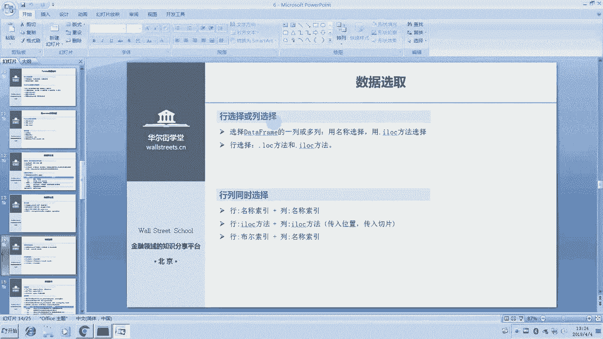

那么首先呢我们创建一个pandadas的树padas的data free。我们通过运行这个。DF6等于data framePD点data frame。我们通过字典传入一个字典来创建一个数据的格式。

那么我们可以看一下DF6现在的一个情况。那么DF6的话呢，我们在交互式里面输入DF6呢，它就会返回这个代码执行的一个结果。那么。显示的是啊，我们这个一共有4列，那么这是0到6啊，0到6是索引。

那么对应的是数值，我们一共传递了coded name frequentequ。frequent frequency和value四个变量的一个值。那么我们接下来呢就看一下我们想进行一个列选择怎么选。

比如说我们要选择一列，那么我们DF6，我们只需要把这个列的名字单独给输进去就好。比如DDF6code，那么选择出来的呢就是code和提其索引。那我们这个code呢也可以换成那。换成name的话呢。

就是我们就是选出name这一列的一个索引，它的名字啊，这一列的名称叫name，它的type呢是object。那么如果我们想选出多列怎么办呢？我们可以传入一个list，比如说我们传入一个name。

然后同时传入一个value，我们就会找到名字和它对应的价值和它的值，那么我们可以看到它选出来的就是一个啊多列啊，两列。那么接下来呢我们可以看一下，如果我们在这里呢呃还有别的方法进行一个选择多列吗？

其实还有啊这种方法呢，我们我们把它叫姑且的称为呃直观的称为通过这个列的名称来进行一个选取。也就是通过这个colums，通过它的列名称来进行列值的选取。

那么我们还有一种呢比较呃方法呢叫做数字的一个索引方法。我们可以叫做ILOC方法。那么其实LOC是location。那么ILOC方法呢，在这里呢就是说通过这个indexILOC就这个数字的一个位置啊。

我们来进行一个索引。比如说我们前面这个冒号，大家都知道了，我们在切片里里面里面里面已经讲过。如果说是一个冒号的话，它代表的是全部都选取，全部都选取。但在这里呢我们知道data frame呢。

因为它是一个二维的一个情况啊，它是一个二维的，它有一个纵向有一个横向的一个这样的数据，那么我们这里给一个冒号，它的含义呢，就是说我们在。行上面呢已经把所有的行都选择了，就这个含义啊。这个第一个冒号呢。

就是说我们选择所有的行，它是先从因为我们刘老师也给大家介绍过，就是说我们这个呃python里面呢，我们的纵竖着的这个方向啊，我们把它称为axs0，也就是零轴的方向，横着呢称为axs one一一方向。

所以在这里呢，那么第一当然就是先设置这个零轴的方向。那么后面这个位置呢逗号后面呢就是设置我们的一的方向。比如说我们现在呢想选取第一列呃这个编号为一的这一列。那么编号为一呢，code呢是第零列。

那么name呢就是第一列了，我们这样子运行一下，发现呢取到的就是我们的name，如果我们想做一个切片也是可以的，1到3，那么就是取我们的一和2，那么不包括3，所以呢就是取我们的name和fr。

我们运行一下。那么得到的就name和 frequency。当然前面这个我们可以看一下，这个呢就是我们的。选择一列或者多列的方法。那么接着呢我们看一下选择一行或者多行的方法有哪些。

那么同样的是呃我们这一个呃我们这一个data frame，但是我们对它进行一些修改。我们对它进行一些修改。比如说我们把它改成。给它添加一个index啊。同样的是这样一个data frame。

但是呢我们把它叫DF7，我们这边给它添加一个index。我们这个index呢等于一个列表。我们看下它一共有7个数据，我们就等于一。2。3。4。5。6。7。好的，那么我们把这个OK了以后呢。

我们对它进行一个执行。那么DF7呢，我们也定义好了啊，DF7我们也定义好了。那么DF7呢，我们给它定义好以后呢，我们可以查看一下DF7长什么样子了。它应该就是跟DF61样，只是索引的更换了。好的。

DF7是这个样子。那么我们比如说要取它其中的一行，我们怎么取呢？我们这个地方呢有1个LOC方法，我们点LOC方法取它的一行。比如我们要取第二行。这个呢就和我们那个直接取那个列是类似的，只要输入它的名称。

哦，sorry啊，这里DF的话是没有被定义的，这里是DF7，所以这里我们要把它改成7，不然会报错啊。他们已经提示我name DF is not defined。这个呢大家经常阅读啊，出现了报错。

也不要紧张，可以看一下它的一个报错的原因。这样运行一下。唉，好了，还把我们的code name frequency和value都提取了。这是第二这个index等于二的时候。

那么我们同样的跟呃我们要提取多行呢，它就和我们这个。这条frame呢也是一样的。和我们那个提取它的列数也是一样的方法。我们取一个2，然后我们再取一个。取一个6吧。取个6。我们运行一下呢。

我们就取的是第二行和第六行啊，这就是我们的一个点LOC方法。同样的我们还有这个DF。方法呢要取列的话呃，要取行的话呢，我们也有一个点LOC方法啊，除了LOC方法，还有点ILOC方法。那么也是一样的。

对于第一个我们先要取啊零方向上的，也就是竖着的方向上的，我们要取哪些行，所以我们取比如说1到3行，那么1到3呢，它代表的就是包括第一个位置，第一个位置是几啊？其实就是第二行。然后第三个位置呢是第四行。

但是不包括第四行从第二到第四，那么就是取二三行。那么后面呢我们如果说给一个冒号的话呢，它的含义是什么呢？它的含义呢就是说我把所有的列啊都取。但是呢我只取这两行，那么我们运行一下给出来的呢？

就是我们这两行的，后面的所有的列。那么通过这种呃我们看一下啊，通过我们的列选取的方法，直接选取列的名称，或者说传入一个列名称的list，或者是我们讲的点ILOC方法。那么我们单独选行的话呢。

我们由LOC方法以及点ILOC方法。那么我们把这些呢总结起来呢，就可以任意的提取自己所需要的一些行。那么根据这个索引来提取，或者说根据名称来提取。那在这里呢我们还要再多讲一个常用的。

就是我们选择某些啊满足条件的行。那么在这里呢怎么选择满足某些条件的行呢？我们读取一个比较大的数据，我们来举个例子。PD点reCSV啊，这个数据呢又是呃刘老师刚刚举过的那个行业指数的数据。

这个data里面的行业指数。行业指数点。啊，行业指数的PETTM啊PETTM点CSV好，又是这个数据，然后我们要指明它的安全。安卷指明是python。那么我们在。skip roll呃要跳过第一行。好的。

呃，我们运行一下，查看一下这个数据。好的，我们发现呢这个数据的话呢，时间啊，还有后面的各个PETTM都非常的完整，1862行乘以11个cols。然后对于这样一个数据呢，我们拿到手上以后呢。

我们想要取选取什么呢？选取啊它的时间在2019年2月1日以后的数据。那么我们怎么去做这个选取呢？大家回想一下n排里面，我们有一个有有有一种方法，就是在n派后面打一个方括号啊。

然后我们在那个括号里面呢输入我们这个array大于说多少，array小于多少。那么对于时间呢也是一样的。那么这里呢就要注意一点了，这个时间的类型是什么？如果这个时间的类型呢。

它是我们这个pandas里面的date time的一个类型的话呢。那么我们是可以直接用呃这个我们这个条件的一个索引的。但是如果说它的类型不是data time的话呢。

我们就要把它先转变成data time。那么我们现在看一下DF three的这个，我们先看一下时间这个。列它的一个类型，贬低态度。运行一下就知道它的类型。啊，它的type呢是object的。

所以呢我们要注意啊，这里我们要对它先转换一下typepe。所以呢我们直接。DF three的时间会等于。好，我们把它复制过来。DF three时间点S type。把它转变一个类型，转变成什么呢？

转变成data time。因为大家在excel里面也可以知道，就是说如果啊你这个数据是文本型的，你对时间呢进行加减也好，对时间进行比较也好，它是没有结果的。

所以呢我们一定要把它先转变成这个呃时间的这个类型，我们才能够对时间进行比较，谁在谁之前谁在谁之后，后面的比前边有的大。好，我们这样进行一个转换了一个。我们把它这个类型转换以后呢。

我们再查看一下DF时间的一个态。Yeah。呃，它的type呢已经被转换成了我们这个MS啊，就是转换成了我们这个beta frame的一个呃data time的一个格式。接下来呢我们要看一下。

我们可以直接选择了怎么选择呢？DF three，因为我们要选择时间在某一个之后的，所以我们只需要DF three的时间。我们要求时间这一列，它要大于某一个数据，它要大于谁呢？它要大于2019年的。

2月1号啊，他要比我们想的这个时间要大啊，为什么呢？大的话呢？就说明个时间在后边，在后边我们运行一下吧。我们发现选取的时间呢确实如我们所料呃，在2019年的2月1号以后，为什么从2月11号开始呢？

因为中间呢呃有很多个交易日是在过春节的啊，我们在过春节。所以呢。这个时间呢是这个这个时候开始。O。那么我们往后看。呃，比如说呢我们现在呢最后呢就是说除了这个条件选取啊，不仅仅是说可以根据时间选。

我们还有别的方法啊，比如说我们根据指数全指，比如说我们想看一下这个指数，全指数。全指的哪一个数据呢？全指金融了啊，看下我们的国资命脉金融。我们想看这个金融啊，它这个比。20倍呃比这个。10倍高的时候啊。

比10倍PE高的时候是哪一些？我们要运行一下，我们发现选出来的就是全指金融高于10的一些时间啊，就是全指金融高于1的一些时间。一共呢也就只有189个那个日期呢是高于10的。

大家发现1800多个日期里只有100多个日期呢，它的PE呢，金融的PE是高于10倍的啊，说明我们国家金融呢是非常的给的估值是比较低的。大家认为啊，就给它的一个估值是相对低的。

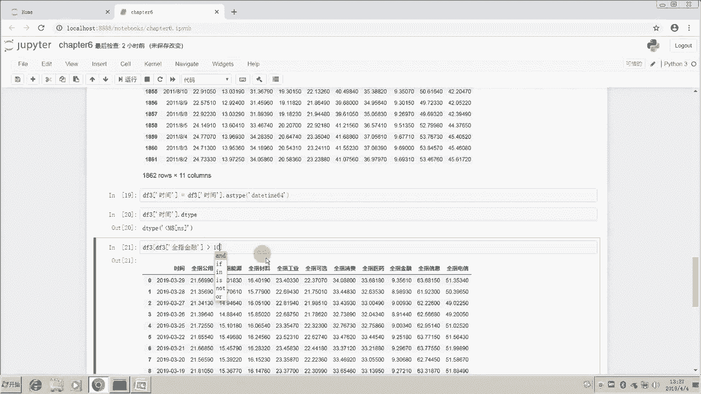

那么我们接着呢讲一下。讲一下如何就是通过行列呢对它进行。同时的选取啊，刚刚我们已经讲过了这个单独的选行啊，单独的选列啊，或者用ILOC方法进行一个选取。

那么我们现在呢讲一下如何我们把这两个行列呢同时给它进行选取。

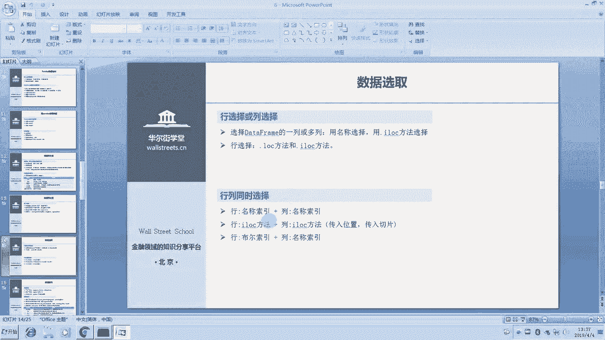

我们讲一下行列的同时选取。那么在这里呢，我们想先说啊，就是说LOC方法呢，其实是可以针对。针对这个行和列同时使用的。比如说我们看这个DF7了DF7data frame seven。

它的话呢是我们用这个LOC方法来进行行列同时选取的话呢，也就是说我们要先传入一个行的索引啊，我们先针对行，因为行是在这个零方向上。所以我们先针对零方向上的行进行一个索引。比如说第一行。

然后用一个列表啊来进行索引。第五行，那么我们把这个行的索引，用一个列表包包括了。接下来我们来用列的索引列的索引。我们想看一下name和这个频率这个数啊， frequency啊。我们想看这两个。

那么我们运行一下呢，它选取出来的呢它说DF。因为我们是DF7。好，我们看一下DF7的话呢，我们就选取出了一和5的这个index下面的name和 frequency的这两个数据啊，我们发现它是OK的。

那么这个呢就是我们一个行列选取的这个LOC方法。那么行列选取呢还有ILOC方法。刚刚呢刘老师已经给大家介绍了ILOC方法就是说我们也是传入比如说零和一。比如说二和3，那么我们运行一下来。

它就是给出相应位置的啊，零和一呢就是第零个啊和第。呃，和第一个这个行第零行和第一行，后面的二和三呢就是第二列和第三列，就是 frequency和value。那么现在呢呃其实我们还可以通过一些。

其他的方式啊，比如说我们刚刚讲过的那个布尔索引，其实就是刚刚刘老师举出的那个按条件来选择。比如这里的DF7的，最后举这个例子讲完这个索引这个DF seven的这个value。

就是我们要对DF seven的这个。我们要根据一些条件选择DF seven里面的一些部分的行货列。那么我们可以先。先怎么样呢？我们先DF seven是我们要选取的那个最大的那个范围。

然后中间呢我们要根据DF seven点value，我们想选这个value它怎么样的呢？我们想选它大于20的时候要值。那么这个时候呢，我们这样子选出来呢，理论上我们运行一下。它就是DF seven。

就是这个DF seven的value的值大于20的时候，所有的行列。但是我们在实际的分析中。可能根本不需要这么多行列，所以我们还可以再在这边做一个。调整我们只选择coded和fr。

那么我们在里面再加一个选项啊，给它选项，我们就只剩下code frequency了。所以呢大家在学的过程中呢，这些都可以灵活的运用。就是说你可以把不同的，只要不违背语法情况下。

你可以不同的去把它进行一个扩展。你先针对谁。比如说这里的对象最开始的对象是DF seven。那么通过DF seven，我们做了第一次的这个条件选择以后呢，它的对象呢就变成了前面这一部分的一个整体。

就把这个整体作为对象。既然这个整体作为对象，它就是一个新的data frame。那么我们对这个对data frame。当然可以再次的用我们所所谓的这里的一个切片和行列选择。

当然可以再次用包括对这里我们还可以再次的使用code这个选择。😊，啊，最后选出来的呢就是code。所以呢大家对这个的学习呢关键点呢就是要把握我们研究的对象到底是谁啊。

因为pysthon呢是面向对象编成的语言。这个刘老师从第一节课强调到现在，这个呢是非常重要的一个学习的思路。好的，那么我们接下来讲一下简单的一些数值操作哈，或者说常用的一些数值操作。

主要呢有数值的替换和数值的排序，这两个呢都是在我们的数据分析里非常重要的两个内容。

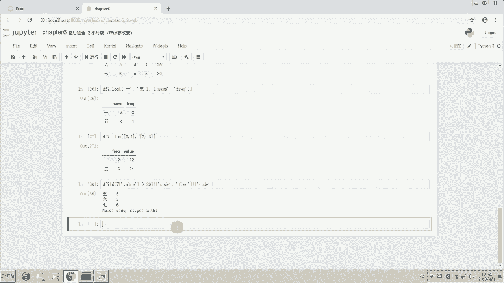

数值的替换，我们讲一下一对一的替换，多对一的替换和多对多的替换。那么首先呢我们输入一个data frame，依然用这个DF seven，我们删掉一些，依然用DF seven。

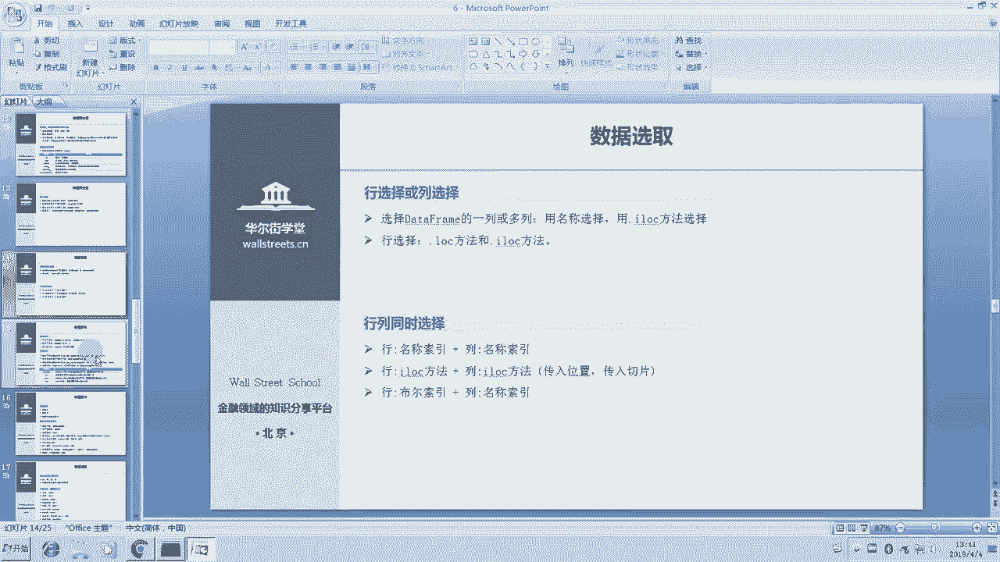

好，我们依然用这个DFC7。运行运行啊DF seven那么是这个样子。我依然用这个DF seven来完成我们这个一对一的替换和多对多的替换等的一个介绍。那么一对一的替换或多对多的替换呢。

我们有一个函数叫点 replaceplace函数，怎么用呢？我们先看一下一对一的替换吧。比如说我们就只想替换掉value里面的一个值。想替换掉谁呢？想替换掉。value里面的这个17。

我们想把value里面的17替换成0，那么我们就用DFvalue，我们只对value进行替换DF seven value点replace。那么前面是要被替换的数，后面是最终替换成的数好。

我们这样进行一个替换运行。我们发现这个DF seven的这个value呢，它是被替换掉了的。但是DF seven它真正有没有被改变呢？它是没有被改变的啊，它没有被改变的。

所以我们真正的要去改变掉这个DF seven的话呢，我们还要再让它DF seven。的这个value。等于这个我们这样运行一下，这个时候呢DF seven呢就被替换掉了，就被替换掉了啊，这是一种方法。

这是一种方法，就单个数值的替换。当然了呃，刘老师也给大家讲过，那个我们可以试一下点 replaceplace的方法，什么意思呢？我们重新来一下这个地方还是17。那么我们想用一个点replace。

我们看一下这边是不是能传入一个参数inplace等于Q。我们说啊能不能让它这个函数呢就地改变，我们来试一下。哦，我们发现这里也变成零了，说明这个inplace在这里起到了效果。O吗？

这里我们没有用DF seven的这个value会等于它。我们没有进行一个负值的操作，而是说你就地给我改inplace就地给我改Q。因为默认情况下，这个地方是forse的，所以你不输入这个参数。

它默认就是说我不能在原来的基础上改。但是你给一个in place的话呢，很多这种函数呢，它能够实现，直接我在DF seven的基础上给你改动。那么我们接下来呢讲一下多对一的替换。

多对一的替换呢也很好理解。就是说啊我们想要怎么样替换呢？我们想要呃把多个数据呢替换成同一个数据。比如说这里我们不仅想替换17，我们还想替换20，怎么做呢？是这样吗？不是的啊，这样就多了一个参数。

我们把它们用list给它扩起来，就这样子。我们用list把它扩起来，我们想把17呢和20都替换成0，我们只要这样运行一下。那么最后的结果呢，17和20呢都变成了0，这就是多对一的一个替换。

那么想必呢大家在现在呢已经能够呃猜到了，如果我们要进行多对多的替换呢，会怎么去做，我相信大家已经能够想得到了。对，没错，如果我们想要进行多对多的替换呢，我们当然这个地方传入的就不是列表，而是什么呀？

而是字典。所以我们可以把这两个都删掉。比如说我们在这里传入字典。😊，怎么怎么怎么做呢？比如说我们要把A全都替换成大A，小A替换成大A。然后小写的B呢都替换成大写的B。那么这样的话呢。

我们先把这个重新的设定一下这个DF seven。好，我们现在运行一下呢，它报错了，它报错了，为什么会报错呢？

我们也看一下它的一个这个cannot compare types in the array and stir string，它这个地方报错了一下。这个很好理解。

就是因为我们这个地方呢是针对value进行的一个操作。而我们这个ABCD呢，它是在name里面的。所以我们这边要把这个value给它删掉。那么我们直接这样子进行一个replace。

那么我们发现所有的小A都变成了大A，所有的小B都变成了大B，而且是在原来的data frame seven基础上改变的。这个呢就是一个多对多的操作，那么希望大家呢可以掌握一下这个规律啊，也不要死记硬背。

因为我们跟我们之前讲的规律其实是一样的。大家只要掌握了这个思路就好了。如果一对一的替换呢，你就单独把值放进去。如果是多对一的替换呢，你就把那个被替换的值呢，用list来表示，如果是多对多的替换呢。

我们就用一个dictionary，用一个字典来放进去作为这个指引。好，那么关于数值操作呢，还有一个重要的内容，就是数值的排序。数值的排序。我们看一下有这么几种排序方法，一种是按照一列数值进行排序。

就是我们单独按照某一列进行排序。它的一个语法呢是data frame点short values，我们用一个short values的一个这样的一个方法。

data frame的一个short values的方法，然后用一个by equals column name，我们给一个列名，根据谁来排序，然后默认情况下呢是按照声序来排列。

因为S sendingending是等于Q的，我们也可以把这个Q改成foralce，那么就是默认，那么就是我们改成倒序排。那么如果有缺失值的话呢，我们可以向这个方法里面传入1个NA position。

那个NA position的话呢，我们可以传入进去。就说缺失值呢是排在前边还是缺失值呢？排在后边。我们也可以按照多列数值呢进行排序。比如说DF点short value。那么这个的话呢，我们可以看一下。

就是说我们这边呢传入一个list，而不是一个单独的列，那么就可以按照多列进行排序。这个Sstandending后面的这个那个内容的话呢，就一个是去，一个是force，就是说第一个coum。

我们要按照第一个coum的生序来排。然后如果相同的情况下呢，我们第二个colum呢就按照降序来排，我们是这样子的。然后。我们还会讲一下数值的质，就是excel里面的这个rank的方法和我们这个。

python里面的ra方法是一样的啊。那么我们分别呢就是说也有ascending和me的两个方法。那么跟excel呢是相对应的。而且excel能做的呢，我们这里呢只需要传两个参数，也能做。不能做的呢。

我们还有一个first和max啊，这个呢在excel里呢会更麻烦一些。好，我们就对比着来看一下这个问题。数值排序的话呢，我们依然读取刚刚呃刘老师的那个非常经典的这个例子啊。

PD点read先这个地方你看刘老师每天书很多遍的话呢，你自然都记住了你的一个顺序，你也不用再去翻书了。所以呢关键是要形成这个肌肉记忆，所以呢非常需要大家不停的去练习，在空闲的时候。啊，这个地方摁错了。

好，我们把它输进来，然后angine equals。太傻了。然后这个。Sscape row。because one好，我们运行一下。这个已经运行好了，我们查看一下这个数据。好的。

查看完了没有什么问题啊没有什么问题。这个数据。那么我们刚刚讲的那个排序的方法，我们想用第一种方法排序，我们先看看怎么排啊，short values by column namecending好的。

那我们直接试一下DF3点short by。啊，我们看啊，不是st by，是st values。st values，然后by equals。比如我们想按照。不如就按照金融来排序吧。选举金融。

就按照全指金容来排序，然后。ASCENDING啊SN点 equal是for，我们给它一个错呃就是。降样序来排，我们运行一下。好，我们发现呢全子金融是不是按照降续来排的？没错啊，它按照降续来排啊。

所以呢这里呢我们就完成了我们的一个排序。我们再来看一下它这个那呃NA position这个参数啊。比如说我们把这个DF3的部分的参数呢，我们把部分的数据呢我们把它变成。这个缺失值。

比如说这样我们把它变成缺失值。也就是说我们打把n派点numb赋值给了谁呢？赋值给了这个data frame three的第所有的这个列呃所有的这个行，但是呢是。我们看一下这3到10列。

我们看一下这个结果，先复值一下，看一下符不符合我们的要求。比如我们看下DF three现在看一下。啊，他这样子的话，把这些全都复制给了这个NAL，这样是不是我们想要的。我们应该把它反过来啊。

比如我们把单独把它的3到10行。复制成我们的这个所有的行，3到10行全都复制成这个囊牌典浪。那么我们先重新的运行一遍。好，我们再查看一下这DF three啊。我们发现。这个这个时候呢。

这个就是我们想要的了。因为3到10行呢全部都是一个呃这个错误值，或者说是空值，是空值。那么我们现在呢就。对它进行一个排序怎么排呢？比如说我们DF three点st，我们对它进行一个排序。

我们在这里对它进行一个排序。呃，我们这边呢给一个相当于position。我们让这个呃我们让这个血失值呢。排在最前边。那我们发现缺失值就排在最前面，那我们让缺失值排在最后边。那么缺失值就在最后边。

也就是说我们这样是按一个降序排，然后同时把缺失值呢排在最后边，排在最后边，这就是我们这个NAposition这个参数的一个操作。同样的道理，如果呢这里呢我们想根据两列来排的话呢。

我们只需要把这个金融指数呃，全指金融这边加一个把它组成一个list，然后再加入另外一个指数就好了。比如全指。选指工业。我们这样子进行一个运行。那么我们发现唉这个就按照全子金融和全职工业来排。

那么这里的话呢，如果全子金融是for的话呢，我们全子工业可以给它为Q。也就是说啊，全职金融在逆序排序下呢，先是优先的逆序排序。同时呢我们对全职工业呢，如果说全职金融有相同的情况下，我们对全全职工业呢。

就按升序排序啊，这样子就是另外一个排序的方法。也是一个我们这个多列数值的一个排序。那么最后呢我们讲一下数据的质。这里我们数据依然运行，我们这个numb派的话，这个n派点na就把它删掉。

我们依然是还用这个数据。还用这个数据的话呢，我们先不要让它打印这么在屏幕上看起来。非常的。让他丑好。我们只需要呢在这里呢，我们希望呢得到数据的质。那么我们就。可以看一下这个数据的质，我们怎么获取。

那么我们在这里的话呢，我们先看下DF3。首先你如果要排序的话呢，要保证啊所有的元素呢最好都是可以排的。比如说这里的时间时间的话呢，在这里我们就不希望说把这个时间也放进来排序。

那么有一种办法就是说我们把它reset一下这个index。把这个数据呢，我们rest一下index。我们把时间呢作为这个index。那么我们这样子的话呢，我们看一下这个数据。啊，不是reset。

 sorryorry，这里是set index。我们这样set一下，把这个时间呢作为set indexreset index我们是用于哪里呢？

我们是用于我们说把一个层次结构的表呢转化成非层次结构的表里面，我们经常用reset index。这里我们就用set index把它进行一个设置。设置以后呢啊我们发现我们可以。把它命名为DF four。

一个新的data free。那么我们对这个新的data frame呢，我们进行一个操作。就是说我们用刚刚我们讲的rank函数。我们直接rank它一下，看一下会得到一个什么结果。好的。

我们就得到了一个这个指数的一个质，得到指数的一个质。那么得到这个指数的一个秩序以后呢，我们就看一下现在的金融排在1500多名。因为它是升序啊，它是升序。所以现在金融位置的这个PE的位置还是比较高的。

那么我们在这里呢，我们只要除以一个le。我们除以整一个data frame的一个长度。呃，dta frame four的一个长度。我们看一下得到的一个结果会是什么。我们看一下，我们得到一个小数。

其实这个呢就是我们指数的一个分位数。我们发现现在医药指数呢是非常便宜的啊，从PE上来看，单从PE上来看，医药指数的PE大概是0。26，材料的话呢是0。09更低啊，然后其他的呢都是在平均水平附近。

那么金融呢非常的高啊，0。820。82。那么这只是一个粗略的一个看法啊，我们还有一些其他的办法，比如说。在这里的话呢，我们我们单纯的就是想看一下这个数据的一个规模啊。这里呢data frame里面呢。

我们也可以用data frame的size这个方法。我们发现它一共有18620这么多个数据啊，这么多个数据。其实也就是1862行乘以十列的得到的一个情况。所以呢这里呢我们教了大家一个计算分位数的方法。

但是呢这里的分位数呢其实它不是那么的。准确为什么呢？因为这个rank方法呢存在一定的误区，误差。什么误差呢？就是说。因为我们想啊你就要进行排序，当有两个人，两个PE它的大小相等的时候，那他们怎么排呢？

到底是并列排名呢，还是取平均值排名呢？还是说他们的排名取平均值呢，还是说他们的呃排名都取小的那一个呢？我们来看一下。那么这个中间excel的方法很像了，excel比如说有个average，假设有两个人。

小明小红，他们的排名都是第一个第三一个第四，但是他们两个的是相等的。那么这个时候呢我们就取三和4除以一个2，也就3。5，把他们排名取平均值把重复值的排名取平均值。

那么如果是MIN呢就会excel里面的ra eQ的函数的功能是一样的。就说啊比如说有两个人重复了，我们就把他们两个人统一呢取最小的那个人的排名啊，那么还有呢就是first，就说啊我们这个在排列里呢。

优先出现的那个数据呢，我们就把它排在前面，后面出现呢排在后面nex呢也是一样的，优先出现的呢，排在后面啊，后面出现的呢排在前面。我们这样排。所以呢在这边呢我们一般来说的话，使用哪一种方法都没有关系。

那么平常来说的话，它这里的这个默认的方法，是等于average的。所以呢在平常的使用中呢，我们建议大家就用erage就好了。那么大家呢也可以根据自己的一个需求。

选择first mini mini和 max都可以。Okay。好了，我们接下来讲一下这个相关的数字操作的一个进阶啊，后面还有一些数字操作的方法，比如说删除数值，比如说其他的一些常用的方法，我们来讲一下。

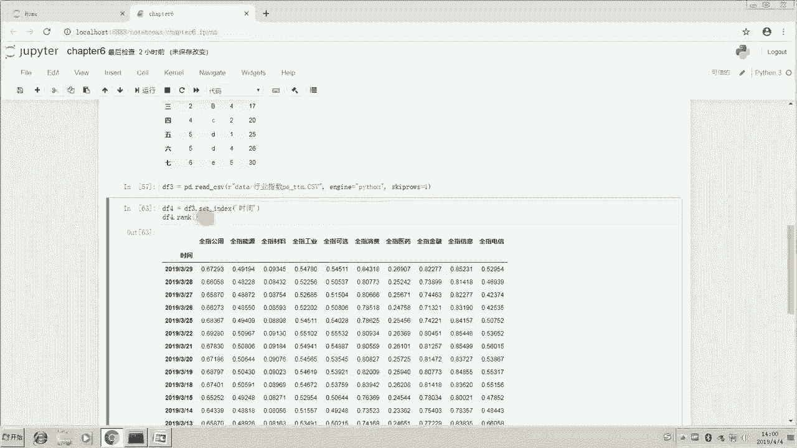

我们先删除掉一些不必要的内容。好，依然是这里。呃，关于这个DF7呢，我们这个例子呢用的非常好，可以用很久。我们看一下啊这个DF7的话呢，我们想删除掉其中的一些列，我们怎么来删除啊？

我们先把DF7让它跟这个交互式，让这个python输出在屏幕上。

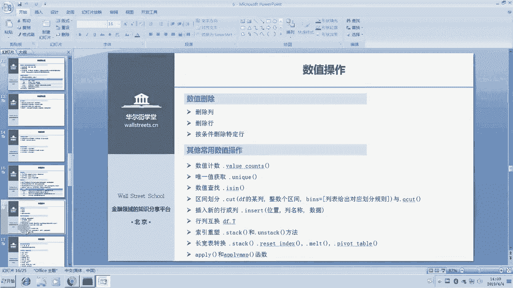

对于这个DDF7来说呢，我们想想要看一下，就是说我们要删除掉其中的F呃 frequency和value这两个列。那么我们用的是jorop方法，DF7点jorop我们用的这样一个jo方法。

然后呢去除以谁呢？fr以及我们的value。我们用一个这样的job方法，然后我们试一下，看一下结果。那么他说了错误报错，那么是为什么呢？为什么报错呢？Not founded in access。

他说我没有在这个这个轴里面发现，那是因为什么呢？是因为我们还我们之前讲过呃，特别强调过python呢，它是先从竖着的方向去运行。为什么？因为竖着的方向定义的那个axs是0横着的方向定义的axces是一。

所以他优先呢从竖着的方向去运行。在这个题目里面呢在这个问题里呢，我们就要去想啊，他竖着的方向找能不能找到FREQ和valueue啊，它找不到的。所以我们要给它定义一个axs等于一。

我们让他从横着的方向去找找这两个名字。这样一运行，唉，他们就横着的方向先找到了frequency和value，就把它给剔除掉了，用joug删除掉了。那么这个呢是在原操作上改呢。

还是说那个需要我们重新复值呢，我们会发现原操作的DF seven并没有被被改动啊，而是我们说呃jorop的话呢，它只是形成了一个，我们可以理解成一个印象。然后这个印象，我们把它重新的赋值。

或者这个这个新形成的内容，我们重新的赋值给DF seven，那么它就会变成替换掉原来的DF7。那么这里呢如果我们想要说呃不想输这个ac可以吗？也可以，我们可以用colon这个方法jorop。

我们这里直接cos，我们要删掉这个con嘛，我们就把这个cos给它FREQ。和value这样子进行一个运行的话呢，唉下这两个的效果是一样的，等同的。只不过这个地方呢，我们直接指明了，我们就要删除列。

上面呢是说我们从横着的方向来查找，查找到了就给它删掉。那么删除列的方法讲完了，我们讲一下怎么删除行的方法。删除行的话呢，其实就是列给它反过来就好了。我们这个地方就换成0。

这个地方columns呢我们把它换成index就可以了。好。所以呢这个方法呢大家掌握一个就好了啊，你们看一下这里出现一些问题，因为横向呢我们是找不到这个横向是找不到这个FREQ的啊。

所以我们要把这两个都要换掉，换成一和2就可以找到了。因为它的index里面呢是没有FREQ的，我们看一下一和5吧。我们把一和五行删掉啊，索引为一的和索引为5的都删掉。那么我们运行一下。好。

那么索引为一和索引为5的都被删掉了啊，这两种方法是一样的，殊途同归。呃，我们看一下按条件删除行的话呢，要怎么去删除呢？比如说我们就想删除这个value大于20的呃，小于20的行，我们要怎么办？

我们想删除这个value小于20的行。那么对于这个的话呢，我们这里呢用一种反选的思想，其实也很好理解。就是说我们不是要删掉你这个小于20的行呢，那我们就用我们的条件选择。

选择出你这个value大于20的行，大于等于20的行。这样就好了，我们不需要去删除，而是我们反选。通过反选，我们就选出了大于等于20的行，而不需要去删除小于20的行啊。

这个呢希望大家掌握一下这个非常重要啊。在我们金融分析里面呢，对于剔除一些异常值啊，比如说用3C杠嘛法则，我们把这个。😊，平均值加上3倍的C伽马和平均值减去3倍的C伽马都给都给它算出来。

这两个临界值算出来，然后我们根据我们这个条件选择，我们反选那些在这个常规区间内的数据就好了。我们不需要去管那些在常规区间外的那些数据呢，直接被我们的反选给剔除掉了。这个是一个常用的一个思路。好。

那我们这个。数值删除呢就讲完了，我们接下来讲一下其他的常用数值操作。这些其他的常用数值操作呢，它们包括了数值计术为一直获取数值查找区间划分，插入新的行列，行列互换，索引重数长宽表转换。

还有apply函数。这里面呃数值技术呢，大家使用的比较比较多一些。然后un的话也会有用到数值查找呢用的也。

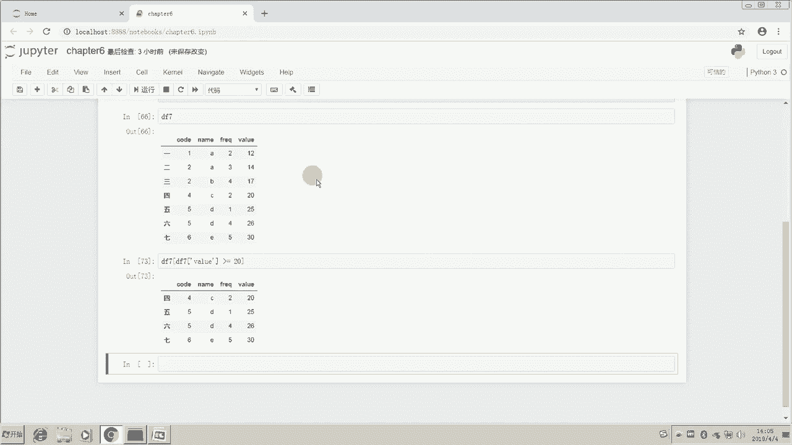

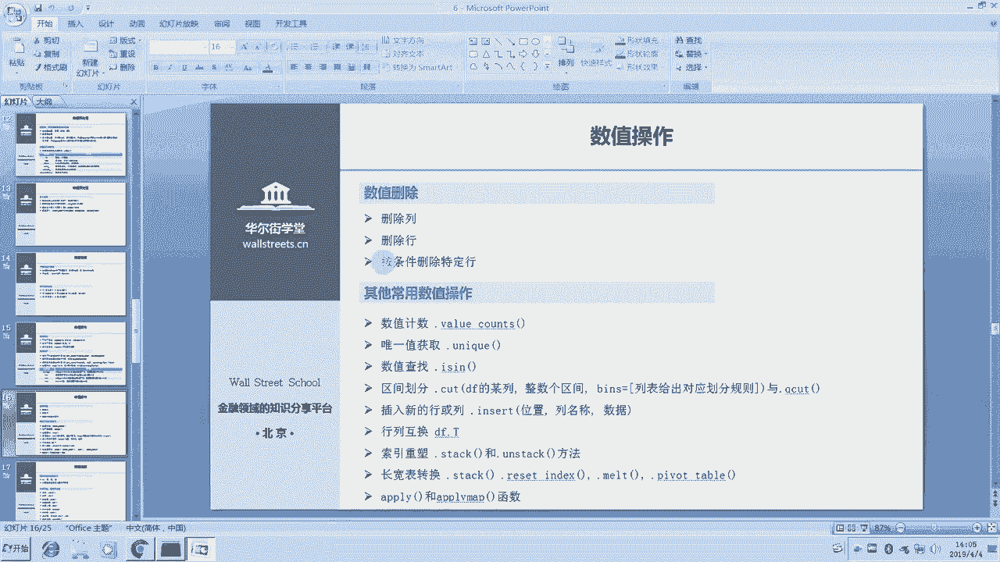

偶尔用到，但是这个区间划分比较重要，这个区间划分呢是可以帮助大家呃划分区间呢，以及说进行分位数的划分。这个的话在券商的研究中啊，在金融研究里非常常用，就是我们通过分位数的划分呢。

去对比如说对我们这个指数的PE进行划分。那么我们就知道哎现在是处于多少多少分位数的区间啊，它是低估呢还是高估呢？我们可以通过这个分位数来简单的获取相关信息。

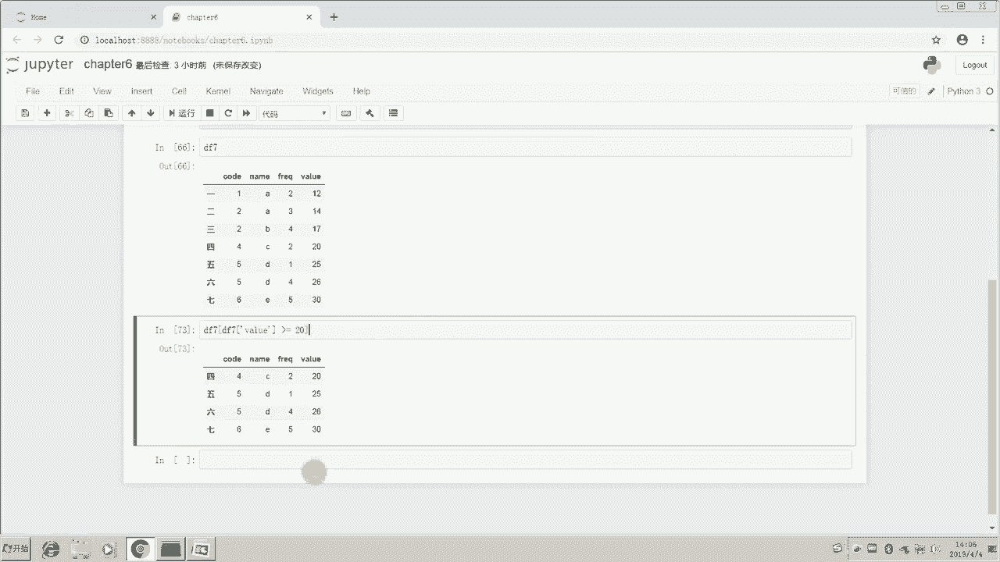

然后包括我们这个插入新的行货列啊，这个的话呢用的不多，转制的话也用的不多。这个索引重塑和长宽标转换用的稍微多一些。像这个prit table的话，待会我们会讲它就是我们excel里面的数据透视表。

那么在我们python里面呢，它就是一行代码，我们可以实现这个数据透视表的一个功能。好的，我们来看一下。数值技术怎么怎么来使用？我们依然是使用一个数据，但这个数据呢是。另外一个数据啊。

就不是刘老师刚刚反复在使用的那个行业PE了，而是一个呃行业的。行业的数据啊，个股和行业的数据。

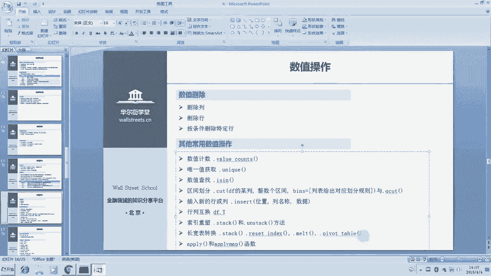

好，我们看一下啊，我们选data里面各股及行业数据。他说找不到一个这样的呃文件。那么这里呢可能是因为名字所输错了。我们看一下，如果这里输入一个旗啊，我们把这个名字选对的话呢，OK啊，现在没有问题。

那我们来看一下这个数据输出在屏幕上是什么样子。好的，它有code，有name，有industry，有这个PE，有这个股息率，还有我们的市值，还有我们的呃上市板块啊，主板创业板和中小板。这个这样的数据。

那么对于这个数据来说呢，我们第一啊，我们想看一下不同的行业，它的股票的数量有哪些？那么我们用一个很简单的方法叫value counts方法。indusstrtry升万啊就升外行业。

然后我们对它用一个value count，这个呢可以对不同的劣用啊，也可以对所有的列用。我们先对单个列使用一下。大家可以看下效果，我们对这个industry使用一下。

那么发现唉他把我们需要的统计在这里了。我们的机械化工啊等等，各个行业的股票有多少个，他都可以统计好了。那么你看一下我们如果不要这个不单独对这个进行一个统计，我们单独我们对所有的统计。

我们看下啊has no attributes啊，说明data frame不行啊，我们要对至少要对其中的部分股票吧，要对部分股票。比如说我们只能对其中的这个呃value啊。

或者说对其中的industry啊，我们对它进行一些相关的这个数值的一个统计的情况啊。那么我们看一下唯一值的获取。我们的唯一值得获取的话呢，就是说比如我们想看一下A股，它到底有多少个行业。

那么只需要industry点un就好了啊。unique的话，我们在这个numb派里面我们也讲过了unique方法。那么在这里呢tens呢也有这个unique方法啊。

我们看一下unic的话就生成了一个什么，生成一个n array，它告诉我们这是一个ar，它是一个array。好了。接下来呢我们讲一下。我们讲了数值查找。比如说我们想看一下DF4这个name里面呢。

它有没有一个平安银行股票。我们看一下。我们去找这个平安银行，看它在哪。那我们发现平安银行就在第一位啊，就在第一位，因为只有它是woe，其他都是forse，其他都是foralse。那么这样的话呢。

这个作用呢就满足了什么呢？满足了说我们要找啊一大列数据里，比如说我们只想找等于某一个值的数据，那么我们只需要呢用is in函数，把这个呃给它做出来，把这个表给它做出来。然后我们在DF four。

我们把它给括起来，对它进行一个全选啊，全选。我们我们把这个对应的行对应的所有的行给它做出来。哎，这不就是平安银行吗？对吧？比如说我们想要选银行业的股票，那么我们只需要这样做就好了。我们看我们举个例子。

我们industry升万点这个行业点is in。我们想看一下后面的这个，比如说我们想看一下银行。是在不在银行在这个里面的哪个位置啊。

我们看下银行在这个beta frame的这个industry里的哪个位置。啊，我们看啊这里他说我们pass了一个str啊，我们应该要pas什么呢？应该要pass一个这个至少得pass一个。list。

所以呢这里我们要pas一个list。好，这样应该就OK了。我们运行一下。好，它返回给我们了一个这个。布尔序列啊，布尔布尔的这个data frame的这个格式，我们直接给它索引就好了。我们直接索引。

我们发现哎我们把所有的银行股都给他选出来了啊，这样的话呢，就方便大家说我单独想对某一个行业进行分析，可不可以可以当然可以，我对多个行业进行分析可不可以？当然可以。

大家还记得我们的这个data frame for中间是可以传入list选择多个行业的啊。所以呢这里我们就不再啊展开下去了。这里的话呢把这三个方法交给大家，大家课后可以多多开发。

然后多多再结合自己的工作领域进行一个使用。因为刘老师呢之前主要是做策略的，所以呢刘老师的这个简介里面呢，包括我们这个呃例子里面呢更多的都会使用金融领域的，尤其是在行业数据啊。

各股数据啊方面的一些财务数据啊方面的一些例子。所以呢希望大家能够从这些例子里面触类旁通啊，结合到自己的工作中去使用。😊，那么我们接着讲一下就是区间划分，区间划分呢非常重要啊，它非常好用非常好用。

为什么呢？因为excel里面呢，往往你去算一些这个分位数的话呢，你要先拉出一列啊分位值来，比如0。10。2、0。3，然后你再把每一个值套在那个公式里面给它定个位，然后再拉。那样的话呢。

相对来说这么大的股票这么大的数据，那么3000多个或者说甚至有如果说在我们最后的分析里，那一些数据有30多万个、40多万个。我相信一个excel的话可以拉到崩溃啊，都会让人头很痛。那么在这里的话呢。

我们学习一下这个cut方法。😊。

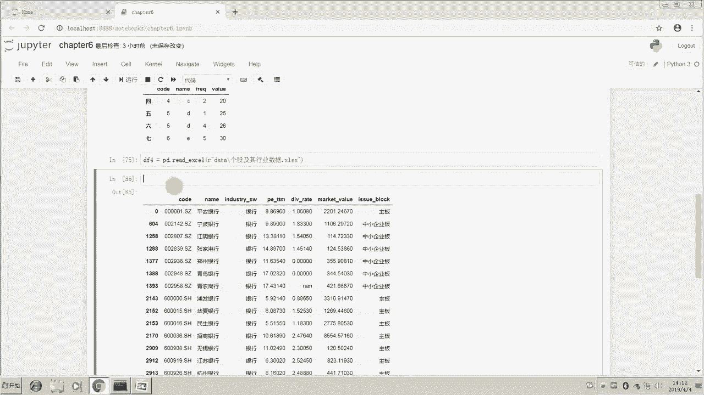

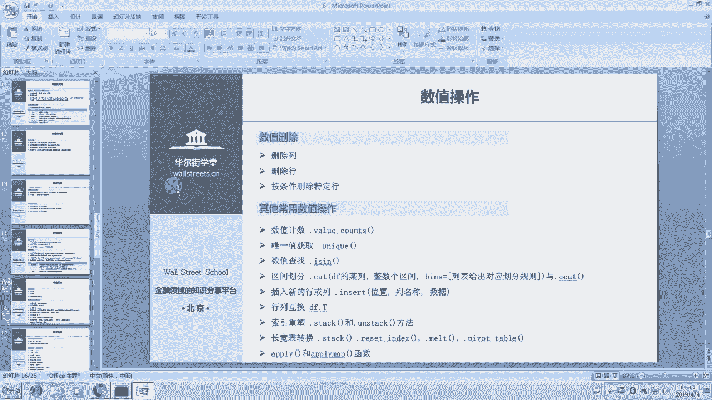

看的方法怎么用呢？啊，我们可以这么这么来理解。😊，它这里有两个方法，一个叫cut方法，一个叫bin，一个叫Qcut方法。cut方法呢就是说呀我们传入一组数，一组数，一组整数。那么它就呢这个。

我们传入一组整数，比如说我们传入一组定s等于。啊，一。10。

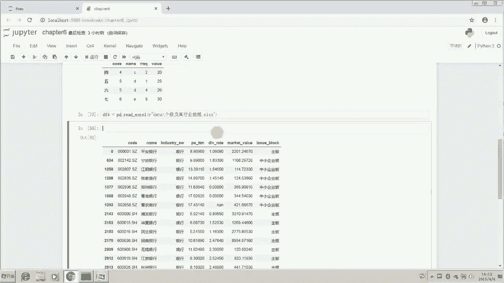

20。30如果我们传入了这样一组数据的话呢，这个含义是什么呢？就是说我们传入这个数据呢，给这个cut方法，它呢就可以根据我们给的这个be这个箱子呢进行一个切割。把所有的数据切成1到10中间的数据。

10到20中间的数据，20到30中间的数据。那么在这个区间，这三三个区间以外的所有的数据就被丢弃了。这个呢是cut方法。然后Q cut方法呢，就是说我们进行一个分位数的一个划分。好。

我们简单的找个例子来给大家讲解一下。

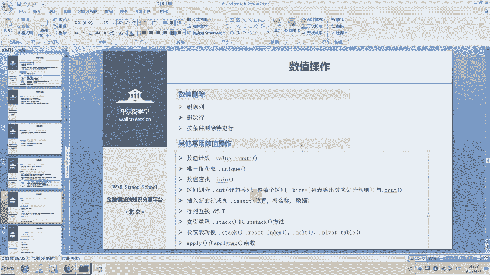

这里呢jo不就依然用这个DF four这个例子吧。第一呢，我们首先想算一下最小值。DF four呢，我们这个其实大家要触类旁通啊，就是说为什么为什么这里可以直接调用这个最小值来算呢？

因为它其实你可以把它理解成凡是像array一样，像data frame的单列这样子，它肯定是可以用这个所有的这些数组的方法的啊，所以呢这里呢我们可以算出最小值来。我们也可以算出它的最大值来。Yeah。

好，我们可以把它最小值最大值算出来。我们在这个地方来把它打印在屏幕上看一下它是多少。Yeah。把它呃输出在屏幕上，不知要打印，输出看一下啊，最小的是-7000多倍PE最大的是7000多倍PE啊。

这些都是盈利非常差的公司啊。我们现在呢给它分割啊，我们把它分割成最小的到最小值到0的一个位置，0到2020到60。然后60到100100到max，我们把它分割成5个区间。

那么我们现在呢把这个分割以后的数呃，这个叫做CAPE啊，我们把它叫分割以后的1个PE。那么PD点cut。DF four我们用cutt这个函数。对哪一列进行分划分呢？对PETPM这一列进行划分。

然后be死。然后labels。等于我们给他一个标签。当这个。市盈率是负数的时候，也就在PE最小值就是-7000多到0之间呢，我们把它定义为垃圾股。然后如果说。这个PE啊。在第二个区间内。

第二个区间是什么区间啊？就是我们这个0到20，我们把它定义为价值股。如果在20到60呢，我们把它定义为成长股。如果在60到100呢，我们把它定义为高估值。如果在100到PEmax之间呢。

我们把它定义为泡沫。OK那么我们就把这个定义完了，我们现在运行一下吧，看看它是什么情况。我们看下这个CATE长什么样子。我们发现他就把所有的股票进行了一个分类啊，进行了一个分类。这个呢就是我们这个操作。

那么我们可以对CAPE进行一个counts方法啊，value counts方法。我们发现哎我们所有的股票都分成了价值股、成长股、泡沫股和垃圾股，还有高估值。

我们发现现在的话呢呃截止到我提取这个数据应该是3月底3月31号左右。那么这个数据的话呢，成长股是最多的啊，就说按照这个估值来看的话，成长股估值的股票类型最多价值股呢相对来说是第二多，然后其他的垃圾股呢。

泡沫股呢高估值呢加起来大概也有1000来只。这样呢我们就对整个市场的全貌呢非常轻松的就概蓝了。而如果说要用excel来做这个事情呢，大家可能就要用到的是count if和countif。

那么以及还要去对它进行重新的命名啊，if它怎么怎么样，然后所以我们就输出个垃圾股。然后又if嵌套一层怎么怎么样。然后所以输出成长股。通过这样的一个操作呢是非常的费时费力的。我们现在这个操作呢。

可能需要如果说像刘老师以前用excel来做的话呢，可能也得做个10分钟到20分钟。那我们刚刚这个很快就完成了，对吧？呃，我们接下来呢讲一下Q卡的方法，简单介绍一下Q卡的方法。😊。

Q cut的方法更简单啊更简单。比如说我们PD点直接用Q cut，然后DF four。然后PE。TTM我们要对PETTM进行一个划分，划分成几个区间呢？5个区间我们直接给它划分就好了。哎。

他就把我们每一个股票所对应的这个区间给它划分好了啊，都是这个这个划分呢是按照分位数来划分的啊，按照分位数来划分的。那么我们这样就划分好了，我们还可以直接对它点。valueue count。

我们可以看一下结果。嗯，这里我好像输错了，它少打了括号，大家要注意。那么我们可以对它进行一个划分。好的啊，我输错了啊，正常应该是这样子will counts。我们发现他们每一个基本上都720啊。

因为它除不进了，所以呢会有一些多一个有些少一个。这个呢不要紧啊，这个不要紧，这个是一个分分位数的一个划分。好的，那么接下来呢插入新的行货列。插入新的行货链呢，这里我们用insert的方法，那么我就。

不去详细介绍了，大家可以阅读一下我们的教程。😊，就是我们那个讲义incer的方法的话呢，在你需要的位置。我们看一下，这里有个位置，然后把你需要插入的这个名称写进来。

把你需要插入的值用我们的列表形式写进来就好了。它就会自动的插入到你需要的位置里面，我们就不展示了。那么比如说行列转制，我们可以简单的展示一下。比如说就用这个DF7。

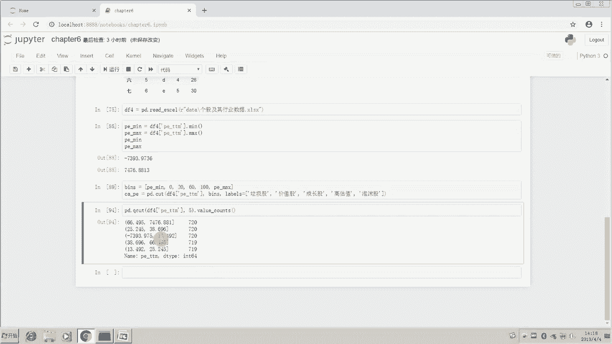

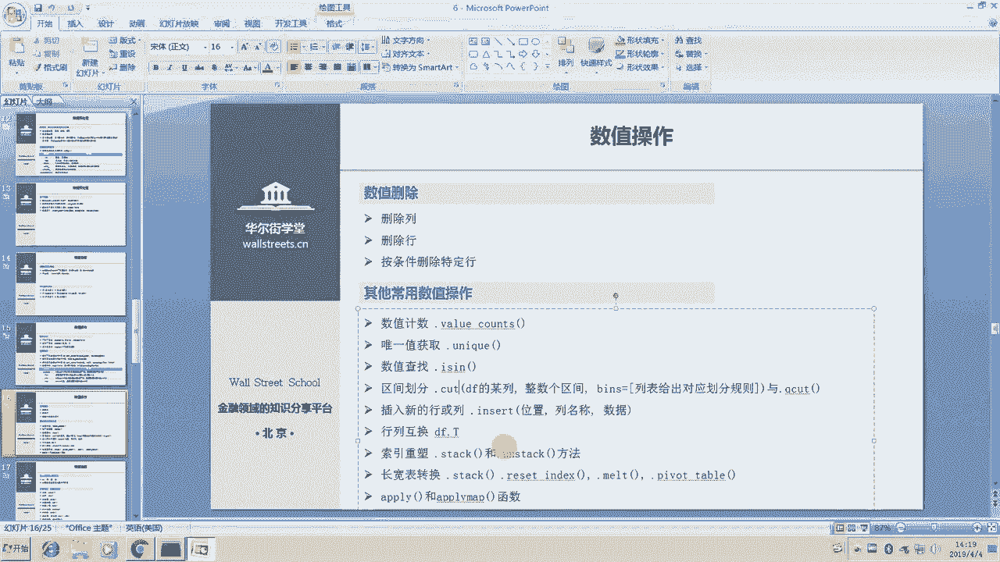

这DF seven是这个样子的，我们对它进行转制。大家学过信性代数的叫转制的符号是T。那么在拍on里面也是T，我们对它进行转制呃，DFCF点T啊。它就进行转制成功了。

那么我们看他们是不是两个是转制了以后的一个结果。那么在excel里呢，你这个转制呢呃还要复制，然后右键粘贴，然后转制也挺麻烦的啊，也挺麻烦的。尤其有时候带了公式啊，那个转制会出现一些意想不到的事情。

Yeah。好的，我们看一下这个呃讲一下这个索引的一个重塑吧。讲一下索引的一个重塑啊，这里索引的一个重塑tack和ont方法。这个呢其实就是像我们刚刚说的层次化的一个堆叠的一个过程。我们先给出一个数据。

PD点data frame，我们现在用字典来定义一个数据啊，大家一定要学会这种字典定义数据的方法。122。A一是122，然后A2是。231。

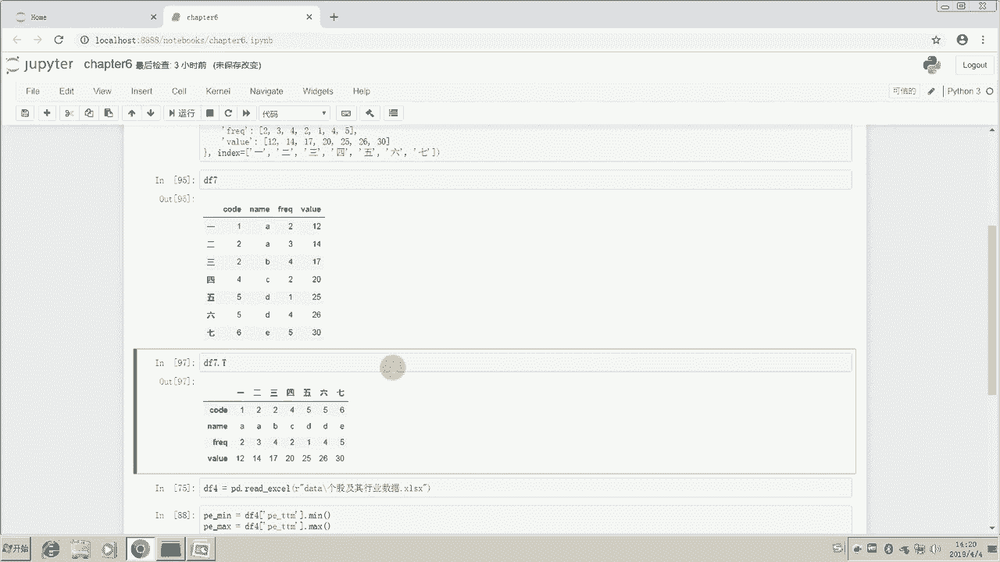

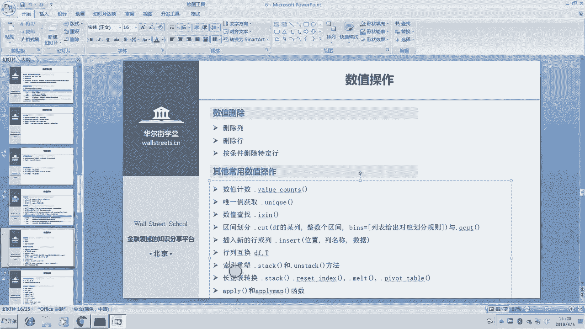

然后A3是。732。然后我们这个给一个index。等于。一。2。So。好，这样的话呢，我们把这个做完啊，这是DF8，我们给它美化一下。嗯，凑合吧，就这样。F。他这个美化的有点丑啊，要我觉得话还不如这样。

或者说把这个弄上去，还不如这样子。这样的话我觉得刘老师觉得比较美啊，不知道大家觉得怎么样。好，DF eight。所以这个代码的一个美化，也不是万能的，大家养成习惯以后，尽量自己把代码打的阅那个清晰。

阅读简便，不要说连在一坨，然后之后自己都不认识了，这样就不好。我们看下DF eight。DF eight的话呢呃是长这个样子的。那么如果我们对它用一个t，看会是什么样啊。我把它 stack起来一下啊。

Stack一下，唉，它就变成了这个样子。我们对比一下啊，DF8和DFt。我们看DF eight是一个这样的2乘2的表，但是我们把它t起来以后呢，就把它分类了。1等于一的时候有A1A2A3等于2的时候。

有A1A2A3等于3的时候有A1A1A2A3的值，这就被把它给叠起来了，叠成了一个呃，前面是索引，后面是值的一个列。本来是下面这个整一个表都是值，但是现在叠成这样的。这种数据类型呢经常出现在股票里面啊。

比如说。前面是年份，19，比如说呃22018年的数据，然后所有的股票，2017年数据，所有的股票，2016年数据，所有的股票。那么这种数据呢点层次化的这个数据呢经常出现在我们股票里面。

然后我们也可以通过这种t的方法ont方法啊，就是说比如说这个点t，我们会等于DF9。假如说有1个DF9是这样子的一个数据啊，DF9我们可以看一眼DF9是这样子一个层次化的数据，我们只需要用ont。

就是t的反操作ont把它给。展开就把它展回了原来的样子，把它展回了原来的样子。那么我们接下来再演示一下传款表的转换。长宽表的转换的话呢，我们举一个例子。举一个例子。我们readexcel，然后。

用data这个里面的2015到。2017年，我们用最后几个例子啊，公司增长率。XL XXO。好，我们用这个例子。然后我们先看一下它的效果。我们看看DF five长什么样。啊，问题问题不大啊，是这个样子。

OK的，我们看一下后面的结果。啊，果然多了两行，还记得怎么处理掉这两行吗？在这边读取的时候添加一个。sk foot啊，这边有提示跳跃掉最后两行角注，不要把它读进来。捐线完线。好，最后的角注没有了。

那么接下来。我们计算一下这个我们假设啊我们现在要把它堆叠起来，我们怎么堆叠呢？我们现在呢想把这个code和name堆叠起来，按照code name堆叠起来。

把后面的这些数据呢呃每一年呢都放在根据code给和 name来归类。我们来试一下DF点set index。我们先把它堆叠一下啊，这个地方是教大家这个索引重塑。会呃这个地方教大家长宽表转换。

我们先把它堆叠起来。那么我们用两个，我们用code和那个。把这两个索引。给他选中，我们试一下。设置以后变成什么样，变成这个样子啊，我们把这两个都作为了索引。好，我们把它都作为索引。然后呢。

都作为索引以后呢，我们把它命名为新的一个data frame BF6。好，对DF6的话呢，我们假设我们现在DF6长什么样，我们刚刚已经看了，对吧？DF6就长这个样子，它有两个索引。

我们现在想把这两个索引给它堆叠起来，注意啊，我们堆叠针对的是谁？针对的不是数据，针对的是索引。我们现在要t它，我们来看一下效果。好，ack成功了。大家发现了没有？

我们code就作为了code和name作为了我们的索引，而这三个值呢唉变成了数竖竖值排版的，而不是水平的。为什么呢？因为我们把这这个code呢给它堆叠起来了吧。反正堆叠起来以后呢。

它就变成了这个每一个这个股票它的YOYYOY是同比增长率啊，它这个同比增长率呢就被。归类到了每一个这个股票的名称下面啊，每一年的都归类到了相应的股票名称下面。就是t。然后我们用ont。

就可以把它给它解回去吧，解回去。它又被解回来了。那么在这里的话呢，还有一个方法，比如说我们这边还有一个叫做呃reset的方法。什么意思呢？就是reset的方法。比如说我们这边把它tack起来先。

我们先把它 stack起来。这个DF6呢现在是被tack了的，变成这个样子了的。然后我们现在想要把DF6呢给它解开来DF6点，那么就用reset。这个我也给大家之前讲过。

我们reset indexex把这个index呢给它重新的一个排序，就是把现在的index给它作为值，然后重新给它命名一个原始的index，我们发现唉就变成这个样子就变成这个样子。

现在的index作为值，现在index是不是作为就原来的index是不是作为质量，现在index就给它重新的排了一遍序，然后呢，所有的值呢被它转变成了这个样子，转变成了这个样子。

就被转变成了我们这个现在这个表的形式。所以呢在大家使用操作的时候呢，如果希望呢所有的数据呢，就所有的值呢只有一列只有一列值的话，然后就可以进行我们刚刚这个操作，就可以把堆叠以后呢。

这个所有的值呢通过这个reset index呢就变成了我们现在这样一个表，就变成了现在这样一个表。不知道大家有没有听明白我们这个思路，我再重新的给大家简单的回顾一遍。

那么我们的第一步呢是说我们读取了这个表以后呢啊我们通过一个把它的index呢设置成con和 name两个双index，然后对它进行了一个堆叠。堆叠以后呢，我们reset了一下。

就把它变成了我们现在这个样子。好。那么我们再讲一下这个长宽表的一个转换。长宽表的一个转换。我们现在呢先看一下啊，就是刚刚这里的话呢，比如说我们这个DF5的话呢，我们看一下啊，这DF5呢。

我们还是可以看下它长什么样的。DF5呢最原始是这个样子，这个是。代码这个是股票名称，这三列都是151617年的这个净利润的同比增速。我们现在呢其实DF5的话呢，我们也有一个方法啊。

可以把它呃变成这个长这个宽表转成长表吧。我们可以看一下，我们现在看这个表很宽啊，我们用m方法。第二的方法呢有ID voice这个函数，我们看一下它呢就是把code和name，把我们需要作为ID。

就是作为这个呃index的这个变量给它放进去。然后呢还有变量的name啊。变量的name呢，我们给它就叫做year年度每年啊。变量的 name呢是y。然后我们来看一下，还有一个value啊。

value namevalue name呢我们就叫做。While while， while away。那么我们这样子操作以后呢，我们可以运行一下。我们发现它自动的给我们调整了，也就是说这是变量的那。

然后这是value的呃。这个word的 name啊就是个变量的一个，我们说这个另外一的变量名字啊，然后最后呢是值的名字啊YOY这样一个操作呢也是呃我们这个长宽表转换里面的一个常用的一个操作啊。

常用的一个操作，为什么它会这么智能的识别呢？实际上你选定了这两个index以后呢，后面的值呢它就默认的全部都认为什么呢？认为那些值呢，我们都是作为最后的值嘛。然后那些列的名字呢。

我们就是作为这个这一列的名字。那么这样我们就把它们直接tack搞过来了啊，m过来了，就不需要刚刚我们先把它呃t一下，然后再把它re indexdex一下，不需要那样连续两步，而是一步到位。这个思路。

那么这样子以后呢，我们假设DF6。会等于它。这样呢我们就构建出了一个这种DF6的一个这样的宽这样的长表，这样的长表。那么对于这个长表的话呢，我们又怎么把它转化成宽表呢？我们有一个方法叫p的方法。

p table。这个呢就是我们数据透视表了，就是我们那个大名鼎鼎的数据透视表了。比如我们的index这个时候呢，我们看一下，我们要把它转化为这个是一个长表嘛。DF6是一个长表，我们要把它转化为宽表。

怎么转化呢？我们就要想一下，我们要不让谁来当index，那么当然是code和name，是index。然后我们再看一下这个con是什么呢？colums当然就是我们的ear了，对吧？

要让这个ear来做这个我们的这个col作为我们这个列。然后我们当然还有一个值值是什么呀？值当然就是YOY了，对吧？这个一眼可见啊。好，我们这样子的话呢运行一下呢。

我们发现呢这个呃原来的那个长表呢就被我们转转成了一个宽表。只不过呢现在这个名字呢它是没有去掉的啊，也就表示这三列的名字呢都是YOY后边这三列名字是YOY前边这两列呢，我们把它是呃sorry啊。

后边这三列呢是YOY。然后这个页呢对应的也是这三列然这个YOY呢对应的是这三列的这个内容啊。这个页呢是这三列的一个统，这三个列名的一个统称啊。所以呢。这个我们就讲到这里，长表转宽表。那么最后呢。

我最后最后呢给大家介绍一个。apply和applied map的函数。这两个函数呢说白了就是说给了我们用户呢更多的自定义的一个权利。呃，什么意思呢？还是这样一个例例子吧。

我们还是用DF8来做这个例子data frame it用这个来做例子。什么是apply呢？我们来看一下apply和apply map函数呢？就说啊你用户呢我们还记得怎么定义函数吧。

比如说我们定义一个函数叫plus one。就加一这个函数，这函数呢它是不是就是很简单了，我们就加一啊，我们这边返回一个加一return X加1。返回一个这样的内容。那么我们把这个函数先定义了。

定义了以后呢。😊，我们看一下DF eight长什么样，好吧，先。好，DF eight呢长这个样子。那么我们对它进行一个操作，怎么操作呢？我们DF eight点apply。

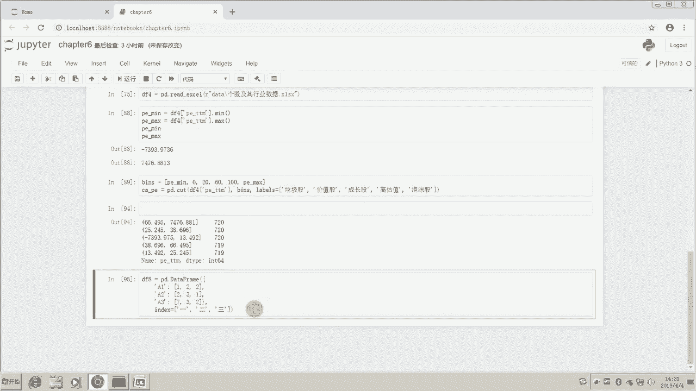

啊，apply方法，我们把这个plus one直接输进去。

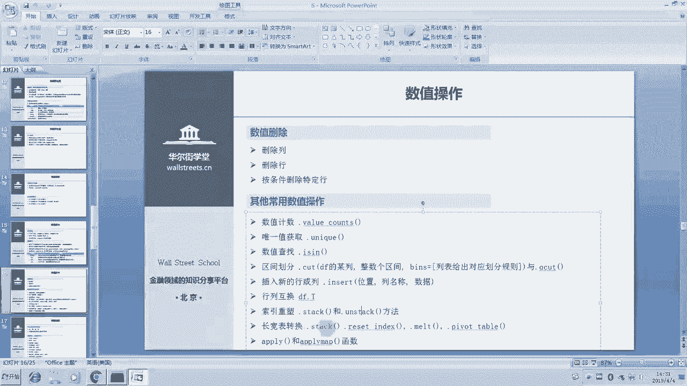

直接输进去我们运行，我们发现就在DF eight基础上加了个一，所以呢说明什么呢？说明啊这个apply这个函数呢，它是什么呢？它是你把这个里面这个函数啊。

作用到我们的data frame里面的每一个元素上去。就这样子，然后apply map map呢apply map呢在大部分的时候呢也是一样的操作。比如说apply map运行一下结果也是一样的。

结果也是一样的。但是呢对于一些我们python的内置函数呢，你只能用apply，而不能用apply map。比如说呃我们apply。我们apply一个s，我们看一下结果是什么。

那我们发现唉DDF8呢直接就把A1的总汇总A1A2A3分别给我们汇总了，对吧？我们用一个apply some，就是说你给我用s来把它们汇总。但是我们看apply map能不能s。报错，为什么？

看一下原因。啊，他说你是不行的，这样做是不能循环的。你这个integer的一个object是不能循环的。所以呢这里呢我们要把它要注意了。有的时候呢啊我们这个pyon的一些部分的内置的这个方法呢。

你不能直接去用这个s好。我们在接下来呢讲一下数据的运算。我们在n排里面呢也讲了数据的运算。我们在pas里面呢简单的讲一下数据的运算啊，这方面的话呢相信大家自己的理解能力足够完成对这个数据运算的一个理解。

依然我们用这个DF eight来做一个例子，我只介绍一下这个加法，然后加减乘除其实都是一样的。比如说我们想用A一这一列啊，加上。这个。A3这一列，我们看一下，我们用DF8的A1这一列加A3这一列。

其实就是1加72加3和2加2。我们看一下是不是这样。啊，八和五和4没错，结果和我们刚刚说的是一样的。所以呢大家就知道这个我们这个呃运算是直接运算就好了。直接把这个相同的这个呃你你在一两列啊。

比如说你个data frame里面的两列你要去运算，你直接这样算就好。不同的data frame frame的话，你最好保持他们的列数是呃他们的那个元素是一样的。然后这个类型是一样的，去加去减都可以。

那么我们看一下。比如说我们这里呢想要比较。比如说A一。我们要比较A一和DF8的这个A2。我们试看一下，它返回的肯定是一个我们这个之前一直在用的那个布尔序列啊，我们看一下前两个都是错。

就说明A一是不大于A2的，后面这个是去，就说明A一是大于A2的。也就是说对于123来说，这个前两个是不对的，后面最后一个是对的OK。所以呢是比较运算。好了，那么我们运算的话呢，最后呢我讲一下汇总运算。

data frame的话呢，还有一种运算呢，我们叫做汇总运算。汇总运算呢我们在这边给大家归纳了一下，包括我们的讲义里也是有给大家归纳的。😊，Yeah。这个汇总运算的话呢，它有技数，有求和，有均值。

有最大最小中位数呃求众数标准差和方差，还有contile分位数，还有一个correlation。那么这边的话呢，我相信这上边的这些内容呢，大家肯定是一看就懂。因为跟excel是一模一样的。

那么下边这个分位数呢，大家也能看懂，也跟excel是一样的。那么有一个相关性，这个跟excel有一定呃这个相关性的话呢，你用excel的话呢，没有我们用拍那么快。我们可以来看一下相关的举例。

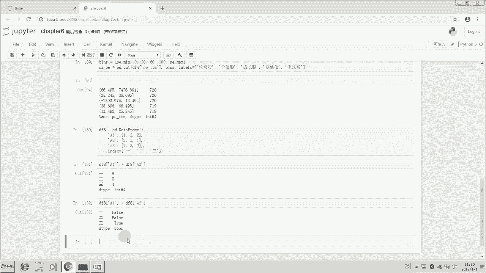

那么这么多方法里面呢，我给大家举一下这个STD这个算标准差这个方法吧。那么其他的方法都是一样的使用方法的操作都是一样的。比如DF8点，先举一个s吧，DF8点s的话运行一下啊，他说D8啊DF8。

那么那么我们就把这个s给算出来了。比如说我们要算STD啊，直接给它运行。那么就是每一个A一对应的标准差A2列对应的标准差A3列对应的标准差。那么在这里呢我给大家着重举一下这个con这个方法。

也就是去算分位数，这个在我们金融分析里最为常用。我们还是read的我们这个CSV吧，用这个最常用的一个时间序列的一个呃这个数据。

呃，我们看一下啊，老总这个行业指数不对啊，不是不是这个X行业指数啊，是行业指数PETTM这个数据啊。好，然后。En you。然后skip rose。好。我们把它给运行一下。

看一下DF3是什么样交互式里面可以看一下这个样子。我们比如说现在呢我们想去看它的conile。想看他0点啊。一分位的contile我们来点一下看会怎么样。那么每一个指数它的这个0。

1分位的contile就给我们显示出来了。我们还发现它非常智能啊，它把我们把这个呃时间这个不能够用contile的这个列给它给我们过滤掉了。那么这里呢。还有一个很好的方法，我们传入一个list。0。

10。2。0。3。0。4。0。5。等等，我们可以运行一下，它一次性呢就帮我们把从0。1到0。5的分位啊，10%到50%分位。包括你有兴趣呢，你可以直接用那个谁呃生成的一个快速方法。

比如我们生成range1到10，然后对它们除以一个10。比如说我们可以看一下啊，这个地方怎么快速的生成呢？n派点arrange。10呃1到10，我们看一下能不能这样生成啊1到10。可以的啊。

那么我们注意了这里的话我们要1到11啊，我们因为我们要10个数，所以我们学的n排range方法，我们直接除以一个10。那么就是我们所要的这个数据了，我们直接把这个n排 range放进来。直接给它运行。

OK非常的完美啊。这样的话呢也不需要大家一个一个输了。我们直接就把从10%分位到之百%分位就给它做出来了。甚至我们可以直接从n派n派arrange11就好啊。直接从最小值到最大值全部都列出来了。

这样的话呢，我们就可以看一下哦，原来金融这个指数呢从这个万德里面的有史以来的数据呢从是最低的是5。62倍，到最高的呢是11。9倍。那么现在呢它是多少倍呢？那么现在呢它也是我们可以看一下现在是多少倍。

这时候呢我们来看DF3现在多少倍。现在呢是9。35倍，所以它的话呢现在也不便宜了也不便宜了。但是呢我们发现呃像医药的话呢，它最高呢到74倍，它最低23。59倍。而医药的话呢，现在只有33。68倍啊。

还是比较便宜的。相对来说，那么等等，大家可以去自行研究一下相关的这个用处啊，我们只是介绍说这个分位数最为常用，大家也可以记住一下。那么相关性运算呢是这里面的一个最好用的方法，也是我最喜欢用的一个方法。

在后续的话呢，我们。讲那个mate pro的la画图的时候的话，尤其是热力图。我们用这个相关性方法可以直接获得一些原始数据。我们先读取一个数据来做这个相关性的方法的举例。我们用行业指数这个数据来做。

因为我们一般来说研究一个相关性。更多的我们都是在什么地方研究啊，我们都是在。更多的我们都是在。呃，我们我们更多的都是在研究一个两个价格的一个走势嘛，对吧？两个价格走势，它的一个相关性。

或者说这个某某的成交量或者某某的销量跟另外一个东西的销量，它们的一个搭配的一个这个相关性。比如说我们研究这个土豆的销量和这个呃和大米的销量，或者说玉米的销量和别的一些产品的销量。

它的一个相关性是什么样的啊，可能是因为这两种产品有替代关系，或者说有一个互补关系。但是在这里呢，我们研究行业指数呢，就是看这些价格指数之间呢，有没有一个互相的一个影响的关系。我们看下DFR这个序列啊。

给出来的呢是根据时间情况下的，我们所有的这个指数的一个。这个价格啊或者说股指的一个点位。那么我们直接对DFR使用这个correlation。非常好啊，大家看一下啊，我们把这个相关性矩阵直接就生成出来了。

而这个相关性矩证呢，大家如果用excel去做呢，我相信会拉到呃刚刚去就第一次尝试做这个excel举阵。这个相关性举阵的朋友呢会拉到头有点晕了，或者说如果没有什么快捷的方法，至少说呃。

这个相关性举证要做挺久才能做出来。但是我们只需要呃DF2点correlation啊，这个CORR就把它做出来了啊。就很方便。那么比如说我们单独想看两个指数之间的相关性，我们就想看这个全职医药。和这个。

和我们哪一个呢？和我们这个全职消费。我们就想看全职医药和全职消费的一个相关系。运行一下。哎，直接就算出来啊，0。935好，那么我们这个介绍到这里。我们往后看啊，其他的方法我们就不一一举例了。我们看一下。

那么pathon里面呢，其实还有个时间序列。这个的话呢是呃必须要给大家介绍一下的。也是说大家在学习的时候呢呃遇到一些时间的一些相关的内容呢，要学会怎么处理。我们看一下。

首先呢拍摄里面有个模块叫做daate time模块。我们from data time。import date time就说我们从d time这个模块里面import了 date time这个函数。

那么我们可以直接用d time点 now，我们可以看看现在的时间。运行一下啊，现在时间是2019年的4月4日14点252分的39秒的啊，后面这样一个数据。

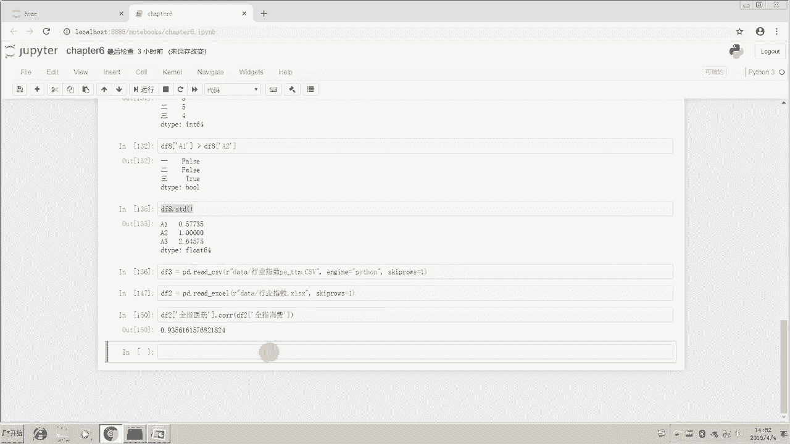

那么Datime点 now。那么这个呢在拍摄里面呢是可以这样子，我们用于我们设定时间。比如说设定的函数。如果要有一个执行时间的话呢，我们就可以直接调用datime点 now来作为一个时间。

那么我们可以看一下这个点date这个方式，就可以输出现在的一个datime点d这样的一个时间。那么我们datime点 now的话，我们还可以点别的，比如点date就是输出啊，这个date呢是一个属性。

所以我们不要加括号可以直接输出这个今天的一个日期。包括上面像这个date的话呢是一个方法，方法的话，我们要加一个括号。属性的话呢，就直接是前面这个物体的属性，我们是不用加括号的。

大家学了这个这段时间的话，应该对这个有所感觉啊，有所感觉。那么之后加深记忆就比较容易了，分清哪些是方法，哪些是属性啊，分清对象是谁，然后分清我们这个是函数还是方法啊，是属性，我们分清以后呢就可以操作。

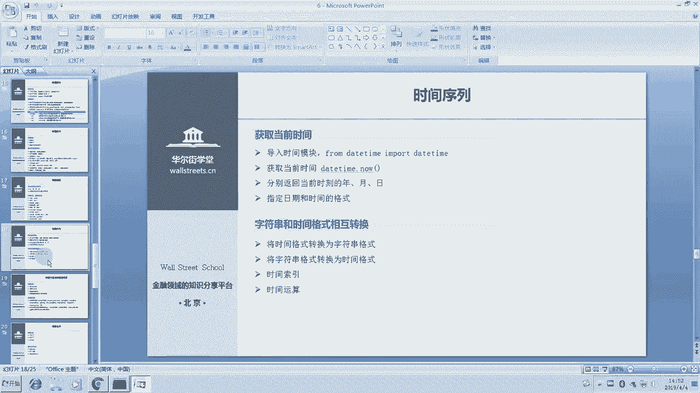

那么在这里的话呢，我们给大家介绍一个d straight time的一个函数。就正常来说啊，date。time点 now的话呢，它输出的呢是这个样子的。但是呢我们有一个点strict函数啊。

比如说我们上面我们先令它为X。那么X的输出的话呢，大家也都见到了，就这个样子。那么我们现在呢对X点strfe。其实是STRF啊，我我我随便乱读的啊。当然的话这个的话大家其实它这个缩写以后呢。

大家怎么读都好，自己好记就好。我读这个STRF的话呢，反而更不好记，我要读ft，然后一个t，这样很好记啊。那么里面的话呢是百分Y呃Y，然后。注意啊是一个百分号，然后Y，然后这个Y是大写，然后一个杠。

一个百分号，M小写一个杠，一个百分号D小写啊，这是最常用的一种时间格式啊，我们直接进行转换运行，那么就转换完成2019-04-04。这个的话呢，我们就把它输出成了一个这个形式。我们现在给一个Y。

让它Y等于这个数据。好，我们先来看一下，我们输出这个type X。我们看一下X的type是什么。再看一下typeYY的Y的这个是这个属性是什么。

我们发现X的类型呢是daytime点 time day time就daytime的一个形式。而Y的一个属性呢是str的一个形式，就是说是我们这个字符串的一个形式。在涉及到最终的一个输出的时候呢。

我们当然是希望输出的结果不要是长成什么样子呢？不要是长成这个不要长成这个样子，对不对？我们不可能希望输出这种样子的一个结果。这样的话太长了一串。我们最后希望输出的当然是这个呃我们希望输出的是这种形式。

也就是这里的Y的这个形式，我们看一下。我们最后肯定是希望输出这种形式在excel里面。那么我们输出一个文本形式也是OK的。所以呢这个的话呢是用于后期修改这个日期用的。好的，我们接下来看一下。呃，比如说。

我们要把字符串格式修改成时间格式，要怎么办呢？比如说这里有个字符串格式，这个Y呢它就是字符串格式。我们要把它修改成时间格式呢，那么我们就要使用一个。呃，函数叫做pass。风格。

我们就from date youtube这个。点passer。import pass这个函数。那么我们在这里呢就用ow等于pase。我们把它对这个呃对这个Y呢进行一下pass就好了。

那我们可以看一下n的话会等于这个daytime点date啊。然后我们可以看一下这个ow的一个类型，它就应该是已经被我们转化过来了，它已经被我们转化成这个da time，被我们转化成da time。好。

所以呢所有的内容呢，我们今天呢讲到这里啊，这个呃时间转换的内容讲到这里。遇到问题的时候呢，大家去再去解决也OK啊也OK。那么这些内容呢在我们那个讲义里面都有。所以大家课后可以翻看一下，关于说把。

这个daytime的话呢转化成文本，我们用sstrict time。然后对于这个文本呢转化成day time呢，我们用这个pass方法。Okay。好的，我们接下来呢讲一下时间索引。讲一下时间索引。

那么如这个例子所示呢，我们的index呢，我们给它一个时间索引呢，在python里面有个时间索引叫daate time index可以可以选择。选择过来以后呢，把d输进来就好。比如2019-01-01。

那么我们可以把这些时间呢输进来2019。-01-02啊。然后我们可以把它们输完。🎼2019-01-03。2019-01-04。好，我们就输4天吧。然后我们输完以后呢，我们运行一下。

这个呢就是我们生成的一个datime的一个index。这是我们的padas里面特有的。那么我们现在要用这个da这个index作为一个index的话呢，我们就构建一个data frame。

那么我们首先要有4个数据arrange for。numb pad点arrange for啊，然后呢我们给它collumns的名字呢定义一个名字叫做number。那然后我们给它index呢。

就用上面的index刚刚定义的那个index，让我们给它运行。好，我们看一下我们构建的1个DF。那么就是一个这样的形状。那么我们再看一个之前用过的例子。啊，PD点read。

CSV啊 doing this。呃，这个例子的话呢是我们之前用过的PETTM的例子。这个例子。根据。开始。然后S rose。跳过这个第一第一行后。运识一下。DF three我们再看一眼。

我们现在要做的呢就是说我们这个呃我们还记得吧，我们这个前面的这个时间啊，低 type。这个时间啊低 type我们在时间序列里面的这个呃sorry，这个地方要有一个时间。

我们这个时间序列里那个时间啊一定要一定不能搞错。它的类型一定要对，我的意思是。你看这个Dtype的类型是O啊，所以我们一定要把它先转换转换S type。我们把它转换成什么类型呢？

转换成呃data time64的类型，这是我们那个。date time的64的类型啊，这是我们python的pandas里面的一种数据类型，一种时间类型。DF three。我们把DF3的时间。替换掉了。

就是把新的这个转换了类型以后的时间复值给原来的时间，把它给修改掉。认习一下。那么现在的DF three的时间呢已经被我们修改了。修改以后呢，我们就可以把这个DF three的时间呢设为。

设为我们的这个索引。然后呢，我们就可以看一下怎么用时间来。看一些内容。那么我们这里in place because to我们直接在原文件里替换，在DF three里替换。我们现在看DF three。

非常的好看了。现在那么我们我们直接选取，比如说我们选取2018年。就这样选就好，很方便的选取好，整个2018年的数据。我们看2018年1月2日到我们2018年12月28日。

比如说我们要选2018年的1月。到。2019年的1月的数据，就这样选就好了。啊，我们看一下。啊，这个地方呢可能是我们看看是出现一个什么问题啊，我知道这个地方我们应该是因为我们数据是倒序排列的。

所以它没法这样选。我们看一下是不是倒序的啊，是倒序的。所以我们先用一个函数啊，没有st values。刚刚讲过了，还有个short indexex，我们直接简单来看一下，也是一样的。

我们根据这个index来排序。然后我们让它及时的改变in place以后的去。我们index本身就时间用index排序呢，就从低到高的排。我们现在看下DF three。那么它就从低到高的一个排序。那日。

我们现在可以直接看一下DF three，如果我们要取2018年的1月到2019年的1月，我们只需要直接这样取就好了。这样的话这个数据就被我们取出来了啊，就非常的。显然。非常的方便。

那么关于时间的运算和时间的漂移呢，我们在这里呢就。不再花过多时间给大家详细介绍。那么时间运算和时间漂移呢。

大家可以参见我们pandas的呃这个daytime里面的这个PD点daytime里面的一个相关的呃说明。

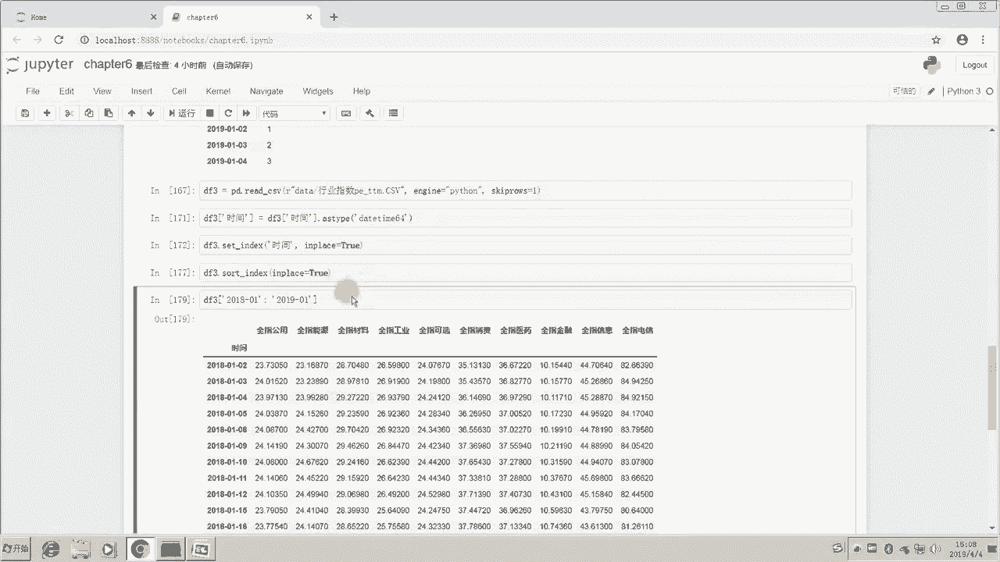

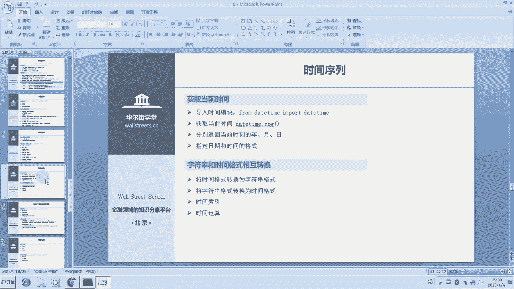