# 14天拿下Python金融量化，股票分析、数据清洗，可视化 - P10：04 实战练习：用Python处理股价数据 - 川哥puls - BV1zkSgYZE54

我们来讲一下数据获取，数据获取的话呢，在在我们Python的金融分析中呢，主要有三种途径，那么第一种途径呢是我们已经讲过的，从本地导入数据，那么这种的话呢，就适用于我们已经从国泰安瑞思，包括我们的万德。

还有to share等数据库呢，或者说开源的数据包已经下载下载，存储在了我们电脑里的一些excel csv，还有TXT的这些文件的数据，我们可以直接用pd点raid系列的函数，来读取本地的一些数据。

作为金融分析的一个啊数据，那么我们这个还可以从web获取数据，那么web抓取的话呢，是指啊，我们用这个我们编写的一个Python程序，来处理来自web的内容，并且把其中我们需要的那些用于数据分析的。

数据呢进行整理，最终呢成为我们的一个数据分析的一个啊，基础数据，那么这个操作呢它要用到的一些模块呢，我们列举了一下，比如说web browser，那么还有requests，Beautiful soup。

还SELENIA，那么这些的话呢呃我们会有专门的一个，后面有专门的爬虫课程，那么教会大家啊怎么从网上啊爬取数据，然后并且把这些数据呢组组织好，进行一个数据分析，最后呢就是我们最常用的两个金融数据终端。

或者说一个是金融数据的一个接口包，这个呢是to share这个模块，那么还有一个呢就是我们的万德，我们先简单的介绍一下这个to share这个模块，它呢有一个官方文档。

它是一个开源的Python财经数据的接口包，我们可以呢通过直接import这个to share，这个用这个pip install，把这个to share呢先安装一下。

然后我们可以直接import这个to share s t s，我们就可以像调用pandas和N排一样，直接调用这个ts，在这个Python的交互式里面直接去获取数据，那么我们也可以说呃。

我们也可以直接在这个调用以后呢，我们把这个数据呢进行保存，保存到本地，方便日后呢进行数据分析。

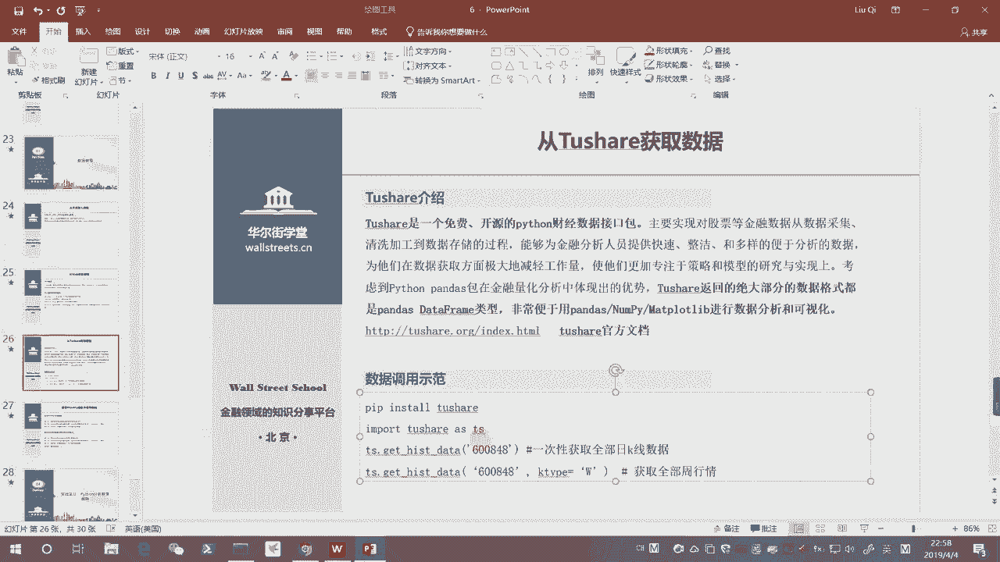

我们可以看一下它的一个官方文档的一个形式，那么它的一个官方文档的形式的话呢，就是这个样子，左边呢把这个数据的类型进行分类，以及我们随便点一个类，它就会告诉我们，这个类里面呢大概有哪一些返回值。

然后呢我们可以怎么去获取这个数据啊，这边都有介绍。

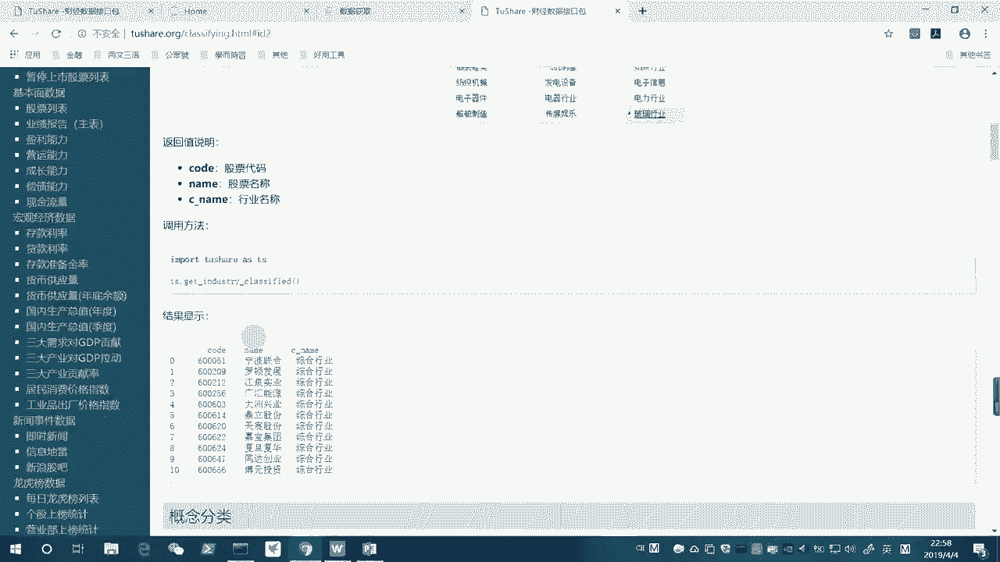

所以呢大家如果说想用这个to share的话呢，非常的友好，它会告诉大家每一个那每个块啊。

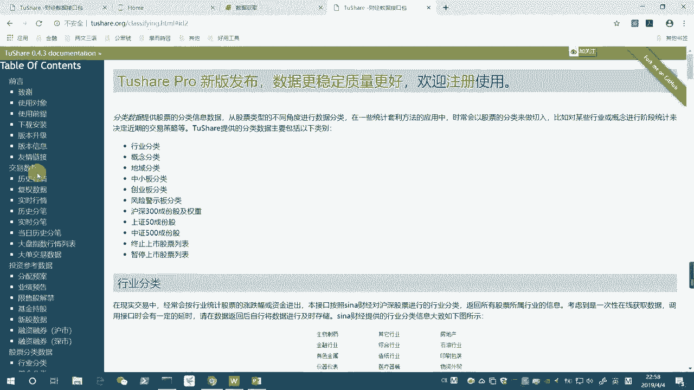

怎么去获取这个数据，那么大家可以点开来，它是一个中文版的。

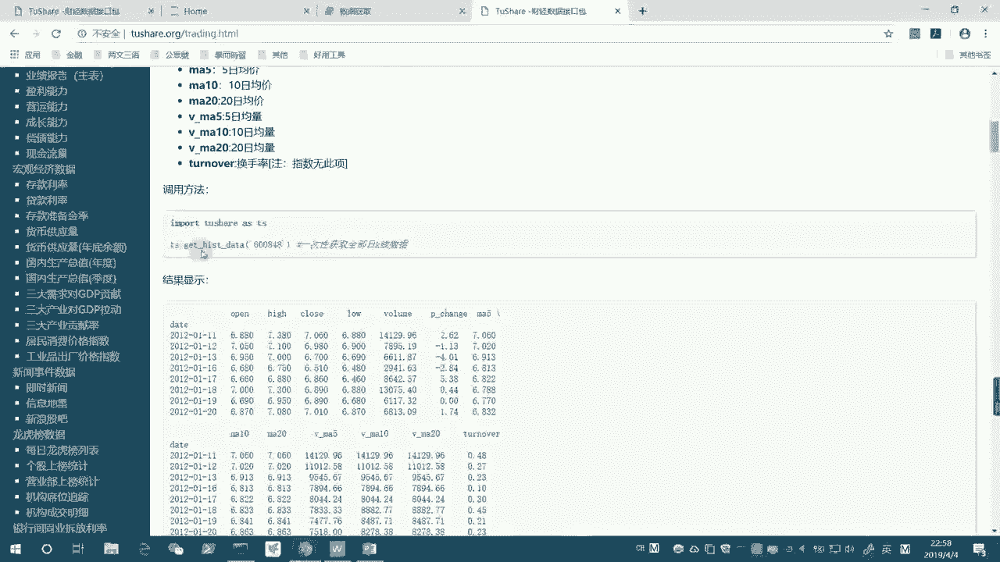

所以呢这个呢我们就不详细的给大家介绍了，这个to share，比如说我们在这边import to share as ts，那么这个呢我们就把它import进来了。

那么我们接着呢可以获取一下历史的一个数据，那么这个呢就是一个6008，四八的一个历史的周度数据，我们如果把这个k type删掉，那么获取的都是它的全部的历史的一个日数据。

所以呢这个to share呢用起来呢也是比较友好。

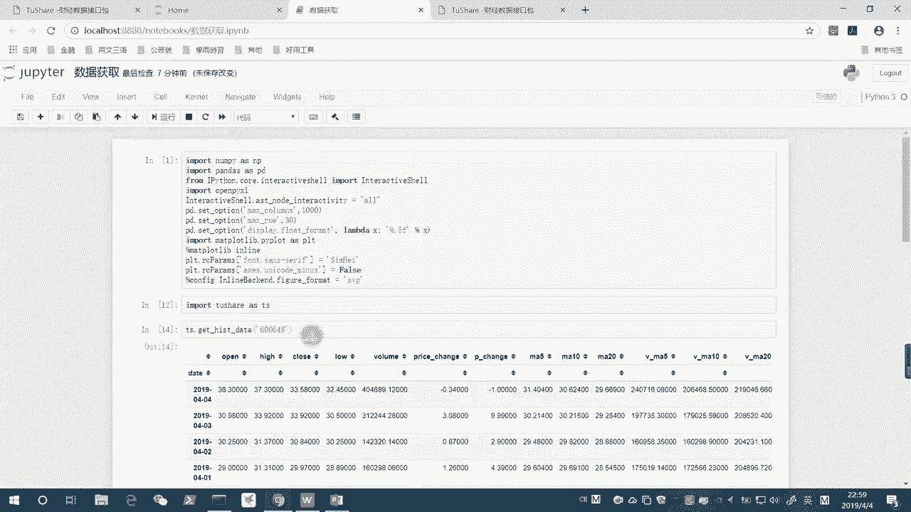

比较方便的，我们不详细介绍to share，是因为我们想详细的给大家介绍一下，使用wind pie提取呢并保存数据，那么wind呢是我们现在的国内的金融行业呢，使用的最多的一个金融终端。

那么wind呢也给Python提供了一个非常友好的接口，叫做wind pie，那么在使用WINDO派导数据，或者说提取数据的过程中呢，我们需要注意什么呢，我们可以把所有的使用wind派提取数据的步骤。

我们可以考虑分成三步走，那么第一步呢就是我们要用winner派来提取数据，我们必须要知道我们要怎么样设计，这个代码来提取数据，那么wind呢它提供了一个非常好的一个啊功能，叫做代码生成器。

就是说我们不需要真正的去把所有的代码的，一个呃输入，要怎么去写这个代码记住，而是我们可以直接用代码生成器生成一个代码，这个代码呢我们可以通过我们这个wind派，就wind的这个API的一个接口。

我们可以输入wind，把这个wind派连接以后呢，我们只需要把代码生成器生成的代码输进去，我们就可以提取到我们想要的数据了，所以呢第一步呢我们要教会大家呢，学会使用这个代码生成器。

第二步呢就是说我们既然知道了提取某一次，某某一个数据，那么我们就可以考虑啊，以后呢，如果我们要提取取相关类型的数据的时候呢，我们就把这样一个数据呢先在这一次呢打包，把它打包成一个函数啊。

把它做成一个函数，那么在下一次我们要使用到，这个相关数据的时候呢，我们可以直接的调用这个函数，或者说我们把它把打包成一个模块，我们直接调用这个模块，那么最后的一步呢。

就是说如果涉及到批量的提取数据的话呢，我们就可以考虑设计一个循环，然后呢用我们第二步封装成的函数呢，对在这个循环里呢进行循环提取这个数据，我们现在呢就假设啊，我们想要提取A股的一个全部的。

TTM的一个市盈率，那么我们怎么来实行这个操作呢，我们要提取A股的一个当天的一个市盈率，我们怎么来进行这个操作呢。

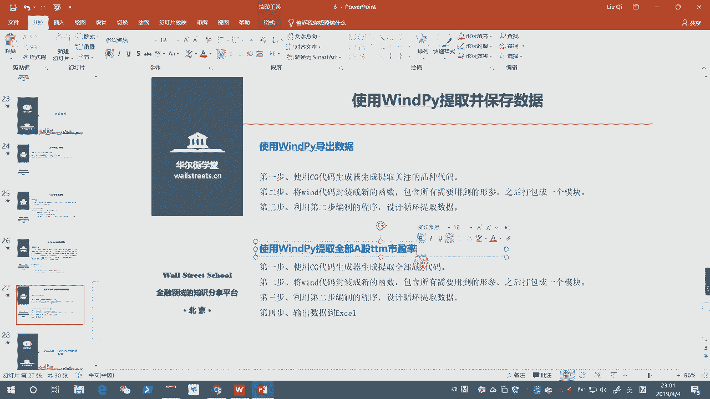

先教大家这个代码生成器的一个使用，我们只要在这里面输入cg啊，打开万德输入这个cg，这里有个代码生成器，我们点击一下诶，就打开来了，这个呢是一个代码生成器，它可以生成我们这个多种语言的一个代码，提取啊。

数据提取的代码，比如说BBACC加加Python，还有MATLAB，还有二，我们这边呢选择这个Python编程语言，那么我们提取数据的话呢，我们就要直接在这里呢，我们可以看一下多维数据。

然后如果我们要在这边呢选择这里，这里有个全部A股啊，大家可以看一下，如果我们选择全部A股的话呢，我们进行一个操作呢，看一下会有一个什么样的结果，额我们找一下这个，我们需要的是它的一个PETTM。

我们直接在这里输入PETTMM好，就是它输入好，我们把这个PETTM给他，把它给选出来，我们发现这里巨多代码，这个代码非常的量非常的大，这样的一个形式肯定不是我们想要的，所以我们绝对不是这样去操作的。

那么我们怎么操作呢，我们先选出某一只股票来，我们自然的啊我们先看一下某一只股票，我们看它的代码结构好，是这个样子的，在第一个空位呢，它显示的是这个股票的代码，第二个呢是这个指标的名称PETTM。

最后呢是我们提取数据的这个日期啊，提取的数据的日期，那么现在呢我们就不禁要想了，就是说其实我们可以很容易的想到，在这里的话呢，如果说这个能够提取出这个数据来的话，提取的是这一个股票的。

那我们只要把这一个股票换成一个板块的，或者说所有的这个代码即可，那么这个所有的代码呢，我们用一个变量来存储它，那么在这里呢呃所幸的是，万德呢有一个更好的功能，就是数据集，我们可以用数据集提取。

4月4日的全部A股的一个板块数据，我们只要点确定诶，我们的全部A股的数据呢就提取出来了，那么我们在这个时候呢，我们带大家一起啊，我们来阅读一下这个万德的这个API啊。

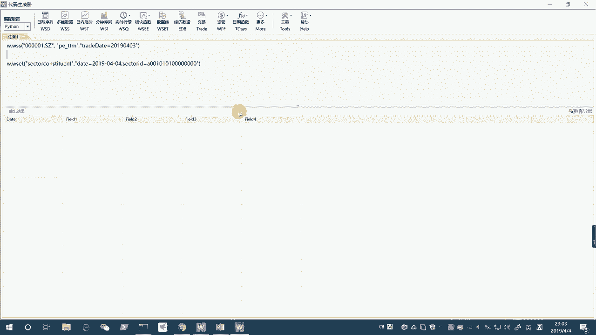

看一下具体的话数据是怎么提取的，万德的API呢在这里是API接口，我们可以在这里看出API一个帮助中心，我们点击这个帮助中心呢，我们就可以打开这个万德的一个API的一个帮助，那么在这里呢大家注意了。

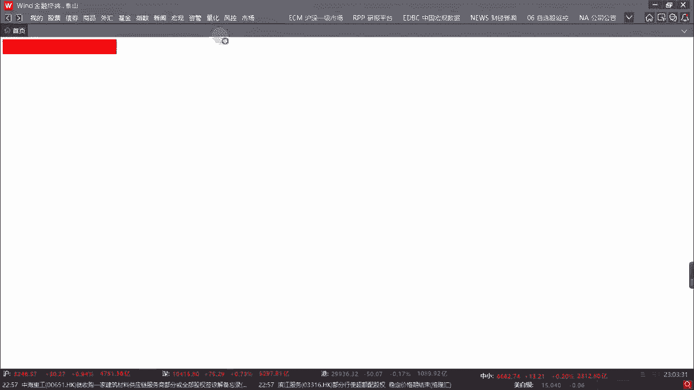

这里就有一个使用手册，那么我们可以看一下万德呢，它会有一个Python的一个量化接口的一个使用手册，那么这里还有案例大全，那么大家呢我建议呢，大家把这个手册呢给它下载下来，我们直接打开。

下载下来以后的阅读的话呢，啊这个封面做的也是非常好看的，我们把它下载下来的话呢，我们可以看一下它的一个，比如说接口的一个概述啊。

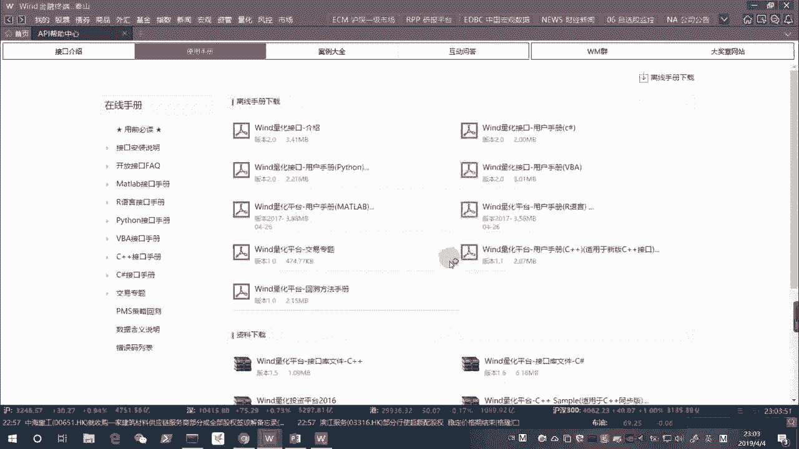

我们就不详细给大家看了，我们直接啊到后面我们直接看这个，啊注意这里这里的话如果你刚开始的话，如果你发现你后面无法用这个Python，和万德链接起来的话呢，大家就要使用这个修复Python接口。

大家使用这个修复Python接口呢进行一个修复，然后再尝试一下行不行，那么我们往后的话呢，我们往后呢我们看一下，我们需要真正需要看的内容，啊比如说这里我们看一下怎么去启动啊。

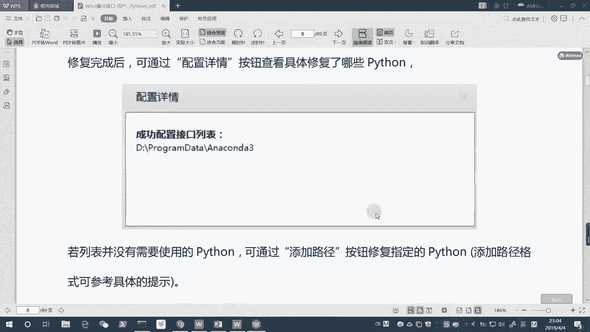

这里他就说了，只要我们把这个修复以后呢，我们可以直接from wind pine import这个star，然后W点start启动这个万德，启动万德，那么我们现在呢就可以在我们JUPITER里面。

试一下，现在就可以在JUPITER里试一下我们from wind pi。

Import start，也就是说我们从万德里面，把它所有的函数都调用进来，然后呢，接着呢我们W点start，OK我们运行一下好才返回我们告诉我们。

Welcome to use wind qua api for pon，那么就说明我们已经进入了这个，接入了YWWIND的这个API了。

那么error code equals zero说明没有任何错误啊，Data equals，OK说明我们这个完全是接入成功了，大家应该非常高兴，那么停止和start，我们已经start了。

那么停止呢就W点stop，那么这个API里面都有详细的介绍，好我们现在呢就不阅读这个API了。

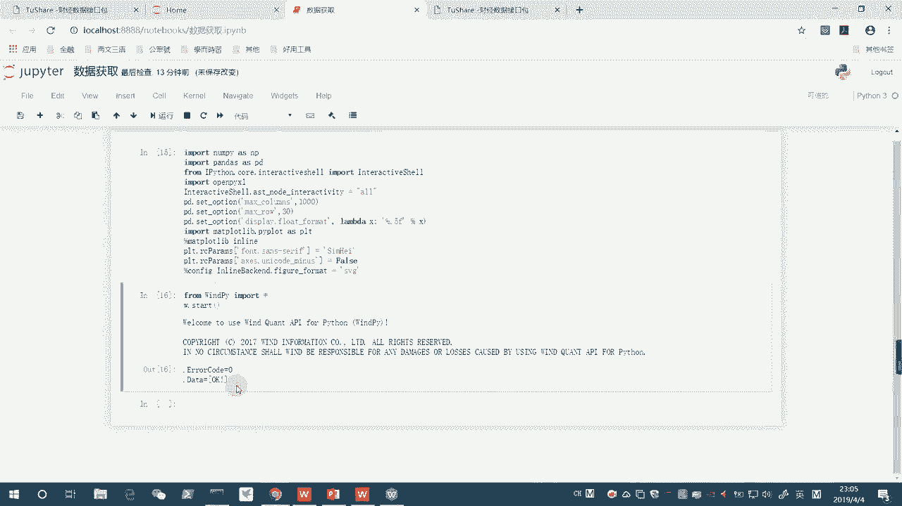

不阅读这个API了，我们直接来看一下，怎么样用我们刚刚的代码来获取数据，比如说我们获取一下这个数据。

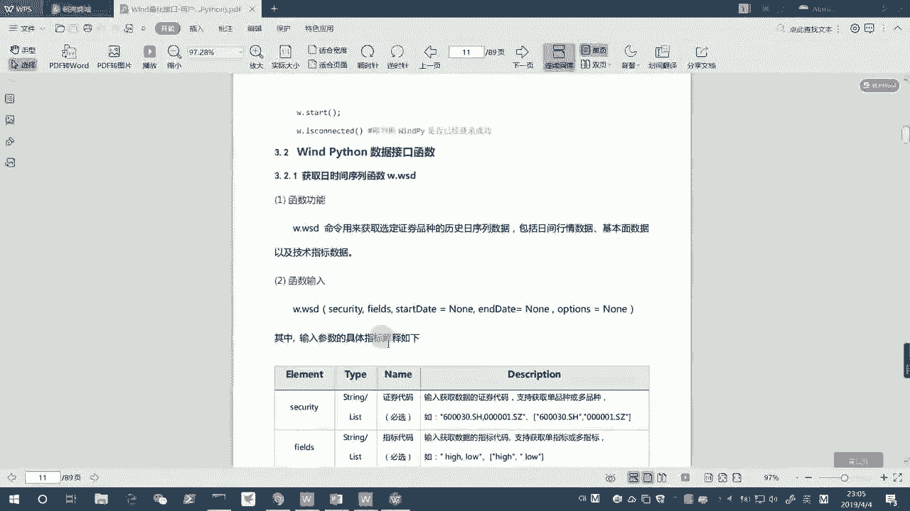

我们先看一下它获取的数据呢是一个data，一个times，然后有fields，有cos，有error code，好这个的话呢我们先暂且搁置在这里，我们看一下我们提取的一个数据集。

我们发现呢它也是有data，data里面呢有两个是一个像array一样的内容，或者说是一个嵌套的列表，我们发现呢它是一个嵌套列表，第一个元素呢是一个列表，这个列表呢是时间，第二个元素呢是我们的代码。

第三个元素呢是我们的名称啊，股票名称，所以呢大家呢在操作的过程中呢，我们现在想一下，我们现在真正需要的内容是什么呢，没错，我们现在真正需要的内容呢，就是我们要把这个扣子，是不是要把这个扣子给它提取出来。

把这些代码都给它提取出来，提取出这些代码以后，我们要干嘛呢，我们要把这些代码作为一个变量放在这个位置，放在这个单个股票的位置，这样是不是就可以一次性把所有股票提取出来，又不至于让这个代码非常的臃肿哦。

是个好想法，那么我们现在就进行一个操作，我们先想办法把这个代码给它提取出来，怎么做呢，我们先给它定义一个变量是cos等于这个啊，为了能够让大家看着上面的数据，我们进行操作会非常舒服，我们定义一个cos。

那么cos等于这个W点，WST就是获取全部A股的一个数据集，一个代码，那么我们发现呢，其实这个扣子呢就应该是上面这一大堆，那么我们就知道cos这个函数这个变量呢，它肯定是有一个呃。

它肯定是有一个data的一个这样的变量，我们看一下能不能取出这个data这个变量来，我们试一下，我们发现并不行啊，但wd wind data object is not subscripable。

那么这里呢有可能是，因为我们要用cos点data来取它，它可能是一个属性作为哦，我们发现果然啊这个data呢作为了一个属性，我们发现它是有三个三个元素的，为什么呢，三个元素分别是三个列表。

那么我们需要取的是第几个呢，取的是第二个，所以我们输入一啊，是第二个元素，我们要取的是这个扣子，这个list它是属于整个大的LILIST里面的第二个list，我们只要运行一下。

那么我们发现我们就把这个list给它取出来了，全都是这个代码，所以呢在这里呢我们要进行第二步命名，就是扣子要等于cos点贝塔的一的，然后呢我们要这样子啊，重新的把这个啊扣子给它命一下。

因为扣子上面这个扣子呢是提取出来的，是这一大堆啊这一大堆的内容，而我们真正需要的呢只是这一部分，所以呢我们把它重新的赋值，也就是我们只取这个扣子的data属性，里面的这个第二个list。

那么作为这个最终的一个我们需要用到的cos，那么现在呢，我们可以把我们这个地方改个名字吧，把它叫a cos，就是A股的一个代码，和上面的扣子做一个区分，就不要让大家搞混了，我一直在用扣子。

扣子可能让大家觉得这样的替换会有点晕，那么接下来呢我们看一下啊，我们运行一下这个代码，我们看一下这个ECOS的一个类型是不是list，就我们刚刚提取出来的，理论上它应该是list嘛，我们看一下它的类型。

type用type函数，我们发现它确实是一个list，那么既然它是个list，我们可以放心的把它放进上面，我们去试一下，看能不能提取出全部A股的一个数据，那么这个时候W点WSS，我们看一下。

我们这里放入这个，我们把这一行直接复制下来，我们在这里呢放入这个，我们这个刚刚提出来的A扣子，我们运行一下，我们发现非常好，我们把所有的A股的PE呢全部都提出来了，所有的A股的PE全部都提出来了。

那么在这里呢我们就希望说呃，我们要怎么样做去把这个PE给它保存好的，那么在Python里面呢，有一个很好的一个方法叫做use d f，那么什么意思呢，就是说啊，我们如果在这个位置呢。

给了一个use df的一个参数的话，让它等于true的话呢，那么Python的输出呢就会成为两部分，哪两部分呢，第一部分呢是一个其他所有其他的属性，第二部分呢会是一个data frame。

那么我们第二部分呢就是我们要的p e data了，所以我们就这样子，我们就让第一部分呢用一根横杠表示，下划线的横杠，表示它就代表了所有的其他的数据，然后呢第二部分呢因为我们用了这个use df。

所以第二部分Python，默认呢把我们需要的这个PE数据呢，当我们需要这个pet tm数据和我们这个扣子呢啊，把我们需要这个PETTM数据，和我们的这个扣子呢，就默认的生成了一个data frame。

我们可以来运行一下，那么我们可以看一下这一部分呢，就是一个data frame的一个格式输出，非常的美观大气，那么一共是有3601行和一列，说明什么呢，说明我们这个一共有3601只股票的PE。

都被我们提取出来了，那么这日期呢是今天今天的日期，但是是啊都是今天啊，日期都是今天，然后呃但是提取的PE是昨天的，其实我们也可以提取今天的PE啊，比如说我们把这个改成四变形一下。

那么提取的一个就是今天的PE，就今天的PE，那么在这里呢我们P1data呢已经导出了以后，我们就可以点to excel了，我们可以把它导入到excel里面了，然后这个呢就是作为一个本地的数据。

我们可以进行一些相关的数据分析，这个呢就是我们这个Python提取，这个从万德链接到万德里面，提取一些相关数据的一个步骤，大家可以很轻松的发现啊，我们这里的话呢也是一个to excel。

然后去name等于p e data运行一下，那么我们打开我们的一个工作目录，看看有没有这个文件，Export，我们找到了这个PETTM，我们把它打开，我们发现呃，刚刚的内容已经完全的被提取出来了。

非常的啊美观啊，其实看起来也不错，我们可以把它关掉，那么接着呢我们看一下，就是如果说我们想啊，把这个封装成一个函数进行提取，我们要怎么怎么去做呢，这个过程，那么其实也就把我们刚刚的这个过程呢。

做得更一般化，就有点类似数学里的思想，由我们刚刚是由一个做了一个特殊情况，对不对，针对所有的A股提取了今天的A股的PE，那么回过头来，如果我们想提取过去十个月的或者20个月的，或者30个月的A股的PE。

我们应该怎么做，那么我们要想这里的话呢，就是从一般到特殊和从特殊到一般的过程，那么在这里呢我们已经解决一个特殊情况，我们现在就要把这个特殊情况抽象出来，把它变成一个一般情况。

也就是说这个特殊情况里有哪些变量，是要我们赋予它的变量，那么这些变量呢，最终呢就要作为我们的这个函数的一个参数，出现在函数的参数里面，我们定义一个叫做extract的函数，那么这个函数我们大家看一下。

上面我们用到了哪些变量呢，第一我们是不是用到了这个这个板块的id啊，对不对，我们是到底取了什么样的股票，哪个板块的股票作为我们这个cos，对不对，所以呢如果我们用数据集来选择数据的话呢。

我们至少在这里呢，我们得把这个板块id呢，作为我们的这个一个参数，所以我们把这个板块id sector id呢复制过来，那么在这里呢我们为了简写，我们就直接叫sec id，不要写太长这个变量名。

那么第二个变量呢，我们想一下，我们是不是有一个日期肯定得是变量，我们在到底提取哪一天的数据对吧，那么接下来呢还有一个data string，好，it is string到底是什么含义呢。

就是说啊我们到底提取什么样的变量对吧，提取这个比如提取PETTM，我们到底提取什么变量，作为我们真正需要的这个结果啊，我们定义这样一个函数，记得这个函数末尾的冒号，我再强调一下，不要不要落下，然后缩进。

那么cos呢会等于我们刚刚已经讲过的，我们直接把这个复制下来，直接把它复制下来，那么大家注意了，这里的话呢我们看一下这个sector constituent，这个肯定不用改。

因为这个是告诉我们它是一个板块提取，或者说是数据集的形式，那么date呢我们肯定得改，对不对，date我们要改，但是我们如果直接在里面把这个date，改成上面我们这个函数参数里的date可以吗。

当然是不行的，为什么，因为我们这里加了两个双引号，这表示这是一个字符串，如果我们直接输入date呢，它就会默认为我们输入的是date，是字符串，所以我们要用我们之前讲过的这个format方法。

点format方法啊，把这里先留一个大于这个大括号，然后呢同样的对于后面这个板块的这个啊id，我们这边呢赋予了一个板块id的函数，反板块id的参数我们也要注意了。

这里的话呢我们这个板块id呢也要把它给删掉，因为如果你输入了一个这个sect id，你把它写在这里，它就会默认sect id呢是我们一个文本，然后我们在这里呢点format。

我们在这里呢把我们的两个参数前后写进去，一个是date，一个是sect id，那么我们写进去以后呢，这样子的话呢我们就把它写好了，也就是说我们这个format，后面我再给大家解释一次啊。

因为我们之前也讲过，我再解释一次，可能有同学会忘记我们这里留了两个大括号，对不对，这两个大括号就代表啊，我们在这边呢是留下了两个变量填充的位置，我们用点format呢，就是告诉这个Python。

说前面这个这这这一这一个大的字符串呢，它里面的这两个空下来的大括号呢，是我故意空下来的，为了什么呢，为了让后面的这两个变量按顺序去填充，所以date这个变量呢会填充这个大括，第一个大括号，sec d呢。

这个sec id呢这个变量呢会填充第二个大括号，那么这样的话呢我们就完成了，说把这个变量呢放进我们这个提取的函数里，那么接下来呢我们有一个，我们就把这个扣子呢重新的赋值。

赋值成我们真正需要的这个data点data的第一个，因为我们刚才已经讲过了，我们看下上面我们怎么做的，那么我们a cos equals s cos点data1，我们这里呢直接用cos就好了。

我们不不写a cos普遍一些，因为有的时候可能不是全部A股，那么我们接着呢把上面这一句给它复制下来，那么复制下来，大家会发现我们都是从特殊到一般嘛，这个复制下来是个特殊情况。

然后我们怎么去把它变成一般情况呢，我们就看一下哪些是我们的参数可以修改的，比如这个扣子的话呢，我们现在已经生成了，我们就不用管它，那么PETTM的话呢，这个是一个特殊的情况，我们要把它改成一般的情况。

就要改成什么啊，改成我们的data string，然后再注意后面后面TRADATE，这个地方是不是也得改，改成我们输入的这个date，又用我们的点format方法输入我们的date。

那么这样的话呢我们这个也地方也改完了，那么最终我们要返回的这个函数，的返回值应该是什么呢，return谁呢，return我们这个p e data，对不对，我们要关注的是这个p e data。

那么接下来的话呢，我们这个呃我们这个就可以开始这个函数，一旦定义的话呢，我们把函数定义了，定义了这个函数呢我们就可以开始提取数据了，我们先简单试一次，看看能不能提出数据来，比如sect id。

等于我们看一下我们要取什么数据啊，不如我们就取这个呃，就我们不要取全部A股啊，全部A股太大了，待会我会讲，为什么不能取全部A股来作为例子，演示给大家看，这是之所以我们不取全部A股呢来演示。

这是因为什么原因呢，是因为万德它对于我们这个万矿的一个，数据提取呢是有一定上限的，那么这个上限呢是非常容易就达到的啊，尤其是在对于我们做这个量化分析来说，你一个代码你如果重复执行个啊十次。

你每一次提取的数据量假设都比较大的话，比如说我全部A股的话，可能你多循环个一段时间啊，多循环个五六次，基本上这个额基本上这个代码的话呢，就呃，把我们的这个一周的这个，数据的一个配额给用完了。

那么这个wind pine呢就会禁止你再提取数据了，那么你这一周呢都无法用万德，从数据这个API里面提取数据出来了，所以呢这个就是一个建议，同学们就是说在使用的时候啊，一开始呢。

不要说一次性就去把所有的数据都想提取出来，这是不可能的，因为万德他是不可能说，让我们无限制的大量的提取数据，这样的话呢呃我们就可以再去做做一个万德了，对不对，我们可以把万德所有的数据都导出来。

这样的话呢是不可能的，所以呢建议大家就是说刚开始的时候，可以小范围的先热一下身，练一下手，然后等到就是说呃，基本已经比较有把握的时候呢，我们再去进行一个批量的导数数据，那么这个批量呢也要注意了。

就是我们可以把这个循环呢不要设置的太长，不要说一下我倒10年20年，而然后然后的月度数据或者日度数据，而是我们可以一次啊，我们先导它十天啊，再等它十天，我们先这样子慢慢的试一下。

看看我们这个配额到底怎么样才会满掉，不然的话很容易配额就满了，这里的话呢我们就刚刚选择的是我们提取食品，饮料这个组合的一个这个板块的，所有的个股的一个数据，那么食品饮料的id呢是这个。

接下来呢我们再看一下食品饮料的话呢，它还有个data stream啊，data string呢我们要提取的，我们就依然提取PETTM好吧，然后我们要有个date date呢，我们现在因为是试验。

我们就假如给一个，2017年的12月31日好，不妨就给这个，然后我们现在呢直接extract，然后我们把上面的复制吧，好这个可以复制的话呢，也是自己写的，所以你也不必要一直不停的敲了，我们运行一下。

我们发现完全可以提取出这个数据来啊，然后这个数据的日期呢啊，肯定也是按照我们这个日期，2017年12月31日来的，那么到这里为止呢，我们看一下，回顾一下PPT，我们就完成了使用cg这个代码生成器。

提取所有的我们要的股票的代码，然后我们也把它封装成了函数，也做成了有这个用到的一个参数，那么打包成了一个模块啊，打包成模块的话，我们之前也教过大家。

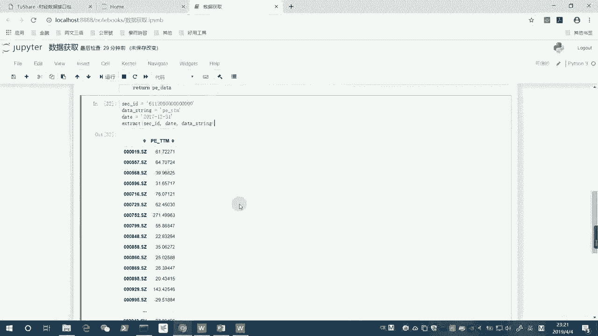

只要把这个函数，把这个函数单独作为一个Python的一个fire，一个文件保存在我们这个文件夹里，保存在我们工作目录里，我们就可以直接import这个extract这个函数，那么就可以直接调用了。

在之后的工作中，你不需要再去定义它。

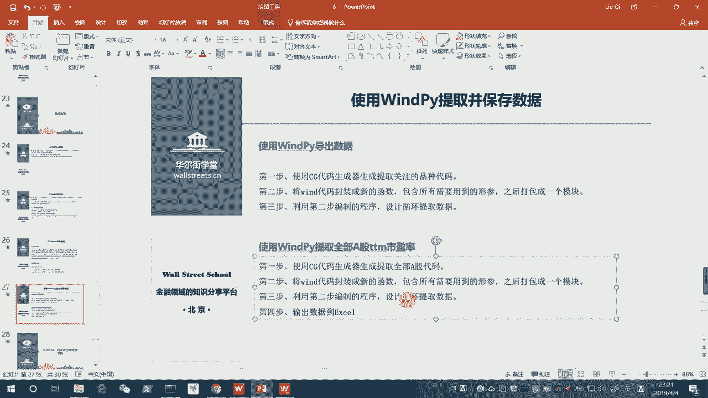

可以直接import它，那么这个定这个啊模块的方法，我们在之前已经给大家介绍过了，就在这里不重复，我们接着看啊，利用第二步已知的程序呢，我们设计循环来提取数据，那么很简单，我们设计一个循环就好了。

在这里呢我们怎么设计这个循环呢，那么首先呢我们在这里呢。

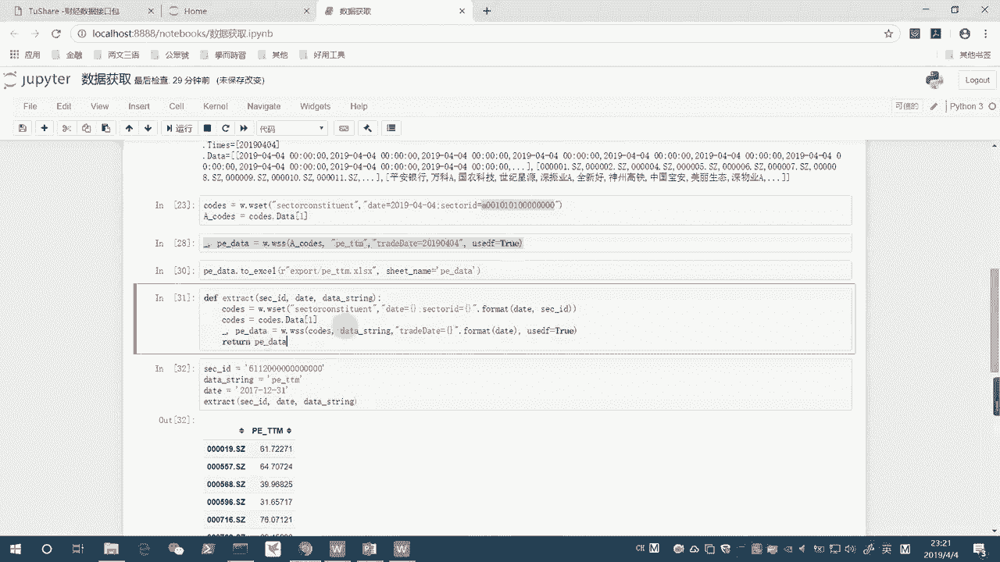

我们想提取一个月度的数据，假设想提取过去12个月的数据，并且输出到一个data frame，输出到excel里面，我们怎么来做呢。

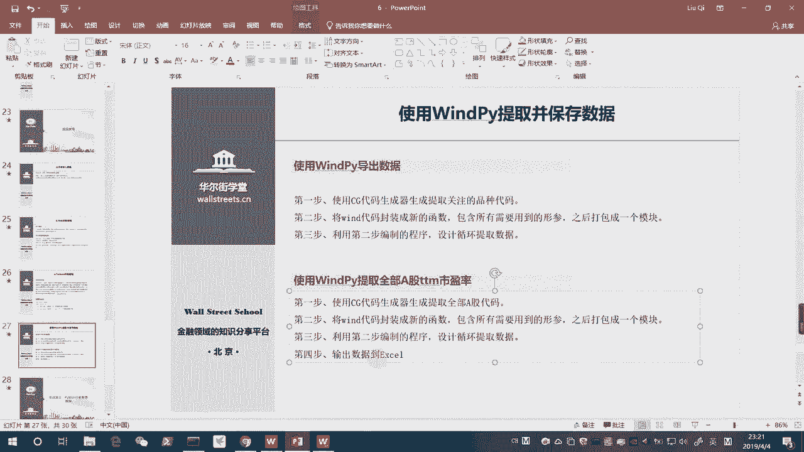

我们先设计一个循环for i in，那么这里呢我们肯定是想说，这个I呢用我们这个月份来表示了，那么我们这里呢给大家介绍一个，给大家介绍一个这个日期的一个序列。

那么这个就是pandas的里面的一个日期的函数，这里呢给大家做一个拓展，其实大家也可以阅读我们的pandas的官方文档，做一做一个学习，比如说我们想取2018年的1月1日呃，Sorry，1月31日吧。

到2019年的3月31日，我们想取这样的一组数据，然后呢FREQ的话呢，我们这个frequent或者说frequency，它呢是M是mouth，我们看一下这样的一个数据的话呢。

它会是我们这个daytime index，也就是我们之前讲过的时间序列里面的，这个时间的一个索引，我们可以构造一个这样的索引，它的日期呢都是每个月的最后一天，那么我们通过这样一个索引的话呢。

我们就可以啊，比如说我们可以看一下for i in pandas啊，我们把它print一下，我们看看是一个什么样的结果，print i啊，我们发现它是一个这样的数据，但是好像不是很符合我们的要求。

我们要把它变成什么样的格式呢，我们要把它变成这个一个文本格式，所以在这里我们直接给I点s tab就好了，我们把它type一下啊，sorry啊，在这边的话，我们这个对于我们的daytime的一个格式的话。

我们一般用的是street time，大家还记得我们在pandas里面给大家介绍过，我们用的是strip time，有个固定的模式，百分Y百分M百分D，OK我们发现诶现在就OK了，就是我们这个格式了。

所以呢我们在这里呢我们直接这样子操作，我们可以直接把这个循环复制过来，就说啊，我们对于对于我们这个里面的每一个I来说呀，我们要操作一个什么事情呢，我们希望说，我们希望呢就是说能够。

我们希望能够就是呃提根据日期来提取数据，所以呢我们就希望呢，这个呢我们把日期先粘过来，我们先把它放在这里了，以免我们要用，这个是我们要的日期，那么我们就是说啊希望呢在这里有一个DF1，它会等于什么呢。

等于我们extract，我们调用我们这个定义的函数，Extract sect id，第一个参数，第二个参数呢是我们这个日期，日期的话呢，日期其实就是我们I把它变成了文本的形式。

然后我们还有一个就是data string，这个我们已经在这边给出来了，Data stream，大家看见了，然后呢这三个参数我们给它输入进来，那么大家想一下，我们要把每一次的这个每一次。

我们给它生成的这个DF1啊，因为for i嘛，这里有很多个月，我们希望把每一个月的这个生成的这个，DF1呢都把它放在一起，我们要用一个我们要怎么样把它们放在一起呢。

对我们就给它定义一个啊新的一个data frame，来存储所所有的数据，我们用pd点coy的方法，大家注意了，这是一个空的data frame，所以呢最终呢我们就用它，就有点类似我们之前学的那个。

大家应该还记得我们学过一个total等于total，加上一个啊，比如说加上一个我们这个新加入的一个元素A，每一轮的循环呢都是通过这个total，加上一个I进行循环。

那么最终呢这个total呢就是我们的总数，这个思想呢也贯穿在我们的Python编程当中，在这里呢我们也是用一个相当于DF呢，作为一个total的一个空的一个data frame。

然后呢每一次呢我们都用pd点contact，我们把它那两个纵向的拼接起来，把谁和谁纵向拼接呢，把DF1和DF纵向的拼接，每一次都把它们纵向拼接起来，纵向是哪，哪个方向呢是xis等于零啊。

刘老师给大家反复说过，Python里面呢零是先看零方向，再看一方向，零方向呢就是竖的这个方向，好的，那么我们xx等于零，我们竖的拼接拼接好以后呢，我们就发现了这个函数的含义是什么呢。

就是说啊每一次呢我们生成一个根据这个I呢，for i in这个range，每一次呢生成了一个DF1呢，我们都用这个cony的函数，把DF1呢和DF和之前的所有的数据的DF，拼在一起，纵向拼接在一起。

那么这样的话呢我们把它们拼接完以后呢，我们可以看一下结果，我们先运行一下，好我们看一下这个结果，好我们看一下DF的一个情况，DF呢是1393列，1393行和一列，那么我们把所有的这个数据。

显然这是白酒的，从18年到现在的数据，这个P的数据我们都给他导出来了，都给他导出来了，但是我们很快的就发现了有一个问题，一个什么问题呢，就是我们很快的发现啊，这个地方它有PETTM，但它没有日期。

对不对，那么怎么办呢，很简单，我们给它添加一列日期就好了，对于每一列循环呢，我们都添加一个date，那么date呢就会等于什么呢，那么我们不如添加month month，它会等于什么呢，会等于DF1啊。

我们看一下，那mouth呢，就等于我们这个就等于我们这个日期就好了啊，就等于我们的日期就好了，粘贴过来，我们现在再运行一下，这个得到的一个结果呢，就肯定会有一个日期列啊，一个月份列。

我们看DF是不是后面多了一个帽子列，所以呢这个时候我们可以把DF进行输出了，用to excel进行输出，那么后面的操作呢都是常规操作，大家都知道我们输出到export，然后批量提取，然后PE。

比如我们用一个PE，many这个这个数据数据文件，那么 name给它定义成PE好啊，白酒PE1啊，白酒的PE1，白酒板块个股PE1，那么我们给他导出运行一下额，他说我们导出不了，这里出现了错误。

NO such file or directory啊，他说没有这样一个fire，那么我们可能是因为我们没有这个文件，而在这边呃，这里存在这个文件啊，P e many，那么export批量提取啊。

这里是批量提取PEE，批量提取PEE这个地方，理论上Python呢它是会自动创建一个的，如果没有文件，比如我们删掉这个文件，我们运行一下，它是会自动创建一个的，我们看这里有了啊，我们打开来看一下。

那么啊我们的这个代码，我们的PETTM我们的月份都出现了都有了，所以呢这个呢对我们来说是一个非常呃，友好的方法，来提取批量提取数据，那么所有的其他数据的一个思路呢，其实也是这个样子的。

大家在使用的过程中呢啊一定要融会贯通。

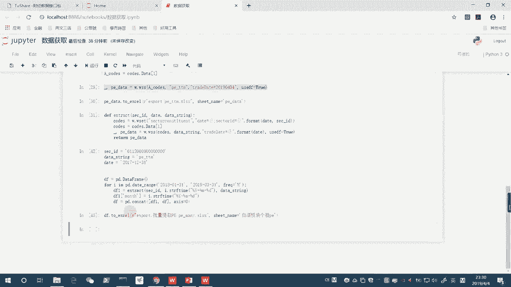

然后要触类旁通，对于提取其他相关数据呢，我们也是同样的思路，先去想我们这个数据的结构是什么样，我们要怎么样去把这个代码提取出来，然后我们先试单独提取一次，或者单独提取一个日期的数据。

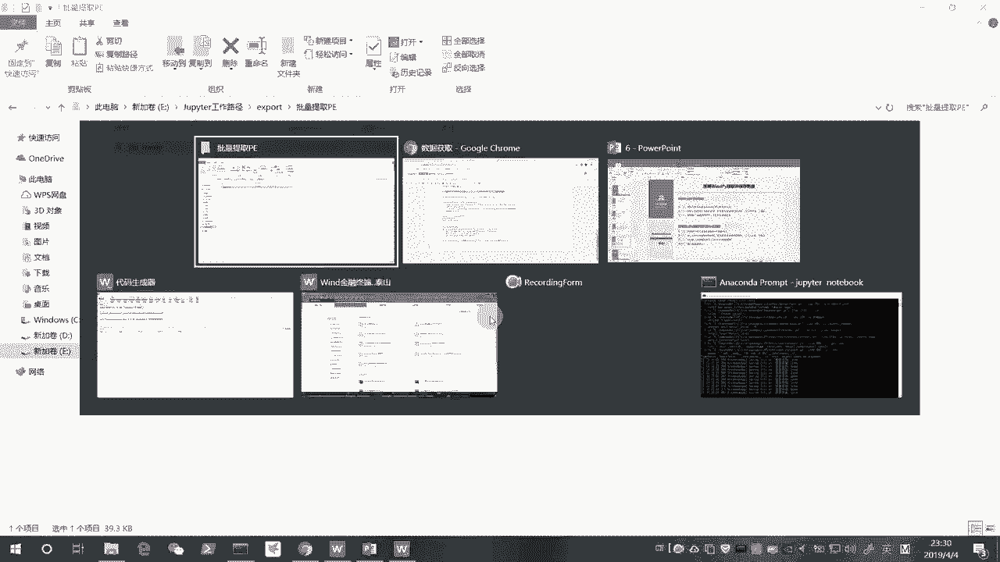

然后我们再去考考虑，尝试利用循环去批量的提取相关的数据，那么这就是我们的一个使用wind的派，保存和提取和保存，数据的一个全部的一个完整过程，好的，那么最后呢，接下来呢我们要讲两个比较大的一个实例。

实战的一个项目，一个呢是用Python分析我们的股票股价的数据。

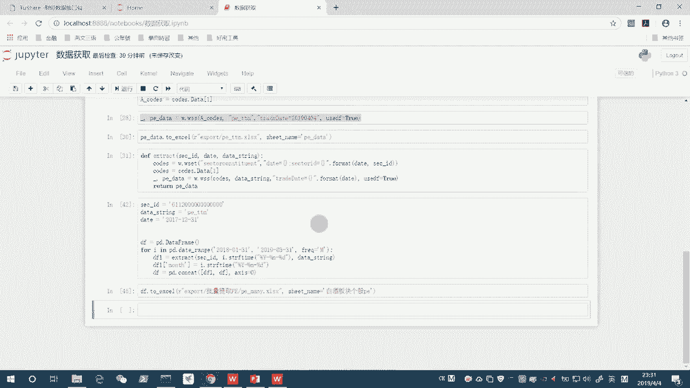

另外一个呢是我们的一个用Python实现神奇公式的，一个选股操作，我们今天讲两个这个实战项目，那么第一个实战项目的话呢，是我们想呢导入股票的数据，然后并且计算一下当天的一个涨跌幅度啊。

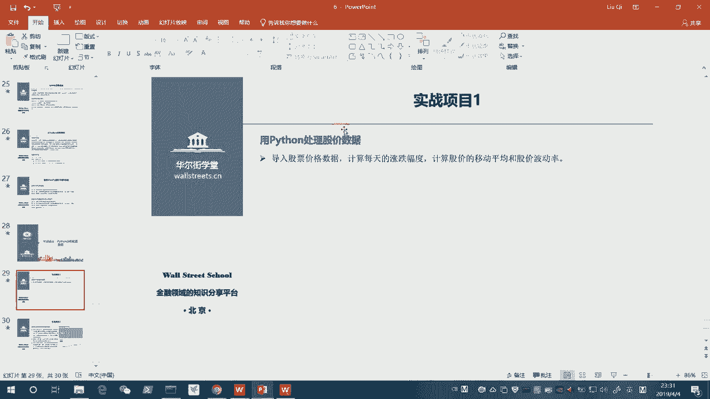

或者说每天的涨跌幅度，同时呢，我们希望计算出股票价格的移动平，均和股价波动率，那么我们在这里呢我们导入的数据呢，就是我们之前使用过的这个行业指数，我们可以先看一下这个行业指数的。

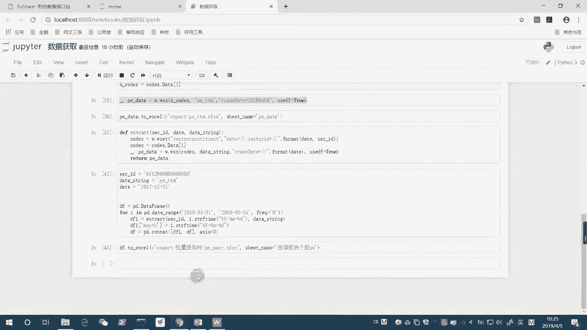

这个excel工作表，那么我们希望导入的这个数据呢，它有日期，有这个各个股票的一个，当然这股股票就是行业指数的一个收盘价，大家也可以把它当做是一个价格的一个指数。

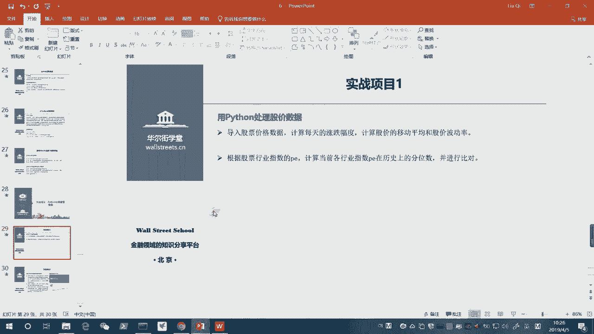

只是说如果之后呢如果要分析股票的价格呢，我们把这个行业的收盘的指数呢，指数的收盘价呢换成股票呢，也是一样的分析方式，那么我们现在呢呃，我们现在呢当然是要用之前教的这个pandas，我们来导入这个模块。

首先呢我们命名一个data作为这个赋值，我们就把这个pd read excel，我们来读这个excel，我们把这个excel呢给它读进来，它的名称呢是刚刚我们已经看了data，然后名称叫行业指数。

那么我们点XLSX，OK我们可以发现它，然后我们看了一下，刚刚必须要跳过第一行对吧，因为第一行呢，它有一个最上面有一个收盘价的一个名称，跳过第一行，我们对它进行一下运行。

那么data的话我们可以查看一下data点head，我讲过啊，查看前五行就不会查看出太多来，不会占太占页面，那么我们发现OK的啊，OK的，他这原来这个日期呢并没有啊调整到这边来，那么我们现在呢。

因为是在做一个时间序列的分析，所以呢我们希望把日期呢放在这个index这一列，那么我们就对它进行一个rise啊，这个set index，那么我们有个data，我们就data1吧。

重新修改一下这个data对data set index啊，我们把这个index呢作为日期，把这个日期呢作为我们的这个索引，也就是作为我们的这个这一列啊，把他这个默认的索引替换掉，那么这样一来的话呢。

我们把这个修改过后的data呢赋值给这个data y好，因为如果你不赋值的话，我们就要在这里加一个什么操作，加一个in place，加个in place，那么也是可以的，那么如果说我们赋值的话呢。

我们就不需要这个in place，我们直接把这个我们形成的这样一个啊结果啊，这样一个形成的这样一个结果赋值给这个data one，不赋值的话呢，他是不会在原data的基础上修改的啊。

不信我们可以看一下这个地方，在最后给大家试了一次之后，我们就不再讲这个了，大家看到这里，我们对data已经修改过了啊，对这个index把它日期呢设定成了我们这个index，但是啊我们看data呢。

它其实是没有变化的，为什么呢，因为这是Python呢，相当于说它内部呢把这个原来的data呢copy出来，然后我们进行了修改了一份，把它作为了我们一个结果，但是输啊输出在这个屏幕上。

但是实际上呢它只是copy了，就是拷贝了原来的那个data的一份进行修改，而没有在data基础上进行修改，所以呢我们才说如果你要在data基础上进行修改，我们要在这边加一个in place。

等于true啊，加一个参数in place，那么所有的各个操作呢，只要有in place这个参数的，它的含义呢都是说哎，我不能直接修改了原来的那个呃这个内容，那么我就要加个in place啊。

我就说让你哎你就地修改命令，你好的，那么这个地方呢我们这个运行了以后呢，我们这个data one呢就已经是修改过后的内容了，我们可以看一下哦，大家习惯用data one点head，不要每次都运行。

因为如果那个数据有几10万行的话，你运行的话就会有点卡，对于一些呃性能一般的电脑来说，很容易卡住，就影响体验了，我们看一下，直接用head的话查看前五行额，是比较符合我们的要求的。

我们接下来呢我们看一下，怎么去计算它的一个股价的一个收益率，数据导入以后呢，我们第一想看的呢就是说呃我们这个均价啊，我们的呃不是均价，我们这个涨跌幅度，涨跌幅度的话呢，在Python里面。

或者说pandas里面有一个非常友好的一个函数，它可以帮助我们直接计算涨跌幅度，我们定义一个新的变量啊，Data a p c t，用它来储存我们计算的这个涨跌幅度。

那么这个函数呢大家只要输入PCT就好了，p c t change就是股价的变化，percent啊，Percent change p c t，那么这里的话呢我们直接对它进行使用。

我们可以不用管它后面的那些呃参数，我们运行一下好，我们看一下这个data one点head啊，我们不用不用head，我们直接看它整体，那么额这个地方的话呢，哦sorry啊。

我们这个地方输成data点set index，不对的，这个地方应该是要我们是我们看一下，这个地方应该是data one，这个地方贝塔杠PCT等于贝塔Y点PCT，change好，我们运行一下。

这个我们要查看的是data杠PCT啊，我们看一下他的这个数据呢，发现这里呢是第一行是NA，这是为什么呢，因为我们第一行减上一行，这个进行一个呃，我们算这个涨跌幅的时候呢，他是呃上一行是没有数据的。

所以呢这一行第一行默认是没有数据的，所以是NA我们发现啊，后面忘记这两行忘记去掉了，所以我们要在最开始这个导入数据的地方呢，导入数据的地方呢，我们要给它加一个skip footer。

footer也有两行，我们要skip掉，这样的话我们一路运行一下好，我们现在这个就非常的好了啊，就这个末尾呢也是没有的，那么在这里呢，我们可以对这个地方直接drop n a2，把这第一行也给它去掉。

这样的话呢第一行就没有了，第一行就没有了，好我们这个数据呢，3459行和十列，这个股票的一个日指数的，一个就每天的一个涨跌幅的数据呢，这样子的就很轻松的给它计算出来了，那么这个呢相对来说的话呢。

就是说大家以后呢在计算，比如说季度的一个这个呃，比如说季度的一个增长率的时候啊，或者说我们算一些额同比的时候啊，我们也可以把它做成一个data frame，然后直接这样子啊。

点p c t change就可以把它这个全部都算出来，那么同样的我们还可以在这边的话呢，我们如果想计算一下移动平均数，股票的一个一个移动平均数，我们也可以考虑使用相关的方法，呃。

我们在这个Python里面呢，我们来看一下，我们先看一下这个data ta的这个日期，它的一个格式，先看下它的日期的一个类型是什，他的这是他的一个日期啊，他的一个d type呢是data time64。

是data time64，那么我们现在呢想计算一下，它的一个股价的移动平均，那么股价的移动平均我们怎么计算呢，那么我们就用贝塔Y，比如说我们要选出一个股价，111个这个指数来。

我们刚刚那个里面我们预览一下这个data y，刚刚data one的预览被我关掉了，data one点head，我们只需要看前面的三个就好运行一下，额我们看一下啊。

这里的话呢这个data one点head的话呢就是three啊，前面三个前面三行，那么在这里的话呢，我们想单独，比如说单独对这个金融指数啊，我们做一个股价的一个移动平均，那么我们就全指金融。

那么这个实操课呢大家一定要在课后呢，要或者说在课上呢有机会呢，就一定要跟着我们这个呃代码呢，一起来进行一个运算啊，这样的话呢有助于大家加深记忆，那么我们这里呢拍摄里面。

pandas里面有个rolling函数，那么我们这个rolling的话呢，后面填一个数字，就是表示说你根据多少，多少日来进行一个滚动的一个操作，那么这里的话呢，我们就说把这个我们这个全指金融这个数据呢。

根据我们的250天，因为250日的话是年限嘛，一年大概有250个交易日，所以呢金融分析里面呢，我们也把这个250作为一个年限，那么我们就看这个年限啊，每一年它的一个平均的价格。

那么这个rolling的话呢相当于什么呢，就是说大家还记得我们讲的那个group by的时候，就说啊涉及到这种的话呢，他们都是返回的是一个中间体，也就是说它现在呢。

我们对这个全指金融呢做了一个rolling以后呢，相当于它返回了一个根据这个rolling250天，经过排列以后的一个中间体，那么这个中间体我们是看不到的，它是一个类型，比如说我们来就它是一个对象。

我们点一下运行就知道了，这个时候返回来的是一个rolling的一个对象，那么这个对这个对象呢我们可以进行操作，比如说我们用M，那么这个时候算的就是这个对象，250天的一个移动平均的一个均值。

这样的话呢我们可以运行一下，我们发现最前面的这个一段时间呢，是没有数据的，因为他至少得有250天我们才能算，对不对，所以呢这个rolling的话呢，这个函数包括这个mean啊。

这个rolling呢它其实是有一些参数的，这些参数呢大家可以课后啊，在百呃这个搜索我们这个pandas的这个模，这个函数啊点rolling，那么我们就可以查看这个rolling的一个相关的。

他的一个参数的含义啊，在课上呢我们就不做太多的展开，这里的话呢我们可以drop n a啊，就把这个NA呢都给他删掉，这样的话呢我们就做出了一个股价的一个，250天的一个移动平均。

那么同时的话呢我们看一下，我们还想计算一下股价的波动率，那么其实也是一样的，计算波动率是不是我们也需要给一个参数，就是我们要多少时间的一个波动系数对吧，这个波动率，那么我们就可以把这个波动率呢。

也给它传进去就好了，那么我们直接在这边给他传进去，把这个mean呢改成STB就好了对吧，大家这个的话呢就应该能够理解了，因为前面的相当于是一个fire handle，一个中间体。

就Python里面呢我们讲到现在给大家介绍的一些，不管是fire handle也好，还是我们讲的这个group by函数也好，还是我们的rolling也好，还是我们的open1些呃文件。

As file handle，或者说open派XL，这个等于WB等等，大家都发现我们在运行Python的，用Python去做一些数据处理的时候呢，你碰到的很多都是中间体，你是无法直接输入他的名字。

查看它的内容，但是你知道这个是一个中间体，它是读取了我们所有需要的数据，然后我们对这个中间体进行操作呢，就可以得到我们最终要的结果，这就是大家要理解好啊，各个模块各个这个函数里面。

它的一个形成了一个中间体是什么，这个中间体才是我们的操作对象，好理理解到这一步的话呢，对后面的理解呢就会非常方便，就很轻松，我们只要修改这个呃mean，改成STD就可以算他的一个标准差。

也就是我们所啊金融里面俗称的一个波动率，我们发现啊波动率呢就是如图了啊，就如图JSTD250天的一个波动率，那么我们接下来呢可以再计算一下，我们这个长期的一个波动率啊，长期的一个波动率。

比如说我们想计算这个长期的波动率，我们直接把这个给划掉，我们直接计算，计算一个整整体的一个波动率就好了，我们发现啊他的一个长期的一个波动率，就是1638这个金融指数。

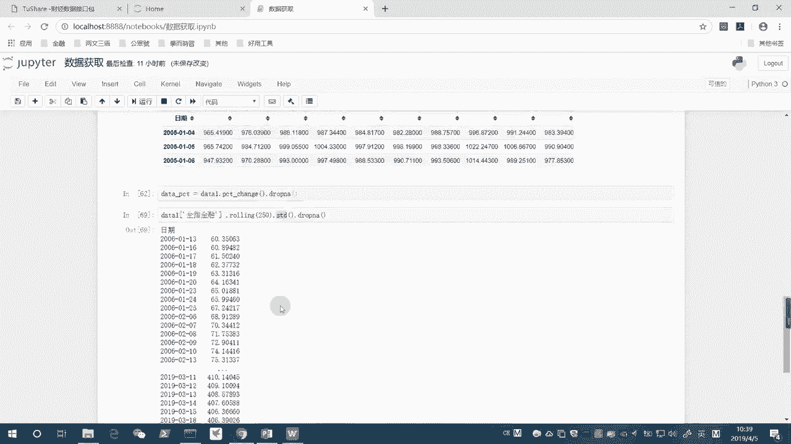

那么我们接下来呢，就额讲另外一个实实战的例子，我们把这类先清理一下，因为内容太多了。

我们现在讲一个实战的例子呢，就是说我们在行业研究里面，或者说在策略研究里面的，经常会遇到一些什么问题呢，遇到一个问题就是说我想知道你这个人呃，这个指数呢它在历史上排在多少百分位上。

也就是说我们想知道一个股票指数呢，它的PE，也就是它的估值，在历史上是处于一个什么样的水平。

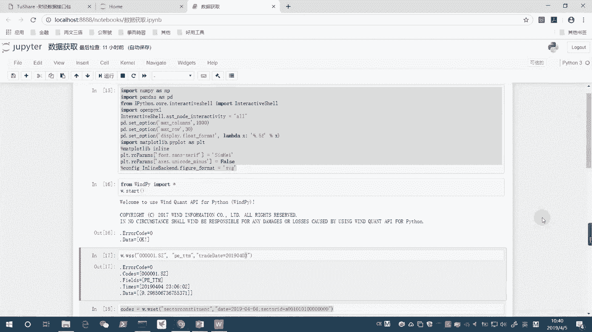

那么其实就有点像，比如说我打个比方，公司内部呢，如果要去呃做一项绩效考核，就想知道呢这个人呢他的一个分数呢，在所有的这个同事里面，假如这个公司有5000个人或者3000个人，那么数千人里面。

他的一个分数的排名大概是在哪个水位，就想做一件这样的事情，那么我们怎么来实现这个事情呢，那么我我们今天呢讲三个，我们已经介绍过的内容，然后可以组成的不同的三种方法来解决，我们现在想要做的这件事情。

那么首先呢我们先确定我们需要使用的数据，我们打算使用这个CSV文件，行业PETTM的这个CSVCSV的文件，那么我们我们可以看一下这个文件的话呢，就是有所有行业的这个市盈率啊，PETTM这个动态市盈率。

我们现在导入这个文件啊，那么就是data等于PD点read csv，大家现在对这个read csv啊。

read excel应该已经很熟练了，刘老师已经给大家演示过非常多的这个次数，我们data里面的这个行业指数啊，也这个指数点啊，好那么这里的话呢，因为read csv啊。

大家不要忘记就要加一个android等于Python好了，只能这个engine，不然会报错，然后skin gross等于一好，那么我们看一下，运行一下啊，还是报错了，我们看下什么原因。

Engine ex c instead，哦sorry啊，我们这边不是XLSX，它是一个CSV文件啊，所以这里要注意，哦我们发现依然报错，我们来看一下。

他说NO such file or directory啊，所以大家遇到的时候千万不要紧张啊，这个地方他说没有这个文件，我们看一下为什么哦，原来这个文件叫PETTM少了个尾端啊。

OK这样的话呢可能就没有问题，我们现在在运行一下啊，我们现在就OK了，我们简单的查看一下这个数据，data点head非常符合我们的要求，然后我们再查看一下他的一些简单的信息，Inf。

那么这个info的话就会告诉我们这个数据的信息，他们都是1862个数据，1862个非缺失值啊，所以呢是没有缺失值的，我们不需要job n a那么他用了160个KB，这个数据好，我们接下来看一下。

就是我们比如说我们现在不是要计算这个，我们想要得到一个什么样的结果呢，我们想要得到的就是呃所有的指数，它的一个从这个0%分位啊，到百分之百分位，也就是说从最小值到最大值，然后中间每隔10%分位的那个。

他的那个具体的数值是多少，也就是每隔10%分位，它的PE的值是多少，也就是说我们PE呢，比如说我们以全指金融或者全职能源为例吧，随便举一个，我们以这个全指能源为例，我们以这个指数为例。

我们就想知道这1862个数据呢，如果呢他们排了序以后啊，或者怎么样啊，我们想知道它的最小值，然后10%位置的分位数，20%位置的分位数30%啊，这样子以此类推，一直推到百分之百位置的分位数。

也就是最大值，我们想知道这样子的一个情况，以及啊，还有当前的一个这个，我们这个当前的这个位置的这个估值，那么我们现在想做成最终结果是什么样呢，就是把它做成一个data frame。

那它的纵轴呢就是各个位置的分位数的表示，比如零10%，20%，30%这样子下去，然后横轴呢是什么呢，横轴我们想让它是这些板块的一个名称，我们最终想做到的就是这个结果，所以呢呃为了达到一个这样的结果呢。

我们怎么去进行下去呢，大家刚开始听到可能会觉得有点嗯有点困惑，那么我们想说的是，我们可以把一个大的项目分成些很小的项目，就像哦刘老师昨天给大家讲这个wind，这个怎么从wind派里批量的提取数据。

那么批量的提取数据之前我们做了一个什么，我们是先做了一个特殊化的一个提取数据对吧，我们单独提取了一个某一日的一个数据，那么在这里呢也是一样的，我们先做一个特殊的一个例子。

我们单独的去处理某一个指数的情况，然后我们再把这个指数呢的情况呢，从特殊把它把它给一般化，好一样的思路，我们先看一下，比如这里我们想单独计算一下全脂能源，我们想计算一下全职能源它的一个额分位数。

那么我们用的是，首先我们看一下全职能源，我们这样一输就可以把它全职能源的内容，给他弄出来啊，这个呢其实我我们给大家讲过，这个的话输出的一个type呢，它是他输出的type呢。

它是一个serious的type，啊他是一个serious的态度，那么我们接着呢，这边呢我们用一个框tile框tel的话，我们也给大家讲过框tel呢它是一个分位数啊，我们之前在这个NBA里面。

在pandas里面都介绍过这个框，tel呢可以计算分位数，比如说如果我们传入一个Q等于0。5，第一个参数如果是0。5，那么算出来的结果呢，就是它的50%的分位数，这里就要注意了。

我们这个地方呢哦刘老师给大家讲过，我们可以传入一个list，这个list呢就是说它就可以给我们这个啊，我们这个list呢就是说我们传入的，比如说是0。1啊，0。20。3，他就会帮我们返回10%，20%。

30%的一个分位数，所以这里呢我们想知道，从零到最到百分之百的一个分位数的话，我们只需要用一个这个呃，我们只需要给它传入一个list，我们用number派生成一个list np arrange。

大家还记得number派arrange函数，可以生成0~10的数，那么就是这样子，那么我们对它呢除以一个，比如说我们看一下这个N排arrange的话，生成的就是什么呀，生成的就是0123456789十。

不包括11，那么我们除以一个十呢，就是00。10。20。3，然后一直到一，这样的话呢就是一个number还要R了，我们对他们外面呢用一个list函数呢，就把它转变为了一个list。

然后转变为了一个list，这样的话呢，我们就可以直接作为这个参数传入框tel了，我们运行一下，我们发现诶，他就把这个零分位到百分之百分位的，全脂能源的这个价格给我们算出来了，那么我们现在呢。

当然还想再看一下这个全职能源，他的这个最新的这个情况啊，我们想看看他的第一第一第一行，那么我们看能不能直接这样选，看一下，看他第一个位数啊，可以的，它现在的第一个数呢是15倍，那么我们对比一下历史呢。

发现呢，他就是在40%到50%分位之间，非常接近，50%分位，也是非常接近这个历史的中位数，这个呢在投资分析里呢是非常的有帮助的，我们知道一个指数它的分位数，因为投资呃。

尤其是说对于我们做证券研分析来说的话呢，第一条呢就是说呃要买的足够的便宜，因为一旦你买的足够的便宜的话呢，他这个要发生亏损的可能性就会更低一些啊，就对未来的坏的情况，其实考虑的也相对来说是更多一些的。

你可以这么去理解，所以呢我们这个估值的一个分位，数的一个分析呢，在我们这个整体的一个框架里面，也就是说在策略的框架里面，其实是非常重要的一个分析，那你说对一个估值，对个股来说可能会很很大的差异。

比如说一个股票，它今年净利润暴增个两三百%，它的一个估值PEE可能直接就下降，从100倍降为了二三十倍，那么又可以接着炒了，但是呢对于一个指数来说的话，它的一个PEE呢。

相对来说就较能反映整个指数的一个情况，因为整个指数它很难在某一年说，我突然一下暴涨或者暴跌，这个这个业绩暴涨，业绩暴跌，因为相对来说会更为的平稳，那么它的一个指数的估值呢。

也反映了它整一个的价格的一个水平好，那么我们接下来呢就看到这里啊，我们做出了一个指数，我们现在就想，我们怎么样才能把所有的指数都进行一个操作，我们怎么样操作所有的指数呢。

我们把这个data head我们来看一下，好那么很很好，当然了，我们就是说我们去运用一个循环，对所有的指数进行一个循环，对不对，好的，那么在这里呢我们要注意了，循环的时候。

我们当然不希望把这个时间给他循环进来，对不对，所以呢我们就希望把时间先设成这个啊index，把时间给它设成索引啊，看起来舒服一些，上面的我不删掉，我们可以做对照，我们把时间设成索引啊。

我们还是用set index，这个的话也给大家讲过很多次，相信同学们应该没什么问题，我们把它设成索引，时间设成索引，然后我们这里用一个in place，我们就不用一个新的变量去替换了。

我们直接在原变量基础上改掉，运行以后我们查看一下data的前五列pad，啊啊不能在这里运行，因为上面我们刚刚是进了一个操作，现在已经不存在这个时间这个index啊，我们把它复制一下，这地方它报错。

我们删掉的那把就放这里，我们在下面插入一行，因为刚刚我们已经操作完了，这是在这个data的原基础上进行操作，现在data里面它是已经没有时间这个呃这个列了。

所以呢我们data里面呢再去set时间作为index的话呢，它就会报错，那么这里的话呢我们直接可以看见额，他已经达到我们的一个处理的一个要求，那么我们接下来呢就会想啊。

我们怎么去把所有指数的都很快的给他做出来，那么在这里我们很自然的想到我们要用循环，那么这个循环怎么构建呢，第一就是说我们这个循环我们无论你一个循环，我们要想我们对谁循环对吧。

在之前呢我们很多的时候是for i in range10，我们是对这个啊，一个range这个范围内的数字进行循环，而这里呢我们要对谁进行循环呢，我们要对这个列的名称进行循环，对不对。

刚刚我们看下这里唯一的输入的一个参数，是不是就是个列名了，所以在这里我们对这个列的名称进行循环，怎么选择这个列的名称呢，那么我们是不是，刘老师在大家之前给大家讲过啊，讲pandas的时候给大家讲过。

data呢有一个属性叫columns，有一个属性叫index，columns呢就是它的一个列名，index就是一个行名，我们运行一下，你们发现诶这就是列名好，如果我们这里输入index呢是行名。

这个的话呢，大家复习一下之前啊，刘老师的课件或者讲义，或者我们的这个PPT都可以看到，所以呢这里我们要对谁进行循环，我们要对这个columns进行循环。

所以呢我们就for i in data点columns，我们对它进行循环，我们可以看一下，如果我们这个时候print这个I出来，他肯定就可以打印出我们这个columns出来，好的。

那么我们现在这个循环就很好设计了，比如说我们想知道任意一个DF它的一个框tel，那么我们直接就DF1，等于我们把这个给复制过来，把这个给复制过来，啊sorry这个地方失误了啊，复制过来好。

这个地方呢大家看啊，这地方我们只要把这个全子能源，改成我们这个I是不是就好了，因为I呢我们刚已经print过了，它就是每循环一次呢，就代表不同的这个啊我们这个指数的名称。

我们这个地方就是不同的指数对它求分位数，因为我们刚刚上面单独的针对这个全职能源，求过一次分位数了，现在呢我们就对不同的指数，因为对I这个指数求一个分位数，它会循环一遍，把所有的指数都会轮到。

那么这个呢就是呃刘老师特别强调的一个，从特殊到一般的思想，所以呢希望大家在学习的过程中呢，遇到一些难题啊，千万不要说哦，害怕它，而是要鼓起勇气去解决它，怎么解决呢，就是这种从特殊到一般的思想。

你先拿一个简单一些的，特殊一些的小例子试一试，看自己能不能做出来，如果可以的话，我们再慢慢的把这个小例子呢，把它抽象成一个循环，抽象成一个更复杂一些的例子，那么在这里呢，我们不就把这个DF1做出来了吗。

那么接下来我们就要想，我们怎么把所有的这个呃每一个指数的DF，也就是每一个指数的这种这种数据，我们把它一个指数拼接在这，再一个指数拼接拼接拼接，我们把它竖着拼在一起之后。

组成一个大的data frame，可以这样做到吗，当然可以，那么我们就用上一节课讲的cony的方法，我们先创建一个新的data frame，作为我们循环里面的，也就是大家还一定要记得。

像上节课我们讲的那个total，我们说一直说total等于total，total等于total，加上一个当期的一个I，也就是说啊，我每一次的total呢都是之前所有数的和，所有数的和呢。

再加上一个最新的I呢，就是又是当期的所有数的和了对吧，那么在这里呢我们也是一样的，包括我们上节课讲那个批量提取数据，我们也用了这个思路，我们创建一个空的data frame，那么我们这边呢。

这个data frame就是我们刚刚的total，每一期呢都是用pd点COCAT，我们还有横向的合并，所以我们用contact我们横向的直接合并，我们不看索引的合并好，我们直接用pd点contact。

我们把谁contact起来呢，我们把这个DF1和这个df contact at起来，我们是横向的合并，所以是按一方向的合并，那么大家就知道了，我们发现什么呢，发现在这里呢。

我们每一期呢我们都把他们cc的起来，作为一个新的DF，所以每一期呢，我们都会把之前所有的DF和后面的新的这个，DF1给它加起来，加在一起啊，每一期都是这样操作，那么我们这个地方呢我们可以运行一下。

啊它报错了，他说can not concatenate on aligned这个dimensional，Nd frame objects，噢这是什么原因呢。

就是说啊他这个有个mixed dimensional，是什么意思呢，就是说啊我们这个发现呢，因为我们这个data i呢我们刚刚已经说了，它输出的话呢是一个什么类型的，它的type呢是我们可以看一下。

我们可以在这里试一下它的type是什么类型，它的类型呢是这个serious，是serious的类型，而我们上面给的DF呢是data frame的类型，所以这两个合并呢是会出现报错的。

所以我们就把它修改成data frame的类型就好了，我们直接在这个serious外面呢给它套一层pd点，Data frame，就把它改成了data frame的类型啊，不不信的话。

我们可以看一下它的类型，我们直接用type把这个复制进来，看它的类型是什么，运行一下它就被修改成了frame，Data frame，那么这个时候我们再运行的话呢，它就可以合并啊，我们完成了合并。

我们看DF的这个情况啊，DF呢现在呢已经是我们想要的这个结果了，0%分位数，那么所有指数的0%分位数，都已经显示出来了啊，100%分之二3%啊，我们发现全脂材料是零，这个的话呢。

很有可能是因为这个地方有一个错误的数据啊，有一个错误的数据，那么我们就要回去回过头去找一下，这个错误的数据是怎么产生的，那么我们可以单独的调出，这个data的一个选址材料，我们可以调出这个数据。

那么我们对它进行一个排序点，short values好，我们对它进行一个排序啊，Sorry，这个地方看一下全纸材料，点sort values，然后这个地方by我们要拜这个全集材料，啊这里报错了。

报错了的话，我们先好，我们看一下这个地方直接送了RADIES，我们不用不用输入一个by，因为他是一个data全子材料，它是一个serious，一个序列，序列的话，它是没有一个by名称的。

我们发现呢这个全脂材料呢有很大一段时间呢，它的这个值都是零，这很有可能是因为呃在2016年的时候呢，他这个时间呢，这个提取的这个数据呢可能是出现一定问题的，我们来看一下。

我们打开来看一下2016年的那段时间，我们直接看excel里面看看是什么情况，全脂材料的话呢是哪一列呢，是这一列，我们来看一下2016年啊，有一段时间呢全子材料的这个数据都是零。

那么很有可能这一段时间是有问题的，是有问题的，所以我们在呃这个处理的过程中，我们要把这一段时间给它剔除掉，那么因为一个指数，它的PE呢是不可能等于零的，所以我们怎么在这边剔除掉的。

我们可以在循环这里呢提前设定一个，因为我们注意了，我们这个地方用到的数据其实是贝塔I，对不对，这个最原始的跟I有关的循环有关的，其实就data i，我们直接在上面呢把data i呢进行一个这个修改。

也就是说我们在这里呢，我们把一个data use进行一个修改，这边用一个data used，然后会等于什么呢，会等于我们的啊，我们可以DI我们做一个什么样的操作呢，我们可以做一个索引的操作。

这地方呢是条件索引的操作，我们在这里呢直接DI，然后呢呃我们在里面用一个索引的操作，data i要让它大于零啊，让它大于零，也就是说我们选择所有的DI，但是要求DI呢它这个值呢一定要大于零。

作为data use，所以下面呢我们DI呢就改一下，改成data use，然后我们运行一下啊，这个还我们运行一下啊，他说invalid syntax，这里报错了，我们看一下是什么情况哦。

这个地方呢我们这个地方不应该打括号，这个地方不要括号，因为我们这个后面才是一体的，后面才是一体的，好我们再运行一下，OK现在就没有问题了，现在没有问题，我们再查看一下这个呃。

查看一下我们生成的这个DFDF，好我们生成这个DF呢，现在的话呢，所有的指数呢都是把这个零剔除掉了，都是必须是PE是零以上的，这样就把一些错误值，就是导出来的时候，没有数据的值呢给它剔除掉了。

这样的话我们看全子材料呢，它就变得很正常了啊，非常的美观的这样一个数据，那么最后的最后我们还想加入一列什么呢，我们想在最上面的加入一列，就是说能够让我们看到最新的这个啊，PETTM的一个情况。

那么我们看一下最新的PETTM，实际上就是data里面的最顶上这一列对吧，也就是我们data的最上面这一列，那么我们怎么去找到最上面那一列呢，我们用ILOC方法第零列第零行啊啊说错了，不是最上面一列。

是最上面的一行啊，最上面一行第零行，然后取所有的这个列，我们运行一下看啊，这就是我们需要的一个最终的结果，那么我们我们要把它转成什么样子呢，转成横向的，对不对，所以呢我们只要把它转成横向的就好了。

那么我们用一个df now来代表它，那么把它转成横向的，怎么转呢，我们先把它变成，因为他是一个serious嘛，我们说过所有的这种切片切出来都是serious，所以我们用data frame。

然后转成一个data frame，然后我们运行一下，看一下这个data frame now是一个什么样子啊，是这个样子啊，这个样子符合我们的要求吗，不符合我们要横着的，所以我们用什么方法。

用转制的方法直接给他转制，我们这边也讲过啊，在前面pandas的操作要点T是转置，这样就非常好了，这样就很好了，那么我们把它呃，我们把他这个啊index给他rename一下。

我们直接在这个后面再接着REN，我们教过大家啊，就是说我们可以一步一步的点着点着点着，一步一步的用这个方法操作下去，只要大家能够分得清我们操作在哪一步，2019杠三杠二九。

其实看刚刚啊刘老师这个操作思路的话，大家应该很能够很清楚的分得清，这个我们刚刚在操作什么啊，每每一步骤都在操作什么p e t t m now，这个是现在的一个哦，我们不需要输那么多吧，直接闹就好。

我们运行一下，OK这个改的就非常好了，现在我们把它们合并起来，把上面和下面两个PD变CONQUIT，我们已经讲过CONQUIT，上面这个是DF，下面这个是呃df now，我们把df now放左边。

然后DF放右边啊，注意啊，我们要用这个括号把它们括起来，不然是搞不定的啊，然后呢，这个因为我们默认的，它就是在零方向的一个拼接，如果要改成一方向要数一，我们运行一下啊，他给我们了一个红色的字。

但这个没有说那个error，所以呢不是报错，他呢可能是因为有一些未来要改动一些内容，所以呢要我们提前适应一下未来的情况，比如说我们看future warning shorting。

Because non concatenation，Access is not aligned a future version of pandas。

Will change to not short by default，那未来啊它不会帮我们这个哦，就是它未来呢不会帮我们拼接以后进行排序，那么我们现在呢比如说我们传递一个X等于零。

我们看看会不会报错啊，依然报错，那么他要我们怎么样，要我们pass short等于two，就是说如果说现在的他可能排完序呢，会帮我们这个就他帮我们拼接完了，还帮我们排序，但未来不会啊。

所以在这里我们直接把short呢等于false，我们跟这个接轨一下，就我们不要它排序啊，不让它排序好，非常的完美啊，这个时候呢我们这个最终的一个结果啊，results就已经做出来了。

非常的完美的一个结果，我们可以输出一下这个results好，这个results呢是一个data frame，我们可以直接点to excel，然后这个地方就直接输出，我们就叫做这个行业行业指数。

PE估值点XLSX，OK然后我们把它给输出来，然后再加个 name，等于我们就是要PE估值吧，我们给它运行一下啊，这个输出的位置还是在export里面好找一点。

好运行一下invalid character啊，他说我们这里有个invalid character，看一下什么情况，啊这里的话呢我们看一下啊，因为这个地方可能是这个逗号的原因啊。

这个逗号应该是我们用的是中文的逗号，大家注意啊，这个逗号用错了，要用英文的这个逗号好，现在应该是OK的，我们运行一下，好的，我们看一下有没有这个文件啊，行业指数PE哎，少了个估值的好。

我们行业指数PE估值，运行一下行业指数PE一上面看看P1估值，打开来看一下啊，非非常好，这就是我们刚刚一个结果，而这个的话呢我们如果要画图什么的，这个都非常的方便好呃。

我们接下来的话呢这个地方呢我们再看一下，其实我们还有另外两种方法可以实现，我们现在想要的哦，就是查看这个行业的这个分位数的一个情况，的一个这个目的，我们回想一下。

在这个我们的之前讲pandas方法里面呢，有讲到过一种方法叫做点Q卡的方法，那么在这里呢，我们也可以用Q卡的方法来试一下，就是我们对所有的这个各个指数，它的PE呢我们进行一个分组。

那么这个分组呢其实q cut呢是按照分位数来分，而点cut呢是按照啊我们的定的间距来分，那么我们来试一下啊，我们这里依然是呃我们先把这个屏幕清一下。

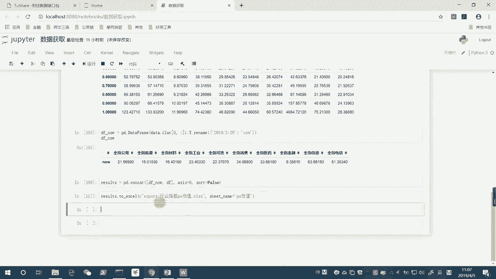

这个内容有点杂乱，好留着这个data这个引入我们依然是导入这个data，那么我们可以尝试一下，我们看一下data的话呢，啊这里我们也要把这个日期设置一下data，点set index啊，还是一样的。

是额日期，这个是时间还是日期日期吧，我们看一下这地方，预览一下这个data，嗯预览下一个data，啊是时间啊，这是日期时间，那么我们把时间作为这个index，然后还是跟刚刚一样。

in place等于TRU，运行一下，现在在预览一下好，已经达到我们要求了，那么我们在这里呢我们想想怎么做呢，想给它进行一个呃q cut方法，我们先试一下这个对某一列进行q cut。

我们依然是从特殊到一般啊，我们先对全指医药吧，对这个指数呢我们用一个Q卡的方法，我们看下Q卡都有哪些参数啊，哦这里他没有告诉我们这个参数过没有关系啊，我们直接输入一下，比如我们q cat话。

我们给他输入一个哦，哦这里我们好像搞错了，Sorry，这地方呢我们用PD点Q卡的方法，这里是PD点Q卡的方法啊，没错，现在就OK了，这个呢PD点Q卡的这个函数的话呢，这里我们传入这个X呢。

这个X呢我们传入的是一个啊serious，一个一维的一个序列，那么后面那个Q呢就是我们要把它分成几份，那么精度啊，Precision3，那么red beans force。

然后labels这里有个labels，是一个labels的一个参数啊，然后我们这样的话呢，我们就可以在这边先传入，我们要把它拆分的这个列，那么我们传入data的全指医药列，我们传入这一列。

然后我们把它分成多少份呢，我们想一下，因为我们要从最小到最大，我们想一下啊，0~1就00。1，0。2，0。3，这样一直到一的话呢，实际上是有11个数，那么就一共是十十个区间啊，11-10个区间。

那么呃我们想把这个这样划分，我们先看看结果吧，很好，他已经把我们划分成了这个十个区间，帮我们划分成了十个区间，那么这十个区间的排序是这个样子，那么我们现在呢呃想要怎么做呢，我们想要说。

能不能把这些区间的名字给他换一下呢，可以的，这个p q cut里面有一个参数叫labels，我们可以预先设定一个我们要传入的一个labels啊，我们预先要传入的一个labels，我们给它这样子起啊。

最小的到10%分位，这第一个label，第一个区间的label，第二个区间呢是10%到20%，第三个区间呢是30%到40%，第四个呢是40%到50%，第五个呢是50%到60%，然后第六个呢是60%。

到70%，依次下水，70%到80%，然后80%到90%，90%到最大值max好，这个是我们想要传入的label，那么我们在这边呢给一个labels这个参数，让它等于label，我们运行一下啊。

我们发现这里出现了错误，他说belabels must be one fewer than numbers of badges啊，他说这个label是要比这个edge是要少一，我们看看什么情况啊。

一个两个三个四个五个六个七个八个九个，我们这边只有九个区间，是不是有哪里错了啊，果然这里少了一个区间啊，少了一个20%到30%这个区间啊，所以Python他那个报错呢是报的很有道理的，我们接着运行一下。

OK没有问题，现在我们发现了，我们这个已经把刚刚的对应的十个区间呢，划分成了我们现在的这样十个区间，划分成我们现在这样十个区间，那么我们现在呢呃对这个进行一个操作呢，这是一个特殊的情况对吧。

那么我们如果想说我们不需要看那么多，我们点head的就好，啊我们如果想说，我们要对所有的指数都操作一遍，怎么办呢，我们就依然是用刚刚的这个for循环，for i in data点columns。

然后我们要用一个DF，一会等于PD点data frame，然后我们把后面这一部分这一大堆，刚刚做做出来的这个内容，我们把它作为我们这个对象，然后把它变成一个data frame。

那么接着呢我们有一个DFDF的话，在这边呢我们定义的是刚开始一个空着，空着的DD一点little free就空着的空格data frame，然后我们用contact的方法把他们给全部都加起来。

contact的方法，那么DF1DF，大家看这个思路和刚刚其实是如出一辙的，然后横向拼接，然x ecos one，我们运行一下，那么我们查看一下这个DF的这个情况，这就是我们额所有日期里面的这个指数的。

还有一个分位，那么我们关心的当然是最近的一个日期了，所以我们只要DF的，我们看看能不能颠覆一下，看看会是什么样子啊，报错了，所以不行，我们要用DF的这个LOC方法，ALOC方法我们选取所有的。

我们选取第零行的所有的列啊，没错前面这个参数呢表示的是行，我们可以对行进行单个的索引，也可以对行进行切片，对后面这个呢我们进行切片，选取所有的啊，就打一个冒号，我们发现呃。

哎这个我们怎么只选了一个全职医药了，这个我们看一下什么情况，我们预览一下这个DF，为什么选到的都是全职医药啊，我们这边肯定是他啊这个地方哦，原来是这样，大家注意啊，这里我们这个地方还是一个特殊的情况啊。

没有把这个循环里面的这个换成I哦，我们要换成I的话呢，啊就没有问题了，然后同时注意啊，我们刚刚是不是发现，其实呃那个我们在算那个材料那个指数的时候，它其实是有一些是没有取到的数字，它是零了。

所以在这里我们对这个data的话呢，我们还要做一个修改，我们就data的话呢，我们要做一个作为一个new data或者data，修改以后的data，那么要在data之前的基础上，在data i的。

在data i的基础上呢，我们要对它啊附一个条件，就是data的I呢它必须data的I呢它必须要大于零，这样的话呢可以剔除掉那些错误值，那么这里的话呢我们就不要用DI放在这里。

我们就用new data就好了，我们对修改以后的值进行一个这个操作啊，他说要我们pass short等于true啊，这地方short等于true啊，pass一个比他啊，不对，我们不要排序，Sorry。

这里要排序，不要排序啊，是false，那么我们看一下这边的DF呃，现在呢就是OK的了，现在就是OK了，我们只关心这个DF的ILOC的第一列，第一行的哦，第所有列，那么返回的就是这个内容，我们可以看到了。

像现在的话呢，材料这个行业呢是在历史最低的10%分位，然后这个呃可选啊，我们看一下这个医药的话呢，是在历史的20%到30%分位，也是非常低的，然后在50%分位以下的呢，还有我们的能源行业。

那么总体来说呢目前最高的两个行业呢，我们可以看到是信息和金融对吧，这个一眼可见，信息和金融是目前来说，这个分位数最高的两个行业啊，还有消费行业也是，所以呢呃在投资的时候呢，我们就可以结合估值呢去考虑说。

是不是说它反映给我们这样一个信息，这个呃医药行业和这个能源行业，以及以及我们这个材料行业是相对来说低估的，但是呢这里呢我们就要注意的一点，就是这里我们要注意的一点，就是说啊在实际的这个操作当中呢。

我们有的时候呢还是要除，不不可能说单单只看PE这一个内容的好，那么我们我们肯定还要，结合其他的行业属性来看，比如说可能更多材料啊，还有能源啊，他们呢是周期性的行业，而这个医药的话呢它是非周期性弱一些。

所以呢对于这个医药的这个低估值来说，可能我们会觉得它是更合理的，更更适合投资的，而对于其他的材料啊，可能说他现在可能是在一个周期的顶点，而金融的话呢，我们考虑到可能过去的啊这个一年里面呢。

其实也就是今年19年的股市表现的比较好，所以呢可能2018年的话呢，我们还是认为说按照过去的这个财报来看的话，我们这个牛市啊，股市的话呢依然是不是很活跃的，所以金融股的话，它的盈利呢是属于比较低的。

而金融股呢，那现在呢很有可能是在一个周期的低点，反而它的PEE比较高，可以这样去思考，但总的来说呢，大家要结合一些其他的信息去判断，我们这个呢只是给大家一个分析的一个思路。

就说这个是我们pandas是可以做到的，而往后大家怎么去分析呢，就要看大家自己了，以及要结合一些其他的啊，我们的数据啊，也可以用Python来完成，那么这里的话我们再讲一个最后一个呃。

非常呃非常简单的思路，我们也可以做到相关的一个呃内容，比如说我们是不是之前讲到过，一个叫做rank的函数对吧，我们说rank和excel的rank是很像，那么我们用data点rank，我们看一下。

我们直接用data点rank，看一下会是什么情况，我们发现他就把所有的指这个数据呢，已经排了一下序，排了一下序，那么排序以后呢，我们只需要很简单的一个步骤，我们除以所有数据的这个总数。

那么啊我们看一下呃，LAN我们要除以这个所有的data，我们发现它就出了一个分位数了，那么这些分位数呢，呃就是我们的这个这个这些小数呢，其实它就是百分，我们把它换算成百分比的话呢。

它就是我们这个分位数了，比如说像医药啊，他的用自医药的现在的一个排名，除以所有的医药的这个数据的一个数据数，数量的数据的一个总数，那么其实就是说我们这个啊一个排名了啊，就是26。9%的分位。

从低到高的一个分位，那我们看医药呢这个是比较低的啊，其他的我们也可以个个显现出来，材料呢也比较低的，好那么我们这个这个模块呢，这个实战项目一呢我们就讲完了，我们就讲完了，我们给大家介绍了。

这个股票的涨跌幅怎么计算啊，然后我们给大家介绍了，这个移动平均和股价波动率怎么去计算，那么我们也给大家介绍了，这个行业指数的一个PE，它在历史上的一个分位数，我们怎么去计算。

以及把这个表格做出来一个对比表，我们怎么去输出。

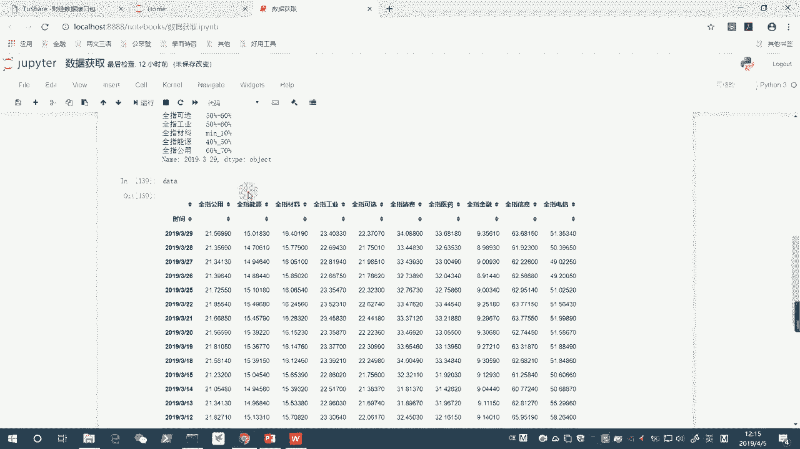

