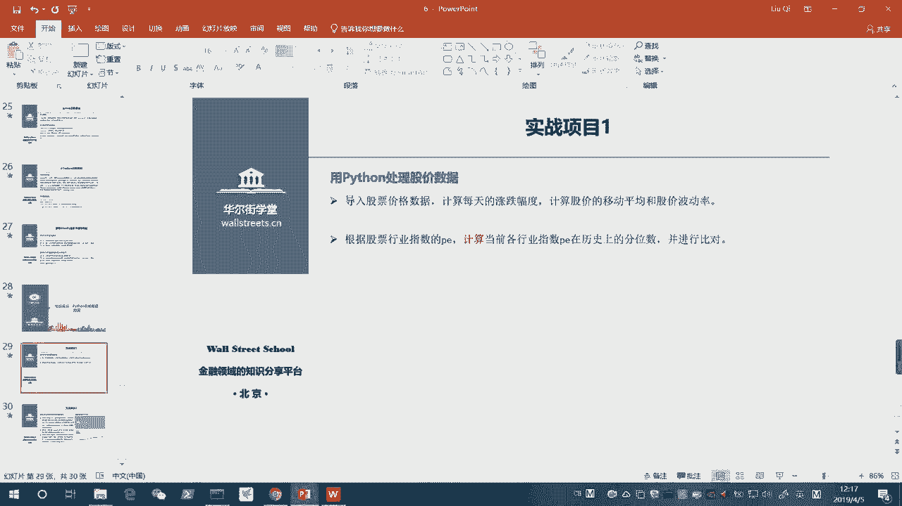
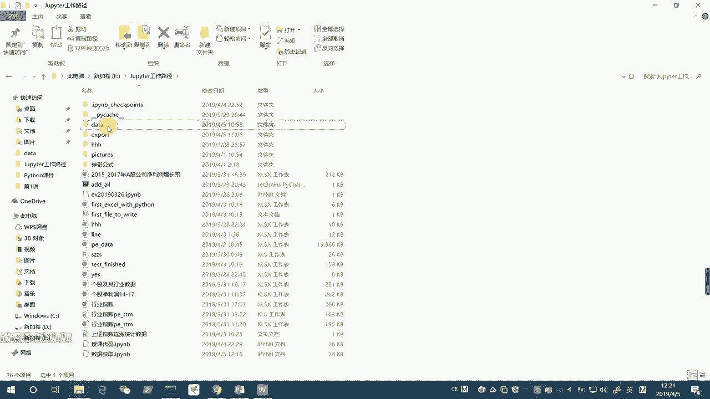
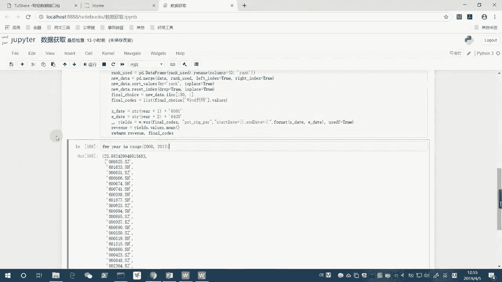
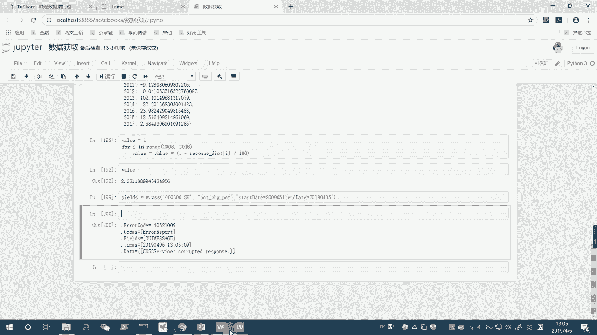
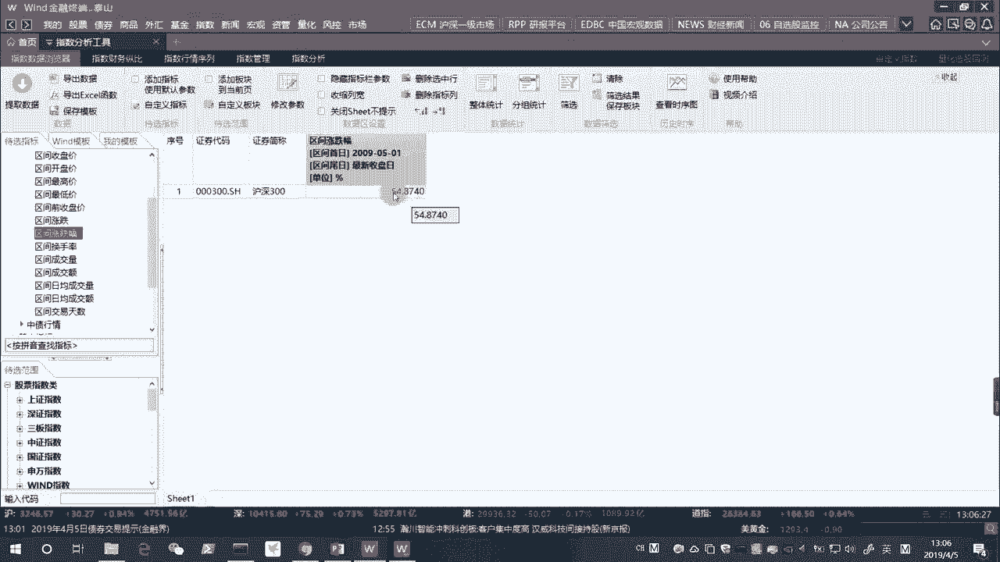
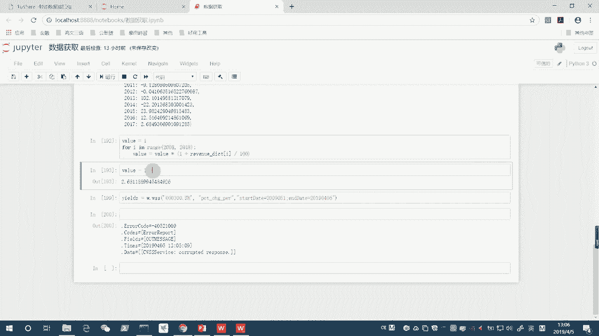
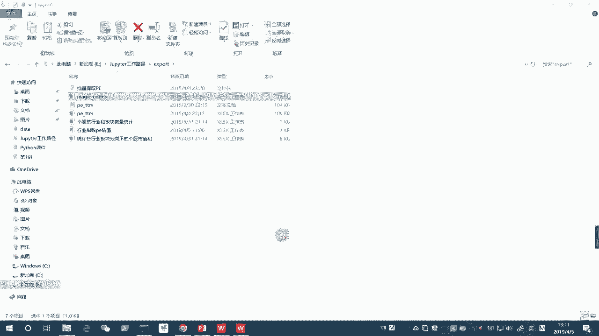

# 14天拿下Python金融量化，股票分析、数据清洗，可视化 - P11：05 实战练习：用Python实现神奇公式挑选股票 - 川哥puls - BV1zkSgYZE54

那么这个实战项目二呢，是一个非常有意思的项目，这个项目呢是给大家介绍一下，就是我们怎么用Python呢去实现一个策略，那么这个策略呢，我们选取的是一个，比较相对来说比较简单的一个策略。

当然了在实际操作过程中呢，大家也会遇到一些比较复杂的策略，那么就需要大家把那个策略呢也是用呃，刘老师讲过一些思路，包括大家自己呢也可以积极的动脑去，把一个策略呢，首先我们把它画成一分成一一小部分啊。

一个一个的小部分，然后每一个小部分呢，我们都可以用特殊到一般的思路去把它给破解，那么最终呢我们可以把它拼装成一个大的思路，然后呢在这个过程中呢，如果能够有一些机器重复的一个环节的话呢。

我们就要把它呃去设定成一个函数，通过设定成函数，然后并且呢我们设计的循环的话呢，就可以减少很多不必要的这个操作，那么我简单给大家介绍一下我们这个神奇公式，神奇公式呢它是由乔尔格林布拉特提出来的。

那么这个公式呢在美国的20多年实践中，他这个乔尔格林布拉特呢，他这个他运用了这个神奇公式，并且获得了一个年化回报率，高达40%的一个，这个非常惊人的一个收益率，那么呃同期的话呢，标准普尔指数的回报率呢。

大概也就是12%左右，所以呢它的一个回报率呢啊非常的惊人，用这个神奇公式，那么这个神奇公式是不是一个很复杂的公式呢，其实并不复杂，它是一个非常相反来说，它是一个非常简单的一个公式。

那么呃刘老师呢其实在2018年的5月呢。

我就有关注到这个呃神奇公式，那么我是在2018年的呃，我印象里是在2018年的89月份吧，我也不是记得很清楚了，总之是2018年的下半年呢，我就选用神奇公式呢选了一次表额，选选了一次股票。

那么在雪球呢做了一个相关的组合，那么这个组合的话呢是至今的话呢啊，已经跑赢不止8%了啊，像现在的话呢，这个组合已经有30%多的收益了，他应该是跑赢沪深300，接近10%几，那么在这里的话呢。

我们呢就想说呃，我们用Python来分析一下2017年的年报，然后先看一下，我们能不能把神奇公式的这个组合，给他挑选出来，那么接着呢我们可以对这个2015，对我们挑选2017年度。

神奇中式神奇公式组合的股票的这个过程呢，我们对它进行封装，把它做成一个函数，然后利用循环呢，把这个函数对每一年的年报，都对它进行操作一遍，最终呢我们就可以输出，比如说过去10年这个股票组合是什么样的。

每一年的这个神奇公式选的股票是什么样的，然后以及这个神奇公式呢，它在中国的一个情况会是什么样的，那么我们就比较好奇的是这一部分，那么关于神奇公式在中国的一个实践的话呢，我们这个选取的。

就根据乔尔格林布拉特的一个思路啊，他的一个思路呢，就是要选择价格相对来说比较便宜，呃当然不是这个价格指的是价值啊，估值比较便宜，同时呢这个个股的一个收益率不能太低的，这种股票组合。

那么他的一个思路呢就是说啊，我们对于普通投资者而言，判断公司的价值呢其实并不是很容易，所以呢我们用的是一个最简单的一个指标，在A股的话呢，我们在乔尔格林布拉特呢，他建议我们使用PE这个指标。

和啊ROIC这个指标，那么在A股的话呢，我们考虑到A股有很多公司啊，他由于并购啊，或者说一些其他的操作呢啊，导致这个投资收益啊，或者说非经常性损益是比较高的，所以呢我们会在这个呃。

我们选用的这个PE呢是扣非以后的PEE，也就是说扣除了这个非经常性损益以后的，一个PE，然后RIC呢那就不用说了，就直接我们从万德里提取这两样，这是两两项数据，那么同时呢我们加了两个限定。

一个限定呢就是说啊我们选的这个股票啊，他的这个市值呢要高于50亿，那么同时呢我们限定呢我们这个过去两年呢，他的RIC呢都要是正数，以确保这个经营稳健，这样一个情况下呢，我们怎么去筛选呢。

就是说第一呢我们按照PE排一个序，PE从低到高啊，越低的PE的话呢，他的排名呢就是越浅就是越小，这个数字就越小，然后RIC呢我们按照从高到低排序，也就是说他这个LIC的话呢越大，它的排名就越小啊，越前。

OK那么最后呢我们把这两个排序呢加总，作为一个总的排名，那么再加上后面这些限定条件的情况下，把这些股票给筛选出来啊，每年的这个30只股票，那么我们接下来呢就来试一试这个项目，那么我们先读取一下数据。

这数据呢在我们在这个data里面呢，已经给大家下载好了，为什么说呃刘老师上课总是说直接用数据呢。

虽然教了大家这个从万德提取数据的方法。

直接线上在线的一个链接，wind qut的这样一个方法，但是呢为什么我们不用呢，因为额这个数据量呢，第一其相相对来说还是挺大的，所以呢一旦我我们反复执行个几次的话呢，可能说呃我们那个万德的这个数据量呢。

就是这个接口的数据量就超配额的，那样的话呢，再接着给大家就是做演示呢就不会很方便，所以呢我们就还是选择啊，刘老师提前把这些数据都给大家下载好了啊，我们看一下，这里呢。

一共是有2001年到2007年的数据，一共有这个17年的数据啊，但是呢呃我们要注意的是呢，这个有些年度啊，比如像这个太早的时候呢，他这个PE呢扣非的是没有的数据的，所以我们注意一下。

这个我们从我们最好是往年度往后往后一些啊，我们从这个2006开始，或者说2007年开始，我们从这个2007，我们看我们刚好算10年吧，现在是201，一，共是二，这边是到了2017。

我们就从2008到2017吧，我们这个数据是这个样子的，那么我们现在呢就呃来把这个数据读取一下，我们发现刚刚每一年度的话呢，其实这个数据呢我们可以看再看一眼，这个每一年度的这个数据的话呢。

它是比如2018年选数据的话呢，我们基于的是2017年的一个报表，所以呢我们这个2017呢它的含义呢，就是说2017年的年度报表来选择，我们2018年4月的股票，因为2017年的年报。

是在2018年的4月底才公布的，所以我们的一个调仓应该是在5月1号好，我们来选择一下这个数据，在data这个里面的一个叫做神奇公式，神奇公式啊，data神奇公式数据点啊，没错啊。

就他那么我们先看一下室内，我们先假设我们先用2017年的数据，我们运行一下呃，像这个数据比较大啊，它读取呢就会花一点时间，OK读取完了，这跟我们打开也差不多时间，我们发现呃有点问题了，为什么呢。

因为我们前面没有跳过一些行数，我们看一下末尾会不会有问题呃，末尾是没有问题的，所以这个地方我们要对它进行一些修改，我们要把第一行，第二行，第三行，第四行，第五行都跳过，事件是这样，那跳过四行还是五行。

我们先看一下，数一下啊，12345，我们看一下，我们跳过五行，看一下是什么样，啊我们发现啊多跳了一行对吧，现在变成平安银行是标题了，所以呢是四行，所以这个大家可以尝试一下啊，不用不用说，一定要一步到位。

我们看A现在就非常好了，这个就是我们想要的这个data了，那么我们现在第一步呢，我们应该先做一个什么操作呢，因为我们要最后有一个限定，大家看见我们限定了个股的市值要高于50亿。

过去两年呢就在我们挑选股票的时候，他都要超高于50亿，当然这个条件的话呢，我们在这边呢还是不用它，暂时先不用它，为什么呢，因为呃刘老师当时在限定的时候呢，其实这个是并没有对他进行这样考虑的。

因为呃我们要知道就是说高于50亿的话，这个绝对的标准，其实我是单独对2017年而言的，但是如果说放到其他的年份的话，如果你年份越早的话，其实股票的市值是越小，随着通货膨胀的话，股票的市值也水涨船高嘛。

这个51的限定的目的呢，就是说会剔除掉一些呃暴发户啊，就说突然一年业绩特别好，然后呃或者说它这个市值特别小，然后它这个流动性很差的一些股票，我们想剔除掉，但在这里的话呢，这一条我们先不加进来。

我们直接把后面的做成一个条件，我们用什么什么样一个操作来做呢，没错，我们就用条件索引来做，因为我们看一下下面这个表，我们最终希望选出来的呢是啊，当年的这个PE和这个我们看一下啊。

我们是需要选出来这个P前一这个PEE，2one呢是前一年的PE啊，这个P12two呢前两年的PE就前面两年对，往前推两年，往前推一年，比如现在2017年，这个呢就是2016年的PE。

这是2015年的PE，那么这2016年的RIC，就是2015年的RIC，那么我们有一个要求啊，首先我们要把这些这个PE，今年的PE和RIC，昨年的还有前年的，里面的是是这个小于零或者小于等于零的。

我们全部把它剔除掉，这样呢我们再然后我们再进行排名了，所以呢这里呢我们进行一个剔除，重新赋一个值，我们怎么做呢，我们这样做，我们把所有的这个，我们把所有的这个内容呢。

我们把所有需要需要我们去进行剔除的呢，都把这个条件的and连接起来，那么这个呢我有教过大家，我们是一个条件选取，既然我们要剔除小于等于零的，我们就选取它大于零的就好了，然后and。

然后我们再看我们第二个要剔除的是ROI，这个RIC，我们就ROIC打这个RIC呢也要大于零，大家注意打括号，把它们都括起来，这条件条件都括起来，然后用and连接，然后我们这里是data的额。

我们是PEELY，也要大于零，那么我们接着and这个括号，括写data塔的这个p e year two，我们也要大于零，然后and好换个行吧，LIA的PE的啊，不是PE了，这个时候RIC了。

RIC的e r one，我们要让它大于零啊，注意这里少了个括号，把它括起来，然后and括号括起来贝塔的，RIC的也是two，我们也让它大于零，这个呢就充分的利用我们一个条件索引呃，不叫条件索引啊。

像我们这个额条件的这个选择，我们刚我们之前讲过，用条件来选择行列嘛，这个呢就是一个条件的选择，条件选择，我们看下全部都用and连接起来了，我们代码美化了一下，看下OK这个样子也挺美的，可以就这样。

那么我们把它美化一下，那么这个时候呢data呢就把它给搞定了，就说我们这个data呢我们这样一运行，我们在查看这个data的时候呢，所有的就都是大于零的了，我们在这里面是找不到小于等于零的。

这个这些这这这六个列，它小于等于零的，我们是找不到的，我们是找不到的，我们还可以再检查一下，看看他有没有缺失值，data a点info，啊OK我们发现呢，这里呢一共1767个数据。

然后呢没有一个是缺失值啊，没有一个是缺失值，全部都是有值的啊，那么这样一做完以后呢，我们就想啊，我们这个接下来我们要做一个什么呢，我们是不是要把那个根据我们这个PE和这个，RIC的一个排名。

我们再把这两个排名给加走了，所以我们就分别的把这两个排名先求出来，我们求一个叫做rank p e的一个排名，它会等于data的，PEDE啊，这样一个列我们对它进行什么呢，直接对它进行rank。

method的话，我们的方法的话就用average，其实我们如果不填这个method的话，不填这个参数，它默认就用average，也就是说，当有两个PE非常巧合的完全一样的时候呢。

我们对这两个PE的排名呢都用它的平均排名，比如说一个排第四，两个都排第四，但实际上我们就用平均排名，就四和5÷1个二，就都用4。5，那么接着呢我们有一个这里呢，我们在对LIC呢也要进行一个排名。

我们对LIC进行一个排名的话呢，也是一样的方法，点rank，但这里啊大家注意了，我们PE呢虽然从低到高排，但是RIC呢却是越高越好啊，所以呢这要as s sending，我们用一个倒序来排。

false好，As sending equals false，我们把这个倒序来排，然后同时呢我们也用的是average的方法，好我们现在运行一下，我们来看一下rank p e和rank。

我们看下rank p e长什么样子，然后再看rank r i c长什么样子，好rank p e和rank r i c呢我们就都做出来了，都做出来了，那么现在呢我们要做什么。

现在我们要做的呢就是把这两列相加，对不对，求一个总的一个rank，我们就rank最终要用到的一个rank use，会等于rank的PE，加上我们rank ROI c运行一下。

那么我们最终的一个rank use我们就给他求出来，这就是我们需要用到的一个，这个rank的一个排名，那么rank use的话，我们用求出来以后呢，我们可以把它做成一个啊data frame。

然后我们跟那个我们的new data，把它给merge merge起来，我们把它做成一个data frame，rank used等于PB点data frame，我们直接把他装进来。

因为它本身是个serious，要做成data frame，直接外面加个把它括起来就好了，那么这个时候呢，rank used呢就变成了我们的一个data frame。

那么我们还可以看一下这个rank used，Rank used，OK那么我们发现这是我们的rank used st，它的名字呢是zero，不大好看，我们给它rename一下，rename怎么用啊。

大家已经教过大家了，我们在这边呢可以直接因为我们是要改它的，Columns，我们就传入一个columns参数，传入一个字典，把原来的这个零原来是零改成现在的这个啊，原来零零改成现在的这个。

我们想让它作为我们的rank这个列好，我们进行一个运行，我们看一下rank use，他就给我们改了一个名字啊，改了一个名字，那么接下来呢我们要做一个什么操作呢，我们想说呃，在这里呢。

我们想把这个rank呢，和原来那个data给它拼接在一起，那么我们要怎么做呢，我们在这边再加上一句，这个拼接在一起的一个new data，我们是定义一个新的一个数据，这个new data的话。

它会等于pd点merge，我们把这个我们把这个下面这个，我们这个rank以后的呢和之前的这个原原数据，原来这个data我们看一下，原来这个data原来的data长这个样子，现在的数据呢长这个样子。

我们想把它们拼拼接起来，我们发现他们的index是不是一样的，你看1469十一十一十十一十四十七，我们看下面1469十十一十四十七，为什么index是一样的呢，因为我们其实算rank的话呢。

也是直接从这里面取出来的，两列算的rank，最后我们把它加起来呢，依然是按照我们这个index加的，所以呢这个index是一样的，那就好办了，我们merge直接把他们拼接起来，一个是原来的data。

一个是我们新的这个rank used，这两个呢一左一右，我把它给拼接起来，那么我们用什么把它们拼接呢，用index，所以呢left index equals tru。

那么还有一个呢是write index equals to，那么这样的话呢我们就把这两个列给他拼，这这两部分给它拼接起来了，我们可以看一下这个new data的一个结果。

那么呢new data的结果的话呢，我们看一下这个rank这一列A哦，这是data，这个我们这是data new data，在这里这个new data的这一列的话，最后一列就是我们的这个rank。

那么我们现在要选股就很方便了，我们直接根据这个rank来进行一个送这个排序，new data点哦，我们看一下这里的话呢，new data点short啊，我们排序new data点short by啊。

short values根据值来排序，用这个函数，然后by等于什么呢，我们根据谁排序呢，根据rank来排序，那么呃我们根据rank来排序，我们看一下运行一下，那么我们再看一下这个new data。

呃这个new data根据rank排序以后呢，就是现在这个样子，我们可以看一下前面的一些企业，方大特钢万业企业，万华化学，世容造业，格力电器，晶核实业啊等等，海信微服高科，海澜之家。

海螺水泥都是相对来说业绩非常稳健的股票，华域汽车等等，那么这些股票呢我们已经把它挑选出来了，这个方法，那么我们现在呢要做的是什么呢，那么我们现在呢要做的呢，就是说我们要把这些股票啊。

我们只要选择我们感兴趣的这一批的这个啊，这一批的数据就好了，对不对，好，我们这里加一个in place，我们就让它直接在原来的基础上改动，那么我们就不需要再复制复，把这个内容赋给一个新的变量。

好现在的new data呢就是长这个样子啊，就是长我们现在这个样子，那么在这里呢我们需要做一个什么事情呢，我们现在呢就要有一个啊，我们现在发现这个index是不是有点丑，这index有点丑。

我们给它reset一下，这里呢就能用到我们说的这个reset index，那么reset index的话有些参数啊，有个in place啊，有一个job，这个drop呢，就是说要不要把原。

把原来这个乱糟糟的这个index给他丢弃，那我们当然选择丢弃，然后呢呃in place呢我们也选择一个true，就是让他就地的原排序运行一下，我们现在来看new date就非常的美丽啊。

现在这个new date呢非常的美观动人好，那么我们接下来呢就做一个操作，就说我们把最终的这一批股票给他取出来，选出来，那么有一个final choice，我们最终是要选取多少只股票。

我们要选取30只股票啊，我们就把他们这30只股票给他选取出来，我们选取前30行以及所有的列，我们把这些股票给他选取出来看一下，这是最终选择的一些内容，然后呢呃我们看一下，我先看一下，一步一步来。

我们运行一下，然后我们看一下这个final choice，那么final choice的话呢，就如图，我们选出来这些30只股票全部都在这里了，因为是零开始的，所以就以29结尾啊。

我们发现呢其实还有一个ST5，但这ST5呢它的一个这个数据呢也是不错的，那么我们可以看一下，总体来说还是还是一些比较OK的股票，那么我们现在呢额接着呢，我们要做一个什么操作呢。

我们现在呢呃对他选一个final cost哦，这个地方其实不一定是ST了，这个地方可能他2018年的时候不是ST了，因为在数据集这个方式提取的过程中呢，它提取的这个名称不是按照历史名称提取的。

而是按照最新名称提取的，所以呢这个名称现在s st不一定，18年的时候是ST啊，可能18年的时候他表现还特别好，也说不定，那么我们还要把这个最终的一个代码，股票的代码给它单独的提出来。

final cost会等于我们看一下，其实它就等于我们final choice的win的代码这一列，对不对，那么我们把它做成一个list，因为我们知道在wind wind里面，我们直接提取数据的话呢。

我们要用list来提取，所以呢我们用final choice的这个啊问你的代码，然后我们win代码的一个值啊，嗯说过取这个final choice的win的代码呢，实际上它是一个serious。

一个serious的values呢就是什么呢，就是我们的number派array，我们可以来看一下呃，我们现在单独如果说这个点values的话呢，它就是一个number派尔ray，如果我们单独的话。

不加那个点values呢，它就是一个serious，一个序列，一个serious，你是没有办法把它直接转为list的，而是要用array，那怕array我们就可以直接转成list，这样运行以后呢。

我们这个final cost呢就是我们的这个啊，我们这个股票的一个代码了，你们可以看一下，这就是我们这30只股票的一个代码，被我们完好的选出来了，那么这个操作呢我们就完成了。

那么我们现在呢想做的是什么呢，想就是说我们想看一下这30只股票呢，在2018年4月30日被选出来以后呢，一直到现在2019年的4月5号，已经快一年了了，我们想看一下他的这个股票的一个表，现的情况如何。

那么我们可以来啊调用这个wind wind框的这个接口，我们来看一下，那么在这边我们调用一下wind count接口，From wind pie import start，我们把所有的股票啊。

把我们先把这个wind派给他，启动一下start，W点start啊，这样就启动了啊，启动一下这个WINDOPD好，Error code zero，然后already connected，非常好。

就已经连接完成，那么我们用昨天说的方法，我们用那个W点WSS的方法，我们要提取一个呃什么呢，我们要提取一个股票的一个收益率对吧，所以呢在这里我们依然是回到昨天，我们找到这个代码生成器。

我们看一下要怎么样才能找到这样子，我们要我们要找什么啊，我们需要明白，我们要提取的是不是这30只股票的一个，这个这一年里的收益率，对不对，所以呢我们就只需要找一只股票，在这一年里的收益率。

我们就可以知道，把那个股票的代码给他替换一下就好了，比如说我们随便来一个就平安银行吧，最喜欢用这个平安银行的例子，平安银行下一步，然后我们找到它的行情，区间行情，那么区间行情有个区间涨跌幅。

哎我们把它给选过来哦，可以的啊，就这样就这个啊，我们把它给复制，那么这样一个代码呢，万德给我们自动生成的代码呢，我们就可以通过它呢，提取出我们的这个平安银行这支股票，它2019年的3月5号。

到2019年的4月5号的，一个股票的一个涨跌幅，但是我们想要的是2018年的4月30号，到2019年的4月5号的一个涨跌额，不对，我们应该是5月1号sorry，为什么呢，5月1号呢。

因为我们4月30号才把所有的财报出完，所以我们要在4月30号的时候呢，才能够做这个操作，在5月1号的早上呢，我们就可以调仓了，当然5月1号呢可能不开盘，但是没有关系，我们在开盘的那一时，那个时候调仓。

它会自动的，这个把这个时间呢给我们这个锁定到这个，5月1号那一天开始，5月1号后面那个交易日开始，到现在的一个涨跌幅，好在这里的话呢，我们这个左边的依然是用我们的那个思路，这个给一个给两个变量。

一个一个一个下划线杠，一个这个ELS，然后右边呢我们要加一个USTEVEDF，啊use data frame，我们这样的话呢它就会输出一个data frame给我们，我们把这个呢换成什么呢。

这样就非常完美了，这个我们运行一下，我们现在看YIELDS，它就是一个data frame的格式，这是一个这样的格式啊，data frame的格式，那么我们要求它的这个额均值的话。

我们只要点这个我们看直接点命行不行，直接对这个series点min，大家看看行不行啊，其实也行，但是呢额他就出来这个结果呢就不是一个值，大家发现了没有，我们看下它的一个类型是什么。

它类型应该是一个array，是不是啊，它的类型直接是serious，但是我们想说能不能直接返回一个值呢，可以我们只需要对一个值进行操作就好了，所以点values，然后点value的话。

你看我们生成的是一个array对吧，是一个number派array，我们对它进行array，这是它对它进行求均值的话呢，他给出来的呢就直接是一个数值，就是一个数值。

我们看一下它的type呢就是一个float，所以呢这是刘老师啊反复和大家说啊，正当派的一个float，反复和大家说，在操作的时候一定要明白操作的对象是什么，你只要知道操作的对象是什么。

你就可以大概的判断出它输出的是什么，比如说我们对serious呃进行操作，输出的大概率就是serious，但是我们对这个number派array呢，进行这种聚合的操作呢。

输出的大概呢就是这个大概率是我们这个呃，是我们那个叫呃，我们这个叫SISIRI，那就大概率是我们这个float，或者说是我们这个值啊，刚刚我说错了，是对那个data frame。

我们这里的ELS是对data frame，我们进行这个操作，那个mean的操作，那么得到的呢是一个serious，而对这个number派array进行操作，我们得出来的是这个一个值。

那么这样的话我们可以运行一下，我们看也就是说啊，这些股票呢，在过去的这个2018年的4月份呢，呃5月1号呢到2019年的4月5号呢，期间呢，这30只股票的一个平均收益呢，是2。68%的样子，2。

68是百分数2。68%好，那么我们接下来额要做的一个事情呢，就是我们上面这个步骤呢，看上去呢也不是特别长对吧，那么我们接下来呢要把这个过程呢，我们把它给封装成一个函数，我们把它给做成一个能够直接把输出。

两个类型东西的函数，一个东西呢就是它能够输出，我们最终选了这个股票，另一个呢就是它能够把我们这个收益，也直接给输出，怎么去做呢，那么我们就一步一步来，首先呢我们要定义一个函数。

我们把这个函数就叫做神奇公式，Magic formula，那么我想一下这个函数的话呢，它的参数会有哪些呢，这个函数的参数呢我们想一下，就是说我们在做上面这整一个的过程中呢。

我们发现呢第一我们读取了一个文件，这个文件是我们的一个原始数据，所以呢我们看一下这个地方呢，我们是不是要选择我们读取哪一年啊，这里有个2017对吧，所以呢我们要注意了这一行呢，我们把它给粘贴过来的话呢。

我们要改谁呢，我们这个2017是必须得改，对不对，这2017必须得改，所以呢我们得得把它改成谁呢，得得把它改成year，也就是说我们这边呢要给一个year一个年份好，我们这里改成一个year。

那么我们用一个year的一个这个呃，文本这个字符串的格式，String year，还有别的要改动的吗，好像第一行没有其他参数，因为这个原始数据是必须要的，那么我们往后往后的话呢，我们看一下。

在这里我们还可以接着呢，我们看一下上面的内容呢，我们是不是可以照抄下来，其实是可以的，那么在这里呢，我们在这个最终封装的版的函数里面呢，我们可以考虑啊，在这边呢我们给它加上一个条件。

加上一个市值的限制条件，那么怎么加呢，怎么加呢，那么我们看一下啊，我们先预预览一下刚刚那个data这个数据，data这个数据里面是不是有没有市值这个条件呢，有有市值在这里，Market value。

那我们只要限定呢，我们这个限定呢我们就不用说像之前一样，我们限定个50亿，我们就限定这个market value啊，它不能是最后的那10%的价值的企业啊，这样的话呢就比较合理了。

就说我们不选那个市值最小的那一批公司啊，我们就选个10%啊，主管理定义一个market value，我们可以试一下，给他一个大于一个10%的企业，那么我们怎么选这个10%，我们怎么得到呢。

那么就是data market value的一个啊，看一下直接点框TE下就可以了，框TE0。1，我们把这个单独拿出来运行一下，看行不行，看是不是一个值啊，这个呢是一个值啊，这就是一个值啊。

所以我们给它看看它的类型，它就是一个值一个float long派点float呃，呃他就不是number派点float，它直接是float，非常好，所以呢我们就选出了这个0。1啊，我们就选出了这个类型。

这个我们要的这个分位数啊，就是说10%分位数上的这个市值，那么是31。86亿，也就是说我们不要求啊，我们这股票呢它不能低于31。86亿，在这一年，但是每一年的话他其实这个都会浮动的。

比如说你跟年景好的话，这个就会往上浮动，年景不好，它就会往下浮动，好我们就把这个要求设定好了，这里面有没有用到外部的一些参数啊，我们看一下全部都在内部啊，全部都在内部，没有用到外部的参数。

那么我们接着用啊，我们就把这个rank p e，直接把它复制粘贴就好了，就是从特殊到一般的好处，我们刚都已经做过了，这些我保留rank p e，Rank r o i c，还有rank use。

还有呃后面的rank use的这个data frame，都可以给它复制下来，哦非常的方便，接着呢我们看一下这个new data，我们是不是也可以复制这个new data，所有value啊。

全部都可以复制，全部都可以复制下来，非常的方便，然后我们现在就到了这个最后这里，然后我们看一下下面的，下面好像就好像就有点需要改动了吧，比如说这个，我们现在就要开始提取这个数据了啊。

这这个的话呢我们可以考虑啊，不用封装进来，这个我们可以在外面执行，当然也可以考虑把它一起给封装进来啊，把这个启动万德也可以封装进来，那么我们看一下这里的话呢就要注意了，这个地方的话呢。

我们这个额需要调取这个在上面这一步呢，我们这个函数呢已经实现了，所有的这个股票的一个选取了，那么现在呢我们现在还是要选出收输出，它的一个收益率嘛，那么在这里呢我们要注意了。

这里的话呢final cos是我们已经选取出来的，而这个start date和end date我们都得把它改动一下，要根据年份来改动，根据上面这个year来改动，那么怎么改动呢。

那么就就定义一个开始的一个D会等于什么，然后一个and的一个date，结束的一个date要等于什么，我们等下来替换掉它，那个用这两个变量替换掉下面这两个时间，那么现在就是这个问题了，如果这个year呢。

这个year是2017年的年报的话，我们是用来选2018年的股票，所以开始时间就是2018年，所以这里呢我们就应该是string的，这个year呢应该是加一对吧啊，应该要加一。

那么这个我们再加上一个0501啊，然后下面呢就应该这个string的这个year呢加二，然后加上一个0430啊，应该是这样子一个情况，额这个的话大家应该没有问题没有问题，就说如果我这个页呢是。

比如说这个页呢是2017年，那么它代表的呢，实际上是我们这个使用的是2017年的财报，来选的2018年的股票，那他的时间呢，自然应该从2017年的财报公布完毕，也就是2018年4月30日开始算。

那么我们就用5月1号的数据开始算，那么一直算到次年的，也就是2019年的4月30号这一个结束，那么在这里的话呢，我们就把这两个数据呢，我们可以分别替换掉，这个这个日期和后面这个日期，可以把它们替换掉。

那么我们用点format方法，点format方法，这个已经给已经给大家讲过很多遍了啊，我们在这里是state，大家可以好好的掌握一下这个方法，为什么不直接输进去啊，还记得为什么吧，因为输进去以后。

这个Python呢，会默认认为你双引号里面的，都是我们这个字符串，所以呢你双引号里面的变量呢就不再是s state的，后面那个变量的含义，而是本身就是一个字符串，S state。

它不会把你解释成一个变量，那么revenue最后呢我们这个revenue的话呢，在这里的话呢，我们会等于什么呢，等于我们这个years等于我们的es点values，点min啊，等yes，点values。

点min els啊，会等于我们这个YIELDES点value点NE好的，那么再往后呢，我们就这个函数呢，我们写完了，我们要return r e t u r n return，返回什么呢。

返回我们这个revenue收益和我们这个final cost，最后得出来的这个额，这个我们最后得出来的这个叫我们这个list啊，这cos的一个list，好我们这个函数呢给他写好了，我们把它额运行一下。

啊他说这个我们不能放进来，不能放进来，我们就把它放出去吧，我们先不把它放进来，我们把这个wind t放出去好吧，这样的话呢其实也更方便一点，我在里面搞它确实不大好，我们把它先不管它，我们先不考虑它。

他既然说这个有问题的话，我们运行一下好，这样子是一个非常好的一个情况，那么我们比如说我们想看一下，单独就看刚刚啊我们这个formula的那一年，就想看2017年，看一下它运行一下返回的结果是什么。

那么他已经开始运行了，看好他返回，他已经帮我们选出股票了，并且返回了我们这个收益率，所以呢它是非常好的，我们再去看一下，简单看一下，比如看2015年，也就是说我们根据2015年的财报。

在2016年的5月份开始操作，我们发现呢，它的一个收益是23。98%，然后他给出的一批股票呢是这样子，所以呢这样的话呢我们接下来要做的呢，就是说啊既然我们已经定义好了函数，最后要做的是什么呢。

这函数我们完全可以把它封装成模块，然后之后调用，我们每年甚至每季度可以考虑去选一次股，对不对，我们就遵循这个神奇公式进行一个操作，那么现在呢我们就想要做的呢是说啊，我们想啊。

能不能批量的把这些每一年的情况导出来，我们想再看一下，每一年的情况和每一年的收益呃，完全可以完全可以，我们只需要循环就好了，我们来试一下，比如说我们现在要做一个什么样的操作呢，我们现在想，我们现在想啊。

就是说把每一年的股票给他导出来，那么我们要怎么做呢，我们可以for a year in range，我们给2008年到2018年吧，哦不对，我们现在没有2018年的数据，我们只有2017年。

我们看一下这个excel，我们的数据到2017年为止，所以呢我们这个不能到201啊，呃到2017年为止啊，对这个地方刘老师说错了，这个地方可以2018，为什么呢，因为我们这个2008~2018。

它是不包括这个2018的嘛，从2008年起，包括2008，以2008年为起点。

2018年为终点，但是2018年是不包括在内的哦，所以呢我们这个待会呢传递这个。

传递到这里的时候呢，这个year尔传递到这里的时候呢，是没有问题的，可以是2017，它不会传出2018来，那么我们可以看一下，我们现在呢，因为每一次我们这个输出的这个扣子呢，都是一个list，然后呢。

我们输出的这个输出的扣子呢都是一个list，然后我们输出的这个revenue呢都是一个，都是我们的这个收益，都是我们的这个一个值对吧，都是一个值，所以呢在这里呢，我们就想说。

我们用什么样的一个数据结构去储存，我们的收益，然后我们又用一个什么样的数据结构去储存，我们的final cos呢，那么大家很自然的会想到，我们是不是可以用字典去储存，我们这个revenue啊，对没错。

我们可以用字典去储存我们的revenue，然后我们可以用什么来储存我们的final cost呢，我们可以使用一个data frame来储存我们的final，final cost对吧。

因为最后我们想输出一个表格嘛，所以data frame来储存final cost是一个非常好的选择，那么在这里呢刘老师想和大家说，咱们要学会活学活用，什么意思呢，就是说我们可以考虑啊。

把这个呃我们可以考虑啊，把这个，把这个revenue呢用一个number排数组来进行一储存，当然了，这里我们用一个dictionary来储存，也没有任何问题，我们可以先定义两个空的内容来储存。

比如说我们要定义一个REVE呃，r EV e n u e revenue的一个dict，我们用一个字典来储存这个收益，然后我们再用一个final cost，那我们这个final cost的话。

我们用一个magic cos这样一个data frame来储存，这样是没有任何问题的，那么我们来看一下，先用字典来储存的话呢，那么我们就会有这个revenue，dict的这个stream的Y。

那么会等于什么呢，会等于，啊其实我们不一定要string页，直接页也行，页数字是可以作为我们的key键值的键的，那么revenue的这个revenue dict呢是一个字典，字典里面的键啊。

我们给它创建一个键，这个ER创建一个键，那么他这个year呢我们要注意了，这个year是不是真的就是今年的一个收益呢，我们看一下，比如说2008年的一个财报呢，就是是我们根据2008年财报计算。

它在2009年到2010年的，这个5月的一个收益好，我们先不管它，我们先这样输出吧，然后我们这边会是一个magic，我们就调用magic formula，那么因为magic formula的话呢。

它是有两个有两个输出，两个数据的对吧，它输出的是两个数据，所以我们只要选第一个数据就好了，这是我们收益的数据，然后magic cos的话呢，因为它是一个data frame。

所以我们给它命一个新的列的名字叫string year，然后呢会等于magic formula，的这个year的第一列哦，不是第一列，是第二个数字，第二个内容我们刚刚说了这个revenue。

大家看下面这个revenue呃，这是我们这个return回来的两个内容，一个是我们的值，一个是我们的列表，它实际返回的是一个TPTAO的两个数据，我们直接用索引一个索引，第一个一个索引，第二个。

所以上面索引的是这个收益，下面索引的呢是这些代码，那么进行一个呃，把它们进行一个储存，我们可以运行一下这里的循环，那么这个循环呢就肯定会运行的比较久，因为他要读取我们的2008年到现在的。

每一年的数据它都要读取，然后要进行我们这个函数的一个计算，但这个计算的话呢，我们只有这么区区额不到20行的代码，我们就把每一个年份的这个神奇公式的一个，数据给他选取出来了。

当然这个代码呢其实随着大家的一个学习深入，还可以更加的简化，那么刘老师在这里呢，是根据我们所有讲过的内容呢，我们把这个呃代码呢给它码出来，我们可以进行一个非常简便，简便的一个选股的一个操作。

好我们看一下，这边算好了以后呢，我们就可以简单的调用一下，看一下这个结果，比如magic cos，我们看一下这个代码，没错啊，他就按照年份，比如这个地方呢，大家要区分这里的2008的含义呢。

是按照2008年财报选股，实际上它代表的是2009年5月1日，这个时候我们的一个投资组合的一个情况啊，选出来的一个情况，这个2017，那代表的是，我们根据2017年的一个年报选股。

然后这个时候选股的时间点，是在2018年的4月30日，我们选出来的啊，然后呢一直持有到2019年，这是我们整个的股票的代码，那么我们可以看一下我们的revenue。

啊r EV e n u e revenue的一个dict，你可以看一下呃，也是一个非常好的一个DT，那么我们要去对它进行一个操作，比如说我们想算一下，那么这么多年了，从2008年到2017年。

这个累计收益是多少呢，我们就for i in range啊，2008~2018，然后a revenue dict的I，我们这样子用对字典啊进行一个输入一个键，那么得到的就是它的对应的值。

我们除以一个100，那么我们要定义一个什么啊，定义一个初始值吧啊定义一个初始值，我们叫净值的话，我们就定义一个初始值，不如就叫value定一个value，初始值呢等于一。

那么这里的话呢value呢就会等于value，乘以每一期的这个收益，一加上这个收益，因为后面是平均收益嘛，我们假设每一只股平均持有，那么平均收益，那么我们运行一下，最后呢这个value呢会等于什么呢。

我们看一下2。681，那么也就是说啊，如果我们在2009年的啊，因为我们2018年年报选股，所以我们是在2009年的5月1日呢持有，这个就是采用神奇公式的这个组合呢，那么从2009年的5月1日呢。

到现在2019年的4月5日，我们的一个收益呢大概是2。68，一，是我们的净值，也就是说我们大概如果初始的时候呢有一个亿，那么现在呢就会有2。681个亿啊，也就是说这10年之间吧，10年之间啊。

我们有这个资产能翻了一倍啊，多一些，那么呃我们关注的呢，其实不是我们到底真正赚了多少钱，而是关注呢就是这个这个神奇公式的话呢，我们这么简单的选出来，它相对于大盘在这么多年间。

他到底有没有一个超额收益的存在，那么我们在这里呢就可以用这个啊函数啊，我们用这个公式，可以提取一下大盘的一个超额收益，我们看一下大盘的一个在这期间的一个，超额收益是多少。

这个地方我们把final扣子换一下，换成嗯，换成000300，我们看下沪深300，沪深300是基本上是最强的一个，这个跨级指数了，我们来看一下这个情况，这个时间呢。

比如说我们是从2009年的5月1号开始，到2019年的4月5号，到现在今天截止啊，我们看一下它的一个结果啊，这个可以删掉，我们看一下YIELDS，看看他这个收益。

Uh so is corrupted response，他无法回复，那么这个地方呢，呃我猜测呢这里呢可能是，是这个原因啊，我觉得可能是因为我们数据提取，会不会是超量了。

额可能是因为今天这个数据提取的一个问题，他超量了，有可能是，所以呢我们直接在那个呃，我们直接在万德里来看一下我们这个情况吧，比如说万德里面，我们看一下这个指数的一个收益，我们要看一个指数的一个区间行情。

我们输入代码000300，我们想看沪深300它的一个区间的一个收益啊。

所以呢这个万德呢还是比较容易超量的，一不小心就超了，这个也是刘老师为什么演示的时候，更多的都是用excel或者用VBA给它导出这个数据，而不是说用万德来导出数据，这个地方我们用2018年的。

2018年的5月1日到啊，不是2018年，是呃2009年的，无论农业到最新的收盘日，我们看一下沪深300额，大家发现啊，从2009年的5月1日呢，到现在，沪深300的一个区间收益呢，只有50。87%啊。

而我们这个乘积公式的一个区间收益是value，减掉一啊，我们用value减掉一，再减掉这个54。874%，我们发现呢我们这个像这个神奇公式呢，在这10年之间呢还是非常好的啊，超越了这个沪深300。

是比沪深300的这个超额收益呢是要高。

是要有超额收益呢是113%啊，113%，所以呢我们就说啊这个神奇公式的一个实现呢，还是非常有意义的一个工作啊。

对于我们来说，我们在这边发现。

就整个的神奇公式呢，我们大概给大家讲介绍的内容呢就这么多，从这个神奇公式的一个一般化的呃，这个特殊化的一个操作，比如说我们单独看2017年，怎么选神奇公式的一个过程，然后接着呢到导入这个wind pi。

然后我们直接连接wind pine呢去呃，对神奇公式呢进行一个操作，那么以及我们后面这个利用这个wind pine呢，提取一些数据哦，我知道了，这里的话不是因为超量。

这里可能是因为我们这个指标的一个问题，因为我们有指标一个问题，因为我们现在是要提取指数啊，所以这里的话呢，我们刚刚那个是用来提取那个个股啊，我们这边的提取指数可能是有区别的，比如我们要提取一个指数。

它的一个P1的话，我们应该是啊提取个指数，它的一个区间涨跌幅的话，可能和那个有点区别吧，这个的话呢是我们沪深300一个涨跌幅，我们来看一下，看能不能直接提取，其实应该也是OK的，没有什么问题。

它的原理是一样的，2009年的5月的一号，到现在运行一下YELES啊，OK的，没有问题啊，是50%啊，这个涨跌幅我们提取出来了，所以呢在这里呢，大家其实可以进一步的把它进行一个包装。

然后呢以至于呢每一次呢大家在输出，只要输入这个，大家只要在输入这个呃，我们只要在函数里面输入这个year的时候呢，这个地方我们这个地方不需要逗号，我们只要输入这个函数的时候呢，调用这个函数。

调用这个循环的时候呢，我们把它包装成一个代码，每次调用的时候呢，都可以选出最新一期的股票，大家在修改以后呢，还可以把它改成季度的一个选股的一个操作，不再像我们这里是年度的选股，那么这样选出来的股票呢。

大家可以做组合来长期持有，那么就是践行这个神奇公式的，也就是啊刘老师的这个组合的一个名字，叫叫神奇公式，在中国通过践行这个神奇公式的一个相关操作，那么最后的话呢我们把这个再讲一下。

我们把这个比如说我们刚刚导出的这个magic cos，我们把它进行输出，只需要用magic cos点to excel就好了，这样非常方便啊，我们把这个这么10年间的一个magic cos。

选股的一个结果，那么给它导出变形一下，啊啊sorry，这里我们应该把它导出到export里面，更方便我们去观察，我们打开相关的那个export的文件夹在这里哦，这个是data的文件夹。

export的文件夹在这里，这里就有我们的magic cost，那么我们打开来呢，就可以看到这10年间的这些股票组合，那么我们还可以针对这10年间的股票组合，去提取这10年间股票组合的一些其他的细节。

不管是财务数据情况也好啊，还是其他的一些特色也好，去对它进行一个分析，然后观察一下，为什么这个审计公式它能够带来超额收益，他选举的股票在这10年间的一个，行业变迁情况是什么样的。

他的一个股票的一些其他的一些表现，是什么样的，那么我们可以对它这个特征呢，进行一些描述性的统计和其他一些内容，那么我们今天的这个pandas的这个，还有我们帮派的实战课程呢，到这里就结束了。

那么最后的话呢我们接下来呢会呃，最后还剩下最后一讲，我们会讲MATPLOLIVE在这个啊绘图中的应用，我们给大家讲一下，整一个的之前所做的一些内容呢，以及如何与我们这个数据可视化结合好的。

那么今天课就到这里。

