# 14天拿下Python金融量化，股票分析、数据清洗，可视化 - P12：06 Matplotlib可视化：绘制2D和3D图 - 川哥puls - BV1zkSgYZE54

同学们好，欢迎来到华尔街学堂，我是刘老师，今天我们来给大家介绍一下数据可视化利器，Matplod lip，这是我们在继number派和pandas之后呢，最后一个呃讲解的这个重要重点讲解的模块。

那么matt plot lib呢，主要是我们在Python里面用来画图的一个模块，之前的number派和pandas呢，主要是我们用来进行数据分析和计算，那么在进行数据分析以后。

得到了一些相应的数据结果，那么我们用可视化的方法MATTPLEAVE，把它们进行画图，更直观地展现在大家面前，首先呢今天我们的课分为四个部分，第一部分呢是MATTPLIB绘图环境简介。

第二部分呢是我们的图相关的一些matt plot lib，常用的图表的介绍，那么第三个部分呢是我们结合pandas啊，以及saber来画图，那么第四个部分呢，是我们的两个重点的实战项目。

MATTPOLIB绘图环境的话呢，我们现在呢主要是要先了解一下，图表的基本元素，那么现在大家就想象一下，如果没有我们这个Python，或者说没有我们的excel，我们要怎么去用手画出一张图来。

那么用笔画出一张图来，那么当然我们要有一块画布，或者说有一张白纸，然后呢，我们要把它啊上面画一个坐标系以及坐标轴，还有坐标系的标签以及坐标系，它的刻度等等，那么还有图表，标题，图例啊等等内容。

这些呢我们统称为图表的基本元素，那么我们在学MATPLOLIVE的过程中呢，就是要先学习啊构建画布，然后接着呢我们要学习啊，把这个图先给它画出来，画出来以后呢，我们给它添加坐标轴。

给它添加啊坐标轴的标签，坐标轴的这个刻度以及图例，还有图表的标题，数据标签，还有注释等等，那么我们现在先学习第一步，建立画布和坐标系，我们这个导入matt plot lib的话呢。

就用import matt plot lib，点pilot s p LT，我们用这个方法导入，然后我们这个讲一下matt plot lib的四个设定，这四个设定呢刘老师在之前上课呢也给大家啊。

我们列了一大堆的设定，那么最后这四个呢是作为我们这个画图的设定，第一个呢是让我们输入的这个图表啊，直接能够在呃这个JUPITER里面显示，不需要我们再输PLT点show就可以直接显示。

第二个呢是告诉这个MATTPOLIB支持中文啊，用这个微软雅黑，第三个呢是我们这个支持我们这个哦，负号显示在坐标轴上，第四个呢就是我们这个画矢量图。

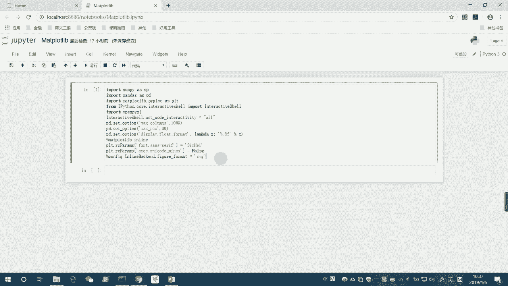

使得这个图更清晰，那么我们先学下建立画布，我们FIG等于PLT点figure，那么这样通过这个方法呢，我们就建立了一个画布，然后设置子图的话，我们用PLT点ADD plot subplot。

这个方法来设置子图，那么还有第二种画图的方法，就是直接我们直接PLT点subplot。

就可以直接画图了，我们举个例子。

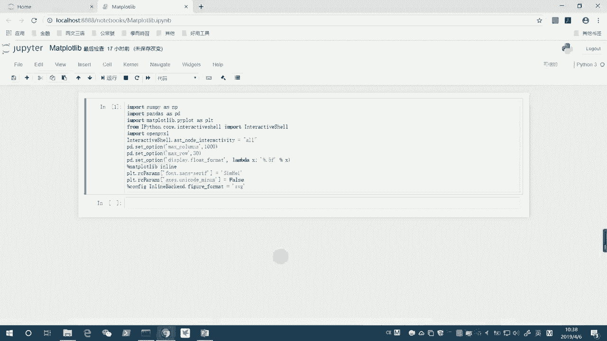

比如说我们把这个FIG啊，figure等于FPLT点，Figure。

figure等于PLT点figure啊，他说is not defined，那我们要先运行一下上面这个，把这些各个模块都导入一下，现在在运行，那么我们就创建一个画布，然后我们再看，我们如果这里给它呃。

我们添加一个子图，比如ax1会等于p r fig点，ADD sub plot啊，1111，这是我们创建一幅子图，那么我们就创建一幅子图，当然大家也可以考虑，就是我们创建两幅子图，比如R11。

然后AX2呢等于fig点ADD subp，212，那么什么意思呢，前面的R1呢，就表示我们绘制一个2×1的子图，也就有两幅子图在同一行里面，那么我们运行一下啊啊sorry啊，是两幅子图啊。

我们这样子上下的排列的，我们就可以做出这个第一幅图和第二幅图，我们可以这样子操作，比如说我们如果是二二的话呢，那么我们就是绘制2×2的一个图，然后呢D1和D2呢D1D2是左右排列的。

我们运行一下就发现是这样子的，比如说我们再添加一个，我们再演示一个，添加一个ax3这个图，那么这里呢就是三，那么我们运行一下就发现有三幅图，123，这里的话呢大家特别注意啊。

我们这个matt rod live里面呢，我们也有一个所谓的中间体，就是我们这个我们如果说比如说ax1的话呢，我们定义了一幅这样的图，那我们之后的操作呢，就会针对这个ax1进行ax1进行操作。

如果没有的话呢，我们就可以直接针对PLT这个啊，对象进行操作，比如说我们用另外一种方法，我们介绍两种这个建立坐标画，建立画布的方法，这是第一种用figure等于PLT点figure。

然后呢接着呢AX1X二X三，我们还有另外一种方法，直接用PLT来建立，就是PLT点，Sub plot，PLT点sub plot，我们直接建立221，这样的话呢就建立了一个画布2×2的。

然后一我们直接PLT啊，以PLT为对象进行support，这个的话呢，相对于上面的就更加简洁的方便一些，那么我们简单的介绍两一个例子，作为我们这个画质绘制子图的一个例子，比如说我们X等于。

我们X等于N派点arrange6啊，那么Y呢等于南派点arrange也是六呃，我们现在呢这里的话呢，就是X和Y其实是一样的，那么它应该画在图里面的，就是一条直线，或者说一个直线上的点。

那么我们现在先创建一个子图sub plot，那么221这样一个sap，那么我们接着呢PLT点plot就画出XY来，其实就是说画出一个折指这个直线图，折线图线性的图。

PLT点plot x和Y2X和Y我们运行一下，X呢就是我们的X用的这个数据，Y呢就是我们Y用的数据，我们运行一下，那么我们这条图就画出来了，这个图，那么我们还可以再画另外一个图，PLT点。

sub plot呃，224，这个时候呢我们画一个这个条形图，bar x y好，现在呢刘老师只是举个例子给大家，所以大家不知道这些代码没有关系啊，待会我们会详细的介绍不同图的代码，这样的话呢。

我们就把这两个图是两个子图给它画出来，我们还可以画222和223，这样的话呢，四幅图大家可能经常需要用到一些对比，那么这四幅图呢，就很好的在这边给大家展现出来了，那么在这里呢我们先简单介绍一下吧。

就是说我们最简单的两种图，一种是plot，就是说我们画这个直线图，线性图，一种是八，是不是条形图bar嘛，一根一根的棒棒子一样啊，条形图，那么在这里的话呢，我们举另外一个例子，我们举另外一个例子。

就是说，我们给出这个股票，它的一个这个年度的一个净利润，然后我们那个需要画图，对这个净利润进行一个画条形画条形图，那么我们通过这个例子的话呢，就希望呢呃给到大家更多的这个呃，把把这个图表的一些基本元素。

向大家全部的一一介绍，就是说额我们就不单独的一个一个的基本元素，去给大家介绍，而是在一个例子里面呢，把所有的基本元素怎么设置呢，教给大家呃，那么我们就以这样一个例子，中国平安的净利润和中国人寿净利润。

我们来绘制这个折线图进行啊讲解，我们这个图表的一个基本元素，那么如如我们这边输入所示，我们运行一下啊，他说syntax error，我们看一下为什么我们那个X等于N派点。

arrange2007到2019，啊我们这个地方因为是个点啊，所以呢这个地方要调整一下，应该是个逗号，让我们code pretty一下，代码美化一下，我们运行一下好，现在我们已经把X呢保存为了这个年份。

2007年到2018年啊，的那个各所有的年份，包括2018啊，因为这里是截止2019，不包括2019，那么Y1Y2它是他们每一个年度的这个啊，股票净利润，Y1是中国平安的，Y2呢是中国人寿的。

我们现在呢呃可以先看一下，我们画一个子图，Sub plot，我们把这个第一幅图给它画出来，那么我们可以先画一下，这里呢就有了第一幅图，第一幅图上面呢，我们想把中国平安的净利润给他画上去，我们怎么画呢。

PLT点plot，然后X是共同的，那么Y1是我们中国平安的，那么在这里呢我们给大家讲一个这个label，就是图例，图例的话呢，我们直接输入这个参数label，把中国平安呢输进去。

这样的话呢它的图例就会出现，我们看一下啊，报错啊，我们看下为什么报错，X and y must have first same，First dimension of，But have shapes。

12和13，我们看一下这个07年到19年，这里的话呢是一个两个三个四个五个六个，七个八个，九个十个，11个12个，那么看下2007的话，实际上到2019年的话，也就2007~2018年呃。

这个我们看一下他可能是多了一个嘛，我们看一下呃，那就是少了一个，少了一个，这里如果是2020呢，哎我们这里还是不行，我们再看一下哦，我我们发现这个地方我们输入错了，这里不是一点一逗号，这是1074。

04，这样子的话应该就OK了，应该就OK了啊，我们现在再运行一下好，这幅图我们就画出来了，然后我们发现这个label它没有显示出来啊，这是为什么呢，这是因为我们还要用一个PLT点legend。

这个呃内容呢我们用一个PRT点legend，才能让它显示出来啊，这样它就显示出来了，那么同样的，我们这个地方呢还可以加一个PLT点title，比如说我们想让它的title呢是title呢。

就是这个图的一个标题，title呢我们让它是中国平安净利润，那么我们就把它运行一下，诶，他这个啊我们看一下，他说NO attribute title啊，PLT啊，没有这个title这个tribute。

那么这个地方呢我们这个title呢就，啊我们看一下这个地方是title这个字，我们拼错了，其实应该是ti t l e啊，PLT点title，我们运行一下，它就显示出来了，所以遇到报错呢。

大家可以先检查一下这个报错的一个原因啊，到底这个函数呢是不是有没有写错，那么在这里的话呢，比如说我们想设置它的横纵坐标轴的名称，也很方便，PLT点x label，我们把X轴的这个label设置成年份。

那么我们把Y轴的这个label呢设置成净利润，那么我们还可以把单位写在括号里面，那个单位呢是一元啊，好我们运行一下，那么我们这个呃中国平安的一个净利润，我们就给他画出来了，那么看这个图呢，我们就觉得哎。

这个中国平安净利润是扶摇直上对吧，从08年的这样一个低点一路上去，那么在这里的话呢，我们就呃同时的话呢，我们想说我们再多画一些别的内容进来，可不可以，当然可以，比如说我们还想要把这个平安的这个X轴啊。

我们把它多画一点年份进去，那我们就XTX这个XTX呢，它第一个参数接收的呢，就是说我们最终要设定成哪些这个坐标轴，显示它，然后labels呢就是说啊，我们可以跟ticks呢设定一样的labels。

比如说我们ticks有有这么呃六个年份，那么我们labels如果是ABCDEF的话，我们这个地方就会变成ABCDEF，而不是200820102012，这样子就说我们可以用labels。

来替代我们这里给的ticks，那么这里的话呢我们只想让它年份多显示一点，我们就直接把这个囊派点arrange，2008~2007到2019，把它给放进来，我们运行一下，发现呢。

这个下面的这个年份呢就基本上填满了啊，所有的年份都有，那么接下来呢我们还想要怎么样呢，我们还想要调整一下这个呃，我们还想要调整一下，就是说我们把这个中国人寿的图也给它画下来。

那么我们就PLT点subplot to subplot，我们给它R1，然后呢是第几幅图，是第二幅图，我们给他多画一幅图，中国人寿的图我们空一格，这样呢下面呢是中国人寿的图。

那么我们PLT点plot lot，这个时候X还是一样的，年份是一样的，但是Y呢我们要用Y2，那么label呢我们就是要中国人寿，那么其实这样的话呢，这里我们就可以偷懒了，我们可以把上面的都给复制下来。

这个呢其实在大家工作中呢，如果要进行封装的话呢，就可以把它封装成一个固定的函数，对所有的这个股票呢其实进行画图，可以去提取它的这个历史上，所有的这个净利润的年份，然后进行画图，然后我们这样子的话呢。

我们运行一下，发现我们中国人寿的图也可以画出来，但是大家发现中间很丑啊，这个地方堆叠在了一起，怎么办呢，我们有一个调节子图的方式，叫做PLT点sub paddressed，我们只要在这边输入PLT点。

Sub plots adjust，这里啊，然后呢，我们这个地方呢只需要把他们两个中间的这个，h space调宽一点，这个地方大家可以阅读它的参数啊，你看这里的话呢有好几个参数，这个left呢就往左移。

bottom右边的距离啊，这下底边的距离，right是右边的距离，top是下面的距离，w space呢是这个嗯横向的距离，h space呢是纵向的距离，我们调整调整一下这两个图案，子图之间纵向的距离。

我们把它调整大一点，调整成0。25，比如我们看一下这样够不够额，好像还是不够啊，那我们再调整宽一点，比如说调整0。5呃，好像差不多好了一点，我们0。75应该就完美了，好我们看现在的话呢完全分开这两个图。

但是对比呢就非常的强烈，我们发现中国人寿这个图啊，这个啊图标的位置不是很好，我们可以在这边修改一下，PLT点legend里面有一个lock，location的一个这个参数。

我们把这个locks lock的话呢调整为一个best，让它在一个系统判定的一个最好的位置啊，还是这里，那么我们想要它调整呢，我们还可以再改，比如说我们让它是在upper left。

让它在上顶上边的左边，让它在这个位置运行一下，那么这个图呢就到了这个位置啊，这个位置，那么看起来呢稍微那么略微舒服了一点对吧，那么通过这样的对比呢，我们可以看出哎。

这个中国平安这个保险公司的这个净利润呢，额是虽然基数呢非常的低，但是呢现在18年呢已经突破1000亿了，而中国人寿呢在2007年就有300亿了，2008年最低点还有100多亿。

但是现在呢依然是100多亿，所以我们就发现诶，这两个公司的对比呢极其的强烈啊，这个感觉，那么接下来呢我们想说再给大家介绍一下，我们怎么去设置这个数据的一个标签，比如说我们现在专门画了一幅。

那个中国平安和中国平安的图，我们就只画一幅中国平安的图，我们把上面的复制下来吧，我们只画一幅中国平安的图，这个时候我们就不需要subplot来建立子图了，我们直接画一幅中国平安的图，画好了。

我们想在这个2008年这个低点啊，我们给它加一个数据标签，我们怎么怎么加呢，那么数据标签呢在我们Python里面呢，是这个PLT点text，PRT点text，我们给它加一个数据标签。

那么第一个参数呢是X的位置，就是我们加标签的这个X的一个坐标，加标签的Y的坐标，然后这个标签的内容，那么我们当然是想在2008年这个位置，加标签，2008年的时候，对应的这个点的话呢。

我们假设它是我们看一下大概它应该是多少，我们看一下上面的数据，它是6。62，我们就想在2008年七这个位置呢，给他加个标签，标签的内容呢是这个啊，6。62亿元净利润，它的一个净利润6。62亿。

我们运行一下，我们就给他加了个标签，6。62亿元，那么啊如果我们不想加标签，而是想加一个注释呢，那么我们也可以PLT点annotate，我们给它加个注释，第一个参数呢就是我们要注释的内容。

XY呢就是我们这个注释摆放的这个坐标，摆放在哪里，用一个TP来返回后面的话呢，就是这个注释啊，它呃给的这根线的一个情况，就说我们要要不要有一个箭头挤过去啊，这个箭头的设定是什么样的，我们一一来介绍一下。

比如说我们想输入的是因为2008年呢，平安的话呢，它是这个海外投资失败，所以我们就想在这里呢给他做一个平安，海外投资失败的一个标签，那么这里的话呢，我们这个因为它净利润，当年下降到了这个6。62个亿嘛。

这个归母净利润，所以我们想给他做一个这个标签，表示这一年呢是它的一个最低谷啊，最低谷，那么我们这个XY呢，想在2008年的什么位置呢，想在2008年的这个八的位置啊，但是呢我们这个XY的一个呃。

这个XY呢我们是在2800。6。62的位置，但是呢我们这个真正的XY的text呢，我们想把它放在哪里呢，想把它放在，想把它放在这个2008年的这个300的位置。

我们看一下2008年300大概是在这个位置，这个位置我想放在2008年300的位置，那么我们这里呢还有一个叫error proproperties。

error property props就是error properties，我们想把这个error properties呢设定一下，他的这个标签的一个颜色，face color就用黑色black。

然后我们还想设置一个error style，Error style，就是说我们要不要有个箭头指过去啊，这里的话呢我们想要一个箭头指过去单向箭头，那么我们啊我们看一下啊，这里我们还少了一个小右。

右边少了一个括号，我们这个code pretty运行一下，也就是说我们把代码美化一下，我们现在运行一下呢，发现诶这个地方我们就给了一个平安，海外投资失败的一个箭头，指向了这个2008年。

那么我们觉得这个好像有点偏右了，是不是我们想把它调正一点的话呢，我们就2007这个位置也行，我们运行一下，这样的话呢这个这个图的话呢就非常的直，就直观的指出诶，这一年的话呢是我们这个中国平安的起始。

这个落难的一年，但是也是他的一个从最低点开始，一路腾飞的一年，从这一年以后，他每年的净利润都在增长，从来没有出现过某一年的净利润下降的，一个情况啊，我们大家从这个图里呢，我们就可以很清晰直观的看出来啊。

反观中国人寿的话，我们对比一下的话，就这个对比度就非常的明显啊，中国人寿始终是在净利润200亿上下波动，好我们接下来呢就看一下，到底这个matt plot lib的话呢。

能够给我们多画画一些什么样的图表，那么刚刚这些基本元素呢，其实刘老师大部分都介绍了一下，那么具体的比如说像网格线的设置啊，然后一些不常用的这些内容呢。

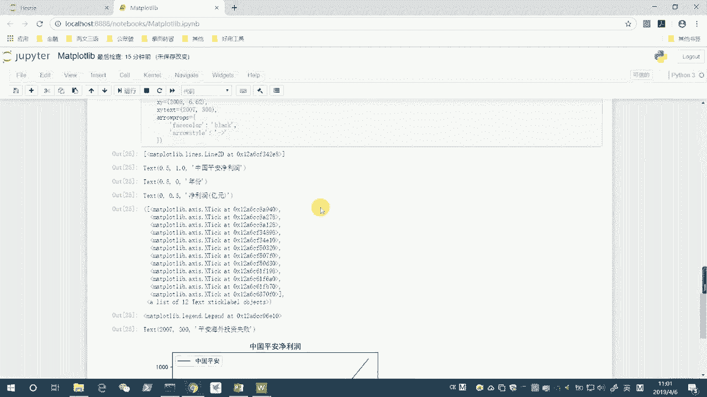

我就没有再介绍，大家就可以各自的去阅读一下，这个net prolab documents，那么图表的介绍的话呢，有折线图，柱状图，横向条形图，散点图以及气泡图，面积图，箱形图，饼图热力图。

那么它相关的这个我们只要知道plot，知道bar，然后知道8H知道这些图的名字啊，大家后面参数千万不要去记啊，不要觉得说全部都要背，背了以后，全部都要能够随时输出它这个内容以后，你才去用。

这样的话呢会浪费你大量的时间在记这些东西，你只需要因为刘老师已经给大家教了，大家装了这个代码提示的这个工具，所以呢大家只要输入这个bar的话呢，输入这个plot的话呢，后面参数都会显示。

即使你不知道参数什么意思，你只要知道这个plot代表的是折线，那么你就可以直接去翻阅官方文档。

查找这个相关的参数的含义，而不要说一定要先把所有的图都会画了。

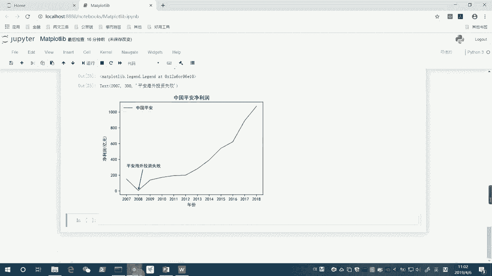

然后再去用，而是我们在用的过程中呢去学习，那么这个气泡面积和箱形图，饼图热力图，他们的这个我全部都给出来了，他们的这个呃公式啊，不叫公式啊，叫这个函数，那么这些函数呢大家不要去背。

然后呢我也不会在这边呢每一个都去讲，但是我们会重点举三个例子来介绍，我们这个画图，大家更多的内容详见我们的medical lib的官方，Documents，nepo live的话呢，我们进行绘图的实战。

我们先画一下这个贵州茅台的一个净利润土，这里呢我们希望直接调用这个wind派来画这个图，那么我们可以先from matt proleague，import呃，From macpro lib。

点piplot as p LT啊，这import，那么我们这里直接from winter pie，我们这边引入一下winter pie。

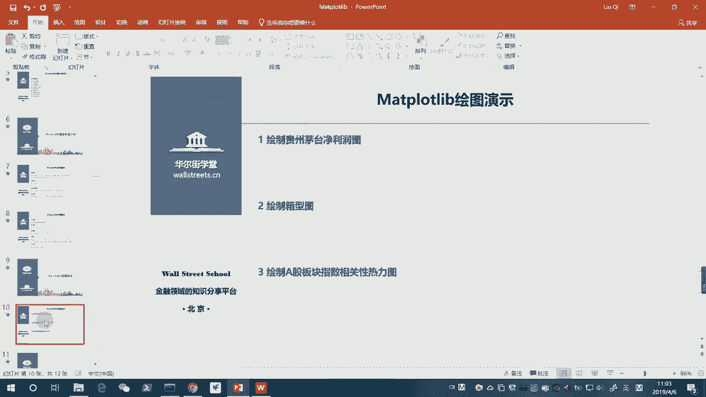

From wind pie import star，我们把这个winter pie in import进来，然后我们在W点start，我们把这个winner派给它运行一下。

它这里显示errocode zero data1，可是OK那么说明我们这个winner派好，wind count API呢已经接好了这个接口，OK的，那么接下来呢我们想呃。

先画一幅这个贵州茅台的这个净利润的柱状图，我们想直接调用这个winter派里面的数据，而不是像啊，刘老师刚刚这样子把数据把他先写成列表，然后我们再去画图，我们想直接调用。

那么我们就按我们之前的那个方式哦，我们打开wind cg啊，找到代码生成器，我们从这个呃我们看一下要用哪一个，这里的话可能得用日期序列吧，比如说我们贵州茅台，贵州茅台看下这个地方可不可以。

贵州茅台我们想看他的财务消息，那我们就应该财务报表，利润表里面的归属母公司股东的净利润，下一步我们想看的是报告对吧，季度的呃，sorry我们要看年度吧，直接年度画年度的图，那么我们用这个工作日啊。

用日历日吧，直接日历日，然后我们想看这个从2007年开始的，早一点，2007年到现在，2007年的12月的31日，到2018年的12月31日，下一步然后确定哦，OK这个地方失误了一下。

我们输出的变成了这个VBA的这个语言啊，我们要输出的是Python，所以呢我们这个地方调整一下，依然是这样子去确定，那么这次呢我们输出的是Python，Python的话。

我们把这个复制复制呢粘贴到这边来，然后我们在里面添加一个参数，Use df，because to运行一下，看一下data啊，它就是我们之前讲的，输出的是我们的data free的一个格式。

非常的美观大气，那么这个data frame的这个格式输出以后呢，我们直接画图啊，在这里呢有两种画图方式，第一种呢就是说我们把他的XY呢先是设定好，然后我们用PLT点plot x y，我们先讲最原始的。

我们先PLT点XY啊，我们直接X呢会等于data点index对吧，然后Y呢会等于data点这个values呃，我们看一下data点values，我们把它都用那个n number，还有rail。

我们看一下data点index呢应该是一个number派array啊，它是一个这个形状，它是一个index，是一个array的形状，我们这个data点values，它也是一个array。

但他是一个这个多维的array，我们要把它转换成这个一维的，所以叫reshape，它一下，那么我们把它转转换成一维的，我们点reshape，大家可以看一下，它就会变成一个一维的一个数组，变成一维的啊。

cannot reshape这个value，那么我们把它reshape一下，看一下，会是因为年份的原因吗，啊receipt才12，OK的啊，reshape一个12啊，我们看一下2007到2008年。

一共是多少年，一共是12年，那么我们接下来呢PLT点bar，我们画一个柱状图，然后把X和Y呢放进来，就是我们已经设定好的，X和Y这个柱状图的宽度呢等于150，然后这个啊A啊这个这个它的位置呢。

我们把它放在这个柱的位置呢，放在每个数字的一个中心，就每个坐标的一个中心给它添加一个label啊，图利叫归属母公司净利润，或者直接就叫净利润，我们不要写那么多字，这地方这个位置呢大家如果不知道调啊。

刚开始呢你可以把这个地方就先不写，然后等下发现它太窄了，我们再调，我们运行一下，我们发现这个根本看不见，对不对，这是为什么呢，这是因为我们这样子画出来这个图啊，他认为说我们每一个日期呢只是一天。

那么一天的那个柱子当然是非常小，它不认为我们是一年，所以这里呢我们可以通过调节这个with，等于比如说我们等于100看一下够不够粗啊，这个柱子运行一下，发现哎哎还可以啊，这样还可以啊。

当然我们如果150的话，看起来更舒服一点，这样子就挺舒服的了对吧，这个这个净利润的一个图，所以呢我们发现呢，贵州茅台呢，它的一个净利润呢在2018年开始呃，我们看一下，应该说。

这个图呢可能跟我们这个实际的有一些差异啊，我们画出来的有一定的差异啊，我们看一下他是从2008年开始的，而不是2007年开始的，这里，那么这里的话呢很有可能是，由于我们这个我们看一下，一共有12年啊。

然后我们刚刚那个data index也是12年啊，这里的话呢2008年一路过来的好，这里的话呢我们可以往后看一下，我们可以把这个它的x label和y label都画一下，这是一种画法。

当然因为我们刚刚介绍了给大家说了，就是我们要结合这个data frame和pandas画图啊，所以在这里呢我们可以直接用这个pandas的，里面的data frame来画图。

因为这个data呢它本身就是一个data frame的格式，我们直接对它点bar就可以画出一幅图来了。

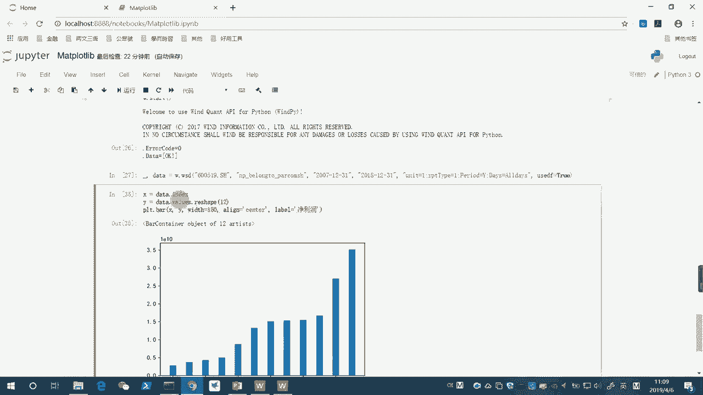

啊OK说这这这这里说错了，我们直接对他点plot，可以画出一幅图来。

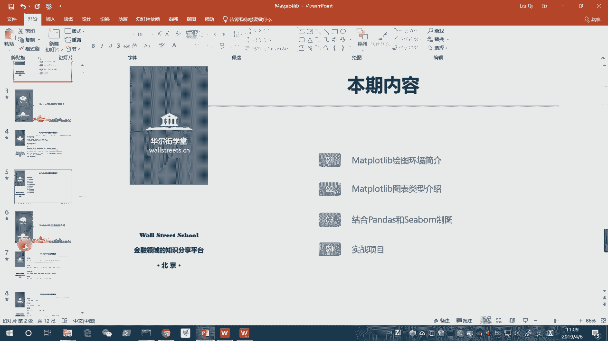

我们直接对这个data的一个点plot的话，我们就可以把它这个呃，把他这个我们这个净利润的这个图给他画出来，那么在这里呢，比如说我们想要把它的柱状图画出来，我们只要在pd后面再加一个点半就可以了。

把它转成这个bar的一个形状，这样的话呢也是非常美观的一个这个图，那么我们这个标签这个哦，我们原来这个data的这个标签呢，就会自动的转成啊我们这个图里面的这个图例，那么在这里的话。

如果我们想更换图例的话呢，我们也可以进行修改，比如说啊比如说我们想要修改这个图例啊，我们可以在这边呃直接给data里，我们先看下data，我们可以直接给data它那个列换个名字，我们这个图例就修改好了。

这data这个列呢叫这个n p belong to par park hn，这个东西我们给它换个名字啊，data点rename，我们给他rename一下啊，这个地方是columns。

等于我们对它进行换名字，把原来这个名字输进来，NP杠DELONGTO杠PARCOMSH，我们把它给换个名字，换成，换成什么呢，换成这个净利润，我们运行一下，啊这个地方是因为我们没有保存它。

说明in place一下等于TRU，然后我们再运行一下，那么这个图呢图例呢就被我们修改了，因为它是根据data frame直接进行画图的，那么这里的话呢我们对这个data呢我们还可以哦。

我们还可以在这个地方，直接添加这个X轴的label和Y轴的label，比如X轴我们想让它是年份，然后Y轴的话呢，我们想让它是这个净利润，然后一元啊，那么我们可以把他们啊我们不管它单位。

我们直接画这个净利润的图出来，这个Y轴的图我们也给它画出来啊，OK那么他们的label我们就都画出来了，那么这里的话呢这个bar图呢我们就讲到这里了，或者说怎么从wind里面直接调用数据。

我们暂时先讲这个，那么我们接着来讲一下，这个额如何调用这个骨架的数据，然后进行画图啊，其实就更简单了，也是一样的，我们找到这个日期序列，我们在这里呢，比如我们要画沪深300的图，000300。

我们把沪深300的图给他放进来，我们把贵州茅台弄出去，下一步我们这里呢不要这个归母净利润了，删掉，我们只需要一个收盘行情，我们看一下行情在哪诶，我们看一下啊，这个地方呢它会有一个收盘行情。

我们想要这个收盘价，我们把这个价格呢，我们想要07年到现在有点时间有点有点长啊，我们想要两千一三年到现在，好的，那么我们这个数据呢，这个日期呢给他这个就是这个给他提过来，还是一样的思路。

data等于我们这样子提取这个数据，记得加USDF等于Q，这样的话呢，我们就可以提，提取出的这个data呢就是一个data frame的一个格式，我们看一下data frame的一个close格式啊。

他怎么按年给我们提的，我们应该按day啊，这地方修改一下，按day看下可不可以直接这样修改，嗯很好，我们现在是按data一个格式，那么我们这个data就可以直接画图了，直接data点plot。

就非常完美的，把这个沪深300的一个图给它画出来，比如这里我们如果想加一条，这个250日均线怎么加呢，大家还记得吗，我们之前有算过股票，它的一个股价的平均线。

我们用的是什么data点rolling250点，这个min我们是这样来算的，还记得吧，运行一下得出来的是这样的一个平均线，我们把这个呢赋值给一个新的这个列，叫data close，二百五。

放在这个data frame里面，那么我们看现在新的data frame的话呢，它的一个格式呢就是有两条有两个列，一个列是close，一个是close，二百五，我们要对它进行plot。

直接点plot画出图来呢，就是我们这个一个一条，这个叫我们这个沪深300的收盘价，以及它的一个250日均线，就是年线，那么我们就呃很清晰的看出，如果这个股价在年线以上呢，那就基本上是受到支撑的。

如果下了年限呢，就要很长一段时间才能再回去，额我们接下来呢就想跟大家说的呢，就是说就想和大家说的呢，就是我们在这个就是我们在这个学习的过程中，我们发现了这个用data frame来来画图。

是不是极其的方便，对不对，我们可以不用设置太多的内容，我们就可以直接把这个图给他，直接轻松的画出来，而我们如果我们只需要用这个data frame，然后点plot就可以画出来。

而我们别的方法呢就要可能要先设置很多内容，所以呢在画图的时候呢，大家能用data frame画的话呢，就尽量的去考虑用data frame来画这个图，那我们接下来呢给大家举一个例子呢，就是箱形图的例子。

帮派点random点seed，大家可能第一次见到这个number派点random，random点seed，就说这个呢就是说，因为我们random呢是一个随机函数，但是呢一旦我们加上这个seed以后呢。

他就是说啊大家随机出来的数呢，只要按照这个C的这个后面如果是R的话，那么就理解为这个频道二，也就是说大家随机出来的数呢，会跟我随机出来的数是一样的，因为我们都在一个频道上。

那么这里我们令data frame呢等于PD点，Data frame，我们构建一个随机的一个数据，啊关于这个构建随机数据的，我们在pandas里面都给大家介绍过，然后我们想说这里的话呢。

我们有一个columns，等于我们构建一个5×4的一个随机数据，columns的话呢就是呃我们需要有四列嘛，因为是5×4，所以是四列ABCD好的，然后index的话呢我们就不用给它，我们直接就这样。

然后我们运行一下，我们查看一下DF它是一个这样的情况，我们想给这个画一个箱形图，我们怎么办呢，我们直接data from点box plot就好了，直接用data frame给他box plot。

它就会画出啊，每一个列哪一个列啊，刚刚我们给大家看的，我们看下哪个列，他就会给大家画出每一个列，每一列的它的箱形图，那么我们如果说数据量一大呢，我们就可以意识到啊，这个列的话呢，它的均值啊。

它的上下界啊，它的这个以及它的三西格玛，我们看一下这些西格玛的一个范围，那么也就是说超出了这个范围的那些值呢，我们可以认为是一个异常值对吧，比如这两个以外，这个值呢我们可以认为它是异常值。

这个人只是我们认为它是异常值，我们说的是数据量一大，而这个箱形图呢也就非常容易的，可以帮我们判断异常值，那么我们在这个如果一个值呢，超出了这个范围内的话呢，超出这个范围的话呢。

我们就可以把它判定为异常值哦，我们在教大家绘制一个呃，我们可以演示一个热力图啊，热力图的话呢是一个非常有趣的图，那么这个图呢在我们之前有讲过，他的一个数据的绘制作，比如说大家还记得我们之前讲过这个。

如何计算指数之间的相关性啊，大家还有印象，我们用data的一个行业指数的一个数据，行业指数点XLSX，这个数据我们给大家演示过一次，我们运行一下，我们发现这个DF2呢是长这个样子的，大家应该还有印象。

对这个我们现在呢对它呢我们进行一个操作，我们让X呢等于DF2点correlation，我们运行一下，我们看一下X会是什么样子的，我们发现X的话呢，它就是这个一个相关性矩阵。

这个X呢我们就可以直接进行画这个热力图了，热力图画出来呢是非常的美观的一个情况，那么我们怎么来画这个热力图呢，那么是这样子的，首先呢我们构建一个画布，figure等于PLT。

我们用那个最原始的方法点figure，FHUREPLT点figure，然后fix size等于，16，也就是说啊我们构建一个10×6的一个画布，创建画布以后呢，我们呃我们就给他设置一个。

我们想要的一个配色方案，就是之后的一个配色方案，这个大家等下就知道是什么意思了，PLT点cm点，然后后面有很多种选，我们选这个红色rise，后面有很多种选，大家之后可以尝试一下不同的选项。

这个cm呢这个地方呢是配置配色的一个方案，那么我们还可以PLT点，我们就可以直接画图了，Iimage show，这个呢就表示热力图，im show第一个呢就放我们这个data frame的。

我们这个相关性矩阵进来就好了，第二个呢我们就放我们这个配色，C m a p，会等于我们已经我们已经设定好的CMAP哦，会等于我们已经设定好的CAMP啊，因为上面写的是CAMP，那就CAMP吧，无所谓。

上面那个CAMP，我们这个CAMP是一个代号，代表我们后面选的这个颜色，我们也可以不用这个代号啊，直接把这一串的复制到这个位置来，粘贴到这个位置来作为这个配色的方案也可以，这样的话呢，我们PLT点。

我们看一下，我们现在直接看下这幅图，这就是我们的一幅热力图啊，它那表示的就是我们每一个这个，我们每一个指数和另外一个指数之间的，一个相关性啊，大家发现这个图看起来很不舒服啊。

我们当然还需要配置一些其他内容，让它能够更直观一点，PLT点color bar，这个呢什么含义呢，就是说我们在右边显示一个，作为参照的一个颜色，这我们就有个参照的颜色。

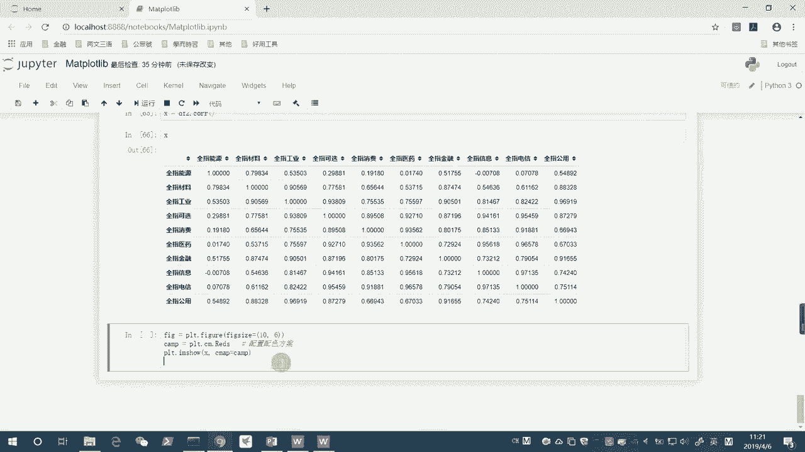

但大家觉得好像还是我们不能够确定这些呃，具体的哪一个数字对应的是我们哪一个指数，那么我们在这边加一些，比如说我们加一个industry。

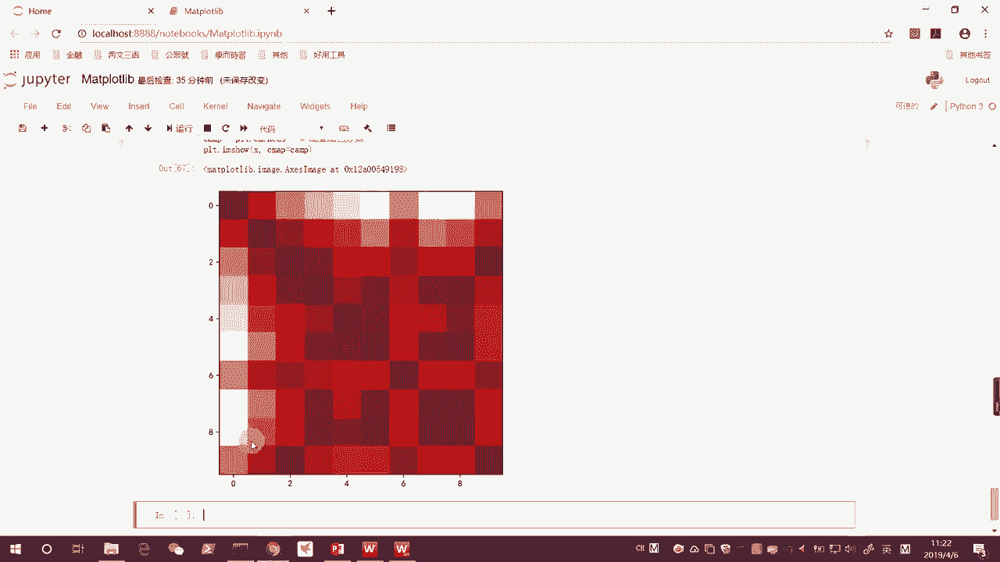

我们把这些指数指数给他标上去，我们先设定一个industry等于X点collapse，点values，这样呢。

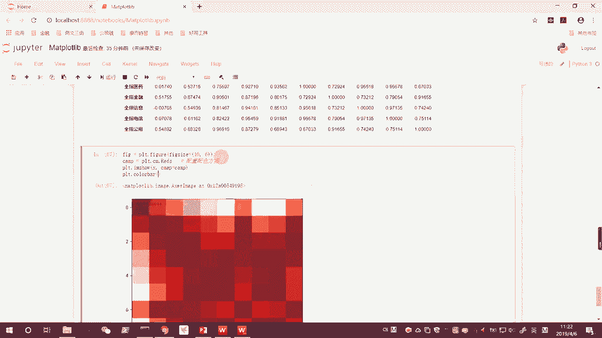

这个industry呢就是我们的这个指数的一个，应该是一个array了，我们来看一下好。

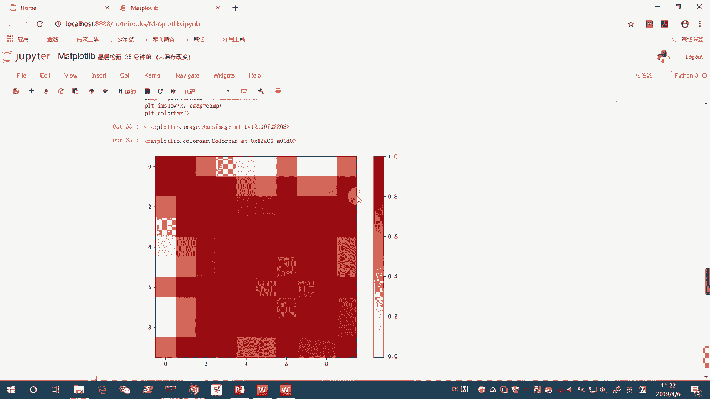

我们看下这个industry长什么样，它应该是我们的一个ray，没错，它是我们一个这个指数名称的array，大家注意，那么我们接下来呢想说，就是在这个地方修改它的一个tick marks。

所以呢我们先定义一个tick marks，就是说啊。

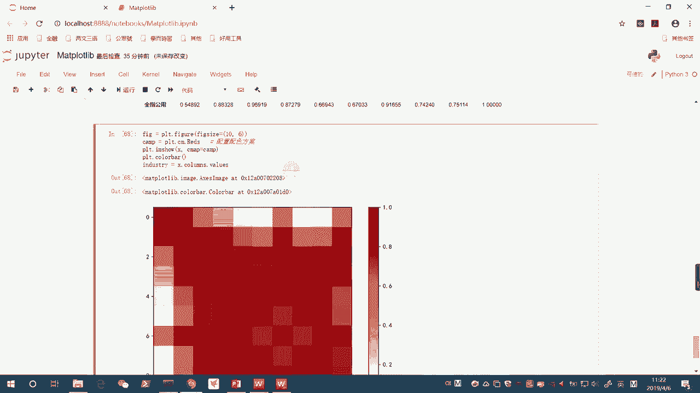

就是说我们定义一个跟我们这个industry，长度一样的tick marks，就是说跟它长度一样，然后industry和这个TIKMARKS。

TIKMARKS呢是我们南派点arrange，它呢就是对应着我们这个industry的一个，array序列，这里有多少个数字呢，这里就有多少个这个啊，我们这个叫这个名称，这个指数名称。

待会呢我们就要用这些数字的一个位置呢，用这个指数名称去把它替换掉，那我们看一下怎么替换。

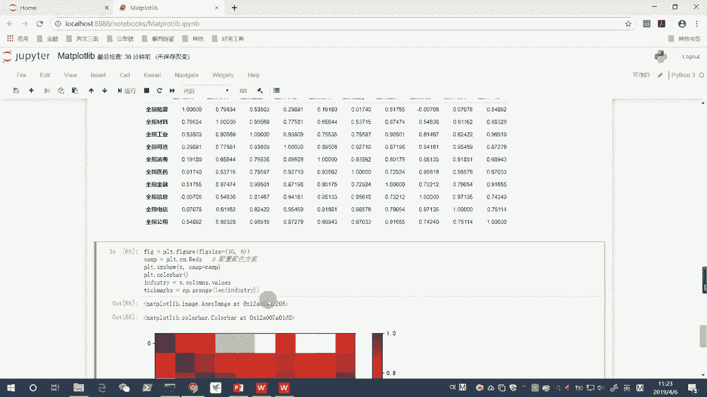

我们用法是PLT点XTX，我们先换X轴，我们说过换X轴的话是x tx pk Mark。

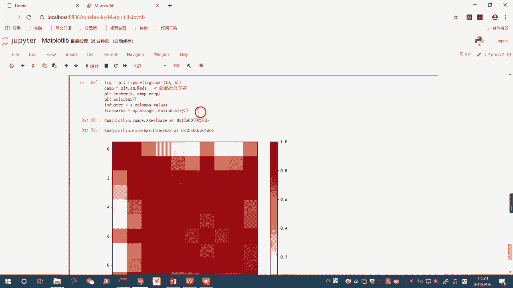

tk Mark呢，就是说我们告诉这个这个PLT这个工具啊，告诉PLT这个啊对象我们说啊。

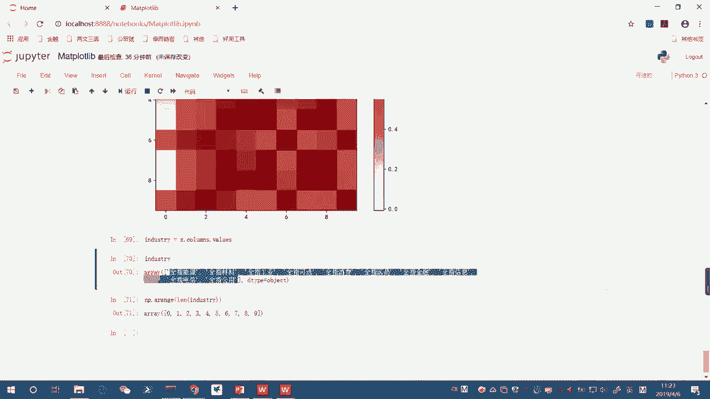

我们要对你的这个XTX进行操作，怎么操作呢。

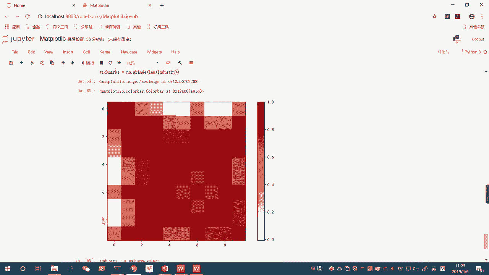

你先要找到tick marks，我们设定的这个0~8的这些位置，然后每个位置呢，我们用industry里面对应的这个标签呢，给它进行一个替换，我们先运行一下，看一下这个X轴替换的怎么样都粘到一起了。

我们希望把它竖着放怎么办，这里呢可以设定传递一个参数给这个TIKBAR呃，XTX叫rotation，我让你XTX给我旋转90度，哎现在就看的很清楚了，那么接着呢我们要对YTX进行一个操作对吧。

我们就调整一下，直接改成YTX，那么这个地方呢rotation呢我们需要rotation吗。

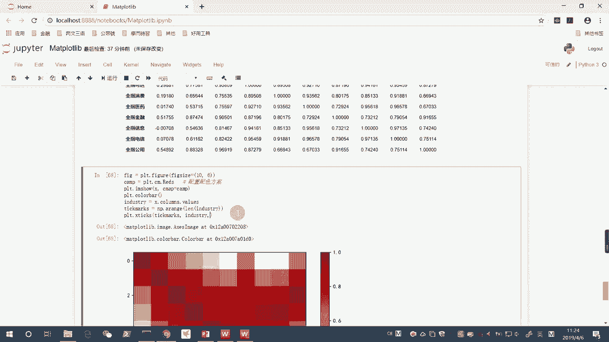

YTX我们就不用rotation，可以直接横着摆。

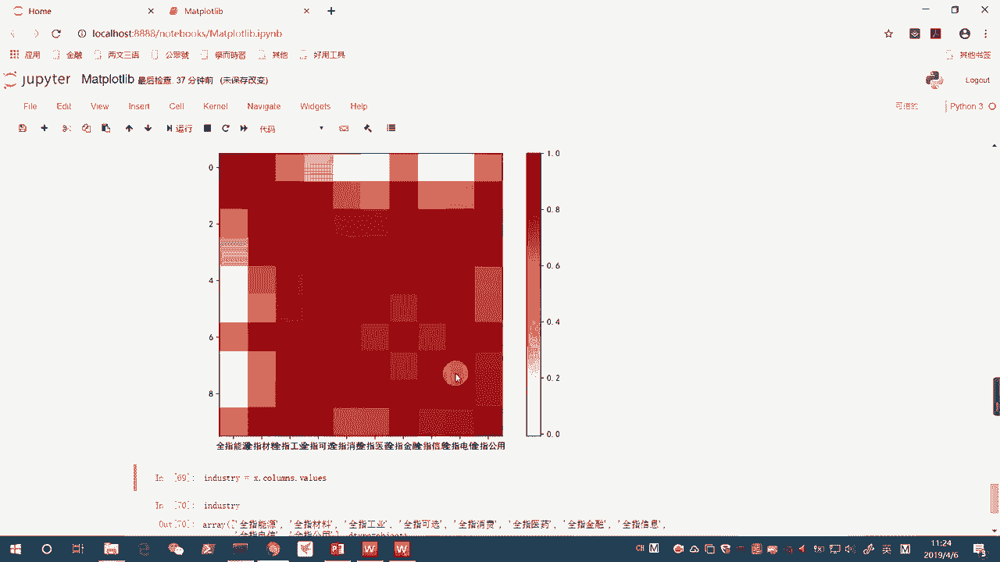

我们运行以后呢，我们发现诶这样就看得非常的清晰了，这个图这个图就非常的清晰了，他表展现了什么呢，比如说我们看能源指数，它和我们这个医药指数的一个相关性，是不是非常的低呀。

然后他和我们这个消费也相关性也比较低，和我们这个信息的相关性也很低对吧，然后同样的我们看下药，医药的话呢，和我们这个消费的相关性是非常高的对吧，医药和消费消费的相关性是很高的。

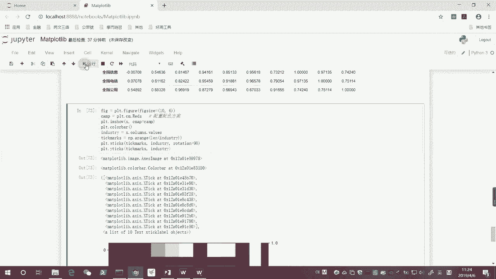

然后全指公用的，公用和消费的相关性呢就相对来说低一些对吧，那么我们从这里呢就可以看出啊，我们在分散投资的时候呢，可能更多的会偏向一些相关性不高，然后呢同时估值又且低的那种品种。

而不是说全部重仓在相关性特别高，然后估值特别低的品种，那样的话呢，可能就会造成说万一这是一个估值陷阱的话呢，那么它们相关性又很高，导致未来的一个呃投资，可能遭遇一个黑天鹅的情况，就会损失惨重。

在这里呢这个图如果画完以后呢，我们想把它输出，我们就用PLT点save fig，像这个图的话呢，在券商研究里面也是经常用的，画出来也是比较漂亮的，包括大家工作中呢。

其他的地方呢也可以考虑用用这个热力图啊，作为一个客户的一个展示，或者咨询公司的一个展示，我们save到pictures里面，就叫做correlation的一个全A股的一个PNG吧。

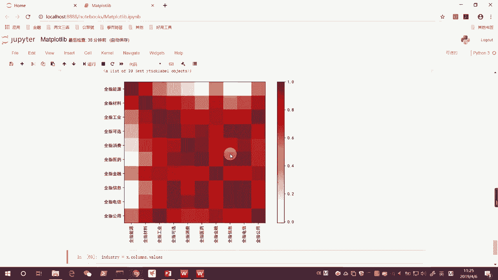

我们用PNG的格式输出，当然也可以是j pg啊，输出以后呢，我们就去P啊这个pictures里面找这个图就好了，这里有pictures correlation a打开看一眼啊，画的还是不错的。

画的还是不错的啊，很清晰啊，看上去还比较清晰，这个图比较直观，好的，那么接下来呢我们这个讲一下实战项目，那么我先把这个屏幕给大家清掉，我们讲两个实战项目，第一个实战项目呢，是我们想要给指数画一个P图。

那么这个P图呢不再是我们之前的那种画法了。

而是呃一个什么样的画法呢。

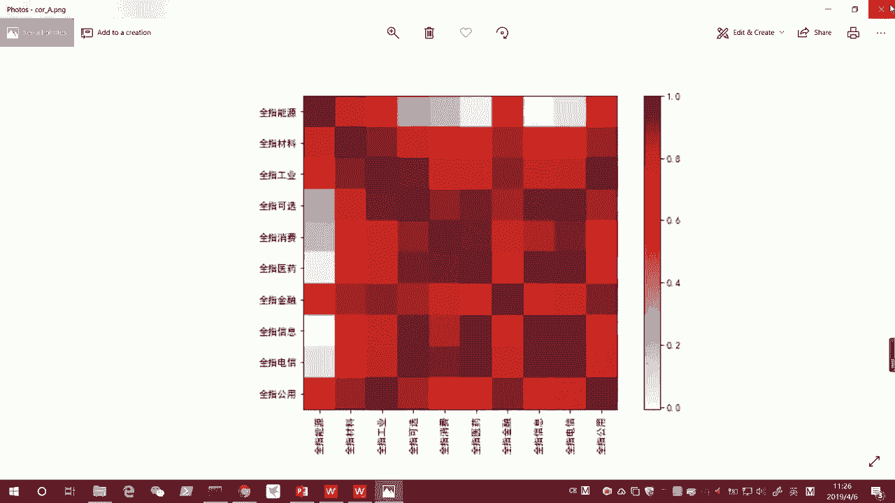

我们想把这个画法呢给他做成，我们先要进行一个数据分析，我们做什么数据分析呢，我们想导入所有A股的一个PEE的数据，然后我们想计算它的一个平均的PE，每个月的为什么是每个月的平均PEE。

而不是说直接用这个万德里面的PE呢，这是因为啊我们认为如果说把那个大股票啊，把银行它的一个PE呢，摊到所有的小股票的投上去呢，我们觉得这个算出来的PE呢肯定是会偏低的，因为一家银行它的大型国有银行。

它的一个净利润呢可能就有1000个亿，1000个亿的话呢，相当于可能是1000家创业板的小公司，它的一个那个每年的净利润，甚至很多创业板小公司，他的净利润呢没有没有1000个亿。

那么我们如果把这个银行的利润呢，摊到全部A股投上去呢，我们认为这样是不合理的，来计算PEE，所以我们想计算一下他这个等权PEE，也就是平均的PE，那么我们现在先导入一下这个PE的数据。

我们现在可以设想一下，我们要去计算这个PEE的一个过程中啊，会遇到哪些问题，第一会有PE是负数负的非常大的公司，以及PE是正数正的非常大的公司，对不对，这就对应着那些亏损的公司，和那些盈利甚微的公司。

那么这些PE呢如果在我们直接平均的时候呢，等全平均的时候呢，它会影响到我们这个整体的一个PEE，对我们整体PEE影响比较大，我给大家展示一下，这是我们的一个数据，从2004年到2019年的。

这个月度的一个PE的数据，然后呢我们可以点一下info，我们看一下它的一个数据的一个情况，15。4兆的一个数据里面呢，是存在一些缺失值的，我们把它job掉，我们先job掉这个缺失值，呃。

当然我们在这里先drop n a吧吧，Dp n a，然后我们看一下这个结果，我们把in place等于true，好我们现在再看一下这个data，现在呢就没有缺失值了。

那么我们现在的话呢这个对它进行一个操作，我们把这个因为我们只关注的是PE嘛，我们把这PB给他drop掉，Drop colums equals，这个PB啊，我们把PB给他job掉。

然后in place equals true，让他立即直接在原来基础上改掉，那么这个时候我们再看到这个p p p e data呢，我们发现里面会有负的，对不对。

这些负的如果我们要算每个月的平均的PE的话，这些负的和这些400多的，无疑会对我们造成很大影响，所以我们想把这些负的呢踢掉，同时呢我们把这个特别高的这些PEE呢，我们也踢掉。

比如说高于每个月最高的那5%的PEE，我们把它踢掉，那些股票，我们把他踢掉，那么我们通过这样子我们怎么去得到这个额，这个操作呢，我们可以这样去做，我们现在想一下，对于每个月来说的话。

假如我手上有一个每个月的数据，这个数据呢叫做group，它的名字叫group，每个月的数据，我们现在就说一个月，假设2004年1月的数据是group的话呢，那么我们这个group的话呢。

我们选出他的PE来，它的PE是不是要大于，我们应该要让它大于零，对不对，我们想把小于零的剔除掉，那么我们注意了这个地方，我们用一个我们最常用的这个反这个这个选择，就是我们最常用的这个group。

直接的这个这个我们说的这个条件选择，我们之前讲的data frame里面讲的，那么我们还要满足什么呢，还要满足这个group的一个PE啊，满足他怎么样呢，满足他要小于我们这个group的PE的一个框。

til的95%，小于95%的PE，那么我们可以这样子去定义这个啊，这个选择对不对，我们可以把这些满足我们这个要求的，PE选出来，选出来以后呢，这个PE就可以，直接是计算每个月均值的一个PE了。

那么在这里呢，我们利用一个，我们利用我们之前讲过的这个group方法，我们肯定要用group by嘛，我们要把他这个函数给它，把把把它这个所有的数据，根据我们这个日期进行group by。

就是我们进行分组，每个月分成一组，每个月分成一组，这里的话呢，我们就要用这个group by以后的那个对象，中间体对它进行一个apply，Apply，什么呢，就是把一个函数给它放进去。

给它进行一个函数的操作，我们定义一个叫做filter的函数，它传入的呢是一个是我们之后要用到的group，就说它传入的呢是说，对我们之后分组以后的每个组进行操作，所以呢这里的参数是group。

对我们分组以后的每个组进行操作，然后呢它返回的是什么呢，它返回的呢是我们每个组的一个均值，是经过上面的筛选以后，我们每个组的一个均值，我们把这个group先用，我们后面选择以后的替换掉。

它返回的是我们每个组的一个均值，我们把这个函数运行一下，那么我们怎么去用呢，我们现在呢就先group一个data beta group的会等于什么呢，我们根据什么来分组呢，根据我们这个date来分组。

我们这个data data group呢就是一个中间体，就是说我们根据data分组以后，分组以后的一个中间体，这是我们分组以后的一个操作对象，我们按月份分了组，分了组以后呢，我们PE杠。

我们直接data杠group的，我们对这个中间体我们用一个函数，用什么函数呢，用我们上面定义的filter函数，它的含义是什么呢，就是说我们分了组以后，是不是其实数据已经变成一组一组一组一组，按照日期。

就按照我们的月份，每个月是一组，每个月是一组啊，然后这个时候呢我们给它apply这个filter呢，就是说对于你分好的每个月的那些数据，每个月的股票我都去执行一次这个操作。

这个呢是针对这个group而言的，针对我们这里面分好组以后的group而言的，我们运行一下他呢得出来一个数据呢，就是说对我们每个月都操作一次，那么我们发现因为它返回的是每个月的均值。

是我们剔除了小于零的，剔除了小于零的，以及剔除了这个大于这个95%，分位数的这个值以后的，我们这个结果，我们看一下，我们的这个要我们想要的这个平均PEE呢，就已经给他做出来了，那么我们在这里呢。

把这个呢定义为一个新的一个额数据名称，叫PEPTM的一个均值，我们把它定义一下，接下来呢我们就要对PETTM这个均值呢，进行一个分析了，我们想怎么来分析呢，我们想这样分析，我们想啊，就是说啊。

我们想把它这个不仅说把这个PETTM，给他画图出来，我们可以看一下，现在我们其实就已经可以画图了，点plot我们就可以画图了，这个呢就是我们这个一个等全PE的图，我们发现呢他在一些大顶和大底的过程中呢。

还是非常好的，能够给我们显示出来它的一个高估，低估的区间呢，比我们以往的PE绝对是要更优秀的，但是我们在这里呢想要怎么样呢，我们想要把它进行一个处理，就是说我们想给它多添加这个PEE啊。

它的一个最近的啊10年的一个10%分位，20%分位，30%，一直到百分之百分位的一个这个水平线，这样我们就能更看出他的一个估值，大概是在什么样的区间里面，所以呢在这里呢我们要对它进行。

对他这个水平线呢进行一个计算，我们可以定义一个q array，就是我们这个水平线，就是我们想定义它的一个这个等全PE的，一个百分位的一个这个安排数组，我们进行一个计算，我们怎么计算呢，我们用这个。

我们用这个呃框tel方法，我们对PETTM取它的框，tel取它什么框，tel呢取它的这个10%分位，十个就是从零到百分之百分位的一个这个框，太啊它的一个分位数，然后同时呢。

我们把这个values这样呢生成的就是一个Q，就是一个array的一个形式，我们看一下这个呢，就是最新一期的这个这个等全PE的一个，他的十个分位数的值，那么我们现在就可以画图了，我们现在就可以画图了。

我们现在想把他这个q array呢啊做成一个list，我们注意了这个q array呢它是一个多重数组，它是一个多重数组，注意吗，这个地方我们直接用list的话呢，它得出来的呢其实不是一个list。

而是一个多重的list，它是一个多重的list，所以我们不能这样直接做，我们要怎么做呢，我们要做一个list出来，我们想做一个q list啊，分位数的一个list，先定义一个空的list。

for i in range的land q a r2，然后我们要就是说我们对于这个q array的那个，长度的这个范围内的数来说啊，我们进行一个循环，q list点append。

我们把所有的q array里面的，q array i里面的这个零，第一个元素我们给它append出来，那么我们看一下这个q list和q array呢，会长得一样啊。

只不过是把array呢转换成了我们的list，大家可以课后仔细看一下我们这个操作，把这个array呢转换成我们一个list，这样能画起图来方便，那么我们现在就可以画图了，PETTM杠M点plot。

我们直接把这个图给画出来，color equals k我们用黑色画图，Title，标签的哦，这个名称呢叫全A等全PE，然后我们这个呃让它旋转个90度，然后figure size的话呢。

旋转90度指的是我们这个坐标，横坐标旋转90度，fix size的话呢我们是定义为十和六啊，也就是说它是10×6的一个画布，方size呢我们字体大小呢是12，这些呢参数呢。

大家都可以在这个官方文档里找到，只是刘老师，现在一次性的把它放在同一个这个plot后，面，线的宽度呢给他二，让它宽一点，然后呢，我们接下来呢定义一下这个坐标轴的一个字体，font是family。

我们给他的一个字体的话呢，是这个times new roman，然后他的这个weight，是normal，它的大小呢就是说是正这个大小啊，或者说加粗啊，就是normal，然后它的size呢是这个12啊。

大小是12，那么我们现在PLT点x label，我们给X轴画一个这个做一个标签，就是month每个月的一个月度的一个情况，然后是font，我们用这个我们刚刚定义的这个font字体，给它放进去。

让他用我们这个字体的形式y label，那么我们用的是PETTM这个标签，啊或者说我们就叫本全PE吧，等全PE这样一个标签，然后我们也用这个font这个字体好，接着呢，PLT点XTX。

我们想要给X轴呢修改它的这个额TX，当然这里我们可以先不用改这个ticks，我们先不用改，我们可以先看下现在的一个效果是什么样啊，他说我们这边用冒号啊，这边用错符号了，要用逗号变形一下。

现在呢这幅图呢已经比较的美观了，已经比较比较的美观了，但是我们注意这个X轴的这个标签呢，我们想让它多一点，我们就可以把X轴的标签变多一点，PLT点XTXTX等于pd点date range。

我们把这个pd的date拿过来，就是这个呃PE这个原来这个我们用来画图，这个data frame的index的零，从它的最小的index到它最大的index到他的index的一。

这样的话呢就把他所有的这个index都画上去，也就是把所有的月份都画上去，然后frequent呢我们用年啊，我们用年来表示我们不用画全部的，然后我们运行一下啊，我们这里输错了一个P啊。

把这P删掉应该就OK了，好的我们看现在的话呢，他就把每一年的都标上来了，这样看起来就非常的舒服额，接下来的话呢我们再看一下，就是我们我们想把那些刚刚我们定的那个，分位数的线放上去嘛。

我们就h linh line，就是horizontal lines，给他画很多横线，横线的话呢首先呢我们要把这个q list放上来，q list放进来。

然后呢我们给它一个p e t t m min的话呢，我们给它一个让它从这个零这个位置开始，index0就从这个时间零开始啊，时间的这个零位置开始，到我们这个PETTM的一个index的。

这个PE的TTM的这个index的，到我们的这个时间的最后一位一截止，然后呢我们给他颜色呢就用红色吧，不妨R啊，R是红色，然后他的LISTYLE呢我们用，LISTYLE呢，我们用这个dash吧。

我们用虚线，然后line with的话呢线的宽度呢我们就给它一吧，好吧，我们运行一下嘶，哎我们觉得这个图很丑啊，为什么呢，因为我们要起到的一个作用呢，就是上面这些额分位数比较高的线呢。

我们让它显示的是高估，分位数比较低的显示低估，我们就上面五条线用绿红色，下面五条线用绿色吧，不妨，所以呢这里我们就q list的改一下，我们让它上面的五条线呢用红色，然后我们复制一下这一这一条。

然后我们下面的五条线呢用绿色，五以后的线我们都用绿色，绿色呢是g green，运行一下诶，这个就非常的美观诶，这个好像也不是，我们好像弄反了啊，我们想让上面的线是红色，下面的线是绿色，我们调转一下。

上面呢改成五五以后的，下面改成这个额0~5的，我们运行一下好，现在这个图呢我们画完了，那么比如说我们看啊，最上面那条线呢就是我们百分之百分位了，最高的过去10年最高的分位。

这个呢是过去10年的90%分位啊，大概在80多啊，然后呢这个呢是在70多，是我们过去10年的百分之呃，百分之，这是我们过去10年的百分之多少分位呢，百分之大概是60多分位。

这里的话呢其实这个字体呢我们可以不用设定，我们直接让他这样操作可能也会更好看一些，运行一下好，直接就这样操作也会比较好看，其实我们不用设定他的这个坐标轴的字体，那么这里的话呢我们发现呢，比如说指数呢。

在2018年的2018年末的时候，大概已经跌到了这个过去的10年的，接近接近这个0%到10%分位啊，10%分位以下的一个地方了，这个地方呢很明显的就是一个历史大底了，参见这个12年呀，11年啊。

包括这个08年啊，包括这个05年对吧，已经跌到和这个时候和金融危机的时候，非常接近了对吧，已经跌破我们1112年的大底了，那么这个时候呢，就是我们一个大买特买的一个绝佳时机了。

所以呢作为这个价值投资者来说的话呢，我们有了这一幅图的话呢，或者说我们学会了金融分析以后呢，把这些图给他做出来呢，不管是你在波段的一个逃顶上，还是说你在一个阶段的这个长周期的，一个抄底上。

都是非常的有有这个一个信心在让你坚持的，让我们坚持的，所以呢这也是我们Python做金融分析的一个魅力，这幅图的话呢，刘老师之前呢也尝试过，就是用excel去做。

那么是首先呢excel呢打开这个文件就很就要很久，然后每一个月的话，我们都去这样子给他算分位数啊，给他算这些内容出来呢啊，刘老师算第一次做的时候呢，用excel做的话呢。

大概做了得有一个小时不到一个小时多，做这幅图啊，就做这一整幅图，做了一个小时多，但是呢只要有了数据呢，我们用Python呢可能只要一分钟，2分钟就可以把这幅图给做出来，好的。

那我我们今天的这个呃主要内容到这边，就这个金融分析的就讲完了，最后呢刘老师想给大家呢再讲一个小的案例，这个案例呢是一个较为完整的一个，数据分析的一个过程，那么这个案例呢讲的是一个。

这个讲的是一个美国的这个，婴儿名字的一个故事，我们先来查看一下这个案例啊，他讲的呢他是一个美国的这个出生婴儿啊，从一九啊，从1880年到2010年的一个u s baby的。

names的一个数据分析的案例，那么我们来讲一下这个案例，看一下，首先呢我们先读取一个这个数据，我们先看一眼，Baby names，里面的一个YOB的一个1880点点TXT，这样一个文件。

Names equals name sex，这个是用我们之前的pd点read来读的。

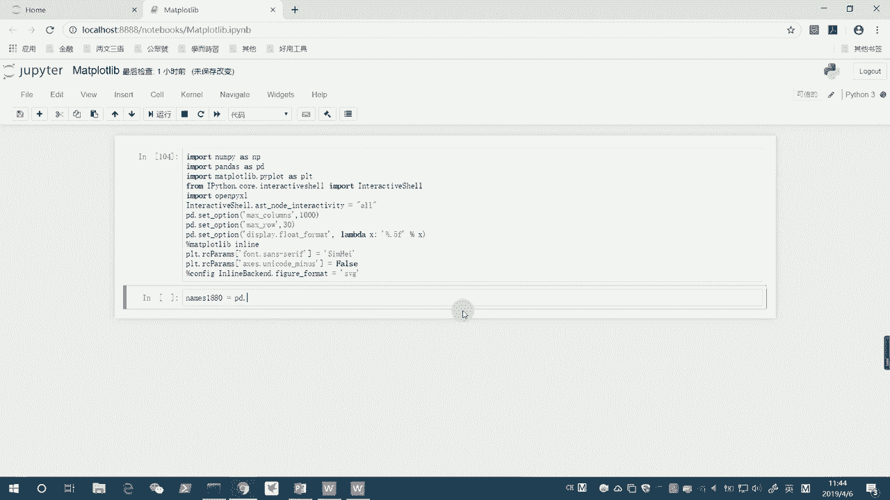

所以呢大家在过这个学习的过程中呢，多去读这个P都是用pd来读文件。

我们发现呢这个是一个原始的数据，它包含了什么呢，包含了name sex和birth，也就是它包含了这个姓名，还有性别，还有我们的出生的这个数量，这小孩的出生的数量，那么这些都是小孩的姓名和性别。

还有出生数量，那么现在呢我们就想看一下1880年啊，出生的那些小孩啊，我们通过性别，比如我们通过性别来给它做一个分组，group by性别，然后birth点上我们想group性别。

然后我们选取其中的这个出生，然后进行一个sum，那么得到的结果呢，就是1880年出生的孩子呢，有女性呢有9900万多，然后男性呢呃男性男性有1万11万多，女性有9万多，那么大家都注意了。

我们来看一下这个数据，它的一个原始情况是什么样的，给大家看一眼，那么baby names呢，里面有1880年到2010年的数据，那么我们可以看下有这么额接近一呃，接近100多年间的数据啊。

100多年间的数据，这么100多年间的数据呢，我们如果说要一个一个去这样进行计算，算他每年生的小孩的数量呢是非常的麻烦的，所以呢我们可以用一个循环，把这些数据给导入啊，我们来看一下怎么用循环导入。

这是一个完整的数据分析的过程啊，啊刘老师在这里展示给大家看一下，那么yes等于range，1880~2011，那么我们可以把它这个分成一个几个部分，pieces等于这个columns。

等于name的sex，然后还有就是birth，那么我们可以把这个呃数据给它先导出来啊，以后呢我们可以设定一个循环，循环的话呢是yes，这个呢就是从1880年循环到2011年。

因为我们看一下它这个数据库的一个命名呢，我们下载下来命名它是非常有趣的，那么这个呢是刘老师找到一个例子，他这个下载下来呢是非常有趣的，都是YOB啊，然后以这个年份结尾，所以呢。

我们就可以根据年份来进行一个批量的提取，Four year been years，然后pass equals，我们把这个路径给他先做出来，贝塔的baby names的这个YOB，我们看下这个文件啊。

怎么写啊，百分D点TXT，然后呢百分页额这个的含义是什么呢，就是说我们在这个里面呢，这个百分D呢相当于我们以前的这个，就很像我们以前给他留个大括号那种感觉，然后在后面用点format方法。

这里我们也可以用大括号点format的方法，然后这里的话呢我们用一个百分D啊，百分D预留出来了，然后最后呢百分页呢就用这个页呢，去把这里面这个百分D给他替换掉。

跑frame呢会等于PD点read csv啊，把我们那个照抄pass这个路径，然后names等于我们上面定义的columns，然后下面的话呢，啊这个names等于我们定义的collapse。

下面的话呢frame的话，frame的year的话呢就会等于我们这里的year，我们新每一次读取一个frame，我们都新定义一个frame，那么这里的pieces呢，我们把它append成一个这个列表。

我们把这个pieces append成一个列表，就pieces本来就是一个列表，然后我在这个pieces里面呢，我每次呢都把这个frame，这个呃我们读出来的frame。

这个data frame呢给他放进去，每次都把这个读出来的data frame给它放进去，那么最后呢我们可以把这个names等于pd点content，我们把它合并，把它合并，Pieces。

把他们给拼接起来，然后ignore index，因为我们每一个都有index嘛，我们把这个后面的index都给他ignore掉，我们运行一下啊，这个地方他说我们有个啊打了两个点，删掉一个运行一下。

那么这个的话呢运行完以后呢，我们就可以得到了所有的这个baby的names，那么这里呢一共有个十百千万10万百万，160多万个小额这个名字的一个，它对应的这个出生的一个次数，那么在这个100多年间啊。

160多万行，你可以看一下这个baby names点info，看他的一个情况啊，有51。6兆啊，这个数据非常的大，那么我们接下来呢就看一下不同人不同性别啊，他的每一年的出生的人口的情况，然后呢。

我们可以定义一个叫做total birth的这个变量，我们根据我们之前的names这个哦data frame呢，我们就用一个pio table来数据透视表，我们来把它看一下。

我们希望它的数据的那个值呢是BS，所以我们把birth写前面，然后index呢，我们希望它竖着的那个索引的index呢是year是年份，希望他纵向的这个columns呢是性别。

然后呢我们加总的一个方法呢，希望呢它是SAM这个方法啊，我们可以运行一下，看一下这个total birth啊，什么情况，B i r t h birth，啊难道有问题吗，那我们先看下names这个哦。

我们看一下BIRH哦，这是因为我们在上面输入的时候，这里少了一个T啊，好我们再运行一遍，这里少了个T啊，刚刚那么我们现在在运行一下，应该就OK了，好现在已经运行了，应该OK了。

那我们现在这个total bus呢，就已经把它做成了数据透视表，运行一下这个数据透视表，我们发现纵轴呢是yr，横轴呢是这个female和male，那我们可以直接对它进行画图点plot。

然后给他一个title，title呢，就是这个啊，根据这个性别和年份划分的出生人口，我们就把一个50道数据呢，他第一步的这个数据简单的分析呢，给它画了出来，简单分析给他画了出来。

那么接着的话呢我们可以额去计算一下什么呢，我们可以去，我们就非常想去啊，分析一下他的这个，额做一列这个人口的一个出生比例啊，我们非常想去说计算一下，每组性别和年份的分类下啊。

他这个最最多的那个1000个名字啊，他的一个占比，那么我们怎么去做这件事情呢，那么这里呢我们就会想我们去额增加一个group，我们去增加一个group是什么呢，是他的一个这个呃性。

这个每一每一个性别的一个占比，比如说我们就定义一个新的一个函数，就是定义一个我们这个新的函数，这个函数呢是对我们分组以后的group操作的，它的含义呢，就是说我们新建了一个叫做prop的一个group。

这group呢它会等于我们原来的那个每一个group的，一个出生的情况，出生的情况除以我们的group的一个出生的情况，的横向的求和，横向的求和，那么我们看一下这里的话呢。

我们返回的呢也是这个group，那么我们对这个names names点group by，我们把它用group by year和sex，把年份和性别进行这个分组，根据年份和性别进行分组，然后点apply。

我们这个ADD prop方法，然后我们可以运行一下，看一下我们这个names，but her的name，Birth is not defined，啊这里我们没有给他打引号运行一下。

现在就OKAMES的话呢，就是这个情况，这prop呢就是这个这个birth呢，这个占当年的这个，所有的这个出生的小孩的一个比例，那么我们现在呢就想啊，我们要去找这个美每组性别和年份分类下的。

这个最高的1000个数据集，那么我们怎么做呢，我们先可以假设一个pieces来装这些系，这些数据集啊，我们对于耶尔和group in names最上面的names，group by这个。

由这个年份和性别分组的一个数据，我们可以借它进行一个循环啊，然后pieces点append group，点short values，我们可以对这个呃先进行一个排序嘛，然后我们取最前面的那些数据。

最前面的那个1000个数据，As sending，我们进行降序排列，Equals false，然后注意了，这里的话呢我们取这个前1000个，然后把它给append到我们这个pieces这个里面来。

取钱1000个啊，看到pieces里面来，然后我们可以看一下top，1000的话呢，就会等于我们这个pd点contact，把这个pieces给他CCTE起来，Ignore，我们的index等于true。

变形一下，那么这个时候呢我们这个top签呢，就是我们这个每一年啊，每一年他最前面的这个比例，最大的那个1000个人，我们给他全部拼接在了一起啊，又做成一个新的data frame。

我们可以看一下这个操作的过实践过程，首先这个操作把对象集中在了names点，Group by，就是我们根据年份和性别分组以后的，这个每个组，每个组里面呢既有年，既有年份，又有这个组别。

所以我们就把他们年份和组呢分一起，进行循环好，这是一个循环体，可以把它当做一个循环体，那么我们循环的过程中呢，我们选取了这个组，每一个组啊，我们对它进行一个排序，根据这个出生人数排序。

每个组排序是不是就排序出的，就是这些最高的这些名字，这个出生名次最高的这个出生率，出生数量的一个名字啊，每个组啊，然后呢选这个组里面的前1000个人，那么自然就是我们这个出生率呃，这个出生占比啊。

这个姓名占比最高的这一批人就最高，这1000个人，我们给他这样子操作一下以后呢，我们把这个top1000呢，把他们所有的每一年的这个pieces呢，都给它合并起来，那么就是我们这个top1000了。

那么我们还可以分析一下什么呢，我们在这里呢就分析一下这个姓名，他的一个趋势，我们想分析一个姓名的什么趋势呢，就是说啊我们想看一下，是不是说这个姓名他的一个多样化呢，是在提升的，那我们可以怎么做呢。

我们可以做一个表table，等于top1000啊，我们用一个数据透视表，Pio table，我们希望看这个比例，Prot，然后呢index呢会等于year，然后columns呢会等于我们的这个性别。

然后我们这个加总的方式呢是sub，我们希望这样去做一下，我们运行一下啊，看一下这个table table的话呢，就是这个样子，只是在1880年的时候呢，我们这个呃是female和male呢。

大概是这样一个情况啊，然后我们看一直往后就说1880年的时候，前1000名的这个额最高的，1000名的这个女性的名字呢，加总起来，她的比例加总起来是一，说明前1000名就包括所有女性。

而在1883年开始，这个比例开始下降了，大家发现也就前1000名的这个啊女性的占比呢，他这个名字呢，出生名字的这个人数的占比呢是在逐步下降的，那我们把这个图画出来啊，paper点plot。

最后我们把这个图画完啊，这是我们最后一个图，TTTITLE呢我们就是这个前1000名男性女性，名字分别的，占比这个我们title的，然后我们的这个YTX和XTX呢，我们都不先不管它。

我们直接把它运行一下，我们就发现了这个female和male呢，他们都是额这个前1000名的占比，是下降非常快的，尤其是女生下降的更快，这很有可能是因为什么呢，是因为我们的女性呢更追求这个呃各差异化。

尤其是在这这个近些年啊，在这个新时代，那么女性呢可能更追求这个差异化，而男性的名字呢下降的稍微慢一点啊，她这个前1000名在所有人里面的占比，就是个最最大的，这个每年出生最多的这1000个名字的人数。

占比在下降，好的，那么我们今天的话呢，这个macro live呢我们就讲到这里，大家有任何疑问的话呢，欢迎呢与我们这个课程相关人员进行交流沟通，然后也欢迎，也也希望大家呢在课后呢多去阅读。

这个MATPLOLIVE的一个官方文档，它是有一个中文文档的，大家可以去阅读一下，即就是即使不喜欢阅读英文的同学呢，也可以看这个中文文档里，每个例子都有，那么刘老师今天上课呢是抛砖引玉啊，抛砖引玉。

那么希望大家呢能够呃学习Python的过程中呢，呃听了咱们这个咱们这个课以后呢，学习Python的过程中呢会更加的顺利，以及呢可以在真正的做到干中学，就是你用什么学什么，学什么会什么。

那么这是我们的一个最终的一个目标，那么感谢大家的参与。

