# 14天拿下Python金融量化，股票分析、数据清洗，可视化 - P15：03 典型爬虫程序的实现（二） - 川哥puls - BV1zkSgYZE54

今天呢我们来学习一下爬虫程序的实现，第二部分，那我们这一部分呢同样也分为三个小的部分，那第一部分呢，我们还是会为了来为大家介绍Python中的一个模块，这个模块呢它叫beautiful soup。

第二部分呢我们会为大家来介绍一下，爬虫如何处理分页，那分页呢想必大家都很清楚，我们在获取数据的时候啊，有的时候呢这个数据在网页中一页是放不完的，那我们可能会分好几页去放它。

那我们这部分呢就是为大家来讲解一下，如何去让爬虫进入到下一页来获取数据，第三部分呢我们会为大家来介绍两个算法思想，那一个呢叫深度优先，一个呢叫广度优先，那好我们现在呢来进入到我们第一小块的学习。

Beautiful soup，beautiful soup它呢是Python中的一个模块，那我们先来看一下这个模块，它到底是干什么用的，比如说for soup，是一个可以从HTML或者说XML文件中呢。

去提取数据的一个Python库，那这个库的安装呢呃非常简单，和Python中其他库的安装呢是一样的，我们可以在DOS命令下呢，直接使用pip store来进行一个安装，那在安装完成后呢。

调用了我们也是像其他的库一样，使用from bs4import beautiful soup来进行一个调用，嗯那我们刚才有说beautiful soup呢，它是从HTML或者说XML文件中呢去提取数据。

哎那说到提取数据呢，我们来回忆一下，我们上一节课呢要给大家介绍到Python中，一个提取数据的工具，对就是正则表达式，那正则表达式的功能呢是非常强大的，那既然我们有了强大的正则表达式。

为什么我们还要来使用beautiful soup呢，让大家来想一下，我们上一节课有写过的正则表达式，那这个正则表达式呢，它由啊一大串的字符和符号组成，但有的时候呢会写的非常的长，非常的难。

我们一眼呢可能根本就看不懂这个正则表达式，它想要表达一个什么样的意思，而且我们在写正则表达式的时候啊，一旦这个正则表达式写的太长，而且它中间某个点出了一点问题，那么我们所匹配到的数据呢。

则和我们想要的数据，那基本上一点关系就没有了，我们得到的数据呢就会是完全错误的数据，这呢对我们是非常不友好的，那我们再来看我们的beautiful soup，我们的beautiful soup呢。

它呀相比于我们的正则表达式是非常简单的，对我们企程序员来说呢是非常友好的，而且使用起来也很方便，那他究竟方便到什么样的程度呢，我们来通过一个小小的例子来给大家演示一下，那大家就会清楚。

那beautiful soup呢它相比于正则表达式，那真的是太简单了。

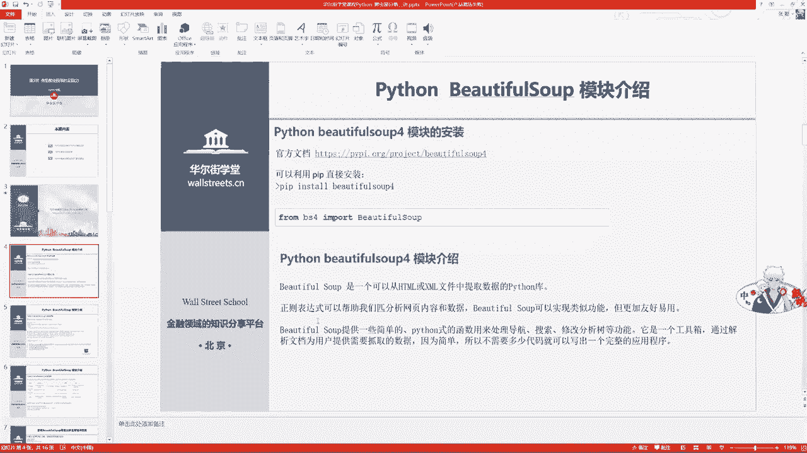

那我们现在呢来打开我们的jupiter notebook，那这里呢来有一串代码，我们先来解析一下这个代码呢，它是一个什么样的意思，首先呢我们导入了request，那我们在前面的课程呢。

也给大家介绍过request模块的一个使用额，那这里呢我们定义了一个headers呃，定义了user agent的字段，那下面我们看我们定义了一个URL，我们先来打开这个URL来看一下。

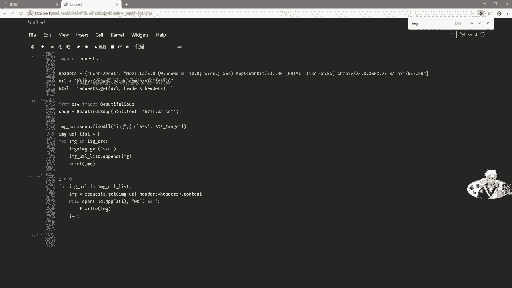

诶这还是我们的百度贴吧，然后同样的是我是我们啊，上一节课呢有爬过的一个呃相似的网址。

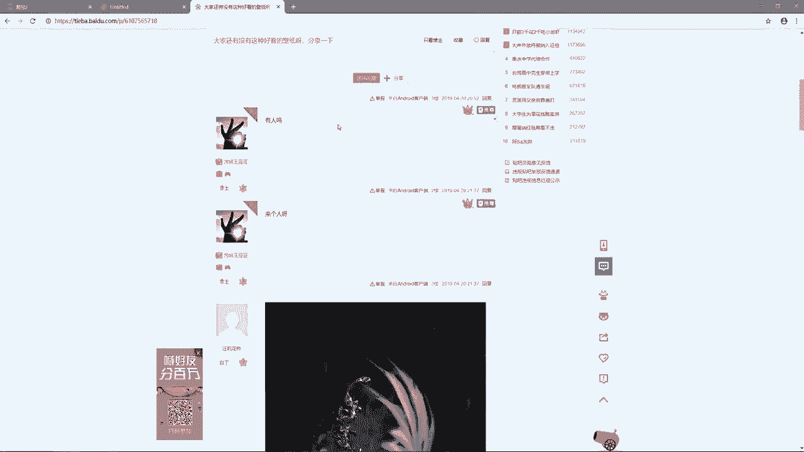

嗯但是我们上一节课啊，这里并没有加这个headers呃，然后我们同样可以实现这个爬取，额不过呢为了让大家呢建立一个好的习惯呢，我们最好啊在写爬虫程序的时候，都要加上这个headers。

虽然啊网站呢它不一定都会对这个headers字段，进行一个反扒，但是呢作为反扒的最基础的一个手段，那headers as字段呢，基本上呃我们以后呢会获取网站的一个反扒手，段中都会存在这么一个反扒。

所以说呢大家要养成一个良好的习惯，我们在写爬虫的时候啊，最好就把我们的headers字段给加上，那下面呢我们还是用request中的get方法，去请求我们这个URL，那么我们来运行一下。

并且我们来打印一下我们请求到的东西，我们打印出来一个200，那就证明我们已经请求成功了，那我们呢来打印一下我们请求到的内容，那这里呢也我们也已经获取到了响应。

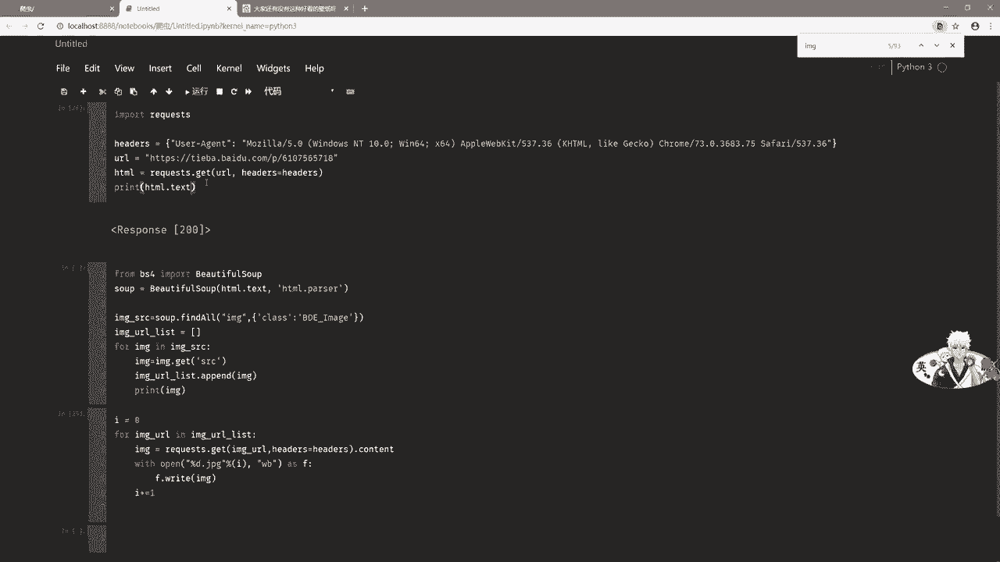

并且呢我们把响应内容呢已经打印了出来，那我们在获取呢这个请求以后呢，获取到响应以后呢，我们该干什么呢，而大家先回忆一下，我们上一节课呢讲的爬虫的四个步骤，那大家还记得吗，我们来一起看一下。

那爬虫的四个步骤呢，首先呢发起请求，获取响应内容，那我们这里呢其实已经获取到了响应内容，已经完成了前两步，那我们后面呢还有解析内容和保存数据，对啊，下面呢我们开始来解析内容，上一节课呀。

我们爬取这个图片呢，解析的时候呢，我们用的是正则表达式，那这里呢我们现在来用beautiful soup来实现一下，那这里呢是已经写好了beautiful sub代码，大家先不用管它是什么意思。

这个一会儿我们会具体的来讲，大家先来看一下它的写法，首先呢我们定义了这么一个对象，然后我们用这个对象中的方法呢，去获取我们标签的内容，然后呢我们把内容进行一个存储，存到我们这里定义的列表当中。

来我们来打印一下这个内容，让大家看一下我们的这个内容究竟是什么，哎大家看这里的东西，大家有没有一丝眼耳熟眼熟呢，嗯对我们呃上一节课其实在爬取的时候呢，我们所获得到的图片链接呢，它其实都是这个形式。

嗯我们来看一下，那这里呢就是图片的一个URL，我们来编辑一下，把它取出来。

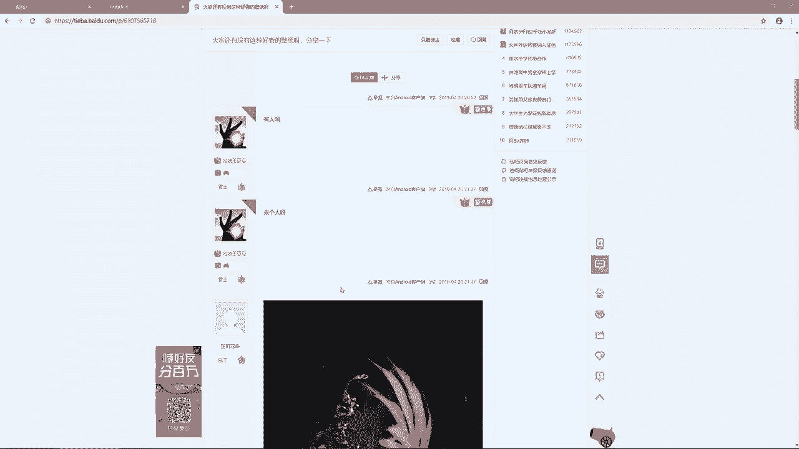

我们嗯贴到这里来，大家来看一下，这里呢是14诶，大家看它和我们这里获取到的第一个呃，图片的链接呢，它其实是一模一样的，那它呢其实就是那个图片的链接，那现在啊我们已经轻松的获取到了这些链接。

那我们获取到的链接链接呢，呃大家可以看，我们根本就没有去过多的查看网页的源代码对，因为我们这里呢也没有写什么复杂的提取式，那我们想我们上一节课，使用正则表达式去爬取的时候，我我们是不是呃。

对着那些字符进行了一些分析啊，并且使用各种各样的符号加字符，去想办法把它匹配出来呢，但是这里我们根本就没有进行这些工作啊，我们只是调用了一个简简单单的方法，就把它给取了出来。

那现在呢我们已经获取到了这些链接，接下来我们去访问，并且来进行一个保存，那这里呢我们同样是使用一个for循环，将我们刚才啊已经获取到的链接，存储到这个字典，现在我们把这个字典来进行一个便利。

那我们便利出来的每一个链接呢，我们在使用request中的get方法去进行一个访问，那这里呢大家看我们在后面呢使用了点content，那大家还记得呃，我们上一节课有提到过这个属性，大家还记得什么意思吗。

对它呢其实就是二进制的意思，那我们再来回忆一下，哎大家来看这里，我们说啊我们获取到的数据呢，它有很多的类型，比如说HTML或者JSON字符串。

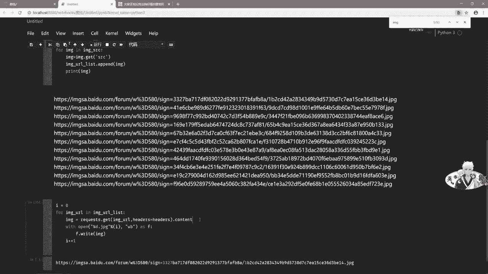

那我们的像我们的图片，视频，音频等文件呢，它其实都是以二进制数据来传输的，所以啊我们在这里使用了点content，那下面呢呃我们用了位置方法来open一个文件。

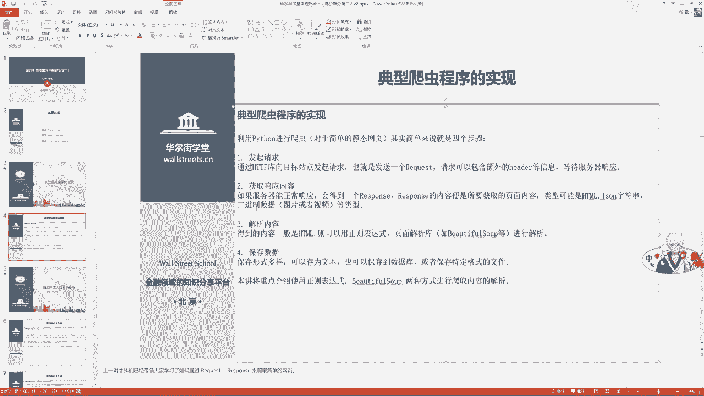

我们同样使用了二进制的形式来打开这个文件，那这里为文件取名呢，呃我们只是用了一个简单的数字啊，比如说一点JPG或者二点JPG来保存这个文件，那我们现在呢就把爬取到的这么一个，二进制的内容啊。

写入到我们文件中，我们来运行一下，看一下效果，诶好我们运行完了，我们来看一下，那这里呢大家看我们获取到了九张图片，我们先来看一下这个图片呢，它是不是我们想要的图片，诶大家看这里已经获取到了这张图片。

我们看一下没错，这呢它就是我们想要获取的图片，我们再来看下面啊。

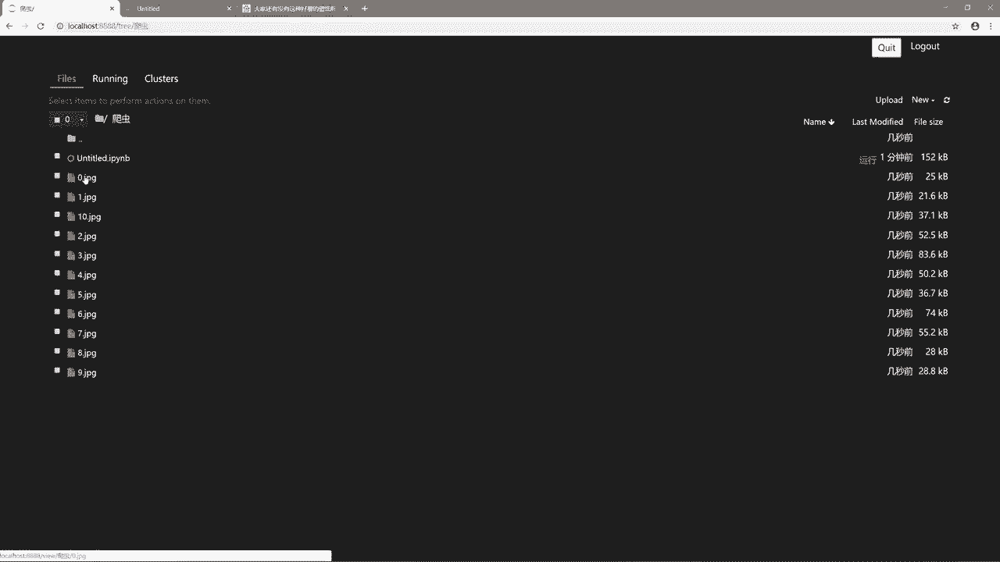

还有这么多，我们来看验证一下，我们打开最后一张诶，好像是我们要的图皮，这张哎这张也是我们刚才有翻到过的图片，那这样呢我们就已经完成了整个爬虫的编码，知道了beautiful速度的强大之处。

那接下来呢我们正式开始学习我们的beautiful soup。

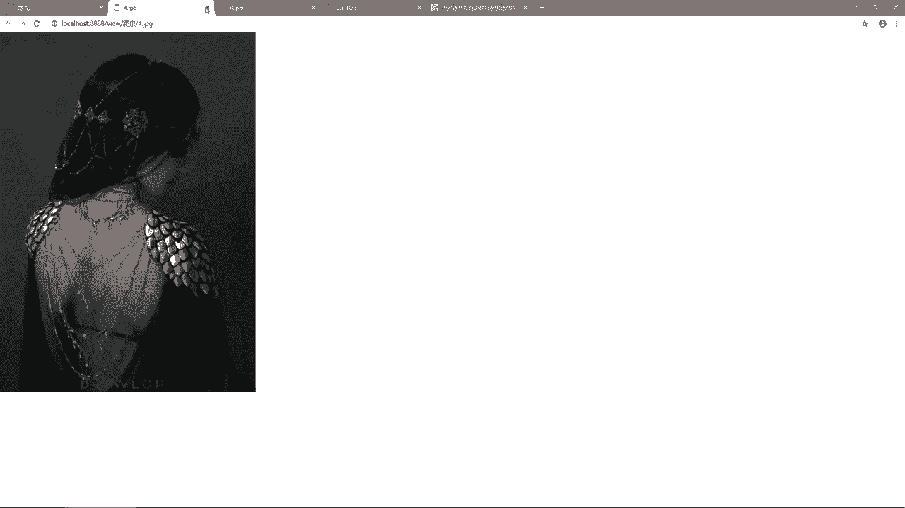

这个模块，那beautiful soup呢它提供了一些简单的Python函数，用来帮助我们提取呃。

抓取我们想要的数据，那我们呢就可以把beautiful soup呢理解成一个工具箱，它的作用呢就是像刚才一样，通过了一些标签，或者说呃HTML里的一些其他内容，帮我们直接去抓起到我们想要的东西。

而不是像正则表达式那样，把这些把内容呢转化成文本去进行一个匹配啊，他们这个这点呢是有些不同的，那我们利用beautiful soup这个工具箱呢就可以呃，不需要写多少代码。

便可以完整的做出来一个呃爬虫应用程序啊，就像我们刚才的这个程序一样，它的代码还是很少的，而且非常简单啊，都是for循环，那接下来呢我们来看一下，比如说soup它具体为我们提供了哪些方法。

那这里呢我们提供了一段HTML代码，就是我们呢平常所看到的网页的源代码，那接下来我们就用这些源代码来展示一下，Beautiful soup，它的一些功能。

我们还是回到我们的jupiter notebook，还有啊这里呢我们的代码呢已经放在这里了，那首先呢我们还是导入beautiful soup，然后我们定义这个HTML代码。

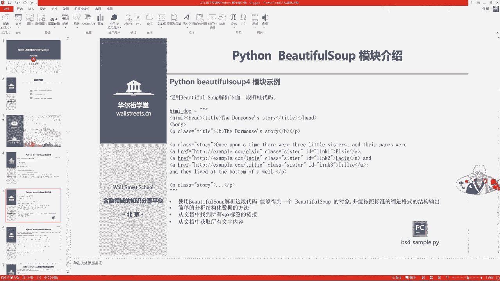

那这里诶大家看到这里是不是有些眼熟呢，他呢啊我们上面呢在这里啊，刚才已经见过一次了，那它是什么意思呢，首先啊呃在这里呢我们创建了一个beautiful soup对象，然后呢。

我们将我们要解析的HTML代码呢，传入这个对象当中，那接下来我们呢就会去调用，比如for shop中的第一个方法create file，那这个方法它是什么意思呢，我们来运行一下，先看一下效果。

哎大家看我们这里的代码呀，它是没有任何缩进和层次感的，完完全全的都挤在了一起，而这里的代码呢看它层次分明，对每一个标签呢都会有一个缩进，看起来呢就会非常的美观诶，那可能就有的同学想。

他是不是只是在这里加了个缩进呀，或者说呃因为原本看起来呢也不是很混乱，那我们来修改一下，让这个东西呢更混乱一些，我们看他会不会去帮我们再整理，我看到这里呢已经非常的乱了，我们再来运行一下。

哎大家看我们的效果呢是没有变的，所以啊这个方法它的作用呢，就是帮我们把HTML代码呢让它更规范，更整洁的去输出啊，他的作呃，就是简单的来说，就是自动的去帮我们整理这个代码咳。

对大家看起来看这样是不是非常的美观呢，而且看起来比较明显嗯，A标签呢就是A标签，它不像我们这样就错综复杂的交织在一起，很难看出来某一个标签在哪里结束，还要一个一个去找，那下面呢我们再来看第二个方法。

Soup，点点大点title，我们来运行一下，诶，他出了这么一个东西，那这个东西呢大家看着有没有一点眼熟呢，我们先来往上翻一下，翻回我们的这个整理过的代码，大家看这里。

我们就是我们刚才所打印出来的东西好，大家看他的title，这个title方法呢它其实就对应了这个标签，那我们的这个方法，它的作用呢，就是将这个标签和它的内容打印出来，那这个标签它的作用是什么呢。

大家来看，那我们这个jupiter notebook呀，它本身呢就是一个呃网页版的编辑器，而这里呢就是他的title，而这个title呢它在HTML里的作用啊，就是显示在这里的东西，Title。

好那我们再看下一个方法，诶，开头点name，那这个方法它在上面，他在我们上面这个title后面又加了一个点name，那它是什么作用呢，我们来运行一下title，这里呢就直接打印出来了一个title。

这是什么意思呢，他和这里是一模一样的，额name呢其实在我们的HTML代码里呀，每一个标签呢它都有一个属性叫做name对，就好像我们为这个标签起了一个别名一样，它的作用呢就是打印出来这个别名。

那我们的title呢这里是没有，我们看我们的title是没有加任何东西的，所以说他直接就打印出了这个title，我们来看下一个，下一个呢和上一个看起来好像也很相似，只是他把name呢换成了string。

那它打印出来会是什么样的效果呢，哎这里他没有打印title，而是打印了title的这个值，那我们的string呢，它其实就是把我们title标签中的这个字符串内容，打印出来，那我们再来看下一个他啊。

这个方法呢又变长了parent，点name哎，那大家看这里的parent是不是能联想到什么呢，我们来运行一下，它打印出了head，我们来看这个源代码，我们看这里是title，而黑的呢是他的上一级。

那联想parent这个词的意思啊，其实也就不难明白了，那它呢其实就是打印出当前标签的，无标签的的name属性，对parent它指的就是副标签，我们继续向下看A点P，那这个点P它又能代表什么。

我们先来看源代码来猜一下，哎，我们看这里有个P标签，那我们联想到刚才我们有说title，结果就打印出了这个title标签，那现在我们说P标签，那我们会不会打印这个P标签呢。

但是呢我们来看好像我们刚才在打印了呢，title标签的时候呢，整段代码只有一个title，而这里有好多P标签，它会打印哪一个呢，还是说全都打印呢，我们来运行一下，看一下效果，哎。

他打印了是class等于title这个标签，我们来翻译一下class等于title的P标签，哎我们找到了，那他果然打，他只打印出了第一个P标签，那我们的点P方法，它其实就是打印出呢。

当前代码中的第一个P标签的内容，那看到这里可能会有同学联想到哎，我这里还有A标签，那我是不是还有点A方法呢，还有点body点HTML方法呢，啊其实并不是的啊，并不是所有的标签都会有方法的。

那我们继续向下看super点P诶，这里他又加了一个类似于列表取值的，类似于呃字典取值的这么一个哦，长得很像的东西，就他这里的class class，哎我们来看我们上次打印P标签的时候时候。

这个P标签里有一个属性就叫class，那它们会不会有什么关系呢，我们来运行一下，哎他们果然有关系，那我们这里呀就把P标签中，class对应的这个东西打印了出来。

那这里的话是不是大家觉得beautiful soup呢，他真的是非常的简单，而且他的这些方法呀看起来十分的简洁明了，呃如果大家有学过HTML这门语言的话，那基本上我们可以不用看文档。

只需要猜测这些方法就能猜出来他是什么意思，那我们向下看A标签，那这里呢大家应该都明白了吧，啊我们刚才有过P标签呢，也有过title标签，那恰好这段代码里呢它还有A标签，所以啊我们这里的A呢。

就是打印我们A标签的内容，并且是打印的第一个，我们来看是不是这里的A标签呢是class sister，我们来看哎这里他在这里，那上面还有吗，哎没有了，下面呢下面下面还有诶，下面还有两个class。

等于C4，我们再来比对其他的内容，哎这里呢是啊，对他的link，对link1，这里是link2link3嗯，他果然还是打印的第一个，那所以啊我们在beautiful soup中呢，再遇到这种以一个标签。

来作为一个标签的嗯，这种属性它打印出来的呀，都是我们当前这个代码中，这个标签所对应的第一条内容，好那我们来再往下面看一个，这里呢大家看好像没有这个标签，Find all。

那HTML中呢它是没有find到all这个标签的，那我们来看这个方法是什么作用，大家不妨先猜测一下，再来运行，那这里呢我们来直接运行，看一下效果。

这里运行出来的是A等于class sister a a标签，那这里的A可能就代表了这个A标签，对吗，没错啊，我们的final2呢，他找的就是我们传入参数这个标签的内容，那我们这里呢是A。

所以说呢我们后面大家看都是A3个A，哎我们刚才啊这个A是取到了第一条，但是呢我们用final2呢取到了所有，并且呢他把这个所有的内容呢，以一个列表的形式返回给了我们，我们看这里有三条数据。

那我们刚才呢这里呢也是三条数据，那这样大家应该已经明白，这个翻到它的作用了吧，他呢就是找到我们传入标签的所有内容，我们来看下面哎下面这里是F子，它不是FAL，那大家想这有什么区别呢，对他少了个or。

那它可能不是打印所有的了，那他会打印什么呢，我们来运行一下，那大家看这里有一个id等于link3，我们往上翻，我们来看这里啊，所有内容中的id等于link3的，只有这一条，那我们看呢哎他就是这一条。

所以啊我们的fans呢，他有点类似于我们这个后面，直接点一个标签的这种形式，它只找一个，只不过呢我们传入的内容啊，不只是我们的标签，还可以像额我们标签中的一个属性，这里呢就是我们的id等于三。

我们来看最后一个最后一个啊，首先我们是哎用翻刀找到A标签的所有内容，这里呢我们已经打印过了，就是这三条内容，然后呢我们用for循环去遍历这三条内容，便利出来以后呢，我们调用这个内容中的get方法。

A h r e f，大家来看这里，HREFHREF呃，它呢在我们的HTML语言里啊，它代表的是一个链接啊，我们的A标签呢它本身代表了一个呃超链接，而HLEF，它的属性呢便是这个超链接所列项的URL。

所以这个属性啊在我们后续爬虫中呢，我们还会经常用到，然后呢嗯我们get到这个值以后呢，我们使用我们这里又写了一句嗯，super点get text，哎get a text，它是什么意思呢。

对从字面意思而言获得文本，那我们来运行一下，看看这几句是什么样的效果，首先啊我们看我们这里打印了这么一些东西，这个东西呢它就是URL额，那我们来看一下我们刚才所，他在我们刚才呢所获得的A标签中的呃位置。

它在哪里，那大家看看是不是在这里呢，那所以说呢我们的get方法，它的作用那也很明显了，它就是获取我们当中某一个属性对应的值，这里呢我们把它用来提取这个URL，那我们再来看这个get text，大家看哎。

这里它打印出来了一些东西，那我们翻回去，我们来看一下，哎大家来看这里，一句两句，三句，都在看，是不是就是我们刚才呢所标记的那些文本，那这个东西呢就像它的字面意思一样。

就是去获取我们这个文档中的所有的文本内容，for shop的一些啊，基本的方法的使用，那我们这些方法的使用啊，我们大家来看，我们呢都是在这段HTML文档里面进行使用的。

那我们的beautiful soup它只支持HTML文档吗，啊那其实并不是的，那比如for soup模块呢，它除了支持我们Python的标准的HTML库，把模文档以外呢，它还支持一些呃其他的文档解析。

比如说嗯像我们的XML和LXML等。

以及我们的HTML5lab等，他都支持，那大家来想一下，我们之前呢也介绍过，我们的额正则表达式re模块，那现在呢我们的beautiful beautiful soup模块，它既支持了啊这么多呃。

不同的不同形式的文档解析，那它的用法呢还那么简单，那我们为什么还要学正则表达式呢，啊我们完为什么不舍弃正则表达式，只用我们的beautiful soup呢，那其实呢我们的正则表达式啊。

它相比于我们的beautiful soup，它有许多额用for soup不能替代的优点，那就比如说啊我们的正则表达式呢，它不仅仅可以用于我们的爬虫呃，只要呢大家是对一个文档进行文本匹配。

或者说啊在我们的一段复杂的文本中呢，去抽取我们想要的数据，那么我们都可以用我们的正则表达式来完成我，而我们的beautiful soup呢，呃它的局限性呢，相对于我们的呃正则表达式而言呢就比较大了。

那除此之外啊，我们的正则表达式，它在运行速度上也比我们的beautiful soup要快很多，那这呢是我们正则表达式的优点，也是我们之所以学它的原因，那我们来看呃，比如说soup呢他怎么样去调整。

就是我们去匹配的这个呃文档的形式，那我们刚才呢都是在匹配HTML，那我们现在换了，我们想匹配XML，或者说啊其他的一些形式，我们还是先来看一下我们刚才写过的代码，那大家来看啊。

我们这一句啊啊我们在这里写了一个这个，那如果呀我们想要替换，就是说如果我们解析的文档呢是LXML，或者说HTML5lab之类的，我们呢就可以把这里换成我们想要解析的类型。

那么它呢就会去识别到我们呢想要解析的类型，这样呢我们就可以进行一个额，不同类型文档的匹配了，那这里呢啊我们的beautiful soup呢，就给大家介绍完毕了。

那接下来啊我们在使用我们的beautiful soup，来实现一个小小的实验，那这个实验呢就是去爬取我们豆瓣上面，红海行动的这个他的一个短评数据，那我们还是来打开我们的jupyter notebook。

那这里呢啊就是我们爬取这个短平的代码，那大家可以看这个代码啊，除去导包啊，然后我们一些定义的字段以外呢，它的代码量是非常少的。

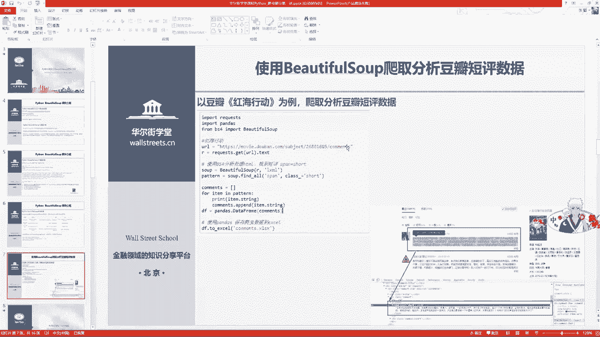

那这呢也都要归功于我们的beautiful soup，和我们的request模块，那我们还是先来看一下这个网网址，那么这呢就是我们的此次要爬取的URL嗯，我们先来简单的看一下啊。

他的HTML代码长什么样子。

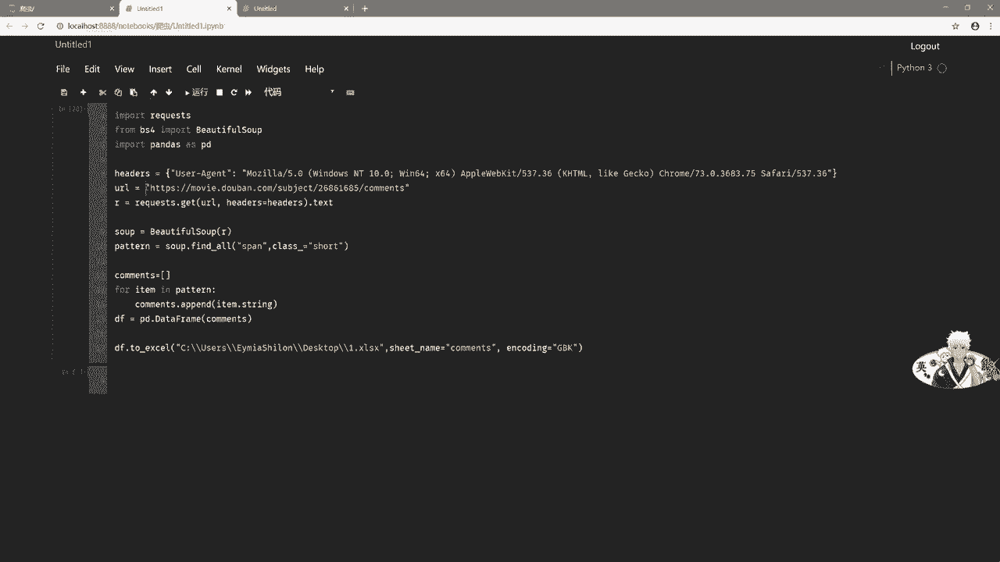

那这些呢短评呢都是我们需要爬取的，我们来看哎，他呢全都在这个span标签里面，我们打开打开这个标签，那我们大家看是不是都一样呢，对没错，我们的所有的短评呢都在这个标签里面。

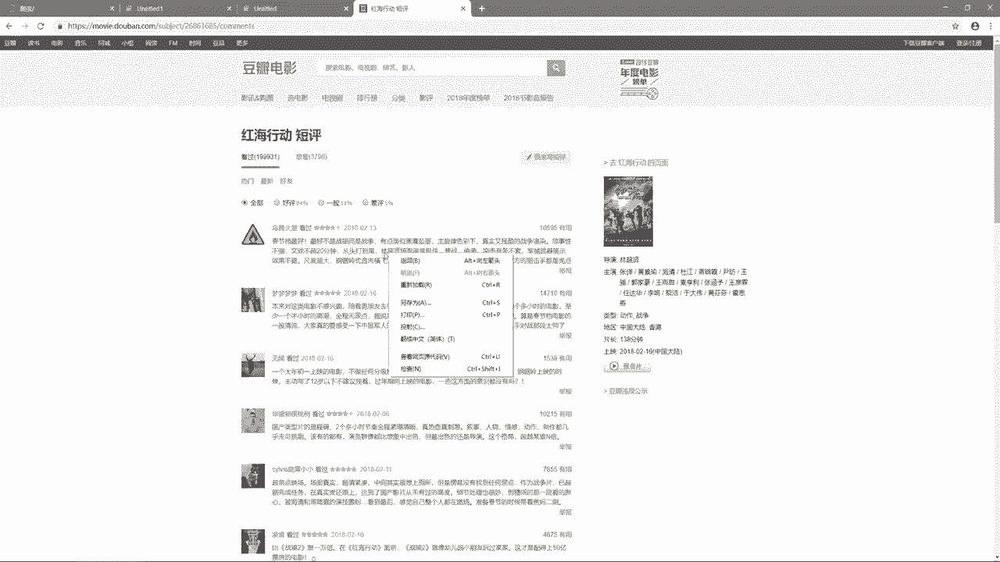

而且这个标签啊他还有一个class的属性跟short，那我们可以看到啊，他的这个额数据呢就已经非常的明显了，那我们还是回到我们的代码，我们来实践一下，首先呢我们还是进行一个库的导入。

那这里大家看我们又导入了pandas as，那大家还记得pandas as的作用吗，对我们之前呢使用pandas啊，来生成了一个excel表格，那他除了excel表格的生成和读取以外呢。

它还有非常多的数据处理方式，那这个呢大家可以去翻阅一下，pandas as的官方文档，去学习一下，这里我们这个实验啊，我们同样使用pandas来制作我们的excel表格。

那下面呢我们还是定义了我们的headers，然后定义了我们的URL，紧接着呢，我们是使用request中的get方法去访问这个URL，那这里啊已经是我们很多次来使用这个呃。

request中的get方法了，那大家应该已经呃也是非常清楚，这个方法它的使用范围是非常广，并且说呢它的使用起来啊是非常方便的，然后我们将参数呢传进去，我们的URL，还有我们的headers。

那我们接收响应的时候啊，我们这里直接把我们响应的text属性，赋值给这个变量R，然后呢下面我们就调用我们的beautiful soup对象，我们来生成一个beautiful soup对象。

并且将我们已经获得到这个响应的text属性呢，去传入我们这个beautiful soup对象中，然后呢我们来调用这个翻到方法，那大家记还记得这个翻到方法它的作用吧，对我们刚才也有讲过。

我们来再来回忆看一下，哎对在这里，那我们的翻到啊，就是将我们传入的标签呢去进行一个寻找，在整个文档里啊，寻找所有这个标签的内容，那我们这里呢传入了span标签，那大家来看我们的数据啊。

他其实都在这个span标签里面，那为了防止呢就是说这个网站中啊，可能会有其他的死span标签，比如说呢就像我们这这个豆瓣电影啊，或者说我们这些标题啊，万一他也是用span标签来标记的呢。

那我们就进一步的去细化这个匹配，那我们可以看到这里啊是有一个class等short，那我们这里呢同样去匹配这个class name short，那这样呢简简单单的一句代码。

就实现了我们的这个数据匹配的过程，那如果我们这里呢用正则表达式啊，就会可能写好多写几行代码，并且我们的这个匹配呢可能会写的非常复杂，下面呢就是我们一个呃，具体的将是我们所匹配到的数据呢。

进行一个存储的过程，首先啊我们来定义一个列表，然后呢我们将刚才啊已经匹配到了这个数据，进行一个便利对，因为大家还是来看一下我们这个final，它匹配的呢是个列表，我们用便利的方式呢。

将这个列表中的东西取出来，添加到我们这个空的列表当中，然后呢，我们再将这个已经所有数据都添加好的列表，去生成我们的啊pandas章当中的data frame数据，然后最终呢。

我们将这个数据去写入到我们的excel文件当中来，我们来运行一下，哎这里他并没有运行成功，反而报了错误，我们来看一下这个错误是什么，啊他说呢我们这个数据啊不能写入到excel当中，那为什么不能写入呢。

来我们先来看一下我们要写入的这个数据啊，它是一个什么类型，那我们用print方法和tap方法来打印一下，我们这个每一项它的一个数据类型，来我们再来看一下哎这里好像出了点问题，我们少写了一个括号。

那大家在编码的时候啊，那也要注意一下，我们在写这个括号的时候啊，最好都成对成对的写，那这样呢呃就不像我刚才一样，就会呃忘掉一边，它运行的时候呢就会报错，我们来运行一下，我们来看这里啊。

它打印出来的类型呢是我们beautiful soup中的一个哎，这个数据类型，那这个数据类型啊，它不能直接写入到我们excel文件当中，所以啊我们呢需要对这个数据类型啊，进行一次格式转换。

pandas as中啊，对我们的data frame呢，提供了一种非常快捷的数据转类型转换的方法，那我们先来把这句注掉，然后呢我们来转换一下，那这个方法呀，它叫s tab。

然后呢我们把我们想要转换的类型啊输进去，我们再来运行一下，哎这次啊已经运行完了，而且没有报错，那我们来看一下，这里啊是我们刚才生成的数据，我们打开看一下，那大家可以看到啊，我们这里呢有非常多的数据啊。

这呢大家有没有看着眼熟呢，我们回到刚才的网页，我们来看嗯。

比如说我们来这条啊，比战狼二燃1万倍，在红海行动前面啊，怎么怎么样，那诶他果然在这里。

那这样呢，我们就已经成功的爬取到这个红海行动的短平，我们再来回顾一下这些代码，让大家看看我们这个代码是不是非常的简单呢，那有同学可能会问哎，为什么只有这些数据呢，我们后夜不是还有吗。

那我们怎么没有排到呢，那这个呀，其实就是我们刚才啊在标题上说过的，一个翻页的机制，那我们这里呢并没有实现这个翻页啊，所以我们呢只爬到了这个第一页的数据。

那如何来实现这个翻页呢，不要着急，我们呢稍后就会给大家介绍到，这个实现翻页的功能，其实呢它本身是非常简单的，那我们呢现在先拿我们当前的这个小呃爬虫。

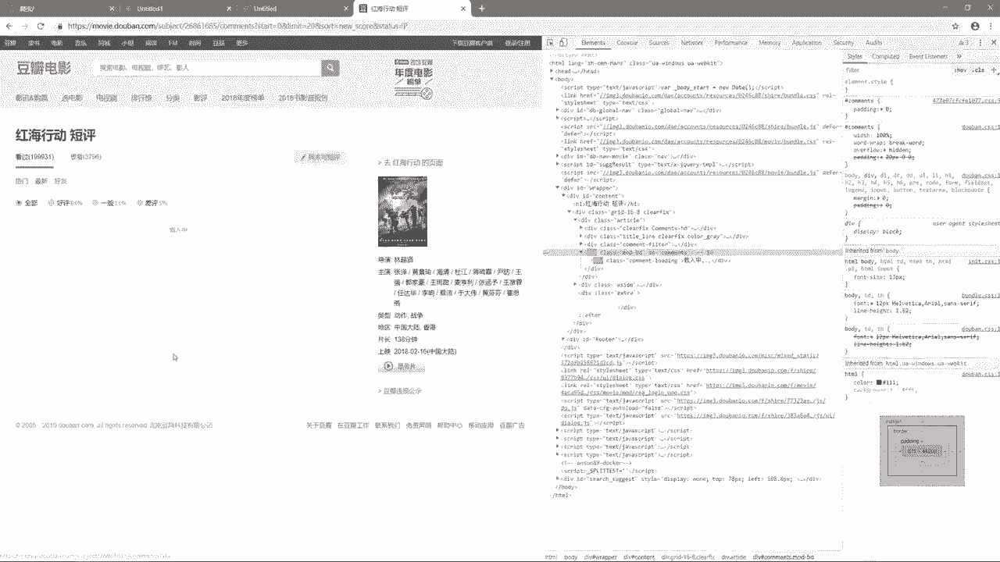

我们来先简单的看一下这个翻译程序的实现，那我们的爬虫呢已经完成了，但是这个完成的过程啊，不知道大家有没有发现一点，那就是我们的网址它发生了变化，那我们一起来看一下。

大家看我们这里的网址似乎比现在的要短一些，诶这是为什么呢，我们把这个网址呢先贴出来，我们来看一下，给大家看，这还是我们第一页的评论，那这个也是我们第一页的评论，但是呢哎大家看他后面多出来了一些东西。

那这些东西他是什么意思，那我们暂且不说，我们先来思考一下翻页这个动作，那如果啊我们是呃一个人正常去访问这个网站。

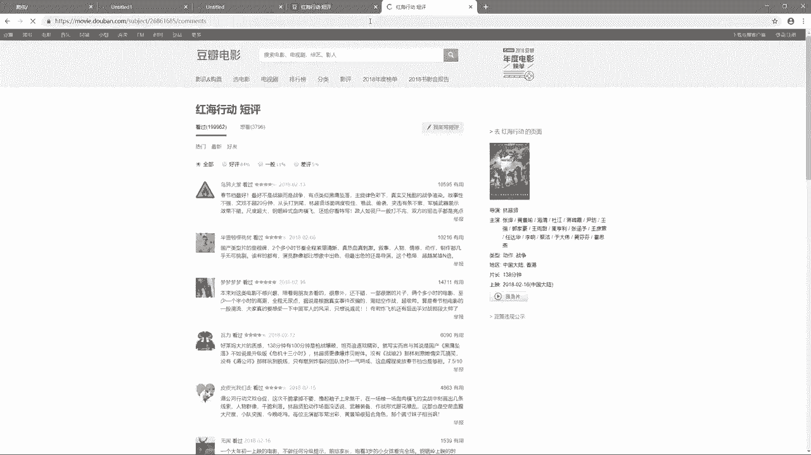

那我们翻译就很简单了对吧，我们只需要点一下下一页就好了，但是我们点击下一页的时候，它发生了什么呢，我们退回去来看一下，我们来右键检查一下这个下一页它的代码，让大家看这里有个A标签。

那A标签呢它在网页中啊就代表了一个超链接，对也就是说呢他为我们链接了一个新的地址，那大家看这个地址后面多出来的这一串，他有个问号，然后后面有一串额很长的代码，有数字，有字母。

那我看他和这个是不是很相似的，同样都是问号开始，然后start等于一个数字，然后limit又等于一个数字，诶这样看呢可能不太方便，我们先把它粘贴出来，我们放到我们的代码这里，诶大家看我们刚才这个链接呢。

它其实是这个链接的一部分，只不过呢这个后面又多了一些，那我们点击一下这个链接啊，让他跳转一下，大家看哎这个是不是很眼熟，我们刚才直接点下一页的时候啊，他直接跳过来了，那也就是说我们点击下一页。

实际上呢就是重新发了，发了一次请求，而这次请求呢就是下一页的数据。

那我们这里呢再来看额，我们已经点击过下一页了，诶我们对我们已经点击过下一页了，然后我们在这一页呢我们再来检查这个哎，他同样也是一个链接，那我们把这个已经请求到的链接呢，和这个对比一下。

让大家发现是不是后面这些似乎还是一样的。

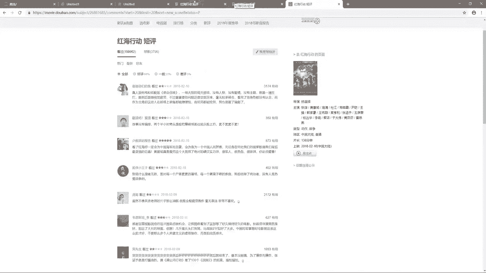

只不过呢这个等于的数字它变了，那我们把这个链接呢先粘回去，大家看是不是非常的相似呢，只是有一些数字变化了，但是啊这只有两条，似乎还不足以说明问题，那我们继续再来看第三页。

我们依然啊我们直接把这个链接粘过来吧，我们粘到我们的代码里，新建一块放在这里来，我们比对一下先前的这一部分呢都没有改变，改变的呢只是问号后面的东西啊，实际上呢改变的只是start这个值。

那这里啊我们先来看这个问号，这个问号代表什么意思呢，我们来看我们在发送，使用request模块发送请求的时候，我们使用了get，那其实啊这个问号，他就对应了我们这个get的访问方式。

那大家想我们在访问的时候啊，我们再去请求使用get方法请求这个网页的时候，如果我们需要参数，那它呢就会一个问号，然后将参数呢放在问号后面，并且呢把这个问号和后面的东西，和之前的链接进行拼接。

生成一个新的链接，那其实我们再去访问下一页的时候啊，就是发送了一个啊带有参数的get的请求，那我们的参数呢其实就是下一页了，那也就是这个意思，那我们在访问这个页面的时候啊。

只不过说呢它的第一页的链接和这个链接呢，他们代表的是同一个地址，也就是说呢啊我们这个第一页的这个呀，它其实是一个默认的，即便你不加呢，他也是这样，所以说你在请求这个链接和这个链接的时候。

他们是没有区别的，哎那我们现在要让我们的爬虫程序去进行翻页，让他呢自己进入到想下一页，你去取数据，那大家有没有什么想法呢，那大家可以看，其实我们的链接呀只有一个点发生了变化，只有这里发生了变化。

那如果说我们定义一个for循环，每次呢都去改变一下我们的链接，然后呢呃把新的链接去给他，去用我们的request模块发送请求，那是不是就能实现一个翻页操作了呢，那我们来试一下。

那首先呢我们先来更改一下我们的链接，我们把我们之前的链接啊，换成这个带有get参数的链接，也就是啊我们方便我们翻页的这个链接，然后呢这里的代码呀，嗯我们都不啊，我们还是来看一下吧，万一需要改变呢。

那这里啊是我们已经翻译后的了，嗯我们还是来看一下哎，这还是我们的熟悉的span标签，以及这里的class等于short属性，那如果还是这样的话，那就证明我们它这些页的这个数据额，获取形式呢是一样的。

我们就不需要改变了，那我们呢只需要在原有的代码上添加一下。

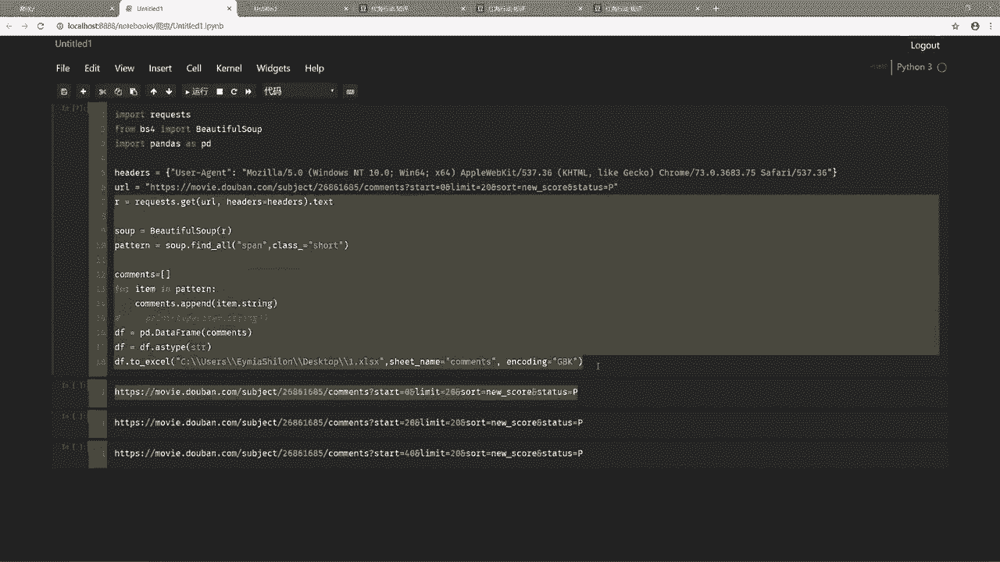

就好了。

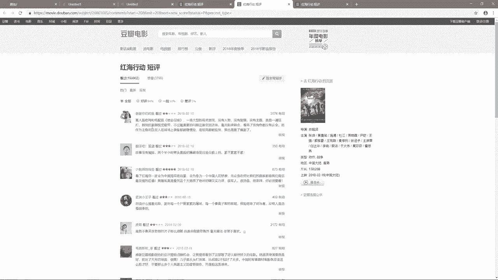

那我们这里呢我们来定义一个for循环，那我们呢就来爬取一下前三页的数据吧，那前三页都有20，还有40嗯，那如果说呢我们要爬很多页，是不是啊，就要定义一个很长很长的列表了啊，其实并不是。

大家看这里其实规律还是蛮明显的吧，呃零二十四十每次都在递增20，那这个20呢其实就是这里的这个limit哎，他为什么是20的，他不能是30和40吗，那我们来看一下，来大家数一数啊。

这里的评论呢他其实是20条，对这里的limit，它实际上呢也就指我们这一页，他请求了多少条数据，这是我们limit一个作用啊，不是呃，是limit在这个链接中的一个作用好，那我们定义了这个以后呢。

我们来请求一下啊，其实请求和存储的过程呀跟刚才一模一样，我们缩进一下诶，这样呢我们就可以实现前三页的一个爬取了，但是这样有什么问题吗，啊当然也是有的啊，大家看我们在保存这个文件的时候啊。

我们似乎每次都在保存一个文件，这样呢它其实就有可能给我们覆盖掉了，那如果我们想要保存在一个文件里，把所有数据保存在一个文件里，我们呢可以定义把 name给改掉，对也就是存储到我们excel里面的啊。

一页一页的进行存储，但在这里啊，我们为了更直观的去看，所以我们直接来存三个文件，那存三个文件呢其实也很简单了，我们呀把这个地方换一下，我们来用我们的字符串这个拼接啊，我们来给它换掉。

我们就把它换成I的值就好了，那这样呢啊我们就是每一次循环呢，都会生成一个新的文件，而这个文件名啊，它就是我们这里的20和40，那我们来运行一下，看一下它的效果，这里呢因为如果说啊。

大家以后爬取的数据量比较大的话，那他一个程序啊会运行很长时间，这里我们啊也就是60条数据也不算大，那我们这里也运行结束，我们来看一下，哎大家看这里多了零二十四十这三个文件，我们打开看一下。

首先是我们的零，哎这里的话就很眼熟了嗯，这是我们刚才呢就有爬取过的数据，也就是我们第一页的数据，那么再来打开这一页。

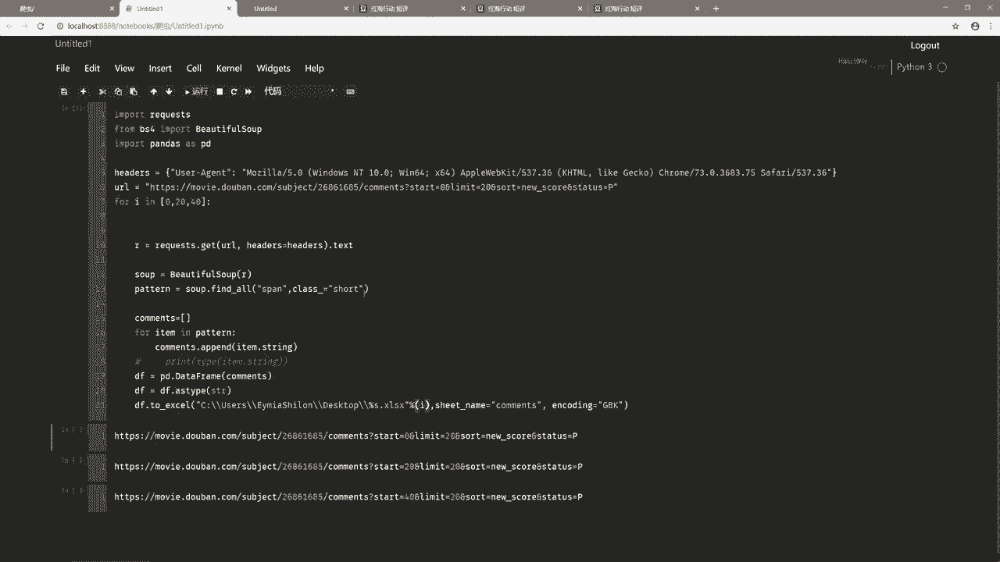

这个。

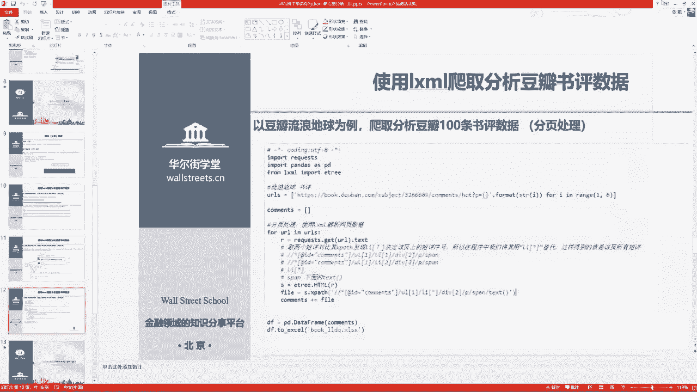

这个呢他呢就是我们的第二页的数据，大家可以来打开我们的这个来匹配看一下，看他是不是我们的第二页数据，万一他不是啊，那我们就有点尴尬了，我们来看一下，大家看嗯嗯这里的话，这是额第二页的数据。

然后哦我们看这里有个觉得一定比，啊觉得比战狼二好看100倍，我们看有这条吗，数据哎那为什么没有呢，啊大家来看一下，大家来看诶，这里第17条，然后呢这里第17条，他们两个是不是一样的。

那这呢其实还是因为我们代码的原因啊，我们呢在这里定义了for循环，然后呢你在for循环里设置了访问代码，但是啊我们在这里的for循环呢，自始至终啊都没有改变这个URLL，所以说我们三次循环。

其实他一直在做一件事情，就是重新的访去访问，第一个就是这个URL，我们一直没有去改变它，那我们这里啊我们来改变一下，我们呢把它换一个位置，我们换到这里，然后啊我们把额三次URL变换的地方改一下。

我们同样使用百分号S来把我们的这个I啊，拼接到这个URL，那我们再来运行一下，哎啊这里的错误啊，是因为啊我们这里还在打开这个文件，所以说呀没办法改，我们把它关掉，我们再来运行一下，好程序已经运行完毕了。

那我们再切回桌面，我们来看一下，首先呢还是我们的第一个文件，那这个第一个文件，似乎和刚才还是有点不一样啊，我们来看一下是不是第一页我们先来看首页，那春节档最好，然后我们看最后一个额远远好于湄公河。

远远好于湄公河。

春节档最好，那这就是我们第一页的一个数据了，那为什么和刚才不一样啊，是因为呃这个页面的数据啊，它有可能存在一个动态的变化，但是只要我们啊这20条数据它没有改变，那就可以了，然后呢我们再来看我们的20。

诶似乎和刚才真的不一样了，而且呢和我们的第零页也不一样了，我们来打开下一页来看一下，首先啊是比想象中好看，缺乏什么什么啊，光环看这里呢就是我们的第一条数据，然后我们再看下一页，最后一条吧。

你完全不是我的菜，还有是没怎么样怎么样，我们来看，这呢就是我们的第二页数据了，那我们来看最后一页，哎最后一页第一条啊，3。53。5。1，我们来切一下，3。5，3。5。1，那这样呢。

我们就实现了这个红海行动电影的这个，短评的爬取，那我们实现了前三页的爬取，也就是说呢呃我们的这个爬虫呢，它呢已经完成了这个自动翻页的功能，那如果说啊我们还往后续，还想继续再爬后边的评论。

那么我们可以设置一个for循环，每次让我们的I啊去加上这个20，那就可以了，这就已经完全可以实现了，我们这个豆瓣影评的这个这么一个爬取的过程，那这样其实就是我们的这个爬虫。

Python爬虫中分页处理的一种方式，那我们的这个分页处理呀，它包括但却不局限于这种翻页形式，那后续呢，我们还会为大家来介绍，更多的这种爬虫的翻译方式。

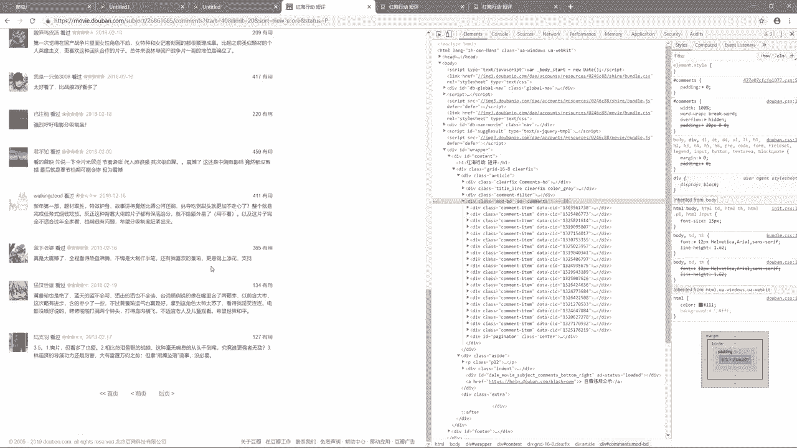