# 14天拿下Python金融量化，股票分析、数据清洗，可视化 - P16：04 典型爬虫程序的实现（三） - 川哥puls - BV1zkSgYZE54

各位同学大家好，今天呢我们依旧来学习一下爬虫程序的实现，那么上一节课呢我们已经给大家讲解过了，beautiful soup这个模块的一些常用方法，并且呢我们在最后啊，也用这个模块呢来实现了一个嗯。

简单的爬虫程序，就是爬取我们豆瓣电影的一个影评，就是红海行动这部电影的一个影评，那么我们上一节课呢，在爬取这个影评的时候啊，我们为这个爬虫实现了一个翻页的机制，那这个翻页的机制啊。

不知道大家还有没有印象，那如果大家记不清也没有关系，这节课呢，呃我们的重点呢就是来实践，我们这个爬虫从的这个翻页机制啊，我们上一节课实现的呢只是一个啊，很简单的方式，这节课呀我们就呃全面的来实现一下。

这个翻页机制，那我们呢会给大家讲解几种啊不同的翻页机制，并且是呃会为大家来具体的实现一下啊，怎么着去破解这些翻页机制，那讲完分页机制呢，啊我们在最后呢会为大家介绍啊，我们上一节课有提到。

但是却没有讲了两种算法思想，就是我们的呃深度优先和广度优先好，那现在呢啊，咱们先来看一下我们的这节课的第一部分啊，分分页处理，也就是我们的这个翻页机制，那大家看啊，这里呢给大家总结了四种。

经常见到的这种分页机制。

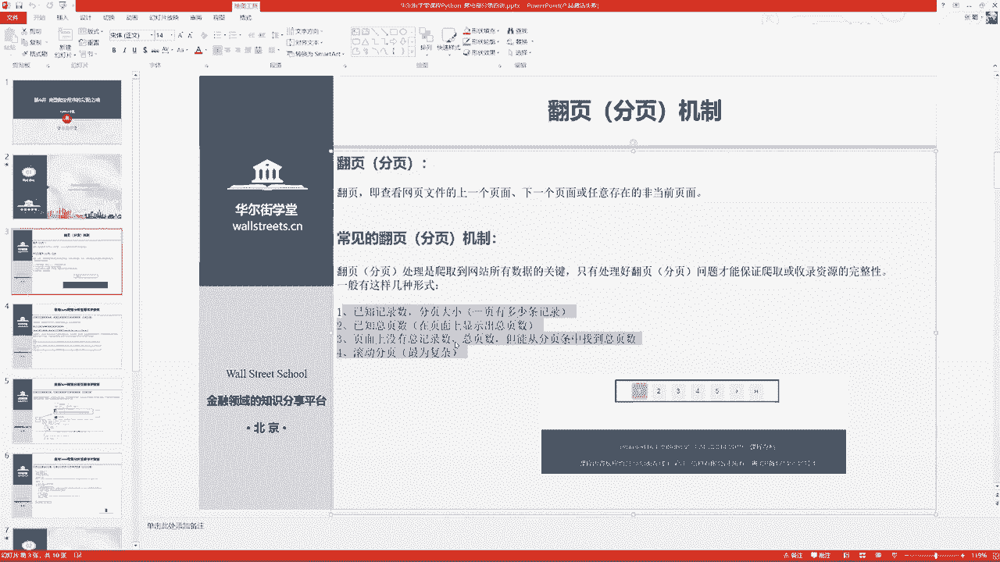

这里呢额我们还是先回顾一下，我们昨天的这个代码，我们来看一下额，我们这个红海行动这个翻页机制，那我们上一次啊去破解这个翻页呢，主要是使用了一个for循环，那我们这个for循环啊。

是建立在我们已经掌握了爬虫要爬取的网页，它这个URL的规律，然后呢呃我们之前发现的规律啊，是在问号后面这个这些地方，就是说我们get方法呃，get发送请求的时候带了一些参数啊。

我们发现诶这里的start后面它是会变的，而且呢它只变了这一个地方，所以我们就定义了一个for循环呢，去改变这个参数实现啊，每次去访问的时候都是访问的不同的页面，那这里呢我们上一节课有说。

我们这里是定义了一个列表，爬取前三页，但是啊这个只适合一个啊练习，如果说我们真正要去运行爬虫的时候呢，我们这里建议大家啊换一种写法，不然如果说呃我们的这个要爬取的页数太多。

那我们可能一要写一个好长好长的列表，然后呢嗯这个翻译思想，不知道大家有没有理解啊，应该很简单，那我们这里其实前三种啊。

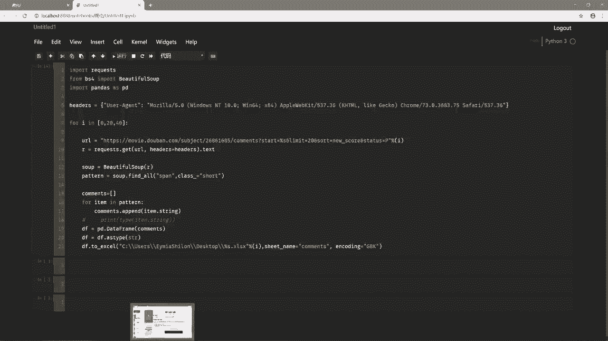

他都是用的这种，都会都是用的这种思想来实现的。

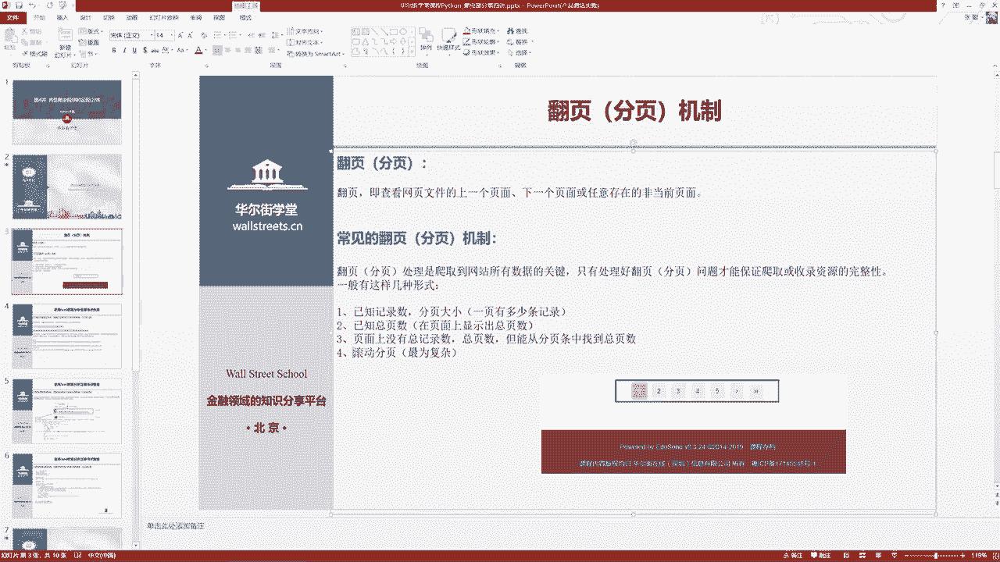

就是我们定义for循环去额每次改变URL。

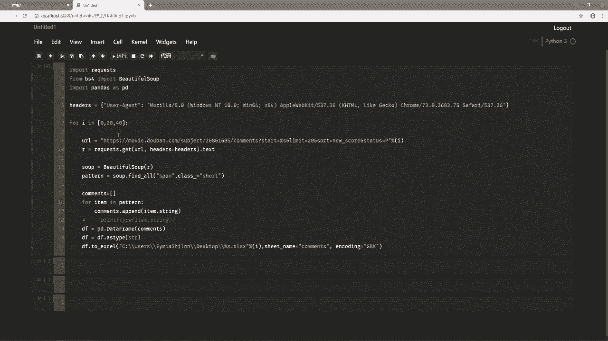

但是这里大家看这第四种滚动翻页，那我们这里呢还标了一个最为复杂，其实呢这个复杂呀它是一个相对的，如果说我们用Python去实现这样一个，滚动翻页的爬取的，其实我们至少能找到三种方法。

并且还是实现起来非常简单的方法，那这节课呢我们会为大家介绍一种，但是这种呢是嗯一种基于爬虫思想实践了啊，它和Python没有太大关系，那啊我们说了这个很难，但他长什么样呢，哎别急。

我们来找一个网站来看一下，在这里啊，我们还是来找豆瓣，豆瓣上呢它有好几种的翻页形式，那我们上一节课呢看到的那种翻页呢，它是其中一种呃，我们再点个其他的来看一下啊，比如说我们先点进去一个电影。

然后呢点这里哎，大家看这里又是另外一种翻译，我们上一次实现的，它只有前页，后页，还有一个啊，还有一个尾页和首页，但是这里大家看他标了很多页码，那我们想实现这样的话去实现这个翻译，我们来点啊。

大家来注意这里的URL，我们来点一下给大家看，这里有一个start等于80，我们换一页，这是第五页，第六页，stop等于100，那大家就可想而知，这下一页肯定就是120了啊，所以说他这个实现起来啊。

跟我们刚才那个啊，看到就是我们上一节课写的那个红海行动呢，是一模一样的，那接下来呢我们来看另一种，哎大家来看，我们这里有一个加载更多，我们没有下一页，也没有前页后页首页之类的，只有一个加载更多。

那我们先点一下，看看什么效果，我们会发现其实这个页面啊它并没有变，它还是之前的那个页面，只是说我在下面呢好像多了一些数据，你那这里就有些奇怪了，他没有翻页，那我们的爬虫还怎么翻页呢，那我们先来看一下啊。

这里大家注意来看，是它原本的URL。

我们CTRLC一下，那现在啊我们把这个URL粘在这里，这是我们啊第一次加载的UI，我们点了一次。

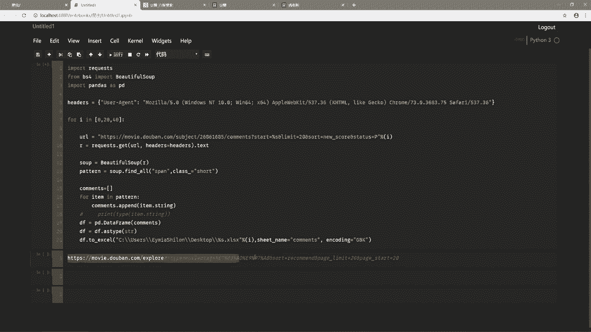

这个加载更多，那大家注意看，我再点一次，我们再把这个粘回。

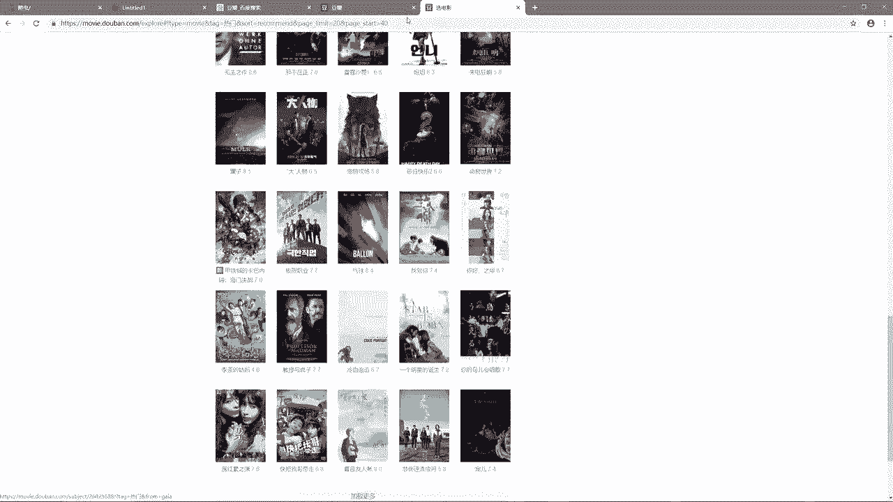

我们比对一下大家是不是发现这个URL有变化，按照我们的上节课的思路，是不是说诶我们使用for循环去改变参数，就能来实现呢，诶我们暂且先看一个其他的地方啊，我来给大家点一下，大家看一下。

我们看这个加载更多。

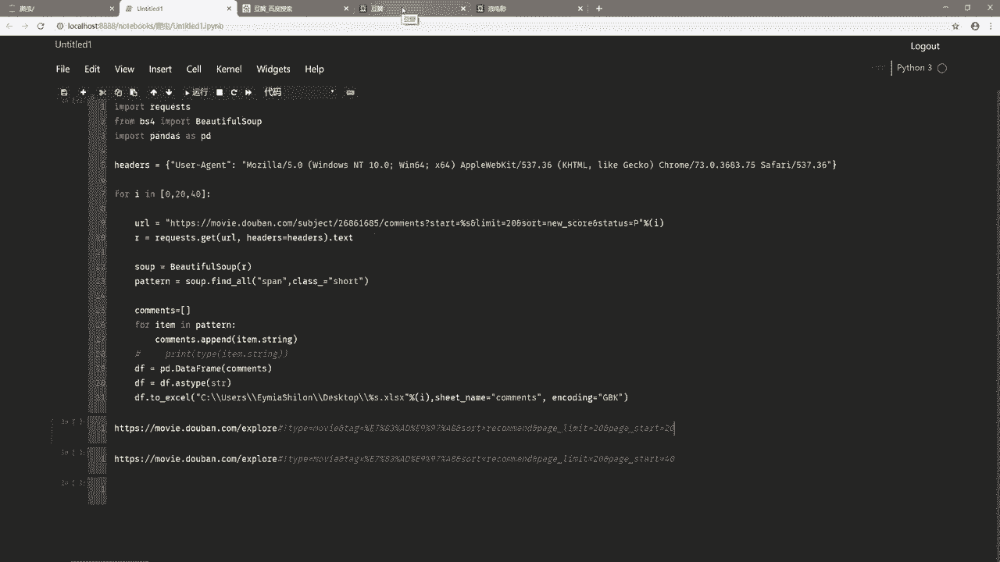

按照我们以往的这个经验呢，啊我们点下一页，或者说前一页的时候呢，它都会触发一个啊新的URL链接去链到下一页，就像我们刚才我们刚才那个啊，就是说啊下面是123456的那一页，我们看看那个是不是呢。

你看大家这里有个三，我们点一下，我们点一下检查，大家看这里有个问号，start等于40，我们移上去以后，这上面写的是一个链接，我们可以直接点过去对吧，那我们来看我们刚才这个加载更多。

大家看这里是一个JAVASCRIPT，它并不是一个链接，那这个JAVASCRIPT什么意思呢，它其实啊就是说啊我们这个网页的数据啊，它是一个动态加载的过程，好我们在点击这里的时候啊。

它会用一个呃JAVASCRIPT代码，去自动的为我们加载一些数据，这个加载数据呢它是实现了一个局部的刷新，就好像我们点这个加载更多的时候啊，它并没有刷新整个页面，它只是这一小部分新增了一些数据。

那这个呢我们叫做局部刷新，这其实也是爬虫中的一个难点和重点，那好我们点一下这个JAVASCRIPT，大家看他是没有反应的，这里是不是就有点难办了呢，那我们刚才的那个链接是否还管用呢，嗯咱们。

咱们看一下好吧，我们再回到我们刚才的页面来。

咱们把这个链接粘一下嗯。

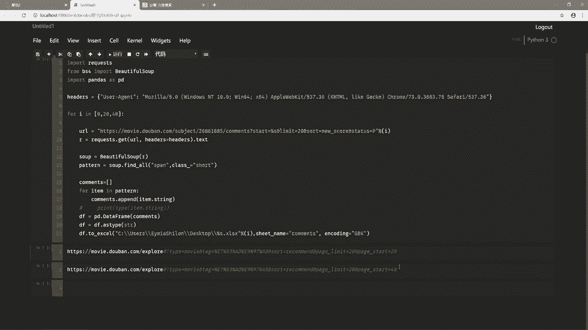

我们看一下管用不管用，唉大家来看，那这里的他的这个URL它被进行了一个重定向，它直接又定向在了这个页面的首页，那我们刚才点击加载更多产生的那些数据呢，它并没有加载，那这里就不像我们昨天的那样了。

我们昨天那个呢哦我们在点完以后啊，它会进行一个，就是直接跳到我们所选中的那一页里面，所以说那这个改变URL呢，就不起不到我们昨天的那个效果了，那除了这个加载方式啊，我们再来看。

我们来看刚才我们有说到了这个滚动翻页，让大家看，这是我们当前的这个页面，我们向下翻，大家注意这里的滚动条，我们在滚动到底部的时候呢，大家看这里好像又一又多出来了一部分，大家一直往下翻的话。

会发现他好像没有底，像一个无底洞一样，他一直在加载，然后我们也没有看到下一页，或者说加载更多这些点按钮点击，那这呢就是我们的滚动翻页，那大家注意注意这里的URL，我们让它继续继续滚动。

它似乎一直都没有改变，这个呢就是我们所说的滚动翻页，那它和我们刚才的这个呢，这个加载更多呢有些相似，但却不太一样，那这两个需要怎么破呢，哎别着急，但在Python里或者说以爬虫的思想去应对它的。

都有破解的方法，这个呀一会我们会给大家来具体的实现一下，那现在呢我们还是先来一个啊简短的案例，去回顾一下，我们昨天呢去实现的那个简单的翻译案例，那这里呀我们还是以豆瓣上的一个呃书评吧。

我们直接爬这个啊流浪地球的一个短评，来实现一个小小的翻页，那我们打开我们的jupiter notebook好，这里呢是我们昨天写的代码。

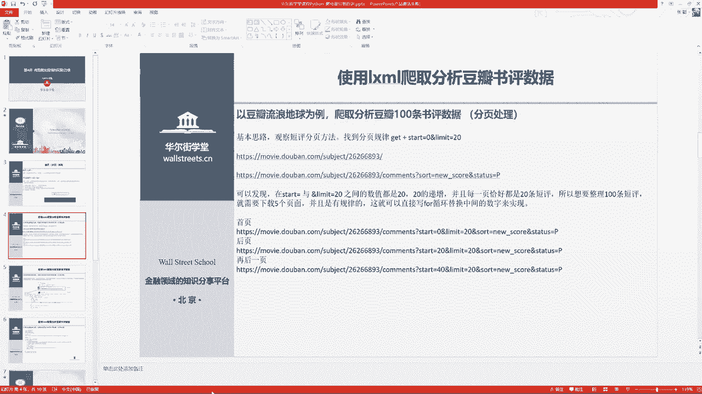

这个呢啊我已经写好了，那这里有一个运行结果啊，我们还是先来运行一下，来看一下，这里呢是被打印出来了，然后呢，我们在最后还是使用了啊，pandas里的写入excel方方法来实现一个啊，写到本地文件当中。

我们来看一下有没有写进去呢，哎这里已经有了，我们看这里呢写了这么多数据，那他是不是我们想要的呢，我们打开这个URL来看一下，CTRLC我们粘过来。

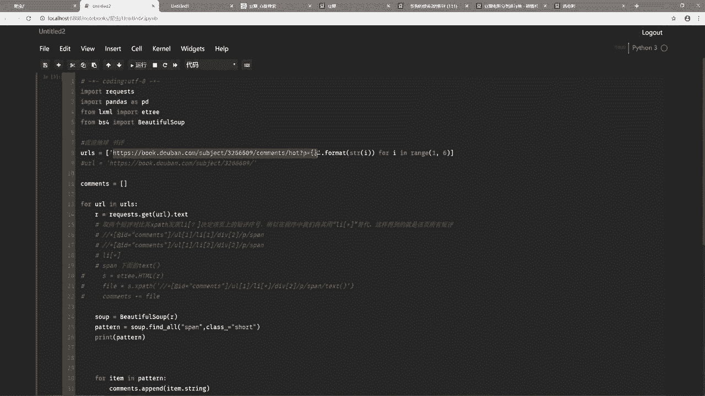

这个好像不是我刚才粘贴的吧。

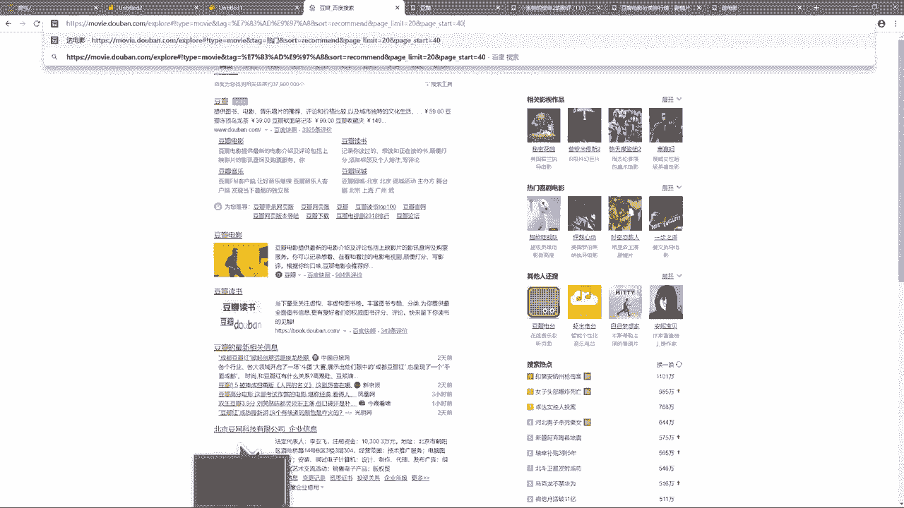

我们粘贴一下来看一看。

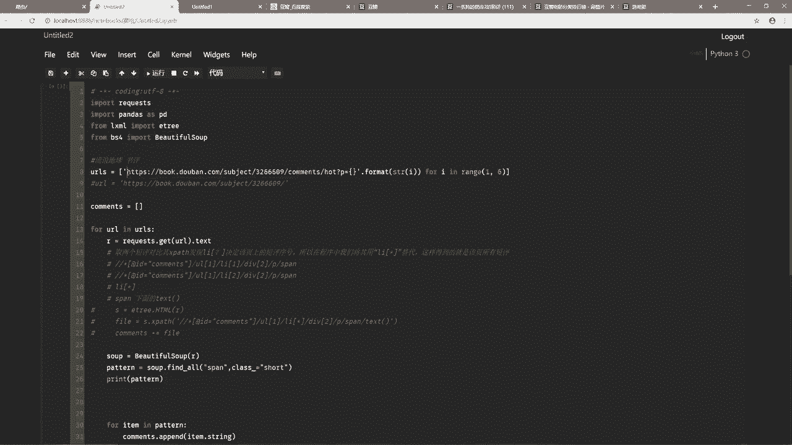

我们看就看第一页好了，哎这里的第一条叙事方式太极端，叙事方式太极端，哎没问题嗯，我们看这些呢，我们都已经爬在了本地文件当中。

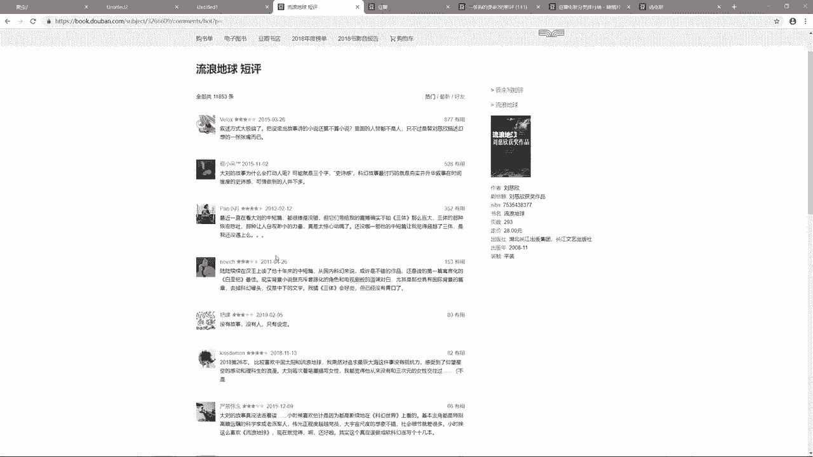

然后我们来看一下这段程序，首先呢还是导入库，那这里呀我们看这里有一个呃，导入了一个ETRA，那这个呢我们先不用管它，一会我们再来介绍它，首先我们使定义一个啊URL，但大家看这里的URL啊。

我们用了列表生成式，等于说我们定义了一个啊URL的列表集合，那我们昨天呢我们是呃，每次循环重新生成一个URL，那这两个呀它其实呃区别并不大，大家选择哪一个都可以，那这里的FORMFORMAT啊。

我们同样用了Python中的字符串拼接，然后定义空列表，然后循环，那学完了以后呢，其实就跟我们昨天的一样了，用get方法呢去请求这里，哎，那大家看这里呢我又忘记写headers了，那大家写的时候呢。

记得把它加上，那在请求以后啊，我们同样使用beautiful soup，然后呢创建这个beautiful soup对象，接着呢啊我们4span标签还是嗯clusting short。

这里呢其实跟我们昨天一模一样了，就不给大家再做过多的介绍了，下面这些方法，这些语句呢相信大家也很熟悉了，我们已经写过很多次了，就是用pandas中的啊to excel方法呢，去把我们爬到的东西。

写在我们本地的excel文件里面，那大家看这里啊，我有一段已经注释掉的代码，我们来看一下这些代码它是干嘛的，那首先啊我们来介绍这里的这个模块，1try，1train模块，它的作用啊。

其实就是啊我们输入一段网页的HTML代码，然后呢，我们用1try模块去对这个代码进行一个呃，规范化，那大家是否还记得啊，我们呢嗯之前啊beautiful soup里面有个呃方法。

那这个方法是帮我们去整理这个代码，让它看起来更好看，那我们的1try呢它除了能整理代码以外呢，它还能将一些啊，比如说我们代码中缺失的标签去帮我们补上，让整个代码呢呃没有缺失或者说丢掉的部分。

那当然啊这个部分仅局限于标签，那什么是标签，我们来看一下，就是啊定义网页中的额HTML代码时候呢。

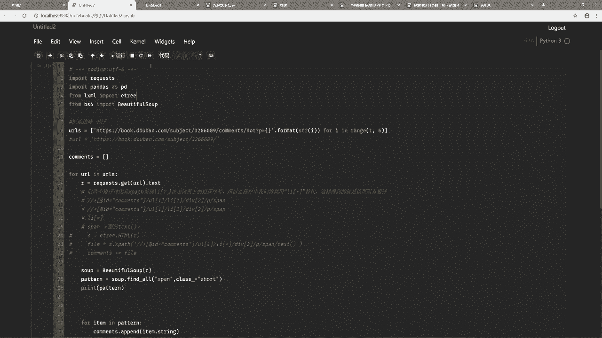

大家会看到这里有尖括号，那比如说呀我们这里的这个div。

如果说最后这个div丢失了，那我们用e train嗯，把这段代码输进去，它会帮我们把将这个div呢进行一个填补，那这就是一群模块的一个作用，那大家看啊，这里呃我们将爬下来啊，获得响应的代码呢。

传入一群模块中，会获得一个额一个对象，这个对象可以调用x pass方法，那x pass又是什么呢，x pass呢其实它和我们的beautiful soup一样，也是一个提取数据的这么一个工具。

但是呢x pass模块，它的使用相比于beautiful soup呢会复杂一点，但是比正则表达式呢还是要简单，它的运行效率呀会比beautiful soup快一点，然后比正则表达式慢一点。

它相当于介乎于beautiful soup和正则表达式之间的，这么一个工具，但是呢啊我们并不需要去呃过多的学习x pass，如果大家有兴趣的话，可以在谷歌浏览器上去下载一个x pass helper。

helper的插件，这个插件呀它会自己去帮我们生成x pass，提取公式，然后大家有兴趣啊可以去搜一下，这里呢我们还是使用beautiful soup来实现这个功能，那当然了，x pass也是可以的。

大家看这里x pass使用x pass写了这么长的东西，而beautiful soup呢我们就写了这一点，所以说啊beautiful soup呢使用起来还是比较简单的，那这个简单的翻页呢我们就实现了啊。

也算是对于我们昨天内容的一点回顾，那么下面呢，我们就来看这个比较难实现的翻页程序，我们该怎么去搞定它，我们还是来打开我们的豆瓣，找到我们刚才的这个滚动翻页。

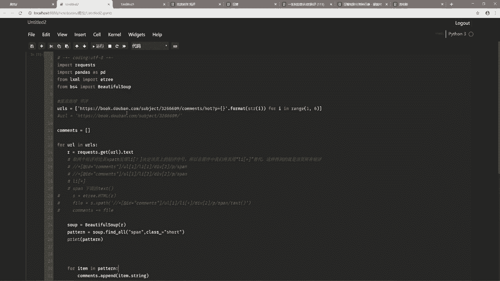

我们F12一下，刷新一下，那这里呀我们先来讲解一种破解这种滚动翻页，这种一个实现方式，那么后续啊，我们还会为大家介绍一种更简单的实现方式哦，那这里介绍的这种方式呢，它其实啊并不是Python独有的。

它只是一种爬虫的破解思想，那大家看，如果说呀我们不能直接在这个页面里，通过它的HTML代码去获取这个东西的时候呢，我们可以打开浏览器自带的，就是这个开发者平台啊，一般就是按下F12。

然后呢大家看这里加载了很多东西，这个呢我们在第一节课的时候就有给大家说过，这个其实它是我们在发送请求时，服务器给我们所有的响应文件，包括我们的数据，它都在里面，就像这里的图片，还有一些数据之类的。

那我们向下翻动，我们看这个它在加载数据的时候，浏览器会不会还会给我们发送一些文件呢，我们先把它拉到最底部，我们往下翻，大家看这里是不是又多出来了一些东西，那大家有没有注意啊，这里top list。

然后这个东西他是不是看起来，好像比其他的意义更明朗一些，那我们点开看一下，看他是什么top框呢，大家看这里有一些类似于Python字典中一样的数据，那它是什么呢，我们看这里还有更多，我们点开一个看一下。

哎这里我们好像发现了一些什么东西，我们看这里有一个肖申克的救赎。

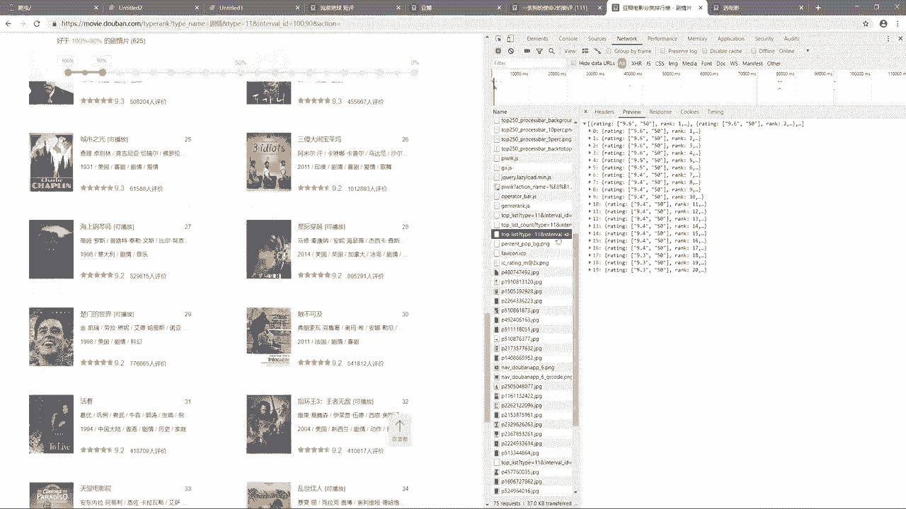

那我找一找啊，肖申克的救赎，哎第一个对，第一个，那大家看这里一些其他的东西呃，首先这几个人名，那大家看这里是不是也有好像比他的还多，然后rank排名美国，然后呢还有1994。

诶那大家是不是会想到一些什么，好像我们再点开一个诶，张国荣，张丰张国荣，那大家有是不是想到我们的数据，除了呢在这里获取以外呢，我们还可以直接通过这个呃服务器发送反响应，给我们的一些文件。

直接在这个文件里进行一个获取呢，那我们来试一下，我们打开headers，我们看这个响应内容，它的一个URL就在这里，那我们来尝试一下，看看能不能这样直接获取到数据，那首先啊我们还是导入库啊。

然后呢我们定义pandas，我们定义pandas之后啊，我们再来定义URL，诶我们去把这个URL粘过来。

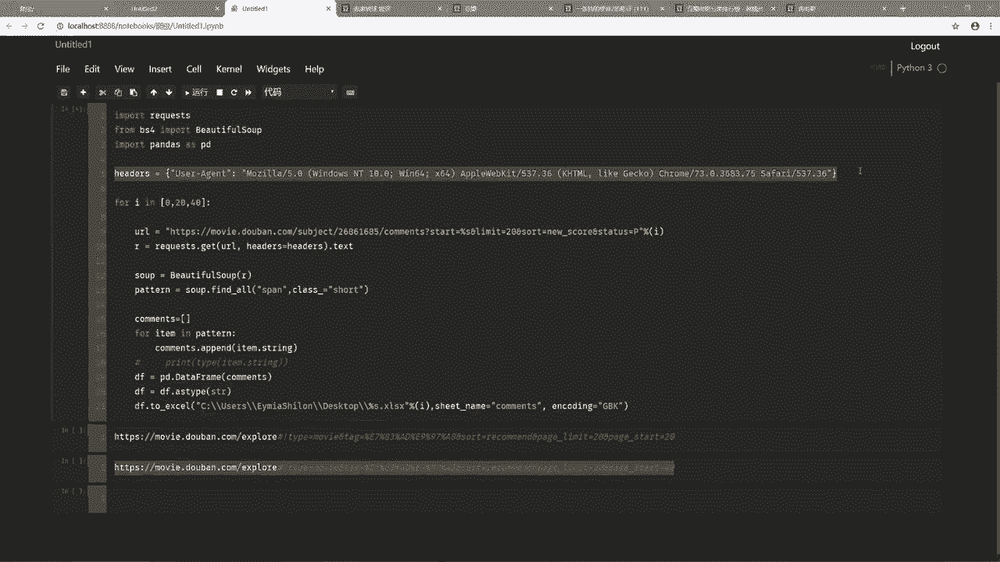

我们现在使用request方法去访问一下，我们先来看一下它的一个访问形式，哎是get，那我们还用request点get去访问它嗯，去定义一个变量接收，然后我们去访问一下这个URL。

我们把headers传进去，现在啊我们来打印一下，我们看有没有得到我们想要的这么一个东西，我们来运行一下，好像打错了哦，不好意思，这少打一个点，我们来运行一下，大家看到这里，我们已经获取到了一大堆东西。

那这些东西呢我们来对比一下，我们刚才所得到的这个，我看是不是他好，我们预览一下哎，9。65101，9。65101没错，那他呢其实就是我们已经获取到的数据，但是这个数据大家看一下好像很难理解。

那我们拿到这个数据呢其实用处也不大，那现在呢我们要把这个数据进行解析，解析成一个啊我们看得懂的数据，那这一段大这一大串东西怎么来解析呢，哎我们先来打开一个网站，那这个网站啊是一个解析JSON数据的网站。

那什么是JASON呢，JASON呢，它其实是现在一个非常流行的，数据传输的一个格式，那经常用在这个网站的前后端数据交互之中，那我们这里获取的这个格式啊，数据格式啊，它其实就是JSON格式。

那JSON格式的数据呢，它的这个形状啊很类似于我们Python中的字典，就是用一对大花括号括起来，然后呢它是一个键值对的形式来存在的，我们把这个数据呢粘过来，我们来看一下啊。

我们直接粘我们这里已经运行好的数据，我们来粘过来，我们看看是什么样，哎大家看这样的话看起来是不是就舒服多了，像我们的排名哦啊排名，然后呢啊他的图片地址，然后呢他的是否上映id类型地区名字。

然后链接主演等等等等，他的数据都在这里啊，这样看起来是不是就很直观了吧，但是啊啊我们现在我们不能说啊，我们得到一个数据呢，就在这个网站让他上，让他给我们翻译一下，那这样呢就会很麻烦。

所以呢这里我们来使用一个模块，叫JASON，那我们Python里面呢它就提供了这么一个JSON模块，JSON模块的作用呢，其实就是将我们的JSON数据和Python中的一个字典，进行一个相互的转换。

用起来呢也非常的方便，只需要一个简单的方法就好了，这里啊我们先对于这个R来进行一个text的显示，然后啊我们这里来调用一下JSON，那JASON呢。

它将JSON数据转换成我们Python里的数据的时候呢，我们需要调用一个load方法，大家注意呢一定要加S，不加S呢就是在操作一个文件，一个JSON格式的文件，那JS呢就是操纵一个JSON格式的数据。

我们把它传进来，然后呢我们再来打印一下，我们来运行一下，让大家看这个是不是，就比刚才看起来要舒服一点，那刚才一大堆什么啊，带X的嗯，数据它并不已，并不让不能让我们进行一个直接的呃，能看得懂的。

那这样把它转换成字典呢有什么好处呢，就是说我们可以通过键值对的形式，就比如说呢我们调用a rank，它就会显示一，那这样我们在存储的时候啊，就非常的方便，那我们一定要把它转化成字典，才能去提取数据呢。

其实也不是我们学习了beautiful soup，刚才呢也给大家略微介绍了一下x pass，那在这里呀，JASON在也可以实现一个快速的数据提取，那有个工具呢叫做jason pass。

这里啊啊我们不给大家讲了，大家如果有兴趣的，可以去自行看一下jon pass这个东西，它的使用方式呢和x pass是非常类似的，那大家有兴趣的话，可以去查一下文档去学习一下。

那我们这里呢其实就已经成功的爬取到了，这个滚动页面的第一页的数据，但是我们要实现翻页啊，我们还没有实现翻页呢，那怎么办呢，我们来看啊，我们向下翻的时候，它会多出来一些数据。

那其实它多出来的数据啊，说白了也就是这些额外增加的数据，那也就是我们说的翻页以后的数据，那我们只要找到这个多出来的这一部分，那其实呢我们就已经搞定了，那我们看这个是不是就是多出来的了，其实很明显了。

我们向下翻的时候，大家看都是图片，偶尔会蹦出来一个这个，那这个呢它就是新增加的，那只要我们找到它就好了，我们来看继续拿出来它的URL，我们来做一个对比啊，这里我们已经有了一个URL了，我们把它放在这里。

我们来看一下，其实啊，这里就变成了我们昨天的那那那样一个形式了，那大家看有没有什么变化呢，start等于零哎start等于40，limit等于20，那大家可以想一下，如果说start等于40。

limit等于20的话，那下一页是多少呢，那肯定就是把它变成了60，我们来试一下，看看管不管用，那首先呢我们先来做一个小小的测试，我们把这里换成40，我们运行一下，哎大家来看啊，我们的排名从41开始了。

我们记得我们刚才那rank是一，所以说我们这里已经成功地获取到了，第二页的数据，那我们实现翻译该怎么实现呢，那是不是这里就和昨天的一样了呢，我们直接for for for一个I，我们直接放一个I1。

然后我定一个列表还是零二十四十，那啊这里其实呢还是我们像我们昨天说的那样，嗯这个呀如果说大家如果测试的话，就这样写啊，我们就相当于一个训练手，但是在实际过程中呢，大家不要这样写，因为这样写局限性太大。

那应该怎么写呢，我们来这样写呃，我们直接grange啊，我们呃定义一个就说大家想爬的页数，我们把它放在这里，比如说我们写个三，那其实那就是爬前前三页，然后呢我们把这个链接修改一下啊。

把start这里去改掉，还是用我们的百分号S来替代，那在后面我们写的时候啊，我们大家来看呃，他每次就是说他的一个范围是20，那我们直接让我们先乘以20，大家这样写呢就会好很多，不然的话如果我们页数多了。

那也就零二十四十六十，这样写下去会写很长很长，然后呢嗯我们这里来打印一下，直接打印个字符串，我们就告诉他这是第几页啊啊我们这是第，第二眼，我们还是用百分号S来拼接一下后面的额，因为我们是零开始的。

所以我们I加一，然后呢我们再打印我们的数据，就是我们的二，我们运行一下诶，不好意思，这里好像写错了一点，然后呢我们来修改一下啊，其实我犯了一个小的错误啊，大家看这个字符串里。

它有百分号A那那我们在这里啊拼接，为了这个代码的严啊，一个严谨性啊，我们用format拼接，我们要把white拼接一下，然后呢，我们把这里的百分号S换成我们的打括号，我们再来运行一下。

诶这里还等一下哎好了，让大家来看哎，首先呢是我们第一轮，那这里呢我们就得到了这么多数据，那这个数据啊其实就是刚才我们这里的数据了，也就是我们第一页的数据，额大家看是不是啊，千与千寻后千与千寻没错。

这就是我们第一页的数据，然后啊啊下面呢是我们第二页的数据，那我们看第二页的数据是什么，这里剧情，然后忠犬八公的故事，我们来回来看一下，我们刷新一下，呃大家看这里有显卡着，不让它加载。

这最后一个是千与千寻，那下一个哎忠犬八公的故事，然后我们来看最后一页是不是呢，第三页啊，这个是七五式，我们还是来看一下是不是，我们先看一下上一页，最后一个是什么，最后一个摩登时代，往下翻找摩登时代。

然后七武士没错，那这样我们就实现了这么一个翻页的过程，那大家在遇到这种呃分页滚动分页的时候呢，大家就可以采用这么一个呃思路，去去寻找这样一个啊，服务器给我们已经响应过的文件。

那如果我们成功的找到这个文件呀。

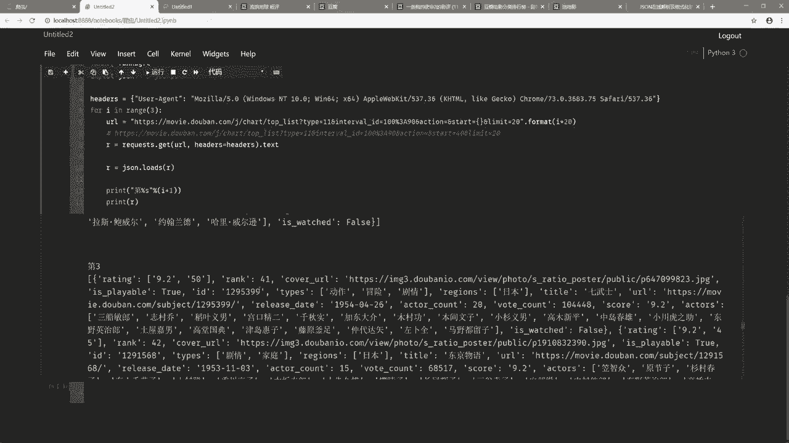

我们就可以很轻松的去破解这么一个，滑动翻页的机制，那除了这样破解的方式呢，额下等到后面的课程啊，我们会给大家介绍一个工具，那这个工具啊它可就厉害了，它能更简单，甚至说不用我们去在这里呃。

翻好多文件去找这个对应的东西，它就可以帮我们实现这样一个滚动翻页的机制，那我们刚才除了这个滚动翻页呢，还给大家看了另外一个东西，就是我们的加载更多，大家还记得吗，呃我们来还是找到我们的加载更多。

大家看加载更多，那这个呀我们来用我们刚才破解滚动方式，滚动翻页的那么一个呃思路啊，我们来看一看这个可不可以，我们还是先翻到最后来，现在我们开始点加载，更加载更多诶，好像可以，他这里也是加载了一些数据。

那我们看一下有有没有哪个，看起来比较像我们想要的，那这里大家看有个search subject，你打开看看哇，我们好像很幸运，直接找到了，其实也不算幸运啊，那大家看这里呢。

嗯大家可以去查一下它对应的英文啊，其实这个命名还是比较明显的，那像这种以JPG或者PNG结尾的，它直接就是图片了，那JS结尾的呢就是JSJS文件，也就是我们的JAVASCRIPT文件。

然后HTML呢就是我们的HTML文件，那这些呢很明显他们基本上都不是呃，我们想要的东西，那像这种哎这个不是啊，那就是这个了，那我们有了这个链接啊，其实也可以获得这些东西，我们来请求一下。

看看是不是我们想要的，呃我们哎直接定义一个UIL。

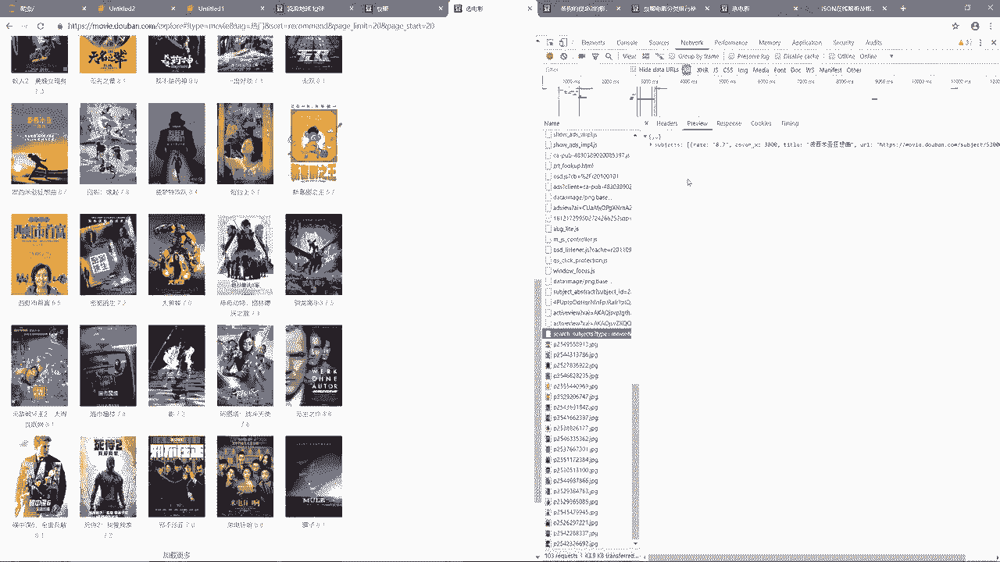

赶过来，然后呢，剩下的东西啊，我们基本上就可以去copy，再粘贴一下，然后缩进一下，诶，不好意思，创建一下，那JUPITER里面有很多快捷键啊，如果我们选中这些东西呢，我们直接CTRL加斜杠，就是问号。

下面那个斜杠呢就可以直接把它注释掉，然后呢我们shift加table就可以往前进行一个缩进，那这里我们删掉，这里，我们直接看他打印的数据，那大家来看诶波西米亚狂想曲，这个我们刚才有看到，我们看一下。

没错我西米亚狂想曲，没错。

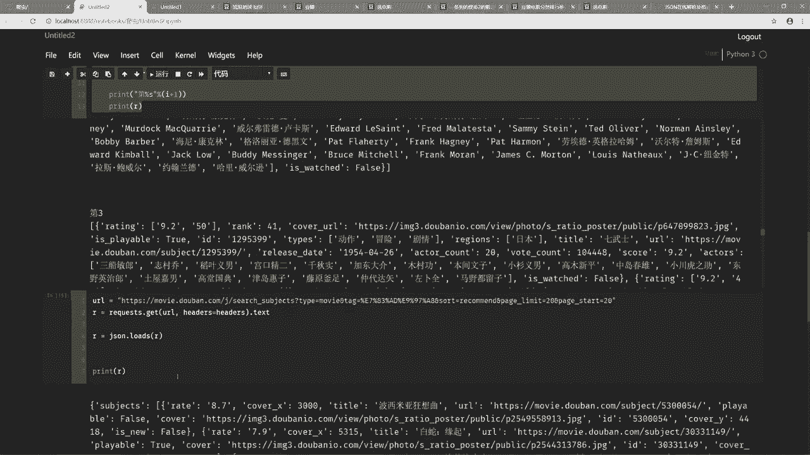

那我们就已经成功获得了，大家可以看到这个加载更多呀，它和我们刚才的那个啊滚动翻页，实际上呃破解这个机制是一样的，但后续我们是刚才说呃，能够更容易实现那个滚动滚动翻页机制的，那个工具呢。

它其实也可以更容易地实现这个加载更多好，那我们的这个啊爬虫的翻页机制啊，那就给大家介绍的差不多了，下面啊我们来给大家介绍两个算法思想，深度优先和广度优先，那么这两个东西啊。

它其实是数据结构与算法的一种两种思想，它可以用在很多地方，在爬虫里面呢它也可以用到，那我们来看一下这两种思想究竟是什么，一个思想呢，但听名字呀，大家应该哎也能先联想一下我们所谓深度优先。

那单看字面意思就是诶呃我们越往深了越好，那广度优先呢就是哎范围越广越好，那如果简单的先来评价一下这两个算法啊，就是结合我们的呃，呃学习的这个路线圈去评价一下呢，就我们深度优先啊。

就可以理解为我专精一个东西，就比如说诶我只学爬虫，那爬虫呢我学的非常的精通，其他的呢我不会啊，这就是深度游戏，它它呢就像一个纵向发展的过程，那广度优先呢就是我学了爬虫。

爬虫里面呢又涉及了像Python或者说啊像数据库呃，像本地文件的读写等等等等的东西，那我就去学这些东西，我把这些东西都学完了好，我再学下一步，那这其实这就是一个横向发展的过程。

这里呢他其实也就是我们深度优先和广度优先，最就是比较核心的一个思想，那下面我们来给大家简单的介绍一下深度优先，大家看深度优先的策略呢，是从网页开始选择一个URL进入，然后呢分析这个URL。

在分析这个URL中呢，我们还会获得一些其他的URL，然后呢我们继续的向其中深入，一直进一直进，直到进入到最后一个网页，这个网页里没有URL了，那我们算是停止了。

我们会再会去返回先前没有爬取过的其他URL里，再进行这么一个过程，那我们来看这个例子啊，额那这个例子看起来可能有一些麻烦，我们找一个网页来看一下啊，就比如说这个网页，我现在啊要爬取这个网页的所有东西。

让大家看，我首先是不是会获得很多链接啊，这每一个图片其实都是一个链接，我都可以点进去，那深度优先就是我点进去这个网页，那大家看这个网页里同样又有好多的链接，那我再点一个进去。

那这个网页里还是有很多的链接，我再点一个进去，就这样一直持续下去，直到它没有链接可点，然后呢我会返回返回到我最初的这个页面，然后去进行下一个啊，不不不不好意思，说错了呃，他是会往回倒一下，然后倒到啊。

他的上一个网页去把那个网页的链接爬完，然后再回退一级，一直呢把所有的URL全部爬取，这其实就是我们呃深度优先的一个思路，那现在呢我们再来回头看这个东西啊，那大家看深度优先的爬取顺序，A b d e i。

然后CFGH，那大家看，首先呢A呢其实就像是我们刚才所打开的那个，所有就是我们的啊根目录的网页，然后我们在爬取这个根目录的网页的时候呢，就像我们点进去诶，我们会获得其他的链接。

那么其他的链接就是我们的B和C，我们先挑一个B进去，我们又会获得好多的链接，就是我们的D和E，然后呢我们进入我们的D，也就是我们比如说我们随便打开一个网页，我们进去以后呢，这个网页的链接就算爬完了。

然后我们就会倒回上一级B在爬取B的时候呢，产生了其他的网页，那这个网页就是我们的E啦，我们现在会点进到E里面，然后呢我们把E里面所有的网页都盘完，也就是我们的I了，那盘完以后我们再回退到B。

那我们在爬取B的时候，只产生了D和E，没有其他的了，那我们再回退回退到A被爬取A的时候，除了B以外，还产生了C，那这样吧我们就又会进入到C的网页里，然后呢重复我们刚才之前的过程。

这其实就是我们的深度优先，如果说呢我们当前网页下面还有其他的链接，我们就会继续钻进去爬，而不会去选择和他同级的这么一个网页，这就是我们的深度优先，那大家在如果说大家以后会学习到算法这门课。

这门啊这个学科的话，那大家也是会去接触这个，深度优先和广度优先的，那么我们现在已经了解了深度优先，我们再看它和它相对的一个广度优先算法，那唉我们还是以这个网页来举个例子，首先我爬取了这个页面。

大家看是不是产生了一堆链接，但现在我不进这个链接，我先从这我再去了，这个就是和我们刚才点开的网页是同级的网页，我们再去爬取，大家看还是产生了一堆链接，然后我们依次建建建建完所有的好。

我们现在回到第一个网页，我们再去打开它的链接，这样就是我们的一个广度优先，那这里有个问题啊，就是说我们在爬取二级网页的时候，我们获取了一大堆链接，那我们是爬完所有的二级链接。

再深入到第一个二级链接的其他链接呢，还是说我们爬取第一个二级链接的时候，我们就开始去找他的子链接，那我们来看这个图，首先啊我们爬取A产生一堆链接，就是我们这里了，然后我们爬取B就是我们刚才这个东西。

我们点进去还会获得一堆链接，这获取的链接就是我们的D和E，但是我们现在不管D和E我们会进入到C里面，然后获得C网页下对应的这些链接，在获得C网页链接以后呢，我们要回转到上一级的B。

然后把B产生的链接爬完，那在爬取B产生的所有链接的时候呢，又产生了一个I链接，但是我们不管I链接，我们回到C链接下爬，爬取C链接时产生的所有链接，直到把这个C下面这一级的。

也就是DEFAGH这一列就是我们的啊，第三集的链接全部爬取完毕以后，我们再进入到第四集，所以大家其实就可以简单的认为诶，我就是一层一层一层的爬，直到爬取所有，那这个呢就是一列一列一列的爬，直到爬取所有。

那这样就是我们的深度优先和广度优先，那大家在写爬虫的时候，具体会去选择哪个呢，其实这个呢要根据我们当前的一个场景，或者说根据大家的一个呃爬虫，这么一个呃设计的思路去选择，这个要视具体的情况而定。

所以说呢啊大家在以后写爬虫了，因为我们现在的爬虫呢，大家看我们只爬一页或者两页，那我们以后的爬虫程序啊，可能会爬好多好多页，而且我们要深入的去爬，就好像我们爬豆瓣，现在我们爬的是一个影评，对吧啊。

我们只爬一个影评或者说一个电影数据，那以后我们可能要爬的是诶，我爬进去以后，我要爬所有的演员啊，啊我要爬所有的介绍啊，或者说我要具体到里面每一个演员的信息，那这样呢大家就可能啊一次一往里钻的很深。

那如果像这种啊，就是我们当前爬的这个，如果说大家需要诶电影演员演员信息，或者就是很详细的一整条数据的时候，在这里啊，哎大家想一下我们会用哪个呢啊，那这里我们就会用深度优先，因为深度优先钻进去的话。

那就是一整条了对吧，它方便我们的存储，也方便我们呃，就是说我们爬虫可能会运行好长时间，一旦我们断了，我们不至于说每一条数据都只有一半，那这样就会很尴尬，所以说如果我们数据啊是一整条的话。

那我们直接就用深度优先算法就OK了，那好那今天呢我们的课程就讲到这里，我们做一个简单的回顾就结束了，那我们这一部分啊，主要就是给大家讲述了beautiful soup这个模块的使用。

然后呢我们刚才还给大家提到了，同样是数据提取工具的x pass和jason pass，那这两个东西啊，x pass呢它可以啊，对我们的HTML文档进行一个呃提取。

而我们的jason pass呢它是只能提取JSON格式的数据啊，也就是刚才那我们就获取的这一堆数据，那这个数据啊在我以后我们会很常见的，现在很多网站都会去使用这种格式的数据。

那大家下面呢就可以去了解一下，杰森pass这个模块，那后面呢啊我们还介绍了几种翻页机制，那啊我们大概就把它分为三种吧，第一种呢就是我们普通的翻译机制，就是我们诶换一个URL就可以去换下一页。

那我们找到这个URL的规律呢，我们就可以实现这么一个爬虫的翻页，那第二种呢就是我们刚才说的滚动链接，就是我们诶滑落滚到下面，它会自己加载一部分，他根本就没有点击下一页这一这个东西。

第三种啊就是我们的那个加载更多诶，我们没有下一届，我们点击加载更多以后呢，它会直接用呃，JS代码在我们的当前页面下面，继续加载一部分数据，那这两个的破解方法呢，就是以我们现在学习到的呢。

就是我们F12去查看我们这些文件，然后啊在我们这些文文件后面呢，去找找我们这个对应的这个呃，就是我们往下翻的时候新加载出来的这些，然后呢我们去看它的URL，这里就和我们第一种一样了，我们找到规律。

然后去替换其中的一些参数，就可以拿到这些数据，最后呢，就是我们刚才哎给大家说到的这个，深度优先和广度优先算法，那大家掌握了这些东西啊，其实一般的网页呢大家都可以去爬一下，试一试。

那好那今天呢咱们的课程呢就讲到这里。

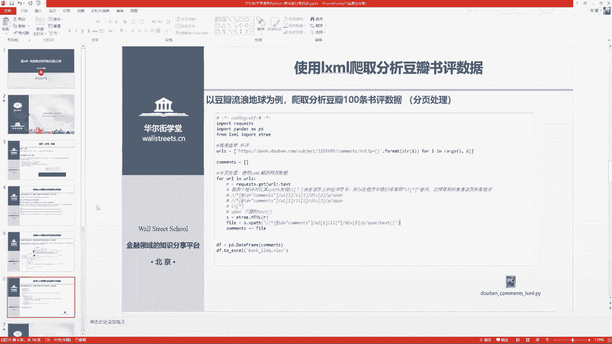