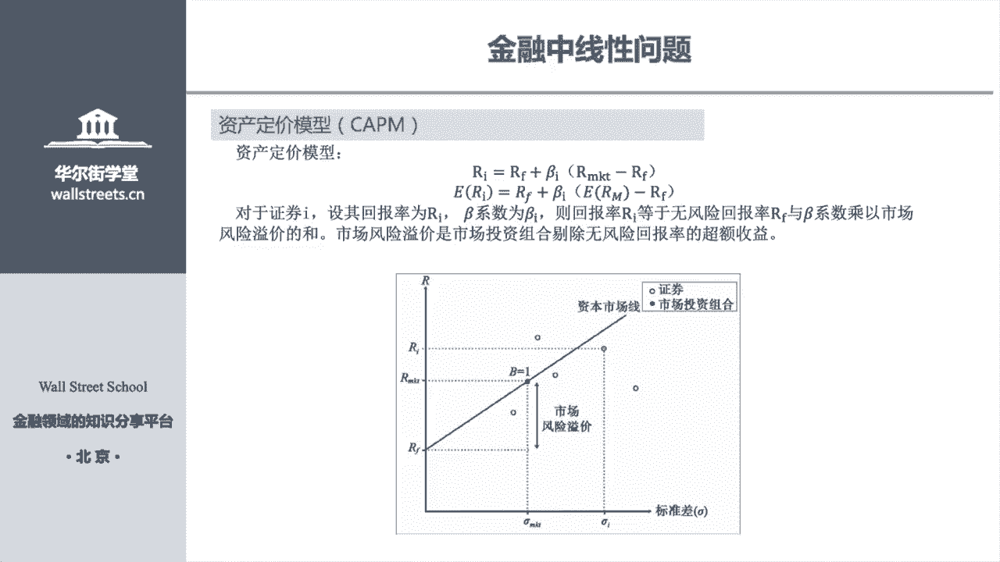
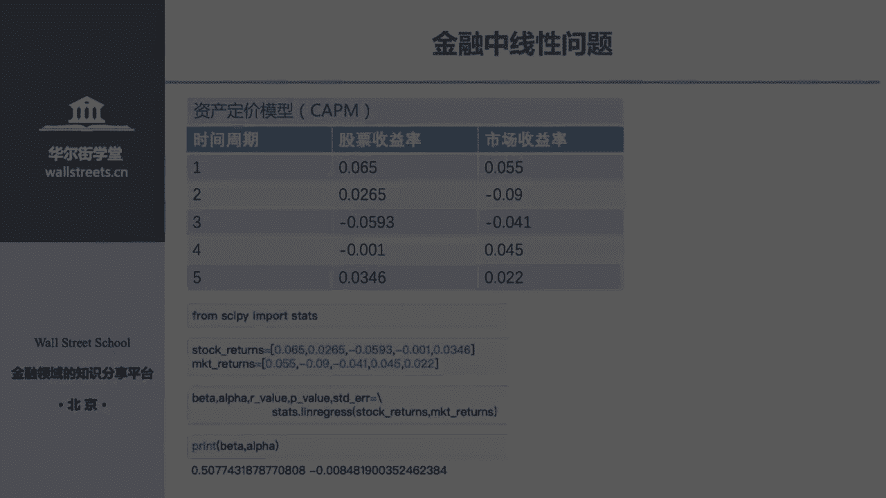
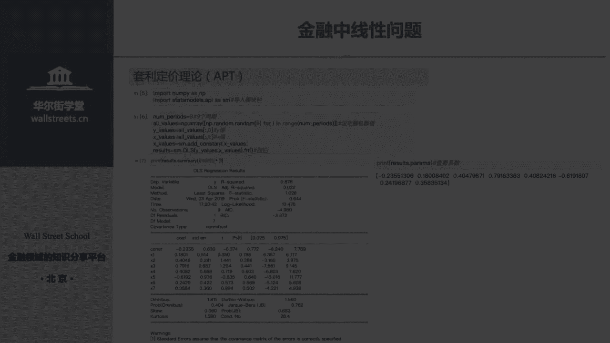
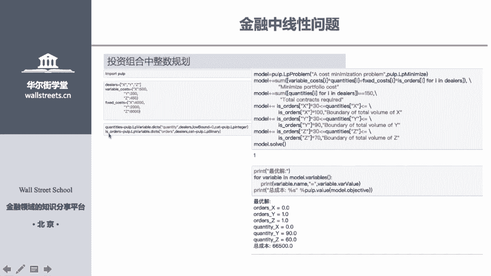
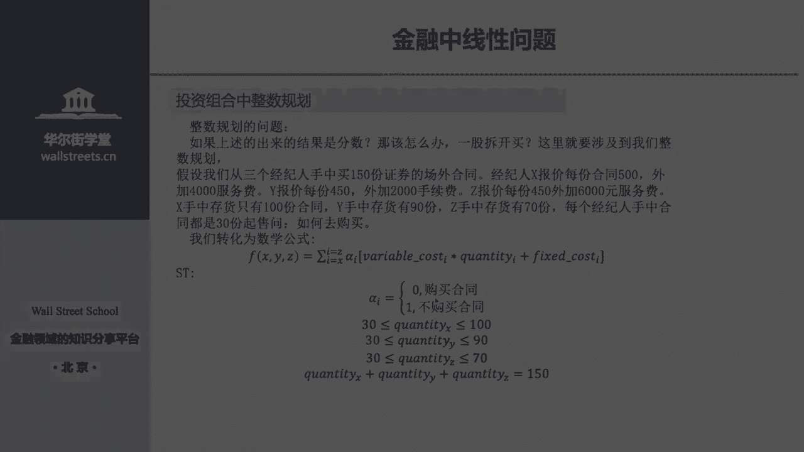
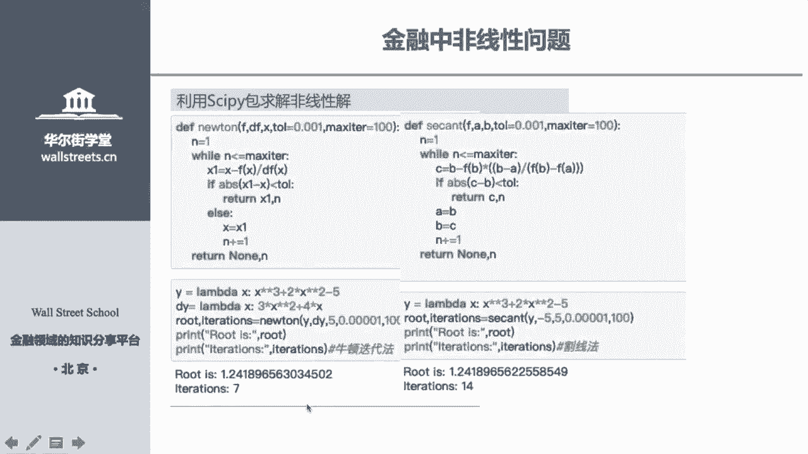
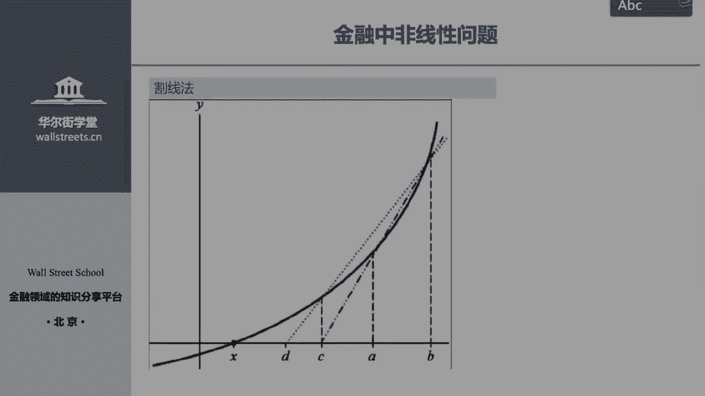
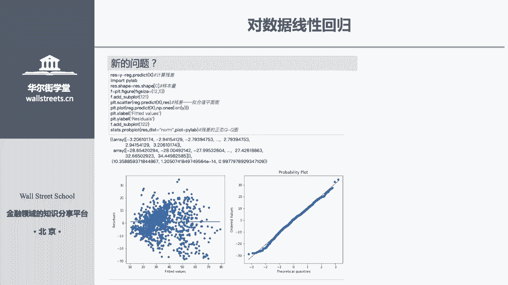
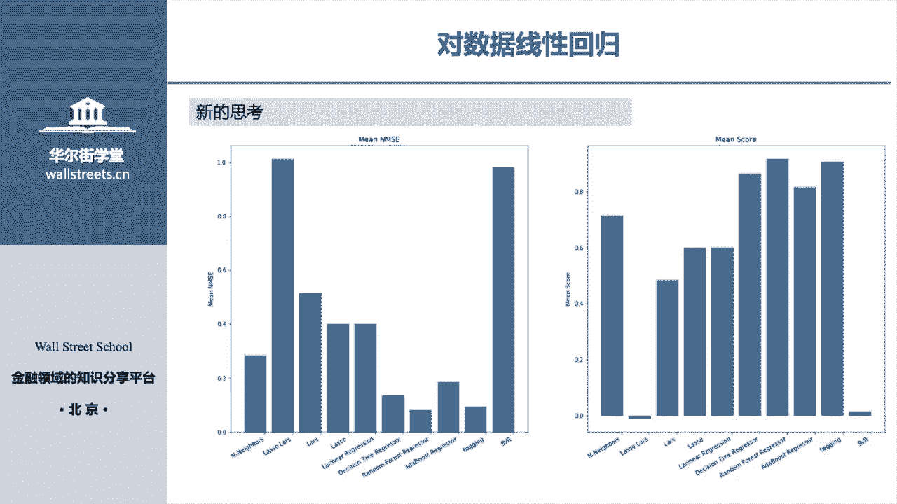

# 14天拿下Python金融量化，股票分析、数据清洗，可视化 - P18：01 金融建模 - 川哥puls - BV1zkSgYZE54

各位华的学堂的学员们，你们好，今天特别开心，能跟大家去讲Python的京东函数与京东建模，讲这些课之前呢，我给大家提三点小要求，第一个就是说大家不要把拍子想太难，因为你们可能很多都是嗯都是经管类出身的。

没有接触过编程，可能很多人没有接触过编程，而对Python有一个未来的程序，其实Python它不是一个底层语言，它非常的简单，大家一定要抱着不要，大家一定不要抱着未来的未未来的心思去学，语言。

一定要放轻松，第二个就是说，既然学你选择学习Python的话，那有一个要求你是一定要达到，就是我们今天讲的内容，你下去一定要自己要练一遍，这个东西，它主要是个应用型的东西，你不练的话。

你是不能去掌握Python的，所以说两个要求，第一个大家不要害怕，大家一定要好，就是我给大家去讲，大家一定要好好学，第二个一定要去练，你不练的话，你光听你肯定是学不好Python的。

就这两个简单的小要求好，我们来看一下今天要求的，今天要学的东西是哪些，第一个第一个就是要讲一下呃，一些基本统计分析，第二个就是讲一下数据的标准化，离散化，第三个就讲一下就是个线性问题。

第四个就讲一下一个非线性问题，第五个就要讲一下，对数据做一个线性回归好，首先第一个我们要讲一下，就是基本统计分析，然后基本统计分析其实特别简单，它这些基本统计它就特别的简单，主要是求哪些东西呢。

主要是求求和求积累加累积均值，中位数，中位数，标准方差，极大值，极小值，相关系数协方差和为值，我们这讲这节就主要讲求这些东西，然后这些东西都可以用一个Python包来求。

那就是long派这个Python包，然后这个英语单词并不是说我们对这个说明的，进行一个翻译，这些单词它都是这个求这些，求这些后面说明这个值的一个代码，可能你现在不太明白，那我们接下来给大家去演示一遍。

大家就明白了，好第一个为了达到为了给大家一些演示啊，所以说我准备就直接用一个number，派他自己带带附带的一个，就是生成随机数的一个函数，生成四行五列的一个随机数，通过这个随机数来演示。

就怎么去求这些随机，就是这随机数组成的一个数据框的一个求和，求集等等一些形式，好第一步我们先导入long派这个包，就input long派XZNP导入之后，我们用它来生成一个四行五列的一个随机数。

怎么生成的，就是long派RNNDOMR，点RNDN就这样一个代码，而一个括号四五就这样生成一个四行五列，一个随机数，而我们给这个随机数矩阵取个名字，叫做a arr好，我们看ARR的一个情况。

把AR输进去之后，就是这样的一个随机数，一个矩阵好，接下来我们来从求均值开始，首先才给大家说了，求均值都可以，就是我们前面所有的求法，都是可以用一个包来求的，那就是long派，知道吧。

然后旁这这篇对应的不是英语单词，这边对应的并不是说，我们对应的这边对应的并不是英语单词，而是它的代码，所以说我们求均值用的代码就是means m a n，然后怎么求呢，首先我要求整整体均值的话。

就是我所有这个数据框里面，所有数的整体的均值话，我就是n p me是RAR带进去，这蹦出来的一个数，就是我所有这个随机数组成数据框的一个均值，然后求到这一步呢，其实我们对未来还是有一定的要求的。

比如说我未来我并不想求整体的未来，实际应用中我并不想求一个整体的均值，我只想求我每一行的均值，怎么去做，非常简单，我们在里面再加一个参数就OK怎么加呢，就用AXX等于一这样的一个参数加进去之后。

它就会求出我们每一行的均值，比如说下面np mini a arr点AX2X等于一，然后带进去之后，带进去之后，然后他就会蹦出来四个数，就0。64，0。64是什么，0。64就是我第一行的均值就是0。

243，0。2432577，0。8，312，1。08，1。4×0。129，这些均值它也是等于0。649，然后同理-0。08，它就是我第二行的均值，0。07就是第三行，0。23就是第四行。

所以说是不是so easy，而我们求了每一行的均值，比如说我想求每一列的均值怎么办，你把ASS等于一改成零之后，它又求成了每一列的一个均值，比如说我把ASSD1等于零带进去之后。

同样的NPMAN求均值的函数HOAR再求，再加个参数，ASS等于零，它就是求每一列的均值，求每列均值之后，你会发现它蹦出来五个数，为什么是五个数，因为我有五列啊，所以说它就蹦出来是五个数啊。

而第一个数就代表我第一列的均值，第二个数代表第二个的句子，第三个数就代表第三个均值，所以说是不是so easy，这样你是不是就掌握了求均值，求人力的均值的方法，求每一行均值方法和求每一列的均值方法。

然后你掌握了这个求均值的方法之后，接下来我给大家说非常简单，举一反三，如果你想求你，如果你想求整个整体的中位数，怎么求，直接NP对应前面的代码，中位数字对应是什么，B点MEDIN对不对。

就跟P点mm e d i n r单区就整体均值，然后求每一行的均值就等于ASS等于一单据，就是每一行的中位数，对不对，NP每一行中位数带去AI，SI等于就每行中位数。

然后每一列的中位数就是AI34等于零，对不对，然后最大值最小值，而我的标准差，我的方差其实都可以用这样的方法去求，是不是so easy，是不是举一反三你就掌握了呀，所以说大家一定要好好理解。

大家一定要好好的去下去去练一下，这个是so easy，如果说你没听懂，你再回去再听一下，根据这个来举一反三都是一样的好，我们来再看一下，下面下面这个叫做CUMSM都是什么，这是一个累加的公式。

什么叫做累加呢，举个例子，比如说我现在有个数就是1234，而我求他们累加是怎么求的，比如说这个数列的累加数列怎么求，第一个就是一，第二个就是1+2就等于三，就等于三，1+2就等于三。

然后下面就是1+2加上三就等于六，下面最后一个累加数就是1+2加三，加四等于十，所以说累加数列，就是等于它前面的数列之间相加，所以说各位能明白吗，然后说累加数列就是这样的一个形式，然后累加数列怎么求呢。

同样的mp把累加数列的函数给输进去，而我求等于零，就是我每一列的累加数列，知道吗，就可以求出每列的标准，然后下面就是一个累积的数列，累积的数列的概念和上面累加数列一样。

就是把每一就是我每一个累加数列的呃，累加数列的前面一个值，就是我累加数列的这个值的由来，就是用前面的数列的值相乘得到的，而我这个是求每一列的累积累积数列，知道吗，累积数列也是一样的，可以修。

然后下面就是求唯一值，也是同样这样的一个方法，就同就是一样的NPIQNP，然后后面的分P，然后把我们前面那个代码顺序，OARR对应的代码顺引LAROAS，IS等于零，就等于等于行vs x等于一。

就等于列，这样求为值这样的一个算法，所以说特别的简单好，接下来我们要求的就是相关系数，因为相关系数是需要两个两个数列，两个数列，然后所以说我们就生成了我们又生成一个数据，就BRR根据前面生成AR方法。

就又生成了一个数据额数据，随机数据数据框，然后相关系数怎么求呢，同样的道理，NP然后点把我们相关系数代码写进去，然后一个括号把我们两个要求相关系数的两个，两个数据框给带进去，就得到这样的一个相关数列。

list的两个list带进去就得到这样一个相关数列，而协方差同样的，这样就可以求其方差，所以说一个包搞定你所有的，我们这一讲的所有内容好，接下来要求的就是一个直接数，和一个重数的情况。

首先我们来讲一下什么叫做直接数，值系数是什么呢，直接数就是说呃举个例子，就下面这个值机数就33124，34656这样的一个数，然后就直接数是什么呢，就是说我每一个我在数列中，每一个元素出现的一个次数。

比如说我的三是出现了三次，那我三的值系数就是三，我的六出现了两次，那我六的质数就是二，所以说这样就是直系数，然后怎么求值，说到这里，我们要用pandas这个包好，先把pandas as给引进来。

就import pandas是pd，这个是很常见的一个包，而我们在输入一个数列，令它等于S就是33124331，而我们用pd，然后点value，然后点COUNTS，直接输这个这个代码填进去。

然后把直接把S给填进去，这样就可以得到我们直接输的，这样的一个一个情况，就是我们的三次出现了三次，我们六时出现了二次，我们四时出现了两次，对不对，这里我们就称为索引，这里就是称为我们的这期数。

接下来我们在，我们要在直接数的情况下来求众数，什么叫做众数呢，众数就是表示，我们这个列表中出现最多的一个数，大家看我们通过直接数来看的话，你知道我们列表中出现最多的数是哪一个吗，肯定是三啊，对不对。

三出现了三次，那三它就是我们的一个众数，对不对，所以说我们只要把我们实际数最大的一个，我们只要把我们职级数值系数里面，最大的那一个数给找到，是不是就是我的正数啊，对不对。

怎么求第一个引破的pandas是先把求，然后把我们的数列数进去，然后先把我们C数求出来，然后令它等于SSSS，就我们求的质数，对不对，好我们接下来我们就用number派这个包来求来返回。

我们就是直接数最大的一个索引，我刚才跟大家说了，这一列就是我们的索引，就是我们列表中的数，这一列就是我们直接数，而我们值余数最大的索引就是我们的一个众数，各位能明白吗。

我们只是说最大的索引就是我们的众数，就是我们的三三，就是我们那个众数，从而达到在直接数的情况下，求众数的一个一个方法好，接下来我们要讲数据的标准化和离散化好，为什么，首先我们要明白。

为什么要进行数据的标准化和离散化，我们现在讲数据的标准化，为什么我们要做进行数据的标准化呢，因为有一个问题在这里，比如说呃举个例子啊，就说现在银行给了我一堆数据，就说要我测试客户的违约。

然后我的每一行是我们每一个客户的一个情况，而我每一列是我客户的每一个属性的情况，比如说客户的年龄，客户的年龄这一列是客户是客户的属性高，比如说客户的年龄，客户的收入和客户的一个存款。

比如说我们客户的年龄是多少，肯定客户年龄这个这个水印是多少，客户年龄这个属性的取值范围是多少，是16~80之间，对不对，好我客户的收入是多少，是比如说家庭主妇，如果我客户是家庭主妇啊。

他的收入是不是零零元，对不对，如果说我们客户他的他是一个像我一样的马龙，他的收入是不可能就达到2万多，对不对，这都是有可能的，而我们客户的存款是多少呢，比如说你客户存款，你可能你的客户他没有存款。

所以说是零，而你的客户可能是千万富翁，他就他总来就可能有1000万，对不对，好，我们来看这三个特征的，就我们用这用收入，用年龄，年龄是年龄，收入，还有年龄收入，还有存款这三个来特征来形容一个客户好。

我们来看年龄这个特征它的范围是多少，你们年龄特征是不是说了16~80，对不对，而我的收入的特征多少是不是零到2万，对不对，而我们的额存款多少是零到2000万，对不对，好。

我们来看他们的范围是不是相差特别特别大呀，对不对，一个是零到，一个是16~19，你的相差只有两位数，一个是零到2000，你相差就有三位数啊，更夸张是我的存款零到2000万，那你的相差是有多少个数啊。

对不对，那这样的这样的范围的一个差距，会对我的模型的精度有影响吗，我告诉大家会有影响的，而且主要是对哪些模型有影响呢，就是我们的所有的线性模型，包括我们的线性模型，它的衍生的一些模型都会有影响。

包括我们下节课要讲的就是一个逻辑的回归，它就是线性模型的一个改造，所以对它的精度受影响，所以为了解决这个影响的问题的话，我们就会对它进行一个标准化，什么叫做标准化呢，一句话给你给大家解释。

就是我们把所有的特征，把它缩到同样的一个范围，比如说我把所有的特征，我把它缩到0~1这样的一个范围，就得到了一个标准化的，就达到一个标准化一个情况，所以标准化主要是来处理就特征之间的范围。

以降低他们就是以以提高我们模型的精度好，首先标准化的方法有哪些呢，第一个就是最大值标法，第二个就是这这个这分数法，第三个就是LOL函数的转换，首先我们来看下这三个方法是怎么去算。

比如说最大值最小值法是什么呢，就是用我的最，就是我我本来客户就是用我的最大值，就是我用用我的最大值，就是用我的这个数减去我的最小值，除以我的最大值减最小值，这样子得到了一个得到一个数。

然后去替换我的X这个数，举个例子，客户最小是16岁，最大是80岁，好我现在我客户现在这个客户，比如说现在这个我随便提取，从这个客户里面提取一个他的年龄是多少，他的年龄是20岁，然后我们就用20岁。

用什么样的值来替换它呢，首先我用20-16=4，而我用80再减去16，我用二等于四，再除以80，减去16之后，是不是得到了一个0~1的这样的一个值，就是X1撇啊，对不对，然后我用X1撇替换到X。

这样是不是就达到了我对对，对我客户的年龄的范围的一个缩放啊，对不对，同理我对客户的收入，可以就用这个方法进行一个缩放，都缩放到0~1这样的一个范围，对不对，所以说这是其中的一个缩放的一个。

这样就是其中一个标准化的一个方法，就是把我的一个范围进行一个缩放，缩放到全部都做到0~1这个范围，而第二个就是最得分的方法，这得分方法它和上面的方法是一是一样的，意思就是我要把我的所有的特征的呃。

一个一个一个形式进行一个标准化，就是我帮怎么进行标准化呢，就是我让所有的特征，它们总体的均值和标准差一样，就这样子达到一个缩放的一个范围，第三个就是逻辑的逻辑的呃函数的一个转换。

这个转换就是这样的一个方法，同样也是可以达到一个缩放的一个，这样的一个目的，好我们来接着看，接下来看第一个怎么进行规划，首先input pandas，用pandas这个包来传递，而用data。

首先为了达到缩达到达到标准化的，达到缩放的话，我们是用pandas as来处理，首先我们要对pandas as进行对ARR，这我们常用这个强，按这个随机数矩阵进行一个转化，把这个随机数矩阵呢。

我们要把它转化成一个数据框的一个形式，怎么转化，就是PTALDATA还发个M1，这样进行个转化，我们就可以转化成下面这样的一个，数据框的一个形式，而接下来我们就要把我们上面讲过。

就是我们标准化缩放的一个方法，接下来我们就用我们上节课得到的内容，就是data减去NP命令，然后一个斜杠R，然后NP，然后再n p max最大值减去我的最小值相除，就替换就得到我们贝塔一。

然后你到这里你会有疑问，比如说呃老师这里很奇怪啦，你不是说呃n p mini什么都不加的话，他是不是对所有的一个对所有的一个呃，一个值进行对所有的一个值进行一个求最值啊，你这什么都没加。

那那但是你要求的是每一个特征的一个最大值，最小值，我每个特征是我的每一行，比如说这是我的0号客户，一号客户，2号客户，3号客户，而这里这是我，这是我代表我的每一个特每一个客户。

而上面这每一列是代表我的每一个特征，比如说我的年龄，我的我的收入等等这些特征，那我们是应该对列求最大值和最小值啊，那你这么求，那你这样子是不是求的是每一行，就要是没有达到我们这样的一个情况啊。

就没有达到多，其实这里是有一个要注意的地方，就是说我已经对它进行数据转化之后，那我再输入，就这已经是一就是data，已经是一个数据框的形式之后，我再用NP命令的话，其实它是默认为我直接是对行。

对每一它默认为我实际上是对每一列求最值，各位明白了吗，我默认是对每一列求一个最值，所以说我我就不用再加了，因为它已经默认了，所以说就不用再加了，就这样就可以求出我们每一列最大最小值。

而我们用我们的数据减去我们最小值，所以我们最大值值减最小值，就是对我们每一列进行一个标准化，好接下来我们再提供第二种思路，因为因为上面这个思路，因为下面这个输入可以达到同样的效果。

就直接用贝塔和一点MM命令，就可以得到我们的最小值，然后每一列的最小值，然后下面的data max减去我们最小值，然后得得到我们每一列最大值，减去每列的最小值，这样得到我们这样的一个情况。

好说到这里说到这里的时候，有一个要给大家注意的，就是说大家不要看这两个是一样的结果，但是我们用的原理不一样，这这个求最值我们用的是long派这个包，就NP这个包，但是下面这个值的话。

我们用的可是用pandas as这个包啊，为什么你们可以看贝塔等于pd对不对一点，然后这里是不是我们可以叠塔进行替换，是不是pd d a t f m a r r，然后再点一个命令，对不对。

所以说上面下面这两包，一个是U跟P这个包，就狼派这个包，一个是用的是pd这个包，就是盘法这个包，所以两个包它是用的不一样的一个情况好，各位明白了，我再给大家回顾一遍，首先首先给大家讲一下。

数据框的格式是什么样子，数据框给了我一堆客户的数据，对不对，而我的每一行是代表我们每一个客户，对不对，每一列是代表我们每一个特征，就是我们客户的特征，比如说年龄，然后大小，然后收入。

然后存款这些特征对不对，行是代表客户列，是代表我们的特征，各位明白吗，所以说我们归一化，是不是要对我们的特征进行归一化，我们就用上面的方法，然后我们的如果我们把我们的数据转化为额嗯，转为数据框的话。

那我们默认的话，默认的是我们就不用再输入AXX等于一，这样的情况，因为我们默认的已经是对列进行转，进行一个求最值的几个情况，所以说我们这样就可以达到我们一个呃，实现我们的最大最小的一个规划的一个目的。

而接下来我们来看，接下来我们来看最得分的一个方法，这得分方法就很简单，同样的把我们这个式子代入，就data减去NP求均值，然后再除以我们求一个嗯方程，求一个标准差，然后我们这里就有一个陷阱。

各位来看一下，上面我们前面是用两种方法，一个是用，一个是用NP，一个是用潘，一个是number，一个是用number派这个包，一个是用pandas as这个包求出来方法是一样的，没有问题。

但是同样的上面我用NP这个包来求均值除以，求方差进行相除啊，下面我也用我用p pandas as这个包求均值，求方差进行一个相除，它为什么它们的值不一样呢，这是什么情况，这个情况各位一定要注意。

就是说就是说大家不要看我的代码是一样，都是STD，其实他们的本质上已经发生了改变，因为前面是用long time这个包，下面就用pd这个包，可能这两个包求出来结果不一样，它们的区别在哪里，各位请看这里。

我用NP求的，我用NP求的标准差没问题好，我用我用pp d求，我用panda的求的标准差，它就它就不一样了，为什么，因为我们求方求标准达，它有一个它有一个就是你学统计学的时候，有没有学过一个无偏估计。

就是说你求方差的时候，可能会涉及到一个无偏估计的问题，上面它是对一个样，它是对一个上面它就没有用到无偏攻击，他直接求的是样本的，就直接求的是样本的一个和标准差，下面这个pandas as这个函数。

它是用的无偏估计的，如果我们不用，如果我想用pandas as求我，如果我用pa的球，这个包球不是无偏估计的话，那我只有直接就是不用，不是求无偏估计啊，那我直接把这个函数带进去，我发现这个不是无偏估计。

他们求出来和我跟皮球的包是一样的，好这里疑问就来了，为什么这里我们到底是用求样本的标准差，还是用我们用无偏估计来求总体的标准差呢，答案是用无偏估计来求总体的样本差。

所以说我们得用pandas as这个包，因为pandas这个包，它默认的它就是求无偏估计总体量M差，所以这个函数是对的，所以我们就用下面这个情况好，这里同学我再给你再强调一遍。

就我才能讲到为什么上面是用long，就用狼派这个抛球的，下面就用panda这个抛球的了，因为我前面没有，前面没有pd啊，我前面没有pd啊，你怎么能说明我调用的是pandas as这个包呢。

上一页PPT我们已经讲过，我们可以看P，我们可以看data的组成，是不是PDDATAFRAME啊，对不对，所以说我们把它给替换一下，就是我们把它给替换一下，他前面是不是就有个PD量。

所以说我们下面这个实际情况，他们就是用p pandas as这个棒来求的一个标，一个标准差，所以说各位要注意了，就说我们标准差，他们的代码虽然是一样，但是包每个包他们的标准差，他们尽管但凡是一样。

但们求出来的数可能会是有细微差别的，这个这个大家注意可能会在你的日日后编程，今日后工作中会用到好，我们来接下来讲一下，就是呃log传输转换怎么求，首先我们就用额，先把我们的。

就是我们的分分母的一个幂给求出来，JP等于log，就是NP等于log4，然后贝塔a abs是求绝对值，而绝对值的最大值好讲到这里呢给大家讲一下，就是说一个就是一个刚入职的一个新手。

怎么去学习Python呃，因为我们的Python这个每个包里面的函数，特别的丰富，要遇到你不会的包子，不会的函数怎么办，给大家讲百度对，不要害羞，这都是每个人的必经过程，你不百度，你你不百。

比如说你不知道怎么求绝对值的话，你现在你你就去百度去百度，就是Python绝对值去百度，然后第一遍申第二遍熟，然后把这些都记下来就OK，大家不要害羞，因为你现在可能是这个样子。

就是说你你可能你每个包的你的函数，不可能你每一个都用到，你只要挑你自己以后工作能用到的包，把它熟练掌握就OK，如果你再有时间的话，那你再去慢慢的学习每一个包的用法，通过这样的一个循序渐进的一个过程。

所以说这样子我们就可以这样子，我们才可以把Python就是在有限的时间内，可以让我们Python更加的实际的去运用到，我们的工作中，好就这个很简单，就是我们把我们的数字给带进去，用NP这个包。

把我们数据的每一列的绝对值给求出来，然后再求求绝对值的最大值，然后在前面求取一个洛格斯，取一个洛格式，然后再把我们的呃幂幂求杂之后，再代入我们的数值进行计算，就是我们DR3就进行了一个弱的一个转换好。

接下来我要把标准化的一些再给大家梳理一遍，首先第一个我们标准化是为了求我们的特征，就是我们数据给我们一一个数据框，我们每一行成为我们的观测者，就是我们银行的，就是给我要我预测银行客户违约率。

那我每一行就是我的客户的一个情况，就是客户的一个情况，而我的每一列就是我客户的特征，比如说我的年龄，比如说我的年龄，我的收入和我的我的存款，这样的是我特征的一个情况，而我们的我们的标准化。

主要是对我们的特征进行一个缩放，就是把缩放到一定的范围，因为如果它们的范围差别过大的话，会对我们模型的精度有影响，所以说就经过这样的一个情况，进行一个一个转化，然后对我每列进行缩放的话。

其实我们把用pandas转为数据框的话，我们不再不用再进行ASS等于一这样的代入，这个ASS等于零这样的一函数的代入，因为我们默认因为panda这个包用n p number派。

用long派这个包进行进行求最值的时候，它已经是默认为对列进行求最值，所以说我们不用再进行逆转，然后还有一个注意的地方，就是说呃我们的大家一定要注意我们的每个包，他们仅我们每个。

比如说long派这个包和pandas子这个包，他们可他们的求各个值的代码是一样的，但是他们求出来的值可未必不一样，这是我们比较容易遇到一个陷阱，最后一个就是说呃大家如果刚学Python，有些函数。

你不可能把一个包在短时间内全部掌握，那你就学就找你自己需要所用的，尽管去百度去找，不要害羞，这是大家必须要经历的一个过程，因为pandas as它，最近pandas as它最它始终是一个工具。

它说我们是越熟练越就越用越熟练的一个好，接下来我们来讲一下数据的计算化，也叫分析法，我来给大家讲一下什么叫做分销，什么叫离散化，也称为分享法，就举个例子，我们刚才客户的年龄是不是呃16~80，对不对。

我把16~30我划分为划分为7年，然后31到呃，30，31到呃45，我划分为呃中年，而45到呃，45~65，我划分为中中呃，中老年，然后65，66~85划分为老年，就这样子对我们的一个数据进行一个分段。

然后我们六在我们离散化之后呢，我十我我16岁和我的30岁都是为青年，所以他们的级别是一样的，通过这样的一个过程就叫做离散化营销分加法，为什么要进行离散化呢，首先第一个就是说部分模型它的问题，举个例子。

比如说线性模型它对呃，它对就是数据，它对数据的大小特别敏感嘛，举个例子就说我们的年收录呃，比如说我们在上海，我们的年收入是我们年收入家庭主妇零元，对不对，还有一个年收入是呃2000块钱。

还有一个一个人的年收入，他是2000块钱，那我们的年收入里面和我们年收入2000块钱，其实他们的在年收入这个水平上，其实他们的差别并不大，对不对，都属于那种呃没有收入或者是低收入群。

然后这样的话其实他们其实是可以分为一类的，但是我们的线性模型会认为，我们2000块钱的年收入，和我们比我们零千块钱的年收入，它的它的影响会特别特别的大，所以说这样子，会导致我们的一个模型的一个不准确。

因为它对我们的这个数字太敏感了，导致我们模型的不准确，第二个就是说我们的离散化，可以帮我们去处理一些异常值，好这个我们将下面会讲，下一讲会讲，第三个就是我们的离散化，它可以帮我们去做一个信用评分卡。

这个也是我们下面的信用评分卡的一个内容，而我们第三话主要分为两个内容，两个方法，第一个是等于评，第二个是等，第一个是等宽，第二是等平，首先我们来看等宽分项就是等宽体上画。

等宽体上画的就是我们的取值范围是一样的，就是我们分段的每一个每一段的它的范，它的取值范围是一样的，这就像我们的等方分项，Python怎么实现呢，我们先做一个含有十个随机。

还有十个正态分布的随机数来作为我们的样本，然后给它们取名叫做normal吧，然后这样子输入，这样进去，我们来看一下我们的样本的情况，你看我们normal下面就有十个呃，十个随机数。

然后我们对十个随机数进行一个等等宽分项，就是让他们的额样，让他们的分段的样本都是一样的好，进分段的范围都是一样的，好我们来看一下，这都用，就把我们这就把我们这个数据分为了五段，分为是-1。099到-5。

18，然后-0。518到0。051559，是这样子放，是他们的每一个分项的范围，是不是取放都一样的呀，然就分成这样的五份，然后看我们的-0。5083是在哪一个，哪一个哪一个范围内啊。

是不是在我们的第二第二个范围内啊，所以说进行分了之后，它就变成了我们的一个第二个范围，而我们的0。298，是不是在我们的第三个范围里面，就替换成我们第三回，就这样子就可以把我们进行一个分项。

然后让它成为处于一个同样一个呃，这样的一个就是不不同数处于同样的一个级别，然后我们可以在我们的分段里面加入标签，比如说我再加入一个参数，叫做呃，叫做labels，然后12345加进去。

它就可以对我们进行一个贴标签，一个贴一个标签，然后比如说第一个我把它贴为第一个，我把它贴为一这个标签，第二个贴为二这个标签，第三个贴为三这个标签，第四个贴为四这个标签，第五个贴为五。

这个标签我们看我们第一第一个数-0。5，是不是在第二段里面啊，对不对，它是不是就是我们的标签二，对不对，通过这样子可以进行一个标签，而我们的beans b i n s，就是一个分段的一个数啊。

其实五和这个是一样的，好我们来看一下，我们不仅是我们可以贴入数字标签，我们还可以贴入一个字符的一个标签，比如说我们贴为好和坏的标签，好和坏的标签我们就分为两段，对不对，通过等宽分为两段。

然后BINS分等于二，就分为一个好坏，这样的一个等宽分项的一个标签好，第二个就是等身分项，也是等平分项，而等平分项是什么呢，就是他们每个每个分箱的宽，那个宽度可能不一致。

但是他们的每一段里面的就是频数是相同的，就是我们每一段里面的，我的样本的个数是相同的，各位能明白吗，好等，评分项我们主要是找找我们的分位数的分项，比如说我们分两箱，我们找0。5分位数。

就通过这样的方法来找出我们的分位数，找出我们的分位数了，我们再代入到我们的put cut这样的一个函数，病死这样的一个函数进行一个分享，然后就可以这样就可以完成一个分享，同理我们就可以。

我们也可以对它进行一个标签，而这个代码大家大家这个代码给大家，大家要下去一定要操作一下这个代码，操作简单，等评分项就是找仓分位数码，然后把我们分数调到下面这个函数里面去，然后我们BNX等于我们的分位数。

然后进行这样子，就可以完成一个等平的一个分享，接下来我们来讲就是金融中的一些线性的问题，而线性的问题了，提起线性问题，其实我们主要是分为三类，第一个就是我们那个回归的问题叫线性回归，而我们的第一讲。

第二讲就主要是涉及的是线性回归的问题，第二个就是线性规划，就是你们高中的，就是我们高中时候学的就是说给一个目标函数，然后给一个约束条件啊，而求这个目标函数最大值和最小值，最后会拿一个尺子在那个图上面画。

然后画出来个点出来，这个叫做线性规划的问题，然后我们的投资组合，和我们的一个投资组合中的信息化，和我们投资组合中一个整数优化，还有一个就是求方程组的问题，就是我们最后一个就是矩阵解，线性方程的一个问题。

好来看，第一个就是我们的一个回归的问题，首先我们来看一个大家都比较熟悉的模型，就是资产定价模型叫做CAPM，可如果不知道各位的学员的背景是什么样，如果你是学商科的话，你学过金融学或是投资学。

那你一定对资产定价模型比较熟悉，但如果你没有学过这个资资产定价模型呢，那你不要，那你也不要着急，因为这个模型特别简单，言简意赅的来讲，就是说我们用市场的一个收益率，来预测我个国证券的一个收益率好。

我们来看它是怎么构成的，首先我们的RI就是我们的一个证券的收益率，而我们的RM k t，是我们的一个市场的一个收益率，RF是我们的一个无风险收益率，而我们的市场收益率，减去我们的服务风险收益率。

那就是我们这个风险溢出，然后我们我们的市场收益率，减去我们的无负盈利率，这样得到一个风险溢出了，乘上我们的贝塔系数，再加上我们那个无风险利利率，就是RF，就是我们的一个对。

对我们的一个呃证券的一个收益率的一个估计，好这里我要给大家说的是什么呢，就是说其实是我在着重讲的，就是我们的贝塔系数，我们贝塔系数是什么呢，贝塔系数就是就代表着我们证券的收益率。

对我们的市场收益率的一个敏，一个敏感的一个系数，然后你问这里，可能要问我这个贝塔系数，明明乘的是我的市场市场收益率，减去我的无风险收益率，然后无风你为什么说他是只是乘，他只是说贝塔系数。

它只是我们一个证券收益率，和我们市场收益率的一个，对市场收益率一个敏感系数了，那无风险利率又是什么个问题了，其实这个无风险利率是一个固定的一个指数，我们给出来的一个值，然后我们这里主要做的就是。

用我们的市场的一个收益，来预测我们的一个正确的一个收益率，所以说你可以对这个式子进行一个拆解，你会发现你会发现如果你把它拆开的话，你会发现贝塔I乘以我们的IF，其实它是一个固定值。

但是我们贝塔I乘以我的RR，就是它乘以我的市场收益率，它它其实是以我的一个自变量乘以一个系数的，预测我的因变量，我的证券的收益这样的一个情况，所以说我们贝塔只是和，只是能说明是我们的一个呃。

只是说明我们的一个就是证券收益率，对我们的一个市场收益率的一个敏感系数，然后你把它具体化，如果各位学员谁，你把它拆开看，你就知道了，然后为了对我们的现现实情况进行，进一步扩展了。

我们对下面我们进进一步推导，就找下面一个公式，就是说我的四我的市场的一一是我的期望，意思就是我市场收益的期望，减去我的无风险利率，得到一个风险因素，然后乘以我们的备胎好，再加上我们固定收益率。

就等于我们的证券收益率的一个期望，就得到这样一个式子，然后这样一个式子，我们这我们怎么在我们的呃R语，在我们的一个Python里面的进行一个应用呢，你们来我们来接下来看这这一页PPT。

然后这页PPT就给了我们两组数据，一个是股票收益率RI，还有我们的一个市场收益率，就是RMKT，然后根据这两个数据，我们能求什么出来了，我们刚才说过我们的贝塔系数。

如果我们把它给拆开，发现贝塔系数I贝塔系数，它就是我们的股票收益率。

对我们市场收益率的一个明一个敏感系数，所以说我只要对股票收益率和市场收益率，做一个回归分析，然后求出我们市场收益率的一个被市场收益率，前面的那个贝塔系数，贝塔的话，我们就可以得到它。

我们就可以做个回归分析，得到它那个贝塔系数据，举例情况就是这个样子，比如说我的股票收益率是我的RI，它就等于，它就等于我的贝塔乘以我的RMM，就是我市场收益率，再加上我的截距项。

所以说得到我们的一个市场收益率的一个数据，和我们的一个股票收益率有数据，其实我们就可以通过回归分析，得到我的贝塔系数，这样大家能明白吗，然后怎么做呢，然后我们通过怎么做回归分析呢。

说我们就通过c pi来做一个回归分析，然后就from c pimport，然后一个STATS这样得到一个值，然后首先我们要把我们的数据输入进去，我们股票收益率0。650。265，然后-0。593输进去。

然后把我们的市场收市场收益率也输进去，m k d return等于0。55，而负0。090。0410。450点二，我都输进去好，接下来我们我们就对它进行一个回归分析，怎么做，回归分析的就是STATS。

点LNIEJESS，然后一个括号把我们两个数据给带进去，这样就可以做一个回归分析，然后这个函数呢它会出现四个值，分别是我的贝塔，就是我我的贝塔系数，然后阿尔法就是我的截距项。

然后这r value就是我的一个相关系数的一个值，p value就是我的P值，然后然后s st d e r就是我的一个标准方差，就是我一个标准误差，长沙的一个标准误差，但是这个我们说了。

我们只对我们的贝塔系数感兴趣，然后我们就可以把我们贝塔系，我们可以把我们的贝塔系数打出来，就是0。557，所以说我们通过回归分析就可以求出，根据市场收益率和股票收益率，对它进行一个回归分析。

我们就可以得到我们的贝塔系数，就0。0。5077，然后这个贝塔系数，我们就可以调到这个公式里面去给出，就是给出我们的市场收益率，再给出我们的无风险利率的话，我们就可以求出我们对我们证券的一个收益率。

的一个期望这样一个值，然后求出来这个期望，这个值主要是什么，其实主要是来看我在现实中现实运动，其实主要是来看什么呢，主要是来看我对这个债券它是高估还是低估，比如说我的实际收益率比我的期望收益率要高。

这说明什么问题，这说明我的债券的价格是被低估了呀，然后如果说相反的话，我们算出来的我们的期望收益率，我们债券的期望收益率，比我们的实际收益率要低的话，那说明什么问题，说明我们这个债券被高估了。

就是这样的一个CAPM一个定价模型，其实就是一个简单的一个回归分析，不知道大家能否理解好，我们接下来看下这样一个问题，然后我们的套利定价理论呢，其实APD模型，它就是一个多多因子的一个回归，分析好。

为什么要这么做了，首先有一个问题就是在于我的证券的收益率，难道只和我的市场收益率有关吗，这不一定的，因为它可能我的证券收益率，可能和我的一些宏观经济指标有关系，比如说我们的GDP啊等等，对不对。

还有我们一些我们证券它本来之间的一个属性，比如说派系啊，股息啊等等因素，是不是都有关系，对不对，如果说我们只用我们CAPI模型，这个单因子模型的话，他是不是有点说不过去，就是你太弱了，你对我的。

你对我最近收益率预测太低了，对不对，我们要再加入一些因子进去，我才能相信他靠谱的，对不对，其实它就是一个多因子回归的一个问题，好我们来看它是怎么来算的，第一个用我们这个是什么呢。

就是用我们的一些多因多因子这些因素，比如说我们的其他一些，比如说GDP啊，或者股息等等因素来预测我的证券的收益率，然后这里的阿尔法I是什么呢，阿尔法I就是我的一个截距项，然后我的F1就是我的第一个因子。

比如比如说我的GDP指数，而贝塔I1是什么呢，是我第一个因子的系数，对不对，而第二个因子就是F2，然后我们的贝塔二就是第二因子因素系数，直到我们最后一个因子FIN，就是我们贝塔IN。

就是我们的NN个因子的和N个因子的系数，然后其实这就是一个多元回归的一个问题，是不是很简单，而怎么来做多元回归呢，其实超级简单，首先我们用我们换一个方式来求第一个。

用我们的long派这个包就是NUMPY，然后第二个就是我们用我们的统计模型包，STAT还是models r API，然后用它为SM好第一，然后我们来做一个随机数来做一个，来来以随机数来做一个。

我我们的数据来做一个多因子回归，然后我们先用先用我们先让它有九个周期，然后就是NUM就是令它为九嘛，就是我们设定一个九个周期，然后我们每个周期都生成八个，就生成一个八个一个一个随机数组吗。

因为我现在要做的是想做有七个因子，然后然后其中第一第一遍数据是，为什么我要生成八个八组随机数据，因为第一组随机数据是我的一个预测值，就是我的我就是我一个预测的，就是我证券收益。

就是我的这一个对证券收益的一个期望，就是我的第一预测值，而其他的七个七组值了，就是我的七个因子，然后这这样的一个情况，然后我们就生成八个随机数，然后每一个周期就生成八组，随机就生成八个随机数。

然后第一个值我们就拿第一拿第一组，拿第一拿第一列这一组值来做，我们的一个预测值就是我们拿第一列的值来做，我们的一个一个值，就是我们设定为Y值，然后就是把value然后切进行切片，然后D组值。

而其他剩下来值我们都作为我们的一个自变量，就是我们的一个因子的值，就做我们一个音质的其他的数，其他的基础值我就作为我们的因子，然后就是除了第一第一个我们拿去做呃，答答一做因变量的值。

其他的七组自其就是一其他的七子，我们就拿来做我们自变量的值，就是我们因子值，然后我们就用SM点O2S就是最小二乘回归，然后把我们的第一把我们的第一组，把我们的预测值带到这里去。

然后把我们其他的字带到地下面去，然后点一个fat，然后进这样进行一个回归，然后令他等于RESULT，而它对它进行一个回归好，接下来我们打印我们回归的结果，我们发现就得出来这样的一个结果。

然后我把这样的结果和大家讲一遍，首先第一个就是说主要看这一年，因为我主要多因子回归，我只要对我们的一个每个因子，它前面的系数感兴趣好，第一个cos是什么，是我们的一个截距项。

就是我们的阿尔法I就是我们的截距项，第二个指的就是X1，就是我们第一个因子后面有个0。18，0。18是什么呢，0。18就是我们第一个因子的一个系数，它贝塔I贝塔I1就是0。18，同理0。40。

4就是我们贝塔A2的系，就是我们第二因子因素，然后同理往下推就是队列就是0。35，就是我第七个因子的一个系数，然后做这个回归的，我们主要是对我们的截距项和美音质感兴趣，所以说我们可以直接就把我们的喜呃。

做这个回归，主要是对我们的系数和我们结局线感兴趣。

所以我们可以就直接看我们的系数，把我们系数给打印出来，然后就前面第一个是结加。

后面就是对应的每个因子的系数，就是我们的贝塔IN，就贝塔I的一个值是不是超级难，其实我们套利定价伦，就是一个多因子回归的一个问题，对不对，好我们回归问题我们就讲完了，接下来我们再来讲我们的一个组合。

就是啊投资组合中线性优化的一个问题，学习优化主要是在我们的投投资组合用，首先给你一个目标函数，然后接下来再给你一些一个几个限定，这几个约束条件，让你求它的最大值或者最小值等等情况，然后现在不理解没关系。

我们听个例，讲个例子大家就明白了，比如说我们现在要买两两种证券，就是投资X和Y两种证券，然后我们就令买入X证券的数量为X，买入Y正确数量为Y，而现在我们要求3X加上2Y的最大值。

而当然这个求最值肯定要给你一个线性条件，否则的话你是没办法求的，对不对，然后他的线性条是这个，就是我要我投资两倍X数量与投资两倍Y1，我投资两倍X数量与证券Y的数量，至少不能超过100，对不对。

然后就对于我们下面第一个转化式子，就X加上Y小于100，对不对，然后第二个就是投资X的数量与投资Y的算，不能超过80，就是XY小于80，对不对，第三个就是投资X数量不能超过40，就是小于四，对不对。

第二最后一个就是不许卖空，就说我们不能进行融资融券，就是X和YB都大于零，对不对，然后转化为数学式子，就这样子，首先我们第一个目标函数就是三个时间段，RY这样的一个值，然后求它最值。

第二个就是我们的限制条件，ST就是X加上Y小于100，X加Y小于80，X小于40，X大于零，Y大于零这样的一个限制条件，这个相信大家初中高中都做过，对不对，然后我们在拍在拍摄里面怎么做呢。

首先我们就要用PULP这个包，这个包怎么用呢，这个包首先你要设置你的变量，比如说我的X变量就是PULX，就等于p LPL p l value，然后输入X然后我的long blobound是什么等于零呢。

就是我X的最小值是零，明白了吗，然后同理Y设设定Y，然后我的最小值是零，最小值是零，好这样进行目标，先对变量进行一个设置，好设置变量呢，接下来我们要加入我们的一个约束条件，和我们的问题。

约束条件和我们的求解的一些问题，然后问题我就把它命名为problem，M就是PELP，然后点lp problem就设定我们的问题，然后我们是要求我们的一个最大值，对不对。

就是PLPLPMXIMICE对不对，就是我的最大值求求最大值问题，而首先就program加减，3X加上2Y就是设入我们目标，接下来我们就把我们的数字数学式子，一个一个的输入，就program加减。

然后2X加上Y要小于等于100，同理x program加减，这不加等于说说口误加等于二加，等于X加Y小于80，然后同理往下输，就把我们的变量全部都输进去，接下来不要忘记program。

然后再点再求解SOLV括号，这样就可以达到我们这样一个情况，就我们就把我们的一些问题就输进去，输入进去了，接下来我们就要求最大值的结果，然后就就就求出大这句话，首先我的变量，首先我的变量要要在。

就就是我我的所有变量在里面去循环，就就from valuable in problem，然后点我的变量哦，等于然后输入我们变量的名字好，中间等于我们变量的一个结果，发现就输入我们X等于20，Y等于60。

就经过这样的一个求解了，我们就知道当X满二十二十的数量的时候，Y满于60数量的时候，我们可以达到我们的嗯目标函数和最大值，这样就可以达到我们线性优化一个问题，这个是不是特别的简单，对不对。

其实这个东西呃，你只要把这个东西记住就行，就是把会用自己下去多练一遍，其实很简单，首先设置变量，然后把问题输入，然后接下来把结果一打印出来就OK，对不对，这是线性规划的一个问题。

好接下来我们要讲另一个方法叫整数规划，这个是针对一个什么样的情况，是针对这样的情况，就比如说你如果说通过我们上部这样的情况，如果求出结果是20和60，这样还好，因为这个结果它都是一个整数，对不对。

但是如果说你求出来的X是等于19。5楼，对不对，你的证券不可能切一半来卖吧，你买只能买正，对不对，是不是这样，就涉及到我们怎么在保证整数的情况下，来求最大值和最小值的一个问题。

这就叫做投资组合中的整数规划，比如说我们下面这个问题，如果用刚才那个方法求出来数肯定是分数，但是我们不可能是切开的好，我们来看怎么来做一个整数规划，同样的讲个例子，讲个方法，然后你下去练其实非常简单。

因为大家都可以照猫画虎去做，非常简单好，接下来我们接下来我们遇到的问题是什么呢，就是说我们如果求到了分数，但是我们不可能把它拆开买的，所以说我们就要涉及到用整数规划的问题，就是我们求出来最值最大值。

最小在整数的情况下，求出来最大值和最小值好，我们假设我们要从三个经纪人手中，要一起买150份场外合同，然后经纪人X他报价，他说我每份合同卖500块，然后你还要给我4000块钱服务费，外报价。

他说我每份合同卖450块，你还要给我2000块的服务费，对不对，4000，而这这一套报价，说说我每份400要卖450块，而且你要给我6000块钱的服务费，这是三个经纪人的报价，如果说他们手中的。

他们手中合同都是都都是很多的，那你买哪个肯定要买外的，对不对，因为他报价也低，然后他的服务费也低，对不对，但是事事实情况下往往不如往，事实情况往往就不是不属于我们的心愿啊。

因为他们手中的存货都是有一定量的，比如说我经纪人X手中，我要我只有100份合同，我外中只有90份，而我最终只有70分，他们每个人都没有150份合同，所以说我必须得从他们三个人中组合去买。

然后他们每个经纪人中买，他们的合同都是30块钱起售，就说我最小，我最少我要买30份，然后现在就是问题，就是说我怎么来进行一个求解，就给给你这样的一个问题，怎么来进行一个求解，首先是什么。

首先就是我要把我的问题转化为数学实质，对不对，然后这里我要有一个二元变量，就是说真有些有个经有些经纪人他报价太贵了，我可能就不在他手上买合同，对不对，我可能只要买两个人，在两个经纪人手上买合同就行了。

对不对，所以说我要设置一个二元变量，就是我的阿尔法I，阿尔法I0呢是代表购买合同，一就代表不购买合同，对不对，好，我们来看上面第一个约束条件，而我的我的其实我的总体的买，我要买150份的合同的。

总体的成本是怎么算的，是不是我每我在每一个人买的合同的数量，乘以它的价格，然后再加上服务费啊，对不对，然后服务费我们就称为固定成本，而它的报就是每份合同报价，我们就称为它的变动成本。

我们就变动成本乘以数量，再加上我们的服务费，对不对，而每个人的每个经纪人这么算之后再进行加总，是不是这样的，就得到了我们的总体的一个成本啊，对不对，然后我们前面阿尔法就说阿尔法二分标是什么。

如果我买的话，我就乘以一，那就我那我就买了，如果不买的话，那我就乘以零，对不对，就这样子进行一个约束，而我每然后上面就是我们一个约束的一个条件，把每把每个人的每个经纪人买的成本相加。

就是总成本就是我买150分的总成本，然后我目标就是要求这个成本的最小化，然后下面就是进行一个约束条件，所以我阿尔法，阿尔法阿尔法就代表我RNM是买和不买，然后30，然后下面的我每份数量就是30份起售嘛。

所以我一定要大于30，然后我的X，我的X在X经纪人那里买的数量，一定是小于100的，因为他本来就有100份合同，我们买不了101份，同理我们在Y市场最多只能买90分，对不对，这手场最多买个70分。

进行这样的一个约束，进行这样的一个数学素质转换，而最后一个约产，就是我每份合同加起来只有100，我就我每从每个经纪人手上买到的合同，加总就是150份，这样的一个条件，所有什么条件是不是这么简单。

然后接下来我们就要进行一个输入，进行一个求解好，还是用我们刚才的一个PULP包，而这里我们要设置一个字典，就是我们XYZ这样三个经纪人，对不对，好，第一个就是我的一个固定成本的一个输入。

我X他是每份报价500块，输进去，我Y是每份报价350块，这我是每份报价450块，对不对，这是一个我的一个固定成本哦，这是我一个变动成本啊，就是可变成本就说口误啊，这是我的一个可变成本。

将来固定成本是我的服务费，对不对哦，残口误了，上面是我的每份合同，这是我的可变成本，下面是我的固定成本，X是我要4000块钱，服务费，Y是要2000，这是要6000好。

这样是输入我们的一个字典的一个形式，好接下来我们就要设定我们的变量，首先我们的数量的变量进行输入，首先接着跟前面的一样，PULPLLP点valuable，然后再点一个字典，因为我们的变量都是字典的形式。

对不对，所以我们要点导入我们的自定形式，好输入我们的变量好，接下来输入我们字典，我们的经纪人的虽然就是X和Y嘛，然后我们的long bd是我们的最低值是零，对不对，因为我们的数量不可能你不可能买。

你不可能借一分，就是我们肯定数量肯定要大于零的，对不对，而我们的cut是什么呢，cut是我们变量的类型，这个LPINTEGERT这个是什么呢，这是我们的一个分类变量，就是X和YZ嘛。

因为它不是一个连续的，所以我们就分类变量，所以我们就把变量的类型给标注了，就是我们的一个是一个分类变量，然后接下来就是is the order，is order是什么呢。

是我的这个买合同或不买合同这样的一个条件，然后就PLP外国字典，然后order是RD的，cut等于PLP然后BINARY这个是什么，这是我们一个二分类的一个变量，明白吗，这个是我们分。

因为我们零一是二分类的一个变量嘛，对不对，好接下来我们来看，呃为什么哦，现可能有学员会问呃。

你说老师我们30到我，我买的数量是最低30。

然后最大是比如说70啊，60啊，为什么它是分类变量，不是连续变量呢，这个是一个，这个就是我们整数规划的一个问题啊，因为我们不可能买到0。0几，0。0几，明白了吗，所以说我们必须给它设定为分类变量。

就是说我必须必须得是整数，是这样的一个问题，所以说这个它就是一个分类变量，各位明白了吗，它不是连续变量，因为我们把0。0几是不让它等于0。0几的，求这样的一个求解好，我们接下来看，首先我们要设定模型。

我们要设定我们要输入我们的问题，跟前面一样，我们要求最小值就是PURP，对不对，I'll be program，然后我们的成本的最小值的问题，然后就是PALP，然后lp mini啊。

Mini m i z e，对不对，刚刚是最大值，mi max嘛，这就是我们的命令嘛，好接下来我们要输入我们问题，首先我们要把我们接下来下面就是我们的加减，把我们的数学模型一一输进去，首先要输入这个式子。

这个式子是不是我们三个值得一个加总啊，对不对，然后我们的我们的一个可变成本，乘以我们的一个数量，然后我们的一个固定成本，乘以我们的一个二元标，就买或不买进行加总，然后在我们的一个经纪人中进行一个循环。

就XYZ对不对，进行一个循环，而我们的I这个I就代表我们经纪人的一个，一个代，就II就是代表我们的经纪人，对不对，比如说第一个进去就X和YZ嘛，对不对，再进行这样的进行一个循环，这个大概相信大家能明白。

而接下来就是说，我们接下来就是对我们进行一个求诊，就是我所有的在我，我我在所有的经纪人手上买的嗯，买的就是证券和场外合同的和是等于150，对不对，这样子进行一个速度，第三个就是我的我的我的X就是我的X。

就是我在经纪人手上买X必须得大于30，小于等于100，对不对，然后这个is road是什么呢，是我的2db量零和一嘛，如果我买它就是一不买就是零，对不对。

我们要把它进行一个不要把is order给忘记了哦，接下来就是同理，就是一直O的Y嘛，然后大于30小于90，因为实在是因为是这个样子的，就是说如果说这个约束条件它是一个可编的，各位能明白吗。

如果说我买的话，我在X手上买的话，那我得对X就在X上买这个证券的合同，他约束条件就是大于30，小于100，对不对，如果说我不买的话，是不是就是我的我的在X经纪人手上买的证券，合同虽然就是零啊，对不对。

所以说这个is the old的，对它进行一个变动的一个约束，如果买的话，那我就大于30，小于100没问题，但是如果不买的话，它就大于零小于零，就这样子进行一个约束啊，所以这样的一个问题各位不要忘记。

而接下来我们接着往下说，就是同样的，如果在外市上买的话，那我就是大于30，小于90，如果不买的话，我是不是在外手上买的证券，合同数量也是大于零小于零，对不对，同样第三个Z也是大于。

有时候我买的话就大于30，小于70，不买的话，我就是大于零小于零，对不对，然后这样就进行一个求解，好我们再输出，我们跟上面输出我们最优的一个解，得到的一个结果就是说我们在X手上买零份额。

在X手上是买在Y是不买，不在X上是不买，因为他的O的ODER是X就是不买，就你买就是不买，而在外经济的手上就是买，就是一在这时候买就是一对不对，而我们在X手上是买零份，在外手上是买90份，在这手在这集。

在这手上是买60份，而我们的最小成本就是我们66500，这样就达到了我们一个整数规划的一个问题，嗯各位学员不知道你们有没有理解，可以回去多听几遍，然后自己要多练几遍，其实很简单。

就前面这里我们主要用的字典字典变量哦，顺序各位不要忘记这里加入字典变量，好进行一个在这里，关键就在这里进行一个分类变量的一个约，就是我的cut就是一个变量的约定嘛，就变量的设定嘛，就是一个分类变量。

就导致它只能在整数中去中去选择，然后再把我们的呃模型，哪一些限制条件给带进去，这样子进行了一个求解，在应该得到这样结果，然后上面就讲完了我们的一个不等式约束求解，然后约束求解的一个问题。

然后现在来我们就要给大家讲，就是我们怎么用用，就是去解我们的一个方程组，比如说这样的一个方程组，就是2X2A加上1B加上1C等于四，然后A加上BAC加上三，B加上C等于五，然后A加上A就等于六。

而这样的一个问题，然后进行一个求方程组，好怎么去解这个方程组呢，首先各位你要理解就是这个方程组，如果你学过线性代数化，你知道我们可以把方组这样进行拆，就这个是我们一个系数矩阵。

就是A就等于R11就R1对不对，A就等于123，然后100，这样把系数矩阵就等于A，然后S就是我们要求的值，X就是我们要求的值，就是我们要求ABC的值，然后B就是我们的一个就是我们的一后面的。

就是我们每一个就是456，就是我们对应的最后面这一列就456，而我们求解就是AX等于B对不对，我X怎么求呢，我们是不是把B给移过来，X移过去，这样就得到一个求解，所以说这个非常简单。

在Python里面怎么求呢，我们就把A矩阵和B矩阵输进去，它就会自动给你求出来，就是我们的系ABC的值就import long，派as是NPR后A把它输进去，A就是NP，然后它就是R11这样一个顺序。

然后B也是一个数列，然后就四五列数列，然后就打印出来，就是NPZLINALGL，再求解AB然后就得到一个65发三，所以说A所以说A在里面就等于六，B在里面就等于15，C就等于三。

就这样就达到我们一个求方程组的问题，好接下来我们把这一节再回顾一遍，首先第一个就是求回归，求用第一个我们是用回归来求贝塔系数，对不对，第二个我们是用多元，就多因子回归来求每一个因子的贝塔系数，对不对。

第三个我们就是进行一个约束嘛，线性规划嘛，对不对，第四个我们就要进行一个整数和线性规划，最后一个我们就讲怎么去求一个线性方程组，就这么简单，So easy，线性方程组就把他们给拆开一个。

把系数矩阵给写进去，把它的结果举结果矩阵给写进去，然后AB往里面一带就可以求出来，我们的值就这么简单，这就是我们京东中的一个非线性的一个问题，哎我没录吗，好接下好，接下来我们来讲好。

接下来我们是来讲就是金融中一些非线性问题，而什么是非线性问题呢，就是求这种解，就是Y等于X3次方减去二，X的平方减去五等于零这样的一个情况，好这个情况大家不要小看这个问题。

这个问题真的是你镜头中遇到挺多的，就算你求利率，你几你几期箱，你几期连连，就是连成之后它也是一个球形硬点，然后我们京东中非现金问题的模型其实有很多，比如说我随便举就能去抢到四个。

就是隐含波动率文限制回归平滑转换，还有马可服机制转换，这些东西其实都是要涉及到要求解这样的问题，然后接下来我们就要讲怎么去求这种非线性解，第一个就叫增量法，第二个叫做二分法，第三个牛顿迭代法。

第四个就是搁浅法，首先我们来看增量法，增量法怎么算怎么算，第一个我们先假设有先找一个任意的起点与X，然后就得到FAXFA，再看FAAX是等于多少，F我们发现这张图FX它是等于小于零的，对不对。

然后那就继续设置一个增量DX嘛，然后那么FA加上DX，那就是等于我的C嘛，那么FADX是不是等于多少，如果还是小于零的话，那说明我没有找到，就继续加增量，继续加增量，一直加到FA加上NDX的时候。

我们发现它的值是大于零，那说明这个解是在A加上NDX，到A加上N减1DX之间，对不对，所以说我们就可以假定这个解为，A加上N减1DX，再加上A加上ADX，然后除以二，这就是我们的个解。

如果我们一直真一直一直，真真真真真都没有找到我们这个接怎么办，那我们就要设定一个终点，就是我们的B这个点就是一直超过B点的话，那我们就结束了，就说明我们没有找到，然后下面一个方法就是我们的二分法。

二分法就是也是一个也是这样的，一个就是逐渐迭代的一个方法，比如说我们先找到两个点，是就找到A点和B点，而我们看FA是小于零的，FB是大于的，对不对，那说明我们的解X肯定是在于ab之间，对不对。

那我们先找到ab之间的中点，就是FC，我们找到ab之间的中点，就是C这个点，我们说FCFC它是它是大于零的，对不对，那说明我的解肯定在我的AC之间，对不对，那我们再找我们的呃AC之间的中点D点。

那么转FFDFD发现FD是小于零的，那就说明我们的解在F就在D和C之间，对不对，就是一式下推，一直找到我们X为止，就这个方法叫做二分法好，接下来我们讲的方法叫做牛顿迭代法，牛顿迭代法它就非常的简单。

你看首先我们设置起始点为X0，对不对，然后算他的这个哎这个FX0，这这一点的一个切点，就切到这个点和我们X轴交点为X1，而我们再算FX1，然后算了FX1之后，在FX1再算出它的切线。

而和我们的交点为X2，这种不断的切线迭代，你会发现它越来越靠近我们的一个解的值，对不对，X值对不对，这个就叫做牛顿迭代法，也是非常简单好，下面一个叫割线法，它其实就是牛顿迭代法的一个变种。

其实原理都是一样的，比如说我的AB之间，我找个ab两个点，然后画一条线交交我们的点为C点，然后我们再算FC好，继续找我们FB和FC之间的一个，画一条线交给我们的地点，交交于我们的X轴，交于我们的地点。

然后我们再找FD，这样一直画画线就可以一直切到我们，就是这种个性可以一直割到我们的一个解X点，所以说是非常简单，然后这些求解的方法怎么才能做到呢，我们来看下一页PPT，你一看啊疯了，要写好。

一看就觉得很复杂，不要担心，这个是我自己写的，然后现在有一个包，就是C派，有一个包，它里面会有各种方法，比如说我们的二分法就是OPTIMI，然后BISCT这样的一个二分法，就说写入我们的Y值。

就是Y是等于这个函数X的三次方加X加，加上2X的平方减去五嘛，Y把这个输进去，然后我们的划定一个范围，我们的X范围是-5~5，然后再划定我们的一个精确度，这样就可以用我们的二分法来算出我们的值。

就是我们1。24，我们同样也有牛顿迭代法，牛顿迭代法外输进去，然后再划入输入我们的一个值，然后再输入我们的一个一阶导，就是DYY等于3X的平方，加上4X，这输进去之后直接得到我们，这得到我们的一个点。

而我们的割线法同样的原理，促进我们的数字就可以用到我们割线法，还有我们这个方法，这个方法它是非常的，他是把这几种方法进行一个结合，得到的一个方法，所以这些方法都是就是我们求线性，求我们线性解的方法。

都是可以从我们这个C派这个包找到的，然后这四种方法有什么不同呢，首先第一个他们的条件是不是不一样啊，对不对，第二个他们有哪些不同呢，而我们看我们上几页PPT，首先我们根据我们财政的讲解。

这是我写的一个算法，然后这个算法因为大家可能是，现在可能是个基础班的水平，就是大家可能对，而Python的转化程度不同，如果你同学强，如果你掌握属性强的话，你可以去研究这个算法，这个算法非常的简单。

如果你想对这个，如果你基础不强的话，你可以就接受下面用包直接用用包，用C盘这个包直接调这个算法也是没有问题，只要把结果求出来就OK，但是如果你对这个感兴趣的话，你可以去研究好这个包是我写的四个方法包。

比如说我增量法，二分法有用叠加法更新法。

我更喜欢这个包，然后这个包就是根据我上上上面讲的那个。

算法的原理来进行写的，然后这个包有一个什么不一样的地方，就是我把它的迭代的次数给写出来了，比如说我的增量法，我是迭代了6000多次才求出来，而我的二分法是迭代了二二十多次。

然后我的牛顿迭牛顿迭代法是迭代了七次，而我更应发迭代了四次次，所以说他们的运算速度也是有区别的，现在最优的就是我们的牛顿迭代法，所以说这是这四种方法不同的地方好。

接下来我们来看我们的一个对线性数据回归的，一个东，一个说到一个线性数据回归，其实我们以前已经讲过了，就是多因子模型APTAPT模型吗，然后他就是一个信息数据回归嘛，好接下来我们用我们要用一个新包来做。

就是我们的skin time就是机器学习的包，好首路，首先我们要用这些包哦，首先我们来看一下我们的数据，我们数据就是一个统计学里面，比较有名的一个数据叫做混凝土，然后我们的目标变量。

是要预测我的混凝土的强度，就是我用我的数据来来预测我的混凝土的强度，而接下来都是我们其他的一些呃，以其他的一些拿来预测目标变量的一些变量，这个变量我们不用我们不用关心，我们只用关心我们目标变量就行。

然后同样的原理，我们用线性回线性模型做回归分析，用skin pan这个包哦，我们我们先把用pandas这个包，把我们的这个数据导入，然后我们再用skin pan这个包，导入我们的一些个线性数据。

然后我们把这个数据给分开，首先我们把我们的目标变量，就是我们的预测的一个目标变量放在上面，这就是我们转化这Y就是我们的一个目标变量，然后我们X就是我们的一个其他的一些变量，我们把它给分开。

然后分别带入我们的线性模型里面去，线性模型导入就是我们的线性模型，然后一个点，然后再再就是我们的一个线性回归的，一个英语单词，然后一块就建成了我们这样一个信息模型，然后接下来我们进行一个数据的一个拟合。

就得到了我们这样的一个数据，而我们可以看我们数据的一个结局项，和我们的一个呃和我们的一个就是贝塔值嘛，就是我们的一个各个变量之间的相关系数，我们就可以把它打一下，就这样的一个情况可以观察这样的一个情况。

然后现在有个问题，因为我们线性这里我要给大家去拓展一些东西，因为这些东西对你很重要，因为线性回归现在是一个呃不是一个呃，比是一个比较简单的模型，但是它还是，但是我没有说线性回归是一个没有是一个呃。

它简单，但是它非常有用，但是我们还是要学习其他一些比较，更加比较就是先进的一些模型，你们看因为线性回归它有一些假设嘛，比如说其中的一个假设就是我们必须要残差，我们要保持独立同分布吧。

各位你看我我们把常差理合数画出来，发现这样，如果说你学过统计学的话，你会发现它其实是不符合线性回归假设的，这就说明我们这个线性回归模型，它可能会遇到呃，他的假设他对假设要求很苛刻。

那我们的残差它不是独立同分布的，它可能是随着我们的离合资变大，而逐渐的扩散的，所以说这可能就不太符合我们真心模型，就说我们这线性模型它的精度不太强的，然后现在我给大家说。

我们模型中对于预测模型中主要分为两类，一个叫做回归，回归是对一个连续变量进行一个预测，比如说呃强度啊，就是这样的，就这样的一个连续的一个词进行一个预测，叫做回归，然后还有一个叫做分类，一个分类对分类变。

对分类进行一个预算，比如说你比如说我们下节课讲的，我们信贷是否违约，你违约和不违约，他是两类人吗，所以进行分类，这样分类变量，然后我们的回归可不止现金回归一种，我们的回归还有机器学习。

就现在人工智能比较火的一些算法，就是机器学习回归的一些算法，比如说好比如说我们的随机森林回归，我们的神经网络。

回归我们的K字静灵回归，我们的自向量求回等等。

这些算法，还有我们的x g boosting回归，这些算法都是非常先进的算法。

然后我们想一想我们用的那个多因子回，多因子模型是不是也用的一个回归，那我们是不是可以把线性回归，就是我们材料APT模型线性回归，转化为多因子回归啊，是不是可以，那也是可以的。

好接下来我们就还是拿这个数据来看，这个是我写了一个代码，这个代码大家有兴趣的话，可以自己扩频来试一下，这个代码是通用的，就是你以后有数数据直接带进去就行了，然后如果你没，如果你觉得很难，你不用掌握也行。

这个代码的目的是什么呢，主要就是说我来用，我来给给每一个模型，他们的精准度做一个评分，用同样的数据，我们来把每把这个数据用每个模型进行跑一遍，看他们的的评分情况怎么样。

好通过这个代码我们就得到下面这个模型，这个就是我们标准方差物，就是我们对模型进度回归的一个模型好，各位来看一下，首先我们线性回归在这里，它的方差，它的这个标准方差误的值是越大越不好。

因为我的方差误就是我的错误，就可以理解为我的方差物越高，那说明我的模型越不准确嘛，各位来看我们的线性回归在这里，它得在这里，它的方差物在这这么高，各位看，是不比我们模型有更加精准的一个回归啊。

比如说我们的随机森林回归是不是就最低啊，对不对，还有我们的一个决策树回归最低啊，对不对，还有我们的一个自助法的，就自作法也会最低，对不对，所以说我给大家要提供一个新的思考，那就是各位不要局限于线性模型。

现在机器学习人工智能的时代，大家一定要多去了解，多去理解一些新的模型，这些模型都是这个sk skin这个机器学习包，有的你不用掌，你甚至不用掌握它的，你甚至如果你是小白的话，你甚至不用掌握它的原因。

你只要把数据跟到模型里面，他就可以自己给你跑出来，我就是这么简单，一根我就发现我的随机森林模型，随机森林图片模型是最是预测最准确，因为它的标准方差物最小好，我们刚才说了。

我们我们做今今天做的这个线性回归，和我们才和我们上，就是我们第二章讲的那个多因子，那个APT模型和回归其实是一样的道理，那我们现在这个随机森林回归，是不是可以用到，我们的多因子回归模型里面去了。

我跟大家说是可以的，然后这个就是现在这个就是，他们现在就是量化投资，发展的一个很新的一个方向，各位每天都要学习，包括我一样，我也要学习，就是每天都要接触一些新的知识，大家在这个好的机遇。

好的时代千万不要落伍，希望大家每天希望大家每天都有新的感受，新的进步好，今天这节课我们就讲到这里，讲了一些现金回，我们今天讲了就讲了一些现金，讲了一些一些求基本统计值的算法，基本统一值的一些代码。

然后讲了一些线性回归的模型，讲了一些非线性求解的问题，最后我们还给你大家引导了一下，就是我们一些人工智能，机器学习的一些一些模型，给大家稍微的科普了一下路，如果大家有兴趣，一定要下去试一下。

Python是要多试才能学会的好，这节课我们就在这里。

