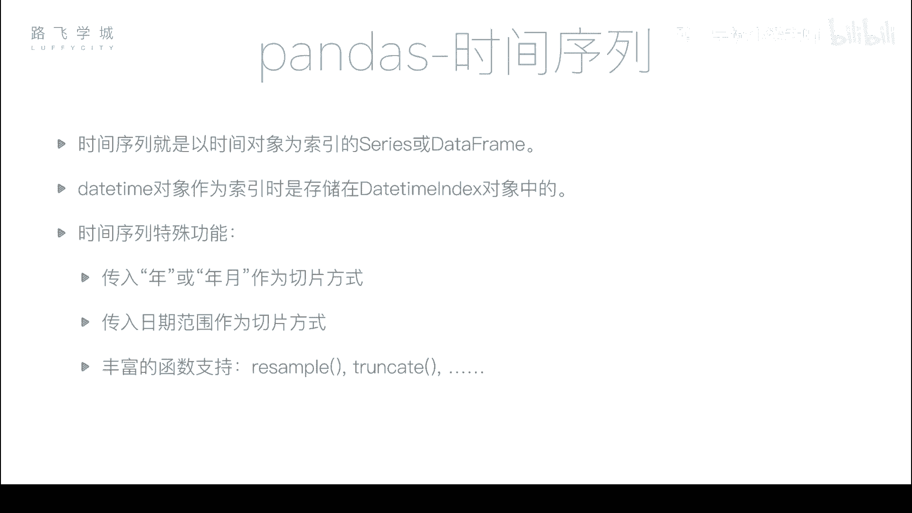
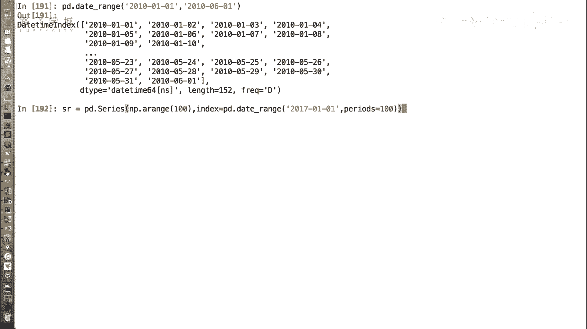
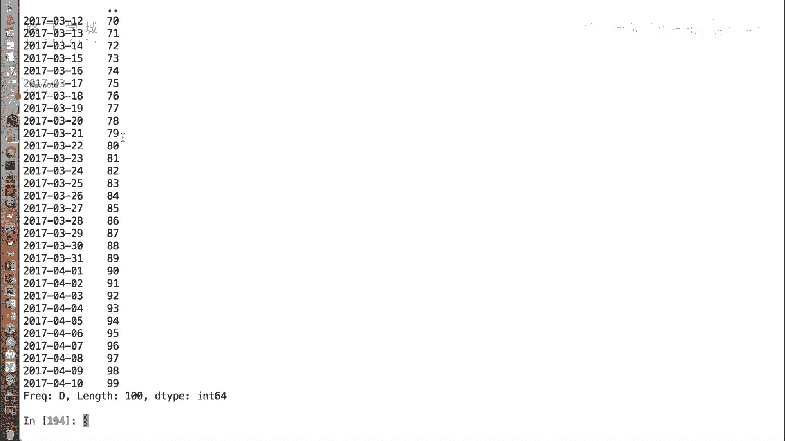
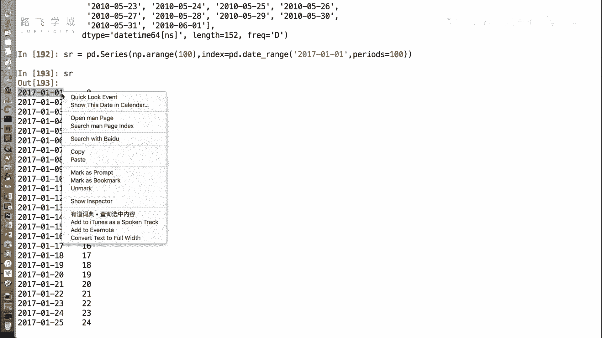
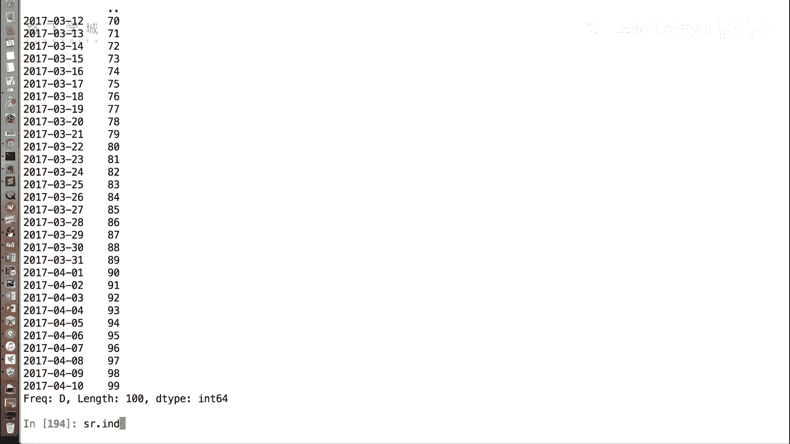
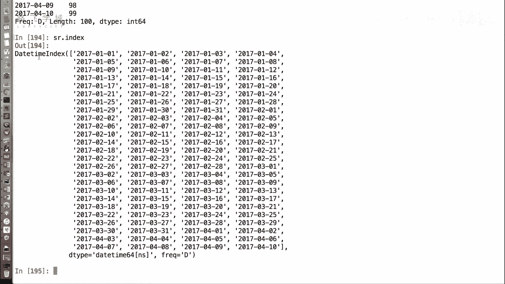
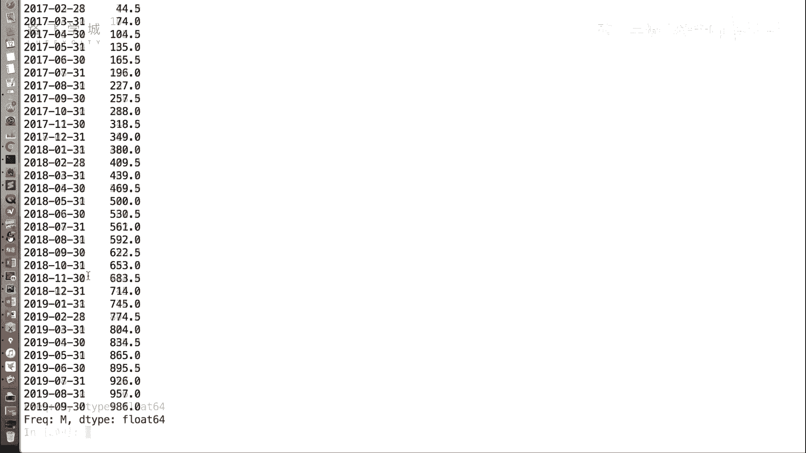
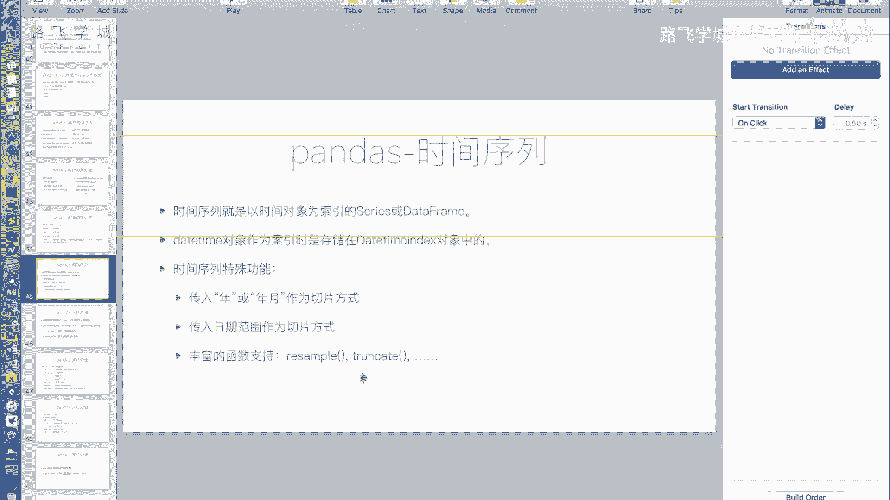
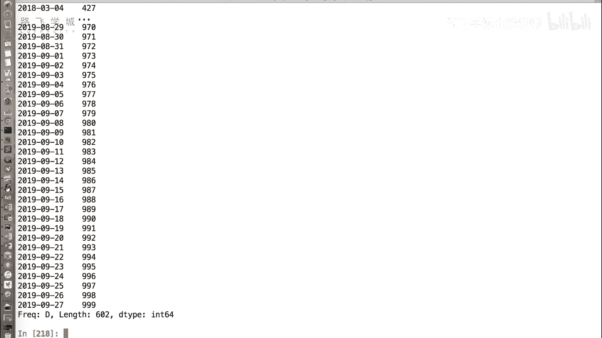

# 14天拿下Python金融量化，股票分析、数据清洗，可视化 - P18：29 时间序列 - 路飞学城小媛老师 - BV1MRmAYSEEt

之前我们讲了好多，这个pandas as里关于时间对象的，支持的各种函数啊，那么生成了这些时间对象之后有什么用呢，我们可以用它来构成一个时间序列啊，所谓时间序列就是以时间对象作为索引的。

series或者data frame，好我们之前看到了啊。

我们的pandas as的，比如说data range函数，好它生成的这个对这个index的名字叫做date time index，换句话说，也就是我们可以拿它来当做我们的daytime。

当做我们的sorry，当做我们的data frame或者是series的一个索引，好比如说我这创建一个series对象，它等于PD点series，好，它的值啊，它的值比如说我们传一个啊。

我我让他随机一点，不让它随机一点，我创造多一点，我用一个NP的number py的a range，传入一个长度是100的，这个呃值可以吧，那它的index我可以指定，为什么呢，我可以指定为P。

比如说pd点date range，我们指定一个开始值，比如说2017年1月1号，然后，时间长度指定为100，hold on嗯，PD点，然后data range DK跟上面那个没关系吧。

没有关系好，我们可以看，我们现在创建了一个比较长的这个series对象。

你可以看到它的index值。

我们现在看到的像是个字符串，对不对，但是其实它是一个时间对象，嗯啊它是一个我们可以看啊，SR点啊，index你看它是一个daytime index。

如果是一个字符串的话，它不会输出的是这个好。

那成为了一个时，他现在就是一个时间序列了，那么成为了一个时间序列之后有什么作用呢，啊有一些这个比较直观的好处，比如说我们可以选取某一个，比如说我想选取1317年3月的所有数据，可以吧。

那我只需要写2017杠零三，我靠选取的就是3月1号到3月31号，我觉得我的程序可以立刻改了，换成panda，牛逼，我们看这个啊，不是啊，Sr，SR最后是到4月10号啊。

咱们比如说我们选这个2017年4月的，当然因为只有十天，所以就只有十了，那也可以啊，当然我们现在是一年的了，你当然可以只写年，只写年，切出来的就是所有17年的，但是因为我们的数据只有17年。

所以切出来就是整个全部了，那还有比如说你可以这样，这样我们为了方便我们把这个SR搞得大一些，啊这100不够一年，我们来个1000啊，后边也改成1000，好现在就是跨了年了啊，当然已经到了未来了。

这个我们就2019年，不管它好，再演示一下SR7，2017就是2017年，等你看最后一个是2017年12月31号，对不对，那比如说我想这样啊，2017到2018年3月，就随便七，那就是2017。

所有的到最后的2018年3月，当然这也是后包括的嗯，那你也可以就是精确到日子也没有问题，2017年这个12月25号到2018年，比如说是2月1号，那它切切出来就是这部分啊。

也就是说这个你选取某个范围很容易啊，可以用不完整的日期，比如说年加月，或者说只有年来切片，也可以拿一个日期范围啊，即使你这传的是字符串嗯，也没有问题，来接下好这这些，那还有一些函数也可以用啊。

比如说啊resemble函数啊，这个函数是什么呢，这个函数就是说recenter嘛，就是叫重新采样或者叫重新取样啊，你比如说我这些这个SR这些天我想看，就是每三天当做一个整体，可以吧。

每天天当做一个整体，我看或者别每天天的每一周当做一个整体，我看一下这一周的这个销销售总额，比如说这些是销售额，但是他其实不是，那我们的RESAMPLE里写，就是写跟刚才我们的那个date range。

那个freak参数一样，写一个频率，比如说我们要看一周的好吧，那他就开W，然后比如说要看和就是在点some，好我们看他输出的相当于得看1月1号，1月8号，1月15号，1月22号，1月29号。

这个就是这一周的和，这是这周的和，然后这一周的和哦，他把每一周的和算出来，然后对，那要是你要是每每月，那这就是month，看1月30，这是1月1号到1月31号的和，2月1号到2月28号的和。

3月的和4月的和等等啊，这个太方便了，平均每个月平均的就是每个月平均，Oh my god，Oh my god，我都要不行了。

太牛逼了，好以上就是我们讲的这个pandas的时间序列啊，通过你把一个时间对象作为index，它可以有一些特殊的功能，比如说传入年或者年月作为切片，或者是传入日期范围作为切片，他还有好多的函数支持。

比如说我们刚才举的例子RESAMPLE，那当然还有一个truncate啊。

这个函数啊意义不是意义不大，因为我们有切片，还是演演示一下给大家啊啊SR，SR点TRKET可以有两个参数，第一个是before啊，比如说我这传递的是二零啊，18年2月3号啊。

相当于就是18年2月3号往后的部分截断掉，他之前的部分，就是只取他后的部分，这不用切片就对，因为我们有切片，所以就这个函数意义不是很大，但有一个笔before，还有个阿法，阿法就跟它相反。

OK那当然我们可以用切片来做好，所以这两个一块用吗，可以一块用一块用，那就有用了，你现在也可以一块用before after，只要中间中间对这切片也可以用啊。

对对对，只只留只留给报的，就是把中间的切走，只留两边的，你切两次呗，一次不行哈，嗯那好吧好，那这些是我们讲的pandas的。

时间序列的一些功能啊，就讲到这里。