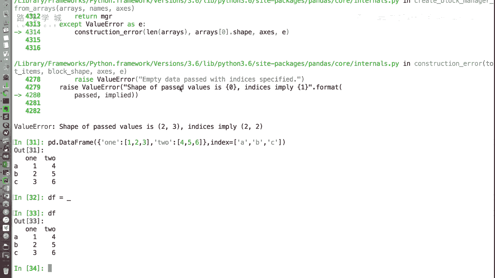
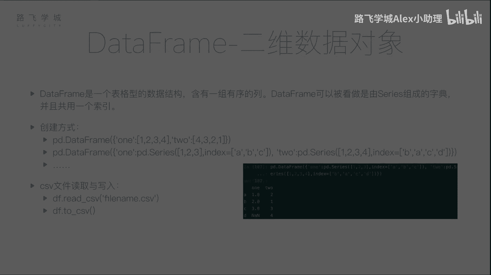
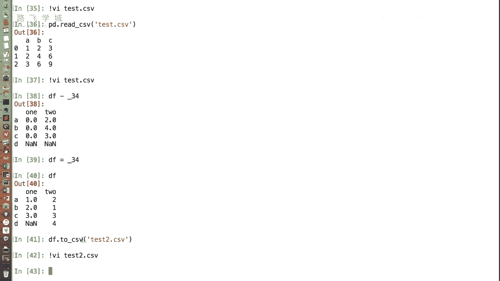

# 14天拿下Python金融量化，股票分析、数据清洗，可视化 - P19：22 DataFrame的创建 - 路飞学城Alex小助理 - BV1HAyPYYEAr

好啊，刚才给大家介绍了，这个pandas的第一类数据对象series啊，我们可以看到series是一维的，只有一列哈，但是我们说就是类，比如说我们平时处理的表格数据，它会有好多列，那这有好多列。

这是一个二维数据，有行有列好，那二维的数据对象，在pandas里是另一个数据对象，叫做data frame，嗯嗯data frame是一个表格式的数据结构啊，就像一个excel表一样，它含有一组列。

也就是说不是一列了，刚才我们的SER列只有一列，它现在有好几列，那data frame其实可以看作是由series组成的字典，并且它们共用一个行索引啊，我这么说，大家可能不太这个明白。

那我给大家创建一个PD点，用data frame这个函数这个方法创建一个data，它分对象，那它的创建方式有很多嗯，啊可以创建一个可以从一个二维列表创建，可以从一个列表的字典创建等等啊，我先演示一个。

比如说我们从一个字典创建字典的键，Y冒号123，冒号456好，那这个时候我们可以看，创建出来的是两列的一个对象好，第一列one这一列它的值是123to，这一列它的值是456，因为我是没有指定行。

所以他的行索引是自动生成的啊，我们可以对照着创建之前的这个格式，来看一下它的字典的这一个值，它的字典的键是one，那他这一列的列名称叫什么，那他这一列的这个字典的值是123，他这一列的值就是123。

那同理啊，见识to列表就是to只是456，值列表就是456，那如果我们想这个说啊，指定一下行，所以它不是012吗，我们想标签点内。

也就是index跟我们的跟那个呃pandas series series一样啊，index等于AB，哎你如果不指C呢，他如果不止C啊，嗯哼这就报错了，Ok ok，好我们用DF把这个变量保存下来。

我们可以看到这就是一个啊data frame的对象，那data frame对象可以有好多好多种，嗯啊可以不不是有好多好多种，是有好多好多种创建方式。

那我在PPT里给出了两种啊。

第一种就是我们刚才介绍了，通过一个字典来创建，第二种也是一个字典，但是这个字典里的值不是一个列表了，字典里的值是一个series，嗯啊我们可以看一下这个第二种空间方式。

one还是one这一列它的值是123，它的索引这里指定了是ABC，那to这一列的值是1234，它的索引是BACD哎，我看一下这句话会执行一下这句会出现什么，他现在是有两列。

但是两列的行索引是不是不太一样，对，啊不知道大家看看能不能看懂啊，来跟着大家走一下，第一列键是one，所以列名是one，值是123，所以123，然后所以这里指定的是ABC，这一列的作用是ABC。

所以他这作业是ABC，那第二列我们再看啊，第二列列名是to，所以这个它是two h啊，直是1234，它就是1234，but它这个1234对应的索引是BACD，那他就得按照ABC重新对齐。

还是说两个series组成一个data frame的时候，你的数据还是要对齐，而且说因为前一个series s没有D，后边一个city有D，所以前一个series d这个位置就是我们的缺失值，对啊。

他这个有一个方面好处，就是它它自动的把你各组数据都给你，按那个呃标签对，给你对齐，对齐了，对这个这个特别好，这个自己搞的话挺麻烦的，对，这是说我们用data frame这个函数来创建。

那其实正那个我们用使用的时候啊，使用这个函数的时候照并不是很多，因为我们不太经常会自己写一个什么，就是这种自己写好长好长的东西传输进去，我们一般是通过文件读得从那对。

那这个读文件的最常用的格式是CSV嗯，CSV文件，不知道大家了解过没有，excel文件的，差不多吧，不是很一样，逗号格式的，对excel文件这个我们后边会说啊，我先说cs文件好，我这儿创建了一个。

我们来看一下test点CSV文件啊，它就是一个每一行的每一个单元格用逗号隔开，然后过了一行就是一个回撤啊，这就是一个表格，对不对，列名是ABC，然后第一行是123，第二行246，第三行369啊。

我随便创建了一个好，那我们先简单说一下这个data frame里边，pandas里从文件读取生成data单frame的函数，叫做read csv嗯，参数传我们的文件哎，传我们的文件名，好我们可以看到。

这个时候就创建了一个data分数对象，这个时候对待分配对象，我们的第一行ABC解释成了列名，然后因为没有指定行索引，所以行索引自动生成的是012，这些是我们的值好，那也就是说它首先可以从文件读取。

但是从文件读取，会有一系列的各种各样的不同的情境，那这个函数不要急，我们在后边还会更加详细的介绍，能让我看一下那个列明为什么是AABC来着，行名为什么是ABC啊，列名为什么是ABC。

因为我第一行是OKOKOK懂了啊，这个这个方法我们在以后还会更加详细的介绍，它会有各种可选参数来对文件做更精细的操作，那这是从文件读取啊，保存到文件就是to csv，你刚才不是有一个吗。

那个上面那个把它保存进去，这个对好，你直接往上走就行，哎你玩这炫的可好，来看这是我们的DF的这个data frame，我们把它保存成save to csv to csv啊。

通过你这个data frame对象点to csv，比如说网络上test2点CSV，OK好，这个时候我们用RM来看一下，哎缺失的值就变成缺失的值，它自动变成一个空，OK啊，这个也可以设置，你让它变成什么。

咱们后边这个函数也会在详细讲，这只是大家简单先看一下，保存成就是从CSV文件读取和写入，是一个什么样的过程，那还有其他其他格式，比如说JASON，比如说XML，比如说excel等等等等，都支持。

那接下来我们在后面做文件处理那部分。

