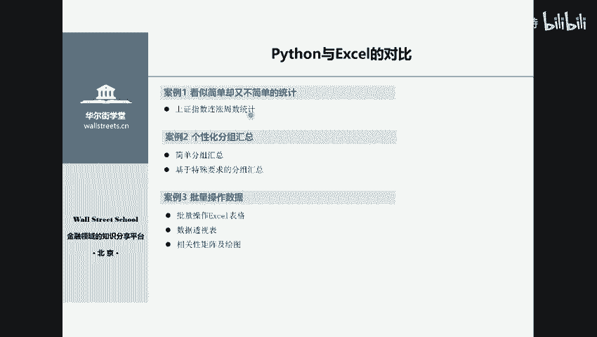
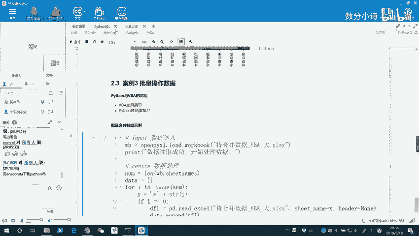
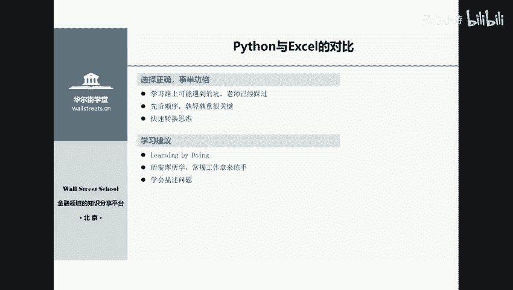
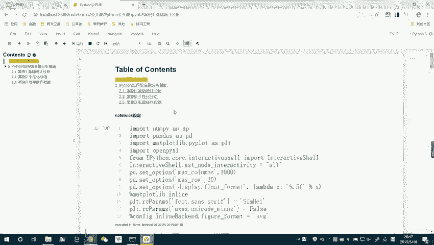

# 14天拿下Python金融量化，股票分析、数据清洗，可视化 - P1：01 Python在金融资管领域中的应用 - 数分小诗 - BV1bFDSY9Ep5

🎼。

呃，大家能看见我们这个PPT吧，现在的这个屏幕上的PPT都能看见吗？好的好的好的，那我们这个马上就开始了。我先自我介绍一下，我是这个拍on课的这个刘老师，也就audlow。那么大家在这个课程呢。

也是我和其他两位老师一起主讲的。那么我在这个课的话呢，主要是讲的是金融分析部分，也就是第一大部分，主要是带大家呢一个基础的入门，以及啊这个python呢在金融分析里的一些应用相关的模块的一个讲解。好的。

8点钟了，那我们今天开始讲解我们这个公开课。那么今天的公开课呢，我们主要是分成三部分。第一部分我简单的给各位介绍一下python。那么第二部分呢就是讲一下我们这个python的学习。

尤其是在第一部分的基础知识和我们的数据分析的内容，学习完以后呢，那么大家可以做一些什么样的呃操作，或者说能够提升这个能力，能够提升到一个什么样的水平。

我会举几个例子讲一下我们这个呃pyython的数据分析的一个优点，也就是能够怎么样提高一个金融分析师，或者说各位数据分析的一个能力。那么最后一个部分呢，我会讲一下，就是作为一个零基础的学员。

或者说也就是纯小白，我们怎么去入门python的基这个数据分析也好，还是说以及后续的爬虫等内容也好。呃，那么我们就开始今天的课程。那么首先呢给大家简单介绍一下pyython的语言特点。

python的语言特点呢用四个字可以来概括，就是简单易学。为什么这么说呢？它是一种可读性极强的语言。如果有看过我的python的基础课的同学呢。

就是最前面那部分的介绍python的基础语法的同学就会有这种感觉，python语言呢，它非常的像我们我们日常这个学习的英语。也就是说我们可以用读英语的思维，其实就能大概读懂这个python。

它这个语言写出来的程序。它的一个含义。那么只不过说我们需要怎么样的程序呢，它是它的含义呢是唯一的，而语言的含义呢会有多义。所以呢我们所需要做的呢。

只不过就是理解官方所规定的python里面的每一个关键词，它的含义以及每一个关键词，它的一个固定的语法。那么我们基本上就可以把python的基础语法入门了。所以呢对于有一定编程基础的同学。

例如说以前学过像mlab啊C加加呀或者是java的同学。那么像这一些的同学呢。他的python入门呢就非常非常的简单，大概呢一一两天就okK了。但是呢对于零基础的同学呢，其实也并不困难啊。

大概呢平均在我教过的学生来看，两周到一个月就可以把pyython的基础语法完全搞定。那么数据分析呢也可以基本完全入门。这个一个月时间左右。所以呢它的一个特点呢其实就是简单易识。那么在后面呢。

我会给这个零基础的同学一些建议，就是咱们怎么去入门这个pyython，会给大家一些建议。那么大家如果follow这些建议的话呢，我相信你们所即将踩过的即将踩到的坑呢。

也是刘老师呢可能在学习过程中踩过的坑。那么我也特别理解这个初学者的一个呃困难之处。所以咱们这个课程呢是非常非常适合零基础的学员，或者说想自学的python的学员。那么非常非常的合适。那么第二部分呢。

我从这个几个案例呢来给大家讲一下我们的python呢是如何解决金融从业者的诸多痛点。那么主要呢我准备了这么几个简这这么几个小案例。那么第一个案例呢，就是说我们来做一个看上去很简单。

但是又不简单的一个统计。这个呢是一个上证指数啊，它连涨周数的一个统计。这个统计呢在我呃在我做金融分析的时候呢，有做过啊，我用excel有做过。大家可以想象一下。

如果说你要用一个excel去做这样一个分析的话呢，你会需要涉及到哪些步骤。你首先呢可能会要需要到涉及到我这个数据。怎么导入到excel里，对不对？然后接着呢我们要涉及到我这个数据呢。

我要用什么样的函数去对它进行一个呃分析。比如说我先要确定我这个连涨多少周，那我第一周我怎么去定义它。然后接着第二周它又满足一个什么样的条件啊，这是一个非常复杂的过程，再用excel来做。

但是呢这个问题呢其实是很简单的？就是连涨周数的一个统计。那么现在呢我给大家共享一下我的屏幕。

大家应该是能够看到我的一个完整的看到我的屏幕的。那么现在的话呢，打开jupytter notebookote book的话。

这个方法呢其实就是在我们的uncon终端里面直接输入就pytter noteote book。那么我已经把这个note book给打开了。那么像这样一个就py notebook book呢。

也是用我们的这个直接是在我们就py notebook里呢，我编写了今天我们上课的一个所有的内容。那么大家发现这个就py成都是不可能，它的功能是非常强大的，包括这个目录的一个功能。首先呢就是。

我们要运行一下这个我们的一个notebook的一个设定。这个的话呢是我们的一个基础设定，大家可以直接运行即可，不用管它为什么啊。那么。关于每一个程序的话呢，我们在理解它的时候呢，可以分为三个部分啊。

一个部分呢就是输入的这一个部分。我们要去分析一个数据的话呢，首先必须要知道我们得有这个基础的一个数据源，也就是最基础的最原始的一个数据。这个的话呢，我们作为我们的一个输入。

我们要把它输入到我们的pyython里面。那么接着呢中间的这个核心部分呢，其实就涉及到一个是数学，一个是我们的这个条件的条件语句的，或者说控制条件语句的一个执行。接着呢就是一个循环。

或者说重复的一个操作，也就是让代码它的一个重复，其实也就是循环。那么最后呢会有个输出。那么我们所有的案例呢，或者说大家编写的程序呢，无非呢都是遵守这三个过程，一个是输入，一个是核心的处理部分。

最后呢是输出。那么我们来看一下我们今天的第一个小案例。第一个案例呢是上证指数的一个连涨周数的统计。我们可以一起来先看一下这个它的一个数据长什么样子。他的一个数据的话呢，长的是这个样子，我们来一起看一下。

这是这个最原始的一个数据啊，就是我们从这个金融终端里面导出来一个数据，分别对应的是当周的一个周最后一个交易日的日期，以及当周的一个涨跌幅。那么像这种数据的话呢，我们是要首先把它读到pyython里来。

这个的话呢，第一部分呢，我们就是相当于做了一个读取，也就是input，这个是输入部分。那么在第二部分呢，我们做了一个数据的核心的一个处理部分。大家发现呢，然后在第三部分呢。

这就是一个我们的一个数据导出部分。这短短的25行代码呢，就足以帮我们很轻松的可以找出这个上证指数，它的一个连涨周数的分布的一个情况。我们直接运行一它这行代码。

那么它就直接在28毫秒之内就完成了这个操作啊，28毫秒。那么数据导出在哪呢？就导出在我刚刚这个。文件夹里面。那么就在这里直接给导出来了，我们只要打开来呢，就可以看见啊。

这个上证指数呢在历史上它的一个连涨居然还有连涨过29周的一个情况。是在92年的时候。那那个时候的股民呢是非常幸福的。那么像连涨7周的话呢，是在这一段时间啊，在这一段时间都有过连涨7周的一个情况。

这个呢就是一个简看上去很简单啊，但是实际上呢我们比如说像以往的话，如果要去用excel去做这个操作的话呢，如果大家不用VBA去做的话呢，可能会比较麻烦。但是呢用VBA去做的话呢，其实也是要经历一个比较。

长期的学习。但是呢大家要理解的一点就是说VBA的话呢，它可能更多的局限于excel内部，而不是说像python一样。待会我们会看到python呢，其实也可以和其他其很多内容进行一个交互。

这个的话呢是我们今天的第一个例子。也就是说如果学会python的话呢，大家可以对这些金融数据呢做些非常简单，看上去非常简单。但是呢又非常符合你自己的一个个性化需求的一个这种简单的一个统计。

那么给大家举的第二个案例呢，就是说我们看一下学了python以后呢，我们可以做一些分组的统计。这种统计呢往往是我们金融从业人员呢最需要用到的一方面。例如说。每年的话呢，我们国我们这个A股啊。

他都会发布这个财务报告。每一家公司呢他都会发布自己哎今年的净利润是多少，而我们。要判断整一个A股啊，或者说整一个行业，它是不是持续的净利润在增长，能够给我们带来一个稳定的回报的话呢。

就会看整个行业的净利润。也就是说分行业的一个净利润。那么像这样一个数据呢，我们怎么去计算全部A股。每一个行业。他的这个净利润情况会有每一个行业，每一年的净利润情况呢。那么在这里呢。

刘老师也从万德数据库呢直接导出了一个数据，我们可以来看一下，像这个的话呢。像这个数据的话呢，在excel里面呢，我们也可以通过数据透视表的功能去对它进行这个。像这是我们这个从万德里直接导出的一个数据。

像这个数据的话呢，它就有。有我们的这个像股票代码、股票名称、股票的行业，以及14到17年所有个股的一个净利润的一个情况。那么对于这些数据的话呢，以及他的这个板块。所属的一个板块。那么像这些数据的话呢。

我们如果想说啊把每一个股票呢，它每一年就。把每一个这个行业，每一年的净利润进行一个加总。就按行业把这个净利润，每一年净利润进行加总的话，在excel里呢是有一个数据透视表的功能的，这个是没有问题。

但是呢像这种操作呢，如果再复杂一些，比如说我们想要提取。每一年每一个行业净利润前十的公司，或者说这个思路可以换一换，像提取ROE前十的公司等等啊，各种操作就是说取决于你的一个个性化的分组需求的话呢。

那这个的话呢，用excel实行起来，实现起来呢就会特别的困难了。我们先来看一下一个excel能实现的。但是我们python呢会更方便更快的一个。比如说数据透视表的功能。那么就在这边我们可以看一下这一行。

大概是短短的。十三行代码大家看一下。第一前两行呢其实是一个数据的一个输入。中间这个空行。然后中间呢我们用在数据分析的代码呢，实际上呢只有短短的45行啊，4到5行。其实这两行呢其实是并在一起的。

所以呢其实这边呢我们只用了三行代码，就把这个数据的处理过程处理完了。我们可以来看一下。这个的运行结果呢就会输出在屏幕上。像我们仅仅用了四行代码的话呢，我们就把大家可以看行业啊，就行业，然后这个年份啊。

然后这个。中小板、主板、创业板以及全部A股，它的一个净利润的情况呢输出在屏幕上。那么这个最后一行代码的含义呢，其实就是我们把它直接给结果导出，也就是一个刚刚我们说的代码三部曲，第一步数据导入。

第二步数据处理。第三步结果的一个导出，那么就全部的输出在屏幕上，以及呢给它导出到excel表里了。我们现在呢只要打开excel的表格，也在我们数据导出这里啊。那么像这些具体的说怎么导出啊。

它导出在哪里呢？这个呢在我的这个拍thon课里面都有详细的给大家介绍。像这样的话呢，这个表格我们稍微略一修改，可能就可以在。某些券商的报告里面，或者说在我们的一些这个。作为我们的一个数据的基础。

可以直接进行调用，这就是全部A股，它的一个分行业的一个净利润的情况。那么。这个的话呢是一个很基础的一个数据透视表的功能啊，excel的话呢也能实现。但是呢像刚刚我们所说的，比如说。

比如说像我们刚刚所说的这种，如果我们要汇总过去十年啊，比如说更多年份十年，然后各个行业它的总市值的一个占比情况。然后呢，我们要算出这个每个行业它前十名的这个总市值公司的这个相关的数据。那么像这种的话呢。

我们怎么去进行。怎么去进行操作呢？那么在这个的话呢，我我给大家看一下远数据。比如说我们直接从万德导出来的一个市值的数据。这个个股的一个市值数据。啊，应该是这个个股市值汇总。应该是个股市值汇总这个数据。

我们打开来看一下。给大家看一眼。像这种的话呢，这些万德里面导出来的数据呢，也是我们金融分析师呢日常经常碰见的一些数据啊，或者说经常。打交道的一些数据。像这个的话呢。

就是我们那个个股的一个市值汇总的一个数据。这个日期的话呢，我给大家调一下，有点。O。这个的话呢是09年呢到现在的一个我们这个A股，所有股票啊行业都有啊一个数据。我们可以看一下。

一共有26000行的一个数据。那么09年到现在。那么我们想找出啊每一年的。就是按年份分类以及按行业分类，就每年的每一个行业的前十名的也就是市值的一个公司。那么这个的话呢。

我们要如果要单纯的用excel去做的话呢，我们可能就是说得怎么做呢，得先筛选，按年份筛选，同时按行业筛选，然后呢再按市值排序选出前十名的公司。这个的话呢，如果我们说做一年还好，做两年还好。

但是如果要做1年。那么大家的操作可以算一下十年。然后加上这个地方。这个8个万个行业，那么10乘以8，也就是说要做80次的这样的一个操作，还有一个排序的操作，就异常的繁琐，就异常的繁琐。

那么对于这种操作来说的话呢，我们可以在这个。呃，拍摄里面呢轻松的用轻松的实现。比如说第一行呢，我们依然是一个简单的一个数据读取的操作。这个都是有固定的一个代码的。所以呢对大家来说呢。

在后期只要学习的课程会非常的简单。那么中间的核心部分呢，其实我们算一下的话呢，也就是一行代码，加上后面的一个六行呃四行代码，也就一共是五行代码就完成了我们整一个的数据处理的过程。

那么剩下的呢短短的两行代码，一行呢是查看我们的分析的结果，还有一行呢是。这个我们这个数据的一个导出。所以呢。整一个这个代码呢，大家发现也是不超过十行的，也就是十行左右的一个代码。

完成了我们这样一个相对复杂的一个个性化的分组需求的一个操作。那么这些的话呢，也就是说咱们上完这个课以后呢，不管你有一些什么样的需求，只要这个需求是一个正常合理的需求，我们都可以呢。

通过python这个编程去实现我们的个性化的一些这种分组需求啊也好，或者说是一些其他的什么需求。当然像那些最基础的，比如计算平均值啊，计算方差呀，或者说一个移动平均啊等等。

这些简单的内容一定是非常轻松的，可能一两行我们就可以直接实现。然后我们运行一下这个程序。那么大家发现呢我们运行这个程序呢花了1。99秒钟。也就是这个程序编好以后呢，不管你每一年有多少数据。

或者说你比如说我们今年我们今年编好这个程，到了今今年底明年初啊，到了4月份，明年的4月份，新的一年财报又发布了，我们只需要把新的一年的数据给它加进来，依然是运行这一段程序，它的一个结果就展现出来了。

这个呢就是说体现在我们的一个程序啊，编好以后呢，只需要修修改改。第二年呢就可以用了。所以呢这个写这个程序呢，我们如果用3分钟到5分钟的话呢，那么他可以在实际生活中呢。

帮助我们传统的这个单用excel的一个工作者呢，节省可能半小时到1小时的时间。那么我们可以看一下，这个呢就是我们的一个输出的一个结果。有一些呢是被省略了的。因为我设定了最大显示30行啊，最大显示30行。

大家可以看一下，每一个行业的每一年就是09年，然后呢，信息技术行业公用事业行业等等所有的行业，每一年的前十0家公司，它的一个相关的一个情况啊，我们都把它给。提取出来了，那么呢它也会被我们导出在这个位置。

各行业的市值前十。那么像这样一个数据的话呢，我们只要略微的去。当然这个日期不是它不显示，是因为它那个。它的格式的一个问题。所以呢我们只要稍微改一改，它就会显示。那么像这些数据，我们稍微改一改呢。

就可以直接把它继续的呃利用万德的函数呢去提取这一些股票的相关数据。其实这些呢就是我们的A股的每一个行业的龙头，对不对？每一年每一个行业的一个龙头，其实无非龙头的定义，要么总市值大。

要么就是盈利能力强加总市值大，给的这些这样一些条件，我们就可以去挑选出按我们的要求挑选出一些股票，或者说也就是我们券商研究里面，或者说金融分析里面一些相关的操作，都可以考虑是否能够结合程序去实现。

那么一旦你。呃，这个实现了以后，那么在下一次你要复复用这个函数或者复用这个程序的时候呢，可以节省大量的时间，只需要略微略微修改即可。好的，而且运行的话呢，像这种简单的一些数据分析的话呢，是非常的快的啊。

虽然这里有十年的数据，虽然有这个呃2万多行excel，但是我们是。1秒钟左右，2秒钟之内就把它给处理完。好的，这是我们给大家讲的一个分组的一个案例。那么接下来呢给大家举一个画图的例子，像在拍摄里面呢。

它的画图的话呢是。可以画出非常多种类的各种各样的图的，就是只有你想不到的啊，没有你。这个就是你需要的一定能找到，而，还有很多你想不到的特别好看的图。比如我给大家举一个呃非常非常这个有意思的一个图。

像这样一个图的话呢，我们是想画一个。这个行业相关性的一个图，我们给大家先看一下我们的原数据。我们的原始数据呢是一个行业指数的数据。这里的话呢呃我把它先展开一下。这些数据的话呢。

就是说啊从2005年至今啊，我们的这个材料行业的指数啊，然后工业行业的指数以及可选消费和消费，还有医药、金融、信息、电信公用等行业。这是我们A股的一些主要的这个行业指数了，也是全指的这个行业指数。

那么这些行业指数的话呢，我们希望怎么做呢？我们希望啊计算一下它在历史上的一个这个。相关性。那么大家知道计算相关性的话呢，如果在excel里操作呢，我们肯定是用相关性的一个函数。但是计算出来以后呢。

大家得到的是什么呢？是一个相关性矩阵，对吧？那么这个相关性矩阵的话呢，大家可能就需要在excel里呢自己去构建这样一个相关性的一个图。但是呢在pyython里呢。

我们可以不仅直接一步得出这个相关性的矩阵，还可以怎么样呢？我们还可以把它画成一张非常美观的图，我们可以一起来看一下，怎么样在这十行左右的代码里，虽然是十8行，但我中间其实有空行，而且呢像这种加了井号的。

如果有这个学员上的基础课的话呢，都会知道加了井号表示注释，所以呢其实除掉注释，除掉工行。其实这个代码呢，就是十0行左右。那么对于这种十行左右的代码呢，我们可以解我们可以解决什么呢？我们既导入了数据啊。

读取数据，又把数据处理完成，而且呢能够把图画出来。而且最后呢还把图片给输出了啊，我们可以试一下运行这段代码。大发现呢我们这个图呢画出来的一个结果呢是这样一幅图是这样一幅图。这幅图呢它表示什么含义呢？

它的背后呢其实是我们的一个这个斜方差的一个矩阵，或者说是我们的一个相关性的矩阵。也就是这个X矩阵。我们可以看一看这个X长成什么样子。我们可以看一下这个X它的样子。那么对X呢其实就这个样子。

我们只用了一行代码。大家看我们只用了一行代码。你看我们导入数据以后，就一行代码直接点correlationCOOR就很简单，直接一行代码这个相协方它举证就出来了。而在excel里面大家可以去试一下。

我们要用一个correlation的一个函数，那么选择那两列然后呢，两列的相关系数就会出来。这里的话大家可能说啊你这个是历史上所有的数据的一个相关性举证。如果我想要一个移动平均的相关性举证。

或者我想要一个移动平均的一个相关性系数。比如说就要最近250天的，可以吗？可以也是一行代码，这个大家学了我们的课程就会知道。OK那么在这里的话呢，像这个相关性举阵，它的就是作为一个数据源数据源来干嘛呢？

来画我们这幅图，这幅图呢大家可以发现颜色越深的地方啊，表示呢这两个行业纵轴和横轴两个行业它的相关性越强，颜色越深，相关性越强。那么知道这个有什。怎么用呢？那么在我们的这个呃投资策略里面呢。

有一种很简单的投资策略叫什么呢？叫指数投资。指数投资的话呢，它的一个核心的要点呢，无非就是低估值的时候买入高估值时候卖出。还有一个呢就是品种要齐全，相关性要低，才能充分的做到风险分散。

那么简简单单的这一幅图呢，就能告诉大家，工业和公用事业不能配的两个呢是相关性特别高的，不能配的太多啊。但是呢像信息呢和能源呢，它的一个相关性很低。所以呢像这种就可以告诉大家啊，包括什么消费的话呢。

和我们的工业呢，其实它的一个相关性呢也不是特别高。像这个的话呢，就是说从数据分析到可视化，我们的实行代码呢已经很能够说明一个问题。啊，从数据分析到一个可视化的一个过程。这个是我们的这个呃第三个小例子。

关于我们这个个性化的一个需求的一个小例子，还有很多很多非常美丽的图，包括立体的这个三维的图。等着大家去发掘啊，非常的好。那么第三个部分呢，就是第三个案例呢，我想讲的就是说我们怎么去批量的操作数据。

那么这个批量操作数据呢就涉及到什么呢？涉及到我们可以操作哪些数据。那么在学完咱们这个课以后呢，对于文本文件也好，对于excel文件也好，还是CSV格式的文件也好，等等啊。我们常用的一些格式的文件。

大家都可以呃有一个自己的方法，或者说可以学会怎么去处理。比如在这样的一个例子里面呢，我要做的是什么呢？我要做的是批量合并一个。批量合并这个数据。我要做的呢是和我们的这个VBA的一个对比。

我先把其他无关的关一下。因为打开太多了，有点乱。我要给大家讲的呢是说啊我们这个python和VBA的一个对比，他们到底哪一个好，或者说他们到底是一个怎么样的一个。对比起来是一个什么样的情况？

我们来做一个简单的对比。比如说这个呢是我们的一个一个这个excel，它呢一共有184个工作表，一共有184个表格，每个表格呢大家可以看一下啊，这个这个每一个表格呢有96行数据。每个表格有96行。

其实这个这个数据呢其实并不是很多，也就大概1000多个数据啊，一这个100乘以1801万多个数据，对吧？1001万多个数据啊，18000个数据数据并不是很多啊，18000行。那么我们要做什么呢？

我们要把每一行啊都给它合并到，就每一个工作表都合并到第一个这个工作表里，纵向的把它合拼接下去啊，纵向的拼接下去。我是以这个为例子，并不是说每一个人工作中会遇到这个需求。

以这个为例子说明一下这个VBA和python，它的一个这个各各自的特点，以及我们这个为什么要学习pyython。在这里呢我们可以看一下，我编写了一段VBA的程序来做这个操作。在这里呢。

我们哎我点错了一下。这个地方呢我编写了一段这个VBA的程序，我们来做一个这个操作。重新进来一下。呃，在这边的话呢，我是。在这边我编写了一段这个VBA的程序呢来做这个操作。我们直来看这个吧。

刚那个文件的话呢，我刚那边点错一下，我们直接看这个呃这比较大的这个文文件。我这边核心要实现的呢就是说希望能把所有的这个表格呢把它给合并到第一个表格里面啊。ok 啊。然后呢，我们呢在这里呢。

我给他导入我们这个呃我们要用到的这个。模块。那么也就是说这是我编写的一个这个VBA的一个文件。然后呢，我们想把所有的这个后边的这个工作表都给它并到第一个来。那么我们可以试着运行一下我这段代码。

那么大家发现呢，他是首先呢他需要一定时间啊，大家可以先等一下。然后呢，很快呢，我们这个就完成了只短短的几秒。但是呢大家发现呢并不如我所愿啊，并不如我所愿。大家发现这里是04年的。紧接着就19年了。

但是实际上我们的表格里呢前面是04年，紧接着呢还是04年的2月啊，然后04年的3月这个呢并不如我所愿啊。所以呢大家发现呢这个地方呢是因为这是一个非常非常大的我们的一个这个VBA表格。

大家发现第一年呢是第一年的第一个月是1200家公司。然后呢在。这个表单的，比如说最后一页啊。最后一页呢，这一页的话呢，它是有3611行，3611家公司啊，也就是说整一个表单下来呢。

可能就会有平均2000行2000乘以180个这个行数。那么这个时候呢，对于VDA来说呢，它的一个操作难度呢，也就是说就非常的大了。一个是体现在他要计算的内容容量非常的大。

然后导致他没有办法这个正常的运行这个程序，需要我们进行相关的优化。那么这些的话呢，对于我们这个学员来说呢，要理解它的一个内部的一个优化呢，就是比较难。那我我们也可以看一下啊。

如果说对于刚刚我们这个非常小的这个文件，也就是只有100行的这个文件。我们用VBA去做呢，会怎么样？我们来看一下。对于刚刚我们这个只有百100行的文件啊，就每每一列大家可以看一下，只有100行。

就每一列只有它一它只有100行的一个文件。然后基本上平均下来呢可能也就是万来行啊，两三万行。那么对于他的话呢，我们来用这个这个VBA的一个程序来做的话呢，就会特别特别的快。我们可以看一下。

简单的运行一下。我们可以看一下，哎，这地方OK短暂的卡顿一下以后呢，它已经完全合并好了。然后这个数据呢正好就是我们想要的一个结果。大家发现2004年1月啊，2月，然后就3月。紧接着就把这个所有的拼接好。

所以大家发现呢这个代码呢，我们用这个VDA做起来呢是特别特别的快的。好，那么这个呢就是我的第二个这个两个VDA的一个演示。通过这两个演示，我想跟大家说什么呢？就是说每一种语言呢，它都有各自的优点。

VDA语言的话呢，它在处理这种非常。非常少量的数据或者说也不能说少量。就说这种万行甚至10万行以内的这些数据的时候呢，非常非常的快。但数据量一大的时候呢，就涉及到一个已对基础程序的一个优化。

但是呢对于pyython来说呢，这个数据呢完全不是问题啊，但是对于刚刚我们说的这个虽然少那个行数比较少的数据，用VBA处理起来只需要十几二0秒的数据，但你用python去处理呢。

可能也要30秒甚至40秒啊，它在速度上呢并没有显著的比VBA要快。但是呢对于VBA处理不了的。刚刚我们说的那个呃每每个有2000行，然后一共有180个表格的这种数据来说的话呢，我们的python呢。

它处理起来呢。他首先是能够很轻松的去处理的。那么其次呢花的时间呢也不会太久也不会太久。比如像我们这个代码呢。就是这个来处理我刚刚说的那个数据的一个代码。那么今天的话呢，由于我们那个时间关系啊。

我就不运行这个代码了。这个代码的话呢，待会我们应该课后都会分享给大家。那么主要的话呢也是起到一个展示的目的，告诉大家说啊，我们的pyython呢，其实是可以看作是屠龙刀。

那么你如果拿一个屠龙刀去做一个非常小的事情呢，你可能也要花很多时间，但是呢你如果拿屠龙刀呢去做一件非常大的事情呢，啊，非常大的一个工程，那么它就是一个非常值得的一件事情。

OK那么我们这个演示的部分呢先到这里。接下来呢我讲一下，对于初级的也就是零基础的学员，我们怎么去入门啊，我提供一些这个相关的建议。好，我们来看一下。那么对于初级的学员的话呢，我的一个建议呢。

尤其是金融方面的学员啊，因为我本身是金融出身，所以我在讲给大家讲这个第一部分以及这个呃给大家讲第一部分以及这个数据分析，或者说尤其是金融分析这一部分。那么我的一个建议，我给大家讲一下。

第一就是说大家在学习的路上啊遇到的坑呢。老师呢其实可能很多都已经替大家踩到过，或者说有见到学员有问过我啊，那么。

我觉得话最重要的一点呢就是说在学习的这个python的路程上呢，就是先后的顺序呢非常的重要。那我我们在学excel的时候呢，都是先学它的基础操作，对不对？然后先学它的一个基本的函数。

那么在pyython的里面呢，我觉得这个大家这个关于这个先后顺序呢，第一一定要把pyython的基础知识学的非常的扎实。基础知识指的是什么呢？一个就是我们的数据类型和基础的数据结构。

也就是说像这个整数浮点数字符串，他们的计算，他们的比较你都掌握了嘛。然后像我们说的这个列表字典元组等等。这些最基础的数据结构，大家都掌握了嘛。然后接着呢就是我们说的控制流语句啊，大家都掌握了嘛。

这个呢就是说咱们学任何东西呢，从最基础的先抓起，这是先后顺序啊，孰轻孰重很重要，千万不能说一上来我就想跳到最后去学最困难，最最最有用的一部分。那么那一部分呢，首先都是要以咱们的一个基础扎实为基础的。

这也就是咱们这个基础课程，第一部分呢，我讲的这个内容里面的这个基础。有很详细很详细的啊为大家介绍。几乎了所有的这个呃基础的一个性能。那么第三呢第二个重点呢就是说大家要快速的转换思维。在学习编程的时候呢。

大家尽量的在刚开始就把我刚刚说的那个三段式呢给理解清楚，也就是。你做任何一个编程，你的input是什么？你的这个输入是什么？你的这个核心的处理部分你要怎么做？然后最后是你想输出一个什么结果。

你想怎么展示你的结果啊，这是这三部分。不管你定义一个函数也好，还是说你去做任何一个程序，你想做任何一个内容的分析都好，都要好好想想输入，然后处理和输出。关于学习的建议呢。

第一点呢就是running by。也就是说大家呢在学完我们的第一部分的基础知识以后呢，就要考虑了我想要做什么。想要做什么再去学什么，而不是说咱们先把所有的拍成相关知识先全部都学完，然后再去做。

那么这样做的话呢，如果说你想先全部学完，然后再去再去做的话呢，很容易达到一个什么效果呢？就是。呃，pyython学习从入门到放弃啊，很容易达到一个这样的效果。因为它的相关知识实在太多了。

你如果漫无目的的去学的话呢，你发现你要学很多内容，今天明天坚持一下，可以，你坚持一个月以后，你发现月初学的到月底就忘了，这是很常见的现象。所以呢大家一定要切合的考虑到就说学完基础以后。

切合的考虑自己的一个工作到底是跟excel交互多一些啊，还是说跟文档交互的多一些呀，还是说其他的一些，比如说跟邮件交互的多一些等等，以及说跟数据分析交互的多一些，然后呢再去选择相应的。内容深入的学习。

啊，大家有一个什么样的需求去做一个什么样的学习，这是我的一个建议。第二个建议呢就是说的所需即所学常规的工作拿来练手。比如说刘老师之前呢在券商研究所做。那么我在券商研究所工作的时候呢。

就经常要接触到A股的一些相关数据。那么当我开始啊，我我我当我学习pyython的时候呢，我就是怎么做的呢？我就当然是把我的日常工作，能够半自动化的或者自动化的，就直接拿来练手。

以前用excel可能要做一个小时的工作，我就尝试一下，看一下pyython编代码，可能我要编两个小时。但是呢在我之后的话呢，我去重新的更新这个表格，或者说更新这个操作。

可能就只需要一两分钟或两三分钟就很快了。也就是说它是一次的一个努力啊，但是你长久的一个受用。那么最后的话呢，就是说希望各位呢在学习过程中呢，也可以学会这个。描述问题。就是学会怎么去描述相关的问题。

那么这个的话呢，不管是你自己自主解决问题也好，还是说来找老师问这个问题也好。那么描述清楚你的问题，我们在交流的过程中都会更加的顺畅。那么今天的话呢我的一个公开课的一个展示呢。呃，到这里呢就结束了。

大家有什么相关的疑问呢？可以在聊天框里呢打出来，然后我们可以进行一个答疑的一个时间，10分钟左右的一个答疑。呃，刚刚呢有一个用户那个同学啊。问到用annoconda下载python吗？问到这个问题啊。

其实不是用undernocon下载pyython，而是我们只要下载安装好了这个annoconda以后呢，那么我们的pyython呢是已经是自带了的。

就是说它是内置内置在我们这个undernocon里面的annoconda相当于是一个集成的一个安装包。那么我们这个python呢是在内置的一个安装，包括我们说的jupiter notebookote。

以及我们的那个spider都是内置在里面的一个安装，在那个undercon里面的。然后我们启动的时候呢，其实可以直接用终端进行启动。呃，我的课程什么时候开始？呃，我的课程应该是我的课程是已经上线了啊。

已经在华尔街学堂上线了。那么里边的话呢，我主要讲的是第一部分的基础知识，加上那个金融数据分析部分。呃，初一15这位网友啊，他的这位同学人啊，他的这个问题呢是万德数据是否可以随时免费使用？是这样的。呃。

我在那个终端里面呢给大家介绍了一下这个to share这个。这个呃这个金融的一个数据库啊，这个to share这个数据库呢是可以免费使用的，也是有相应的实时数据的。然后万德的话呢呃现在有一个万矿云平台。

也就是万况。大家可以看一下这个万况它是一个在线的量化平台。那么大家学习了基础的知识以后呢，我说的基础知识指的是。第一部分呢也就是由呃我主讲的那个。

数据分析加上那个金融数据分析以及基础知识那个部分以后就可以去。那个万况云平台链接到它的API里面去，大家可以去阅读那个万况云平台的那个相关的内容，然后就可以呃，当然可以处理实时数据啊，可以的。

你可以在那个万况云平台。如果你已经学完咱们第一期课程，可以去那个万况云平台看一下这个python怎么去跟它的一个交互。那么关于其实关于万况呢，我在课程里呢有给大家讲过。但是呢它的一个云平台呢。

是它的一个目前对所有人免费的一个新品，他要推广它的一个量化的一个系统。啊，还有疑问的都可以输在聊天框里啊，我们现在解答一下。好，不客气啊不客气嗯。关于这个课程也好啊，关于这个python的一个学习也好。

有些什么问题都可以提出来啊，大家。呃，lininux系系这个lininux系统当然是可以的啊当然是可以的。这个linins系统的话呢会比我们这个windows和mac都会好一些啊。如果说用来做编程。

但是呢因为大多数的同学呢可能用的是还是windows系统，所以呢我在这里演示呢也是用windows系统。然后linuxs的话呢和那个呃基本的那些操作，就是说基本的操作其实是差不多的。

只不过是命令上呢会复杂一些涉及到更多的这个命令行。所以呢初学者啊尤其是基础的学员。如果不是想做pyython开发，只是想学数据分析和爬虫等功能的学员的话呢。

我建议的话就直接用这个我们说的这个呃windows和mac系统就好啊。呃，python不需要啊，这个我先解答一下上面那个呃关于un康da的那个学员啊，这个全称的话呢，下面有一个学员已经给回答了。

已经给回答了。然后安装包的共享的话呢，可以这样，就是你可以联系助教啊，然后看一下他有没有那个安装包的一个共享的版本给你。但是的话呢这个是免费的一个安装包。

你只要在百度搜那个un康da就可以进行寻就可以进行那个。查找啊就可以就可以进行下载了。然后关于那个初一15学员的另一个问题是python需不需要嵌入哪个股票交易软件使用。这个的话呢是不需要的。

我这么解释吧，就是相当于每每就是很多软件，比如说google啊，比如说那个拍呃那个wind wind啊，就万德金融终端。还有比如说那个bloomberg啊，以及很多我们这个常用的金融数据终端。

它都是有python接口的，就相当于它搭了一座桥，我们只要按照按照那座桥的一个指令输入相关的python代码，那么就可以顺利的跟它进行一个交互，直接从终端里获取数据啊，就可以了。

所以说是不需要把它嵌入交易软件使用的。然后你至于你说的，如果是那种高频交易的那种交易接口的话，那么国内对这个的话呢，现在还是发展还是比较初步的。所以呢这个的话呢呃我占位试过。

我还没有试过用pyython做高频交易啊。当然你说做那种模拟的高频交易是OK的，没有问题。实际的那个高频交易，除非你是交易所可以考虑去试一下。那么。呃，关于那个pyython小公举的话呢。

它的问题是拍 charm和underconda比较一下。呃，这个的话呢我可以给学员这么说吧，就是对于任何一款这种IDE类型的软件。也就是说任何一款我们用来编程的学习pyython编程的软件的话呢。

其实没有一个绝对的好或坏。那么对于jupiter notebook book来说呢，为什么咱们的课选用它呢？呃，我再给大家共享一下这个屏幕啊。

就是因为我们这个软件特别适合这个jupyter notebook book，特别适合初学者。比如说大家可以通过这个help里面的这个markdown这个语法就可以学习一下以后呢。

就可以在每一个单元格里呢，用markdown的格式呢进行输入。比如说大家可以看一下我这个标这个呃我这个标题是怎么输出来的呢，其实就是因为我输了一个井号加上一个语句，这就符合我们的markdown语法。

然后我运行以后呢，它就会变成一个一，然后呢显示在这个目录里。那么即使我这一天呢给一个学员或者说给大家讲了十次课。那么我依然呢都可以保存在同一个notebook里面，它就是一个笔记本一样的形式。

我想到案例三呢，我点一下案例三就好了。啊，想到这个案例一呢点下案例一就好了。然后这边呢还有我的一个目录，这就是这个软件或者说这个pipyter notebookotebook它的一个方便之处。

那么其他软件呢每。

一个软件都有它各自的优点。那么undernoconda呢它是一个集成，里面最好用的呢一个是jupyter，一个是那个sder。而pi charm的话呢，它也是一个用于开发非常好的软件。

没有绝对的好或坏啊。你学好了undernocon里面的jupyter或者spider，你要换到pi charm去也非常的容易，取决于你的需求。初学者我觉得呃呃这个jupyter就够了。

呃，这个呃。那么还有一位学员呢问这个金融从业人员学学习python有必要学web开发吗？呃，是这样，既然你已经成为金融从业人员，如果你不是金融机构的IT学人员的话呢，我建议你不要去学web开发。

因为web开发的话呢，它涉及到一全套的内容。如果你能把web开发学好的话呢，我觉得呃当然我不是说你一定学不好。我的意思是说，对于一个web开发要学学的能够比较好的运用的一个人来说。

他可能需要大概在大学里面，你要专门的去修一修这个课，或者说你在自学的话呢，需要花大量的时间。这个的话呢，对于金融从业人员非IT的人员来说，我个人觉得是有点得不偿失的。对于时间来说。

没有必要去学web开发。你顶多学到这个爬虫，我觉得就够了啊，不需要web开发。那么只学数据分析，爬虫完全可以满足量化策略的开发。大家可以那个这这个完全没有问题啊完全没有问题。免费的数据平台。

现在的话呢有这个呃我给大家敲一下。有这个刚刚我说的to share这个模块以及。问万矿这个模块以及那个。呃，距宽。还有一个是。呃，那个我一下忘记了啊。聚宽这个平台还有一个是。呃，先敲这三个。

还有一个平台，我一需忘记叫什么名字了。总之大家可以在百度里搜一搜，这三个平台是比较好用的。呃，像万况的话呢是只能在线用了聚宽的话呢，我印象里是对数据条数有一定限制。

除非你充了会员to share呢是完全免费的，也可以下载到本地。呃，那个我看一下，还有一个学员问能不能处理PDF数据，这个是完全可以的啊，但是它不是python的一个强项，不是python的强项啊。

可以完全可以处理PDF数据。你可以直接在那个呃找到他处理PDF数据相关的一个那个内容，这个是完全可以的，也可以在课后来这个问助教，然后我可以给你相关的这个处理PDF的一个学习资料啊。

这个的话呢在我们课程里，因为不是金融从业者的一个共共同的一个需求，所以我并没有在课程里去涉及到啊。对，萝卜头也也免费，这个学员已经退替我这个回复了。呃，萝卜头眼也免费。那么python可以爬虫吗？

这个初学者问我当然可以在咱们这个课程的第二第三部分，应该是第二部分呢，是另外一位老师呢，他给大家讲解了这个python的一个爬虫的一个运动啊，给大家讲了这个python爬虫的一个课程。

那么那部分呢就是专门涉及到pyython的一个爬虫的内容。我的这部分呢，这个数据源呢主要都是从金融终端，或者说假设已经经过大家这个手工处理以后的比较干净整洁的数据啊。

然后至于那些我们直接从网络上爬取的那些数据的话，那个的话呢是在呃涉及在第二部分的一个内容啊，并不在我这个初学者那一部分，以及说数据分析这个中间那一部分啊。好的，大家还有什么问题也可以提一下。

只要我能够解答，我都会尽力给大家解答。不管是跟课程相关，还是跟学习相关，都可以。呃，这个小公举同学的话呢，问了一个。分析和爬虫的学习的先后顺序是什么？好的，首先的话呢，第一当然要学的是基础知识。

这个的话，我奖励大家学完以后呢，根据你的需求啊，还看我们的课件里啊，这个我我特别强调的一点就是所需集所学常规工作拿来练手。如果你的工作中涉及到大量的你需要去爬取爬取那个网络上网页上的数据。

比如说你要去分析用户的需求，你想看哪一款产品卖的最好，你要去分析用户的需求，那你就要去爬虫，对不对？你要爬取数据，因为这个时候数据是最重要的，没有数据，你分析什么呢？所以第一步呢。

你肯定要学的是先从爬虫入手，同步的去学数据分析，为什么呢？因为你爬取下来数据以后，你接下来要做的是什么呢？当然还是分析数据，对不对？所以呢我的建议是看你的工作性质。如果你是金融分析师的话。

你最要紧的是学数据分析。所以你要先学数据分析。如果你是。这个其他的比如产品经理，比如说这个市场部的人员，你要去看一个需求的一个这种情况。那么你最要紧的就是学习这个爬虫，先学爬虫，同步学数据分析。

那么对于其他的一些自学的没有相关需求的人员的话呢，我建议就是先学这个呃数据分析再去学爬虫。因为数据分析是一个你的一个核心的一个基础，核心的一个基础。诶。公司画像。有资料和建议吗？呃，这一块的话呢。

这一块的话呢，如果你需要相关的资料呢，我可以就可以联系助教。这边呢可以考虑给呃可可以给你发去一些。但是呢这个内容呢由于不是我们这个呃就不是不是在我这个金融分析师这个方向的这个主要的这个呃痛点或者说主要的这个需要提升的地方。

所以呢在这方面呢，我并没有在课程里呢给过多设计。那么相关的建议的话呢，这个话呢，在我这边的话呢，只能说我这个相关方面的经验比较有限啊，提供的建议呢也没有太多。这个实话实说啊，相关的资料的话呢。

我会有一些如果需要可以联系我们的助教。然后我会统一的给大家。好的好的，最后一个问题啊，解答最后一个问题。那么课程需要教程吗？是以什么形式只能掌握理论吗？会主要讲数据分析吗？侧重哪方面内容。好的好的。

那么这个。好的，回答掉这个达达和这个雪儿的这两个问题啊，就是今天答疑最后两个问题。那么第一，这个需要教程吗？教程的话呢，我想说。整一个课程的话呢，我是有准备一份非常详细的一个课程讲义的啊。

这个课程讲义的话呢已经涵盖了基本上是你入门这个python基础知识，包括到数据分析里面的。可以说70%的一个常呃内容吧，然后也是基本上所有的常用内容我都已经涵盖了啊，所以呢。额外去买教程呢是没有必要的。

那么怎么形什么形式只能掌握理论吗？不是的，那么在这个课程里呢，大概有4分之1的时间呢，我是在讲那个实用的案例的。比如说像刚刚给大家举的那几个案例呢，只是课程里案例里非常非常少的一部分，还有大量的案例呢。

在我们的课程里面。那么主要呢侧重方向呢是在金融分析方向。比如说对A股的数据进行分析，对指数进行分析。那么画图呃对这个股票的数据呢进行画图等等啊，主要的侧重方向呢还是在股票类的数据的一个分析。嗯。

那么雪儿这个问题，金融数据分析有什么书推荐？有的有的，这个我推荐两本吧，一本是python。For data analysis。一本是这个啊pyython for data analysis。

还有一本呢是这个呃相对简单一些的，比较适合这个上班族的啊，比较适合咱们就是说在上班的一些同学的，没有那么多时间去看英文课本的同学，那么可以。买这本。可以考虑买这本，当是他们都没有给我搞广告费了。

但我依然觉得这本书不错，我给大家推荐一下，叫对比excel轻松学习数据分析啊，pyython数据分析。这个第二本这本是中文的一本书，一个中国人写的，他写的呢非常的。基础非常的基础。

然后涉及的内容呢主要是python的操作和excel操作的对比，以及python能轻松实现哪些excel看起来比较复杂的一些内容。然后这个的话呢就是啊我给大家推荐的两本书啊。

第一本的话大概有快600页啊，500多页。第二本呢大概只有300页。所以呢这两本书的话呢，大家可以根据自己所需去考虑了。第一本看完以后呢，基本上就数据分析的话可以说没有任何问题了。第二本的话呢。

看完以后呢，基础的一些内容呢，都可以应付。我说的是职场上的一些数据分析肯定是可以应付的。然后呢，这两本书呢完全可以对照结合我们的这个课程来学。

我的课程的一个安排呢也是由浅入深的和和这个课本呢其实是呃类似的。好的，那么今天的话呢我们公开课呢到这里就结束了，非常感谢大家的一个参与。然后大家在后续的学习，我们这个课程过程中啊。

有任何的一个问题都可以和助教反馈。助教呢会及时反馈给我，我也会及时的给大家进行解答。然后非常感谢大家的一个支持，谢谢啊。那么我就下线了，嗯，各位有缘再见。

