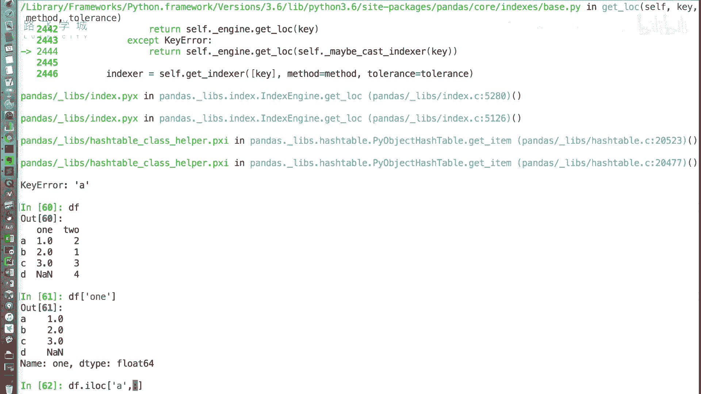
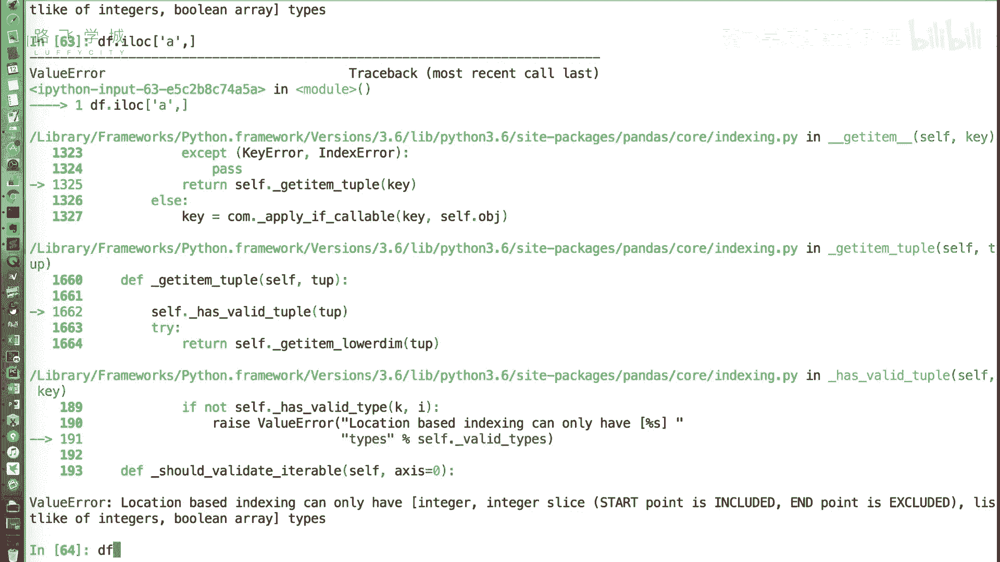
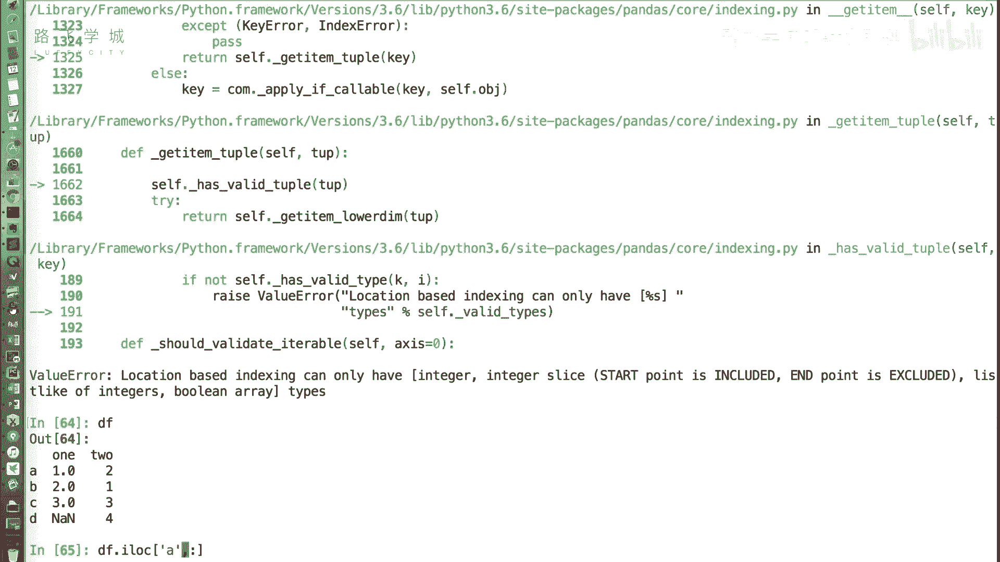
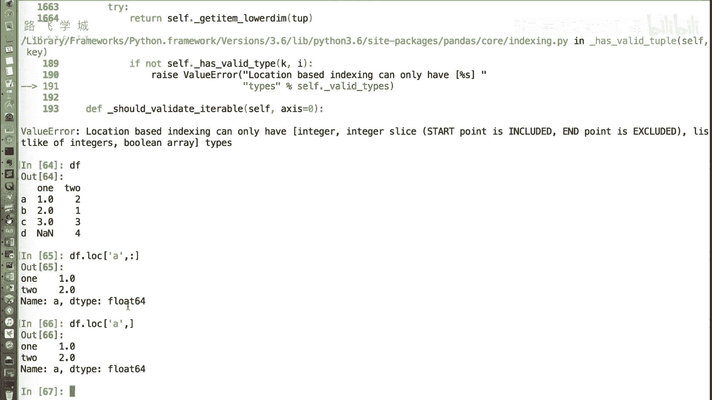
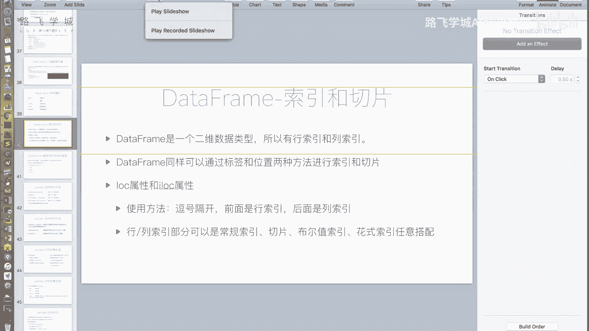
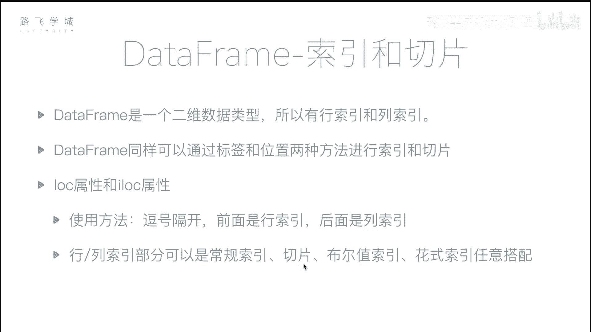
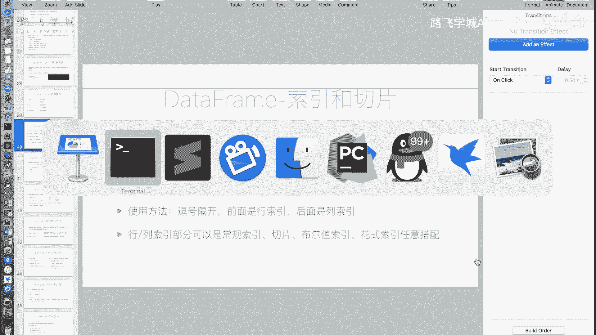
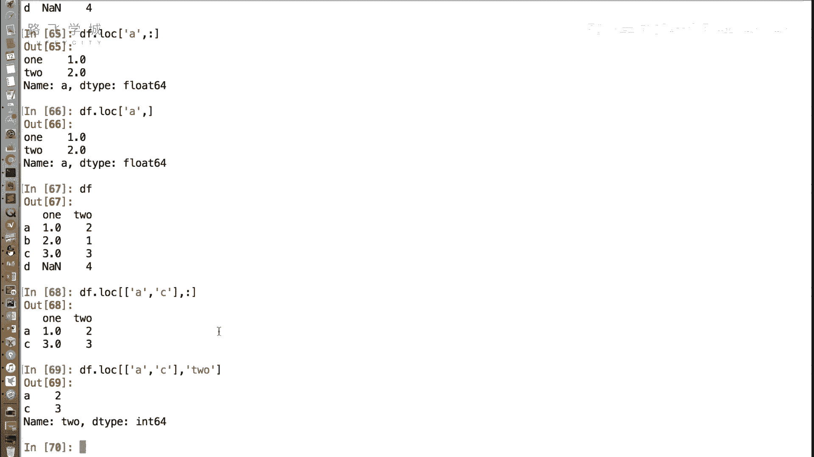
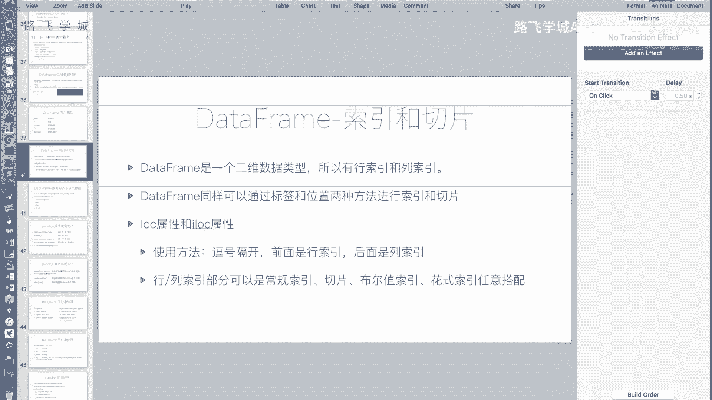

# 14天拿下Python金融量化，股票分析、数据清洗，可视化 - P21：24 DataFrame索引和切片 - 路飞学城Alex小助理 - BV1HAyPYYEAr

好同学们，刚才我们介绍了一些data frame这个类的，这个类的对象的一些常用的属性，那如何获取，在这个表格类的这个对象里获取它的值呢，和series一样，我们可以同样。

同样可以通过中括号这种方式来获取，比如说我想获取1。0的这个值啊，那我们如果按标签进行获取，我们一般先传递列索引，就是先选择一列，再选几行，这个方式跟我们的二维数组不一样，我们二维数组应该是先选第几行。

再选第几列，这个先选列再选行，对这是先选列在哪行，它有点像什么，有点像我们的数据库的表嗯，你数据库表首先是选择select某一列，先选列好one a。

不过你看这个比那个number py的这个取同二位数，比取数据要简单多了，就那个就是感觉格式挺乱的，格式挺乱的嘛，他也有挺乱的事，呵呵好吧啊，我们说这样取，如果你都按照标签取是没有问题的。

嗯啊但是就像我们之前讲的series一样，如果你的行索引是一个整数的话，也是会有点问题嗯，所以我们并不建议大家以这种方式来取值，我们建议什么呢，你按照是标签还是下标，使用lock或i lock属性。

并且不要连续，不要使用连续两个中括号，哎，我给大家示范一下怎么再获取下1。0，更不容易出错的方法就是DF点lock lock指令，我们是通过标签的形式访问中括号行，A这一行逗号隔开one。

我更需更加推荐大家使用这种写法啊，这种写法，首先lock属性指定的是通过标签的方式来访问，那里边的，这种写法和我们在讲number fly的时候基本上一样，就是逗号隔开，左边是行，右边是列取哦。

现在就是按行先行排列了，对这个时候不要连两个中括号连用，因为两个中括号连用，会有一些我们意想不到的事情发生，比如说你忘记了你DF直接A它报错，你先输出列是先输入列是可以的。

但是你想比如说我要看这一行的数据，你输入one看你这一列的数据是可以的，但是你输入这一行的数据是不可，这是因为它的实现方式是相当于是几个，这一列是一个series，相当于说他是把几个C位拼到一块。

所以这样不好访问，那怎么访问呢，如果我们想看一行数据点i lock，逗号隔开，左边是行行就是A右面是列列的话，相当于是我们都取，那所以是一个空的切片，从最开始这一第一列切到最后一列不写。

诶，不写也不行，这怎么了，这in this index can only have two个。

位置区间就是你i lock，你应该是lock吧，你是不是位置写错。

i lock不是整数，按整数是吗，对是吗，对对吧，对刚才不好意思，写错了，应该使用lock，i lock是按照下标的方式获取啊，我们看使用lock行是切A这一行，列行是选择A这一行列式。

通过一个空的切片选择所有的零吧，后面后面那个我试一下，不写也行对那就是逗号，要写逗号号都可以不写对啊，那他选的就是这一行的所有的值好。

好我们来看一下data frame是一个二维数据类型，所以有行索引和列索引啊，同样可以使用标签和位置，两种方法进行切片和投影，这个我们不再赘述了啊，也就是区分log属性和i log属性。

使用方法像刚才演示的一样，用逗号隔开，前面是行索引，后面是列索引嗯，在行索引和列索引的部分，可以是一般的下标切片。

布尔值索引和花式索引任意搭配啊，什么意思，也就是说我可以混搭好DF。

我可以DF，比如说点lock，我可以左边是一个画质作业二，所以都忘了二索引是什么来着，环形就传，就是传递一个列表进去，把它的，列表上所有索引的值都选出来好，右边可以是一个，比如切片哦。

可以把AC把AC这两个选出来了，所以左边这个是指定的，是行对吧，右边右边C如果我右边指定to，那就那就只有to这一列，OKOK我懂了好，所以这是可以啊，很方便很灵活的获取各种各样的值，很牛逼。

对就可以了。

好好那这个就是好，那我们data frame关于它的索引和切片的知识，就讲的这部分。

