# 14天拿下Python金融量化，股票分析、数据清洗，可视化 - P21：33 matplotlib介绍 - 路飞学城小媛老师 - BV1MRmAYSEEt

好同学们，那我们继续给大家介绍这个讲解金融量化分析，这门课程的下一个章节啊，是我们三大工具包的第三个最后一个matt port lab啊，大家可以看到我身边这个这个陪我助讲的，这个同学换人了啊。

我们的ALEX跑路了啊，换来了一个经验更加丰富啊，介绍一下你叫什么，Hello，大家好，我是村长，就完了没了，还有太简洁了，好不管他了啊，我们这个接着讲究我们的matt plot li。

那myself live是一个什么呢，是一个叫做数据可视化工具包啊，什么叫数据可视化工具包，就是简而言之就是画图的啊，比如说这个，不管是我们金融分析或者数据分析等等，你的比如说你的股票肯定是有好多图。

你不是看着一堆表，对不对，你不是看着什么，第一天价格是多少，你看图是更直观的对吧，包括你一些其他的数据分析也是这样的好，那MATTPLEAP就是画图的啊。

是一个强大的Python绘图和数据可视化的工具包，工具包啊，安装方法还是用pip进行安装。

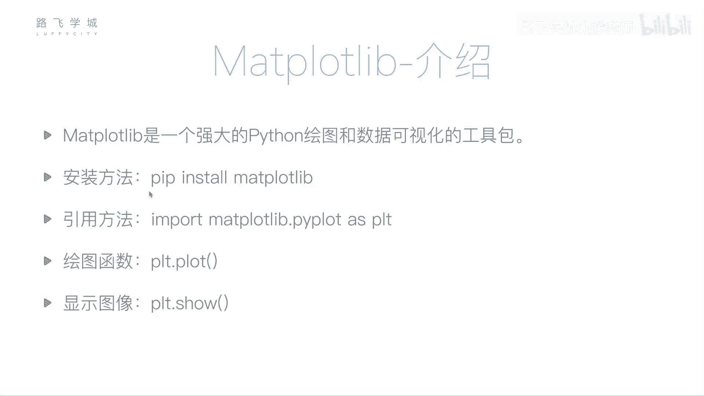

那怎么使用呢，我给大家介绍一下啊，嗯在这我就主要用我们的这个jupiter notebook啊，这个在之前讲IPAD的时候给大家介绍过好，引入方式，Import matt plot。

lib点主要用的是它下边一个子包叫PIPLOT啊，Python画图，plot是画图的意思啊，一般这么写as p RT啊，那怎么画图呢，比如说PLT点plot函数是用来画图的。

PLT点show函数是用来展示展示这个图的，好我们把它运行一下，你可以看到有的这么一个图像，但是里边什么线都没有，因为我这个proud函数没有传任何东西进去，对吧啊。

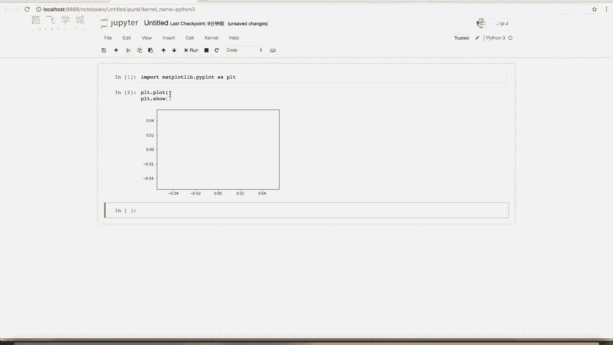

如果你是在，比如说你是在palm上，或者你是在命令行里，比如说你在这PRT点plot，PRT点show，它会弹出一个窗口，那这个窗口也可以，比如说你可以什么啊，拖动啊，拖动它就没有图，看不出来。

可以放大啊等等等等。

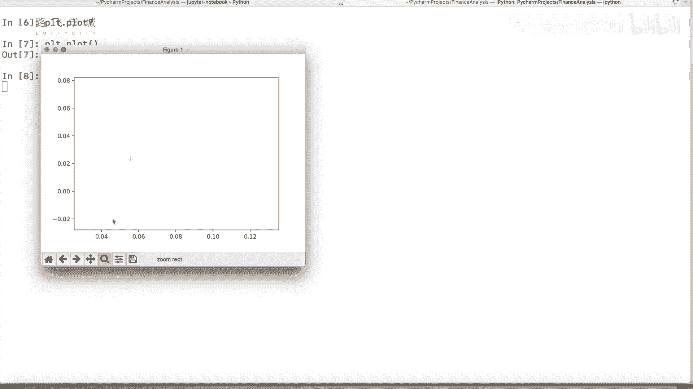

这些东西都可以用好。

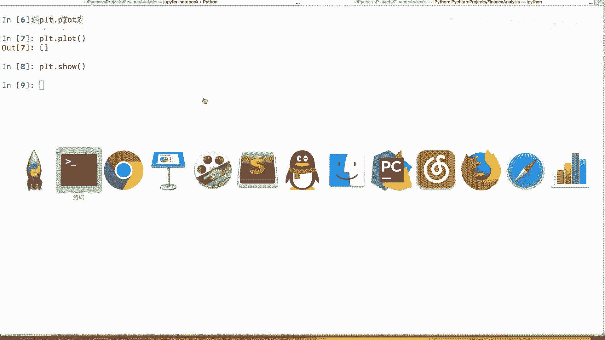

那这个plot函数怎么来用呢。

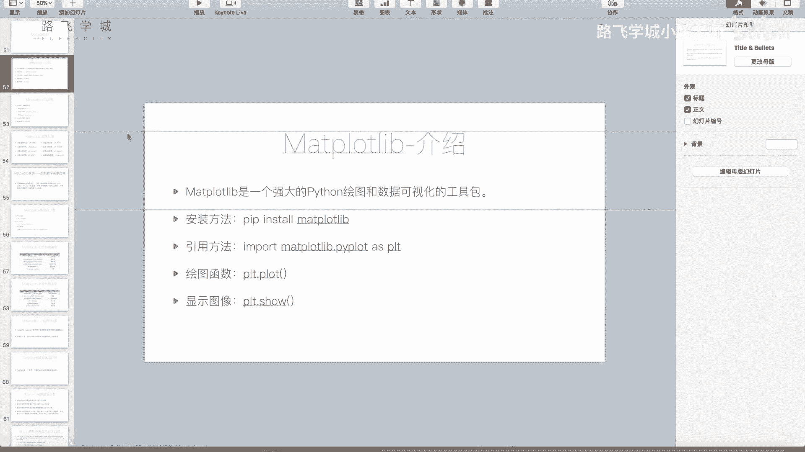

啊这个抛的函数怎么给它传参数，现在是没有线，这个我们肯定是划线的，不是要出这么一个框框好，怎么给他划线，简单来说两个参数横XY对，它其实就是这个pl的函数是来画什么，就是画叫折线图，嗯啊我们叫画写一下。

叫画叫折线图，那我们传比如说我们传两个列表可以吧，1234逗号呃，2468好，我们再运行一下，嗯嗯嗯你可以看到这是一条直线，这条直线是怎么画的呢，你看一一纵坐标是二吧，一纵坐标是二，二四是四啊。

三是六四是八，因为我这画的是这样的，所以它会是条直线，如果改一下，它就不是直线了，是二三哎，一切切啊，如果这样改的话，再运行，你看它就是折线了，就是把这四个点连起来啊，就是把这四个点连起来啊。

这是就是我们说这个最啊最简单的一种写法，一种就是参数两个东西，两个参数X和Y你可以传列表，也可以传我们之前讲的max plot lib，而不是那个number py里的那个数组，嗯啊传速度也可以嗯。

那除了这两个之外，还有第三个参数，就是说如果我在这里边画，比如说嗯我想展示不一样的，比如说我想让它线不是直线，是虚线，或者是我想让他这些点给我点出来标记对，有第三个函数，这个上太好玩啊。

就是一个字符串来决定你这个折线图的类型哦，啊比如说我想让他把这些点画出来什么呢，传一个O进去，变了你可以看到没有线了对吧，然后点是什么小圆点，为啥小圆点就是OO比较像圆点啊。

如果说我还想我还想把线画弄出来怎么办，加一个减号啊，表示线这不是线吗，点连起来你看有点也有限，吃不更直观，这这这对吧。

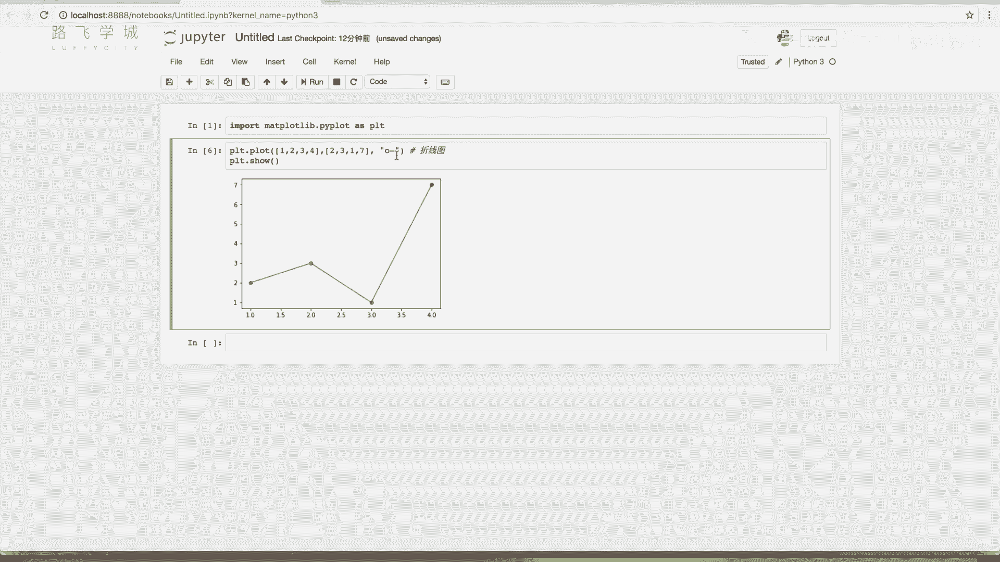

还有好多就是各种这个这样的参数啊，都比较有意思啊，给大家看一下plot函数啊。

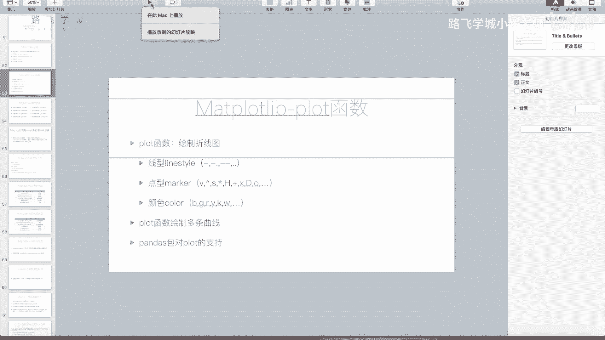

第三个参数你可以加这三种啊，线形就是就是说我这个画出来的图，线是什么样的，比如说我给大家画了有一个横杠，就是看到是实线，对不对啊，有一个横杠一个点有两个横杠，有两个点，一会啥咱们亲自试一下啊。

典型叫marker，典型就是什么，就是说我那个数据点，你的两个XY，一个X和一个Y对应的一个点画成什么样啊，展示了一个OO是小圆点，一会看下这几个参数干啥的，还有个颜色是我的线的颜色或者点的颜色。

简写啊，简写这个好理解，你看B是吧，Blue blue j green red，Yellow，K是black，因为B站了，所以他不是B了，是KW是white白的。

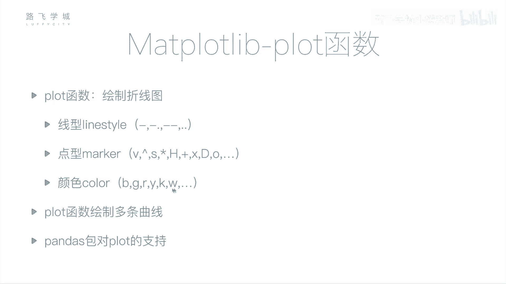

好来简单。

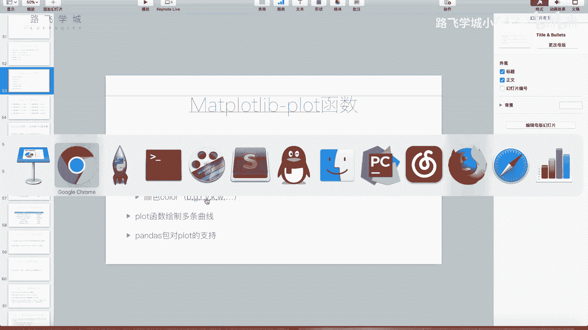

我们看几个之前的这个例子啊，比如说O还有什么V，你猜V是啥，那是啥哈，哦三角嘛也不像个V嘛，对不对，要是上三角呢，这是下三角，对不对，朝下的三角，如果超重超上三角，尖角号这个shift加六不尖嘛。

嗯尖角号啊，还有各种，比如说这是就是比较形象化的啊，还有一些比如说星号画出来是五角星，看不太清楚嗯，是五角星确实是啊。

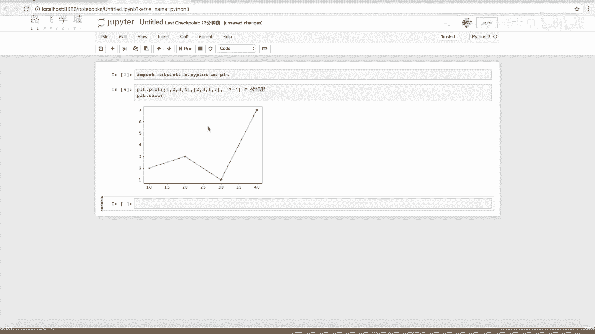

还有什么这个你们可以自己去试一下，加号就是个加号叉。

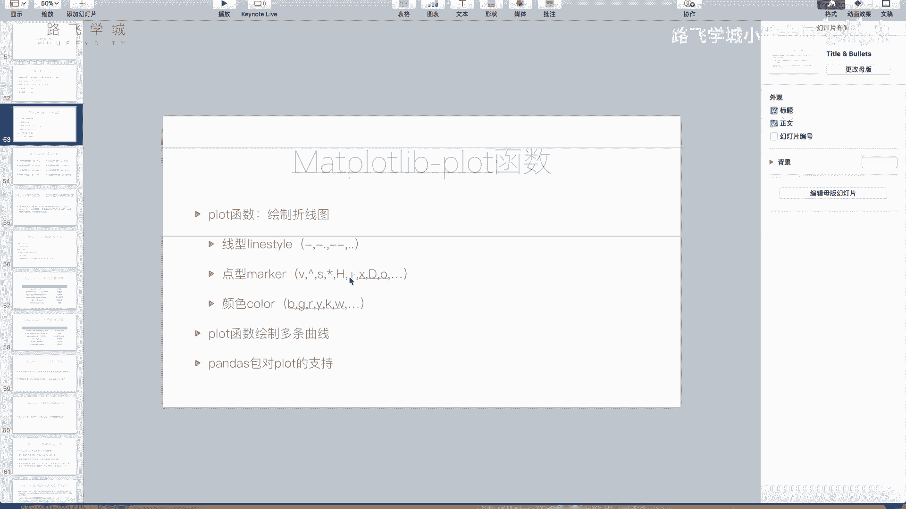

X就是个X就是个那个叉号，然后比如说有一些还有一些就是D，这个不是象形的啦，这个是英文，咳咳说的是菱形，为啥是demo的钻石的那个意思，单词的首字母，然后H是一个你这看不出是一个六边形，比较小。

是一个六边形啊，叫这是六边形，那个H出什么震的首字母我记不清了啊，这是这是我们说的这个线这个典型啊，线形的话一个减号是实线，一个减两个减号，还什么虚线线，那还有一个减号，一个点，哎呀是这种一个减号。

一个一个线，一个点的这种虚线啊，还有两个点，啊好像没有两个点，两个点看来不行了。

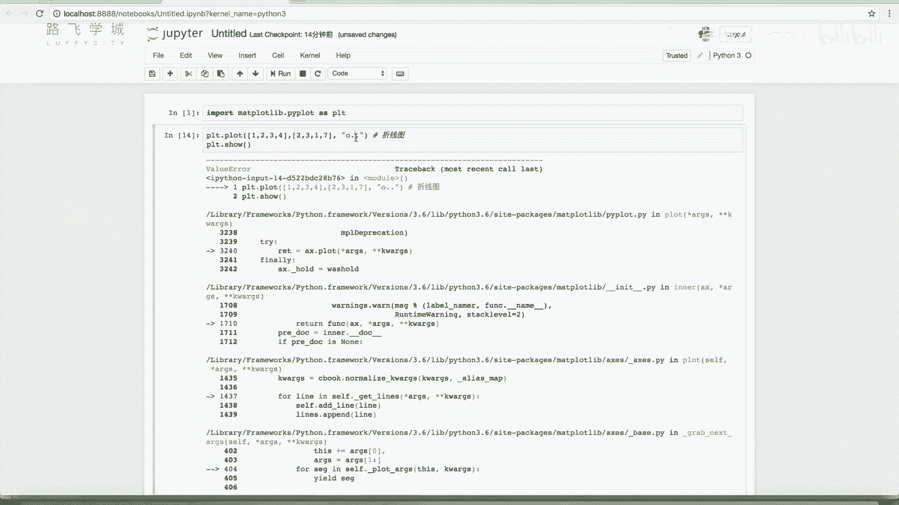

反正这些差不多也够用的了啊，具体你要想大家要想说这个所有的还有什么。

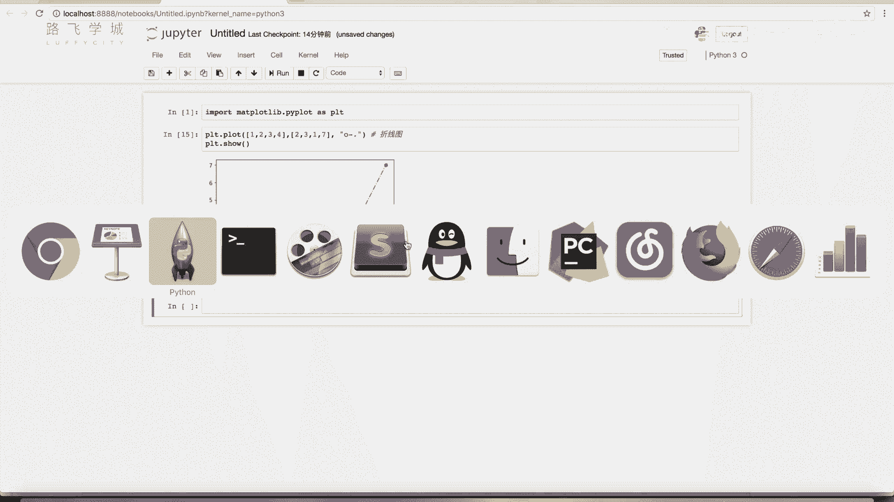

你可以看我们用，用我们这这个IPYTHON的这个帮助手册啊，你可以看一下，或者去看官方文档，他这都说了，你看什么character，一个线是solid line，就是实现两个dashed line啊。

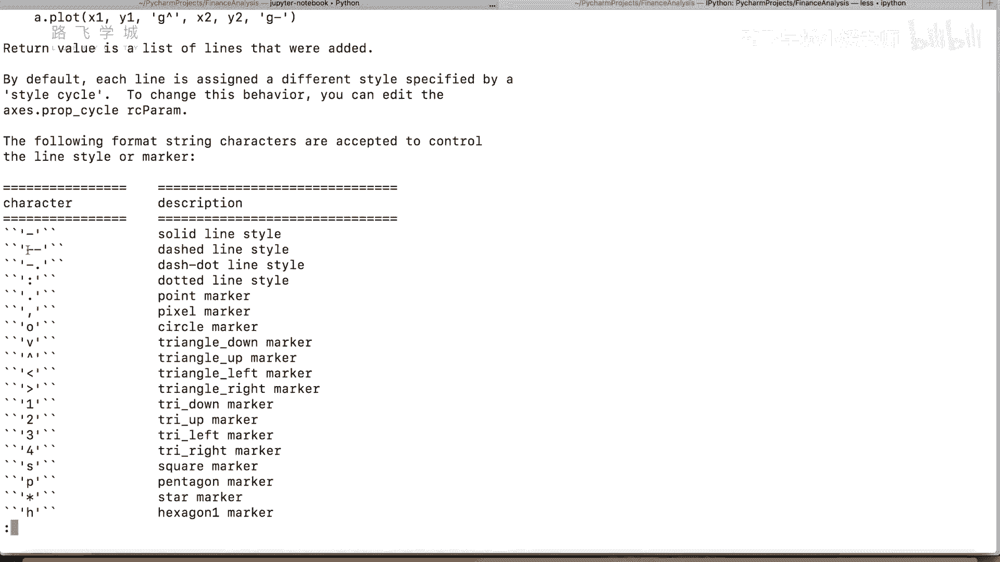

Death dot line，doted line哦，原来两个点改成冒号了。

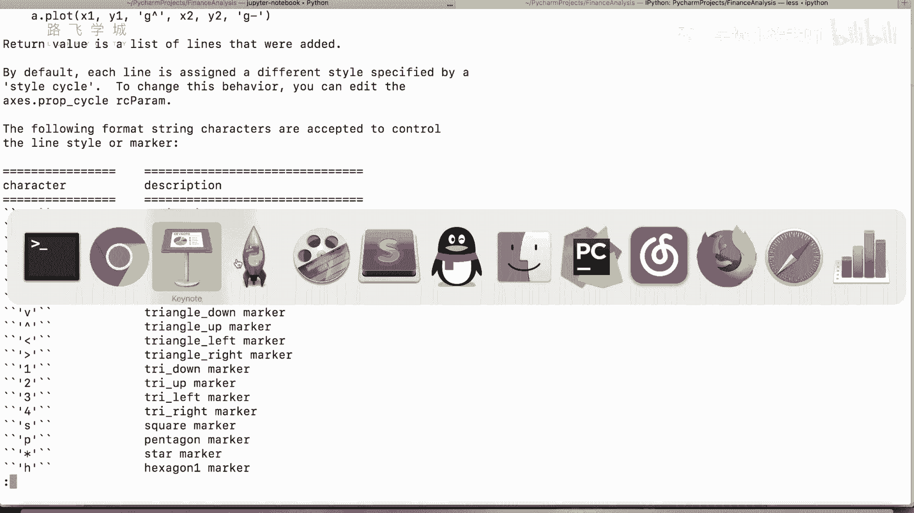

看到没有，Dotted line，不是两个点了，是冒号竖的两个点哦，看这种很密小点的这种线了啊。

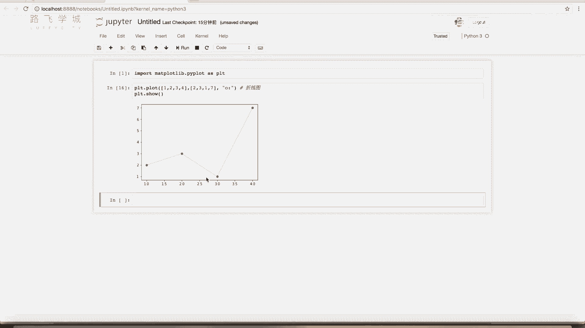

你可以大家可以就是什么就可以在上面看嗯，好我们就不展开了，颜色啊，演示一个，这也有一些常见的颜色。

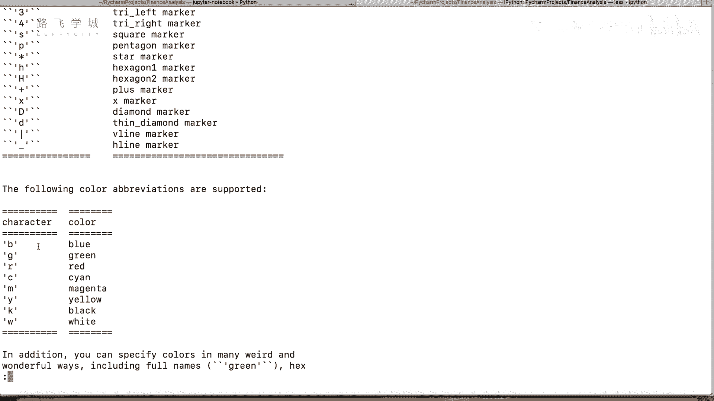

比如说R红的了吧，啊有时试一下这个K黑色黑色啊，其他的我们都不一演示了，嗯那这是一种传入的方法，当然也可以说你把这三个分别当一种颜色，当一种当一个参数出来，比如说你的color可以这样写。

color等于red还是红的哦。

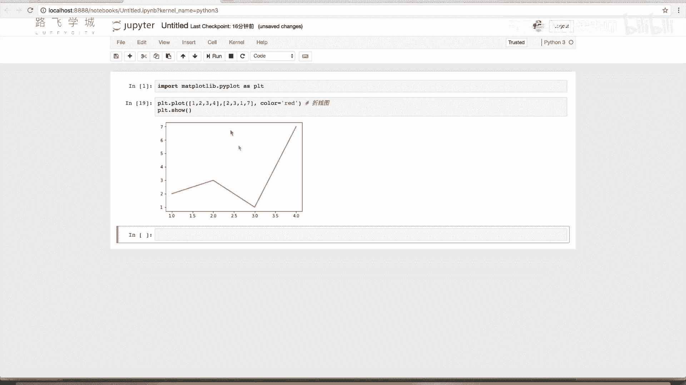

嗯啊咳咳，这两个color lifestyle和maker啊都可以当传进去，你也可以当一个引号那样传进去都行啊，这是我们说的就是啊plot函数的简单使用好。

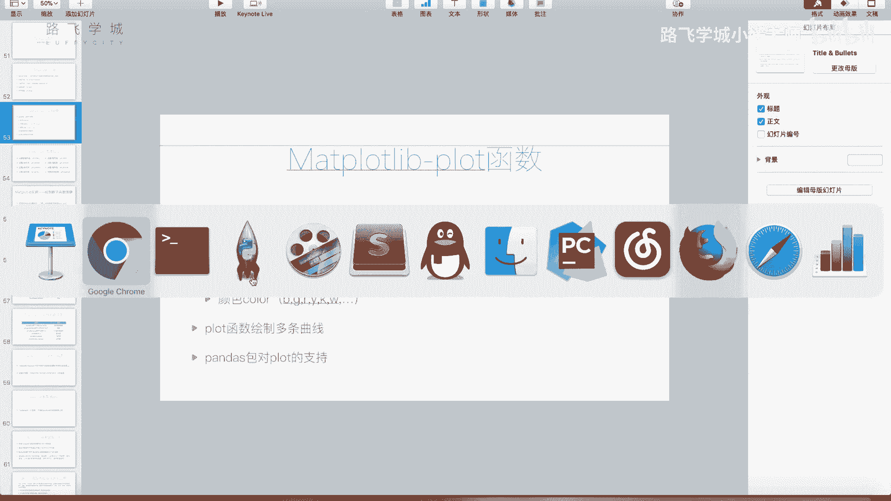

那接下来我们讲一些复杂的使用。

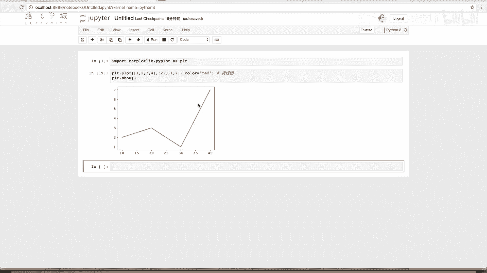

比如说我想在一个图里，现在想在一个图里画出来多条线，怎么画呢啊怎么画呢，包括还有一些plot的一些高级功能好。

