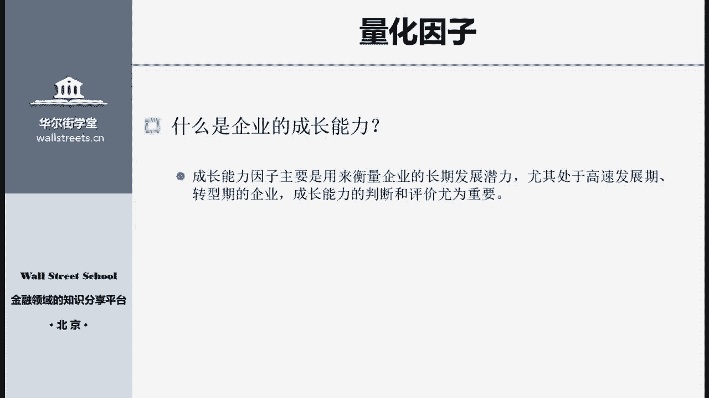
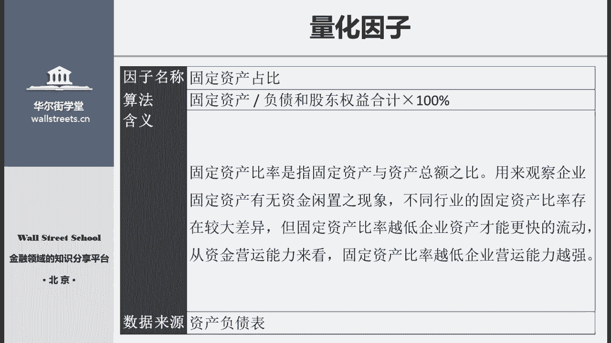
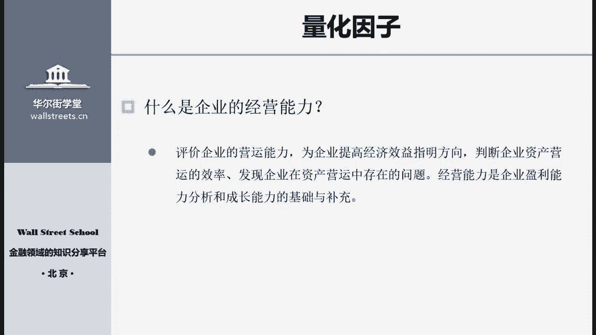
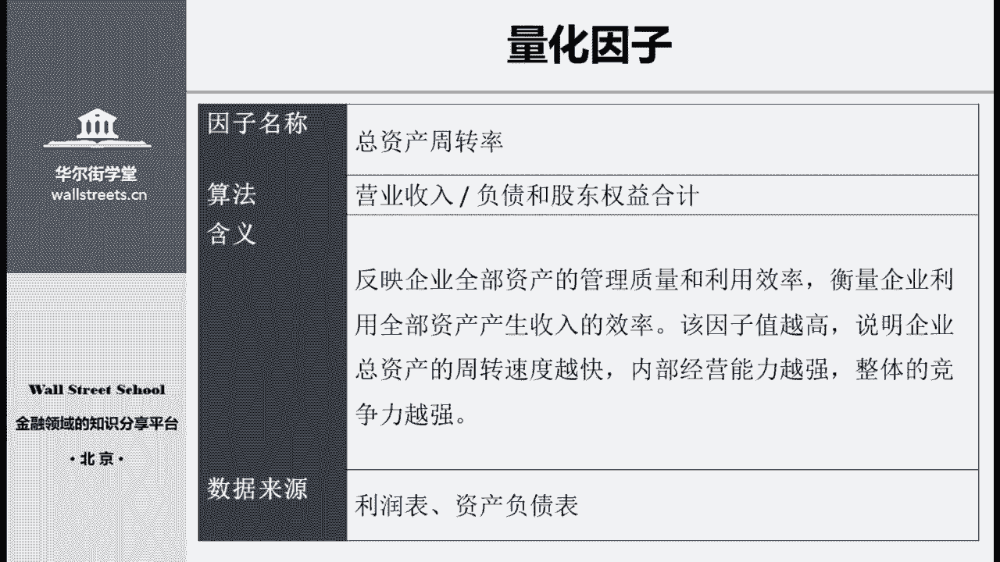
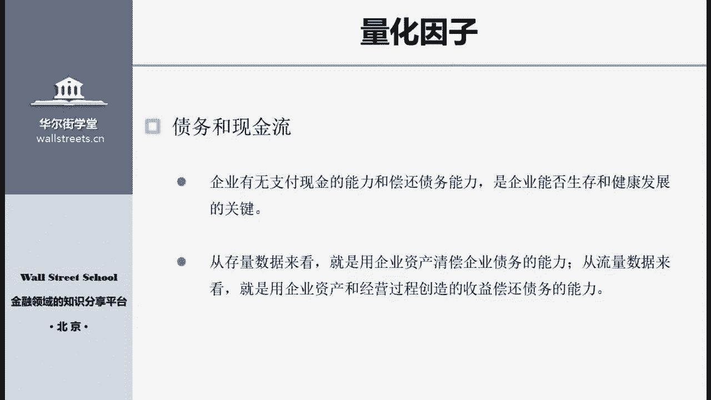
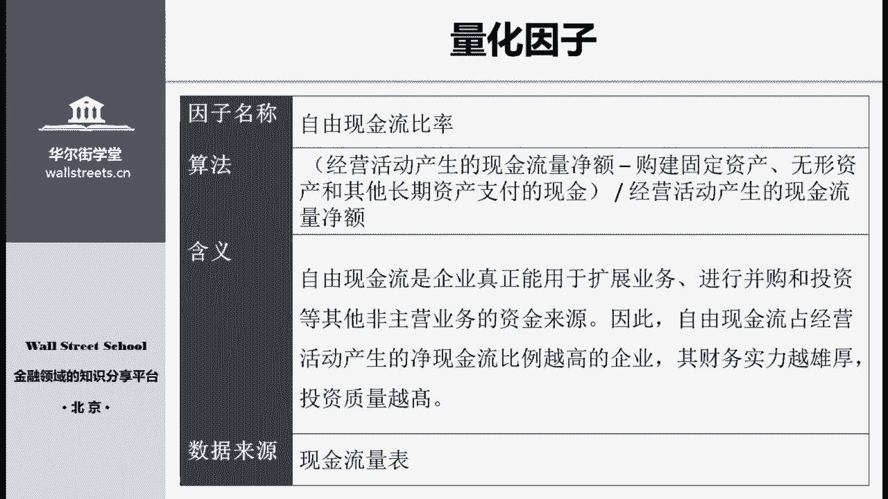
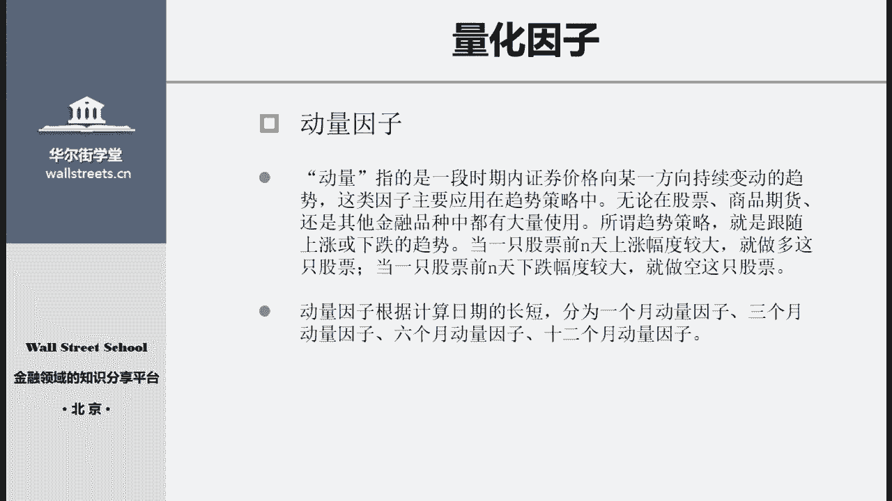
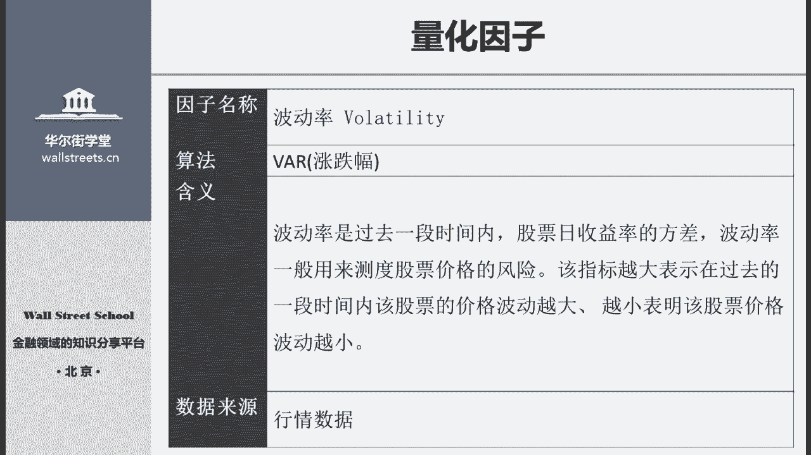

# 14天拿下Python金融量化，股票分析、数据清洗，可视化 - P22：05 量化因子 - 川哥puls - BV1zkSgYZE54

这部分中我们主要会介绍两大类的因子，上一节课中呢，讲到了这个基本面里面的估值因子，那么这节课会介绍剩余的五类，估这个基本面因子，其次呢还会介绍到常用的技术因子，好我们开始第一部分基本面因子。

首先呢是我们来分析一家企业的盈利能力，那么这些因子呢，主要就是用来评价盈利能力使用的，那么企业的盈利能力就是指它赚取利润的能力，这也是在一个企业的运行过程中，各方都非常关心的这么一个问题啊。

从这个外部来看，利润呢是股票价格上涨的根基，也是投资者取得收益的来源，也是债权人收回本金和利息的根本保障，这个呢就是说我们作为投资者，不管采取了什么样的投资策略，那么不管你是去选取那种大市值的股票。

还是说去选取比较高风险的小市值股票，那么总之呢啊都会希望去选取一些，质量相对比较过硬的，那本身能够产生足足够的利润的这么一些企业，那么有些企业呢如果他是本身就是亏损的，或者说这个盈利的能力非常的弱。

那么这种企业你去投资它就是很危险的，那么这是从外部来看，那么我们要从内部来看呢，盈利能力也就是这个企业赚取的利润，是企业管理层，经营业绩和管理能力的这么一个集中的表现。

也是职工福利酬薪不断提升的重要的保障，因此一个企业的盈利能力的分析十分的重要，而盈利的因子呢就是我们在做股票量化分析，当中的一项非常重要的内容，也是量化策略里边判断一个企业价值的时候。

最重要的因子的部分，那么盈利的因子到底有哪些呢，我们主要呢使用的是这五个因子，这些因子都是从不同的程度上，反映一家企业的盈利能力，而且这些因子呢对全市场的股票都比较实用好，包括第一个资本收益率。

也就是ROOE，这个因子呢是衡量公司股东投资的资产，所实现的收益，也就是单纯的这个公司的净资产带来的收益好，第二个资产回报率，这个也叫投资回报率，这个衡量的是公司使用所有的资产，获取回报的效率。

那么所有的资产呢，就不仅包括股东的这个股权资产，也包括从债务人那里借债得来的，这个债权的资产，所以它是一个公司所有的资产加起来，获取回报的能力，第三个主营业务的毛利率。

这个就是反映公司对于这个原材料的利，用效率和初始的获利能力，这个因子呢直接的反映了，你这个企业在市场上面竞争能力到底如何，如果一个企业的毛利率非常的高，那就说明你在这个市场里边是属于垄断的地位。

或者呢你的竞争能力非常的强，好第四个呢就是主营业务的利润率，这个是直接反映企业的盈利能力的，也就是说扣除了那些啊毛利率，以及其他的这个内部的成本之后，我们再看你说企业获取利润的能力到底如何。

那么更进一步呢就是第五个净利润率，这个直接反映了股东啊它的收益，那么就扣取了各种税费等等，其他的这种啊费用和项目，那么这个呢是最根本的一个企业的获利，好那我们就具体看这些因子它的内容，第一个资本收益率。

资本收益率呢，它的计算方法是使用净利润除以股东权益合计，那么这个因子主要就是体现，公司自有资产的收益水平，也就是公司运用自己资本的这个效率，也可以说呢是股东权益的收益水平，这么一个因子，它的值越大。

说明公司对资本金的利用与管理越有效，带给股东的保障和回报越多，不过roe这个指标呢只是用来衡量自有的资产，也就是说我们只是评价了这个股东权益，并没有去评价这个债务权益，忽略了债务杠杆在里面起到的作用。

因此呢比较合适的方法是，要结合其他引力因子综合使用，这个是什么意思呢，就是我们可以想一下，如果有一家企业，它的自有资产同样是100万元，但是呢他借债借了500万，那么相当于他这个企业在进行运营的时候。

实际上使用了600万元在进行运营，那么你在获利的时候，自然是使用这600万元进行这个生产，并且获利的，那么相对于原始的这100万元呢，你的获利的能力就会比较强，那么另外一家企业，他自有资产是100万。

同时他没有进行任何的借债，那么他只是在使用这100万元，进行这个生产和获利，那么这样的企业呢，它的这个获利能力当然相对就低，也就是说，第一家企业，它的资本收益率，应该会比第二家企业的资本收益率要高。

但是在这其中我们只看到了它的收益率较高，但却忽视了第一家企业的杠杆风险，也同样呢比第二家企业要高很多，因此这个因此我们不能单独的使用，而是呢要和其他的盈利能力因子综合起来使用。

才能最准确地反映出这家企业，它的这个盈利能力如何，另外在计算这个资本收益率的时候，我们呢也要考虑到优先股的影响，有些企业呢它会发行优先股，那么它的股东权益，就分成了优先股东和普通股东。

但是因为优先股的性质类似于债券，所以在算计算这个资本收益率的时候呢，大部分会从净利润里面扣除掉优先股的股利，然后从股东的权益合计里面，扣除掉这个优先股的股权再进行计算，好下面这个因子呢是资产回报率。

这个因子，它是使用净利润除以负债和股东的权益合计，这个因子是综合的，衡量了公司利用所有资产获取回报的效率，不仅包括了自有资本，而且包括了债务资本，因此ROA越高的公司，他的这个盈利能力整体来说就越高。

但在国内市场上呢，一般来说轻资产的行业，如高科技，互联网等公司，它的这个资产回报率，普遍的会高于重资产的行业，比如说像制造业，汽车业等这些固定资产比重较高的公司，这个是现在市场上的趋势。

那么第三个因子呢，主营业务的毛利率，这个因子它的计算方式是，使用营业收入减去营业成本，最后再除以营业收入，这个是反映公司产品的竞争力和获利潜力，以及公司对原材料的利用效率，和这个产品的初始获利能力。

一般来说是一家上市公司，在进行同业对比的时候，非常重要的一个指标，如果说你这家公司的毛利率，显著高于你的竞争对手，那么就说明这个公司与供应商的，议价能力非常的强，从而呢你可以压低所有产品的这个成本。

或者说也有可能是你这家公司，有很强的品牌效益，比如说像现在的这个苹果公司这样，他们的产品呢定价就可以相对较高，因此和这个竞争对手相比，他们在同样的成本下，获得的这个收入就会相对较高。

最后一个盈利因子呢就是净利润率，这个因子，它的计算方式是使用净利润除以营业收入，这个因此是直接的简单的衡量了，企业将销售额转化为股东利润的能力，这个因子呢非常的直观，也非常的常见。

大家也很好理解它其中的含义，我们就不再多说了，上面那些呢是盈利因子，总共有五个，那么下面我们来看一下成长能力的因子，那首先什么是成长能力呢，成长能力主要是用来衡量一家企业，长期的发展潜力。

尤其是当这家企业处于高速发展期，或者转型期的时候，那么成长能力的判断和评价尤为重要，比如说现在的很多互联网公司，或者不管它是有没有上市的啊，比如说像京东或者是蚂蚁金服这一类，在海外上市的企业。

那很多时候呢，他当前来看它的盈利能力并不是特别的显著，甚至有些企业呢，可能当期还是处于一个亏损的状态，那么这些企业，为什么它仍然能够获得一个很高的估值呢，很重要的一一方面原因就是因为它本身的盈利。

虽然当期是一个亏损的，但是并不是因为它没有这个盈利能力，而是因为呢，他把很多的这个收入去投入到长期的发展中了，有些是构建固定资产，有些呢是投大量的投入到这个研发的成本当中。

所以这样的企业它的盈利能力虽然不强，但是他的成长能力非常的优秀，也就是说它在未来会是一个能够很强盈利的，这么一个企业，那么去衡量这些企业的时候，我们就是使用这个成长能力的因子。

那么成长能力的第一个因子呢，就是营业收入的同比增长率，它的计算公式是使用当期的营业收入。

减去上期的营业收入，除以上期的营业收入，再乘以百分之百，那么这里呢当期和上期实际上有两种算法，一种你可以使用当就是最新一期年报的数据，去减去更早一年的年报的数据，这种呢是可以的。

或者你使用最近的TTM营业收入数据，去减去上一期TTM的营业收入数据，这也是可以的啊，TTM就是说最近12个月的平均值，好，那么这个因子呢，它是用来检验上市公司去年一年的挣钱能力，是否有所提高。

如果说你在当期的这个营业收入，比上一期的有显著的增长或者说下降，那么就能很明显的去反映该企业，它的这么一个经营的情况，那么像我之前提到的那些互联网企业，或者是新兴产业的企业，他们一个很明显的这么特点呢。

就是说虽然他们一直没有盈利，但是他们的营业收入同比增长率都非常的高，也就是说，他们的每年的营业收入都是在大幅的上涨的，只不过是因为成本也就是在各方面的支出，或也同比增加了很多。

所以导致了他们的利润是一个亏损的状态，但是他们的营业收入总是在上涨的一个情况，这样的企业呢就是处于高速发展期的企业，第二个成长能力的因子呢就是固定资产占比，他这个因子的计算方式是。

使用企业的固定资产除以负债，和股东的权益合计，最后乘以百分之百，这个比率呢主要是指，固定资产和这个企业总资产的比率，是用来观察这个企业的固定资产，有没有足够的啊，固定资产的增长。

是不是说呢这个企业它的资金在闲置，有些企业它可能账上有很多的现金，但是因为本身呢没有一个明确的发展方向，或者说没有办法进一步扩张，所以它的固定资产占比会逐渐的减小，那么对于那样的企业呢。

它就是属于长期的发展能力受到限制的，那么如果一个企业，它的固定资产占比啊非常的大，那么我们一方面呢，可以认为这个企业，它本身未来的发展潜力会比较强，但是从反方面来看，这也意味着他有很多的资金。

要投入到这个固定资产的投入上面去，那么从本身的运营来说，你大量的资金被固定资产所占用了，也并不是一个很好的现象，因此在固定资产的分析上呢，我们要分行业的去看待，对于那些重资产的行业来说。

它的固定资产占比啊比较大，是一个比较正常的情况，那么对于一些轻资产的行业来说，如果它的固定资产占比啊急剧的扩大，扩大了很多，那么呢就可能出现问题了，这个时候就要进行进一步的详细分析。

那么上面两个呢是比较常用的成长能力因子，接下来我们要介绍一下经营能力的因子，那么什么是企业的经营能力呢。

他经营能力实际上是从内部去评价一个企业，也就是说是去评价这个企业它内部的营运啊，效率如何，或者说营运当中有没有存在什么问题，一般来说，这个经营能力的分析都是相对比较复杂的，需要你对这个企业了解比较透彻。

知道他的啊这个行业的状态是什么样的，它的存货的周转是一个什么样的速度，那么总体来说我们总结出了几个比较常用的，用来判断经营能力的因子，第一个就是这个企业的存货周转率。

它的计算公式呢是用这个企业的营业收入，除以平均存货。

这个指标在企业的管理决策中，是被非常广泛地使用的，主要是用来反映这家企业的存货周转速度，和你的销售能力，那么在正常情况下，如果这家企业的经营非常的顺利，存货的周转率越高。

那么就说明企业的存货周转速度越快，企业的销售能力越强，但是呢我们也要分行业来看待，一般来说对于那种快销型的行业，那么他们的生产的产品呢，在一年内可以被销售很多的次，很多次存货呢往往不会出现滞销的情况。

那么对于那样的企业呢，它的存货周转率都会比较的快，那么对于有些啊，比如说房地产或者是呢偏固定资产的企业，那么那样的行业呢，本身它的存货周转率就会相对较慢，因此在分析这个企业的经营能力的时候。

一定要进行同行业内的对比，不能呢跨行业的去对比两家公司的存货周转率，那样子是没有什么太大的意义的，第二个经营能力的因子就是应收账款的周转率，这个的算法呢是使用营业收入除以应收账款。

应收账款周转率主要是指企业在一段时间内，营业收入和平均应收账款的余额之比，也代表着这个企业应收账款变现的速度和效率，如果一家企业的应收账款能够及时收回，那么公司的资金使用率呢自然是提高很大的。

这个怎么理解呢，我可以给大家举个例子，比如说一家企业，它每年的营业收入是500万元，但是他的应收账款也同样是500万元，那么这意味着什么呢，这就说明这家企业在当年的所有收入，实际上都没有收到任何的现金。

而全部呢仍然被这个下游的客户欠账，在账上只是一个应收账款，而没有变成现金流，那么这对你企业未来的发展会有很大的影响，那如果说同样是一家，因这个营业收入500万元的企业，但他的应收账款只有100万元。

那么就意味着这家企业呢，在今年内至少收到了400万元的现金，那么有了这400万元的现金，我就可以投入到进一步的扩大生产，或者是企业自身给员工提高福利，这些的用处上去，那么对于企业的未来发展呢。

自然是有很大的好处的，这就是应收账款周转率代表的含义，下面一个因子呢总资产的周转率，这个的算法是使用营业收入，除以负债和股东权益的合计，这个因此呢反映了企业全部资产，的管理质量和利用效率。

衡量了这家企业，利用所有资产去产生收入的效率，一般情况下这个因子的值越高，就表明这家企业总资产的周转速度越快，那么也就说明这家企业呢，它本身的运转的效率特别的高啊，经营的能力非常的强，前面三部分。

这个基本面因子呢，主要都是衡量这家企业它的好的一面。

也就是说这家企业它的盈利能力究竟如何，他的成长能力是否够强，或者他的经营能力是否够高，那么这些呢说明的是这家企业的价值，之后的债务和现金流因子，主要是用来衡量一家企业它面临的风险。

以及呢他能不能够持续的经营，那么一家企业他有没有足够的现金，或者呢有没有能力去偿还债务，是这家企业是否能够生存和健康发展的关键，即使一家企业它的盈利能力非常的强，他的成长能力呢非常的优秀。

但是一旦他的现金流出现了问题，一旦呢他遇到了困难，没有办法及时偿还上债务，那么这家企业仍然会面临一个破产的风险，那我们从存量数据来看，一家企业呢可以使用自己全部的资产进行清偿，企业的债务。

那么像这一类的因子，主要呢就是债务能力因子，也就是说企业是否资仍然抵债，是否呢能够使用自己的资产去偿还债务，那么从流量的方面来看，我们也可以认为一家企业，它是否有足够的能力去创造收入去进行经营。

进而呢产生收入去偿还债务，那么这一部分呢，主要是从现金流的方面进行分析，也就是说一家企业在日常的运营过程中，它能够产生多少的现金流，到底足不足够去支付啊这些债务的利息等等，接下来我们就看一下。

这些具体的债务和现金流因子，第一个因子流动比率，那么这个呢我们也叫做短期偿债能力因子，是就是计算这家企业能否解决短期债务问题，的一个最常用的最主流的因子。

流动比率，他的算法呢是使用流动资产合计去除，以流动负债合计，这个因子主要是用来衡量企业的短期偿债能力，也就是说当一年以内的债务到期的时候，这家企业有多少资产可以变为现金，用于偿还负债。

这里呢流动资产主要是包括应收账款，存货或者现金及现金等价物等，像应收账款一般来说都是在一年内会到期的，就是啊对方欠你的钱，大部分都是会在一年以内还给你的，很少有流动，这个应收账款拖到两三年啊。

还没有还给你，那么那样的呢大部分都已经是坏账了，还有像存货啊，一般的企业的存货，都是会在一年以内销售出去的，所以像这类资产呢，就是流动资产，那么流动负债，大部分指的，就是说在一年内会需要你偿还的负债。

比如说这种短期的银行贷款这类啊，一般说来像你流动比率的比率越高，就意味着你这家企业在短期内违约的风险越小，也就意味着你这家企业至少在一年以内，是能够健康地经营的，第二个因子资产负债率。

这个因子的计算方法呢是使用总负债，去除以总资产，也就是说使用这个债权人的所有权益，去除以这家企业股东权益加上债务的权益，那么大家就可以看出，这个资产负债率呢，肯定是总是会小于百分之百的。

那么它越接近于百分之百，也就意味着这家企业呢你的负债率越高，也就是说明这家企业的债务杠杆运用的越大，一般来说，当资产负债率啊急剧上涨的时候，它一方面意味着，你这家企业的风险会在急剧的扩大，另一方面呢。

也意味着这家企业使用的资金杠杆在增大，那么你获取收益的能力也在增加，也就是说是收益和风险两个相辅相成的，那么如果是一家企业，它的资产负债率上涨，同时伴随着较高的利润能力，同时呢也有较多的现金流入。

那么就说明这个企业在一定的时间内，既能够健康发展，同时也使用了很大的杠杆，这样的一家企业，就是进入了高速发展的良性循环，那如果这家企业它的债务杠杆在上涨，但是并没有伴随着较高的利润，那么这个时候呢。

这家企业它的风险就会逐渐的累积，一直到最后如果爆发，那就是面临破产清算的这么一个啊，最后的结局了，第三个债务和现金流因子就是利息保障倍数，这个因子的计算方法是，使用息税前利润除以利息费用。

它主要是用来衡量一家企业，偿付借款的利息的能力，它与前面两个因子不同的地方在于呢，前面两个因子衡量的是企业偿还借款，本金加上利息，就是偿还所有借款的能力啊，这个因子呢仅仅是衡量企业偿还利息的能力。

它使用到的数据就是企业的息，税前的利润以及呢利息费用，也就是说，如果一家企业的利息保障倍数足够的大，那么这家企业通过日常的经营获得的利润，就可以支付他自己债务的这些利息，一般来说。

这个利息保障倍数至少要大于两倍以上，那么其他的债权人才敢于去借债给这家企业，第四个因子呢叫做自由现金流比率，这个因子的算法相对比较复杂一些，它是使用经营活动产生的现金流量净额，减去呢构建固定资产。

无形资产和其他长期资产支付的现金，那么我们简单来看，他就是用一家企业在经营活动中产生的现金，减去资本支出，最后得到了这个值，再除以经营活动产生的现金流量净额，那么这个因子呢主要计算的是一家企业。

它获得的现金流里边有多少，能够真正的自由支配，自由使用的，那么只有这些现金才是这家企业用于拓展业务，进行并购或者是进行投资，这些其他非主营业务的资金来源，因此自由现金流占这个经营活动产生的。

净现金流比率越高的企业，他的财务实力越为雄厚，投资的能力和投资的质量越高，上面我们介绍了一些基本面的因子，那么这些因子呢我们在之后啊，都是可以使用代码去编写生成出来的，之后的课程中呢会实际的教学。

怎么样用代码来实现这些因子。

接下来我们要介绍的是另一大类的因子，也就是技术面的因子，所谓技术面的因子呢，主要是指由这个技术分析得来的因子，这些因子主要是集中于，股票价格本身的变动趋势，更侧重于根据这个市场的实际交易情况。

去分析和判断股价，比如说像一只股票价格的涨跌幅或者换手率，或者成交量，这些市场行为呢，它本身是不能用来衡量这家企业真正的价值的，但是可以使用技术因子，也就是说间接的来衡量一个企业的股票价格。

它未来的变动趋势，这类因子中又很分为很多细分的种类，比如说量价因子，也就是说以交易行情数据为这个基础，计算得到的因子或者K线因子，也就是以股价K线的图形走势为基础啊，计算得到的因子或者是一些图形因子。

就是以股价走势的这个曲线图形，它们为基础得到了这样的因子，那么在所有的这些因子里面呢，实践过程中，一般来说量加因子相对比较有效，而K线和图形因子呢，因为它们的因子构建本身比较复杂，所以并不是那么好实现。

主要呢我们介绍的是量价因子，那么这些技术面的因子呢，它们与基本面因子不同，技术面因子主要是着重于，描述这个股票价格的波动规律，尝试使用一些规律或者方法，去预测股价未来的变化。

那么这些因子主要分析的是股票的供需表现，市场价格和交易数量等市场因素，以及呢这些市场因素背后代表着的投资者心理，大部分技术面的因子，都是针对股价的涨跌表现啊去进行预测的。

这些因子呢都是属于短期性质的因子，尤其擅长于日内或者几天内的预测，所以从好的方面来说，技术面的因子更注重交易时机和操作方法，那么在一般的量化策略中，我们会使用基本面的因子作为最主要的依据。

去判断要不要购入某只股票，或者呢要不要卖出某只股票，那么在具体的交易时间点的选择上，我们可以引入计数因子来辅助进行判断，好那我们来看一下第一类技术面因子，第一类呢是动量因子，动量是指的是一段时间内。

这个股票价格向某一个方向持续变动的趋势，这一类动量因子呢，主要应用在各个趋势策略当中去，不管是在股票里边啊，各类多头策略，还是说在商品期货，也就是各类CCTA策略里边。

或者呢其他的金融品种里边都有大量的使用，那么趋势策略，主要就是跟随这个股票价格的上涨，或者下跌的趋势，比如说当一只股票，前几天上涨的幅度很大的时候，那么我们就认为它这个趋势会持续，就去做多这只股票。

当一只股票前几天的下跌幅度较大的时候啊，我们也认为这个趋势会持续，那就去做空这支股票动量，因此根据计算的时间的长短呢，分为一个月动量，三个月动量，六个月动量和12个月动量，那么在我们的实践中发现。

这四个因子是相对来说比较有用的，好我们来看一下一个月动量的因子，他的计算方法呢就是使用当前的收盘价，减去一个月前的收盘价，最后呢再除以一个月前的收盘价，这个因子是用来表示，股票呢在这一个月内的动量。

在国内的市场上，大部分股票的动量都很难以持续一个月以上，因此呢上一个月收益增长最高的股票，经常是在下一个月跌回去了，而在上个月跌的最多的股票呢，在下一个月往往会带来不错的回报，因此像这种短期的动量因子。

更多的是使用在反转的策略中，也就是说如果一个股票它上涨的很多，那么我们干脆就在下个月呢直接卖空这支股票，那么一个因子究竟是作为趋势因子，还是作为反转因子使用呢，这一点往往我们在构建因子的时候。

是很难以回答的，都是要使用市场的数据，不管是历史数据还是呢真实的交易数据，都是要使用这些数据对因子进行一个检测，才能够发现你这个因子到底是适用于趋势，还是适用于动量，还是适用于反转。

第二个动量因子呢三个月动量的因子，它的计算方式就是使用当前的收盘价，减去三个月前的收盘价，再除以三个月前的收盘价，这个因子呢啊，自然就是用来表示股票在过去三个月内的动量。

这个因子相比于一个月的动量因子来说啊，它能够积蓄的是能量更大，它的动量呢更大，因此相对来说这个因子啊比较有效，而且呢适用于这个趋势策略，也就是说，如果一只股票在过去的三个月内都是上涨的。

那么它在未来上涨的概率呢会相对较大，这个呢也是通过市场的数据去进行检验的，那么究竟如何检验，我们会在下节课的这个因子分析里面说到，第三个因子呢我们就说了这个换手率的因子，这个因子的计算方法是。

使用一定时间内股票的成交量，去除以流动股的数量，这个因子主要表示的是在一定时间内，市场中股票转手买卖的频率，也就是用来反映这个股票的流动性的强弱，如果一只股票的换手率较高，就说明这只股票的表现比较活跃。

投资者呢对他的关注相对比较多，那么这个因子在传统的技术分析中使用的很多，尤其是像一些底部放量或者是高位放量，或者底部缩量等等，这样的描述里边，主要指的就是这个换手率因子，那么这个因子本身呢。

其实往往并不代表向上或者向下的趋势，它主要代表的是如果换手率更高，那么就说明了这个股票它的趋势往往会持续，第四个因子呢，波动率这个因子的计算方法是，计算股票在过去一段时间内啊，日收益率的方差。

大家要注意，这里边呢，我们计算的并不是股票价格本身的这个方差，而是股票涨跌幅度的方差，那么这个方差呢就是可以，很大程度上的代表这个股票的风险度，如果说一个股票它在过去一段时间波动率越大。

那么就说明这个股票的价格，它本身呢波动的幅度很大，那么这个股票它未来的趋势，很可能持续性就比较的弱，那如果一个股票的波动率很小，那么就说明这个股票的持续性比较强，那么以上呢这四个技术面的因子。

就是我们主要介绍的啊，比较常用的技术面的因子，这四个技术面因子和之前介绍的基本面的因子，合一合起来就是呢我们常用的量化投资的因子，那么这节课主要介绍的是这些因子的算法。

在之后的课程中呢会重点介绍这些因子的构建。

