# 14天拿下Python金融量化，股票分析、数据清洗，可视化 - P22：34 plot函数周边 - 路飞学城小媛老师 - BV1MRmAYSEEt

好同学们，刚才给大家这个简单介绍了一下，我们maplot live里最重要的这个plot函数，那接下来我们给大家深入介绍一下这个函数，好啊，我们没有讲的是，怎么样用plot函数绘制多条曲线。

你看我现在是在一个图上只有一条线啊，如果我说我想几条线，比如说那个股票的话，可能是几个股票的价格趋势图嗯，当然不是K线了，一般什么均线啊，你可以画，然后你们就比如说你的拿一个收盘价。

每天的收盘价连成一条线，这个也可以画啊，那如果我说我想画多个图，多个图在一个图里就是画多条线怎么办，那就是你要写几个plot就可以了，其实多写一些对，同样看XY轴五，不一样的，好，归位置不，嗯呢。

试一下啊，看好你看我传的马克进去，这个O是不是就就是原点原点对吧，你也可以等下就给大家演示一下，刚才没有给大家试啊，你是传，就是你写成一个字符串也行，那样简单的写，或者你这样写也行好。

你看看是不是两个这个plot函数，plot函数都同时画进来的，但matspots lab这个库是这样，就是你能看到这个PLLT点show了吧，你只要不调用show它的。

你调你调用过的这些proud函数就会一直存在，你调用一个show，你之前调用过几个plot，就把这几个plot给你画到一个图里啊，show的话就是show一个图，嗯啊就这样啊。

你就说你如果再写一个port，那就是三根线啊，就是三根线哦，看这是说这个啊画多个图，嗯啊那除此之外。

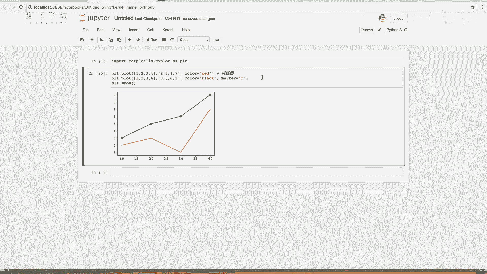

我们还有一些这个其他的函数。

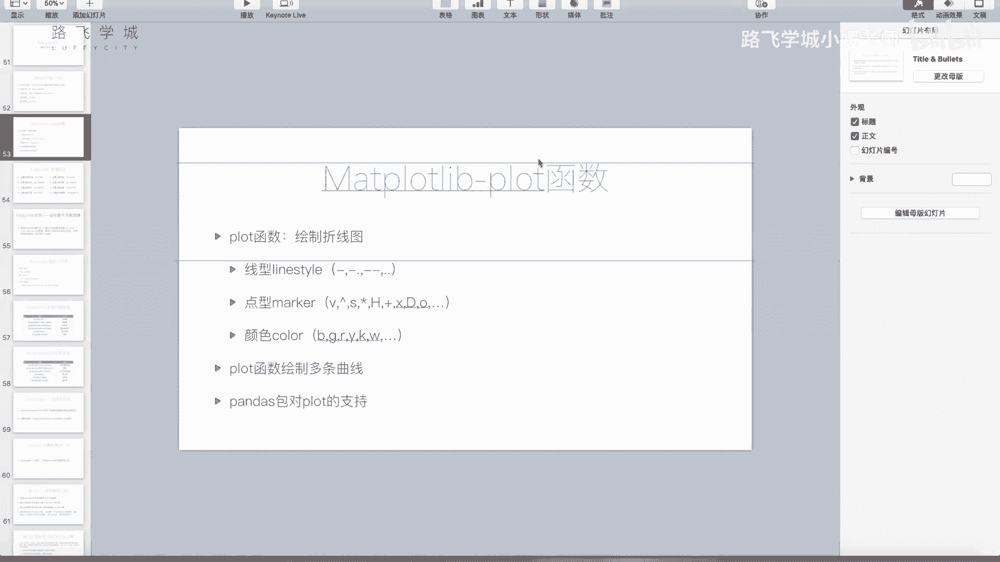

比如说我们现在图你看就是一个这个，那实际中我们应该是有什么，比如说图的题目标题，你的X轴表示什么，下边应该有字，对不对，你的Y轴表示什么，这应该有字，对不对，还有一些各种各样的东西。

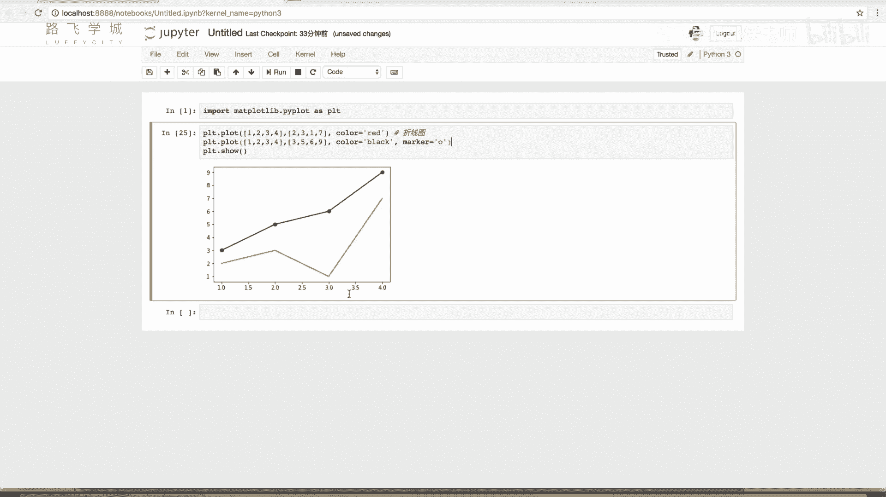

那这些东西怎么来说，怎么怎么来做呢，是对是这些函数啊。

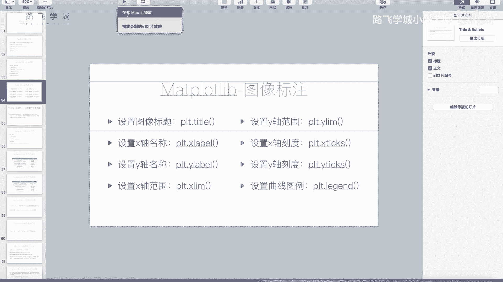

这些函数设置图像标题title函数title方法好。

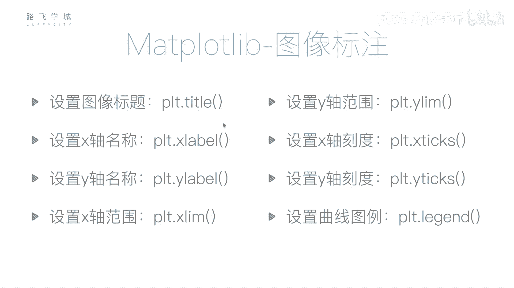

来试一下，就在你在POUD前面，也可以在plot后边，就只要在show前面就可以PRT点title，比如说MAD blood，Lab test p l o d，看是不是在这显示出来，这是title啊。

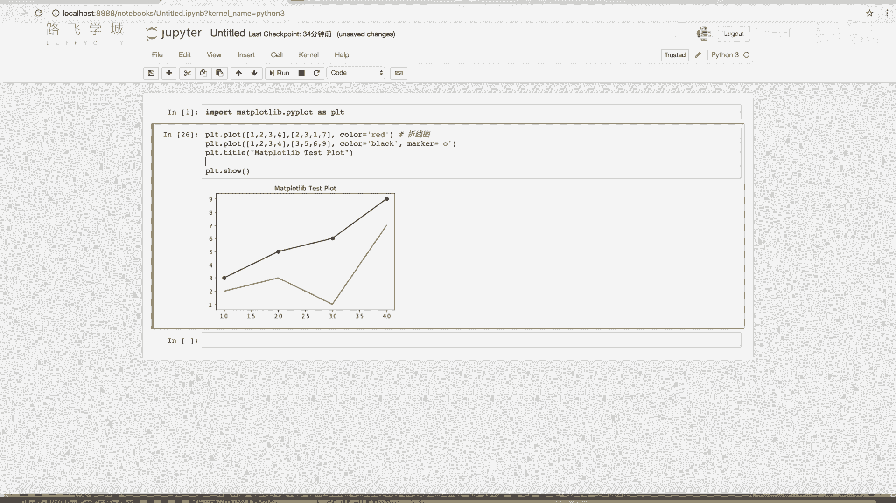

那X轴上呢和Y轴上的对应的，就是我们的x label和y label啊。

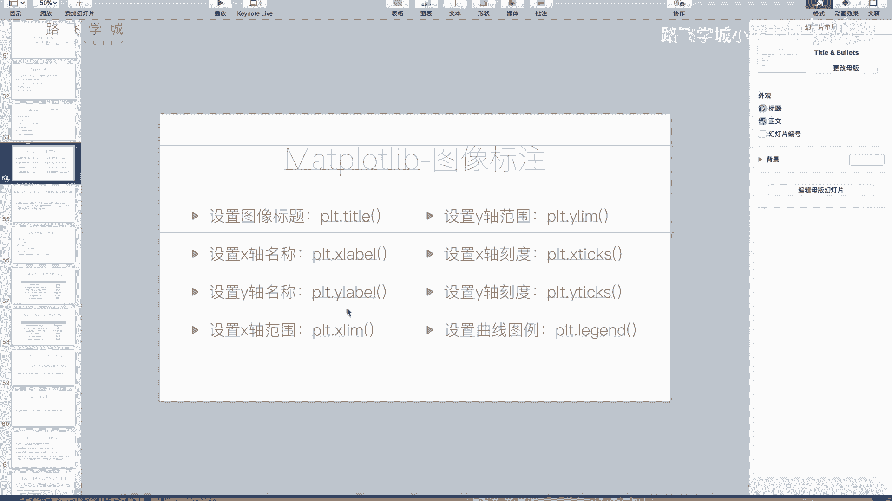

PLT点x level，比如说X就输入，我就输入x level啊，y label就是y label，Y label，好你看x label和y lab都有了，嗯啊这是这个B图的题目，X的标签和Y轴的标签。

那还有一些，比如说呃我想设置一下什么呢，我想设置一下我们的这个X轴X轴的范围啊，它默认你看它默认的话是什么呢，它默认的话，你看我这是1234，对不对，这是1234，它它默认的是1234啊。

如果我把这个地方改成，比如说123，啊你看他就默认的1~7，就是它默认的就是X的范围和Y轴的范围，是基本上适配你的，如果你不设置的话，它是适配你的这个曲线的这个范围的，就是让你把你这些这些线。

这两条线都能框进来，然后尽量的让最小的这个线封的更紧一点，但是如果说我就是想手动调，那也没有关系啊，你就PLLT点x live传两个参数，一个是X的最小X轴最小值和X轴最大值。

觉得最小值我们称成零可以吧，嗯最大值比如说我们这还是五啊，指数X看一下，你看是不是0~5，看到没有啊，Y也一样，你看Y设成0。5，就有好多图不见了，因为我这是有七有九有六的，你这又不见了，你看我设0。

5，所以就不太对，比如说我设置0~10哎对，但是这个就不太直，都不太靠，不是铺的不太满，直观的没有问题，没铺满，你看中间左右两边空着空啊，这个就是你如果需要设置，你就设置不需要设置，一般也没有用啊。

这是这个设置叫live嘛，设置X轴和Y轴的范围，嗯啊那还有比如说这个XTX和YTX是啥。

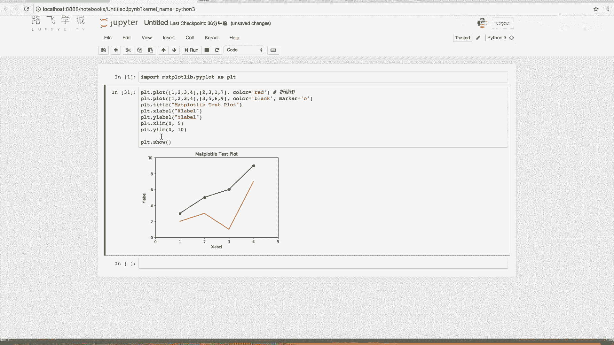

是设置的刻度。

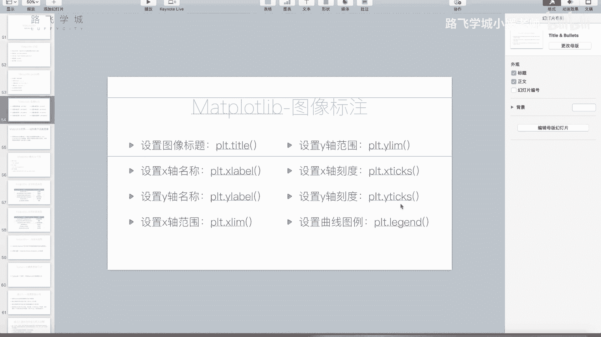

刻啥时刻度就是下边这个哦，嗯XT是啥呢，比如说啊你看我传一个啊，024好，我就传这三个运行一下，你看看什么呢，它不是有标注这个这个这个就是刻度嘛，这就叫刻度嘛，这对我设置了之后，你传的是什么。

你的刻度就是什么，嗯哦你看他这时候还是零二，他这就只显示零二和四这三个刻度嗯，明白吗明白，那比如说我想这个呃我想设置刻度是说没，就是你实际中的话，因为你图粉很大啊，你图可能很大。

你有可能是说我想是每隔五个数放一个，可以吧，你可以用，比如说这个我们原来的range函数，你也可以用，比如说我先import一下我们的number py好，那么P2里讲过一个叫做N呃。

叫做a range，NP点a range，好，比如说这个啊，零到我们X轴是0~5对吧，改X轴改成0~10吧，X改成0~10啊，我这里改成0~10嗯，二步长设为二，就和我们的认知一样，步长设为二。

那你看看是不是就是每隔两个有一个，那你看12秒，因为我这设置0~10，你看这设置0~11，这不就有对不包含，对不对，啊这就是就是你可以啊，设置一下这个TX就是刻度啊，YTX跟一样，YTX就是这样的。

我就不演示了啊，那还有另一种，还有不是出了就是还有另一个参数作用对，是啥呢，就是有的时候你下边的刻度，当然其实这个在这plot里用不太上，但是在家族里可能有看，就比如说你这个02468是这个。

可能应该不是数，比如说你可能是五个人名，可能或者五个国家或者五个大洲，你要是如果画什么那个柱状图那种，当然plot没法没法画柱状图啊，画柱状图的函数我们可能后面会讲，比如说是这样的话。

你可以第二个参数是一个，你说元组或者列表都行啊，我们就简单写一下啊，A b，CD1啊，还少一个F看到那就给替换成这这几啊，这个调成这一个好，这是XTX啊，YTX也一样啊，那最后还有一个。

我们把这些这个这应该都注释起来就可以了，不要改它，就是你在画两个线的时候，我们正常的就是你见过那些图里，还有一个东西是什么，就是你要在这有个叫图例的东西，就是说一个线它表示什么，另一个线它表示什么。

对不对哦，对这地方确你要说清楚这两年线它就是代表着，对不对，那这个啊就是在number。

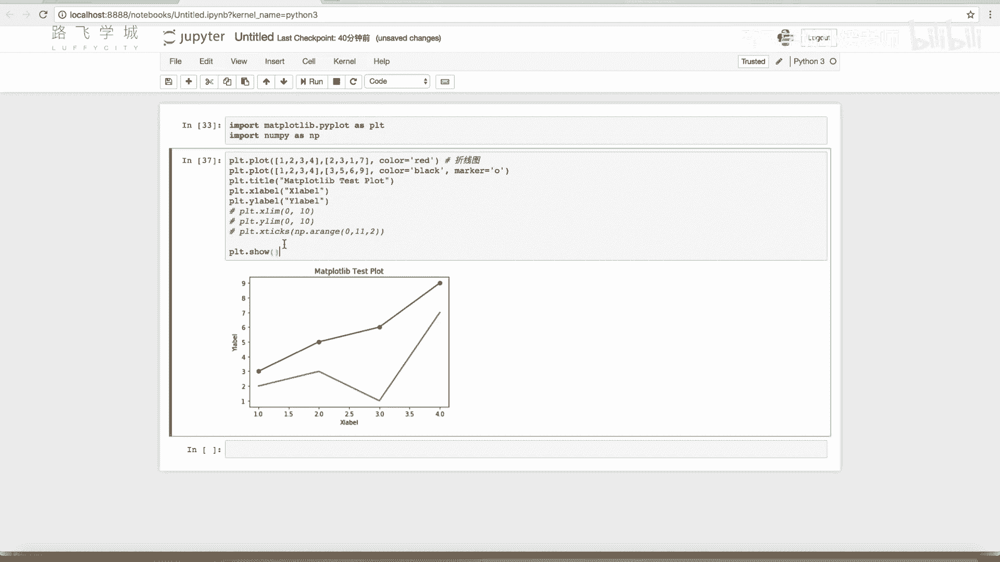

这个在这个库里叫做legend啊，叫做图例，Legend。

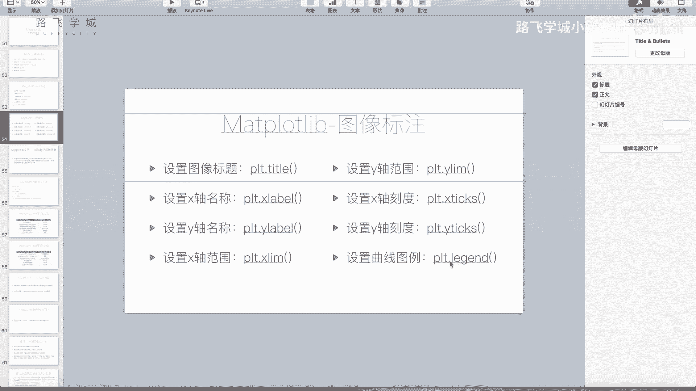

Leplt，点legend好，我如果这么写，我们可以看一下，没有显示没有设置没有显示啊，这个legend的函数用法有很多，最常见我最推荐大家的是一种什么呢，是在这，你在你的两个plot。

这加一个叫做label的参数标签嘛，比如说第一条线label是A啊，别la吧，线A好，第二条线label是lb好，这样legend也不传任何参数，你看看到没有，他这给你表示出来红线是LN，黑线加点的。

加这个圆圈点的是烂B哦，啊你这就是这写一些其他的字也没有问题，当然laden呢你还可以，这个label不含在这里边传到这里边，传到这里边的话，你就需要把这两个plot这个复制。

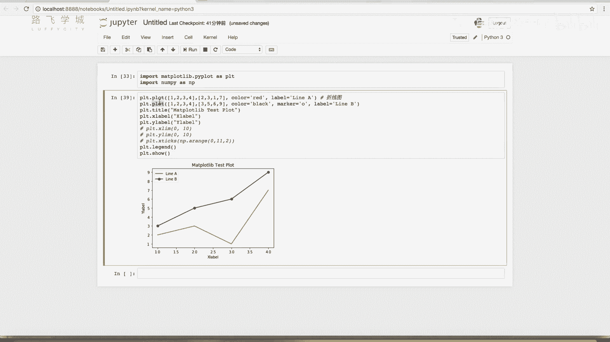

能把这两个PROUTER的结果传出来，你可以大家如果感兴趣的话，可以看一下这个shout点legend，或者看一下相关文档啊，我就不给大家细说了，就是你可以这样看他的plot，你把这个line传出来。

然后再把它啊，set label其实也是一样，也可以得加label啊，有各种各样的写法啊。

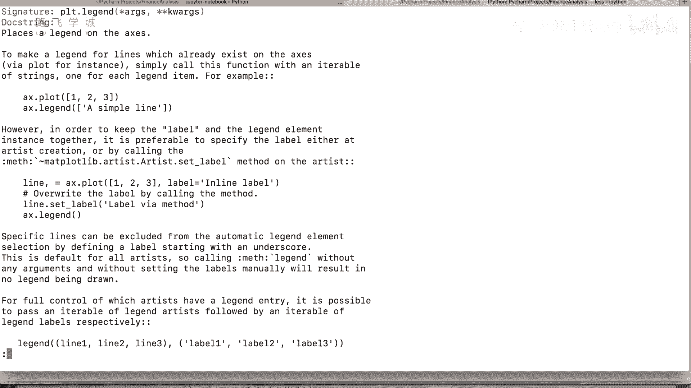

最推荐大家最推荐给大家的就是这一种，你直接在proud也直观，对不对，你这画一个什么图，正好label这你传一个字符串，说明一下这是什么图，对啊，这样的话laden的直接就能这个展示出来啊，是这样啊。

这就是我们给大家讲的啊。

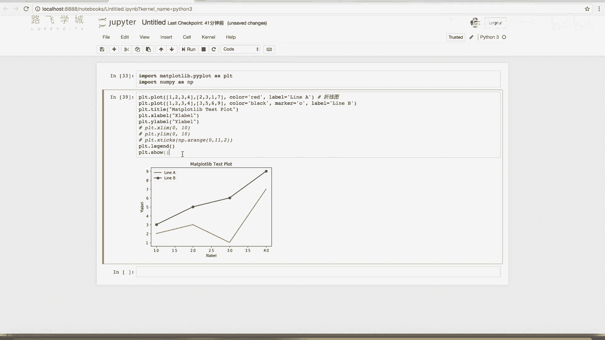

这几个就是设置图相关周围的周边，图的周边啊，你的图题啊，什么刻度就乱七八糟的这些小东西，这几个函数啊，如果后边咱们可能还遇到新的情况，那可能还给大家再对，有可能会补充一下这几个函数，还有一些别的用法啊。

好那关于plot函数的深入讲解啊。