# 14天拿下Python金融量化，股票分析、数据清洗，可视化 - P23：06 因子分析实战 - 川哥puls - BV1zkSgYZE54

那么这节课的内容呢主要包括两个部分，第一个部分呢，我们会简单的介绍一下使用的这个平台，第二部分呢就是进入代码实战，好那么第一部分呢我们先介绍一下聚宽平台，我们之前的课程中也有提到。

现在市面上比较常用的啊，量化平台呢主要就是三个，一个是距宽，一个是铀矿，一个是米宽，这三个是啊在网上公开的免费的，而且使用者非常多的这么三个平台，那么这三个平台呢各有优劣势啊，不管你使用哪个平台。

其实都差不多，本身他们的编程语言都是Python，而且数据库也差不多，那么在编程的体验上面来说啊，也各不相高下吧，我这里呢也随意选取了一个平台，距宽来作为我们代码演示的这么一个平台。

那么大家之后呢去使用其他的平台，比如说优框或者米宽，其实完全可以使用同样的代码实现同样的效果，那么距宽这个平台呢，它的网址就是在我们的PPT上，大家可以进去，然后注册一个账号。

嗯之后我们就可以开始下面的代码演练部分了，那么在代码演练部分呢啊。

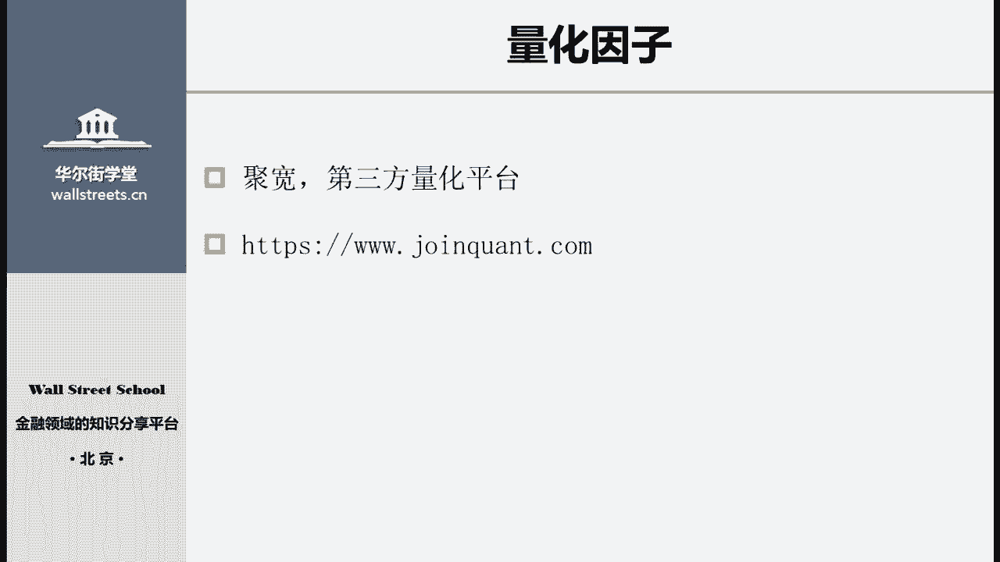

我们要实现的就是因子的构建与分析，那么就是使用Python语言以及距宽，这个第三方量化平台，我们去实际的编写一个之前学到的基本面，因子好，那我们就开始吧，现在呢我们开始讲解量化因子。

构建和测试的这个过程，那么具体的构建方法呢，我们在之前已经提到了，那些因子是我们比较常用的一些量化因子，现在我们来开始学习怎么样构建它们，首先进入到巨宽的单因子分析模块。

我们新建一个因子。

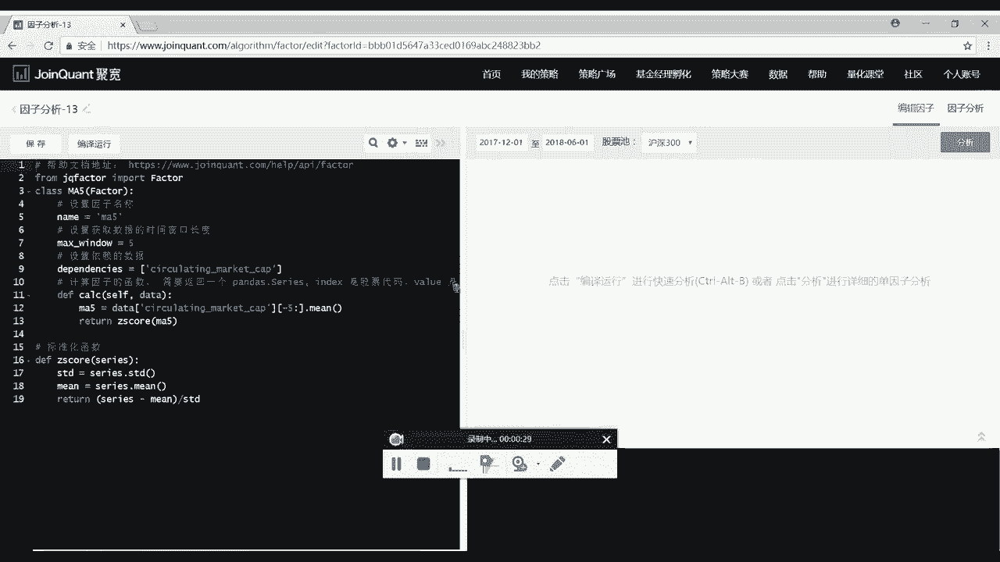

首先主要看这个代码的部分，那么这一块呢就是距宽的这个因子分析模块，编写代码的地方，这个界面主要我们的代码会分成三块，首先第一块是最上面的这部分，这一部分呢是我们用来用来导入第三方库的，这么一个地方。

在前面的课程中，我们也学习到，在做量化的分析的时候，我们会使用到很多的第三方库，比如说我们呢可能会使用这个pandas，好我们把这个pandas的名称叫做pd，这是要导入的。

那它这里本来呢默认会给我们写好，一个导入的库，这个库是距宽data，也就是最宽，使用用来分做这个因子分析的这么一个库，它会默认就帮我们导入好，所以不需要再重新写了。

我们要写的呢是需要导入一个pandas，这个是我们现在需要用到的好，这个就是第一部分，那么下面这一块呢是第二部分，这块就是我们写因子，整个算法以及构建因子的主要的地方，在下面这块呢是第三部分。

就是我现在选中这一块，这一块主要是一些啊标准的函数，包括默认提供好的这么一个标准化的函数，以及我们可能呢后面还要自己写一些，用来中性化或者对数据做特殊处理的函数，这是第三块好，那我们先来看第二部分。

第二部分呢它首先是一个class，就是说是一个类这个class，然后我们关于因子的所有算法，以及这个因子的构造的内容，全部都是放在这个类里边的内容，我们先看第一行class ma5。

后面括号factor这句话是什么意思呢，首先是我们给因子的函数起了一个名字，叫做ma5，我们呢就可以自己随便取一个名字，比如说我在这里把这个函数的名称取成叫test，大写的test好。

那么我们这个因子的函数，它的名字就叫做test了，这里大家可以按照自己的喜好，随意的去进行定义，如果你的因子很多的话，那么我们可以在这个因子名称，后面打上一个下划线，然后写个数字，比如说test1。

那么这是我的第一个因子，后面可能还有一些其他的因子，other我们呢把它叫做第二个因子，这样主要是用来方便自己记住自己有哪些因子，以及给自己的因子做个排序，这个就是按照大家的偏好随便去自己定义了好。

这是第一块因子的名称，然后后面有个括号factor，这是什么意思呢，这个是说我们定义的这个class，也就是在我们这里边test1这么一个类好，那具体类是什么呢，大家如果懂的话。

当然最好如果实在不明白呢，也没有关系，就按照我老师说的，这样子去进行写代码就可以了，我们并不一定非要懂得这个代码的细节，只要你会用就可以了，那么这个factor的意思就是说。

我们的这个因子函数是继承于这个factor类的，而这个factor这个类，它本身呢是我们可以看到上面是由这个距宽，Factor，就是距宽的一个因子库提供的这么一个类，这个类就是给我们提供了很多。

可用的函数和方法，我们的继承了这个类之后，就可以使用到因子分析里面的函数了，包括下面要说到的一系列的函数，都是继承于这个类的好，所以我们在这儿写因子的时候呢，一定不要忘了括号factor的内容。

那么接下来呢我们要看下面要做什么事情，首先第一步我们需要设置因子的名称，这里呢我们一定要注意，因此和函数是不同的，这是什么意思呢，所谓因子的名称就是我们在这里设置的name。

比如说我们设置成一个test，那么在之后我们写的这个因子的名称呢，就叫做test嗯，如果你是一些基本面的，比如说是这个市盈率的因子，你可以就叫它PE或者roe等等。

这个因子的名称呢也是随便你取到我这里呢，比如说我叫它test，那么所谓函数的名称指的是什么，函数的名称指的就是我们在前面上一步，这里class后面跟随的这个名称，这两个之间呢是有很大的区别的。

函数的名称是我们用来调用这个函数的时候，会使用，那么因子的名称呢，是我们最后生成的这个因子的名称，这个区别呢在我们之后的课程里面，写策略的时候会用到，所以在这里大家就是要注意。

J这里的函数名称和这里的因子名称，最好不要写成一样的，就是你不要说直接把这个因子的名称，我们就用这个函数的名称，这样的一段话呢在编译的时候是没有问题的，其实你在进行这个单因子的分析的时候。

也就是我们今天这节课的时候，也不会出现任何问题，那么他会在之后的课程，就是在之后写策略的时候，对整个程序造成一定的这个误导，所以我们干脆就在这里就注意这个问题，就不要把它起一个名，同样的名字啊。

这个就随按照大家的喜欢，按照大家的习惯去取名字就可以了，好比如说我们把这个因子的名称叫做test，或者呢我们就直接嗯，我们这节课主要要说的是一个，我们可以用营业收入的同比增长率。

这个因子来作为一定来作为代替，作为这节课的案例好好，那么我们在这里就把它叫做operating revenue，growth rate好，我们把它叫做ORGR因子，那么上面呢我们也把这个名字改了。

这个函数名称叫做ORRG啊，杠一因子的名称呢叫做ORRG啊，这样子用来区分开，这是给因子设置名称好，那么下面到第二步，第二步是我们来返回获取数据的时间，窗口长度，在这里呢。

我们实际上就是要参与到获取数据的这一步了，这一步我们要做的事情是什么呢，就是我们要告诉这整个因子分析的程序，就说我们想要获取的数据是什么样的，我给大家举个例子，比如说我们在测试这个因子的时候。

如果说我们使用2017年1月1号的数据，测试因子，这个呢是我们经常会遇到的一个状况，对就是用某一天的数据去测试因子，那我们将用要用当天的行情测试因子，我们首先呢要生成这个因子，那么生成这个因子的数据。

生成因子的数据，它对应的时间不一定是2017年1月1号，比如说我可能呢，这个因子是使用2016年全年的数据，却构建出了这么一个计数因子，然后把这个计数因子放在2017年1月1号，进行一个测试。

这个呢是很常见的情况，那么在这种情况下，我们这里的数据长度就要填250天，也就是说，我们获取的是过去250个交易日的数据，也就是2016年全年的数据，那么假如说是另外一种情况。

我们这个生成因子的数据只需要用到，2016年12月31号的数据，那么在这种情况下呢，我们的数据长度就只需要填一天，这个数据结构它到底返回的是什么样的数据，他的数据结构我们在后面呢也会看到这里。

大家先理解它的意思，那么我们今天这个案例中要计算的因子，是这个一个基本面的因子，那么对于基本面的因子呢，我们大部分都只需要获取一天的数据就足够了，好我们这里就先填一，那么到下面这一步。

就是我们要开始设置到底需要什么样的数据，就是说我们要告诉这个告诉这个分析的程序，说你提供给我哪些数据，我来进行这个数据的构这个因子的构建，那么在这里呢就是使用这个这么一个函数。

去告诉我整个分析程序我需要哪些数据，这么一个函数是怎么使用的呢，就首先dependencies等于后面是一个中括号，中括号里面是我们需要的数据，比如说我需要这个，既然是计算营业收入的同比增长率。

那么我们当然是需要这个营业收入的数据了，我们需要你可以从这里选择revenue，这个呢是营业收入的数据，当我们输入了这样的一段话之后，这个程序在运行的时候，实际上他就已经从数据库里边。

把营业收入的数据提取了出来，我们就可以随时拿出来使用，用来构成我们的因子好，那我们要计算的呢是营业收入，它相比于上一期的这种这么一个增长率，这个呢是同比增长率的这么这么一个定义。

就是说本期相比上期增长了多少，那么很明显，我们呢不仅需要本期的这个营业收入，我们还需要上一期的营业收入的数据，那么这个怎么提取呢，实际上是使用我们同样还是再写一遍，Operating revenue。

然后在后面呢写个下划线一，这样子，我们就可以同时提取出，上一期的这个营业收入好，那么具体这个数据库里面提供了哪些数据呢，它提供了几类，一类价量数价量数据，向量数据，例如说这个每个股票的开盘价，收盘价。

最高价，最低价等，这些数据呢我们都可以从数据库里面获得，第二类就是财务数据，财务数据是包括了很多种，比如说像这个啊，我们刚才取的这个operating revenue，就是这个，然后我们可以看到呢。

它这个列表里面列出来很多营业税金及附加，包括这个营业成本，包括经营活动净收益除以利润总额等等，就是基本上财务数据，我们都可以从这个数据库里面获得，第三类呢就是行业数据。

行业数据这一类主要指的是说啊某一只股票，它属于到底属于哪一个行业，这个呢我们可以输入这个行业，比如说001嗯，或者我们可以直接看到这里边可以选择行业，像他这个行业里边就是对应的代码，001是能源。

006是医疗保健，005是日常消费等等，这些行业数据呢它最后就会返还给你，说我们对应的，比如说这个日常消费行业读取了之后，会返还给你一个啊，一系列，就是这个行业里边到底有哪些股票，这个是行业数据。

第四类数据概念因子，这个就是我们在炒股的时候常见的，比如说啊互联网概念，或者是这种清洁能源概念等等，概念因子呢在数据库里面，大部分是以GN开头的，比如说GN031就是重组概念。

GN034就是环保概念等等，那么这些概念呢有很多，具体有哪些我们会在之后说到，第五类数据呢就是指数因子，比如说我们如果想要这个沪深300的指数，那么就是00300点access。

对第一个这个呢就是后天才买的指数了，最后一类数据是资金流，比如说我们如果想得到一个主力的近占比，这么一个因子，这里呢我们就可以直接通过他的数据调出来，各有各类的资金流，那么这类数据要怎么。

它到底有哪些数据要怎么获得呢，其实我们直接看右上角数据，我们把它打开，在这里边呢，就有很多现在距宽数据库里面有的数据，比如说我们随便股票数据，我们可以看到啊，他的里边财务报表。

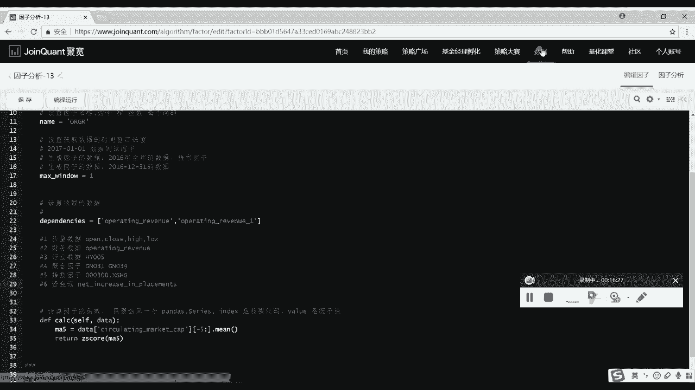

这些呢都是可以直接从数据库里面获得，然后应用到我们的因子的构建里面的，我们只要填他的这个前面的英文名称就可以了，像这个inventories，我们可以把它复制下来，然后直接填到这里。

这样子呢我们在构建因子的时候，就可以使用这个存货的数据了。

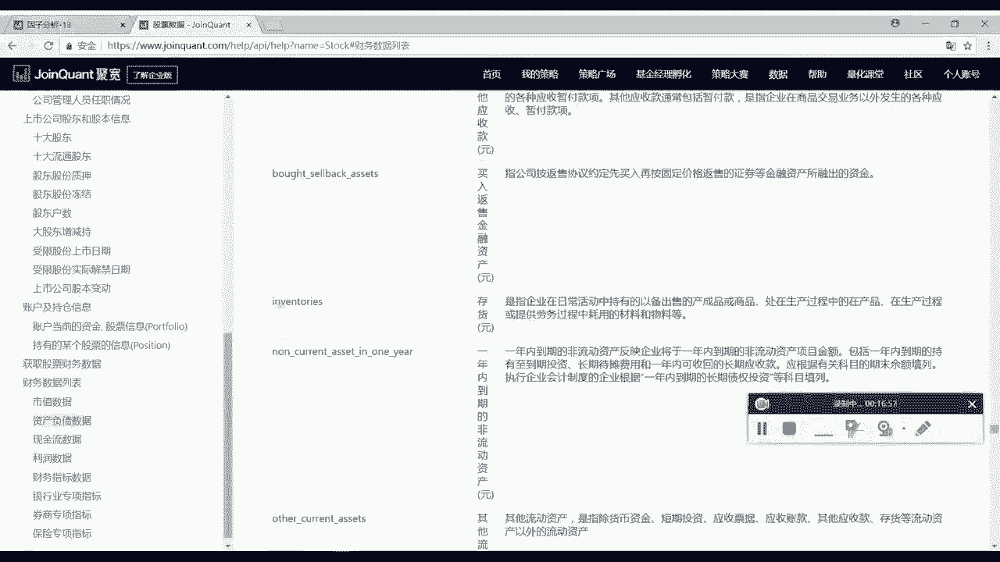

那么数据的部分呢是这样，那么经过了刚才这么设置因子的名称，设置获取数据的时间，窗口长度，设置我们需要的数据，经过了这三步，我们就已经完成了，对这个因子分析的所有设置的内容。

下面呢我们就可以在这么一个函数里面，去计算我们的因子了，具体怎么计算呢，我可以给大家演示一下，我们这里啊它会有一个默认填好的一些代码，其实我们是不需要的，我们把它给删掉，像刚才那些代码呢。

大家在这个新建因子的时候，他都会默认的填上，主要是为了大家方便大家去这个入门，那么大家听我的讲解呢，会比这些内容要更简单，更方便理解一些，好，那么下面呢我就构建一个营业收入同比增长率。

这么一个因子给大家作为案例，首先营业收入同比增长率，那么之前呢我们有学习这个因子，它是使用，当期的营业收入减去上期的营业收入除以，上期的营业收入，那么我们实际在使用这一类基本面因子的时候。

大部分呢会使用他们的TTM数据，也就是过去12个月的平均数值，为什么要使用这个TTM数据呢，我们也很容易可以想到，因为一般在传统的计算基本面数据的时候，很多时候呢使用的是年报的数据。

那么年报的数据它一旦发布，那么在未来的一年内都不会有这个变动了，除非说年报的数据有错误，那么会进行一个修改，这是极个别的现象，大部分情况下呢年报数据是在一年，未来一年都不会有变动了。

那么当我们计算这个基本面因子的时候，比如说我现在假如说是2016年的这么一个，4月25号，那么今天呢发布了2015年的，2015年的年报，那么我使用这个年报当中的数据，计算出了这么一个各类的基本面因子。

那么也就意味着我从今天开始，一直到明年发布新的年报，也就是2017年的4月25号，我从2016年到2017年，这么一年的时间内，实际上呢我计算出来这个因子它都是不会变的，因为我们使用的是年报中的数据。

一直要等到明年新的年报发布，这个因子才会变，那么这样的一个呃更新的效率呢，实际上是非常的缓慢，也是不贴合市场的现实的，所以我们倾向于使用这个TTM数据，比如说我们在2016年，第一季度使用的数据呢。

是使用2015年的年报，那么当我们到2016年的第二个季度，使用的数据呢实际上是2016年的第一季度，加上2015年的第四季度，加上2015年的第三季度，加上2015年的第二季度。

我们实际上呢使用的是这么14个季报的数据，把它加总起来求得的这么一个啊最新的数据，那么这样的一个数据呢，它是并不是由企业对外公布的，必须是我们自己计算出来，所以这样的数据叫做TTM数据。

所以我们可以看到，当我们要得到当期的这么一个，财务报表数据的时候，必须要知道前四期的季报的数据，所以我们再回过头来，在前面这里要获取数据的时候，我们首先不仅要获取当期这个季度，当前这个季度的数据。

我们需要获得呢前面四个季度的数据，这样的写法就是我们获取了当期前一个季度，前两个季度，前三个季度，这总共四个季度的数据好，同时呢我们还需要获取前面第四个季度的数据，这个数据呢是用来计算上一期的。

这个财务表的数据，那么在理解了这个概念基础上，我们就可以计算当期，当期营业收入TTM数据，我们给它起个名字叫做ORR1，这个数据呢它怎么样计算，我们首先要使用，当前季度的营业收入。

加上上一个季度的营业收入，加上上两个季度的营业收入，加上，上三个季度的上三个季度的营业收入，这样呢就获得了当期的这个TTM数据，我们还要计算上期的营业收入TTM数据，比如说我们叫OR2。

这样呢整个写法是同样的，只不过我们把这个数据每期向前推，这样子呢我们就计算得到了当期的营业收入，TTM数据和上期的营业收入TTM数据，有了这两个数据，我们再去计算，就可以很方便的计算出同比增长率了。

比如说我们叫做ORGR的这么一个因子，它呢就等于当期，减去上七，再除以上七，这样子呢，我们就计算得出了这个ORGR的因子，最后在这里呢我们直接返回这个因子就可以了。

好这个就是最简单的一个因子的写法与过程，如果大家呢只是想要去应用，这么一个因子分析的话，那么到这里就可以结束了，接下来我会对待那些想要更进一步了解，这个具体是怎么样运行的同学啊，我们再进一步看一下。

首先呢我们要看到在前面这些步骤里边，我们使用了很多的数据，那么到底这些数据结构它是什么样的，可能有些同学会好奇，那我们就来进一步的观察一下，他们的数据结构内容，比如我们使用到的这个营业收入的数据。

它的结构是怎么样的呢，我们来看一下，直接把它print出来，我们就可以看到好把这个已关了，右边呢这块就是我们的这个编译和运行的，这么一个界面，我们可以把时间稍微调整一下，把它调短一点。

这样呢跑的会比较快好，我们调成5月1号。

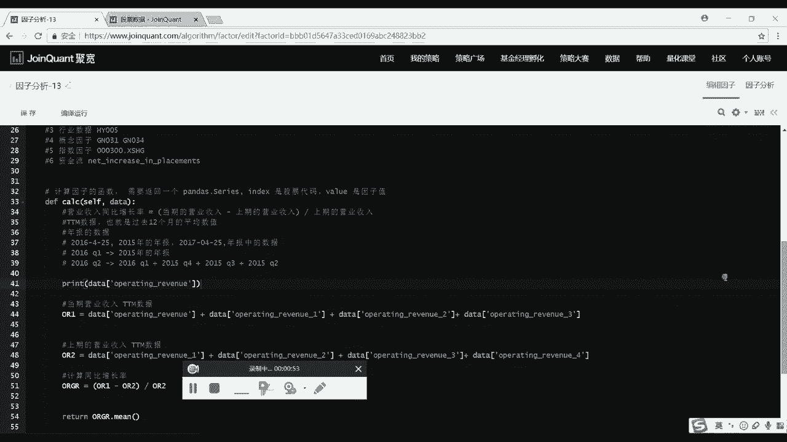

然后股票池我们就选择这个沪深300，里边呢还有中证500，我们就使用这个沪深300，把这个程序编译运行一下，好我们可以看到他正在进行计算这个因子，我们把这块日志给放大。

看到这一块呢就是我们print出来的内容，那么它的内容实际上是一个表格嗯，可能有些同学懂这个data frame，这个格式呢用的比较多的同学。

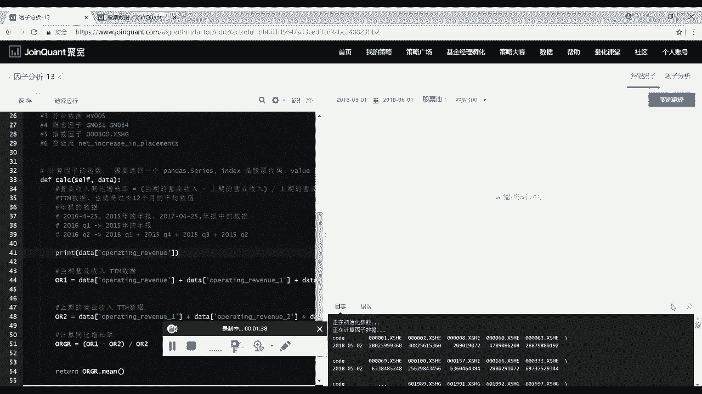

就已经可以看出来他是什么样的格式了，那么对于不太明白的同学，我可以给大家再详细的说一下，它的数据结构，实际上跟我们在excel里面使用的那个表格，是差不多的，比如说第一列。

它的第一列的第一行名称叫做code，然后第二行就是我们的日期，2018年5月2号，这个呢是第一行，然后第二行就是啊不是刚才那是第一列，那么第二列呢就是各个股票的代码，比如说第一个这个是平安银行，第二个。

万科公司，这些呢我们可以想象成一个excel excel表里边，第一列是code，它再隔开好，第一列呢是code，第二列是这个平安银行，第三列是万科公司，后面呢还有第四列，第五列一直到第301列。

我们总共有300个股票，因为选择的股票池是沪深300，所以有300只股票，它里边有300列是股票的代码，第一列是这个code这么一个表头好，然后呢我们总共会有两行。

第二行的内容就是我们是我们需要的这个数据，也就是营业收入的具体数据，就说我们可以看到在5月2号这一天，平安银行最新的营业收入是这么多，万科公司最新的营业收入是这么多，所以呢这种表格形式的数据内容。

就是我们这个数据库里面储存数据，以及我们读取数据时候的内容，就是这么样的一个形状，那我们把这个日志放小，可以看到右边右上角这块，就是我们这个因子最后跑出来的啊，这么一个净值图。

其中呢深蓝色最蓝色的这个是一分位，红色的是五分位。

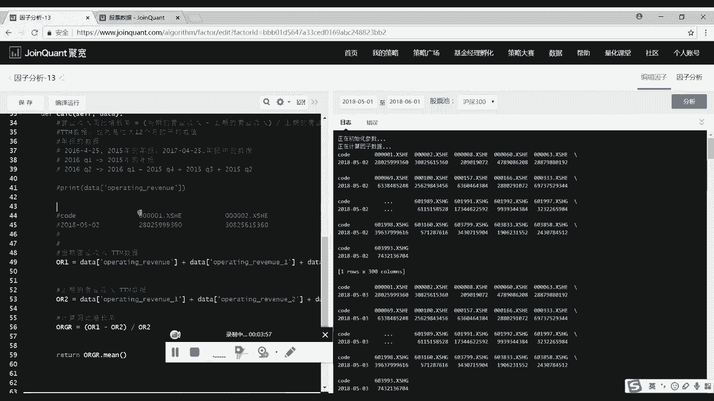

什么叫做一分位或者五分位呢，一分位的意思就是说我们去做多这个因子值，最大的这么一些股票，五分位的意思就是说我们去做空，这个因子值最大的这么一些股票，最后呢得出来的这么一个结果。

我们可以看到这个因子呢它的普遍的现状是啊，就是一分位亏损比较多，五分位呢啊相对表现最好一些，就是整体是呈现这样的一个趋势，所以这个因子呢我们应该啊，在它这个因子值大的时候去做空股票。

在因子值小的时候去做多股票，这样子呢就是一个最基础的因子分析了，那么这样的一个因子分析，怎么样应用到我们的策略当中呢，啊这个是我们之后会介绍到的，现在我们要首先说一下，在对这么一个基础的因子上面。

我们还需要做什么样的处理，其中呢最重要的处理有两个步骤，第一步是，我们需要对每一个因子做这个标准化的处理。

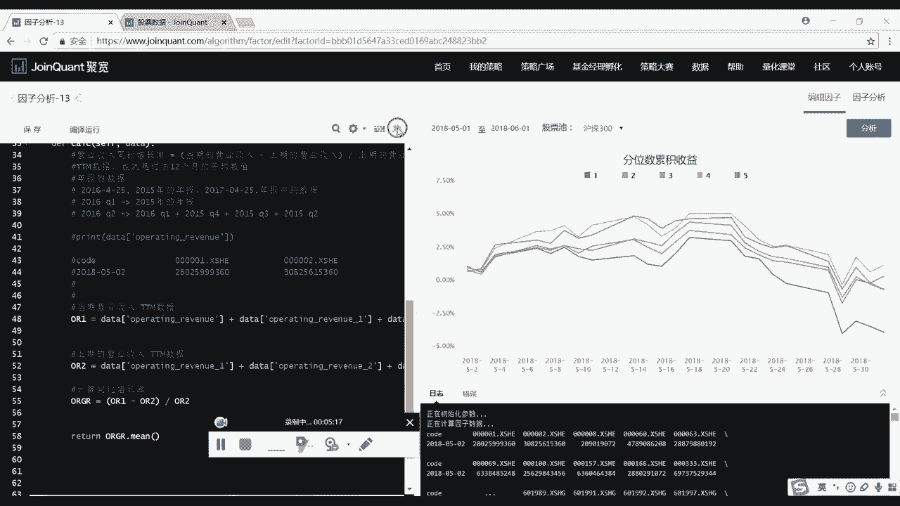

也就是这个函数，那我把这个函数呢放在上面，看起来比较方便一些，好放在这里，什么叫做标准化，这个就是我们在使用做多因子的时候，会遇到的一个很严重的问题，比如说像这个PE也就是市盈率这个指标。

它有些股票呢可能是8。5，这个也是有可能的，或者呢有些股票可能是25，这也是有可能的，有些股票是30，这个呢都是PE这个因子取值的合理范围，那么我们另外一个因子，比如说这个净利润率这样的一个因子。

它的合理取值范围呢可能一般在这个0。05，就是5%，或者呢我们说这个到50。5%，这都是有可能的，但是呢你不可能说我是大于一的，比如说我变成了一个1。5，然后变成了一个2。5，这样子呢肯定是不可能的。

净利润率不不可能超过百分之百，那么如果我们把PE和净利润率，这两个因子放在一起去构建模型的话，就会发现，因为呢P1因子本身的值特别的大，而净利润率它的值特别的小，所以我们在使用的时候经常会遇到。

那么就是PE这个因子，它整个在模型中的占比会特别的大，这种占比的大或者小不是由我们自己决定的，而是由呢它这个因子本身的数值决定的，这就会影响到我们整个模型的这个，可靠性和效率。

所以我们要对所有的因子做标准化，也就是归一处理，经过了这么一个标准化的流程之后，可以把所有的因子它的量纲统一为同样的单位，比如说经过了标准化之后，P1因子它的值可能就变成了1。5，比如说他本来是30。

经过标准化之后呢，就变成了1。5，1。5好，然后另外一个净利润率，本来的值呢可能是0。05，经过了标准化之后就变成了1。2，那么经过标准化之后，J1。5和1。2这两个因子的值。

我们就可以放在一起去进行处理和分析了，那么标准化呢它是有一套标准的算法的，也就是我们使用因子的值减去这个均值，我们叫做E除以呢，这个标准差这种是标准的算法，那么在这里呢。

具体背后的理论我就不再详细的说明了，只要大家会应用这个算法就可以，那么这个算法写成代码，就是我们前面看到的这个标准化函数，就是这个算法的代码，这个函数是怎么使用的呢。

首先这个函数的名字叫做this score，我们可以直接把它改一个名字，改成，standard的function，标准化函数里边要传输的内容呢是一串serious，这个就这个数据格式。

实际上是跟list是非常的接近的，大家可以把它就理解为list，就相当于传入一串数据，比如说我们传入这个12345，这么一串五个数据传入进来，他就会对这么一串数据做这个标准化处理。

那么一般呢我们这里传入的就是因子值，也就是我们刚才计算出来的，这个计算出来的这个因子的值，好，他会对传进来的这一串因子值，做什么样的计算呢，首先会计算出这串因子的标准差。

那么这里呢我们调用了Python本身自带的一个函数，s std函数，把这一列的数据，计算出了这一列数据的这个标准差，接着我们要计算出了这一串数据的这个均值，也是调用了Python本身的一个函数。

M去求这一串数据的均值，那么经过啊计算之后，我们要得到这串数据的Z值，也就是它的标准值要怎么计算呢，实际上就是使用这一串数据本身，这里边呢这个series就是我们传入的这一串数据，也就是因子值本身。

也就是这里的，比如说P1因子的30，或者净利润率的5%，那么是这一串数据减去我们刚才计算出来的，这一串数据的这个均值，就在这里计算出来的均值，最后除以这一串数据的这个标准差。

STD也就是我们刚才计算出来的标准差，最后得到的就是Z值，也就是这一串因子值的经过标准化之后的值好，你计算出来之后把这个Z值给return，就是返回回来，这样子呢就是一个标准化函数。

那么我们在怎么样去调用呢，就可以在这里计算完了这个因子值之后，对因子值进行进行标准化，好我们就是首先要调用这个标准化的函数，也就是standard function，然后呢调用了这个函数。

我们把我们刚才计算出来的因子值传入进去，这样子呢，我们实际上就是对这个因子值进行标准化了，最后我们要把这个标准化之后的数据保存下来，保存成这个ORG啊，下标Z这个代表的就是经过了标准化的因子值。

那么在这里返回的时候呢，就可以直接返回这个经过了标准化的数据，这个是我们在对因子值进行处理的时候，需要进行的啊，很重要的一个步骤，基本上不管我们计算的是基本面因子，还是这个计数的因子。

还是其他大家自己构建出来的因子，都需要对这个因子值进行一个标准化，这是最基础的一个处理好，那么除了对因子值进行标准化之外，我们还需要做什么事情呢，还需要做的也是另外一件非常重要的事情。

就是对因子值进行中性化，什么叫做中性化呢，就是说每一个因子，比如说我们构建出来了一个因子A，那么这个因子呢，它可能是我们使用各类的行情数据，或者是这个基本面数据构建出来的，可能我们经过测试。

这个因子A他的表现特别的好，能够带来20%的超额收益，那么这样呢是一个非常优秀的因子了，但是有的时候这个因子的表现特别好，可能呢并不是你这个因子本身带来的，我们举个例子。

比如说像PE这个因子我们大家都很常见，也经常见到这个因子呢代表的是市盈率，那么经过这个，我们就是自己在实这个实际的交易当中，我们对P因子的测试呢，会发现PE这个因子，它的啊因子收益率是非常高的。

在某些时间呢表现的特别的优秀，那么是不是可以说PE这个因子，它就是一个非常优秀，一定要使用的因子呢，其实不是的，为什么这样说，是，因为，如果说我们对P1因子进行一个具体的分析，我们就会发现使用这个PE。

比如说DP1策略，一般来说呢表现会比较好，但是这么一个策略它的问题在哪里，在于持仓的仓位绝大部分是小市值的企业，好不这里写错应该是高PE1的策略，在这个牛市的时候表现特别好，那么这样一个策略呢。

它持仓的仓位绝大部分是小市值的企业，那如果说我们不使用P1因子，我们直接使用这个市值因子，我们干脆呢就直接去选这个低市值的企业，去买入并持有，那么这样一个策略呢，它持仓的仓位和这个PE高。

PE策略持仓的仓位是非常类似的，几乎相同，同时呢这么一个低市值的策略，他的表现要比这个高P1的策略表现来的要好，这呢就会导致一个很大的问题，如果说我们的策略同时使用了P1因子，也使用了市值因子。

那么这两个因子呢单独来看表现都非常的好，但是合在一起，实际上它们提供的信息是完全一样的，可能都是指导我们去选择那些啊创业板的，或者这种呢市值很小的公司，那么这样的因子即使你有再多。

其实对你的策略本身并没有任何提高，他只是呢反复在做同样的事情而已，所以我们为了解决这个问题，就要去进行中性化，什么叫做中性化呢，简单来说，如果我们选择这个市值因子作为一个市值因子。

作为啊最重要的因子就是重要因子，或者呢叫做风险因子，也就是说我们以市值因子为基准把，然后从其他的所有因子，不管是PEPB还是roe等等，从其他的因子中剔除掉，市值因子的作用，也就是说呢。

我们不需要这些因子做和市值因子同样的事情，我们只需要这些因子呢去做这个市值因子，做不到的事情，比如说如果你的P因子，能够选出来一些大市值的，但是P1又非常优秀的这么一些企业的话。

那么我觉得这个P1因子还不错，或者你的ROOE这个因子你能够选出一些啊市值，比如说比较适中，不大也不小，但是呢它的盈利能力又非常强的企业，那么这样适应这个roe因子，它本身带来的作用。

可以给我们的模型带来一定的提高，所以我们做中性化，就是要从这些因子当中剔除掉市值因子的影响，或者说市值因子的作用，这样子呢剩下来的部分，剩余的部分，如果他的表现仍然非常优秀。

我们才认为你这个因子是非常优秀的因子，该因子才是非常优秀的因子，这个就是我们要做中性化起到的作用好，那么我们就以这个市值因子为例来解释一下，怎么样剔除这个中性化的影响，我们首先呢要写一个中性化的函数。

这个函数呢大部分的这种至七，我们首先要写一个中性化的函数，像中性化这一类的事情呢，在很多啊散户或者说刚做量化投资的人，很容易忽略掉，但是它其实是整个策略有效性的，非常非常重要的一部分。

我们看一下这个代码怎么写，首先呢我们写def，这个是用来定义一个函数，这里我们自定义一个函数，给它起个名字，Neutralization，好，中性化，这个是我们函数的名称。

那么这个函数呢我们需要哪些东西，第一个我们需要data，这个data是啊，用来给我们这个中性化的部分提供数据的，也就是说如果我们想要得到数据，需要这么一个data的变量，这个变量呢不是我们自己定义的。

是这个分析程序已经定义好的，所以我们直接在这里边填data，然后呢我们还需要传入什么，还需要传输这个因子的值，Vector value，我们还需要这个因子的值，必须要有因子值。

才能够去进行中性化的这个步骤，接着我们这个函数具体要做什么样的事情呢，首先，我们呢是要把传入的这个因子，也就是这个factor value对它呢做一个中性化，那么做中性化的东西是什么。

就是各个股票的市值作为市值风险因子，也就是说我们要从这个因子当中剔除掉，市值分析因子带来的影响，怎么样剔除，首先我们要去获取这么一个数据，大家还记得我们要怎么获取数据吗，就是在这里dependency。

这里啊，我可以换一行来写，免得大家这个看不清好，我们要获取什么数据呢，我们要获取各个股票的market总市值，也就我们这里看到的总市值的这个数据，这个呢是我们需要获取的一个数据，所以这里获取数据的方法。

就是跟前面获取财务报表数据的方法是一样的，比如说我们叫做这个market capital，我们定义这么一个变量，就是用来记录获取得到的数据，这里呢我们要获取的是这个总市值这个数据。

这样子我们实际上就获得了各个股票，它的市值有多少，然后呢我们要怎么去做中性化，这一步实际上是要使用最小二乘法，对因子值和市值，做线性规划，这里呢我只说怎么做，具体为什么要这样做，以及这样做的原理内容啊。

这里是不做介绍，大家就记得要这么做就OK了，好那么我们怎样在Python中做最小二乘法呢，实际上本身Python是没有提供最小二乘法的，这个函数库的，我们呢就要引入一个第三方的库。

这是我们要返回到整个因子部分析的第一部分，这里我们要导入一个第三方的数据库，这个数据库叫说叫什么呢，它实际上是一个啊，这个是统计的数据库，从这里边导入，OLS这个就是用来做线性规划的函数。

我们这样子呢可以使用了这个函数之后，就是调用这个函数里边要填什么样的内容，首先我们要填一个因子的值，这是我这里说的因子值，其次呢我们就是要填这个市值的数据，也就是我们刚才获得的这一串市值的数据。

最后呢我们再填一下Missing等于drop，这个呢就是它本身这个函数要填的一个Missing，Drop，大家就照着这么填就可以了，好当我们填完之后，实际上呢这个时候一旦运行程序。

程序就已经对这些数据做了一个最小二乘法，就会返回给我们一个啊函数，就是类似于这个，比如说Y等于X加B这么一个线性函数，只不过在这个函数里边呢，A和B都已经是计算出来的常数项了，Y是我们的我们的因子。

X是市值因子，这里边我们最终要取的那个部分，也就是我们要取的这个result是什么部分呢，实际上我们要取的是B这个值作为因子的，经过中性化之后，剩余的部分，通过这样的一段代码就是去取到B这个值了。

为什么要取B这个也是啊中性化的理论部分，其实大家呢如果只是做策略，反正明白要这么做就已经完全足够使用了，好我们计算出来了这个结果，再把这个结果return一下，这样子呢就完成了这个中性化的函数，好。

然后我们要把这个刚才写好的这个函数部分，放在最后面的，对我之前呢是为了方便给大家看，所以移到了中间，那么大家在写这个函数呢，一定要放在第三部分，就是最后面这一块部分。

那么之后我们就要在这个因子分析的部分，使用这个中性化的函数了，怎么样使用呢，你先，就是我们看到我们的因子名称neutralization好，还需要我们传入的，看一下传入的第一项data，传入data。

第二项是我们因子的数值，我们把经过标这个标准化的因子数值传进来，把这个结果给保存成final好，你这样呢，最后return个final，这样子就是完成了因子的整体构建，以及呢因子的标准化和中性化的工作。

我们把这段代码保存一下，运行好，我们来看一下它运行的状况，好稍等一下，他跑的有些慢啊，好我们就可以看到这个因子呢，它已经完成了运行，并进行了分析。

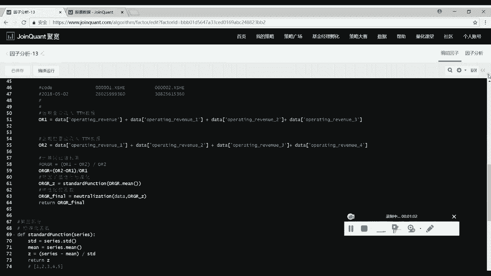

一分位累计收益负0。75%，年化收益是负的，最大回撤很大，下坡比率负的五分位啊，这些表现都不怎么样好，那这没有关系，因为呢这种基本面的因子，大部分时候它单独使用的效果都是很一般的。

是需要很多的因子结合起来使用，那么总之我们已经学会了，这个因子的分析的流程，包括整个因子怎么编写，以及它的标准化函数和它的中性化函数，那我们就打好了写量化策略的基础，如果大家在这个编写代码的过程中。

感觉到呢有一些困难或者有没有听懂的地方，这也没有关系，这非常正常，本身量化投资就是一个比较新兴的，这么一项工作啊，不是非常的容易去上手，但是一旦你掌握了量化这么一个投资工具之后。

你就会发现这个投资的方法呢比传统的那种啊，人工的去分析，人工的去判断这个企业有没有投资价值，那种方法呢要比这种方法更加的科学好，那么怎么样尽快的学会量化投资，最好的方法还是大家自己去写代码。

自己去完成这么一项编程的工作，那么这里呢我可以把我这段代码有一个好，这个呢是啊，去除掉那些不必要的地方，比较简洁的版本，大家呢可以对照着这一份代码去，自己亲自到巨宽的网站上面写上这么一些代码。

然后当大家学会了这么一份代码之后，就可以自己尝试着我去修改，里面的这些因子的计算方式。

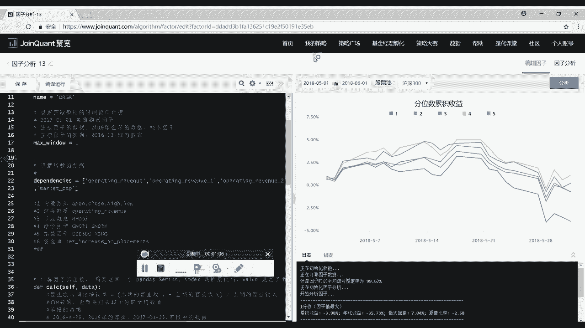

比如说我可以计算其他的这个市盈率的因子。

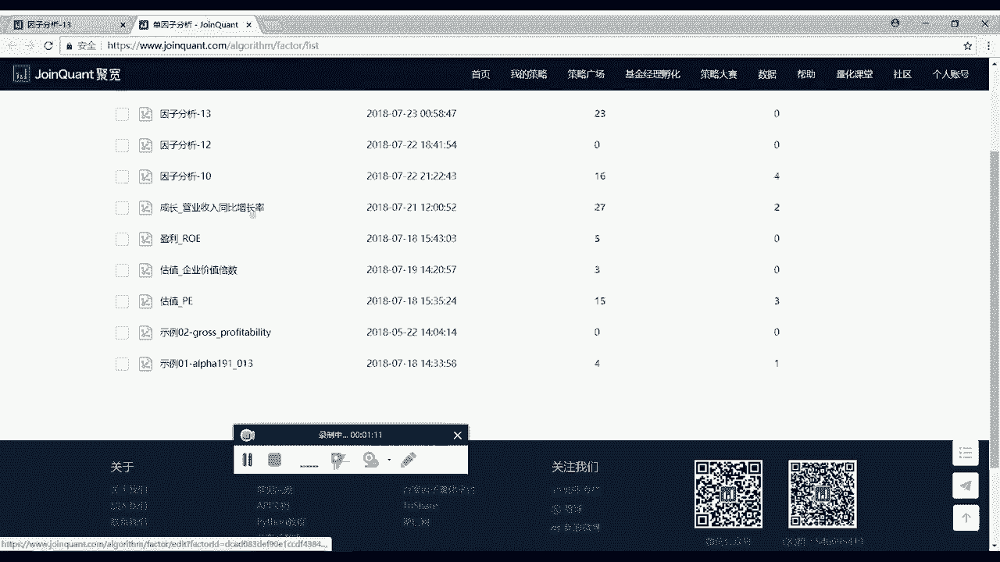

我可以计算roe的因子等等。

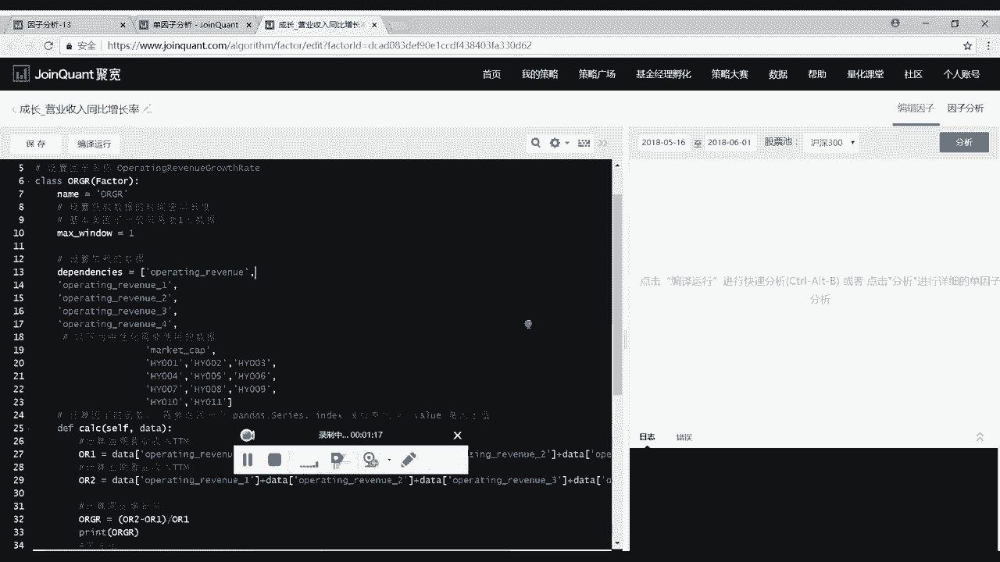

我们呢自己去计算因子，然后再跑一遍这个编译运行，让它呢这个程序自动的跑出来。

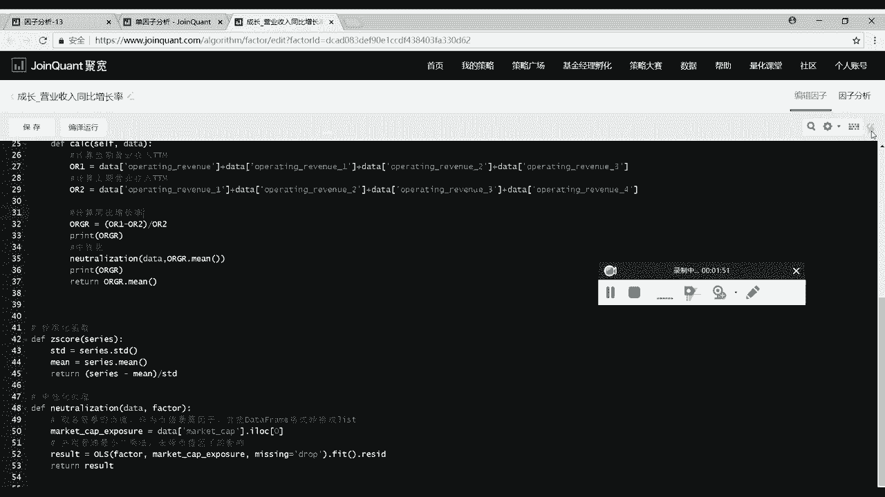

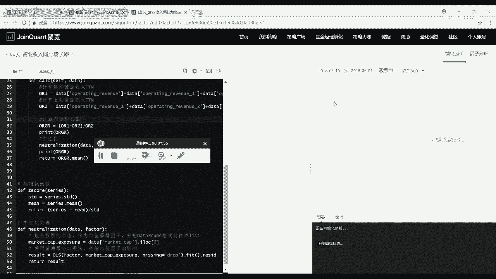

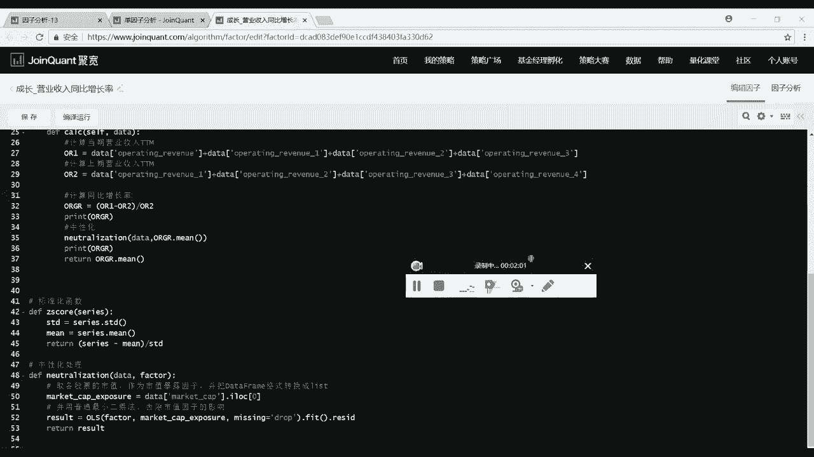