# 14天拿下Python金融量化，股票分析、数据清洗，可视化 - P24：28 时间对象生成 - 路飞学城Alex小助理 - BV1HAyPYYEAr

那么我们刚才讲解到了，pandas库里有一个把字符串，把批量的字符串列表，批量的转换成一个这个data time对象的一个啊，数组也好，或者是索引也好，这么一个方法叫to this time。

那啊我们有的时候还会有另外一种情况，就是我不是批量把字符串转过来，我是想生成一个时间范围，就比如说是2010年1月1号到，2013年1月1号，我生成一个这个范围，然后我在后边填数据。

OK啊那这个是什么呢，这个在pandas这个库里叫date range。

啊这个函数有三个参数。

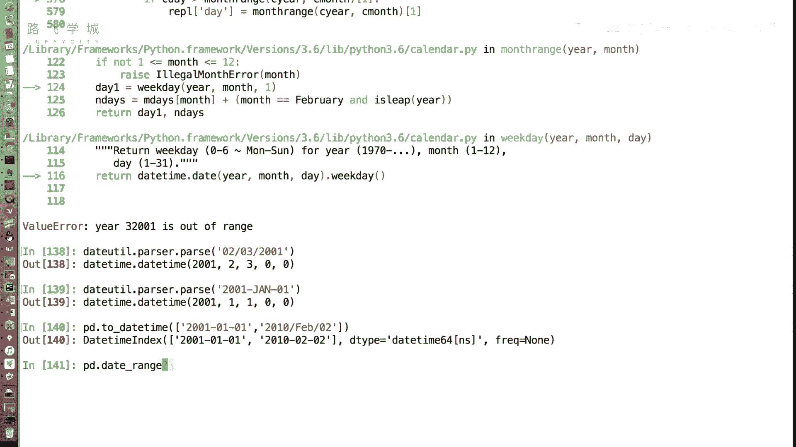

有四个参数啊，我们可以看一下它的参数，第一个start也就是指定你开始的时间，end指定你结束的时间，中间是间隔。

对中间没有间隔，这个PARIS指定的是长度，也就是说啊，我们比如说指令2010年1月1号，不要太长了吧，到2010年，比如说5月1号嗯。

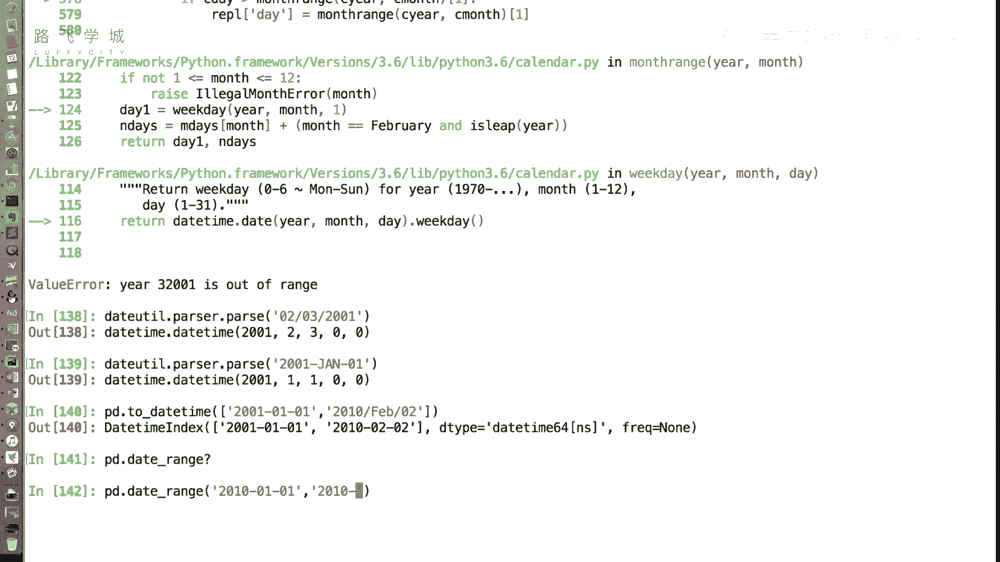

它默认的生成的就是每一天是一个时间，1月1号，1月2号，1月3号，1月4号等等等等啊，这是指定的是start和end，当然你也可以不指定end，你指定period。

所谓PARIS其实就是这个长度PERIOD啊。

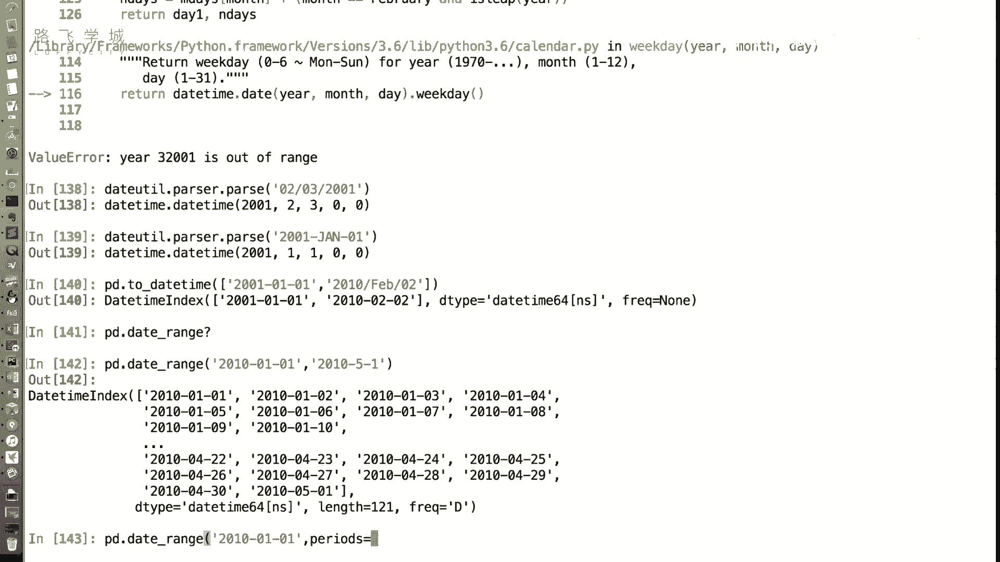

S等于也就是指定的长度，比如说你指定的是60，它就会产生60天啊，你可以指定起始和终点，也可以指定起始和长度好，那这是前面两个参数，还有一个参数比较有意思啊。

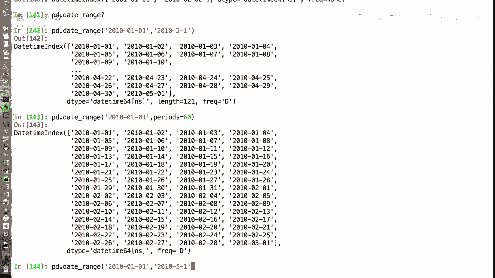

再看一下这个F21q freak这个函数，frequent啊，就是对frequency的简写。

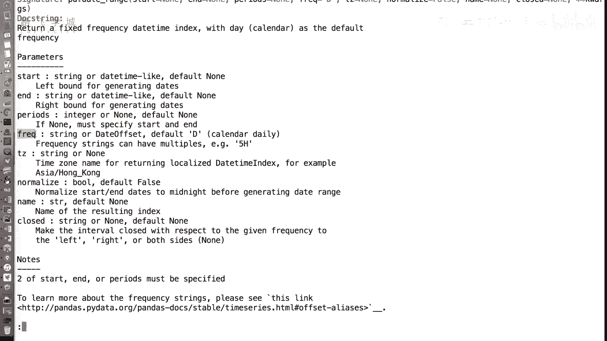

就表示的是频率啊，你可以看到我们这些它打印出来的free，FREQ等于D也就是一天为单位，那如果我想是生产的是每一小时，我就产生一项呢FREQ等于HHH我靠哎呀。

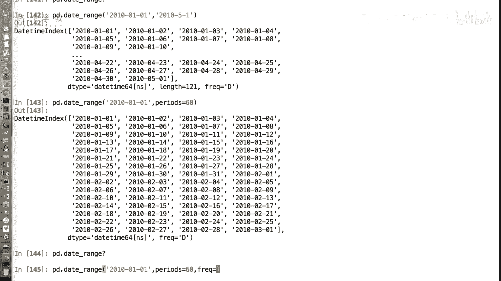

我突然感觉自己之前好low啊，我之前专门做过这种，还有比如说呃W按中按周啊。

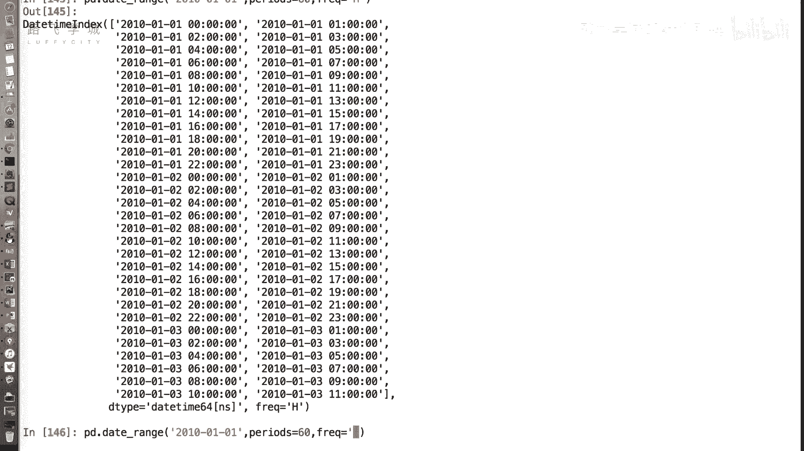

它默认的就是W4SN，就是这个SUN是，就是你找到第一个不是是指就是每个周日输出，你要每个周一呢，就是这个周一是怎么写MONMONDAY吧。

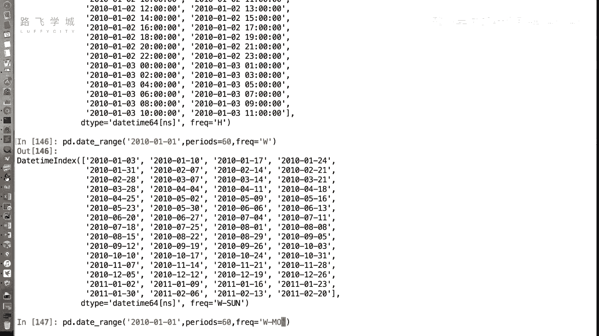

就是每个周一，那还有我靠B是什么呢，是business就是非周工作日工作日啊，你可以看看看，周一号到4号，3号二号和3号都去了，这周日都去，我感觉自己好多，我这钱我省了你好多好多的钱。

我之前做这做专门做过这种东西，然后呢你我生成时间怎么办，就是我从今天生成往前60天的，我要怎么干，等今天减昨天的时间，再减昨天的时间再减昨天时间，因为你只能减，你不能直接说减一嘛。

因为你要算那个比如说闰月或者什么的，你就能剪出来，我靠这个好简单，我要剪出来时间，我还要再转成字符串，哇，这个好牛逼啊，再转成字符串，这个怎么转，再转成字串，也不是它本来就是字符串的，它不是字符串。

它现在是一个他现在是一个他time index，它是字符串打印出来的，比如说我们把它保存一下，这个。

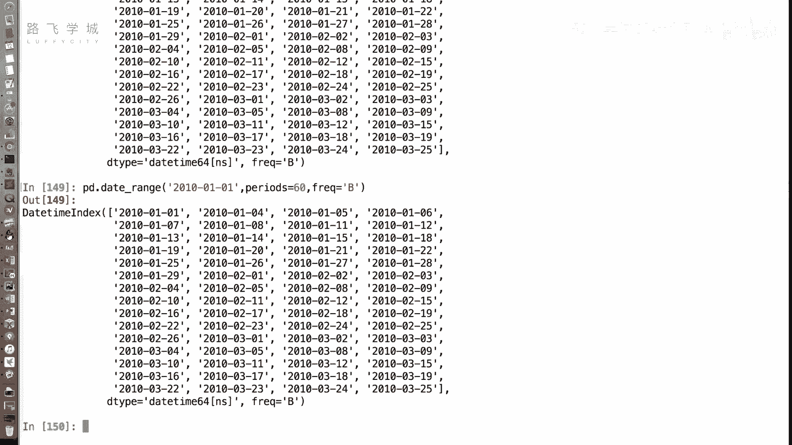

它其实是一个time step，就是in order对，是一个类似于这个标，它不是标准库里的data time，但是类似data time，但是它也可以转账，比如说你转成DTIME啊，不对。

To data type sorry。

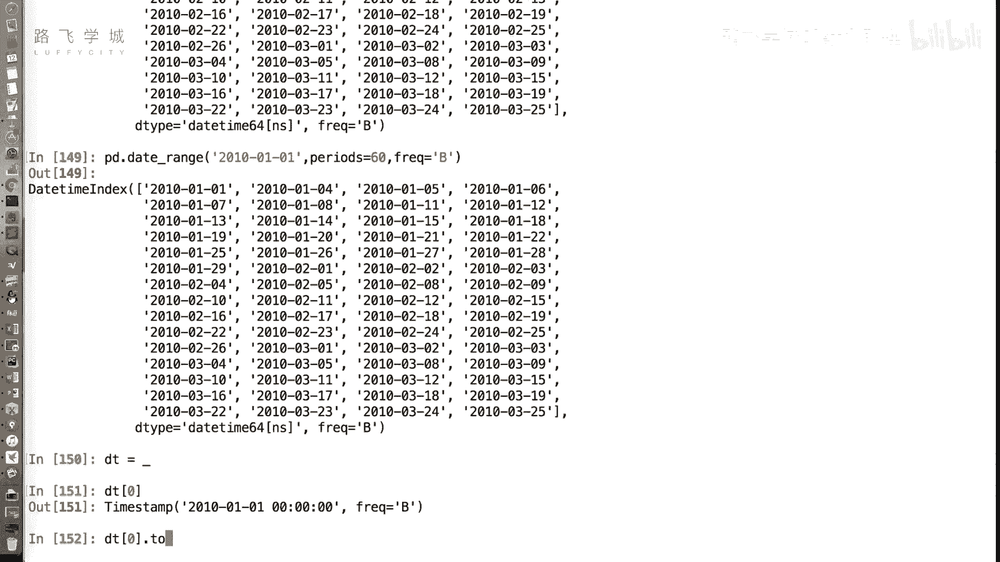

哎。

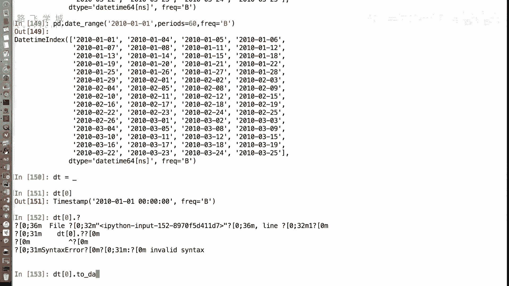

啊他报了一个这个warning，好像是are future warning，就是这个已经废弃了啊，那就对to py data time是转换成Python的data time对象。

对他他那个废弃了哦，那还可以转成字符串。

这个好像是是to s t r是什么玩意，我不记得了，不太对。

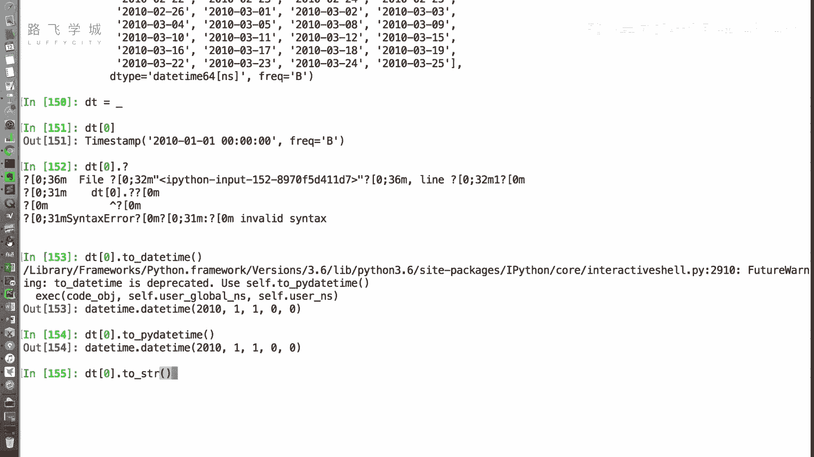

记得不太清楚了，嗯那你转成它之后再转成字符串也可以了，嗯啊反正你可以转成字符串啊，这我们就这个不说了啊，这个回回到刚才我们说这个date range啊。

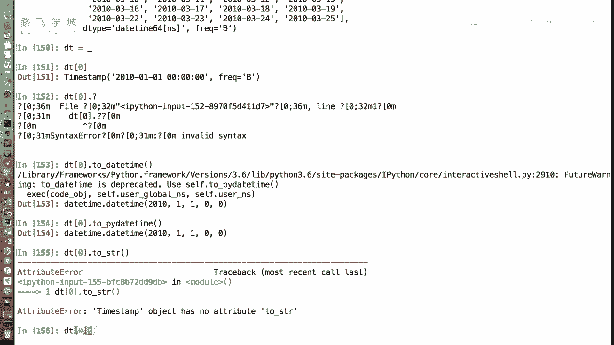

freak有各种各样的参数，比如说我们来看一下这上面啊。

默认的是D就是天啦，你可以选H啊，our啊，W就是week b是business啊，SM就是半个月，Seven month，也就如果如果是一个M就是month，就是一个月啊，T是minutes。

S是seconds，A是year t m因为M被占了。

给M被mouth占了啊，他我记得好像还有，比如说还可以更高级，比如说你这飞个船一小时20分钟杠都支持。

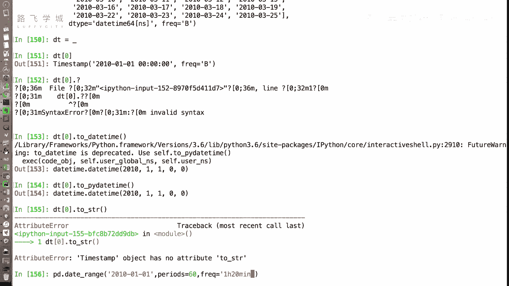

你看一小时20分钟，两小时40分钟，我靠这花式传随便用力啊，终于知道为什么大家喜欢用pandas了，对所以你可以看到pandas这个库其实非常强大，现在到现在为止，我们关于这个时间序列的部分讲解了。

就是pandas as怎么生成一些时间对象，包括从字符串生成生成一个范围啊，等生成一个范围的时间，这个等等等等啊，那接下来我们会介绍一下，我们有了这些实验对象之后。

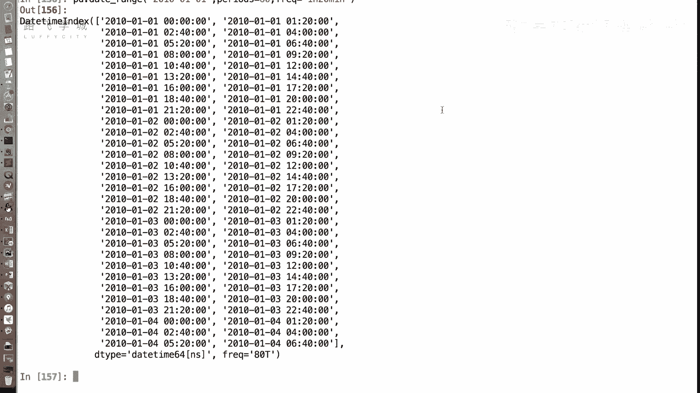