# 14天拿下Python金融量化，股票分析、数据清洗，可视化 - P37：42 股票分析作业 - 路飞学城Alex小助理 - BV1HAyPYYEAr

好同学们，那我们刚才这个练习题啊给大家出了，那现在我们带着大家来写一下这个题，首先啊import一下各种需要的包，Pandas，Number，Py pandas，Matt，Cloud lab。

包括我们最后的to share。

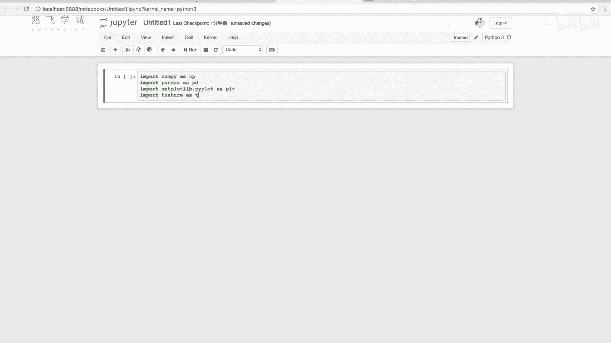

好下一步好，第一个问题。

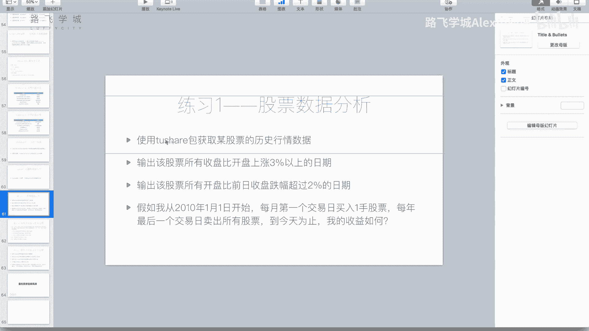

使用to share包获取某只股票的历史行情数据，那就是ts点，Get k data。

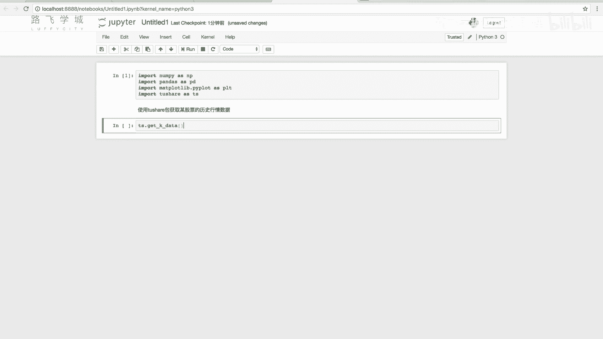

哪只股票呢，比如说我们选茅台吧，茅台最近好像这个大涨啊。

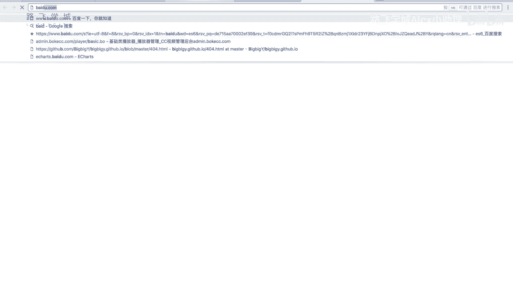

它一直大涨沪股啊，我们看一下茅台的这个。

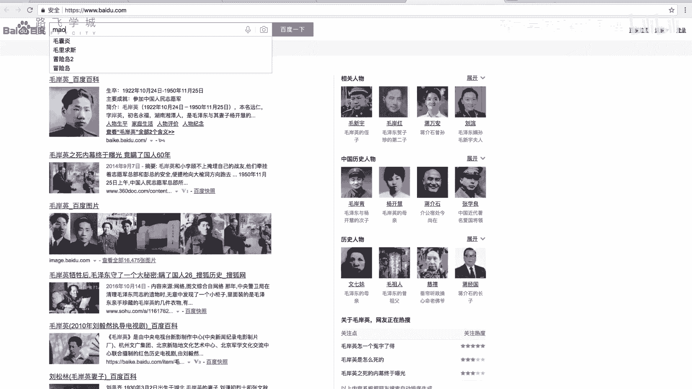

代码是多少嗯。

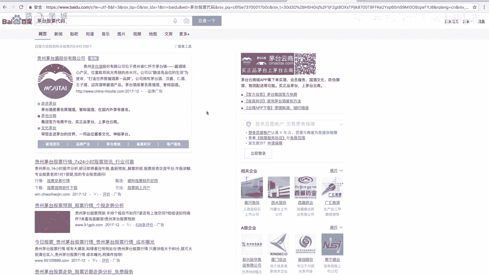

600519。

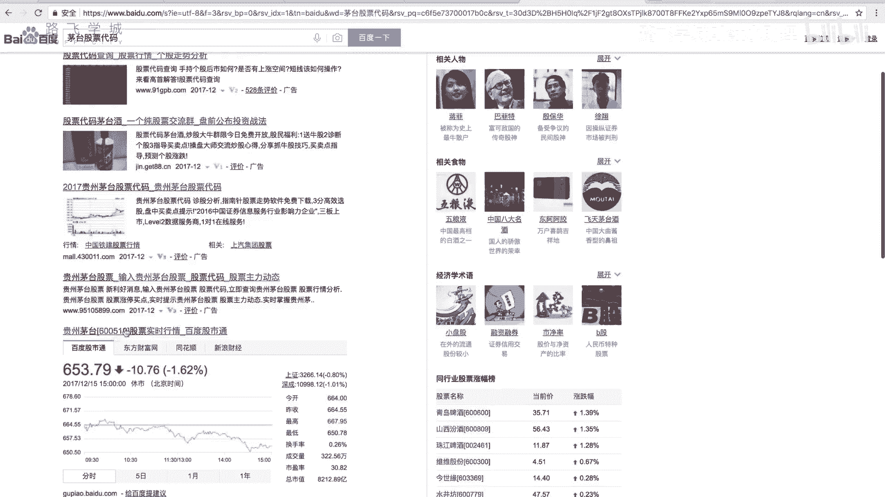

然后就用它600519，start等于比如说我们设一个早一点的1988，好把它用DF保存起来，看一下这个值，好出来了，01年开始的啊，那我们把它是不是保存到我们的文件里，这是第一步对吧。

5600159点，Csv，5192519，好保存完了，那接下来我们就不去获取它了，我们就一直就是啊从文件里打开就可以了，其实已经这有DF了，但是我还是打开一下，等于pd点read，60015啊，519。

3SV啊，然后记得大家记得我这参数啊，index等于date，pass啊，pass d pass data等于date，就是把这把date这一列处理成索引列，并且把它这个变成我们的实验对象。

嗯我们可以看一下这个啊，放index c o l，可以看一下DF嗯，我们把没用的都去掉，为了防止意外，比如说我们就只留几列，只留open，就我们只留只留骨架这四类就可以了，哎啊其他没有用。

成交量在这里我们暂时用不到，就把它扔掉啊，好就是这四列啊，date是这个索引没有问题，那接下来我们这个第二步。

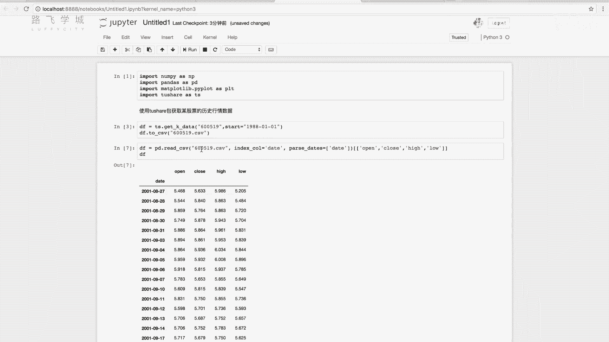

第二步干啥，第二步输出该股票所有收盘。

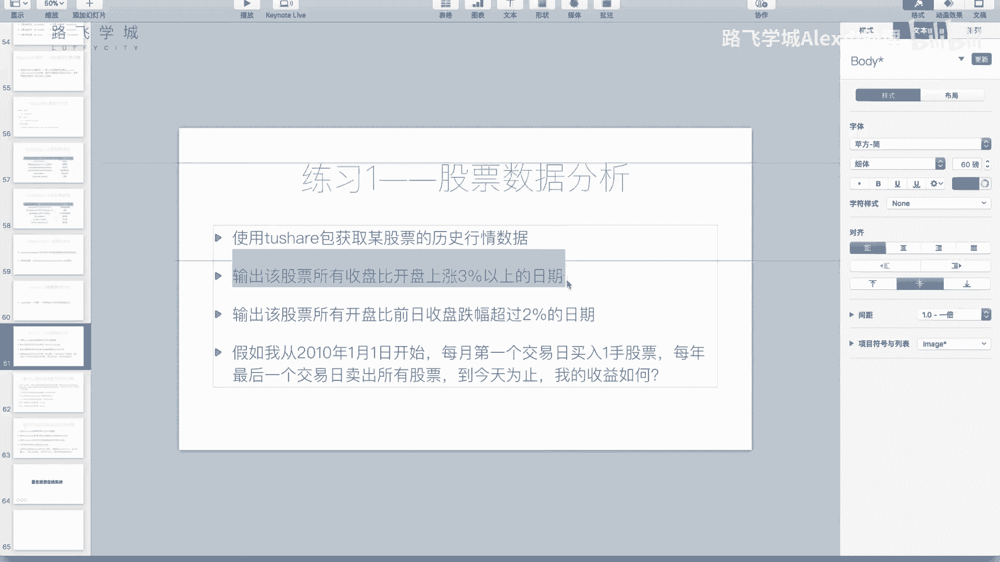

比开盘上涨3%的日期，好那这个日期怎么回用，我们现在有DF了，实际上收盘所谓收盘比上涨，收盘比开盘上涨30%，是不是就是害呃不是是这个close跟open比怎么算，上涨百分大于3%。

上涨率是不是应该close减去open括起来再除以open，嗯对对，如果它大于3%，是不是可以好的，那我们这是不是就可以直接用的布尔写索引嗯，啊df close减df open open括起来。

除以什么DF啊，CLO除以df open，这是不是一个啊，把把外边的框去掉啊，我们先把外边的框去掉，你看一下它这是不是一个值，这是不是就是一个上涨率，括号好，你看一下这是不是叫你看每一个日期在上涨，0。

03，0。05下降了，下跌0。1，对不对，那是不是它只要大于零，大于等于0。03的，我们都把它拿出来不就可以了，嗯对怎么拿出来大于0。03，这是不是个true或者false的东西，用我们的布尔型索引啊。

点F中括号，就DF所有关这个收盘价减去开盘价，括起来除以开盘价，就是上涨率大于等于3%的接力，都输出出来好可以看一下是什么，就是8月1零一年八月七号，8月28号，9月10号好像还挺频繁的嗯。

啊看多少多少列，275列，原来是3000多，3000多行，3800多行，现在200多行已经不多了啊，你可以介质价，比如说0。05上涨5%就已经少了一些，你看就只有80行了，比如说我们来一个0。1，0。

1，大家猜会有多少，就俩0。1，你要说零点大于等于0。1，这两个肯定都等于零，你要等于0。11就没有了，为啥中国涨停限制吧，涨停是10%吧，所以只有这两行是10%，还有10%，你零点再加加零一就没有了。

应该是可能可能有，这是计算误差的问题啊，这是误差的问题，但是就是最多涨1%嗯，啊最多涨这个不是10%，0。1啊，0。1，那好这是把它改成0。03，这就是我们要的数据，那要日期嘛，要日期怎么办。

再点index就可以了，点index这是所有的日期吧，哦对不对好。

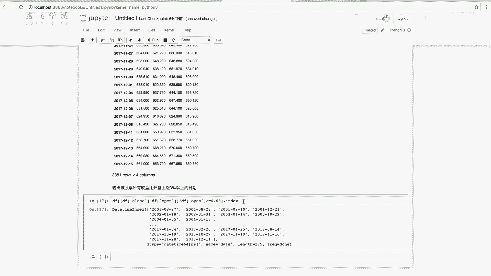

这是我们的第二问啊，收盘比开盘上涨3%以上的日期，那第三问。

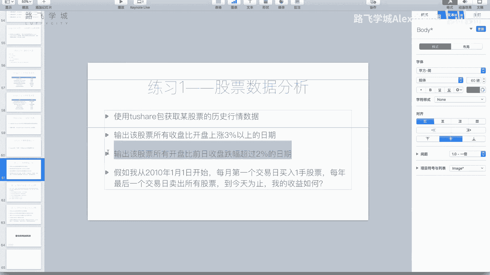

第三问，这个输出所有开盘比前日收盘，跌幅超过2%，那什么叫跌幅超过2%，就是比如说啊，28号的开盘价跟27号的收盘价比，就看它比它是不是跌了超过2%，我们现在只能看到跌了，对不对，对不对，今天的开盘。

这一天的开盘比上一天的收盘跌了，但是我不知道跌了多少，那这个怎么比比前一天的直接这样，还能不能直接用我们的这个波尔特发音，暂时好像用不了对，但是我们有一个方法叫做shift啊，如果你不知道这个方法的话。

你也可以你写循环吧，对不对，血循环遍历一遍，5。4544，跟它比就是I和I减一对吧，这这这I的I减一就一直比下去，然后输出就append的进去啊，这个那个我就不给大家写，大家可以自己写啊，给大家说。

就是我们pandas as的目标就是不用循环，那不用循环怎么写啊，这个shift的函数给大家说一下啊，比如说我这shift1，你看一眼，看到了什么之前的所有列啊，对如果没有shift，记住这个5。

468，没有shift的话，5。468是在看8月27号看到没有，加了shift一五点468就会下移一列，下一行对，就shift嘛，移动嘛，上下移动，如果是一呢，屋而是一，它是往上移，一是往下移。

你比如说我这移三，它就会往下移伸了，看到没有，5。4就到这来了，这个是如果是我我写一负一，那么第一行就会是5。544哦，嗯嗯看到没有嗯，那有了这个我是不是他俩本来不是错着一位吗，那有了一个shift。

我是不是就可以让错着一位对齐了，对不对，你看我是要让拿拿这一它是不是和它比嗯，对不对，那我把open shift-1是不是就可以了哦，对对往上对不对，open往上移一列的话，是不是就跟它对齐了。

但是这样的话我们的日期是不是就错了，你open的话，我就5。544，是不是跑这来了，那他再跟他比的话，你这个日期是8月27号，但是实际上这应该是8月28号说的，因为他和前一天比的。

所以我们把close往下移，对不对，也是一样的效果嘛，DF点DF中括号close点shift1哎，你看他第一个是NNN，然后后边都有数了嗯，那算跌幅啊，开盘比前日收盘，这是前日收盘，那开盘。

哦是不是d f open对减去前日收盘，这是不是前日收盘是好，括起来怎么样，除以前日收盘，对嗯除以前任的说法，这是不是前任说法嗯，那他跌幅嘛超过2%应该怎么写，大效率效率对诶，小于等于小于等于-0。

02嗯，跌幅跌啊，然后DF把它套起来，你看一下，你可以验证一下，如果你不信，你可以验证一下，这个比它是不是跌了超过了0。02%，这个比它是不是，你看反正现在看都是跌的嗯，这怎么涨了不对，这都是涨的。

我看一下啊，今天的开盘减去去天的减去shift1的收盘，小于等于DM，它的点小于小于等于哦，我知道了，不能这么看，因为他那个行数已经没了，9月12号应该看9月11号了，但9月11号已经不在了啊。

我以我说这样看，但是不是这样看，你这是6月26号，你应该去找，应该是它减去6月25号的那个价格去看啊，不是直接那样看嗯，大家可以验证一下，肯定是代码是没有问题的，好，那这就是在它点index。

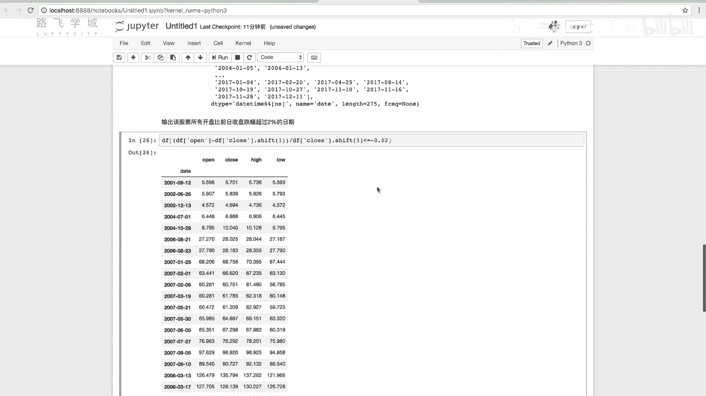

我是不是就可以把日期第二期就出来了。

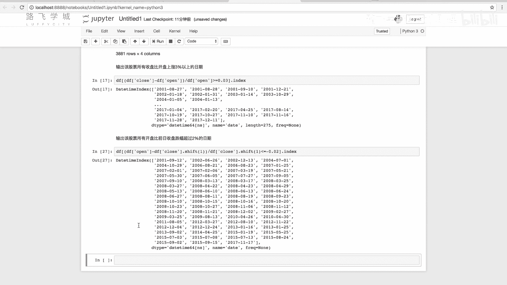

对好那这是第二问啊，最后一问是最难的。

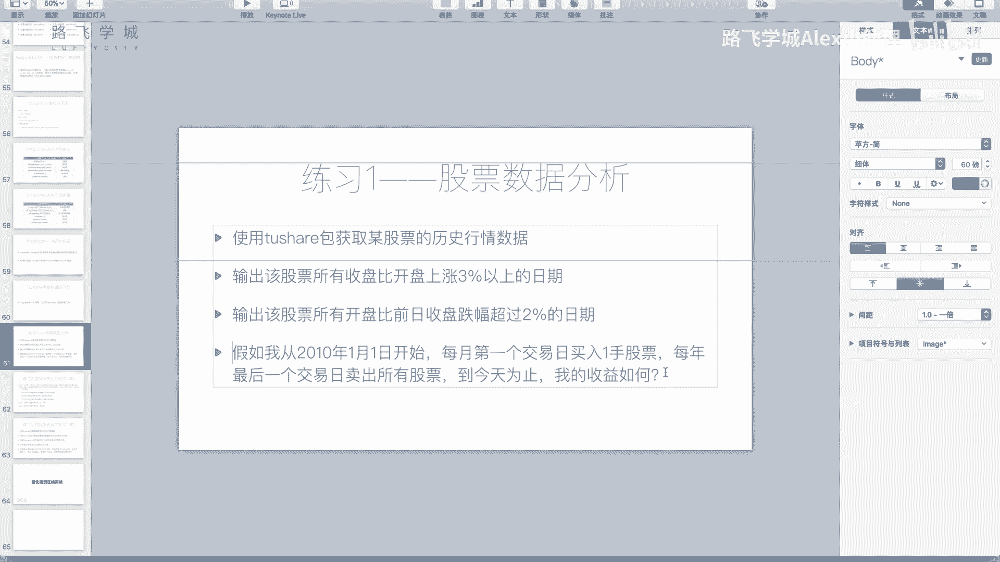

啊当然前两问你都可以啊，说这个我这些函数掌握的不够，包括说你我的shift之前老师没有讲过啊，这个都没有关系，大家也可以用循环来写啊，那当然鼓励大家，因为我们时间有限，不可能一个函数一个函数给大家讲。

那我只只能是挑重点的功能，重点的确很很这个很好，很经常用的课程给大家讲，那这些大家可以就是平时用到的时候去看翻译，翻译手册呀，翻一下文档啊，了解一下好，那我们再说最后一个好啊，10年1月1号开始。

每月第一个交易日买一手，每年最后一个交易日卖出所有，那么到今天为止我赚了多少钱，那这个问题观念也是术语，观念是不是，首先我要考虑，我获取到每月第一个交易日，和每年最后一个交易日。

这些他们当时的价格对不对，因为我买一手，我是拿什么价买的，我们可以认为啊，当然就是我们你在每一天买这个价格都不一样，我们可以认为你是拿这一天的开盘价买的，可以吧，假设啊做一个假设好。

那怎么拿到每月第一个交易日的股票，每月第一个交易日一号这个写法有很多，你比如说你看这个DF，8月我们就不看了啊，9月9月第一个交易是9月3号，然后下个交易日是多少，9月，然后10月的交易日是10月8号。

因为10月1到10月7号放假了，好那这个东西我们怎么拿，啊注意，首先我们先把8月的数据，跟最后一个月的数据剔掉，为啥，因为他不是最后一个月的数据，这没有到这个月的最后一行，对不对。

8月的第一个数据是不是也没有到8月1号，你8月27号我们不买，对不对，咱们找一个整的数据啊，我先替掉一些数据，等于DF2001从2001年的9月份开始，到多少呢，2017年11，这是第一步。

我们干的就是啊剔除，首尾，无用的数据，好可以看到这是9月开始的，那最后是11月的，好这些，然后我们再考虑说每个月的第一号都不拿啊，之前教给大家一个函数，不知道大家还记得没有。

叫resample sample recal，好像啥叫重新取样，我设置一个参数是FREQUENFREQUENCY，是频率啊，演示一下啊，如果我设置的是M的话，表示月，那这样的话运行它并不会输出啥。

他会输出一个RESEMPLE，那你resemble之后相当于是你所谓的RECEL，就是把一个月的我一块看，然后你在这一个月的，你给我找一个出来就行哦，啊DF点RESAMPLEM，比如说我先写一下常见的。

比如说是sum sum啥，就是这一个月的和啊，我这儿打印两个吧，打印DF和它看，嗯这看不到，我看看我，我把它写在下边，好就这样对应的看大家可能好理解一点，好DF的话。

是不是这个那DFRESEMPLE点SU看一下啊，看啊9月30号，10月31号，11月30号也就是什么呢，他把一个月的就是9月1号到9月30号的，都统计在这一这一行里边。

那它的open这个115是怎么来的，这个月加起来就是5。894，加上得到得一直加加到9月30号，28号没有30号，那10月的就从这开始讲啊，SAM比如说还有mean mean，就是求平均啊。

那这样你重采样的话，resemble的话，你的这个值就是那些的和再除以他的天数啊，我们不用这个，我们用什么，我们用这个月的最后一天，对不对啊，不是第一天是吧，第一天第一天是什么，第一天是first。

那如果说最后一天呢，last last哎对其实只有有有时候试一下就能试试，比如说我们看first啊，我们看是不是一样，我们检验两个值好，虽然你看到我这写的是9月30号，但是它其实代表的不是9月30号。

是9月，你明白吗，但是你如果说我不想这样，那你可以加一个S就是MON，这是month嘛，S表示是start，就是开始，那他这都会就是这个日期都会写一号啊，其实这个没有关系，这个值没有变。

你不管是M还是MS，你这个值看第一行是5。894，那这样永远是5。894，那看5。894是啥，就这个5。24没有9月第一天的，那你再看10月第一天的，10月的这个啊，5。863。

虽然他写的是10月31号，但是这个5。863是这个5。863，对不对，嗯好，这是说我们RESAMPLE这样的话，是不是可以这个列表获取到的，就是每个月第一天的数据，好比如说我们把它存起来，存起啥呢。

叫DF，Monthly month，好，这是每月第一天的数据，那每年我们是还少一个每年最后一天的数据，对不对，每年最后一天的是啥，一二还是RESIMPLE，这个一样的那页啊，之前给大家说是不是Y是A啊。

因为可能其他字母都被占了，我也不知道它就叫A啊，点这时候该点什么了，last了啊，那这个时候你看一下他的话，就是101年12月31号，02年零三年零四年，但是这个31号不一定是，就是12月31号。

但他是他这个值，是每年的最后一个交易日的值啊，这个都没有问题，好把它存成什么DFE里，比如说那我们有了这两个了啊，怎么做，接下来，然后，啊yearly，你还要注意啊，01年没有问题，17年12月31号。

这一行要剃掉，要剃掉，因为没到呢对吧，16年12月31号这一天我们要卖掉，对不对，但17年最后最后一天还没到，对不对，所以这个不管啊，那就是什么，切到倒数第一个这样写的，倒数第二个啊。

前包后包倒数第一个看到没有了吧，这是切片嘛，冒号一是切到倒数第一行，那后无包倒数第一行就没有了，对啊好把它存到DF页里，那这两个数据我们就有了啊，这两个数据有了之后。

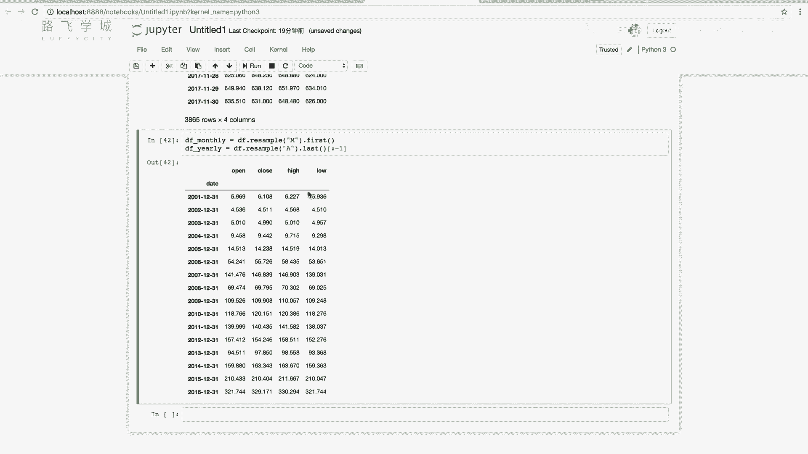

我们接下来就该模拟一下，其实这就是一个简单的这个交易策略。

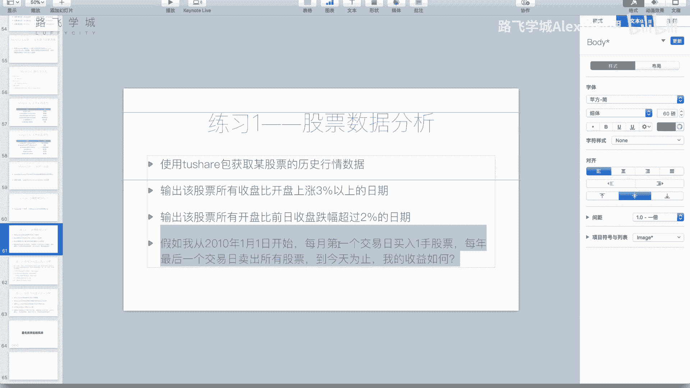

模拟一下这个策略好，那我首先我是要统计一下花股票的钱是多少啊，就是这个啊花了多少钱叫cost money，就我每个月买一次股票啊，没有int，每个月买一次股票，那花了多少钱，我统计一下那花了多少钱呢。

那就要什么就要从这个DF，Monthly，这儿看对不对，我每个月是不是这个时候，2001年9月份买一首开盘价买一手，是不是花了5。894×100嗯，然后10月买一手，11月买一手，12月买一手。

12月买完一手之后，接下来是不是要他要卖掉你这个所有的钱，嗯啊那这我们就怎么办，我们就这样，我写个for循环，这个时候必须写循环了啊，你这个没事，For，in我就这样写了啊，几年呢是200啊。

变in range，2001到多少，应该是202017嗯，应该是到2017岁，这是2018，对不对嗯，那每一年好，每一年我首先是不是要买这些股票，买这个月的这些股票。

就是这哎101年是不是要买这几只股票，那这几只股票我们可以通过，不是买这几次股票啊，买这几次股票买四次，那这四次我可以通过什么呢，我可以通过df monthly，的把这一年输进去就可以切出来啊。

大家不知道还记不记得我可以什么，好我可以这样，公子2001这样运行的话，你看我是把201的所有东西都切出来了啊，是这个原理啊，好，Monthly，我是把year变成字符串就可以了，对，啊把它变成字符串。

那这个东西是不是就是，比如说这个页是001年的时候，那它是不是就是这个01年的所有值对，那01年我每年买一手是什么，这还是一个series，而不是还是一个data frame，那它的。

open列是不是就是我就是这一年的这个data frame的，比如说这一年的这四个数，这个四个数组成了一个series嗯，那他就是每一个买一手，相当于是每个乘四，在每个乘100再求和，对对不对，那是吧。

点sum再乘上100买100手啊，cost这个是不是我这一年花的这些钱嗯，cost是吧，money money加等于加上这些钱好，我不光要记钱，我是不是还要记我现在有多少只股票，对对不对。

那我现在有多少只股票呢，好比如说hold等于零啊，就这么写了，那你这个hold也要加加多少呢，多少是不是加你这个东西的长度，他这东西有几行，是不是就哦对对对，他有几行。

是不是就是这个我们有买了都买了几回，买了几回再乘100是不就可以了，它的长度啊LEN就可以了，是吧，再乘以一百一百，对好这是这一年就相当于这12个月，我呃这不一定是12个月，就有几个月，就是几个月。

你看第一年那个是就没有12个月，四个月哎，今年今年是几个月，第一年好像就是12个月，第一年是12个月，好先买，买完了之后，接下来是不是要卖了，对要卖了的话，是不是就是我要把这个在DF1里的那个。

open的价格卖出去嗯，YELLY好，那这个时候DFYELLY，这一年SSTR，啊这一年你看他输出的肯定是只有一行，然后把上面注释一下，我看一下，哎别注释了，我在下边写了，在下边的格子里写好。

比如说我这是啊，2016啊，零一，They will not defined，怎么会啊，好是不是只有一行，那这一行我把它这个获取它的开盘价是不可以，你在这对着写啊。

df yearly early的主要STREER，那获取它的这个位置的价格，是不是就是我们卖出去的那个价格对，卖出去的价格，点儿是吧，我们用lock，我们用啥用，没用lock好用，Lock。

别用lock，直接取open吧，这样没有问题啊，取open这一列，然后0号因为你取open的话，它返回的是一个长度为一的series，所以0号就是这个价格，那这个价格卖出去卖多少，满多少。

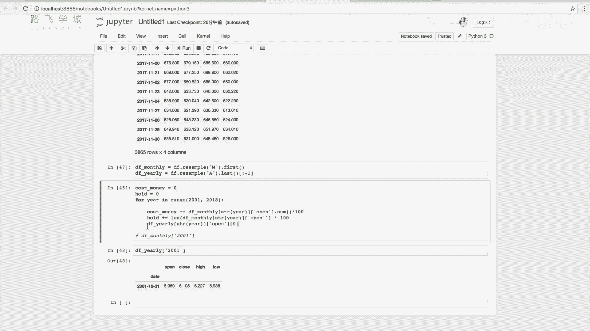

什么卖，你有多少都卖多少，我说的是什么，我说的是每年最后一交易日。

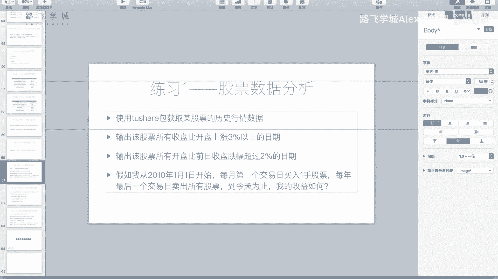

卖出所有股票就清仓哦，那这个时候卖什么，卖厚的股，你是不是hold的这些有的这些对吧，你之前算的一共买了也全卖出去嗯，那这些价格就是这些是什么卖，是我卖了多少钱，对，那我卖了多少钱。

我是不是应该在cost money上什么减减去这些，对你钱又回来了，对好减去这些，那这个之后hold要清零，就是我们都卖出去了，没有股票了啊，都卖出去了，然后好，那for循环执行完了之后。

我看一下什么我cost money是多少，对，是不是就是如如果是负的，说明什么，你排了说明我赚了专对谁状态，你看我这个cos money是我花的钱，对不对，如果花的钱如果我一直不卖的话。

花的钱一直是挣的，对的对啊，那cos玛是负的的话，说明我是赚了，那这儿还有一个问题是啥呢，是你这个页如果等于2017的时候啊，如果咱们简单考虑，就这样，如果页页等于2017的时候。

2017的最后一个就是2017的，这个价值是不用算的，2017不没有卖，对不对，2017年没有卖嗯，不算2017，2017前没有卖，对不对，嗯明白，那所以你看2017的话，我这这一行这两行是不是不执行。

对对啊，所以你看啊，我这加个if条件，if year是吧，不等于2017，啊这个有各种写法，大家随便写都行，那如果等于2017呢，不管如果等于2017，我是不是正常买不执行它，就是买就买这些啊。

买就买这些，就是切出来那些月买，买完了就完事好，那最后现在我要最后还剩要算什么，for循环执行完了，最后我是不是要算收益了，收益是多少，收益是你的cost money，是你的收益。

但是你有可能还持有股票，对你的hold有可能不是零，因为什么，因为你这个2017年的时候，你的cost money加了钱了，hold加等于一些值了，没有执行这一些，那你最后hold不等于零，对不对。

那你要算一下2017年你股票有多少股，就是厚的股，那你还剩多少钱，还剩多少钱呢，得减去Z1不是还剩多少钱，是你的股票值多少钱啊，是你股票值多少钱，股票值多少钱，这个东西怎么算，又得回到我们的DF上。

你股票值多少钱，是不是就是你的看啊，17年11月30号啊，这不应该是11月30号，这应该是这个，看我这应该是你看我这T出去了对吧，我这T出去了的话，我应该这样，我应该有一个DFO的。

就我把之前那个保留一下啊，别DFDF什么吧，df last呃，这个price last，我是不是存一下这个DF，最后一天的那个价格就可以了，那你那天是不是值那个开盘价是多少，乘上你的股票数。

你是不是就值那些钱，对啊，press last等于DF，open的什么一，啊再重新把它执行一下，好，那这个时候我的钱是不是就是厚的股票值的钱，是不是就是ho的乘上price last，对对不对。

那他要在干什么，是不是要从你的cost money里减去得来，最后你的cost money就是你的收益，如果是负的，就是你赚的钱，如果是正的，就是你赔的钱，所以我们这打印一下负COSER里。

我们让它正过来嘛，啊print print，真的43万哇，为什么会这么多呢，我也不知道嗯，那我们来看一下啊，我们在for循环执行完了之后，打印一下我这一年的cost money卷，主要是负的。

你看这什么时候就爆发了，本来这这价格看起来挺正常的吧，四负九十六，109850120563946，然后什么负的都是，这刚开始赔了一点，后来就一直转一直转一直转一直转，人家赚这么多。

大哥你看看茅台的那个行情。

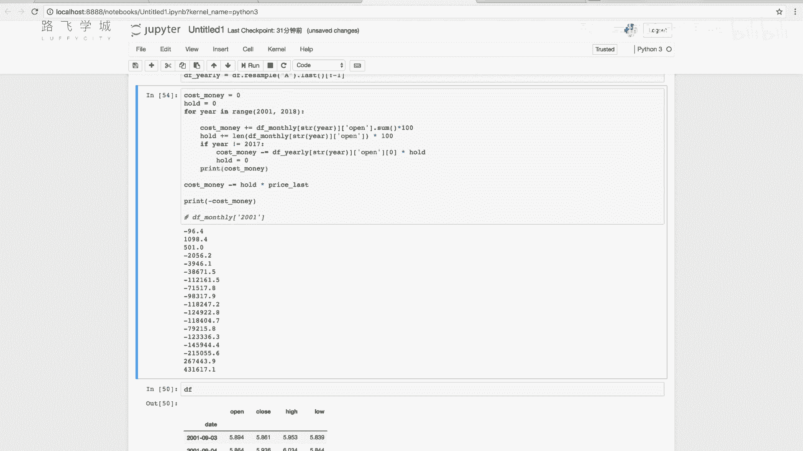

你就知道了，你看看这个历史，他当年开盘是一股多少钱。

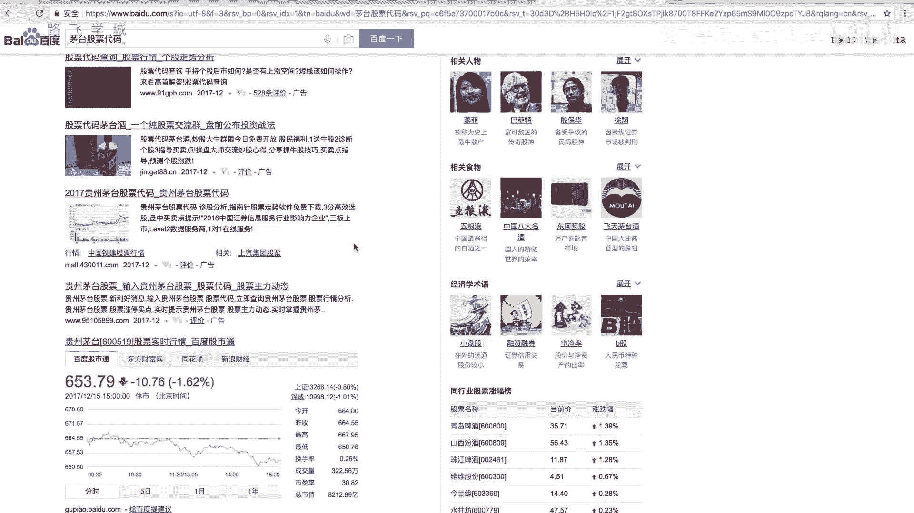

五块钱，五块钱，10年的时候是多少钱，我们看一下啊，Df，2010年，2010年111块，对不对，你再看17年，300多块，600多块翻了一倍，能不赚钱吗，这一年啊这一年没有，10年。

一年329块钱到635块钱，翻了一倍，嗯啊买茅台吧，你一个月你假如买一手100股，每股赚300块钱，值多少，3万10个月啊，当然我不是一块买的，但是我可能有1月买的，2月买的，3月买的。

你赚的肯定挺多的，那所以这个价格，你看起来我这一阵赚了43万有点多了，但是正常，当然这限于茅台股啊，这茅台这几年事故啊，啊大家可以试一下别的股票啊，你试一下别的股票，你这种策略可能有的就不行啊。

可能有的就会赔钱，这个不一定对，好那这是我们的这个第三个股票策略啊，这个第三个问题。

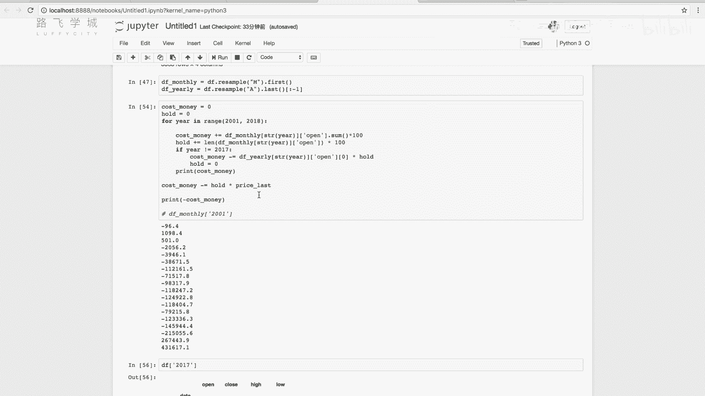

那到现在为止我们这一个练习题就讲完了，嗯啊相当于是实现了一个就是手动算了，写了一个简单收益的，验证了一个简单收益的收，这个简单策略的收益就是一个简单策略，看他的收益怎么样。

那如果说到后边我们会学一些复杂的收益，而复杂的策略，那这些策略也可以进行验证啊，我们下一个练习就是一个叫做双均线策略啊。

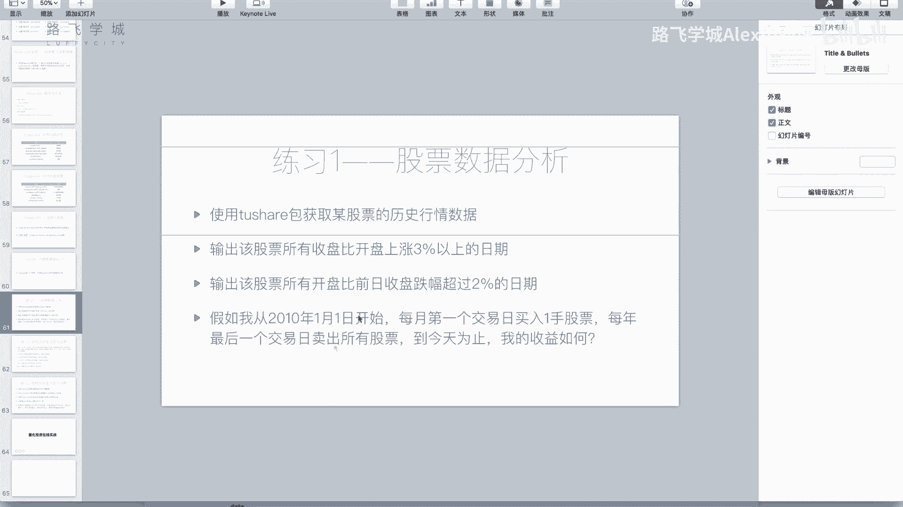

那么关于这个简单的题题的解释。