# 14天拿下Python金融量化，股票分析、数据清洗，可视化 - P41：49 第一个量化策略-3 - 路飞学城Alex小助理 - BV1HAyPYYEAr

好同学们，那我们现在接着带着大家写一下，我们的HAODA应该怎么写啊，我们说这个我们的策略是350，还记得吗，看一下我的策略小于十块钱，并且当前不持仓买入啊，如果当前的股价比买入时涨了25%，清仓止盈。

如果股价比买入时跌了10%的清仓止损。

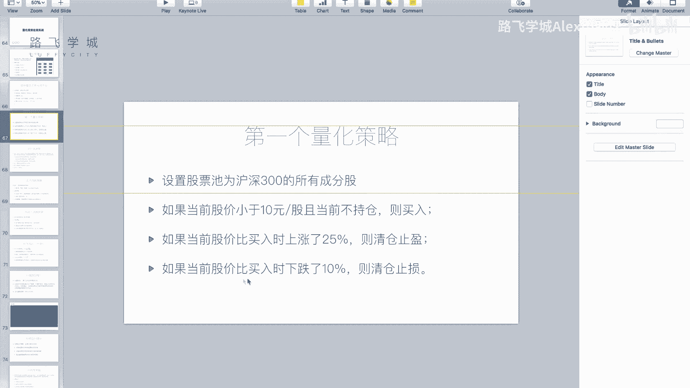

对好，所以我们要操作的股票是这点，security里边存的300只股票，对对不对，要求那这个东西实际上是个什么，是个列表对吧，刚才已经输入过了，那我们说对于每一只股票都要操作，那实际上是个for循环。

对不对，每一只股票对对每只股票都要看嘛，所以我们这写个for循for stock in这点security啊，那这个stock其实就是每一个股票都块代码，因为它在这点词库里存的。

就是一个股票代码组成的列表，对好。

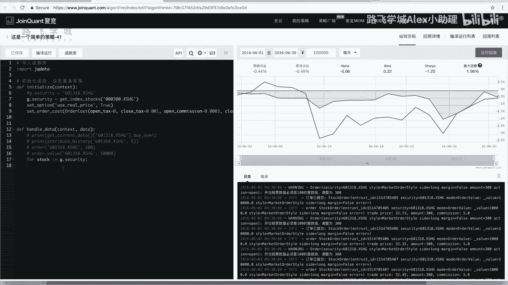

对于这支stock的这支股票，我是不是说我要买入的话，看它的股价小于十元还是大于十连。

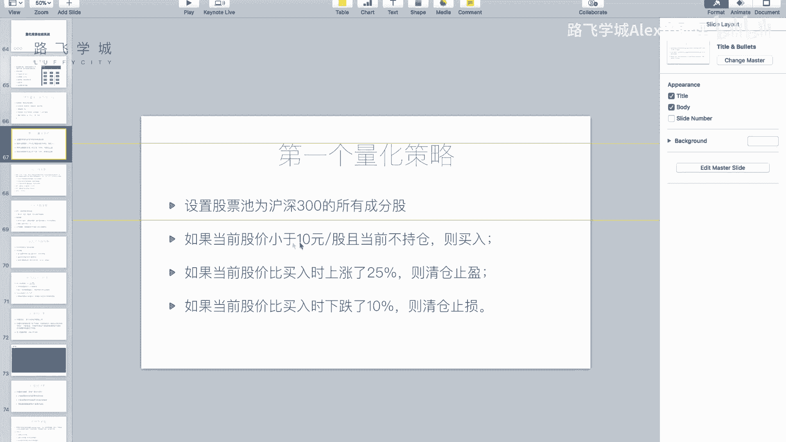

我是不是要看一下它的当前的价格，比如说当前的价格P怎么来求，是不是我们之前说过获取今天的价格，是不是get current data，然后键传你的股票代码，这边就不是字符串了，是stock。

因为stock就是代码嘛，然后点day open open唉，这个时候P就是你的今天的开盘价，实际上也就是当前的价格，嗯啊我们这个时候还可以算什么呢，除了算P，我们还需要知道我当前是不是持有这只股票。

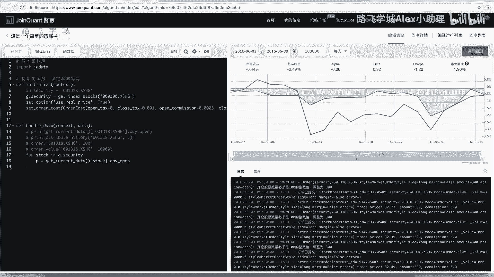

对，因为我们要看就没有不持仓的时候。

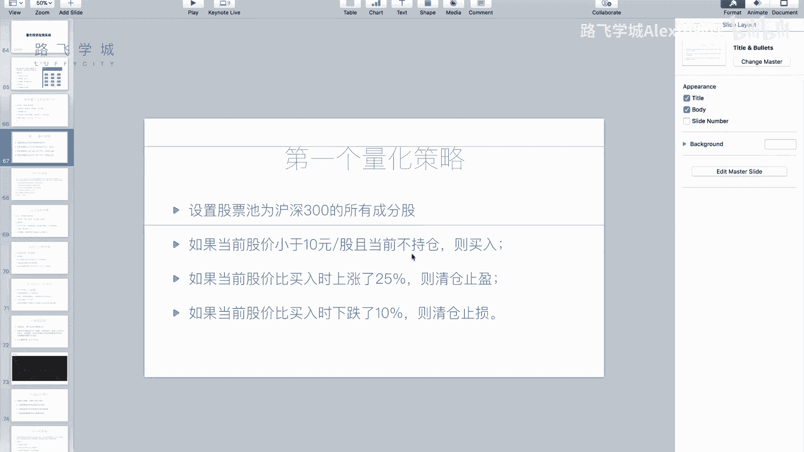

我们才买入，对不对对，那怎么看持有持不持有这支股票呢，那这个时候应该这么写啊，我们用amount来存，当前说我有这支股票，是不是有有有多少股可以吧，那这个股票不是就是你当前账户的信息存在哪，实际上存在。

这个看在这个handle data的参数的context了吗，上存在这个里边啊。

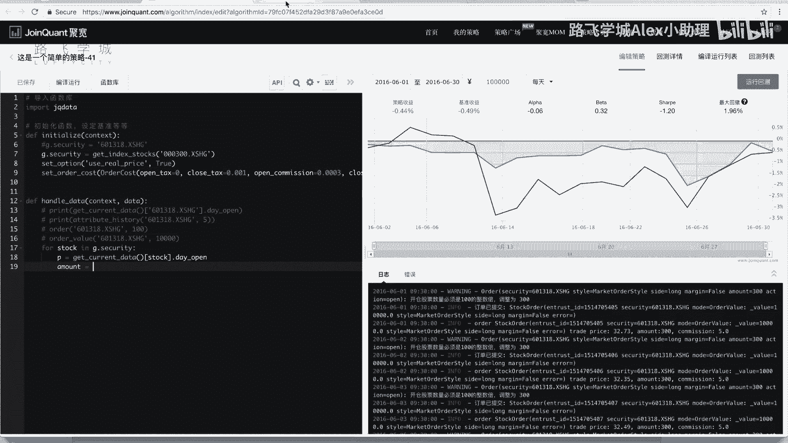

叫上下文，但是其实他存的是一些相关的信息，具体大家想看的话，可以看到这有一个context类啊，然后这里存里有一些portfolio是我们的账户信息，然后然后除了其他，这除了这个其他的。

还有比如current dt是返回当前的时间，daytime对象啊，private state就前一个交易日是哪天啊，universe这个我们这个现在我们不用了，不用管它，然后其他的也暂时没有了。

好我们这用的是什么呢，context点portfolio，这个portfolio存的是什么呢，是你当前账户的信息，什么账户信息有啥，因为你现在有多少钱，对不对，你现在有多少多少股票。

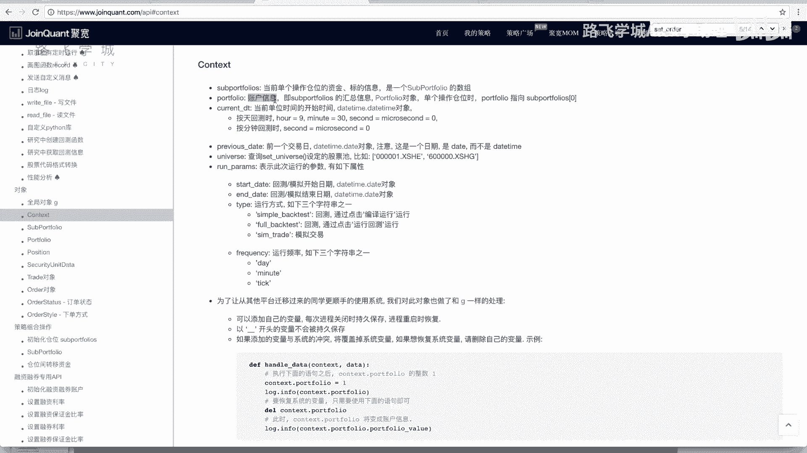

每个股票有多少股，对不对，这是你的账户信息好，所以是。

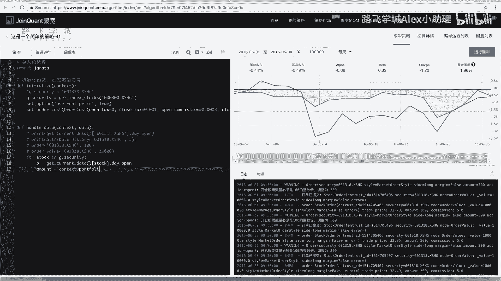

然后PORTFOR6之后再干啥呢，账户信息可以到这再看，portfolio是一个PORTFO6类的对象，它里边包含着这些信息，比如说啊累计出入金，可用资金，累计出入金就是你这个啊转移的过程是多少的。

这个我们不常用，比如说可用资金就是现在还有多少钱，available开始啊，这个也不常用啊，locked catch是这个就是能取多少钱，这个我们也不常用，还有什么呢，还有这个AMARIN也不用管。

Petitions，positions是位嘛，实际上就是仓位位置标地叫它，实际上里面存的是股票的相关信息啊，其他之外还有一些什么开始的资金啊，你持仓的价值等等等等啊，那接下来我们说。

我们是不是要获取这支股票的数量对，那实际上在positions里面，所以是它在。

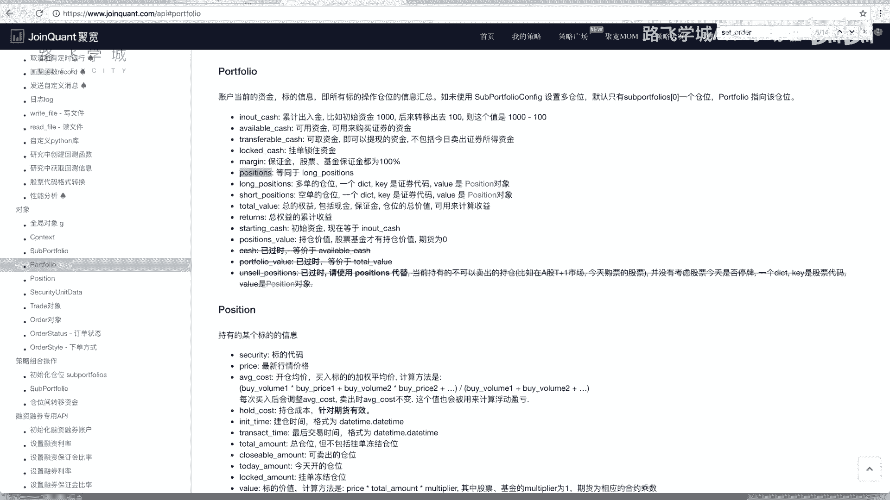

Context，点portfolio，点position散。

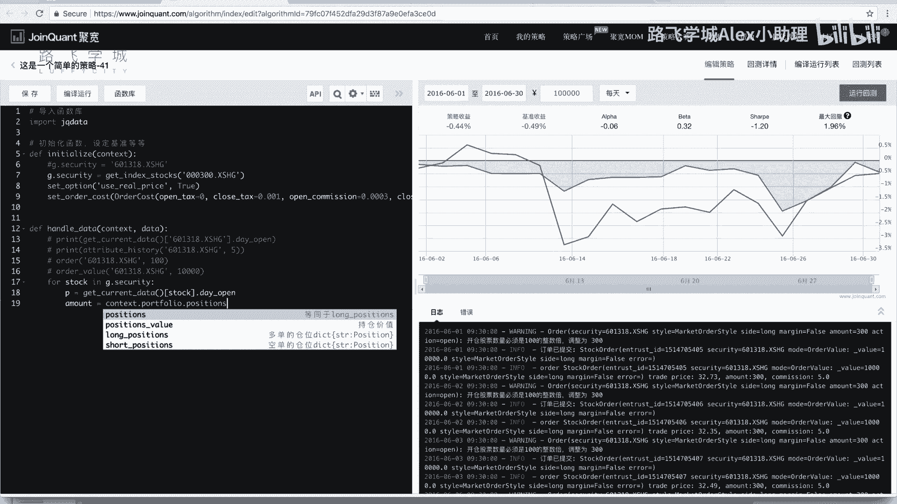

或者你写long position都行啊，就position就可以好，positions在什么呢，position就到这来了，positions我们可以获取到最新的价格，然后什么其实我们说获取价格。

你也可以这么走，你也可以这样走，但是啊有可能没有啊，有可能没有，就是因为有可能你现在不吃这支股票，OK吧，加position，它是一个，你这是看到它是一个说等于long positions啊。

它是一个字典，key是我们的分析代码。

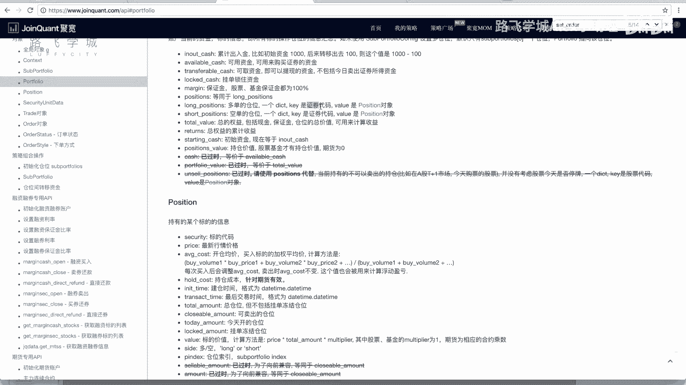

value是position对象，所以我这position是一个字典，对不对，我要看什么呢，我要看stock的相关信息，所以我们这建传入stock只是一个positions对象。

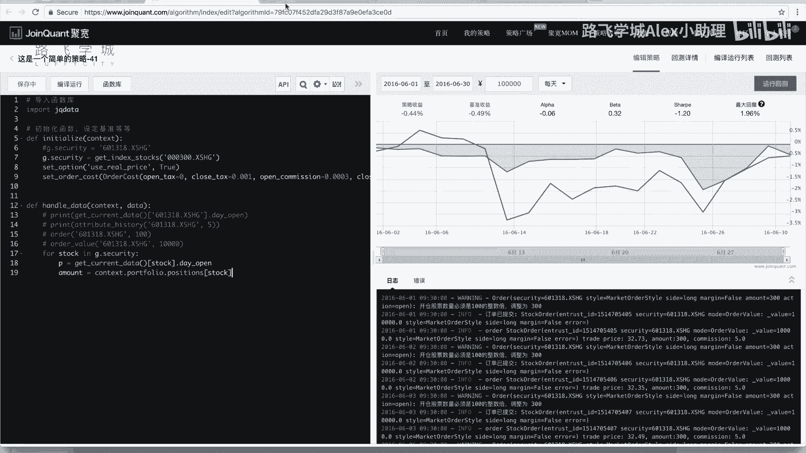

然后可以获取到价格，就是这支股票当前的价格可以获取到开仓均价，这个是啥，这个是成本，开仓均价，后面我会用这个东西啊，这个l a v d cost是啥，这个怎么理解平均的价格，平均价格是啥意思啊。

就是这一天这个股票的不是开仓均价，是你平均买入的时候，你平均一股花了多少钱，假如说我这个股票从开仓开始，就只是说第一天十块钱的价格买了一手嗯，那我现在开仓均价就是十块钱哦，开仓就是什么，相当于平均成本。

你平均一股花了多少钱哦，说那假如说啊，我第一天十块钱的价格买了100股，第二天20块钱的价格买了100股，我现在的看上均价是多少，十五十五块钱嗯，就是相当于你就是你花一股，就是买一股花了多少钱嘛。

嗯好除此之外还有什么持仓成本，这个我们用不到，这只只对期货有效，这个我们用不到建仓时间，最后交易时间这个也暂时用不到，好我们能用到的，我们现在要获取的是，我现在这支股票是持仓还是不持仓对吧。

那也就是说持仓的话，我就是说现在拥有的股票数是应该大于零的，那拥有的股票数在这叫做总仓位，偷偷amount，偷偷就是总共的数量嘛。

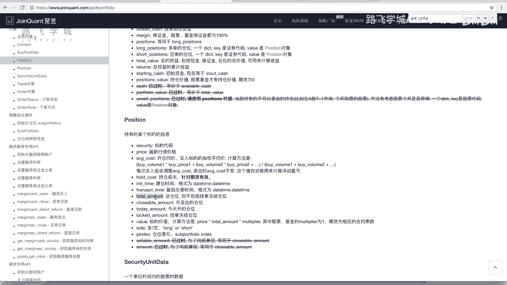

那点儿偷偷tot o t y amount，是你现在有。

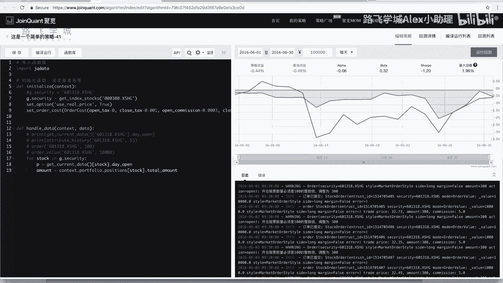

就是这支股票有多少股，持有多少股啊，那除了total amount，我们可以看到这还有一个closable amount，这是啥可卖出的仓位对，这叫可卖，所谓所谓仓位其实就是数量，就是股票数。

但是我们叫仓位啊，就是能卖出多少股，那这两个有什么不一样的地方呢，我们给大家也说了，是因为我们有T加一的制度，如果说我这只股票之前有300股，我今天买了100股。

这个时候我的总仓位就是total amount是400，但是close one closable mount只有300啊。

那在这儿，因为我们是要获取它是不是持仓，所以我们这儿要选TOTOM，OK吧，好among都选出来了，好这个时候按照我们之前说的，如果我们什么购买的那个价格低于十块钱，并且不持有这支股票，也就是说什么呢。

P小于十，并且amount等于零，我买这支股票对对不对，那关键是现在问题来了，我们这可以直接这么写啊，如果P什么小于十，小于等于18。0，并且amount也等于零，等于哎等于零。

那我们就买这只股票好order，然后第一个传股票代码是stock对吧，第二个关键问题在于买多少钱对啊，买多少买多少股或者买多少钱呢，这个怎么算，这个不太好算，那我们比如说现在你可以大家可以随便给。

比如我就买100个，或者我就买1000股都可以，对对对，你这样写没有问题啊，但是更常见的一种做法是什么呢，就是我尽量的把钱都买进，或者拿钱拿去，钱的80%都买进去。

那这个时候因为我的股票是不是300只股票，我要考虑说怎么把钱分给这300只股票，对吧，那我比如说我这周我这些钱我想都花出去都买，都放到市场里，都都去买股票OK吗，那我这个时候实际上是把什么呢。

是把这10万块钱平均分，平均分给我要买的那些股票，对不对，那怎么就是怎么着，我就是要买这些股票了，怎么着买这些就是我怎么把钱分给他们，我是不是要算我现在有多少钱，再算一下什么呢。

再算一下现在我要买的股票数有多少，我现在360块，但是360块我不是都买对，假如说有20，就有100只股票，我要买，我是不是要把10万块钱送给这100只股票，平均分给这100只股票好。

所以现在我们这么写怎么着呢，我们存一个什么呢，我们存一个，to by的数组，按列表，这个列表存什么呢，存我要买哪些股票，可以吧嗯好，如果现在价格小于等于十，并且不持仓，那我不是直接买，我怎么样呢。

我to by点append stack stock，ck好哎sorry，stock好，那这个时候这个for循环执行完了，我是不是说我要买哪些股票就算出来，嗯好，那我现在说每只股票给分多少钱，分多少钱。

我现在是不是就只算我现在有多少钱，然后把这些钱平均分给这些股票去啊，那我现在有多少钱呢，得多少钱。

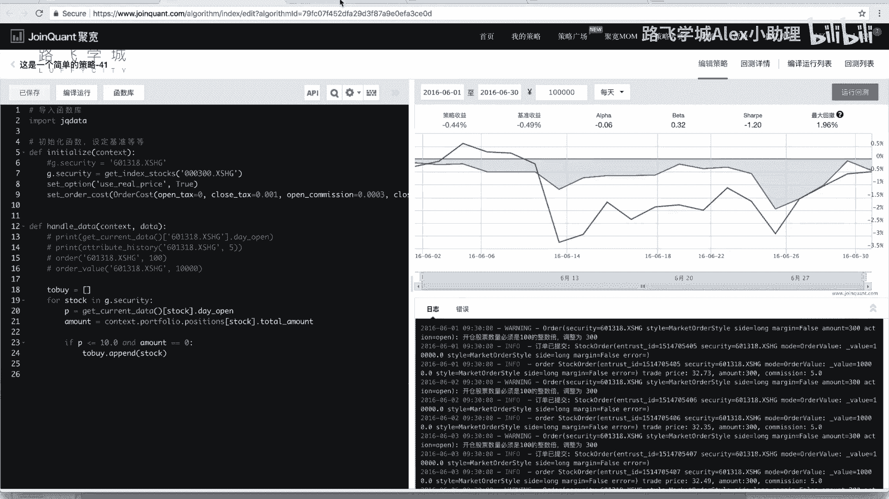

是不是还是可以通过那个hot for，六点available cash可以获取。

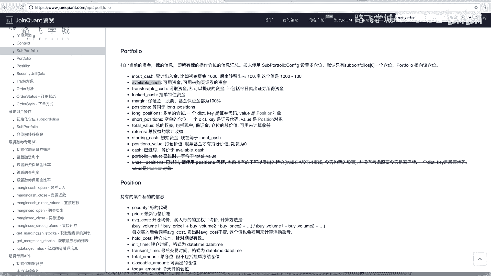

是的对好，所以现在有多少钱是context点，点available cash，这是你的钱数，对不对，好除以什么呢，要买的股票数是什么，L的to to by的长度好，这个东西我们存成存成一个什么呢。

cash啊，per stock就是每股多少钱，每股给他分多少钱，随便写就是个变量嗯，就是每个股票给他分多少钱，然后接下来我是不是对于这里边的所有股票，我都买对啊，好从for stock in。

这不是in这点security了，是in什么呢，是in我们的to back对吧，那怎么样order什么，我们这直接用order value是不可以，因为我们现在是不是有有钱了。

就是买多少每个股票买多少钱的嘛，这不买这些钱的，所以我们这是不是stock cash per，Stock here，就是这支股票每只股票都买这些钱的，对不对，对。

你这个是这个时候是不是用order value更简单一点，如果你要order的话，你还要算是要买多少股，对这我们就不用算了，让这个平台帮我们去算好，那现在我们这个买的操作基本上就OK了。

就买的操作就OK了，那现在还有什么两个卖的，对两个卖怎么怎么怎么样去卖。

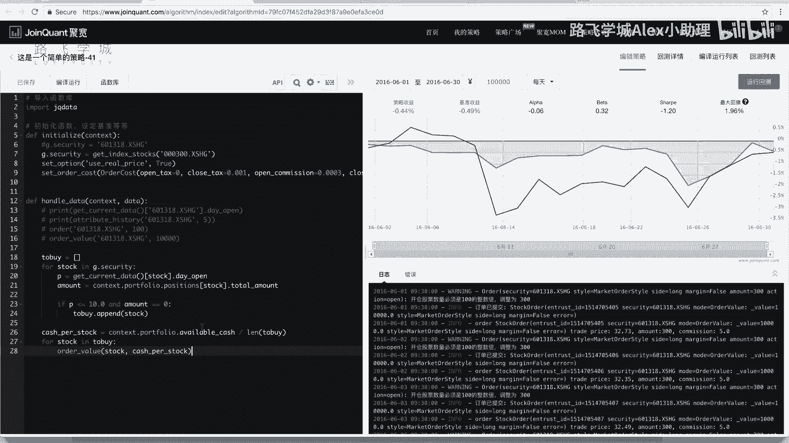

那怎么样去卖呢，指明如果买入，就是当前的价格，比买入的时候涨了25%，清仓止盈，如果当前的价格比买入的时候低了10%。

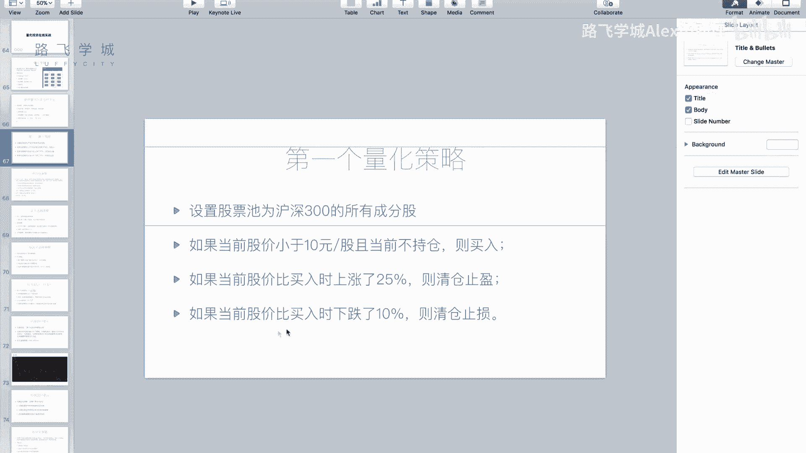

清仓止损好，那一般来说就是我们这个HANDITEI，都会有买和卖，那就是有一个最常见的问题，是买写在前面还是卖写在前面，买写在前面，妈是先买后卖还是先买，先卖后买，先卖吧，对一般情况下我们是先卖的。

为啥因为卖了的话会有更多的钱来买，对先好，所以一般情况下啊，我们这写一下，一般情况下是先卖后买，当然你说我也可以先卖后买，你没有没有具体查硬性要求啊，一般情况下对，先卖后后Y好。

那接下来就是我们这一段是买的部分，对不对，那卖的部分应该写在他们前面，就是应该写在这个前面就可以对，那这个时候看啊，我们还是就写在这，其实就可以，还是对于每一只股票吧，对于每一只股票。

我是不是现在算出来它的价格跟它的数量，那我现在就要算一下，他是不是达到了卖的标准就可以了对吧，那什么时候达到了卖的标准呢，什么时候就是当前的股价是P对不对。

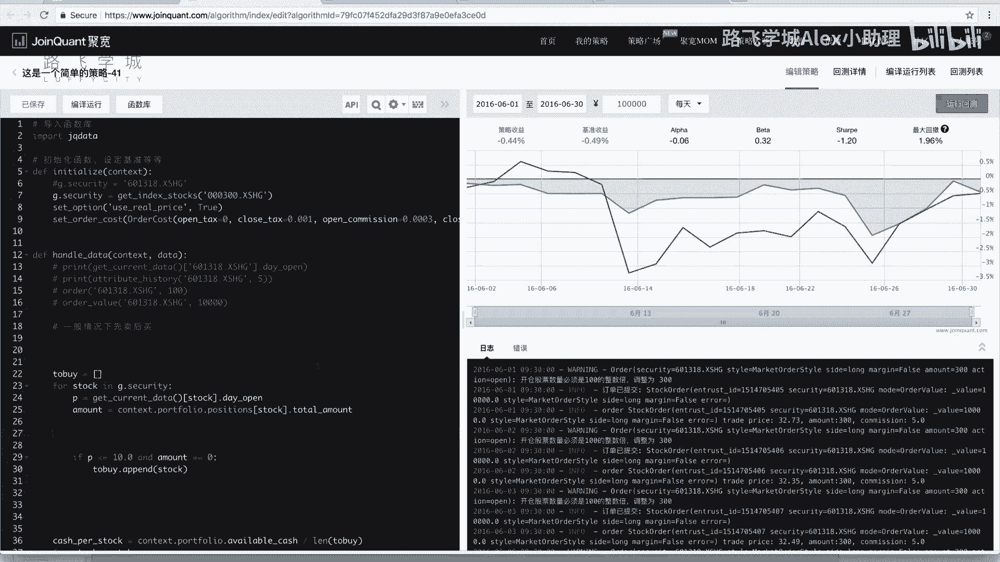

对比买入时上涨了50%，那这个买入时的价格平均吗。

刚才我们是不是也说到过了，对这个av的cost对好。

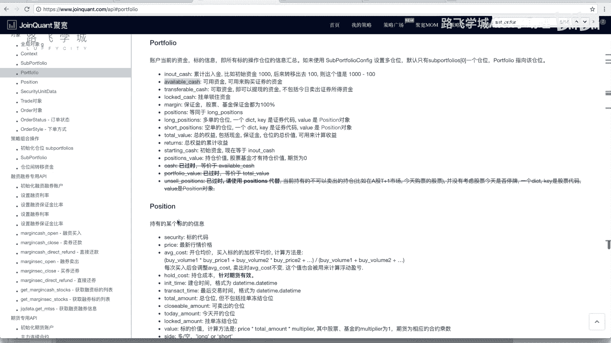

所以我们这儿再来获取一个什么呢，获取一个成本成本应该怎么说，成本不成本叫cost吧，code等于context点p value点positions啊，大家熟悉这个东西，这一套这三两个点三个单词经常用啊。

stock点点a v d cost，这个就表示是我我平均的持仓成本嗯，平均的这个不是平均的开仓成本啊，平均开仓成本就是说买入的时候花了多少钱，平均一五花了多少钱，对不对好，那这个时候啊。

如果amount大于零，是不是说明什么，我们现在对股票有持有这个股票对不对，好，并且什么嗯是止盈，就是比买入时的价格要上P分之25对，大于等于什么cost乘乘以1。5，25。2%对。

这是不是就是我当前的价格，比买入的时候涨了25%，那就怎么样卖出order平仓对，就是全部卖出嘛，全部卖出，我们这儿是不是用order target，简单对，直接security0全款买除，对不对啊。

不是security stock，sorry啊stock，然后这是不是300出，这是什么，这是止盈，对对对，平常，好还有一个问题是啥呢，止损N就比如止损下边了，还是如果amount大于零。

并且PP小于等于小于等于cost，下跌了10%的时候卖出止损，所以这是P乘以0。9对吧，所以这个时候是如果它小于cos乘0。9，所以它价值在10%以上啊，这个时候也是order。

target stock01啊，这个部分我们做的是，止损，好那到现在为止，我们的这个框架就是第一个版本的框架，基本上就写完了，好这个时候我们可以运行一下，看一下这效果。

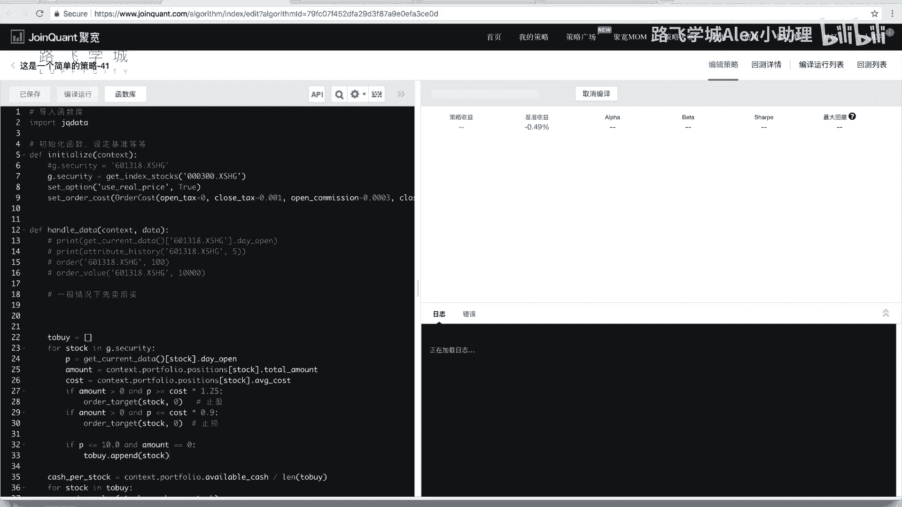

把我们这个这个时间稍微放的长一点。

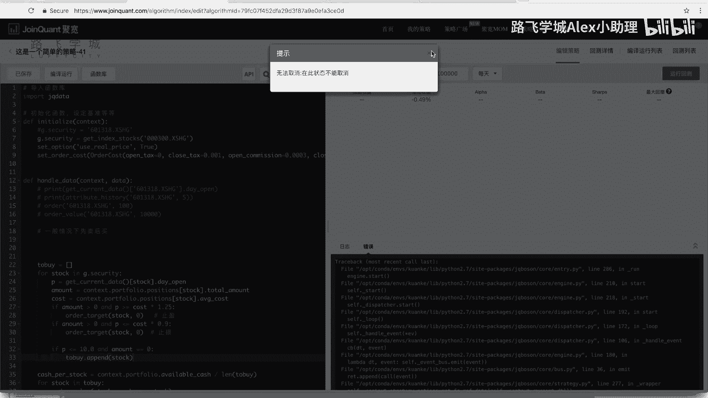

那时间是比如说从二零嗯放到08年，1月1号到二零，我们啊到到今天吧，我们来看一下，稍微跑长一点，大概17年6月1号吧，不要到今天了，好边运行，这个会诶，Amount，我是不是哪儿拼错了，IMO有问题。

这里哦拼错单词了，啊这个代码运行的时间会长一点，但是我们会看到他这个曲线会一直波动啊，我说不好，他是赔是赚，因为它这个策略并不是一个特别好的策略，但是反正好像有一点用啊，这个warning是啥呢。

这个warning说的是security在positions里不存在，就是我这个stock有可能不存在，这个position不存在于这个position里面，如果说我这个这个当前没有这个东西的话。

它会不存在里边，但是不存在里边，它为了兼容它返回了一个零式东西，没有没有问题，就是我的stock，如果我现在刚开始，我是不是什么都没买，嗯然后我看他这among。

因为你这个东西这个词dog并不在这position里边，所以它会返回一个直接返回零啊，如果说你要改进的话，你想不不报这个warning，你写一下是不是这个stock in context。

点PORTFOO，Portfolio，点positions，对啊，如果in再返回他的MOAMOUNT，如果不in你就返回零也行，它它自动也会给你返回的，好时间会长一点，你看诶居然还好，啊那我们趁此机会。

我们不等啊，我们不光在这等着它，我们再多说一点，我们来看一下我们这个代码，还有没有可以改进的地方，就是还有没有一些潜在的问题，有的时候就是我们这个你虽然写出来了，可能跑起来也不错。

但是你可能会出现一些小问题，比如说什么呢，我们之前说过T加一，对不对，嗯好这个时候看我们卖出的时候，amount大于零，这个amount大于零，有可能是今天买进来的吗，好像不可能嗯。

这个情况下是不可能among大于，就是说什么呢，我这个amount比如说现在是100，那这个100股是不是都能卖出去，我是不是能卖出去，嗯一般情况下，要考虑的就是这些常见的A股的一些限制。

在这个情况下都能因为什么呢，因为我这一天里只买了这一次，只买或卖了这一次没有说额，就是买卖了好多次的时候，所以这个among的肯定是要么是昨天买的，前天买卖去啊，暂时没有问题。

那再有一个就是我们刚才之前说的这个stock，是不是在persistent里边对啊，这要考虑喷的好，他还没有运行完哇，挺慢的，因为时间比较长，所以不会特别快，因为你每天都要获取一些数据嘛。

对这个时间会比较长，而且还是这个在线的一个东西，那我跑的时间也挺长的，你能看到一部分结果好，那除此之外，我们再在这再跟大家多说一点，这个红线是什么鬼，我们之前是不是都没有说过这个红线是什么鬼。

嗯你看这个里边写的这个横线叫做基准收益，对不对，基基准收益意味着我们这个initialize，里边要加一行了，加一行什么呢，设置基准set，我先写啊，benchmark奔驰奔驰Mark基准的意思。

然后这个基准比如说我们这写000300点，SXHJ好，这个基准收益是啥意思，这个基准收益是为了跟你的策略收益，来进行比较的，嗯是啥意思呢，我们说这个啊你的股票就是你的策略赚钱了，一定是你策略写的好吗。

不一定不一定，有可能是因为你赶上了一个运气牛市，对不对，你感觉一个大牛市你怎么买他都赚钱，你买着不动他都赚钱，所以就一直这个整个所有市场，所有股票一直在涨，你先买后卖肯定赚，先买后卖肯定赚，对不对。

嗯啊，所以说你赚钱并不是，并不一定是因为你的策略好，那你赔钱是因为你的策略不好吗，也不一定有可能是你这个市场当前情况不好，大熊市对，那所以说我们需要有一个基准来比较。

这个基准就是一个就是一个基准线来比较，说你跟这个基准，你如果比基准高，就说明你的策略还好，你如果比基准低，就说明你测要稍微差一点，那这个基准怎么定，你可以简单就是你那可以传一个股票代码。

你传一个股票代码，你的基准意味着什么呢，意味着是看我们现在是比如说一令，这是啊，这是哪年，是16年吧，这是16年开始了，比如说16年1月1号到17年12月，可以吧可以，那我的基准收益怎么定。

就假设比如说你这个里边是一个股票，代码是601318号股票啊，比如说，那你的基准线就是假定你刚第一天，把所有的钱买都买这只股票，然后一直拿着不动嗯，明白不动，然后你的这根曲线就是反映的是。

你拿这种策略来做，你的收益率如何哦，它实际上表示什么呢，就表示这支股票的涨跌情况给你一个基准，对他就是个基准，如果你这样设定的话，这个红线就表示的是，你这个实际上表示的是你这个股票的涨跌情况，对不对。

因为你刚开始买入，然后不动嘛，你指股票涨了你就赚钱，股票跌了你就赔钱，对不对，做对好，所以就是红线就是这么表示的，但是更多情况下，我们这不写一只股票，写一个指数，写一个大盘，比如说沪深300。

为啥写沪深300，因为首先因为我们整个选的股票池，就是沪深300的所有股票，所以沪深300跟我代表性，那我们这写一个大盘的时候，这个基准收益这根线是怎么来的呢，这根线。

因为我们的三沪深300不是有300只股票吗，这个时候就假设我们拿刚开始的时候，拿10万块钱平均买这300只股票，就这300支股票都买平均撒出去嗯，然后买攥着不动，然后就让他一直看是赚了还是赔了。

就这样哦，所以说你这个基准收益实际上代表什么，代表的是你这300只股票的综合的价格表现，对不对，如果说这300只股票就是你整个买的大概都涨，所以它就涨，它表示的是一个大盘的，就相当于是一个大盘的走向。

所以说基准往往大多数时候都表示大盘走向啊，你这个线你看我们这还好啊，大部分情况下蓝线都在红线之上，所以说我们这是基本上还可以勉强跑赢大盘啊，但是我们可以看一下，我们现在这是策略收益9。49%。

这个是蓝线的收益，就是最后一天我们这是16年跑到17年嘛，16年跑到17年蓝线的，到最后收益是6。9。49，你就说现在是一年的时间啊，赚了10%的钱，那还OK吧，不是很高，没有很好，就是稍微赚一点。

基本收益是10。5%，就是最后一天，你看最后一天的话，这个红线上去了，嗯嗯但是大部分情况下好像都是压住红线，就是这个策略虽然简单，但是好像不是很糟，就是还可以还可以啊，当然你要是说再说这个。

说全面的验证这个策略是不是好，你要是跑，就是你要所有的市场都跑一跑，比如说我们这16年到17年的股票市场，其实还可以啊，有兴趣的话大家可以验证一下股灾的时候，股灾最近的股灾不用跑太远。

08年不用15年的呃，1515年的五代吧，15年6月份的五代啊，你跑一下，15年6月份到17年到16年6月份嗯，你就会看情况会不好，但是你那个时候要跟还是要跟记者比，你是看他是赔的更多。

还是说呃这是赔的比大盘要少，对好，说了这么多啊，以上就是我们给大家讲的这个，第一个简单的量化策略的实现啊，啊希望大家自己能够练一下，然后这个有假如说你有一些啊函数啊，或者是数据的用法没有听清啊。

你们可以自己看一下API文档。

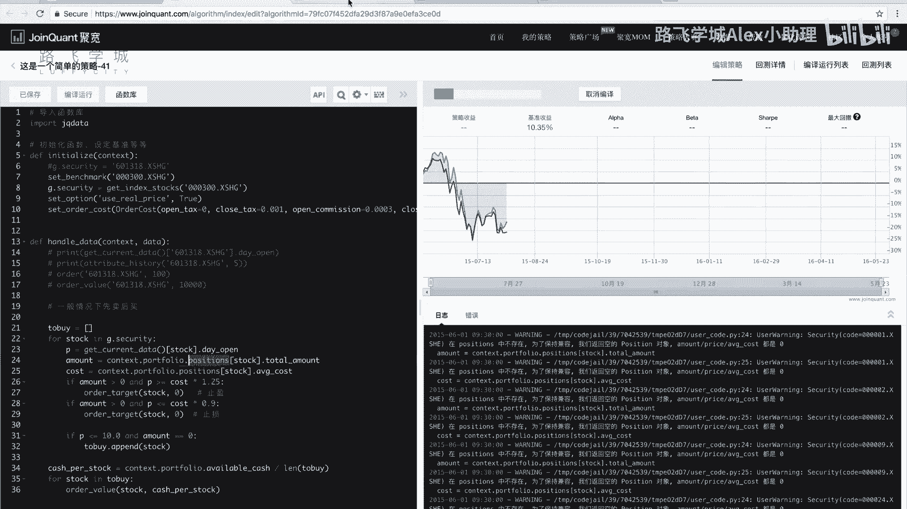

这个文档也是中文的，写的也还可以，就大概是一些数据的。

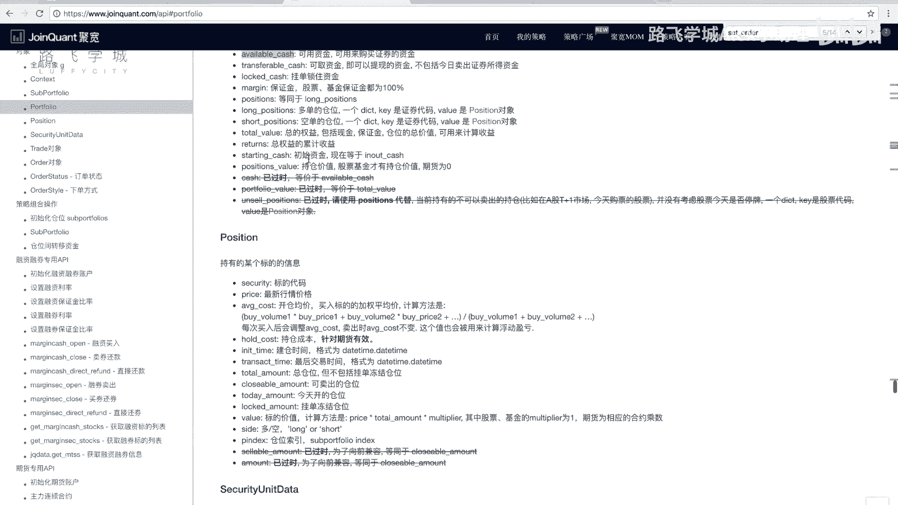

就是它表示什么都清楚的写在里边了啊，都很清楚，希望大家就是把这些东西掌握了一下，然后接下来我们就开始讲一些简单的，但是不是这么简单的了啊，是基础的金融量化，真正的策略是就是有一定科学道理。

不是这种拍脑袋想出来，虽然他实际上跑出来也好啊，那你看这个股灾的时候，也比大牌稍微高那么一丢丢，你就是没有亏特别厉害，看到没有，虽然还是亏的，你看整个还是亏的，但是哎这不行了。

应该跟大盘差不多嗯啊所以这个策略好吗，不一定啊，你要针对所有的情况，比如长线短线中线，所谓长线，短线就是你这个策略运行10年还是运行一年，你有可能指着它短线一年之内就赚钱。

也有可能说我长期10年之后能赚多少钱，这都有啊，适合于什么时期啊，适合于这个长线还是短线，适合于什么时期啊，都要完整的来测试一下，嗯好，那我们关于这个第一个简单的特点。

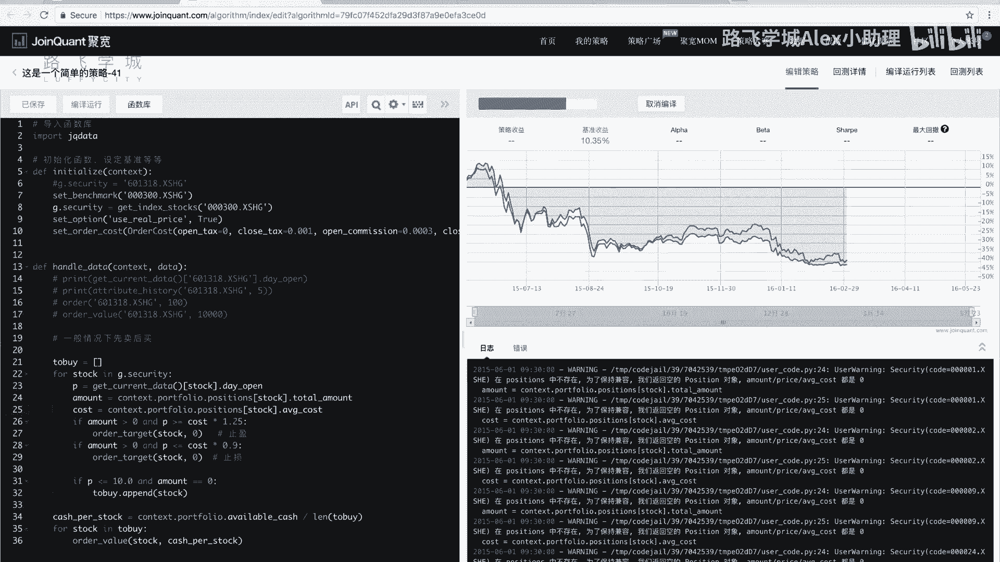