# 14天拿下Python金融量化，股票分析、数据清洗，可视化 - P4：04 Python基础知识（二） - 数分小诗 - BV1bFDSY9Ep5

。

各位同学大家好，欢迎来到华尔街学堂。今天呢我们来讲python基础知识的第二部分控制流。这一部分的内容呢主要是条件语句、循环语句、函数声明和调用以及内置函数的一个简介。那么在这里这一这一这一课呢。

我会重点的给大家介绍一下这个条件和循环语句。至于后面的函数声明呢，我也会给大家呃详细的讲解。那么内置函数的简介呢，我们简单介绍一下。那么条件语句的话呢呃很简单，这个呢为什么我说很简单呢？

相信各位都使用过excel，或者说只要是金融领域相关的，应该对excel都不陌生。paion的条件语句呢和excel呢如出一辙。那么excel呢，我们还记得都是if，然后如果给一个条件啊。

如果条件一为真则返回什么？如果条件2，如果条件一为假则返回什么。那么paion里面呢也是一样的。paion呢是这样的，它首先呢是一个if语句，如果有一个条件，那么如果这个条件为真的话呢，我们就做某件事。

所以呢是if一个condition，那么我们就do something。那么这个的话呢在我的讲义里都有，大家可以自己看一下，那么alif如果有另外的其他条件呢，也可以给一个条件condition。

那么这样的话呢就做某件事。

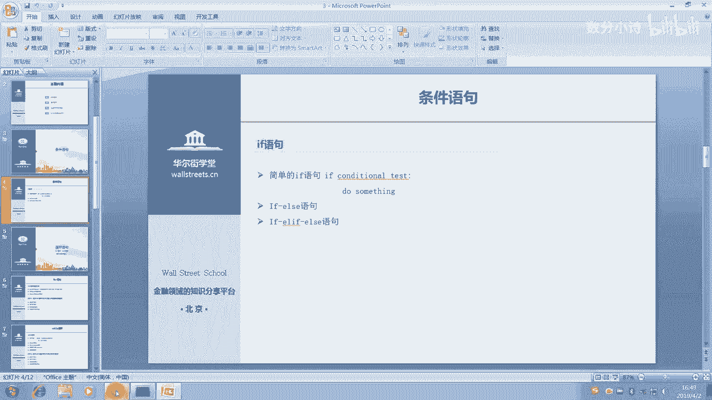

。那么或者呢你还可以继续al某个条件啊，我就不继续多写了。然后呢，或者说到最后呢。啊，这也可以 do something啊。然后呢，最后呢，我们看一下，如果你最后就剩下air，就是除了这些上面的内容。

其他的情况下，那我们do another do another thing another。do another好，我们不管了啊，这个地方我们这样子，但大家特别强调一点呢。

就是你这个所有的if啊alif啊这个模块后面大家注意了都有一个缩进，看见没？这个缩进呢，我们默认的是用tab键或者用4个空格来给它进行缩进的，大家这里千万不要错了，不然会报sintaxarrow的。

然后还有就是这个后面一定有个冒号，大家注意发现没有？只要你这个条件语句啊或者控制流的语句啊，后面都要有一个冒号。所以这里比如说如果我们没有这个冒号，我们是没有这个冒号呢，它绝对会报错的啊。

待会我们可以试验一下，或者下面的这个空格没有空好，也会报错的。我们先插入一个格子啊，我们来看一下进行一个判断。比如说我们要做一个呃判断，就是说如果啊我们现在X等于10，我们要做一个什么判断呢？

如果X呢比五要大，那么。我们就返回什么呢？我们做一件什么事呢？我们print print就是。这个数很大。我们回复这一句，那么注意了，如果说我们那么剩下其他情况呢，我们我们怎么样呢？我们就print。

这个数太小了，那我们可以执行一下这个代码。我们发现唉回复这个数很大，为什么呢？因为X是比五大的。同样的，如果我们这里是50的话呢，我们运行下呢，这个数太小了。好的，但是呢我们看这里千万不能丢掉这个冒号。

如果我们丢掉，我们发现sintaxarrow为什么呢？他就告诉我们这里还应该有个冒号，但实际上是没有的。如果我们这里。如果我们这里呢给它来一个空格的话呢，我们发现这里如果只空两格。

我们看这里直直接自动的就有一个呃红色的信号了。我们运行一下肯定也是要报错的。啊，肯定也是要报错的。我们运行一下。唉，但是这个地方呢我们发现其实python呢它这个jupyter内部识别了，哎。

你这个呃好像确实是有问题的，所以呢它就没有报错。但实际上呢在使用过程中呢，肯定会报错的。所以我们可以代码美化功能，你摁唉，发现它自动给你空好。所以呢这个代代码美化功能是一个非常好的一个工具啊。

我们呢if函数呢除了这样用的话呢，还有没有别的用法呢，其实也有啊，也有。我们可以结合这个用户的输入啊来判断你这个。

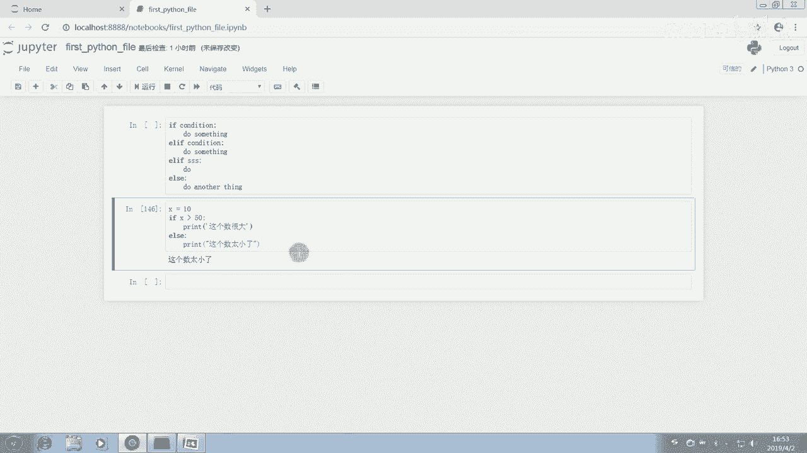

数是大是小。我们这里呢介绍一个input函数。input函数是什么意思呢？就是说它呢会提示在屏幕上提示你用户呢输入一个number。然后呢，我们根据你用户输入一个number呢。

它就会存储在这个X这个值里面。比如说我们这里。input这里面呢可以选择一个参数，就是说我们在input里面呢像呃输入一句话，比如please。enter a number。我们输入这样一句话。好。

那么运行以后会是什么样的？运行以后呢，就会在屏幕上呢就会出现这句话。please enterer a number。然后你enter以后，你如说我们运行一下，我们就在这里enter一个number。

enter10回车。那么这个时候呢，我们再看X的值呢，它就变成了10啊，就变成10。但是注意了这上面有双引有有有两个单引号，说明什么呢？说明啊这个时候的X呢，它实际上是一个。字符串，而不是一个数字。

明白吗？它是一个字符串。所以我们在使用的过程中呢，我们还要把这个转化成。整数我们直接把用整数的数字呃，整数的这个代码啊，int这样一个函数，把它转化成整数。

这样就把这个X符由这个字符串转化成了我们的一个整数。当然了，这里的话呢因为不是所有的我们输入的数都是整数，就以我们这里呢输入一个float啊，我们把它转化成浮点数。我们刚刚看了这个浮点数是float。

也就是小数。好，我们这样的话呢，我们再输入一个代码，比如10。2。这样运行以后呢。哦，sorry，我们这里呢运行以后呢。好，我们发现X呢会等于什么？X呢变成了。啊，这个地方呢我们刚刚是出现了一点失误。

它陷入了无限循环，这样怎么办呢？我们可以中断这个服务，中断这个服务。

好，然后重启这个窗口啊，我们重启一下。这呢也是在大家遇到问题中呢进行一个操作。我们发现刚这里呢应该是有的地方没有操作好，我们看一下。

首先呢X呢会等于input，我们这个地方你X输入一个，然后X等于 float X，我们运行一下，它会要我们输入一个number，比如10。2。我们回车回车。好，这个时候呢我们就知道X呢它会是10。2。

这个时候呢我们看它是没有用引号括起来的。所以呢这个时候的这个X呢，它表示的就是这样一个浮点数。好的，那么我们怎么样来根据用户输入做一个判断呢？那么很简单，我们这里就可以输入一个if。

比如if X大于20的话呢，我们现在改一下，比如下面我们不要呃enter number了，我们可以说enter your age。就是输入你的年龄年龄。如果这个年龄呢，我们先看。

如果这个年龄呢比呃假如比15岁18岁要小吧呃15岁要小。那么我们的回复是什么呢？我们就可以回复啊。你是一个孩子，我们可以回复这个。那么比如说我们现在呢往下。

那么al啊al那么我们注意了这个地方呢它缩进呢表示的是，如果上面这个成立，那么就实行这个代码快。那么下面的你alif当然不能再继续缩进了，为什么呢？因为你al和这个if呢是并行的。那么alif的话呢。

就是如另外一种情况下会怎么样呢？我们另外一种情况下，我们看一下另外一种情况下，如果X小于20。小于25吧，好吧，小于25。那么我们就说啊这个人是个青年print。你是一个青年。啊，这个地方打错了。

改一下啊。好的，那么我们再看，那么我们还可以来一个alif。那么如果这个X小于40岁，那我们就说那你是一个呃中年人嘛啊。大家注意啊，这个呃中文的冒号和英文的冒号是不一样的。

如果你用中文的冒号会出现sintaxarrow。你是一个中年人啊。那么呃我们这个地方直接用AS啊，就剩下的所有的啊啊如果这个地方不是大于40啊，是小于40。如果剩下的呢就是大于40岁的所有的人呢。

我们都认为呢他是一个老年人啊，你是你是一位老年人。好，我们现在呢运行这个程序，重新的运行这个程序。还要我们输入一个数字，比如刘老师，刘老师今年27岁，那么我输入这个27。好，那么他就告诉我刘老师。

你已经是一个中年人了啊，你已经是个中年人了。那么你还可以重新的运行一下这个程序。如果你今年的45岁，我们看一下啊，回复就是你已经是一位老年人了？好，作为一位如果说我的同学里面呢还有老年人的话呢？

那么你能来学python呢，我觉得也是非常好的。为什么呢？因为life is short，哎so I usepyython生命非常短暂嘛，所以我们使用python。Oh。我们接着看这个循环语句。She。

循环语句的话呢就是在。

呃，主要是分两类，一类是for语句，一类是wi语句。那么刘老师呢用一句非常简单的话呢给大家总结一下这个for语句的话呢是一个一般来说是有限的循环，是有限的循环。而Y语句的话呢，一般来说呢是不停的循环。

不停的循环，只要条件为针灸循环。那么很有可能会形成一个无限的循环。所以如果你要做无限的循环呢，你就去使用wire语句。如果你做有限的循环呢，你可以用for语句，你也可以使用Y语句。

但是Y语句的限定条件一定要给好。我们来看看它们的基本的格式啊。呃，我们现在来。呃，我们现在来简单的这个讲一下这个for语句怎么使用，好吧。

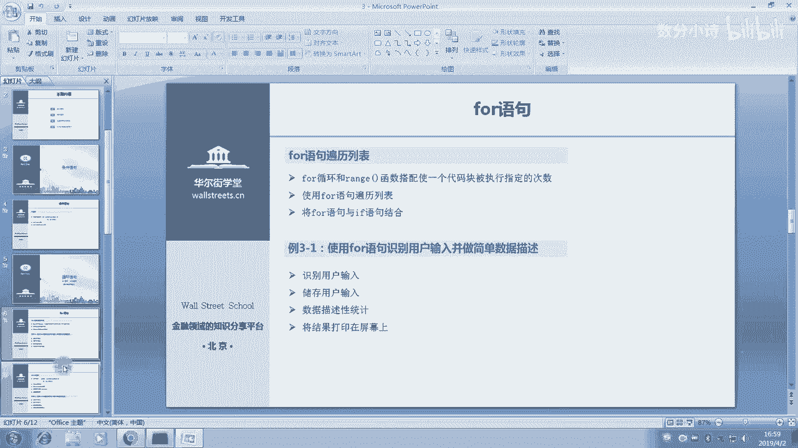

比如说呃我们现在呢希望做一个问题啊，就是说我们希望呢呃能够把。用户就是我们现在输入的一个10个数字，能够做成一个列表，打印在屏幕上。那么并且打印出这些数字的一个平均数，我们怎么来设计呢？

那么这样一个问题。那么首先呢我们要知道for循环是什么，怎么怎么来用。那么我们在这个for循环，比如forour。for一个这个地方，我们随便用一个字母替代这个变量，就for I in。

比如说是一个list。那么它的含义是什么呢？就是说啊对于这个list里面的每一个元素，II呢就代表这个list的一个元素，你可不可以用别的字母，可以，你可以用X，它只是一个代号而已。

它并不是说必须非用某一个不可。那么我们一般呢随便用一个，我们就用I for I呢in list。那么呢下面呢一样的do something。就说啊和我们的那个if是一样的。

只不过这里呢就是说啊对于这个list里面的每一个I啊，我都去做一件事情。那么现在呢我们就呃。结合我们上面那个判断，我们来做一个问啊问题。比如说。我们先给出一个用来存储数字的列表，列表是空的。

然后我们用一个可以计数的一个数字啊，一个计数的一个变量。我们用total来计数。那么我们对于啊这个地方我们介绍一个新函数rangerangech ten0的话呢表示的是什么？

表示的就是说啊0到9这9个整数，0123456789这10个整数。所以呢我们four I in range ten，它的含义呢，就是说对于range ten，也就对于0到9这10个整数。啊。

这个rangech这个对于rangech ten这个0到9这个范围内的10个整数。那么我们用什么呢？我们用这个。我们对他们每一个数呢都执行一遍这个操作。那么大家算一下是不是就执行了10次了。

执行什么操作呢？我们就可以numb equal input。我们这个地方呢还是像刚刚一样，我们把上面代码直接给它抄下来就好。Yeah。啊。

就你输入的这个numb numberumb就会等于这个imput的这个就是希望你输入你自己的年龄。然后呢呃接着呢我们看一下。接着呢我们这里就会说啊，就是说我们需要把它转化成浮点数嘛，对吧？

所以呢会有一个n number会等于fat number。好，我们把它转化成浮点数。然后呢呃我们这个地方还是统一用X吧，跟上面的变量一样。这样我们可以少写一些内容。都用訳す。好。

我们把后面的都粘贴过来都粘贴过来。然后怎么说啊，如果啊你这个小于15的话呢，呃当然我们这里的话呢，因为我们刚刚说的是我们要做一个呃求它的那个这10个数，要要把用户输入的10个数给它装起来嘛。

给它保存起来。所以呢这里我们要注意的一个事情呢，就是。我们这里要特别注意的一个事情呢，就是我们这个X啊，我们要把它装进哪里呢？装进这个number list里面。

所以我们用我们刚刚讲的append这个函数啊，这个append这个方法，就是说我们以这个number of list这个number list为对象。也就是说我们以这个列表空列表为对象。

那么每执行一次循环呢，就会把这一次循环里，用户输入的这个X给它append是我们添加到末尾，给它添加到这个列表的末尾啊，添加到个列表的末尾，那么就实现了我们这样一个数据的一个存储。接下来。

接下来的话呢呃我们还要做一个什么事情啊？我们还要做一个这个数据的和的计算，total equals totalal。虾。啊，这个X。这什么含义呢？

这含义就是说啊我每次执行循环是不是刚开始的total是零啊，零呢就加上了第一个X。那么第二次的时候呢，total呢。我又把这个total加X呢已经赋值给了一个total，也就说totto又改变了。

total呢这个时候变成了第一次的那个和。那么呢我在第二次循环到的时候呢，X就是第二次的值，第二次用户输入的值，但total呢是第一次的值。那么依次的循环下去，你发现呢。

它其实就是一个迭代的一个叠加的一个过程。那么这个的思想呢也是在我们这个编程里面呢最常用到的一个思想。那么这样子的一个循环以后呢，我们可以运行一下。如果我们输入第一个数是10。

第二个输入2312030201020，然后15。好，我们输完了。其实这个时候pyython已经计算完了。我们看一下total这个变量是等于几。其实它已经已经帮我们计算完了。

我们刚刚所有的输入加起来的total呢是149。那么我们刚刚的这个number list这个变量呢，它的一个呃这个list呢，它已经完全都保存好了，保存了一个浮点数的一个list。好。

在这里呢我们还想看它的这个呃这10个数字的和以及这10个数字的一个平均数。那么平均数的话，我们可以用命来表示，那么就是用total除以这10个数字就好了，对吧？那么我们把它们print出来。

为什么这个地方我要把这个代码快缩进给取消呢？因为如果你没有取消的话，你会发现在每一轮循环的时候都会打印一次。而我们只是需要最终的一个结果。所以我们把这个取消掉。那么在这里呢，我们输入元素之和为为什么呀？

我们。W， sorry， wait一下。为好。那么我们这里呢教大家一个这个format方法。什么意思呢？我们这里是不是创建了一个两个大括号啊，有点像字典的感觉。但是实际上呢这里呢是一个什么呢？

实际上呢这里表达的一个含义呢，就是说。实际上呢这里表达了一个含义呢，就是说我这个地方先空出来。但是呢我后面给个变量，给个变量。比如说我们给这个total。那么也就是说啊，实际上呢，在最后打印的时候呢。

python呢会把这个total呢放入这个括号里面，然后把这个括号给它消掉，也就放这个括号的位置呢，其实为这个format后面这个total留的。为什么我们要这样做呢？

这是因为啊如果我们直接把这个total放进去。这个total会被python直接识别为total，它并不是一个这个呃变量，而会被识别为是一个字符串，这样的话，打印出来就显示的就是一个字符串。

那么我们还可以打印一个元素平均数为。那么依然是用这个操作format。那么这个地方呢呃会等于这个命。那么我们这个时候呢运行一下呢，我们发现它会自动的打印出来。哎，这里报错了，这是为什么我们看一下。啊。

就是因为我们这边多了一个符号。好，所以大家遇到有问题的时候呢，就仔细检查，肯定是O的。并行一下。我们现在输入10个数字。好，它立马就输出了啊，元素的和呢是1167，160。7。

那么平均的元素的平均数呢是16。07。这样呢我们就结合了一个用户的输入啊，进行了一个输出。这就是我们这个。呃，for循环。那么大家肯定还会觉得呃在这里呢，我们其实还可以再给大家演示一个。

就是说如果我们有一个字典，比如刚刚我们那个贵州茅台的那个问题啊，我们那个呃我们再把那个问题给写一下。A这个元素呢会等于啊。贵州茅台。Yeah。那么比如说贵州茅台是840块钱，然后中国平安。

中国平安的话呢是78块钱。最后举这个例子作为for的一个例子，然后再有一个中国中信证券的。中信证券的这个股票呢，现在是20假设是2028226块钱吧。假设好，我们把这个给它输进去。这个字典呢就是这样子。

那么就对于什么呢？我们可以对于这个字典中的这个每一个的这个见值，我们可以把它打印出来。比如说我们还记得刚刚我们的建值是怎么表示嘛？forourK in就对于这个K in哪一个呢？A点。Items。

我们刚刚说了啊，sorry，这个A点ki啊，建的是keyA点ki这边可以自动补全的。那么呢我们把它打印出来print。嘿y。😊，那么我们只要点运行。我们发现它的key都被打印出来了，对吧？

那么这里呢同样的道理，大家可以ites。那么forKV in items，我们也可以把它打印出来，这个地方可以打印KV。啊，贵州茅台、中国平安，还有中信证券，它就被打印出来了。好的。

那么我们那个fo呢就讲到这里。接下来我们讲一下wire循环。wire循环的话呢，它是一个呃wire后面也是加一个条件哦，我们看一下。while呢也是一个condition test。

然后do somethingth。那么这个时候呢大家就要注意了，如果while后面的话呢，比如说我们如果是while to，那么我们就do somethingth的话呢？那么这是什么意思呢？

就是说啊w后面这个条件呢，我们跟着一个ch，也就是这个条件永远是对的。那么下面这个循环呢将被永远的执行下去，将被永远的执行下去，也就是陷入了一个无限循环。

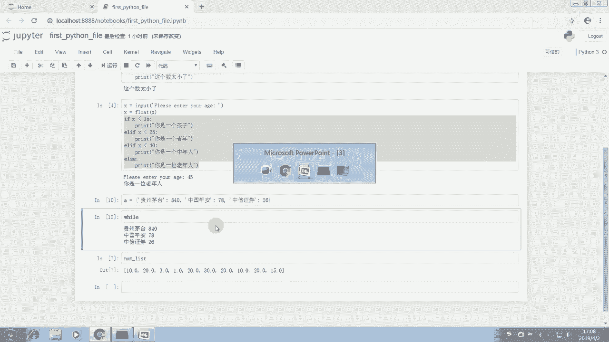

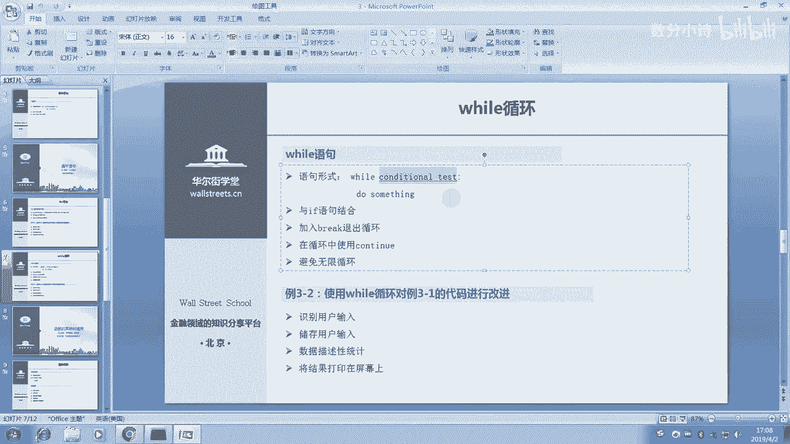

所以呢在使用的过程中呢，我们要尽量避免这种无线循环。而如果一旦出现这种无线循环的话呢，我们可以直接点这个重启终端啊，重启服务。是他这个停止下来。那么我们可以对上面的这个例子呢做一些改进。

可以对上面那个例子做一些改进。就是说我们依然是用上面的例子啊，准备好一个这个。准备好，我们可以依依然用这个例子，也是用让用户来输入一些数字，然后我们进行一个交互，计算它的平均数和它的一个总和。

比如说我们现在呢可以用这个无线循环，就while two。那么就是说当它是这个对的时候，但是呢因为我们这个condition大家注意外后面的condition它是一个ch的话。

它就会永远的执行这个下面的程序就不会停下来了。所以呢我们在这边呢就可以Y true。Thank you。那首先呢我们还是要像刚刚一样的，把那些呃给这个。储存数据的一些内容要给它留下来。

比如说number list，然后还有我们的total。那么这两个呢我们得给它留下来。那么玩 two就当是对的时候，那么我们这边这个数字呢就会等于用户的输入input。Please。

Enter a number。那么在这里的话呢，我们就让用户输入一个number。그。那么我们注意了，这个时候呢，就如果啊这个number呢会等于什么呢？会等于down的话。

也就是说啊我们这个地方先定义，就是如果说用户直接输入down，比如说用户输入完成的话呢，那么我们这里就用breakak这个条件呢跳出这个循环，也就是它打破了这个循环。而如果这个时候呢。

用户呢如果不输入这个的话呢，那么我们这个地方呢就可以进行一个操作，就把这个缩进给它取消。这个nm我们把它变成数字float啊，我们把它重新的呃转化成一个浮点数。

以及我们这个时候把它append到这个n list上面。我们把它给呃append，就是加到这个list的末尾。那么同时呢我们这个total呢就会等于total加上一个ow。

那么这个时候呢呃最后呢我们就像刚刚一样print出所有元素的和，我就不写刚刚那个文字了，我们直接写print totalal以及print这个X啊，not X print这个呃我们看一下元素的均值。

元素的均值就是total。除以10啊除以10。好，我们来运行一下这段程序，它要我们输入一个number。比如我们输入10，我们输入20，我们输入30405060。只要你不输入down。

它会一直的运行下去，那么我们输入80。好，我们现在呢输入一个down。好，你看它这个程序呢就自动的完成了。那么告诉我们这个总和呢是360，那么平均数呢是360除以1个10。当然呢。

这里不一定是10个数啊，对不对？我们这里除以10其实是有有一定问题的。所以呢我们这里呢要进行一个修改。我们这里要进行一个修改啊，怎么修改呢？

我们要是不是这个十应该改成Lance的这个呃n list的一个长度啊，我们要看看这里面有多少个数，然后我们才能确定我们最终这里需要有多少个这个呃除以多少算它的均值。所以我们自己进行一个运算。

当然呢后续呢大家也可以对这个程序呢进行一定的改变。那我们今天的话呢这个Y循环呢，我们就讲到这里。接下来给大家讲一下函数的声明和调用。函数的声明和调用的话呢，我们先讲函数的声明吧。函数的声明是什么意思呢？

就是说大家对这个函数怎么去定义它。那么我一般用DDEF这个来定义，其实就是define啊定义的一个简写。

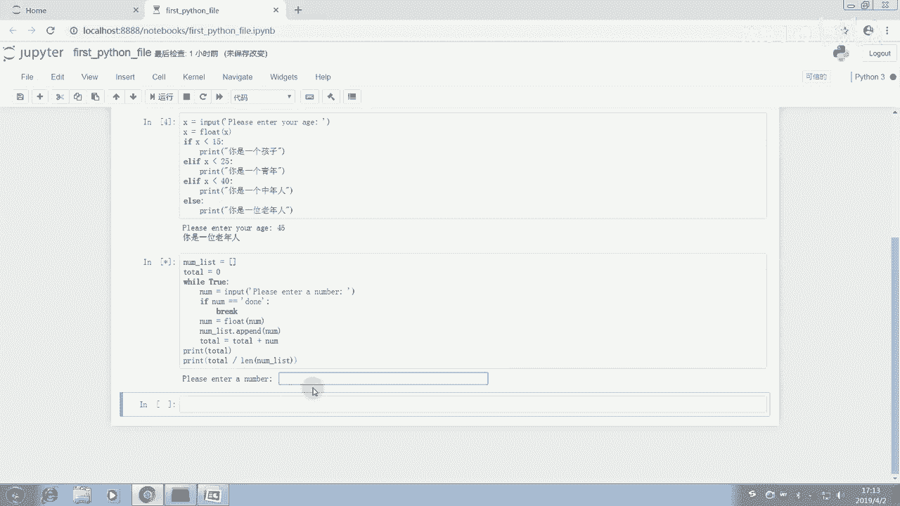

DEF我们定定义，然后呢跟着一个函数名字，比如说这个函数名字叫outdrech，我们定义一个刘老师的名字啊，这个函数是什么意思呢？然后我们打一个冒号，这样呢进行一个缩进。

也就是说这个函数啊定义呢就是执行下面这个代码，比如说print。

Hello。Outriach。我们执行下去。那么这个时候呢呃这个定义这个函数呢，它就完成了这个定义。Okay。那么我们接下来看啊，注意了这里的话呢，它其实这中间是可以有一个参数的。

但是我刚刚实际上在操作的时候是没有这个参数的。所以我们这个地方呢我们把它这个参数给它加上啊，把它给它加上。比如这个参数呢，我们假设是X。然后我们hello的话呢，这里呢我们就把给它改成helloX。

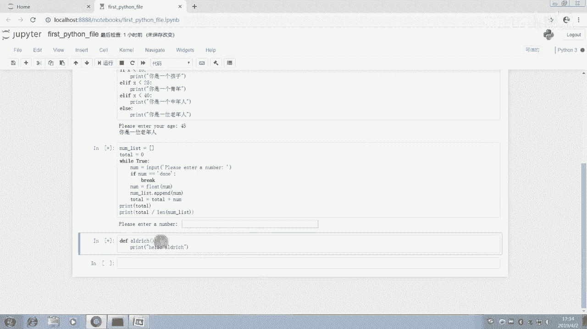

好，那我们运行一下这个程序啊，它已经运行好了。那么outreach的话呢，我们给它付一个，比如说我们给它付呃outreach我们付一个。呃，假设是我们付一个雷锋吧。好，我们出一个雷锋。

那么我们这边运行一下，这个结果就是hello雷锋OK所以呢这样这样的话呢，我们就相当于说你把你的一些常规的一些操作呢，我们封装在一个函数里面。当然这个函数到底是不是凭空想的呢？

它它不是它是你在实际的呃我们学员呢大家可以在实际的工作中啊，遇到一个什么问题，先自己尝试用python解决，解决以后呢，把这个代码呢进行保存，保存了以后呢，我们就对这个代码进行一定的修改。

把这个代码中要用到的外部的一些变量也好，外部的一些文件的也好，还是名字也好，我们把他们呃保存为作为这个函数的一个参数啊，对它进行一个声明。

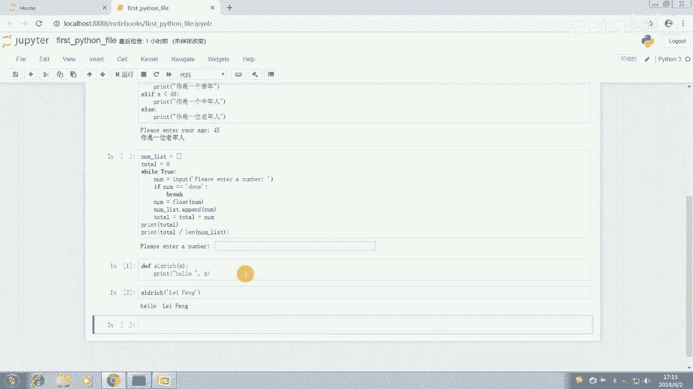

就可以了。那么声明以后呢，这个函数呢，我们就可以在这个呃你声明以后呢，我们可以在现在随随便的调用。也就是说你可以在对一个文件执行一个类型的呃操作以后呢，然后同样的用这个函数呢。

对其他的文件也执行同样类型的操作。

呃，至于函数的返回值的话呢，其实呢就是说啊这个地方呢，我们可以说它不一定是要print，它也可以是return。比如return一个呃199啊，1999。那我们就变形以后呢，它其实就是说你每执行一次啊。

不管你给X传递的什么参数，它都会返回给你1999。比如我们这边定义一个G会等于outri雷锋。我们看一下结果，这个G呢就是1个1999。那么同样的这个返回值呢既可以是数字也可以是字典啊。

也可以是列表啊等等各种的一个数据结构。那么。

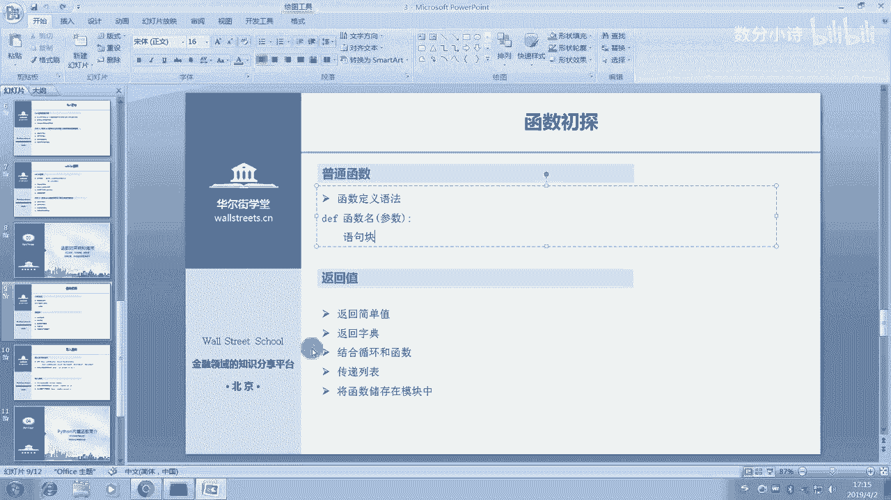

同样的，我们在一个循环里面呢，如果定义了一个函数的话，我们可以在一个循环。比如说刚刚我们说的for循环也好，我们说的w循环也好，只要你设计一个循环，我们可以不断的执行，重复执行我们这个函数。

然后以以达到你的一个呃机械化的工作需要重复的一个次数。

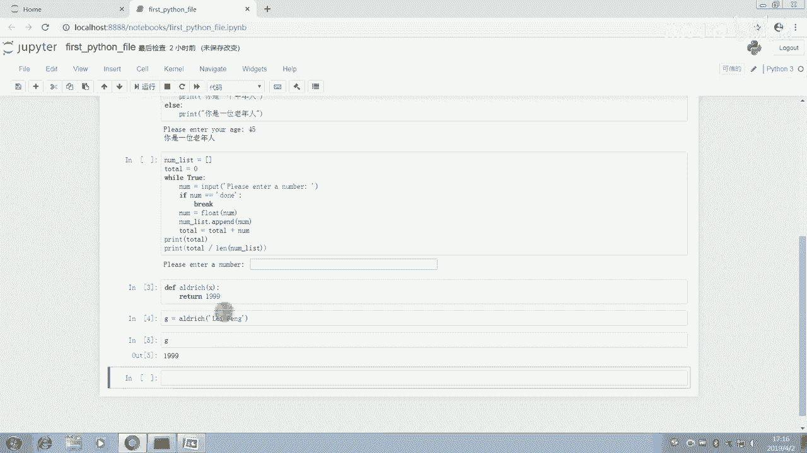

好的，那么我们再讲下怎么把这个函数封装成一个模块吧。pyython里面呢有很多那个第三方模块，也有很多内置的模块。那么关于个人的个性化的一个函数，怎么封装成模块呢？假设刘老师刚刚做的这个呃这个函数。

这最简单函数，我想把它封装成一个模块，很简单，我只需要把它单独的保存在一个文件里面，然后把它命名为点PY结尾啊，比如说我打个比方，我把它复制一下，我在这个jupiter里面。

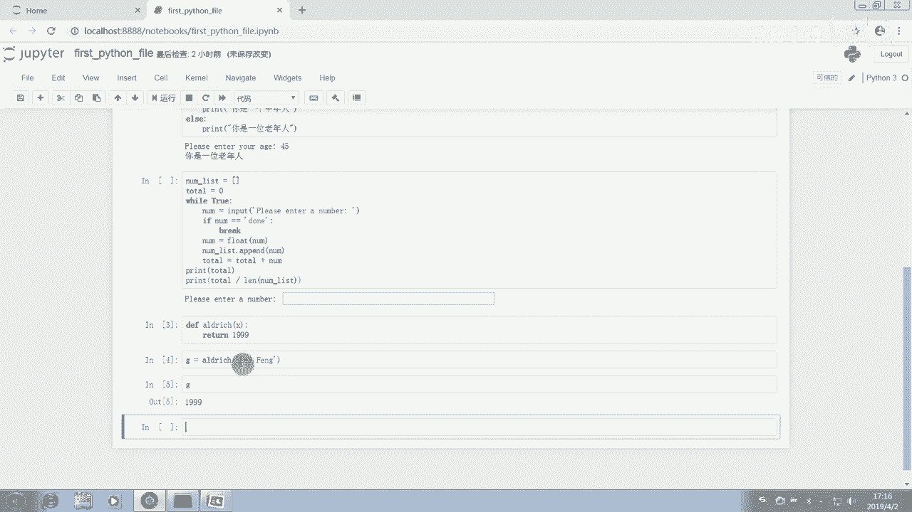

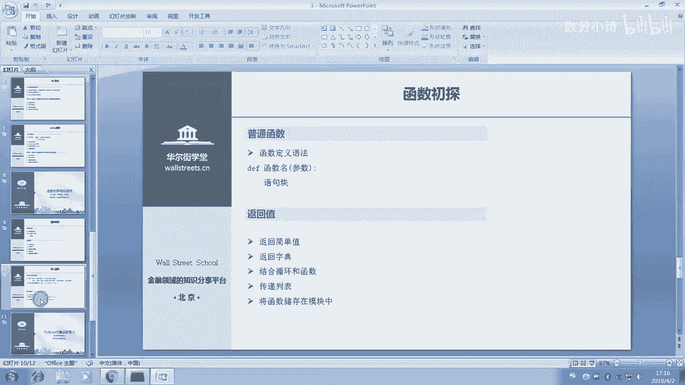

新建一个fipyy算re file。啊，我们给它新建出来了，那么我们把它给复制进来，然后这个untitle的这边是没有命名的，我们给它命个名，比如命名为。就域名为eldch。那么重命名重命名以后呢。

我们给它进行保存。好的，保存以后呢，我们把这个fin save as。

记得啊，我们把它保存为elder rich点PY。

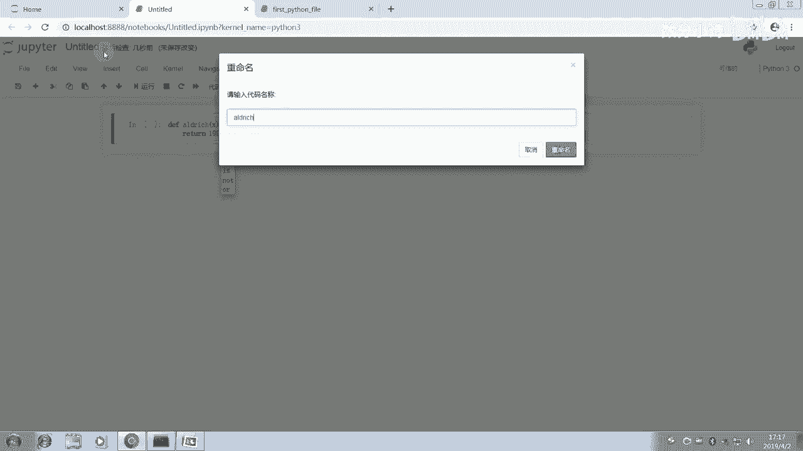

好， save。我们把它保存好了。那么这个时候呢，它就是一个呃python的一个fire一个out点PY的一个文件了。那么我们在使用的时候呢，就只需要在这边import它就好了。

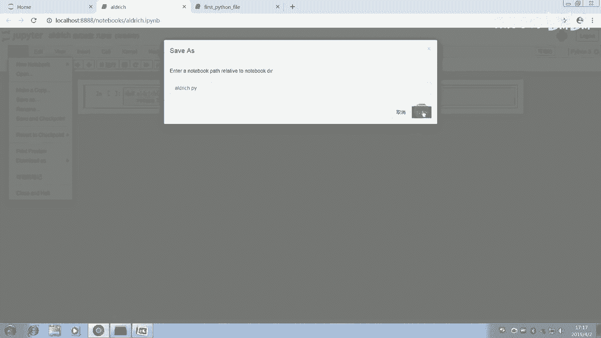

，Yeah。那我们现在去看一下呢，呃在这个里面呢就有一个elder点PY了。我们现在试着import它一下import elder。好，我们试一下inport这个。模块唉，它就已经引入了。

也就是说即使我们刚刚没有定义这个，我们也可以直接使用这个al reach，我们可以直接al的这个任意的一个数。比如SK，我们可以运行一下，它其实就会返回。哦。返回一个相关的内容，可以看一下。

这地方呢出了一点小问题，出了一点小问题。啊，我们刚刚调用函数的过程中出了点小问题，其实是因为这个。我们import了，我们因为我们保存的这个outderach在我们这个呃文件夹里。

所以呢我们现在可以看一下我们这个工作目录下边啊，这里有个outderach。那么我们import的这个outderach呢，是我们下一次呢，比如说我们重启了这个服务。理论上呢，这个时候呢。

这个我们这个deefine我们这个定义的这个outreach这个函数呢已经是不存在的。但是呢我们可以直接的import这个outdreach这个函数包。那么也就是这个模块包。

那么我可以在这边调用outreach点out reachach。呃，比如说我们随便来一个hello，那么预期它输出结果呢还是1999啊，果然还是1999。因为我们之前的这个定义呢，就是不论你输入什么。

它都是1999。那么这个函数的话呢，我们在这边呢就是说大家要更注重的是自己的编程能力的一个提高。也就是说怎么怎么去把这个函呃程序先设计出来。设计出来以后呢，我们在想着怎么去把它给定义成函数。

之后呢再想着怎么去把它封装起来。最后呢就是我们封装以后呢，怎么去调用这个函数，让它能够呃批量的执行啊，或者说自动化的工作等等啊，包括后面呢我们会教大家怎么批量的就是怎么先从这个win的数据库里呢提取呃。

用我们这个代码呢提取数据。接着呢会教大家怎么把这个提取数据的过程呢，封做成一个函数。最后呢是如何把这个函数封装成一个模块，然后呢引用这个模块直接去重复的提取数据啊，批量的提取数据。

那么最后呢我们讲一下这个导入模块的一个固定。步骤啊，有一个叫import的一个方式导入。import pandas的话呢。

它就表示啊我们把这个padas这个模块的导入import pandas asPD这个是我们最常用的。就是说我们引入导入这个padas这个模块。但是呢我们给它重命名啊，给它一个取起一个简写的名字。

简简单点的名字PD这样呢我们在运用的时候呢，我们只需要。啊，在前缀PD点什么什么什么，那么我们就知道啊，我们引用的是pandas模块。那导入所有函数的话呢。

就from pandas import star。这个的话呢我们不提倡，为什么呢？因为它的效率会慢一点，因为它把模块的所有都导进来了嘛。如果你使用的模块一多的话，你把所有的内容都导进来。

它其实会变慢一些。那么import pandas这个呢也不提倡，不会那么简洁。所以呢我们用的最多的呢就是第二个import pandas SPD。那么python呢也有一些内置函数。

我们可以简单的看一下。那么我这边呢给大家一个pythons的官方python的一个官方文档。大家复制这个文件呢，打开来呢，就可以看到python的这个python的这个内置函数大全。那么有大概这些函数。

比如ABS啊绝对值啊，ict字典刚我们讲过float format啊，help help呢，就是你不知道一个函数怎么用，你就输入help，把这函数输进去。

可以进行一个查询inputint land list等等等等。大家可以课后自己实践一下。那么这个。如果有任何疑问的话呢，也可以看我给大家编辑的那个呃这个拍thon的一个教程。

大家可以看我给大家编辑的教程。这个在上节课也有说过，在我们的课程的课件里面。这儿有一个课程讲义，打开来以后呢，就是我为大家编写的我们这个课的一个讲义，大家可以看一下。

比如说呃我看一下我们这节课的话应该讲到后面了。我们讲到这个基础知识这儿。

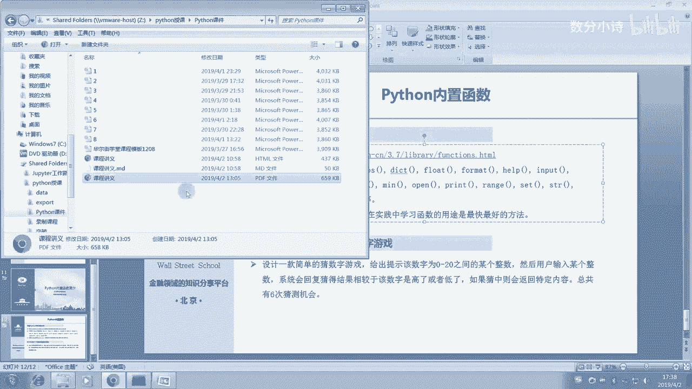

循环，然后包括我们这个呃YR循环等等，以及函数的声明和调用等等。啊，都给大家呃进行了详细的定义。这样的话呢大家课后可以好好的看一下相关的内容。

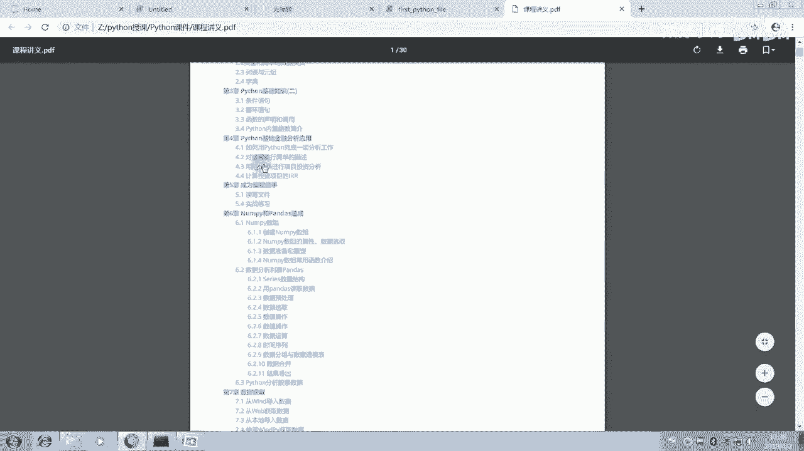

然后这儿呢有一个猜数字的游戏啊，我们的这个可以给大家课后的作为一个练习使用。那么我们在课上呢也介绍了一个利用python呢做一个描述性统计，以及或者说我们用python和用户之间进行一个互动呢。

我们在课上也已经简单的给大家介绍过了。那么在课后呢，大家可以结合这个例3。3的啊，以及我下面的示例代码的做一个相关的练习。希望大家多多练习。然后呢，这个自然的熟练度会越来越高。

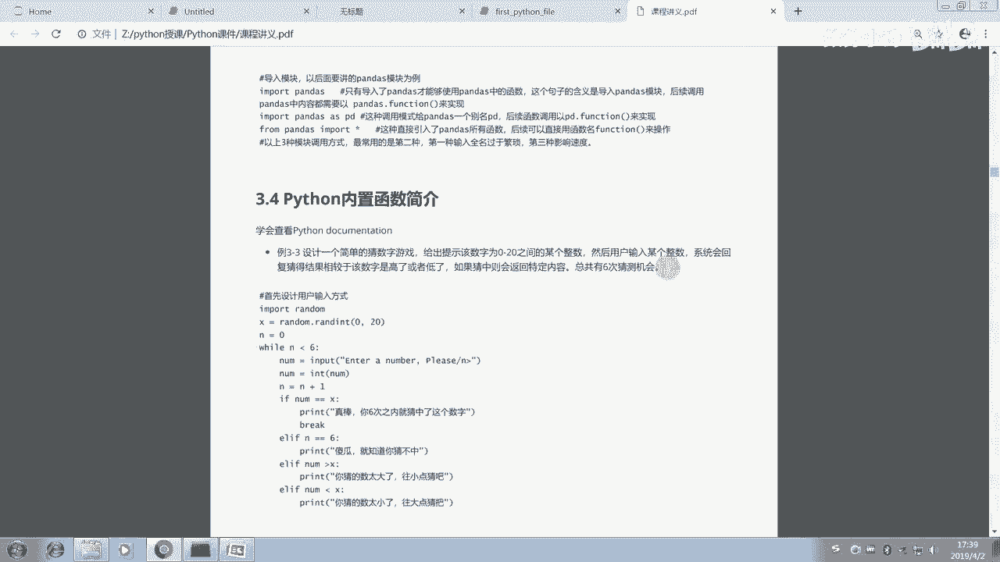