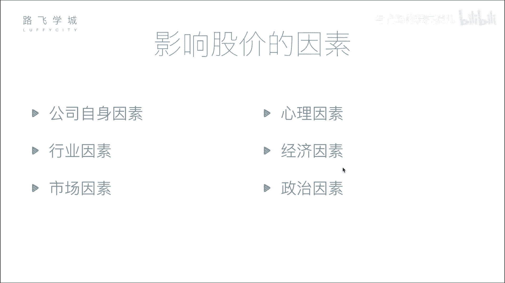
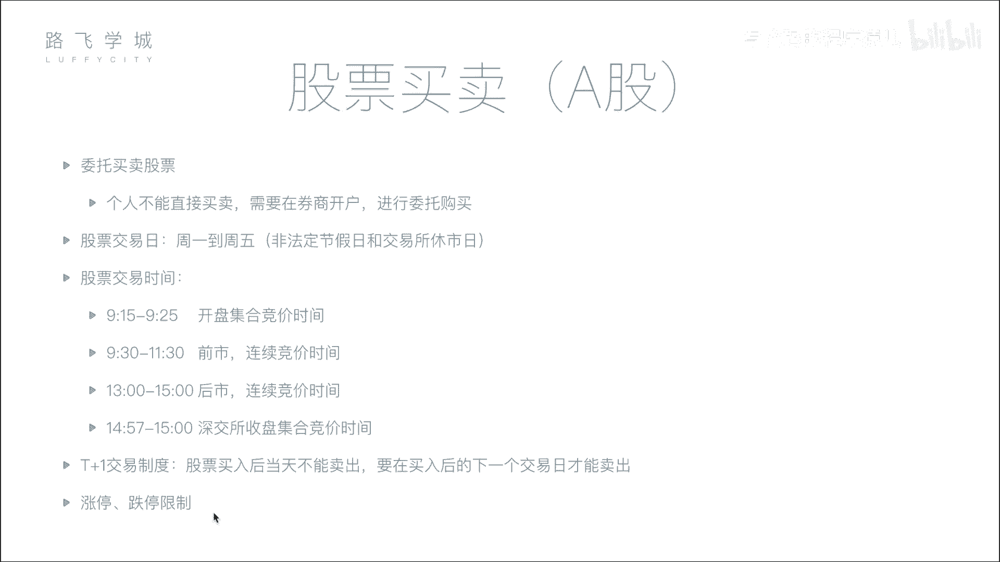

# 14天拿下Python金融量化，股票分析、数据清洗，可视化 - P4：04 影响股价因素&股票买卖知识 - 写代码的程序猿儿 - BV1YyyNYWEwQ

啊那接下来我们说一下这个影响股价的因素啊，我总结了一共是六个因素，啊，首先我们说影响股价最根本的因素，应该是公司自身因素啊，OK我这个先补充一下啊，就说刚才讲到一个IPO啊对吧。

就是你的相当于我们公司有钱了，比如说我们路飞啊，以后发展几年上市了，到了这个证券市场上对吧，证券市场上呢，那首次发行相当于你要给他定一个价格，对对不对啊，叫公开首次公开募集价格，那比如说啊。

我我觉得我这个公司最终客观的评价之后，得到了包括这个公司市值是啊，50亿人民币对吧，50亿人民币，那你要在这个市场上去卖，你不能指望这一个股民买了，你要想让更多的股民买，你就把它拆开。

是不是就把这个整个50亿市值，你分成很多份，让小股民也能买到，所以呢就是分成了多少呢，分成了1亿股嗯，50亿1亿股，那就一股就是五块钱，对不对，那相当于小股民就可以买嘛，我买1万股。

那就是5万块钱交给我对，是不是啊，那好，但是这个是公开募集的价格，当你今天这个小股民花，相当于啊五块钱买了一股之后，第二天它可能会涨，也可能会跌，对不对，或者再经营个半年，那我们这个路飞做的越好。

那他可能公司整个的市值涨到了70亿，那这个人的股票单个的股票就涨了嗯，是不是嗯，所以啊就会有相当于嗯，这个股票会随着我这个公司的经营状况，对它的价格而产生变化，对不对啊，也有可能一些其他原因，对不对。

比如说那这个呃创始人跑了，对不对啊，那我肯定会跑，我不是，那所以他会他也会，那那就相当于重大丑闻，股价就会跌，还有一些什么其他原因，比如说大家都不想去i it了，对不对，大家都想去学这个什么搬砖。

那我这个是预期的这个经营就会收益就会变低，对它也会跌，对就各种原因，所以你在这里是总结了那么几个原因，是吧啊，啊刚才ALEX也提到了我们这说的一些原因啊，首先我说第一个公司自身原因就是他刚才说的。

你这个公司运营的是好还是不好对，因为你股票的涨跌，其实相当于是啊，买卖的就是买的人数和卖的人数的一种，这个相互博弈之后造成的一种结果，咱们用下边市场也都会说啊，那为什么人要买你股票。

肯定是判断你这个公司首先营业要好对吧对吧，我营业额就我现在公司值一个亿，你假如说你公司现在发展的好，你一年之后能值两个亿，那我买你的股票真能翻一倍翻一倍对吧啊，这是公司自身因素。

就说是影响股价因素的最根本的因素呀，啊第二个我先跳过行业因素，我说市场因素，市场因素是影响股价因素的最直接的因素，怎么理解呢，你的股价长期来看是看公司的自身发展，短期来看看的是买卖的人数啊。

如果说你这个股票当前买的人多，卖的人少，相当于你股价供不应求，你的股价就会上涨，对不对，你联系一下，比如说咱们不看股票，买苹果，任何一个商品都是买的人多，卖的人少，就是供不应求啊，就涨价就涨价呀。

股票也是一样啊，买的人多，卖的人少就会涨价，同样卖的人多，买的人少，就大家狂抛就会跌价就会跌，对啊，我这个价格卖不出去了，说好多人都在卖，那我就降点价格，看看有没人买呗，对吧，就是这种你降我降全都降对。

全都降啊，那就整个就跌了啊，这是最直接的因素，就是市场因素，那还有些其他的因素，比如说刚才ALEX说的行业因素啊，大家都不想学it了，都去搬砖了，你这个行业发展的不行了。

你这个行业的可能相关工资这些股票都给定对，那比如说最近这个人工智能特别火，那我我也是我看着人工智能火，我觉得啊发展挺好，咱们投钱，可能好多人工智能相关公司都股票都涨了啊，最近确实好像都涨了嗯啊还有几个。

比如说心理因素，心理因素说什么呢，就你这个股民不冷静了啊，看到好多人都抛抛了吧，就是从众心理对吧，这是一种就是可能不理智，可能这个公司没那么坏，没那么可能，但是可能比如说有一个大股民。

他一块一口气抛了可能10万个啊，这小组面一卡，OK这个这个人家这个懂得都抛了，这么多钱都抛了，那我也赶快抛了吧，这心理因素历史上发生过好几次啊，曾经美国在八几年七几年，就是说有一个叫黑色星期五啊。

就是因为电脑交易出错导致了说一下子就下来，连续抛了好多的指令，就是就卖了好多的股票，那导致整个市场以为说会发生什么重大事件，因为股民也不知道一看什么大机构都抛开了后，这就导致直接就崩盘了啊。

整个市整个的这个纳斯达克的市值，就是叫什么来着，蒸发了20%多，就像一下子就前后全都没了都没了，对对好，那还有经济因素啊，这个也涉及到一些国家层面的了，比如说你这个国家当前的政策啊。

政策或者是包括我们说这个叫利率嗯，什么保证金率，就是一些国家的它的利率啊，或者外汇啊等等，这些都可能会影响股价啊，就比如说举个例子啊，利率涨了，股价怎么样，存款利率涨了对。

经济学上我们来推一下存款利率涨了会怎么样，会大量的钱都去存到银行一样，那你市场的钱就少了，市场上的钱少了，股票就就就就就就会跌对吧，跌还是涨跌跌嗯，但是一般啊也不一定有这个，经济学上就是好多说法。

但是市场中可能你要特殊情况特殊分析啊，那经济因素之外还有政治因素嗯，啊比如说这个前段时间就17年暑假左右吧。

6月份左右的时候，印度这个不是印度，这是那个美国嗯，呃美国跟朝鲜不是闹嘛对吧，朝鲜美国这个特朗普不先宣言嘛，然后朝鲜说啊，我不排除向关岛进行核打击的可能，然后美股就一落千丈，哼哼哼啊，然后到什么时候呢。

过了一段时间，美国那个发言人说了说啊，我们跟朝鲜是以外交谈判为主，结果他涨回来真的是一落千丈，就是这国家要什么要出事，对，可能跟朝鲜打起来，只要不稳定，那我钱存在套里上吧，我赶快取出来跑路吗。

那你取出来是吧，就是买就卖的人多了嘛，所以这次降策对，这是政治，并且要发生这个呃，就是这种军事摩擦的话，军工股肯定会涨啊，比如说朝鲜跟美国要搞事情，那你就会发现中国的军工股都会涨啊。

这这反正一些噱头性的东西，对对对，好了，继续看，这是影响股价的一些因素嗯，然后接下来我们说一下股票买卖的一些过程啊，过程或者步骤啊，刚才我们说到这个个人不能直接买卖，需要在券商进行开户。

你连接券商的服务器，然后对他进行购买，这个购买过程叫做委托买股票啊，所以说这是我们说的，你要在券商进行开户，然后进行委托购买好第二一个股票交易日，也就是说你的这个股票交易所，不是所有时间都开门。

不是说你星期天半夜12点打个电话，我要买股票，没有人理你，人家需要睡觉对吧，好股票交易日就是非法定节假日，一般来说是周一到周五，但是如果比如说11放假，他们也放假，就是你不放假。

股票就有股票交易所就不放假啊，那你放假他们就放假，当然还可能有一些特殊的时候它修饰啊，一般情况下没有啊，那交易日是这个周一到周五，交易时间也不是一天24小时工作啊，什么呢，一般来说是上午九点到下午三点。

那这整个九点到三点这一天的时间，我们可以把它分成几个阶段啊，第一个阶段我这没有写，九点到9。15，理论上来说开门了，但是他不做任何叫做竞价啊，什么是竞价呢，你这个我们说啊，举个例子。

你有1万个人想买股票，1万个人想卖股票，那你怎么一对一的进行买卖呢，因为你股票肯定是哎我卖出去，我股票给你对吧，那你1万个人和1万个人，股票交易所就要进行撮合，就是说哎谁买谁的，谁卖谁的。

你两两个他买成功了，他卖成功了，这叫做撮合，那一般来说这个竞价的过程是连续的，也就是说他可能560条应该是两秒或者三秒，买成一次，把这几秒内所有买的和所有卖的融在一起，然后进行撮合啊。

这个撮合的具体过程啊，暂时先不给大家细讲啊，这个过程叫做连续竞价，也就是说很快的就两三秒，错过一次，你就感觉自己如果价格定买，卖价格真的合理的话，很快就会成交，但是我们说9。15到9。25。

这个时间段不是连续竞价，目叫做开盘集合竞价时间嗯，什么叫做集合竞价呢，也就是说你从九点，实际上九点开始到9。25，这个时间这25分钟你都不会进行错误嗯，你买了啊，我申请买好，你就那个申请提交上去了。

股市先不管你到什么时候呢，这个交易所先不管你到9。25的时候，把这25分钟所有买的和卖的申请进行撮合，也就是说这是一次长达25分钟才撮合一次，嗯啊这个目的是为了什么，是为了出来这个竞价出开盘价。

今天的开盘价，今天的开盘价，就是你开盘就是集合竞价的那个撮合的价格啊，这个价格怎么定的，就是根本原则是让成交量最大嗯，啊就是你成交的数最多啊，具体的这个还要涉及到一些算法的功能啊，就是怎么实现的。

这个算法还比较复杂啊，你只需要知道需要让成交量最大好，那过了这个开盘集合竞价时间，09：30开始到三点都是连续竞价，就是三秒退回一次，两秒退回一次这种嗯啊当然对于深圳交易所，它有一个就是特殊的地方。

上海没有深圳，他后3分钟是一个收盘集合的大事，嗯后3分钟也是不撮合，就是57开始所有的提交的申请都不撮合了，到3年统一进行撮合啊，他是为了出收盘价，但是上海比如上海来说，他没有收盘，集合竞价。

它的收盘价就是你在你结束的位置，你的那个交易的价格就是收盘价，嗯啊这是交易日和交易时间的练习，然后刚才比如说我们刚才的这个T加一，交易制度和涨停，跌停的限制，我们刚才都已经说过了。

