# 14天拿下Python金融量化，股票分析、数据清洗，可视化 - P5：05 Python基础金融分析应用 - 川哥puls - BV1zkSgYZE54

各位同学大家好，欢迎来到华尔街学堂，我是刘老师，今天我们在上一讲的基础上呢，我们来讲一下Python在基础功能分析中的应用，上一讲呢我们讲讲解了Python的变量类型。

Python的变量的数据类型以及啊，比如说字符串呀，然后整数浮点数等，包括他们的计算以及相关的操作，那么我们还讲了Python的控制流语句啊，条件语句以及我们说的循环语句啊，for循环和while循环。

那么今天呢我们就在上节课的基础上呢，把之前的所有的知识融会贯通一下，那么讲一讲他们在这基础金融分析中的一些简，单的例子啊，及其应用，那么在金融分析里面，我们怎么样用Python完成一项工作呢。

那么首先呢我们要根据这个操作的一个顺序呢，对这项工作进行一个分解，也就是说啊，我们经常可能遇到一个比较大的一项，金融分析工作，但是呢我们可以通过把这项金融分析工作呢，分解成多个小的部分啊。

中间可能还需要一些辅助的工作，那么逐步逐个逐个的把这些小的部分呢解决，最终呢拼装成一个完整的程序，这就有点可能呃，大家都有经历过，比如用excel来做一个相对大型的一个项目。

也都是先把这个项目分解成若干个小的部分，那么对每一个部分的一个执行，然后最终呢把所有的那呃各个部分的结果呢，进行一个汇总，进行一个拼接，然后呢，哦做成我们最终的一个数据分析的一个结果。

那么现在呢我们想做一个这样的问题，我们要分析一个项目的L2，那么首先的话呢，我们要先知道L2它到底是什么对吧，那么它就是我们说这个净现值额，等于零的时候的内部收益率的一个收益率，就是L2。

那么我们现在要知道啊现值，那么现值怎么求呢，我们就会考虑到这个问题，我们就把它这个求I22呢分解为了先要知道，我们要知道现值怎么求，怎么计算，也就是计算现金流的现值怎么计算。

接着呢我们可以把这个现值啊和NPV结合起来，把它打包成一个函数，然后我们可以设计一个循环，无限的使得NPV接近于零，然后这个时候呢寻找那个I的值，那么就是我们所要找的这个IR2。

那么这样一个过程它到底是如何，我们如何去实现的呢，我们可以先一步一步来进行思考，首先的话呢我们是呃，先看一下如何计算一系列的现金流的现值，那么我们额还是带大家巩固一下。

打开这个jupiter notebook，notebook的一个步骤，首先输入这个anaconda，我们发现这里有一个aconda prompt，我们点一下。

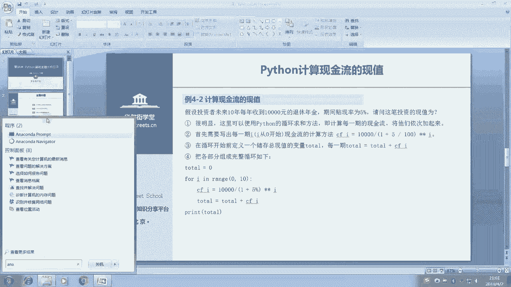

那么同样的跟上节课一样，在这里呢，我们先要额找到我们希望的一个工作环境啊。

我们知道这个呃刘老师的工作环境呢是在C盘，是在jupiter working pass，我自己创了一个文件夹。

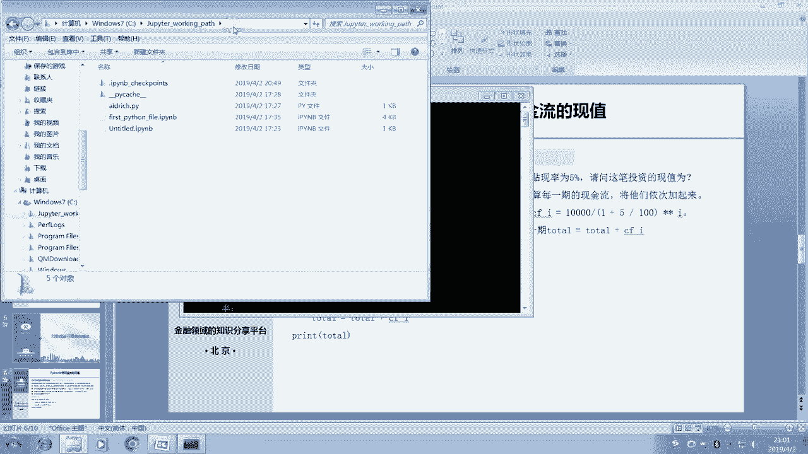

那么我们只要CD，然后这个复制粘贴一下啊，右键粘贴过来这个路径，那么我回车，等待他的一个登录啊，啊他现在已经到了那个文件夹，我们发现他的那个working pass已经改变了。

那么我们只需要输入jupiter notebook，进行一个登录，是那么这个时候呢。

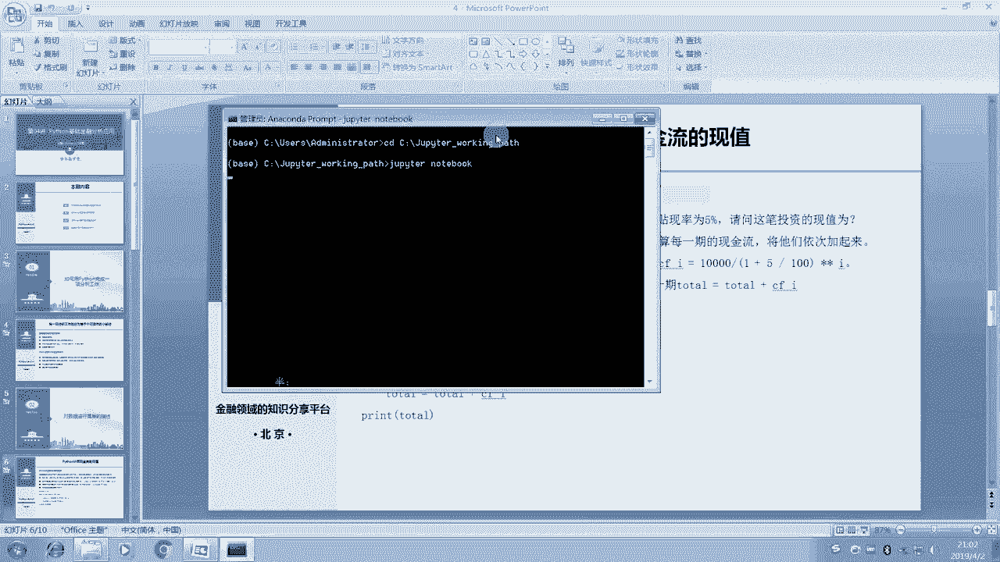

我们的jupiter notebook呢已经打开了。

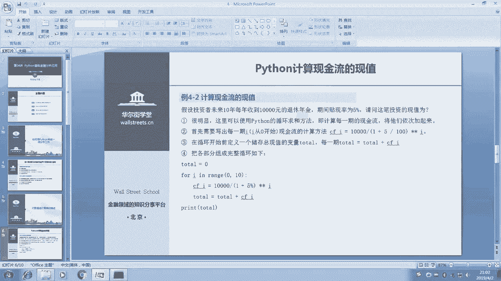

他正在打开好，我们发现已经打开了，在这里呢我们不再接着上节课写了，我们新建一个文件啊，所以这里有个on title。

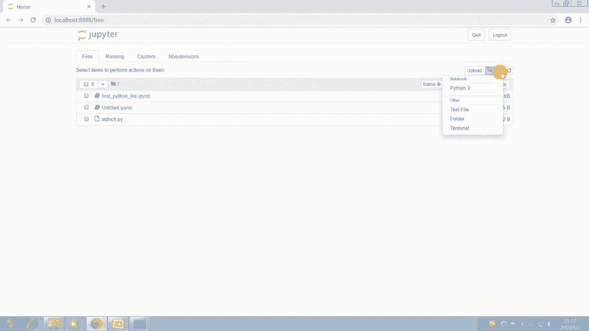

我们把它删掉，我们不希望这个呃，我们的工作目录变得特别的丑啊。

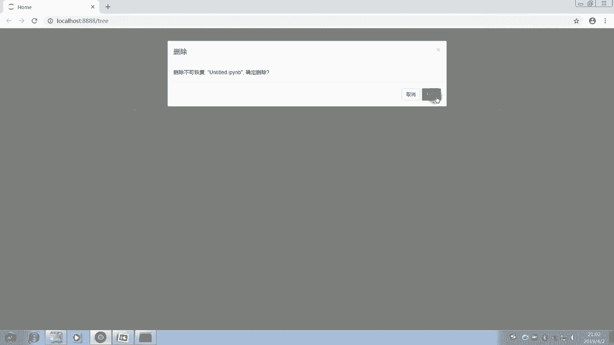

我们现在新建一个Python three的一个fire，那么新建出来这个文件的话呢，它是一个untitled。

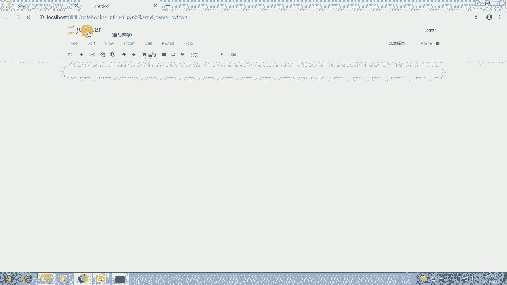

没有命名的，我们给它命个名，因为我们现在是讲这个第四章，那么我们就给它命名为chapter four吧，好那么对于这个chapter four的话呢。

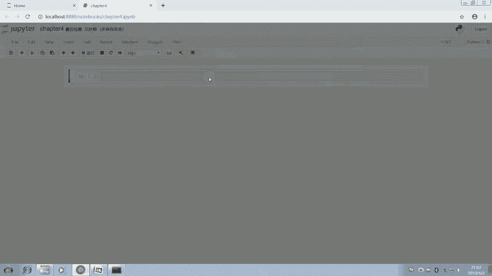

我们现在要做一个什么问题呢，我们看一下例4。2计算现金流的现值，他说啊，假设这个投资者未来的10年，每年能收到1万元的一个退休年金，那么贴现率呢为5%，那么这笔投资的现值是多少。

那么可能有朋友说这个很简单，我用excel也可以算没错，那么这是我们作为一个引用的例子，就说啊怎么我们怎么去在Python里呢，我们做一个先把这个最简单的搞定，然后其实我们是通过这个呢来回顾一下啊。

上节课我们讲这个循环是怎么样的进行操作的，那么在这里的话呢，我们这个呃我们这个程序怎么去写呢，我们很自然的想到用for循环。

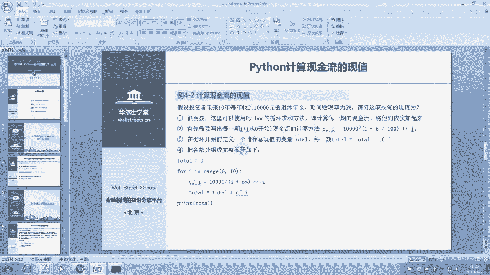

那么也就是for对于for i in range，我们想一下，一是10年嘛，所以我们这边就是range，Can，那么我们的每年的这个现金流啊，或者说每年的现金流的贴现CFI，CF杠I会等于多少呢。

那么就是每年有1万美一，1万元除以这个假设这1万元啊，我们假设他都是年初年年末给的，那么就除以一个5%，就是0。05，注意了，这里的话呢Python是你不能直接输入5%的，输入5%呢它会出现一个报错。

那么我们要改成0。05，把它做成浮点数的输入好，然后呢乘以一个这个I是乘以I吗，大家要想一下I不对，I是从从谁，从几开始，I是从零开始，这里的话呢，如果我们把I放进去，那么D我们当I等于零的时候呢。

也就意味着说第一期呢其实它是就是1万元，但实际上第一期我们应该用1万÷1。0，五的一次方，所以这里呢我们应该是I加上一个一啊，应该是I加上一个一好的，那么我们做这样一个问题，第一期应该是I加上一个一。

那么接下来呢我们要设计一个total，total是什么呢，total我们要用来存储总共的这个现金流的现值，那我们这里知道我们要设计一个初始值，它的初始值是零，那么这里呢就是我们上节课讲的一个啊。

非常重要的思想，就是你在每一期都在上一期的基础上，加上当期值，那不就做成了一个哦循环，使得每一期都能够求得之前所有期数的和吗，这个呢其实就是Python的循环的一个核心思想。

所以呢在这里呢我们把它们做完以后呢，我们只要给一个print，把这个total把它给打印在屏幕上就好，现在点击运行，我们发现也就是每年呢如果给你11万元，那么都在年末给未来10年贴现率。

如果是5%的情况下，这些钱贴现到现在，它的价值呢是7万7217元，那么很快的我们就给它计算出来了，当然呢你在这边呢可以考虑对它进行封装，把它做成一个函数啊，我们简单的讲一下怎么封装吧。

首先要define，我们定义一个discount函数，假设这个名字随便起啊，discount函数，那么接着呢我们把这个total total的话呢，是我们在这个函数里面定义的一个变量。

那么total的话呢是在循环之外定义的，所以呢它是一个全局的一个变量，或者函数内的一个全局变量，那么我们先不用管什么是全局变量，总之呢这个total呢，我们是要在循环开始之前就要定义好，对不对。

它跟循环呢其实是没有关系的，就是说它的初始值是跟循环没有关系的，初始值都是零，那么对于I呢，在range ten这个时候呢，我们就知道这个ten呢，应该是一个额外部的一个参数。

也就是说啊你这个年金到底给多少年，所以我用这个ten我们可以用N来表示，是一个整数，那么每年给多少钱，这个1万呢应该也是一个这个全局变量，我们用CP来表示啊。

Cash flow per per year，然后呢后面的话呢，这个贴现率呢应该是也是一个外部变量，我们用R来表示，这样一来的话呢，所有的外部变量呢我们都把它给换成了参数，换成了字母。

那么我们把这些字母呢填进这个函数的，这个参数的框框，这个后面的括号里，那么在真正的调用这个函数的时候呢，我们可以先把它运行一下吧，在真正调用这个函数的时候，我们只需要输入discount。

我们把这个N假设是20年，然后每年给1000元钱，然后贴现率假设是0。060。08，那么我们把它进行一个运行，我们就知道诶这样一笔钱的话，它的一个现值呢是9818元，那么这样就实现了我们的一个。

个性化的一个需求，那么如果你有很多很多个这样的限制，你只需要再设计一个循环，然后对这个函数进行在这个循环中进行使用，比如for i in range啊ten，然后呢那么把这个十个这个呃现金流给他啊。

不然后把这十个不同的这个参数啊，就不同的这个现金流把它给进行一个调用，我们就可以把这个啊批量的输出，一个现金流的现值了，那么通过这个的话呢，我们就需要大家着重巩固了一下这个，range这个函数吧。

着重巩固了一下range这个函数好，那么接下来呢我们想讲一下，就是说啊我们更进一步的去讨论，当这个不是说每年给1万，而是这个现金流在变化的时候，我们怎么去啊求出这个净现值来呢。

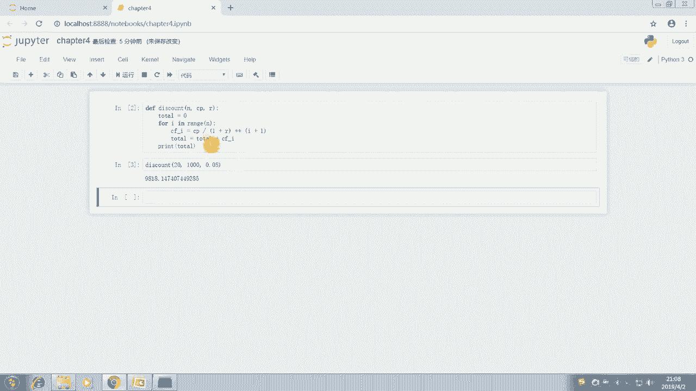

或者说我们怎么去判断一个项目值不值得投资，计算他的净现值呢，那么这样一个操作呢，我们也肯定是考虑通过循环来实现，好首先呢我们会想啊，就是说我们会首先肯定要知道，这个额项目的一个净现金流。

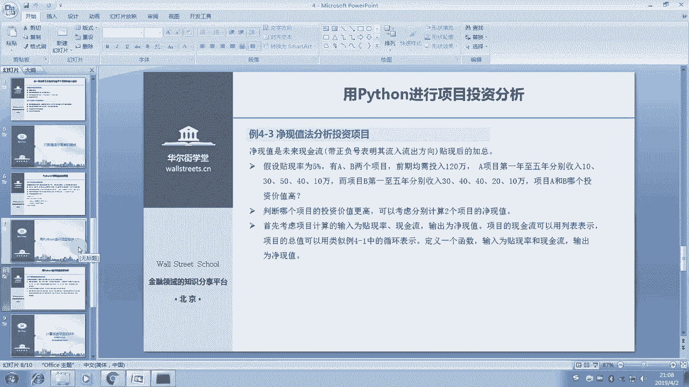

他的一个这个现金流的，情况我们把它们用一个list呢封装起来，用一个列表封装起来，那么A项目的话呢，它的一个现金流的情况呢，第一年呢是投资了120。

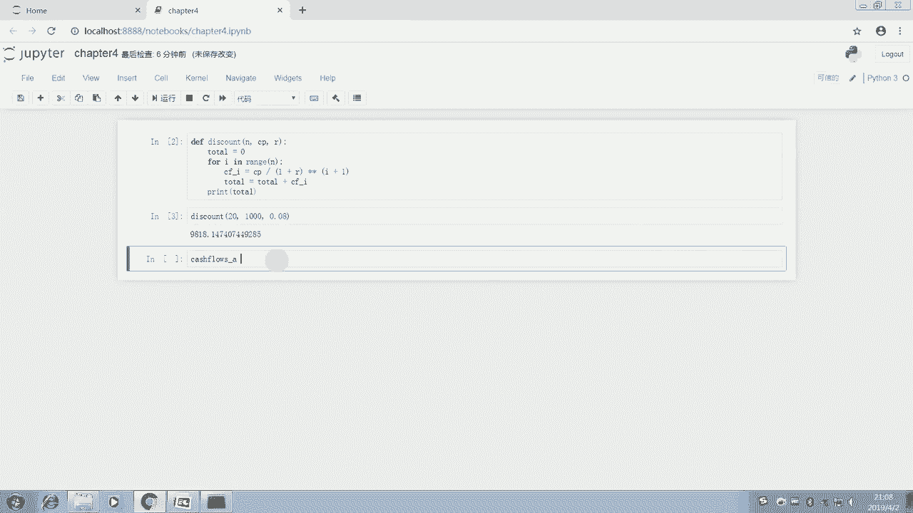

所以是-120万，那么第2年是十，第3年呢是30。

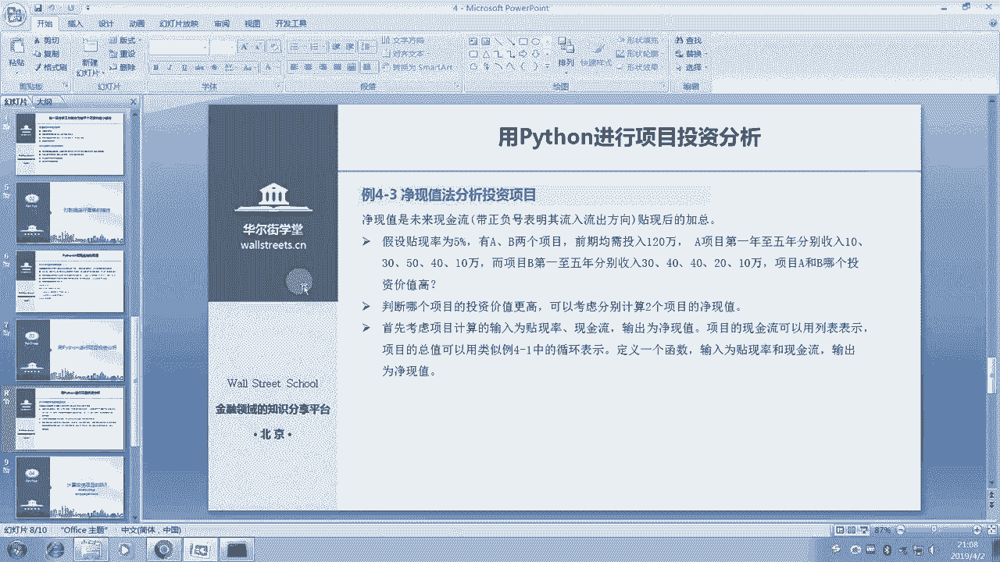

第4年呢是50，第5年呢是40，第6年呢是十好，它呢是一个这样的操作，期初是-120，然后往后呢是这样子的一个现金流，那么在这里呢我们介绍一个新的函数，叫enumerate函数，它呢是专门用来做循环的。

比如说这里我们for i cash flow in enumerate，Cash flows a，好大家想一下啊，我们看一下这个enumerate，它到底是个什么含义呢。

首先呢我们在后面加了一个list，其实enumerate呢它的含义呢，就是说我产生一个tuple，类似TPLE的东西，什么呢，就是对于cash flow的里面的每一个元素来说呀。

这个cash flow这个list，每一个元素我都会产生它的一个编号，以及这个元素的一个呃值，比如说对于-120的话呢，通过enumerate呢就变成了一个变成什么了，变成了零位置。

零的这个元素就是一个零，我们看一下它就会变成我用注释写在下，写，在写在下边，它就会变成零负一百二，然后呢一十，30这种，那么我们像之前我给大家讲过，我们对那个字典的一个for i for啊。

For k v in dict，点items很类似，这里的话呢i cash flow，分别对应的就是这个位置零和-120，那么也就是说啊，每一次的循环都是对这样一对啊。

比如说零对这个位置和这个数值进行一个循环，那么我们就很自然的知道，这里的话呢我们应该怎么去计算，就知道啊，这里的话呢，我们这个啊首先我们要定义一个total，我们不能把这个total忘记。

因为total呢是作为储存我们最终总的结果的，一个一个一个数值的一个变量total，那么我们接着呢就知道啊，所以呢总的变总的现值呢，近现值呢会等于上一期的净现值，上一期的total加上什么呢。

加上这个本期的一个cash flow现金流，那么我们这里也要注意了，这个时候呢是cash flow，而不是cash flow a啊，Catch flow，然后除以什么呢，除以这个一，加上我们这个0。

05的多少次方啊，那么这里是I次方还是I加一次方，大家要分清楚，这里呢就是I次方了，为什么呢，因为第一期是-120是支出的，第一期是档期，当时最早的一个时候就支出了，然后所以呢这个I等于零是对的。

最最早的时候这个120是直接支出的，然后往后每一期然后把它给贴现过来，就是这样子进行一个计算，我们运行一下，好sorry啊，这里要注意啊，这里我们也需要一个函数把它给print出来。

把这个total给print出来，还是需要明确啊，就是你代码缩进目的是什么呢，就是说对于上面这些条件呢，那么我们要执行这些代码，而最后这个print呢我们只需要执行一遍就好了，我们运行一下好。

最终的结果是0。66993，那么说明什么呢，说明就是说，对于我们这样一个项目来说，他的一个净现值呢就是0。66993啊，我们这个项目的净现值是0。66993，那么我们怎么把它封装成函数呢，思路也很简单。

也是一样的，我们定义一个计算NPVF的一个函数，那么它第一个参数呢，是我们上面使用到的这个rate，这个外部的一个折现率，第二个呢当然就是我们给的这个现金流。

当然我们这里不能输入catch flow a，而且要输catch flows，因为是对任意一个现金流而已，那么我们给他设计一个总和是total，接着是对于I和这个cash flow里面的每一个小。

cash flows里面的每一个小cash flow，对于cash flows里每一个小cash flow而言啊，我们每一轮呢这个total呢都会等于total加上，啊等偷偷加上我们这个天使flow。

除以一个一加rate，的平方额不是平方的I次方啊，每第I年啊，就是I次方，那么这里呢我们给它返回一下啊，对于这个函数，我们给它一个设置一个返回值，叫用return设置一个返回值。

就是说我们执行这个函数呢，它会返回我们这个total这个值会返回这个值，那么我们把这个函数给它运行一下，接下来呢，我们把catch flow a和cash flow b呢给它输进去。

cash flow a呢是这样，那么cash flow b的话呢，我们看一下是-120，第一年，然后三十四十四十二十十，-一百二十三十四十四十二十十。

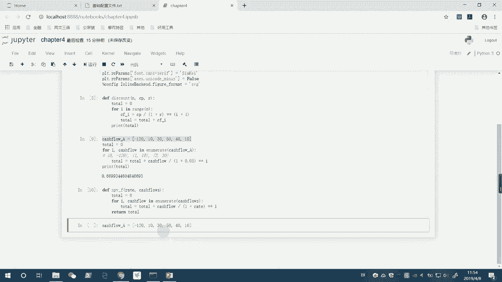

那就是这个情况，那么这里的话呢我们就知道了。

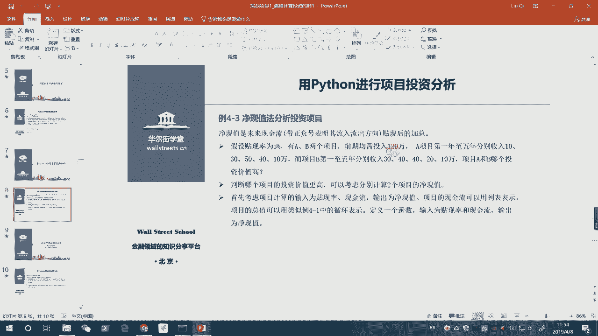

他们的净现值我们就可以知道了，那么因为我我我们刚刚设置的上面，这里不是print，这里设置的是一个return，所以它会返回一个total，那么我们可以就拿拿一个变量去接住，这个total好。

就接住它返回的这个值，我们就定义n p net，value a会等于NPVF的0。05，然后cash flows a，那么这里就注意了，我们把这个啊，上面定义的这个形式的一个参数呢。

改成了实际的我们需要用到的参数啊，这就是这个参数的一个设定，我们设定一个通用的参数，我们把它叫一般化，然后呢我们在特殊的例子里呢，我们可以把它变成特殊的我们需要的这个参数。

然后这里是cash flow b，那么我们这个可以运行一下，接下来呢我们把他们print出来，print一个net value a和一个net value b，那我们把它print出来。

发现呢这个net value b呢是更大的，是3。69，net value a呢只有0。6699，所以呢，我们选择这个通过净现值来进行投资的话呢，我们当然会选择这个投资项目B，而不会选择投资项目A。

我们会选择净现值更大的，这个呢就是我们定义一个函数，来求证净现值的一个求现金流，净现值的整一个个这个过程，这就是我们的一个净现值的投资分析方法，那么接下来呢我们再看一下最后一步啊。

我们如何去计算一个投资项目的L2，那么我们说L2呢是净现值为零的时候啊，它的折现率呢就是内部回报率，所以呢我们现在呢就考虑啊。

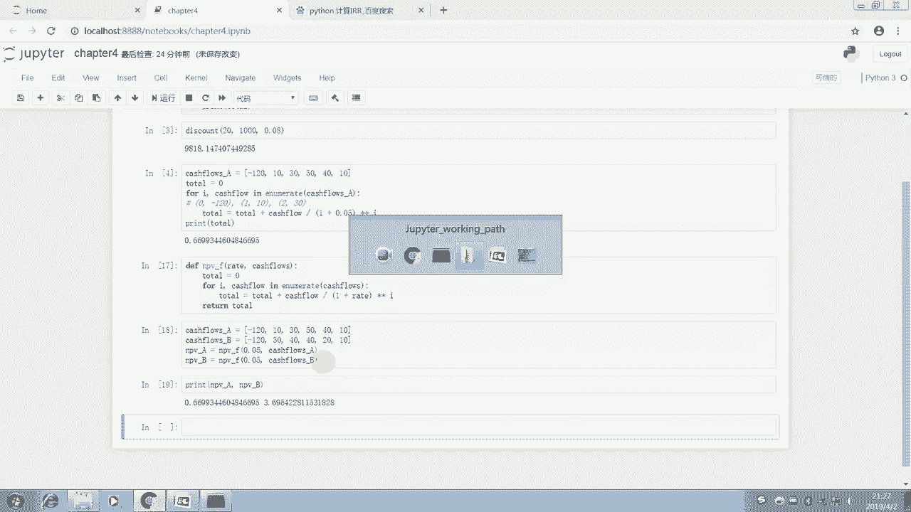

我们怎么去计算这个投资项目的L2，也就是怎么找到这个净现值为零的时候的，一个投资呃，回报率，好，那么在这里呢我们通常的思路呢，就是说啊我们会去思考啊，就是说用二分法来求IR2，那么什么是二分法呢。

就是我们假设啊，我们假设额。

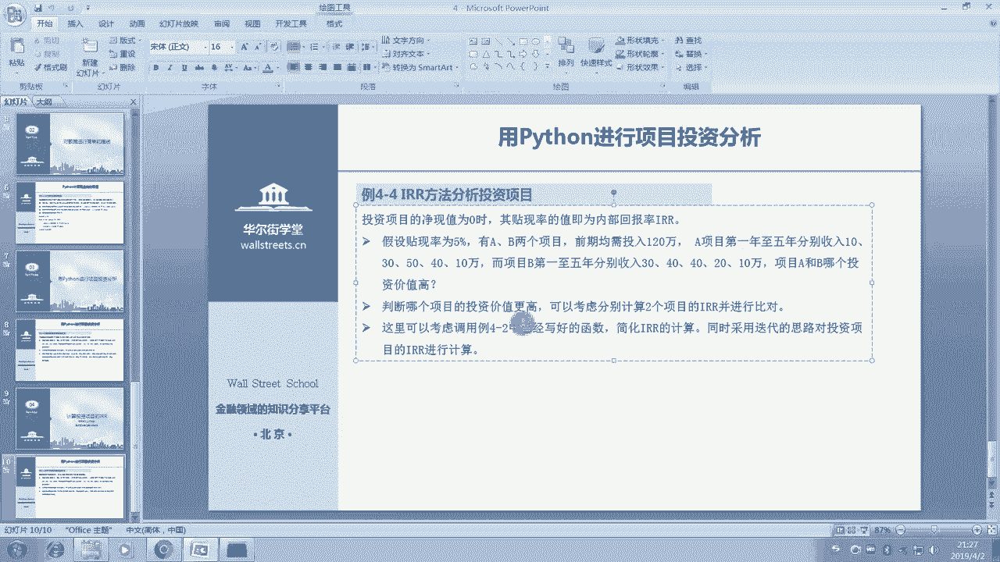

我们假设呢刚开始给一个很低的这个折现率，假设是零，然后我们再给一个非常，我们再给一个非常高的折现率，比如说是一，那么我们可以预期啊，这个折现率当它非常高的时候呢，我们这个NPV呢肯定是显著为啊。

肯定是负的，那么我们这个折现率非常低的时候呢，他的MPV呢肯定会是正的啊，否则的话呢我们就没有必要计算NPV了，如果不满足这个条件，那么接着呢我们可以考虑一下，就是我们这个给一个。

把这两个rate呢进行一个平均。

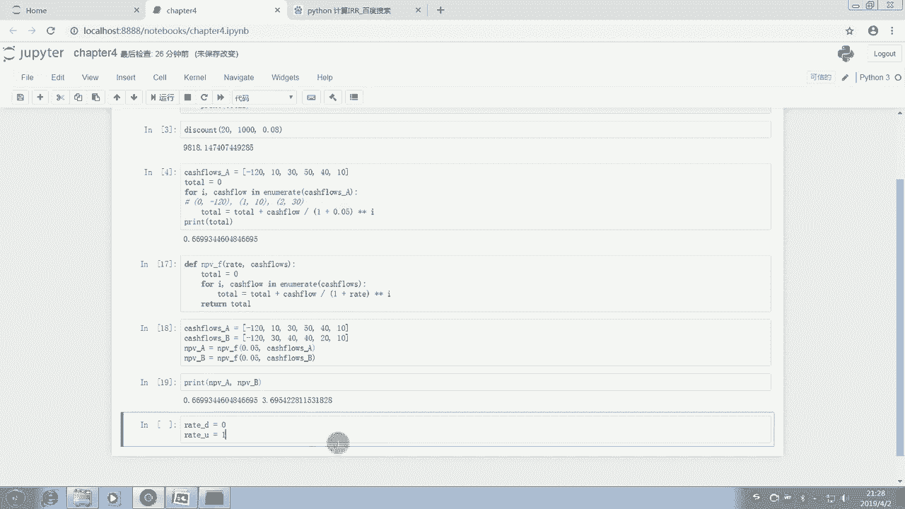

啊我们就是想看一下平均的情况下呢。

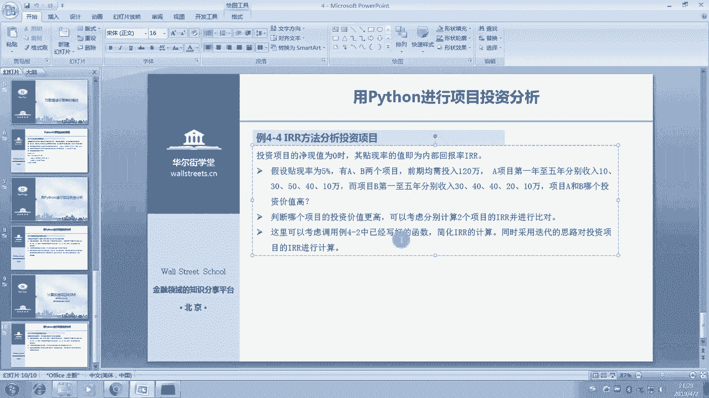

他的NPV呢是否会大于零，那我们就计算一下NPV，NPV等于NPVF，然后rate我们把这个rate输入进去，Cash flows，好的，也就是说我们这里的话呢，也就是说我们这里的话呢。

这个NPV的话呢会等于NPVF，我们这个地方呢相当于调用了我们上面定义的，这个NPV函F这个函数，那么求算了这个rate的NPV，那么我们可以接下来思考啊，如果这个NPV啊它大于零的话呢，我们就知道呃。

如果这个NPV大于零的话呢，那么我们就知道啊，我们肯定要把这个NPV呢和那个小的，就是使得就是上面的那个rate d或者rate u，我们看了之后会和使使得这个NPV小于零的，那个。

我们把这两个呢会的这个rate呢，会再进行一次平均，然后呢，把这个平均呢用来替代这个另外那个rate d，那么就是作为这个我们说的这个新的一个呃，我们新的一个这个呃利率啊，或者说这个折现率。

然后带进函数里再去进行计算，通过这样的计算呢不断的夹逼，直到什么情况下，我们把这个操作停止呢，直到他这个NPV，小于我们要求的一个精度的时候，什么意思呢，就直到这个NPV啊，它能够比如说小于0。

01或者小于0。1，也就是它的绝对值会小于这个数字的时候，我们才让它停下来，所以呢这里呢我们也是同样的，我们定义一个函数，我们同样的给它定义一个函数，比如说d define，我们定义一个函数IRRF。

然后它的一个参数有cash flows，以及我们给它iterations，我们给它循环个1万次吧，先假装循环1万次吧，当然现在先不用管我们这个怎么怎么假装，我们就先假设有这么几个参数。

那么呢我们现在呢有这么些rate，那么我们要做这些操作，在这里呢我们肯定是Y啊，要进行一个循环，Y这个NPV就是当这个NPV啊，啊当然这里是ABSNPV，我们上节课也有介绍的abs函数啊。

就是跟excel里的abs是一样的，它返回的是一个绝对值，while a b s n p v的话呢，他如果说比这个0。0001还大，也就是说啊如果他比0。0001还大呢。

就说明了它没有达到我们的一个要求的精度，它就没有足够的接近零，因为我们说NPV接近零的时候，或者等于零的时候，它那个rate就是我们要逼近的那个rate，那么现在呢它Y啊它大于0。0001的时候。

也就是说当它不满足我们这个要求的时候呢，我们就要对它进行一个操作了，这个时候呢，如果NPV啊计算出来它是大于零的，他如果NPV呢是大于零的，那么我们就要把这个小的这个值，为什么呢。

因为小的这个值呢我们要把它换成现在这个rate，明白吗，因为这个小的这个值呢是使得NPV大于零，那么我们把它换成一个，现在这个稍微更大一些的这个rate的话呢，我们就可以更加的使得他们呃。

rate和那个呃就是小的这个rate，rate d和这个rate u呢夹逼的更紧一点，那么我们就就有点类似我们数学里的这个，夹逼定理啊，当然这个的话呢可能大家已经忘记了，不过没有关系，你就想象的是。

你只需要让他们不断的靠近，那我们看一下，这个时候呢我们要重新计算一下，这个rate就会等于rate u加上rate d，然后呢我们再除以二，好这个时候的NPV呢我们得再算一次。

会等于NPV的f rate cash flows好，那么其他情况下呢，else呢，那么rate u就会等于rate，为什么呢，因为这个时候呢就表示NPV小于零，那么NPV小于零的话呢。

说明一个什么情况呢，NPV小于零的时候呢，就说明啊我们这个U呢是取得更呃，取可以取得更小一些啊，取得更小一些，它依然是小于零的，那么依然可以把这个夹逼起来，把那个它这个区间缩短。

所以呢这个时候的rate就会等于，我们继续的对它进行一个夹逼啊，rate u加上rate d那么除以一个二，那么我们把这个继续的NPV呢也计算一下，会等于NPV的F，然后rate cash flows。

好这样的话呢，我们只要他无限的执行这个while循环的话呢，它会一步又一步的重新重复这个循环，那么直到最后我们这个NPV的这个值呢，它逼近我们需要的这个精度，那么我们就返回我们这个rate。

这个时候的rate呢，就是我们需要的这个额内部收益率了，好那么我们把这个函数呢给它定义下来，定义下来以后呢，我们可以分别的把这两个项目呢带进去，一个项目呢是额，一个项目呢是我们这个cash flow。

Cash flows a，那么它的iteration呢是1万，那么我们可以额不需要，因为我们已经他是一个告诉我们，就是说默认情况下就是1万，所以呢我们这里就照抄就好了，iterations等于1万。

那么我们再看一下LR2的这个cash flow，Spe，cash flow b的话呢，它的iteration呢我们默认呢也是1万，那么我们对这两个呢进行一个计算，我们看一下。

OK这个地方只输出了一个结果啊，这是因为我们这个Python的一个显，那么在这里呢我们强调的就是，各位可以进行设置一下啊，我们这个jupiter notebook，那么就可以使得我们这个啊显示的过程呢。

会更加的顺畅，比如说我我现在呃，我们在这个地方呢，多输入一句，我们在这里insert about一下，这个呢在咱们的讲义里也有啊，我们可以打开讲义，把这个代码呢粘贴一下，那么我们打开课程讲义啊。

这地方呢有这一大段代码，我们把它复制一下，把它复制一下呢，粘贴到我们这个第一个单元格，第一个这个格子里呢，我们直接给它运行好，我分别给大家介绍一下我们这些代码的含义啊，比如说第一个，第二个，第三个呢。

其实我们是在引入一些模块，然后后面的话呢我们其实也是在呃引入一些，比如这里我们是啊，这个地方呢就是我们刚刚说的，因为我们一次的话呢，这里只会显示一个结果啊，所以我们希望它一次能显示多个结果。

所以我们就把它这个直接给引入，然后包括后面的这个是处理excel，然后以及呃下些相关其他的设置，这些设置呢我们都给大家呃，直接给大家汇总好了，所以大家直接的一个引入就好了啊，这地方可能是第一次引入了。

导致他有点慢，额我们可以重启一下这个客户客户端，那么我们单独试一下引入这一条吧，我们今天先其他的我们先暂时不考虑，我们单独试下这一条，那么它导入完成以后呢。

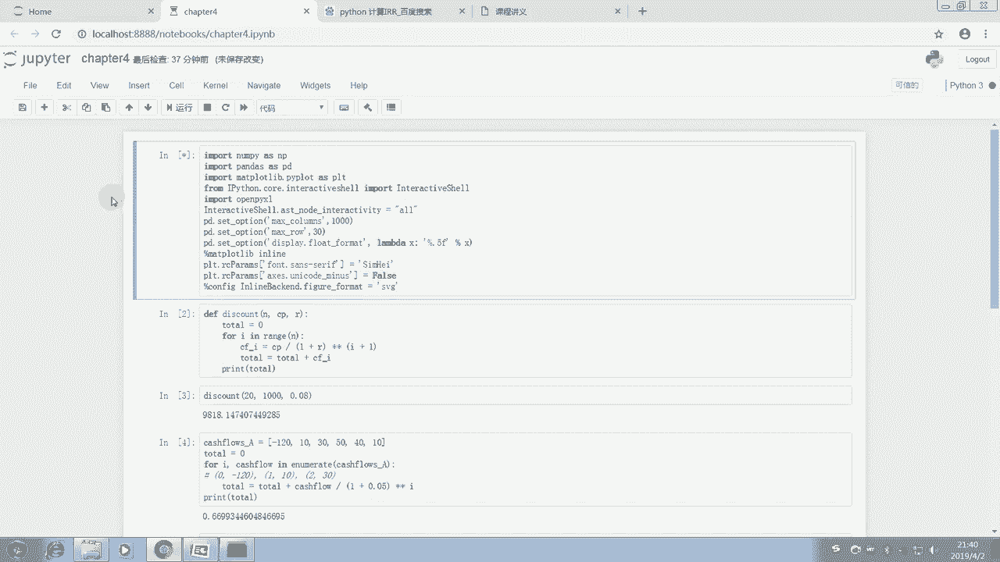

呃它设置完成以后呢，我们再运行。

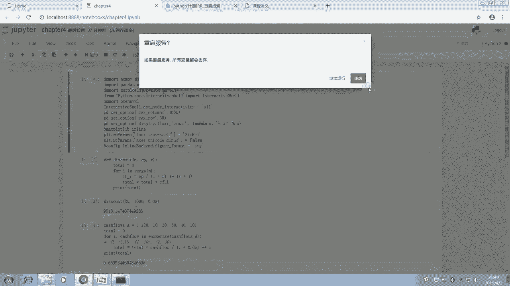

OK这IRF没有定义，是为什么呢，是因为我们刚刚重启了这个，所以他这些函数都没有定义了，所以我们现在再运行一下啊，cash flow a没有定义，那么我们把k h flow a也要定义一下。

好现在OK了，运行一下好，还是只有一个结果，那就说明我们刚刚那个设置设置呢，其实是没有设置到位，我们重新的把这个这个设置给他啊，粘贴进来一下，这个呢我们也给它运行一下，好我们现在重新的运行一下。

好我们发现屏幕上呢是展现出了两行，那么第一行呢就是我们前面的结果，第二行就是后面的结果，刚刚我们这个设置的这个IPAD设置的这个目标呢，其实意思就是说啊，把我们整个框框里的所有执行的代码呢。

都给它显示在屏幕上的结果，所以呢我们看一下第一个项目的内部收益率呢，是0。0519，第二个项目是0。062，那么对于这个情况来说呢，我们会选择投资第二个项目，而对于净现值的方法呢，我们刚刚也发现啊。

我们也是选择投资第二个项目，那么今天的内容呢讲到这里呢，基本上就告一段落了，我们学习了什么呢，我们学习了如何，就是循序渐进的把一个项目进行拆解，先从简单的入手，然后逐步的给它呃，汇总到最难的。

最后呢把它定义成一个函数，然后以至于后面呢我们可以把这个函数呢。

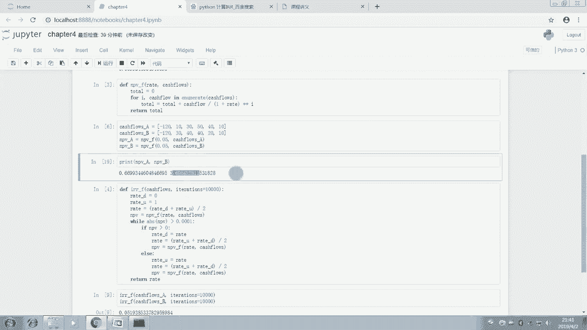

直接把保存成模块，在计算项目分析的时候呢，我们可以直接调用啊，只需要说它的输入输出啊，只要是输入能够保持一致的话呢，那么我们就可以实现我们的批量的对项目进行，投资分析的这个L2的计算，包括其他的呃。

很多的计算方法呢都是触类旁通的，所以呢希望大家在课后能够更多的去花时间，把Python的这些最简单的控制流，最基础的变量以及我们的循环啊，搞把它弄清楚一些。

那么尤其是说涉及到这个使用for循环和while，循环的时候，那么大家要对这个循环的条件把握的较好，那么根据我们这个例子呢，大家也可以在课后呢阅读我们的课程讲义，课程讲义里里呢。

有我完整的一个课程的一个代码，大家可以看一下这个这个是我们课程讲义，那么在讲义里的话呢，翻到第四章的话，由我们这个课程的一个，我上课过程中的一个完整的代码，那么就希望大家在课后呢。

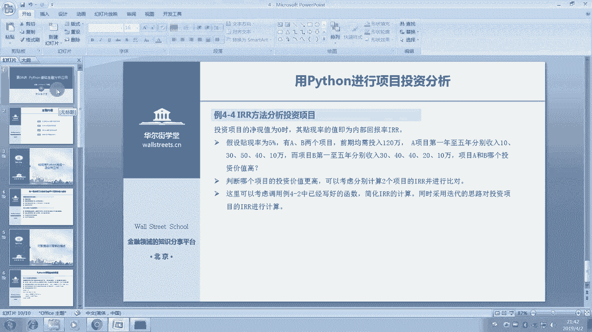

对代码进行一个相关的复习，今天的课程呢我们就讲到这里，然后谢谢大家，希望啊，我们下一次课呢就讲如何成为编写编程的能手，以及读写TXT文件和excel文件的一个方法，和在excel文件中进行相关的操作。

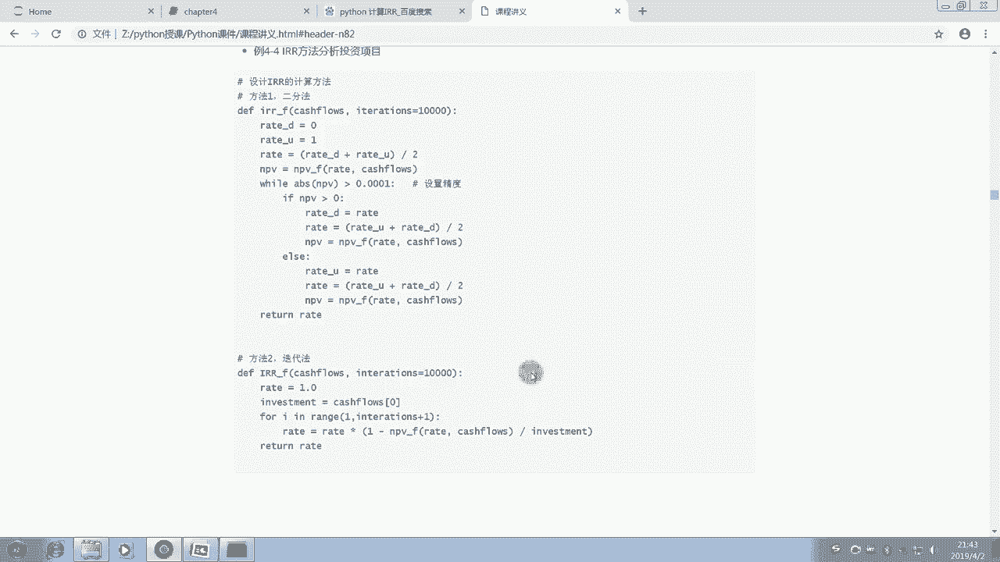