# 14天拿下Python金融量化，股票分析、数据清洗，可视化 - P6：06 成为编程能手：Python知识进阶 - 数分小诗 - BV1bFDSY9Ep5

。

各位同学大家好，欢迎来到华尔街学堂，我是刘老师。之前的课程，我们已经把python的基础知识给大家介绍进行了相关的介绍。那么我们讲过了数据和变量的一些类型。

那么我们也讲了怎么给变量赋值以及变量的一些运算。随后呢我们把相关的一些简单的数据结构，比如列表、元组字典都讲了一下。那么。以及控制流。比如我们说的这个常用的。条件语句循环语句。

那么就是我们说的if语句和for语句以及where语循环。我们都讲过了。那么也举了一些简单例子给大家做一个实战练习。呃，今天的话呢我们讲python的一些进阶课程，也就是。从今天开始呢，我们先介绍呢这。

读写文件，也就是大家最关心的，或者说在工作中用到最多的。如何用pyython去读取，比如说TXT文件，还有就是我们最常用的excel文件，以及如何。往excel文件里。

或者说往TXT文件里写入我们需要写入的数据。那么我们今天主要讲这个，那么在后面呢，我们会简单的介绍一下类和实例，以及拍摄里面的常用模块和我们下一阶段呢我们要讲的那个一些常用的一些模块。

比如说像pandas啊，像m pro label，像n这些。模块我们会简单的介绍一下他们的一个功能和他们的一个使用。呃，简单介绍一下。然后我们之后呢再下一次课呢，我们会详细的介绍这个相关的内容。

那么在第四部分的实战练习里呢，我们主要是就今天的整个内容呢。针对我们读写文件给大家做一些实战的演练。当然这一个课里这今天这个课程呢，我们主要是实战的内容会多一些。所以呢因为大家在日常办公中呢。

也主要都是用excel在办公，所以呢我们可能也会更侧重啊，用python读取excel，然后也会讲一讲用python读取TXT文件。

好的，那么我们还是按照上一次的操作，我们先要打开conda prompt。Oh。嗯，他打开会有一点慢。然后想和大家说的呢就是说咱们OK那么这里呢我们需要选择我们自己的工作目录啊，比如是C盘。

我的工作目录是这里，那我就把这个工作目录给它复制一下。那么CD。

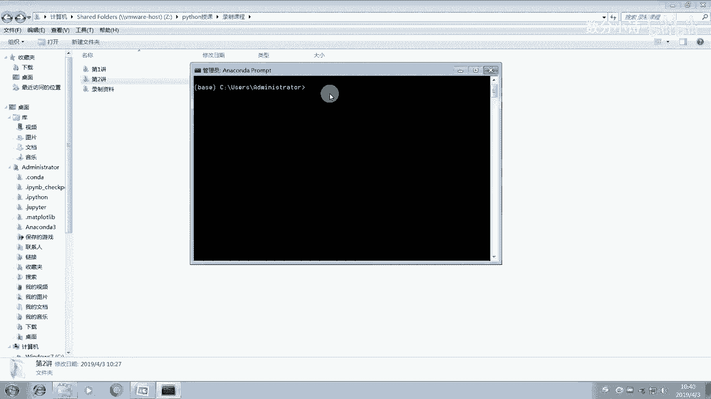

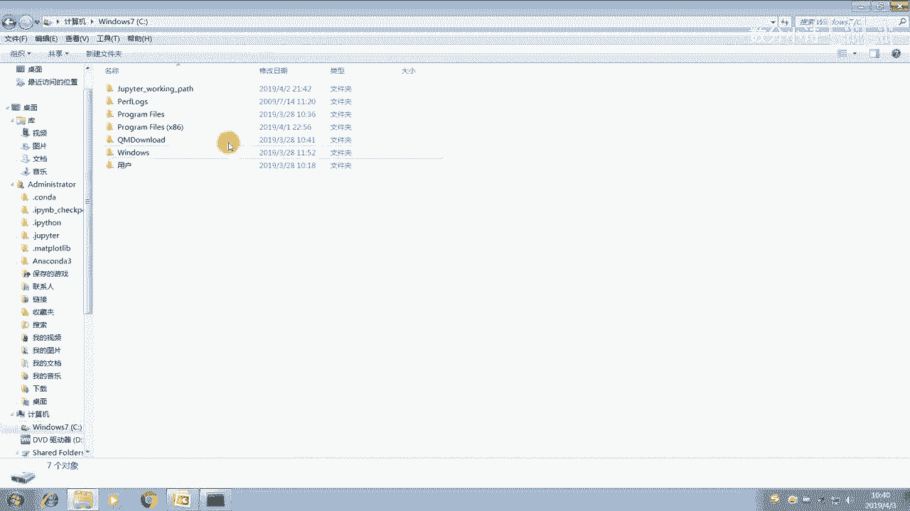

进入我们的工作目录，然后呢输入jupiter。Notebook。那么我们就可以登录我们的jupyter notebookotebook。那么同时呢这里的话呢，大家要记得把我们这个。

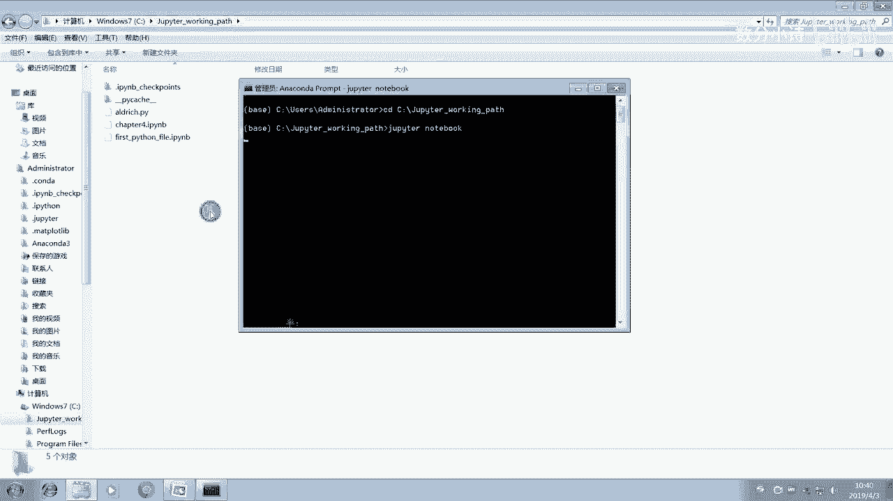

pyon里工作路径里面的我们这个课程提供的data包啊，这个数据包啊，我们要复制到公共目录下面。这样的话呢，在使用的过程中呢，就是咱们可以直接像刘老师一样调用相关的我们需要用的数据。

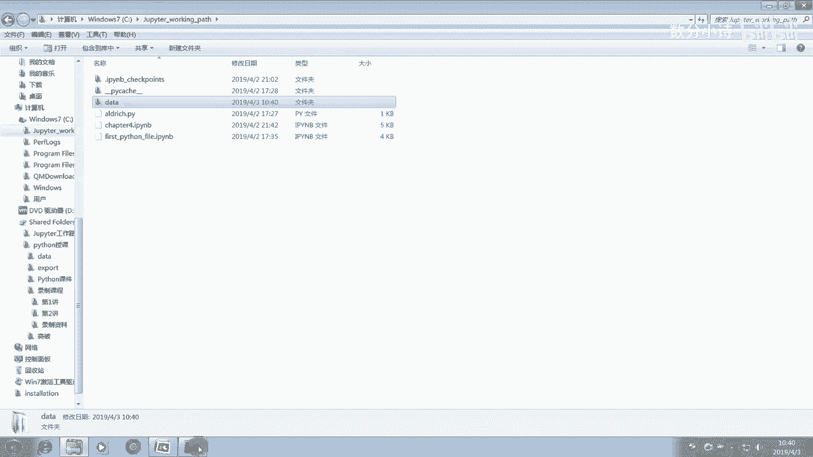

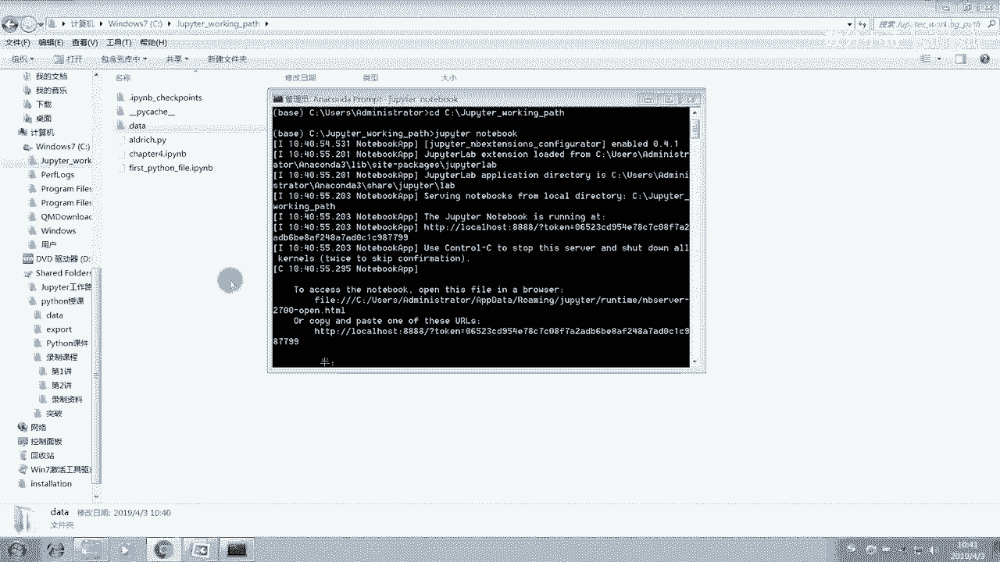

Okay。好的，我们的jupiternote book已经打开了啊，上一次是tractap four。那么这一次的话呢，我们是第五讲，那么我们就命名为chap five。我们命名一个新的文件。

python示位的文件，我们创建一下。は。好的，那么n呃jupiter notebookbook呢已经打开了，我们在这边呢重命名一下，把它命名为chapter。

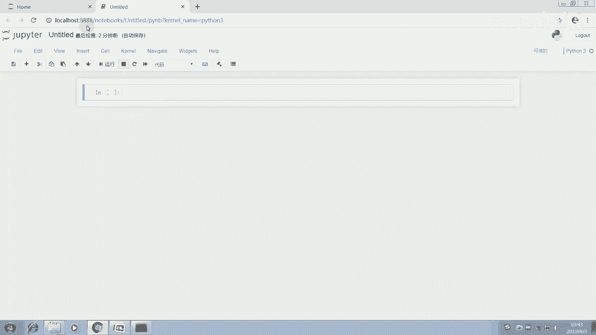

O那么今天这讲呢，我们主要讲读写文件。所以呢呃我们先看一下第一种读写文件的一个模式。我们读写这种以TXT结尾的一个文件。那么这种文件的话呢，它是属于文本文档。一般一般来说，那么对于这种文本文档来说呢。

其实有很多数据库，它的数据呢是有一个文本文档的一个选项的。那么比如说像典型的呃国泰安数据库啊，这些主流的一些数据库它里面都是有TXT文呃格式的一个文文档的的这个数据下载的。那么下载下来以后呢。

我们想一下TXT它的格式呢，大部分呢其实是呃数据之间它用空格或者用那个tab。我们说的制表符进行这个分格的。

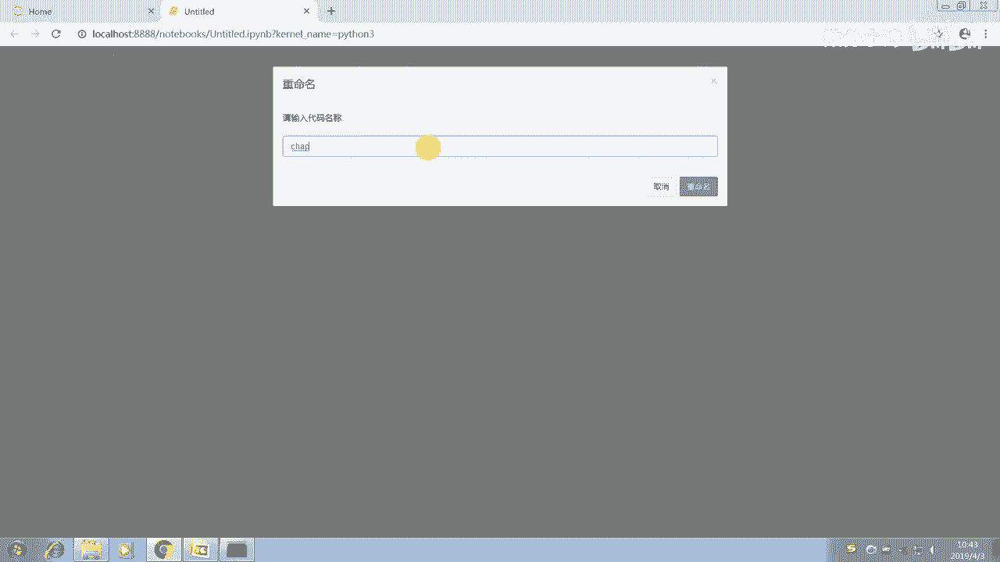

所以呢在读取的时候呢，python的话呢，读取这些文档呢也是比较方便的。那么我们的话呢，拍审读取有两种模式。当然我们在讲怎么读取之前，我们要知道呃，如果说这个文件呢已经被你下载下来了。

它是一个本地文件的话，那么你肯定必须要知道它的一个文件路径，对吧？

那么什么是文件路径呢？这就是我们经常教大家说要换这个working pass。那么文件路径呢其实就是这个计算机上面这个路径啊。比如说我们点到这个地方来这个data这个文档里。

那么这个上面显示的这个路径呢，就是它的绝对路径。比如我们把它复制下来。那么粘贴到这里，如果说你在操作的过程中呢，你要使用一个路径的话呢，那么这个呢就是一个绝对路径。在这个路径后面呢加上这个文件的名字。

比如我们这个SCCGS我们的上证指数SZZS记得加上后缀T点TXT大家看见这里自动显示出来了。那么呢我们要用两个引号呢，把它给。括起来。那么这样的话呢，这个路径呢，我们把它叫做这个文件的一个绝对的路径。

也就是说你通过这个路径，不管你的工作目录是在哪里，你都能够轻松的访问到这个文件啊，这个就就是叫绝对路径。而我们还有与之相对的的是相对路径。相对路径是什么意思呢？就是说因为这个地方是我们的工作目录。

我们其实不用加前面的这些内容我们也可以调用这里面的就当前这个jupyter working pass这个工作目录下的任何一个文件。那么如果说我们要调用data里个文件怎么样要要怎么办呢？

我们只需要有这个data这个目录就好了。为什么呢？因为前面的目录呢？都是我们已经正在里面，我们正在这个目录下工作，所以我们不需要调用它，那么我们把这个呢叫相对目录。这种相对情况下呢。

我们就只需要调用这个data，那么后面呢有一个SCCS点XT这样呢也可以进行一个调用。前提是data呢必须在我们的工作目录之下的一个文件。じゃ。好的，那么这里的话呢我们要注意的一点呢。

就是说呃如果你在这个呃目录的里面呢，可能有的时候包含了一些数字啊，包含了一些其他的呃字符啊，那么可能会出现一个呃一些就是让它识别不出来，或者说导致你这个斜杠啊，就是说python的读取呢。

会有多多种含义。所以呢在这里呢我们一般呢会加上一个R表示一个转译啊，具体怎么样呢？大家先不用纠结它到底是。它到底是一个什么什么逻辑？那么这里呢我们只是说加上一个R的话呢，你在读取的时候呢。

会更为的准确啊，就不会让python呢经常出现一些歧义啊，这就是给大家一个建议啊，在文件的目路径前面加上一个小写的R。好的。当然就是如果你不加的时候，出现了报错的话呢，那你就加上去试一试。

看一下能不能解决这个问题啊。很多时候可能是你读取的这个文件的路径啊，出现了问题。

那么我们看一下代码打开文件的两种方式，打开TXT文件的两种方式。那么它有一种呢是两种呢都是用wis来打开的。那么。打开以后的话呢，读取方式有两种，我们现在把这两种方式呢写在这儿啊，写在这儿。

我们现在把这两种方式写在这里。那么比如说我们要读取一个文件，我们就with open。Fire pass。As fire handle。那么For line in。Fire handle。

大家看这个有代码的自动补全的功能呢，就我们装了这个插件以后呢，会非常方便啊。你可以呃很多情况下可以自动保存呃，自动补存呃，自动补全。Yeah。Okay白。这第一种方法。那么这种方法呢。

我简单给大家我们来看一下，理解一下。那么with呢大家是这是一个关键词。也就是说你呃用或者说你借用什么的，就是with就是大家想一下啊，with me，对吧？比如说go out with me。

那么这种英文的单词，其实它是可读性极强的，就是很很容易理解，就是和什么什么一起。那么这里的with open。那么就是说我们把这个路径啊给它打开，把这个文件路径给它打开。这个fire pass呢。

这个fire pass呢就是什么呢？这个fire pass呢就是我们上面的这种相对路径或者绝对路径，我们直接把它给填进去就好了。😊，那么这就是with fire pass。

就是说我们把这个路径打开ad是什么意思呢？就是说打开这个路径啊，把它给重命名为fire handle。好，大家就想啊，我们直接f pass就好了。为什么要ad fire handle呢？

其实呢pyython呢在这一个步骤呢，它就已经怎么样呢？它就已经把你这个文件给打开了，并且呢把它读取为了pyython的一个中间体。😊，什么叫中间体呢？呃，我们可以理解成python呢。

它读取这个文件呢？它其实python并不是一个阅读器，对不对？那么python我们说过，它是一个面向对象编程。我是它python呢，我python呢它是不能够直接去读取你这个文件的。

它是把你这个文件读取成我们这样一个文件的中间体，或者说理解成fire handlele，我们就理解成这样一个桥接的一个工具，就像A城市和B城市之间的。

用高铁连接这个fire handlele呢就很像我们这条高铁。那么f line in fire handle下面啊就说这个时候呢，python呢如果你要我们要去操作一些这个文件里的内容。

要去读取它的内容的话呢，我们就只能从中间体去读取啊，就像我们想比如我们想看到月球，我们需要用什么，我们需要用望远镜才能看得更清楚。那么这个firehandle呢也也可以说它是一个望远镜。

那么我们就说对于啊这个望远镜里的某个东西，我们可以对它做什么，或者对于这个fire handlele。

那么fire handlele呢其实就是说我们已经把这个原文件这个fire pass里的这个文件把它给读取成了我们这个python里的一个fire handle了这个对象了。所以呢我们的面向对象编程。

首先呢大家一定要抓住每一个编程过程中，这个对象是什么？你在对谁进行操作，这个非常的重要。这里的话呢我们这是第一种方式啊，只要我们读进来以后。

for line in fire handle就可以对这个fire handle里的文字呢一行一行的进行操作。那么我们再看一下mehod tube吧。对，第二种方式的话呢，也是一样的。

with is open。Fre path。as fire handle。那么这种情况下呢呃这里有一些区别，这里的不是for line，而是直接lines because。Fire handle。电。

Great lines。这里呢大家就要注意了，这里呢依然是fire handlele，对不对？依然我们要先把它读成一个中间体，这一步是不能省略的。但是读成中间体以后呢。

这里可以直接用调用fire handle的一个read lines的这样一个方法，把这个fire handle里面所有的这个内容啊，把它变成一句一句的这个列表，或者说我们把它变成一个列表列表的形式。

ok。也就是说上面这里呢我们是一行一行来读的，而下面这里呢我们是一次性的把所有的行呢每一行呢变成了列表的一个元素。这样的话呢我们就方便我们调用每一行，其实就是用列表的索引或者切片去进行一个调用。好的。

那么我们现在呢来我们在下方插入一个格。啊，我们来做一个相关的一个演示。大家在开始这个学习之前呢，还是要把这个我们这个呃课程对jupiter的这个设置呢可以进行一下设置。我们只要复制过来。然后运行一下。

那么我们这边设置好了以后呢，其实就可以开始我们今天的一个操作了，我们可以看一下。呃，比如说我们现在呢我们试着导入一下我们需要的一个数据吧，我们导入一下我们的上证指数的一个数据。

这个数据呢是我从国泰安数据库里提取的。看我们看一下我们这个data文件夹里有个上证指数的一个文本文档。这个数据呢它里面呢是上证指数的一个周长幅。我们可以先打开看一下啊，周长幅这个呢是百分数的。

但是它没有百分号啊，就是代表的是百分比好，那么左边的都是日期。所以我们可以把这个数据呢试一下，我们不进python里面。那么我们就with。啊，我们当然先把这个fire pass写上了。

fire pass会是等于什么呢？在这里在这里fire pass呢就会等于我们用绝对路径，还用相对路径呢，这里比较简单一点，我们用相对路径，因为它就在我们的工作目录下面。

这也是为什么我要大家把它拷贝到工作目录下面的原因。那么这个时候呢，我们就已经先把相对路径写好啊，然后呢，就with open。我们把它打开。Sile pass as fire handle。

那么我们把它打开以后啊，那么把它打开成一个fi handle。那么对于。Yeah。哦，这里我要跟大家说一点的是，就是说说明一点。这个fire handle的话呢。

它并不一定要是这个fire handle这一个名字，它可以是别的名字，比如FH。那么下面相应改成FH就好了。OK这是没有问题的。就是它只是作为说我们把它作为一个中间体，但这中间体叫什么名字呢？

其实是由我们来决定的。只不过呢我我习惯把它叫fire handle。所以呢大家可以根据自己的习惯呢对它进行一个命名。那么我们可以来先看一下，对于这个里面的每一条线，或者说每一行啊。

sorry每每每一条行这个line每一行。那么我们可以先把它打印出来，我们看一下长什么样子。我们运行一下，唉，发现它被打印在了屏幕上啊，没错，它跟我们实际上在刚刚打开那个TXT文件里看到的呢是一样的。

只不过大家发现它后面每每个人都空了一行，对不对？每个都空了一行。那么这个时候呢，每个都空了一行的话，我们的line strip就这个sstrtriep这个函数大家还记得吧？这个方法我们在呃之前。呃。

基础讲基础的时候呢，在讲变量的字符串的时候，我们说啊，如果一个字符串呢后面有一个空的空白的内容呢，我们可以用sstrip把它给消除掉，把它给压缩回来，挤回来。那么在这里的话呢。

我们这个line点strip方法呢，其实呢就是对line这个对象。因为我们拍摄面向对象编程在对line这个对象呢，使用了这个strip这个方法以后呢，就会把它后面的呃空行给压缩掉。我们这个时候执行一下。

我们发现哎刚刚后面是不是有空行啊，你看我们如果把它去掉的话，后面是会有空行的。那么如果我们加上它的话呢，这个空行呢就被我们呃line strip方法呢给它消除掉了。所以呢大家在使用的过程中呢。

要活学活用，针对这种我们讲过的一些方法可以大胆的去尝试，如果报错的话呢，那么可以再去调整啊，千万不要怕它报错，它报错，并不是说你做的不够好，而只是说明什么，只是说明。😊。

你你暂时写的这个语言呢啊并不是符合pyon规范的。那么python呢因为它比较笨，它只能读取固定模式的一些内容。所以我们要去学会习惯它的一个思维方式，这呢也是我们这个课程学习的一个目的。好。

这里我们已经知道了。我们发现这里的一个line的话呢，一条呃每一行的话呢，它是有两个部分的，一个部分呢是日期。另外一个部分呢就是我们的涨跌幅。所以呢这里我们就用两个变量啊，这里是一个新的方法。

就是我们其实可以用两个变量来替代来分别的。把它给替代。那么我们这里注意了line点split。我们就是说呀把这一条行啊P成两半split这个我们也在字符串那边讲过，split中间呢是可以加参数的。

但这里呢中间由于是一个制表符，或者说是空行空格，所以呢我们可以不加，直接把它P开，它就会自动的按pyython自动识别，按这个空空格劈开。那么P开以后呢，它就会把左边这部分呢赋值给A。

右边那部分赋值给B，也就是左边的日期会赋值给A，右边的这个。涨跌幅会赋值给B。那么这里的话呢，我们就可以分别构建。那我们想一下，我们得分别构建两个数据类型啊，比如说我们构建一个list。

构建两个list啊，第一个是date list，就是日期的list。第二个是呃涨跌幅percentage的list。我们构建了两个list空的list，然后用list的append方法。

也就是追加把每一个元素，我每一次循环我们这个for循环嘛。对于这个fire handle里面的每一行来说，我们每一次循环的时候呢，就把A这个元素给它append，追加进这个date这个list。

也就date这个列表的末端。那么我们对于每一次循环。我们也用append方法，把B这个元素追加进这个列表的末端。那么这样的话呢，我们把它们这个循环做完以后呢，我们看一下结果啊，我们看下结果。呃。

我们看下结果，这里呢print一下这个结果，我们可以print一下吗。我们print一下这个date，看一下效果。Yeah。好，我们发现啊所有的date都被放进了一个list里面，对吧？啊？

所有的date都被放进来了，一直到3月29号，从19919990年啊，从90年的12月28号，一直到了现在。好的，那么上证指数的历史也就这么这么长了。我们把它所有的历史的周长幅都放过来了。

那么这样的话呢，一次性我们就把它们都读取进了我们的list。但这里要注意啊，读取进来的时候呢，我们要看一下这个B列表呢，我们要注意了这个B。因为我们待会呢可能要对B进行一些操作，要去分析一下它。

那么我们看这个B它的一个数据类型是什么？我们可以先看一下。啊啊，sorry，不是B，啊我们应该printPCT。我我们发现啊它呢也带了引号，对不对？也带了两个引号。

所以呢这里的话呢这个append进来的这个B，也就是我们这个涨涨跌幅啊，周涨跌幅这个PCT呢这个列表它的元素呢也是文本文本格式的。也就是说是我们这个str字符串格式的啊，是我们第一讲讲的字符串格式的。

那么。我们待会儿呢在做呃分析的时候呢，就涉及到我们要把这个我们要把这个相关的这个字符串呢要想办法把它转变成我们说的数字，否则呢这里是没有办法进行计算。因为字符串之间是不能计算的。好的。

那么我们这个读取文件呢就先讲到这里。我们接下来呢讲一讲我们这个写入文件。Yeah。我们接下来讲写入文件啊，就对于TXT文件来说呢，我们其实也可以写入。比如我们写入一个空文件，写入多行或者附加到文件。

我们可以有三种方式啊，至少三种方式进行一个写入。那么同样的。

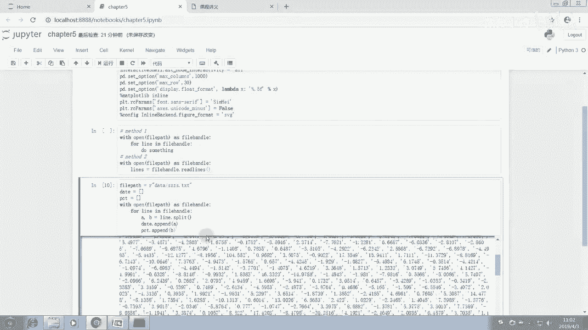

不管你读取文件呢，你还是写入文件呢，你都需要有一个fire pass。比如说我们这里呢给一个。

呃，我们先取一个名字吧，Fair name。这里呢我们先给这个文件取一个名字，我们待会儿要写的文件，我们就要。First personython。 First personthon。

What the job first。F了。To。right，这是我们写的第一个文档，文件的名字啊，TXT文件的名字，我们就用这个来命名。那么同样的，我们with open。我们打开打开什么呢？

打开这个fair name。打开这个fire name，然后这里用个WW是什么含义呢？W就rightite，就是我们用写的方式啊，写的这个模式，打开这个fire name。

然后as fire handle。大家在初学的过程中啊，呃其实有一本书呢叫做笨伴法学python，我非常建议大家去看一看。那么。这本书的一个核心思想呢和我们这个python的一个学习思路呢。

其实是不谋而合的。大家在初学的过程中啊，可能会觉得哎为什么好像刘老师，你什么过程你要用到什么你都知道。但是我呢我听了一遍以后，我却还是不知道。其实这个就是一个不会到会的过程。

它需要的只是大家不断的去重复，不断的去练习。那么你很快就能入门。在这里呢就是说对于每一个新出现的知识点，对于之前讲过的所有的基础知识。大家首先呢争取在最大的最快的时间内先理解。

理解了以后就是用正常的语言思维去理解，理解以后呢，把它给快快速的短时间内记住，然后就是不断的使用，这样呢大家很快就可以入门。那么关键呢大家发现关键点呢理解不是最难的，但记住是比较难的。

所以呢就非常需要大家这里也是非常考验大家记忆能力的。因为不可能说我们每遇到一个问题，我们都去查询一下相关的这个documents。那么可能在查询了几遍以后呢。😊，呃，大家就应该要记住了。

而不是说每一次都是完全记不住，那是不行的。那样的话很影响工作效率。所以大家也要相应的去提高一下相关方面的意识。好，我们先wa open，我们把这个fire name呢，我们把给它打开来。

那么现在呢肯定是我们是没有这样一个fire name的在我们的文件下面。那么既然没有的话呢，它其实paon呢会自动帮我们创建以这个first fire to write这个TXT文件为命名的一个文件。

它会自动帮我们创建。创建以后呢，我们在这里呢就需要呃用一个。fire handle的方法。fire handle这里呢会有一个rightite方法啊，大家看可以选择有的right。

那么其实这个就很容易理解了。fire handle呢是我们这个中间体，我们要通过这个中间体呢往这个文件里写东西，对吧？刚刚我们是通过中间体往从这个文件里读东西，那么写东西呢。

也要通过这个中间体给它写东西。就像呃比如说像我们那个粤港澳大湾区那边。尤其是香港啊，比如说香港呢往内地呢可能会有一些呃技术输出输输过来，他需要通过。比如说通过港珠澳大桥，而内地呢要运一些蔬菜。

运一些物资去香港，那也要通过港珠澳大桥，它必须通过这个中间体去进行一个运输。而不能够说我直接闪现过去，这是不行的。好的，所以fair handle点right呢，这里我们就。

依然是输入我们想要输入的文字，比如I love。Programming。啊，就我热爱学习编程。那么我们把这个。写进来以后呢，我们就可以运行一下啊运行一下。Okay。好的。

这个1九呢代表的是这个字符串的长度。好，我们来看一下是不是这里多了一个文件。啊，first fire to the right，我们打开okI love programming在这里good。

所以呢这里我们就知道了，我们可以这样子写入一个文件，对吧？那么还有没有别的方法呢？就是说比如说我还想想点别的东西。哦，那么会怎么样呢？比如说这个时候我们先把这个文件关掉，fire handle点。

Close。好，我们把它关掉了啊，我们已经把它这个在开选里把这个进程给关掉了。那么我们假设呢我们还想再写一个别的内容，我们把它复制一下。😊，我们想再写I love programming，然后cu。

我们想再写一个进去可以吗？我们试一下。好，我们现在是打开这个文件看一下。哎，我们发现刚刚那一句呢已经被不见了，对吧？被拆除了，或者说被覆盖掉了，而是出现了一句新的。那么这个时候呢，我们就产生了一个疑问。

就是我们要如何才能在刚刚的就是原文件的基础上，我们再去给它。添加一个呢，或者说给他添加一添加几行上去呢。那么这里的话呢。这里的话呢就涉及到我们需要用一个呃特有的一个模式，叫做append模式。

而不是rightite模式。比如说。我们把上面的这段文字呢把它先复制一下。这里呢我们要采用的是end的方法。所以呢这里的这个W呢这个模式呢，我们把它改成A啊。

我们就是一个呃从向这个文件里的一个追加文件的一个形式。我们再看一下，我们呃比如说我们想追加。追加一些其他的内容进入这个文件。那么我们只需要在下面依然用这个right这个方法。

Fe handle点right。啊，我们依然用write这个方法把想要写的写进去。比如我们写。我们写I want to be a good programmer。那么我们想成为一个优秀的编程者啊。

或者程序员。然后 fire handle，我们还想再写一句别的。嗯。我们还想写什么呢？我们再写一句，比如说。I want to be。嗯。Excel。Excellent， excellent。

Financial。Analyst。OK我们现在呢呃执行一下这个文件，我们看一下它的结果是什么样。好的，呃，打开我们这个fly pass，然后我们就fly first fly to right。

那我们发现呢这一次呢。这个文件呢它全部都写在了一起，对吧？大家发现这里其实是全部粘连在了一起，我们想让它换行怎么办呢？这很这个也很简单，我们只需要在这里呃加上一个句号。

然后我们每一个后面呢我们用一个杠N来表示，用杠N来表示。感恩。当然了，因为我们是在之前的文件上追加，所以上面的个杠N呢其实是起不到效果的。那么我们怎么办呢？

我们可以呃重新的把这个文件在这边呢重新的一个写入啊，我们重新写入一下。那么我们先从头开始with fire open这里运行这一个。接着呢我们运行下面这个对他们进行一个追加。好。

我们现在再打开文件看一下。Oh。OK现在呢就O现在就出现了一个这个情况。它这个杠N呢它没有理解成换行，而是帮我们直接呃直接给它打印在了里。那这是什么原因呢？这是因为我们这边这个制表符的这个位置是不对的。

那么我们这个制表符也会呃是我们这个换行符的这个。杠这个号啊，这个斜杠用错符号了啊，它应该是要一个这个向从左向右的这个斜杠，在那个backp那个键的下方。那我们现在再运行一下。那么我们打开这个文件。哎。

我们发现这一次呢它就已经帮我们换好行了。所以呢在使用的时候呢，大家也特别注意啊，这两个符号两个斜杠的符号含义是不一样的。那么对于制表符，比如说杠T，这个呢就是tab的含义啊，我们在打出来的时候。

它是会提示的。比如杠N它是有提示的，它是有提示的。而我们用左斜杠的话去打N的话，它是没有提示的。所以大家在使用的时候呢，要比较注意一些。那么到目前为止呢，我们就把这个读写TXT的一个文件我们讲完了。

那么接下来呢我们要讲一下怎么读取excel文件。那么excel文件的读取呢相对会复杂许多。因为我们刚才也看了，在TXT里面呢，基本上没有很多内容可以选择，没有很多选项可以选择。但是在excel文件里呢。

就会有比较多的选项可以选择。

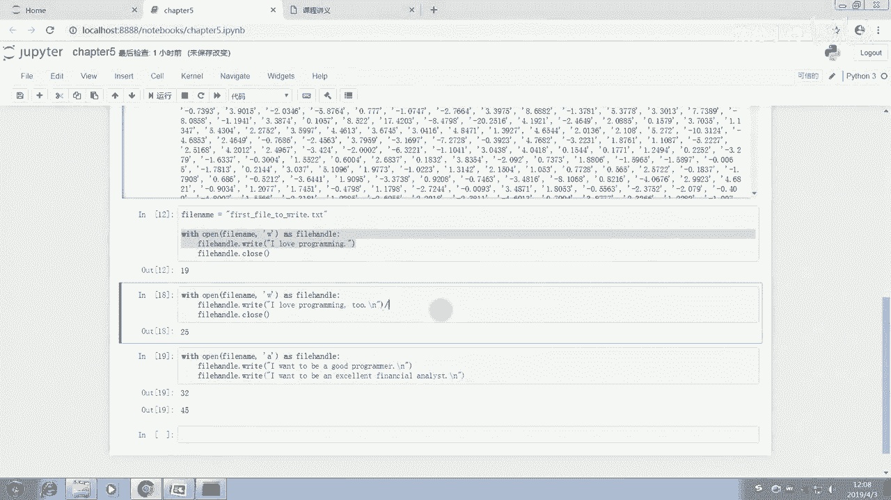

好。我们怎么读取excel文件呢？我们先看一下我们第一步呢呃在这里呢我们给大家介绍一个open pie XL。这个open pie X L这个模块呢它是一个模块。

这个模块呢是pyon的一个呃专门用来可以专门用来处理这个2007版以后的这个excel的一个模块。

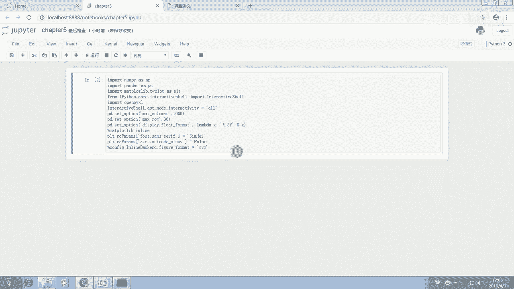

那么我们说的这个excel呢，在这里呢，本课中呢我们主要就是以这个。点XLS点XLSX这种类型结尾啊这种点。

XLSX这种结尾后缀名的一个文件。我们把这种文件呢呃作为excel文件啊，我们一般现在都使用的都是这种excel类类型的文件，我们进行一个呃操作。那么这里呢我们现要import。那么大家注意了。

其实我在上面这个整体的一个环境里面呢，我已经import了这个open拍exel。所以呢在这边呢，我们就不用import它了。我们直接看一下怎么用它打开excel文档。

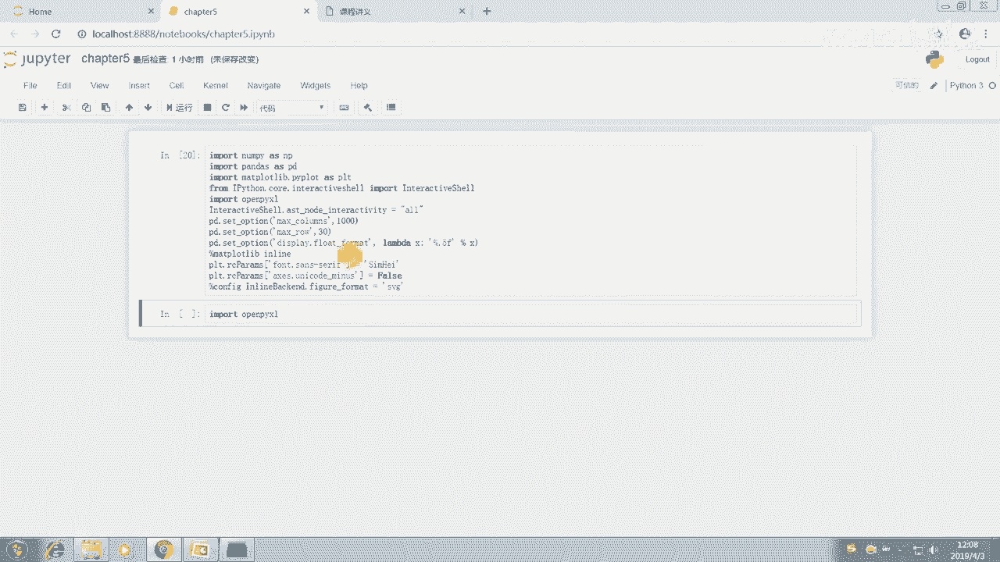

那么我们先讲一下它怎么去呃创建呃，我先先讲一下它怎么去创建一个新的excel文档。那么在这个里面呢，我们也要知道，就是它和我们刚刚那个打开TXT文档是一样的。首先我们要呃要新建一个文档的话。

在这里我们就要用WB等于啊，其实这里不知要等于叫赋值。我们把后面的赋值给一个叫WB的这样一个对象这样一个变量。那么这样的话，我们就有一个处理的对象了，对吧？

那么open拍 Xel就是这个模块的名称点我们从这个模块里面调用一个函数叫workbook。

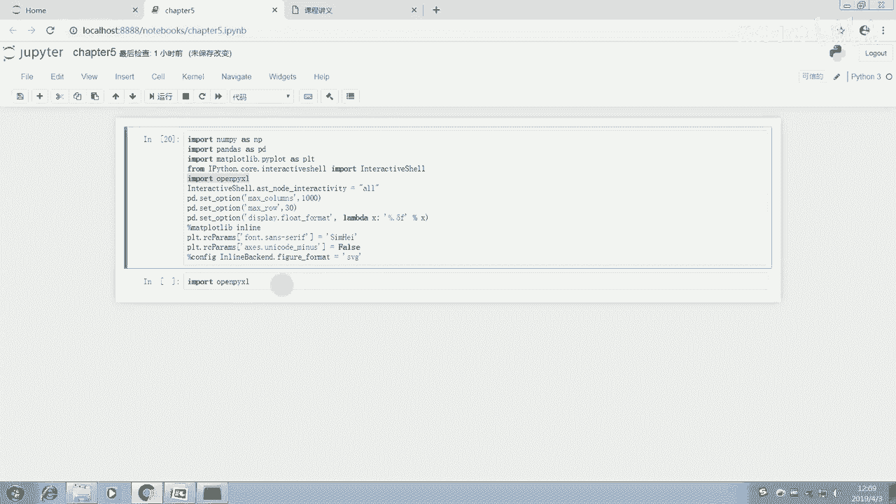

那么这是一个什么含义呢？就是说我们经过这个操作的话呢，我们就已经是调用了一个open high Xel里面的workbook这个函数。我们可以看这个函数有些什么含义啊。

它这边有呃right only一个是for啊XO date这些我们先不用管哈，那么这样子操作完以后呢，就相当于呢告诉我们，哎，我们新建了一个叫做WB的这个excelworkbook。

就是excel工作部啊，叫WB的这个excel工作簿。那么接下来呢WB呢就变成我们的对象。那么我们有一个方法呢，获取当前的这个动态窗格。就是WB点active。什么意思呢？

就是说啊我们现在一大家打开excel的时候，是不是会出现一个。这个工作表对吧？啊，我们打开任何一个excel工作簿呢，映入眼帘的呢都是一张工作表。这个第一张工作表呢就是我们打开excel的时候呢。

正在活动的这个选中的这个工作表。那么这个地方呢，我们可以用WB点active来获取。那么把它赋制给这个WS，也就是一个workheet。那么我们可以运行。那么就OK了。比如说我们看一下WS是什么。

我们可以运行一下WS可以看见啊，它就是一个work sheet sheet，它是一个名字叫做shoet的一个work sheet，就是名字叫做ho的一个工作表。那么我们可以新建一个ho。

WS1可以等于WB点。create我们看一下啊，我们这里可以create一个heet，我们新建一个工作表，给它命一个名叫做。啊，另一个名叫做my shit。就是我的shO。新建一个工作表。

那么我们可以更改这个呃之前的那个active的那个工作表的名称。比如说那个工作表，它名称呢，其实我们打一个点就代表了这个点后面的那个这个名称WS点title。大家发现我这里没有打括号，对吧？

没有打括号呢，一般来说呢，在python里面呢，就是这个对象呢，这个workhe这个对象的一个属性。那么名称工作表的名称是不是一个workhe工作表的一个属性啊，所以我们直接把一个点。

那么title我们给它输入一个新名字叫做newtitle。呃，以及呢包括比如说我们现在呢想像一个shiftot里面呢输入一个值。比如我们像WS这个hot里面输入一个值。

那么我们像WS这个里面的A4这个单元格，我们输入一个值，让它等于4啊，这就是我们的一个像单元格的一个输入。那么比如我们需要取一个单元格的范围。比如说我们取一个单元格的范围，是WS这个hot里面的。A一。

到。C2吧。好，我们取了这么1个A1到C2的这样一个。举行的一个区域。那么。WS呢这个大家就理解为什么呢？理解成WS呢是一个大的一张整整大很大的工作表。这张工作表里面呢。

我们要取这个A1到C2的这样一个区间，这样一个矩形的区间，就有点类似我们的呃列表也好，字典也好，只不过那些呢列表呢和元组呢，它们更像是什么呢？更像是一维的对吧？大家觉得是一条。那么这个呢就更像是二维的。

所以大家的一个理解的思路要从一维呢转向二维。那么在工作表里呢，我们取了这样一个区间，取了这样一个区间呢，把它赋值给sll range。那么这个时候呢我们的一个开始的面向对象编程，我们的对象又转到谁来？

转到了这个cell range。那么我们要对这个cell range进行一个填充的话，我们只要对于。😊，这个sell range这个对象里面的每一个sell来说。然后呢。

又对于这个cll里面的每一个I来说。那么我们呢可以知道I它的值，我们这边的I点value就是I的值呢把它命名呃让它等于2。那大家肯定会很奇怪了。为什么刘老师。

你知道这边要for sale in sale range，要for I in cell呃，要for I in cell这样子一路给它嵌套下去，然后在I点value要等于2呢？为什么你会知道这样这样做呢？

那么刘老师给大家解释一下其中的原因啊。首先呢我们先sell range这一步呢，大家都是能够理解的。就是Cll range会等于A1到C2。

这个时候呢就相当于我们给这个sell range赋予了1个WS这个workhe的一个区间。我们可以运行它。那么这个时候呢我们可以看一下Cll range的一个，它到底代表的是什么含义。

我们运行一下就知道了。那么它的含义呢，其实我们发现了没有？这里呢它把它做成了。这个相当于它做成了两个这个tuple，两个tople，然后外面又给它扩起来了，对吧？哦，那么这两个topple的话呢。

我们再看一下，如果我们想取其中的一个for sale inse range的话呢，我们就会发现一个什么情况呢？我们如果直接print这个se出来。

我们看一下是不是可以取出其中的那个把这两个tle分别取出来，就把这两个元组分别取出来。我们运行价我们发现A没错，我们分别取出了这个A1B1、C1、A2、B2C2这两个元组。

他发他发发现他们是按行排列的对吧？我们回想一下excel工作表里，A1B1C1A2B2C2啊，他们是按一个行来排列的。那么这个时候呢我们想具体的再取出每一个元素的话呢。

当然就要再for line in cell，就是对每一个这个下面的大家注意了，对每一个下面的一个元组。对每个元组来说，我再取出其中的每一个元素，是不是就是单个单元格的呀？然后呢。

这个单元格的值就是I点value。因为单元格是我们现在的对象，就是II的话呢，它有一个属性是值，就是I点value，那么等于2。我们把它命为2，那么就可以进行一个运算下去了。

这个呢就是整一个的这种分析的一个步骤。大家在面向对象编程的时候，一定要一步一步的找到自己要使用的那个对象，然后对它进行一个操作。在这里的话呢，我们就。可以进行一个操作。操作完以后呢。

我们还可以再看一下这里的话呢呃我们就可以。😊，这个运行运行。我们运行完以后呢，我们在下面呢还可以再添加一个。比如说我们要保存这个文件，WB点safe把它保存到哪里呢？

那么我们就保存为这个工作目录下面的first。excel withpyython，我们就把它保存为first。excel file啊就excel with。拍摄这样一个文件。然后呢。

最后呢别忘记了关闭它WB点close。好的，那么我们这个呃刚刚这个对这个excel的一个操作呢就结束了。那我们现在呢就可以来看一下，我们这边是不是会出现一个excel的一个文件。那么我们发现这里是有的。

但是呢这个文件我们发现它并不是XXXLSX结尾的。所以呢这里就是我们刚刚这个保存的过程中啊，这里出了点问题了。这里呢我们忘记加后缀了，所以我们现在XLSX我们把这个后缀加上去。

我们重新的运行一下这个文件。呃，那么我们要重新的创建一个文件，重新的把它运行一下，啊我们再打开来看一下，哎，这里就有了，对吧？我们把这个可以删掉啊，这个是失误的。我们把这个呃打开。我们可以打开来看一下。

唉，没有问题啊，A1到C2我们是已经把它填充出来了一个单元格，这些呢是可以根据大家后期需要的数据呢自己去选择填充。这也是就是为什么和大家说，就是说我们可以利用直接从万德导出来的数据或者本地更新好的数据。

那么进行一个呃在pyon里呢用代码去对它进行执行，并且呢自动输出到excel。这样的话呢填充上去以后呢，其实可以把那个我们的需要的一些数据底稿，直接输出到excel，甚至呢呃后期呢大家要把图画出来呢。

直接画在excel上呢，也是可以做到的啊。这里的话呢是对单个单元格的填充。好的，那么我们现在的话呢，我们接下来呢就看一下要怎么样去那个对excel呢做一个实战的练习吧。我们来做一个。

怎么样去更好的处理这个excel，然后从excel获取表，从excel表格里呢获取相关的一些不规则的一些数据。然后到python里面，我们来进行一些数据分析的工作。那么这里的话呢，我刚刚呢是教了大家。

我们可以直接去创建一个het。用WB等于这个open派 XL的一个workbook。我们这样一个功功能来创建一个heet。那么现在呢我们要读取一个已经存在的sh sheet。

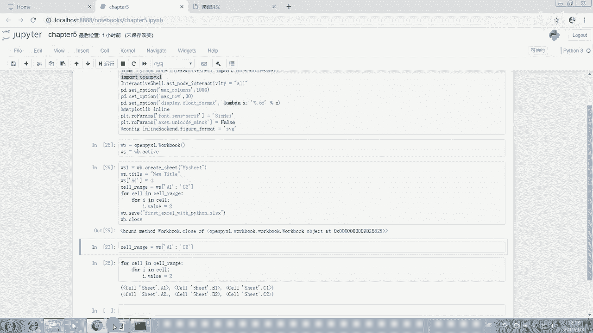

那么怎么来做呢？

呃，我们可以考虑这样做。首先呢我们要import它，我们已经import了。那么我们只需要。先要有个对象，有个什么对象，有个工作部的对象嘛，对吧？我们要对这个excel进行一个操作。那么它这个对象在哪？

这个工作部在哪？我们要打开它。那么我们可以调用这个open pie excel的一个load workbook的一个函数，这个也很好理解，load是载入载入workbook的一个函数。

我们看一下它有几个参数，一个是fi name，一个是read only，一个是keep等等等等等等。那么我们呢。只需要输入这个fireair name就好了。那么在这里呢。

我们先看一下我们要用的fireair name的话在哪啊。其实刘老师已经在data里为大家准备好了，我们就用这个。我们这里呢就用这个PE的这个data original啊，或者说我我啊sorry。

我们这里用这个test就好了啊。这里我们用这个测试吧啊，test。所以呢我们在这边呢要用一个相对的一个。相对的一个路径，data里面的一个test的一个路径啊。好，我们用这个文件。呃。

data里面的这样一个文件，我们对它进行一个load，打把它导入进去。我们点一下运行。好，它正在导入数据。好的，你看这个地方已经导入成功了，显示。那么导入成功以后呢，我们现在要查看一下一些基本的内容啊。

比如说我们想看一下这个工作表到底有几个工作簿啊，就这个工作簿到底有几个工作表啊。所以呢我们就workbook嘛，是工作簿。那么我们还要看它里面有几个表。那么表呢，我们看一下。

这里它会有一个hoet sheet names这样一个属性。那么我们点一下，然后运行一下。那么我发现哎，它只有一个工作表，这个表的名字就叫做profit，也就说是一个利润的一个情况。一个表。

那么我们现在呢。想查看一下这个工作表的所有的数据结构，怎么查看呢？我们可以做一个循环，把这个表全部看一遍for row in这个row啊，这个不一定要是要是row啊，这只要是任何一个代码都行。

任何一个代号都可以啊。for role inWS点 values。这什么含义呢？就是说我们。对于这个WSWS大家都知道的是work sheet。

那么这里的话呢呃我们还要定义一下这个work sheet啊。对，还要定义一下这个WS。WS会等于什么呢？我们很清晰的知道啊，WB它是不是有很多个工作表啊。那么它今其中的一个工作表，我们已经查出来了。

它的名字叫profits，所以我们只要。把这个profit输进去，我们可以运行一下。这样的话呢它就是一个WS，我们就把这个WB这个工作表。

它里面的这个profits这个工作表WB这个工作簿里面的profits这个工作表，我们把它给赋值给了这个WS也就WS呢成为我们现在研究对象。WS的话呢。

它里面呢是有很多很多值的一个一个一个一个的sell。那么我们用WS点values呢，就是把WS啊这个页面所有的值。全部作为一个对象。然后呢，forrow对于这个WS这个对象，这个所有的值。

我们对于里面的每一行来说，我们都去把它打印在屏幕上。这样呢就方便说我们不用打开一个excel，我们也可以看一下它里面大概的数据类型是什么样的。好的，因为这个数据的内容呢比较大。

所以呢呃我们来看一下这个数据是什么样。我们看一下呃，可以看到这个数据已经被打印出来了。我们发现这个数据呢是这样的，它有时间有。这个股票的代码，我们看现它名称是date日期。

然后代码名股票名、行业名、利润名，然后它中间还空了两行，它不是一个连完整的表格，它空了两行啊，它空了两列，它空了两列。然后紧接着呢有一个行业名。然后有一个总利润。那么可能呢这个的地方呢。

我们要求的是什么呢？要求的是呢，我们要把前面的数据呢都读进前面的所有的数据读进excel里。然后根据呢每一个个股的利润呢，我们要去计算呢以及个股的行业分类，我们要去计算每一个行业的总利润。

然后并且填充到这个行业的名称后面我们要做这样一个工作，我们可以把它分成好几步来做。第一步是什么呀？第一步呢，我们要把这些数据把它给读到excel啊，读到我们的pyython里面。

把这个excel数据读进去。那么这个时候呢我们就要想。我们这工作表到底有多长呢？工作表有多长呢？所以呢这里呢我们就要用一个。我们要用一个函数来查看一下我们的工作表的长度。那么我们随便取一列，比如说D列。

那么我们WS它有一个D列，我们直接取一个D。啊，WS啊这个工作表。WS这个工作表的第一列，我们来看它有多长，我们运行一下。3062。所以呢也就是说啊这个数据呢，它一直到了第三，它一共有3062个六行数。

3003602行数据啊，这个第D列。那么D一列我们可以看一下，其实就是这个呃industry这一列，它有30602行数据。那么我们现在想一下，就是什么数据最适合保存我们这个既有行业，又有它的净利润呢。

然后来进行一个呃计算呢。那么在这里的话呢，我们选择的肯定是字典，为什么呢？因为字典可以有一个行业啊，对应的是有。一个行业对应一个净利润，对不对？一个行业对应一个净利润。

我们这边选择一个字典来保存这些数据。那么我们现在呢呃给大家介绍一下这个caon里面的这个循环。就是在这个excel里面，我们怎么处理这样一个。数据怎么把它导进来？那么这里呢我们用一个列的使呃，一个那个。

我们用一个这个行的循环。forrow inWS点。Ey turtles。那么这个函数是什么含义呢？会有说这个操作，它也就是说啊我们现在的一个研究对象呢。已经转转变成了一个。我们想一行一行来读取数据。

然后我们只想选择其中对我们有用的那两行哪两行呢？我们只想选择industry那一行呃，那一列industry那一列就是每行里面的industry那个值以及那个profits的那个值，我们只想选这两个值。

然后呢我们再把profits对indu industrydu进行加总，我们只想这样做。所以呢我们这个ro呢 for row，就是说对于后面那个WS点act rose，对于后面这个循环里面的那个内容呢。

我们只想取其中的每一行，我们这其中每一行进行一个操作。那么后面这个的话呢，我们发现它有一个MINro，它几个参数啊，最小的一个ro是多少，然后最大的一个。呃，肉是多少，然后最小的一个这个coum是多少。

最大的一个coum是多少？那么我们这里只需要输入一个，比如说我们现在想知道最小的一个肉呢，我们等于。2。然后最大的一个colon呢等于5，为什么呢？因为我们知道我们只想要第一列第一第一列date。

第二列coded，第三列name，第四列industry，第五列profis后面的呢因为都是空的嘛，空的两列，所以我们要前五列，然后呢。最大的一个。sorry啊，这边打错了，这边我们要改一下colon。

然后最大的一个。列那是多少列呢？我们刚刚已经算了是3602，对吧？这个地方呢，如果你不知道呢，我们就用lan刚刚那个函数来表示，我们就用lan的这个WSD来表示。这样就能把所有数据都提取到了。好的。

然后冒号。然后这里呢就是说啊对于我们这个前五列的每一行来说，我们都要做一个什么操作呢？我们都去把这一行的这个。把它附到一个字典里。好，我们来看一下rose ray是什么含义呢？

就是说啊我们每一行的第三个元元素，我们数一下每一行、第三个、第一个、第二个、第三个、第三个是。呃，sorry等下第0个第一个第二个第三个啊，第三个是什么？是industry。因为我们说的是从零开始的。

所以呢我们我们刚刚也讲了，它每一行打印出来是一个topuple嘛，这个topuple的话，我们就可以用索引去索引它，所以呢呃实际上呢每一行的第它那个三号呢其实就是0123就是我们这个行业。

所以呢我们就希望这个行业啊就是dt字典，它的这个建值是行业，对吧？行业的话要点value嘛，我们才能取到这个值，这个银行，比如说取出来，那么这个值呢会等于什么呢？

我们希望呢我们在字典里先找这个银行对应的利润，就银行行业对应的利润，看能不能找到。所以呢。d这个变量呢，我们有一个方法叫做get方法。就是我们在这个dict里面啊寻找一下我们这个值。

这个rose three这个value。也就我们寻找来这个值找到的话呢，那么就返回这个键所对应的值。比如说我们这个rose three的value，刚开始的话，刚开始肯定是什么呢？肯定是银行嘛。

第一个肯定是银行。那么这个时候呢，我就把银行先因为我们要注意啊，这个这种中间有一个负值号的这种等于号的，我们要从右往左读啊，因为是把右边的内容赋值给左边，千万不能从左往右读。

那么我们现在就在研究一个什么呢？我们在想啊，如果说这个low three，也就是说我们这个行业，如果说能够在这个字典里找到这个键，那么是不是它有一个对应的值啊，也就是对应的value。

那么我要把那个value给提取出来。这个函数的含义就是这样，就是如果我能找到，那么我就会提取出它对应的值来这个银行对应的值来。如果找不到呢？我们返回一个什么呢？我们返回让它返回零。你就让他返回零。

这说明什么呢？就是说如果找到啊，那么就是会把那个这个行业相应的净利润拿出来。如果没有找到的话呢，那么返回值就是0。那么这个时候呢。我们我们如果说是这样一个情况呢，那么我们这里呢把它加上一个什么呢？

加上一个最新的嘛，最新的是什么呢？最新的是ro。forour就是我们这一次新要加入的。也就是说之前这个提取的呢是以前的累计值。然后现在呢第四这个索引为四的时候呢，刚好就是这个值嘛。

就是我们要的每一个股每一个股票的净利润。那么每一个股票的净利润，每次循环呢这个row four点value代表的都是每一个股票它的净利润。那么前面呢代表的都是我们之前已经存储在这个字典里的这个。

单位的这个值就是这个行业的它的一个对应的净利润。那么每一次循环呢都会把新的一个行业的一个新的一个个股的净利润加上加到它所属的行业身上。因为如果这里是没有找到这个行业的话呢。

那么就会把它那个这当前的这个个股的值呢先付给这个行业。所以相当于通过这样一轮循环的话呢，所有的行业的值呢都会被不停的进行一个累加。所有的个股呢都会自动的归到它的行业里，最终形成我们这个字点。好的。

这个的话呢大家可以呃相应的理解一下这个操作。那么我们现在呢。我们先运行一下啊我们先运行一下。好，我们运行完了。我们现在看一下这个dict的一个状态。好，他已经完全的按照我们的预期。

就是实现了各个行业它的一个这个值，对吧？各个行业。每一个行业，然后它的值是OK的，它的值是不同的。没错啊，没错，所以呢每一个行业呢我们都把它的净利润进行了一个加重。

我们发现银行业有14000亿的净利润啊，在2017年，然后呢呃净利润的话呢，我们可以看一下，相对较少的话，就是休闲服务类啊，像国防军工啊，这些的利润就比较少啊，还有综合类。像银行业的净利润。

医药、房地产，包括汽车等等都比较多。这个呢我们后续呢还可以进行一些排序。好，现在呢我们先把这些数据呢想办法填充到我们的那个excel里面去，因为我们需要填充到刚刚我们说的excel的那个右边那一列。

对不对？我们现在可以打开这个excel看一眼，我们需要怎么填充。刚我们说啊我们要把这个填充到这一列来，填充到这一列了。好，那我们现在呢就可以来看一下我们要怎么把它填充过来呢？那么首先呢我们也想说。

我们要看一下，就是说呃这里的话呢，因为H列的话呢，它也是呃大概有30来3十来个行业啊，它呃20多个行业。那我们先不管它这个填充的一个到底要填充多少行，我们就可以说我们先假设我们要使用的一个范围啊。

要使用的一个范围。我们要使用的范围呢，显然就是。这个哪一列呢？我们来看一下。呃，我们这个地方呢要使用的范围呢是哪一列呢？我们看一下。刚刚我们。有一个预览的一个功能的那个方式，大家还记得吧？

我们就可以不用打开那个excel了。我们直接看一下我们要填充哪一列。for row inWS点value。Priinnt肉。啊，这个方式我们来看一下预览。好，大家看见了。

我们来看一下这地方呢它的这个列的话呢是。我们要打印在这一列，大家看见了，打印在这一列。所以我们来看一下这ABCDEFGHI。好HI。所以呢我们要打印在I列，我们要打印在I列啊。

那么我们这里呢选取的一个范围呢，我们要把这个范围呢叫作为一个判断。就是我们要先判断你这个行业和我这个字典里的这个行业是不是相等的，或者说我们要先判断你这个。就是我字典你这个行业。

如果跟你那个行业是相等的话呢，那么我当然就把你给。我当然就把你给这个值给它呃复制过去，或者给它复值过去。我们看一下，所以我们这边呢用来判断的这个区间呢，我们是WS这个workheet的这个H列H一列。

と？这个到哪一列呢？到我们的I列。那我们的I几呢，所以这里就要判断一下，我们现在先给一个结尾啊，因为我们现在不需道它到I几，所以我们就到我们的I列。加上一个我们的。Yeah。这个刚刚那个3602啊。

我们刚刚还记得。它的长度是3602，所以呢我们就可以把这个使用的范围放进来。然后呢，就对于然后这里的话呢，就是它到这个end结尾，那我们这边就不用了，我们这边直接就I3602嘛。ok。

因为我们也没有数它具体是多少列，所以我们宁愿多放一些列来进行一个判断也无所谓。那么对于这个I在我们要使用的范围里面的这个I来说。如果。我们这个取值什么什么意思呢？I0。

就是我们现在呢依然可以用我们这个字典的这个方法。W。依然可以用字典这个方法。我们这一行代码是什么意思呢？就我们依然用这样一个字典的方法，就是说啊对于我们使用的这个range里面的每一个I来说啊。

如果呢这个大家要看啊，这个rangeus range呢里面的I呢，我们说了是按行来提取的。所以说呢就相当于对于每一个行来说，我们看这H一到I这么多，它实际上呢是有两列，对不对？是有两列。

所以对于这个两列里面的这这个区域里的每一行来说呀，那么我们取这个行的第一个字母的这个第行的第一个元素的这个value。取这个行的第一个元素的value。第一个元素。

你想一下H1到I3602这个H这一行的第一个元素是什么呀？当然就是行业。这个行业的value呢就是这个行业自己的这个值嘛，就这个行业的名称，我们现在d get这个行业，如果get到了这个行业呢？

那么我们我们返回的值呢，当然就是这个行业的净利润。如果get不到这个行业的话，就是get不到你这个行业的话呢，那么返回的值呢当然就是0。所以呢如果说啊我们返回的值呢不等于0，那么说明什么呀？

说明我们找到了你这个行业嘛，就说我们通过你这个I零这个元素，我们找到了你在我们字典里对应的行业。那么这个时候呢，我们就要把谁填充进去啊。😊，我们就要把这个I1I一对应的什么？I一对应的其实是I那一列。

对不对？I那一列，我们I一的value这个值呢就会等于什么呢？等于我们这个字典里对应的I零的值。因为I零其实就是我们说的行业嘛，就是我们刚刚个行业嘛，对应的I零的值。好。

因为字典啊大家一定要去理解我们说的最基础的这些。数据结构，比如说列表，比如说字典。那么这个时候呢，我们字典dict是一个大字典，字典里面呢，我们把这个键值，键值是行业名称嘛，I0是行业。

行业点value这行业的名称给它放进去。那么我们这个呢可以进行一个运行。运行完以后呢呃这个。这个呢运行完了，它就相当于已经把这个填充完了，我们待会儿打开可以看一下。这个时候呢我们要保存。

所以呢就WB点safe。我们保存一下这个文件，保存为test。Finished。点XLSX。我把它保存起来，那么WB点close，我们把它关掉。好。运形一下。好的。

那么我们现在发现呃工作目录上面多了一个呃test finished。我们打开来看一眼。好的，我们这边呢不仅仅呢把刚才的那个净利润呢给它进行了一个呃处理，对吧？我们已经把它用一个字典呢给它算出来了。

其实呢我们还怎么样呢？我们还把它给输入到了这个excel里面的一个对应的位置。这就说明啊在我们工作中呢，其实大家可以结合自己的需求。做任意的一个个性化的一个输出处理，这是都可以的啊。

就对excel的话呢操作呢呃还有很多很多的细节。那么那些细节呢，我在这边呢就没有办法，因为时间关系就无法一一的把这些细节详细的给大家讲讲讲了。但是呢我们可以推荐大家就是说在课后呢。

大家如果要学习的过程中呢，就多去看一看官方文档。

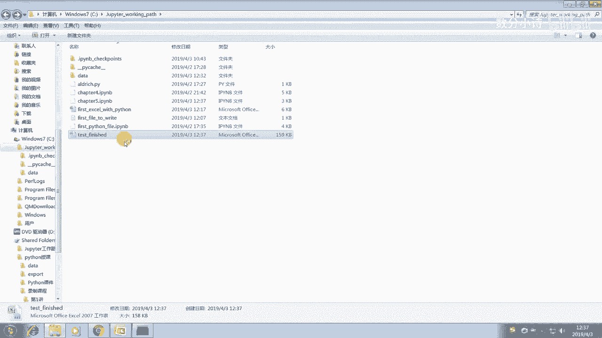

大家只要打开这个搜索引擎，搜索open high XL document。那么大家看下这个第一个呃，sorry  not not this one呃，我们只要搜索open派 XL就好了啊。

大家看下这个啊openelpyython library to read打开这个的话呢，这是一个官方的 tutorial。那么在这里面呢，我们可以它就会详细的介绍这个openel的一些特性。

那么我今天上课呢给大家介绍的特性呢是最常用的一些特性。那么那个 tutorial里面呢，还有很多呃比较好用的，包括你用excel能够处理的所有的内容。我们用这个open pel呢都能够去操作啊。

我们用pyython呢都可以去做。而且呢可以把它封装成一个函数。像上节课我讲的封装成一个模块，使得它自动化的一个运行。那么今天的话呢这个部分的这个excel部分呢，我们再举最后一个例子。

啊，我们接下来讲一下怎么用python来批量重命名我们的excel的工作表。那有的时候呢可能比如说呃朋友们会遇到。呃，同学们可能会遇到就是一个excel的话呢，它有多个工作表。

然后这些工作表的名称呢可能它并不统一。然后呢，在后期进行函数的循环调用的时候就比较麻烦。我们就希望这个它的工作表呢这个能够统一起来。

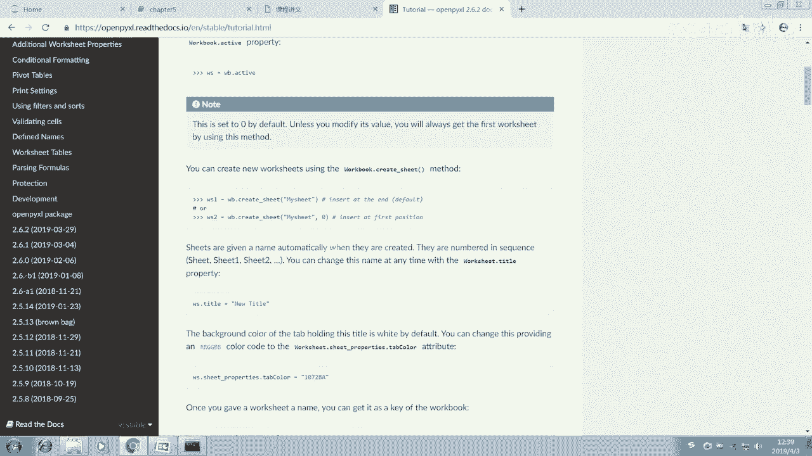

那么基于这种需求的话呢，我们可能就需要对这个工作表进行一个重命名。包括后期的话呢，对一些工作部的重命名，其实思路也是一样的。那么我们今天呢就带大家看一下呃一个工作表的重命名吧。

我们先打开一个本地的一个工作表。这个工作表的话呢是刘老师呃在分析数据的时候呢，用到的一个工作表，主要是股票的PE的数据。那么我们来看一下。呃。

我们现在呢这个工作表呢存放在我们的working pass的。这个data里面data的PEdata original。所以我们这个地方用相对路径，只要输入data。然后。data的话呢。

我们还需要一个呃PE datare，我们把这个名称复制过来PEdare号就是它。那么我们把它呃open派 XL然后load把它载录进来，作为我们的这个WB，也就是workbook对象。

那么对于我们现在先要看一下这WB它的一个去name有哪些。我们现在运行一下这个程序。然后我们看一下它的它它到底有多少个工作表啊，就这个WB这个workbook里面有多少个工作表。She。嗯。好的。

我们看一下这个所有的工作表呢就读出来了。它已经把这个工作表的这个ho name啊，WB呢是我们的工作簿。那么工作簿有一个属性呢叫做ship names。这个我们之前已经讲过了，刚刚刚刚已经讲过。

那么点s names呢就可以看它里面的工作表的名称。那么我们发现工作表的话呢，是从-12一路到了170。那么我们就现在呢我们在分析的时候呢，因为我们调用一个range函数的话呢。

可能这些工作表看起来很不舒服，我们希望把它们改成呃，以A开头从零开始啊，比如A0A1A2A3A4，一直到最后的一个工作表的一个这样一个情况。啊，我们看一下这个sh names的话。

就是这些我们想看下它一共有多少个，我们可以调用这个lan land函数啊，因为。因为这个的话，我们观察到呢它这个是names呢，它输出的时候，其实是一个list。

所以我们直接调用name函数可以看一下啊，有120182个工作表，工作表的名称分别是这些。那么在这里呢，我们就想呃把这些工作表重命名啊，那么我们就for I in range。

我们从这个rangech的话呢，我们从这个。直接是把这个长度给它这个。呃，列表的个数给它放进来。那么我们就可以啊对每一个列表呢，这个对每一个这个I呢对这个列表进行一个操作。

那么我们先定义一个work sheetets。那个要操作的这个工作簿里面的工作表那我们就是这个地方可以这样调用一个work sheets点。那么这个的话呢，它可以调用这个工作表I啊。

这个I呢就是说第几个工作表。大家看见啊，上面的话呢，我们这里有182个工作表。那么当这个I呢I呢 for i in range length。那么对于I呢在这个范围内啊，在这个范围内的I。

那么也就是说第一个I呢是零，也就是说这个地方。WB这个工作部的这个工作表0，也就是第一个工作表，工作表00是第一个嘛啊，工作表0对于这个工作表来说，我们把它定义为啊把它赋值给这个WS。

那么现在对象到了WS。那我们要修改它的title啊，它的名称。title那么这里的话呢，我们就从A啊，我们要把它改成我们固定的格式。也就是要改成A和I的格式，也就是A0A1A2A3。

那么把这个循环做完呢，我们这个表就改完了，最后要safe一下啊，不要忘记保存，把它保存为。我们这个工作路径里的PE。Revised。这是我们修改后的一个。PE的一个文件，我们运行一下。点击运行。好。

他就开始修改了。那么我们耐心等待一下，等它修改完。好，这里它已经修改完了。那我们用WBclose把它关掉，点击运行关掉。好的，我们现在来看一下这个数据这边的话，出现了1个PEre还是很大的一个数据啊。

17兆的一个excel。我们可以打开看一下它的一个具体情况。这个excel非常的大。如果单纯的话，比如说像一个呃比如说。一个金融分析师，那他打开这个excel项目我我那个刘老师平时打开这个excel。

那么打开的话呢，我们刚刚算一下，大概就要花个几十秒。那么真正的你再去一个一个的去查看这些工作表的时候呢，你发现呢也是要花非常多时间。如果你真正的去处理这些数据的话呢。

包括把他们进行一个相对来说不管怎么样的处理，一个月一个月的去算它的平均PE也好，那么要计算完就整一个表呢，要花特别多的时间。但是呢如果说你把python呢，我们这个学好的话呢，可以很快的啊。

像我刚刚读取这个表的数数据，所有数据读到python里呢，大概也就是花了几十秒的时间。然后我们进行一个这样的修改批量修改，也就是几十秒的时间。但是如果作为一个呃工作人员的话。

要去手动的一个一个的去修改的话，那么我们算它修改一个。如果是10秒的话，这么100多个也要1800秒啊，这么1800秒的时间的话呢，还是算它完全不出错的情况下，如果他一旦出错的话啊。

那这个也是对后面的一个计算造成很大的影。

じゃ。好，那么讲到这里的话呢，我们这个处理简单的这个处理excel的部分就讲完了啊。大家如果对我们相关的这些内容的话呢，非常感兴趣的话，我特别建议还是说大家就是课后呢多去阅读一下这个tutorial。

就是这个open pie XL的一个 tutorialial里面呢有很多功能啊，除了说简单的数据和导入文件，那么还有很多其他的一些用法。比如说呃和呃画图啊，画做表啊等等的。大家可以去研究一下啊。

所有的这个excel的功能呢，我们都可以通过python的这个呃模块来实现。好的，我们接下来呢我们最后讲一个金融分析的一个例子。

这个例子呢我相信呢其实呃很多金融分析师呢也都会有过类似的一个呃一个工作的经历。就是说啊我们今年呢以来呢，2019年以来呢，其实股票呢市场涨得非常好。尤其是过完春节以后啊。

包括春节前后那个股票市场的上涨是涨的非常好的。那么整体的话呢就表现出一个什么情况呢？就表现出。

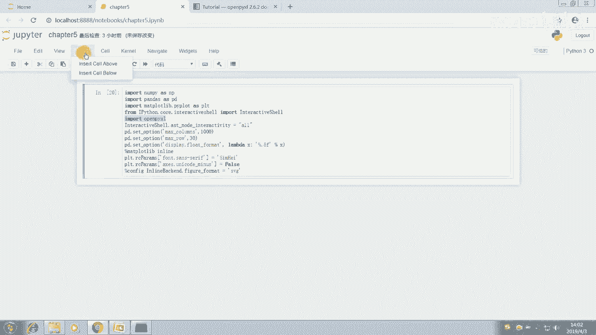

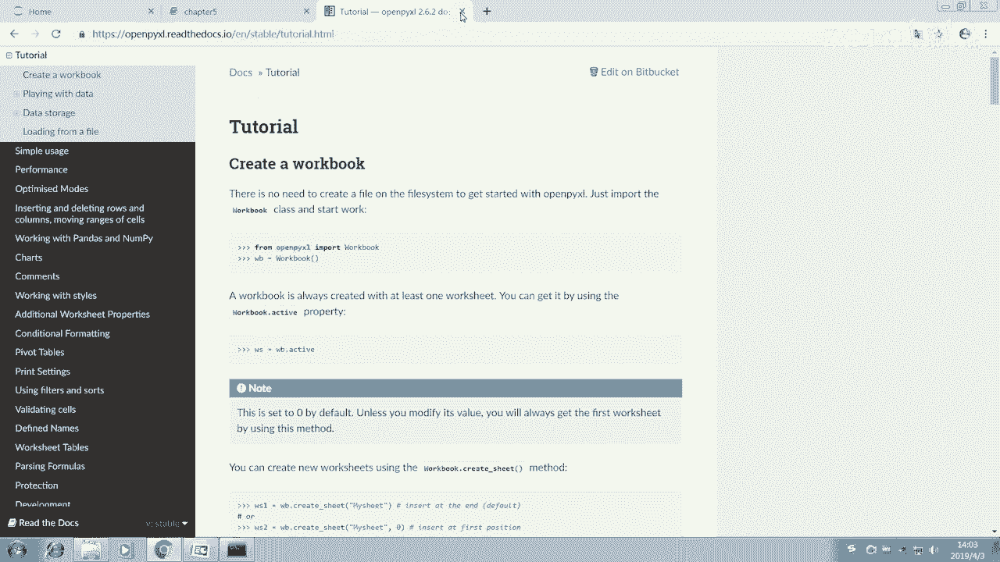

整体呢就是说出现一个多周的一个连续上涨啊，最多的时候呢涨连涨了8周。那么我们现在呢就是想啊就是在涨到第八周的时候，我们就在想说股票市场它的上涨呢肯定不是说可以一直连续的涨的。那么。

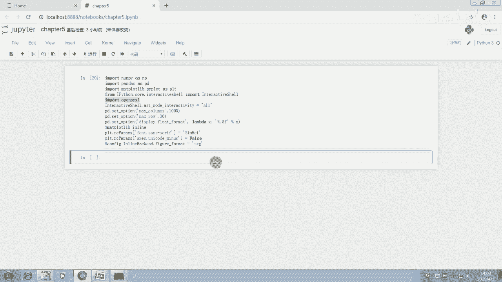

到底历史上像这样连涨8周，连涨7周，连涨九周，连涨10周的情况到底有哪些呢？我们想来看一下。那么如果你去翻看历史的K线，一个一个去数的话，那么从上证有史以来数到现在1990年到现在，那么要花很多的时间。

但是呢呃我们今天呢就讲一下，我们用python怎么去把这么一个简单的想法呢？我们想就这这一个想法去进行一个实现。

那么最简单了，第一步呢我们肯定要有数据啊，我们要有数据。那么在这里呢呃刘老师已经给大家在data里面下好了这个数据了，就这个SJJS这个TXT文档，我们已经把数据下好了啊。

刚刚我们也给大家看过了这个数据，从90年到现在的一个周涨幅都已经下好了。😊，那么接下来呢这个数据的来源呢，当然是万德科金融终端了。所以呢我们现在要做的呢就是说来先把这个数据读取进来啊。

然后我们再考虑怎么分析。第一步，我们要读取数据。那么我们把它读取进来的话呢，我们肯定是用的我们导入TXT文件的，就wa open。Yeah。我们这个文件在beta，我们用相对路径beta。

上证指数TSTOK。我们把这个数据导进来，然后。不要忘记这里我们要给它一个中间体啊，或者说叫fire handle。which open这个fire as fire handle。

那么我们现在要做的呢就是说我们先得把这些数据呢把它储存起来嘛。这些的话呢，其实在我们刚刚那个呃把这个数据呢做成那个导入python呢，我们都讲过了。我这里的话呢就直接把代码给它写上去啊。

这些我们刚刚都讲过了，我们建立一个date来储存日期建立一个PCT来储存这个涨幅。然后我们对它用一个split函数，把它的这个日期和涨幅呢分别储存在两部分里面。sorry，这里继续两部分。

然后date呢，我们用一个append啊，我们把这个A呢append就是每一次循环中的A都追加到日期里。然后每一次循环中的涨跌幅呢都追加到这个。呃，PCT这个列表里。然后呢。

我们现在呢就因为我们说了这个PCT这个列表呢，我们刚刚已经研究过了，我们看一下PCT这个列表呢，因为它是一个这个。PCT。😊，哎，我们看一下啊，稍等这地方我们没有没有加for啊，sorry。

这地方呢我们要for啊，要对于这个four line in。F handle。对于这个fire handlele里面的每一个每一行来说，我们都进行这个操作。然后呢，这个循环以后呢，我们这个PCT呢。

它就会是一个列表啊，就是我们这个涨跌幅的列表。大家可以看到啊，这涨跌幅的列表。那么发现它是一个文本或者说string格式的字符串格式的。我们要把它想办法修改成呃数字格式的。那么我们用一个循环的操作啊。

我们先定义一个新的PCT的一个涨跌幅。牛PCT。然后我们来定义一个最终储存我们这个呃需要的数据的一个字典。为什么要定义一个字典呢？就说呀呃在我们这个最终的要展现的形式呢。

就是说比如说我们自点的见值呢就是连涨7周，连涨8周，连涨9周，我们肯定是一个这个代表周涨幅的一个数呃，代表连涨的数字。然后以及后面那个代表的就是连涨这么多周，然后它结束的终结的时候的这个日期啊。

比如说我连涨7周了，然后这天结束是在2018年8月1日。那么我们应该这个七这个。K这个值KC这个键值的后面的对应的那个值呢，就应该会包含了这个2018年的8月1日。好的。

我们现在呢先要把这个PCT就是这个涨跌幅这个数据呢，我们把给它把它改成这个数字型的格式啊，就是说改成浮点数，而不能是文本，或者说不能是这个str字符串。那么我们对于这个PCT里面的每一个。

每一个元素来说啊，forI inPCT。那么我们都有这个new的新的PCT。我们把这个它的那个浮点数的形式。upend到这个新的PCT里面去啊。O。我们fat eye呢就把这个。字符串的I。

也就字符串的涨跌幅呢变成了我们的浮点数，然后把它append到新的这个PCT里去。这样一来的话呢，我们这个循环呢就完成了，就把这个新的PCT给做好了。我们现在可以看一下这个新的PCT。

比如我们把它print出来。😊，Print new PCT。那么我们看一下，这就是新的PCT，它已经变成了一个呃字符串呃，变成了一个这个数浮点数的一个形式。那么我们现在要做的呢。

就是说我们要把这个呃最终的这个形式把它给做出来，就是怎么去存储这个数据，就是把每一个对应的连长的周数。以及它的终结的时间给它匹配起来。那么很简单，我们现在对于呃rangech for in range。

我们先看一下一共有多少个date，对吧？我们要对每个date都进行一个循环。那么呃这个情况下呢，我们看一下data的。Data I。要等于6。PCTI。

那么也就是说啊我们说对于这个这么多个有这么多个日期而言啊，每一个日期呢它都会有一个这个相应的一个涨跌幅，对吧？它都会有一个相应的一个涨跌幅。那么我们就把这个数据呢给它对应成做了一个字典。

每个日期都对应了这周的一个涨跌幅。那么接着呢我们要定义一个数字，用一个count来定义。这个count的话是什么呢？我们把它从零开始，也就是说它对这个。连续涨涨的这个周数啊进行一个定义。

比如说这个第一周涨了，那么我们把它定义为countt就等于1就0加1，然后再涨了一周，我们就一加一，再加上一个一，再涨一周再在基础上再加一个一。那么这样的话呢，就可以统计出，哎。

这一次的连涨到底涨了多少周。那么我们还要有一个最终的结果，我们希望用字典输出，也就是每一个数字对应的是连涨的周数。这个周数的后面呢对应的就是它的一个这个连涨结束的日期。好。

那么对于这个字典里的K和V来说呀。对这个data这个items里面呢，K和V来K和V来说。那么如果啊这个V呢，我们要想啊，如果啊这个V呢一开始呢就大于0。啊，注意啊我们这边是用个循环。

就是说对于这个我们刚刚保存的这个数据，就是日期和它当周的涨跌幅对应的这个数据。这个字典数据来说呢，它是有KV的。我们说过这个用这个循环表示，我们也讲过了。在之前data点ites。

大家可以复习一下forKV in data点ites就对于这个data这个字典里的。周的日期以及它的周的涨跌幅而言，哪一个这个而言。那么如果说我们现在进去的这个。涨跌幅V呢它会大于零的话。

那么我们count呢就在count的基础上加一，这个时候是不是就连涨一周了？那么反过来呢，如果说不是这样的al，如果不这样的话，那我们要注意了，这里就有一个date list。

我们给它定义一个空的date list，然后date list。D append。K这个时候我们就把这个K。给它放进去，这什么意思呢？就是说如果啊你大于零的话呢。

我们这个时候呢会把帮你不停的在呃重新的去加一周加一周加一周。但是一旦你比零小了，那么我们这个时候就要该把你的这个日期给保留下来了，就把你的日期保留到我们这个date list里了。

那么我们这边会设置一个结果result count。也就是说最终这个结果呢是个字典嘛，也就说字典里面的键值呢是这个count，就是这个连涨的周数。那么我们result点get。

那么我们依然是从这个字典里去找，到底这个字典里找不找得到count这个连长的周数。如果说找到了的话，那么我们我们返回的，当然就是这个周数对应的那个列表。如果我们没找到，我们就返回一个空的列表。

那么这样的话，这个空的列表列表之间的一个相加嘛，列表的一个相加。我们有学过，把之前的这个列表给它加进来，就是把我们这一次的新列表在之前的基础上加上我们这一次的新列表。😊。

那么最终呢我们还记得把这个count重新归零。因为下一次count呢又从零开始计算。那么这样子做的话，我们把它运行一下。呃，运行完这个函数的话呢，我们可以先看一下呃，我们在这里的话呢。

给出来这个results。我们先看一下上面的第一步算传来那个data吧。我们看一下我们这这个数据里用的data是不是一个字典，这data呢是一个字典啊，是日期和周长跌幅的一个对应。

这就是我们把刚刚那个文本文件，给它转到了这个呃给它读了进来啊，把它做成了一个字典模式。然后呢，现在呢我们的一个最终的结果，result是不断的在循环中，我们去把那个连涨的周数的这个对应的值。

连涨周数对应的值进行一个点呃累加进行一个修改。我们就发现是这个样子的。我们把它print出来吧。printnt出来会看起来更很舒服一点。Oh。printnt出来的话呢。呃，就是这样子的。

我们发现啊连涨三周的话呢，他就把这些日期都给标出来了，都给标出来了。然后连涨多少周多少周他都给标出来了。其实啊所以这里的话呢，我们就它就已经完全都是标出来，但这样看有点混乱，我们把它输出，好吧。

我们把它输出，我们现在用一个文件把它输出wa open。我们创建一个文件叫做。上证指数连涨。统计数据。点TXT我们用个TXT文件来统计。那么我们这个时候模式是right啊。

我们不需要给它那个append东西上去。我们用right的一个模式as fire handle啊。Yeah。把它作为一个firehand。那么我们对于这个我们已经出了结果的这个字典里的KV来说。

也就是result点iteems里面的这个K和V来说啊，我们把它们print出来我们只需关注那些周涨幅特别就是连续涨特别多的，因为为什么呢？因为它连涨个一两周的，我们其实觉得这个不是很稀罕。

但是连涨6周在历史上就比较稀罕了啊，我们把这个大于等于6给它弄出来。这个的话大家可以自己选择这个数字handle firehandle点right。那么我们这个地方可以输出连掌。

那么我是不是教过大家一个这种d format mat的一个方法。我们在这边先给一个大括号，待会我们再把变量填进来。多少周的。情况对应的。被终结。日期是。那么我们这边呢把它给拿个forat点format。

好，那么你看一下我们前面是不是留了两个这种大括号的内容啊，也就是说我们后面要有两个变量来填充。那我们看一下周对应的变量是什么呀？周对应的变量是K呃是K。就是这个键值。

然后我们后面那个被终结日期对应的变量是V。那么这样子的话呢，我们在。最后呢就发人handle。点close，我把它给关掉就好了。okK运行一下。好的，已经输出完了。我们来看一下这个呃输出的结果有没有啊。

在这里看见没有？在这上证指数连涨统计数据。你看这个时候呢只有1KB啊，我们打开来看一下。呃，这里就写了啊，连涨6周对应情况是，然后连涨9周，我们发现呃这样让人看起来很不舒服，对吧？

我们希望能够把它呃对应输出在一行是一种情况。那我们进行一个调整，只要这里加一个杠N就好了。我们加一个杠N进行一个换行。这样就OK了，我们来运行一下。好的，我们现在再打开看一下。好，现在这个就非常美观了。

我们可以看一下呃，连涨八周的话呢，像2019年的3月8号呢就把它终结掉了。也就是说呃这个是小概率的一个事情嘛。我们看一下。

这就是上证指数的历史上连续上涨超过6周的一些可呃一些存在的一个日期而被终结掉的一些日期。然后还有连涨29周的情况，是出现在92年，包括连涨16周。那么这些呢其实就可以作为一个可视化的数据的数据源。

我们之后就可以把它画图啊可视化出来。那么因为刘老师呢之前呢是在做券商的策略组的研究工作。所以呢我就会经常做相关的这种金融统计的数据分析。那么比如说像这个我们刚刚编的这个程序呢，我们就可以把它保存起来。

然后稍加修改保存起来啊，我们作为一个呃函数也好，作为一个普通的一个python文件也好，还是说作为一个模块也好，在下一次呢你再遇到连续涨了很多周或者连续跌了很多周的时候呢，你可以把它调出来作为一个统计。

那么在这个分析的时候呢，就可以相对的来说作为一个数据的支持，就不需要每一次呢都去重新的呃拉数据，重新的去把这个。呃，相关的内容重新的再再去算啊，每一次都要用excel的重复的把那个工作的计算一遍。

我们觉得这个也是挺费力的。所以呢像这些代码呢，虽然看上去这第一次做起来有点复杂，但是呢只要你把这些代码汇总起来，然后保存下来的话呢，在之后的每一次遇到类似的工作的时候，你都可以把这个代码拿出来。

我们直接执行，或者说你已经把它封装成函数了，经常可以去看一看执行一下。呃，那么今天的话呢我们的主要的内容呢就讲到这里呢就结束了就结束了。那么刘老师要跟大家说的呢。

是大家一定要呃在课后多多练习我们的上课讲的相关的内容啊，千万不能放呃不能把代码直接复制粘贴。然后这样的话呢会使得这个学习效率非常的低。那么在我们的pyython的课件的里面的相关的资料。

也会有我们的这个课程讲义。那么大家也可以。对照着我们的课程讲义进行学习。那么课程讲义的话呢呃刘老师都会自己把代码执行一遍，所以呢肯定是呃没有任何问题的啊。或者说如果大家发现问题的话呢。

其使与我们联系也是可以获得这个解决问题的一个办法。那么这些代码的话呢，我希望大家可以课后自己思考一下。刘老师编的程序呢呃很多比较好的一些思维或者说一些简洁的写法其实是并没有采用的。为什么呢？

因为刘老师觉得啊所有的这些内容呢，我都是用咱们给学员讲过的内容来编写的开始的编程呢不在于你编程序有多短，有多简洁有多快啊，刚开始的话，我不建议大家去求短求快求复杂，而是建议大家把最基础的循环。

最基础的这些呃知识，一个一个的学会，然后把它们串起来使用。即使你编的程序看上去比别人的是别人长度的好几倍。但是你能同样完成一件事情。速度的话即使慢一些，但你依然是OK的。我们。

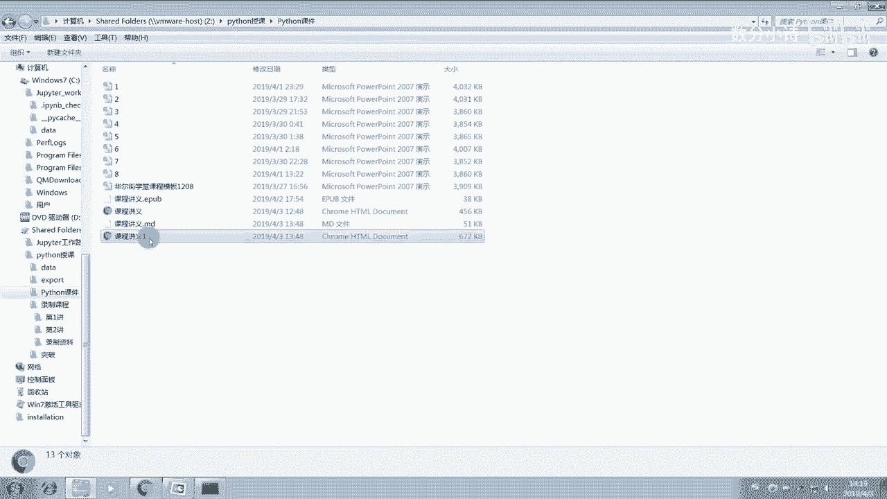

不不不追求刚开始就那么简洁。因为那样的话呢，其实并不是pyython所提倡的python所提倡的是可读性强啊，可读性强以及这个代码代码看起来是非常的简洁。但是实际上的话。

我们不追求那种呃非常隐晦的简洁啊，当家希望大家能懂得。所以当你刚开始学的时候，你看别人的代码，你看不懂，这很正常，因为很多编程的老手，他更希望呃自己的代码显得非常的短，非常的简洁。

所以他用了很多隐视的表达方式。那么在这里呢，刘老师不建议大家学这些隐视的表达方式啊。好，我们接下来呢介绍一下这个类。那么呃类的话呢，就是是一是一种什么概念呢？我们看一下面向对象编程呢？

它是一种非常有效的编写方法。相信呢在我们这几节课的讲解过程中呢，大家也体会到了我们刘老师在每给大家讲一个内容的时候，都会跟大家说，哎，我们这次的操作的对象是谁啊，这次的对象是谁？这个对象有哪些属性。

这个对象有哪些方法，这个对象它可以有哪些函数来操作它啊，我们每次都会强调这个对象，所以呢大家在编写的过程中呢，这个类呢是什么呢？就是说它是在编写现实世界中的一些事物和情景的类啊。

然后基于这些类呢来创建对象，我们可以这么理解，就是说啊在编写类的时候啊。😊。

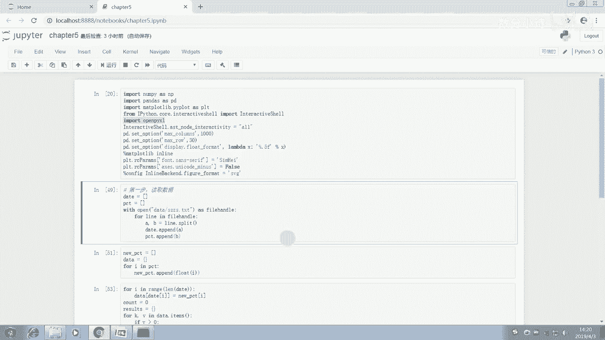

我们是定义一大堆的对象，他会有一个通用的行为。比如说。我们定义一只小狗，那么这个小狗它必须会有什么？必须会有名字，对吧？它也必须会有性别。那么这个呢就是所有的小狗啊都有的一个东西，我们把它叫类。

那么这个类呢，它是每一个对象，我们只要创建以后，每一个对象都会自动具备这种功能。就不像说不可能有一个小狗啊，我们说的是正常的小狗啊，它肯定会有性别，对吧？不可能有一个小狗，它没有性别。

OK那么但是对于不同的小狗来说呢，它可能具有不同的类型，不同的类型。那么那个的话呢，我们就是就是说在一个统一的大类的基础下呢，我们还可以再去分别啊给它定义一些其他的一些行为。

比如说它具备蹲下和打滚的功能。比如说它具备握手的功能，它具备站立的功能。那么这就是不同小狗的一个特异化。但是呢总体上来说，我们先定义了一个大的类这个类呢，可以对创建其他小狗的时候呢，直接进行调用。😊。

好的，那么具体的创建类的方法呢，我们看一下啊，这里呢就是class dog，我们可以创建一个dog。那么deefine initiate。然后这里self name age有这么三个啊，这么三个。

然后我们看一下self中定义的变量的可供选择的方法，然后self点 name点等于name啊，然self点age啊，可以把age付给他，然后我们再定义一个做下来的一个这个。动作啊定义一下。

做下来一个动作。那么就是把这个print出来。那么也就是说呢我们在对其他的一些啊，包括我们定义一个打滚的一个动作啊，我们在对其他的一个小狗。进行一个这样的呃调用这个类的时候，调用这个dog类的时候呢。

它就会自动的执行我们之前这些定义好的这两个行为。OK大家应该明白，其实就是说你已经定义好了一个大类。那么对于每一个小细分类的时候，你去调用那个大类的时候呢，你就会它就会自动的继承那个大类的一个属性。对。

对于类的话呢，我们现在呢先理解到这边就OK了。大家不需要理解的太过深入啊。这个的话呢我们可以在后续的一个呃先把我们的金融分析的一个相关的内容学好的基础上呢，大家再去深入的学习类。

因为类的话呢是在编写我们的一些程序的时候用的更多。而在我们这个分析的一些简单的一个程序的过程中呢，其实类并不是最重要的，并不是特别重要。我们现在可以先暂时的把它放一放。那么感兴趣的朋友呢。

如果想现阶段呢就对它深入了解的朋友呢，也可以呃登录这个python的官方网站阅读一下相关于类的一个描述。那么也可以课后呢和刘老师联系啊，我们一起交流这个关于类。

那么我再给大家介绍一下python的一个常用模块。那么我们在。讲到现在的过程中呢，我们也已经用过很多个模块了。其实我们用过open派的一个啊open派 exccel的一个模块，这就是。呃。

我们今天用的这个模块啊。那么呃在python里面的话呢，我们有三大模块啊，在我们这个课程里我们要介绍的三大模块，也是我们金金融技术分呃金融分析的一个。必备的三大工具。那么第一个的话呢是囊排数组。

n排数组的话呢，它就是python语言的一个扩展程序库。它会支持很多大的一个维度的一个数组和矩阵计算。那么n排的话呢，是我们在python的计算里面的话呢，用的最多的也是一个一种数据的类型啊。

我们它也会有它自己的一种数组的一个类型。那么这个的话呢，它的一个科学计算功能非常的强大啊。所以我们在这个后续的话呢，我们会着重的先讲n pile，然后再讲pas和matepl live。

那么在模块导入方面的话呢，这里很简单的一句话，import non SN这个的话呢，刚刚我们那个呃对open X L的话，我们是直接import open XL。因为它呃用起来的话，好像也不是那么麻烦。

但对于n pen我们有更方便的啊。因为我们这个要写的特别多，特别常用啊，在一个文档里可能要写它个好几十次甚至几百次。那么我们如果说还是把它完完整整的名字写下来呢，就会花挺多时间。

所以这里呢我们就直接import non sN。对于这个pandas模块的话，我们看一下啊，它的一个引入方式呢就是import pandas pandas呢是基于n的一种工具。

它和n呢可以紧密的结合在一起。但它的话呢在处理数据的时候呢，我们主要使用的是s。因为s呢它第一它读取excel等文件呢是非常方便的。读取excel文件V文件或者TXT文件是非常方便的。

其次呢这个pandas呢，它的一个呃data frame呢看起来就跟我们平常操作excel的那个工作表格里面的那种表格的一个tular的一个结构的一个数据呢。

或者说跟我们那个relational那些数据是非常的像的。然后呢这个操作起来呢是非常的熟悉的啊，对于大家来说。然后在金融分析里面，最后一个的话我们是要介绍这个matepl lib这个模块。

那么我们的常用导入语句是import matpl lib pipl asPLT。啊，这个我们刚我们之前已经讲过了，这个as呢就是说我们把它导入，然后呢用另外一个名称来代替它，也就不用写这么长一串了。

而是直接写PLT直接写PLT这个melib呢主要是画图工具啊，这个非常的可以画出很多简洁优美的图表。嗯。好，那么这三个模块呢，我们在下节课呢会着重的练习。然后实战的一个练习呢，我也已经给各位刚刚讲过了。

所以呢在下一节课呢，我们着重的介绍这三个库啊，这三个呃模块numb排pas和me leap。然后大家呢在课后呢一定要多多实训实训好好的把这几个实例呢研究研究，然后在自己的电脑里呢运算运算一下。

然后再次讲一下，就是呃。刘老师呢给各位的这个python的这个data包呢，一定要放入到自己的工作目录下面。也就是只要移动到，比如我的工作目录是jupiter working pass。

大家只要把这个data放到这个jupiter working pass下面就OK了。

那么呃之后的你的调用呢，你只需要把这个呃里面的每一个文件名呢，前面加这个data就好了。好的，那么像这些导入的话呢，大家只要把这整一个导入就好了。包括大家看刚刚我们说的import open。

然后这个import和pandadas，还有n排在这里呢刘老师都给大家已经写好了。所以呢大家直接全部整个导入就好了。包括后面的一些的含义呢。

待会儿呢这个呃刘老师在之后也会跟大家讲这些前面的基本含义我都介绍过了，那么这两个这个fromip import和这个。interactive share的话。

这两个呢其实就是说让我们每一个sell里面的所有的那个能够。显示出输出结果的都在输出结果里显示。那么我们今天的这个课程呢就讲到这里。那么下非常感谢大家的呃参与。下一次课的话呢。

我们介绍三大模块的一个自金融分析里的一个应用。好，谢谢大家。

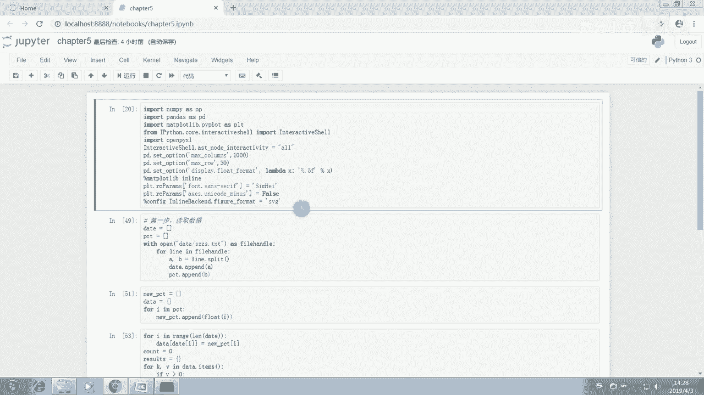

