# 14天拿下Python金融量化，股票分析、数据清洗，可视化 - P7：01 使用Numpy数组实现金融数据高效计算 - 川哥puls - BV1zkSgYZE54

同学们好，欢迎来到华尔街学堂，我是刘老师，今天呢我们来带大家学习Python，高级编程的number派包和pandas包的一个速成课程，那么在今天这个课程里呢，我会向大家详细的介绍。

number派和pandas这两个模块的一个相关的特性，以及它们在我们金融分析领域的一个啊，比较好的呃，比较合适我们金融分析领域的相关的使用方法，以及就是我们常用的excel的一些操作呢。

如何用number派和pandas呢去替代，今天的内容的话呢，我们主要是分为四个部分，那么第一部分呢是南派数组的介绍，第二部分呢是讲pandas这个模块的一个介绍，第三和第四部分呢是刘老师。

给大家带来两个实战的项目，首先我们来看一下number派数组的介绍，那么囊派的话呢。

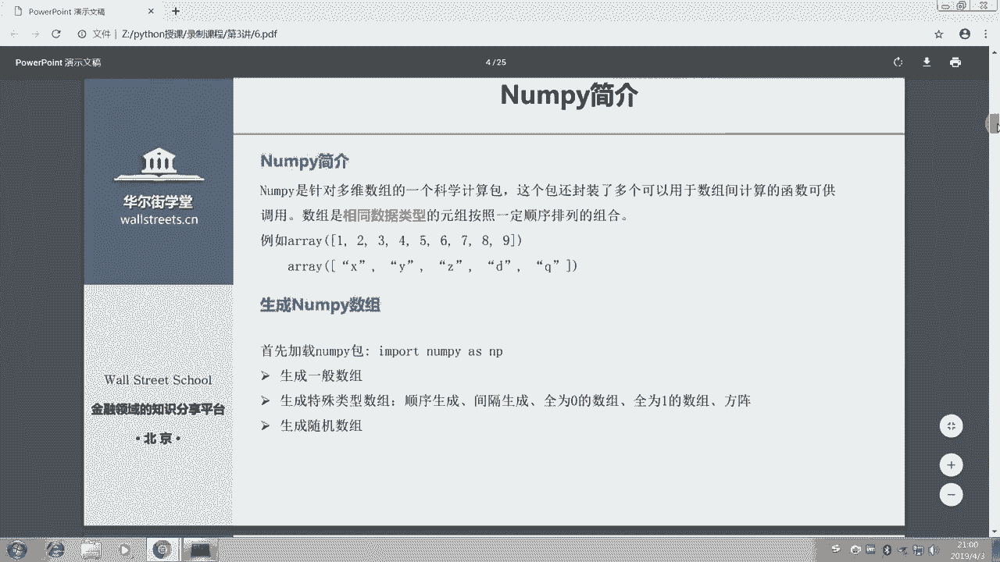

我们是呃我们先看下囊派的一个简介，南派是Python语言的一个扩展程序，它支持了大量的维度的数据与矩阵的一个运算，此外的话呢N派呢也对这个数组的运算呢，提供了大量的一些函数库，南派的话。

它是一个运算速度非常快的一个数学库，我们在Python里面呢，主要是拿它进来进行一个数组的一个计算，那么今天的话呢，我们主要是要学习这个南派的一个相关的，数组的一个构建，以及数组的一些常规的操作。

那么希望呢就是说大家在学习这个囊牌以后呢，能够把这个当排数组掌握，并且呢在之后啊学会阅读安排的一个documentation，在金融领域的使用当中呢，我们的那这个NN派呢。

通常是与塞派和matt plot lib呢一起使用，也就是和我们这个呃CP呢是scientific Python，和我们这个matt plot lib是绘图库，我们后面会讲和这个一起来使用。

呃我们是广泛用用于替代这个MATLAB的，在Python里面，那么它是一个非常强大的一个科学计算环境，有助于我们通过Python来学习科学，数据科学或者说机器学习。

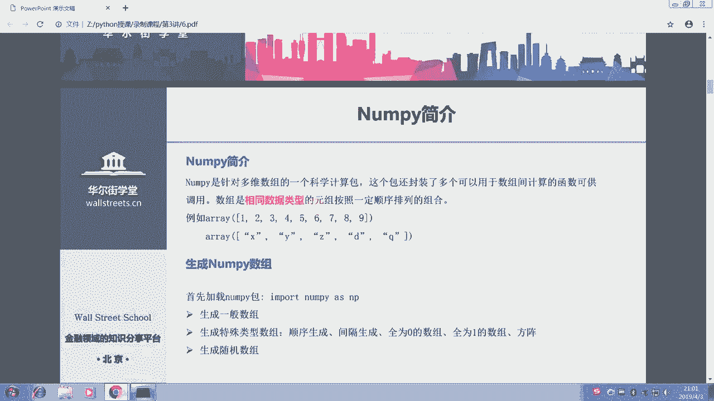

好那我们看一下南派的话呢，它是一个针对多维数组的一个科学计算包，这个包里呢有其他其他许多的科学计算的，函数呢，可以调用数组是相同数据类型的元组，按照一定的顺序的排列组合，也就是说这里要特别注意。

是相同数据类型的一个元组，按照一定顺序排列的组合，它是讲究顺序的啊，我们记得就是我们的字典呢它是没有顺序的啊，列表元组，还有我们现在讲的数组啊，它都是有顺序的，那么生成number派数组。

我们现在讲一下就是怎么去生成一个number派数组。

首先呢我们这个新的一角，我们给他创建一个新的那啊丘比特notebook，那么因为这个是我们的第三次的课。

但是这是我们的第六讲，所以我们把它命名为chapter。

好那么我们在这一讲里呢，首先的话呢我们还是要看一下之前额，我们看一下我们之前的这个，看一下我们之前的内容，为什么呢，因为我们要把那个环境的设定啊，就对这整一个的我们这个工作的一个设定。

对这个交互式的一个设定，我们可以把它复制过来，好我们把它输入一下，输入以后呢，我们现在呢就看一下啊，我们这边看大家看我们有一个import np s n p，就说我们把南派这个模块导入。

并且呢把它名字呢重命名为，或者说给它起一个代号叫做NP啊，叫做NP，那么我们现在呢就对这个number派，我们来看一下怎么去生成一个数组，那么生成一般的number派数组呢。

我们可以直接的用调用这个N派array，这个方法啊，这个函数我们调用N派array，然后在里面呢，输入我们想要形成的这样一个数组，我们给它输进来，比如说0123456好，我们把它给输进来。

然后运行这样的话呢，我们这个array1呢就额创建好了，这就是一个一般的数组，我们点击一下运行array one，那么它就是一个0123456的，这样一个数组，我们把它叫number派数组。

那么RETWO的话呢，我们再创建一个数组，那么array two的话呢，它会等于比如说我们这次呃不完全用数字，我们用一个呃字母来，但是记住我们这个地方都要是相同数据类型，它是呃我们看下这个数组。

那么我们点击一下运行好，我们看一下array two好，这就是我们的array two好，array two我们看d tag呢是它的类型，它的类型，好我们还有一些特殊的方法来生成数组。

比如说最常用的一种啊number派点arrange方法，number派点arrange方法，那么我们这个arrange呢后面填一个十，我们看一下会生成一个什么样的数字。

这个number排arrange呢，就有点像我们那个啊range的那个函数，但是呢它是可以直接帮我们生成从0~10，但是不包括十的这个啊间隔为一的一些数字好，同样的我们还可以再看一下，刚刚。

其实这里我们没有仔细的去阅读，这个arrange函数，它的一个呃说明，我们看一下这个说明，arrange这个函数呢有一个起点啊，这个值start它用这个中括号括起来的，表示是什么呢。

就是说啊这个呢你是可有可无的一个参数，如果你给一个start的话呢，它就从这里开始，你不给的话，那就从零开始，默认那么有个stop stop是一定要给的啊，这个地方就没有用。

中括号括起来就是一定要有一个终止的值，step呢是指我们的步长，也就是说每间隔多少呢，呃给它取一个数，那么比如说这次我们不从零开始，我们从一开始，然后我们要以20为末，最后一个为结尾。

然后呢间隔二进行取数，我们来运行一下，看一下这个array for会是一个什么样子，Arre four，我们来看一下，那么从一开始间隔为二，所以呢就13579十一十三十五十七十九啊。

在20之前不包括20好，那么我们这边呢就讲了两种方法，生成数组一种是普通的生成，一种是用number派arrange，生成一个顺序的一个数组啊，包括这个arrange的一些参数，大家也要学会啊。

在JUPITER里面呢，利用这个简单的一个呃函数的这个说明，来对函数进行一个调用和学习，那么如果说呃还是看了说明还不清楚的话呢，那就直接在google或者在百度里面呢，搜索这个函数的名称。

比如number派点arrange，大家一搜诶，打开那个documentation进行一个阅读就好了，那么我们还可以生成一些比较特殊的数组，比如说我们生成额全部是一的数组。

那么我们就number派点ones，比如说三，那么这就会生成一个三三个一啊，这个数组比如说我们要生成number派点once，我们要生成一个，我们要生成一个有特殊形状的数组，那么我们可以看一下。

我们在这边呢，只要输入number派点ones，我们输入一个特殊的形状2332，那么它就会形生成一个3×2的数组，我们看下面有三行，有两列，那么这个3×2的一个数组啊，一个安排数组。

那么我们也可以生成方正，比如说EYE啊，我们I眼睛，那么我们生成一个方阵number派点i3，那么它就会生成一个对角上，对角线上的这个值都为一的一个，我们说的一个矩阵或者说方阵。

那么如果我们把这个三呢换成四呢，那么就是有四个啊这个4×4的一个方阵，对角线上的元素都是一，我们还可以生成一些相关的随机数组，那么在这里对大家介绍一些常用的随机数组。

这里呢有一个number派里面的一个random函数，就是我们number派里面的一个random函数，random点RANTHREE的话呢，这个函数呢它就是说生成长度为一的，位于0~1之间的随机数啊。

长度为三，就我们生成三个三个数的一个number派数组，但是他们都是位于0~1之间的一个随机数组，那么看一下，这些都是在0~1之间随机抽出来的一些数，然后呢他们的话呢呃长度呢一共是三个对吧。

我们看这里有三个数啊，这是一个number派数组，那么我们还有别的方法，比如囊派点random点rent，这个函数呢就是生成二行三列的一个，位于0~1之间的一个数组，我们看一下啊。

这是生成二行三列位于0~1之间的数组，那么我们后面那个二三，其实是给他了一个这个形状啊，这个数组的形状，那么还有rn number派点random点random3，比如说我们这样子，那么这个的话呢。

实际上呢它的含义呢就是说生成了长度为三的，但且满足标准正态分布的随机数组，标准正态分布的随机数组啊，我们发现是这样子，它是满足标准正态分布的一个随机数组，然后是生成三个数啊。

帮派点random点RANDO，还有这样一个函数，那么这个的含义呢就是说啊，我们呢在0~100的范围内呢，随机生成数数组十个随机生成十个数啊，0~100的范围内随机的生成十个数。

这个呢就特别适合用于我们说的随机数啊，随机数，那么在这里的话呢，呃就想跟大家说啊，我举了这么多例子啊，刘老师举了这么多例子，大家应该都能看出来，我们调用这个NPD的random这个模块的时候呢。

都要先写number派点random点，再去调用最终的自己需要的那个，那么前面的这些呢，我们可以把它理解为，我们是从一层一层的去调用，先去去到这个number派这个模块里面，选择number派这个模块。

接着选择random这个呃函数，然后在random里面的这个rand，这个具体的这个操作，或者说这个rand这个函数，我们一步一步的往后选下去，那么我们再看一下。

比如说我们还可以用number派点random点random，其实这些方法大家都可以课后自己多多尝试啊，比如这里我们要在0~100之间呢，我们假设要做一个4×5的方阵，我们是不是可以像前面一样呢。

也在后面加一个TP呢，加一个元组表示4×5，然后就可以输出呢，我们试一下，我们发现确实是这样子的，这样呢我们就生成了一个0~100之间的，随机数组成的4×5的方阵啊，4×5的矩阵。

那么我们还有一些别的方法，比如说我们想呃随机的抽取啊，我们这边假设先定义了一个number派的一个数组，number派点random点RIT，我们先随机定义一个数组，这样一个数组我们已经定义好了。

那我们可以看下A的话呢，他就是一个随机数组啊，由0~100之间的数，我们随机去抽20个，那么对于这个A的话呢，我们其实在number派里面呢，也有对这个数组进行一个抽样的方法。

所以这个函数呢就是number派点random点choice，我们对A谁对谁进行抽样呢，对A进行抽样，然后我们抽几个数呢，我们抽五个数，我们现在抽一下看，那么得到的结果呢就是八十四七十四十一。

66和十啊，这就是我们的一个抽样，那么还有一种呢，就是类似打扑克的时候的一个洗牌，比如说南派点random，点shuffle，那么洗牌吧，我们就是shuffle这个单词。

我们假设是array1来对它进行抽样，我们先看下array1长什么样子，array1的话呢，在这里它是一个呃顺序的一个数组，我们对它进行一个洗牌，我们看一下它是不是就变成随机的一个数组啊。

我们看一下ray1啊，那么array1呢现在就已经被打乱了啊，6123540被打乱了，这个shuffle呢就是一个洗牌啊，有点类似打麻将里面的洗牌，或者说打扑克的洗牌好。

那么我们这个生成number派数组的方法呢，就简单的介绍了一下，主要是介绍了这个number派点，arrange函数和number派点random这个函数，那么在课后呢。

大家对这两个函数呢要多多的去使用一下。

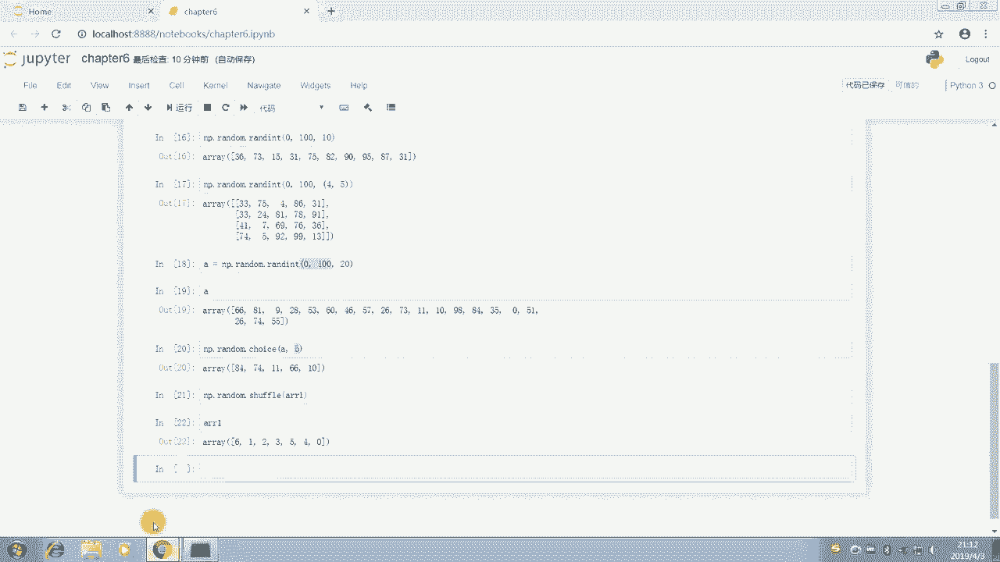

多多练习一下，把他们的这个各个的特点都搞清楚一些，好好的可以复习一下这个相关的内容，那么我们接着来看一下number派数组的属性和数据，选取当派数组的基本属性，那么我们给出一个数组呢。

我们当然要知道这个数组的形状啊，数组的大小，数组的类型和数组的维度，那么我们一一来看怎么去啊，把这个看把这个属性给他看出来吧，首先很重要的一点就是大家在学习的过程中啊。

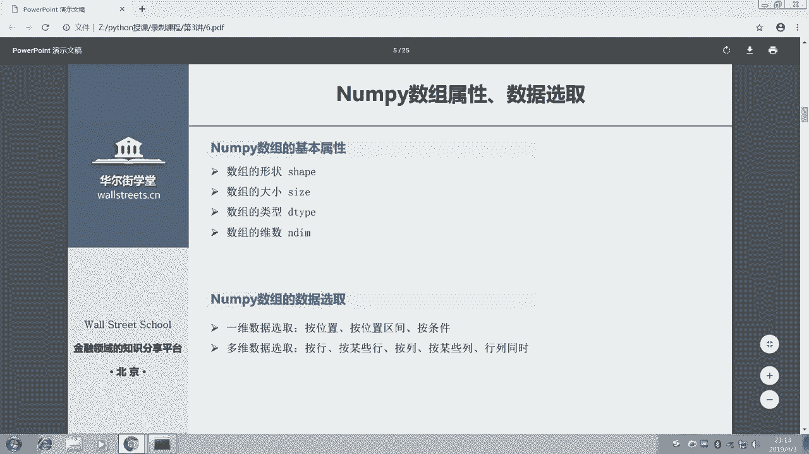

一定要多去总结，尤其是说对于一些有共性的内容啊，要学会触类旁通，比如说我们讲到属性的时候，大家的第一反应就应该是一个对象的属性，后面就应该打一个点，跟上那个属性的名称，然后那个名称后面还需要括号吗。

一般来说是不需要括号的，因为我们只是查看它的属性，OK那么如果是一个方法，如果是一个函数呢，那往往就需要有一个括号好，这里我们假设我们给出一个数字，这个数组呢是一个3×3的一个数组。

好大家可能会觉得说为什么还是3×3呢，我们这个来看一下，大家就知道了，那么我们现在呢第一步，我们现在这个array已经给他创建好了，已经给他创建好了，我们运行一下，把它给生成，那么我们想看它的形状。

我们就array点shape，这个呢就是看它的大小，那么3×3的一个数组，我们看啊3×3是什么含义呢，第一这个array这是第一个第一层，这是第二层和第三层对吧，它每一层的话呢它一共有三个元素。

我们就把它看成有三行，然后每每一行呢是不是有三个元素啊，就三列，所以我们这个地方先array shape的话，我们先打开array来看一下，然后reshape我们来对比一下，就可以看得出来。

这样子就可以看得出来array，我们输入array的时候，是不是这里就是一个呃三行一行两行，三行三列的一个数组啊，所以呢它的shape呢你把它shape，它shift属性呢点开来看呢。

就是3×3的一个数组三三，所以它一共有九个元素，那我们还可以看一下array size输出的是什么，好，瑞典size呢就告诉我们哎它是一个33的数数，一共有九个九个这个数啊，九个数一共有九个数。

比如说它大小呢是九，那么它的类型是d type，我们来看一下，这个时候呢我们输入array点d type。

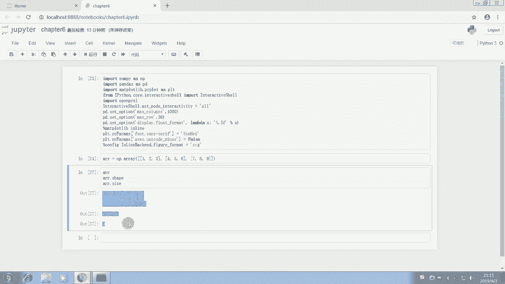

好array点d type的话，它给出来的是int32，它是一个integer啊。

integer一个整数整形整形好，那么还有一些相关的其他的呢，比如说呃他的其他数据类型有哪些呢，我们说这个number派数组的数据类型呢，主要的几个数据类型，一个是整数，一个是浮点数。

那么还有一个是object，这个呢就主要是一些对象的一些数据，就是比如说呃一些特殊的一些数据，那么还有string啊，string还有UNICODE，Unicode，主要是这些类型。

那么在具体的使用中呢，大家可以查用d type来查看它的数据类型是什么，比如说我们这里的话呢，比如我们创建一个array one等于number派，我们创建一个啊字符串的一个数组，比如只有一个字符串。

好我们创建一个这样的数组，我们看一下，那么我们看一下ARRONE的一个d type，好他type呢是这个UIU1啊，Unicode，所以呢这里的话呢我们就可以看得出来，比如说我们在这个地方再加一个一。

再加个一诶，我们再看一下它的一个type，这type呢OK还是这个还是这个，所以呢呃我们这个数组的类型呢，就已经教会大家怎么去查看，那么接下来呢我们看一下它的维度维度。

array点NDIM其实就是n dimension了，我们说维度是dimension，那么n dimension我们看一下它的一个维度，显示的是二，也就这是个二维的，这是一个二维的矩阵啊。

我们这个array呢是一个二维的矩阵，为什么呢，因为它是3×3嘛，3×3当然是二维的，那么实际上呢我们在操作中使用中呢，最常用的也就是一维和二维的一个数组，那么大家可能会好奇三维的是什么样的。

那我们可以再给它扩上一个啊，它可以变成三维的，这里的话呢大家可以课后去尝试一下啊，构建一个三维的数组，三维的话呢其实就是有X轴，有Y轴，有Z轴嘛，这里的话相当于我们只有一个横轴，一个纵轴。

因为它是3×3的，那比如我在里面，比如我们每一个里面我们再构建一个啊，比如说我们再构建一下，好大家看一下这里我们是在构建两层啊，比如说这里，好我们现在运行一下这个array。

那么我们再查看一下array的dimension，我们发现它的dimension变成了三层，为什么呢，因为本身的话呢我们注意了，这里的话呢它最里面呢就有一个，这个就就就已经是一个数组了对吧。

然后他又外面扩了两层的括号，相当于最里面的元素呢其实就是一维一个维度，然后呢这个两个列表呢又是一个，又是相当于是两个元素，它又是一个维度，然后呢装成一个大的列表以后呢，它又是一个维度。

或者说最后呢又是一个括起来，那么它就是里面有几个维度啊，其实是有三个维度的，大家可以这样去数啊，好的，在这里呢可能刚开始呢对这个维度呢会有点晕，没有问题啊，没有关系，刘老师刚开始学的时候。

也会觉得这个维度是有点晕的，但是呢我们最常用的就是一维和二维，所以大家先努力的把一维和二维掌握好，这个高维度的话呢，学到后边呢，大家等大家的理解能力慢慢上去了，对这个编程越来越熟悉呢。

对这个三维四维的都会越来越好理解，那么我们现在来学习一下，帮派数组的一个数据选取的方法，首先我们要创建一个number排数组，先创建一个南派点arrange啊，我们这边是输入错了。

所以呢刘老师也经常报错，大家千万不要因为报错，觉得额对自己造成影响，这地方还是多了一个R好，我们运行一下南派这个array好，它是一个这样的array，那么我们怎么去选取这个array呢。

其实跟我们的列表是一样的，比如说我们这里要选取列这个第，我们要选取这个三，我们数一下第一个元素，第0123，我们直接输入三就好了，额这个地方bug一下，Ok，哦我们这里直接输入三。

运行好这个地方就是三就是三，所以呢，呃我们这个可以选择它其中的一，些数据的位置啊，比如说我们要找这个，第四个位置到第几个位置呢，比如第四个位置到第九个位置的数据数据，我们直接把它运行一下切片。

这就是切片，那么比如说我们要找第三个位置，到最后一个位置的，而就这个第四个位置，三是第四呃，第四个数啊，第四个数到最后一个数直接三啊，跟我们的列表的切片是一样的，然后包括我们说这个地方呢还可以怎么呢。

还可以，比如说2~-2，什么意思呢，就是我们这个位置为二的这个元素啊，到位置为二的这个元素中间的一些元素啊，包括二，但是不包括二，所以呢我们看一下，就是这样子，那么我们还有一些方法。

比如说这个地方呢有一个按条件选取，这个呢是列表不具备的，我们看一下，在这里呢array array大于三，也就是说我们把大于三的这个array，大于三的这个额这个相关的内容给他选举出来。

当然是这个函数啊，这这个RG下面这个RA，我们把这个锐大于三的一个，相关的内容给他选取出来，我们把这个array大于三的给他选取出来，我们发现诶，额这边的话呢我们看一下大于三的，选取出来就是456没错。

那比如说我们想选大于七的啊，运行一下好的，这都是可以的，这都是可以的，包括这个条件，我们可以选择这个array里面大于七呃，且这个array要小于12啊，我们可以选取多个条件啊，这个不只是两个。

可以有N个条件都行好了，那么这就是我们这个array的一些索引，切片和数据的选取的一些方法，用条件选取，那么注意了，这里用的是方括号，这里是方括号，方括号里面加上我们这个索引的区条件。

跟我们的list和dict都是一样的，只不过DK的传递的是key值，list呢传递的跟这个np array呢就非常的像，非常像，那么对于多维数组的话，我们怎么去选取呢，大家可能会有一些新的疑问。

我们来演示一下，对于多维数组的话呢，我们一个array等于number派点，Array，然后我们先构建一个多维数组，123，456我们构建一个二维的吧，789好，大家这个代码呢其实只需要把内容输全。

不需要输的特别规范，为什么，因为我们有神器，我们点一下来，它就自动规范，那么我们接下来啊把这个先运行，我们来选取啊，比如说我们选取这个这个，array里面的第一个元素，这个第一个元素会是什么呢。

如果我们输入array one，大家可以思考一下啊，其实很简单，为什么呢，因为我们这个时候呢，我们就把它当成是一个平的对吧，当成是一条横线，一条一条一行，那么选第一个元素呢。

就是选最外面这层里面的第一个，最外面这层里第一个是什么啊，是123这个列表，那么我们选运行一下呢，自然出现的就是列表啊，或者或者说虽然还是array，但是呢我的意思是，大家可以把这个看作是一个列表。

实际上它还是一个小的里面的一个array，取出来还是一个array，还是一个那个南派array，但是它很像是说一个列表里面在空了，再放了三个列表，对不对，那你取第一个元素就当然取出来是一个列表。

这就很像我们的列表的嵌套，所以说这个学习的话呢，是建议大家这个类比着来学，并不是说一定要百分之百的精确，但是这个我们进行一个类比，就很好的理解，它其实就是一个元素的一个选取。

比如说我们选取第一个元素里的第一个位，置的一个这个元素啊，sorry啊，刚刚那个一的话呢，我们是选取了第二个位，第二个元素啊，那么比如我们现在要选取第二个元素里的，第二个元素就是array11啊。

这样的话出现的就是五没有任何问题啊，正确的，比如说我们想进行一个切片，我们想选取第二个元素及以后的，所有的这个元素的第二个元素，我们去看一下，就会出现的是呃，我们看一下出现的是什么呢。

好我们看下这里出现的是789，出现的是789好，那么如果我们是这样子呢，我们可以看一下多试，我们可以多试验一下，我们发现还是789还是789，所以我们这个操作的时候呢，对于选取这个元元素呢。

大家选取的时候呢一定要特别注意啊，自己到底这个操作需求的是什么，需求的是什么，比如说我们这里选取所有的这个三个三个行，然后我们只选取它们的0~1的数据，我们看一下会是什么结果。

那么我们发现那么我们选出来的是147，为什么呢，因为第一个的这个冒号呢，就代表了我们把三行都要选中，三行都要选中，第二个0~1呢只是选择了第一列，对不对，0~2呢我们是选择零一，但是不包括二。

这样的话就会有两列，我们就把一二和四五还有七八选出来了，这个呢就是我们一些列表的一些操作法，包括我们可以同时进行两个切片，比如0~2，那么也就是说我们选了哪两行啊，选了零行和一行，不包括第二行。

也就选了零行和一行，也就选了这个再选了这个啊，然后我们再进一步的往内层去选，里面那层去选，我们只想选从第二个数开始到第三个数为额，到第从第二个数开始到第三个数啊，包括第三个数，我们运行一下，这样的话。

我们就把第一行和第二行的，后面两个数都选出来了，其实这个三呢在这里可以不必要就好了，我们发现也是一样的结果，为什么呢，因为他这个地方呢三刚好就是结尾好，我们把这个数据的切片和这个多维数组的。

一个索引也讲了一下，包括三维数组和四维，还有N维，它其实都是由外向内的，一层一层的去对它进行索引好，大家可以课后试一下三维数组的一个索引，由外向内一层一层的去进行索引，这个掌握这个规则这一句口诀啊。

由外向内一层一层的进行索引，这样的话呢就不容易出错，我们现在呢刚刚讲讲了，这个单排数组的一个数据的一个选取啊，有这么多种选取的方法，我们现在呢讲一下，帮派数组的一些数据的准备和重塑的工作。

主要的话呢有三种方法。

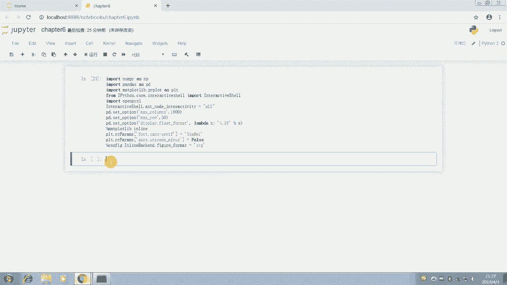

一种是as type，一种是is none，一种是点UNICO的方法，我们来看一下，我们先给出一个数组，帮派点arrange five，我们给出一个额简单的数组，我们可以查看一下这个数组啊。

我们刚刚说过arrange呢就生成0~5，不包括五。

那么这个数组呢我们查看一下它的类型，D type，我们发现它是整数型整形，那么现在呢我们想要把它转变成浮点数，我们怎么做呢，我们就用array f f，我们把它它这个array呢。

用s type这个函数转换成N派点float，我们看一下它有好几种选项，大家注意啊，这个地方有好几种选项，number派点float啊，我们可以选择这个float64啊，这是最大的，比如我们运行一下。

我们现在在查看这个RF，这个新的我们赋值给它的一个函数，我们发现呢它后面多了个小数点对吧，每个数后面都多了个点，相较于原来我们再查看一下它的d type，它的一个系那个属性。

但是他已经变成了float64，和前面那个integer32相比啊，它变成float64，那么在这里呢，我们就进行了一个数据的一个转换，那么这个呢常用在就是我们的呃，什么什么情况下呢。

就是说啊如果你的数据输出以后啊，或者说你导入以后啊，你发现你很多数值的数据呢变成了string，或者说变成了object，变成了一些文本型的或者字符型的数据，那么你可能就需要对它进行一些这个修改。

比如说要把它修改成数据型，数字型的整数型啊，或者浮点数型的，你才能够继续的去进行计算，否则的话对于文本数据，或者说我们就说的这种啊，字符串型的数据，你是没有办法对它进行计算的，好的，我们接下来呢。

我们来看一下这个缺失值的一个处理，怎么去查看缺失值，比如array等于N派点，Array，我们number派点array，我们看一下这样一个函数呃，这样一个数组，我们把它运行一下。

这个时候呢我们设置了一个数组，我们在里面呢加入了一个缺失值，第三呃，第二个位置啊，第二个索引二的位置啊，我们看一下012，第二个位置我们加入一个缺失值，缺失值呢用NAN表示了他的。

那个在number派里面呢，我们用number派点NAN表示缺失值，就有点像我们那个excel里面的什么函数一样，大家应该有记有印象等于这个呃NA一样，就有点像excel里面的这个NA函数一样啊。

那么表示这个缺失值，那么我们接下来呢要怎么去查看这个缺失值呢，那么很简单，我们用array的一个函数叫is n a n啊，Is n，我们看一下，额他回复给我们的那是什么情况呢，我看一下呃，他说啊。

Object has no attribute，那么这里呢就是我们搞错了，这里呢NAN不是一个tribute，而是一个函数，所以呢我们用这样一个函数把array放进去啊。

是对array进行一个函数的操作，我们发现它返回的是一个布尔布尔列表，大家发现哎一个布尔列表，那么这个的含义是什么呢，就是说呃我在现在问Python。

我问Python说你这个array里面有没有缺失值啊，然后第一个元素回复我说false，我不是缺失值，第二个回复我false，我也不是，第三个说true，我是缺失值，第四个说false，我不是。

那么通过这样一个布尔布尔额，布尔序列的或者布尔数组呢，我们就知道了谁是缺失值，它是缺失值对吧，那么我们接下来呢如果想找到这个缺失值，那就很简单了，就是我们只需要对这个布尔值进行索引。

刚刚出现负啊force的时候呢，因为我们说了，我们可以用这个条件去这个确定，这个就是给出这个查找这个数组，或者说用条件来查询数据，那么我们这里面给出的条件呢，就刚刚那个N派点is none。

就是说确定谁是缺失值，那么那些缺回复我不是缺失值的，都是返回的是false这个布尔值，那么force来说的话呢，你用它来查找呢，它是一个错误的条件，所以呢或者说他是一个拒绝的。

所以它就不会显示在最终结果里，而只有TRU的时候呢，它返回的就是缺失值的值，OK所以呢这里我们就查找到了这个缺失值，它的这个缺失值呢就是NAN，就是NAN，就是我们这个NAN，那么我们接下来再看一下。

我们接下来再看一下，就是说我们在这里呢，怎么把这个缺失值给他替换掉呢，那么也很很简单，因为我们这个时候呢已经可以取出它来了，我们只要对它进行赋值，比如说我们让所有的缺失值都等于零，那么我们运行一下。

也就是说把零呢赋给这个缺失的这个值，我们现在再看一下array这个数组，他的这个缺失值已经没有了，变成了零，这就是我们数据分析里的一个典型的，预处理的方法，当我们遇到有缺失值的时候。

我们用一个新的值来把缺失值替换掉，那么我们相信的话呢，各位在呃经常用到金融数据的时候呢，也会提取数据，提取数据呢有一些数据它是不存在的，不存在它返回的是NA这个呃，not a number这个。

那你这个缺失值的这个表示，那么我们呢就可以用这种方法，把它给替换成这个零，或者大家想要的一些值，好的，那么我们还可以再看一下其他的一些内容，比如说呃一个array里面肯定会有重复值，我们来看一下。

比如说一个array如果有重复值的话，我们怎么去处理，我们先定义一个number派array，这样一个number排array的话呢，我们运行它，先运行它，我们看一下它这个输出的这个array。

是一个什么样子啊，他有去他有重复值吗，有有二和一都是重复的，那么我们怎么把它的重复值去掉呢，我们有一个函数叫南派点unique，这个number派点unique这个函数呢，我们只要把array放进去。

那么我们运行一下缺失值呢自动就被剔除了，这样呢unique就是一个独一无二的一个呃，这个array的一个子集啊，独一无二的一个数数组，那么我们还可以，最后呢我们讲一下这些呃数组的一些呃，数组重数啊。

我们讲一下，我们接下来讲一下这个数组重数啊，这个相关的预处理呢主要就是数据类型的转换，缺失值的处理和重复数据的一个呃处理，我们现在来讲一下数据的数组的一个重塑，那么我们刚刚说过啊。

一个array啊，比如说他是南派点arrange，我们number派点arrange的一个八吧，我们先创建了一个长度是八的。

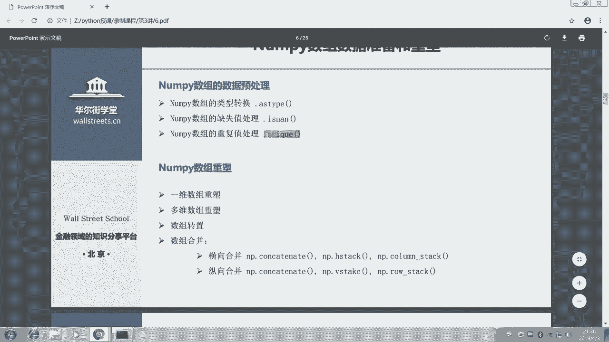

一个这样的顺序的数组，也就是01234567这样一个数组，我们现在呢对它进行一个重塑，我们把它换成别的形状，我们有一个reshape函数啊，或者说reshape方法，Sorry。

这里我们有个reshape方法，array点reshape24，我们把它换成一个二行四列的一个额，这个数组我们只要对它进行一个reshape就好了，但是我们要注意看这里的array本身改不改变。

ARRB本身并没有改变，大家发现，所以呢这里大家如果要得到一个数组，我们就赋值给一个新的数组array one，我们看array本身是不会改变的，但是array one呢它是可以获得一个新的数组的。

我们可以对它进行一个reshape的一个功能，所以呢这个地方大家可以学习一下，包括呢我们如果想要它是四二的话呢，也可以，因为它是八嘛，八可以等于2×4，也可以等于4×2，我们发现哎也是可以的。

包括我们可以一八试一下，也是OK的，也是OK的，也是OK的，然后我们看radio shape，那么是一个一八的一个数组，然后我们再看一下上面这个radish，确实八的一个数字。

所以呢这两个呢看起来呢这个array呢，我们可以看下，上面这个array和下面这个array one呢，长得特别像对吧，看起来是长的基本上一样的，但实际上呢他们的这个类型呢。

呃他们的这个ship呢是完全不同的啊，下面这个大家发现外面多了个括号没有，下面这个呢是1×8的一个数组，上面那个是8×1的一个数字，是两个完全不同的数组啊，不是8×1啊，是八就是一个八，而是一个一维。

而下面这个是一个二维数组，所以是完全不同的，大家要特别特别注意，在使用的过程中，如果数组的一个这个数组的这个shift呢，如果形状没有搞清楚，那么很容易呢在操作的过程中，不管合并啊。

还是之后我们讲一些高级的操作，都很容易出错啊，所以呢这个shape呢大家有空的都要查看一下，包括reshape的一个使用，把他们在操作之前呢，先转成同样的这个数据类型的啊，这个数据形状的一个啊。

南派array好，我们接着往后看这个多重数组的一个重述啊，刚刚我们讲的是一维数组的一个重数，那么多维数组呢也可以进行一个重塑，比如说我们创建一个多维数组，那派点array，我们创建一个数组。

多维的1234，我们可以不用特别在意这个格式，我们可以用格式刷来刷它的5678，那么后面呢九十十一十二，好的，我们这个数组呢给他创建完成了，那么我们用格式刷刷一下诶，它变得很美观，大家要习惯。

就是把自己的代码用这个代码美化器美化一下，所以呢在写作的过程中呢，也省去了大家很多时间，这就是为什么我们第一节课呢，花了很大的篇幅和时间在讲，怎么去设置JP团notebook。

它的一个功能其实是非常的强大的，那么这个array点reshape一个四三，我们什么意思呢，我们先数一下上面这个呢，其实是一个二维的数组，它是一个3×4的一个数组，我们现在可以先看一下它的一个ship。

我们可以先看一下上面那个shift是34，我们看上面这个数据的样子，3×4啊，有三行有四列的一个数组，我们对它进行reshape，我们把它换一下吧，因为3×4是12，所以我们把它换成一个四行三列。

四行三列的一个数组，我们对它进行换一下运行，我们发现array就被我们并且更换了，比如我们把它换成12，然后我们看一下能不能换成这个样子，换成一维的哎也是OK的，这样的话呢。

这个rain呢就被我们把它拆解成了，一维的一个数字，好希望呢大家在这个呃数据的一个重塑方面呢，已经能够基本掌握这个一维数组的一个重塑，和二维数组的重塑，那么至于三维四维呢，其实也是一样的道理。

你只要让他们三个数相乘等于12，你就可以把它塑造成任意维度的数组，只不过是往里面传入那个TP而而已了啊，你可以把它receipt成任意维度的，比如说这里啊，我们把它进行一个塑造成十211的。

我们运行一下，发现它就变成了这个三维的啊，三维的12×1乘以一的，一个维度的一个数字，好的，那么我就不详细展开了，因为三维数组呢可能大家在实际的工作中，能用到的也是比较少的。

大家先要着重的把最简单的最基础的内容掌握，然后我们再去研究那些比较偏门一点，比较难一点的，那么在分析的时候呢，我们主要使用的呢还是这个最基础的这个数组，还是最基础的这个一维和二维啊。

我们现在呢我们再继续呢把这个额数组的话呢，还有其他的一些操作，我们再讲一下，依然是这样一个数组，啊这里我们少了个括号，你看他是报错了，他就报错了，运行一下好啊，我们看一下。

我们这这个接下来呢我们要讲数组的一个转置，数组的转置的话呢，就是array，我们先看array这个数组，我们刚才已经说了，它是一个3×4的数组，我们对它进行转置，大家可以预期一下，数学里面。

我们线性代数讲的转置矩阵的一个转置啊，或者说数组的一个转置，它就变成了这个样子，变成一个4×3的一个数组啊，我们把它转制过来，那么接下来呢我们再讲一下这个number派，数组的一些简单的运算啊。

我们在实际上创建数组的过程中呢，可以把这个reshape这个函数呢给它一步到位啊，reshape这个方法一步到位，我们假设安排一个六个数字啊，那么我们可以直接在后面点reshape。

接着紧接着就reshape，那么他就被我们安排成一个2×3的一个数组，运行一下，我们看一下，查看一下R啊，如果你还要对它进行转置在T那么我们看一下，可以直接被转制啊。

所以呢这些方法呢是可以一个接一个的啊，并不是说一定一次只能执行一种方法，而是你可以一次性的把你所有想要执行的方法，一次执行掉，那么接下来呢我们讲一讲number派的数组的计算。

number派数组的计算的话呢，我们把它分成两类，我们对它进行完全分类，把这个计算我们看一下数组的计算的话呢，我们把它分成一个是数组和数字之间的计算，一个是数组和数组的计算。

数组和数字之间的计算呢我们看一下，比如说我们现在一个array，我们这array我们先看看他是什么样子的，我们把先输出在屏幕上好，ray是这个样子的，我们把array呢加一个一，我们看一下会有结果。

我们发现呢，下面这个array呢是在上面这个基础上的，每一个元素都加了一个一，这个和我们这个线性代数里的，学到的知识是一样的，那么array呢如果我们减掉一个一呢，那么我们发现呢其实也是是一样的啊。

就在上面的基础上呢都减了一个一，那么如果我们乘以一个一呢，哦我们乘以一个一的话呢，那么肯定是没有变化的，我们乘以一个二的，我们发现就在上面的基础上呢乘了一个二，那么我们再最后试一下除以一个二。

那么在上面基础上除了一个二，我们看一下能不能整除啊，整除上班才发现也是可以的，发现也是可以的，所以呢大家呢在使用的时候呢，不要拘泥于整一个的这个形式，而是要多多的去尝试各种不同的操作。

比如我们看一下乘方可不可以啊，乘方也可以，那么我们看一下开根号乘0。5，乘方0。5的乘方也是没有问题的，所以呢大家就发现了这个number派数组呢，它是适合对这个整体的一个数据进行操作啊。

在我们那个list的一些方法的基础上呢，它可以更加广阔的直接对这个数组进行一个，加减乘除就非常的方便，以前我们可能要用循环，对不对，要用循环才能对一个list实现，对每一个数都进行一个什么样的操作对吧。

但现在呢我们只需要直接对这个number派数组，直接乘就好了，直接加就好，直接乘方就好好，最后的话呢，我们在这个number派数组的这个一些方法上面呢，我们再讲一下它的一个数组的合并方法。

那么数组的合并呢就涉及到一些时候，我们可能会有多个数组，那么我们要把它们合并起来，进行一些计算或者别的什么内容，那么我们进行一个合并的一个介绍，我们先创建一些数组，好我们先创建一个这样的数组啊。

你看刘老师其实敲的很不规整，但是呢我们用这个代码美化神器美化一下，非常的美丽啊，美丽动人，好我们接下来看这个，我们在这个数组合并的过程中呢，有哦很多种不同类型的合并，那么我们主要选取就是说呃。

其实也就是分类为两种啊，有很多种不同类型的方法，那我们分为两种，一种是横向合并，一种是纵向合并，大家可以这样理解啊，横向合并呢就是把两个表呢，我们横着给它拼起来，纵向呢就是把一个表呢。

竖竖着接在那个另一个表的下方，或者说就是把一个数组，竖着接在另一个数组的下方，就是横向合并和纵向合并，那么我们就要注意了这个数组的合并呢，呃横向合并的三种方法和纵向合并的三种方法。

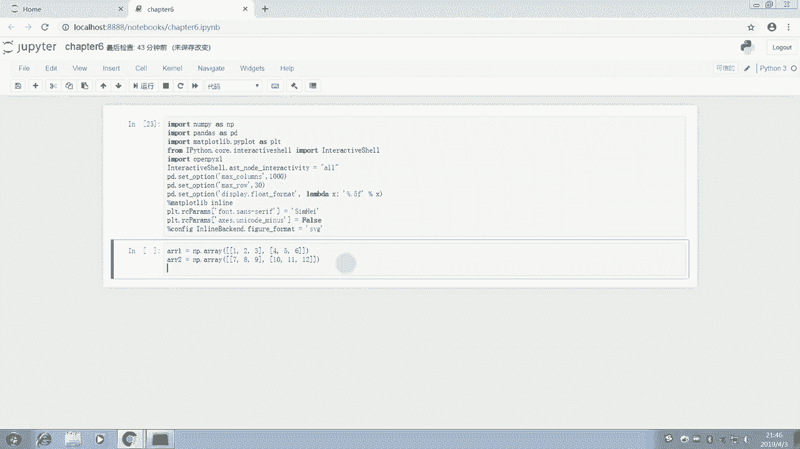

最终呢给我们看起来的效果呢其实是一样的，就说横向合并的三种方法的效果是一样的，纵向合并的效果是一样的，所以大家在使用的时候呢，我建议大家啊掌握一个就好了。

比如大家只掌握这个concatenate这个方法，或者说大家习习惯这个h step和v step，或者这个column stack和rose stack，我觉得大家掌握其中一个，然后其他的只需要了解啊。

在用到的时候呢，就不需要说样样都要掌握，因为我们毕竟是以短期入门以及快速的习得，这个技能为主的，所以呢我们没有必要像那个学者一样，去把所有的方法全部都记住，全部都学会，而且我们也不参加考试。

所以我们只要会用就好了。

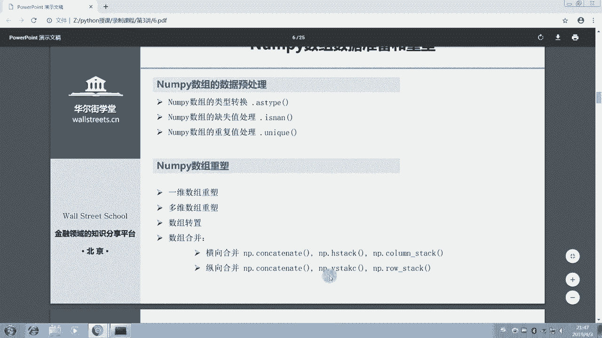

毕竟这个会用提高生产力啊，而不是说我们学的越多，生产力就一定越高，那我们要花要在意这个性价比，所以呢我们现在主要介绍这个concatenate，我们把他们两个array呢。

我们concatenate一下，好我们concatenate一下，我们先不加它，我们先直接CONCTING，看下结果，哎我们发现123456789十十一十二，它是在哪一个维度上。

进哪一个方向上进行拼接的呢，它是直接纵向拼接的，对不对，那么可能有朋友有同学要问了，我们现在呢如果想把它横向拼接要怎么办，那么刘老师给大家说过，Python里面呢有一个规则，纵向和横向。

我们是怎么去定义的呢，就说啊如果说呃我们现在有一个坐标轴，那么我们这个竖着的这一条呢，在Python里面呢一般把它定义为零方向，横着的那条呢，它会把它定义为axis equals one。

就是横着的这条，我们定义为坐标轴为一的这个方向，用一来代替，所以在这里呢，所以默认的这个值呢，a x i n s axis这个轴呢是零，也就是说我们是按零方向去进行，纵向的一个合并的。

所以我们即使是零的话呢，它依然是纵向合并，但是横向合并呢，只要改成一这个地方呢就是一个横向的合并，我们就把它们横向的拼接起来了，所以呢这个就是我们的concatenate的一个方法。

那么希望大家要掌握一下，大家注意了，这个地方呢参数呢是作为这两个数组，是作为一个列表给他传递进去的啊，或者说作为一个把他们两个数组给它，组成一个列表给它传递进去的，而不是直接的array one。

Array two，那我们再讲一下这个，简单的介绍一下这个后面的两个方法，其中的那个stack的方法吧，然后这个column的方法其实也是一样的，我们就不给大家介绍了。

我们给大家介绍一下h stack的方法，帮派点h stack这个呢是纵向平呃，这个是这个horizontal嘛，H是horizontal的一个意思，也就是说横向的一个水平的拼接，我们这个地方呢要注意了。

这个地方传入的是TPP啊，不是我们刚刚的那个列表。

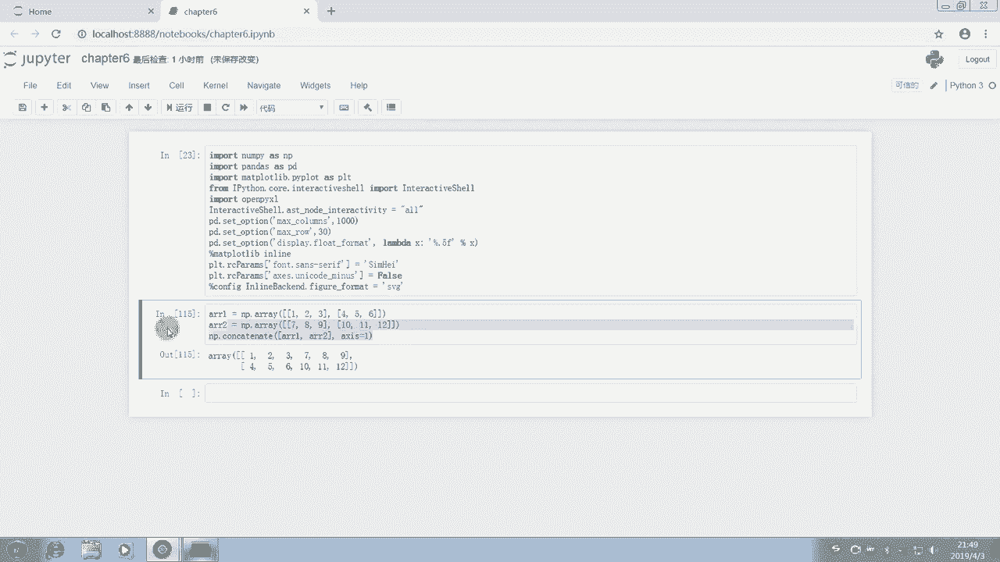

所以我们建议呢大家用上面这种方法传递列表，更加看起来明明明了一些用的CONCADATE的方法，这里的h stack方法呢是传递的是一个TP。

我们运行以后它是H嘛horizontal，所以是水平的一个拼接，那么自然还有个vertical拼接，V stack，这个V呢是vertical的意思，所以呢这里进行一个v stack的话呢。

我们就很简单的啊，把他们两个也放进来，就是一个纵向的一个拼接，那么这种拼接呢就非常适合，我们在对一些大型的数据进行拼接的时候，我们把它读成n d array的一个形式啊，number派尔瑞的一个形式。

然后我们接着呢对它进行一个拼接，南派的计算是非常快的，这个计算的速度是非常非常快的，它是可以和这个MATLAB比肩的啊，所以用来那个替代MATLAB的，所以它的一个运算能是非常出色的。

南派呢也是以运算能力著称，好讲完这些以后呢，我们再介绍一下number派的一个这个数组的，常用函数，number派数组的一些常用函数的介绍，我们先来介绍一下，我们先看一下有哪些常用函数。

其实对比那个我们看一下这边呢有一个a abs，这个a abs呢是绝对值啊，绝对值还有一个SQRT啊，这个是开开平方根，square是平方，那么exponential是返回E为底的一个指数。

那么log呢这些啊这地方刘老师打错了，这个L呢是小写的，所以呢这里呢是返回以E10和二为底的对数。

还有is now，那么包括后面的这个用于描述统计的一些函数，STD呢是我们这个标准差，VA2呢是我们这个variance，我们这个方差，那么minimum maximum和mean。

还有some这些呢相信用excel用的非常熟练的朋友，对这几个额这几个函数完全都不陌生，那么这几个函数呢在我们的npl ray里面呢，也是有的，那么后面的ARGMIN和a arg max。

其实呢它就是一个返回我们最小值和最大值，对应的索引，也就是说它能返回告诉我们诶，哪一个位置的这个元素啊，它是我们这个number派ray里面的最大值，那么comma sum呢。

是我们这个累计和和我们的excel呢也是一样的啊，come on pro呢在也是所有元素的一个累计积，相信大家都能够很轻易的理解，那么我们现在呢举几个例子啊，举几个例子来分别讲一下这个元素集的函数。

我们在上边呢我就给大家举一下，这个a abs的例子，和我们这个square和square，这个square和我们这个开平方的这个例子，先创建一个南海尔瑞，当派尔瑞德我们从-4~4吧，这样正负数都有。

我们运行一下这个R看下ray的一个样子。

是这个样子，那么我们想把它都变成这个呃，array都变成这个。

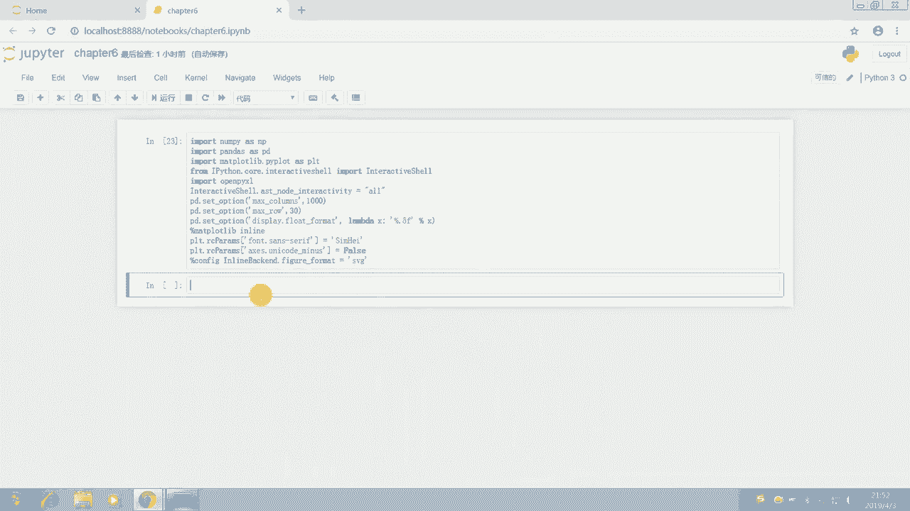

因为它是函数嘛，所以呢我们要用number派开头，就number派的一个函数，abs的array，我们想把他们都加一个绝对值运行一下。

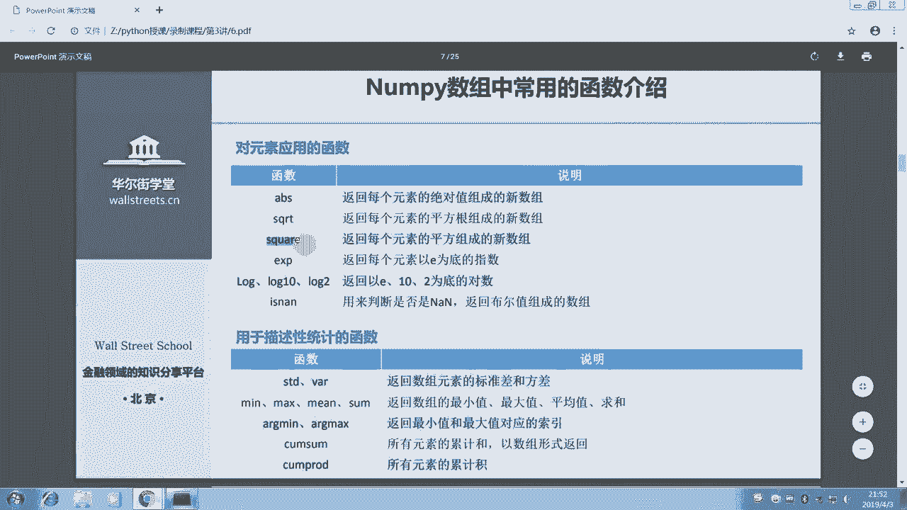

这时候呢我们要注意啊，它是在array的基础上改动吗，不是的，array是没有变的，但是我们把这个囊派点ABS的array呢，赋值给了这个array one，所以array one呢才是我们要的啊。

我们在这边输入RONE，对比一下这个re one的话呢，我们看一下REONE的话，就是变成了这个4321啊，没错，我们就把他的全都加了个绝对值，那么至于我们接着呢。

我们看一下囊派点square和N派点SQRT吧，我们先看一下开平方根吧，当派点SQRT的array y开平方啊，我们发现哎他都开了个平方，没错，那我们我们再看狼派点square的array吧。

帮派点SQUARE的一个array，我们对它进行一个平方，我们发现诶十694没错啊，都是一样的，那么接着呢，我们把描述性统计的一些数据给大家演示一下，我们创建一个新的array。

number派点random点，Rando，好我们创建一个新的一个array，120，好，我们创建一个新的ray，我们来看一下这个ray的话呢，他是在0~100之间的，选了20个数。

好的0~100之间选上是个数，我们对它reshape一下，我们把它重置一下，换成一个稍微复杂一点的形状，这样的话呢也便于大家之后的一个运用过程中，的一个掌握的几个内容。

我们把它换成一个4×5的一个矩阵啊，一个方阵呃，note方阵，一个矩阵，或者说一个二维数组，二维数组呃，我们看一下，这是一个4×5的一个二维数组，它的数据都是我随机随机出来的，array点sum。

我们对它进行一个求和，看下得出来的结果是什么样子，那么就所有的元素的一个求和的结果呢，是1238，那么比如说我们不想说把所有元素加起来，而是希望呢它能够横着加起来，把每一行都加起来。

那么大家要看这个水平的方向，刘老师刚刚说了，Python里面的水平方向，我们把它定义为axis equals one，也就是方向一，所以呢我们就array点sum，我们只要给里面传递X等于一。

按照一这个方向去加总，我们发现啊诶他报错了，那么这是什么原因呢，我们看一下是什么原因呢，啊，这是因为我们这个array呢，是定义的是上面这个一维数组，而下面呢我们需要的是一个二维数组。

所以呢我们这个地方出错了，报错了，我们下面的应该要用ARRW了，这样的话就没有问题，我们发现最后结果是四个，为什么呢，分别对应了四行，大家也可以拿计算器去加一下，看是不是这四行分别数据加起来。

会等于这四个数字啊，如果没有问题，肯定是的，那么我们还可以按照，比如说我们想按照纵向来加，就说我们是4×5嘛，我们想把五列每一列的数加起来，我们就access equals zero，我们运行一下。

好我们发现这里报错了，为什么呢，他说没有这样一个啊，Orargument，也就是没有这样一个参数，那么这个地方说明我们输错了那个参数的名称，运行一下发现诶它确实是五返回了五个数，这就是什么呢。

这就是这五列的一个和五列的一个和，那么包括求均值，比如说array点min，我们array点min的话，那当然算的是所有的均值了，那么array one点min。

如果我们传入一个axis equals zero，我们在一个zero0方向，也就是竖着的方向，那么会算每一列的均值，每一列的均值都给算出来了，所以呢这个呢在大家计算描述性统计，分列计算的时候呢。

是非常非常有帮助的，那么求最值的话呢，我就不再给大家详细的这样，一个一个去计算了哈，我就不再一个一个去计算了，大家可以课后呢对上面这些数的函数呢，进行一个理解和相关的一个学。

那么我们最后呢在这边呢我们再讲一下这个啊，Come on come on sum，come pro的吧，这两个还挺有意思的，这两个的话呢我简单给大家介绍一下，就是啊比如说我们这个array。

如果说如果说这个array啊，比如说呃在我们的金融分析里面呢。

经常会出现一列收益率对吧，那么如果呢这个array呢，比如说我们用它除以100，然后加上一个一好。

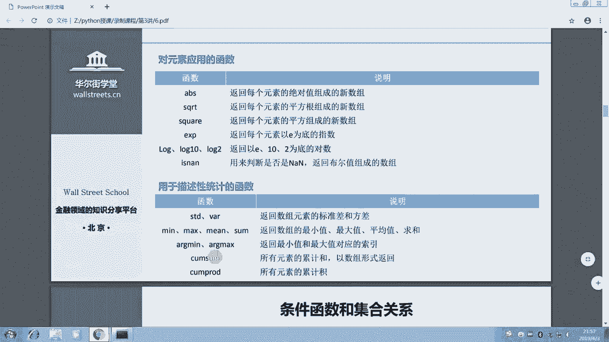

我们定义为一个新的array。

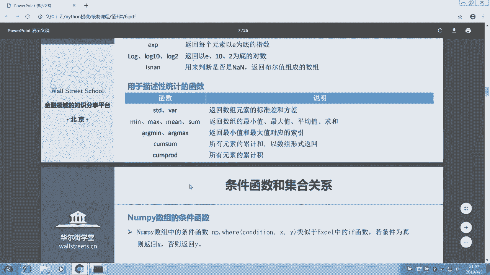

我们来看一下这个RTWO，它呢就是一点几一点几一点几哇，这个一点几很亮，大家可以看了，就把它认为是什么呢，把它认定为是一组收益率，如果把它认定为是一组，或者说把它认定为是一种净值。

如果把它认定为是一组基金产品的净值，我们对这个array two呢运行一个come a pro，这个product prod是这个product com，就是累计的乘法陈述啊。

这里的话呢我们对它进行一个累计的陈述啊，array to点，com proud运行一下，我们运行一下，发现他就从第一个一路乘到了最后一个，一路乘到最后一个，就是从第一个数一路乘到最后一个数。

这个就是最后一个数，那么我们可以调用它最后一个数的这个结果，那么就可以得到我们这个最终的一个这个，array to的一个结果了，好，好的，那么在这个过程中呢，比如说呃我们还可以呃有一些其他的方法啊。

我们在这边再介绍一下这个呃，条件函数和集合关系，简单的介绍一下，这里的话呢就是说我们的number派数组的条件函数，number派数组的话呢，它有包含关系，交集并集，还有求差这么四种的一个呃集合的关系。

那么这个集合关系呢，跟我们数学里的一个集合关系其实是一样的，所以呢在这里呢我们就。

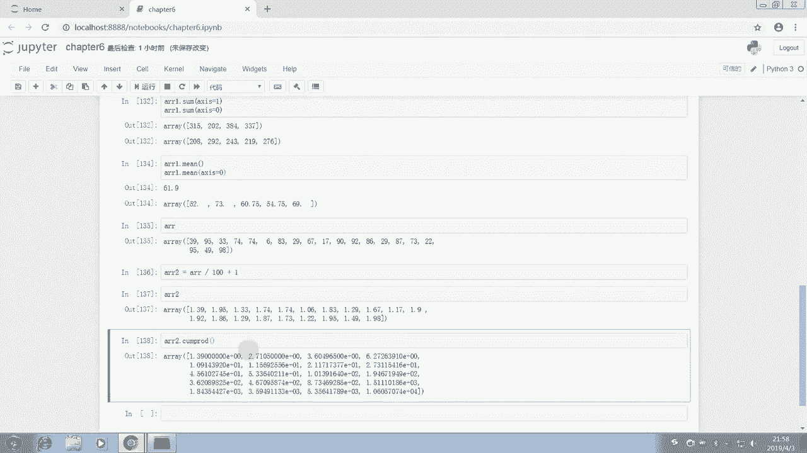

给大家介绍一下这个这些集合关系的一个运用。

我们简单的介绍一下这个集合关系的一个操作。

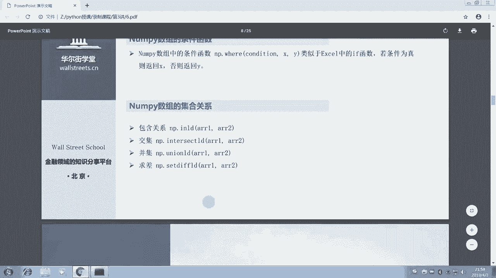

array one等于N派点，Array，我们先建两个ray，1234，array two等于南派点，Array，125哦。

大家可以用代码美化器美化一下，好的，那么我们把这两个R建好以后呢，我们比如说我们要看一下他们两个的交集，我们求交集，那么就安排点intersected好，我们把它复制过来，直接，好运行一下。

啊我们发现这里报错了啊，报错了的话呢，我们在这边呢重新给它输入一下，那么我们可能是刚刚输入错了，我们把这个re one和RTWO输入进运行一下，好没有问题啊，现在呢交集呢是1212，交集是一二。

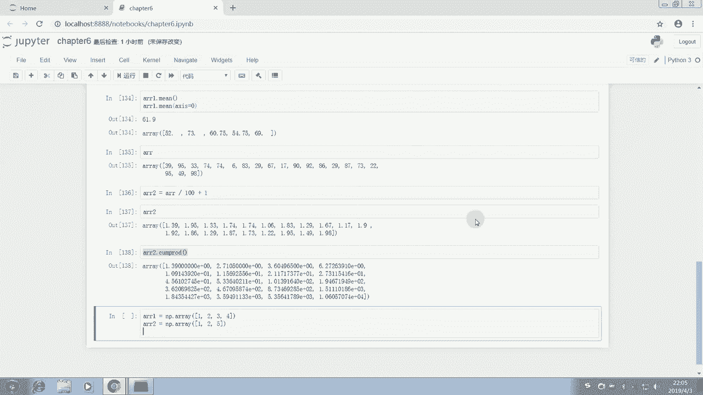

那么我们其他的呢也是一样的一个操作，在我们那个课件里呢都有给大家列好。

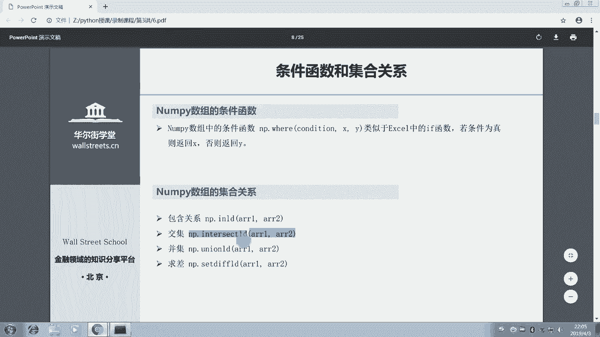

那么我们现在看一下这个N派点，where r函数，那么number派点威尔函数，这个number派点where r函数呢，我们看一下number派点where它的含义是什么呢。

就跟我们excel里的if有点像，就是说如果啊你这个condition呢条件呢是对的，那么我们返回X，如果这个条件判断是错的，那么就返回Y什么意思呢，我们在这边呢就number派点where呃。

我们看一下它应该是，比如说我们对array进行一个判断。

如果array大于80，那么我们返回一，如果否则后，我们返回零。

我们来看一下，我们注意啊，这个上面的是这个array的这个额。

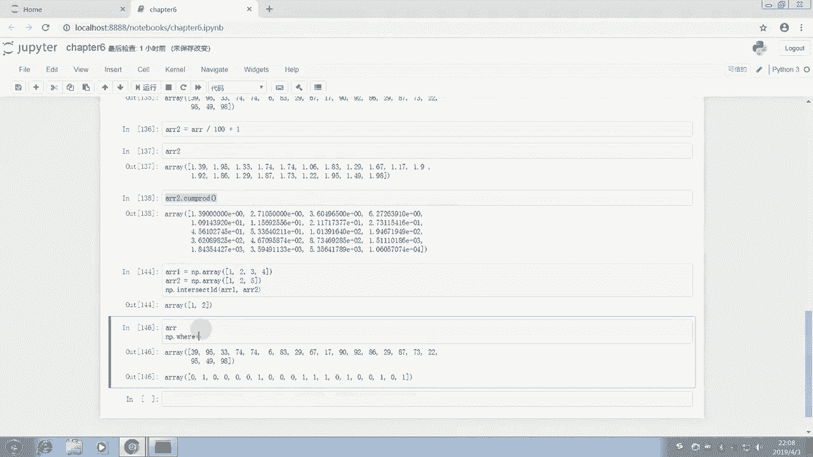

这个array这个南派array的一个，我们把它输出在上面，让大家看一下，对照着来看，然后下面呢是我们这个NPWR，我们发现了，凡是这个rain呢大于80的，我们都会换成一，都被替换成了一。

小于80的呢都被替换成了零。

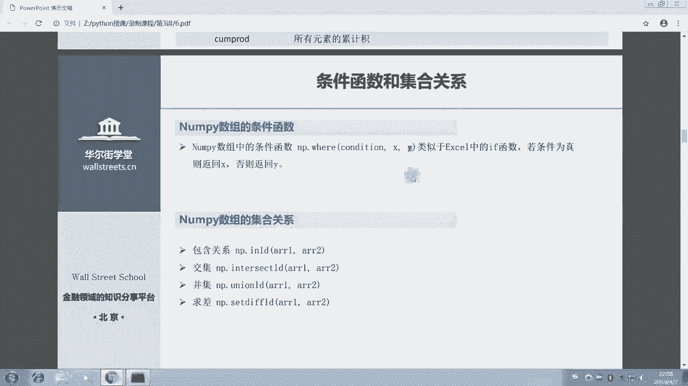

这个呢就很方便的帮助我们呃，对这个NPARIN呢，进行一个这个用条件来进行一个查找，这个条件大家可以随意设定的啊，不一定是要A大于80，还有很多其他的条件，根据大家日常工作的需求。

可以去查找出那些符合要求的，然后把那些不符合要求的替换成我们需要的值，这个的话呢是我们这个南派点威尔的一个，非常好用的一个方法，那么我们的NPARIN呢，讲到这里呢就基本结束啊。

我们这个呃南派尔ray讲到这里基本结束，那么接下来呢我们在最后的给大家，当培尔瑞补充一个知识，就是当派尔瑞的一个矩阵的一个呃，两个特别重要的一个运算，两个重要特别重要的运算，我们先清除一些内容。

给大家补充一下矩阵的两个很常用的运算，那么如果说A这个矩阵啊是用number派，我们来随机一个数组出来。

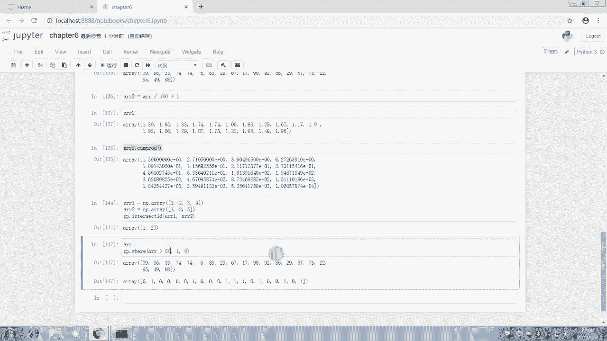

比如说A会等于这个，那么我们可以用A我们看一下。

我们先把a print出来一下，我们把A这个输出一下，A是这个样子，那么A呢如果会等于number派点met，这个时候呢我们把MATT来把它包装成一个矩阵，我们这个时候再来看看A好。

它就变成一个matrix啊，这个是南派点MATT这个函数，把它变成一个矩阵，这也就是说方便，有一些同学如果想用Python呢，做一些矩阵的一些运算的话呢，就是很方便的。

如果我们现在呢想要把这个啊a print出来，我们不用print，我们已经交互的看到了A，那么现在呢我们就是来看一下，这个矩阵的这个逆运算怎么去进行，比如说我们用IA来表示矩阵的逆。

那么我们在number派里面呢有一个LINA呃，line啊，linear l l gebra啊，其实是线性代数的一个含义啊，Linear l i n e a r，Linear algebra。

它的一个缩写LINALG这样一个呃函数，它下面呢有一个inverse，求矩阵的逆，我们这样子进行一个操作，那么就可以把这个矩阵的逆给他求出来了，那么这个时候的IA呢就是我们这个矩阵的逆。

我们就可以看一下IA，让他输出一下IAIA呢就是我们矩阵的逆，我们来检验一下是不是这样，用IA乘以我们这个a inverse a乘以A，我们发现这个结果呢其实是啊，非常符合我们要求的。

这两个呢是因为是浮点数，所以呢计算出来不等于零，其实它应该是零的，然后这两个呢应该都是一的啊，没有问题，那么我们再讲一下这个简单介绍一下，用矩阵用这个number派来求特征向量。

R派点random点R我们给它进行一个呃赋值额，创建一个新的一个number派数组，那么特征向量呢我们怎么来计算呢，其实它也有一个特别的函数来计算，那么这个呢是特征值，也就是说他这个函数呢。

可以一次性把特征值和特征向量都输出，会等于南派点linear algebra点EIG啊，这样一个函数啊，就在linear algebra这个线性代数，这个函数下面有一个EIG啊。

这个特征值的这样一个函数，那么它可以一次把特征值和特征向量都输出来，那我们把特征值print呃，让它输出来，然后特征向量也让他这个在屏幕上反馈回来啊，这个地方是输错了字母。

所以呢大家在输的时候要细心一点好了，特征值和特征向量都打印出来了哦，不要打印出来了，都返回了，那么我们这个number派呢就介绍到这边，那么我们接下来呢介绍pandas。

