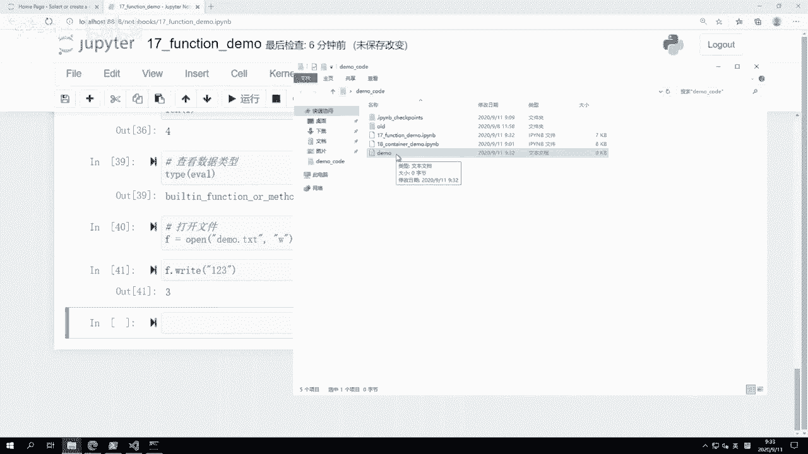
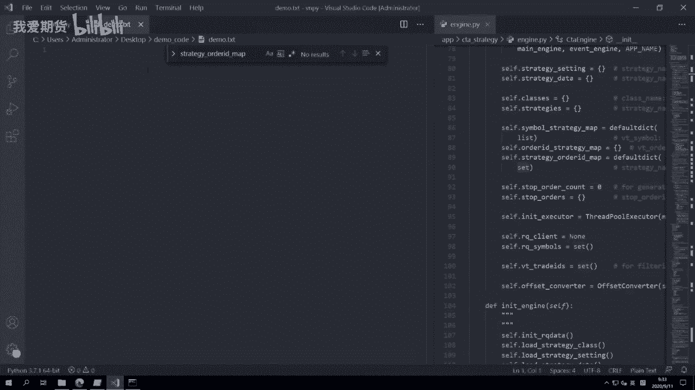
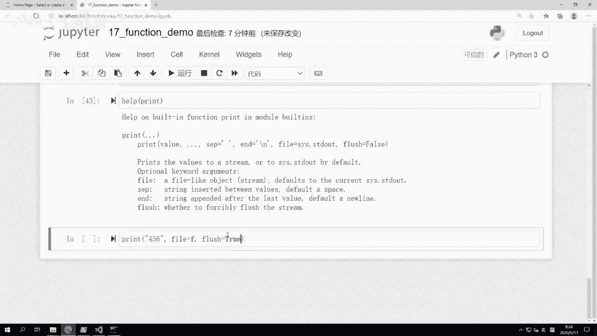
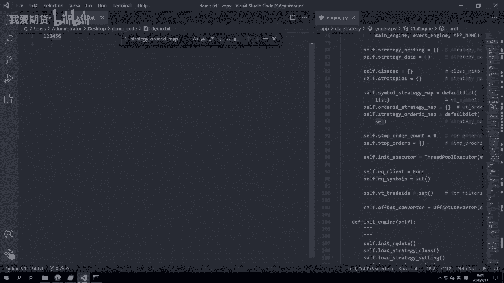
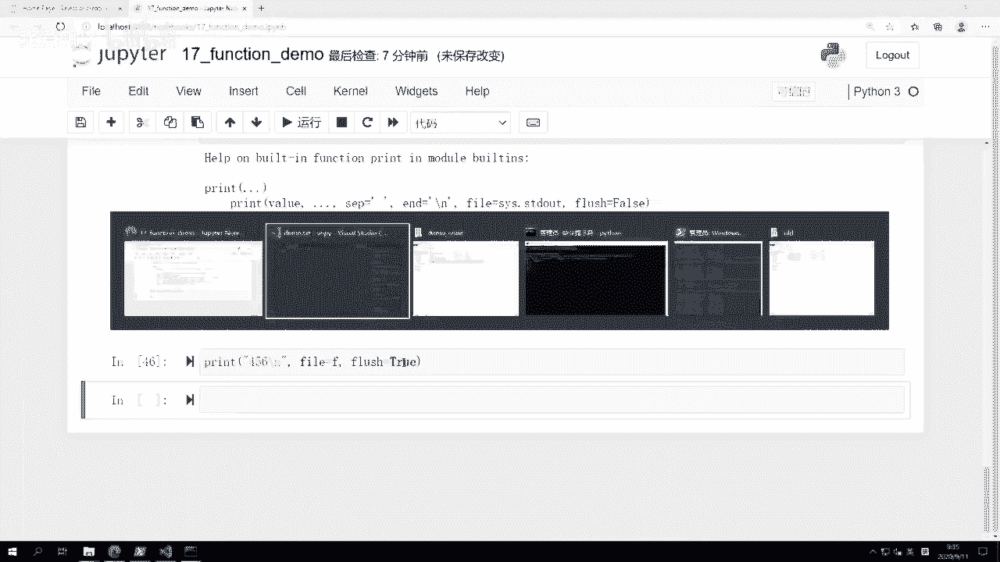

# 17.函数的定义 - P1 - 我爱期货 - BV1352gYTELz

OK欢迎来到量化交易零基础入门系列，30天解锁Python量化开发课程，那么今天呢是我们的第17节课了，在上一节课里面，我们把这个Python数据容器的讲解，做了一个阶段性的收尾，那么从这节课开始呢。

我们要来讲一讲Python里面的函数了，首先第一节课的内容就是叫做什么是函数啊，我们得来认识它一下，那么呃如果是数学上的函数，或者说代数里面的函数呢，我不知道大家是否还记得自己，原来可能在高中啊。

在这个大学里面学过的内容，我们这边就来讲它在编程语言级别的啊，这么一个作用，那用一个词来形容就叫做所谓的抽象封装啊，抽象封装为了什么呢，第一个为了代码复用，你可能有一段啊，这个计算逻辑是经常要重复用的。

那如果每次用它的时候，你都要把所有的函数呃，这个代码打一遍，可能有20行，可能有50行，那无疑你的整个啊，你的代码量会变得非常非常大，那我们从讲Python开始，第一节课开始哈。

我们就是在不断强调写代码的时候，要尽可能的让我们代码变得更加的精简，行数要尽可能保证这个可读性啊，保证我们人能看懂的情况下，代码越短，可维护性越好，所以呢减少重复，在这个最基本的一个帮助。

就是可以让我们的这个代码可维护性增强，因为你你的项目越来越大，比如说你写一个大型交易策略的时候啊，里面涉及到逻辑非常非常多，你行数越多之后就越容易出错，第二个作用呢叫做简化代码。

让我们人变得更加容易理解，那这个呢其实我们等会来看一些，这个Python内置函数的意思，大家就明白了，那啊print函数是我们在敲Python代码之后啊，接触的第一个函数的。

就所谓的print hello world啊，这个大家都已经用过了，包括在这个过去的十十来节课里面啊，不断我们在GPA里面啊，输出一些结果的时候，都是在用print操作。

那么这里呢我们来重新认识一下它啊，原来用的其实就就用了啊，也没管太多，首先print是一个Python内部的内置函数，在用的时候，它可以用来主要啊就是用来输出内容的，你可以输出单个数据。

也可以输出多个数据啊，这个等会儿我们都来演示一下，第二个呢，你可以用不同的分隔符，来把这些数据给分隔开啊，最后你还可以加上一个结束符啊，就所谓的end参数，然后print不止支持在我们这个现有的。

就比如说你可以在CMD里面输出，你也可以在JUPITER里面输出，他还可以把你要输出的内容，输出到一个文件对象里面去啊，这个的那我们等会也来演示一下。

啊我们这边就开了一个全新的JUPITER叫function demo，我们先来直接简单一点，Print hello，word again啊，这差LOL对吧，那下面呢我们就打印单个值。

其实跟上面打印这个一个字符串类似啊，大家都应该很熟了，print1啊，或者print一个啊，这个true等等啊，这这类操作大家应该都很熟了，那么我们现在要试一下呢，就是所谓的打印多个值啊。

比如说我我想要G打印这个啊，这个这个叫做什么，今天上海天气是，第二个字符串是第一个字符串，是今天上海天气12，第二个字符串是暴雨啊，第三个字符串可能是啊，我就打一个数字，比如说这个温度是26度好。

接下来就那我在这个print里面，一共输出了四个内容，每个内容用逗号做的分隔啊，三个逗号四个内容，那我这样回车一下，大家可以看到直接运行的结果是，今天上海天气市暴雨26度，那你可以看到每这个两个。

我输出的数据之间是有一个空格的啊，这个在JUP的里面就非常方便，可以拖出来给大家看，如果在CMD里面呢，你也可以看到是个空格，但我没办法选中它给大家看了啊，这里的这个空格就是所谓的默认分隔符。

那我们现在要试一试去，还是打印像上面这行内容啊，我们加把这个分隔符给调一下啊，我们把这个SEP啊就塞在中间东西，我们加一个好玩一点的，我们加一个这个加一个这个这个啊，就这个符号吧，就是and这个符号啊。

我们看看效果是怎么样，大家可以看到中间的这个用来分隔的部分，不再是空格了，而是变成了这样的一个内容，那么啊这个呢就是所谓的SEP参数，在我们运行一个函数的时候，运行这个函数其实都非常简单。

Python里面运行函数大家应该都已经很熟了，直接就先输函数名，然后跟个括号里面，就是你要运行用的这堆参数就好了，那么前面我们这种写法是叫做所谓的匿名参数，或者说呢是按照位置传的参数，大家可以看到。

我就直接把参数传进去就好，我没有管它这个到底是哪个参数名，而后面这个SEP等于啊这个这这么一个符号，或者说再把换一个啊竖线啊也可以，都很方便，那SEP等于这个竖线，这句的意思是我传一个特殊的参数进去。

这个参数我要告诉函数，就是专门付给这个叫SEP的参数用的，这个通常呢这种所谓的啊带名字的参数啊，或者说记名参数更多呢是用来去啊，保存一些叫做可选的属性啊，你可以选择传它，或者很多时候你也可以选择不传它。

那在这儿我们大家可以看到，之前我不传的时候啊，就没有这个sap后面内容的时候，他又有默认值，默认值就是这个空格，但是我如果传了它的话，它就变成哎我要传的值，另外除了这个SEP参数以外。

还有一个叫做所谓结尾值的参数啊，那么我们这边呢举个简单的例子，print1啊，Print2，Print3，我打印三个数字，正常打印出来它是123这么三个顺序，那每个数字都占了一行新的对吧。

之所以会占一行新的原因，是因为这个在打印的时候，它有个and的参数，and的参数呢默认是这个杠N杠N，在所有编程语言里面，或者说这个标准啊，代码结构里面，它的意思是换到下一行，就所谓的换行符啊。

其实在那个比如说word这样的编辑器里面，你输按一下回车的时候，你看不到什么东西，他就直接光标换到下一行，但实际上在那个位置是有一个叫做换行符，就这个刚安的啊，这这么一个表示存在的。

它会在你把文件保存到硬盘上的时候，写在那个地方啊，那么我们这边呢把它加上，把end这个杠N给去掉，我们也把它给换一个，我就换成一个加号啊，我们就好玩一点，把它换成一个加号。

下面三个这个print我都把它换成加号，大家可以看看结果会变成怎么样，print完了之后，他没有换行了，每次打印完一个之后，紧接着下面就在下一个位置打印了啊，每一个数字后面都有一个加号。

那我也可以说加完加号完了之后，我再来一个杠N，大家可以看看结果会变得怎么样，就每一行后面都有个加号，再加上都跟一个杠N啊，这个and也是一个叫做呃，所谓的结束符的可选参数啊，最后当然等会还有个操作。

就是文件输出啊，这个稍微我们稍微等一会，等这个这个来讲，那我刚刚做的这些操作里面，大家可能会有个问题说OK我嗯这个现在讲了，我会，但是我拿到一个新函数的时候，我怎么知道它有哪些啊，参数可以输入进去。

我怎么知道他的这些是否有可选参数，这是第一个问题，第二个可选参数的这些啊，所谓的这个这这个他的这个参数名是什么，那我怎么知道它呢，Python里面很贴心的加了一个叫做help的函数。

这个help函数可以帮你来看一看诶，这个大部分啊这个内置啊函数也好，还是内置的类也好，类内置对象，如果他们有些帮助文档内嵌的话，直接就可以看到，我们这边打完之后可以看到help on啊。

Beauty in function，Print in module builtins，这就是print函数，print函数写的时候，它一般就是这么写的，前面是value s e p是一个分隔符。

大家可以看到默认值是一个空格，and是以结尾符，默认值是一个杠N啊，就换一行file是一个输出，默认是s SSD l d out，这个是打印在我们这个，就是不管是呃CMD里面直接打印出来。

还是在我们JUPITER里面，像这里打印出来，这个就是这个所谓cs点s d d l flash，就是是否要往这个文件里面立即同步一次啊，这个默认是false，后面两个参数我们还没讲。

如果你光看这个看不懂的话，下面哎你看Python内置的这堆东西，都有非常贴心的说明啊，叫做这个首先函数是干嘛的，prints the values to a stream啊，就是把它打印到一个流数据上。

这个可以输出到界面上，也可以啊，输出到文件里面，然后呢每个参数的意思啊，这都有英文的详细描述，当然确实需要一点英文的阅读能力啊，这个如果完全看不懂的话，也可以每一个去百度上翻译一下，也不麻烦。

那这个呢就是print函数的一个完整，用法的讲解啊，之前我们hello world是最基本的应用，这里呢是一个比较完整的应用，那除了print以外，在Python内部还有一系列的叫做内置函数啊。

呃Python的内置函数大概应该是有50多个，但是呢对于我们绝大部分人来说，长常用的就是在这张PPT上，我们把它列出来的一系列内置函数啊，分成我把它分成了五大类啊，数学处理基础类型，数据结构，输入输出。

特殊操作啊，然后这个基础类型的这个四个，其实它们一定程度上你也可以说它们不是函数，它们是这个一种特殊的类啊，当然了它也可以当做一些函数来用，比如说我们之前等会我们也来也来演示一下。

怎么做一些转换数据结构，这个在之前五节课里面大家都已经很熟了，等会我就不演示了，好输入输出特殊操作等等，接下来我们一起来把他们在JUPITER里面，逐个演示一下，那首先第一个函数就是求绝对值。

叫abs函数，比如说我有一个负值100啊，我们求个绝对值就是这个正的100啊，-100就是正100，如果是100的话，它就是100啊，所以这就是一个简单的abs函数，然后如果你要看一下它里面的内容。

也也就怎么用啊，也一样，help好，那这个就可以了，Help on beauty functions，哒哒哒，Return the absolute value of argument，这非常简单。

就是求一个绝对值啊，没有任何复杂的地方，然后呢取最大最小值，比如说我用一个max函数，我想知道两个数字哪个比较大哈，我一个传四，一个传40，大家可以预计下返回结果肯定应该是40啊。

如果啊我这边加print吧，当然你也可以说哎我把把它复制一下，A等于四，B等于40，然后print max a b，这个也是40，我们还可以加上一个，就是我这边就很快操作键盘的快捷键。

操作MM就取取最小值也非常简单，就这两个数里面谁小就取谁，还有个操作叫做sum求和求和，什么意思呢，比如说你可能做了一个列表啊，大家可能还记得我们之前在开始的时候，有给有有说去做这么一个。

用Python语言做一个求和操作，然后for循环从一加到100，结果呢是这个啊这个5050，那我们这边啊当时我们用了一个for循环对吧，但其实有一种更简单的操作，那我们可以直接用Python的这个SU。

some括号range从1~100啊，因为是含头不含尾，所以下标写要写从一啊，这个1~101，这样直接回车之后求和结果就会出来啊，就5050这个sum内部可以传所有的啊，不管是什么集合也好，元组也好。

列表也好，或者说哎更深入一点叫做可迭代结构啊，或者叫迭代器都可以啊，当然迭代器的概念是Python比较深入的一个概念，我们会留到后面讲，反正在这你就记住some，直接这样用就好。

或者你要来个some这个好，我们再来个这个print as，这是上面加print啊，一会直接把啊，你要求和的一堆数字给输进去就行，哎，不好意思，Low of su，啊这这这个说错了，这个方法不行的。

你你你还是要这个啊，有有一个方括号在外面，它只能对这种可迭代结构求和哈，我刚刚就展示了一个错误的用法，反正如果诶这个用法记不住的话，还是一样，help s啊，你就可以看到啊。

像在这第一个函数叫做ITERABLE啊，求和额的这个可用的迭代器啊，然后我们看的下一个函数是power求幂啊，那求密的话，其实我们之前已经在讲数学运算的时候讲过了，比如说八的两个称号平方啊。

就是64对吧，另外一种选择你也可以选择用Python内置函数啊，这样那么用这个写法有个什么好处呢，这个power作为一个函数的话，它同样也可能有更多的可选参数来用，啊除了这个X求这个如果两个函数的话。

它还支持如果有三个参数的话，可以再对它求个这个百分号，去这个这个啊的的的除法的操作啊，所以呃呃相当于就比这个单纯的两个成呃，就直接的运算符的球迷的功能要更加强大一些。

最后呢还有一个常用的就是round啊，这个函数四舍五入二五，比如说哎我一个数字就直接run吧啊，随便打长一点啊，这么长一个小数，我只想保留两位的情况下，直接run到二，我们可以看到结果就是1。59。

如果是这1。5的话，就会被round到1。60啊，当然零会被省略，就1。6了啊，这个就是一个非常方便四舍五入，但要注意，即使你这传令就我不要保留小数，我一一位小数都不要，RT完了之后它还是一个浮点数。

只不过小数位都是零啊，就RT完了之后返回的数一定是浮点数，即使你传零，它也是浮点数啊，这个是要一个注意的点，然后四个基础数据类型啊，那我们就简单的以一个比如说哎这个A等于一。

然后呢print string a，我们可以看它可以很方便，把它转成一个字符串啊，当然这看不出来，我们就直接string a，大家可以看到这里转化的结果是一个字符串，或者呢A等于这个叫做是个一哈。

我们写个一数字，然后把它转成整数也可以啊，这样通过int就可以转整数了，所以有用这些四大基础类型，其实可以很方便地把一些常用的数据结构啊，进行各种互相转化，这而且作为Python的内置数额的的转换函数。

它的速度会非常快啊，然后数据结构我们就不多讲了，输入输出刚刚print也已经讲过了啊，我们就来看这个input函数，啊所谓的input，我们先看一下它是怎么用的，help input啊。

叫做help on method raw input in module，Ip kernel，啊哒哒哒，这么一个意思怎么用呢，A的，好我们试着这么操作一下，首先A等于一个input啊。

通过这个函数调用来返回这个值，然后啊我们把它打印出来，就这个值是多少，我就打多少，回撤一下啊，会弹个框框，在这让我们输入一个东西，比如说呃哈哈呃哈哈不好，这是中文，我就输个哈哈吧，好吧啊。

这样啊输入数据是哈哈啊，大家可以看到就他会这样把它给打印出来啊，嗯所以这样呢，就可以使得起到一个交互式的效果，那同时我们这边开个CMD啊，我们在里面运行一个Python，我们可以看一下结果是多少。

A等于input，当你运行这行代码的时候，大家可以看到紧接着光标跳到下一行，同时下一行里面是没有前面这三个啊，这个箭头符号的，其实这个时候Python正在等待你去输入一个啊，这个数值进去。

比如说我输入个123，然后再回车，他紧接着就到下一行了，那此时123这个数值就被赋到A上面去了，但是要注意你输入进去的数值是一个字符串，即使你输的是数字，它也是这个数字的字符串啊，它不是那个原始类型啊。

这是一个要注意的点，然后啊还有个函数呢叫做evil啊，这个就叫做执行动态执行语句，这个也是Python非常呃神奇的一个点，有人说呃曾曾经有个笑话叫做，你这个怎么样能额，很快的用编程语言给我写出一个啊。

这个这个，这个类似于加减乘除的这么一个计算器啊，然后有一位这个应聘者就选了用Python来写，他只有一行代码，就呃需求是这样，就是让啊这个用的人去输入一个东西啊，输入一个字符串，那然后这个字符串。

你把它去按照这个四则运算的方式去解析，然后输出这个结果，所以呃一个最简单的两行代码解写法就这样，啊什么意思呢，我们这边演示一下，比如说我输个99+100啊，加，除以二啊，这是一个最简单的计算公式对吧。

但是大家记住我们刚刚在讲input的时候，这个东西输进去之后，CMD是个字符串啊，它不是一个数学工程，它是个字符串，回车完了之后，大家可以看到out的结果就是这个正确结果，100÷2=50嘛，加上九九。

所以evil什么意思呢，它可以帮我们动态的去执行你输进来的语句啊，比如说我这直接手写了1VIL，这个99加呃30，我把这行给去了，好就129，他会直接把这一个字符串当做Python的代码来执行。

执行完了之后再把结结果给你返回回来，所以那个应聘者用这个方法写的话，其实其实更极端一点的，还可以，这样一行代码我就给你写出来，啊99乘以九十九一行代码，我就给你写出一个。

就是这个这个带语法解析的计算器功能啊，当然这这个是个玩笑，因为这个Python动态语言的啊，也是一个动态特性的体现嘛，他可以直接你啊，以以就让这个呃我们的Python解释器，或者你管它叫虚拟机也行。

动态的去执行你输进来的这些字符串，把它们当代码来执行，而这种操作对于像C加加c#，java之类的编译型语言是不可能实现的啊，所以这是一个非常啊有用的一个点吧，然后啊最后还有一些特殊操作啊。

这个这个我们比如说求数据啊，结构长度好，我们创建一个最简单的列表啊，等于四哎，就随便输点数字啊，我我就我就不认真打了，随便输点数字，然后我想知道这个列表有多长，我可以调用LN函数，然后呢把这个L传进去。

这样呢就可以获得这个列表长度四啊，有的时候我们知道在做一些操作的时候，比如说切片啊，比如说循环，比如说下标查找的时候，我可能需要知道这个长度啊，否则的话我有可能就是访问越界，造成一个啊抛异常的情况。

然后第二个呢就是呃我们已经也挺熟的啊，查看数据类型type函数type l啊，它是个list type，比如说123啊，它是一个int，你甚至可以做一件好玩的事，type某个函数你可以看看他是什么。

它是一个叫building function or method，就是Python里面的内置的这些函数，它本身也是一个对象哈，他也是可以查看类型的，当然这个这个叫做函数对象啊。

这个概念我们会到后面一点去讲，然后我们要讲的是一个open操作啊，打开文件，打开文件我们可以怎么折呢，在Python里面你可以很方便的去访问某个文件，F等于open啊，demo点TXT。

然后后面这里第二个参数一定要写的啊，第二个参数，你我们现在要做的一个演示，是往这个文件里面写东西啊，写东西进去，我们就打开一个这个叫W以W模式打开，然后呢我们要往F里面去写一些东西啊，写个123啊。

随便写个东西，write就是往这个文件里面写信息进去，写完了之后，你看他返回来一个三，这个三我们不管啊，那回到我们的这个里面去，demo code啊，在当前目录下。

大家可以看到已经有了一个叫demo的TXT文件。

但是如果我双击打开它的话啊，我就用vs code打开好了。

你会发现里面是空的，什么都没有，你可能会说诶，我刚刚不是已经write了吗，那为什么是空的呢，主要原因是你在操作系统里面，我们知道一般情况下，比如说你在word里面编辑一个文件的时候。

其实这个时候你输入的修改内容，是储存在内存里面的，此时他并没有直接写到硬盘上，只有在你按下CTRLS键保存，或者你在那个菜单栏保存的时候，它会才的操作系统才会去帮你做这么一个，同步的操作啊。

所以在Python里面等价的就是你要做这个F点flash啊，就是意思叫做清空文件缓存区啊，其实意思就是把这个现在这个文件啊，你就之前我们可能写了很多信息进去，这个信息，现在这些数据是在内存里的。

你flash完了之后，意思就是你给我立即把这堆数据放到硬盘上去。

然后把内存给我清空下来啊，这样f flash完了之后，我们再去看，在这个demo txt里面就可以看到有个123在这了。

我们还有一种操作啊，大家可能还记得之前我们讲print的时候啊，我们再来help一下print函数，我们可以看看print的的的后面有个file，还有个flash啊，怎么做呢，print啊，45456。

然后file等于F就F9这个对象啊，然后这个flash等于true啊，那这样呢会怎么样，就立即往里面写一行。

我这样运行完之后，我们会紧接到这边看结果啊，当然他在要注意的是，往这个文件里面写的时候，默认是没有那个换行符的。

他不会直接帮你换行，所以你如果要换行的话，你得怎么着加一个杠N，自己加杠N这个啊分隔符啊。

然后每次往里面写的时候，大家可以注意到他，他其实是在不断的往下换这个一行啊。

然后另外一个要注意的点是嗯，就每次你访问完一个文件之后，比较安全的是在最后你要做一件事情叫F点close，把这个文件给关掉，如果你不把它关掉的话，那其实你这个时候试着，比如说我给大家做个演示啊。

我这个时候我要跑去删这个demo文件，它会报错的啊，操作系统会说操作无法完成，因为该文件已在Python中打开，就windows知道我在Python的程序里面打开这个文件，所以这时候我没办法关它啊。

所以比较啊你你要想删它的话，必须把这个文件给关掉啊，这个时候呢就相当于告诉操作系统，OK这个文件我不用它了，我释放了这个对文件的访问资源或者专业点的，它叫做文件访问的句柄啊，这样我把关了之后。

哎我就可以删了啊，直接一键删掉，大家可以回头哎自己试一试啊，然后最后我们要讲的一个参数叫做range啊，这个产生范围迭代器，range函数其实我们之前已经啊都有掌握了。

就用比如说1~100就含头不含尾哈这样，但是当你这样运行完之后，它返回的是一个叫range括这么一个东西，这个东西是个什么呢，我们试着把它做个赋值啊，赋到A上面去，如老的Python版本python2。

7里面，那这样完了之后返回的是直接是一个列表，所以你可以直接访问A1好的方式去访问，A5的方式去访问，但是在这个我们python3之后，它其实已经不再是一个列表了，而是一个叫做特殊的迭代器。

那此时呢我们来看一下tab a啊，它是一个range类型的迭代器啊，这是就稍微有点不一样的点，尽管它的功能上也有类似于列表的，直接下标访问的啊等等的功能，但是并不是和这个呃列表完全等价的。

所以这个是一个要注意的点呃，如果确实有的时候，我是要啊生成一个就是数，包含数据范围的列表的时候，正确的操作方法应该是这样啊，就是外里面是range，你先生成一个range的迭代器。

然后外面加上list这个啊，这个这个类名把他强制转化为一个列表，那么此时你在打印的时候，它就是正儿八经的一个列表了，而不是之前我们创建的那个range迭代器啊，当然这这里B你也可以对他做所有列表。

相应的操作啊，都可以，我甚至看一下B的类型，哎这个B这个是一个正儿八经的列表好，当然这个额看你具体的需求吧，上面产生的这个叫range的迭代器啊，第一个他省内存，第二个他的呃这个运行速度会比较快一点。

但是它可能会缺乏一些围绕列表相关的这种啊，操作方法，那么下面这个啊转化成就是这个呃，这个这个明确的，我们把这个range生成出来的数据，转化成列表之后呢，那这个B就完全是个列表了。

你可以对他做所有列表相关的操作，OK啊。

那么这节课的内容呢我们就讲完了，更多啊，精华内容还是请扫码关注我们的社区公众号，我们下一节课呢再继续去讲更多深入的函数。

