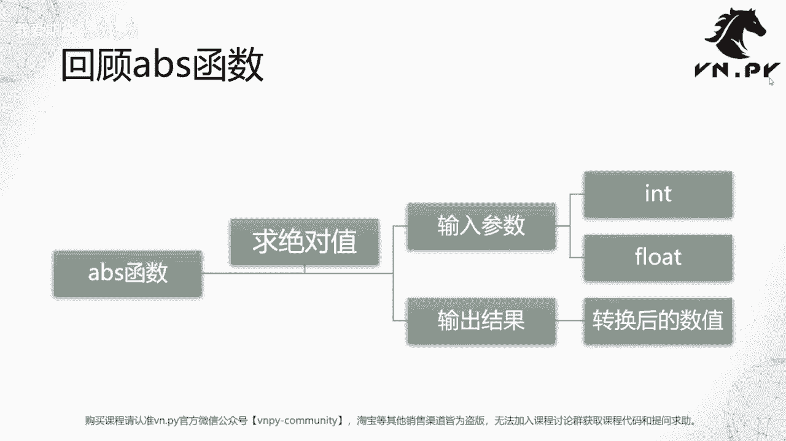
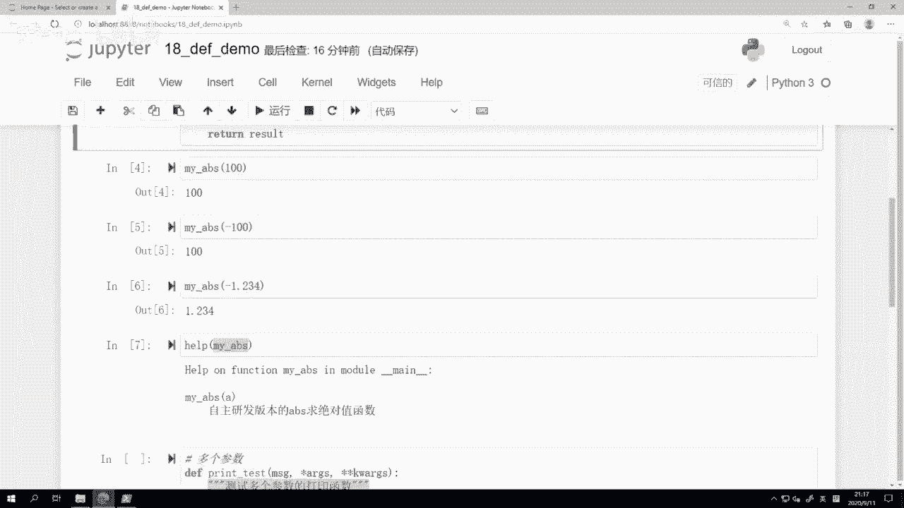
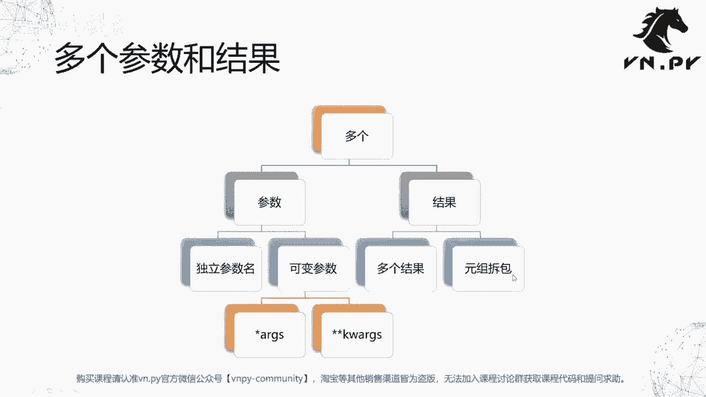
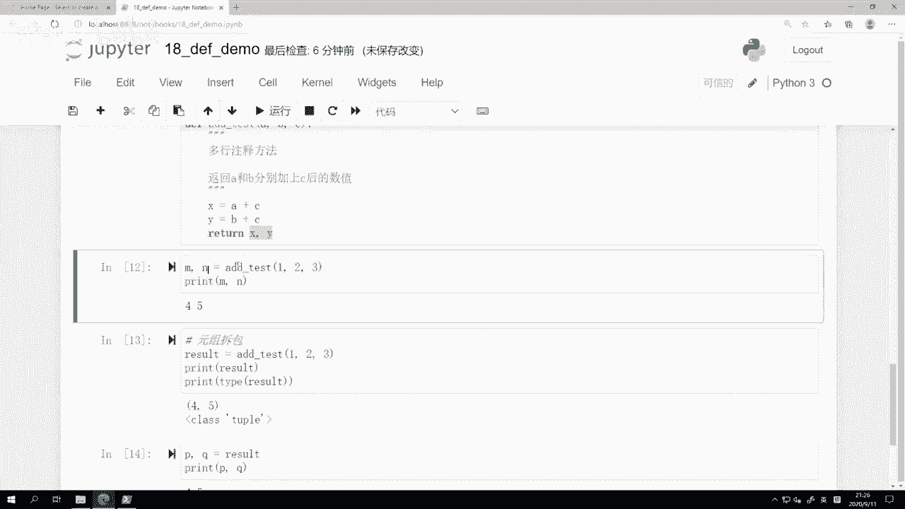
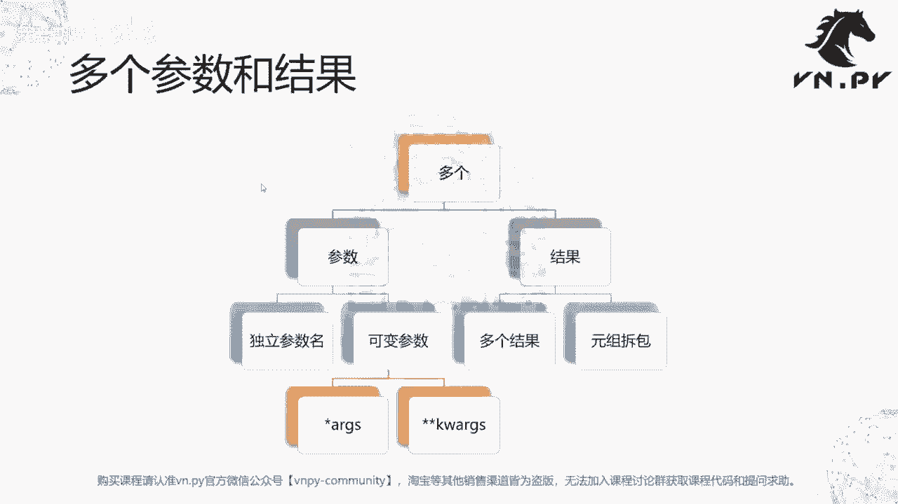

# 18.参数和返回值 - P1 - 我爱期货 - BV1352gYTEjL

OK欢迎来到量化交易零基础入门系列，30天解锁Python量化开发课程，那么今天呢是我们的第18节课了，在上一节课里面我们初步接触了函数的概念，也看了一下Python内置的这些常用函数的用法。

那么在这节课里面呢，我们要开始来开发一个自己的函数了啊，那么我们这节课要讲的是，这个函数的参数和返回值，那首先呢我们来回顾一下上节课里面，其实我们已经看到的，可能第一个我们接触的这个数学运算类的函数。

就是abs函数啊，它的功能非常的简单，就是用来求一个绝对值，那么在求绝对值的时候，我们回顾一下哎，这个参数其实只有一个对吧，就是你输入一个数字，当然这个数字呢可以是整数类型，也可以是浮点数类型。

那截止目前呢我们已经知道了，对于绝大部分的数学运算，在Python里面啊，不管是整数还是浮点数，其实他们的这个计算逻辑是高度接近的，都是被当做数字来直接计算，而不像其他一些编程语言。

可能有非常严格的区分啊，不同的啊这个函数啊，那他的输入值就要完全啊是对应的类型才行，否则就会报错，Python没有这个点啊，Python动态语言的特性，使得它的绝大部分函数用起来非常的方便。

那么啊这个一个输入的参数，对应的呢也是一个输出的结果，而这个输出的结果就是把这个数字啊，转化成它的绝对值之后的这么一个数值啊，作为一个输出的结果可以返回出来，那么这个呢就是我们的这个a abs函数。

那在这节课里面，我们要做的第一件事情就是来自己啊，我们自己亲自来开发一个a abs函数，首先呢我们就是这边取了个词叫做定义啊，为什么要定义这个名字呢，因为在Python里面。

那么如果我们要去写一个函数的话，我们要用就写的时候，我们要来命名这个函数的语句，就是这个叫做DEF的关键字啊，那么DEF我们知道是英文里面，defined的缩写哈，define就是所谓定义的意思啊。

所以这个DEF就是告诉我们的，这个Python的解释器，哎我们这里要开始写一个函数了，然后写的过程中呢，放在这个函数括号里的会是我们的参数，然后要紧跟着一个冒号标识，然后在下面实现我们的函数内部逻辑。

最后返回我们的运算结果啊，那么大家先大概的记着这么一个五步流程。

然后呢我们就开始到JUPITER里面，开始来写我们今天的这个啊abs函数，那么啊这节课这个demo呢叫做这个18啊，d e f demo啊，我们这个函数因为我之前已经写好了。

我就带大家按照之前的这么一个步骤，一步步来看下来啊，在上面我们先来运行一下，如果我们直接用运行一个a abs，比如说哎-123。1231啊，我们知道运行的结果，就是它的一个正数的绝对值。

那如果直接运行正数的话，就是它本身这个是abs函数的作用啊，那么下面我们要自己定义的这个函数，首先啊我们在前面写了一个DEF的关键字，然后空了一个空格，然后跟上的是我们要定义的这个函数的名字啊。

我们这边所以这因为还是一个a abs函数嘛，只不过是我自己写的，我就给它起名叫my abs，my和abs之间我用了一个下划线做连接，然后括号里面的是这个函数要用到的参数啊，我们这边A就是一个数字。

一个数字单独的一个数字，然后后面跟了一个冒号，这样完了之后呢，要回车到下一行里面啊，去写我们接下来函数内部的逻辑，那么在最上面，我们这里有一个前后分别用三个引号给啊，这个包括起来的字符串。

那么这个字符串呢，就可以视作是我们这个函数自身的注释内容，这个注释内容可以我们等会儿可以看到，在我们调对函数调用help啊的时候，我们可以看到它，然后呢在这个啊就绝对值的函数里面。

其实我们要做的事情非常简单啊，因为这个绝对值的概念大家都知道嘛，正数的绝对值就是就是自己本身，负数的绝对值呢就啊取个反啊，就是负数把那个负号给去掉，就是正数，然后零的绝对值就是零。

所以我们这边做的这个逻辑操作非常简单啊，我们之前已经熟练掌握了，这个if判断语句的写法，那这里呢就是我看一下数字进来的A，if a大于零，那么result就等于A反过来，如果他不是大于零的情情况啊。

我就直接用一个else来表示了，可能包含的是小于等于零的情况，那么result就等于负A啊，在这里呢我们把零同样取了个负号，但没关系，零随便怎么取负号，它还是零啊，所以在这我们最后来返回这个结果。

用一个return的关键词来做了一个返回，那么到这里呢，我们就完成了我们这个函数的定义啊，还有一个要注意的点，就是你在这里冒号完了之后，如果你是在写的时候，紧接着直接回车的话。

JUPITER会自动把我们的光标移到下一行，缩进了四个空格的位置啊，这里一共有四个空格会自动帮我们缩进啊，同时在vs code里面也会有类似的效果，大家可以在vs code里面自己试一下。

但是你自己要记住在这个地方是要做缩进的，就Python里面大部分的缩进啊，不管是这种像if语句后面跟着的缩紧啊，像这个地方也是缩进了四个空格，还是比如说什么while语句啊等等都统一。

几乎都是缩进四个空格啊，记住这一点，那么我们现在呢就按shift回车运行这个单元格，那当前在我们的啊这个jupiter notebook里面，就已经定义好了这么一个my abs的函数了。

下面我们就来试一下，看看他能不能正常工作，比如说我取个my abs100啊，去个买a abs-100，取个买a abs-1。234，我们可以看到结果都是正确的啊，都是从负数转到了对应的这个正数或者正数。

本身就保持指自己正数啊，那么所以从功能上讲，我们自己写的这个很小的my abs函数，已经起到了我们这个绝对值函数的功能，然后我们要做的呢是调用对啊，写一个help help。

当然也是Python内置的函数，然后一个括号，括号里面的呢是我们这个my abs函数本身啊，就在这里，我们my abs函数作为一个参数，输入到这个help函数里面。

我们可以看到输出的内容叫help on function，my abs in module main啊，让我们abs括号A啊，然后是一个自主开发版本的abs求绝对值函数，这个字符串上的信息是什么。

就是这里的信息，所以大家可以看到你如果自己再写一个函数，包括在再到后面你自己去定义一个类的时候，如果你希望对这个类的这个函数，提供一些这种注释信息，让用户在用的时候。

可以通过help函数来非常方便的查看的话，你就把它写在这个啊，用三个前后各三个引号，给包括起来的字符串里面就好了，这个字符串和我们下面用井号开头的字符串，它的作用是不一样的啊。

这个字符串本质上是给Python的，这个就是你这个函数本身的这么一个注释呃，一个一个这这种类似于解释性的内容，而这里井号开头字符串呢，更多就是我们写代码过程中，纯粹给我们自己看的啊，所以这是一个区别。

那定义完我们的啊这个abs函数之后，我们稍微进一步来看一看啊，这个在定义函数的时候，更加啊稍微进阶一点的用法，那么在这呢，我们就首先要看的就是多个参数和结果，刚刚我们那个a abs函数啊，非常简单。

参数进来是一个数字，参数出来又是一个数字，所以一个进一个出，这个函数呢是在整个啊，一般情况下我们用这个函数的时候，可能是一种非常简单的特例，绝大部分的函数可能都不止说有一个参数，也不只有一个结果啊。

可能你是有多个参数，一个结果可能是一个参数，多个结果也有可能是多个参数，多个结果都有可能，那么Python不管怎么样，对这些形式的啊，这个函数都有非常好的支持，那么多个可以是参数。

那么在这样一个情况下呢，我们可以给参数提供独立的参数名，可以提供所谓的可变参数啊，可变参数是什么呢，就下面这两个啊，打星号的AIGS，可以打两个星号的keyword a r g s啊，关键词可变参数。

然后最后呢也可以，我们在函数计算完之后返回多个结果，那么这个时候返回的时候呢，首先正常是返回多个结果，但我们也可以看一下，这个多个结果是怎么返回的，因为比如说在C加加，或者C这样的编程语言里面。

函数是返回不了多个结果的，为什么Python可以这么优雅的去实现这一点，其实本质上背后用到了我们啊，之前讲元组的时候。

用到一个叫做元组拆包的这么一个功能好，那么我们这边呢，就从继续回到我们的代码来来看哈，首先我们来看多个参数的情况，我这边定义了一个特殊的print test啊，这个啊函数。

那么这个函数的作用我们可以看到，首先它前面有个叫message这么一个最基本的参数啊，就是所谓的信息，然后后面有个新ARGS，还有一个两个新的啊，这个叫keyword e r g s。

那么啊在这个函数内部，我们做了什么样的事情啊，第一步我们把这个message给打印出来，我们直接把print出来，然后我们做了一个for循环，我把这个for a arg in a args s里面啊。

这个ARGS是一个列表，那我用了一个for循环，把里面列表里面每个值打印出来，然后对于这个KWIGS，它就是一个字典，所以我们用一个for循环，把他这个item就键值对的信息给打印出来。

那在这呢我们就先来看一下啊，这个我们在打印的过程中，顺道把这个keyword，ARGS和AIGS的类型都给打印出来，注意在用的时候，星号仅仅在函数定义的时候要用，后面我们在操作这个啊参数的时候。

是不需要用它的啊，这一点要注意，那么这样同样shift回车来定义好这个函数之后啊，我们先来做一个PRINTEST，啊又来hello world，我们再来一次，运行的时候。

我们可以看到哎这hello world打印出来，同时下面还打印了一个AARJS类型啊，这个我刚刚说错了，不是列表，它是一个元组，以及这边k keyword a r js是一个dict字典的类型。

所以在这呢啊，当然因为这两个后面的数据我没输，大家可以看到只有第一个参数hello world字符串啊，所以他后面两个这个for循环都是空的，所以我们看一下再往下啊。

这个新的一个函数调用print test，叫我这个传的第一个字符串是测试打印函数，然后我传了连续的12345这么五个参数，那你甚至可以传任意数量的参数，你传更多，传十个100个都可以啊。

这里没有任何问题，第二个我们在后面还传了这样的参数，叫做前面有一个参数的名字，后面跟了一个等号，再跟一个这个参数数值，这种写法在Python里面叫做命名参数，就是这个参数，它就我在这里就是告诉函数哎。

我这个30的参数就是传给ma这个参数名的啊，那这个20的数值就是传给RSI这个参数的，以及50就是传给CCI这个参数的，所以我们这样再回车下，我们可以看一下结果好，我们可以看到，首先测试打印函数。

然后这个class tap都一样的，然后呢我们这个第一个for循环的时候，他把tap里面每个数值都循环了一遍，然后每个数值打在了一行上，这个tap其实就是在这里，我们输入的12345这么多个。

就是写在后面的参数啊，他就直接放在这个tap里了，然后对于这个字典啊，dict里面的则是包含了我们写进来，所有这种用键值对传入的参数啊，都写在这个字典里面，然后可以看到ma啊。

30rs i20 cci 50，所以通过这个方式呢，我们就可以很方便地去诶扩展我们的函数，有的因为很多时候我们的函数是不知道你，你不知道你可能要啊，这个这个有多少参数输入进来，你也可能不知道啊。

这个用户会不会用啊这种位置参数的方式输入，还是用键值对参数的方式输入，那么用了这里的这个带星号的ARGS，和带星号的Q2AIGS这样的写法之后呢，才呃这个函数的灵活性就会得到保证啊，那么前面是多个参数。

下面我们要看的呢是叫做多个结果，这里我呢同样定义了一个函数叫at test，它也非常简单，就是我输入三个啊，这这个这个数字啊，A b c，然后我是返回A加上C和B加上C的结果。

我们可以看到这里首先是X等于A加C，然后Y等于B加C，然后return x y，我同时返回这两个东西的数值，那么注意和我们前面那个my abs函数最大区别，就是这里的返回值是两个数啊，两个变量。

然后中间呢用一个逗号做了分隔，我们这边同样把它哎先shift回车运行一下，然后呢我们就来输啊，MN啊，这里我也是我知道这里at test会返回两个参数啊，两个两个结果，所以呢对应的我就用两个变量来承接。

这两个结果，就是M和N啊，At test，直接123，然后我们print一下，看看结果是怎么样的，结果是四五，什么意思啊，首先四等于1+3啊，第一个数字加上最后一个数字，五等于什么，等于2+3。

第二个数字加上最后一个数字，那么我们可以看到通过这个写法，我们在函数里面就返回了多个参数呃，呃不好意思，多个结果，那有人如果你用过其他编程语的话，你肯肯定会有这个问题，为什么在C加加里面啊。

这就是生C语言里面大部分很多编程语言里面，函数都只能返回一个结果，而不能返回多个，如果要返回多个的话，你可能要用到比如说CJ加里面的那种指针啊，引用的概念啊，才能去实现。

那在这儿为什么Python这么方便呢，我们就来看一下，我们还是ADD一个test，但是我们把整个结果返回给一个这样的变量，就是result，让我们打印一下它的啊，这个结呃，这个里面的数据打印下它的类型。

我们可以看到打印出来result它是一个括号，括起来里面是四和五两个数字，然后我们看它类型，它是一个tap，是个元组啊，然后看到元组我们就想到什么，我们可以对元组进行拆包。

我们可以用PQ等于这个result啊，这样拆包完了之后，P和Q分别就是四和五了，所以这个操作其实等价于什么，这个at test m m n等于ADD test啊。

直接等价于就这这里我们把它拆成两步来做的，先把函数调用的结果复制到这个result变量上，然后我们再把result变量进行拆包啊，拆成P和Q，最后把它打印出来，其实如果你把它合并到一个步骤里面。

就是这里的这个写法啊，所以这个也解释了为什么在Python里面返回啊，我支持函数返回多个结果，其实本质上当你返回X和Y这两个东西的时候，你返回的不再是单一的数值了啊，你返回的是一个元组。

你返回是个TP类型的数据，然后在下面啊，当你取多个这样的变量来等于这个type的时候，本质上Python还帮你做了一件事，就是所谓的数据拆包，这样拆完之后呢，自然结果就有点变。

像是说哎我这个函数直接支持返回多个值啊，其实是啊这个它返回的还是一个值，是那个元组，然后呢我们再对元组做的拆包，但是用的时候感觉上哎。

就直接是这个函数支持多个返回值了，所以呃到这呢我们差不多就讲完了，很基础的Python里面的这个啊，怎么样去定义一个函数，以及呢怎么样去实现多个参数的传入，以及多个结果的返回啊。

这个和之前我们讲if讲while，讲这个一些数据类型的时候都一样，它属于基础知识，具体怎么把它给用起来，我们后面还是要看更多的实践案例才行啊，所以那么这节课的内容呢就先到这里。

更多精华内容，还是请扫码关注我们的社区公众号。