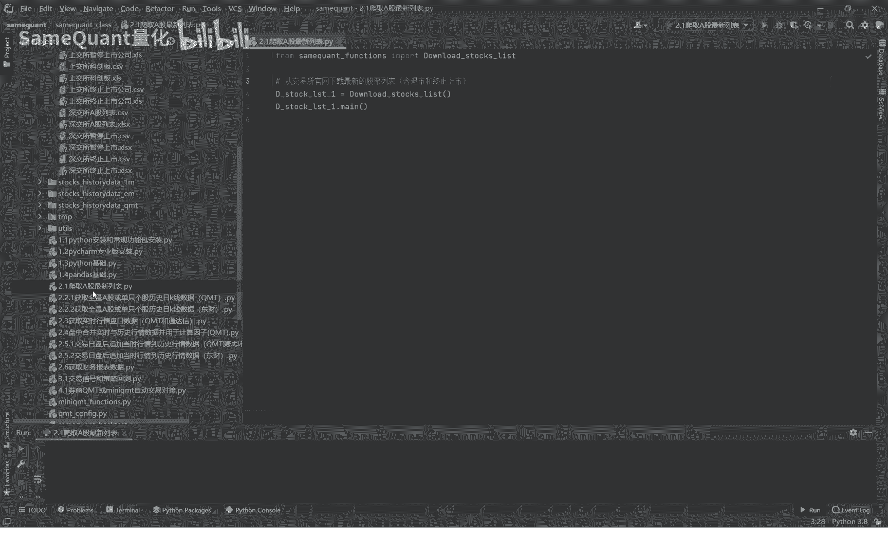
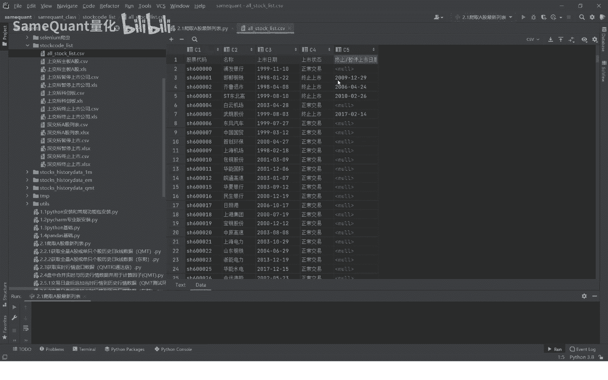
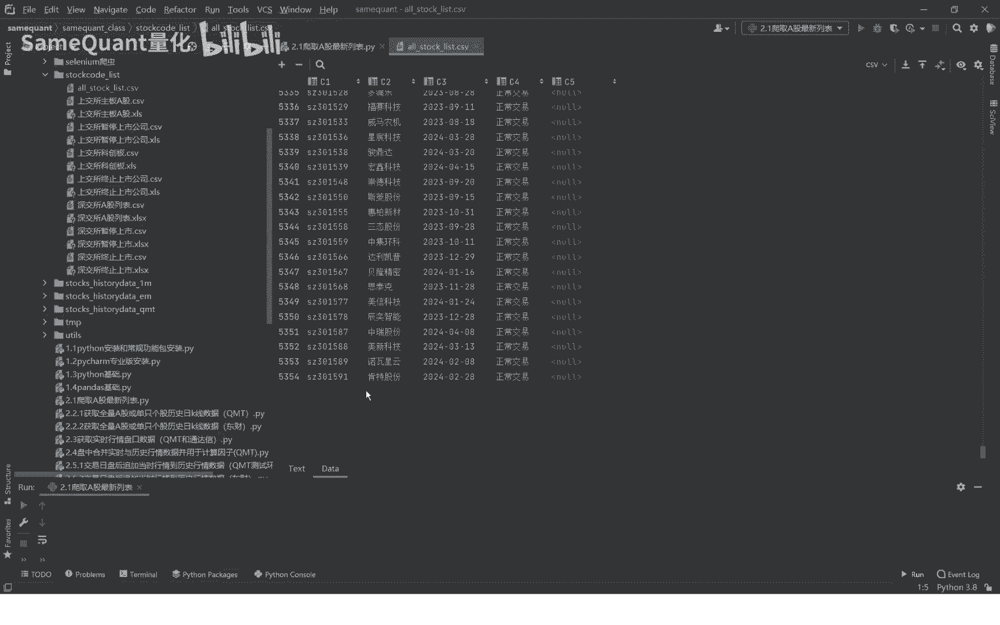
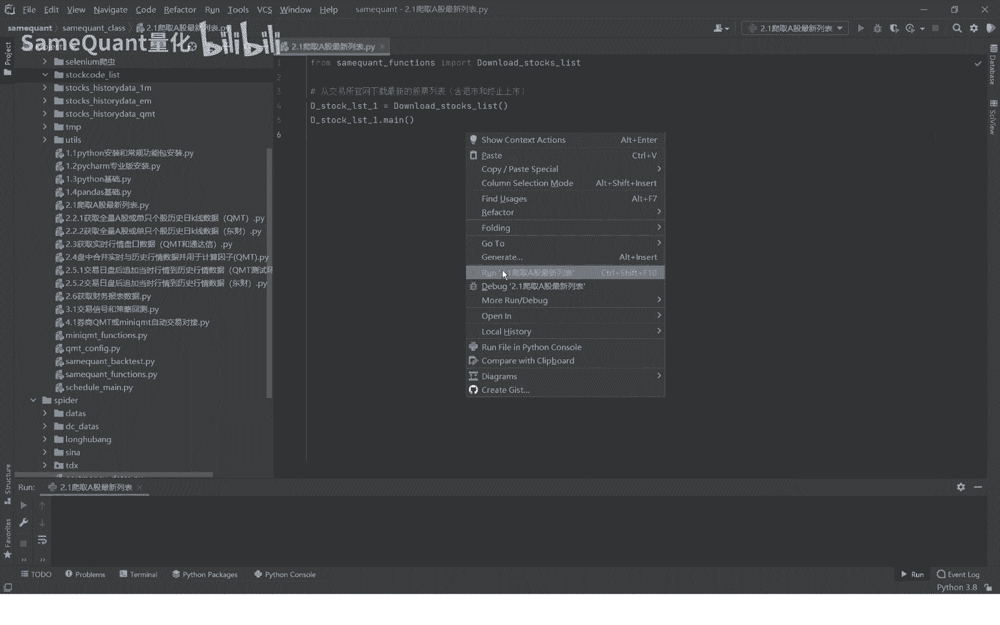
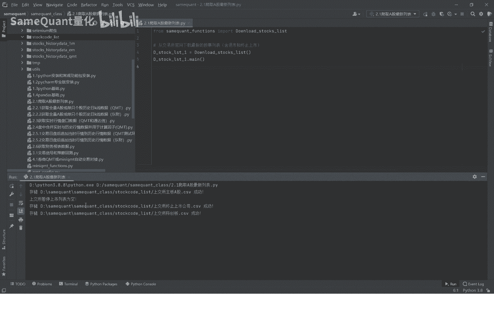
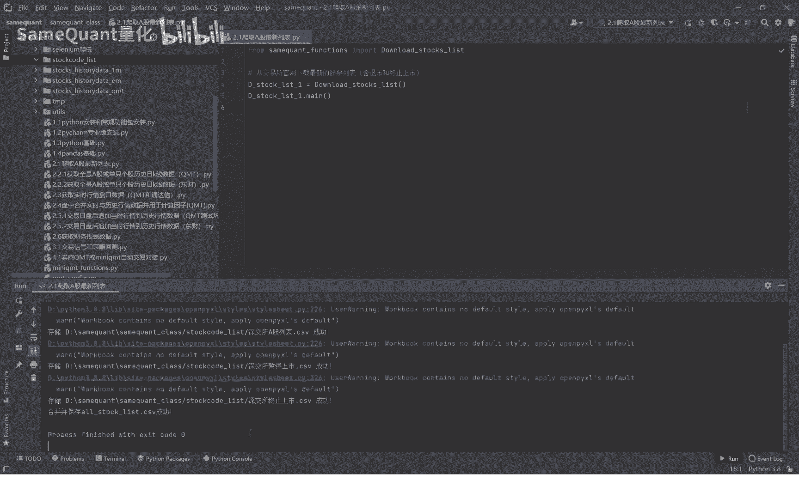
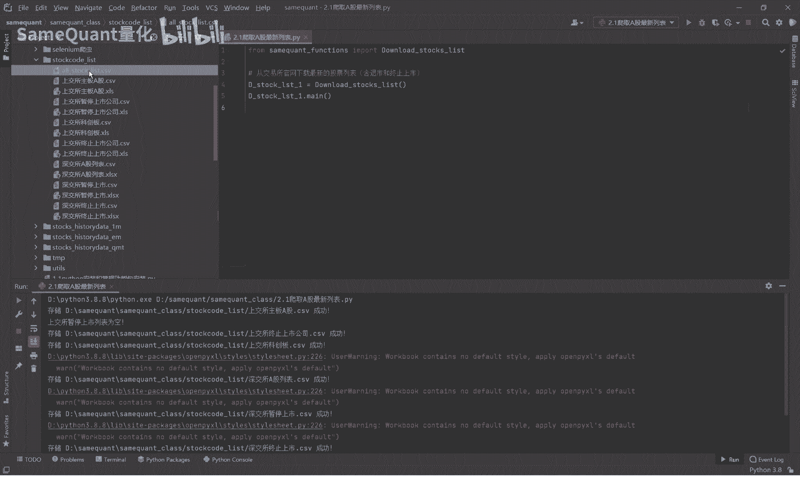
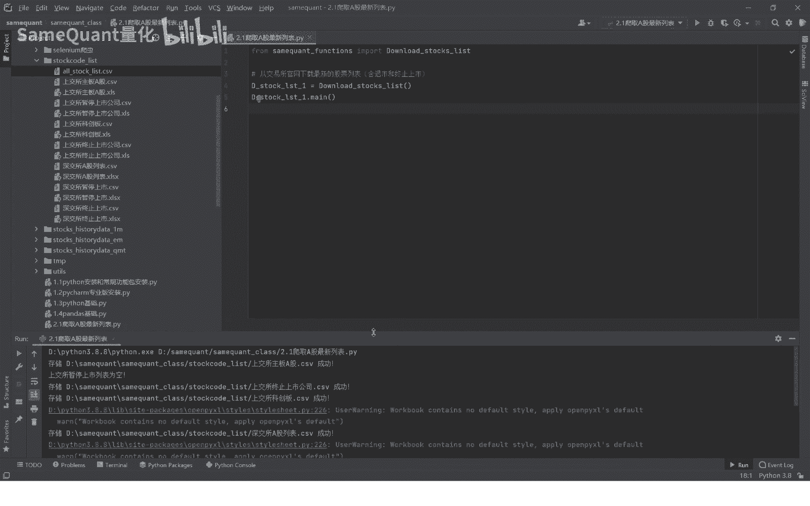
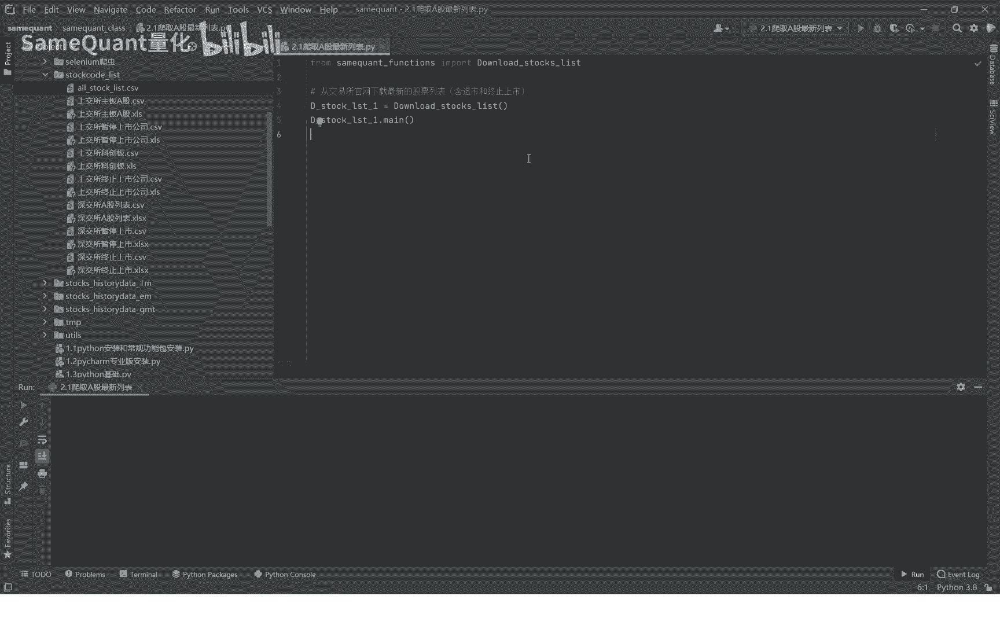

# 2.1 获取A股最新列表 - P1 - SameQuant量化 - BV1fm421u7Eg

大家好，这里是simple矿场量化啊，也是打板哥，那么这一期呢我给大家分享，如何打取这个A股，上市公司的一个最新的一个列表啊。

最后要生成的一个表格就是这样的，包含这个股票代码名称，上市日期，上市状态，终止或暂停上市日期。

这是一个之前下载的，我们可以看到这个总共有5000多个啊。

包含历史当中退市的或者是终止上市了，在演示下载之前呢，我们先将这个之前下载的先删掉，让我们运行这个下载程序。

大家可以观察观察一下啊，先是上交所主板的是暂停上市。

上市是上交所科创板的啊，接下来是交所的A股列表啊，深交所暂停上市的。

深交所终止上市的所有这些之后呢，它会拼接在一起，最后你可以看到我们删除的这些表格，它又重新的又重新生成了啊，所以这里我们再打开看一下啊。

就是这样的一个表格，这就是一个最新的一个表格了，包含一个上市日期啊，上市状态和终止上市这个源码呢，大家啊这个源码是我们课程里面都是有的。

做每一步如何下载的啊，我们从哪下载的，下载之后如何成为这个XLS文件，如何转CSV又合并在一起，最终生成这样的啊，这都是有源码源码，大家可以直接在这里面看啊，这里面你都可以详细看，是由于某些原因。

我们这里就不详细的讲解源码了，因为这个这个大家都懂的啊，不是特别好，所以说这你自己看就行了啊，因为毕竟爬虫的东西有一些，有一些网站是不建议大家就公开的去爬虫的，好吧好，本期的课程就先到这里了。

