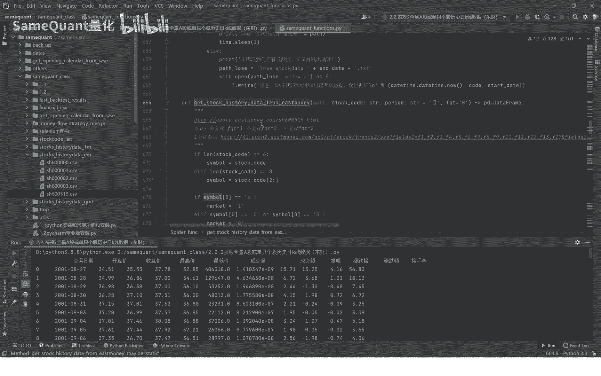
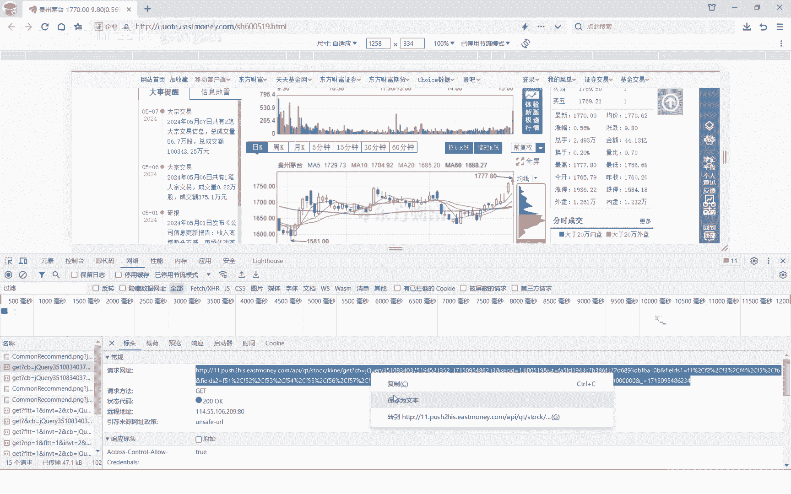
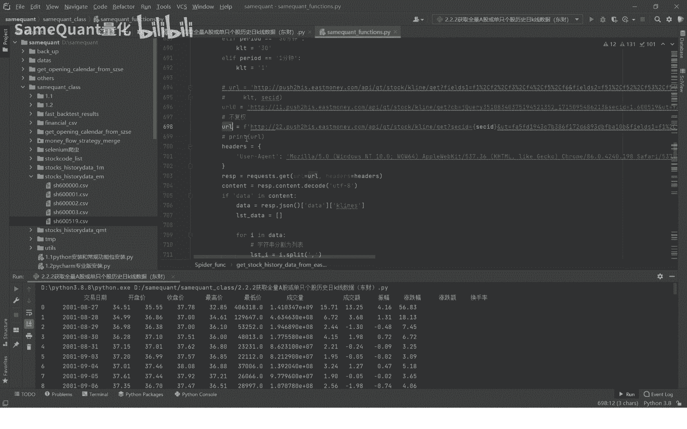
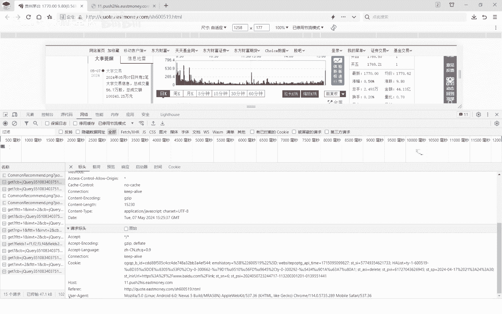

# 2.2.2 下载A股历史行情数据东财 - P1 - SameQuant量化 - BV1W1421B7if

大家好，这里是sim矿石炼化，也是打板哥，这期课呢，我们分享如何从东财爬取这股的历史行情数据，而我们也是啊提前封装好了一个类，我们也就是这个啊，我们先演示一下，首先呢第一步呢你是这个股票代码。

先设置一下这个函数，你把这个代码设置到这个函数里面来，你下载完之后呢，要涉及到一个存储，存储到本机，存储本机，你需要给他一个目录，我们这个目录呢这句的意思呢，获取当前的PY文件所在的一个目录。

因为我们当前的PY文件是这个嘛，这个所在的目录就是这个啊，sim cod class这个位置，那么我们要放在哪里，我们要放在这个stop history第一个目录下面，所以说你这里可以拉到这边来。

另外呢每一只个股我们单独成为一个CSV，所以说这个股的代码是吧，这里就填了一个cs code啊，作为他的名字啊，CC文件名好，这样就拼接成了一个它的存储路径，那么接下来呢我们就运行了，我们看一下啊。

并打印看下好，这个已经对了，看到没啊，这个已经获取出来了，这是从2001年8月27到这个5月7日，最新的一个交易日，所有的历史行情数据都下载到，而且我们看到这个位置，你看到没。

这个位置新增了一个USESV文件啊，之前是没有的，那这个就代表着，下载历史行情数据就已经完成了，好，我们接下来来看一下这个，讲解一下是如何爬取第三行情数据的啊，这里面就是源码，所以我们点击鼠标点击进去。

那我们先进入到一个目标的一个网址啊，也就是这里啊，也就是进来之后呢，你看这里面这个网页上它有日K周K5分钟，15分钟，30分钟后60分钟啊，说明这些都是支持的啊，你包括这个还有什么前付权后复权。

不复权三种模式的一个历史的一个K线数据，接下来呢点击右键审查元素哈，我们用的是这个浏览器，任何浏览器都是一样啊，这个没有任何没有多没有什么太大区别啊，谷歌浏览器也好，我360也好啊。

或者是其他浏览器都是一样的啊，我们点击啊网络这个要勾选一下这个点，全部我们先清空一下，清空之后我们点击一下日K这里点击下日KZ，点完了之后呢，你看下面就有一些请求的一些数据哈，请求一些API接口。

我们先暂停掉啊，不要让它再自动的增加了哈，我们点进来啊，直接点这个点这个再点到这个预览，点到预览里面或者响应里面哈，我们看一下有没有数据，再点击预览，我们看一下预览，我们点开这个date，我们点开哈。

你会发现这个怎么样，这就是我们的历史的行情K线数据，你看从2001年8月27到这个对吧，一直到最新的20145十，就是这个数据，那好我们再来到这个标头，标头看到这个请求网址，那么请求网址呢。

我们这选中之后。

右键我们转到点击转到转到这个网址，你会发现这就是一个接口，这个接口里面就是所有的历史行情数据了啊，茅台的历史已经数据了，好，那么我们接下来就把这个接口怎么样，接口给拿，拿过来之后复制到了复制啊。

拿过来之后我们就复制到这儿来哈，复制到这个位置，我们先先用一个变量复制过来之后，我们要观察它的一些规律，我们观察这个API地址的一个规律，我们可以看到第一个呢首先是查这个位置，你看属于是1。

600519，这个就第一个，这个你大概率可以分析它代表什么，一代表是上交所，这后面的代表是一个代码啊，这个也就是我们后面的这个变量SEC点D，这个也就是我们把拼装出来的，首先第一个是market。

一是market，加上它的股票代码，就是这个就这个参数，那个参数呢你就给它传到这里来哈，另外我们再看一下其他的，还有什么其他的标TBIG呢，这个是1101101呢，这个代表的是什么意思。

代表是日K的获取日K的数据，就是这个时间你要当这个东西，你需要有一定经验，你去摸索的，如果我们现在就说已经知道结果，再给你讲解一下啊，肯定是有一个很长的一个摸索的过程。

不是说你一上来很轻易就12分钟就搞定了啊，没那么快哈，另外一个呢这个啊做全type这个代表什么呢，跟一代表什么呢，一代表前复权哈，我们一般都用前复权这个数据哈，你把这个也也是前夫权这个一给输入进来。

然后其他的这些呢你可以不用管哈，不用管之后，然后你就拼接这个URLURL。

接下来这个黑这个黑其实也就是这里的哈，黑的也就是这个user a进程。

也就是这个东西，你把它复制过来到这里就行了，UID这是一个我们说这是一个字典，就是一个K后面是value，也就是网页里面这个位置的啊，你把它复制过来，复制过来之后呢，这个是request这个包。

这个包呢你爬虫之前你要先安装这个包，也就是这个啊，也就是你要先安装这个包，这个包怎么安装呢，我把这个命令给你说一下，就是pip install u n e s t s啊，也就是这个你要先安装这个包。

你不安装它没办法用，你怎么安装呢，我们之前的课程里面也讲解了，我再给你演示一下，打开这个TIMMINAL是吧，你直接在这复制粘贴是吧，Barbino request。

你就这样int键一按它就开始安装了哈，这个因为之前已经安装过，他现在又更新了啊，安装了这个没什么关系哈，你更新就更新吧，没有关系，你看这rap date是更新了啊，更新就更新了。

更新它不一般来说不影响你使用，好就这样哈，好我们接着讲request之后呢，那你就是用request get get方式去请求这个请求之后，你就获取到了这个也就是网页的数据了，也就这个数据。

你看到这个数据，那你获取到这个数据之后，接下来就解析了这个解析，你把它解析成我们需要的一些数据是吧，你再重命名一下这个列名是吧，那我们就获取到了，我们刚刚看到的这个数据了啊。

就这个样子的数据我们就获取到了，我们再再运行一遍哈，最后就变成这样的一个数据，我们就可以用于什么，用于我们的量化交易了，量化交易因为你去回撤也好，或者是计算一些指标或者信号也好。

你肯定是要用到历史数据的好，这就是一个单只个股的历史行情数据啊，下载就是这样就完成了，我们接下来呢要下载所有的所有的，我们也是封装好了一个函数。

就是这个登录的all dogs hdmn from em是吧，就这里我们点进去给大家看一下，这个其实也特别简单，因为我刚刚已经封装好了，接下来就是全部的，首先就是便利你的一个。

我们说我们之前前期课程教大家在一个什么，就是所有个股的一个列表，也就这个20多个历史上，你这里有所有的个股的历史，才你接下来就是便利这个所有的股票，挨个进去下载，for循环去便利这个所有的股票来支股票。

包括退市啊，或者暂停上市的，或或者也是目前还在正常交易的，通通全部都想下载下来，就下载到下载到哪了，下载还是这个位置，还是存储在这个目录下啊，又是你循环了去去调用单只个股的，就开始下载好。

我们接下来我们就直接演示运行一下，给大家看一下好吧，直接点击运行好，你看现在已经在下载了，下载之后我们把这个打开，你会看到它在这个位置会自动增加的，如果他没有自动增加。

你就点一下reload from desk，你看它会自动增加好，我们就暂停掉啊，因为你到时候你收到源码之后，你直接运行就行了，因为我们本机已经有了历史行情数据了，我就没必要再重复的下载一遍了哈。

所有的历史行情就下载完了，下载完之后呢，我们后期同样的还涉及到就是说每日收盘之后，要把当天最新的一个行情，怎么样给追加到这里来，你比如说现在5月7号的最新的立场数据，是到5月7号了，如果说明天5月8号。

5月8号他又交易了一个日，那么你的历史行情数据里面没有，那么我们就需要根据当天的实时行情，把追加到这里面来，让他的一个数据完整，你不能说我每每每天你就所有个股的，在历史行情数据你都下一遍，没有必要。

流量太大了是吧，你没有必要，你每天你把最新的行情数据，你追加到历史行情数据里面就可以了啊，这后面都会教的好了，这期课程我们也就分享到这里了，也就是说这是第二个接口做下载历史行情数据。

因为前面介绍了从KOMT下载，这个是从中才下载，因为有的QMT他没有开通这个，但是他又想全量化，现在又想跟上课程，那就给你提供一个额外的一个接口，一个通道，东财的一个通道，当然还有其他的信啊。

新浪财经啊，这些都是有的哈，如果有需要的也可以啊，你可以直接给我留言，都是没有问题的，好了。

本期课程就到这里。