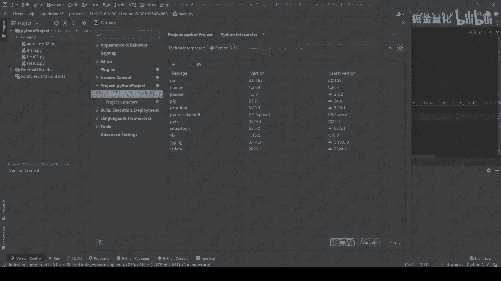
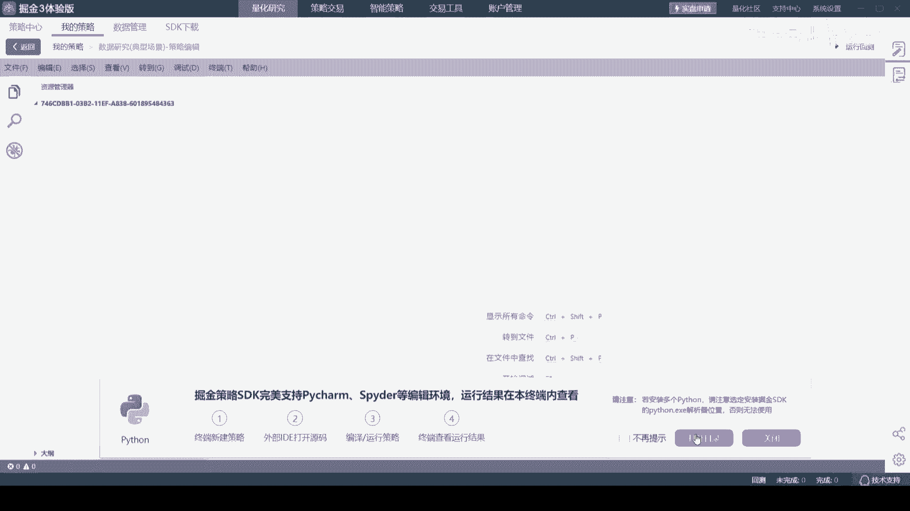
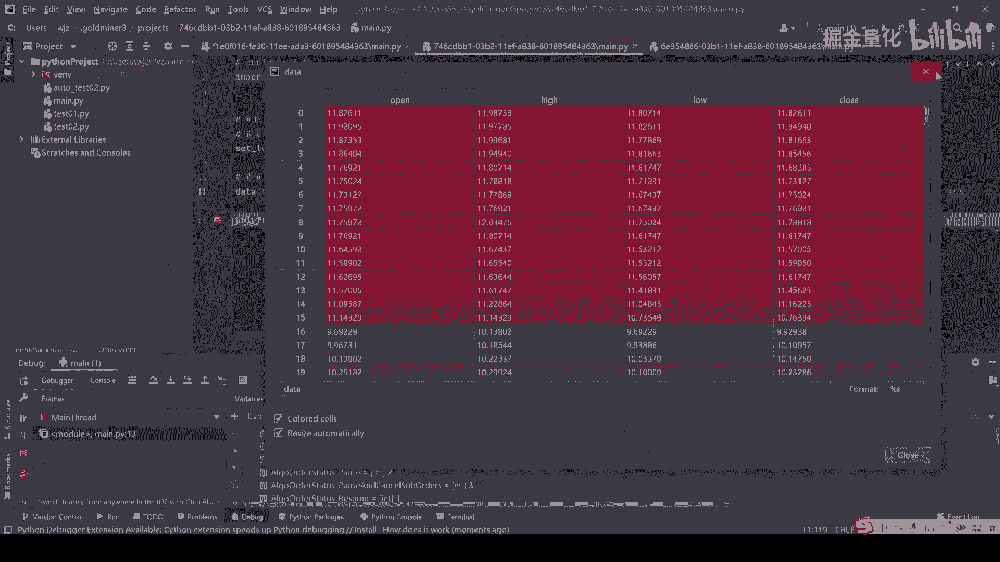
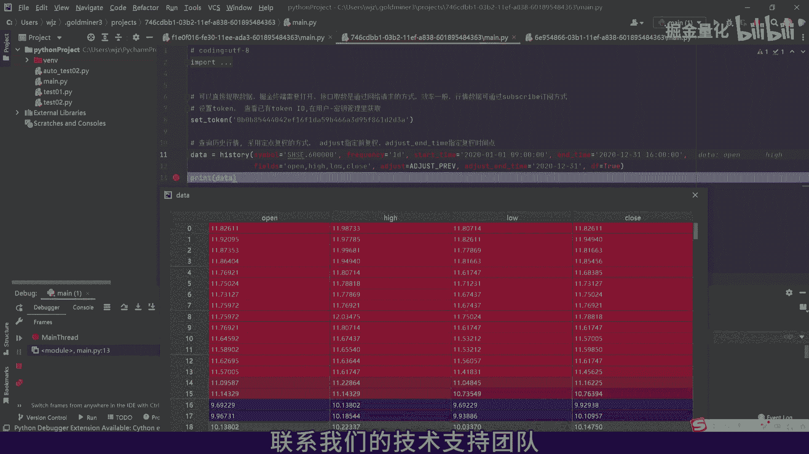

# 2.2 第三方IDE获取掘金量化数据 （pycharm为例） - P1 - 掘金量化 - BV1Uf421X7Kw

欢迎来到本教程，今天我们将向您展示如何以PATTERM为例，在三方集成开发环境中，获取掘金的历史行情数据，在我们开始之前，请确保掘金终端已经打开，PYEM的Python解释器已经安装了gm包。

并且您已经设置了有效的token。

最简单的方式，我们可以在终端新建一个数据研究的示例，策略测试。

并且以pattern打开，设置完成后，我们可以运行代码来提取所需的数据，您将看到数据如何被成功获取，并展示在PATTERM的控制台中，为了更深入地了解数据获取的过程，我们可以在代码中设置断点。

并使用patch arm的调试功能来逐步执行代码，观察数据的流动和变化，通过调试我们不仅可以确认数据是否正确获取，还可以检查数据处理逻辑是否按预期执行。

现在您已经成功的在PATTERM中，获取了掘金的历史行情数据，这将极大地提高您开发和测试量化策略的效率，感谢您观看本教程，如果您有任何疑问或需要进一步的帮助，请不要犹豫联系我们的技术支持团队。

