# 2.3 获取实时盘口行情数据 - P1 - SameQuant量化 - BV1Fx4y1W7FF

大家好，这期分享如何获取实时行情盘口数据，本期分享两个通道，一个是k mt里面的道，另外一个是通达信通道，当然还有其他的，比如说东财，新浪财经等等，好，我们先运行一下，演示一下QMT通道。

当然要特别注意的时候，在QMT获取的话。

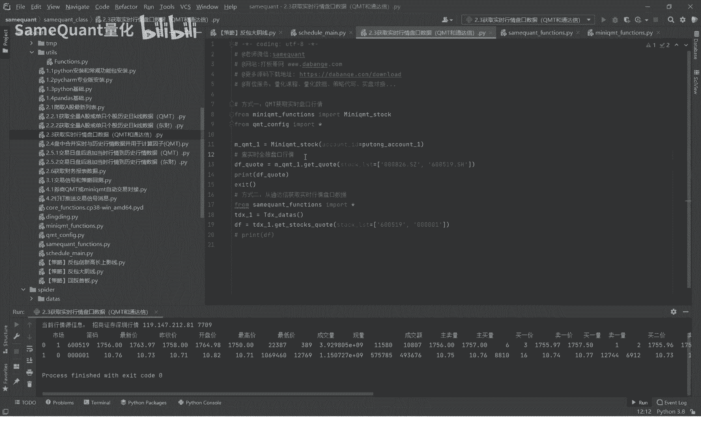

你必须要先打开你的GMT，并且登录好。

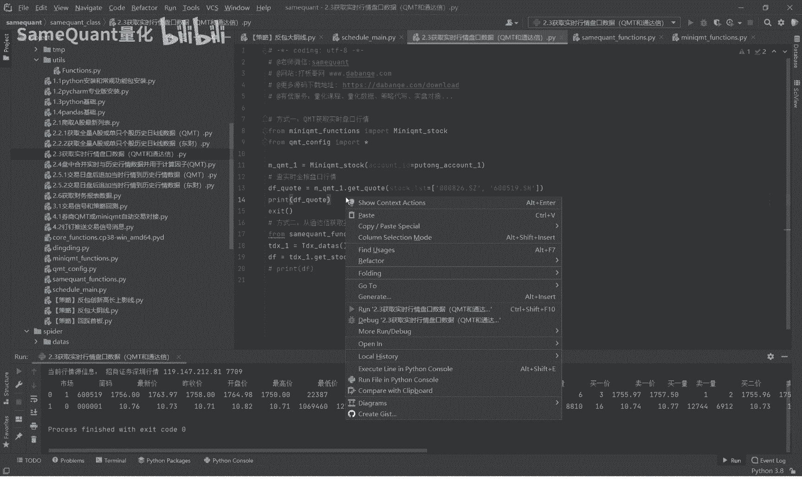

目前已经获取到了，大家可以看一下有哪些字段啊，主要有太高，收低以及让成交额，五档的买卖价以及委托的买卖量，以及买一档的一个金额好。

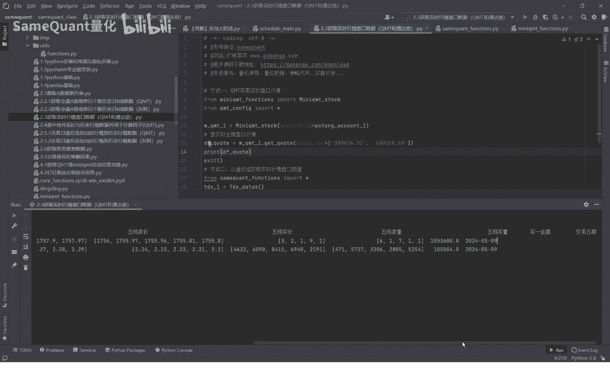

接下来呢我们直接演示一下这个通达信通道的，同样是运行一下。

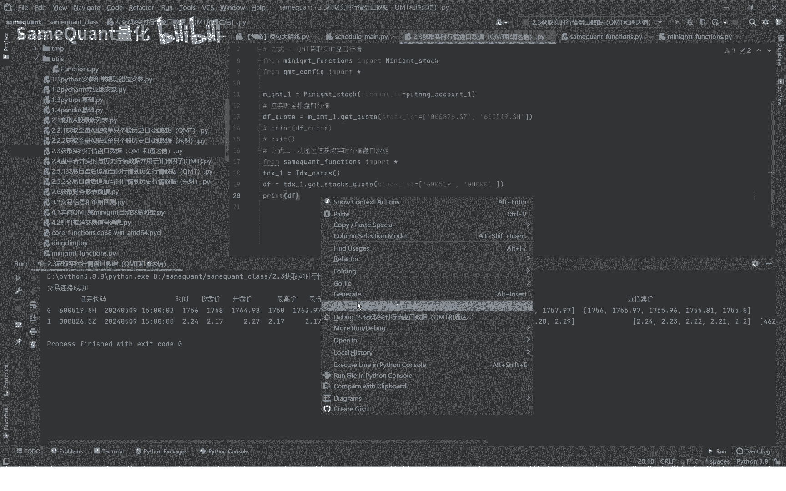

我们可以看到已经获取到了知识的一个行情，包含这个时间它的字段呢也是有太高收低价，最新价成交额，主买量，这个是相比KMT多的两个阶段，另外呢还有买五到卖五之间的一个。

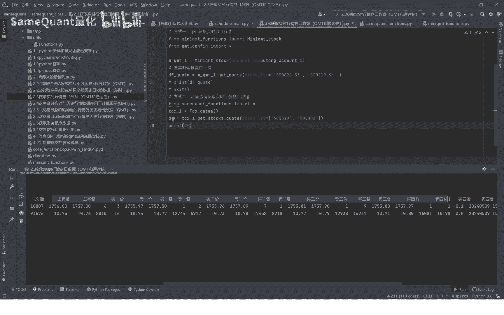

委托价和委托量，以及这个还多了一个整数，接下来呢我们就点进去，分别看一下具体的一个函数，u mt的。

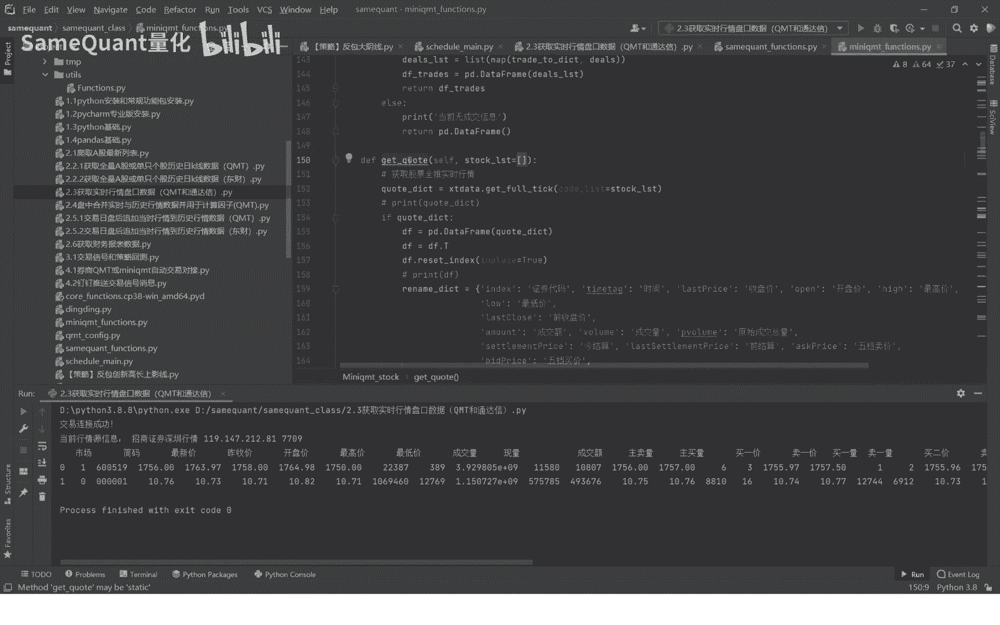

这里是说这个是KMG官方的，获取这个全推行情的。

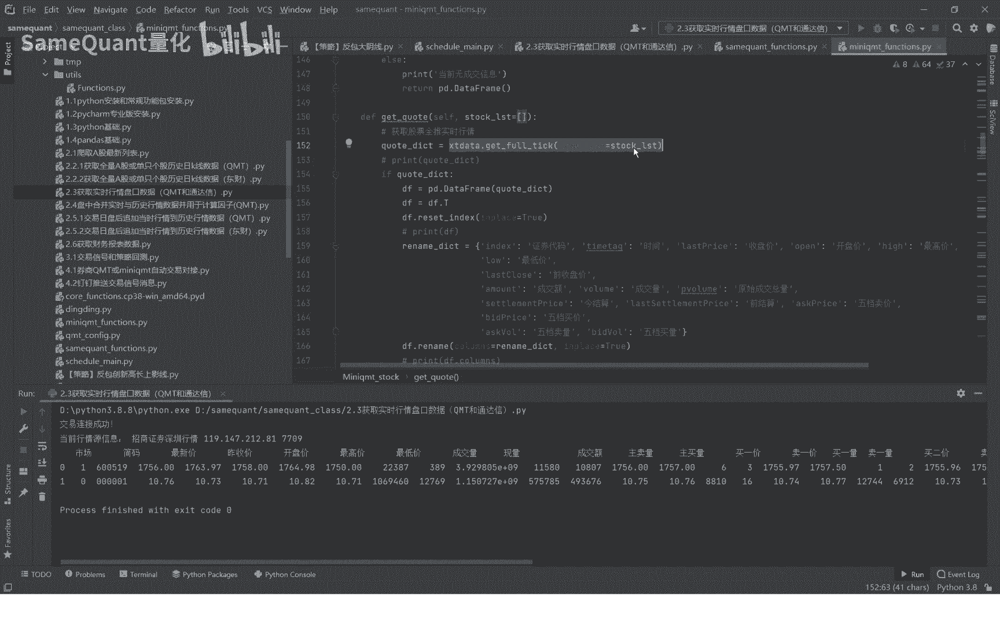

我们是获取这首页重新做了一个封装，对于列名做了一个统一统一。

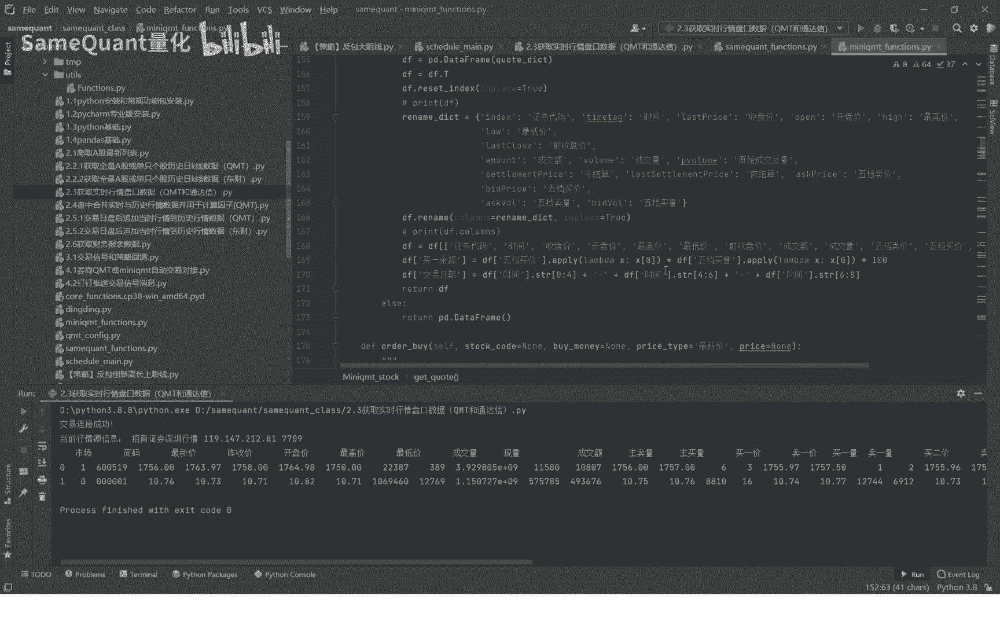

改成了一个中文的列名，因为是为了方便后续于一实时行情与历史行情，合并啊，用于计算这个盘中，实时计算这个因子或者是交易信号。

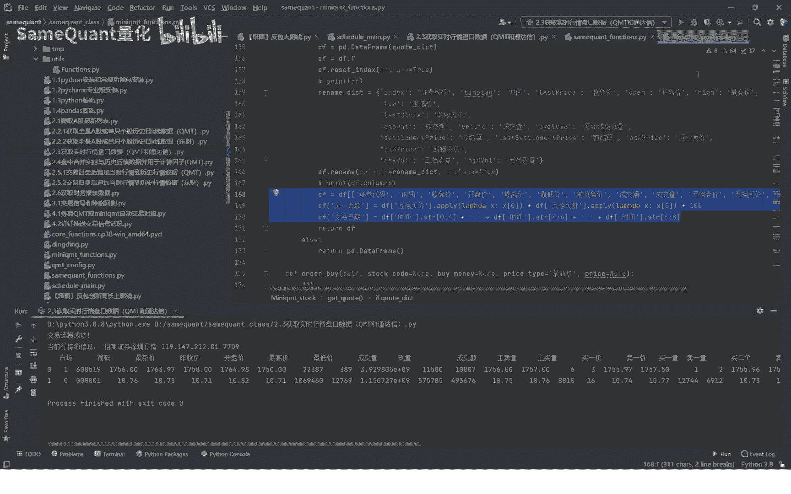

通达信的，这首先是这里是连接通达信行情源，获取通达信的行情数据，获取到了之后呢，也是对于英文的店名统一改成中文的。

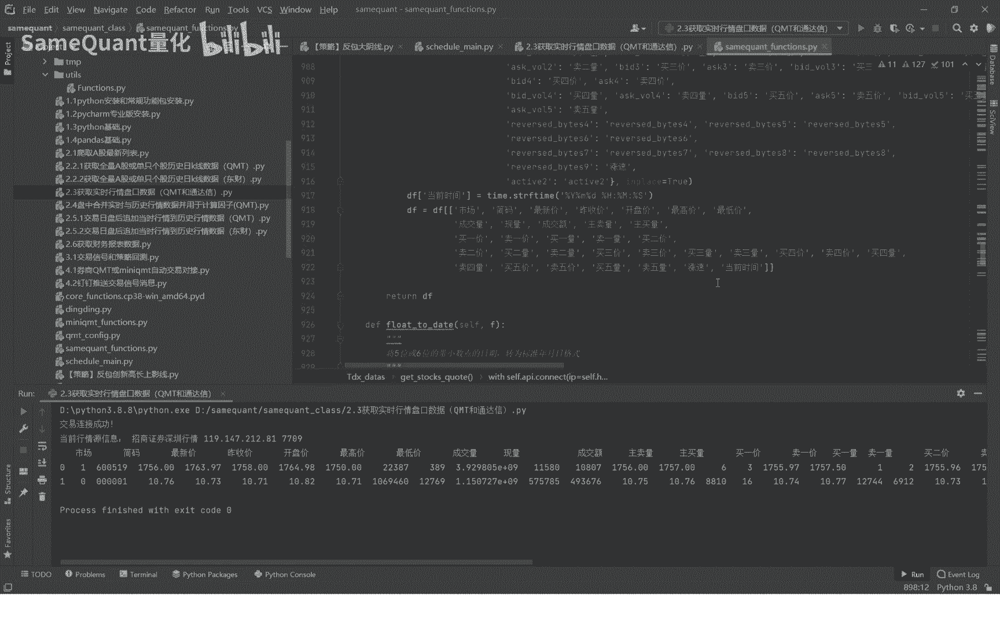

也是为了方便后续的一个统一好了，这个是相对来说是比较简单的，我们本期就先分享到这里，那么下期将分享合并实时行情与历史行情合并。

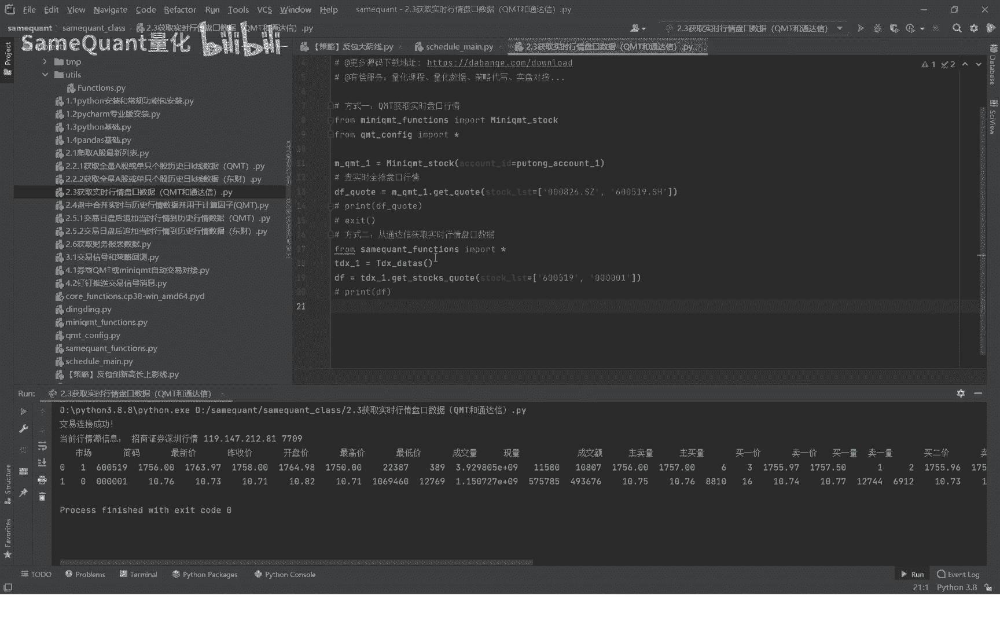