# 2.4 合并实时与历史行情数据计算因子 - P1 - SameQuant量化 - BV1mZ421x7sC

大家好，这期分享盘中合并实时与历史行情数据，并用于计算这个因子或者是交易信号，那首先第一步是导入我们这个k mt交易所，需要的一个包啊，以及方法和函数，当然前提是你在本机需要登录这个k mt软件哈。

因为是涉及到要合并历史与实时行情数据，所以说我们第一步是要下，先下载历史行情数据，在前期的一个课程中，我们也分享过，这里再重新演示一下，下载某一只个股的一个历史行情数据，就是运行这个函数或方法。

你就这样运行一下就OK了，他就下载完了，下载完之后呢，我们这个就可以先注释掉了，接下来呢下载之后，我们要读取下载到本机的这个历史行情数据，然后读取了UMP的历史行情数据之后，我们还可以怎么样。

还可以存储到本机我们自定义的一个文件夹下。

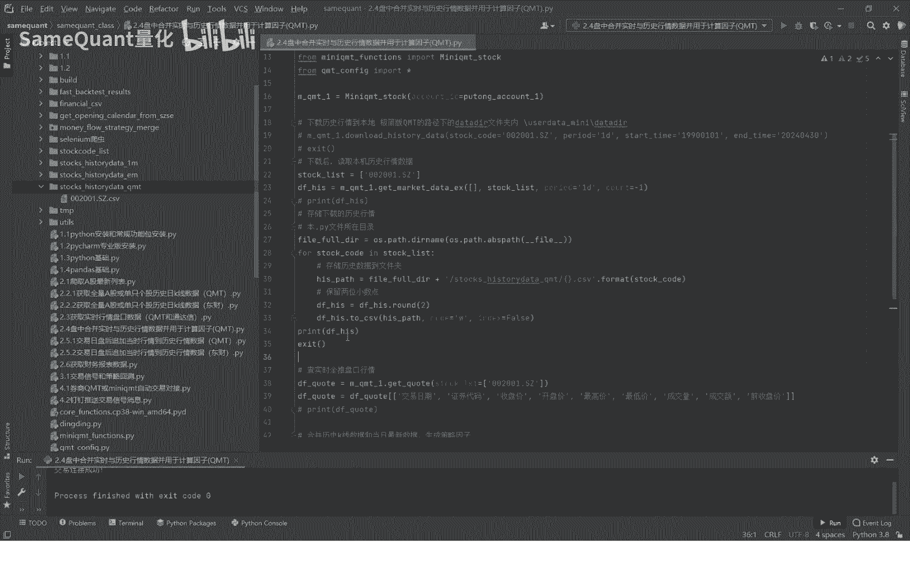

比如说我们自定义的文件夹，下面这个history DQ m t这个文件夹下面，我们运行一下好，我们可以看到这支票的历史行情数据，已经全部都打印出来了，并且它存储到了本机，当然我们看到历史行情数据。

你看这个日期你会发现有问题的，它对它是不是所有的。

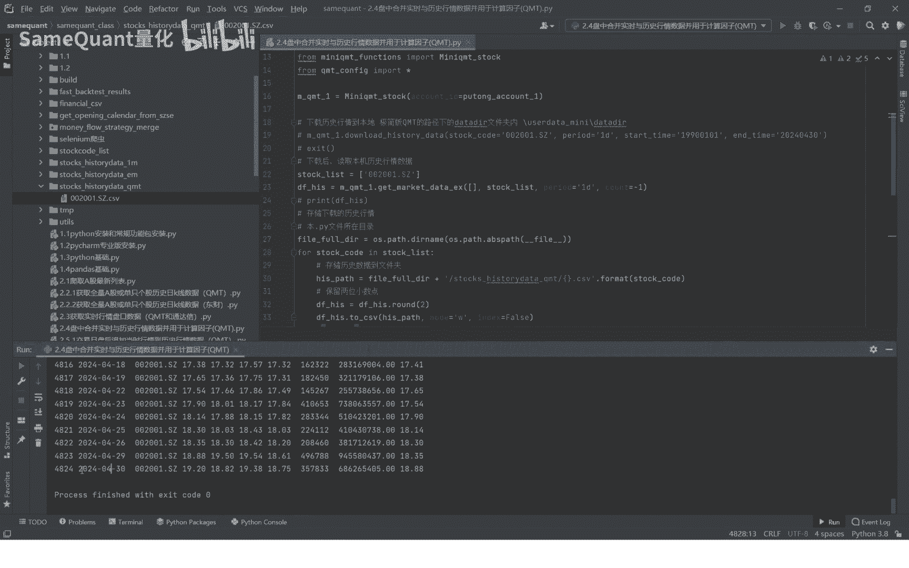

我们去检查一下什么问题呢，啊这问题出在这这里，首先这个日期是没有对日期，我们这个结束日期应该是今天我们就改一下。

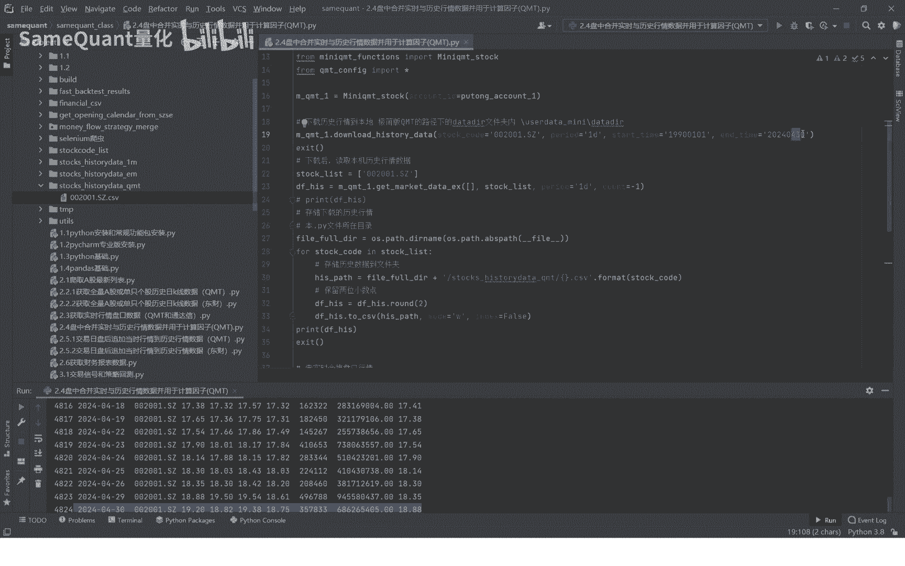

再运行一下，下载历史行情数据好，接着下载完之后，我们就可以先注销掉了，我们在读取本地的历史行情数据。

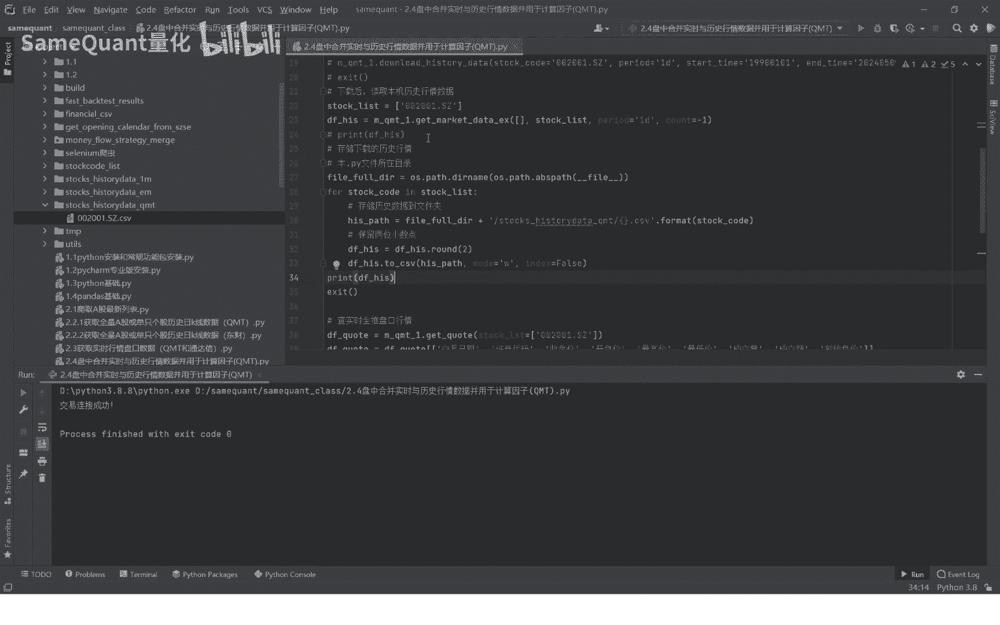

然后另另存到这个里面文件夹里内，好运行下。

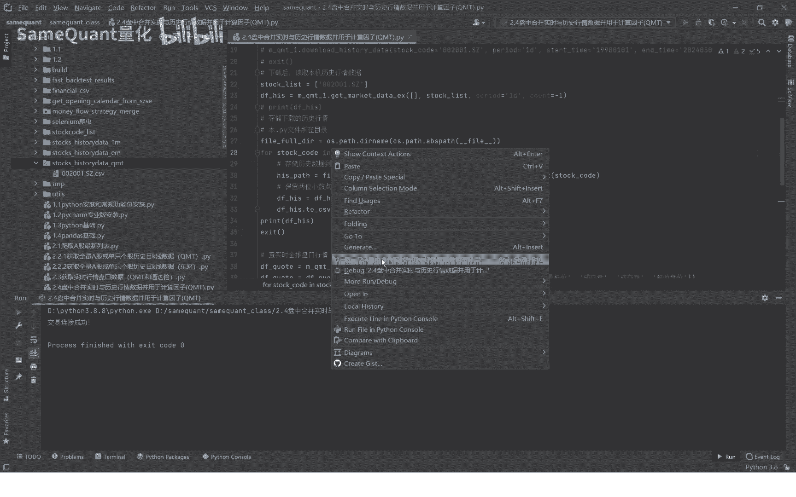

我们可以看到这个历史行情数据已经，这里已经包含全部到了，这里也下载到了。

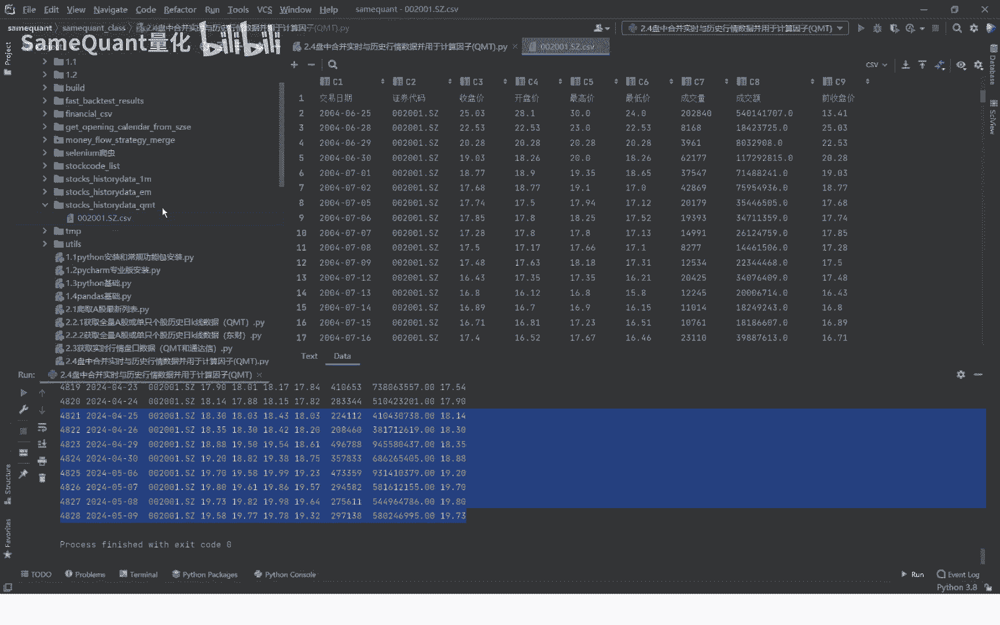

怎么拉到最后看一下啊，也是最新的一个数据字段，就是这些交易日期代码，周开多盘价开高，收入低，也就成交量，成交额前收盘价好，接下来就到了一个计算支持信号的一个环节。

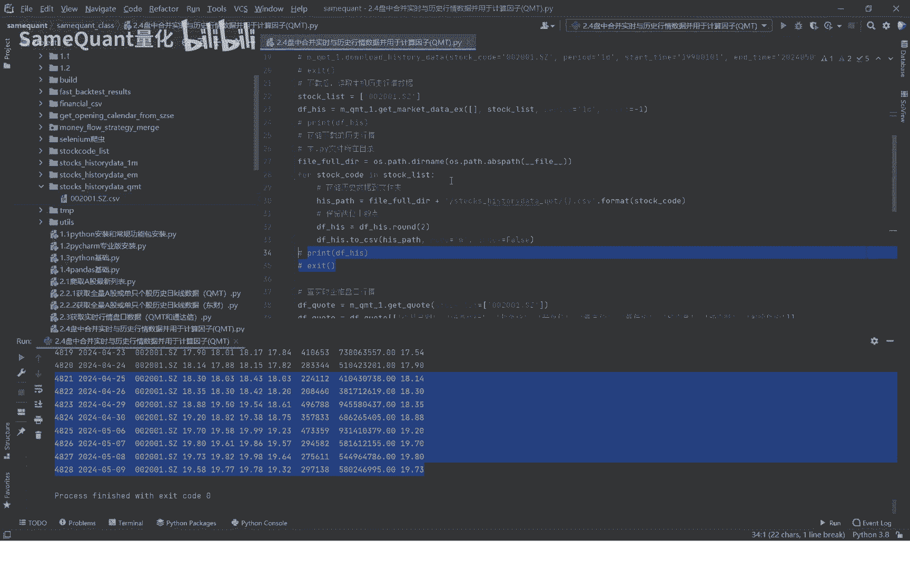

那么这段时信号之前呢，我们先获取实时行情数据，在上一节的课程，我们就已经分享了KMT的实时行情数据啊。

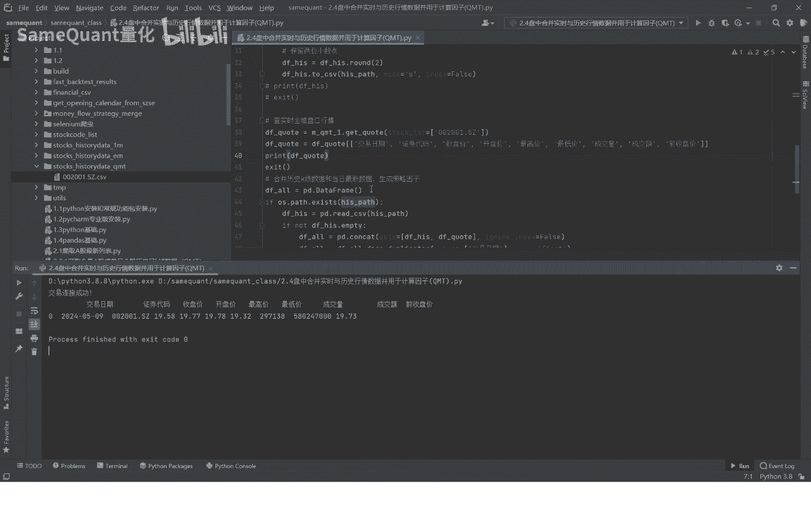

这就是实时行情数据，那为了计算信号呢，你看我这里的实时行情数据，对于字段做了一个截取，只截取什么与我们历史行情数据相同的字段，其他的我们不需要，因为其他的你因历史行情如果是多了少了。

那就没办法合并计算了，接下来呢我们要计算一个信号，这里一个简单的信号，如果说是5日均线大于10日均线，同时它5日均线且5日均线和10日均线上移，上一页，就是今天的5日均线大于昨天的5日均线。

今天十均线大于昨天10日均线，这样的话我就给他一个信号的名字，叫做均线多头好，我们这里呢首先是第一步是啊，这个是读取这次的行情，也就是我们这个文件夹这个位置读取，读取之后跟我们合并合并。

与我们最新的实时的盘口数据合并，那合并之后，那你可能就像现在你合并之后，他可能遇到有重复的，那这里呢这一句就是去从根据交易日期去除，只保留一个啊，不要因为有重复数据的话，你肯定会影响你的结计算结果的。

比如说计算5日均线时永远都会破的，驱虫之后，我们这里再重置一下这个data frame，这个表格的一个缩影，好接下来就计算5日均线，5日均线就是这个用这个收盘价605，也就是605。

也就是向前取五行作为一个命，也就是计算均价10日均线，同理均线多头的一个信号的一些条件，比如说5日均线大于10日均线，同时这个10日均线啊大于昨天的10日均线，昨天的10日均线加个C1啊。

今天的5日均线大于昨天的5日均线均线多少，好，这个计算信号的方法就写完了。

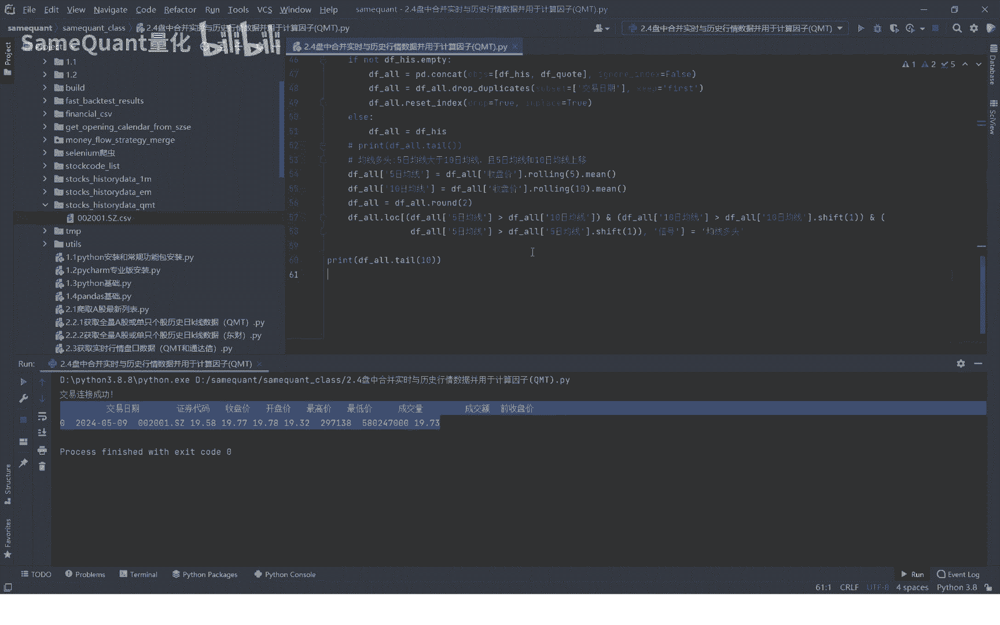

写完了，我们先进运行看一下，我们可以看一下，目前呢从最近的十条实行全部是均线多头，也就是说它全部是什么。

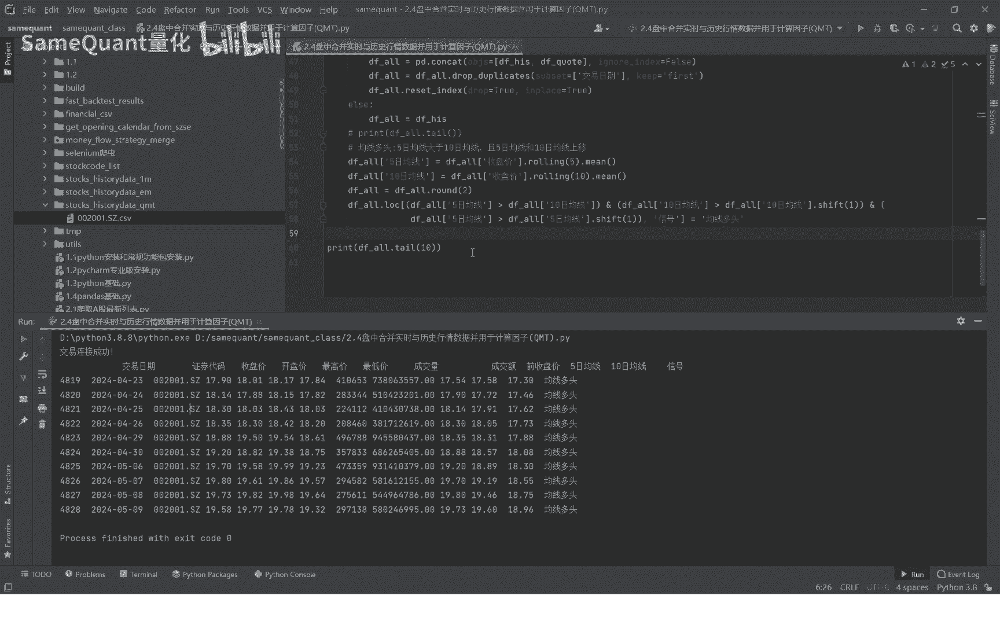

全部是符合均线多头一个条件，我们再往取20条，看看它有没有一些变化，你看取20条之后，从这天开始，他之前就不是均线多头了，他从这天开始一直是均线多头。

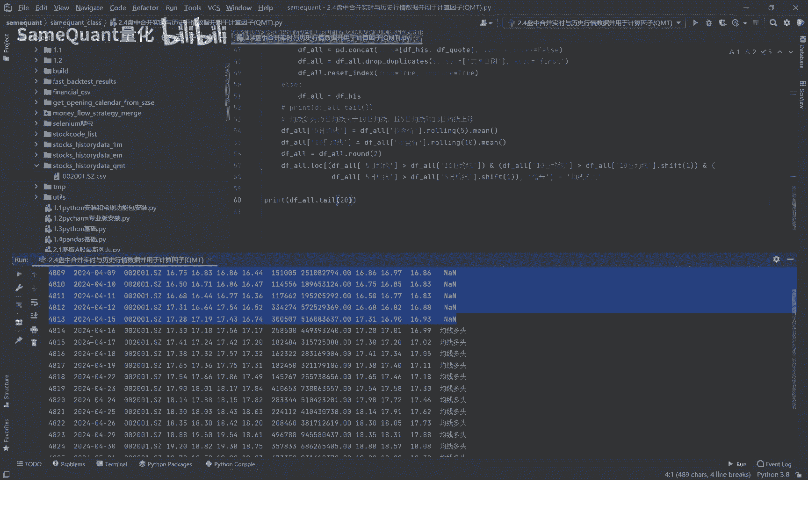

那么我们就可以把组成一个策略，当出现这个首次出现均线多头的时候，我们进行一个买入哈，这只是一个假设哈。

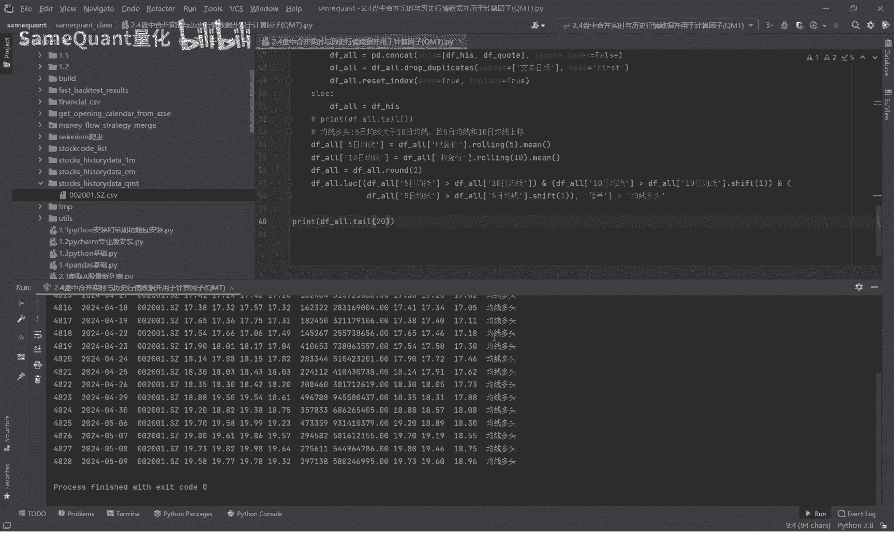

但我们实盘中交易信号不是不会如此的，简单好了。

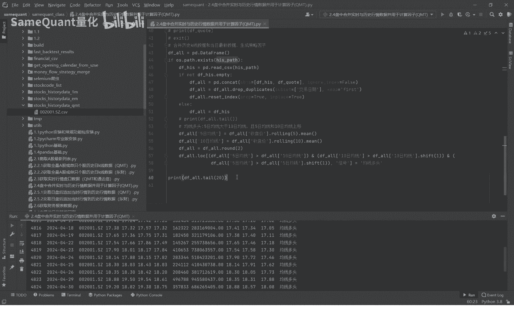